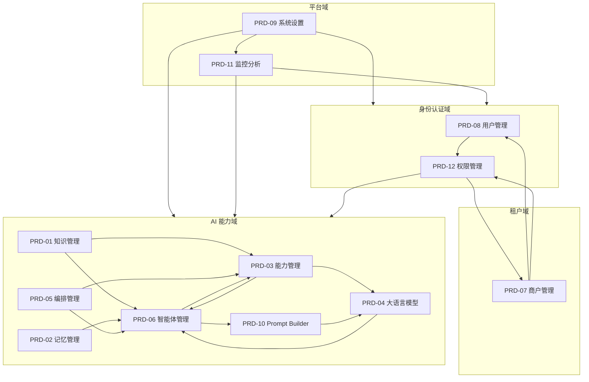
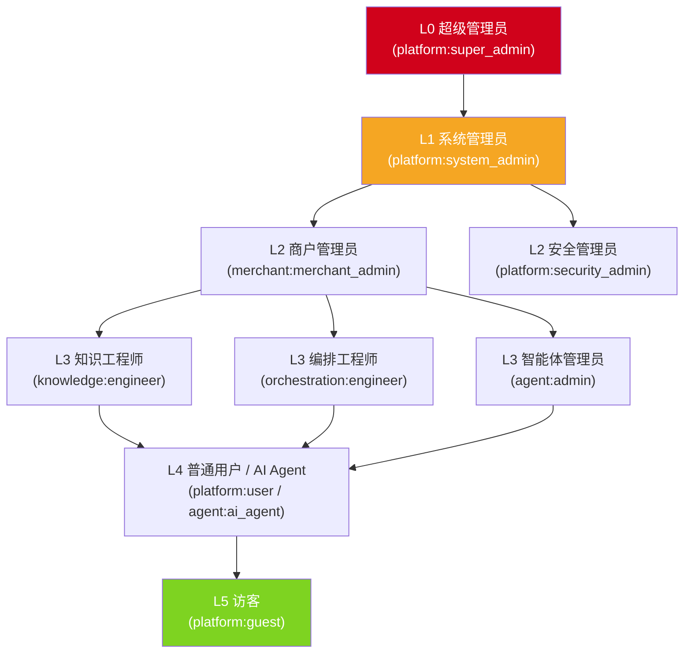
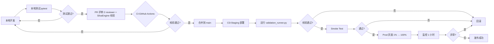

# PRD-00 平台总览与全局规范

> **版本**: V3.7（v3.7 ClickHouse 移除版 2026-06-18）
> **创建日期**: 2026-06-09
> **重构日期**: 2026-06-09
> **v3.0 收束日期**: 2026-06-13
> **v3.0 变更说明**:错误码段位增补 1101xx-1110xx Prompt 10 个子段位（详见 §5.3.2.1.1）；13 份 PRD 文档头统一刷新为 V3.0
> **v3.1 变更说明(2026-06-14)**:§3.8 租户隔离策略统一为§7.2.2"三层防护"模型；§4.7.2 outbox_events 改为复合主键(partition_key, id)；§5.4.4/§12.3 熔断参数对齐§5.4.5权威值；§3.8 Neo4j隔离策略明确为互补关系；§5.1 补充错误码二级前缀规则；§5.3.2.1 补充PRD-07 BIZ_API_KEY_*/BIZ_SUBSCRIPTION_*段位
> **v3.2 变更说明(2026-06-14)**:§7.4 补充Redis Key平台级省略规则；§5.3.2.1 BIZ_SUBSCRIPTION_*标注本期不实现；Neo4j标签Node→Entity批量校准(PRD-04/06/09)；PRD-05编排模式/状态枚举收束；PRD-07配额阈值三级体系+密码强度统一≥8位+计费本期不实现；PRD-12 P99性能指标收束
> **v3.3 变更说明(2026-06-14)**:§3.3.2 跨租户权限共享从Out-of-Scope改为本期实现；§5.4.6 补充审计日志分级保留策略；PRD-12 ABAC评估阈值≤100ms→≤10ms+补充路径说明；PRD-07跨租户白名单确认本期实现+审计分级保留+BYOK SLA量化；PRD-05 PartialSuccess补充BR-05-021；8份文档BR编号迁移声明
> **v3.4 变更说明(2026-06-14)**:PRD-05权限标识两段式→三段式批量校准(33处)+超时层级说明；PRD-12 SSD默认配置改为可配置+默认启用；PRD-04/06数据模型与DDL字段对齐表
> **v3.5 变更说明(2026-06-14)**:ISSUE-V4-001修复：§3.6 Neo4j向量约束/§7.5.4 Neo4j隔离/§15铁律第11-12条跨租户表述与PRD-12 §3.3.2白名单机制对齐；§4.7.2 outbox_events索引注释明确平台级扫描范围
> **v3.6 变更说明(2026-06-18)**:向量存储架构收束——原 Milvus 向量存储已替换为 Neo4j 5.x，Neo4j 同时承担知识图谱存储与向量检索职责（通过向量索引 + partition_key 属性过滤实现多租户隔离）；移除 Milvus 及独立 `vector_*` 连接池，合并到 `neo4j_main`；§3.6 更名为「Neo4j 向量存储使用边界规范」
> **v3.7 变更说明(2026-06-18)**:移除 ClickHouse，技术路线收束为 PostgreSQL + Neo4j。原 ClickHouse 承担的监控指标、时序数据、调用日志、审计冷备等职责全部迁移到 PostgreSQL（使用分区表）。删除 §3.7 ClickHouse 使用边界规范和 §7.5.6 时序库例外条款。补充 pg_partman 作为必需依赖声明，用于时序分区表自动管理。原 ClickHouse 的冷热分层职责由 pg_partman + tablespace 实现。
> **文档状态**: 已发布
> **适用范围**: Banyan OS 平台所有 PRD(PRD-01 ~ PRD-12)
> **设计依据**:
> - [`/Users/Garabateador/Workspace/banyan/d.md`](../d.md) 系统论 + 分层架构 + 复杂度控制 + DDD 领域驱动设计
> - **SilvaEngine 框架** [`https://github.com/ideabosque/silvaengine_base`](https://github.com/ideabosque/silvaengine_base)
> - **Graphene GraphQL** [`https://docs.graphene-python.org/en/latest/`](https://docs.graphene-python.org/en/latest/)
> - **PostgreSQL** [`https://www.postgresql.org/docs/current/`](https://www.postgresql.org/docs/current/)
> - **Neo4j** [`https://neo4j.com/docs/`](https://neo4j.com/docs/)（图谱 + 向量）

---

## 0. 文档说明

### 0.1 文档定位

本文件是 Banyan OS 平台所有 PRD 文档的**总索引与全局规范统一出口**,遵循 d.md 中"系统论 + 分层架构 + DDD 领域驱动 + 单一职责 + 高内聚低耦合"的设计原则,并以 **SilvaEngine 业务模块插件架构**作为唯一落地形态,集中定义:

1. 12 个 PRD 文档的**职责边界**与**能力归属**
2. 基于 **SilvaEngine + Graphene GraphQL + PostgreSQL + Neo4j** 的**全局架构约束**（Neo4j 同时承担知识图谱存储与向量检索职责）
3. 基于 **Graphene ObjectType / InputObjectType** 的**接口契约模板**
4. 基于 **`info.context["partition_key"]` 复合主键 `(partition_key, id)`** 的**多租户隔离基线**
5. 基于 **`config.json` 六桶结构**(`module` / `pools` / `plugins` / `settings` / `functions` / `endpoints`) 的**模块声明规范**
6. 基于 **`BIZ_<ENTITY>_<REASON>`** 错误码体系的**业务错误分类规范**
7. 基于 **in-process + `conftest.py` funnel** 的**测试规范**
8. 跨模块共享的**全局规范**(非功能、数据、缓存、安全、可观测)
9. 12 个模块的**领域关系**与**依赖拓扑**
10. **术语统一表**,确保跨模块术语一致

### 0.2 与 PRD-01 ~ PRD-12 的关系

| 关系 | 描述 |
|------|------|
| **本文件是「纲」** | 定义 SilvaEngine 全局规范与索引 |
| **PRD-01 ~ PRD-12 是「目」** | 各模块具体 GraphQL Schema / Repository / Neo4j 图谱设计 |
| **遇到冲突时** | 本文件优先;模块 PRD 引用本文件编号 |
| **新增/变更模块** | 必须先在本文件 §2 注册限界上下文,再按 §15-§17 的 SilvaEngine 业务模块规范落地 |

### 0.3 设计原则(源自 d.md + SilvaEngine)

| 原则 | 落地方式 |
|------|----------|
| 系统论(整体性) | 12 个模块构成完整平台,任何能力归属不重叠 |
| 分层架构 | Gateway 层(认证/限流/路由)→ 业务模块层(GraphQL 解析/业务逻辑)→ 数据层(ConnectionPoolManager 池) |
| **业务模块即 Plugin** | 业务模块是 Plugin,不是 Server;由 `silvaengine_base.PluginManager` 加载到运行中的 Gateway |
| **单租户单图库 + PG 复合主键** | 租户隔离通过 `partition_key` 注入 + 复合主键 `(partition_key, id)` 强制 |
| **GraphQL 单总线** | 对外 API 统一为 Graphene GraphQL,聚合多个 Entity/Repository 查询,避免 N+1 |
| 单一职责 | 一个模块只负责一类业务域 |
| 高内聚低耦合 | 模块内功能紧相关,模块间通过 GraphQL 契约 + SQS/SNS 事件交互 |
| MECE 原则 | 12 个能力域相互独立、完全穷尽 |
| DDD 领域驱动 | 限界上下文(Bounded Context)严格划分 |
| KISS / YAGNI | 不提前实现未来不确定的能力 |
| 复杂度控制 | 全局规范集中化,避免每个模块重复定义 |
| **六桶 config.json** | `module` / `pools` / `plugins` / `settings` / `functions` / `endpoints` 集中声明模块元信息 |

---

## 1. 文档总览

### 1.1 PRD 文档矩阵

| PRD | 模块名称 | 能力领域(DDD) | 层级 | 核心职责 | 一句话定位 |
|-----|----------|----------------|------|----------|------------|
| **PRD-00** | 平台总览与全局规范 | 跨域基础 | 平台层 | 全局规范、术语、领域地图 | "全平台规范统一出口" |
| **PRD-01** | 知识管理 | AI 能力域 | 核心域 | 知识/学习/类型/版本/域/Agent 关联 | "AI 的大脑记忆库" |
| **PRD-02** | 记忆管理 | AI 能力域 | 核心域 | 短期/长期记忆/提取/遗忘/跨域复制 | "AI 的会话记忆" |
| **PRD-03** | 能力管理 | AI 能力域 | 核心域 | Provider/MCP Server/Tool/Skills/AG-UI | "AI 的工具箱" |
| **PRD-04** | 大语言模型 | AI 能力域 | 基础域 | LLM 接入/调用/限流/缓存/失败转移 | "AI 的推理引擎" |
| **PRD-05** | 编排管理 | AI 能力域 | 核心域 | 工作流/Agent 协作/A2A 协议/APM | "AI 的流程调度" |
| **PRD-06** | 智能体管理 | AI 能力域 | 核心域 | Agent 生命周期/类型/模式(A2A) | "AI 的执行实体" |
| **PRD-07** | 商户管理 | 租户域 | 基础域 | 多租户/注册认证/BYOK/合规/密钥 | "租户与计费管理" |
| **PRD-08** | 用户管理 | 身份认证域 | 基础域 | 用户列表/详情/认证/MFA/会话 | "用户身份与凭证" |
| **PRD-09** | 系统设置 | 平台域 | 平台层 | 通用设置/系统级配置/导航配置 | "系统级参数配置" |
| **PRD-10** | Prompt Builder | AI 能力域 | 核心域 | 提示词模板/变量/Token/压缩/A/B/血缘 | "AI 提示词工程" |
| **PRD-11** | 监控与分析 | 平台域 | 基础域 | 监控大盘/指标/链路追踪/日志/告警 | "全平台可观测性" |
| **PRD-12** | 权限管理 | 身份认证域 | 核心域 | 角色/用户组/RBAC+ABAC/SSO/GDPR/审计 | "统一权限与合规" |

### 1.2 模块数量统计

| 指标 | 数量 |
|------|------|
| PRD 文档总数 | 13(含 PRD-00) |
| AI 能力域模块 | 7 个(PRD-01/02/03/04/05/06/10) |
| 身份认证域模块 | 2 个(PRD-08 用户、PRD-12 权限) |
| 租户域模块 | 1 个(PRD-07) |
| 平台域模块 | 2 个(PRD-09 设置、PRD-11 监控) |
| 跨域基础规范 | 1 个(PRD-00) |

### 1.3 总规模

| 指标 | 数量 |
|------|------|
| 总行数(不含 PRD-00) | 约 43,337 行 |
| 总模块数 | 12 |
| 总接口数(累计) | 1000+ |
| 总数据表数(累计) | 100+ |
| 总业务规则数(累计) | 300+ |

---

## 2. 领域模型与限界上下文

### 2.1 平台五层架构

```
┌─────────────────────────────────────────────────────────────┐
│  L1 用户交互层 (Presentation Layer)                          │
│  ├─ Web 控制台 (基于 PRD-09 导航)                            │
│  ├─ 移动端 / 桌面端                                          │
│  └─ API 网关 (OAuth 2.0 + JWT)                              │
├─────────────────────────────────────────────────────────────┤
│  L2 应用服务层 (Application Service Layer)                    │
│  ├─ API 编排(GraphQL/REST 聚合)                             │
│  ├─ 工作流引擎(编排管理 PRD-05)                              │
│  └─ 任务调度 / 消息总线                                       │
├─────────────────────────────────────────────────────────────┤
│  L3 业务领域层 (Domain Layer) ← 限界上下文边界                │
│  ┌──────────┬──────────┬──────────┬──────────┬──────────┐  │
│  │ AI能力域 │ 身份认证域│  租户域  │ 监控域  │ 设置域  │  │
│  │ PRD-01-06│ PRD-08/12│ PRD-07   │ PRD-11  │ PRD-09  │  │
│  │ PRD-10   │          │          │         │         │  │
│  └──────────┴──────────┴──────────┴──────────┴──────────┘  │
├─────────────────────────────────────────────────────────────┤
│  L4 数据持久层 (Data Persistence Layer)                      │
│  ├─ PostgreSQL 16(结构化数据)                                │
│  ├─ Neo4j 5.x(图谱 + 向量存储与检索)                         │
│  ├─ Redis 7.x(缓存/会话)                                    │
│  └─ S3 兼容对象存储(冷数据)                                  │
├─────────────────────────────────────────────────────────────┤
│  L5 基础设施层 (Infrastructure Layer)                        │
│  ├─ LLM 接入(PRD-04)                                        │
│  ├─ 第三方 MCP Server(PRD-03)                                │
│  ├─ KMS / HSM(密钥管理)                                     │
│  └─ Prometheus / Jaeger(可观测)                                            │
└─────────────────────────────────────────────────────────────┘
```

### 2.2 领域模型与限界上下文



### 2.3 限界上下文职责分配

#### 2.3.1 AI 能力域(7 个子域)

| 子域 | 上下文 | 上下游 |
|------|--------|--------|
| **PRD-01 知识** | Knowledge Context | 上游:无;下游:Agent/Capability |
| **PRD-02 记忆** | Memory Context | 上游:Agent;下游:无 |
| **PRD-03 能力** | Capability Context | 上游:无;下游:Agent/LLM |
| **PRD-04 LLM** | LLM Context | 上游:无;下游:Agent/Capability |
| **PRD-05 编排** | Orchestration Context | 上游:无;下游:Agent/Capability |
| **PRD-06 智能体** | Agent Context | 上游:Knowledge/Capability/LLM/Memory;下游:无 |
| **PRD-10 Prompt** | Prompt Context | 上游:Agent;下游:LLM |

#### 2.3.2 身份认证域(2 个子域)

| 子域 | 上下文 | 上下游 |
|------|--------|--------|
| **PRD-08 用户** | Identity Context | 上游:商户;下游:权限 |
| **PRD-12 权限** | Authorization Context | 上游:用户/商户;下游:所有业务域 |

#### 2.3.3 租户域(1 个子域)

| 子域 | 上下文 | 上下游 |
|------|--------|--------|
| **PRD-07 商户** | Tenant Context | 上游:无;下游:用户/权限/所有业务域(提供 tenant_id) |

#### 2.3.4 平台域(2 个子域)

| 子域 | 上下文 | 上下游 |
|------|--------|--------|
| **PRD-09 设置** | System Config Context | 上游:无;下游:所有模块(读配置) |
| **PRD-11 监控** | Observability Context | 上游:无;下游:所有模块(推送指标) |

### 2.4 关键决策:权限管理归并

> **决策**:将原 PRD-08(用户管理)中的角色管理、用户组管理、SSO、GDPR、密码策略、权限诊断相关内容,**全部归并**到 PRD-12(权限管理)
>
> **理由**:
> 1. 角色、用户组、SSO、GDPR、密码策略本质是**权限与认证**的一部分,不属于"用户基础信息管理"
> 2. PRD-08 当前 25+ 章、4783 行,严重违反 d.md"单一职责"原则
> 3. PRD-12 已经有完整的 RBAC+ABAC+审计体系,天然容纳这些能力
> 4. 重组后 PRD-08 仅保留"用户基本信息 + 认证 + MFA + 会话",回归核心

**迁移清单**:

| 原 PRD-08 章节 | 主题 | 迁移目标 |
|----------------|------|----------|
| §4.4 角色管理 | 角色 CRUD/继承/复制 | **PRD-12 §8.2 租户业务角色** |
| §4.5 角色层级继承 | 角色继承 DAG/DFS | **PRD-12 §8.2.5 DFS 检测** |
| §4.6 SSD/DSD | 互斥约束 | **PRD-12 §8.2.4 字段定义 mutex_role_ids** |
| §4.7 权限批量配置 | 矩阵 | **PRD-12 §8.4 权限矩阵** |
| §4.8 角色复制模板 | 角色模板 | **PRD-12 §8.2 角色复制** |
| §4.9 用户组管理 | 用户组 CRUD | **PRD-12 §8.11 用户组** |
| §4.10 批量成员导入 | 组成员管理 | **PRD-12 §8.11.3** |
| §4.11 用户组层级 | 嵌套 | **PRD-12 §8.11.3** |
| §4.12 用户组权限 | 组权限 | **PRD-12 §8.11.2** |
| §4.13 用户与商户 | 关联 | **PRD-07 §11**(在 PRD-07 中描述) |
| §4.14 用户认证与安全 | 认证/MFA | **PRD-08 保留 + PRD-12 §8.10 MFA** |
| §17 权限查询与诊断 | 诊断 | **PRD-12 §8.7 权限诊断** |
| §18 全局安全规范 | PII/HSM/审计 | **PRD-00 §9 全局安全基线** |
| §19 密码策略升级 | 密码策略 | **PRD-12 §13.1.1 密码策略** |
| §20 OAuth/OIDC/SAML | SSO | **PRD-12 §8 认证安全 + §13.1.2** |
| §21 GDPR/CCPA | 合规 | **PRD-12 §13.3 + §16 错误码** |
| §22 跨域记忆保护 | 跨域 | **PRD-02 §6 跨域复制** |
| §23 MFA 强制 | MFA | **PRD-12 §8.10 MFA** |
| §24 会话固定 | 会话 | **PRD-12 §13.5 会话安全** |
| §25 CSRF/CORS | 防护 | **PRD-00 §9 全局安全基线** |

### 2.5 关键决策:系统设置瘦身

> **决策**:将原 PRD-09(系统设置)中"ABAC 策略管理"、"数据权限"、"权限审批工作流"、"全局接口规范"、"错误码体系"、"Redis Key 规范"、"Neo4j 隔离"、"链路追踪"、"告警分级"、"GDPR 合规"等内容,**全部迁移**
>
> **理由**:
> 1. PRD-09 当前 30+ 章、4741 行,严重跨域
> 2. ABAC 策略、数据权限、权限审批 - 属于权限域,归 PRD-12
> 3. 全局规范 - 归 PRD-00
> 4. 重组后 PRD-09 仅保留"系统级配置"+"导航配置"

**迁移清单**:

| 原 PRD-09 章节 | 主题 | 迁移目标 |
|----------------|------|----------|
| §4.6-4.14 安全设置(规则/模板/审计) | 安全规则 | **PRD-12 §8.5 ABAC + §8.8 审计** |
| §4.15-4.19 ABAC 策略管理 | ABAC | **PRD-12 §8.5 ABAC 策略管理** |
| §4.20-4.22 数据权限 | 数据范围 | **PRD-12 §5.5 数据权限模型** |
| §4.23-4.26 权限审批 | 审批流 | **PRD-12 §8.9 权限申请审批** |
| §4.27 ABAC 评估流程 | 决策 | **PRD-12 §5.4 混合决策模型** |
| §11 模块关系总览 | 关系图 | **PRD-00 §2.2 领域模型** |
| §13 接口规范汇总 | RESTful | **PRD-00 §4 全局接口规范** |
| §14 权限查询与诊断 | 诊断 | **PRD-12 §8.7** |
| §15 全局导航模块权限矩阵 | 矩阵 | **PRD-12 §7 权限矩阵** |
| §17 全局非功能需求配置 | NFR | **PRD-00 §6 全局非功能需求基线** |
| §18 全局接口规范配置 | 接口 | **PRD-00 §4 全局接口规范** |
| §21 统一资源命名 | RESTful | **PRD-00 §4.1** |
| §22 统一权限标识 | 权限标识 | **PRD-00 §5.1 权限标识规范** |
| §23 统一错误码 | 错误码 | **PRD-00 §5 全局错误码体系** |
| §24 统一分页 | 分页 | **PRD-00 §4.6 分页规范** |
| §25 统一缓存 | 缓存 | **PRD-00 §7 全局缓存规范** |
| §26 Redis Key 命名 | Redis | **PRD-00 §7.4 Redis Key 规范** |
| §27 Neo4j 多租户 | Neo4j | **PRD-00 §7.5 Neo4j 隔离** |
| §28 链路追踪选型 | Tracing | **PRD-00 §10.2 链路追踪** |
| §29 告警分级 | 告警 | **PRD-11 §4.6 + PRD-00 §10.3 告警基线** |
| §30 GDPR/CCPA | 合规 | **PRD-00 §9.5 GDPR/CCPA 基线** |

---

## 3. 全局架构(SilvaEngine 插件化部署)

### 3.1 SilvaEngine 五层部署架构

```
┌──────────────────────────────────────────────────────────────────────┐
│ L0 客户端接入层                                                        │
│  ├─ Web 控制台(React / Vue)                                            │
│  ├─ 移动端 / 桌面端                                                     │
│  └─ GraphQL Playground / Altair(开发)                                  │
└──────────────────────────────────────────────────────────────────────┘
                                  │ HTTPS / WSS
┌──────────────────────────────────────────────────────────────────────┐
│ L1 API Gateway 层(平台统一,业务模块不可见)                              │
│  ├─ AWS API Gateway / 自建 Nginx                                       │
│  ├─ TLS 终止 / 限流 / 熔断                                              │
│  ├─ JWT 解析 → 注入 `partition_key` 到 `info.context`                  │
│  ├─ OpenTelemetry 链路起点                                              │
│  └─ Lambda 路由到 `silvaengine_base.lambda_handler`                    │
└──────────────────────────────────────────────────────────────────────┘
                                  │ Lambda Invoke
┌──────────────────────────────────────────────────────────────────────┐
│ L2 SilvaEngine Runtime(平台统一,业务模块不可见)                          │
│  ┌──────────────────────────────────────────────────────────────┐    │
│  │ silvaengine_base(运行时)                                       │    │
│  │  ├─ PluginManager:加载所有 `config.json` 注册的插件           │    │
│  │  ├─ Lambda 入口:`Handler.new_handler(event, context)`         │    │
│  │  ├─ CircuitBreaker / 熔断 / 降级                              │    │
│  │  └─ EventBridge / SQS 事件分发                                 │    │
│  └──────────────────────────────────────────────────────────────┘    │
│  ┌──────────────────────────────────────────────────────────────┐    │
│  │ silvaengine_connections(资源池)                                │    │
│  │  ConnectionPoolManager().connection("<pool>")                  │    │
│  │  ├─ postgres_main / postgres_audit / postgres_<module>          │    │
│  │  ├─ neo4j_main / neo4j_<module>                                │    │
│  │  ├─ boto3_main(用于 DynamoDB:Config/Function/Endpoint Model)   │    │
│  │  └─ httpx_<external>(用于 LLM / 第三方 API)                    │    │
│  └──────────────────────────────────────────────────────────────┘    │
│  ┌──────────────────────────────────────────────────────────────┐    │
│  │ silvaengine_dynamodb_base(配置与路由表)                        │    │
│  │  ├─ ConfigModel(运行时设置,setting_id → variables)             │    │
│  │  ├─ FunctionModel(Lambda 注册,aws_lambda_arn + function)        │    │
│  │  └─ EndpointModel(endpoint_id → special_connection)             │    │
│  └──────────────────────────────────────────────────────────────┘    │
└──────────────────────────────────────────────────────────────────────┘
                                  │ 调用
┌──────────────────────────────────────────────────────────────────────┐
│ L3 业务模块层(Graphene GraphQL 插件,12 个 PRD)                          │
│  ┌──────────┬──────────┬──────────┬──────────┬──────────┬──────────┐  │
│  │ PRD-01   │ PRD-02   │ PRD-03   │ PRD-04   │ PRD-05   │ PRD-06   │  │
│  │ Knowledge│ Memory   │ Capabil. │ LLM      │ Orchestr.│ Agent    │  │
│  ├──────────┼──────────┼──────────┼──────────┼──────────┼──────────┤  │
│  │ PRD-07   │ PRD-08   │ PRD-09   │ PRD-10   │ PRD-11   │ PRD-12   │  │
│  │ Merchant │ User     │ Setting  │ Prompt   │ Monitor  │ Perm     │  │
│  └──────────┴──────────┴──────────┴──────────┴──────────┴──────────┘  │
│  每个模块均按 §15-§17 模板:                                             │
│  ├─ schema.py(Graphene schema 入口)                                    │
│  ├─ types/(ObjectType / InputObjectType / EnumType)                    │
│  ├─ queries/(Query 解析器)                                            │
│  ├─ mutations/(Mutation 解析器)                                       │
│  ├─ models/(SQLAlchemy + composite PK (partition_key, id))             │
│  ├─ repositories/(PostgreSQL 访问层,partition_key 隔离)               │
│  ├─ graph/(Neo4j 图谱访问,partition_key 隔离)                             │
│  ├─ services/(业务逻辑、领域服务)                                      │
│  ├─ exceptions.py(BusinessModuleError + BIZ_* 错误码)                 │
│  └─ config.json(六桶结构)                                              │
└──────────────────────────────────────────────────────────────────────┘
                                  │ ConnectionPoolManager
┌──────────────────────────────────────────────────────────────────────┐
│ L4 数据持久层                                                           │
│  ├─ PostgreSQL 16(结构化主数据,composite PK (partition_key, id))      │
│  ├─ Neo4j 5.x(图谱 + 向量,单租户单图库,partition_key 节点属性 + WHERE 子句隔离)│
│  ├─ Redis 7.x(缓存/会话/限流)                                          │
│  ├─ S3 兼容对象存储(冷数据)                                            │
└──────────────────────────────────────────────────────────────────────┘
                                  │
┌──────────────────────────────────────────────────────────────────────┐
│ L5 基础设施层                                                           │
│  ├─ LLM 接入(PRD-04,通过 `httpx_<provider>` 池)                        │
│  ├─ 第三方 MCP Server(PRD-03,通过 `httpx_mcp` 池)                      │
│  ├─ KMS / HSM(密钥管理,通过 `boto3_kms` 池)                           │
│  └─ Prometheus / Jaeger / OpenTelemetry Collector                            │
└──────────────────────────────────────────────────────────────────────┘
```

### 3.2 业务模块 Plugin 边界规则

> **铁律**:业务模块是 **Plugin**,不是 **Server**。业务模块**不**直接绑定 HTTP / 启动后台线程 / 读环境变量,**只能**通过 `silvaengine_base` 提供的 `info.context` 注入与 `ConnectionPoolManager().connection("<pool>")` 访问资源。

| 关注点 | Owner | 业务模块**不得**做 |
|--------|-------|---------------------|
| 认证 | Gateway(`silvaengine_base`) | 验证 Token、解码 JWT、存储 Session |
| 鉴权 | Gateway | 强制 RBAC、检查权限 |
| 限流 | Gateway | 限制 QPS |
| 路由 | Gateway | 路由 HTTP / WebSocket 流量 |
| 资源生命周期 | Gateway(`PluginManager`) | 创建 DB 客户端、管理池 |
| 配置加载 | Gateway | 读环境变量、Secrets |
| 插件管理 | Gateway | 注册 / 初始化插件 |
| 资源池接线 | Gateway | 创建池、调用 `init()` |
| 领域逻辑 | **业务模块** | — |
| 数据校验 | **业务模块** | — |
| GraphQL 类型 / 解析器 | **业务模块** | — |
| 业务异常 | **业务模块** | — |
| PostgreSQL / Neo4j 访问 | **业务模块(通过注入的池)** | 创建 engine、session |

### 3.3 模块依赖图

| 上游模块 | 下游模块 | 依赖内容 |
|----------|----------|----------|
| PRD-00 | 所有 | 全局规范 |
| PRD-07 商户 | PRD-08 用户、PRD-12 权限 | 提供 `partition_key`(经由 Gateway 注入) |
| PRD-08 用户 | PRD-12 权限 | 提供 `user_id` |
| PRD-09 设置 | 所有 | 读系统配置(`ConfigModel.find(setting_id=...)`) |
| PRD-11 监控 | 所有 | 接收指标 / 日志 / Trace |
| PRD-12 权限 | 所有业务模块 | 鉴权决策(由 Gateway 拦截) |
| PRD-04 LLM | PRD-03 能力、PRD-06 智能体、PRD-10 Prompt | 模型调用(`httpx_<provider>` 池) |
| PRD-03 能力 | PRD-06 智能体 | 提供 Tool |
| PRD-08 用户 | PRD-03 能力 | 提供用户上下文(调用者身份/权限属性) |
| PRD-11 监控 | PRD-03 能力 | 接收 MCP/Tool 指标与 Trace |
| PRD-12 权限 | PRD-03 能力 | 能力访问鉴权(Tool/Skill 权限控制) |
| PRD-01 知识 | PRD-06 智能体 | 知识检索 |
| PRD-02 记忆 | PRD-06 智能体 | 记忆读写 |
| PRD-10 Prompt | PRD-04 大语言模型 | 提示词组装与变量渲染 |
| PRD-05 编排 | PRD-06 智能体、PRD-03 能力 | 工作流调度 |
| PRD-11 监控 | PRD-05 编排 | 故障定位反馈（基于链路追踪数据回溯工作流异常根因） |
| PRD-11 监控 | PRD-06 智能体 | 故障定位反馈（基于链路追踪数据回溯 Agent 执行异常根因） |

### 3.4 关键依赖约束(SilvaEngine 强化版)

> **强约束**(必须遵守)
> 1. 任何业务模块**不得**自行启动 HTTP Server / 后台线程 / Celery Worker
> 2. 任何业务模块**不得**直接读 `os.environ` / `os.getenv`;配置必须经 `ConfigModel.find(setting_id=...)` 注入
> 3. 任何业务模块**不得**使用 `requests` / `httpx` / `aiohttp` / `urllib` / `psycopg2` / `psycopg` / `asyncpg` / `neo4j.GraphDatabase` / `boto3.client(...)` 等原始驱动;**只能**通过 `ConnectionPoolManager().connection("<pool>")` 访问
> 4. 任何业务模块**不得**在 GraphQL 输出类型中暴露 `partition_key` / `password` / `secret` / `api_key` / `token`
> 5. 任何业务模块的解析器**不得**接受 `partition_key` 作为入参;只能从 `info.context["partition_key"]` 读取
> 6. 任何跨模块调用必须记录 OpenTelemetry `traceId`,通过 W3C `traceparent` 头传播
> 7. 任何 SQLAlchemy 模型的**主键必须**为复合主键 `(partition_key, id)`;任何 JSONB 字段必须配套 PG 触发器 `set_partition_key`
> 8. 任何 Neo4j 节点必须含 `partition_key` 属性;任何 Cypher 查询必须以 `WHERE n.partition_key = $partitionKey` 开头

> **弱约束**(推荐遵守)
> 1. 模块内部状态变更通过 SQS/SNS 事件总线广播
> 2. 高频读路径(权限 / 配置)使用 L1 + L2 + Redis 三级缓存
> 3. 大模型调用走 PRD-04 统一代理(`httpx_<provider>` 池 + CircuitBreaker)

### 3.5 Neo4j 使用边界规范

Neo4j 作为图数据库，仅用于以下四类场景，**禁止**用于业务数据主存储、高频写入或事务性操作：

| 场景 | 适用模块 | 说明 |
|------|----------|------|
| 关系图谱查询 | PRD-12 | 组织架构、角色继承DAG、用户组关系 |
| 血缘/影响分析 | PRD-01、PRD-10 | 知识引用链、模板血缘、跨域引用发现 |
| 实体关联发现 | PRD-03、PRD-06 | Agent-Capability-Tool 关联、知识-记忆跨域引用 |
| 组织架构与用户关系 | PRD-07、PRD-08 | 商户-用户层级关系、角色继承图谱、部门组织结构等需要多层级路径查询的场景 |

**约束规则**：

1. Neo4j 中的数据必须与 PostgreSQL 保持最终一致性，双写统一使用 Outbox Pattern（见 §4.7）
2. 禁止业务代码直连 Neo4j 执行写操作，统一通过 SilvaEngine Runtime 的 `GraphSyncService` 同步
3. 所有 Cypher 查询必须包含 `WHERE n.partition_key=$partitionKey`，由框架层自动注入
4. Neo4j 单次查询耗时不得超过 500ms，超时自动降级返回空结果并触发告警
5. Neo4j 不可用时，相关功能降级到 PostgreSQL 查询（如角色继承降级到递归 CTE），不阻塞主流程

#### 3.5.5 基础标签命名规范(P1-5)

> **本节迁移自**: PRD-01 §7.3、PRD-12 §5.2
> **强制级别**: P0,所有 Neo4j 节点标签必须遵循

所有 Neo4j 节点必须包含 `{ModuleEntity}Entity` 基础标签,格式: `<模块名首字母大写>Entity`,例:

- 知识管理: `KnowledgeEntity`
- 记忆管理: `MemoryEntity`
- 能力管理: `CapabilityEntity`
- 编排管理: `OrchestrationEntity`
- 智能体管理: `AgentEntity`
- 商户管理: `MerchantEntity`
- 用户管理: `UserEntity`
- 权限管理: `PermEntity`

同时必须包含 `Graph` 标签(PK 为 `partition_key`),租户隔离通过 Cypher WHERE 子句的 `partition_key` 参数过滤。

### 3.6 Neo4j 向量存储使用边界规范

Neo4j 5.x 同时承担知识图谱存储与向量检索职责（图谱存储见 §3.5），其向量检索能力仅用于以下场景，**禁止**将向量索引用于非向量数据的存储或全文检索：

| 场景 | 适用模块 | 说明 |
|------|----------|------|
| 知识 Embedding 检索 | PRD-01 | 知识条目的语义相似度搜索，支持混合检索（向量 + 标量过滤） |
| 记忆 Embedding 检索 | PRD-02 | 长期记忆的语义召回，按时间窗口与相关性联合排序 |
| Skill 语义匹配 | PRD-03 | Agent 能力与用户意图的语义匹配，支持 top-k 召回 + 重排序 |

**约束规则**：

1. Neo4j 中的向量索引（vector index）必须按 `partition_key` 属性过滤实现多租户隔离，向量索引名称格式保持 `{tenant_id}_{domain_type}_{domain_id}`，**禁止**未经白名单授权的跨租户查询（跨租户只读访问需经 PRD-12 §3.3.2 白名单机制审批）
2. 禁止业务代码直连 Neo4j 执行向量写操作，统一通过 SilvaEngine Runtime 的 `VectorSyncService` 同步
3. 所有向量写入必须与 PostgreSQL 主数据保持最终一致性，双写统一使用 Outbox Pattern（见 §4.7）
4. Neo4j 向量查询耗时不得超过 200ms，超时自动降级返回空结果并触发告警
5. Neo4j 向量索引不可用时，相关功能降级到 PostgreSQL 全文搜索（如知识检索降级到 `ts_vector` 匹配），不阻塞主流程
6. 全局默认 Embedding 模型由系统设置（PRD-09）配置，所有模块的向量入库和语义检索必须使用同一 Embedding 模型和维度
7. 跨模块语义关联检索（如知识-记忆关联查询）要求两模块使用相同向量空间
8. Embedding 模型变更时需触发全量向量重建

### 3.7 多租户隔离统一策略

各存储引擎的多租户隔离方式统一如下，业务代码不得自行实现隔离逻辑：

| 存储引擎 | 隔离方式 | 实现层 | 业务代码要求 |
|----------|----------|--------|-------------|
| PostgreSQL | RLS (Row Level Security) + 应用层双重防护 | SilvaEngine 框架层自动注入 + 应用层 Repository | **三层防护模型**：(1) 复合主键 `(partition_key, id)` 物理隔离；(2) 应用层 Repository **必须**显式带 `WHERE partition_key = ?`（代码审查硬性要求，见 §7.2.2 铁律）；(3) RLS Policy 自动过滤作为运行时兜底。SilvaEngine 框架层在每次请求事务开始时自动执行 `SET LOCAL app.current_tenant_id = '{tenant_id}'`，但应用层仍须显式带 WHERE 条件作为防御性编程。所有租户范围表必须启用 RLS，DDL 标准模板见下方。 |
| Neo4j | 单图 + `WHERE n.partition_key=$partitionKey` 过滤模式 | SilvaEngine `GraphSyncService` + 应用层 | 禁止使用多数据库（`CREATE DATABASE`）进行租户隔离，统一在单一图中通过 partition_key 属性过滤实现隔离。所有节点和关系必须包含 partition_key 属性，查询时**必须**附加 `WHERE n.partition_key=$partitionKey` 条件（代码审查硬性要求，见 §7.3.3 铁律）。框架层（SilvaEngine `GraphSyncService`）自动注入 partitionKey 参数作为运行时兜底，但应用层仍须显式编写 WHERE 条件作为防御性编程（与 PostgreSQL 三层防护模型同构）。 |
| Neo4j（向量） | 向量索引（vector index）+ partition_key 属性过滤 | SilvaEngine `VectorSyncService` | 禁止跨租户向量查询，所有向量索引必须归属于对应租户的 partition_key。框架层（SilvaEngine）自动注入 partition_key 参数作为向量查询过滤条件。 |
| Redis | Key 前缀 `{scope}:{tenant_id}:{module}:{entity}:{id}[:{sub}]`（详见 §7.4） | SilvaEngine `TenantContext` 中间件自动注入 | 禁止手写 Key 前缀，使用框架层 `cache_key()` 函数生成 |
| S3/对象存储 | 路径前缀 `/{partition_key}/{module}/` | SilvaEngine `StorageService` 自动注入 | 禁止硬编码路径，使用框架层 `storage_path()` 函数生成 |

**PostgreSQL RLS DDL 标准模板**：

```sql
-- RLS Standard Template (Applied to all tenant-scoped tables)
ALTER TABLE {table_name} ENABLE ROW LEVEL SECURITY;

CREATE POLICY tenant_isolation_{table_name} ON {table_name}
  USING (partition_key = current_setting('app.current_tenant_id', TRUE));

-- Superuser bypass: RLS policies do not apply to table owners or superusers
-- Framework layer (SilvaEngine) automatically injects partition_key via:
--   SET LOCAL app.current_tenant_id = '{tenant_id}';
-- at the start of each request transaction
-- Note: RLS uses partition_key column (not tenant_id), consistent with composite PK (partition_key, id)
```

**框架层职责**：SilvaEngine `TenantContext` 中间件在每个请求入口自动解析并注入 `tenant_id`，业务模块通过 `get_tenant_id()` 获取当前租户ID，无需从请求参数中手动提取。

---

## 4. 全局接口规范(Graphene GraphQL 单总线)

> **适用范围**:所有 PRD 文档中定义的对外 API
> **强制级别**: P0,所有模块必须遵循
> **本章节迁移自**: PRD-01 §13、PRD-03 §15、PRD-08 §15、PRD-09 §13/§18、PRD-10 §10、PRD-11 §10
> **架构选择**:全部对外 API 统一为 **Graphene Python GraphQL**(`https://docs.graphene-python.org/en/latest/`);RESTful 不再作为业务模块的对外协议,仅作为 Gateway 与客户端的底层转发协议

### 4.1 GraphQL Schema 命名规范

#### 4.1.1 ObjectType 命名规则

| 规则 | 说明 | 示例 |
|------|------|------|
| PascalCase + Entity 名 | 表示返回实体 | `KnowledgeType`、`MemoryType`、`AgentType` |
| 列表返回 | 字段名使用复数或带 `List` 后缀 | `knowledges: List[KnowledgeType]` |
| 单条查询字段 | 字段名使用单数 | `knowledge(knowledge_id: ID!): KnowledgeType` |
| 详情前缀 | 详情查询使用 `<entity>`(单数) | `agent`、`user`、`role` |
| 操作类型后缀 | 区分类型用途 | `Type` / `Input` / `Enum` / `Connection` / `Edge` / `PageInfo` |

#### 4.1.2 InputObjectType 命名规则

| 规则 | 说明 | 示例 |
|------|------|------|
| `<Entity>Input` 模板 | 创建/更新入参 | `KnowledgeCreateInput`、`MemoryUpdateInput` |
| `<Entity>Filter` 模板 | 列表查询过滤 | `KnowledgeFilterInput` |
| `<Entity>Order` 模板 | 排序参数 | `KnowledgeOrderInput` |
| `<Entity>Page` 模板 | 分页参数 | `KnowledgePageInput` |
| `<Entity>IdInput` 模板 | 单 ID 引用 | `KnowledgeIdInput` |

#### 4.1.3 Query / Mutation 命名规范

| 操作类型 | 命名规则 | 示例 |
|----------|----------|------|
| **Query 列表** | `<entities>(filter, first, after, orderBy): [<Entity>Connection!]!` | `knowledges`, `memories`, `agents` |
| **Query 详情** | `<entity>(id: ID!): <EntityType>` | `knowledge(id)`, `agent(id)` |
| **Query 搜索** | `search<Entities>(query: String!, limit: Int): [<EntityType>]` | `searchKnowledges` |
| **Mutation 创建** | `create<Entity>(input: <Entity>CreateInput!): <EntityType>!` | `createKnowledge` |
| **Mutation 更新** | `update<Entity>(id: ID!, input: <Entity>UpdateInput!): <EntityType>!` | `updateKnowledge` |
| **Mutation 删除** | `delete<Entity>(id: ID!): DeletePayload!` | `deleteKnowledge` |
| **Mutation 启用/禁用** | `enable<Entity>` / `disable<Entity>` | `enableAgent` |
| **Mutation 批操作** | `batch<Action><Entities>` | `batchImportKnowledges` |

#### 4.1.4 GraphQL Schema 命名空间与端点

| 模块 | GraphQL 端点 | Schema 标识 |
|------|--------------|-------------|
| 统一入口 | `POST /graphql` | 所有模块合并为一个 Schema |
| 模块前缀(类型名) | 不在 URL 上;通过 Type/Input 名称 | `KnowledgeType` / `MemoryType` |

> **注意**:12 个业务模块的 GraphQL Schema **合并为一个**统一入口 `/graphql`,由 SilvaEngine Gateway 路由;模块之间通过 Type/Input 名称避免冲突。合并策略见 §4.2。

#### 4.1.5 Graphene 类型与 Python 类型映射

| Python 类型 | Graphene 类型 | GraphQL 类型 | 说明 |
|-------------|---------------|--------------|------|
| `str` | `graphene.String()` | `String` | 文本 |
| `int` | `graphene.Int()` | `Int` | 整数 |
| `float` | `graphene.Float()` | `Float` | 浮点 |
| `bool` | `graphene.Boolean()` | `Boolean` | 布尔 |
| `UUID` | `graphene.UUID()` | `UUID` | UUID(序列化为字符串) |
| `datetime` | `graphene.DateTime()` | `DateTime` | ISO8601 字符串 |
| `dict` / `JSON` | `graphene.JSONString()` | `JSON` | JSON 对象 |
| `Enum` | `graphene.Enum(...)` | 枚举 | 自定义枚举 |
| `Decimal` | `graphene.Decimal()` | `Decimal`/字符串 | 金融数字 |
| ID | `graphene.ID()` | `ID` | GraphQL 特殊标量 |

### 4.2 Schema 合并与命名冲突

#### 4.2.1 合并策略

```python
# platform_gateway/schema.py
import graphene
from silvaengine_base.gateway import build_unified_schema
from silvaengine_modules.knowledge.schema import Schema as KnowledgeSchema
from silvaengine_modules.memory.schema import Schema as MemorySchema
from silvaengine_modules.agent.schema import Schema as AgentSchema
# ... 导入其他 9 个模块

unified_schema = build_unified_schema(
    KnowledgeSchema,
    MemorySchema,
    AgentSchema,
    # ... 其他模块
)
```

#### 4.2.2 命名冲突处理

| 冲突类型 | 处理策略 | 示例 |
|----------|----------|------|
| ObjectType 同名 | 模块代码 `<Module><Entity>Type` | `AgentUserType`(PRD-06) vs `UserType`(PRD-08) |
| Query 字段同名 | 字段名 `<module>.<entity>` | `agent.user(id)` vs `perm.user(id)` |
| 枚举值同名 | 前缀模块名 | `AGENT_STATUS_ACTIVE` vs `USER_STATUS_ACTIVE` |
| InputObjectType 同名 | 模板加实体名 | `AgentCreateInput` vs `UserCreateInput` |

### 4.3 统一 GraphQL 请求 / 响应

#### 4.3.1 请求格式

```graphql
query GetKnowledgeById($knowledgeId: ID!) {
  knowledge(id: $knowledgeId) {
    id
    code
    name
    type {
      id
      name
    }
    entities(first: 10) {
      edges {
        node {
          id
          name
          type
        }
      }
    }
    createdAt
  }
}
```

#### 4.3.2 标准响应格式

```json
{
  "data": {
    "knowledge": {
      "id": "kn_001",
      "code": "K_FAQ_001",
      "name": "FAQ 知识",
      "type": { "id": "kt_001", "name": "FAQ" },
      "entities": {
        "edges": [
          { "node": { "id": "e_001", "name": "退款", "type": "Concept" } }
        ]
      },
      "createdAt": "2026-06-09T08:30:00Z"
    }
  },
  "errors": null,
  "extensions": {
    "trace_id": "tr_abc123",
    "duration_ms": 123
  }
}
```

#### 4.3.3 错误响应格式(GraphQL Spec)

```json
{
  "data": null,
  "errors": [
    {
      "message": "知识不存在",
      "path": ["knowledge"],
      "extensions": {
        "code": "BIZ_KNOWLEDGE_NOT_FOUND",
        "error_code": "BIZ_KNOWLEDGE_NOT_FOUND",
        "http_status": 200,
        "details": { "knowledge_id": "kn_001" }
      }
    }
  ],
  "extensions": {
    "trace_id": "tr_abc123"
  }
}
```

> **SilvaEngine 约定**:**HTTP 状态码恒为 200**;业务错误通过 `errors[].extensions.code` 表达,由 Gateway 统一转换为 GraphQL `Error` 对象。

### 4.4 分页规范(Relay-Style Connection)

#### 4.4.1 必须使用 Connection 模式

```graphql
type KnowledgeConnection {
  edges: [KnowledgeEdge!]!
  pageInfo: PageInfo!
  totalCount: Int!
}

type KnowledgeEdge {
  cursor: String!
  node: KnowledgeType!
}

type PageInfo {
  hasNextPage: Boolean!
  hasPreviousPage: Boolean!
  startCursor: String
  endCursor: String
}
```

#### 4.4.2 列表查询示例

```graphql
query ListKnowledges($filter: KnowledgeFilterInput, $first: Int = 20, $after: String) {
  knowledges(filter: $filter, first: $first, after: $after) {
    edges {
      cursor
      node {
        id
        code
        name
      }
    }
    pageInfo {
      hasNextPage
      endCursor
    }
    totalCount
  }
}
```

#### 4.4.3 分页策略选型矩阵

| 场景 | 推荐 | 原因 |
|------|------|------|
| 后台管理列表 | Relay Connection(默认) | 支持游标 + 跳页 + 总数 |
| 移动端下拉加载 | Relay Connection | 游标稳定 |
| 实时日志 / 审计 | Relay Connection(增量游标) | 数据量大、实时追加 |
| 导出报表 | Offset 风格(`OffsetPageInput`) | 一次性 |

### 4.5 幂等性

- 所有 `Mutation` **必须**接受 `idempotency_key: ID!` 参数
- 同一 `idempotency_key` + 相同 GraphQL 变量 → 返回首次结果(由 `ConnectionPoolManager` 的 `idempotency_store` 池支持)
- 同一 `idempotency_key` + 不同变量 → 抛 `BIZ_<ENTITY>_IDEMPOTENCY_CONFLICT`
- 幂等键有效期 24 小时

### 4.6 限流

| 维度 | 默认值 | 超限行为 |
|------|--------|----------|
| 用户级 | 1000 QPS | 抛 `BIZ_RATE_LIMIT_EXCEEDED` |
| IP 级 | 100 QPS | 同上 |
| 租户级 | 10000 QPS | 同上 |
| 全局 | 100 万 QPS | 同上 |
| GraphQL 复杂度 | 1000(嵌套深度 ≤ 10) | 抛 `BIZ_QUERY_TOO_COMPLEX` |

> **限流**完全由 **Gateway 拦截**;业务模块**不**实现限流逻辑。

### 4.7 跨模块事务一致性规范

#### 4.7.1 核心原则

跨模块写操作**禁止**使用同步分布式事务（2PC/TCC），统一采用 **Outbox Pattern + 事件驱动** 实现最终一致性：

1. **业务数据写入 PostgreSQL** → **Outbox 表记录事件** → **事件发布器异步投递** → **消费者幂等处理**
2. PostgreSQL ↔ Neo4j 双写统一使用 Outbox + CDC，禁止业务代码直连 Neo4j 写入
3. 跨模块调用仅允许异步事件驱动，禁止同步分布式事务

#### 4.7.2 Outbox 表结构

```sql
CREATE TABLE outbox_events (
    partition_key   VARCHAR(64) NOT NULL,       -- 多租户分区键
    id              UUID NOT NULL DEFAULT gen_random_uuid(),
    aggregate_type  VARCHAR(64) NOT NULL,       -- 聚合根类型（如 'knowledge', 'agent'）
    aggregate_id    VARCHAR(128) NOT NULL,       -- 聚合根ID
    event_type      VARCHAR(128) NOT NULL,       -- 事件类型（如 'knowledge.created'）
    payload         JSONB NOT NULL,              -- 事件载荷
    created_at      TIMESTAMPTZ NOT NULL DEFAULT NOW(),
    published_at    TIMESTAMPTZ,                 -- 发布时间（NULL=未发布）
    consumed_at     TIMESTAMPTZ,                 -- 消费时间（NULL=未消费）
    idempotency_key VARCHAR(256) NOT NULL,       -- 幂等键（aggregate_type+aggregate_id+event_type+created_at_ms）
    status          VARCHAR(16) NOT NULL DEFAULT 'PENDING',  -- PENDING/PUBLISHED/CONSUMED/FAILED
    tenant_id       VARCHAR(64) GENERATED ALWAYS AS (partition_key::uuid) STORED,  -- 派生字段
    PRIMARY KEY (partition_key, id)
);

-- 消费者拉取待发布事件的索引（平台级跨租户扫描，仅限 Outbox 消费者服务账号）
CREATE INDEX idx_outbox_events_pending ON outbox_events (status, created_at) WHERE status = 'PENDING';
```

#### 4.7.3 事件格式规范

```json
{
  "event_id": "uuid",
  "event_type": "module.entity.action",
  "aggregate_type": "entity_type",
  "aggregate_id": "entity_id",
  "tenant_id": "tenant_id",
  "timestamp": "ISO8601",
  "payload": { },
  "idempotency_key": "entity_type:entity_id:action:timestamp_ms"
}
```

#### 4.7.4 消费者幂等规则

1. 消费者必须基于 `idempotency_key` 实现幂等处理，同一事件重复消费不产生副作用
2. 消费失败的事件进入死信队列（DLQ），由运维手动处理
3. 事件消费超时阈值：5分钟，超时后标记为 FAILED 并触发告警
4. Outbox 事件保留期：已消费事件保留7天后归档，未消费事件永久保留

**DLQ 自动化恢复机制**：

| 策略项 | 规则 | 说明 |
|--------|------|------|
| DLQ 告警阈值 | 单个租户 DLQ 事件数量 ≥ 10 时触发 P1 告警，≥ 50 时触发 P0 告警 | 防止 DLQ 堆积导致业务静默中断 |
| 定时自动重试 | 每30分钟扫描一次 DLQ，对失败事件自动重试投递，单次重试上限5条/租户 | 避免瞬时故障导致事件永久滞留；重试前校验目标消费者健康状态，不可用时跳过本轮 |
| 重试次数上限 | 单条 DLQ 事件最多自动重试3次，超过后标记为 `DEAD` 状态，仅支持人工介入 | 防止反复重试无效事件消耗资源 |
| DLQ 保留期 | `DEAD` 状态事件保留30天后自动清理；非 `DEAD` 状态事件保留90天后自动清理 | 平衡存储成本与审计追溯需求 |
| 清理策略 | 每日凌晨2:00（系统空闲时段）执行 DLQ 过期事件批量清理 | 减少对在线业务的影响 |

#### 4.7.5 跨模块事件清单(P1-4)

> **本节迁移自**: PRD-01 §10.2、PRD-02 §7.5、PRD-03 §12.6、PRD-05 §8.4、PRD-06 §9.5、PRD-12 §11.3
> **强制级别**: P0,所有跨模块事件必须按本清单对齐 `aggregate_type` / `event_type` / 同步目标 / 消费方

| 模块 | `aggregate_type` | `event_type` | 同步目标 | 消费方 |
|------|-----------------|-------------|----------|--------|
| PRD-01 知识管理 | `knowledge` | `knowledge.created/updated/deleted` | Neo4j `KnowledgeNode` | PRD-06 智能体 / PRD-05 编排 |
| PRD-01 知识管理 | `knowledge` | `knowledge.version_published` | Neo4j `KnowledgeNode` | PRD-06 智能体 / PRD-11 监控 |
| PRD-02 记忆管理 | `memory` | `memory.created/updated/deleted/consolidated/extracted` | Neo4j `MemoryNode` | PRD-06 智能体 / PRD-11 监控 |
| PRD-02 记忆管理 | `memory` | `memory.archived` | Neo4j `MemoryNode` | PRD-11 监控 |
| PRD-02 记忆管理 | `memory` | `memory.referenced_knowledge` | Neo4j 关系 | PRD-01 知识管理 |
| PRD-03 能力管理 | `mcp_server/tool/skill/agui_component` | `*.created/updated/deleted` | Neo4j `CapabilityNode` | PRD-06 智能体 / PRD-05 编排 |
| PRD-03 能力管理 | `capability` | `capability.updated` | Neo4j 关系 | PRD-02 记忆管理(缓存失效) |
| PRD-03 能力管理 | `capability` | `capability.activated/deactivated` | Neo4j `CapabilityNode` | PRD-06 智能体 / PRD-11 监控 |
| PRD-03 能力管理 | `capability` | `capability.provider_status_changed` | 监控埋点 | PRD-11 监控 |
| PRD-04 LLM | `llm.model/llm.provider/llm.apikey` | `*.created/updated/deleted` | Neo4j `LLMNode` | PRD-06 智能体(路由) / PRD-11 监控 |
| PRD-04 LLM | `llm.model` | `llm.model.status_changed` | Agent降级/暂停决策、编排降级决策、知识/记忆向量化暂停 | PRD-06 智能体(降级/恢复) / PRD-05 编排(降级/恢复) / PRD-01 知识(向量化暂停/恢复) / PRD-02 记忆(提取暂停/恢复) / PRD-11 监控 |
| PRD-04 LLM | `llm.provider` | `llm.provider_registered/deregistered` | Neo4j `LLMNode` | PRD-06 智能体(路由) / PRD-11 监控 |
| PRD-04 LLM | `llm.config` | `llm.config_changed` | 配置缓存失效 | PRD-03 能力 / PRD-06 智能体 |
| PRD-05 编排管理 | `orchestration` | `orchestration.created/updated/published` | Neo4j `OrchestrationNode` | PRD-06 智能体(引用) |
| PRD-05 编排管理 | `orchestration` | `orchestration.execution.started/finished` | 监控埋点 | PRD-11 监控 |
| PRD-05 编排管理 | `workflow` | `workflow.created/updated/deleted` | Neo4j `OrchestrationNode` | PRD-06 智能体 / PRD-11 监控 |
| PRD-05 编排管理 | `workflow` | `workflow.published/unpublished` | Neo4j `OrchestrationNode` | PRD-06 智能体(引用) / PRD-11 监控 |
| PRD-05 编排管理 | `workflow` | `workflow.executed/execution_failed` | 监控埋点 | PRD-11 监控 |
| PRD-05 编排管理 | `node` | `node.executed/execution_failed` | 监控埋点 | PRD-11 监控 |
| PRD-06 智能体管理 | `agent` | `agent.created/updated/deleted/status_changed` | Neo4j `AgentNode` | PRD-11 监控 / PRD-02 记忆(关联) |
| PRD-06 智能体管理 | `agent` | `agent.published` | Neo4j `AgentNode` | PRD-11 监控 / PRD-05 编排(订阅) |
| PRD-06 智能体管理 | `agent_workflow` | `agent.workflow.published` | Neo4j 关系 | PRD-05 编排(订阅) |
| PRD-06 智能体管理 | `a2a` | `a2a.connection.established` | Neo4j A2A 关系 | PRD-11 监控 |
| PRD-07 商户管理 | `merchant` | `merchant.created/updated/deleted` | 审计 | PRD-11 监控 |
| PRD-07 商户管理 | `merchant` | `merchant.approved` | 用户角色激活、渠道启用、Agent恢复调度、知识库解冻、记忆解冻 | PRD-08 用户 / PRD-07 渠道 / PRD-06 智能体 / PRD-01 知识 / PRD-02 记忆 |
| PRD-07 商户管理 | `merchant` | `merchant.deactivated` | 用户禁止登录、渠道停止服务、Agent暂停执行、知识库冻结只读、记忆冻结只读、工作流停止调度、暂停LLM调用计费、标记能力为租户级不可用 | PRD-08 用户 / PRD-07 渠道 / PRD-06 智能体 / PRD-01 知识 / PRD-02 记忆 / PRD-05 编排 / PRD-04 LLM / PRD-03 能力 |
| PRD-07 商户管理 | `merchant` | `merchant.reactivated` | 恢复用户登录、渠道恢复服务、Agent恢复执行、知识库恢复读写、记忆恢复读写、工作流恢复调度、恢复LLM调用计费、恢复能力可用性 | PRD-08 用户 / PRD-07 渠道 / PRD-06 智能体 / PRD-01 知识 / PRD-02 记忆 / PRD-05 编排 / PRD-04 LLM / PRD-03 能力 |
| PRD-07 商户管理 | `merchant` | `merchant.expired` | 同停用级联动作 | PRD-08 用户 / PRD-07 渠道 / PRD-06 智能体 / PRD-01 知识 / PRD-02 记忆 / PRD-05 编排 / PRD-04 LLM / PRD-03 能力 |
| PRD-07 商户管理 | `merchant` | `merchant.cancelled` | 资源冻结、停止所有服务、暂停LLM调用、标记能力不可用、记录审计日志 | PRD-08 用户 / PRD-07 渠道 / PRD-06 智能体 / PRD-01 知识 / PRD-02 记忆 / PRD-05 编排 / PRD-04 LLM / PRD-03 能力 / PRD-11 监控 |
| PRD-07 商户管理 | `merchant_channel` | `merchant.channel_created` | 审计 | PRD-11 监控 / PRD-08 用户(渠道关联) |
| PRD-08 用户管理 | `user` | `user.created/updated/deleted` | 审计 | PRD-12 权限(角色缓存失效) |
| PRD-08 用户管理 | `user` | `user.role_assigned` | 审计 / Neo4j 关系 | PRD-12 权限(角色缓存失效) / PRD-11 监控 |
| PRD-09 系统设置 | `setting` | `setting.updated` | 配置缓存失效 | 所有模块(配置热更新) |
| PRD-09 系统设置 | `system_config` | `setting.config_changed` | 配置缓存失效 | 所有模块(配置热更新) |
| PRD-10 Prompt | `prompt_template` | `prompt.created/updated/deleted/published` | 监控埋点 | PRD-11 监控 / PRD-06 智能体(订阅) |
| PRD-11 监控分析 | `alert` | `alert.triggered/resolved` | 通知通道 | PRD-09 系统设置(审计) / 运维人员 |
| PRD-11 监控分析 | `metric` | `alert.metric_threshold_exceeded` | 告警引擎 | PRD-06 智能体(降级) / 运维人员 |
| PRD-12 权限管理 | `perm_user` | `permission.user_role_assigned` | SQS 事件流 | PRD-08 用户(角色缓存) / PRD-11 监控 |
| PRD-12 权限管理 | `perm_user` | `permission.user_role_revoked` | SQS 事件流 | PRD-08 用户(角色缓存) / PRD-11 监控 |
| PRD-12 权限管理 | `perm_request` | `permission.request_submitted` | SQS 事件流 | PRD-12 权限(审批工作流) / PRD-11 监控 |
| PRD-12 权限管理 | `perm_request` | `permission.request_approved` | SQS 事件流 | PRD-01/05/06(权限授权) / PRD-11 监控 |
| PRD-12 权限管理 | `perm_request` | `permission.request_rejected` | SQS 事件流 | PRD-12 权限(审批工作流) / PRD-11 监控 |
| PRD-12 权限管理 | `perm_group` | `permission.group_created` | SQS 事件流 | PRD-08 用户(用户组缓存) / PRD-11 监控 |
| PRD-12 权限管理 | `perm_group` | `permission.group_updated` | SQS 事件流 | PRD-08 用户(用户组缓存) / PRD-11 监控 |
| PRD-12 权限管理 | `perm_group` | `permission.group_deleted` | SQS 事件流 | PRD-08 用户(用户组缓存) / PRD-11 监控 |
| PRD-12 权限管理 | `perm_resource` | `permission.resource_created` | SQS 事件流 | PRD-12 权限(资源目录刷新) / PRD-11 监控 |
| PRD-12 权限管理 | `perm_resource` | `permission.resource_updated` | SQS 事件流 | PRD-12 权限(资源目录刷新) / PRD-11 监控 |
| PRD-12 权限管理 | `perm_resource` | `permission.resource_deleted` | SQS 事件流 | PRD-12 权限(资源目录刷新) / PRD-11 监控 |
| PRD-12 权限管理 | `perm_policy` | `permission.policy_created` | SQS 事件流 | PRD-01/05/06(策略订阅) / PRD-11 监控 |
| PRD-12 权限管理 | `perm_policy` | `permission.policy_updated` | SQS 事件流 | PRD-01/05/06(策略订阅) / PRD-11 监控 |
| PRD-12 权限管理 | `perm_policy` | `permission.policy_deleted` | SQS 事件流 | PRD-01/05/06(策略订阅) / PRD-11 监控 |

#### 4.7.6 跨模块事件发布-订阅矩阵(P1-4)

> **本节为跨模块事件的发布-订阅契约矩阵**,明确每个事件的发布方与订阅方,确保事件流闭环可追溯。
> **强制级别**: P0,所有跨模块事件发布-订阅关系必须按本矩阵对齐,新增事件必须同步更新本矩阵。

| 事件 | 发布方 | 订阅方 | QoS | 说明 |
|------|--------|--------|-----|------|
| `knowledge.created/updated/deleted` | PRD-01 | PRD-06, PRD-05 | at-least-once | 知识变更通知 |
| `knowledge.version_published` | PRD-01 | PRD-06, PRD-11 | at-least-once | 知识版本发布 |
| `memory.created/updated/deleted/consolidated/extracted` | PRD-02 | PRD-06, PRD-11 | at-least-once | 记忆变更通知 |
| `memory.archived` | PRD-02 | PRD-11 | at-least-once | 记忆归档 |
| `memory.referenced_knowledge` | PRD-02 | PRD-01 | at-least-once | 记忆引用知识关系 |
| `capability.activated/deactivated` | PRD-03 | PRD-06, PRD-11 | at-least-once | 能力状态变更 |
| `capability.provider_status_changed` | PRD-03 | PRD-11 | at-least-once | Provider 状态变更 |
| `llm.provider_registered/deregistered` | PRD-04 | PRD-06, PRD-11 | at-least-once | LLM Provider 注册/注销 |
| `llm.model.status_changed` | PRD-04 | PRD-06, PRD-05, PRD-01, PRD-02, PRD-11 | at-least-once | LLM 模型状态变更（ACTIVE/DEGRADED/UNHEALTHY），触发 Agent 降级/恢复、编排降级/恢复、知识向量化暂停/恢复、记忆提取暂停/恢复级联通知 |
| `llm.config_changed` | PRD-04 | PRD-03, PRD-06 | at-least-once | LLM 配置变更 |
| `orchestration.created/updated/published` | PRD-05 | PRD-06 | at-least-once | 编排变更通知 |
| `workflow.published/unpublished` | PRD-05 | PRD-06, PRD-11 | at-least-once | 工作流发布/下线 |
| `workflow.executed/execution_failed` | PRD-05 | PRD-11 | at-least-once | 工作流执行结果 |
| `agent.created/updated/deleted/status_changed` | PRD-06 | PRD-11, PRD-02 | at-least-once | Agent 变更通知 |
| `agent.published` | PRD-06 | PRD-11, PRD-05 | at-least-once | Agent 发布 |
| `merchant.created/updated/deleted` | PRD-07 | PRD-11 | at-least-once | 商户变更通知 |
| `merchant.approved` | PRD-07 | PRD-08, PRD-06, PRD-01, PRD-02 | at-least-once | 商户审核通过，级联激活关联模块 |
| `merchant.deactivated` | PRD-07 | PRD-08, PRD-06, PRD-01, PRD-02, PRD-05, PRD-04, PRD-03 | at-least-once | 商户停用，级联冻结关联模块 |
| `merchant.reactivated` | PRD-07 | PRD-08, PRD-06, PRD-01, PRD-02, PRD-05, PRD-04, PRD-03 | at-least-once | 商户重新激活，级联恢复关联模块 |
| `merchant.expired` | PRD-07 | PRD-08, PRD-06, PRD-01, PRD-02, PRD-05, PRD-04, PRD-03 | at-least-once | 商户过期，同停用级联动作 |
| `merchant.cancelled` | PRD-07 | PRD-08, PRD-06, PRD-01, PRD-02, PRD-05, PRD-04, PRD-03, PRD-11 | at-least-once | 商户注销，资源冻结 |
| `user.created/updated/deleted` | PRD-08 | PRD-12 | at-least-once | 用户变更通知 |
| `user.role_assigned` | PRD-08 | PRD-12, PRD-11 | at-least-once | 用户角色分配 |
| `setting.updated` / `setting.config_changed` | PRD-09 | 所有模块 | at-least-once | 配置热更新广播 |
| `prompt.created/updated/deleted/published` | PRD-10 | PRD-11, PRD-06 | at-least-once | Prompt 变更通知 |
| `alert.triggered/resolved` | PRD-11 | PRD-09(审计) | at-least-once | 告警触发/恢复 |
| `permission.user_role_assigned/revoked` | PRD-12 | PRD-08, PRD-11 | at-least-once | 权限角色分配/撤销 |
| `permission.request_submitted/approved/rejected` | PRD-12 | PRD-12(审批流), PRD-11 | at-least-once | 权限申请流转 |
| `permission.group_created/updated/deleted` | PRD-12 | PRD-08, PRD-11 | at-least-once | 用户组变更 |
| `permission.policy_created/updated/deleted` | PRD-12 | PRD-01, PRD-05, PRD-06, PRD-11 | at-least-once | 策略变更广播 |

> **QoS 说明**: 所有跨模块事件统一使用 `at-least-once` 投递语义,消费方必须基于 `idempotency_key` 实现幂等(参见 §4.7.4)。失败重试 3 次后写入死信队列并触发 P1 告警。

### 4.8 模块间通信规范

#### 4.8.1 通信分层

| 通信场景 | 通信方式 | 协议 | 说明 |
|----------|----------|------|------|
| 前端 → 后端 | GraphQL | HTTP POST /graphql | 统一入口，由 API Gateway 路由 |
| 模块间同步调用（同进程） | Python 函数直接调用 | 进程内调用 | 同一 SilvaEngine 实例内的模块间调用，不走 HTTP |
| 模块间异步事件 | SQS/SNS 事件总线 | Outbox Pattern | 跨模块写操作、领域事件广播 |

#### 4.8.2 调用规则

1. **同进程内调用**：模块 A 调用模块 B 的读接口，直接 import B 的 Service 类调用，不走 GraphQL
2. **跨模块写操作**：必须通过 Outbox 事件驱动，禁止同步写入其他模块的数据表
3. **GraphQL 仅对外**：GraphQL Schema 仅暴露给前端和外部系统，模块间不通过 GraphQL 互相调用
4. **循环依赖禁止**：模块间调用关系必须是 DAG，SilvaEngine 构建时检测循环依赖并报错

#### 4.8.3 内部 API 定义规范

模块间内部 API 使用 Python Protocol 定义，放置在 `silvaengine_modules/{module}/protocols.py`：

```python
from typing import Protocol, Optional
from dataclasses import dataclass

@dataclass
class KnowledgeSearchResult:
    id: str
    content: str
    score: float
    domain: str

class KnowledgeServiceProtocol(Protocol):
    async def search(
        self, tenant_id: str, query: str, domain: str, top_k: int = 5
    ) -> list[KnowledgeSearchResult]: ...
```

### 4.9 N+1 防护(DataLoader)

| 场景 | 防护方式 |
|------|----------|
| 一对多关联查询 | 使用 `graphene-django-optimizer` 或自定义 `DataLoader` 批量加载 |
| 跨实体聚合 | `DataLoader` 按 `partition_key + id` 批量加载 |
| 嵌套 Connection | 每个 Connection 字段独立 `DataLoader` |

```python
# 示例:Agent 关联的 Tool 列表防 N+1
class AgentType(graphene.ObjectType):
    tools = graphene.List(ToolType)

    def resolve_tools(self, info):
        return ToolByAgentIdLoader(info.context).load(self.id)

class ToolByAgentIdLoader(DataLoader):
    def batch_load_fn(self, agent_ids):
        partition_key = info.context["partition_key"]
        with ConnectionPoolManager().connection("postgres_main") as session:
            tools = session.query(ToolModel).filter(
                ToolModel.partition_key == partition_key,
                ToolModel.agent_id.in_(agent_ids)
            ).all()
            return group_by(tools, lambda t: t.agent_id)
```

### 4.10 认证与请求头(Gateway 注入,业务模块只读)

| 请求头 | 必填 | 说明 | 注入位置 |
|--------|------|------|----------|
| `Authorization` | 是 | `Bearer {access_token}` | Gateway 解码后注入 |
| `X-Request-ID` | 推荐 | 全链路追踪 ID(UUID v4) | `info.context["request_id"]` |
| `X-Idempotency-Key` | Mutation | 幂等键 | `info.context["idempotency_key"]` |
| `Content-Type` | 是 | `application/json` | — |
| `Accept-Language` | 否 | `zh-CN`、`en-US` | `info.context["locale"]` |
| `X-Device-Fingerprint` | 推荐 | 设备指纹 | `info.context["device_fingerprint"]` |
| `traceparent` | 否 | W3C Trace Context | `info.context["trace_id"]` |

> **业务模块解析器**只允许从 `info.context` 读取这些字段,**不**从 kwargs/headers/env 获取。

### 4.11 API 版本管理(Schema 演进)

- GraphQL Schema 演进采用 **Field Deprecation** 模式
- 弃用字段加 `deprecation_reason: String`
- 客户端可通过 `__schema` Introspection 拿到弃用警告
- 弃用字段保留 ≥ 6 个月
- 弃用期内在响应 `extensions.deprecations` 数组中列出被弃用字段

```python
class KnowledgeType(graphene.ObjectType):
    legacy_code = graphene.String(
        deprecation_reason="请使用 code 字段;将在 2026-12-31 移除"
    )
    code = graphene.String()
```

### 4.12 强制类型校验(Graphene Validator)

- 字符串字段:使用 `required=True` / `max_length=` / `regex=`
- 数值字段:`min_value=` / `max_value=`
- 枚举字段:使用 `graphene.Enum(...)` 限定取值
- 关联 ID:使用 `graphene.ID(required=True)`
- 邮箱/手机号:自定义 `@email_validator` / `@phone_validator`

---

## 5. 全局错误码体系(`BIZ_<ENTITY>_<REASON>` 规范)

> **本章节迁移自**: PRD-01 §13.4、PRD-03 §15.2/§24、PRD-08 §15.2、PRD-09 §13.4/§23、PRD-10 §10.3、PRD-11 §10.3、PRD-12 §16
> **架构选择**:**SilvaEngine 业务模块统一抛 `BusinessModuleError` 子类**;`error_code` 遵循 `BIZ_<ENTITY>_<REASON>` 命名;HTTP 状态码恒为 200;错误体置于 `errors[].extensions.code`

### 5.1 错误码命名规范

#### 5.1.1 命名模板

```
BIZ_<ENTITY>_<REASON>
```

- `<ENTITY>`:业务实体名,大写蛇形(与模块名同语义)
- `<REASON>`:错误原因,大写蛇形
- 全部字母大写
- 总长 ≤ 50 字符

**二级前缀规则**：允许使用描述性二级前缀（如 `BIZ_LLM_MODEL_NOT_FOUND`、`BIZ_AGENT_A2A_CONNECTION_FAILED`）以提升可读性。二级前缀必须与数字错误码段位一一对应（如 `BIZ_LLM_MODEL_*` 对应 `1401xx`、`BIZ_LLM_PROVIDER_*` 对应 `1402xx`）。禁止无段位映射的二级前缀。

#### 5.1.2 内置错误基类(SilvaEngine 标准)

```python
# silvaengine_base/errors.py(平台已提供)
class BusinessModuleError(Exception):
    """All business module errors inherit from this."""
    error_code: str = "BIZ_UNKNOWN"
    http_status: int = 200

class EntityNotFoundError(BusinessModuleError):
    error_code = "BIZ_<ENTITY>_NOT_FOUND"  # 子类覆盖

class EntityValidationError(BusinessModuleError):
    error_code = "BIZ_<ENTITY>_VALIDATION"  # 子类覆盖

class EntityPermissionError(BusinessModuleError):
    error_code = "BIZ_<ENTITY>_FORBIDDEN"  # 子类覆盖

class EntityConflictError(BusinessModuleError):
    error_code = "BIZ_<ENTITY>_CONFLICT"  # 子类覆盖

class IdempotencyConflictError(BusinessModuleError):
    error_code = "BIZ_IDEMPOTENCY_CONFLICT"

class RateLimitExceededError(BusinessModuleError):
    error_code = "BIZ_RATE_LIMIT_EXCEEDED"

class QueryTooComplexError(BusinessModuleError):
    error_code = "BIZ_QUERY_TOO_COMPLEX"
```

#### 5.1.3 业务模块自定义错误示例

```python
# silvaengine_modules/knowledge/exceptions.py
from silvaengine_base.errors import EntityNotFoundError, EntityValidationError

class KnowledgeNotFoundError(EntityNotFoundError):
    error_code = "BIZ_KNOWLEDGE_NOT_FOUND"

class KnowledgeTypeNotFoundError(EntityNotFoundError):
    error_code = "BIZ_KNOWLEDGE_TYPE_NOT_FOUND"

class KnowledgeAlreadyExistsError(EntityConflictError):
    error_code = "BIZ_KNOWLEDGE_ALREADY_EXISTS"

class KnowledgeEmbeddingFailedError(BusinessModuleError):
    error_code = "BIZ_KNOWLEDGE_EMBEDDING_FAILED"

class KnowledgeImportFileInvalidError(EntityValidationError):
    error_code = "BIZ_KNOWLEDGE_IMPORT_FILE_INVALID"
```

### 5.2 错误分类(Category)

| 类别 | 命名段位 | 用途 | HTTP 状态 | 5xx 告警 |
|------|----------|------|-----------|----------|
| **AUTH** | `BIZ_AUTH_*` | 认证(Gateway 处理,业务模块不抛) | 401 | 否 |
| **AUTHZ** | `BIZ_AUTHZ_*` | 授权(Gateway 处理,业务模块不抛) | 403 | 否 |
| **NOT_FOUND** | `BIZ_<ENTITY>_NOT_FOUND` | 资源不存在 | 200 | 否 |
| **VALIDATION** | `BIZ_<ENTITY>_VALIDATION` | 入参校验失败 | 200 | 否 |
| **CONFLICT** | `BIZ_<ENTITY>_CONFLICT` | 乐观锁 / 唯一约束冲突 | 200 | 否 |
| **FORBIDDEN** | `BIZ_<ENTITY>_FORBIDDEN` | 业务层 RBAC/ABAC 拒绝 | 200 | 否 |
| **IDEMPOTENCY** | `BIZ_IDEMPOTENCY_CONFLICT` | 幂等键冲突 | 200 | 否 |
| **RATE_LIMIT** | `BIZ_RATE_LIMIT_EXCEEDED` | 限流(Gateway) | 200 | 否 |
| **QUERY_COMPLEX** | `BIZ_QUERY_TOO_COMPLEX` | GraphQL 复杂度超限(Gateway) | 200 | 否 |
| **EXTERNAL** | `BIZ_<ENTITY>_<UPPER>_EXTERNAL_FAILED` | 第三方(LLM/MCP/Email)故障 | 200 | 是 |
| **INTERNAL** | `BIZ_INTERNAL_*` | 内部服务异常(数据库/缓存) | 200 | **是** |
| **BUSINESS_RULE** | `BIZ_<ENTITY>_<REASON>` | 业务规则违反 | 200 | 否 |

> **HTTP 状态码恒为 200**;业务错误通过 `errors[].extensions.code` 区分;只有 5xx 类内部错误通过 Gateway 告警。

### 5.3 错误码详细枚举

#### 5.3.1 通用错误(BIZ_INTERNAL_* / BIZ_IDEMPOTENCY_* / BIZ_RATE_LIMIT_*)

| 错误码 | 名称 | 类别 | HTTP | 说明 | 5xx 告警 |
|--------|------|------|------|------|----------|
| `BIZ_INTERNAL_DATABASE_ERROR` | 数据库异常 | INTERNAL | 200 | PG / Neo4j 连接失败 | **是** |
| `BIZ_INTERNAL_CACHE_ERROR` | 缓存异常 | INTERNAL | 200 | Redis 不可用 | **是** |
| `BIZ_INTERNAL_VECTOR_STORE_ERROR` | 向量库异常 | INTERNAL | 200 | Neo4j 向量服务不可用 | **是** |
| `BIZ_INTERNAL_TIMEOUT` | 内部超时 | INTERNAL | 200 | 内部调用超时 | **是** |
| `BIZ_INTERNAL_UNKNOWN` | 未知内部错误 | INTERNAL | 200 | 兜底 | **是** |
| `BIZ_IDEMPOTENCY_CONFLICT` | 幂等键冲突 | IDEMPOTENCY | 200 | 同键不同变量 | 否 |
| `BIZ_RATE_LIMIT_EXCEEDED` | 限流触发 | RATE_LIMIT | 200 | Gateway 限流 | 否 |
| `BIZ_QUERY_TOO_COMPLEX` | 查询过复杂 | QUERY_COMPLEX | 200 | GraphQL 嵌套 / 复杂度 | 否 |
| `BIZ_AUTH_TOKEN_MISSING` | 令牌缺失 | AUTH | 401 | Gateway | 否 |
| `BIZ_AUTH_TOKEN_EXPIRED` | 令牌过期 | AUTH | 401 | Gateway | 否 |
| `BIZ_AUTHZ_FORBIDDEN` | 鉴权失败 | AUTHZ | 403 | Gateway | 否 |

> **Gateway 层例外**: 上表中 `BIZ_AUTH_*` / `BIZ_AUTHZ_*` 错误码的 HTTP 401/403 状态码仅在 API Gateway 层使用（Token 缺失/无效/越权拦截时直接返回 HTTP 401/403,不经过 GraphQL 解析）。业务模块层的 GraphQL 接口 HTTP 状态码恒为 200。

#### 5.3.2 各模块错误码段位

**错误码双轨映射规则**：每个模块同时拥有数字段位（用于日志检索和运维定位）和命名空间（用于代码中的常量定义），两者一一映射。数字段位格式为 `XX0000-XX0999`（基础格式），其中前两位为模块编号；业务复杂度较高的模块可申请扩展段位（如 `XXN000-XXN999`，N为扩展标识），但同一模块的段位范围不得与其他模块重叠。

| 模块 | 错误码段位 | 命名空间 |
|------|------------|----------|
| 平台通用 | `BIZ_INTERNAL_*` / `BIZ_IDEMPOTENCY_*` / `BIZ_RATE_LIMIT_*` / `BIZ_QUERY_*` | 跨模块 |
| **PRD-01 知识** | `BIZ_KNOWLEDGE_*` / `BIZ_KNOWLEDGE_TYPE_*` / `BIZ_KNOWLEDGE_DOMAIN_*` / `BIZ_KNOWLEDGE_VERSION_*` / `BIZ_KNOWLEDGE_ENTITY_*` / `BIZ_KNOWLEDGE_RELATION_*` / `BIZ_KNOWLEDGE_EMBEDDING_*` / `BIZ_KNOWLEDGE_IMPORT_*` | 知识域 |
| **PRD-02 记忆** | `BIZ_MEMORY_*` / `BIZ_MEMORY_SHORT_TERM_*` / `BIZ_MEMORY_LONG_TERM_*` / `BIZ_MEMORY_EXTRACTION_*` | 记忆域 |
| **PRD-03 能力** | `BIZ_CAPABILITY_*` / `BIZ_PROVIDER_*` / `BIZ_MCP_SERVER_*` / `BIZ_TOOL_*` / `BIZ_SKILL_*` / `BIZ_AGUI_*` | 能力域 |
| **PRD-04 LLM** | `BIZ_LLM_*` / `BIZ_MODEL_*` / `BIZ_LLM_PROVIDER_*` / `BIZ_LLM_RATE_LIMIT_*` / `BIZ_LLM_TOKEN_*` | LLM 域 |
| **PRD-05 编排** | `BIZ_ORCHESTRATION_*` / `BIZ_WORKFLOW_*` / `BIZ_A2A_*` / `BIZ_NODE_*` | 编排域 |
| **PRD-06 智能体** | `BIZ_AGENT_*` / `BIZ_AGENT_INVOKE_*` / `BIZ_AGENT_VERSION_*` | Agent 域 |
| **PRD-07 商户** | `BIZ_MERCHANT_*` / `BIZ_TENANT_*` / `BIZ_API_KEY_*` / `BIZ_SUBSCRIPTION_*`（本期不实现，段位预留） | 租户域 |
| **PRD-08 用户** | `BIZ_USER_*` / `BIZ_AUTH_*` | 用户域 |
| **PRD-09 设置** | `BIZ_SETTING_*` / `BIZ_NAVIGATION_*` | 设置域 |
| **PRD-10 Prompt** | `BIZ_PROMPT_*` / `BIZ_PROMPT_TEMPLATE_*` / `BIZ_PROMPT_VARIABLE_*` / `BIZ_PROMPT_RENDER_*` | 提示词域 |
| **PRD-11 监控** | `BIZ_MONITOR_*` / `BIZ_METRIC_*` / `BIZ_TRACE_*` / `BIZ_LOG_*` / `BIZ_ALERT_*` / `BIZ_SLO_*` / `BIZ_DASHBOARD_*` / `BIZ_ALERT_CHANNEL_*` | 监控域 |
| **PRD-12 权限** | `BIZ_PERM_USER_*` / `BIZ_PERM_ROLE_*` / `BIZ_PERM_ROLE_MUTEX_*` / `BIZ_PERM_GROUP_*` / `BIZ_PERM_RESOURCE_*` / `BIZ_PERM_POLICY_*` / `BIZ_PERM_REQUEST_*` / `BIZ_PERM_AUTH_*` / `BIZ_PERM_SSO_*` / `BIZ_PERM_AUDIT_*` / `BIZ_PERM_GDPR_*` / `BIZ_PERM_ELEVATION_*` | 权限域 |

#### 5.3.2.1 错误码数字段位权威分配表

> **本表为错误码数字段位权威分配表，各模块文档头数字段位声明必须严格遵循。**

| 模块 | 命名空间 | 数字段位 |
|------|---------|----------|
| PRD-00 平台 | `BIZ_PLATFORM_*` | 000001-000999 |
| PRD-01 知识管理 | `BIZ_KNOWLEDGE_*` | 050001-050999 |
| PRD-02 记忆管理 | `BIZ_MEMORY_*` | 052001-052999 |
| PRD-03 能力管理 | `BIZ_CAPABILITY_*` | 053001-053999 |
| PRD-04 LLM | `BIZ_LLM_*` | 140001-140999 |
| PRD-05 编排管理 | `BIZ_ORCHESTRATION_*` | 055001-055999 |
| PRD-06 智能体 | `BIZ_AGENT_*` | 130001-137999（含扩展段位 1370xx-1374xx） |
| PRD-07 商户管理 | `BIZ_MERCHANT_*`/`BIZ_TENANT_*`/`BIZ_CHANNEL_*`/`BIZ_API_KEY_*`/`BIZ_SUBSCRIPTION_*` | 200001-200999（子段位细分：2001xx 商户/2002xx 渠道/2003xx 主题/2004xx 审计/2005xx API Key/2006xx 订阅/2007xx 注册/2008xx 巡检/2009xx 通知/2010xx-2019xx 配额与计费/2090xx-2099xx 预留扩展） |
| PRD-08 用户管理 | `BIZ_USER_*`/`BIZ_AUTH_*` | 100001-109999 |
| PRD-09 系统设置 | `BIZ_SETTING_*` | 090001-090999 |
| PRD-10 Prompt | `BIZ_PROMPT_*` | 110001-110999（含扩展子段位 1101xx-1110xx） |
| PRD-11 监控 | `BIZ_MONITOR_*`/`BIZ_METRIC_*`/`BIZ_TRACE_*`/`BIZ_LOG_*`/`BIZ_ALERT_*`/`BIZ_SLO_*`/`BIZ_DASHBOARD_*`/`BIZ_ALERT_CHANNEL_*` | 150001-159999 |
| PRD-12 权限 | `BIZ_PERM_USER_*`/`BIZ_PERM_ROLE_*`/`BIZ_PERM_ROLE_MUTEX_*`/`BIZ_PERM_GROUP_*`/`BIZ_PERM_RESOURCE_*`/`BIZ_PERM_POLICY_*`/`BIZ_PERM_REQUEST_*`/`BIZ_PERM_AUTH_*`/`BIZ_PERM_SSO_*`/`BIZ_PERM_AUDIT_*`/`BIZ_PERM_GDPR_*`/`BIZ_PERM_ELEVATION_*` | 120001-129999 |

##### 5.3.2.1.1 PRD-10 Prompt 扩展子段位（1101xx-1110xx）

> **v3.0 变更说明(2026-06-13)**：在 110001-110999 基础段位之上，增补 10 个子段位（1101xx-1110xx）以覆盖 Prompt Builder 全部能力域；该子段位为 PRD-10 独占，命名空间以 `BIZ_PROMPT_*` 严格对齐 §5.3.2 业务模块错误码段位。

| 子段位 | 命名空间 | 能力域 | 段位含义 |
|--------|----------|--------|----------|
| 1101xx | `BIZ_PROMPT_TEMPLATE_*` | 模板 | 模板 CRUD、版本、状态、归档 |
| 1102xx | `BIZ_PROMPT_VARIABLE_*` | 变量 | 变量定义、类型校验、缺失兜底 |
| 1103xx | `BIZ_PROMPT_COMPRESSION_*` | 压缩 | 压缩策略、超时、降级 |
| 1104xx | `BIZ_PROMPT_AB_TEST_*` | A/B 测试 | 实验配置、流量分配、胜者声明 |
| 1105xx | `BIZ_PROMPT_LINEAGE_*` | 血缘 | 模板引用追溯、版本溯源 |
| 1106xx | `BIZ_PROMPT_TELEMETRY_*` | 遥测 | 调用遥测、Token 计量、命中率 |
| 1107xx | `BIZ_PROMPT_LOCK_*` | 锁 | 编辑锁冲突、强制释放 |
| 1108xx | `BIZ_PROMPT_CHAIN_*` | 链路 | 多模板链路组合、链路超时 |
| 1109xx | `BIZ_PROMPT_REGISTRY_*` | 注册表 | 模板注册、命名空间隔离 |
| 1110xx | `BIZ_PROMPT_MIGRATION_*` | 迁移 | 模板迁移、版本回滚、灰度 |

> **约束**：上述 10 个子段位（1101xx-1110xx）严格用于 PRD-10 Prompt Builder；其他模块不得占用；段位冲突时以本表为准；扩展规则遵循 v3.0 收束决议（详见 §0.5 v3.0 收束说明）。

#### 5.3.3 错误码示例对照

| 实体 | 错误场景 | 错误码 |
|------|----------|--------|
| 知识 | 知识 ID 不存在 | `BIZ_KNOWLEDGE_NOT_FOUND` |
| 知识 | 知识导入文件格式无效 | `BIZ_KNOWLEDGE_IMPORT_FILE_INVALID` |
| 知识 | 知识 Embedding 失败 | `BIZ_KNOWLEDGE_EMBEDDING_FAILED` |
| 知识 | 知识版本冲突(乐观锁) | `BIZ_KNOWLEDGE_VERSION_CONFLICT` |
| 记忆 | 短期记忆过期 | `BIZ_MEMORY_SHORT_TERM_EXPIRED` |
| 能力 | MCP Server 连接失败 | `BIZ_MCP_SERVER_CONNECTION_FAILED` |
| 工具 | 工具调用超时 | `BIZ_TOOL_INVOKE_TIMEOUT` |
| LLM | LLM 调用失败 | `BIZ_LLM_INVOKE_FAILED` |
| LLM | 上下文 Token 超限 | `BIZ_LLM_TOKEN_LIMIT_EXCEEDED` |
| 编排 | 工作流执行失败 | `BIZ_ORCHESTRATION_EXECUTE_FAILED` |
| 智能体 | 智能体调用失败 | `BIZ_AGENT_INVOKE_FAILED` |
| 智能体 | 智能体版本不存在 | `BIZ_AGENT_VERSION_NOT_FOUND` |
| 商户 | 商户已存在 | `BIZ_MERCHANT_ALREADY_EXISTS` |
| 商户 | API Key 无效 | `BIZ_API_KEY_INVALID` |
| 用户 | 用户不存在 | `BIZ_USER_NOT_FOUND` |
| 用户 | 密码错误 | `BIZ_USER_PASSWORD_INVALID` |
| 用户 | MFA 验证失败 | `BIZ_MFA_VERIFY_FAILED` |
| 角色 | 角色不存在 | `BIZ_ROLE_NOT_FOUND` |
| 角色 | SSD 角色冲突 | `BIZ_ROLE_SSD_CONFLICT` |
| 策略 | ABAC 策略评估拒绝 | `BIZ_ABAC_POLICY_DENIED` |
| 审计 | 审计日志查询失败 | `BIZ_AUDIT_QUERY_FAILED` |
| SSO | OIDC 认证失败 | `BIZ_SSO_OIDC_FAILED` |
| 提示词 | 模板变量缺失 | `BIZ_PROMPT_VARIABLE_MISSING` |
| 监控 | 指标采集失败 | `BIZ_METRIC_COLLECT_FAILED` |
| 告警 | 告警通道异常 | `BIZ_ALERT_CHANNEL_FAILED` |

### 5.4 统一异常处理策略矩阵

所有业务模块的异常处理必须遵循以下4类标准处理模式：

#### 5.4.1 异常分类与处理策略

| 异常类别 | 典型场景 | 处理策略 | 重试 | 降级 | 告警 |
|----------|----------|----------|------|------|------|
| **可重试异常** | 网络超时、外部服务限流(返回429)、依赖服务临时不可用 | 指数退避重试3次，总耗时≤30s | ✅ 3次 | 超限后降级 | P2 |
| **业务校验异常** | 参数错误、权限不足、状态冲突、唯一性冲突 | 立即返回错误码，不重试 | ❌ | ❌ | ❌ |
| **降级异常** | LLM不可用、向量检索失败、Neo4j不可用 | 触发降级策略，返回降级结果 | ❌ | ✅ | P1 |
| **致命异常** | 数据库主库不可用、数据损坏、配置中心不可用 | 熔断+全局告警+运维介入 | ❌ | 熔断 | P0 |

#### 5.4.2 各模块降级策略

| 模块 | 降级触发条件 | 降级策略 | 降级结果 |
|------|-------------|----------|----------|
| PRD-01 知识 | Neo4j 向量索引不可用 | 回退关键词检索（PostgreSQL全文搜索） | 召回率下降但功能可用 |
| PRD-04 LLM | 主模型不可用 | 切换备选模型（按优先级列表） | 质量可能下降但功能可用 |
| PRD-03 能力 | MCP Provider连接失败 | 标记Provider为ERROR状态，排除该Provider | 部分工具不可用 |
| PRD-12 权限 | Neo4j不可用 | 降级到PostgreSQL递归CTE查询角色继承 | 性能下降但功能可用 |
| PRD-10 Prompt | 压缩服务不可用 | 降级到NONE压缩策略 | Token消耗增加但功能可用 |

#### 5.4.3 重试规范

1. 重试间隔：1s → 2s → 4s（指数退避，2的幂次）
2. 重试抖动：每次重试增加 ±20% 随机抖动，避免惊群效应
3. 重试总耗时上限：30秒（含所有重试）
4. 幂等性要求：所有可重试操作必须实现幂等性（基于请求ID或业务唯一键）

#### 5.4.4 熔断规范

> **收束说明**: 本节为熔断规范的简要描述，权威参数基线以 **§5.4.5 熔断与重试全局基线** 为准。

1. 熔断触发:10秒内失败率≥50%且最小调用5次
2. 熔断恢复:半开状态每60秒放行1个请求探测,成功则恢复
3. 熔断期间:直接返回降级结果或 `BIZ_CIRCUIT_OPEN` 错误码(跨模块横切错误码)
4. 熔断粒度:按依赖服务+租户维度独立熔断,不影响其他租户

#### 5.4.5 熔断与重试全局基线(P1-1)

> **本节迁移自**: PRD-05 编排 §6.4、PRD-06 智能体 §10.4、PRD-11 监控 §6.2
> **强制级别**: P0,所有模块统一引用本基线

为统一平台内熔断与重试行为,各模块须遵循以下基线:

| 参数 | 基线值 | 可配置范围 | 说明 |
|------|--------|----------|------|
| 重试次数 | 3 次 | 0-5 | 0 表示不重试,5 为业务级可配置上限 |
| 重试间隔 | 1s, 2s, 4s(指数退避) | 固定 | 平台级默认 |
| 重试总耗时 | ≤ 30s | - | 含 3 次重试 |
| 熔断窗口 | 10s | 5-60s | 滑动窗口 |
| 熔断失败率 | ≥ 50% | 30%-80% | 窗口内失败调用占比 |
| 熔断最小调用 | 5 次 | 3-10 次 | 窗口内最小调用数,避免低流量误熔断 |
| 熔断恢复探测 | 60s 后半开 | - | 半开状态允许 1 个探测请求 |

**业务级熔断例外**:

- 智能体执行熔断(PRD-06 §6.1): 业务级窗口 60s,连续 5 次执行失败触发 Agent 进入 Paused 状态（与基线的百分比触发机制不同，采用连续失败计数）
- Remote Agent 心跳检测(PRD-06 BR-06-008): 60 秒未收到心跳标记 `unhealthy`，300 秒未恢复标记 `disabled`（心跳机制独立于熔断基线）
- 编排节点熔断(PRD-05 NFR-05-A-005): 引用本基线,不再单独定义窗口

**业务级重试例外**:

- 智能体重试(PRD-06 AGT-BR-028): 范围 0-3,与本基线一致
- 提示:
  - 若业务确实需要 > 3 次重试,需在业务 PRD 显式说明并经架构评审
  - 业务级可配置参数必须遵循 [配置项管理规范] (PRD-09 §35)

#### 5.4.6 审计日志保留期基线(P1-7)

> **本节迁移自**: PRD-09 §30、PRD-12 §13
> **强制级别**: P0,所有模块统一引用本基线

为统一平台审计要求,所有模块审计日志遵循以下保留期:

| 阶段 | 时长 | 存储 |
|------|------|------|
| 在线 | 1 年 | PostgreSQL 按月分区 + 索引 |
| 归档 | 6 年 | S3 归档存储 + Glacier |
| 总计 | 7 年 | 满足合规要求 |

**分级保留策略**:

> 审计日志按类型分级保留：操作审计保留 180 天，安全审计保留 ≥7 年。操作审计保留期以 PRD-07 BR-07-018 为权威；安全审计保留期以 PRD-12 BR-12-040 为权威。

**例外场景**:

- 金融 / 医疗行业模块: 需在业务 PRD 显式声明更长保留期
- 业务级可配置: 平台级默认 7 年,模块可缩短但不得低于合规最低要求

### 5.5 错误响应规范

#### 5.5.1 GraphQL 错误响应

```json
{
  "data": null,
  "errors": [
    {
      "message": "知识不存在",
      "path": ["knowledge"],
      "extensions": {
        "code": "BIZ_KNOWLEDGE_NOT_FOUND",
        "error_code": "BIZ_KNOWLEDGE_NOT_FOUND",
        "http_status": 200,
        "details": { "knowledge_id": "kn_001" },
        "trace_id": "tr_abc123",
        "partition_key": "t_001",
        "documentation_url": "https://docs.banyan.com/errors/BIZ_KNOWLEDGE_NOT_FOUND"
      }
    }
  ],
  "extensions": {
    "trace_id": "tr_abc123",
    "duration_ms": 23
  }
}
```

#### 5.5.2 错误日志规范

- 每条业务错误**必须**记录到结构化日志
- 日志字段:`error_code` / `partition_key` / `user_id` / `trace_id` / `path` / `details`
- 5xx 错误**必须**触发 Prometheus Counter + Alert
- 4xx 类业务错误**不**触发 Alert(高频时通过 P4 信息级别告警)

### 5.6 错误处理最佳实践

| 场景 | 最佳实践 |
|------|----------|
| 入参校验失败 | 抛 `EntityValidationError`,`error_code` 包含 `_VALIDATION` 或具体原因 |
| 资源不存在 | 抛 `EntityNotFoundError`,`error_code` 含 `_NOT_FOUND` |
| 乐观锁冲突 | 抛 `EntityConflictError`,`error_code` 含 `_CONFLICT` |
| 第三方调用失败 | 抛 `BIZ_<ENTITY>_EXTERNAL_FAILED` 并附带上游错误信息 |
| 数据库故障 | 抛 `BIZ_INTERNAL_DATABASE_ERROR`(由 Repository 统一封装) |
| 缓存故障 | 抛 `BIZ_INTERNAL_CACHE_ERROR`(由 Cache 装饰器统一封装) |
| 业务规则违反 | 抛自定义异常,`error_code` 反映具体规则 |
| 未知异常 | 抛 `BIZ_INTERNAL_UNKNOWN`,详细堆栈写入日志,不暴露给客户端 |

### 5.7 Chat 模式上下文规范(P0-11)

> **本节迁移自**: PRD-05 编排 §3.7、PRD-06 智能体 §4.5
> **强制级别**: P0,所有模块 Chat 模式必须遵循

为统一平台内 Chat 模式行为,各模块 Chat 模式须遵循以下基线:

| 触发条件 | 行为 | 责任模块 |
|---------|------|---------|
| 上下文达到 32 轮 | 自动截断,保留最近 32 轮 | 智能体(PRD-06) / 编排(PRD-05) |
| 上下文达到 80 轮 | 触发 LLM 摘要压缩(调用 PRD-10 Prompt Builder 压缩服务) | 编排(PRD-05) |
| 上下文达到 80 轮(摘要压缩失败降级) | 保留最近 80 轮原文,不阻塞当前对话 | 智能体(PRD-06) |

**约束规则**:

- 32 / 80 为平台级基线,各模块可根据业务场景在 PRD 中声明更严格阈值,但不得放宽
- 摘要压缩失败的降级策略: 保留最近 80 轮原文,不阻塞当前对话
- 跨会话上下文共享: 不支持(除非显式启用 PRD-02 长期记忆引用)

---

## 6. 全局非功能需求基线

> **本章节迁移自**: PRD-01 §12、PRD-03 §14/§22、PRD-08 §14、PRD-09 §17、PRD-10 §9、PRD-11 §9、PRD-12 §12

### 6.1 性能基线

| 指标 | 目标值 | 测量方法 | 适用模块 |
|------|--------|----------|----------|
| 接口响应 P99 | < 500ms | APM | 所有非特殊接口 |
| 接口响应 P95 | < 200ms | APM | 所有非特殊接口 |
| 慢查询 P99 | < 100ms | DB 监控 | 所有 PG 查询 |
| 列表加载 P99 | < 2s | 压测 | 标准列表 |
| 大模型调用 P99 | < 30s | APM | LLM 推理 |
| 工作流执行 P99 | < 60s | APM | 编排 |
| 缓存命中 P99 | < 5ms | Redis 监控 | L1/L2 |
| 知识检索 P99 | < 1s | APM | PRD-01 |

### 6.2 可用性基线

| 指标 | 目标值 |
|------|--------|
| 月度可用性 | ≥ 99.95% |
| 全年可用性 | ≥ 99.9% |
| 故障恢复 RTO | ≤ 15 分钟 |
| 数据恢复 RPO | ≤ 5 分钟 |
| 计划内维护 | < 4 小时/月 |

### 6.3 安全基线

> 详见 [§9 全局安全与合规基线](#9-全局安全与合规基线)

### 6.4 兼容性基线

| 维度 | 要求 |
|------|------|
| 浏览器 | Chrome ≥ 100、Firefox ≥ 100、Edge ≥ 100、Safari ≥ 15 |
| 移动端 | iOS ≥ 15、Android ≥ 10 |
| Python | 3.10+ |
| PostgreSQL | 14+ |
| Neo4j | 5.11+（支持向量索引，承担图谱 + 向量检索） |
| Redis | 7.x |
| Node.js(前端) | 18+ |
| SSO 协议 | OAuth 2.0 / OIDC / SAML 2.0 |

### 6.5 可观测性基线

| 维度 | 要求 |
|------|------|
| Metrics | Prometheus 兼容,关键指标 RED+USE |
| 日志 | 结构化 JSON,PostgreSQL 分区表 |
| 链路追踪 | OpenTelemetry + Jaeger,全链路 traceId |
| 告警 | P0/P1/P2/P3/P4 五级 |
| Dashboard | Grafana 内置核心面板 |
| 健康检查 | `/healthz` + `/readyz` |

### 6.6 可维护性基线

| 指标 | 要求 |
|------|------|
| 代码覆盖率 | 行 ≥ 80%,分支 ≥ 70% |
| 单元测试 | 核心逻辑 100% |
| API 文档 | OpenAPI 3.0,公开接口 100% |
| 配置外部化 | 环境变量/配置中心 |
| 容器化 | Serverless Framework |
| 灰度发布 | 支持 1%-100% 流量 |
| 回滚时间 | < 5 分钟 |

### 6.7 可扩展性基线

| 维度 | 要求 |
|------|------|
| 租户容量 | 单集群 10000+ 租户 |
| 用户容量 | 单租户 100 万用户 |
| LLM QPS | 集群 1 万 QPS |
| 知识条目 | 单租户 1000 万条 |
| Agent 数 | 单租户 1 万 Agent |
| 横向扩展 | 全部服务无状态化 |

### 6.8 合规基线

| 法规/标准 | 要求 |
|-----------|------|
| GDPR | 数据可删除、可导出 |
| 等保 2.0 三级 | 身份鉴别、访问控制、安全审计 |
| SOC 2 Type II | 访问控制、变更管理 |
| ISO 27001 | A.9 访问控制、A.12 审计 |
| CCPA | 加州消费者隐私法 |
| 个保法 | 最小化、知情同意 |

### 6.9 各模块 NFR 引用

> **各模块 PRD 文档在引用非功能需求时,直接引用本章节编号**

- 性能 → §6.1
- 可用性 → §6.2
- 安全 → §9
- 兼容性 → §6.4
- 可观测性 → §6.5
- 可维护性 → §6.6
- 可扩展性 → §6.7
- 合规 → §6.8

---

## 7. 全局数据规范(SilvaEngine + PostgreSQL + Neo4j)

> **架构原则**：原始数据、关系型数据存储到 PostgreSQL，图数据(graph)、向量数据存储到 Neo4j。Neo4j 5.x 同时承担知识图谱存储和向量检索职责（通过向量索引实现语义检索，通过 partition_key 属性过滤实现多租户隔离）。

> **PostgreSQL 必需扩展**：pg_partman（分区自动管理）、pg_trgm（全文检索）、uuid-ossp（UUID 生成）。其中 pg_partman 为时序分区表（监控指标、调用日志、审计冷备等）的自动创建/轮转/归档必需依赖，原 ClickHouse 的冷热分层职责由 pg_partman + tablespace 实现。

### 7.1 数据存储选型与 ConnectionPoolManager 池命名

> **架构选择**:**业务模块不**直接创建 engine / driver;**只**通过 `ConnectionPoolManager().connection("<pool>")` 访问资源池。每个业务模块在 `config.json` 的 `pools` 桶中声明自己依赖的池名。

| 数据类型 | 存储 | 池名模板 | 用途 |
|----------|------|----------|------|
| 结构化主数据 | PostgreSQL 16 | `postgres_main` / `postgres_<module>` | 业务主表、事务 |
| 审计日志 | PostgreSQL 16 | `postgres_audit` | WORM 审计表 |
| 图谱关系 | Neo4j 5.x | `neo4j_main` / `neo4j_<module>` | 知识图谱、Agent 协作图、权限关系 |
| 缓存/会话 | Redis 7.x | `redis_cache` / `redis_session` | 热点数据、会话、限流、Pub/Sub |
| 向量 | Neo4j 5.x | `neo4j_main` / `neo4j_<module>` | 知识/记忆 Embedding 检索、Skill 语义匹配（与图谱共用 Neo4j，通过向量索引检索） |
| 外部 HTTP | httpx | `httpx_<provider>` / `httpx_<external>` | LLM、SSO、Email、SMS |
| 外部 SDK | boto3 | `boto3_main` / `boto3_<service>` | KMS、Secrets、DynamoDB 间接读 |
| 幂等存储 | Redis | `idempotency_store` | 24h 幂等键 |
| 临时文件 | S3 | `s3_temp` | 导入 / 导出 |

#### 7.1.1 池命名规范

| 段 | 命名 | 示例 |
|----|------|------|
| 数据库类型 | `postgres_` / `neo4j_` / `redis_` / `httpx_` / `boto3_` / `s3_` | `postgres_` |
| 用途标识 | `main` / `audit` / `<module>` / `<service>` | `audit` |
| 全池名 | `<db>_<purpose>` | `postgres_audit` |

#### 7.1.2 池配置示例(config.json `pools` 桶)

```json
{
  "pools": {
    "postgres_main": {
      "type": "postgresql",
      "settings": {
        "host": "${env:PG_MAIN_HOST}",
        "port": 5432,
        "database": "banyan_main",
        "username": "${env:PG_MAIN_USER}",
        "password": "${env:PG_MAIN_PASSWORD}",
        "min_size": 5,
        "max_size": 50,
        "max_idle_time": 600,
        "max_lifetime": 3600
      }
    },
    "postgres_audit": {
      "type": "postgresql",
      "settings": {
        "host": "${env:PG_AUDIT_HOST}",
        "port": 5432,
        "database": "banyan_audit",
        "username": "${env:PG_AUDIT_USER}",
        "password": "${env:PG_AUDIT_PASSWORD}",
        "min_size": 2,
        "max_size": 10
      }
    },
    "neo4j_main": {
      "type": "neo4j",
      "settings": {
        "uri": "${env:NEO4J_URI}",
        "username": "${env:NEO4J_USER}",
        "password": "${env:NEO4J_PASSWORD}",
        "database": "neo4j",
        "max_connection_pool_size": 100,
        "connection_timeout": 30
      }
    },
    "redis_cache": {
      "type": "redis",
      "settings": {
        "host": "${env:REDIS_CACHE_HOST}",
        "port": 6379,
        "db": 0,
        "max_connections": 100
      }
    },
    "httpx_openai": {
      "type": "httpx",
      "settings": {
        "base_url": "https://api.openai.com/v1",
        "timeout": 60,
        "max_connections": 50
      }
    },
    "boto3_kms": {
      "type": "boto3",
      "settings": {
        "service_name": "kms",
        "region_name": "${env:AWS_REGION}"
      }
    }
  },
  "plugins": [
    {
      "type": "connection_pool",
      "module_name": "silvaengine_connections",
      "config": { "pool": "postgres_main" },
      "enabled": true
    },
    {
      "type": "connection_pool",
      "module_name": "silvaengine_connections",
      "config": { "pool": "postgres_audit" },
      "enabled": true
    },
    {
      "type": "connection_pool",
      "module_name": "silvaengine_connections",
      "config": { "pool": "neo4j_main" },
      "enabled": true
    },
    {
      "type": "connection_pool",
      "module_name": "silvaengine_connections",
      "config": { "pool": "redis_cache" },
      "enabled": true
    },
    {
      "type": "connection_pool",
      "module_name": "silvaengine_connections",
      "config": { "pool": "httpx_openai" },
      "enabled": true
    },
    {
      "type": "connection_pool",
      "module_name": "silvaengine_connections",
      "config": { "pool": "boto3_kms" },
      "enabled": true
    }
  ]
}
```

> **约束**:**Secrets 必须是占位符**(`${env:NAME}` / `$NAME`),**不能**写真实密码;由部署时合并 secret manager 解析。

#### 7.1.3 业务模块访问池的代码模式

```python
# silvaengine_modules/knowledge/repositories/knowledge_repository.py
from silvaengine_connections import ConnectionPoolManager

class KnowledgeRepository:
    POOL_NAME = "postgres_main"  # 必须在 config.json 的 pools 桶中声明

    def find_by_id(self, partition_key: str, knowledge_id: str):
        with ConnectionPoolManager().connection(self.POOL_NAME) as session:
            return session.query(KnowledgeModel).filter(
                KnowledgeModel.partition_key == partition_key,
                KnowledgeModel.id == knowledge_id,
                KnowledgeModel.deleted_at.is_(None)
            ).first()
```

```python
# silvaengine_modules/knowledge/graph/knowledge_graph.py
from silvaengine_connections import ConnectionPoolManager

class KnowledgeGraph:
    POOL_NAME = "neo4j_main"

    def get_related_entities(self, partition_key: str, knowledge_id: str):
        with ConnectionPoolManager().connection(self.POOL_NAME) as driver:
            with driver.session() as session:
                result = session.run(
                    """
                    MATCH (k:Knowledge {partition_key: $partitionKey, id: $knowledge_id})
                          -[r:RELATED_TO]->(e:Entity)
                    WHERE e.partition_key = $partitionKey
                    RETURN e
                    LIMIT 100
                    """,
                    partitionKey=partition_key,
                    knowledge_id=knowledge_id
                )
                return [record["e"] for record in result]
```

### 7.2 PostgreSQL 命名规范(SilvaEngine 强化)

#### 7.2.1 表命名规则

| 对象 | 命名规则 | 示例 |
|------|----------|------|
| 表名 | `{scope}_{module}_{entity}` | `tenant_knowledge_kb`、`sys_perm_role`、`audit_security_event` |
| 字段名 | `snake_case` | `user_id`、`created_at` |
| 主键 | **复合主键** `(partition_key, id)` | `PRIMARY KEY (partition_key, id)` |
| 框架兼容列 | `tenant_id UUID NOT NULL GENERATED ALWAYS AS (partition_key::uuid) STORED` | SilvaEngine 多租户中间件要求的统一字段名，由 partition_key 派生，禁止手动赋值 |
| 时间字段 | `created_at`、`updated_at`、`deleted_at` | TIMESTAMPTZ,使用 `pendulum.now("UTC")` 写入 |
| 软删除 | `deleted_at TIMESTAMPTZ NULL` | 索引过滤 `WHERE deleted_at IS NULL` |
| 软删除派生列 | `is_deleted BOOLEAN NOT NULL GENERATED ALWAYS AS (deleted_at IS NOT NULL) STORED` | 向后兼容字段，由 deleted_at 派生，禁止手动赋值。注意：deleted_at 必须在 is_deleted 之前定义 |
| 创建人 / 更新人 | `created_by` / `updated_by`(UUID 字符串) | 来源 `info.context["user_id"]` |
| 索引 | `idx_{table}_{col1}_{col2}` | `idx_kb_code` |
| 唯一约束 | `uq_{table}_{col}` | `uq_kb_code_partition` |
| 外键 | `fk_{table}_{ref_table}` | `fk_kb_type_knowledge_type` |
| 复合唯一约束 | `uq_{table}_{col1}_{col2}_partition` | 含 `partition_key` |

**scope 取值**:
- `sys_` 平台级(全平台共享)
- `tenant_` 租户级(按 `partition_key` 隔离)
- `audit_` 审计(WORM)
- `meta_` 元数据(枚举、字典)

#### 7.2.2 复合主键强制规范

> **铁律**:**所有**租户级表的**主键必须**为 `(partition_key, id)`。PostgreSQL RLS 兜底;应用层 Repository **必须**显式带 `WHERE partition_key = ?`。

```sql
CREATE TABLE tenant_knowledge_kb (
    partition_key   VARCHAR(64)  NOT NULL,   -- Tenant ID (injected by gateway)
    id              UUID         NOT NULL DEFAULT gen_random_uuid(),
    tenant_id       UUID         NOT NULL GENERATED ALWAYS AS (partition_key::uuid) STORED,  -- Derived from partition_key, required by multi-tenant middleware
    code            VARCHAR(64)  NOT NULL,
    name            VARCHAR(255) NOT NULL,
    type_id         UUID         NOT NULL,
    status          VARCHAR(32)  NOT NULL DEFAULT 'DRAFT',
    metadata        JSONB        NOT NULL DEFAULT '{}'::jsonb,
    created_at      TIMESTAMPTZ  NOT NULL DEFAULT (now() AT TIME ZONE 'UTC'),
    updated_at      TIMESTAMPTZ  NOT NULL DEFAULT (now() AT TIME ZONE 'UTC'),
    deleted_at      TIMESTAMPTZ,
    is_deleted      BOOLEAN      NOT NULL GENERATED ALWAYS AS (deleted_at IS NOT NULL) STORED,  -- Derived from deleted_at
    created_by      UUID,
    updated_by      UUID,
    PRIMARY KEY (partition_key, id)
);

-- 复合唯一约束:同一租户内 code 唯一
ALTER TABLE tenant_knowledge_kb
    ADD CONSTRAINT uq_kb_code_partition
    UNIQUE (partition_key, code);

-- 软删除索引
CREATE INDEX idx_kb_deleted_at ON tenant_knowledge_kb (partition_key, deleted_at);

-- RLS 兜底
ALTER TABLE tenant_knowledge_kb ENABLE ROW LEVEL SECURITY;
CREATE POLICY kb_tenant_isolation ON tenant_knowledge_kb
    USING (partition_key = current_setting('app.current_tenant_id', TRUE));
```

#### 7.2.3 JSONB 字段 + set_partition_key 触发器

> **铁律**:**任何** JSONB 字段**必须**配套 PG 触发器 `set_partition_key`,在 INSERT/UPDATE 时把 `partition_key` 注入 JSONB 的 `_partition_key` 键,便于审计与回溯。

```sql
-- 通用触发器函数
CREATE OR REPLACE FUNCTION set_partition_key_from_session()
RETURNS TRIGGER AS $$
BEGIN
    NEW.partition_key := current_setting('app.current_tenant_id', TRUE);
    -- 若 metadata 是 JSONB,把 partition_key 注入到 metadata._partition_key
    IF NEW.metadata IS NOT NULL THEN
        NEW.metadata := jsonb_set(
            NEW.metadata,
            '{_partition_key}',
            to_jsonb(NEW.partition_key)
        );
    END IF;
    RETURN NEW;
END;
$$ LANGUAGE plpgsql;

-- 在每个租户级表上挂触发器
CREATE TRIGGER trg_kb_set_partition_key
BEFORE INSERT OR UPDATE ON tenant_knowledge_kb
FOR EACH ROW EXECUTE FUNCTION set_partition_key_from_session();
```

#### 7.2.4 SQLAlchemy 模型示例

```python
# silvaengine_modules/knowledge/models/knowledge_model.py
import uuid
import pendulum
from sqlalchemy import (
    Column, String, DateTime, ForeignKey, Index, JSON, Boolean, Integer
)
from sqlalchemy.dialects.postgresql import UUID, JSONB
from sqlalchemy.orm import declarative_base, relationship

Base = declarative_base()

class KnowledgeModel(Base):
    __tablename__ = "tenant_knowledge_kb"
    __table_args__ = (
        Index("idx_kb_code_partition", "partition_key", "code"),
        Index("idx_kb_deleted_at", "partition_key", "deleted_at"),
    )

    # 复合主键:partition_key 在前
    partition_key = Column(String(64), primary_key=True, nullable=False)
    id = Column(UUID(as_uuid=True), primary_key=True, default=uuid.uuid4, nullable=False)

    code = Column(String(64), nullable=False)
    name = Column(String(255), nullable=False)
    type_id = Column(UUID(as_uuid=True), ForeignKey("tenant_knowledge_type.id"), nullable=False)
    status = Column(String(32), nullable=False, default="DRAFT")
    metadata_ = Column("metadata", JSONB, nullable=False, default=dict)

    # 时间字段:统一使用 pendulum
    created_at = Column(DateTime(timezone=True), default=lambda: pendulum.now("UTC"))
    updated_at = Column(DateTime(timezone=True), default=lambda: pendulum.now("UTC"),
                       onupdate=lambda: pendulum.now("UTC"))
    deleted_at = Column(DateTime(timezone=True), nullable=True)

    created_by = Column(String(64))
    updated_by = Column(String(64))

    def soft_delete(self):
        self.deleted_at = pendulum.now("UTC")
```

### 7.3 Neo4j 命名规范(单租户单图库)

#### 7.3.1 节点 / 关系 / 索引规范

| 对象 | 命名规则 | 示例 |
|------|----------|------|
| 节点标签 | PascalCase | `Knowledge`、`Entity`、`Relation`、`Agent`、`Role` |
| 关系类型 | UPPER_SNAKE | `RELATED_TO`、`MEMBER_OF`、`HAS_ROLE`、`OWNS` |
| 节点 ID | `{type}_id`(UUID) | `knowledge_id`、`agent_id` |
| 必含字段 | `partition_key`、`created_at`、`updated_at`、`id` | — |
| 节点索引 | `BTREE on (partition_key, id)` | — |
| 节点唯一约束 | `UNIQUE on (partition_key, id)` | — |

#### 7.3.2 单租户单图库架构

> **架构选择**:**所有租户共用一个 Neo4j 数据库**(`neo4j`);通过节点上的 `partition_key` 属性隔离。**不**使用 Neo4j 多数据库(Multiple Databases)特性。

```cypher
// 节点创建模板
CREATE (k:Knowledge {
    partition_key: "t_001",
    id: "kn_001",
    code: "K_FAQ_001",
    name: "FAQ 知识",
    created_at: datetime("2026-06-09T08:30:00Z"),
    updated_at: datetime("2026-06-09T08:30:00Z")
})

// 唯一约束
CREATE CONSTRAINT knowledge_partition_key_unique
FOR (k:Knowledge) REQUIRE (k.partition_key, k.id) IS UNIQUE

// 索引
CREATE INDEX knowledge_partition_key_idx FOR (k:Knowledge) ON (k.partition_key, k.id)
```

#### 7.3.3 Cypher 查询铁律

> **铁律**:**所有** Cypher 查询**必须**以 `WHERE n.partition_key = $partitionKey` 开头(节点模式后立即添加 tenant 约束);**任何**不带 tenant 约束的查询直接被代码审查驳回。

```cypher
// ✅ 正确（含基础标签 + Graph 静态标签 + partition_key 过滤）
MATCH (k:KnowledgeEntity:Knowledge:Graph)-[r:RELATED_TO]->(e:KnowledgeEntity:{EntityType}:Graph)
WHERE k.partition_key = $partitionKey AND e.partition_key = $partitionKey
  AND k.id = $knowledge_id
RETURN k, r, e

// ❌ 错误(缺少 Graph 标签和 partition_key 约束)
MATCH (k:Knowledge {id: $knowledge_id})-[r:RELATED_TO]->(e:Entity)
RETURN k, r, e
```

### 7.4 Redis Key 命名规范

```
{scope}:{tenant_id}:{module}:{entity}:{id}[:{sub}]
```

| 段 | 含义 | 示例 |
|----|------|------|
| scope | 平台/租户/用户 | `pl`、`t`、`u` |
| tenant_id | 租户 ID | `t_001` |
| module | 模块代码 | `perm`、`agent` |
| entity | 实体名 | `role`、`permission` |
| id | 实体 ID | `r_001` |
| sub | 子资源(可选) | `tree`、`versions` |

**省略规则**：当 `scope=pl`（平台级）时，`tenant_id` 段省略，格式变为 `{scope}:{module}:{entity}:{id}[:{sub}]`。示例：`pl:perm:config:default`、`pl:monitor:health_score:default`。当 `scope=t`（租户级）时，`tenant_id` 段不可省略。

**示例**:
- `pl:perm:config:default` - 平台级权限配置
- `t:t_001:user:profile:u_001` - 租户 t_001 下用户 u_001 的档案
- `t:t_001:agent:cache:a_001:tree` - 租户 t_001 下 Agent a_001 的协作树
- `t:t_001:knowledge:embedding:kn_001` - 知识 Embedding 缓存
- `idem:t_001:u_001:abc-def-...` - 幂等键(24h)

### 7.5 多租户隔离(SilvaEngine 三层防护)

#### 7.5.1 第一层:`info.context["partition_key"]` 注入

- Gateway 解析 JWT / API Key,从 claim 中提取 `tenant_id`
- 注入到 GraphQL `info.context["partition_key"]`
- 业务模块解析器**只**从此处读取,**不**接受入参

#### 7.5.2 第二层:复合主键 `(partition_key, id)`

- 所有租户级表主键为 `(partition_key, id)`
- Repository 每次查询**必须**带 `WHERE partition_key = ?`
- 唯一约束必须包含 `partition_key` 列

#### 7.5.3 第三层:PostgreSQL RLS 兜底

- 所有租户级表 `ENABLE ROW LEVEL SECURITY`
- 通过 `current_setting('app.current_tenant_id', TRUE)` 在 PG 会话中传递
- Gateway 在每个事务开始时执行 `SET LOCAL app.current_tenant_id = ?`
- 任何绕过应用层 / RLS 的尝试都会返回 0 行

#### 7.5.4 Neo4j 隔离

- 所有 Cypher 查询强制带 `partition_key` 过滤
- 唯一约束 `(partition_key, id)` 防止跨租户 ID 冲突
- 跨租户图查询需 Gateway 审批（经 PRD-12 §3.3.2 白名单机制授权的跨租户只读访问除外）

#### 7.5.5 Redis 隔离

- Key 包含 `tenant_id`
- 集群使用 Hash Tag `{tenant_id}` 保证同租户同 slot
- 同租户缓存共享 Hash Tag,跨租户不互相干扰

### 7.6 数据生命周期

| 数据类型 | 在线保留 | 归档保留 | 销毁时机 |
|----------|----------|----------|----------|
| 业务主数据 | 永久 | 永久 | 租户主动删除 |
| 审计日志 | 1 年 | 6 年(冷) | 7 年到期销毁 |
| 决策日志 | 3 月 | 9 月(冷) | 1 年到期销毁 |
| 会话数据 | 7 天 | - | 7 天后清理 |
| 缓存 | TTL(分钟-小时) | - | TTL 到期 |
| 临时文件 | 1 天 | - | 1 天后清理 |
| 软删除数据 | 30 天 | - | 30 天后物理删除 |
| 幂等键 | 24 小时 | - | 24 小时后清理 |
| 向量数据 | 与知识条目同步 | - | 知识删除时同步 |

---

## 8. 全局缓存规范

### 8.1 缓存分层

| 层级 | 技术 | 容量 | 延迟 | 用途 |
|------|------|------|------|------|
| L1 | 进程内存(cachetools.LRUCache) | 10K 条 | < 1ms | 热点数据 |
| L2 | Redis Cluster | 100GB | < 5ms | 共享数据 |
| L3 | Redis Pub/Sub | - | - | 缓存失效广播 |
| L4 | PG 物化视图 | TB 级 | < 100ms | 复杂聚合 |

### 8.2 TTL 分级

| 数据类型 | TTL | 失效策略 |
|----------|-----|----------|
| 会话/Token | 60 分钟 | 主动失效 |
| 用户档案 | 30 分钟 | 写时失效 |
| 角色权限 | 5 分钟 | 写时失效 |
| 配置项 | 5 分钟 | 写时失效 |
| ABAC 策略 | 1 分钟 | 写时失效 |
| LLM 路由 | 1 小时 | 定时刷新 |
| 知识 Embedding | 24 小时 | 定时刷新 |
| 业务数据列表 | 10 分钟 | 写时失效 |

### 8.3 击穿防护

```python
# 单飞模式:同一 Key 只允许一个回源请求
def get_data_with_single_flight(key, ttl=300):
    return SingleFlight.execute(
        key=key,
        loader=lambda: load_from_db(key),
        ttl=ttl
    )
```

### 8.4 雪崩防护

- 缓存过期时间加随机抖动(±10%)
- 熔断器保护下游
- 后台异步预热

### 8.5 一致性保障

- **Cache Aside 模式**(默认)
- 写时双删(写库 + 延迟 500ms 再删缓存)
- 重要数据使用 Pub/Sub 广播失效

---

## 9. 全局安全与合规基线

> **本章节迁移自**: PRD-08 §18、PRD-09 §30、PRD-12 §13

### 9.1 认证安全

#### 9.1.1 密码策略

- 最小长度 12 位
- 包含大小写字母 + 数字 + 特殊字符
- 90 天过期,7 天前提醒
- 历史 5 个不重复
- 哈希算法:Argon2id / bcrypt(推荐 Argon2id)
- 5 次失败锁定 30 分钟

#### 9.1.2 令牌安全

- 签名:RS256 / ES256(密钥 ≥ 2048 位)
- 访问令牌有效期 60 分钟
- 刷新令牌有效期 30 天,每次刷新轮换
- 存储:httpOnly + Secure + SameSite=Strict
- 设备绑定:绑定 device fingerprint

#### 9.1.3 MFA

- TOTP(Google Authenticator)
- 短信(6 位码,5 分钟过期)
- 邮件(6 位码,10 分钟过期)
- WebAuthn(FIDO2)
- 备用码 10 个,一次性

### 9.2 授权安全

- **默认拒绝**(Fail-Secure)
- **最小权限原则**
- **显式拒绝优先**
- 敏感操作需 MFA
- 关键操作双签
- 临时权限时间盒

### 9.3 数据安全

| 数据 | 加密方式 |
|------|----------|
| 密码 | Argon2id 哈希 |
| MFA 密钥 | AES-256-GCM(KMS) |
| 令牌签名密钥 | RSA-2048 / EC-P256(KMS) |
| 备份 | AES-256 + 独立密钥 |
| 数据库 TDE | 启用 |
| 传输 | TLS 1.2+(推荐 1.3) |

### 9.4 应用安全

#### 9.4.1 CSRF

- Token 校验(双 cookie 模式)
- SameSite=Strict Cookie
- Origin / Referer 校验

#### 9.4.2 CORS

- 白名单 Origin
- 不使用 `*`
- 凭证请求需明确 Origin

#### 9.4.3 SQL 注入

- 100% 参数化查询
- 严格白名单校验

#### 9.4.4 XSS

- CSP 头(Content-Security-Policy)
- 输出编码
- 输入过滤

### 9.5 GDPR / CCPA 合规

> **本章节迁移自**: PRD-08 §21、PRD-09 §30

#### 9.5.1 用户权利

| 权利 | 实现 | 响应时长 |
|------|------|----------|
| 数据可携权 | 一键导出 JSON/CSV | 30 天内 |
| 被遗忘权 | 一键删除(软删 30 天) | 30 天内 |
| 更正权 | 修改个人资料 | 实时 |
| 访问权 | 查看个人数据 | 实时 |
| 反对权 | 关闭个性化推荐 | 实时 |

#### 9.5.2 Cookie 与追踪

- 首次访问展示 Cookie 同意横幅
- 严格区分必要 Cookie 与可选 Cookie
- 提供同意管理界面
- 不同意可选 Cookie 时不影响核心功能

#### 9.5.3 数据保留

| 数据类型 | 保留期 |
|----------|--------|
| 业务数据 | 租户生命周期内 |
| 审计日志 | 7 年 |
| 营销数据 | 2 年(用户停止活跃后) |
| Cookie | 必要 Cookie 12 个月,可选 Cookie 6 个月 |

### 9.6 审计日志 WORM 存储

- **WORM**(Write Once Read Many)
- 链式哈希防篡改
- 7 年保留
- 仅追加,不可修改/删除

### 9.7 HSM/KMS 接入

- 所有密钥托管到 KMS
- 敏感数据加密密钥 1 年轮换
- 签名密钥 2 年轮换
- 支持 HSM(国密 / RSA / EC)

---

## 10. 全局可观测性规范

> **本章节迁移自**: PRD-09 §28、PRD-11 §4.6 告警

### 10.1 Metrics 规范

#### 10.1.1 RED 指标(请求维度)

```
{RPC} - http.server.requests{module, endpoint, method, status}
{RPC} - rpc.server.duration{module, service, method, status}
{RPC} - db.client.requests{module, db, operation, table}
```

#### 10.1.2 USE 指标(资源维度)

```
{SYS} - system.cpu.utilization{host, core}
{SYS} - system.memory.utilization{host}
{SYS} - system.disk.io{host, device}
{SYS} - python.runtime.memory.used{module, area}
```

#### 10.1.3 业务指标

- 模块自定义业务指标(用户数、订单数、调用次数等)
- 命名:`{module}.{entity}.{action}` 例 `agent.invoke.count`

### 10.2 链路追踪规范

#### 10.2.1 全链路 traceId 规范

- **traceId**:UUID v4,贯穿整个请求
- **spanId**:每个服务/方法一个
- **parentSpanId**:父 Span ID
- 通过 HTTP Header `traceparent`(W3C 标准)传播

#### 10.2.2 标准 Span 命名

| 层级 | 命名规则 | 示例 |
|------|----------|------|
| 入口 | `{HTTP_METHOD} {path}` | `POST /api/v1/users` |
| 服务调用 | `{service}.{method}` | `UserService.create` |
| 数据库 | `db.{operation}.{table}` | `db.insert.user` |
| 缓存 | `cache.{op}.{key_prefix}` | `cache.get.user.profile` |
| LLM | `llm.{provider}.{model}` | `llm.openai.gpt-4` |
| 第三方 | `3rd.{service}` | `3rd.smtp.send` |

#### 10.2.3 关键 attribute 清单

| attribute | 含义 | 示例 |
|-----------|------|------|
| `tenant_id` | 租户 | `t_001` |
| `user_id` | 用户 | `u_001` |
| `module` | 模块 | `agent` |
| `entity` | 实体 | `agent` |
| `action` | 操作 | `invoke` |
| `result` | 结果 | `success / failure` |
| `error.code` | 错误码 | `50300` |

> **注意**:PII 数据(密码、身份证、银行卡)不得写入 span attributes

### 10.3 告警分级

| 级别 | 触发条件 | 响应时间 | 通知通道 |
|------|----------|----------|----------|
| **P0 紧急** | 平台不可用 | 5 分钟 | 电话 + 短信 + 钉钉 |
| **P1 高** | 核心功能不可用 | 15 分钟 | 短信 + 钉钉 |
| **P2 中** | 性能严重下降 | 1 小时 | 钉钉 + 邮件 |
| **P3 低** | 资源预警 | 4 小时 | 邮件 |
| **P4 信息** | 提示性 | 24 小时 | 邮件 |

### 10.4 健康检查

| 端点 | 用途 |
|------|------|
| `GET /healthz` | 进程存活(返回 200 即活) |
| `GET /readyz` | 就绪检查(依赖全 OK 才返回 200) |
| `GET /metrics` | Prometheus 指标 |
| `GET /info` | 服务元信息(版本、构建时间) |

### 10.5 日志规范

#### 10.5.1 结构化日志格式

```json
{
  "timestamp": "2026-06-09T08:30:00.123Z",
  "level": "INFO",
  "module": "agent",
  "trace_id": "tr_abc123",
  "span_id": "sp_def456",
  "user_id": "u_001",
  "tenant_id": "t_001",
  "message": "Agent invoked",
  "context": {
    "agent_id": "a_001",
    "duration_ms": 1234
  }
}
```

#### 10.5.2 日志级别

| 级别 | 用途 |
|------|------|
| DEBUG | 详细调试(生产关闭) |
| INFO | 关键业务事件 |
| WARN | 异常但不影响业务 |
| ERROR | 错误但可降级 |
| FATAL | 致命错误,服务挂掉 |

#### 10.5.3 敏感信息脱敏

- 密码字段:`password=***`
- 令牌字段:`token=***`
- 身份证:`idCard=110101********1234`
- 手机号:`phone=138****1234`
- 银行卡:`bankCard=6225********1234`
- 邮箱:`email=a***@example.com`

### 10.6 AG-UI 协议规范(P1-2 / P1-3)

> **本节迁移自**: PRD-03 能力 §6.7、PRD-04 LLM §7.3、PRD-05 编排 §5.6、PRD-06 智能体 §5.4
> **强制级别**: P0,所有前端集成与流式输出必须遵循

AG-UI(Agent-UI Protocol)是平台级前端事件契约,所有前端集成与流式输出统一遵循本规范。

#### 10.6.1 事件清单

| 事件类型 | 描述 | 触发时机 |
|---------|------|---------|
| `RUN_STARTED` | 任务开始 | Agent / Workflow 启动 |
| `RUN_FINISHED` | 任务结束 | 正常完成 |
| `RUN_CANCELLED` | 任务取消 | 用户 / 系统主动取消 |
| `RUN_ERROR` | 任务异常 | 异常退出,包含 `type` 与 `reason` |
| `TEXT_MESSAGE_START` | 文本消息开始 | LLM 输出文本 |
| `TEXT_MESSAGE_CONTENT` | 文本消息增量 | 流式 chunk |
| `TEXT_MESSAGE_END` | 文本消息结束 | LLM 输出完成 |
| `TOOL_CALL_START` | 工具调用开始 | 触发 MCP Tool |
| `TOOL_CALL_ARGS` | 工具调用参数 | 参数序列化 |
| `TOOL_CALL_END` | 工具调用结束 | 调用返回 |
| `TOOL_CALL_RESULT` | 工具调用结果 | 返回值 |
| `STATE_DELTA` | 共享状态增量 | Shared State 更新 |
| `STEP_STARTED` | 步骤开始 | 工作流节点进入 |
| `STEP_FINISHED` | 步骤结束 | 工作流节点完成 |
| `SUB_AGENT_STARTED` | 子 Agent 启动 | Sub-agent 委派 |
| `SUB_AGENT_FINISHED` | 子 Agent 结束 | Sub-agent 返回 |

#### 10.6.2 事件 Schema

所有事件采用 JSON 格式,统一包装:

```json
{
  "event": "TEXT_MESSAGE_CONTENT",
  "runId": "uuid",
  "timestamp": "2026-06-12T10:00:00Z",
  "data": {
    "messageId": "uuid",
    "delta": "string"
  }
}
```

#### 10.6.3 错误事件

`RUN_ERROR` 事件 `data` 字段:

```json
{
  "event": "RUN_ERROR",
  "runId": "uuid",
  "data": {
    "type": "LLM_UNAVAILABLE | TOOL_TIMEOUT | TOKEN_BUDGET_EXCEEDED | PERMISSION_DENIED | AGENT_DISABLED",
    "reason": "string",
    "recoverable": true
  }
}
```

#### 10.6.4 协议边界

- AG-UI: 前端 UI 事件契约(本节)
- ACP: 跨域 Agent 通信协议(PRD-05 §22)
- A2A: 智能体对智能体协议(PRD-06 §7.6)

#### 10.6.5 各模块引用

- PRD-04(LLM)流式输出: `TEXT_MESSAGE_CONTENT`
- PRD-05(编排)节点状态: `STEP_STARTED` / `STEP_FINISHED`
- PRD-06(智能体)运行事件: `RUN_STARTED` / `RUN_FINISHED` / `RUN_ERROR`
- PRD-03(能力)AG-UI Component: 渲染声明式 UI

#### 10.6.6 协议互操作矩阵(P1-3)

| 协议 | 范围 | 数据格式 | 鉴权 | 适用场景 |
|------|------|---------|------|---------|
| AG-UI | 前端 UI | JSON Event | JWT | Web / Socket 流式输出 |
| ACP | 跨域 Agent | JSON RPC | AppID + HMAC | 跨系统 / 跨域通信 |
| A2A | Agent ↔ Agent | JSON RPC | AppID + AppKey | 智能体对智能体 |
| GraphQL | 模块内 | Graphene | JWT + ABAC | 模块内 API |

**转换关系**:

- A2A 握手失败 → 业务级熔断(参见 §5.4.5 业务级熔断例外)
- ACP 跨域调用失败 → 标记 `BIZ_INTERNAL_EXTERNAL_FAILED`,由调用方决定重试
- AG-UI 事件流中断 → 前端可订阅断线重连,后端保留 30s 事件缓冲

---

## 11. 全局命名规范

### 11.1 模块命名

| 维度 | 规则 | 示例 |
|------|------|------|
| 模块英文代码 | 1-2 个单词小写 | `agent`、`perm`、`llm` |
| 模块中文名 | 业务通俗名 | 智能体管理 |
| 模块代号 | 大写英文缩写 | `AGT`(内部代号) |

### 11.2 权限标识规范(全平台)

> **本章节迁移自**: PRD-09 §22

**三段式结构**:`{module}:{resource}:{action}`

| 段 | 取值 | 说明 |
|----|------|------|
| module | 模块代码 | `agent`、`llm`、`perm` |
| resource | 资源名 | `agent`、`tool`、`role` |
| action | 操作 | 详见下方枚举 |

**action 取值枚举**:

| action | 含义 | HTTP |
|--------|------|------|
| `list` | 列表查看 | GET |
| `view` | 详情查看 | GET |
| `create` | 创建 | POST |
| `update` | 更新 | PUT/PATCH |
| `delete` | 删除 | DELETE |
| `enable` | 启用 | POST |
| `disable` | 禁用 | POST |
| `import` | 导入 | POST |
| `export` | 导出 | GET |
| `audit` | 审计 | GET |
| `approve` | 审批 | POST |
| `assign` | 分配 | POST |
| `revoke` | 撤销 | POST |
| `simulate` | 模拟 | POST |
| `diagnose` | 诊断 | POST |

**示例**:
- `agent:agent:list` - 查看智能体列表
- `agent:agent:create` - 创建智能体
- `perm:role:assign` - 分配角色
- `llm:model:view` - 查看模型

### 11.3 资源命名(全平台)

> **本章节迁移自**: PRD-09 §21

**RESTful 资源命名**:
- 复数 + 小写 + `-` 分隔
- 表达层级用嵌套
- 例:`/agents/{id}/tools`

**平台核心资源清单**:

| 模块 | 资源 | 路径 |
|------|------|------|
| 用户 | 用户 | `/users` |
| 用户 | 角色 | `/roles` |
| 用户 | 用户组 | `/user-groups` |
| 权限 | 资源 | `/resources` |
| 权限 | 策略 | `/policies` |
| 权限 | 审计 | `/audits` |
| 智能体 | 智能体 | `/agents` |
| 智能体 | 工具 | `/tools` |
| 编排 | 工作流 | `/workflows` |
| 知识 | 知识 | `/knowledges` |
| 能力 | 能力 | `/capabilities` |
| 能力 | Provider | `/providers` |

### 11.4 数据库表名

详见 §7.2

### 11.5 静态资源命名

- 图标:`{module}-{name}.svg`
- 图片:`{module}-{name}-{size}.{ext}`
- 文档:`{module}-{name}-{version}.{ext}`

---

## 11.5.1 全局用户角色定义

> **本章节为新增章节**;定义全平台所有用户角色及其职责范围，为权限矩阵提供基础。

### 11.5.1.1 角色定义总表

| 角色编号 | 角色名称 | 英文标识 | 角色级别 | 职责范围 | 适用模块 |
|----------|----------|----------|----------|----------|----------|
| R-001 | 超级管理员 | `platform:super_admin` | L0 | 全平台最高权限，仅系统初始化和紧急情况使用 | 所有模块 |
| R-002 | 系统管理员 | `platform:system_admin` | L1 | 全平台系统级配置和运维 | PRD-07/09/11/12 |
| R-003 | 商户管理员 | `merchant:merchant_admin` | L2 | 本商户全部资源的运营管理 | PRD-07/08/12 |
| R-004 | 安全管理员 | `platform:security_admin` | L2 | 安全策略、审计、合规管理 | PRD-12 |
| R-005 | 知识工程师 | `knowledge:engineer` | L3 | 知识库建设、维护、提取规则配置 | PRD-01 |
| R-006 | 编排工程师 | `orchestration:engineer` | L3 | 工作流编排、Agent协作配置 | PRD-05 |
| R-007 | 智能体管理员 | `agent:admin` | L3 | Agent生命周期管理 | PRD-06 |
| R-008 | 普通用户 | `platform:user` | L4 | 业务功能使用方 | PRD-01/02/03/06/10 |
| R-009 | 访客 | `platform:guest` | L5 | 仅查看公开资源 | PRD-01(公共知识) |
| R-010 | AI Agent | `agent:ai_agent` | L4 | 系统智能体，执行自动化任务 | PRD-01/02/03/04/05/06/10 |

### 11.5.1.2 角色职责详细说明

#### R-001 超级管理员（`platform:super_admin`）

| 属性 | 说明 |
|------|------|
| 创建时机 | 系统初始化时创建，不可删除 |
| 权限级别 | L0（最高） |
| 使用场景 | 系统初始化配置、灾难恢复、紧急数据修复 |
| 访问控制 | 物理隔离的认证通道，多因素认证强制 |
| 操作审计 | 所有操作100%记录审计日志，保留期7年 |

#### R-002 系统管理员（`platform:system_admin`）

| 属性 | 说明 |
|------|------|
| 创建时机 | 系统初始化或L0管理员创建 |
| 权限级别 | L1 |
| 主要职责 | 全局配置管理、模块管理、系统监控、告警处理 |
| 禁止操作 | 不可直接操作业务数据（商户数据、用户数据） |
| 审计要求 | 所有操作记录审计日志 |

#### R-003 商户管理员（`merchant:merchant_admin`）

| 属性 | 说明 |
|------|------|
| 创建时机 | 商户创建时自动生成或L1/L0管理员创建 |
| 权限级别 | L2 |
| 主要职责 | 本商户范围内的全部运营管理 |
| 资源范围 | 仅可操作归属本商户的资源 |
| 配额权限 | 可管理本商户用户的资源配额 |

#### R-004 安全管理员（`platform:security_admin`）

| 属性 | 说明 |
|------|------|
| 创建时机 | L1/L0管理员创建 |
| 权限级别 | L2 |
| 主要职责 | 安全策略配置、权限审计、合规报告、敏感数据监控 |
| 特殊权限 | 可查看审计日志、权限诊断报告 |
| 禁止操作 | 不可直接修改业务数据 |

#### R-005 知识工程师（`knowledge:engineer`）

| 属性 | 说明 |
|------|------|
| 创建时机 | L2/L3管理员创建 |
| 权限级别 | L3 |
| 主要职责 | 知识库建设与维护、提取规则配置、知识质量管理 |
| 操作范围 | 仅限知识管理模块（PRD-01） |
| 典型用户 | 知识运营团队、内容编辑 |

#### R-006 编排工程师（`orchestration:engineer`）

| 属性 | 说明 |
|------|------|
| 创建时机 | L2/L3管理员创建 |
| 权限级别 | L3 |
| 主要职责 | 工作流设计、Agent协作编排、流程监控 |
| 操作范围 | 仅限编排管理模块（PRD-05） |
| 典型用户 | 流程自动化团队 |

#### R-007 智能体管理员（`agent:admin`）

| 属性 | 说明 |
|------|------|
| 创建时机 | L2/L3管理员创建 |
| 权限级别 | L3 |
| 主要职责 | Agent创建配置、生命周期管理、能力绑定 |
| 操作范围 | 仅限智能体管理模块（PRD-06） |
| 典型用户 | AI运维团队 |

#### R-008 普通用户（`platform:user`）

| 属性 | 说明 |
|------|------|
| 创建时机 | 自助注册或L2管理员创建 |
| 权限级别 | L4 |
| 主要职责 | 使用平台提供的业务功能 |
| 操作范围 | 仅可操作自己拥有访问权限的资源 |
| 数据边界 | 仅可访问自己创建或被授权访问的数据 |

#### R-009 访客（`platform:guest`）

| 属性 | 说明 |
|------|------|
| 创建时机 | 无需创建，公共资源对所有未登录用户开放 |
| 权限级别 | L5（最低） |
| 访问范围 | 仅可查看明确标记为"公开"的知识资源 |
| 禁止操作 | 不可创建、编辑、删除任何资源 |

#### R-010 AI Agent（`agent:ai_agent`）

| 属性 | 说明 |
|------|------|
| 创建时机 | 系统自动创建或L3管理员创建 |
| 权限级别 | L4 |
| 主要职责 | 自主执行任务、调用工具读写数据、生成回复 |
| 授权模式 | 需挂载到用户并获得用户授权 |
| 操作范围 | 仅可执行被授权的操作 |

### 11.5.1.3 角色层级关系图



### 11.5.1.4 角色与用户关系

| 关系类型 | 说明 | 示例 |
|----------|------|------|
| 一对一 | 一个用户对应一个主角色 | 商户管理员对应一个商户 |
| 一对多 | 一个用户可拥有多个辅助角色 | 普通用户同时是知识工程师 |
| 多对一 | 多个用户对应同一角色 | 多个用户都是知识工程师 |
| 继承 | 下级角色继承上级角色权限（默认拒绝模式） | 知识工程师继承普通用户的基础权限 |

### 11.5.1.5 角色创建约束

| 约束类型 | 说明 |
|----------|------|
| 唯一性 | 同一范围内角色名称不可重复 |
| 层级约束 | 下级角色不可创建同级或上级角色 |
| 数量限制 | L0角色最多3个，L1角色最多10个 |
| 命名规范 | 角色名称需包含角色级别标识 |

---

## §11.6 品牌色彩系统

| 色彩角色 | HEX | 语义 |
|---------|-----|------|
| 主色-墨绿 | #0B2E21 | 信任/专业 |
| 辅色-金 | #C9A96E | 价值/品质 |
| 中性-宣纸白 | #FAF7F2 | 背景 |
| 暗色-墨绿 | #1A4D38 | 暗色模式主色 |
| 强调-红 | #D0021B | 错误/告警 |
| 强调-橙 | #F5A623 | 警告 |
| 强调-绿 | #7ED321 | 成功 |

注：所有前端UI组件库必须使用本色彩系统作为权威基线，多端视觉一致。

---

## 12. 关键交互契约

### 12.1 模块间调用协议

| 协议 | 适用场景 |
|------|----------|
| HTTP REST | 同步 API |
| gRPC | 高频内部服务调用 ⚠️ 当前Serverless架构不使用gRPC |
| GraphQL | 聚合查询 |
| SQS/SNS | AWS原生异步事件服务 |
| WebSocket | 实时推送 |
| Server-Sent Events | 单向推送 |

### 12.2 事件总线规范

#### 12.2.1 Topic 命名

```
{module}.{entity}.{action}
```

**示例**:
- `perm.user.created`
- `perm.role.deleted`
- `agent.invoke.completed`
- `merchant.subscription.expired`

#### 12.2.2 事件格式

```json
{
  "event_id": "evt_001",
  "event_type": "perm.user.created",
  "event_time": "2026-06-09T08:30:00Z",
  "tenant_id": "t_001",
  "actor_id": "u_001",
  "payload": { ... },
  "trace_id": "tr_abc123"
}
```

#### 12.2.3 事件可靠性

- 至少一次投递
- 消费方幂等(基于 event_id)
- 失败重试 3 次
- 死信队列

### 12.3 服务调用约束

| 约束 | 规则 |
|------|------|
| 超时 | 默认 30s,可配置 |
| 重试 | 幂等操作可重试 3 次,指数退避 |
| 熔断 | 10s 窗口内失败率≥50%且最小5次调用触发,60s 后半开（权威基线见 **§5.4.5**） |
| 限流 | 默认 1000 QPS,可按服务调整 |
| 追踪 | 必须传递 traceparent 头 |

---

## 13. 统一术语表

> 本术语表为**全平台唯一权威来源**,所有 PRD 必须使用本表中的术语

### 13.1 业务域术语

| 术语 | 英文 | 定义 |
|------|------|------|
| 租户 | Tenant | 平台上的一个独立组织/企业 |
| 商户 | Merchant | 租户在平台上的账号实体 |
| 用户 | User | 平台上的个体账号 |
| 角色 | Role | 权限的集合 |
| 用户组 | User Group | 用户的集合 |
| 权限 | Permission | 对资源的访问权 |
| 资源 | Resource | 被保护的对象 |
| 主体 | Subject | 访问资源的实体 |
| 智能体 | Agent | AI 驱动的执行单元 |
| 能力 | Capability | Agent 可调用的工具/服务 |
| 知识 | Knowledge | Agent 可学习的资料 |
| 记忆 | Memory | Agent 的会话/长期记忆 |
| 工作流 | Workflow | 编排好的业务流 |
| 提示词 | Prompt | 发送给 LLM 的输入 |
| 模板 | Template | 可复用的提示词框架 |
| 模型 | Model | 大语言模型 |
| 提供方 | Provider | LLM 服务提供方 |
| 工具 | Tool | Agent 可调用的能力 |
| 技能 | Skill | Agent 的复合能力单元 |
| UI 组件 | AG-UI Component | Agent 渲染的 UI 元素 |

### 13.2 技术术语

| 术语 | 英文 | 缩写 | 定义 |
|------|------|------|------|
| 访问控制 | Access Control | AC | 决定谁能访问什么 |
| 基于角色访问控制 | Role-Based Access Control | RBAC | 通过角色授权 |
| 基于属性访问控制 | Attribute-Based Access Control | ABAC | 通过属性授权 |
| 策略 | Policy | - | 决定访问是否允许的规则 |
| 决策点 | Policy Decision Point | PDP | 评估权限并返回决策 |
| 执行点 | Policy Enforcement Point | PEP | 拦截请求并执行决策 |
| 信息点 | Policy Information Point | PIP | 提供属性信息 |
| 多因素认证 | Multi-Factor Authentication | MFA | 多种因子组合认证 |
| 单点登录 | Single Sign-On | SSO | 一次登录多系统访问 |
| OpenID Connect | OIDC | - | 基于 OAuth 2.0 的身份协议 |
| 安全断言标记语言 | Security Assertion Markup Language | SAML | SSO 协议 |
| JSON Web 令牌 | JSON Web Token | JWT | 令牌标准 |
| 链路追踪 | Distributed Tracing | - | 跨服务请求追踪 |
| 应用性能管理 | Application Performance Management | APM | 性能监控 |
| 指标 | Metric | - | 可量化的数据点 |
| 日志 | Log | - | 离散事件记录 |
| 告警 | Alert | - | 异常通知 |
| 健康检查 | Health Check | - | 服务存活探针 |
| 服务等级协议 | Service Level Agreement | SLA | 服务可用性承诺 |
| 恢复时间目标 | Recovery Time Objective | RTO | 故障恢复时间 |
| 恢复点目标 | Recovery Point Objective | RPO | 数据可丢失量 |
| 大语言模型 | Large Language Model | LLM | 大规模语言模型 |
| 模型上下文协议 | Model Context Protocol | MCP | 模型上下文标准 |
| 智能体协议 | Agent-to-Agent | A2A | 智能体间协作协议 |
| 通用表达式语言 | Common Expression Language | CEL | 策略表达式语言 |
| 静态职责分离 | Static Separation of Duties | SSD | 静态检查互斥 |
| 动态职责分离 | Dynamic Separation of Duties | DSD | 运行时检查互斥 |
| 最小权限 | Least Privilege | - | 仅授必需权限 |
| 默认拒绝 | Default Deny | - | 无明确允许即拒绝 |
| 显式拒绝 | Explicit Deny | - | 直接拒绝优先级最高 |
| 链式哈希 | Chain Hash | - | 防篡改的哈希链 |
| 写一次读多次 | Write Once Read Many | WORM | 不可修改存储 |
| 密钥管理服务 | Key Management Service | KMS | 密钥托管 |
| 硬件安全模块 | Hardware Security Module | HSM | 硬件密钥保护 |
| Web 认证 | Web Authentication | WebAuthn | FIDO2 标准 |

### 13.3 跨文档引用规范

> **规则**:任何 PRD 在引用其他 PRD 内容时,使用 `PRD-XX §X.X` 格式
>
> **示例**:`详见 PRD-12 §8.4 权限矩阵`

---

## 14. 模块能力地图

### 14.1 各模块核心能力速查

| PRD | 核心能力列表 |
|-----|--------------|
| **PRD-00** | 全局规范、领域模型、术语表 |
| **PRD-01 知识** | 知识查询/学习/类型/版本/域/Agent 关联/OCR 降级/Embedding |
| **PRD-02 记忆** | 短期记忆/长期记忆/提取/遗忘/跨域复制 |
| **PRD-03 能力** | Provider/MCP Server/Tool/Skills/AG-UI/KMS/限流 |
| **PRD-04 LLM** | 模型接入/调用/限流/缓存/失败转移/多模型对比 |
| **PRD-05 编排** | 工作流/A2A 协议/Agent 协作/APM |
| **PRD-06 智能体** | Agent 生命周期/Self-built/Remote/Workflow/Chat |
| **PRD-07 商户** | 多租户/注册/BYOK/合规/密钥/数据迁移 |
| **PRD-08 用户** | 用户列表/详情/创建/编辑/认证/MFA/会话 |
| **PRD-09 设置** | 通用设置(系统级配置/导航配置) |
| **PRD-10 Prompt** | 模板/变量插值/Token 预算/压缩/A-B/血缘/监控 |
| **PRD-11 监控** | 监控大盘/指标/链路追踪/日志/告警/业务监控 |
| **PRD-12 权限** | 角色/用户组/资源/RBAC+ABAC/SSO/GDPR/审计/MFA/诊断/审批 |

### 14.2 能力迁移对照表

> 详细迁移见 §2.4 与 §2.5

| 能力 | 原位置 | 目标位置 |
|------|--------|----------|
| 角色管理 | PRD-08 §4.4-4.8 | **PRD-12 §8.2** |
| 用户组管理 | PRD-08 §4.9-4.12 | **PRD-12 §8.11** |
| SSO | PRD-08 §20 | **PRD-12 §13.1.2** |
| GDPR | PRD-08 §21 | **PRD-00 §9.5** |
| 密码策略 | PRD-08 §19 | **PRD-12 §13.1.1** |
| MFA | PRD-08 §23 | **PRD-12 §8.10** |
| 会话安全 | PRD-08 §24 | **PRD-12 §13.5** |
| CSRF/CORS | PRD-08 §25 | **PRD-00 §9.4** |
| 权限诊断 | PRD-08 §17 | **PRD-12 §8.7** |
| ABAC 策略 | PRD-09 §4.15-4.19 | **PRD-12 §8.5** |
| 数据权限 | PRD-09 §4.20-4.22 | **PRD-12 §5.5** |
| 权限审批 | PRD-09 §4.23-4.26 | **PRD-12 §8.9** |
| 全局接口规范 | PRD-09 §13/§18 | **PRD-00 §4** |
| 错误码体系 | PRD-09 §23 | **PRD-00 §5** |
| Redis Key 规范 | PRD-09 §26 | **PRD-00 §7.4** |
| Neo4j 隔离 | PRD-09 §27 | **PRD-00 §7.5** |
| 链路追踪 | PRD-09 §28 | **PRD-00 §10.2** |
| 告警分级 | PRD-09 §29 | **PRD-00 §10.3 + PRD-11 §4.6** |
| GDPR/CCPA | PRD-09 §30 | **PRD-00 §9.5** |
| 非功能需求 | PRD-09 §17 | **PRD-00 §6** |

---

## 14.1 全局权限矩阵汇总

> **本章节为新增章节**;汇总全平台各模块的权限矩阵，便于统一查阅和审核。详细权限定义请参见各模块PRD。

### 14.1.1 权限矩阵概述

**权限模型**:RBAC + ABAC 混合模型

| 组件 | 说明 |
|------|------|
| 角色(Role) | 权限的具名集合 |
| 资源(Resource) | 被保护的对象（知识、记忆、Agent等） |
| 操作(Action) | 对资源的操作（create/read/update/delete） |
| 条件(Condition) | ABAC属性条件（时间、IP、风险等级等） |

### 14.1.2 全局权限层级

| 级别 | 标识 | 说明 |
|------|------|------|
| L0 | 系统级 | 超级管理员专属，不可配置 |
| L1 | 模块级 | 系统管理员可配置 |
| L2 | 租户级 | 商户管理员可配置 |
| L3 | 功能级 | 业务管理员可配置 |
| L4 | 用户级 | 普通用户默认拥有 |
| L5 | 公共 | 无需认证即可访问 |

### 14.1.3 模块权限矩阵汇总

#### 14.1.3.1 知识管理（PRD-01）

| 资源 | 操作 | L0 | L1 | L2 | L3 | L4 | L5 |
|------|------|----|----|----|----|----|----|
| 知识库 | list | ✓ | ✓ | ✓ | ✓ | ○ | ○ |
| 知识库 | view | ✓ | ✓ | ✓ | ✓ | ○ | ○ |
| 知识库 | create | ✓ | ✓ | ✓ | ✓ | - | - |
| 知识库 | update | ✓ | ✓ | ✓ | ✓ | - | - |
| 知识库 | delete | ✓ | ✓ | ✓ | ✓ | - | - |
| 知识条目 | create | ✓ | ✓ | ✓ | ✓ | - | - |
| 知识条目 | update | ✓ | ✓ | ✓ | ✓ | - | - |
| 知识条目 | delete | ✓ | ✓ | ✓ | ✓ | - | - |
| 知识条目 | learn | ✓ | ✓ | ✓ | ✓ | ○ | - |
| 知识条目 | query | ✓ | ✓ | ✓ | ✓ | ○ | - |
| 公共知识 | view | ✓ | ✓ | ✓ | ✓ | ✓ | ✓ |

> ✓=允许 ○=按配置允许 -=拒绝

#### 14.1.3.2 记忆管理（PRD-02）

| 资源 | 操作 | L0 | L1 | L2 | L3 | L4 | L5 |
|------|------|----|----|----|----|----|----|
| 私有域记忆 | list | ✓ | ✓ | ✓ | ✓ | ○ | - |
| 私有域记忆 | view | ✓ | ✓ | ✓ | ✓ | ○ | - |
| 私有域记忆 | create | ✓ | ✓ | ✓ | ✓ | ○ | - |
| 私有域记忆 | update | ✓ | ✓ | ✓ | ✓ | ○ | - |
| 私有域记忆 | delete | ✓ | ✓ | ✓ | ✓ | ○ | - |
| 共享域记忆 | list | ✓ | ✓ | ✓ | ✓ | ○ | - |
| 共享域记忆 | view | ✓ | ✓ | ✓ | ✓ | ○ | - |
| 共享域记忆 | create | ✓ | ✓ | ✓ | ✓ | ○ | - |
| 共享域记忆 | update | ✓ | ✓ | ✓ | ✓ | ○ | - |
| 共享域记忆 | delete | ✓ | ✓ | ✓ | ○ | - | - |
| 公共域记忆 | view | ✓ | ✓ | ✓ | ✓ | ✓ | - |
| 公共域记忆 | create | ✓ | ✓ | ✓ | - | - | - |
| 记忆域 | create | ✓ | ✓ | ✓ | - | - | - |
| 记忆域 | delete | ✓ | ✓ | ✓ | - | - | - |
| 记忆域 | config | ✓ | ✓ | ✓ | - | - | - |

#### 14.1.3.3 智能体管理（PRD-06）

| 资源 | 操作 | L0 | L1 | L2 | L3 | L4 | L5 |
|------|------|----|----|----|----|----|----|
| Agent | list | ✓ | ✓ | ✓ | ✓ | ○ | - |
| Agent | view | ✓ | ✓ | ✓ | ✓ | ○ | - |
| Agent | create | ✓ | ✓ | ✓ | ✓ | - | - |
| Agent | update | ✓ | ✓ | ✓ | ✓ | - | - |
| Agent | delete | ✓ | ✓ | ✓ | - | - | - |
| Agent | enable | ✓ | ✓ | ✓ | ✓ | - | - |
| Agent | disable | ✓ | ✓ | ✓ | ✓ | - | - |
| Agent | chat | ✓ | ✓ | ✓ | ✓ | ○ | - |
| Agent工具 | bind | ✓ | ✓ | ✓ | ✓ | - | - |
| Agent工具 | unbind | ✓ | ✓ | ✓ | ✓ | - | - |

### 14.1.4 权限继承规则

| 继承类型 | 说明 | 示例 |
|----------|------|------|
| 角色继承 | 下级角色自动继承上级角色的所有允许权限 | 知识工程师继承普通用户的查看权限 |
| 资源继承 | 子资源继承父资源的权限 | 知识条目继承知识库的查看权限 |
| 域继承 | 域内资源继承域的权限配置 | 共享域内记忆继承共享域权限 |

### 14.1.5 显式拒绝规则

> **规则**:显式拒绝优先级高于显式允许

| 场景 | 规则 | 示例 |
|------|------|------|
| 直接拒绝 | 直接配置的资源级拒绝 | 禁止访客访问私有知识 |
| 互斥角色 | 互斥角色不可同时分配 | 商户管理员与安全管理员互斥 |
| 职责分离 | 敏感操作需多人协作 | 删除知识库需知识工程师+商户管理员 |

### 14.1.6 权限变更审计

| 审计内容 | 保留期限 | 访问权限 |
|----------|----------|----------|
| 角色创建/修改/删除 | 7年 | L0/L1/安全管理员 |
| 用户角色分配/撤销 | 7年 | L0/L1/安全管理员 |
| 权限策略变更 | 7年 | L0/L1/安全管理员 |
| 敏感资源访问 | 3年 | L1/安全管理员 |

---

## 15. SilvaEngine 业务模块规范

> **本章节为本文件 v2.0.0 新增章节**;基于 SilvaEngine 框架 + build-python-graphql-module skill 方法论。所有 PRD-01 ~ PRD-12 描述的每个业务模块,在落地实施时**必须**按本章节定义的目录结构、文件职责与编码规范实现。

### 15.1 业务模块目录结构

```
silvaengine_modules/<module_name>/
├── config.json                      # 六桶结构(必需)
├── schema.py                        # Graphene schema 入口
├── docs/
│   ├── requirements_realization_statement.md   # 需求实现说明书(Step 0)
│   ├── api_reference.md            # API 接口文档(Query / Mutation 6 子节)
│   ├── config_summary.md            # 全局配置信息汇总
│   ├── architecture_design.md       # 架构设计
│   └── impact_analysis.md           # 风险影响分析
├── types/
│   ├── __init__.py
│   ├── <entity>_type.py             # ObjectType
│   ├── <entity>_input.py            # InputObjectType
│   └── enums.py                     # 枚举
├── queries/
│   ├── __init__.py
│   ├── <entity>_queries.py          # Query 解析器
│   └── search_queries.py            # 搜索/聚合查询
├── mutations/
│   ├── __init__.py
│   ├── <entity>_mutations.py        # Mutation 解析器
│   └── batch_mutations.py           # 批处理
├── models/
│   ├── __init__.py
│   └── <entity>_model.py            # SQLAlchemy 模型
├── repositories/
│   ├── __init__.py
│   └── <entity>_repository.py       # PostgreSQL 访问层
├── graph/
│   ├── __init__.py
│   └── <entity>_graph.py            # Neo4j 图谱访问
├── services/
│   ├── __init__.py
│   └── <entity>_service.py          # 业务逻辑
├── dataloaders/
│   ├── __init__.py
│   └── <entity>_dataloader.py       # N+1 防护
├── exceptions.py                    # BIZ_<ENTITY>_<REASON> 错误类
├── migrations/                      # Alembic 迁移
│   └── versions/
│       └── <revision>_add_<table>.py
├── tests/
│   ├── __init__.py
│   ├── conftest.py                  # 单一 funnel
│   ├── unit/
│   │   └── test_<entity>_service.py
│   ├── integration/
│   │   └── test_<entity>_repository.py
│   └── contract/
│       └── test_<entity>_resolver.py
├── domain/
│   └── knowledge_memory.md          # 域记忆
└── CHANGELOG.md
```

### 15.2 业务模块骨架模板

#### 15.2.1 config.json(六桶结构)

```json
{
  "$schema": "https://raw.githubusercontent.com/ideabosque/silvaengine_base/main/config.schema.json",
  "module": {
    "name": "knowledge",
    "version": "1.0.0",
    "owner": "knowledge-team",
    "description": "知识全生命周期管理",
    "graphene": {
      "schema_entry": "silvaengine_modules.knowledge.schema:Schema"
    }
  },
  "pools": {
    "postgres_main": {
      "type": "postgresql",
      "settings": {
        "host": "${env:PG_MAIN_HOST}",
        "port": 5432,
        "database": "banyan_main",
        "username": "${env:PG_MAIN_USER}",
        "password": "${env:PG_MAIN_PASSWORD}",
        "min_size": 5,
        "max_size": 50
      }
    },
    "neo4j_main": {
      "type": "neo4j",
      "settings": {
        "uri": "${env:NEO4J_URI}",
        "username": "${env:NEO4J_USER}",
        "password": "${env:NEO4J_PASSWORD}"
      }
    },
    "httpx_llm": {
      "type": "httpx",
      "settings": {
        "base_url": "${env:LLM_BASE_URL}",
        "timeout": 60
      }
    }
  },
  "plugins": [
    { "type": "connection_pool", "module_name": "silvaengine_connections", "config": { "pool": "postgres_main" }, "enabled": true },
    { "type": "connection_pool", "module_name": "silvaengine_connections", "config": { "pool": "neo4j_main" }, "enabled": true },
    { "type": "connection_pool", "module_name": "silvaengine_connections", "config": { "pool": "httpx_llm" }, "enabled": true }
  ],
  "settings": {
    "knowledge.default.embedding": {
      "setting_id": "knowledge.default.embedding",
      "variables": {
        "embedding_model": { "name": "embedding_model", "type": "str", "value": "text-embedding-3-small" },
        "chunk_size": { "name": "chunk_size", "type": "int", "value": 512 },
        "chunk_overlap": { "name": "chunk_overlap", "type": "int", "value": 50 },
        "max_concurrent_imports": { "name": "max_concurrent_imports", "type": "int", "value": 10 }
      }
    }
  },
  "functions": [
    {
      "aws_lambda_arn": "arn:aws:lambda:us-east-1:123456789012:function:banyan-knowledge-resolver",
      "function": "knowledge_resolver",
      "area": "knowledge",
      "config": {
        "module_name": "silvaengine_modules.knowledge",
        "class_name": "KnowledgeResolver",
        "setting": "knowledge.default.embedding",
        "graphql": true,
        "operations": {
          "query": ["knowledge", "knowledges", "searchKnowledges", "knowledgeGraph"],
          "mutation": ["createKnowledge", "updateKnowledge", "deleteKnowledge", "importKnowledge"]
        }
      },
      "auth_required": true
    }
  ],
  "endpoints": [
    { "endpoint_id": "knowledge-endpoint", "special_connection": false }
  ],
  "runtime": {
    "memory_mb": 512,
    "timeout_seconds": 30
  }
}
```

#### 15.2.2 schema.py 入口

```python
# silvaengine_modules/knowledge/schema.py
import graphene
from silvaengine_utility.gateway import build_module_schema

from .queries import KnowledgeQuery
from .mutations import KnowledgeMutation


class Query(KnowledgeQuery, graphene.ObjectType):
    """知识模块 Query 根。"""


class Mutation(KnowledgeMutation, graphene.ObjectType):
    """知识模块 Mutation 根。"""


Schema = build_module_schema(Query, Mutation)
```

#### 15.2.3 types/knowledge_type.py(ObjectType)

```python
# silvaengine_modules/knowledge/types/knowledge_type.py
import graphene
from silvaengine_utility.pagination import Connection, PageInfo


class KnowledgeStatusEnum(graphene.Enum):
    DRAFT = "DRAFT"
    PUBLISHED = "PUBLISHED"
    ARCHIVED = "ARCHIVED"
    DELETED = "DELETED"


class KnowledgeType(graphene.ObjectType):
    """知识条目 - Graphene 输出类型。"""

    id = graphene.ID(required=True)
    code = graphene.String(required=True)
    name = graphene.String(required=True)
    status = graphene.Field(KnowledgeStatusEnum, required=True)
    type = graphene.Field("KnowledgeTypeRefType")
    entities = graphene.ConnectionField("KnowledgeEntityConnection")
    created_at = graphene.DateTime(required=True)
    updated_at = graphene.DateTime(required=True)

    # ❌ 禁止暴露 partition_key / password / secret / api_key / token

    @staticmethod
    def from_model(model):
        return KnowledgeType(
            id=str(model.id),
            code=model.code,
            name=model.name,
            status=KnowledgeStatusEnum.get(model.status),
            created_at=model.created_at,
            updated_at=model.updated_at,
        )

    def resolve_entities(self, info):
        """通过 DataLoader 批量加载,防 N+1。"""
        from ..dataloaders import KnowledgeEntityByKnowledgeIdLoader
        return KnowledgeEntityByKnowledgeIdLoader(info.context).load(self.id)
```

#### 15.2.4 types/knowledge_input.py(InputObjectType)

```python
# silvaengine_modules/knowledge/types/knowledge_input.py
import graphene
from silvaengine_definitions.validators import (
    non_empty_string, code_validator, max_length
)


class KnowledgeFilterInput(graphene.InputObjectType):
    code = graphene.String()
    name = graphene.String()
    type_id = graphene.ID()
    status = graphene.Field(KnowledgeStatusEnum)
    keyword = graphene.String(description="全文检索关键词")
    created_after = graphene.DateTime()
    created_before = graphene.DateTime()


class KnowledgeCreateInput(graphene.InputObjectType):
    code = graphene.String(required=True, description="知识编码,租户内唯一")
    name = graphene.String(required=True)
    type_id = graphene.ID(required=True)
    content = graphene.String(required=True)
    metadata = graphene.JSONString()


class KnowledgeUpdateInput(graphene.InputObjectType):
    name = graphene.String()
    type_id = graphene.ID()
    content = graphene.String()
    metadata = graphene.JSONString()
    expected_updated_at = graphene.DateTime(
        required=True,
        description="乐观锁 - 客户端最近一次看到的 updated_at"
    )
```

#### 15.2.5 queries/knowledge_queries.py(Query 解析器)

```python
# silvaengine_modules/knowledge/queries/knowledge_queries.py
import graphene
from silvaengine_utility.pagination import ConnectionField
from silvaengine_base.context import require_partition_key

from ..types import KnowledgeType, KnowledgeFilterInput


class KnowledgeQuery(graphene.ObjectType):
    knowledge = graphene.Field(
        KnowledgeType,
        id=graphene.ID(required=True),
        description="按 ID 查询知识详情"
    )
    knowledges = ConnectionField(
        KnowledgeType,
        filter=KnowledgeFilterInput(),
        description="分页查询知识列表"
    )
    search_knowledges = graphene.List(
        KnowledgeType,
        query=graphene.String(required=True, max_length=512),
        limit=graphene.Int(default_value=20),
        description="语义搜索知识"
    )

    @staticmethod
    @require_partition_key
    def resolve_knowledge(self, info, id):
        from ..repositories import KnowledgeRepository
        repo = KnowledgeRepository()
        partition_key = info.context["partition_key"]
        model = repo.find_by_id(partition_key, id)
        if not model:
            from ..exceptions import KnowledgeNotFoundError
            raise KnowledgeNotFoundError(knowledge_id=id)
        return KnowledgeType.from_model(model)

    @staticmethod
    @require_partition_key
    def resolve_knowledges(self, info, filter=None, first=20, after=None):
        from ..repositories import KnowledgeRepository
        repo = KnowledgeRepository()
        partition_key = info.context["partition_key"]
        return repo.paginate(partition_key, filter, first, after)

    @staticmethod
    @require_partition_key
    def resolve_search_knowledges(self, info, query, limit=20):
        from ..services import KnowledgeSearchService
        service = KnowledgeSearchService()
        partition_key = info.context["partition_key"]
        return service.semantic_search(partition_key, query, limit)
```

#### 15.2.6 mutations/knowledge_mutations.py(Mutation 解析器)

```python
# silvaengine_modules/knowledge/mutations/knowledge_mutations.py
import graphene
import pendulum
from silvaengine_utility.idempotency import idempotent

from ..types import KnowledgeType, KnowledgeCreateInput, KnowledgeUpdateInput
from ..exceptions import KnowledgeVersionConflictError


class CreateKnowledge(graphene.Mutation):
    class Arguments:
        input = KnowledgeCreateInput(required=True)
        idempotency_key = graphene.ID(required=True)

    Output = KnowledgeType

    @staticmethod
    @idempotent
    def mutate(root, info, input, idempotency_key):
        from ..services import KnowledgeCreationService
        service = KnowledgeCreationService()
        partition_key = info.context["partition_key"]
        user_id = info.context.get("user_id", "system")
        model = service.create(
            partition_key=partition_key,
            input=input,
            actor_id=user_id,
        )
        return KnowledgeType.from_model(model)


class UpdateKnowledge(graphene.Mutation):
    class Arguments:
        id = graphene.ID(required=True)
        input = KnowledgeUpdateInput(required=True)
        idempotency_key = graphene.ID(required=True)

    Output = KnowledgeType

    @staticmethod
    @idempotent
    def mutate(root, info, id, input, idempotency_key):
        from ..services import KnowledgeUpdateService
        service = KnowledgeUpdateService()
        partition_key = info.context["partition_key"]
        user_id = info.context.get("user_id", "system")
        try:
            model = service.update(
                partition_key=partition_key,
                knowledge_id=id,
                input=input,
                actor_id=user_id,
            )
        except OptimisticLockError:
            raise KnowledgeVersionConflictError(knowledge_id=id)
        return KnowledgeType.from_model(model)


class DeleteKnowledge(graphene.Mutation):
    class Arguments:
        id = graphene.ID(required=True)
        idempotency_key = graphene.ID(required=True)

    class DeletePayload:
        id = graphene.ID()
        deleted_at = graphene.DateTime()

    @staticmethod
    @idempotent
    def mutate(root, info, id, idempotency_key):
        from ..services import KnowledgeDeletionService
        service = KnowledgeDeletionService()
        partition_key = info.context["partition_key"]
        service.soft_delete(partition_key, id, deleted_at=pendulum.now("UTC"))
        return DeleteKnowledge.DeletePayload(id=id, deleted_at=pendulum.now("UTC"))


class KnowledgeMutation(graphene.ObjectType):
    create_knowledge = CreateKnowledge.Field()
    update_knowledge = UpdateKnowledge.Field()
    delete_knowledge = DeleteKnowledge.Field()
```

#### 15.2.7 repositories/knowledge_repository.py

```python
# silvaengine_modules/knowledge/repositories/knowledge_repository.py
from typing import Optional, List
from silvaengine_connections import ConnectionPoolManager
from silvaengine_base.errors import BIZ_INTERNAL_DATABASE_ERROR

from ..models import KnowledgeModel


class KnowledgeRepository:
    """PostgreSQL 访问层 - partition_key 隔离强制。"""

    POOL_NAME = "postgres_main"

    def find_by_id(self, partition_key: str, knowledge_id: str) -> Optional[KnowledgeModel]:
        try:
            with ConnectionPoolManager().connection(self.POOL_NAME) as session:
                return session.query(KnowledgeModel).filter(
                    KnowledgeModel.partition_key == partition_key,
                    KnowledgeModel.id == knowledge_id,
                    KnowledgeModel.deleted_at.is_(None),
                ).first()
        except Exception as e:
            raise BIZ_INTERNAL_DATABASE_ERROR(original_error=str(e))

    def paginate(self, partition_key: str, filter_dict, first, after) -> List[KnowledgeModel]:
        with ConnectionPoolManager().connection(self.POOL_NAME) as session:
            q = session.query(KnowledgeModel).filter(
                KnowledgeModel.partition_key == partition_key,
                KnowledgeModel.deleted_at.is_(None),
            )
            if filter_dict:
                if filter_dict.get("code"):
                    q = q.filter(KnowledgeModel.code == filter_dict["code"])
                if filter_dict.get("status"):
                    q = q.filter(KnowledgeModel.status == filter_dict["status"])
            return q.limit(first).all()

    def save(self, model: KnowledgeModel) -> KnowledgeModel:
        with ConnectionPoolManager().connection(self.POOL_NAME) as session:
            session.add(model)
            session.commit()
            session.refresh(model)
            return model
```

#### 15.2.8 exceptions.py

```python
# silvaengine_modules/knowledge/exceptions.py
from silvaengine_base.errors import (
    BusinessModuleError,
    EntityNotFoundError,
    EntityValidationError,
    EntityConflictError,
)


class KnowledgeNotFoundError(EntityNotFoundError):
    error_code = "BIZ_KNOWLEDGE_NOT_FOUND"


class KnowledgeAlreadyExistsError(EntityConflictError):
    error_code = "BIZ_KNOWLEDGE_ALREADY_EXISTS"


class KnowledgeVersionConflictError(EntityConflictError):
    error_code = "BIZ_KNOWLEDGE_VERSION_CONFLICT"


class KnowledgeEmbeddingFailedError(BusinessModuleError):
    error_code = "BIZ_KNOWLEDGE_EMBEDDING_FAILED"


class KnowledgeImportFileInvalidError(EntityValidationError):
    error_code = "BIZ_KNOWLEDGE_IMPORT_FILE_INVALID"


class KnowledgeExternalLLMFailedError(BusinessModuleError):
    error_code = "BIZ_KNOWLEDGE_LLM_EXTERNAL_FAILED"
```

### 15.3 业务模块编码铁律 17 条

| # | 铁律 | 违规后果 |
|---|------|----------|
| 1 | `partition_key` **只**从 `info.context["partition_key"]` 读取 | 数据泄露 |
| 2 | `partition_key` **不得**作为入参 / 响应字段 | 数据泄露 |
| 3 | 主键**必须**为复合 `(partition_key, id)` | RLS 兜底失效 |
| 4 | JSONB 字段**必须**挂 `set_partition_key` 触发器 | 审计追溯失败 |
| 5 | 业务异常**必须**继承 `BusinessModuleError` | Gateway 无法统一映射 |
| 6 | `error_code` **必须**遵循 `BIZ_<ENTITY>_<REASON>` | 客户端无法分类处理 |
| 7 | **不**得使用 `requests` / `httpx` / `psycopg2` / `psycopg` / `asyncpg` / `neo4j.GraphDatabase` / `boto3.client(...)` | 绕过 ConnectionPoolManager |
| 8 | **不**得使用 `fastapi` / `flask` / `aiohttp.web` / `celery` | 违反 Plugin 边界 |
| 9 | **不**得直接读 `os.environ` / `os.getenv` | 绕过 ConfigModel |
| 10 | **不**得在 GraphQL 输出类型中暴露 `password` / `secret` / `api_key` / `token` | 信息泄露 |
| 11 | Cypher 查询**必须**带 `WHERE n.partition_key = $partitionKey` | 跨租户访问（经 PRD-12 §3.3.2 白名单授权的跨租户只读访问除外） |
| 12 | Repository 每次查询**必须**带 `WHERE partition_key = ?` | 跨租户访问（经 PRD-12 §3.3.2 白名单授权的跨租户只读访问除外） |
| 13 | 所有时间字段**必须**使用 `pendulum.now("UTC")` | 时区不一致 |
| 14 | 所有列表 Mutation **必须**使用 `DataLoader` 防止 N+1 | 性能雪崩 |
| 15 | 所有写操作 **必须**接受 `idempotency_key: ID!` | 重复执行 |
| 16 | 所有**不**通过 Gateway 的入站调用(测试除外)**不**得存在 | 绕过 Plugin 边界 |
| 17 | 测试**不**得包含 HTTP server / daemon / 原始 driver;`conftest.py` 是唯一 funnel | 违反测试规范 |

---

## 16. config.json 规范详解

> **本章节为本文件 v2.0.0 新增章节**;详细定义 `config.json` 六桶结构(`module` / `pools` / `plugins` / `settings` / `functions` / `endpoints`)的每个字段约束、命名规则、校验规则。

### 16.1 六桶概览

```text
config.json
├── $schema                (可选,指向 silvaengine_base/config.schema.json)
├── module                 (模块身份)
├── pools                  (连接池声明)
├── plugins                (插件声明,与 pools 1:1)
├── settings               (ConfigModel 运行时设置,setting_id → variables)
├── functions              (FunctionModel Lambda 注册,路由入口)
├── endpoints              (EndpointModel 端点声明,Gateway 注入用)
└── runtime                (可选,Lambda 运行时配置)
```

### 16.2 module 桶

| 字段 | 类型 | 必填 | 约束 | 示例 |
|------|------|------|------|------|
| `module.name` | string | 是 | snake_case,与 Python 包名一致 | `knowledge`、`perm`、`llm` |
| `module.version` | string | 是 | SemVer `MAJOR.MINOR.PATCH` | `1.0.0` |
| `module.owner` | string | 是 | 团队标识 | `knowledge-team` |
| `module.description` | string | 否 | 业务描述 | 知识全生命周期管理 |
| `module.graphene.schema_entry` | string | 是 | `module.path:Symbol` 格式,Graphene 入口 | `silvaengine_modules.knowledge.schema:Schema` |

### 16.3 pools 桶

| 字段 | 类型 | 必填 | 约束 |
|------|------|------|------|
| `pools.<name>.type` | string | 是 | ∈ `{postgresql, neo4j, redis, httpx, boto3, s3}` |
| `pools.<name>.settings` | object | 是 | 类型相关 |
| `pools.<name>.settings.password` | string | 否 | **必须**为占位符 `${env:NAME}` 或 `$NAME` |

> **完整类型 schema**:见 [silvaengine_base/config.schema.json](https://github.com/ideabosque/silvaengine_base/blob/main/config.schema.json)。

### 16.4 plugins 桶

| 字段 | 类型 | 必填 | 约束 |
|------|------|------|------|
| `plugins[].type` | string | 是 | ∈ `{connection_pool, cache, queue, storage}` |
| `plugins[].module_name` | string | 是 | `connection_pool` 必为 `silvaengine_connections` |
| `plugins[].config.pool` | string | 是(若 `type=connection_pool`) | **必须**在 `pools` 桶中存在 |
| `plugins[].enabled` | bool | 否 | 默认 `true` |

> **铁律**:`pools` 与 `plugins` 必须 **1:1 对应**;任一池被声明但无 plugin 引用 → **警告**;任一池被解析器使用但未声明 → **错误**。

### 16.5 settings 桶(ConfigModel 镜像)

```json
{
  "settings": {
    "<setting_id>": {
      "setting_id": "<setting_id>",
      "variables": {
        "<var_name>": {
          "name": "<var_name>",
          "type": "str|int|float|bool|json",
          "value": <literal>
        }
      }
    }
  }
}
```

- `setting_id` 命名:`<module>.<scope>.<purpose>`(全 snake_case)
- 运行时通过 `ConfigModel.find(setting_id="...")` 读取
- **不**在 settings 中存储 secrets(secrets 在 `pools.<name>.settings` 中以占位符表达)

### 16.6 functions 桶(FunctionModel 镜像)

```json
{
  "functions": [
    {
      "aws_lambda_arn": "arn:aws:lambda:us-east-1:123456789012:function:banyan-<module>-resolver",
      "function": "<module>_resolver",
      "area": "<module>",
      "config": {
        "module_name": "silvaengine_modules.<module>",
        "class_name": "<PascalCase>Resolver",
        "setting": "<setting_id_in_settings_bucket>",
        "graphql": true,
        "operations": {
          "query": ["<entity>", "<entities>"],
          "mutation": ["create<Entity>", "update<Entity>"]
        }
      },
      "auth_required": true
    }
  ]
}
```

- `aws_lambda_arn` 格式:必须匹配 `^arn:aws[a-zA-Z-]*:lambda:[a-]+:[0-9]{12}:function:...$`
- `config.setting` **必须**引用 `settings` 桶中已声明的 `setting_id`
- `config.graphql = true` 时,`operations.query` / `operations.mutation` 至少一项非空
- 部署时由 `config.json` 转化为 DynamoDB `FunctionModel` 行

### 16.7 endpoints 桶(EndpointModel 镜像)

```json
{
  "endpoints": [
    {
      "endpoint_id": "<module>-endpoint",
      "special_connection": false
    }
  ]
}
```

- `endpoint_id` 命名:`<module>-endpoint`
- `special_connection` ∈ `{true, false}`,默认 `false`
- `conftest.py` 的 `endpoint_id` 注入值**必须**在 `endpoints` 桶中声明
- 部署时由 `config.json` 转化为 DynamoDB `EndpointModel` 行

### 16.8 runtime 桶(可选)

| 字段 | 类型 | 约束 |
|------|------|------|
| `runtime.memory_mb` | int | Lambda 内存,推荐 512 / 1024 / 2048 |
| `runtime.timeout_seconds` | int | Lambda 超时,推荐 30 / 60 / 300 |
| `runtime.reserved_concurrency` | int | 保留并发,默认 -1(无限制) |
| `runtime.environment` | object | `key=value` 形式;**不**放 secrets |

### 16.9 部署时合并流程

```bash
# 1. 校验 config.json
python3 scripts/config_template.py --module knowledge --owner knowledge-team \
  --pools postgres_main,neo4j_main,httpx_llm \
  --settings-key knowledge.default.embedding:embedding_model=text-embedding-3-small:str \
  --function knowledge_resolver:knowledge:silvaengine_modules.knowledge:KnowledgeResolver:knowledge.default.embedding \
  --endpoint knowledge-endpoint --output config.json

# 2. 合并到全局运行时配置(jq)
jq -s '.[0].pools += .[1].pools | .[0].plugins += .[1].plugins | .[0].module += .[1].module | .[0]' \
  global_runtime_config.json config.json > merged_config.json

# 3. 写入 DynamoDB(silvaengine_dynamodb_base)
python3 scripts/dynamodb_writer.py --config config.json --table banyan-config
```

---

## 17. 测试与发布规范

> **本章节为本文件 v2.0.0 新增章节**;基于 SilvaEngine 框架的测试纪律(in-process + conftest.py funnel)与发布流程。

### 17.1 测试三层(无第四层)

| 层级 | 范围 | 工具 | 原则 |
|------|------|------|------|
| **Unit** | Service / Exception / 工具类 | `pytest` + `unittest.mock` | 隔离外部依赖,纯函数 |
| **Integration** | Repository / Graph 访问 | 真实 PG / Neo4j 测试容器 | 通过 `ConnectionPoolManager().connection("<test_pool>")` |
| **Contract** | 解析器 / 端到端 | `lambda_handler(event, context)` in-process | 模拟 GraphQL 事件,断言 errors 数组 |

> **铁律**:**不**得使用第四种测试类型 — HTTP server / daemon / 外部调用 Gateway。

### 17.2 禁止的测试 import(被 `validation_runner.py` 拒绝)

| 包 | 拒绝理由 |
|----|----------|
| `fastapi` / `flask` / `starlette` / `aiohttp.web` / `uvicorn` / `gunicorn` | 测试成为 Gateway |
| `celery` / `dramatiq` / `rq` / `huey` | 测试成为 Daemon |
| `requests` / `httpx` / `urllib.request` | 测试成为 HTTP 客户端 |
| `psycopg2` / `psycopg` / `asyncpg` / `neo4j.GraphDatabase` | 测试绕过 ConnectionPoolManager |
| `boto3` / `botocore` / `moto` | 测试绕过 DynamoDB 抽象 |
| `websocket-client` / `websockets` | 测试成为 WebSocket 客户端 |
| `silvaengine_dynamodb_base`(在 test 文件中) | 测试应 mock ConfigModel,不该 import |

> 例外:`conftest.py` **可以**短时使用 `create_engine` 创建测试数据库;但**不**得在 `test_*.py` 中使用。

### 17.3 conftest.py 单一 Funnel

```python
# silvaengine_modules/knowledge/tests/conftest.py
import os
import pytest
from sqlalchemy import create_engine
from silvaengine_connections import ConnectionPoolManager
from silvaengine_modules.knowledge.schema import Schema

# 唯一允许的 os.environ 读取点
os.environ.setdefault("PG_TEST_HOST", "localhost")
os.environ.setdefault("PG_TEST_DB", "banyan_test")
os.environ.setdefault("NEO4J_TEST_URI", "bolt://localhost:7687")
os.environ.setdefault("APP_ENV", "test")


@pytest.fixture(scope="session")
def pg_engine():
    """测试 PG 引擎 - 短生命周期,仅 conftest.py 创建。"""
    engine = create_engine(
        f"postgresql+psycopg2://postgres@{os.environ['PG_TEST_HOST']}"
        f"/{os.environ['PG_TEST_DB']}"
    )
    yield engine
    engine.dispose()


@pytest.fixture
def info_context(partition_key="t_001", user_id="u_001", endpoint_id="knowledge-endpoint"):
    """模拟 Gateway 注入的 info.context。"""
    return {
        "partition_key": partition_key,
        "user_id": user_id,
        "request_id": "tr_test_001",
        "endpoint_id": endpoint_id,
        "idempotency_key": "idem_test_001",
        "locale": "zh-CN",
    }


@pytest.fixture
def knowledge_schema():
    """Graphene schema 实例,用于 contract 测试。"""
    return Schema
```

### 17.4 测试覆盖率要求

| 测试类型 | 覆盖率目标 | 衡量方式 |
|----------|------------|----------|
| 单元测试 | 核心业务逻辑 ≥ 100% | `pytest-cov` |
| 行覆盖率 | ≥ 80% | `pytest-cov` |
| 分支覆盖率 | ≥ 70% | `pytest-cov` |
| Mutation 测试 | 至少 1 个 happy-path + 1 个 failure-path | 手工 + Mutation testing |

### 17.5 发布流程(七步)



### 17.6 灰度发布规则

- **首小时**:1% 流量,仅观察指标
- **次小时**:10% 流量,启用新查询路径
- **第三小时**:50% 流量,完整业务路径
- **第四小时**:100% 流量
- 任一阶段 5xx 错误率 > 0.5% → **立即回滚**

### 17.7 回滚 SOP

```bash
# 1. 触发 Lambda 版本回滚
aws lambda update-alias \
  --function-name banyan-knowledge-resolver \
  --name prod \
  --function-version $PREVIOUS_VERSION

# 2. 触发 DynamoDB EndpointModel / FunctionModel 回滚
python3 scripts/dynamodb_writer.py --rollback-to $PREVIOUS_DEPLOY_ID

# 3. 触发 PG 迁移回滚(若新版本引入 migration)
alembic downgrade -1

# 4. 触发 Neo4j 迁移回滚(若引入 schema 变更)
python3 scripts/neo4j_migration.py rollback $PREVIOUS_VERSION

# 5. 通知值班
python3 scripts/alert.py --level P0 --message "Knowledge module rolled back"

# 6. 归档事故根因
echo $ROOT_CAUSE > incidents/$(date +%Y%m%d)_knowledge_rollback.md
```

---

## 18. 部署与发布(SilvaEngine 强化版)

### 18.1 部署目标(AWS Lambda)

| 资源 | 命名 | 模板 |
|------|------|------|
| Lambda 函数 | `banyan-<module>-resolver` | `arn:aws:lambda:us-east-1:123456789012:function:banyan-knowledge-resolver` |
| API Gateway | `banyan-graphql` | `/graphql` 单一入口 |
| DynamoDB 表 | `banyan-config` / `banyan-function` / `banyan-endpoint` | 部署时由 `config.json` 注入 |
| Secrets Manager | `banyan-<module>-<env>` | 占位符解析 |

### 18.2 部署清单(每个模块)

- [ ] `config.json` 通过 `config_template.py` 校验
- [ ] `requirements_realization_statement.md` 已签署
- [ ] `validation_runner.py` 全部通过(0 errors / 0 warnings)
- [ ] Alembic 迁移已生成
- [ ] Neo4j 迁移已生成
- [ ] `api_reference.md` 与 `config_summary.md` 已生成
- [ ] `CHANGELOG.md` 已更新
- [ ] 单元 / 集成 / Contract 测试均通过
- [ ] 行覆盖率 ≥ 80%,分支 ≥ 70%
- [ ] 至少 1 个 happy-path + 1 个 failure-path 测试 / Mutation

### 18.3 灰度与回滚 SLA

- 灰度发布周期:**≥ 4 小时**
- 回滚时间(RTO):**< 5 分钟**(Lambda Alias 切换)
- 数据恢复(RPO):**< 1 分钟**(PG Point-in-Time Recovery)
- 监控覆盖率:**100%**(所有解析器、所有 Repository、所有 Graph 访问)

---

## 19. 文档变更记录

| 版本 | 日期 | 修订人 | 修订内容 |
|------|------|--------|----------|
| 1.0.0 | 2026-06-09 | PRD 总览组 | 初始版本,建立 13 个 PRD 文档的总索引,集中全局规范,完成职责边界划分与能力归并 |
| 2.0.0 | 2026-06-09 | SilvaEngine 架构重构组 | **基于 SilvaEngine + Graphene GraphQL + PostgreSQL + Neo4j 深度重构**;新增 §3 SilvaEngine 插件化部署、§4 Graphene GraphQL 单总线、§5 `BIZ_<ENTITY>_<REASON>` 错误码、§7 ConnectionPoolManager 池命名 + 复合主键 + JSONB 触发器、§15 SilvaEngine 业务模块规范、§16 config.json 六桶详解、§17 测试与发布规范、§18 部署与发布;废弃 RESTful 资源命名,统一为 GraphQL 契约 |

---

## 20. 附录

### 20.1 关联文档

| 文档 | 路径 |
|------|------|
| 设计理论 | `/Users/Garabateador/Workspace/banyan/d.md` |
| PRD 目录 | `/Users/Garabateador/Workspace/banyan/PRD/` |
| 权限验证需求 | `/Users/Garabateador/Workspace/banyan/Documents/权限验证功能需求说明书.md` |
| 权限验证 UI | `/Users/Garabateador/Workspace/banyan/Documents/权限验证UI设计_原型预览_优化版.html` |

### 20.2 维护说明

- **维护责任人**:平台架构组
- **维护周期**:每季度审视,按需更新
- **变更管理**:所有变更需走 PR 评审
- **跨模块引用**:必须使用本文件 §13 术语表中的术语

---

> **本文档结束**
> 本文档是 Banyan OS 平台 13 个 PRD 文档的**总索引与全局规范统一出口**,遵循 d.md 设计原则,完成职责边界界定与能力收束。所有模块 PRD 必须遵循本文档定义的规范。
