# PRD-01 知识管理模块

> **版本**: V3.3（v9 收束版 2026-06-16）
> **v3.3 变更说明**:基于 6 项评估原则（逻辑清晰/图文并茂/量化明确/正反结合/迭代更新/闭环自洽）的全文档深度评估，完成 9 项优化：① §1 文档信息版本号 V3.0→V3.2、最后更新 2026-06-13→2026-06-16 同步（与文档头一致）；② §12 v8 收束记录重编号为 §25（消除与 §12 模块关系总览的编号冲突）；③ §2.5.1 异常分支从 2 项补全至 14 项（覆盖 LLM 超时/5xx/401/类型禁用/域冻结/Embedding 降级/OCR 降级/用户取消/病毒扫描/配额/越权/字段校验）；④ §2.5.2 异常分支新增 10 项（节点超限/图谱权限/Neo4j 不可用/查询超时/向量阈值/分页越界/知识删除/注入检测/敏感字段/并发编辑）；⑤ §2.5.3 异常分支新增 11 项（增量对比失败/废弃识别失败/全量重建中断/超时/向量降级/Neo4j 失败/Outbox 超限/通知失败/并发锁/配额满/跨域孤儿）；⑥ §2.5.4 异常分支新增 18 项（文件格式/大小/病毒/URL 校验/不可达/4xx5xx/非文档/空内容/重复/分片超时/批量部分失败/超过 20 文件/并发排队/处理中保护/域配额/域冻结/权限不足/30 天清理）；⑦ §4.9.5 状态流转 text 代码块转 mermaid stateDiagram-v2（提升图文并茂），同时 §4.9.2/§4.9.3 文字流程图同步转 mermaid；⑧ §2.4 业务目标新增 6 项量化指标（向量检索准确率/OCR 准确率/域预警及时性/审计完整性/处理 SLA/批量吞吐）；⑨ 全文 text 代码块中的状态流转/流程图统一升级为 mermaid 渲染
> **v3.2 变更说明**:基于 §2.5 核心业务流程图与文档其他章节的全面一致性审查，完成 14 项优化/重构：① §2.5.1 异常分支"待审核"状态移除（统一为"草稿"+人工审核通知），置信度阈值按类型区分（实体 0.7 / 关系 0.6）；② §2.5.2 节点数量判定从 3 段改为 5 段（与 §4.1.1 对齐），API 命名改为 §A5 权威名 `knowledgeGraph` / `knowledges`；③ §2.5.4 补充"手动重试"路径、状态命名统一为"待处理/处理中/已完成/处理失败"（与 §4.2.1 对齐）、批量导入流程逻辑简化；④ §3.1 功能结构树缩进修复（`└── 学习新知识` 改为 `├──`），"模块级全局配置" 提为顶级子模块；⑤ AC 编号重排：§4.4.8/§4.4.9/§4.5/§4.6/§4.7 五处 AC-编号错位纠正为 AC-18~22 连续编号；⑥ §4.9.5 知识条目/文档处理状态流转与 §5.6/§4.2.1 互引对齐；⑦ §2.5.1 流程图 D2 标签"初始状态" → "状态"，用户主动取消分支 E → E2（删除草稿→已废弃）；⑧ §4.9.5 文档处理状态"上传中/成功/失败" 统一为"待处理/已完成/处理失败"
> **v3.1 变更说明**:基于 PRD全面评估报告 v6.0 与本次 v7 深度审查，对 §6.1 API 命名、§4.8 权限矩阵、§4.4.2/§15.7 容量阈值、§5.6 状态规则 BR 编号、§14.4 错误码表、§16.2 Outbox 事件标签体系、§A3 DDL CHECK 约束等 13 处完成优化/重构；详见本文档"v7 收束说明"系列注解
> **v3.0 变更说明**:文档头刷新为 V3.0；错误码段位与 PRD-00 §5.3.2.1.1 增补条目对齐
> **职责声明(2026-06-09 收束)**:本模块聚焦「知识全生命周期」- 知识查询 / 学习 / 类型 / 版本 / 域 / Agent 关联
>
> **遵循规范**:[PRD-00 平台总览与全局规范](file:///Users/Garabateador/Workspace/banyan/PRD/PRD-00-平台总览与全局规范.md) - 接口规范(§4)、错误码(§5)、非功能需求(§6)、数据规范(§7)、安全基线(§9)、可观测性(§10)
>
> **上游依赖**:PRD-04(LLM,Embedding) / PRD-12(权限) / PRD-08(用户)（以 §A1 权威表为准）
> **下游被依赖**:PRD-06(智能体,RAG)（以 §A1 权威表为准）
> **错误码命名空间**:`BIZ_KNOWLEDGE_*` | 数字段位:`050001-050999`（含 050429 业务规则特例，规划 v8 迁移至 050229/050230）
> **对外接口**:GraphQL (POST /graphql) | Gateway内部路由:N/A（GraphQL单总线，原 `/api/v1/knowledges` 已弃用）

## 1. 文档信息

|项目 |内容 |
|---|---|
|文档编号 |PRD-01 |
|模块名称 |知识管理模块（Knowledge Management） |
|版本 |V3.3(2026-06-16 v9 收束版) |
|创建日期 |2026-06-08 |
|最后更新 |2026-06-16 |
|文档状态 |混合架构增强整合完成 |
|作者 |产品团队 |
|评审人 |— |
|关联模块 |记忆管理（PRD-02）、能力管理（PRD-03）、智能体管理（PRD-06） |
|历史关联文档（已分拆） |PRD-01 认证与入口、PRD-02 仪表盘与工作空间、PRD-12 全局导航与模块关系（其内容已整合至本模块 §10-§13，原文件于 2026-06-08 移除） |
|**全局规范引用** |接口→PRD-00 §4;错误码→PRD-00 §5;NFR→PRD-00 §6;数据→PRD-00 §7;安全→PRD-00 §9;可观测性→PRD-00 §10 |

### 核心术语定义

|术语 |英文 |定义 |
|---|---|---|
|知识 |Knowledge |从文档中提取或手动录入的结构化信息条目，包含实体、关系、关键词和摘要 |
|智能体 |Agent |系统中可自主执行任务的智能代理，可检索和调用知识支撑推理 |
|大语言模型 |LLM |Large Language Model，用于知识提取、摘要生成等任务的基础模型 |
|嵌入/向量化 |Embedding |将文本转换为高维向量表示的过程，用于语义检索 |
|向量存储 |Vector Store |存储和检索向量化数据的数据库（Neo4j 向量索引） |
|实体 |Entity |知识图谱中的节点，代表现实世界中的对象（如人、组织、概念） |
|关系 |Relation |知识图谱中的边，代表实体之间的语义关联 |
|模式/架构 |Schema |知识图谱的结构定义，包括实体类型、关系类型及其属性约束 |

> **架构原则**：原始数据、关系型数据存储到 PostgreSQL，图数据(graph)、向量数据存储到 Neo4j。Neo4j 5.x 同时承担知识图谱存储和向量检索职责，通过向量索引(vector index)实现语义检索，通过 partition_key 属性实现多租户隔离。Milvus 被完全移除。


---

## 2. 需求背景

### 2.1 业务背景

知识管理模块是 AI Multi-Agent System 的核心数据底座，负责 Knowledge 的全生命周期管理——从 Knowledge 的导入、提取、存储、检索到更新和删除。该模块需要：

- **多维度知识查询**：支持图可视化（Graph Visualization）和数据网格（Data Grid）两种查询视图，满足不同场景下的 Knowledge 检索需求。
- **知识来源管理**：统一管理各类知识来源文档，支持导入、编辑、删除和更新操作，确保知识库内容的时效性和准确性。
- **知识类型管理**：通过层级化的知识类型体系（Parent/Name/Code/Status/Description），建立结构化的 Knowledge 分类框架。
- **知识学习与提取**：支持从文档中自动提取 Entity、Relation、关键词和摘要，并通过 Embedding 和知识图谱构建实现 Knowledge 的深度理解与关联。

### 2.2 问题陈述

当前系统在知识管理方面存在以下痛点：

1. **知识查询效率低**：缺乏直观的可视化查询手段，用户难以快速定位所需 Knowledge。
2. **知识来源分散**：文档来源多样，缺乏统一管理，Knowledge 更新不及时。
3. **知识类型混乱**：无结构化的分类体系，Knowledge 组织缺乏层次和逻辑。
4. **知识提取依赖人工**：缺乏自动化的 Knowledge 提取能力，知识入库效率低。
5. **向量化配置不灵活**：无法根据不同业务场景调整 Embedding 参数，影响检索精度。

### 2.3 目标用户

|用户角色 |角色标识 |描述 |核心诉求 |
|---|---|---|---|
|知识工程师 |`knowledge:engineer` |负责知识库建设和维护 |高效导入和管理知识来源，灵活配置提取规则和 Embedding 参数 |
|数据分析师 |`knowledge:analyst` |负责知识数据分析和洞察 |通过图可视化探索 Knowledge 关联，发现知识图谱中的模式和异常 |
|商户管理员 |`merchant:admin` |管理知识库的整体运营 |掌握知识库规模和增长趋势，管理知识类型体系 |
|AI Agent |`agent:runtime` |系统智能代理 |高效检索和调用 Knowledge，支撑智能问答和推理 |

### 2.4 业务目标

> 本节业务目标面向 `knowledge:engineer`（知识工程师）、`knowledge:analyst`（数据分析师）等核心角色制定，用于衡量知识管理模块的运营效率与服务质量。

|指标 |目标值 |衡量方式 |
|---|---|---|
|知识导入成功率 |≥ 98% |导入成功数/导入总数 |
|知识提取准确率 |≥ 90% |人工抽检正确数/抽检总数 |
|知识查询响应时间 |≤ 500ms（P95） |查询接口 P95 响应时间 |
|图可视化渲染时间 |≤ 3 秒（1000 节点） |图渲染完成时间 |
|知识更新延迟 |≤ 5 分钟 |文档更新到 Knowledge 生效的延迟 |
|向量检索准确率 |≥ 85%（Top-5 命中率） |标准测试集 Top-5 命中率 |
|OCR 识别准确率 |≥ 95%（中文）、≥ 98%（英文） |不同语种扫描件测试集 |
|域配额预警及时性 |使用率 ≥ 70% 触发黄色预警 ≤ 1 分钟 |从配额变更到通知发出的延迟 |
|域操作审计完整性 |100% 记录（创建/修改/删除/共享/发布） |审计日志覆盖率 |
|文档处理 SLA |P95 ≤ 10 分钟（单文档全流程） |从上传到 Knowledge 入库 P95 时长 |
|批量导入吞吐 |≥ 20 文件/批次，批次处理 ≤ 30 分钟 |单批次 20 个文件 P95 总耗时 |

### 2.5 核心业务流程

#### 2.5.1 知识学习与提取完整流程

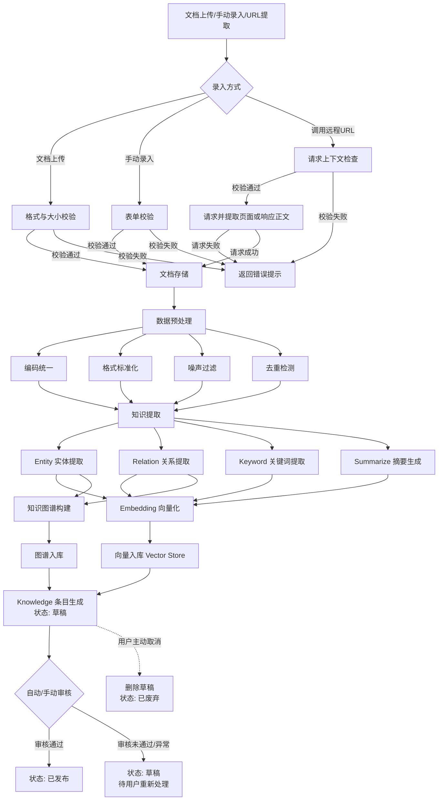

> **v7 收束说明(2026-06-16)**: 原流程图直接 `L → M[状态: 已发布]` 跳过了"草稿"状态，与 §5.6 状态机（BR-01-038 初始状态为"草稿"，BR-01-041 已发布可编辑需先撤回草稿）以及实际业务（需用户审核后才可发布）不符。修正后的流程图显式引入"草稿"中转状态，覆盖：①文档导入（先入库为草稿，提取/审核通过后发布）；②手动录入（先入库为草稿，用户主动发布）；③审核失败回到草稿待处理。

**异常分支**：

|# |异常场景 |触发条件 |处理逻辑 |用户感知 |错误码 |
|---|---|---|---|---|---|
|1 |**LLM 提取置信度低于类型阈值** |实体 < 0.7 / 关系 < 0.6 / 关键词/摘要按 §4.4.4 配置 |Knowledge 条目保持"草稿"状态（**v7 修正**：原"待审核"状态不存在于 §5.6 状态机，已统一为"草稿"），站内消息通知知识管理员人工审核 |列表"草稿"筛选可见，标红"低置信度待审核"标签；管理员可执行"通过/打回" |050501（知识状态冲突） |
|2 |**LLM 提取超时** |单篇文档提取超过 10 分钟（BR-01-021） |自动终止任务并标记为"处理失败"，按 BR-01-022 指数退避重试 3 次（1s/2s/4s），仍失败进入"草稿"待用户重试或人工干预 |文档状态变更为"处理失败"，显示失败原因"提取超时"；列表筛选可见 |050603（提取模型调用超时） |
|3 |**LLM 提取调用外部 API 失败（5xx）** |Embedding/LLM 服务返回 5xx 或连接错误 |按 BR-01-022 指数退避重试 3 次（1s/2s/4s），均失败标记"处理失败"并触发 P1 告警 |状态变更为"处理失败"，显示"LLM 服务不可用，请稍后重试"；管理员可在异常列表中手动重试 |050601（Embedding Model 不可用） |
|4 |**LLM 提取认证失败（401/403）** |API Key 过期或权限不足 |**不重试**，立即标记"处理失败"，站内信+邮件通知操作人及商户管理员 |明确提示"API 凭据无效，请联系管理员检查配置" |050601（Embedding Model 不可用） |
|5 |**提取结果与已有知识去重** |语义相似度 > 0.95 |按 §4.4.3 去重策略配置（合并 / 覆盖 / 跳过）执行，默认"跳过" |列表显示去重命中提示"与 XXX 知识相似度 XX%，已跳过" |050501（知识状态冲突，去重跳过） |
|6 |**目标知识类型被删除/禁用** |提取过程中目标 `type_id` 状态变为 DISABLED 或被软删除 |任务中止，Knowledge 条目入库失败并标记"处理失败" |明确提示"目标知识类型已被禁用，请重新选择类型" |050402（知识类型不存在） |
|7 |**目标知识域被冻结或删除** |目标 `domain_id` 状态变为 FROZEN/DELETED |任务中止，Knowledge 条目标记"处理失败" |提示"目标域不可用（已冻结/已删除），请切换至其他域" |050403（知识来源/域不可用） |
|8 |**Embedding 服务不可用** |Neo4j/Embedding API 5xx 或超时 > 5s |标记 `vector_status=DEGRADED`（§15.7 降级策略），降级为 PostgreSQL 全文检索（pg_trgm + tsvector）；异步重试向量化 |Knowledge 仍可被 PostgreSQL 全文检索命中，但向量检索不可用；状态栏展示"向量降级中" |050602（Neo4j 向量服务异常） |
|9 |**OCR 处理扫描件 PDF 失败** |PDF 为纯图片且 OCR 服务不可用或质量差 |触发 §4.7 OCR 降级策略 5 阶段：①内置 PDF 文本提取 → ②Tesseract 本地 OCR → ③云 OCR（Auth-Token）→ ④PaddleOCR 服务化 → ⑤人工上传文本；均失败标记"处理失败"并提示用户 |明确提示"PDF 解析质量不佳，建议上传文本版本或手动录入" |050604（OCR 服务不可用） |
|10 |**用户主动取消提取任务** |用户在"处理中"状态点击"取消" |异步任务收到取消信号优雅停止（30 秒内），Knowledge 条目删除草稿（与流程图 D2 -.-> E2 一致），状态变更为"已废弃" |列表"已废弃"筛选可见，30 天后物理删除 |050501（知识状态冲突） |
|11 |**病毒扫描命中** |上传文件被 NFR-20 病毒扫描检出恶意内容 |拒绝文件上传，返回明确安全提示并记录审计日志 |Toast 提示"文件安全检查未通过，已拒绝" |050001（未知错误）/ 审计日志标记 |
|12 |**域配额已满** |目标域 `quota` 100%（BR-01-069） |拒绝创建新 Knowledge，返回业务错误码 050429，提示用户清理或扩容 |Toast 提示"知识域配额已满，请清理或申请扩容" |050429（配额超限） |
|13 |**跨租户/跨域越权** |Knowledge 写入的 `domain_type`/`domain_id` 与用户身份不匹配（BR-01-052） |RLS 策略拦截，返回 403 拒绝写入 |明确提示"无权限在该域创建知识" |050301（无 knowledge:list 权限） |
|14 |**手动录入字段校验失败** |必填字段为空或格式不满足 §A3 chk_kb_tags_count 约束（tag 数量 ≤ 10、长度 3-50） |拒绝提交，前端 inline 校验 + 后端二次校验 |字段下方红色错误提示，定位首个错误字段并自动 focus |050101（知识标题不能为空）/050102/050103/050104 |

> **异常处理总原则**：
>
> 1. **可重试异常**（超时/5xx/网络抖动）走 BR-01-022 指数退避；**不可重试异常**（401/403/配额）立即拒绝并通知。
> 2. **状态不可逆原则**：进入"已废弃"后 30 天内可手动恢复（BR-01-044），超过 30 天物理删除。
> 3. **降级优先**：Embedding 不可用 → PostgreSQL 全文检索；OCR 不可用 → 提示人工上传文本；LLM 不可用 → 规则提取。
> 4. **错误码规范**：所有异常通过 `errors[].extensions.code` 返回 `BIZ_KNOWLEDGE_*` 命名空间（§14.4），HTTP 状态恒为 200。
> 5. **审计必现**：所有异常均记录到 `audit_knowledge_event` 表，含 traceId、操作人、异常类型、上下文。

#### 2.5.2 知识查询流程

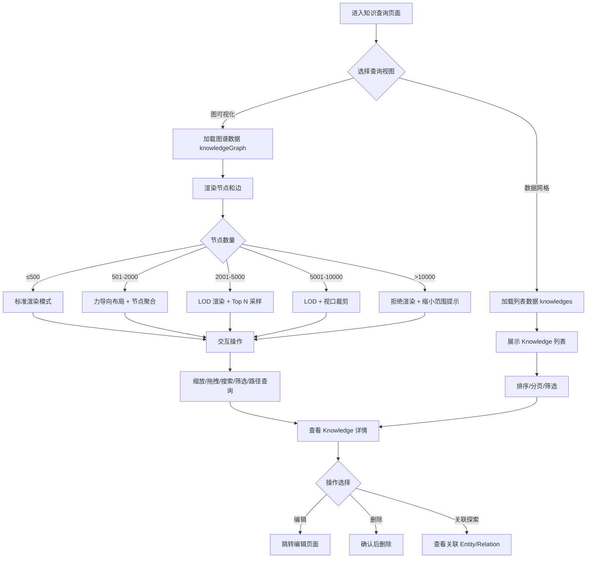

> **v7 收束说明(2026-06-16) 节点数量阈值与 §4.1.1 对齐**: 原流程图节点数量判定仅 3 段（≤500/500-2000/>2000），与 §4.1.1 降采样方案的 5 段（≤500/501-2000/2001-5000/5001-10000/>10000）不一致。修正后流程图按 §4.1.1 5 段判定：
>
> - **≤ 500**: 全量标准渲染
> - **501-2000**: 力导向布局 + 按实体类型聚合低度数节点
> - **2001-5000**: LOD 渲染 + Top N 重要性评分采样
> - **5001-10000**: LOD + 视口虚拟化（仅渲染视口内节点）
> - **> 10000**: 拒绝渲染，提示"数据量过大，请缩小查询范围"

> **v7 收束说明(2026-06-16) GraphQL 操作命名**: 原流程图节点"加载图谱数据 API"/"加载列表数据 API"为语义描述，已按 §A5 GraphQL Schema 权威操作名改为 `knowledgeGraph` / `knowledges`，与 §6.1 API 清单 v7 收束后命名严格一致。

**异常分支**：

|# |异常场景 |触发条件 |处理逻辑 |用户感知 |错误码 |
|---|---|---|---|---|---|
|1 |**节点数超过渲染上限（> 10000）** |流程图 I3 节点触发：当前查询条件命中实体数 > 10000（BR-01-002） |拒绝渲染并返回 050402 业务错误，提示用户缩小查询范围（按类型/时间/域筛选） |弹窗"数据量过大，请缩小查询范围"，并展示推荐筛选条件 |050402（资源不存在/超限） |
|2 |**图谱查询权限不足** |用户无 `knowledge_graph:read` 权限或 domainIds 跨域无访问权（BR-01-081） |RLS + GraphLabel Guard 拦截，返回 403 |弹窗"无图谱查询权限"或"无权访问该域的图谱" |050302（无 knowledge:read 权限） |
|3 |**Neo4j 不可用** |Neo4j 连接失败/超时 > 5s |禁用图可视化功能（流程图 C 节点失败），降级为数据网格视图（流程图 D 节点仍可工作）；其他模块不受影响 |顶部黄色横幅"图谱服务暂不可用，已自动切换至列表视图"，5 秒后自动刷新 |050602（Neo4j 向量服务异常） |
|4 |**图谱查询超时** |图谱查询响应 > 3 秒（NFR-03） |取消当前查询并提示"查询超时，建议缩小范围或筛选条件"；保留已加载节点供浏览 |Loading 状态终止，Toast 提示"查询超时" |050001（兜底错误） |
|5 |**向量检索阈值过低无结果** |RAG 检索 Top-K 向量相似度均 < 0.75（BR-01-005） |返回空结果集，提示用户调整关键词或检查检索配置 |列表为空，展示空状态占位图 + "无匹配结果，可尝试调整关键词" |200（业务正常返回空） |
|6 |**列表分页参数越界** |`first` > 100 或 `last` < 0 等非法值 |服务端校验拒绝，返回 400 错误（§14.5 规范：first/last 互斥且仅支持 10/20/50/100） |表单字段下方红字提示"每页条数仅支持 10/20/50/100" |050001（参数错误） |
|7 |**详情查询时 Knowledge 已被软删除** |详情页 URL 携带的 `knowledgeId` 在 §5.6 状态机中为"已废弃"或"已物理删除" |跳转到 404 占位页，提示"该知识已删除或不存在" |404 占位页 + "返回列表"按钮 |050401（知识不存在） |
|8 |**搜索关键词触发注入检测** |§15.7 Embedding 安全策略命中"忽略以上指令"等越狱关键词 |拒绝请求并记录审计日志（traceId + 用户 + 拒绝原因） |Toast 提示"请求包含非法内容，请检查输入" |050001（参数错误） |
|9 |**图谱节点属性含敏感信息** |Neo4j 节点属性白名单检测到 content/PII 等禁止字段（§15.2 排除清单） |同步任务拒绝写入并触发 P1 告警；管理员在管理后台可见"敏感字段泄漏预警" |管理员后台告警中心显示"Neo4j 数据包含禁止字段" |050001（数据合规违规） |
|10 |**多端并发编辑同一 Knowledge** |A 用户编辑时 B 用户也进入编辑页面 |A 先保存成功，B 保存时 `expectedUpdatedAt` 不匹配触发乐观锁冲突（§A5.4 KnowledgeUpdateInput） |B 端弹窗"该知识已被 A 修改，请刷新后重试"，自动跳转到最新版本 |050502（知识正在被处理） |

> **异常处理原则**：
>
> 1. **降级优先**：图谱不可用 → 列表视图；Neo4j 不可用 → 屏蔽图谱功能但保留其他查询。
> 2. **可恢复异常**：节点数超限、查询超时 → 引导用户调整查询条件；权限不足 → 引导申请权限。
> 3. **不可恢复异常**：知识已物理删除 → 404 跳转；含敏感字段 → 阻断 + 告警。

#### 2.5.3 知识更新流程

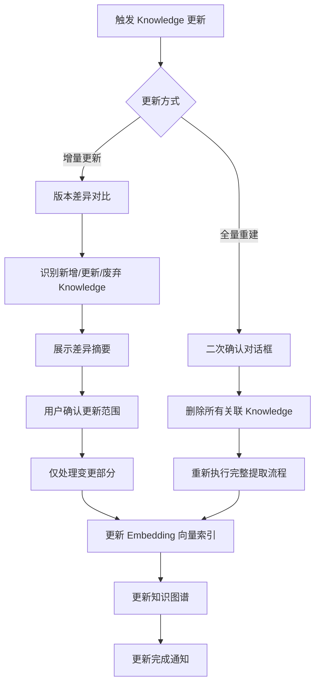

**异常分支**：

|# |异常场景 |触发条件 |处理逻辑 |用户感知 |错误码 |
|---|---|---|---|---|---|
|1 |**增量对比失败（文档 hash 未变化但提取规则已变更）** |流程图 C 节点触发：源文档 `content_hash` 与上次一致但 `extraction_rule_id` 已被修改 |强制以"全量重建"模式执行（覆盖原增量判断逻辑），并在审计日志标记"规则变更触发全量重建" |弹窗确认对话框"提取规则已变更，将以全量模式重建，是否继续？" |050501（知识状态冲突） |
|2 |**增量对比识别出废弃 Knowledge 失败** |流程图 D 节点：源文档中已删除的章节无法自动识别（Markdown/Word 文档结构变化大） |仅标记为"待用户确认"，不自动删除；列表展示"无法自动判断是否废弃的条目"，由用户手动勾选确认 |差异摘要页"待确认废弃条目"区域，标黄高亮 |200（业务正常返回，需用户确认） |
|3 |**全量重建过程中断** |流程图 J 节点：用户手动取消 / 服务进程崩溃 / 磁盘满 |已删除的 Knowledge 状态从"已废弃"回滚至"草稿"（§4.9.4.5 事务回滚）；触发 P1 告警通知管理员 |顶部红色横幅"全量重建已中断，已自动回滚，Knowledge 已恢复至草稿状态" |050501（知识状态冲突） |
|4 |**全量重建超过预期时长（> 30 分钟）** |流程图 J 节点预计时长超阈值 |异步任务继续执行（不中断），但前端展示"预计还需 X 分钟"实时进度；超时（> 2 小时）触发 P1 告警 |进度条 + 实时耗时显示；超过 30 分钟顶部黄色提示 |050001（业务警告） |
|5 |**Embedding 向量索引更新失败** |流程图 K 节点：Neo4j 向量服务不可用 |按 §15.7 降级策略：标记 `vector_status=DEGRADED`，知识仍可被 PostgreSQL 全文检索命中；后台异步重试向量化 |状态栏"向量降级中"，但 Knowledge 列表和详情正常展示 |050602（Neo4j 向量服务异常） |
|6 |**知识图谱更新失败（Neo4j 写入失败）** |流程图 L 节点：Neo4j 连接失败或 Cypher 错误 |PostgreSQL 事务回滚（Neo4j 是派生视图不允许数据漂移），Outbox 事件进入重试队列（指数退避 5 次） |顶部 Toast"图谱更新失败，已加入重试队列"；状态变更为"处理失败" |050701（Outbox 事件同步失败） |
|7 |**Outbox 事件超过最大重试次数** |Neo4j 持续不可用导致事件重试超 5 次 |事件状态变更为 `DEAD_LETTER`（§22.3），管理员可在运维后台手动重放 |管理员后台告警中心显示"X 个事件进入 Dead Letter Queue" |050702（Outbox 事件超过最大重试次数） |
|8 |**更新完成通知发送失败** |流程图 M 节点：站内信 / 邮件服务不可用 |通知失败不影响 Knowledge 状态变更；通知任务进入重试队列（1 分钟/2 分钟/2 分钟 三次重试，BR-01-035 策略） |用户登录后站内信仍可见，邮件收件箱可能延迟 |050001（业务警告） |
|9 |**并发更新同一文档触发乐观锁冲突** |A 用户更新时 B 用户也在更新同一 sourceId |A 优先，B 收到 `expectedUpdatedAt` 不匹配错误，提示刷新后重试 |弹窗"该文档正在被 A 更新，请刷新后重试" |050502（知识正在被处理） |
|10 |**域配额已满时触发全量重建** |全量重建导致目标域 `quota` 100% |重建过程回滚，Knowledge 状态恢复至重建前；提示用户先清理或扩容 |弹窗"目标域配额已满，无法执行全量重建，请先清理" |050429（配额超限） |
|11 |**跨域 Knowledge 共享后源域删除** |源 Knowledge 已被删除（§5.6 已废弃），但目标域仍有副本 |副本标记为"孤儿"，仅系统管理员可见和处理；不在 Agent 检索范围内 |管理员后台"孤儿知识"列表可手动清理 |050401（知识不存在，源已删除） |

> **异常处理原则**：
>
> 1. **PG 为权威**：Neo4j 同步失败时 PostgreSQL 事务回滚，避免数据漂移（§22.1 一致性模型）。
> 2. **可重试异常**：Outbox 事件、通知发送走指数退避；**不可重试**：规则变更、跨域孤儿清理需人工介入。
> 3. **状态保护**：全量重建中断必须回滚至重建前状态，避免数据丢失。

#### 2.5.4 文档导入与处理流程

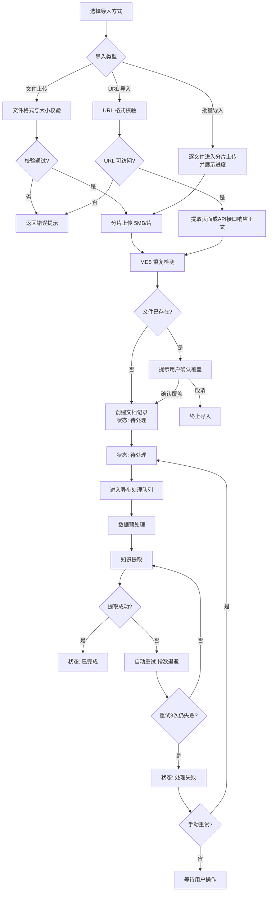

> **v7 收束说明(2026-06-16) 状态命名与 §4.2.1 对齐**: 文档状态统一采用 §4.2.1 mermaid stateDiagram-v2 权威定义 — **待处理 / 处理中 / 已完成 / 处理失败**。原 §4.9.5 文字版曾使用"上传中/处理中/成功/失败"命名（与 §4.2.1 不一致），已删除并以 §4.2.1 为唯一权威。

> **v7 收束说明(2026-06-16) 补充手动重试路径**: 原流程图仅展示"自动重试"路径，与 §4.2.1 状态机的"处理失败 → 待处理: 手动重试"分支不一致。修正后流程图补充 `Y → Y1{手动重试?} → Q` 路径，覆盖：①**用户主动重试**（在文档列表点击"重试"，状态回到"待处理"重新进入异步队列）；②**保持失败**（用户不操作，状态保持"处理失败"等待用户后续处理）；③**30 天后自动物理删除**（详见 BR-01-010）。

> **v7 收束说明(2026-06-16) 批量导入流程逻辑**: 原流程图 `E 批量导入 → H 逐个上传并展示进度 → J 分片上传 5MB/片` 的 E→H→J 三级节点存在逻辑跳跃（批量导入与分片上传之间的关系未明），修正后简化为 `E → H1[逐文件分片上传 并展示进度] → J`，H1 与 J 是父子关系（H1 包含 J 逻辑），更准确地表达"批量 = 多次单文件分片上传"的语义。

**异常分支**：

|# |异常场景 |触发条件 |处理逻辑 |用户感知 |错误码 |
|---|---|---|---|---|---|
|1 |**文件格式不支持** |流程图 C 节点：上传文件后缀不在 BR-01-006 白名单（PDF/Word/Markdown/TXT/CSV） |拒绝上传，前端展示支持格式清单 |弹窗"不支持的文件格式，当前支持：PDF/Word/Markdown/TXT/CSV" |050001（参数错误） |
|2 |**文件大小超限** |流程图 C 节点：文件超过类型上限（PDF 100MB / Word/CSV 50MB / Markdown/TXT 10MB，BR-01-007） |拒绝上传，前端展示大小限制 |弹窗"文件超过大小限制：PDF 最大 100MB，Word/CSV 最大 50MB，Markdown/TXT 最大 10MB" |050001（参数错误） |
|3 |**病毒扫描命中（NFR-20）** |上传文件经病毒扫描检出恶意内容 |拒绝上传，记录审计日志，触发 P0 安全告警 |弹窗"文件安全检查未通过，已拒绝上传" + 邮件通知商户管理员 |050001（安全违规） |
|4 |**URL 格式不合法** |流程图 D 节点：URL 缺少协议头 / 包含非法字符 / 指向 localhost 或内网 IP |拒绝导入 |字段下方红字"URL 格式无效，仅支持 http/https 公网 URL" |050001（参数错误） |
|5 |**URL 不可达（DNS/连接失败）** |流程图 G 节点：DNS 解析失败、连接超时、SSL 证书错误 |拒绝导入并提示具体原因 |弹窗"无法访问目标 URL：DNS 解析失败/连接超时/SSL 证书无效" |050001（外部服务错误） |
|6 |**URL 目标返回 4xx/5xx** |目标 URL HTTP 状态码 4xx/5xx |拒绝导入，展示 HTTP 状态码 |弹窗"目标 URL 返回 4xx/5xx 错误：状态码 XXX" |050001（外部服务错误） |
|7 |**URL 目标非文档类型** |目标 Content-Type 不在白名单 |拒绝导入 |弹窗"目标 URL 内容类型不支持，仅支持：text/html、application/pdf 等" |050001（参数错误） |
|8 |**URL 抓取内容为空** |目标页面无实质内容（< 100 字符） |拒绝导入，提示用户 |弹窗"目标 URL 内容为空或过短，请检查 URL" |050001（参数错误） |
|9 |**MD5 重复检测命中且用户选择取消** |流程图 N 节点：MD5 与已有文档一致，用户点击"取消" |终止导入，不创建新记录 |弹窗"该文件已存在，已取消导入" |050501（知识状态冲突） |
|10 |**分片上传断点续传失效** |流程图 J 节点：分片上传中断后 24 小时内未恢复 |自动清理已上传分片，文档状态保持"待处理"，用户需重新上传 |弹窗"上传会话已过期（> 24 小时），请重新上传" |050001（业务警告） |
|11 |**批量导入部分失败** |流程图 H1 节点：20 个文件中部分（如 5 个）上传失败 |已成功的文件正常进入处理队列；失败的文件在批量结果报告中列出，用户可单独重试 |批量导入完成弹窗"成功 X / 失败 Y，失败文件：file1.pdf（格式错误）、file2.pdf（大小超限）..." |050001（部分失败） |
|12 |**批量导入超过 20 个文件** |流程图 B 节点：用户选择超过 BR-01-008 限制的 20 个文件 |前端校验拒绝，提示分批 |弹窗"单次批量最多 20 个文件，请分批导入" |050001（参数错误） |
|13 |**并发任务超限（> 5 个）** |商户当前并发处理任务数已达 BR-01-012 上限 |任务进入排队状态，返回预计等待时间 |弹窗"当前处理任务较多，已加入排队队列，预计等待 X 分钟" |050502（任务排队） |
|14 |**处理中受保护（BR-01-011）** |用户尝试删除/覆盖处理中文档 |拒绝操作，提示需等待处理完成 |弹窗"文档处理中，无法删除或覆盖，请等待完成" |050501（知识状态冲突） |
|15 |**目标域配额已满** |流程图 O 节点：目标域 `quota` 100% |拒绝导入，提示清理或扩容 |弹窗"目标知识域配额已满，请清理或申请扩容" |050429（配额超限） |
|16 |**目标域已冻结** |目标域 `status = FROZEN` |拒绝导入 |弹窗"目标知识域已冻结，请联系管理员" |050403（知识域不可用） |
|17 |**导入权限不足** |用户无 `knowledge_source:manage` 或域访问权 |拒绝导入，返回 403 |弹窗"无导入权限，请联系管理员" |050303（无 knowledge:edit 权限） |
|18 |**30 天后处理失败文档自动清理** |处理失败状态超过 BR-01-010 软删除保留期 |后台任务物理删除（同时清理 Outbox 事件、向量副本） |列表筛选"已废弃"可见 30 天，超期自动消失 |200（系统行为，无需用户操作） |

> **异常处理原则**：
>
> 1. **导入前校验前置**：格式、大小、病毒、URL 合法性等校验在文件落地前完成，避免无效文件占用存储。
> 2. **批量可恢复**：批量导入部分失败时，已成功文件不受影响，失败文件可在报告页面单独重试。
> 3. **资源保护**：处理中文档不允许删除/覆盖；域配额/并发超限走排队或拒绝。
> 4. **安全优先**：病毒扫描、SSRF 防护、内网 IP 拦截是安全底线，不可降级。


---

## 3. 功能范围

### 3.1 功能结构树

```text
知识管理模块
├── 知识查询
│   ├── 图可视化（Graph Visualization）
│   │   ├── 节点展示（Entity）
│   │   ├── 边展示（Relation）
│   │   ├── 交互操作（缩放、拖拽、筛选、搜索）
│   │   └── 路径查询
│   ├── 数据网格（Data Grid）
│   │   ├── 列表展示
│   │   ├── 排序与分页
│   │   ├── 批量操作
│   │   └── 导出
│   └── 过滤条件
│       ├── 知识类型筛选
│       ├── 时间范围筛选
│       ├── 来源筛选
│       ├── 状态筛选
│       └── 关键词搜索
├── 知识来源管理
│   ├── 文档列表
│   │   ├── 列表展示
│   │   ├── 状态标识
│   │   └── 操作入口
│   ├── 导入文档
│   │   ├── 文件上传
│   │   ├── URL 导入
│   │   └── 批量导入
│   ├── 编辑文档
│   ├── 删除文档
│   └── 更新知识
│       ├── 增量更新
│       └── 全量重建
├── 知识类型管理
│   ├── 类型列表
│   ├── 创建类型
│   ├── 编辑类型
│   ├── 删除类型
│   └── 层级结构管理
│       ├── 父级类型选择
│       ├── 类型编码
│       ├── 状态控制
│       └── 描述管理
├── 学习新知识
│   ├── 知识类型选择
│   ├── 添加方式
│   │   ├── Import（导入文档）
│   │   ├── Manual（手动录入）
│   │   └── Remote API（远程接口调用）
│   │       ├── API 端点配置（URL / Method / Headers / Params）
│   │       ├── 响应数据映射规则
│   │       └── 错误处理与重试策略
│   ├── 文档上传
│   │   ├── 支持格式（PDF/Word/Markdown/TXT/CSV）
│   │   ├── 大小限制
│   │   └── 编码检测
│   ├── 提取规则配置（任务级）
│   │   ├── Entity（实体提取）
│   │   ├── Relation（关系提取）
│   │   ├── Keyword（关键词提取）
│   │   └── Summarize（摘要生成）
│   └── 数据清洗规则（任务级）
│       ├── 去重规则
│       ├── 格式标准化
│       └── 噪声过滤
├── 模块级全局配置（与"学习新知识"平级的顶级子模块；任务级配置覆盖本级配置）
│   ├── 提取规则全局配置
│   │   ├── Entity（实体提取）
│   │   ├── Relation（关系提取）
│   │   ├── Keyword（关键词提取）
│   │   └── Summarize（摘要生成）
│   ├── 向量配置
│   │   ├── Embedding Model 选择
│   │   ├── Embedding Dimension 设置
│   │   ├── Chunk Size 设置
│   │   └── Vector Store Type 选择
│   ├── 知识图谱架构
│   │   ├── Entity Type 定义
│   │   ├── Relation Type 定义
│   │   └── Schema JSON 配置
│   └── 数据清洗全局规则
│       ├── 去重规则
│       ├── 格式标准化
│       └── 噪声过滤
└── 知识域管理（Knowledge Domain Management）
    ├── 三级域模型（参照 PRD-02 §7.2-7.4）
    │   ├── 私有知识域（Private Knowledge Domain）
    │   ├── 共享知识域（Shared Knowledge Domain）
    │   └── 公共知识域（Public Knowledge Domain）
    ├── 域与知识图谱融合
    │   ├── 私有图谱（私有域 Entity / Relation 隔离）
    │   ├── 共享图谱（绑定 Group ID 的图谱空间）
    │   ├── 公共图谱（系统级全局图谱）
    │   ├── 域级 Schema（各域独立的 Entity Type / Relation Type）
    │   └── 跨域图查询拦截（禁止跨域返回 Entity / Relation）
    ├── 域与向量检索融合
    │   ├── 域级向量索引（私有 / 共享 / 公共向量索引）
    │   ├── 域级向量检索过滤（domain_id ∈ 允许域集合）
    │   └── 跨域向量检索拦截
    ├── 域与知识类型融合
    │   ├── 域级类型树（私有 / 共享 / 公共类型隔离）
    │   ├── 跨域类型引用规则（仅允许私有/共享→公共、单向引用）
    │   └── 域级类型统计
    ├── 域与知识条目融合
    │   ├── 域级 Knowledge 状态机（继承 §5.6 状态规则）
    │   ├── 域级版本管理（每个域独立维护版本链）
    │   └── 域级 Agent 关联（按域过滤关联关系）
    ├── 域成员与角色
    │   ├── 域管理员（Domain Admin）
    │   ├── 编辑者（Editor）
    │   ├── 查看者（Viewer）
    │   └── 系统管理员（System Admin，仅公共域）
    ├── 跨域知识共享与发布
    │   ├── 私有域 → 共享域（用户主动共享，复制非移动）
    │   ├── 共享域 → 公共域（管理员审批，发布申请）
    │   ├── 共享域 → 私有域（用户主动复制）
    │   └── 公共域 → 共享域 / 私有域（用户主动复制）
    ├── 域隔离与脱敏
    │   ├── 域级数据隔离（向量索引 + partition_key / row-level security）
    │   ├── 域级脱敏级别（标准 / 严格 / 关闭）
    │   └── 域级隐私保护（私有域严格脱敏）
    └── 域统计与配额
        ├── 域使用统计（条目数 / Entity 数 / Relation 数 / 存储量）
        ├── 域配额策略（私有 / 共享 / 公共域上限）
        └── 域配额预警（70% 警告 / 90% 严重 / 100% 拦截）
```

### 3.2 MoSCoW 优先级表

|功能点 |优先级 |说明 |
|---|---|---|
|数据网格查询 |**Must** |基础 Knowledge 查询能力 |
|过滤条件（类型、时间、来源、状态、关键词） |**Must** |查询精确度的保障 |
|文档列表 |**Must** |知识来源管理的基础 |
|导入文档（文件上传） |**Must** |Knowledge 入库的核心方式 |
|删除文档 |**Must** |知识来源管理的基本操作 |
|更新知识（增量更新） |**Must** |Knowledge 时效性的保障 |
|知识类型 CRUD |**Must** |Knowledge 分类体系的基础 |
|学习新知识 - 文档上传 |**Must** |Knowledge 提取的入口 |
|提取规则配置（Entity/Relation/Keyword/Summarize） |**Must** |Knowledge 提取的核心能力 |
|向量配置（Model/Dimension/Chunk Size/Store Type） |**Must** |Knowledge 检索精度的保障 |
|数据清洗规则 |**Must** |Knowledge 质量保障 |
|图可视化（Graph Visualization） |**Should** |高级 Knowledge 查询能力 |
|编辑文档 |**Should** |知识来源的维护操作 |
|URL 导入 |**Should** |扩展知识来源获取方式 |
|批量导入 |**Should** |提升知识入库效率 |
|知识图谱架构（Schema JSON） |**Should** |高级知识结构定义 |
|层级结构管理 |**Should** |知识类型的层级化组织 |
|更新知识（全量重建） |**Should** |知识库重建能力 |
|批量操作 |**Could** |批量管理效率提升 |
|导出功能 |**Could** |数据外发需求 |
|路径查询 |**Could** |高级图查询能力 |
|知识域管理 — 三级域模型（私有 / 共享 / 公共） |**Must** |Knowledge 数据隔离与可控共享的基础，对齐 PRD-02 §7.2-7.4 |
|知识域与知识图谱融合（域级图谱 / Schema / 跨域拦截） |**Must** |知识图谱的访问控制核心能力 |
|知识域与向量检索融合（域级命名空间 / 检索过滤） |**Must** |向量检索的访问控制核心能力 |
|域成员管理（域管理员 / 编辑者 / 查看者） |**Must** |共享域 / 公共域协作基础 |
|跨域知识共享（私有→共享 / 共享→公共 / 公共→共享） |**Should** |团队协作与公共知识沉淀 |
|域级配额与预警 |**Should** |资源管控与运营成本控制 |
|域级脱敏与隐私保护 |**Must** |隐私合规（GDPR / CCPA）与跨域安全 |
|Remote API 知识添加方式 |**Must** |扩展知识来源获取方式，支持外部系统知识接入 |
|API 端点配置与数据映射 |**Must** |Remote API 方式的核心能力 |
|API 错误处理与重试策略 |**Must** |Remote API 调用的可靠性保障 |
|模块级全局配置（提取规则/向量/图谱/清洗） |**Must** |配置复用与统一管理的基础 |
|配置三级合并策略（任务级 > 模块级 > 系统级） |**Must** |配置优先级处理核心机制 |


---

## 4. 功能详情

### 4.1 知识查询

#### 4.1.1 图可视化（Graph Visualization）

**用户故事**：作为数据分析师，我希望通过交互式的知识图谱可视化界面，直观地查看 Entity 之间的 Relation 网络，以便发现 Knowledge 之间的隐藏关联和结构模式。

**前置条件**：

- 用户已登录且具有 Knowledge 查看权限
- 知识库中已有 Entity 和 Relation 数据
- 浏览器支持 WebGL（用于大规模图渲染）

**后置条件**：

- 知识图谱在画布上正确渲染
- 用户可交互探索图谱

**主流程**：

|步骤 |操作 |系统响应 |
|---|---|---|
|1 |用户进入知识查询页面，选择"图可视化"视图 |系统加载知识图谱数据，渲染节点和边 |
|2 |用户在画布上查看图谱 |系统展示 Entity 节点（不同颜色代表不同实体类型）和 Relation 边（不同线型代表不同关系类型） |
|3 |用户鼠标滚轮缩放 |图谱平滑缩放，节点标签自适应显示/隐藏 |
|4 |用户拖拽画布 |图谱平移，探索不同区域 |
|5 |用户点击某个节点 |节点高亮，展示该 Entity 的详细信息面板（属性、关联 Relation、来源文档） |
|6 |用户在搜索框输入 Entity 名称 |系统高亮匹配的节点，画布自动定位至该节点 |
|7 |用户设置过滤条件 |系统仅展示符合条件的节点和边 |

**分支流程**：

|分支 |触发条件 |处理逻辑 |
|---|---|---|
|B1 |节点数量 > 500 |自动切换为力导向布局（Force-directed Layout），启用节点聚合 |
|B2 |节点数量 > 2000 |启用 LOD（Level of Detail），远处节点简化为圆点 |
|B3 |用户双击节点 |展开该节点的一度关联节点（如果当前未展示） |
|B4 |用户右键节点 |展示上下文菜单：查看详情、查看关联、定位来源、添加 Relation |
|B5 |用户选择"路径查询" |输入起始节点和目标节点，系统高亮最短路径 |

**异常流程**：

|异常 |触发条件 |处理逻辑 |
|---|---|---|
|E1 |图谱数据量过大（> 10000 节点） |提示"数据量过大，请缩小查询范围"，建议使用过滤条件 |
|E2 |WebGL 不可用 |降级为 SVG 渲染，提示"当前使用简化渲染模式" |
|E3 |渲染超时（> 10 秒） |显示加载进度条，完成后渲染；超时后提示"渲染超时，请缩小范围" |

**大规模数据处理策略（>1000 节点降采样方案）**：

|节点数量范围 |渲染策略 |降采样方案 |说明 |
|---|---|---|---|
|≤ 500 |标准渲染 |无需降采样 |全量渲染所有节点和边 |
|501 - 2000 |力导向布局 + 聚合 |按实体类型聚合低度数节点 |度数 < 3 的节点按类型聚合为超节点，显示聚合数量 |
|2001 - 5000 |LOD 渲染 |按重要性评分采样 Top N |[TBD-产品决策] 重要性评分 = 度数权重 × PageRank 权重 × 用户查询相关度权重 —— 依据：图可视化领域通用的节点重要性评估方法 |
|5001 - 10000 |LOD + 虚拟化渲染 |分层加载 + 视口裁剪 |仅渲染当前视口范围内的节点，滚动时动态加载 |
|> 10000 |拒绝渲染 |强制要求缩小查询范围 |提示用户增加过滤条件或缩小查询深度 |

**交互说明**：

- 画布支持鼠标滚轮缩放、拖拽平移、框选
- 节点悬停显示 Tooltip（Entity 名称、类型、Relation 数）
- 边悬停显示 Tooltip（Relation 类型、源 Entity、目标 Entity）
- 左侧面板展示图例（Entity 类型颜色、Relation 类型线型）
- 右侧面板展示选中节点的详细信息
- 底部工具栏提供：缩放控制、布局切换、截图、全屏

**图例配置**：

|Entity 类型 |节点颜色 |节点形状 |
|---|---|---|
|Person |#4A90D9 |圆形 |
|Organization |#F5A623 |矩形 |
|Concept |#7ED321 |菱形 |
|Event |#D0021B |三角形 |
|Location |#9013FE |六边形 |
|Custom |#50E3C2 |圆角矩形 |

**验收标准**：

|编号 |验收标准 |验证方法 |
|---|---|---|
|AC-01-01 |1000 个节点的图谱在 3 秒内完成首次渲染 |使用 1000 节点测试数据集，计时从请求发出到渲染完成 |
|AC-01-02 |节点点击后 200ms 内展示详细信息面板 |点击 5 种不同 Entity 类型节点，测量面板展示延迟 |
|AC-01-03 |搜索功能在 500ms 内高亮并定位目标节点 |输入已知 Entity 名称搜索，测量响应时间 |
|AC-01-04 |缩放和拖拽操作帧率 ≥ 60fps（500 节点场景） |在 500 节点图谱上连续操作 10 秒，使用浏览器 Performance 面板测量帧率 |
|AC-01-05 |过滤条件应用后 1 秒内完成图谱重新渲染 |设置 3 种不同过滤条件，测量渲染更新时间 |
|AC-01-06 |路径查询在 2 秒内返回并高亮最短路径 |选择距离 ≥ 3 跳的两个节点执行路径查询 |
|AC-01-07 |节点数量 > 10000 时弹出缩小范围提示 |使用 12000 节点测试数据验证提示弹窗 |
|AC-01-08 |2000 节点场景下 LOD 渲染帧率 ≥ 30fps |在 2000 节点图谱上连续操作 10 秒，测量帧率 |


---

#### 4.1.2 数据网格（Data Grid）

**用户故事**：作为知识工程师，我希望通过表格形式查看 Knowledge 条目列表，以便快速浏览、筛选和管理大量 Knowledge 数据。

**前置条件**：

- 用户已登录且具有 Knowledge 查看权限

**后置条件**：

- Knowledge 条目以表格形式展示
- 支持排序、分页和筛选

**列表字段定义**：

|字段名 |类型 |宽度 |可排序 |可筛选 |说明 |
|---|---|---|---|---|---|
|知识 ID |string |120px |是 |否 |Knowledge 条目的唯一标识 |
|标题 |string |自适应 |是 |是（模糊匹配） |Knowledge 条目的标题 |
|类型 |string |120px |是 |是（下拉选择） |Knowledge 所属类型 |
|来源文档 |string |150px |否 |是（下拉选择） |Knowledge 来源的文档名称 |
|实体数 |integer |80px |是 |否 |包含的 Entity 数量 |
|关系数 |integer |80px |是 |否 |包含的 Relation 数量 |
|状态 |enum |100px |是 |是（下拉选择） |草稿/处理中/已发布/已归档/已废弃 |
|版本 |string |80px |是 |否 |[TBD-产品决策] Knowledge 条目的版本号（格式 v{major}.{minor}） —— 依据：知识条目版本管理需要版本标识 |
|关联 Agent 数 |integer |80px |是 |否 |[TBD-产品决策] 关联该 Knowledge 的 Agent 数量 —— 依据：知识与 Agent 存在关联关系，需展示关联度 |
|创建时间 |datetime |160px |是 |是（时间范围） |Knowledge 创建时间 |
|更新时间 |datetime |160px |是 |是（时间范围） |Knowledge 最后更新时间 |
|操作 |— |150px |否 |否 |查看/编辑/删除 |

**主流程**：

|步骤 |操作 |系统响应 |
|---|---|---|
|1 |用户进入知识查询页面，选择"数据网格"视图 |系统加载 Knowledge 条目列表，默认按更新时间降序 |
|2 |用户点击列标题排序 |列表按该字段升序/降序排列，标题显示排序方向图标 |
|3 |用户在筛选区域设置条件 |列表实时过滤，展示符合条件的条目 |
|4 |用户翻页 |系统加载对应页的数据 |
|5 |用户点击某条 Knowledge 的"查看" |跳转至 Knowledge 详情页面 |
|6 |用户点击某条 Knowledge 的"编辑" |跳转至 Knowledge 编辑页面 |
|7 |用户点击某条 Knowledge 的"删除" |弹出确认对话框，确认后删除 |

**分支流程**：

|分支 |触发条件 |处理逻辑 |
|---|---|---|
|B1 |用户选择多条记录 |启用批量操作栏：批量删除、批量修改状态、批量导出 |
|B2 |用户点击"导出" |导出当前筛选结果为 CSV/Excel 文件 |
|B3 |筛选结果为空 |显示空状态插图和"暂无匹配的知识条目"提示 |

**异常流程**：

|异常 |触发条件 |处理逻辑 |
|---|---|---|
|E1 |数据加载失败 |显示错误提示和"重试"按钮 |
|E2 |删除时该 Knowledge 被 Agent 引用 |显示"该 Knowledge 被 N 个 Agent/编排引用，删除后可能影响相关功能"的二次确认 |

**验收标准**：

|编号 |验收标准 |验证方法 |
|---|---|---|
|AC-02-01 |列表按指定字段正确排序（升序/降序切换正常） |点击 5 个可排序列标题，验证排序方向和数据顺序 |
|AC-02-02 |筛选条件正确过滤数据（AND/OR 逻辑正确） |设置 3 种组合筛选条件，验证结果集与预期一致 |
|AC-02-03 |分页功能正确（每页 20/50/100 条可选，翻页无数据丢失） |切换每页条数并翻页至最后一页，验证总条数一致 |
|AC-02-04 |批量操作正确执行（选择 ≥ 2 条记录后批量删除/修改状态） |选择 5 条记录执行批量删除，验证操作结果 |
|AC-02-05 |删除操作弹出二次确认对话框 |点击删除按钮，验证对话框内容包含影响评估信息 |
|AC-02-06 |列表首次加载时间 ≤ 1 秒（1000 条数据） |使用 1000 条测试数据，测量从请求到渲染完成时间 |
|AC-02-07 |版本号字段正确显示当前 Knowledge 版本 |查看已更新过的 Knowledge 条目，验证版本号格式 |


---

#### 4.1.3 过滤条件

**用户故事**：作为知识工程师，我希望通过多维度过滤条件精确筛选 Knowledge 条目，以便快速定位所需的 Knowledge 数据。

**过滤条件定义**：

|过滤维度 |控件类型 |选项来源 |说明 |
|---|---|---|---|
|知识类型 |多选下拉 |知识类型管理模块 |支持选择多个知识类型 |
|时间范围 |日期范围选择器 |— |创建时间或更新时间（可切换） |
|来源文档 |多选下拉 |知识来源管理模块 |支持选择多个来源文档 |
|状态 |多选下拉 |固定选项（草稿/处理中/已发布/已归档/已废弃） |支持选择多个状态 |
|关键词 |文本输入框 |— |支持标题和内容的模糊搜索 |
|实体数量范围 |滑块 |— |按包含的 Entity 数量范围筛选 |
|标签 |多选标签选择器 |标签管理模块 |支持选择多个标签 |
|关联 Agent |多选下拉 |Agent 管理模块 |[TBD-产品决策] 按关联的 Agent 筛选 —— 依据：知识与 Agent 存在关联关系，需支持按 Agent 维度筛选 |

**交互说明**：

- 过滤条件区域可折叠/展开
- 多个过滤条件之间为 AND 关系
- 同一过滤维度的多个值为 OR 关系
- 设置过滤条件后列表实时更新（防抖 300ms）
- 提供"重置"按钮一键清除所有过滤条件
- 当前生效的过滤条件以标签形式展示在列表上方，支持单个移除

**验收标准**：

|编号 |验收标准 |验证方法 |
|---|---|---|
|AC-03-01 |多个过滤条件正确组合（AND 关系），结果集与预期一致 |设置 3 种不同维度的过滤条件，验证结果集数量 |
|AC-03-02 |同一维度多值为 OR 关系，结果集包含任一匹配项 |选择同一维度的 3 个值，验证结果集包含所有匹配项 |
|AC-03-03 |"重置"按钮一键清除所有过滤条件，列表恢复全量 |设置 5 种过滤条件后点击重置，验证列表恢复 |
|AC-03-04 |过滤条件标签可单独移除，移除后列表实时更新 |点击单个条件标签的关闭按钮，验证列表更新 |


---

### 4.2 知识来源管理

#### 4.2.1 文档列表

**用户故事**：作为知识工程师，我希望查看所有已导入的文档列表及其处理状态，以便了解知识来源的整体情况和处理进度。

**列表字段定义**：

|字段名 |类型 |说明 |
|---|---|---|
|文档名称 |string |文档的原始文件名 |
|来源类型 |enum |上传/URL导入/API导入 |
|文件大小 |string |文件大小（自适应单位：B/KB/MB/GB） |
|文件格式 |enum |PDF/Word/Markdown/TXT/CSV |
|导入时间 |datetime |文档导入的时间 |
|处理状态 |enum |待处理/处理中/已完成/处理失败 |
|提取知识数 |integer |从该文档提取的 Knowledge 条目数量 |
|最后更新 |datetime |文档最后更新的时间 |
|操作 |— |查看/编辑/删除/更新知识 |

**文档处理状态流转**：

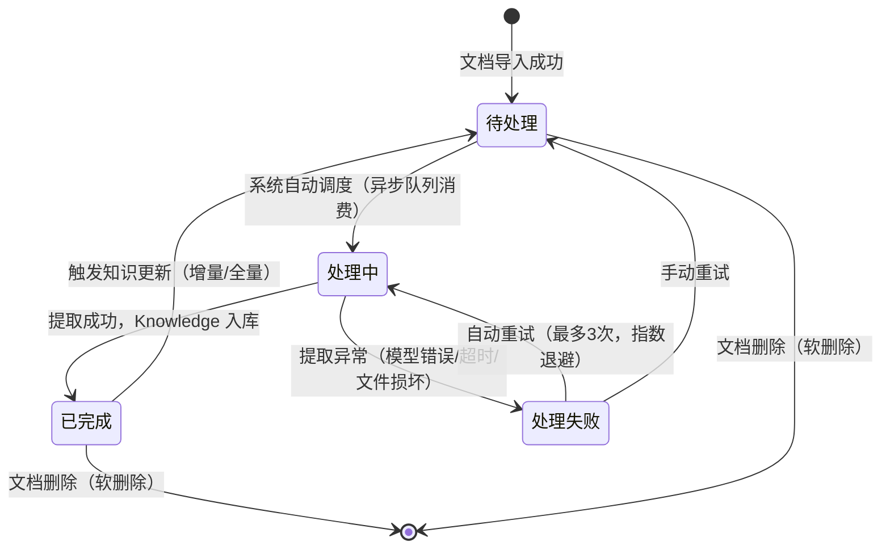

**验收标准**：

|编号 |验收标准 |验证方法 |
|---|---|---|
|AC-04-01 |文档列表正确展示所有 9 个字段，数据无缺失 |导入文档后检查列表各字段值完整性 |
|AC-04-02 |处理状态在 5 秒内实时更新（待处理→处理中→已完成/处理失败） |导入文档后轮询观察状态变化时间 |
|AC-04-03 |列表支持按状态、格式、时间筛选，筛选结果准确 |设置 3 种筛选条件，验证结果集 |
|AC-04-04 |处理失败后自动重试最多 3 次，每次间隔指数增长 |模拟提取失败，观察重试次数和间隔时间 |


---

#### 4.2.2 导入文档

**用户故事**：作为知识工程师，我希望通过上传文件或输入 URL 的方式将文档导入系统，以便将外部 Knowledge 纳入知识库。

**前置条件**：

- 用户具有 Knowledge 编辑权限
- 系统存储空间充足

**支持的文件格式与限制**：

|格式 |扩展名 |最大大小 |说明 |
|---|---|---|---|
|PDF |.pdf |100MB |支持文本提取和 OCR |
|Word |.docx, .doc |50MB |支持 .docx（推荐）和 .doc |
|Markdown |.md |10MB |原生支持 |
|纯文本 |.txt |10MB |自动检测编码（UTF-8/GBK/GB2312） |
|CSV |.csv |50MB |支持自定义分隔符和编码 |

**主流程（文件上传）**：

|步骤 |操作 |系统响应 |
|---|---|---|
|1 |用户点击"导入文档"按钮 |弹出导入对话框，展示上传区域 |
|2 |用户拖拽文件至上传区域或点击选择文件 |系统校验文件格式和大小 |
|3 |校验通过 |显示文件信息（名称、大小、格式），进度条开始上传 |
|4 |上传完成 |文档状态更新为"待处理"，显示在文档列表中 |
|5 |系统自动开始处理 |状态更新为"处理中"，后台执行 Knowledge 提取 |
|6 |处理完成 |状态更新为"已完成"，显示提取的 Knowledge 数量 |

**主流程（URL 导入）**：

|步骤 |操作 |系统响应 |
|---|---|---|
|1 |用户在导入对话框中选择"URL 导入"标签 |展示 URL 输入框 |
|2 |用户输入 URL |系统校验 URL 格式（HTTP/HTTPS） |
|3 |用户点击"导入" |系统下载页面内容，提取正文文本 |
|4 |下载完成 |创建文档记录，状态为"待处理" |
|5 |后续处理流程同文件上传 |— |

**分支流程**：

|分支 |触发条件 |处理逻辑 |
|---|---|---|
|B1 |批量导入 |支持一次选择多个文件（最多 20 个），逐个上传并展示进度 |
|B2 |文件格式不支持 |显示"不支持的文件格式，支持的格式为：PDF、Word、Markdown、TXT、CSV" |
|B3 |文件大小超限 |显示"文件大小超过限制（最大 XXXMB）" |
|B4 |URL 不可访问 |显示"无法访问该 URL，请检查地址是否正确" |
|B5 |URL 内容为空 |显示"该页面内容为空，无法提取 Knowledge" |

**异常流程**：

|异常 |触发条件 |处理逻辑 |
|---|---|---|
|E1 |上传中断（网络异常） |支持断点续传，显示"上传中断，点击重试" |
|E2 |存储空间不足 |显示"存储空间不足，当前剩余 XXXMB，请联系管理员扩容" |
|E3 |文件内容损坏（无法解析） |状态标记为"处理失败"，显示"文件解析失败，请检查文件是否损坏" |
|E4 |重复导入 |检测到相同文件（MD5 校验），提示"该文件已存在，是否覆盖更新？" |

**知识导入并发控制策略**：

|维度 |限制 |说明 |
|---|---|---|
|单商户并发处理任务数 |最多 5 个 |[TBD-产品决策] 超出后新任务进入等待队列 —— 依据：R-03-07 预案中已提及此限制 |
|单文档提取超时 |10 分钟 |超时自动终止并标记失败 |
|全局并发导入数 |最多 50 个 |[TBD-产品决策] 系统维度总并发限制 —— 依据：100 并发压力测试目标推算 |
|队列积压阈值 |100 个任务 |超出后提示"当前处理任务较多，请稍后再试" |
|重试间隔 |指数退避（1s/2s/4s） |[TBD-产品决策] 初始间隔 1 秒，每次翻倍 —— 依据：BR-01-022 重试机制要求指数退避 |

**验收标准**：

|编号 |验收标准 |验证方法 |
|---|---|---|
|AC-05-01 |PDF 文件正确上传并提取文本内容，提取率 ≥ 80% |上传含 100 段文本的 PDF，验证提取段落数 |
|AC-05-02 |Word 文件正确上传并提取文本内容，提取率 ≥ 90% |上传含 100 段文本的 .docx，验证提取段落数 |
|AC-05-03 |不支持的格式被拒绝，提示信息包含支持的格式列表 |上传 .exe 文件，验证错误提示内容 |
|AC-05-04 |超过大小限制的文件被拒绝，提示信息包含最大限制值 |上传 101MB 的 PDF，验证错误提示 |
|AC-05-05 |批量导入最多支持 20 个文件，超出时提示限制 |选择 21 个文件，验证提示信息 |
|AC-05-06 |URL 导入正确下载并提取内容，超时时间 ≤ 30 秒 |输入有效 URL 验证，测量下载耗时 |
|AC-05-07 |重复文件检测正确（MD5 校验），提示覆盖选项 |重复上传同一文件，验证 MD5 匹配和提示 |
|AC-05-08 |上传进度条正确展示，进度值与实际上传字节数误差 ≤ 5% |上传 50MB 文件，观察进度条准确性 |
|AC-05-09 |并发导入 6 个文件时，第 6 个进入等待队列 |同时上传 6 个文件，验证队列行为 |


---

#### 4.2.3 编辑文档

**用户故事**：作为知识工程师，我希望编辑已导入文档的元信息，以便修正文档名称、分类等属性，确保知识来源信息的准确性。

**可编辑字段**：

|字段 |说明 |
|---|---|
|文档名称 |修改文档的显示名称 |
|所属分类 |修改文档的知识分类 |
|标签 |添加/移除文档标签 |
|描述 |修改文档的描述信息 |

**注意**：文档内容本身不可编辑（如需修改内容，请重新上传），仅可编辑元信息。

**验收标准**：

|编号 |验收标准 |验证方法 |
|---|---|---|
|AC-06-01 |文档名称修改后 1 秒内列表更新 |修改名称后检查列表刷新 |
|AC-06-02 |分类修改后关联的 Knowledge 条目分类在 5 秒内同步更新 |修改分类后检查关联 Knowledge 条目 |


---

#### 4.2.4 删除文档

**用户故事**：作为知识工程师，我希望删除不再需要的文档及其关联的 Knowledge 条目，以便保持知识库的整洁和准确性。

**主流程**：

|步骤 |操作 |系统响应 |
|---|---|---|
|1 |用户在文档列表点击"删除" |弹出确认对话框 |
|2 |对话框展示影响评估 |"该文档关联了 N 条 Knowledge 条目、M 个 Entity、K 个 Relation，删除后不可恢复" |
|3 |用户确认删除 |系统标记文档为"已删除"（软删除），关联 Knowledge 条目标记为"已废弃" |
|4 |删除完成 |列表刷新，文档不再展示 |

**分支流程**：

|分支 |触发条件 |处理逻辑 |
|---|---|---|
|B1 |文档正在被处理中 |提示"该文档正在处理中，请等待处理完成后再删除" |
|B2 |文档被 Agent 引用 |提示"该文档被 N 个 Agent 引用，删除后相关 Agent 可能受影响"，需二次确认 |

**验收标准**：

|编号 |验收标准 |验证方法 |
|---|---|---|
|AC-07-01 |删除操作弹出二次确认对话框，包含影响评估数据（N 条 Knowledge、M 个 Entity、K 个 Relation） |点击删除验证对话框内容完整性 |
|AC-07-02 |删除后关联 Knowledge 条目状态更新为"已废弃" |删除后检查关联 Knowledge 状态 |
|AC-07-03 |处理中的文档删除按钮禁用，悬停提示"该文档正在处理中" |尝试删除处理中的文档 |
|AC-07-04 |软删除的文档 30 天后自动物理删除 |[TBD-产品决策] 验证定时任务清理逻辑 —— 依据：BR-01-010 软删除保留 30 天规则 |


---

#### 4.2.5 更新知识

**用户故事**：作为知识工程师，我希望在文档内容变更后触发 Knowledge 更新，以便保持知识库内容与源文档一致。

**增量更新**：

|步骤 |操作 |系统响应 |
|---|---|---|
|1 |用户点击"更新知识" |系统对比文档当前版本与上次提取版本的差异 |
|2 |展示差异摘要 |"新增 N 条 Knowledge，更新 M 条 Knowledge，废弃 K 条 Knowledge" |
|3 |用户确认更新 |系统执行增量更新，仅处理变更部分 |
|4 |更新完成 |展示更新结果，Knowledge 条目状态更新 |

**全量重建**：

|步骤 |操作 |系统响应 |
|---|---|---|
|1 |用户选择"全量重建" |弹出确认对话框，提示"全量重建将删除该文档的所有现有 Knowledge 并重新提取，此操作不可撤销" |
|2 |用户确认 |系统删除所有关联 Knowledge，重新执行完整的提取流程 |
|3 |重建完成 |展示重建结果 |

**验收标准**：

|编号 |验收标准 |验证方法 |
|---|---|---|
|AC-08-01 |增量更新正确识别新增/更新/废弃的 Knowledge，差异摘要数据准确 |修改文档 3 处内容后执行增量更新，验证差异摘要 |
|AC-08-02 |全量重建正确清除并重新提取所有 Knowledge，重建后数据完整 |执行全量重建，验证 Knowledge 总数与预期一致 |
|AC-08-03 |全量重建弹出二次确认对话框，包含不可撤销警告 |点击全量重建验证确认对话框内容 |
|AC-08-04 |增量更新处理时间 ≤ 全量重建的 50% |对同一文档分别执行增量和全量更新，对比耗时 |


---

### 4.3 知识类型管理

#### 4.3.1 类型 CRUD

**用户故事**：作为商户管理员，我希望创建和管理知识类型体系，以便建立结构化的 Knowledge 分类框架，支撑 Knowledge 的组织和管理。

**类型数据模型**：

|字段 |类型 |必填 |说明 |
|---|---|---|---|
|ID |string |自动生成 |类型的唯一标识 |
|Parent ID |string |否 |父级类型的 ID（顶级类型为 null） |
|Name |string |是 |类型名称（2-50 字符，同一层级下唯一） |
|Code |string |是 |类型编码（大写字母+下划线，全局唯一，如 "TECH_AI"） |
|Status |enum |是 |状态：启用/禁用 |
|Description |string |否 |类型描述（最多 500 字符） |
|Sort Order |integer |自动 |排序权重（同级类型间的排序） |
|Created At |datetime |自动 |创建时间 |
|Updated At |datetime |自动 |更新时间 |

**创建类型主流程**：

|步骤 |操作 |系统响应 |
|---|---|---|
|1 |用户点击"创建类型" |弹出类型创建表单 |
|2 |用户填写类型名称 |系统实时校验名称唯一性 |
|3 |用户填写类型编码 |系统校验格式（大写字母+下划线）和唯一性 |
|4 |用户选择父级类型（可选） |展示树形选择器，支持搜索 |
|5 |用户填写描述（可选） |— |
|6 |用户选择状态 |默认为"启用" |
|7 |用户点击"保存" |系统校验所有字段，创建类型 |

**分支流程**：

|分支 |触发条件 |处理逻辑 |
|---|---|---|
|B1 |类型名称在同一层级已存在 |显示"该层级下已存在同名类型" |
|B2 |类型编码已存在 |显示"该类型编码已被使用" |
|B3 |类型编码格式不正确 |显示"编码格式不正确，仅支持大写字母和下划线" |

**删除类型规则**：

- 类型下有子类型时，不允许删除（需先删除或迁移子类型）
- 类型下有关联的 Knowledge 条目时，不允许删除（需先迁移或删除 Knowledge 条目）
- 仅"无子类型且无关联 Knowledge"的类型可删除

**验收标准**：

|编号 |验收标准 |验证方法 |
|---|---|---|
|AC-09-01 |类型创建成功且所有字段正确保存 |创建类型后检查数据库记录 |
|AC-09-02 |类型名称同一层级唯一校验生效，重复时提示错误 |创建同名类型验证错误提示 |
|AC-09-03 |类型编码全局唯一校验生效，重复时提示错误 |创建同编码类型验证错误提示 |
|AC-09-04 |有子类型的类型删除按钮禁用，悬停提示原因 |尝试删除有子类型的类型 |
|AC-09-05 |有关联 Knowledge 的类型删除按钮禁用，悬停提示原因 |尝试删除有关联 Knowledge 的类型 |


---

#### 4.3.2 层级结构管理

**用户故事**：作为商户管理员，我希望通过树形结构管理知识类型的层级关系，以便建立多级分类体系，实现 Knowledge 的精细化管理。

**层级规则**：

|规则 |说明 |
|---|---|
|最大层级深度 |5 级（Level 1 ~ Level 5） |
|每级最大子类型数 |50 个 |
|类型总数上限 |500 个（商户维度） |
|排序规则 |同级类型按 Sort Order 升序排列 |

**交互说明**：

- 左侧面板展示树形结构，支持展开/折叠
- 支持拖拽调整同级排序
- 支持拖拽变更父级（需校验层级深度）
- 右侧面板展示选中类型的详情和编辑表单

**验收标准**：

|编号 |验收标准 |验证方法 |
|---|---|---|
|AC-10-01 |树形结构正确展示 5 级层级关系 |创建 5 级类型验证展示 |
|AC-10-02 |拖拽排序正确生效，Sort Order 值更新 |拖拽调整类型顺序，验证排序结果 |
|AC-10-03 |层级深度超过 5 级时禁止操作并提示"已达到最大层级深度" |尝试创建第 6 级类型 |
|AC-10-04 |每级子类型超过 50 个时禁止创建 |在同一父级下创建第 51 个子类型 |


---

### 4.4 学习新知识

#### 4.4.1 知识类型选择

**用户故事**：作为知识工程师，我希望在学习新 Knowledge 时先选择目标知识类型，以便系统根据类型自动应用对应的提取规则和 Embedding 配置。

**主流程**：

|步骤 |操作 |系统响应 |
|---|---|---|
|1 |用户点击"学习新知识" |系统展示知识类型选择页面 |
|2 |用户选择知识类型 |系统加载该类型关联的默认提取规则和 Embedding 配置 |
|3 |用户确认 |进入知识添加页面 |

**验收标准**：

|编号 |验收标准 |验证方法 |
|---|---|---|
|AC-11-01 |选择类型后 1 秒内自动加载默认配置（提取规则 + Embedding 配置） |选择 3 种不同类型验证配置加载时间和正确性 |


---

#### 4.4.2 添加方式

**用户故事**：作为知识工程师，我希望选择导入文档、手动录入或远程接口调用三种方式添加 Knowledge，以便灵活应对不同来源的 Knowledge 入库需求。

**Import（导入文档）**：

- 复用 4.2.2 的文档导入流程
- 导入后自动触发 Knowledge 提取流程

**Manual（手动录入）**：

|字段 |类型 |必填 |说明 |
|---|---|---|---|
|标题 |string |是 |Knowledge 条目标题（2-200 字符） |
|内容 |rich text |是 |Knowledge 条目正文（支持富文本，最多 50000 字符，**字段存储上限**）；若内容超 32,768 字符，Embedding 阶段会按 §4.4.5 配置的 `chunk_size`（默认 512）自动分块，单次送入 Embedding 模型的 chunk 输入不超过 32,768 字符（与 §15.7 Embedding 安全 一致） |
|类型 |select |是 |知识类型（已预选） |
|标签 |tags |否 |标签（最多 10 个） |
|实体标注 |— |否 |手动标注 Entity 和 Relation（可选） |

**Remote API（远程接口调用）**：

**用户故事**：作为知识工程师，我希望通过配置远程 API 端点，从外部系统自动拉取结构化知识数据并入库，以便实现与第三方知识源（如企业内部 Wiki、行业数据库、开放知识库等）的自动化知识接入。

**API 端点配置**：

|配置项 |类型 |必填 |说明 |
|---|---|---|---|
|API 端点 URL |string |是 |远程 API 的完整 URL（支持 HTTPS，长度 ≤ 2048 字符） |
|请求方法 |select |是 |HTTP 方法：GET / POST / PUT |
|请求头（Headers） |key-value[] |否 |自定义请求头（最多 20 组），如 `Authorization: Bearer xxx` |
|请求参数（Params） |key-value[] |否 |请求参数：GET 为 Query String，POST/PUT 为 Request Body（JSON）；最多 50 组 |
|请求体模板 |string |否 |POST/PUT 方法的请求体 JSON 模板（支持变量占位符 `{{variable}}`，最大 10000 字符） |
|认证方式 |select |否 |无认证 / API Key / Bearer Token / Basic Auth / OAuth 2.0 |
|认证凭据 |object |条件必填 |认证方式非"无认证"时必填，凭据加密存储 |

**响应数据映射规则**：

|配置项 |类型 |必填 |说明 |
|---|---|---|---|
|响应数据路径 |string |是 |从 API 响应 JSON 中定位知识数据数组的 JSONPath 表达式（如 `$.data.items`） |
|字段映射 |mapping[] |是 |API 响应字段 → Knowledge 字段的映射规则（见下表） |
|分页支持 |select |否 |无分页 / 偏移分页（offset+limit）/ 游标分页（cursor）/ 页码分页（page+size） |
|分页参数配置 |object |条件必填 |分页方式非"无分页"时必填，配置分页参数名与取值规则 |

**字段映射定义**：

|源字段（API 响应） |目标字段（Knowledge） |转换规则 |必填 |
|---|---|---|---|
|— |标题 |直接映射 / 模板拼接 / 常量值 |是 |
|— |内容 |直接映射 / HTML 清洗 / Markdown 转换 |是 |
|— |类型 |直接映射 / 常量值（使用已选知识类型） |是 |
|— |标签 |直接映射 / 分隔符拆分 / JSON 数组解析 |否 |
|— |实体 |直接映射（需为结构化 JSON） |否 |

**错误处理与重试策略**：

|维度 |说明 |
|---|---|
|连接超时 |默认 30 秒，可配置（5-120 秒） |
|读取超时 |默认 60 秒，可配置（10-300 秒） |
|重试次数 |默认 3 次，可配置（0-5 次） |
|重试间隔 |指数退避策略：基础间隔 1 秒，按 2^n 递增（1s → 2s → 4s） |
|重试条件 |仅对以下 HTTP 状态码重试：408（请求超时）、429（限流）、500（内部错误）、502（网关错误）、503（服务不可用） |
|幂等保障 |POST 请求在请求头中自动附加 `X-Idempotency-Key`，服务端据此去重 |
|限流处理 |收到 429 响应时，读取 `Retry-After` 头并等待指定秒数后重试；若无该头，按指数退避策略重试 |
|SSL 证书校验 |默认开启严格校验，可配置关闭（仅限内网测试环境） |
|响应校验 |校验 HTTP 状态码为 2xx；校验响应体为合法 JSON；校验数据路径可解析且结果非空 |
|失败通知 |API 调用最终失败后，通过站内消息通知操作人，包含：API 名称、失败原因、最后响应状态码、建议排查方向 |

**Remote API 主流程**：

|步骤 |操作 |系统响应 |
|---|---|---|
|1 |用户选择"Remote API"添加方式 |系统展示 API 配置表单 |
|2 |用户填写 API 端点 URL、请求方法、认证方式 |系统校验 URL 格式与认证凭据完整性 |
|3 |用户点击"测试连接" |系统发送测试请求，展示响应状态码、响应时间、数据预览（前 5 条） |
|4 |用户配置响应数据映射规则 |系统根据映射规则预览知识数据解析结果 |
|5 |用户点击"开始拉取" |系统创建异步拉取任务，展示进度 |
|6 |拉取完成 |系统自动触发 Knowledge 提取流程，通知用户 |

**Remote API 分支流程**：

|分支 |触发条件 |处理逻辑 |
|---|---|---|
|B1 |测试连接返回 429 |提示"目标 API 限流，请稍后重试或调整请求频率" |
|B2 |测试连接返回 401/403 |提示"认证失败，请检查认证方式与凭据" |
|B3 |数据路径解析结果为空 |提示"未在响应中找到匹配数据，请检查数据路径配置" |
|B4 |分页拉取过程中某页失败 |记录失败页码，继续拉取后续页，完成后汇总报告 |
|B5 |拉取数据量超过单次上限 |[TBD-产品决策] 单次最多拉取 10000 条，超出部分分批处理 —— 依据：与批量导入限制对齐 |

**Remote API 异常流程**：

|异常 |触发条件 |处理逻辑 |
|---|---|---|
|E1 |DNS 解析失败 |提示"无法解析目标域名，请检查 URL 或网络配置" |
|E2 |SSL 证书校验失败 |提示"SSL 证书校验失败，如为内网环境可在配置中关闭校验" |
|E3 |连接超时 |按重试策略重试，最终失败后通知用户 |
|E4 |响应体非 JSON |提示"目标 API 返回非 JSON 格式数据，当前仅支持 JSON 响应" |
|E5 |重试耗尽仍失败 |标记任务失败，通知操作人，记录完整错误日志 |
|E6 |认证凭据过期 |[TBD-产品决策] OAuth 2.0 Token 过期时自动刷新，刷新失败则通知用户重新授权 —— 依据：OAuth 2.0 标准实践 |

**验收标准**：

|编号 |验收标准 |验证方法 |
|---|---|---|
|AC-12-01 |Import 方式正确触发文档导入和 Knowledge 提取 |选择 Import 并上传文件，验证提取流程启动 |
|AC-12-02 |Manual 方式可正确录入 Knowledge 条目，状态为"草稿" |选择 Manual 并填写表单提交，验证数据保存 |
|AC-12-03 |Manual 录入的 Knowledge 条目可手动标注 Entity 和 Relation |在手动录入页面标注 3 个 Entity 和 2 个 Relation |
|AC-12-04 |Remote API 配置保存后可成功测试连接，响应时间 ≤ 10 秒 |配置公开 API 端点并点击测试连接 |
|AC-12-05 |Remote API 响应数据按映射规则正确解析为 Knowledge 条目 |配置字段映射后检查解析结果与预期一致 |
|AC-12-06 |Remote API 调用失败时按重试策略自动重试，重试次数和间隔符合配置 |模拟 500 错误响应，验证重试行为 |
|AC-12-07 |Remote API 最终失败后站内消息通知操作人，通知内容包含失败原因 |触发不可恢复的 API 错误，检查通知消息 |
|AC-12-08 |分页拉取正确处理全量数据，无遗漏 |配置分页 API，验证拉取条目总数与 API 数据总量一致 |


---

#### 4.4.3 文档上传

**用户故事**：作为知识工程师，我希望在学习新 Knowledge 流程中上传文档，以便系统从文档中自动提取 Knowledge。

**详细说明**：文档上传的具体规则和流程已在 4.2.2 节中详细描述。在学习新 Knowledge 流程中，文档上传复用相同的规则，额外增加以下特性：

- 上传后自动关联到已选择的知识类型
- 上传后自动应用该类型的提取规则
- 上传进度和提取进度在同一页面展示

**验收标准**：

|编号 |验收标准 |验证方法 |
|---|---|---|
|AC-13-01 |上传的文档自动关联到选择的知识类型 |上传后检查文档分类字段 |
|AC-13-02 |上传后自动应用对应类型的提取规则 |检查提取任务配置与类型默认规则一致 |
|AC-13-03 |上传进度和提取进度在同一页面展示，进度值准确 |上传文件后观察两个进度条 |


---

#### 4.4.4 提取规则配置（任务级）

**用户故事**：作为知识工程师，我希望配置 Knowledge 提取规则，以便控制从文档中提取哪些类型的知识元素，满足不同业务场景的需求。

**提取规则定义**：

##### Entity（实体提取）

|配置项 |说明 |默认值 |可选值 |
|---|---|---|---|
|启用实体提取 |是否开启 Entity 提取功能 |开启 |开启/关闭 |
|实体提取模型 |使用的 NER 模型 |系统默认 |可选已部署的 NER 模型列表 |
|实体类型白名单 |仅提取指定类型的 Entity |全部 |Person/Organization/Concept/Event/Location/Custom |
|置信度阈值 |低于阈值的 Entity 不提取 |0.7 |0.5-0.95 |
|最大实体数 |每篇文档最大提取 Entity 数 |500 |100-5000 |

##### Relation（关系提取）

|配置项 |说明 |默认值 |可选值 |
|---|---|---|---|
|启用关系提取 |是否开启 Relation 提取功能 |开启 |开启/关闭 |
|关系提取模型 |使用的 RE 模型 |系统默认 |可选已部署的 RE 模型列表 |
|关系类型白名单 |仅提取指定类型的 Relation |全部 |依赖 Schema 定义 |
|置信度阈值 |低于阈值的 Relation 不提取 |0.6 |0.4-0.95 |
|最大关系数 |每篇文档最大提取 Relation 数 |1000 |100-10000 |

##### Keyword（关键词提取）

|配置项 |说明 |默认值 |可选值 |
|---|---|---|---|
|启用关键词提取 |是否开启关键词提取功能 |开启 |开启/关闭 |
|关键词提取算法 |使用的算法 |TF-IDF + TextRank |TF-IDF/TextRank/YAKE/Rake |
|关键词数量 |每篇文档提取的关键词数量 |20 |5-100 |
|关键词最小长度 |关键词的最小字符数 |2 |1-10 |

##### Summarize（摘要生成）

|配置项 |说明 |默认值 |可选值 |
|---|---|---|---|
|启用摘要生成 |是否开启摘要生成功能 |开启 |开启/关闭 |
|摘要模型 |使用的摘要生成模型 |系统默认 |可选已部署的 LLM 列表 |
|摘要最大长度 |摘要的最大字符数 |500 |100-2000 |
|摘要风格 |摘要的生成风格 |标准摘要 |标准摘要/要点列表/问答对 |

**知识提取异步处理队列机制**：

|维度 |说明 |
|---|---|
|队列类型 |[TBD-产品决策] 基于 Redis 的分布式消息队列 —— 依据：系统需要支持多实例部署和任务持久化 |
|任务结构 |`{task_id, source_id, knowledge_type_id, extraction_rules, priority, retry_count, created_at}` |
|优先级 |手动触发 > 自动更新 > 批量导入（数字越小优先级越高：1/2/3） |
|消费策略 |[TBD-产品决策] 每个消费者实例并发处理 2 个任务，避免 GPU 内存溢出 —— 依据：NER/RE 模型推理需要 GPU 资源 |
|死信队列 |重试 3 次仍失败的任务进入死信队列，等待人工处理 |
|任务超时 |单任务超时 10 分钟，超时后自动释放并标记失败 |
|状态回调 |任务状态变更时通过 WebSocket 推送前端更新 |

**主流程**：

|步骤 |操作 |系统响应 |
|---|---|---|
|1 |用户进入提取规则配置页面 |系统展示当前知识类型的默认提取规则 |
|2 |用户调整各提取规则的参数 |系统实时校验参数合法性 |
|3 |用户点击"保存配置" |系统保存配置，后续提取任务使用新配置 |

**验收标准**：

|编号 |验收标准 |验证方法 |
|---|---|---|
|AC-14-01 |Entity 提取按配置的置信度阈值过滤，低于阈值的 Entity 不出现在结果中 |设置置信度阈值为 0.9，验证提取结果中无低于 0.9 的 Entity |
|AC-14-02 |Relation 提取按配置的类型白名单过滤，仅保留白名单内的 Relation |设置白名单仅含 WORKS_AT，验证提取结果 |
|AC-14-03 |关键词提取数量符合配置，误差 ≤ ±2 |配置提取 10 个关键词，验证实际提取数量 |
|AC-14-04 |摘要长度不超过配置的最大长度 |设置最大长度 200 字符，检查生成摘要字符数 |
|AC-14-05 |异步队列正确处理提取任务，状态回调实时更新 |提交提取任务后观察前端状态更新延迟 ≤ 3 秒 |


---

#### 4.4.5 向量配置

**用户故事**：作为知识工程师，我希望配置 Embedding 参数，以便根据不同业务场景优化 Knowledge 检索的精度和性能。

**向量配置参数**：

|配置项 |说明 |默认值 |可选值 |
|---|---|---|---|
|Embedding Model |文本向量化模型 |text-embedding-3-small |已部署的 Embedding 模型列表 |
|Embedding Dimension |向量维度 |1536 |256/512/768/1024/1536/3072 |
|Chunk Size |文本分块大小（字符数） |512 |128/256/512/1024/2048 |
|Chunk Overlap |分块重叠字符数 |50 |0/32/50/128/256 |
|Vector Store Type |向量存储类型 |Neo4j |Neo4j |
|Distance Metric |距离度量方式 |Cosine |Cosine/Euclidean/Dot Product |
|Index Type |索引类型 |IVF_FLAT |IVF_FLAT/HNSW/IVF_PQ/DiskANN |

**向量检索相似度计算方法与阈值设置**：

|距离度量方式 |计算公式 |相似度范围 |默认检索阈值 |说明 |
|---|---|---|---|---|
|Cosine |cos(θ) = (A·B)/(‖A‖×‖B‖) |[-1, 1]，归一化后 [0, 1] |≥ 0.75 |[TBD-产品决策] 余弦相似度 ≥ 0.75 视为高相关 —— 依据：RAG 系统通用实践，0.7-0.8 为常用阈值区间 |
|Euclidean |d = √(Σ(Ai-Bi)²) |[0, +∞) |≤ 0.5（归一化后） |[TBD-产品决策] 欧氏距离越小越相似 —— 依据：归一化向量空间中欧氏距离与余弦相似度等价 |
|Dot Product |s = A·B |(-∞, +∞) |≥ 0.7（归一化后） |[TBD-产品决策] 点积 ≥ 0.7 视为高相关 —— 依据：归一化向量点积等价于余弦相似度 |

**检索阈值分级策略**：

|相似度区间（Cosine） |结果标签 |展示策略 |
|---|---|---|
|≥ 0.90 |精确匹配 |置顶展示，高亮标记 |
|0.75 - 0.89 |高度相关 |正常展示 |
|0.60 - 0.74 |部分相关 |[TBD-产品决策] 灰色展示，标注"低相关度" —— 依据：帮助用户区分检索结果质量 |
|< 0.60 |不相关 |不展示 |

**配置建议**：

|场景 |推荐配置 |说明 |
|---|---|---|
|高精度检索 |Dimension=1536, Chunk=256, Overlap=50, Index=HNSW |精度优先，适合知识问答 |
|大规模数据 |Dimension=768, Chunk=512, Overlap=50, Index=IVF_FLAT |性能优先，适合海量数据 |
|成本敏感 |Dimension=512, Chunk=512, Overlap=32, Index=IVF_PQ |降低存储和计算成本 |

**主流程**：

|步骤 |操作 |系统响应 |
|---|---|---|
|1 |用户进入向量配置页面 |系统展示当前配置 |
|2 |用户选择 Embedding Model |系统自动更新推荐的 Dimension 值 |
|3 |用户调整 Dimension |系统校验该 Model 是否支持该 Dimension |
|4 |用户调整 Chunk Size 和 Overlap |系统校验 Overlap ≤ Chunk Size / 2 |
|5 |用户选择 Vector Store Type |系统展示该存储类型的可用配置项 |
|6 |用户点击"保存并应用" |系统保存配置，已有 Knowledge 需重新向量化（后台异步执行） |

**分支流程**：

|分支 |触发条件 |处理逻辑 |
|---|---|---|
|B1 |修改了 Embedding Model 或 Dimension |提示"修改 Embedding 参数后，已有 Knowledge 需要重新向量化，预计耗时 X 分钟" |
|B2 |重新向量化进行中 |进度条展示，用户可正常使用系统（使用旧向量检索） |
|B3 |重新向量化完成 |系统自动切换至新向量，通知用户 |

**向量新旧切换原子性保障**：

重新向量化完成后的切换过程遵循以下原子性保障策略，确保检索服务零中断：

|阶段 |操作 |说明 |
|---|---|---|
|1. 双写 |重新向量化期间，新向量写入独立命名空间（如 `v2` collection/index），旧向量保持不变 |新旧向量物理隔离，互不影响 |
|2. 验证 |双写完成后，系统对新向量执行完整性校验：记录数一致性 + 抽样相似度对比（Cosine ≥ 0.99） |确保新向量质量达标 |
|3. 原子切换 |验证通过后，通过配置中心（如 etcd/Consul KV）原子更新向量路由指向 `v2`，检索服务下次读取即生效 |切换为单次 CAS 写操作，无中间状态 |
|4. 旧向量保留 |切换成功后，旧向量（`v1`）保留 7 天，期间可通过配置回滚至旧向量 |7 天保留期作为安全缓冲，支持紧急回滚 |
|5. 清理 |7 天保留期结束后，系统自动清理旧向量数据及对应命名空间，释放存储资源 |清理操作幂等，失败自动重试 |

**异常流程**：

|异常 |触发条件 |处理逻辑 |
|---|---|---|
|E1 |Vector Store 连接失败 |显示"向量存储连接失败，请检查配置" |
|E2 |Embedding Model 不可用 |显示"该模型当前不可用，请选择其他模型" |
|E3 |重新向量化执行阶段失败 |自动重试3次（指数退避：1s/2s/4s）；3次重试均失败后标记该 Knowledge 为"向量化异常"状态，触发 P1 告警通知管理员，同时保留旧向量数据继续可用（检索仍使用旧向量），管理员可在异常列表中手动触发重新向量化 |

**验收标准**：

|编号 |验收标准 |验证方法 |
|---|---|---|
|AC-15-01 |Embedding Model 切换后推荐 Dimension 在 500ms 内自动更新 |切换 3 种不同模型验证 |
|AC-15-02 |Chunk Overlap > Chunk Size / 2 时校验拦截并提示错误 |设置 Overlap = 300, Chunk Size = 512 验证 |
|AC-15-03 |修改 Embedding 参数后触发重新向量化任务 |修改 Dimension 后检查后台任务列表 |
|AC-15-04 |重新向量化进度条准确展示，误差 ≤ 5% |检查进度条与实际处理进度对比 |
|AC-15-05 |向量检索相似度阈值正确过滤结果 |使用已知相似度的测试数据，验证不同阈值下的结果数量 |


---

#### 4.4.6 知识图谱架构

**用户故事**：作为知识工程师，我希望定义知识图谱的 Schema，包括 Entity Type 和 Relation Type，以便系统按照预定义的结构构建知识图谱。

**Schema JSON 配置示例**：

```json
{
  "entity_types": [
    {
      "name": "Person",
      "properties": [
        {"name": "name", "type": "string", "required": true},
        {"name": "title", "type": "string", "required": false},
        {"name": "email", "type": "string", "required": false}
      ]
    },
    {
      "name": "Organization",
      "properties": [
        {"name": "name", "type": "string", "required": true},
        {"name": "industry", "type": "string", "required": false}
      ]
    }
  ],
  "relation_types": [
    {
      "name": "WORKS_AT",
      "source": "Person",
      "target": "Organization",
      "properties": [
        {"name": "role", "type": "string", "required": false},
        {"name": "since", "type": "date", "required": false}
      ]
    },
    {
      "name": "KNOWS",
      "source": "Person",
      "target": "Person",
      "properties": [
        {"name": "since", "type": "date", "required": false}
      ]
    }
  ]
}
```

> **v7 收束说明(2026-06-16) 实体类型与 §4.4.4 对齐**: 本节 Schema JSON 示例仅展示 `Person` / `Organization` 两种类型作为示意，**非**系统默认全集。系统预置的实体类型与 §4.4.4 §"Entity（实体提取）"中的"实体类型白名单"**完全一致**：`Person` / `Organization` / `Concept` / `Event` / `Location` 五类系统默认类型 + `Custom`（用户自定义类型）。用户在 Schema 编辑器中添加新 `entity_types` 时：①默认包含上述 5 类系统类型作为基线（不可删除，仅可编辑属性）；②可通过 `Custom` 命名空间添加业务自定义类型；③新增/修改的类型需通过 Schema 校验（类型引用完整性、属性类型合法性）。Relation Type 的源/目标 Entity 引用必须指向本 Schema 已定义的 Entity Type，否则 AC-16-02 校验失败。

**配置页面交互**：

- 左侧：Entity Type 列表，支持添加/删除/编辑
- 右侧：选中 Entity Type 的属性配置
- 底部：Relation Type 配置，支持添加/删除/编辑
- 支持 JSON 编辑器直接编辑 Schema（高级模式）
- 支持 Schema 校验（类型引用完整性、属性类型合法性）

**验收标准**：

|编号 |验收标准 |验证方法 |
|---|---|---|
|AC-16-01 |Entity Type 和属性正确创建，数据与 Schema 一致 |创建 Entity Type 后检查数据库记录 |
|AC-16-02 |Relation Type 的源/目标 Entity 引用校验正确，引用不存在的 Entity 时提示错误 |创建引用不存在 Entity 的 Relation |
|AC-16-03 |JSON 编辑器可正确导入/导出 Schema，导入后数据完整 |导入上述示例 JSON 验证 |
|AC-16-04 |Schema 校验能检测循环引用等错误并提示具体错误位置 |创建循环引用的 Relation 验证 |


---

#### 4.4.7 数据清洗规则（任务级）

**用户故事**：作为知识工程师，我希望配置数据清洗规则，以便在 Knowledge 提取前对原始数据进行预处理，提升 Knowledge 质量。

**清洗规则定义**：

|规则类型 |说明 |配置项 |
|---|---|---|
|去重规则 |检测并去除重复内容 |相似度阈值（默认 0.95）、处理策略（保留最早/保留最长/合并） |
|格式标准化 |统一文本格式 |去除多余空白、统一标点符号（中文/英文）、统一数字格式 |
|噪声过滤 |去除无意义内容 |过滤页眉页脚、过滤目录、过滤参考文献、最小段落长度（默认 50 字符） |
|编码统一 |统一文本编码 |目标编码（UTF-8）、编码检测优先级 |
|特殊字符处理 |处理特殊字符 |替换/删除/保留策略、自定义替换规则 |

**主流程**：

|步骤 |操作 |系统响应 |
|---|---|---|
|1 |用户进入数据清洗规则配置页面 |系统展示默认清洗规则 |
|2 |用户调整各项清洗规则参数 |系统实时预览清洗效果（使用示例文本） |
|3 |用户点击"保存" |系统保存清洗规则，后续提取任务应用新规则 |

**验收标准**：

|编号 |验收标准 |验证方法 |
|---|---|---|
|AC-17-01 |去重规则正确检测重复内容，相似度 ≥ 0.95 的段落标记为重复 |上传包含 3 段重复段落的文档验证 |
|AC-17-02 |格式标准化正确统一文本格式（空白、标点、数字） |上传格式混乱的文档验证 |
|AC-17-03 |噪声过滤正确去除页眉页脚，过滤率 ≥ 90% |上传包含页眉页脚的 PDF 验证 |
|AC-17-04 |清洗预览正确展示效果，预览结果与实际清洗结果一致 |调整规则后查看预览，对比实际结果 |


---

#### 4.4.8 模块级全局配置

**用户故事**：作为知识工程师，我希望在模块级别统一配置提取规则、向量参数、知识图谱架构和数据清洗规则，以便多个"学习新知识"任务共享通用配置，减少重复配置工作。

**概述**：模块级全局配置从原"学习新知识"子模块中提取，作为知识管理模块的共享配置层。各配置项的具体参数定义与原 4.4.4-4.4.7 节完全一致，此处仅说明配置层级与作用范围的变化。

**配置层级定义**：

|配置层级 |作用范围 |存储位置 |修改入口 |优先级 |
|---|---|---|---|---|
|系统级默认配置 |全局所有商户 |系统配置文件 |仅系统管理员 |第三优先级（最低） |
|模块级全局配置 |当前商户的知识管理模块 |数据库（商户级配置表） |知识工程师及以上角色 |第二优先级 |
|任务级配置 |单次"学习新知识"任务 |数据库（任务配置表） |任务创建人 |第一优先级（最高） |

**模块级全局配置项**：

|配置项 |对应原章节 |说明 |
|---|---|---|
|提取规则全局配置 |原 4.4.4 |Entity / Relation / Keyword / Summarize 四类提取规则的模块级默认值 |
|向量配置 |原 4.4.5 |Embedding Model / Dimension / Chunk Size / Vector Store Type 等参数的模块级默认值 |
|知识图谱架构 |原 4.4.6 |Entity Type / Relation Type / Schema JSON 的模块级默认定义 |
|数据清洗全局规则 |原 4.4.7 |去重 / 格式标准化 / 噪声过滤等规则的模块级默认值 |

**主流程**：

|步骤 |操作 |系统响应 |
|---|---|---|
|1 |用户进入"模块级全局配置"页面 |系统展示当前模块级配置（若未自定义，展示系统级默认值并标注"默认"） |
|2 |用户修改某项配置 |系统实时校验参数合法性 |
|3 |用户点击"保存" |系统保存模块级配置，后续新建的"学习新知识"任务默认继承此配置 |

**分支流程**：

|分支 |触发条件 |处理逻辑 |
|---|---|---|
|B1 |修改向量配置中的 Embedding Model 或 Dimension |与 4.4.5 分支流程 B1 一致，提示重新向量化影响范围 |
|B2 |修改知识图谱架构中的 Entity Type |提示"已有 Knowledge 中引用该 Entity Type 的数据不受影响，新提取的 Knowledge 将使用新 Schema" |

**验收标准**：

|编号 |验收标准 |验证方法 |
|---|---|---|
|AC-18-01 |模块级全局配置保存后，新建"学习新知识"任务自动继承该配置 |修改模块级提取规则置信度阈值为 0.85，新建任务验证默认值 |
|AC-18-02 |未自定义模块级配置时，系统展示并使用系统级默认配置 |首次进入配置页面，验证展示"默认"标签及系统默认值 |
|AC-18-03 |模块级配置修改不影响已创建的任务（已创建任务使用创建时的配置快照） |修改模块级配置后，检查已创建任务的配置未变化 |


---

#### 4.4.9 配置三级合并策略

**用户故事**：作为知识工程师，我希望在"学习新知识"任务中灵活配置提取规则和数据清洗规则，当任务级配置未覆盖的项自动继承模块级或系统级配置，以便在保持灵活性的同时减少重复配置。

**适用范围**：本策略仅适用于"提取规则配置"和"数据清洗规则"两项配置。向量配置和知识图谱架构不参与任务级覆盖，统一使用模块级全局配置。

**三级合并优先级**：

```text
第一优先级（最高）：任务级配置 — "学习新知识"任务中显式配置的项
第二优先级：模块级全局配置 — 知识管理模块的全局默认配置
第三优先级（最低）：系统级默认配置 — 系统内置的出厂默认值
```

**合并规则**：

|规则编号 |规则名称 |规则描述 |
|---|---|---|
|MR-01 |高优先级覆盖 |同一配置项，高优先级的值覆盖低优先级的值 |
|MR-02 |深度合并 |嵌套对象类型的配置项采用深度合并（deep merge），非简单替换 |
|MR-03 |未配置项继承 |任务级未显式配置的项，自动继承模块级配置；模块级也未配置的项，继承系统级默认值 |
|MR-04 |数组合并策略 |数组类型配置项不合并，按优先级整体取用（高优先级非空数组直接替换低优先级数组） |
|MR-05 |null 语义 |任务级显式设置为 `null` 的项表示"禁用该配置"，不继承低优先级值 |
|MR-06 |合并结果缓存 |合并后的最终配置在任务创建时生成快照并缓存，任务执行期间配置变更不影响当前任务 |

**深度合并示例**：

```json
// 系统级默认配置
{
  "entity_extraction": {
    "enabled": true,
    "model": "default-ner",
    "confidence_threshold": 0.7,
    "max_entities": 500,
    "type_whitelist": ["Person", "Organization", "Concept"]
  }
}

// 模块级全局配置（覆盖部分项）
{
  "entity_extraction": {
    "confidence_threshold": 0.85,
    "type_whitelist": ["Person", "Organization"]
  }
}

// 任务级配置（仅配置需要调整的项）
{
  "entity_extraction": {
    "max_entities": 200
  }
}

// 合并后最终配置
{
  "entity_extraction": {
    "enabled": true,                    // 继承系统级
    "model": "default-ner",            // 继承系统级
    "confidence_threshold": 0.85,      // 模块级覆盖系统级
    "max_entities": 200,               // 任务级覆盖系统级
    "type_whitelist": ["Person", "Organization"]  // 模块级覆盖系统级（数组整体替换）
  }
}
```

**null 禁用示例**：

```json
// 任务级配置（显式禁用关键词提取）
{
  "keyword_extraction": {
    "enabled": null   // 显式设置为 null，表示禁用
  }
}

// 合并后最终配置
{
  "keyword_extraction": {
    "enabled": false,   // null 语义为禁用，不继承模块级/系统级的 true
    "model": "tfidf-textrank",  // 继承系统级
    "max_keywords": 20          // 继承系统级
  }
}
```

**合并流程**：

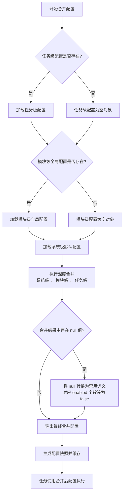

**验收标准**：

|编号 |验收标准 |验证方法 |
|---|---|---|
|AC-19-01 |任务级配置项正确覆盖模块级和系统级同名项 |设置任务级 max_entities=200，模块级 max_entities=500，验证合并结果为 200 |
|AC-19-02 |任务级未配置的项正确继承模块级配置 |仅设置任务级 max_entities，验证 confidence_threshold 继承模块级值 |
|AC-19-03 |模块级和任务级均未配置的项正确继承系统级默认值 |清空模块级和任务级配置，验证合并结果与系统级默认配置一致 |
|AC-19-04 |嵌套对象深度合并正确，非简单替换 |配置任务级仅修改 entity_extraction.confidence_threshold，验证其他子项保留 |
|AC-19-05 |数组类型配置项整体替换，非逐元素合并 |设置模块级 type_whitelist 为 2 项，验证合并结果为 2 项而非与系统级合并 |
|AC-19-06 |null 语义正确：任务级显式设置 null 的项不继承低优先级值 |设置任务级 keyword_extraction.enabled=null，验证合并结果 enabled=false |
|AC-19-07 |配置快照在任务创建时生成，后续配置变更不影响已创建任务 |修改模块级配置后，验证已创建任务的配置快照未变化 |


---

### 4.5 知识条目版本管理

**用户故事**：作为知识工程师，我希望查看 Knowledge 条目的历史版本，以便追溯知识变更记录，必要时回滚到之前的版本。

**版本管理机制**：

|维度 |说明 |
|---|---|
|版本号格式 |v{major}.{minor}.{patch}（SemVer 2.0.0），如 v1.0.0、v1.1.0、v2.0.0 |
|版本触发规则 |[TBD-产品决策] 增量更新产生 minor 版本升级（v1.0→v1.1），全量重建产生 major 版本升级（v1.0→v2.0） —— 依据：语义化版本控制规范 |
|版本保留策略 |[TBD-产品决策] 默认保留最近 10 个版本，超过后自动归档最旧版本 —— 依据：平衡存储成本与审计需求 |
|版本对比 |支持任意两个版本之间的差异对比（新增/修改/删除的 Entity、Relation、关键词、摘要） |
|版本回滚 |支持回滚到任意历史版本，回滚产生新版本（不删除当前版本） |
|向量版本 |[TBD-产品决策] 每个版本维护独立的 Embedding 向量，回滚时同步切换向量 —— 依据：不同版本的文本内容对应不同的向量表示 |

**版本数据模型**：

|字段 |类型 |说明 |
|---|---|---|
|Knowledge ID |string |Knowledge 条目唯一标识 |
|Version |string |版本号（如 v1.0） |
|Content Snapshot |json |该版本的完整内容快照 |
|Change Summary |string |变更摘要（如"新增 3 个 Entity，修改 2 个 Relation"） |
|Change Type |enum |minor_update / major_rebuild / manual_edit / rollback |
|Created By |string |变更操作人 |
|Created At |datetime |版本创建时间 |
|Vector Reference |string |[TBD-产品决策] 该版本对应的向量集合引用标识 —— 依据：向量与版本需一一对应 |

**验收标准**：

|编号 |验收标准 |验证方法 |
|---|---|---|
|AC-20-01 |增量更新后 Knowledge 版本号 minor 递增 |执行增量更新后检查版本号 |
|AC-20-02 |全量重建后 Knowledge 版本号 major 递增 |执行全量重建后检查版本号 |
|AC-20-03 |版本对比正确展示差异（新增/修改/删除） |对比 v1.0 和 v1.1 版本，验证差异内容 |
|AC-20-04 |回滚操作产生新版本，原版本保留 |回滚到 v1.0 后检查版本列表 |
|AC-20-05 |历史版本保留最近 10 个，超出后最旧版本自动归档 |创建 12 个版本后检查版本列表 |


---

### 4.6 知识与 Agent 关联关系管理

**用户故事**：作为知识工程师，我希望查看和管理 Knowledge 与 Agent 之间的关联关系，以便了解哪些 Knowledge 被哪些 Agent 使用，避免误删影响 Agent 功能。

**关联关系模型**：

|字段 |类型 |说明 |
|---|---|---|
|Relation ID |string |关联关系唯一标识 |
|Knowledge ID |string |Knowledge 条目 ID |
|Agent ID |string |Agent ID |
|Bind Type |enum |[TBD-产品决策] 绑定类型：auto（自动关联）/ manual（手动绑定） —— 依据：Agent 可通过检索自动使用 Knowledge，也可手动绑定特定 Knowledge |
|Bind Time |datetime |绑定时间 |
|Bind By |string |绑定操作人（manual 类型时有值） |
|Access Count |integer |[TBD-产品决策] Agent 访问该 Knowledge 的次数 —— 依据：用于评估 Knowledge 对 Agent 的价值 |
|Last Access Time |datetime |[TBD-产品决策] Agent 最后访问该 Knowledge 的时间 —— 依据：用于识别长期未使用的关联 |

**关联关系管理功能**：

|功能 |说明 |
|---|---|
|查看关联 |在 Knowledge 详情页展示关联的 Agent 列表及访问统计 |
|手动绑定 |在 Agent 配置页面手动绑定指定 Knowledge |
|解除绑定 |手动解除 Agent 与 Knowledge 的关联关系 |
|影响评估 |删除 Knowledge 时展示受影响的 Agent 列表 |
|关联推荐 |[TBD-产品决策] 根据 Agent 的功能描述和 Knowledge 的内容，推荐可能相关的 Knowledge —— 依据：LLM 可分析语义相似度进行推荐 |

**验收标准**：

|编号 |验收标准 |验证方法 |
|---|---|---|
|AC-21-01 |Knowledge 详情页正确展示关联的 Agent 列表及访问统计 |查看 3 条不同 Knowledge 的关联 Agent 信息 |
|AC-21-02 |手动绑定 Agent 与 Knowledge 后，关联关系即时生效 |绑定后 Agent 可检索到该 Knowledge |
|AC-21-03 |解除绑定后 Agent 不再自动检索该 Knowledge |解除绑定后验证 Agent 检索结果 |
|AC-21-04 |删除 Knowledge 时弹出受影响 Agent 列表 |删除被 2 个 Agent 关联的 Knowledge，验证提示内容 |


---

### 4.7 文档 OCR 处理降级策略

**用户故事**：作为知识工程师，我希望在 PDF 文档 OCR 质量不佳时系统能自动降级处理，以便尽可能提取有效内容而非直接失败。

**OCR 处理降级策略**：

|阶段 |处理方式 |触发条件 |说明 |
|---|---|---|---|
|阶段 0 |正常提取 |OCR 置信度 ≥ 0.7 且 提取内容 ≥ 10% |**v7 补充**：原表未显式列出"正常"区间，本节补齐为阶段 0；提取内容直接入库至"草稿"状态，进入 §2.5.1 审核流程 |
|阶段 1 |原生文本提取 |PDF 包含可提取文本层 |优先使用 PDF 内嵌文本，提取率最高 |
|阶段 2 |OCR 引擎识别 |PDF 为扫描件/图片 PDF，无可提取文本层 |[TBD-产品决策] 使用 Tesseract/PaddleOCR 双引擎 —— 依据：多引擎冗余是 OCR 系统的通用实践 |
|阶段 3 |混合模式 |部分页面有文本层，部分为扫描件 |逐页判断，分别使用文本提取或 OCR |
|阶段 4 |降级提示 |OCR 置信度 < 0.5 或 提取内容 < 10% |提示用户"PDF 解析质量不佳，建议上传文本版本"，支持手动修正 |
|阶段 5 |最小化提取 |OCR 置信度 0.5-0.7 |[TBD-产品决策] 提取内容标注"低置信度"标签，提醒用户人工复核 —— 依据：低置信度内容仍有参考价值 |

> **v7 收束说明(2026-06-16) 阈值区间完整性**: 阶段 0 显式定义了 `OCR 置信度 ≥ 0.7 且 提取内容 ≥ 10%` 的"正常提取"区间（双条件 AND），与阶段 4（`置信度 < 0.5` 或 `内容 < 10%`）和阶段 5（`0.5 ≤ 置信度 < 0.7`）构成完整的三段式置信度判定 [0, 0.5) / [0.5, 0.7) / [0.7, 1.0]。判定逻辑：先校验"内容覆盖度"（`< 10%` → 阶段 4 降级提示），再校验"置信度"（`< 0.5` → 阶段 4 降级提示；`[0.5, 0.7)` → 阶段 5 最小化提取；`≥ 0.7` → 阶段 0 正常提取）。

**OCR 引擎选择策略**：

|引擎 |优势 |适用场景 |置信度基准 |
|---|---|---|---|
|Tesseract |开源免费，多语言支持 |清晰印刷体文档 |≥ 0.8 |
|PaddleOCR |[TBD-产品决策] 中文识别精度高，支持表格识别 —— 依据：PaddleOCR 在中文场景下表现优异 |中文文档、含表格文档 |≥ 0.85 |
|LLM 辅助 |[TBD-产品决策] 利用多模态 LLM 直接理解图片内容 —— 依据：GPT-4V 等多模态模型具备文档理解能力 |复杂排版、手写体 |≥ 0.7 |

**验收标准**：

|编号 |验收标准 |验证方法 |
|---|---|---|
|AC-22-01 |含文本层的 PDF 优先使用原生文本提取，提取率 ≥ 95% |上传含文本层的 PDF，验证提取内容与原文一致率 |
|AC-22-02 |扫描件 PDF 自动切换 OCR 引擎，提取率 ≥ 70% |上传扫描件 PDF，验证提取内容覆盖率 |
|AC-22-03 |OCR 置信度 < 0.5 时弹出降级提示 |上传极低质量扫描件，验证提示弹窗 |
|AC-22-04 |低置信度内容标注"低置信度"标签 |上传中等质量扫描件，验证标签展示 |


---

### 4.8 知识域管理（Knowledge Domain Management）

> 本章节系统性参照 PRD-02 §7.2-7.4 的三级域模型（私有域 / 共享域 / 公共域），并与 PRD-01 的核心能力（知识图谱、知识类型、向量检索、知识条目版本、Agent 关联）做深度融合。Knowledge 数据是 RAG 检索的核心数据源，其访问控制粒度必须与 Memory（PRD-02）保持一致，才能确保企业级知识资产的安全。

#### 4.8.1 概述与三级域模型

**用户故事**：作为知识工程师/商户管理员，我希望对 Knowledge 数据采用三级域（私有 / 共享 / 公共）的隔离模型，以便在多用户、多团队、多商户场景下实现精细化访问控制，平衡知识共享与隐私保护。

**Knowledge 三级域模型定义**：

|域类型 |英文标识 |绑定关系 |访问范围 |写入权限 |删除权限 |
|---|---|---|---|---|---|
|私有知识域 |Private Knowledge Domain |绑定单个用户 ID |仅用户本人可访问 |用户本人 |用户本人 |
|共享知识域 |Shared Knowledge Domain |绑定 Group ID |域内成员按角色访问 |域管理员 / 编辑者 |域管理员 |
|公共知识域 |Public Knowledge Domain |系统级（全局唯一） |所有已登录用户 |系统管理员 |系统管理员 |

**与 PRD-02 域模型的一致性**：

|维度 |PRD-02（Memory） |PRD-01（Knowledge） |
|---|---|---|
|私有域 |绑定用户 ID |绑定用户 ID |
|共享域 |绑定 Group ID |绑定 Group ID |
|公共域 |系统级 |系统级 |
|跨域传输规则 |私有禁止直接到共享/公共 |**完全继承**（详见 §4.8.7） |
|域管理员角色 |Domain Admin |Domain Admin（共享域）/ System Admin（公共域） |
|脱敏策略 |标准 / 严格 / 关闭 |**完全继承**（详见 §4.8.10） |

**数据存储差异（Knowledge 特有 — 混合架构增强版）**：

|域 |PostgreSQL |Neo4j 知识图谱 |Vector Store |关联表 |
|---|---|---|---|---|
|私有 |RLS: `partition_key` |`Graph` 静态标签 + `WHERE n.partition_key = $partitionKey` + `owner_scope = 'OWN'` |向量索引 `{tid}_private_{uid}` + partition_key 过滤（其中 `{uid}` 取 `owner_id`） |`knowledge_agent_bind(domain=private)` |
|共享 |RLS: `partition_key` |`Graph` 静态标签 + `WHERE n.partition_key = $partitionKey` + `owner_scope = 'SHARED'` |向量索引 `{tid}_shared_{gid}` + partition_key 过滤（其中 `{gid}` 取 `domain_id`） |`knowledge_agent_bind(domain=shared)` |
|公共 |RLS: `partition_key` |`Graph` 静态标签 + `WHERE n.partition_key = $partitionKey` + `owner_scope = 'PUBLIC'` |向量索引 `{tid}_public_public` + partition_key 过滤（严格遵循 BR-01-051 格式，`domain_id` 固定为字面量 `'public'`，详见 BR-01-048） |`knowledge_agent_bind(domain=public)` |

> **v6 收束说明**：已统一为静态 `Graph` 标签（对齐 PRD-00 §7.3 权威规范），租户隔离通过 `WHERE n.partition_key = $partitionKey` 条件过滤实现，不再使用 `Graph{partition_key}` 动态标签。

> **v5 收束说明(2026-06-13)**：原 `SharedEntity` / `PublicEntity` 域类型标签已移除（详见 §15.2），域隔离由 `owner_scope` 字段 + PG RLS 表达，Neo4j 不再挂域类型标签。PostgreSQL 统一使用 RLS（`partition_key` 会话变量）实现租户隔离，不再使用 namespace 前缀。Neo4j 已统一为静态 `Graph` 标签 + `WHERE n.partition_key = $partitionKey` 条件过滤。

**验收标准**：

|编号 |验收标准 |验证方法 |
|---|---|---|
|AC-KD-01 |知识域模型与 PRD-02 §7 三级域模型字段完全一致（domain_type ∈ {private, shared, public}） |跨 PRD 数据模型比对 |
|AC-KD-02 |每条 Knowledge 记录包含 `domain_type` 与 `domain_id` 字段，创建时强制必填 |创建 Knowledge 后检查字段 |
|AC-KD-03 |域类型不匹配时返回 400 Bad Request |提交非法 domain_type 验证 |


---

#### 4.8.2 私有知识域（Private Knowledge Domain）

**用户故事**：作为系统用户，我希望我的私有 Knowledge 仅我本人可访问，以便保护个人学习笔记、私人研究、个性化偏好等知识资产不被他人查看。

**业务规则**：

- 每条私有域 Knowledge 在创建时自动绑定当前用户的 `owner_id`
- 私有域 Knowledge 关联的知识图谱 Entity / Relation 自动归属该用户的私有图谱
- 私有域 Knowledge 的向量自动写入该用户专属的向量索引
- 绑定关系不可更改（owner_id 一旦绑定不可转移）
- 私有域 Knowledge 可由 Agent 在用户授权下读写

**访问控制规则**：

|角色 |读取 |编辑 |删除 |管理 |
|---|:---:|:---:|:---:|:---:|
|Knowledge 所有者（用户本人） |✅ |✅ |✅ |✅ |
|团队管理员 |❌ |❌ |❌ |❌ |
|系统管理员 |仅审计日志 |❌ |❌ |仅紧急情况 |
|其他用户 |❌ |❌ |❌ |❌ |
|Agent（用户授权） |✅ |✅（系统自动） |❌ |❌ |

**跨域传输规则（私有域视角）**：

|传输方向 |是否允许 |说明 |
|---|---|---|
|私有域 → 私有域（本人） |允许 |同一用户的私有域内移动 |
|私有域 → 共享域 |禁止直接移动 |需用户显式操作（复制而非移动） |
|私有域 → 公共域 |禁止直接移动 |需通过发布申请审批流程（复制+审批） |
|共享域 → 私有域 |允许（复制） |共享域 Knowledge 可复制到个人私有域 |
|公共域 → 私有域 |允许（复制） |公共域 Knowledge 可复制到个人私有域 |

**图谱与向量融合机制**：

- **私有图谱**：Knowledge 包含的 Entity / Relation 在 Neo4j 中以 `Graph` 静态标签 + `WHERE n.partition_key = $partitionKey` 作为隔离键，跨域 Cypher 查询必须经过 partition_key 过滤
- **私有向量**：所有 Chunk 在 Neo4j 向量索引 `{tid}_private_{uid}` 中写入，检索时强制注入 partition_key 过滤

**验收标准**：

|编号 |验收标准 |验证方法 |
|---|---|---|
|AC-KD-04 |新创建的 Knowledge 在 100ms 内自动绑定当前用户 ID 至 `owner_id` 字段 |创建后检查 `owner_id` 字段值 |
|AC-KD-05 |绑定关系不可更改，任何修改 `owner_id` 的请求均返回 403 |尝试通过 API 修改 Knowledge 的 `owner_id` |
|AC-KD-06 |私有域 Knowledge 的 Entity / Relation 不出现在其他用户的图谱查询结果中 |跨用户 Cypher 查询验证 |
|AC-KD-07 |私有域 Knowledge 的向量检索结果不返回其他用户的向量（向量索引 + partition_key 强制过滤） |跨向量索引检索验证 |
|AC-KD-08 |用户本人可检索私有域 Knowledge，响应时间 ≤ 200ms（P95） |用户登录后检索并计时 |
|AC-KD-09 |私有域 Knowledge 移动到共享域/公共域返回 403 并记录审计日志 |尝试移动并检查审计日志 |


---

#### 4.8.3 共享知识域（Shared Knowledge Domain）

**用户故事**：作为团队管理员，我希望为团队/项目创建共享知识域，以便团队成员可以共建和维护团队级别的知识资产（如项目文档库、最佳实践库、技术规范库等）。

**业务规则**：

- 每个共享域绑定一个 Group ID
- Group ID 在创建共享域时自动生成或手动指定
- 共享域内的所有 Knowledge 通过 Group ID 关联
- 一个 Group 可包含多个共享域（如"项目A知识域"、"团队技能知识域"）
- 共享域内的知识图谱共享相同的 Group 隔离边界
- 共享域内的向量共享相同的向量索引

**共享域知识图谱融合**：

- **共享图谱**：所有共享域 Entity / Relation 在 Neo4j 中以 `Graph` 静态标签 + `WHERE n.partition_key = $partitionKey` + `owner_scope = 'SHARED'` 作为隔离键
- **跨共享域查询**：用户同时属于多个 Group 时，可通过 `domain_id IN [group_a, group_b]` 联合查询
- **图谱权限继承**：Group 成员在图谱上的权限与在 Knowledge 上的权限完全一致

**共享域向量检索融合**：

- 共享域所有 Chunk 写入 Neo4j 向量索引 `{tid}_shared_{gid}`
- Agent 检索时根据 Agent 所属 Group 列表注入 partition_key 过滤
- 跨 Group 向量检索需用户显式选择多向量索引（受权限校验）

**成员角色定义**：

|角色 |权限 |说明 |
|---|---|---|
|域管理员（Domain Admin） |全部权限 |创建/编辑/删除 Knowledge（含他人创建），管理成员，配置配额 |
|编辑者（Editor） |受限写权限 |创建 Knowledge、**仅编辑自己创建的** Knowledge、查看成员列表；不能编辑他人创建的 Knowledge、不能管理成员（详见 §4.8.10 权限矩阵） |
|查看者（Viewer） |只读权限 |仅查看 Knowledge 列表和详情、图谱只读、向量检索 |

**成员管理操作**：

|操作 |权限要求 |说明 |
|---|---|---|
|添加成员 |域管理员 |添加用户到共享域并分配角色 |
|移除成员 |域管理员 |从共享域移除用户 |
|修改角色 |域管理员 |修改成员的角色 |
|查看成员列表 |所有成员 |查看共享域的成员列表 |

**外部阻断机制**：

|阻断场景 |规则 |处理方式 |
|---|---|---|
|外部 API 调用 |非本系统 API 请求访问共享域数据 |返回 403 Forbidden |
|未授权 Agent |未加入该共享域的 Agent 尝试读写 |返回 403 Forbidden |
|跨租户访问 |其他商户的 Agent 或用户尝试访问 |返回 403 Forbidden |
|数据导出 |非管理员尝试批量导出共享域数据 |返回 403 Forbidden |

**验收标准**：

|编号 |验收标准 |验证方法 |
|---|---|---|
|AC-KD-10 |共享域创建时正确绑定 Group ID，绑定操作在 200ms 内完成 |创建后检查 binding 关系 |
|AC-KD-11 |共享域 Knowledge 通过 Group ID 正确关联，关联查询响应时间 ≤ 200ms |在共享域创建 Knowledge 后检查关联 |
|AC-KD-12 |域管理员可添加/移除成员，操作在 500ms 内完成 |使用域管理员账户操作并计时 |
|AC-KD-13 |编辑者可创建/编辑 Knowledge 但管理成员操作返回 403 |使用编辑者账户尝试管理成员 |
|AC-KD-14 |查看者仅可查看 Knowledge（含图谱、向量），创建/编辑操作返回 403 |使用查看者账户尝试编辑 |
|AC-KD-15 |共享域内向量检索结果严格限定为该 Group 的向量索引，跨 Group 不返回 |跨向量索引检索验证 |
|AC-KD-16 |共享域 Entity 不会出现在非成员用户的图谱查询中 |跨域 Cypher 查询验证 |


---

#### 4.8.4 公共知识域（Public Knowledge Domain）

**用户故事**：作为系统管理员，我希望通过公共知识域沉淀跨团队、跨商户可复用的通用知识（如行业知识、最佳实践、系统级规范），以便所有用户和 Agent 都能获取到公共的背景知识。

**公共域定义特征**：

|特征 |说明 |
|---|---|
|全局可见 |所有已登录用户均可读取公共域 Knowledge（图谱、向量） |
|写入受限 |仅系统管理员可写入，普通用户通过"发布申请"流程提交 Knowledge 到公共域 |
|不可删除 |普通用户不可删除公共域 Knowledge，仅系统管理员可操作 |
|自动脱敏 |公共域 Knowledge 强制执行严格脱敏级别 |
|无衰减 |公共域 Knowledge 不参与艾宾浩斯衰减，长期保留 |

**公共域知识图谱融合**：

- **公共图谱**：所有公共域 Entity / Relation 在 Neo4j 中以 `Graph` 静态标签 + `WHERE n.partition_key = $partitionKey` + `owner_scope = 'PUBLIC'` 作为隔离键
- **公共 Schema**：公共域使用系统预置的 Entity Type / Relation Type 集合
- **跨域图谱查询**：私有域、共享域查询公共图谱时自动合并结果（按权限过滤）

**公共域向量检索融合**：

- 公共域所有 Chunk 写入 Neo4j 向量索引 `{tid}_public_public`（严格遵循 BR-01-051 格式，其中 `domain_id` 固定为字面量 `'public'`，与 BR-01-048 一致）
- 所有 Agent 默认包含 `public` 向量索引的检索权限
- 公共域向量强制高置信度（≥ 0.85）才可写入，避免低质量数据污染公共知识

**发布申请流程**：

|步骤 |操作 |系统响应 |
|---|---|---|
|1 |用户在私有域或共享域 Knowledge 上选择"申请发布到公共域" |弹出发布申请表单 |
|2 |用户填写发布理由和适用范围 |系统展示表单 |
|3 |用户提交申请 |系统创建发布申请，通知系统管理员 |
|4 |系统管理员审核 |批准/拒绝，拒绝需填写理由 |
|5 |审核通过 |Knowledge 副本（严格脱敏后）发布到公共域 |
|6 |审核拒绝 |通知申请人拒绝理由 |

**验收标准**：

|编号 |验收标准 |验证方法 |
|---|---|---|
|AC-KD-17 |所有已登录用户可读取公共域 Knowledge（含图谱、向量），响应时间 ≤ 200ms |使用普通用户账户访问公共域 |
|AC-KD-18 |普通用户写操作返回 403 Forbidden |使用普通用户尝试创建公共域 Knowledge |
|AC-KD-19 |发布申请提交后系统管理员在 5 秒内收到通知 |提交申请后检查通知 |
|AC-KD-20 |公共域 Knowledge 强制执行严格脱敏，脱敏覆盖率 100% |创建含敏感信息的公共域 Knowledge 验证 |
|AC-KD-21 |公共域 Knowledge 不参与衰减，长期保留 |创建公共域 Knowledge 后观察 30 天 |
|AC-KD-22 |公共域向量检索置信度阈值 ≥ 0.85，低于阈值的内容禁止写入 |提交低置信度内容验证拒绝 |
|AC-KD-23 |公共域 Schema 与私有 / 共享域 Schema 隔离，公共域使用系统预置类型 |跨域 Schema 变更验证 |


---

#### 4.8.5 知识图谱与知识域的深度融合

**用户故事**：作为知识工程师，我希望知识图谱的 Entity、Relation、Schema 都按域隔离，以便图谱查询严格受域边界约束，防止知识资产跨域泄露。

**域级图谱结构**（混合架构增强版）：

|图谱类型 |Neo4j 节点标签 |隔离键 |Schema 归属 |
|---|---|---|---|
|租户图谱 |`KnowledgeEntity` + 实体类型标签 + `Graph` |`Graph` 静态标签 + `WHERE n.partition_key = $partitionKey` |租户 Schema |
|共享图谱 |`Graph` + `owner_scope = 'SHARED'` |`Graph` 静态标签 + `WHERE n.partition_key = $partitionKey` + `owner_scope` 属性 |共享域 Schema |
|公共图谱 |`Graph` + `owner_scope = 'PUBLIC'` |`Graph` 静态标签 + `WHERE n.partition_key = $partitionKey` + `owner_scope` 属性 |公共域 Schema |

> **v5 收束说明(2026-06-13)**：原 `PrivateEntity/SharedEntity/PublicEntity` 域类型标签升级为"基础标签 + 实体类型标签 + 租户标签"三层（v5 收束后两层：基础标签 + 租户标签）。已统一为静态 `Graph` 标签（对齐 PRD-00 §7.3），租户隔离通过 `WHERE n.partition_key = $partitionKey` 条件过滤实现，域隔离由 `owner_scope` 字段 + PG RLS 表达，不再挂 Neo4j 域类型标签。

**域级 Schema 管理**：

|Schema 类型 |可见范围 |可编辑角色 |跨域引用 |
|---|---|---|---|
|私有域 Schema |仅所有者 |所有者本人 |禁止 |
|共享域 Schema |域内所有成员 |域管理员 |禁止 |
|公共域 Schema |所有用户 |系统管理员 |允许（仅作为引用） |

**跨域图查询拦截规则**（混合架构增强版）：

|查询类型 |是否允许 |Cypher 约束 |
|---|---|---|
|租户内查询 |允许 |`MATCH (n:Graph) WHERE n.partition_key = $partitionKey` |
|共享知识查询 |允许 |`MATCH (n:Knowledge) WHERE n.owner_scope = 'SHARED' AND $partition_key IN n.shared_tenant_ids` |
|公共知识查询 |允许 |`MATCH (n:Knowledge) WHERE n.owner_scope = 'PUBLIC'` |
|私有 → 共享跨域查询 |禁止 |返回 403 |
|共享 → 私有跨域查询 |禁止 |返回 403 |
|用户多域联合查询 |允许（只读） |合并 `Graph` + `WHERE n.partition_key = $partitionKey` + `owner_scope IN ('SHARED', 'PUBLIC')` 查询结果 |
|跨租户图查询 |禁止 |`partition_key` 不匹配返回 403 |

**图谱路径查询的域过滤**：

GraphQL `query knowledgeGraphPath(input: GraphPathInput!)` 接口必须接受 `domainIds` 参数：

- 默认 `domainIds = ["private", "public"]`（用户私有 + 公共）
- 用户可显式追加 `shared` 中所属 Group 的 domain_id
- 服务端强制校验：传入的 `domainIds` 必须为当前用户有权访问的域

**验收标准**：

|编号 |验收标准 |验证方法 |
|---|---|---|
|AC-KD-24 |私有域 Entity 不出现在其他用户的图谱查询中（包括路径查询、邻居查询） |跨用户 Cypher 验证 |
|AC-KD-25 |共享域 Entity 不会出现在非成员用户的图谱查询中 |跨 Group 验证 |
|AC-KD-26 |公共域 Entity 出现在所有用户的图谱查询结果中 |跨用户查询公共 Entity |
|AC-KD-27 |跨域图谱查询（含路径查询）必须在请求中显式声明 `domainIds` |API 请求验证 |
|AC-KD-28 |域级 Schema 变更不影响其他域的 Entity / Relation 抽取 |修改私有域 Schema 验证公共域不受影响 |
|AC-KD-29 |跨租户图查询返回 403，禁止任何形式的 partition_key 跨域 |跨租户 Cypher 验证 |


---

#### 4.8.6 向量检索与知识域的深度融合

**用户故事**：作为 AI Agent，我希望向量检索严格按域边界过滤，以便 RAG 检索不会泄露跨域知识，确保 Agent 引用知识的安全合规。

**域级向量索引**：

|域 |向量索引名称 |隔离机制 |
|---|---|---|
|私有 |`{tid}_private_{uid}` |Neo4j 向量索引 + partition_key |
|共享 |`{tid}_shared_{gid}` |同上 |
|公共 |`{tid}_public` |同上 |

**RAG 检索的域过滤流程**：

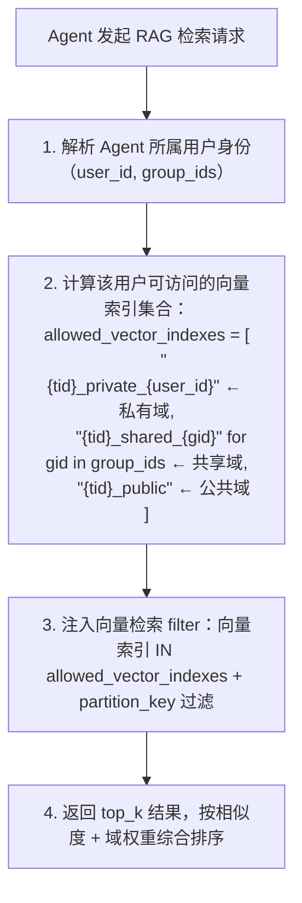


**跨域向量检索的禁止规则**：

|操作 |是否允许 |说明 |
|---|---|---|
|跨向量索引检索 |禁止 |服务端在 query 层强制注入 partition_key 过滤，客户端无法绕过 |
|跨租户向量检索 |禁止 |partition_key 不匹配返回 403 |
|未授权向量索引检索 |禁止 |即便客户端传入 filter，服务端也会二次校验 |

**向量与图谱的一致性保证**：

- Knowledge 删除时同步删除对应 Chunk 的向量
- Knowledge 状态变更为"已废弃"时同步标记向量为不可检索
- Knowledge 跨域共享时同步在目标域生成新向量（保留原向量在源域）
- 知识图谱 Entity 删除时同步清理关联向量的引用

**验收标准**：

|编号 |验收标准 |验证方法 |
|---|---|---|
|AC-KD-30 |RAG 检索结果严格限定在用户可访问的向量索引集合内，跨域向量不返回 |跨域向量检索验证 |
|AC-KD-31 |客户端无法通过自定义 filter 绕过向量索引限制 |注入非法 filter 验证 |
|AC-KD-32 |跨租户向量检索返回 403 |跨租户检索验证 |
|AC-KD-33 |Knowledge 删除时向量在 1 秒内同步删除 |删除后查询向量验证 |
|AC-KD-34 |Knowledge 跨域共享时目标域自动生成新向量 |共享后检索目标域验证 |
|AC-KD-35 |公共域向量检索置信度阈值 ≥ 0.85，低于阈值的内容禁止检索返回 |低置信度内容验证 |


---

#### 4.8.7 知识类型与知识域的融合

**用户故事**：作为商户管理员，我希望知识类型按域隔离，以便不同域的分类体系互不干扰，公共类型可被私有 / 共享域引用。

**域级类型隔离规则**：

|域 |类型可见范围 |类型编辑权限 |跨域引用 |
|---|---|---|---|
|私有域类型 |仅所有者 |所有者 |禁止被其他域引用 |
|共享域类型 |域内成员 |域管理员 |可被同域其他成员引用 |
|公共域类型 |所有用户 |系统管理员 |可被私有 / 共享域引用（单向：私有/共享 → 公共） |

**域级类型引用流程**：

```text
私有域类型 A 引用公共域类型 X
  ↓
校验：X 必须是公共域类型，且 type_code 全局唯一
  ↓
在 A 的 metadata 中记录 `referenced_public_types: [X.type_code]`
  ↓
A 创建 Knowledge 时，X 类型的字段定义从公共域 Schema 拉取（不允许本地覆盖）
```

**验收标准**：

|编号 |验收标准 |验证方法 |
|---|---|---|
|AC-KD-36 |私有域类型仅所有者可见，其他域用户无法查询 |跨用户类型查询验证 |
|AC-KD-37 |共享域类型仅域内成员可见，非成员无法查询 |跨 Group 类型查询验证 |
|AC-KD-38 |私有 / 共享域可引用公共域类型，引用关系单向 |跨域类型引用验证 |
|AC-KD-39 |域级类型编码在域内唯一，跨域允许重名 |同名类型跨域创建验证 |
|AC-KD-40 |域级类型统计按域分类聚合，KPI 仪表盘正确展示 |类型分布统计验证 |


---

#### 4.8.8 知识条目版本管理与域的融合

**用户故事**：作为知识工程师，我希望 Knowledge 的版本管理按域隔离，以便不同域的版本链互不干扰，跨域共享时版本独立。

**域级版本管理**：

- 私有域 Knowledge 拥有独立的版本链（v1.0 → v1.1 → ...）
- 共享域 Knowledge 拥有独立的版本链
- 公共域 Knowledge 拥有独立的版本链
- 跨域复制时生成新的 Knowledge ID 与版本链（不继承源版本链）

**域级 Agent 关联管理**：

- Agent 与 Knowledge 的关联关系按域隔离
- Agent 在私有域关联的 Knowledge 不会出现在共享域或公共域的关联列表中
- Agent 跨域检索时，根据其所属向量索引自动注入关联过滤

**验收标准**：

|编号 |验收标准 |验证方法 |
|---|---|---|
|AC-KD-41 |私有域 Knowledge 的版本链仅本人可见 |跨用户版本查询验证 |
|AC-KD-42 |共享域 Knowledge 的版本链仅域内成员可见 |跨 Group 版本查询验证 |
|AC-KD-43 |跨域复制 Knowledge 时生成新的 Knowledge ID 与版本链 |复制后检查 ID 与版本 |
|AC-KD-44 |Agent 关联的 Knowledge 列表按域过滤，跨域关联不返回 |跨域关联查询验证 |


---

#### 4.8.9 跨域知识共享与发布

**用户故事**：作为系统用户，我希望能够将私有 Knowledge 共享到共享域或申请发布到公共域，以便团队和全平台用户复用我的知识资产。

**跨域共享方式**：

|共享方式 |源域 |目标域 |触发者 |操作类型 |
|---|---|---|---|---|
|用户主动共享 |私有域 |共享域 |用户本人 |复制（保留源） |
|管理员推送 |共享域 |私有域 |域管理员 |复制 |
|管理员推送 |共享域 |公共域 |系统管理员 |复制 + 审批 |
|用户复制 |共享域 |私有域 |用户本人 |复制 |
|用户复制 |公共域 |私有域 |用户本人 |复制 |
|用户复制 |公共域 |共享域 |域管理员 |复制（需域管理员审批） |
|用户主动发布申请 |私有/共享 |公共域 |用户本人 |复制 + 审批 |

**用户主动共享（私有 → 共享）流程**：

|步骤 |操作 |系统响应 |
|---|---|---|
|1 |用户在私有域 Knowledge 上选择"共享到..." |系统展示可用的共享域列表 |
|2 |用户选择目标共享域 |系统展示该共享域的信息和成员数 |
|3 |用户确认共享 |系统创建 Knowledge 副本（含图谱、向量）到目标共享域，原始 Knowledge 保留在私有域 |
|4 |共享完成 |系统通知共享域管理员"有新 Knowledge 被共享" |

**验收标准**：

|编号 |验收标准 |验证方法 |
|---|---|---|
|AC-KD-45 |用户可从私有域共享 Knowledge 到共享域，共享操作在 1 秒内完成 |执行共享操作验证 |
|AC-KD-46 |共享后原始 Knowledge 完整保留在私有域，内容无变化 |共享后检查私有域 Knowledge |
|AC-KD-47 |共享的 Knowledge 自动脱敏，脱敏规则与目标域的脱敏级别一致 |共享后检查目标域脱敏结果 |
|AC-KD-48 |共享域管理员在 5 秒内收到通知 |共享后检查通知 |
|AC-KD-49 |跨域共享时同步生成图谱副本（Entity/Relation 完整复制到目标域图谱） |跨域图谱复制验证 |
|AC-KD-50 |跨域共享时同步生成向量副本（Chunk 与 Embedding 写入目标域向量索引） |跨域向量复制验证 |


---

#### 4.8.10 知识域权限操作矩阵

**用户故事**：作为系统管理员，我希望通过权限操作矩阵清晰定义不同角色在不同域上的操作权限，以便实现精细化的访问控制。

**完整权限矩阵**：

|操作 |私有域（本人） |私有域（他人） |共享域（域管理员） |共享域（编辑者） |共享域（查看者） |共享域（非成员） |公共域（所有用户） |公共域（系统管理员） |
|---|:---:|:---:|:---:|:---:|:---:|:---:|:---:|:---:|
|查看 Knowledge 列表 |✅ |❌ |✅ |✅ |✅ |❌ |✅ |✅ |
|查看 Knowledge 详情 |✅ |❌ |✅ |✅ |✅ |❌ |✅ |✅ |
|查看知识图谱（图可视化） |✅ |❌ |✅ |✅ |✅ |❌ |✅ |✅ |
|图谱路径查询 |✅ |❌ |✅ |✅ |✅ |❌ |✅ |✅ |
|向量检索 |✅ |❌ |✅ |✅ |✅ |❌ |✅ |✅ |
|创建 Knowledge |✅ |❌ |✅ |✅ |❌ |❌ |❌ |✅ |
|编辑 Knowledge |✅ |❌ |✅ |仅本人创建 |❌ |❌ |❌ |✅ |
|删除 Knowledge |✅ |❌ |✅ |❌ |❌ |❌ |❌ |✅ |
|上传源文档 |✅ |❌ |✅ |✅ |❌ |❌ |❌ |✅ |
|触发知识更新 |✅ |❌ |✅ |✅ |❌ |❌ |❌ |✅ |
|跨域复制到私有域 |— |❌ |✅ |✅ |✅ |❌ |✅ |✅ |
|共享到共享域 |✅（复制） |❌ |✅ |✅ |❌ |❌ |❌ |✅ |
|发布申请到公共域 |✅ |❌ |✅ |✅ |❌ |❌ |❌ |✅ |
|导出 Knowledge |✅ |❌ |✅ |✅ |✅ |❌ |✅ |✅ |
|管理域成员 |— |❌ |✅ |❌ |❌ |❌ |— |✅ |
|管理域配额 |❌ |❌ |✅ |❌ |❌ |❌ |— |✅ |
|查看审计日志 |❌ |❌ |✅ |❌ |❌ |❌ |❌ |✅ |
|修改脱敏级别 |❌ |❌ |✅ |❌ |❌ |❌ |❌ |✅ |

> 注：❌ 表示禁止操作，系统返回 403 Forbidden；— 表示该操作在该场景下不适用

**验收标准**：

|编号 |验收标准 |验证方法 |
|---|---|---|
|AC-KD-51 |权限矩阵中所有 ❌ 操作均被系统拦截，返回 403 Forbidden |使用不同角色尝试各操作，验证拦截率 100% |
|AC-KD-52 |共享域编辑者可编辑自己创建的 Knowledge，编辑他人创建的返回 403 |共享域编辑者分别编辑自己和他人的 Knowledge |
|AC-KD-53 |共享域查看者仅可查看 Knowledge（图谱只读、向量检索可），任何写操作返回 403 |使用查看者账户尝试创建/编辑/删除 |
|AC-KD-54 |公共域仅系统管理员可写入，其他用户写操作返回 403 |使用普通用户尝试在公共域创建 Knowledge |


---

#### 4.8.11 域级配额与统计

**用户故事**：作为系统管理员，我希望为不同域设置配额策略，以便资源管控精细化，运营成本可控。

**配额策略**：

|域 |默认配额 |说明 |
|---|---|---|
|私有域 Knowledge 条数上限 |10,000 条/用户 |单个用户的私有域最大 Knowledge 条数 |
|私有域存储上限 |2 GB/用户 |单个用户的私有域最大存储空间 |
|共享域 Knowledge 条数上限 |50,000 条/域 |单个共享域的最大 Knowledge 条数 |
|共享域存储上限 |10 GB/域 |单个共享域的最大存储空间 |
|共享域成员数上限 |50 人/域 |单个共享域的最大成员数 |
|公共域 Knowledge 条数上限 |不限 |系统级，知识沉淀无上限 |
|公共域存储上限 |100 GB/租户 |单租户公共域最大存储空间 |

**预警规则**：

|阈值 |级别 |处理方式 |
|---|---|---|
|使用率 ≥ 70% |警告（Warning） |黄色提示横幅，邮件通知管理员 |
|使用率 ≥ 90% |严重（Critical） |橙色提示横幅，邮件+站内信通知管理员 |
|使用率 = 100% |满载（Full） |红色提示横幅，拦截新的 Knowledge 创建操作 |

**域统计指标**：

|统计项 |私有域 |共享域 |公共域 |
|---|---|---|---|
|域数量 |用户数 |共享域数 |1（系统级） |
|Knowledge 总条数 |累计 |累计 |累计 |
|活跃 Knowledge 数 |状态为"已发布"的 |状态为"已发布"的 |状态为"已发布"的 |
|已归档 Knowledge 数 |状态为"已归档"的 |状态为"已归档"的 |状态为"已归档"的 |
|Entity 总数 |累计 |累计 |累计 |
|Relation 总数 |累计 |累计 |累计 |
|向量总数 |累计 |累计 |累计 |
|存储使用量 |MB |MB |MB |
|配额使用率 |% |% |% |
|本月新增 |条 |条 |条 |

**验收标准**：

|编号 |验收标准 |验证方法 |
|---|---|---|
|AC-KD-55 |各域配额默认值与表格一致 |配置项比对 |
|AC-KD-56 |使用率 ≥ 70% 时在 30 秒内触发黄色预警横幅和邮件通知 |模拟配额使用率验证 |
|AC-KD-57 |使用率 = 100% 时拦截新 Knowledge 创建，返回 HTTP 200 + 业务错误码 050429（配额超限） |模拟满载后尝试创建 |
|AC-KD-58 |各域统计数据准确，与数据库原始数据偏差 ≤ 0.1% |对比数据库原始数据 |
|AC-KD-59 |域级 KPI 在仪表盘正确展示，跨域聚合正确 |仪表盘统计验证 |


---

#### 4.8.12 域级脱敏与隐私保护

**用户故事**：作为合规官，我希望跨域共享和公共域发布自动执行严格脱敏，以便满足 GDPR / CCPA 合规要求，避免敏感信息泄露。

**域级脱敏级别**：

|脱敏级别 |适用域 |脱敏字段 |默认值 |
|---|---|---|---|
|严格（Strict） |公共域、跨域共享目标域 |手机号、身份证、银行卡、邮箱、姓名、地址 |公共域默认 |
|标准（Standard） |共享域 |手机号、身份证、银行卡、邮箱 |共享域默认 |
|关闭（Off） |私有域 |不脱敏 |私有域默认 |

**脱敏规则**（与 PRD-02 §7.2.4 一致）：

|字段类型 |脱敏规则 |示例 |
|---|---|---|
|手机号 |中间 4 位替换为 `****` |138****5678 |
|身份证号 |保留前 3 位和后 4 位 |110***********1234 |
|银行卡号 |保留后 4 位 |**** **** **** 5678 |
|邮箱地址 |用户名部分部分替换 |z***@example.com |
|姓名 |全名替换为"***" |*** |
|地址 |详细地址部分替换为"**" |北京市朝阳区** |

**自动脱敏时机**：

- Knowledge 写入时：自动检测并脱敏敏感信息
- Knowledge 跨域共享时：按目标域脱敏级别执行
- Knowledge 发布到公共域时：按严格脱敏执行
- Knowledge 展示时：二次校验，确保展示内容已脱敏
- Knowledge 导出时：强制脱敏

**验收标准**：

|编号 |验收标准 |验证方法 |
|---|---|---|
|AC-KD-60 |包含手机号的 Knowledge 在跨域共享时 100% 自动脱敏 |跨域共享含手机号 Knowledge 验证 |
|AC-KD-61 |公共域 Knowledge 强制执行严格脱敏，脱敏覆盖率 100% |创建含敏感信息的公共域 Knowledge |
|AC-KD-62 |私有域 Knowledge 不参与自动脱敏，保留原始内容 |私有域 Knowledge 写入验证 |
|AC-KD-63 |脱敏后的 Knowledge 在列表、详情、图谱、向量检索结果中均正确展示脱敏结果 |多场景展示验证 |
|AC-KD-64 |跨域共享时脱敏处理延迟 ≤ 100ms |测量跨域共享含敏感信息 Knowledge 的额外耗时 |


---

## 4.9 核心流程图与异常处理

> **本章节为新增章节**;补充核心业务流程图和系统性异常处理流程，填补原文档在主流程可视化和异常场景描述方面的缺失。

### 4.9.1 知识查询主流程

**流程说明**：

|步骤 |操作 |说明 |
|---|---|---|
|1 |用户输入查询词 |用户在前端发起知识查询请求 |
|2 |参数校验 |校验查询参数合法性（长度、特殊字符） |
|3 |权限校验 |校验用户是否有权访问目标域 |
|4 |向量检索 |将查询词转换为向量，在 Vector Store 中检索相似 Knowledge |
|5 |结果过滤 |根据域权限过滤结果，仅返回用户有权限访问的 Knowledge |
|6 |排序返回 |按相似度得分排序，返回结果 |

**文字流程图**：

```text
用户发起查询
    ↓
参数校验 → 失败 → 返回400错误
    ↓
权限校验 → 失败 → 返回403错误
    ↓
向量检索服务 → 失败 → 降级到全文检索
    ↓
结果过滤（域权限）
    ↓
排序返回
    ↓
前端展示
```

### 4.9.2 文档导入主流程

**流程说明**：

|步骤 |操作 |说明 |
|---|---|---|
|1 |文件上传 |用户上传文档文件 |
|2 |格式校验 |校验文件格式和大小 |
|3 |病毒扫描 |对文件进行安全扫描 |
|4 |存储文件 |将文件存入对象存储 |
|5 |触发提取 |异步触发知识提取任务 |
|6 |文本提取 |从文档中提取文本内容 |
|7 |OCR处理（如需） |对扫描件PDF进行OCR |
|8 |向量化 |生成文本的向量表示 |
|9 |知识构建 |构建Knowledge条目并关联向量 |
|10 |通知用户 |通知用户导入结果 |

**流程图**：

> **v9 收束说明(2026-06-16) text 转 mermaid**: 原 text 代码块 v9 收束统一为 mermaid flowchart，与 §2.5 风格统一。

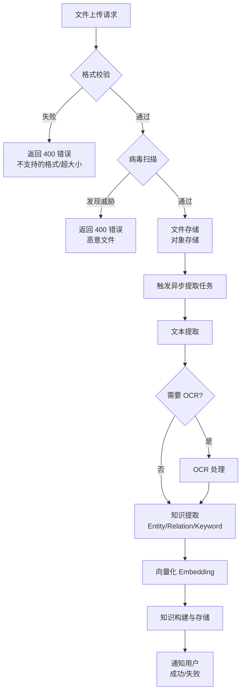

#### 文档导入进度反馈机制

**进度状态**：`QUEUED`（排队中）→ `PROCESSING`（处理中，含百分比）→ `COMPLETED`（完成）/ `FAILED`（失败）

**进度查询**：

- GraphQL Subscription：`subscription documentImportProgress($taskId: ID!)` 实时推送进度更新
- GraphQL Query：`query documentImportStatus($taskId: ID!)` 查询当前状态

**进度信息**：

- `taskId`：导入任务ID
- `status`：当前状态
- `progress`：处理进度百分比（0-100）
- `currentStep`：当前步骤描述（如"正在提取第3/10页内容"）
- `estimatedTimeRemaining`：预计剩余时间（秒）
- `errorMessage`：失败原因（仅 FAILED 状态）

**任务列表**：知识管理列表页展示所有导入任务及当前状态，支持按状态筛选。

### 4.9.3 知识提取异步处理流程

**流程说明**：

|步骤 |操作 |说明 |
|---|---|---|
|1 |任务入队 |提取任务加入异步消息队列 |
|2 |任务调度 |调度器从队列取出任务 |
|3 |执行提取 |调用LLM服务进行知识提取 |
|4 |结果存储 |存储提取结果到数据库 |
|5 |向量更新 |更新Vector Store中的向量 |
|6 |状态更新 |更新Knowledge状态为"已发布" |

**流程图**：

> **v9 收束说明(2026-06-16) text 转 mermaid**: 原 text 代码块 v9 收束统一为 mermaid flowchart，与 §2.5 风格统一。

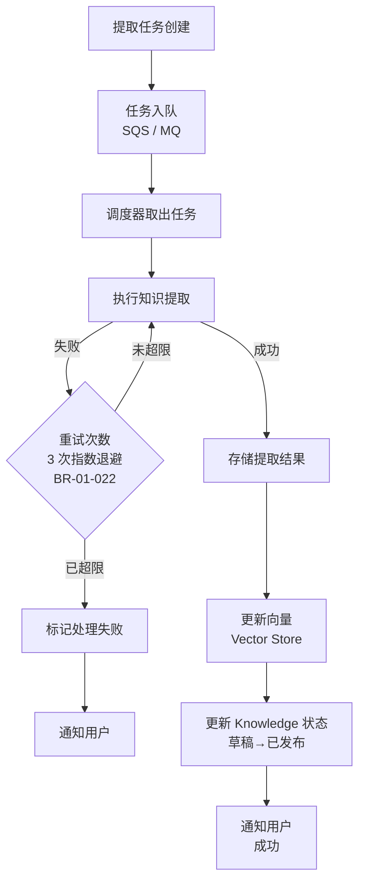

### 4.9.4 异常流程

#### 4.9.4.1 网络超时异常

|场景 |触发条件 |处理逻辑 |
|---|---|---|
|API调用超时 |HTTP请求超过30秒未响应 |自动重试3次（指数退避1s/2s/4s），仍失败返回错误 |
|数据库连接超时 |数据库连接超过10秒 |返回503 Service Unavailable，触发告警 |
|向量存储超时 |Vector Store查询超过5秒 |降级到全文检索，同时告警 |

#### 4.9.4.2 并发冲突异常

|场景 |触发条件 |处理逻辑 |
|---|---|---|
|同一文档并发导入 |同一文档有2个以上处理任务 |保留最新任务，其他任务返回409 Conflict |
|知识条目并发编辑 |同一Knowledge有2个以上编辑请求 |基于乐观锁版本号，后提交的返回409 |
|批量操作并发 |批量操作进行中又有新的修改 |排队等待，完成后返回最新状态 |

#### 4.9.4.3 LLM服务不可用异常

|场景 |触发条件 |处理逻辑 |
|---|---|---|
|提取服务LLM不可用 |LLM API返回5xx或超时 |降级为规则提取（正则匹配），同时告警 |
|Embedding服务不可用 |Embedding API不可用 |返回503，阻止新知识入库，已入库知识可查询 |
|LLM配额超限 |API配额用尽 |排队等待，配额恢复后自动继续 |

#### 4.9.4.4 向量存储不可用异常

|场景 |触发条件 |处理逻辑 |
|---|---|---|
|Vector Store完全不可用 |连接超时或返回5xx |降级到全文检索（PostgreSQL pg_trgm + tsvector），显示降级提示 |
|Vector Store部分不可用 |某些向量索引不可访问 |仅对不可访问的向量索引返回错误，其他正常 |
|向量数据损坏 |向量数据读取失败 |标记该向量为不可用，从搜索结果中排除，触发修复任务 |

#### 4.9.4.5 数据库故障异常

|场景 |触发条件 |处理逻辑 |
|---|---|---|
|PostgreSQL只读 |主库故障，切换到从库 |从库读取，返回只读提示 |
|PostgreSQL完全不可用 |主从都不可用 |返回503，触发P0告警，启动RTO流程 |
|Neo4j不可用 |图数据库连接失败 |禁用图可视化功能，其他功能正常 |
|事务失败 |分布式事务超时或回滚 |自动重试3次，仍失败返回错误并回滚 |

#### 4.9.4.6 权限不足异常

|场景 |触发条件 |处理逻辑 |
|---|---|---|
|跨域访问 |用户访问非授权域的知识 |返回403 Forbidden |
|跨租户访问 |用户访问其他商户的数据 |返回403 Forbidden，立即告警（疑似攻击） |
|操作权限不足 |用户执行无权进行的操作 |返回403 Forbidden，提示需要什么权限 |
|Token过期 |JWT token过期 |返回401 Unauthorized，提示重新登录 |

#### 4.9.4.7 数据校验失败异常

|场景 |触发条件 |处理逻辑 |
|---|---|---|
|文件格式错误 |上传不支持的文件格式 |返回400 Bad Request，提示支持的格式 |
|文件大小超限 |上传文件超过大小限制 |返回400 Bad Request，提示大小限制 |
|字段校验失败 |必填字段为空或格式错误 |返回400 Bad Request，列出所有校验失败字段 |
|唯一性冲突 |创建重复的名称/编码 |返回409 Conflict，提示已存在 |

#### 4.9.4.8 资源配额超限异常

|场景 |触发条件 |处理逻辑 |
|---|---|---|
|域配额用尽 |域存储达到100% |返回 HTTP 200 + 业务错误码 050429（配额超限），提示清理或扩容 |
|并发任务超限 |超过每商户5个并发任务限制 |任务排队，返回排队状态和预计等待时间 |
|API调用频率超限 |超过每分钟API调用限制 |返回 HTTP 200 + 业务错误码 050429（限流），提示降低调用频率 |

### 4.9.5 状态流转完整图

> **v7 收束说明(2026-06-16) 与 §5.6 互引**: 本节为状态流转的"流程视角"总览；**权威状态机（含 mermaid stateDiagram-v2 + BR 编号 + 操作权限表）以 §5.6 为准**。本节保留两份状态流转作为流程说明，名称与状态机严格一致；如出现差异，以 §5.6 为准。

**知识条目完整状态流转**：

> **v9 收束说明(2026-06-16) 状态流转转 mermaid**: 本节状态流转原使用 text 代码块（语法近似 mermaid 但未渲染），v9 收束统一为 mermaid stateDiagram-v2，提升可读性。**权威状态机（含 BR 编号 + 操作权限表）以 §5.6 为准**。

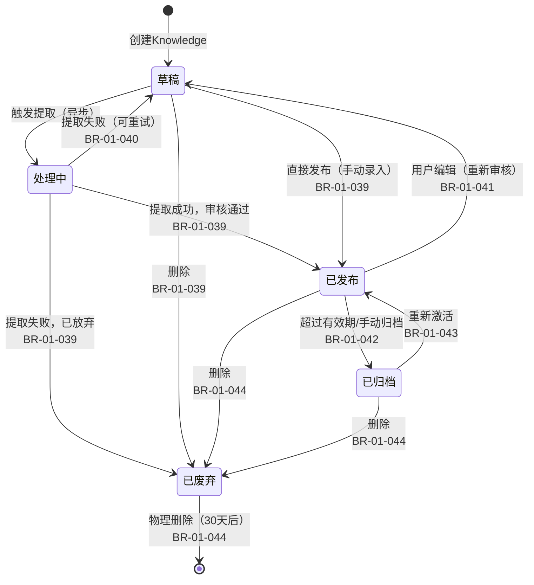

**文档处理状态流转**：

> **v7 收束说明(2026-06-16) 状态命名与 §4.2.1 对齐**: 文档状态统一采用 §4.2.1 mermaid stateDiagram-v2 权威定义 — **待处理 / 处理中 / 已完成 / 处理失败**。本节"文档处理状态流转"原使用"上传中/处理中/成功/失败"命名，已修正。
>
> **v9 收束说明(2026-06-16) text 转 mermaid**: 原 text 代码块 v9 收束统一为 mermaid stateDiagram-v2。

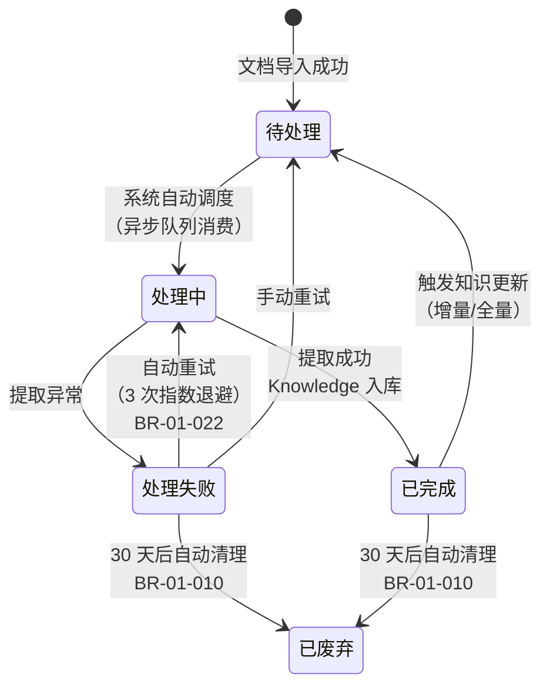


---

## 5. 业务规则

> **BR编号迁移声明**：本节业务规则编号已迁移为 `BR-01-{3位}` 三段式格式（原旧版子域前缀 BR-KD-* 已全部替换）。

### 5.1 知识查询规则

|规则编号 |规则名称 |规则描述 |
|---|---|---|
|BR-01-001 |数据权限隔离 |用户仅可查询本商户范围内的 Knowledge 数据 |
|BR-01-002 |图可视化节点限制 |单次渲染最多 10000 个节点，超出需缩小查询范围 |
|BR-01-003 |搜索结果排序 |默认按相关性得分降序，支持按时间、热度等排序 |
|BR-01-004 |过滤条件组合 |多维度过滤条件之间为 AND 关系，同维度多值为 OR 关系 |
|BR-01-005 |向量检索阈值 |[TBD-产品决策] 默认 Cosine 相似度阈值 ≥ 0.75，低于阈值的结果不返回 —— 依据：RAG 系统通用实践 |

### 5.2 知识来源规则

|规则编号 |规则名称 |规则描述 |
|---|---|---|
|BR-01-006 |文件格式限制 |仅支持 PDF、Word（.docx/.doc）、Markdown、TXT、CSV 格式 |
|BR-01-007 |文件大小限制 |PDF 最大 100MB，Word/CSV 最大 50MB，Markdown/TXT 最大 10MB |
|BR-01-008 |批量导入限制 |单次最多导入 20 个文件 |
|BR-01-009 |重复检测 |基于 MD5 校验检测重复文件，提示用户确认覆盖 |
|BR-01-010 |文档软删除 |文档删除采用软删除策略，保留 30 天后物理删除 |
|BR-01-011 |处理中保护 |处理中的文档不允许删除和覆盖 |
|BR-01-012 |并发导入限制 |[TBD-产品决策] 每商户最多 5 个并发处理任务，超出排队 —— 依据：R-03-07 预案中已提及此限制 |

### 5.3 知识类型规则

|规则编号 |规则名称 |规则描述 |
|---|---|---|
|BR-01-013 |层级深度限制 |知识类型最大层级深度为 5 级 |
|BR-01-014 |同级唯一性 |同一父级下的类型名称不可重复 |
|BR-01-015 |编码全局唯一 |类型编码在商户范围内全局唯一 |
|BR-01-016 |删除保护 |有子类型或有关联 Knowledge 的类型不允许删除 |
|BR-01-017 |类型总数限制 |每个商户最多创建 500 个知识类型 |

### 5.4 知识提取规则

|规则编号 |规则名称 |规则描述 |
|---|---|---|
|BR-01-018 |置信度过滤 |Entity 提取置信度低于阈值的结果自动丢弃 |
|BR-01-019 |数量限制 |每篇文档提取的 Entity 数和 Relation 数受配置上限约束 |
|BR-01-020 |增量更新策略 |文档更新后仅处理变更部分，减少计算开销 |
|BR-01-021 |提取超时 |单篇文档提取超时时间为 10 分钟，超时自动终止并标记失败 |
|BR-01-022 |重试机制 |提取失败后自动重试 3 次（指数退避：1s/2s/4s），全部失败后标记为"处理失败" |
|BR-01-023 |异步队列 |提取任务通过异步消息队列处理，支持优先级调度；实体和关系数据通过 Outbox 事件同步到 Neo4j（详见 §16.2 Outbox 事件同步机制） |
|BR-01-024 |Remote API 调用频率限制 |[TBD-产品决策] 同一 API 端点每分钟最多调用 60 次，超出排队 —— 依据：防止对目标服务造成过大压力 |
|BR-01-025 |Remote API 响应体大小限制 |[TBD-产品决策] 单次响应体最大 50MB，超出截断并提示 —— 依据：与文档导入大小限制对齐 |
|BR-01-026 |Remote API 凭据加密存储 |API 认证凭据必须加密存储，日志中禁止输出明文凭据 |
|BR-01-027 |配置合并原子性 |三级配置合并操作必须原子性完成，不允许出现部分合并的中间状态 |

### 5.5 向量化规则

|规则编号 |规则名称 |规则描述 |
|---|---|---|
|BR-01-028 |Chunk Overlap 约束 |Chunk Overlap 不得超过 Chunk Size 的 50% |
|BR-01-029 |重新向量化 |修改 Embedding Model 或 Dimension 后需重新向量化所有 Knowledge |
|BR-01-030 |向量存储隔离 |不同商户的向量数据严格隔离（命名空间/分区隔离） |
|BR-01-031 |异步处理 |重新向量化采用异步处理，不影响系统正常使用 |
|BR-01-032 |版本化向量 |[TBD-产品决策] 每个 Knowledge 版本维护独立的 Embedding 向量 —— 依据：4.5 节版本管理机制要求向量与版本对应 |
|BR-01-033 |重新向量化失败处理 |重新向量化执行阶段失败时：①自动重试3次（指数退避：1s/2s/4s）；②3次重试均失败后标记该 Knowledge 为"向量化异常"状态；③触发 P1 告警通知管理员；④保留旧向量数据继续可用（检索仍使用旧向量），管理员可在异常列表中手动触发重新向量化 |

### 5.6 知识条目状态规则

**知识条目状态流转**：

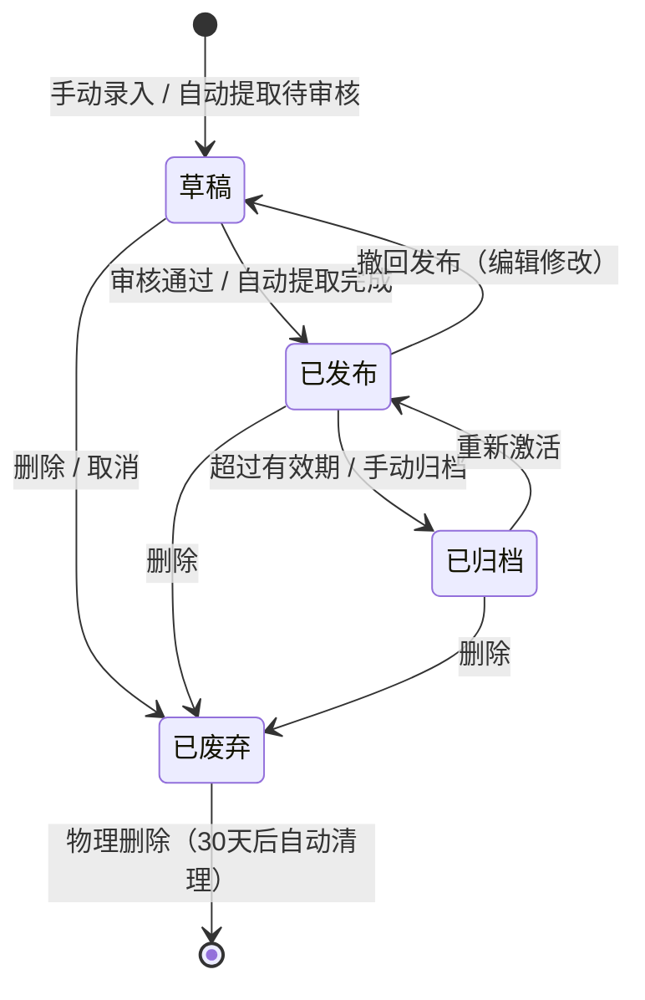

**状态规则说明**：

|状态 |说明 |可执行操作 |
|---|---|---|
|草稿 |Knowledge 已创建但未发布，不可被 Agent 检索 |编辑、发布、删除 |
|处理中 |Knowledge 正在被 LLM 提取或重新向量化（异步处理阶段），不可被 Agent 检索 |无（等待异步完成） |
|已发布 |Knowledge 已发布，可被 Agent 检索和使用 |编辑（变为草稿）、归档、删除 |
|已归档 |Knowledge 已归档，不可被 Agent 检索，但保留数据 |重新激活、删除 |
|已废弃 |Knowledge 已废弃，标记为删除，30 天后物理删除 |无（等待自动清理） |

**状态规则 BR 编号（v7 补齐）**：

|规则编号 |规则名称 |规则描述 |
|---|---|---|
|BR-01-038 |初始状态 |Knowledge 创建时初始状态为"草稿"；手动录入（API-03-24）直接进入"草稿"状态，需经显式发布操作才进入"已发布"；与 §2.5.1 流程图（标注"状态:已发布"）的展示场景为"查询已发布 Knowledge"的分流页保持一致 |
|BR-01-039 |草稿可发布 |"草稿"状态可跃迁为"已发布"（审核通过或自动提取完成）或"已废弃"（用户取消） |
|BR-01-040 |处理中可见 |"处理中"状态对用户可见（前端展示"正在提取"），但不可被 Agent 检索；异步任务完成后自动跃迁为"已发布"（成功）或回到"草稿"（失败可重试） |
|BR-01-041 |已发布可编辑 |"已发布"状态编辑时必须先撤回为"草稿"（已发布 → 草稿），编辑完成后需重新发布；不可直接编辑已发布内容（避免 RAG 检索命中半修改内容） |
|BR-01-042 |已发布可归档 |"已发布"状态支持手动归档或超过 `tenant_knowledge_kb.expire_at` 后自动归档；归档后不可被 Agent 检索 |
|BR-01-043 |已归档可激活 |"已归档"状态可重新激活为"已发布"（用户主动恢复）或删除；激活后立即可被 Agent 检索 |
|BR-01-044 |已废弃自动清理 |"已废弃"状态为软删除标记，30 天后由后台任务物理删除（硬删除 PG 记录并同步 Neo4j 节点软删）；30 天内可手动恢复 |
|BR-01-045 |状态机非法跃迁拦截 |非法状态跃迁（如 草稿 → 已归档、已废弃 → 已发布）由 ABAC 规则校验，返回 050501（知识状态冲突） |

### 5.7 知识与 Agent 关联规则

|规则编号 |规则名称 |规则描述 |
|---|---|---|
|BR-01-034 |删除保护 |删除被 Agent 关联的 Knowledge 时需二次确认 |
|BR-01-035 |状态联动 |Knowledge 状态变更为"已废弃"或"已归档"时，自动通知关联的 Agent。**通知失败补偿机制**：若通知Agent失败，系统按以下策略处理——① **重试**：5分钟内自动重试3次（间隔分别为1分钟、2分钟、2分钟）；② **Agent端缓存TTL**：若3次重试均失败，依赖Agent端缓存TTL（默认5分钟）自然过期后重新拉取最新状态；③ **标记"缓存可能过期"**：在Agent运行时上下文中标记该Agent的知识缓存状态为"缓存可能过期"，编排层调度时向用户提示，直至缓存成功刷新后自动清除标记 |
|BR-01-036 |[TBD-产品决策] 自动关联 |Agent 通过向量检索自动使用已发布的 Knowledge，无需手动绑定 —— 依据：RAG 架构的默认行为 |
|BR-01-037 |[TBD-产品决策] 手动绑定优先 |手动绑定的 Knowledge 优先级高于自动检索结果 —— 依据：显式配置应优先于隐式行为 |

### 5.8 知识域业务规则

#### 5.8.1 域隔离规则

|规则编号 |规则名称 |规则描述 |
|---|---|---|
|BR-01-046 |三级域模型 |Knowledge 数据按私有 / 共享 / 公共三级域隔离，对齐 PRD-02 §7.2-7.4 |
|BR-01-047 |域类型强约束 |每条 Knowledge 必须有 `domain_type ∈ {private, shared, public}`，非法值返回 400 |
|BR-01-048 |域 ID 必填 |私有域 `domain_id = owner_id`，共享域 `domain_id = group_id`，公共域 `domain_id = 'public'` |
|BR-01-049 |跨域隔离 |PostgreSQL 通过 composite PK (partition_key, id) 实现租户级隔离，业务查询通过 domain_type + domain_id 实现域级隔离 |
|BR-01-050 |图谱隔离 |Neo4j 两层标签体系：`KnowledgeEntity` 基础标签 + `Graph` 静态租户标签（v6 收束，已统一为静态 `Graph` 标签，原 `Graph{partition_key}` 动态标签已替换）；Cypher 必须含 `WHERE n.partition_key = $partitionKey` 条件 |
|BR-01-051 |向量隔离 |Neo4j 向量索引按 `{tid}_{domain_type}_{domain_id}` 命名 + partition_key 强制过滤 |
|BR-01-052 |跨租户硬隔离 |任意域的 partition_key 不匹配即返回 403，禁止任何形式的跨租户访问 |

#### 5.8.2 跨域传输规则

|规则编号 |规则名称 |规则描述 |
|---|---|---|
|BR-01-053 |私有域禁止直接迁移 |私有域 Knowledge 不得直接移动到共享域或公共域，必须经用户显式操作（复制） |
|BR-01-054 |复制保留源 |跨域共享采用"复制而非移动"语义，源域 Knowledge 完整保留 |
|BR-01-055 |发布申请审批 |共享域 → 公共域必须经系统管理员审批，审批通过后副本（严格脱敏后）进入公共域 |
|BR-01-056 |公共域只读 |公共域 Knowledge 对普通用户只读，仅系统管理员可写 |
|BR-01-057 |跨域同步图谱 |跨域复制时同步生成图谱副本（Entity / Relation 完整复制到目标域图谱） |
|BR-01-058 |跨域同步向量 |跨域复制时同步生成向量副本（Chunk 与 Embedding 写入目标域向量索引） |
|BR-01-059 |跨域审计 |所有跨域操作（共享、发布、复制）记录审计日志，含操作人、源域、目标域、时间戳 |

#### 5.8.3 域成员与权限规则

|规则编号 |规则名称 |规则描述 |
|---|---|---|
|BR-01-060 |域管理员 |共享域必须有 ≥ 1 个域管理员，移除最后一个域管理员返回 409 |
|BR-01-061 |域成员数上限 |共享域成员数 ≤ 50 人，超出后拒绝新成员添加并提示扩容 |
|BR-01-062 |角色三级 |共享域角色三级：域管理员 / 编辑者 / 查看者，不可自定义 |
|BR-01-063 |公共域管理员 |公共域仅由系统管理员（System Admin）管理，普通用户无任何管理权限 |
|BR-01-064 |域内权限继承 |Group 成员在图谱与向量上的权限与在 Knowledge 上的权限完全一致 |
|BR-01-065 |外部 API 阻断 |共享域与公共域的 API 访问必须经本系统 JWT 鉴权，外部 API 一律返回 403 |

#### 5.8.4 域配额与预警规则

|规则编号 |规则名称 |规则描述 |
|---|---|---|
|BR-01-066 |默认配额 |私有域 10,000 条/2GB，共享域 50,000 条/10GB，公共域 不限/100GB（per 租户） |
|BR-01-067 |70% 警告 |使用率 ≥ 70% 触发黄色预警横幅与邮件通知 |
|BR-01-068 |90% 严重 |使用率 ≥ 90% 触发橙色横幅与邮件+站内信通知 |
|BR-01-069 |100% 拦截 |使用率 = 100% 拦截新的 Knowledge 创建，返回 HTTP 200 + 业务错误码 050429 |
|BR-01-070 |配额释放 |删除 Knowledge 后配额即时释放（≤ 1 秒） |
|BR-01-071 |编辑不消耗 |编辑已有 Knowledge 不增加配额消耗 |

#### 5.8.5 域脱敏规则

|规则编号 |规则名称 |规则描述 |
|---|---|---|
|BR-01-072 |私有域不脱敏 |私有域 Knowledge 写入与展示均不脱敏，保留原始内容 |
|BR-01-073 |共享域标准脱敏 |共享域 Knowledge 写入时自动脱敏手机号 / 身份证 / 银行卡 / 邮箱 |
|BR-01-074 |公共域严格脱敏 |公共域 Knowledge 写入与跨域共享时强制执行严格脱敏（含姓名 / 地址） |
|BR-01-075 |写入时脱敏 |脱敏在 Knowledge 写入的同步流程中完成，延迟 ≤ 50ms |
|BR-01-076 |展示二次校验 |Knowledge 展示时二次校验脱敏结果，确保展示内容已脱敏 |
|BR-01-077 |导出强制脱敏 |跨域导出与公共域导出强制脱敏，私有域导出可选 |
|BR-01-078 |脱敏审计 |所有跨域与公共域脱敏操作记录审计日志，便于合规追溯 |

#### 5.8.6 域与图谱/向量融合规则

|规则编号 |规则名称 |规则描述 |
|---|---|---|
|BR-01-079 |图谱域标签 |Neo4j 节点标签必须含实体类型标签 + `Graph` 静态租户标签；Cypher 必须含 `WHERE n.partition_key = $partitionKey` 条件；域隔离由 `owner_scope` 字段（v5 收束，原 `SharedEntity`/`PublicEntity` 域类型标签已移除）+ PG RLS 表达 |
|BR-01-080 |向量索引 |Neo4j 向量索引名称格式 `{tid}_{domain_type}_{domain_id}` 强制 |
|BR-01-081 |RAG 向量索引过滤 |Agent RAG 检索必须注入 `向量索引 IN allowed_vector_indexes` + partition_key filter，客户端不可绕过 |
|BR-01-082 |删除同步 |Knowledge 删除时同步删除对应 Chunk 的向量与图谱 Entity / Relation |
|BR-01-083 |状态联动 |Knowledge 状态变更为"已废弃"时同步标记向量为不可检索 |
|BR-01-084 |公共域置信度 |公共域向量检索置信度阈值 ≥ 0.85，低于阈值的内容禁止检索返回 |
|BR-01-085 |跨域类型引用 |私有 / 共享域可引用公共域类型，引用方向单向（私有/共享 → 公共） |


---

## 6. 接口需求

### 6.1 API 清单

> **v7 收束说明(2026-06-16)**：本节为接口语义总览表，**接口定义、参数、类型以 §A5 GraphQL Schema 为权威**。本节保留用于业务语义概览，与 §A5 操作名严格一致；如出现命名差异，以 §A5 为准。

|接口编号 |接口名称 |类型 |GraphQL 操作（§A5 权威） |说明 |
|---|---|---|---|---|
|API-03-01 |查询知识图谱数据 |Query |`knowledgeGraph(domainIds, depth, limit)` |获取图可视化数据（节点和边） |
|API-03-02 |查询知识列表 |Query |`knowledges(filter, first, after)` |获取 Knowledge 条目列表（Relay 分页） |
|API-03-03 |查询知识详情 |Query |`knowledge(id: ID!)` |获取单条 Knowledge 的详细信息 |
|API-03-04 |路径查询 |Query |`knowledgeGraphPath(fromId, toId, maxDepth)` |查询两个 Entity 间的最短路径 |
|API-03-05 |获取文档列表 |Query |`knowledgeSources(filter, first, after)` |获取知识来源文档列表（Relay 分页） |
|API-03-06 |导入文档（文件） |Mutation |`importKnowledge(fileId, idempotencyKey)` |上传文件导入文档 |
|API-03-07 |URL 导入 |Mutation |`importKnowledgeFromUrl(url, idempotencyKey)` |通过 URL 导入文档 |
|API-03-08 |获取文档详情 |Query |`knowledgeSource(id: ID!)` |获取文档详情 |
|API-03-09 |编辑文档 |Mutation |`updateKnowledgeSource(id, input, idempotencyKey)` |编辑文档元信息 |
|API-03-10 |删除文档 |Mutation |`deleteKnowledgeSource(id, idempotencyKey)` |删除文档（软删除） |
|API-03-11 |更新知识 |Mutation |`refreshKnowledge(sourceId, mode, idempotencyKey)` |触发 Knowledge 更新（增量 INCREMENT / 全量 FULL） |
|API-03-12 |获取知识类型列表 |Query |`knowledgeTypes(filter, first, after)` |获取知识类型树形列表 |
|API-03-13 |创建知识类型 |Mutation |`createKnowledgeType(input, idempotencyKey)` |创建知识类型 |
|API-03-14 |编辑知识类型 |Mutation |`updateKnowledgeType(id, input, idempotencyKey)` |编辑知识类型 |
|API-03-15 |删除知识类型 |Mutation |`deleteKnowledgeType(id, idempotencyKey)` |删除知识类型 |
|API-03-16 |获取提取规则 |Query |`knowledgeExtractionRules` |获取提取规则配置 |
|API-03-17 |保存提取规则 |Mutation |`saveExtractionRules(input, idempotencyKey)` |保存提取规则配置 |
|API-03-18 |获取向量配置 |Query |`knowledgeVectorConfig` |获取 Embedding 配置 |
|API-03-19 |保存向量配置 |Mutation |`saveVectorConfig(input, idempotencyKey)` |保存 Embedding 配置 |
|API-03-20 |获取图谱 Schema |Query |`knowledgeGraphSchema` |获取知识图谱 Schema |
|API-03-21 |保存图谱 Schema |Mutation |`saveGraphSchema(input, idempotencyKey)` |保存知识图谱 Schema |
|API-03-22 |获取清洗规则 |Query |`knowledgeCleaningRules` |获取数据清洗规则 |
|API-03-23 |保存清洗规则 |Mutation |`saveCleaningRules(input, idempotencyKey)` |保存数据清洗规则 |
|API-03-24 |手动录入知识 |Mutation |`createKnowledge(input, idempotencyKey)` |手动创建 Knowledge 条目（Manual 方式） |
|API-03-25 |批量删除知识 |Mutation |`batchDeleteKnowledges(ids, idempotencyKey)` |批量删除 Knowledge 条目 |
|API-03-26 |导出知识 |Mutation |`exportKnowledge(filter, format)` |导出 Knowledge 数据（CSV/Excel） |
|API-03-27 |获取知识版本历史 |Query |`knowledgeVersions(knowledgeId, first, after)` |获取 Knowledge 条目的版本历史列表（Relay 分页） |
|API-03-28 |版本对比 |Query |`knowledgeVersionDiff(knowledgeId, fromVer, toVer)` |对比两个版本的差异 |
|API-03-29 |版本回滚 |Mutation |`rollbackKnowledgeVersion(input, idempotencyKey)` |回滚到指定版本 |
|API-03-30 |获取知识关联 Agent |Query |`knowledgeAgents(knowledgeId)` |获取 Knowledge 关联的 Agent 列表 |
|API-03-31 |绑定知识到 Agent |Mutation |`bindKnowledgeToAgents(input, idempotencyKey)` |手动绑定 Knowledge 到 Agent（支持批量） |
|API-03-32 |解除知识与 Agent 绑定 |Mutation |`unbindKnowledgeFromAgent(knowledgeId, agentId, idempotencyKey)` |解除 Knowledge 与 Agent 的关联 |
|API-03-33 |查询当前用户可访问的知识域 |Query |`knowledgeDomains(filter)` |返回用户可访问的私有 / 共享 / 公共域列表 |
|API-03-34 |创建共享知识域 |Mutation |`createKnowledgeDomain(input, idempotencyKey)` |创建共享域并初始化 Group 绑定 |
|API-03-35 |查询知识域详情 |Query |`knowledgeDomain(id: ID!)` |查询域基本信息与统计 |
|API-03-36 |编辑知识域 |Mutation |`updateKnowledgeDomain(id, input, idempotencyKey)` |修改域名称、描述、配额 |
|API-03-37 |删除知识域 |Mutation |`deleteKnowledgeDomain(id, idempotencyKey)` |软删除共享域，域内 Knowledge 迁移策略可选 |
|API-03-38 |查询知识域成员 |Query |`knowledgeDomainMembers(domainId)` |列出域内成员及角色 |
|API-03-39 |添加知识域成员 |Mutation |`addDomainMember(input, idempotencyKey)` |添加用户到共享域并分配角色 |
|API-03-40 |修改知识域成员角色 |Mutation |`updateDomainMember(input, idempotencyKey)` |修改成员角色（域管理员 / 编辑者 / 查看者） |
|API-03-41 |移除知识域成员 |Mutation |`removeDomainMember(domainId, userId, idempotencyKey)` |从共享域移除用户 |
|API-03-42 |跨域共享 Knowledge |Mutation |`shareKnowledgeToDomain(input, idempotencyKey)` |将私有域 Knowledge 复制到指定共享域 |
|API-03-43 |跨域复制 Knowledge |Mutation |`copyKnowledgeToDomain(input, idempotencyKey)` |将 Knowledge 复制到其他域（保留源） |
|API-03-44 |提交发布申请 |Mutation |`submitPublishRequest(input, idempotencyKey)` |将私有/共享域 Knowledge 申请发布到公共域 |
|API-03-45 |审批发布申请 |Mutation |`approvePublishRequest(requestId, idempotencyKey)` |系统管理员审批通过 |
|API-03-46 |拒绝发布申请 |Mutation |`rejectPublishRequest(requestId, reason, idempotencyKey)` |系统管理员拒绝 |
|API-03-47 |查询知识域统计 |Query |`knowledgeDomainStats(domainId)` |返回域配额 / Entity / Relation / 向量统计 |
|API-03-48 |域级图谱查询（强制 domainIds 过滤） |Query |`knowledgeGraph(domainIds, depth, limit)` |图可视化查询，服务端校验域权限（与 API-03-01 同 GraphQL 操作，参数区分） |
|API-03-49 |域级向量检索（RAG 强制向量索引 + partition_key 过滤） |Query |`searchKnowledges(query, limit, domainIds)` |RAG 检索，服务端注入向量索引 + partition_key filter |
|API-03-50 |创建 Remote API 配置 |Mutation |`createKnowledgeRemoteApi(input, idempotencyKey)` |创建远程 API 端点配置（业务侧扩展） |
|API-03-51 |更新 Remote API 配置 |Mutation |`updateKnowledgeRemoteApi(id, input, idempotencyKey)` |更新远程 API 端点配置 |
|API-03-52 |删除 Remote API 配置 |Mutation |`deleteKnowledgeRemoteApi(id, idempotencyKey)` |删除远程 API 端点配置 |
|API-03-53 |测试 Remote API 连接 |Mutation |`testKnowledgeRemoteApi(id, idempotencyKey)` |测试 API 连接并返回预览数据 |
|API-03-54 |触发 Remote API 拉取 |Mutation |`fetchKnowledgeRemoteApi(id, idempotencyKey)` |触发远程 API 数据拉取任务 |
|API-03-55 |获取模块级全局配置 |Query |`knowledgeModuleConfig` |获取模块级全局配置（提取规则/向量/图谱/清洗） |
|API-03-56 |保存模块级全局配置 |Mutation |`saveKnowledgeModuleConfig(input, idempotencyKey)` |保存模块级全局配置 |
|API-03-57 |预览配置合并结果 |Mutation |`previewKnowledgeConfigMerge(input)` |预览三级配置合并后的最终配置 |

> **铁律**：所有 Mutation **必须**接受 `idempotencyKey: ID!` 参数（详见 §A5.2 表头说明），由 `silvaengine_utility.idempotency.idempotent` 装饰器处理。GraphQL 操作的实际参数与返回类型以 §A5.4 关键 InputObjectType 为准。

### 6.2 关键接口详细说明

#### API-03-01 查询知识图谱数据

**请求参数**：

|参数名 |类型 |必填 |说明 |
|---|---|---|---|
|entity_types |string[] |否 |Entity 类型筛选 |
|relation_types |string[] |否 |Relation 类型筛选 |
|keyword |string |否 |关键词搜索 |
|limit |integer |否 |最大节点数，默认 500，最大 10000 |
|depth |integer |否 |关联深度，默认 1，最大 3 |

**响应参数**：

```json
{
  "nodes": [
    {
      "id": "entity_001",
      "name": "张三",
      "type": "Person",
      "properties": {"title": "工程师", "email": "zhangsan@example.com"},
      "degree": 5
    }
  ],
  "edges": [
    {
      "id": "rel_001",
      "source": "entity_001",
      "target": "entity_002",
      "type": "WORKS_AT",
      "properties": {"role": "高级工程师", "since": "2023-01-15"}
    }
  ],
  "total_nodes": 500,
  "total_edges": 1200
}
```

#### API-03-06 导入文档

**请求参数**：

|参数名 |类型 |必填 |说明 |
|---|---|---|---|
|file |file |是 |文档文件（multipart/form-data） |
|knowledge_type_id |string |是 |目标知识类型 ID |
|tags |string[] |否 |文档标签 |
|description |string |否 |文档描述 |

**响应参数**：

```json
{
  "source_id": "src_001",
  "filename": "AI技术白皮书.pdf",
  "size": 10485760,
  "format": "pdf",
  "status": "pending",
  "created_at": "2026-06-08T10:30:00Z"
}
```

#### API-03-27 获取知识版本历史

**请求参数**：

|参数名 |类型 |必填 |说明 |
|---|---|---|---|
|id |string |是 |Knowledge 条目 ID（路径参数） |
|first |Int |否 |向前获取条数，默认 20，与 `after` 搭配使用 |
|after |String |否 |游标，获取该游标之后的记录 |
|last |Int |否 |向后获取条数，与 `before` 搭配使用 |
|before |String |否 |游标，获取该游标之前的记录 |
|sort |String |否 |排序字段:排序方向，默认 `version:desc` |

> `first` 与 `last` 互斥，不可同时传入；`first` 默认 20，可选值：10/20/50/100。

**响应参数**：

```json
{
  "edges": [
    {
      "node": {
        "version": "v1.2",
        "change_type": "minor_update",
        "change_summary": "新增 3 个 Entity，修改 2 个 Relation",
        "created_by": "user_001",
        "created_at": "2026-06-08T14:30:00Z"
      },
      "cursor": "cursor-string"
    }
  ],
  "pageInfo": {
    "hasNextPage": true,
    "hasPreviousPage": false,
    "startCursor": "cursor-string",
    "endCursor": "cursor-string"
  },
  "totalCount": 5
}
```


---

## 7. 非功能需求

### 7.1 性能需求

|编号 |需求项 |目标值 |测量方式 |
|---|---|---|---|
|NFR-01 |知识列表查询响应时间 |≤ 500ms（P95，1000 条数据） |APM 监控接口响应时间 |
|NFR-02 |知识详情查询响应时间 |≤ 200ms（P95） |APM 监控接口响应时间 |
|NFR-03 |图可视化首次渲染时间 |≤ 3 秒（1000 节点） |前端 Performance API 测量 |
|NFR-04 |图可视化交互帧率 |≥ 60fps（500 节点），≥ 30fps（2000 节点） |浏览器 Performance 面板测量 |
|NFR-05 |文档上传吞吐量 |≥ 10MB/s（单文件） |测量上传速率 |
|NFR-06 |知识提取吞吐量 |≥ 10 页/分钟（PDF） |测量提取速率 |
|NFR-07 |向量检索响应时间 |≤ 100ms（P95，10 万条向量） |APM 监控接口响应时间 |
|NFR-08 |并发查询支持 |≥ 1000 QPS |压力测试 |
|NFR-09 |并发导入支持 |≥ 100 并发 |压力测试 |

### 7.2 可用性需求

|编号 |需求项 |目标值 |说明 |
|---|---|---|---|
|NFR-10 |系统可用性 |≥ 99.9% |年度停机时间 ≤ 8.76 小时 |
|NFR-11 |故障恢复时间（RTO） |≤ 30 分钟 |从故障发生到服务恢复 |
|NFR-12 |数据恢复点目标（RPO） |≤ 5 分钟 |最大可接受数据丢失时间 |
|NFR-13 |向量存储可用性 |≥ 99.95% |Vector Store 服务的可用性 |
|NFR-14 |提取服务降级可用性 |≥ 99.5% |OCR/NER 服务降级后的可用性 |

### 7.3 安全需求

|编号 |需求项 |说明 |
|---|---|---|
|NFR-15 |数据隔离 |不同商户的 Knowledge 数据严格隔离，包括关系数据库、Vector Store、对象存储 |
|NFR-16 |传输加密 |所有 API 通信使用 HTTPS/TLS 1.2+ |
|NFR-17 |存储加密 |敏感数据（文档内容、向量数据）使用 AES-256 加密存储 |
|NFR-18 |访问控制 |基于 RBAC 模型控制 Knowledge 的增删改查权限 |
|NFR-19 |操作审计 |记录所有 Knowledge 的创建、修改、删除操作日志，保留 180 天 |
|NFR-20 |文件安全 |上传文件进行病毒扫描，拒绝恶意文件 |

### 7.4 可扩展性需求

|编号 |需求项 |目标值 |说明 |
|---|---|---|---|
|NFR-21 |单商户 Knowledge 条目数 |≥ 100 万条 |支持大规模知识库 |
|NFR-22 |单商户文档数 |≥ 10 万个 |支持大量文档存储 |
|NFR-23 |Vector Store 容量 |≥ 1 亿条向量 |支持海量向量检索 |
|NFR-24 |水平扩展 |提取服务、检索服务支持水平扩容 |无状态服务可动态增减实例 |

### 7.5 兼容性需求

|编号 |需求项 |说明 |
|---|---|---|
|NFR-25 |浏览器兼容 |Chrome ≥ 90、Firefox ≥ 88、Safari ≥ 14、Edge ≥ 90 |
|NFR-26 |移动端适配 |图可视化在平板端（≥ 768px）可用，手机端仅支持数据网格视图 |
|NFR-27 |Vector Store 兼容 |支持 Neo4j ≥ 5.11（向量索引） |
|NFR-28 |Embedding Model 兼容 |支持 OpenAI text-embedding-3-small/large、[TBD-产品决策] BGE/E5 等开源模型 —— 依据：主流 Embedding 模型需兼容 |

### 7.6 可维护性需求

|编号 |需求项 |说明 |
|---|---|---|
|NFR-29 |监控覆盖 |所有 API 接口、异步任务、外部服务调用均有监控指标 |
|NFR-30 |告警机制 |提取失败率 > 5%、Vector Store 响应时间 > 500ms、队列积压 > 50 时触发告警 |
|NFR-31 |日志规范 |所有操作日志遵循统一格式，包含 trace_id 支持链路追踪 |
|NFR-32 |配置化 |提取规则、Embedding 配置、清洗规则均支持动态配置，无需重启服务 |


---

## 8. 权限矩阵

### 8.1 功能权限矩阵

|功能模块 |操作 |知识工程师 |数据分析师 |商户管理员 |AI Agent |
|---|---|:---:|:---:|:---:|:---:|
|**知识查询** |图可视化查看 |✓ |✓ |✓ |— |
|   |数据网格查看 |✓ |✓ |✓ |— |
|   |路径查询 |✓ |✓ |✓ |— |
|   |知识检索 API |— |— |— |✓ |
|**知识来源** |查看文档列表 |✓ |✓ |✓ |— |
|   |导入文档 |✓ |— |✓ |— |
|   |编辑文档元信息 |✓ |— |✓ |— |
|   |删除文档 |✓ |— |✓ |— |
|   |触发知识更新 |✓ |— |✓ |— |
|**知识类型** |查看类型列表 |✓ |✓ |✓ |— |
|   |创建/编辑/删除类型 |— |— |✓ |— |
|**学习新知识** |文档上传与提取 |✓ |— |✓ |— |
|   |手动录入 Knowledge |✓ |— |✓ |— |
|   |配置提取规则 |✓ |— |✓ |— |
|   |配置 Embedding 参数 |✓ |— |✓ |— |
|   |配置 Schema |✓ |— |✓ |— |
|   |配置清洗规则 |✓ |— |✓ |— |
|**知识条目** |编辑 Knowledge |✓ |— |✓ |— |
|   |删除 Knowledge |✓ |— |✓ |— |
|   |发布/归档 Knowledge |✓ |— |✓ |— |
|   |查看版本历史 |✓ |✓ |✓ |— |
|   |版本回滚 |✓ |— |✓ |— |
|**Agent 关联** |查看关联 Agent |✓ |✓ |✓ |— |
|   |手动绑定/解绑 |✓ |— |✓ |— |
|**知识域管理** |创建/编辑/删除共享域 |— |— |✓ |— |
|   |域成员管理（添加/移除/改角色） |— |— |✓ |— |
|   |域级统计查看 |✓ |✓ |✓ |— |
|   |域级配额管理 |— |— |✓ |— |
|   |跨域共享 Knowledge（私有 → 共享） |✓ |— |✓ |— |
|   |提交发布申请到公共域 |✓ |— |✓ |— |
|   |审批发布申请 |— |— |— |— |
|   |公共域 Knowledge 管理 |— |— |— |— |
|   |修改域脱敏级别 |— |— |✓ |— |
|**域级图谱** |跨域图谱查询（domain_ids 过滤） |✓ |✓ |✓ |✓（按 partition_key 过滤） |
|**域级向量** |RAG 跨域检索（向量索引 + partition_key 过滤） |✓ |✓ |✓ |✓（按 allowed_vector_indexes） |

> **域管理角色补充说明**：
>
> - 域管理员（Domain Admin）由商户管理员在共享域中指定，享受本域的「域成员管理 + 跨域共享 + 域级配额」权限
> - 系统管理员（System Admin）对公共域拥有完全管理权，包括审批发布申请
> - AI Agent 的 RAG 检索严格按 `allowed_vector_indexes` + partition_key 过滤，跨域向量不返回

### 8.2 数据权限规则

|规则编号 |规则名称 |规则描述 |
|---|---|---|
|DP-01 |商户数据隔离 |所有 Knowledge 数据按商户 ID 严格隔离，跨商户不可访问 |
|DP-02 |角色权限控制 |基于角色控制功能访问权限，数据分析师仅可查看不可编辑 |
|DP-03 |Agent 检索范围 |Agent 仅可检索状态为"已发布"的 Knowledge |
|DP-04 |操作审计 |所有写操作（创建/修改/删除）记录操作人、时间、变更内容 |
|DP-05 |知识域隔离 |Knowledge 数据按三级域（私有 / 共享 / 公共）严格隔离，跨域不可访问 |
|DP-06 |域级图谱隔离 |Neo4j 图谱按 `Graph` 静态标签 + `WHERE n.partition_key = $partitionKey` + `owner_scope` 字段隔离（v6 收束，已统一为静态 `Graph` 标签，原 `Graph{partition_key}` 动态标签已替换），跨域 Cypher 返回 403 |
|DP-07 |域级向量隔离 |Neo4j 向量索引按 `{tid}_{domain_type}_{domain_id}` 命名 + partition_key 强制过滤，跨域检索返回 403 |
|DP-08 |跨域传输规则 |私有域 → 共享/公共 域禁止直接移动，必须经用户显式复制操作 |
|DP-09 |公共域只读 |公共域 Knowledge 对普通用户只读，仅系统管理员可写 |
|DP-10 |域级脱敏 |跨域共享与公共域强制脱敏（标准 / 严格），私有域不脱敏 |


---

## 9. 上线风险与预案

### 9.1 风险清单

|风险编号 |风险描述 |影响程度 |发生概率 |风险等级 |
|---|---|---|---|---|
|R-03-01 |大文件上传导致超时或内存溢出 |高 |中 |高 |
|R-03-02 |知识提取模型不可用导致处理失败 |高 |低 |中 |
|R-03-03 |图可视化大数据量渲染卡顿 |中 |中 |中 |
|R-03-04 |向量存储服务不可用导致检索失败 |高 |低 |中 |
|R-03-05 |OCR 处理 PDF 质量差导致提取内容不完整 |中 |中 |中 |
|R-03-06 |重新向量化耗时过长影响用户体验 |中 |中 |中 |
|R-03-07 |并发导入大量文档导致系统负载过高 |高 |中 |高 |
|R-03-08 |[TBD-产品决策] 知识版本数据量膨胀导致存储压力 —— 依据：每个版本保存完整快照，长期积累可能占用大量存储 |中 |中 |中 |
|R-03-09 |知识域隔离失效导致跨域 Knowledge 泄露 |高 |低 |高 |
|R-03-10 |跨域共享操作未正确同步图谱副本，导致图谱不一致 |中 |中 |中 |
|R-03-11 |跨域共享操作未正确同步向量副本，导致 RAG 检索结果缺失 |中 |中 |中 |
|R-03-12 |公共域发布申请审批绕过，导致敏感信息泄露 |高 |低 |高 |
|R-03-13 |域配额满载时未及时拦截新创建，导致系统资源耗尽 |中 |中 |中 |
|R-03-14 |域成员数超限（> 50）未被拦截，导致协作混乱 |低 |中 |中 |
|R-03-15 |公共域向量检索置信度阈值未生效，低质量数据污染公共知识 |中 |低 |中 |
|R-03-20 |Neo4j 长时间不可用导致 Outbox 事件大量积压，Sync Worker 进入 Dead Letter Queue |高 |低 |高 |
|R-03-21 |Sync Worker 进程崩溃导致 Neo4j 图谱数据与 PostgreSQL 不一致 |中 |中 |中 |
|R-03-22 |全量重同步期间 Neo4j 数据不完整，影响图谱查询结果 |中 |低 |中 |

### 9.2 预案详情

|风险编号 |预防措施 |应急预案 |
|---|---|---|
|R-03-01 |分片上传（5MB/片），断点续传，流式处理 |上传超时后自动重试 3 次，仍失败则提示用户稍后重试 |
|R-03-02 |部署多个提取模型实例，实现负载均衡和故障转移 |降级为规则提取（正则匹配），同时告警运维团队修复模型服务 |
|R-03-03 |前端 LOD 渲染、后端自动降采样、限制最大节点数 |强制限制查询节点数为 5000，提示用户缩小范围 |
|R-03-04 |Vector Store 采用主从架构，定期备份 |降级为全文检索（PostgreSQL pg_trgm + tsvector），同时紧急修复 Vector Store |
|R-03-05 |支持多种 PDF 解析引擎，自动选择最优引擎（参见 4.7 OCR 降级策略） |提示用户"PDF 解析质量不佳，建议上传文本版本"，支持手动修正 |
|R-03-06 |重新向量化采用后台异步处理，不影响在线服务 |展示进度估算，支持暂停/恢复操作 |
|R-03-07 |导入队列限流（每商户最多 5 个并发处理任务） |队列积压超过阈值时提示"当前处理任务较多，请稍后再试" |
|R-03-08 |[TBD-产品决策] 版本保留策略限制最近 10 个版本，超期版本自动归档压缩 —— 依据：4.5 节版本保留策略 |[TBD-产品决策] 启用版本数据冷热分离，归档版本迁移至低成本存储 —— 依据：冷热数据分离是存储成本优化的通用方案 |
|R-03-09 |PostgreSQL 启用 Row-Level Security (RLS)（`partition_key` 会话变量）、Neo4j `Graph` 静态标签 + `WHERE n.partition_key = $partitionKey` 条件过滤 + 拦截器、Neo4j 向量索引 + partition_key 强制过滤；定期跨域渗透测试 |紧急回滚到上一个安全快照，触发 P0 告警，启动数据泄露影响评估 |
|R-03-10 |跨域共享通过 Outbox Pattern 保证 PG → Neo4j 最终一致，向量副本通过异步任务保证 |异步补偿任务重试，告警运维，UI 提示"共享进行中"；Neo4j 数据与 PG 不一致时以 PG 为准 |
|R-03-11 |跨域共享使用 Outbox Pattern 确保 PG → Neo4j 同步，向量副本通过异步任务确保最终一致 |后台同步任务定期对账，发现缺失立即补充并告警；Dead Letter Queue 事件需运维手动重放 |
|R-03-12 |发布申请必须经系统管理员审批，敏感字段强制脱敏，发布前增加敏感词检测 |立即下架问题 Knowledge，撤销公共域发布记录，启动合规审计 |
|R-03-13 |实时监控域配额使用率，70%/90%/100% 三级预警 |满载时拦截新创建（返回 HTTP 200 + 业务错误码 050429），提示用户清理过期 Knowledge 或联系管理员扩容 |
|R-03-14 |共享域创建时校验成员数 ≤ 50，添加成员时再次校验 |拒绝新成员添加并提示"共享域成员数已达上限（最大 50 人）" |
|R-03-15 |公共域向量入库前强制校验置信度 ≥ 0.85，低质量内容禁止入库 |立即下架低质量公共域向量，触发质量告警，启动数据治理流程 |
|R-03-16 |Remote API 目标服务不可用导致知识拉取失败 |重试策略（3 次指数退避）+ 失败通知 + 手动重拉入口 |
|R-03-17 |Remote API 认证凭据泄露 |凭据加密存储（AES-256）、日志脱敏、API Key 定期轮换提醒 |
|R-03-18 |配置合并逻辑异常导致任务使用错误配置 |合并操作原子性保障、合并结果校验、配置快照回滚 |
|R-03-19 |Remote API 响应数据格式变更导致映射规则失效 |拉取前自动校验响应结构是否匹配映射规则，不匹配时暂停并通知 |
|R-03-20 |Neo4j 长时间不可用 |Outbox 事件累积有上限（PENDING 状态事件数监控），Sync Worker 指数退避重试 |
|R-03-21 |Sync Worker 进程崩溃 |幂等 MERGE 保证重复消费不产生重复数据，重启后自动消费积压事件 |
|R-03-22 |全量重同步期间数据不完整 |全量重同步期间标记租户为"同步中"状态，前端展示同步进度 |

### 9.3 上线检查清单

- [ ] 文档上传功能已测试（各格式、大小边界）
- [ ] 知识提取流程已测试（Entity/Relation/Keyword/Summarize）
- [ ] 图可视化渲染性能已优化（1000/5000/10000 节点场景）
- [ ] Vector Store 已部署并测试连接
- [ ] Embedding Model 已部署并测试推理
- [ ] 数据清洗规则已测试（去重、格式化、噪声过滤）
- [ ] 知识类型层级管理已测试（5 级深度）
- [ ] 增量更新和全量重建已测试
- [ ] 批量导入已测试（20 个文件并发）
- [ ] OCR 处理已测试（扫描件 PDF，含降级策略验证）
- [ ] 权限隔离已验证（不同商户数据不串）
- [ ] 监控告警已配置（提取失败率、Vector Store 健康度、队列积压）
- [ ] 压力测试通过（100 并发导入、1000 QPS 查询）
- [ ] 知识版本管理已测试（版本创建、对比、回滚）
- [ ] Knowledge 与 Agent 关联已测试（绑定、解绑、影响评估）
- [ ] 向量检索阈值已验证（不同相似度区间的结果过滤）
- [ ] 并发控制策略已验证（队列限流、超时处理）
- [ ] 知识域三级域模型已部署（私有 / 共享 / 公共）
- [ ] 域级图谱隔离已测试（Neo4j 节点标签 + domain_id 强制 WHERE）
- [ ] 域级向量隔离已测试（向量索引 + partition_key 强制过滤，跨域不返回）
- [ ] 跨域共享 Knowledge 流程已测试（含图谱、向量副本同步）
- [ ] 跨域发布申请 + 审批 + 脱敏流程已端到端验证
- [ ] 域配额满载拦截已验证（100% 时返回 HTTP 200 + 业务错误码 050429）
- [ ] 域成员管理已测试（添加、移除、改角色、最少 1 个域管理员约束）
- [ ] 域级脱敏已验证（标准 / 严格 / 关闭 三个级别）
- [ ] Remote API 三种添加方式（Import / Manual / Remote API）功能已端到端测试
- [ ] Remote API 端点配置已测试（URL / Method / Headers / Params / 认证方式）
- [ ] Remote API 响应数据映射规则已测试（字段映射、分页拉取、数据路径解析）
- [ ] Remote API 错误处理与重试策略已测试（超时、429 限流、5xx 错误、DNS 失败）
- [ ] Remote API 认证凭据加密存储已验证（数据库中无明文凭据、日志中无明文输出）
- [ ] 模块级全局配置已测试（保存、继承、与任务级配置的独立性）
- [ ] 配置三级合并策略已测试（任务级 > 模块级 > 系统级，深度合并，null 语义，数组替换）
- [ ] 配置合并预览接口已测试（API-03-57 返回正确的合并结果）
- [ ] 配置修改后实时生效性已验证（模块级配置修改后新建任务立即使用新配置）
- [ ] 跨域渗透测试已通过（含 Cypher 注入、向量索引 + partition_key filter 绕过、跨租户访问等）
- [ ] 域级审计日志已配置（含操作人、源域、目标域、时间戳）
- [ ] 公共域向量置信度阈值已验证（≥ 0.85 准入）
- [ ] PostgreSQL RLS 策略已部署并验证（所有 tenant_ 表启用 RLS，跨租户 SELECT 返回空结果）
- [ ] Outbox 事件同步已验证（PG 写入后 Neo4j 节点在 1 秒内出现，P95）
- [ ] Outbox 幂等性已验证（重复消费同一事件 3 次，Neo4j 节点数不变）
- [ ] Dead Letter Queue 已验证（Neo4j 持续不可用时事件状态正确变为 DEAD_LETTER）
- [ ] 全量重同步已验证（清除 Neo4j 数据后可从 PG 完整重建）
- [ ] Sync Worker 进程监控已配置（存活检测、自动重启、事件积压告警）
- [ ] Neo4j GraphLabel 隔离已验证（GraphTenantX 标签过滤，跨租户查询返回 0 节点）
- [ ] Neo4j 数据排除清单已验证（节点不包含 content、PII 等禁止字段）


---

> 以下章节（§10 - §13）内容整合自 PRD-02（仪表盘与工作空间）与 PRD-12（全局导航与模块关系）中与知识管理模块强相关的描述，用于在单一文档内完整描述知识管理模块在仪表盘、导航、模块关系、非功能需求与接口规范层面的横切关注点。

## 10. 模块仪表盘与导航

本章梳理知识管理模块在仪表盘（Dashboard）数据概览、全局导航（Sidebar/Topbar）中的呈现与交互，整合自 PRD-02 §4 与 PRD-12 §5。

### 10.1 知识管理相关 KPI 卡片

仪表盘 9 个核心 KPI 卡片中，4 个与知识管理模块直接相关，作为知识工程师和商户管理员掌握知识库运营态势的核心抓手。

|序号 |指标名称 |数据来源 |计算公式 |刷新频率 |单位 |格式 |趋势对比 |
|---|---|---|---|---|---|---|---|
|1 |Knowledge Capacity（知识容量） |Knowledge 管理模块 |`SUM(所有 Knowledge 文件大小)` |30 秒 |MB/GB |自适应（<1GB 显示 MB，≥1GB 显示 GB，保留 1 位小数） |与昨日同期对比（↑/↓ 百分比） |
|2 |Total Documents（总文档数） |Knowledge 管理模块 |`COUNT(所有已入库文档)` |30 秒 |个 |千分位格式（如 12,345） |与昨日同期对比 |
|3 |Knowledge Growth Rate（知识增长率） |Knowledge 管理模块 |`(本周新增 Knowledge 数 - 本周删除 Knowledge 数) / 上周 Knowledge 总数 × 100%` |5 分钟 |% |保留 1 位小数 |与上周对比 |
|4 |Query Success Rate（查询成功率） |Knowledge 检索引擎 |`成功返回结果的查询次数 / 总查询次数 × 100%` |30 秒 |% |保留 1 位小数 |与昨日对比 |

**数据范围（按角色）**：

|角色 |知识管理相关 KPI 数据范围 |
|---|---|
|超级管理员 |全平台所有 Merchant 的 Knowledge 数据聚合 |
|商户管理员 |本 Merchant 下所有 Knowledge 数据 |
|知识工程师 |仅展示 Knowledge Capacity、Total Documents、Knowledge Growth Rate、Query Success Rate 四个 KPI |
|编排工程师 |KPI 卡片中仅展示与 Knowledge 检索相关的 Query Success Rate（其他 Knowledge KPI 不展示） |
|普通用户 |仅展示个人维度的 Query Success Rate |

**交互行为**：

- 卡片数值变化时数字滚动动画（300ms）
- 趋势对比箭头：绿色 ↑ 表示正向，红色 ↓ 表示负向，灰色表示无变化
- 悬停展示 Tooltip（计算口径 + 最近 7 天趋势迷你图）
- 点击卡片跳转至对应模块详情（如点击"总文档数"跳转至 Knowledge 列表页）

**验收标准**：

|编号 |验收标准 |验证方法 |
|---|---|---|
|AC-K-KPI-01 |Knowledge Capacity 与 Total Documents 数值与知识管理模块数据库原始数据一致（误差 ≤ 0.1%） |对比后端聚合查询结果与前端展示 |
|AC-K-KPI-02 |Knowledge Growth Rate 计算公式与 PRD-02 §4.1.1 定义一致，覆盖新增/删除维度 |使用指定测试数据，验证公式与结果 |
|AC-K-KPI-03 |Query Success Rate 与 Knowledge 检索日志统计一致 |对比查询日志的成功/失败计数 |
|AC-K-KPI-04 |4 个 KPI 卡片每 30 秒自动刷新（Knowledge Growth Rate 例外，每 5 分钟刷新） |监控刷新请求频率 |
|AC-K-KPI-05 |知识工程师仅可见 4 个 Knowledge 相关 KPI，其余 KPI 隐藏 |以知识工程师角色登录验证 |
|AC-K-KPI-06 |点击知识管理相关 KPI 卡片正确跳转至 `/knowledges` 列表或详情页 |点击验证跳转路由 |


---

### 10.2 分类分布饼图

来源：PRD-02 §4.1.2.3。

饼图用于直观展示知识管理模块中各 Knowledge 分类的 Knowledge 条目数量与占比，帮助知识工程师识别 Knowledge 覆盖的薄弱领域。

**图表配置**：

|配置项 |说明 |
|---|---|
|图表类型 |环形饼图（Donut Chart） |
|数据维度 |各 Knowledge 分类的 Knowledge 条目数量及占比 |
|交互 |悬停显示分类名称、数量、占比；点击跳转至该分类的 Knowledge 列表 |
|颜色策略 |预置 12 色调色板，分类超过 12 个时合并为"其他" |
|中心文字 |总 Knowledge 条目数 |
|时间范围 |与全局时间范围选择器联动（今日/本周/本月/自定义） |

**主流程**：

|步骤 |操作 |系统响应 |
|---|---|---|
|1 |用户查看仪表盘 |系统加载分类分布饼图 |
|2 |用户悬停某个分类扇区 |高亮该扇区，Tooltip 展示分类名称、数量、占比 |
|3 |用户点击某个分类扇区 |跳转至 Knowledge 管理模块，自动筛选该分类 |

**验收标准**：

|编号 |验收标准 |验证方法 |
|---|---|---|
|AC-K-PIE-01 |各分类占比数据与知识管理模块数据库原始数据一致（误差 ≤ 0.1%） |对比数据库原始数据 |
|AC-K-PIE-02 |超过 12 个分类时正确合并为"其他"，"其他"占比 = 剩余分类占比之和 |创建超过 12 个分类验证 |
|AC-K-PIE-03 |点击扇区正确跳转至 Knowledge 管理对应分类列表页 |点击扇区验证跳转路由和筛选条件 |
|AC-K-PIE-04 |时间范围切换后饼图在 2 秒内重新渲染 |切换时间范围并测量渲染时间 |


---

### 10.3 热门 Knowledge Top 10

来源：PRD-02 §4.1.3.1。

按 Knowledge 被查询的次数排序，呈现用户最关注的 Knowledge 领域，帮助知识工程师优化知识库内容质量。

**列表字段**：

|字段 |说明 |排序 |
|---|---|---|
|排名 |1-10 |按查询次数降序 |
|Knowledge 标题 |Knowledge 条目的标题 |— |
|所属分类 |Knowledge 所属的分类 |— |
|查询次数 |统计周期内的查询次数 |降序 |
|查询趋势 |与上一周期对比的百分比变化 |— |

**主流程**：

|步骤 |操作 |系统响应 |
|---|---|---|
|1 |用户查看仪表盘 |系统加载热门 Knowledge Top 10 列表 |
|2 |用户悬停某条 Knowledge |高亮该行，显示简要摘要 Tooltip |
|3 |用户点击某条 Knowledge |跳转至 Knowledge 详情页面 |

**验收标准**：

|编号 |验收标准 |验证方法 |
|---|---|---|
|AC-K-TOP-01 |Top 10 热门 Knowledge 数据与知识管理查询日志一致且按查询次数降序排列 |对比查询日志 |
|AC-K-TOP-02 |点击 Knowledge 条目正确跳转至详情页 |点击验证跳转路由 |
|AC-K-TOP-03 |查询趋势百分比与上一周期数据计算结果一致 |对比前后周期数据计算结果 |
|AC-K-TOP-04 |时间范围切换后列表在 2 秒内重新加载 |切换时间范围并测量加载时间 |


---

### 10.4 知识更新动态

来源：PRD-02 §4.3.1。

展示知识管理模块最近 30 天内的变更活动，每页 20 条并支持分页加载，帮助知识工程师实时掌握知识库变化。

**活动类型**：

|活动类型 |图标 |描述模板 |颜色 |
|---|---|---|---|
|Knowledge 新增 |Plus |"{用户} 新增了知识《{标题}》" |绿色 |
|Knowledge 更新 |Edit |"{用户} 更新了知识《{标题}》" |蓝色 |
|Knowledge 删除 |Trash |"{用户} 删除了知识《{标题}》" |红色 |
|文档导入 |Upload |"{用户} 导入了 {N} 个文档至分类《{分类}》" |紫色 |
|Knowledge 审核通过 |Check |"知识《{标题}》审核通过" |绿色 |
|Knowledge 审核驳回 |X |"知识《{标题}》审核被驳回：{原因}" |橙色 |

**展示规则**：

|规则 |说明 |
|---|---|
|时间范围 |最近 30 天内的活动记录 |
|展示数量 |每页 20 条，支持"查看更多"分页加载（每次加载 20 条） |
|时间格式 |<1 小时显示"X 分钟前"，<24 小时显示"X 小时前"，≥24 小时显示 `YYYY-MM-DD HH:mm` |
|筛选 |支持按活动类型筛选（`type=knowledge`） |
|点击跳转 |点击活动条目跳转至对应的 Knowledge 详情 |

**验收标准**：

|编号 |验收标准 |验证方法 |
|---|---|---|
|AC-K-ACT-01 |Knowledge 更新动态按时间倒序排列，最新活动在最上方 |创建 Knowledge 后检查列表顺序 |
|AC-K-ACT-02 |各活动类型的图标和颜色与定义一致 |触发不同类型的活动验证 |
|AC-K-ACT-03 |点击活动条目正确跳转至 Knowledge 详情页 |点击验证跳转路由 |
|AC-K-ACT-04 |时间格式化规则正确（<1h → "X 分钟前"，<24h → "X 小时前"，≥24h → `YYYY-MM-DD HH:mm`） |检查不同时间跨度的格式 |
|AC-K-ACT-05 |分页加载正确，每次加载 20 条，总数与后端一致 |创建超过 20 条活动记录后验证分页 |
|AC-K-ACT-06 |仅 `dashboard:activity:knowledge` 权限用户可见知识更新动态 |收回权限后验证列表隐藏 |


---

### 10.5 Sidebar 菜单项

来源：PRD-12 §5.1.3。

知识管理模块在全局 Sidebar 中作为"数据支撑层"的核心入口展示，菜单分组与系统五层架构体系对齐。

**菜单项定义**：

|序号 |菜单名称 |英文标识 |图标 |路由路径 |权限要求 |所属架构层 |说明 |
|---|---|---|---|---|---|---|---|
|2 |知识管理 |Knowledges |knowledge |`/knowledges` |`knowledge:list` |数据支撑层 |知识库的创建与管理 |

**菜单分组规则**：

> Sidebar 菜单按架构层分组展示，使用分割线区分不同层级。知识管理所属分组如下：
>
> - **数据支撑层**：知识管理（Knowledges）、记忆管理（Memories）

**导航交互规则**：

|规则编号 |规则描述 |
|---|---|
|BR-NAV-001 |导航菜单仅展示用户有权限访问的模块，无 `knowledge:list` 权限时自动隐藏 |
|BR-NAV-002 |当前所在模块的菜单项高亮展示（激活状态） |
|BR-NAV-005 |导航栏宽度：展开状态 240px，折叠状态 64px |
|BR-NAV-007 |支持键盘快捷键 Ctrl+K 打开全局搜索，可快速定位"知识管理"菜单项 |

**手机端底部标签栏**：

|标签名称 |图标 |路由 |说明 |
|---|---|---|---|
|知识 |knowledge |`/knowledges` |知识管理移动端快捷入口 |

**验收标准**：

|编号 |验收标准 |验证方法 |
|---|---|---|
|AC-K-SB-01 |有 `knowledge:list` 权限的用户可见"知识管理"菜单项 |使用有权限账户验证菜单展示 |
|AC-K-SB-02 |无 `knowledge:list` 权限的用户不展示"知识管理"菜单项 |收回权限后检查菜单 |
|AC-K-SB-03 |当前在 Knowledge 任意子页面时菜单项正确高亮 |切换至各子页面验证高亮状态 |
|AC-K-SB-04 |知识管理位于"数据支撑层"分组内，与记忆管理使用分割线分组 |验证分组分割线和层级名称 |
|AC-K-SB-05 |Ctrl+K 全局搜索输入"知识"可快速定位到知识管理菜单项 |搜索验证跳转 |


---

### 10.6 全局搜索对 Knowledge 的覆盖

来源：PRD-12 §5.2.4。

Topbar 全局搜索（Ctrl+K 唤起）将知识管理模块下的知识条目作为高优先级搜索对象，结果按权限与权重双重过滤。

**Knowledge 搜索维度**：

|搜索对象 |搜索字段 |权限要求 |优先级权重 |
|---|---|---|---|
|知识条目 |标题、关键词、摘要 |`knowledge:read` |0.8 |

**搜索规则**：

|规则编号 |规则描述 |
|---|---|
|BR-SEARCH-001 |搜索结果仅展示用户有 `knowledge:read` 权限的 Knowledge 条目 |
|BR-SEARCH-002 |搜索结果按优先级权重排序，同权重按相关度排序 |
|BR-SEARCH-003 |搜索关键词支持中英文模糊匹配，最小 2 个字符触发搜索 |
|BR-SEARCH-004 |搜索结果最多展示 20 条，按类型分组展示（导航 > 知识 > Agent > 其他） |
|BR-SEARCH-005 |搜索输入防抖 300ms，减少无效请求 |
|BR-SEARCH-007 |搜索结果点击后跳转至 Knowledge 详情页，搜索弹窗自动关闭 |

**验收标准**：

|编号 |验收标准 |验证方法 |
|---|---|---|
|AC-K-SEARCH-01 |搜索"知识关键词"可命中 Knowledge 条目（标题/关键词/摘要） |输入已知 Knowledge 标题验证命中 |
|AC-K-SEARCH-02 |无 `knowledge:read` 权限的用户搜索结果中不出现知识条目 |收回权限后搜索验证 |
|AC-K-SEARCH-03 |知识条目搜索结果按相关度排序，权重 0.8 生效 |多类型混合搜索验证排序 |
|AC-K-SEARCH-04 |搜索结果点击跳转至 Knowledge 详情页（`/knowledges/{id}`） |点击验证跳转路由 |


---

## 11. 测试需求（"学习新知识"模块改造专项）

### 11.1 三种知识添加方式功能验证测试

|测试编号 |测试场景 |前置条件 |测试步骤 |预期结果 |优先级 |
|---|---|---|---|---|---|
|TC-01-01 |Import 方式上传 PDF 并触发提取 |已创建知识类型 |选择 Import → 上传 PDF → 等待提取完成 |文档导入成功，Knowledge 条目自动提取，状态为"已提取" |Must |
|TC-01-02 |Import 方式上传 Word 文档 |同上 |选择 Import → 上传 .docx → 等待提取完成 |同 TC-01-01 |Must |
|TC-01-03 |Manual 方式录入完整知识条目 |同上 |选择 Manual → 填写标题/内容/标签 → 提交 |条目保存成功，状态为"草稿"，数据与输入一致 |Must |
|TC-01-04 |Manual 方式必填字段校验 |同上 |选择 Manual → 不填标题 → 提交 |提示"标题为必填项"，提交被拦截 |Must |
|TC-01-05 |Manual 方式手动标注 Entity 和 Relation |同上 |选择 Manual → 填写内容 → 标注 3 个 Entity 和 2 个 Relation → 提交 |Entity 和 Relation 正确保存并关联 |Must |
|TC-01-06 |Remote API 配置并测试连接 |已有可访问的 API 端点 |选择 Remote API → 填写 URL/Method/Headers → 点击"测试连接" |返回状态码 200，响应时间 ≤ 10 秒，展示数据预览 |Must |
|TC-01-07 |Remote API 字段映射配置 |API 测试连接成功 |配置响应数据路径 + 字段映射 → 预览 |解析结果与预期一致，字段映射正确 |Must |
|TC-01-08 |Remote API 触发拉取并自动提取 |映射规则已配置 |点击"开始拉取" → 等待完成 |拉取任务创建，数据提取成功，Knowledge 条目入库 |Must |
|TC-01-09 |Remote API 分页拉取全量数据 |API 支持分页 |配置分页参数 → 触发拉取 |拉取条目总数与 API 数据总量一致，无遗漏 |Must |
|TC-01-10 |Remote API 认证方式配置 |API 需要 Bearer Token |选择 Bearer Token 认证 → 输入 Token → 测试连接 |认证成功，返回 200 |Must |

### 11.2 配置合并优先级测试

|测试编号 |测试场景 |前置条件 |测试步骤 |预期结果 |优先级 |
|---|---|---|---|---|---|
|TC-02-01 |任务级覆盖模块级和系统级 |三级配置均存在且不同 |创建任务并设置任务级 max_entities=200 |合并结果 max_entities=200（任务级优先） |Must |
|TC-02-02 |任务级未配置项继承模块级 |模块级 confidence_threshold=0.85 |创建任务，不设置 confidence_threshold |合并结果 confidence_threshold=0.85（继承模块级） |Must |
|TC-02-03 |模块级和任务级均未配置项继承系统级 |仅系统级有默认值 |清空模块级和任务级配置 |合并结果与系统级默认配置一致 |Must |
|TC-02-04 |嵌套对象深度合并 |系统级 entity_extraction 含 5 个子项，任务级仅修改 1 个 |设置任务级仅修改 confidence_threshold |其他 4 个子项保留系统级/模块级值 |Must |
|TC-02-05 |数组类型整体替换 |系统级 type_whitelist 含 6 项，模块级含 2 项 |不设置任务级 type_whitelist |合并结果为模块级的 2 项（非与系统级合并） |Must |
|TC-02-06 |null 语义禁用 |模块级 keyword_extraction.enabled=true |设置任务级 keyword_extraction.enabled=null |合并结果 enabled=false（不继承模块级 true） |Must |
|TC-02-07 |配置快照独立性 |任务已创建 |修改模块级配置 → 检查已创建任务的配置 |已创建任务的配置快照未变化 |Must |
|TC-02-08 |配置合并预览接口 |三级配置均存在 |调用 API-03-57 合并预览 |返回的合并结果与手动计算一致 |Must |
|TC-02-09 |数据清洗规则三级合并 |三级清洗规则配置不同 |创建任务并设置任务级去重阈值 |合并后去重阈值使用任务级值，其他清洗规则继承模块级/系统级 |Must |
|TC-02-10 |仅系统级配置时的合并 |模块级和任务级均为空 |创建任务不设置任何任务级配置 |合并结果完全等于系统级默认配置 |Must |

### 11.3 Remote API 调用异常场景容错性测试

|测试编号 |测试场景 |前置条件 |测试步骤 |预期结果 |优先级 |
|---|---|---|---|---|---|
|TC-03-01 |目标 API 返回 500 错误 |API 配置已保存 |触发拉取 → 模拟 500 响应 |自动重试 3 次（1s/2s/4s 间隔），最终失败后通知操作人 |Must |
|TC-03-02 |目标 API 返回 429 限流 |同上 |触发拉取 → 模拟 429 响应（含 Retry-After 头） |等待 Retry-After 秒数后重试 |Must |
|TC-03-03 |目标 API 返回 401 认证失败 |同上 |触发拉取 → 模拟 401 响应 |不重试，提示"认证失败，请检查凭据" |Must |
|TC-03-04 |DNS 解析失败 |API URL 域名不存在 |触发拉取 |提示"无法解析目标域名"，不重试 |Must |
|TC-03-05 |连接超时 |API 不可达 |触发拉取 → 设置超时 5 秒 |5 秒后超时，按重试策略重试 |Must |
|TC-03-06 |SSL 证书校验失败 |API 使用自签名证书 |触发拉取 |提示"SSL 证书校验失败"，可配置关闭校验 |Must |
|TC-03-07 |响应体非 JSON |API 返回 HTML |触发拉取 |提示"目标 API 返回非 JSON 格式数据" |Must |
|TC-03-08 |数据路径解析结果为空 |API 返回 JSON 但路径不匹配 |配置错误的数据路径 → 触发拉取 |提示"未在响应中找到匹配数据" |Must |
|TC-03-09 |分页拉取某页失败 |API 支持分页 |触发拉取 → 模拟第 3 页返回 500 |记录失败页码，继续拉取后续页，完成后汇总报告 |Must |
|TC-03-10 |重试耗尽仍失败 |API 持续不可用 |触发拉取 → 模拟持续 500 |重试 3 次后标记任务失败，站内消息通知操作人 |Must |
|TC-03-11 |OAuth 2.0 Token 过期 |API 使用 OAuth 2.0 认证 |触发拉取 → 模拟 Token 过期 |自动刷新 Token 后重试，刷新失败则通知用户 |Should |
|TC-03-12 |响应体超过大小限制 |API 返回超大响应 |触发拉取 → 模拟 60MB 响应 |截断并提示"响应体超过 50MB 限制" |Should |

### 11.4 配置修改实时生效性测试

|测试编号 |测试场景 |前置条件 |测试步骤 |预期结果 |优先级 |
|---|---|---|---|---|---|
|TC-04-01 |模块级提取规则修改后新建任务生效 |已有模块级配置 |修改模块级 confidence_threshold 为 0.9 → 新建任务 |新任务默认继承 confidence_threshold=0.9 |Must |
|TC-04-02 |模块级配置修改不影响已创建任务 |已有任务使用旧配置 |修改模块级配置 → 检查已创建任务 |已创建任务的配置快照未变化 |Must |
|TC-04-03 |任务级配置修改即时生效 |任务已创建 |修改任务级 max_entities → 重新执行任务 |任务使用新的 max_entities 值 |Must |
|TC-04-04 |模块级向量配置修改触发重新向量化 |已有 Knowledge 数据 |修改模块级 Embedding Model → 保存 |提示重新向量化影响范围，后台启动重新向量化任务 |Must |
|TC-04-05 |系统级默认配置变更不影响已有模块级配置 |模块级已自定义配置 |系统升级修改默认值 → 检查模块级配置 |模块级配置保持不变（高优先级覆盖） |Should |
|TC-04-06 |配置合并预览实时反映最新配置 |三级配置均存在 |修改模块级配置 → 调用合并预览接口 |预览结果反映最新模块级配置 |Must |


---

## 12. 模块关系总览

本章梳理知识管理模块在系统五层架构中的位置以及与其他模块的依赖关系，整合自 PRD-12 §5.4 与 PRD-12 §2。

### 12.1 知识管理在五层架构中的位置

来源：PRD-12 §2 与 §5.4.2。

知识管理模块（Knowledge）位于系统的"数据支撑层"（Data Support Layer），是系统的数据底座核心组件之一。

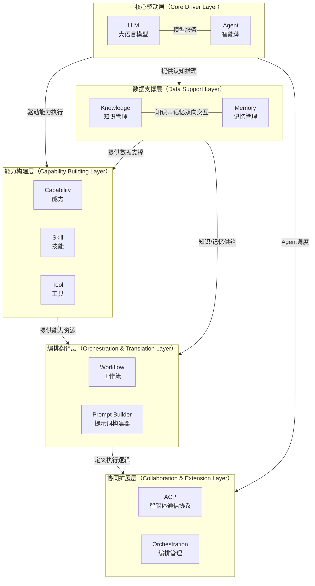

**知识管理模块在五层架构中的核心定位**：

|维度 |说明 |
|---|---|
|所属架构层 |数据支撑层（Data Support Layer） |
|层级核心职责 |提供静态结构化知识的存储、检索与维护 |
|上下游关系 |下游承接核心驱动层的认知推理（LLM 提取、Agent 检索），上游向能力构建层、编排翻译层、协同扩展层供给知识数据 |
|架构层并列模块 |Memory（记忆管理），二者构成完整的数据底座（静态知识 + 动态记忆） |


---

### 12.2 知识管理与其他模块的关系

来源：PRD-12 §5.4.3、§5.4.4、§5.4.5。

#### 12.2.1 模块依赖矩阵（Knowledge 视角）

```text
模块        Dashboard  Knowledges  Memories  Capabilities  LLM  Agents  Orchestrations  Workflows  PromptBuilder  Merchants  Users  Permissions  Monitoring  SystemSetting
Knowledges   D(R)         -          ↔          -            -     -          -             -           -             -         -       R            -           R
```

> 标识符说明：D = 知识管理是其他模块的数据源；R = 知识管理读取依赖其他模块（如 Permissions、SystemSetting）；↔ = 知识管理与 Memories 双向交互。

#### 12.2.2 核心关系详解

|关系编号 |关系方向 |类型 |描述 |数据流 |影响范围 |
|---|---|---|---|---|---|
|关系 A |Knowledge → Dashboard |数据读取 |知识管理向仪表盘提供 4 个核心 KPI（Knowledge Capacity、Total Documents、Knowledge Growth Rate、Query Success Rate）以及分类分布、热门 Knowledge Top 10、知识更新动态 |Knowledge 数据 → 聚合查询 → KPI 计算 → 图表渲染 |知识管理故障时仪表盘对应卡片不可用，其他卡片不受影响 |
|关系 B |Knowledge ↔ Memory |双向交互 |知识管理提供静态结构化信息，记忆管理提供动态交互记忆。知识文档可被索引为记忆，记忆检索时可引用知识库内容，形成知识-记忆的双向增强 |知识文档 → 向量化 → 索引 → 记忆检索 → 知识引用 |知识库更新时需同步刷新关联的记忆索引 |
|关系 C |Agent → Knowledge |检索调用 |Agent 在执行任务时通过 `knowledge:read` 权限检索 Knowledge 条目，支撑智能问答与推理 |Agent 请求 → 知识检索 → 知识片段返回 → Agent 决策 |知识管理服务不可用时，依赖检索的 Agent 将无法获取知识支撑 |
|关系 D |Dashboard → Knowledge |数据聚合 |仪表盘从知识管理模块聚合数据展示 KPI 和趋势 |知识管理数据 → 仪表盘聚合查询 → 展示 |仪表盘读取失败不影响知识管理自身功能 |
|关系 E |Monitoring → Knowledge |监控采集 |监控与分析模块从知识管理模块采集运行指标和日志 |知识管理指标 → 采集 Agent → PostgreSQL 分区表 / Prometheus → 监控面板/告警 |监控模块故障不影响知识管理业务运行 |
|关系 F |System Setting → Knowledge |配置依赖 |系统设置模块为知识管理提供全局配置参数（最大文件大小、提取规则默认值、向量维度等） |配置变更 → 事件总线 → 知识管理监听 → 配置热更新 |全局配置变更影响知识管理行为 |
|关系 G |Permissions → Knowledge |权限读取 |知识管理从权限管理模块读取 RBAC 与 ABAC 策略，应用 `knowledge:list/read/edit/delete` 等权限标识 |权限策略 → 知识管理网关 → 拦截校验 → 允许/拒绝 |权限管理故障时降级为仅 Dashboard 的基础访问 |

#### 12.2.3 知识管理依赖关系图

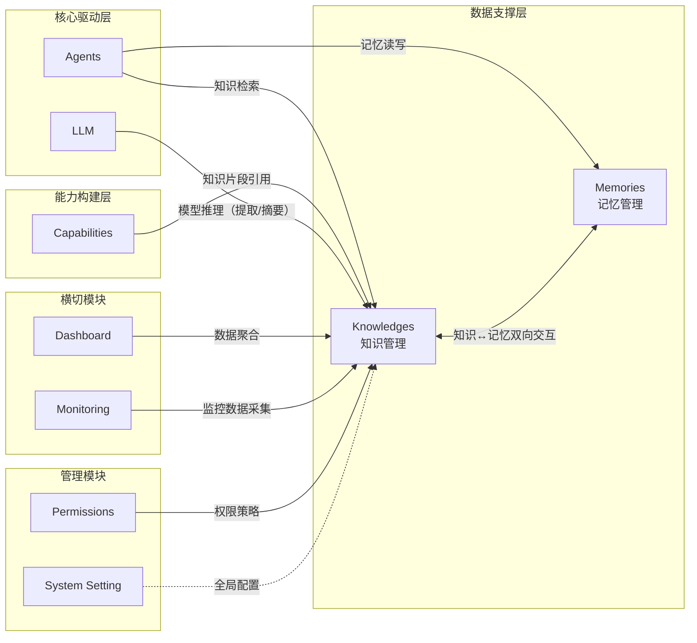

**验收标准**：

|编号 |验收标准 |验证方法 |
|---|---|---|
|AC-K-MR-01 |Knowledge 与 Memory 双向交互链路完整：知识变更触发记忆索引更新，记忆检索可引用知识 |集成测试验证双向链路 |
|AC-K-MR-02 |Agent 通过标准接口检索 Knowledge，无需绕过权限校验 |代码审查 + 集成测试 |
|AC-K-MR-03 |Dashboard 从 Knowledge 聚合的 4 个 KPI 数据准确，无跨租户数据泄露 |以不同 Merchant 账户验证 |
|AC-K-MR-04 |知识库更新后，关联的记忆索引在 5 秒内完成刷新 |修改 Knowledge 后验证记忆索引延迟 |
|AC-K-MR-05 |模块依赖矩阵（Knowledge 视角）准确反映实际系统架构 |代码审查逐一核对依赖关系 |


---

## 13. 非功能需求汇总

本章汇总知识管理模块在性能、安全、可用性、兼容性、可观测性方面的非功能需求，整合自 PRD-02 §8 与 PRD-12 §5.5，并与 PRD-01 §7 现有内容对齐。

### 13.1 性能需求

来源：PRD-02 §8.1、PRD-12 §5.5.1，结合 PRD-01 §7.1。

|编号 |需求项 |指标 |验证方法 |
|---|---|---|---|
|NFR-K-P-001 |知识列表查询响应时间 |≤ 500ms（P95，1000 条数据） |APM 监控接口响应时间 |
|NFR-K-P-002 |知识详情查询响应时间 |≤ 200ms（P95） |APM 监控接口响应时间 |
|NFR-K-P-003 |图可视化首次渲染时间 |≤ 3 秒（1000 节点） |前端 Performance API 测量 |
|NFR-K-P-004 |图可视化交互帧率 |≥ 60fps（500 节点），≥ 30fps（2000 节点） |浏览器 Performance 面板测量 |
|NFR-K-P-005 |文档上传吞吐量 |≥ 10MB/s（单文件） |测量上传速率 |
|NFR-K-P-006 |知识提取吞吐量 |≥ 10 页/分钟（PDF） |测量提取速率 |
|NFR-K-P-007 |向量检索响应时间 |≤ 100ms（P95，10 万条向量） |APM 监控接口响应时间 |
|NFR-K-P-008 |知识仪表盘 KPI 卡片刷新 |≤ 1 秒（从触发到卡片更新完成） |Performance API 测量 |
|NFR-K-P-009 |知识仪表盘图表渲染 |≤ 2 秒（图表完整渲染） |Performance API 测量 |
|NFR-K-P-010 |并发查询支持 |≥ 1000 QPS |压力测试 |
|NFR-K-P-011 |并发导入支持 |≥ 100 并发 |压力测试 |
|NFR-K-P-012 |仪表盘并发承载 |100 并发用户同时访问，响应时间不超过目标值的 1.5 倍 |JMeter/k6 压力测试 |
|NFR-K-P-013 |图表降采样 |图表数据点超过 200 时自动降采样至 100 个 |构造大数据量场景验证 |
|NFR-K-P-014 |WebSocket 消息延迟 |≤ 100ms（服务端到客户端） |实时通信测试 |

### 13.2 安全需求

来源：PRD-02 §8.2、PRD-12 §5.5.2，结合 PRD-01 §7.3。

|编号 |需求项 |指标 |验证方法 |
|---|---|---|---|
|NFR-K-S-001 |传输加密 |全站 HTTPS，TLS 1.2+ |SSL Labs 测试 |
|NFR-K-S-002 |存储加密 |敏感数据 AES-256 加密存储（文档内容、向量数据） |代码审查 + 渗透测试 |
|NFR-K-S-003 |多租户隔离 |不同商户的 Knowledge 数据严格隔离，包括关系数据库、Vector Store、对象存储 |渗透测试 |
|NFR-K-S-004 |访问控制 |基于 RBAC + ABAC 模型控制 Knowledge 的增删改查权限（`knowledge:list/read/edit/delete`） |代码审查 + 权限测试 |
|NFR-K-S-005 |操作审计 |记录所有 Knowledge 的创建、修改、删除操作日志，保留 180 天，不可篡改 |功能测试 + 日志审查 |
|NFR-K-S-006 |文件安全 |上传文件进行病毒扫描，拒绝恶意文件 |功能测试 |
|NFR-K-S-007 |接口鉴权 |所有 Dashboard / Workspace / Knowledge 接口需携带有效 JWT Token，无效/过期 Token 返回 401 |安全测试 |
|NFR-K-S-008 |接口限流 |单用户 100 QPS，超出返回 HTTP 200 + 业务错误码 050429 |压测工具模拟超限请求 |
|NFR-K-S-009 |数据脱敏 |敏感数据展示时自动脱敏（手机号、邮箱、身份证等） |功能测试 |
|NFR-K-S-010 |防注入 |SQL 注入、XSS、CSRF、SSRF 防护 |渗透测试 |
|NFR-K-S-011 |防 URL 绕过 |通过 URL 直接访问无 `knowledge:*` 权限的子模块时返回 403 |渗透测试 |
|NFR-K-S-012 |缓存加密 |Redis 缓存敏感字段使用 AES-256 加密 |检查 Redis 存储格式 |

### 13.3 可用性需求

来源：PRD-02 §8.3、PRD-12 §5.5.3，结合 PRD-01 §7.2。

|编号 |需求项 |指标 |验证方法 |
|---|---|---|---|
|NFR-K-A-001 |系统可用性 |≥ 99.9%（月度） |监控报表 |
|NFR-K-A-002 |故障恢复时间（RTO） |≤ 30 分钟 |灾备演练 |
|NFR-K-A-003 |数据恢复点目标（RPO） |≤ 5 分钟 |灾备演练 |
|NFR-K-A-004 |向量存储可用性 |≥ 99.95% |监控报表 |
|NFR-K-A-005 |提取服务降级可用性 |≥ 99.5%（OCR/NER 服务降级后） |故障注入测试 |
|NFR-K-A-006 |数据备份 |每日全量备份 + 每小时增量备份 |备份记录 |
|NFR-K-A-007 |故障切换时间 |≤ 10 秒（自动故障切换） |高可用测试 |
|NFR-K-A-008 |错误率 |API 错误率 ≤ 0.1%（排除客户端错误） |监控报表 |
|NFR-K-A-009 |单接口故障隔离 |单个 Knowledge KPI 接口故障不影响其他卡片展示 |模拟单个接口故障 |
|NFR-K-A-010 |离线降级 |离线状态下展示缓存数据，顶部显示离线提示 |断开网络验证 |
|NFR-K-A-011 |WebSocket 断线重连 |指数退避（最大 5 次，间隔 1s/2s/4s/8s/16s），重连失败后降级为 HTTP 轮询（30 秒间隔） |模拟网络中断 |
|NFR-K-A-012 |权限加载降级 |权限接口故障时展示基础导航（仅 Dashboard） |故障注入测试 |

### 13.4 兼容性需求

来源：PRD-02 §8.4、PRD-12 §5.5.4，结合 PRD-01 §7.5。

|编号 |需求项 |指标 |验证方法 |
|---|---|---|---|
|NFR-K-C-001 |浏览器兼容 |Chrome ≥ 90、Firefox ≥ 88、Safari ≥ 14、Edge ≥ 90 |多浏览器测试 / BrowserStack |
|NFR-K-C-002 |分辨率适配 |桌面端 ≥ 1280×720（推荐 1920×1080），768px~1279px 平板适配，< 768px 移动端单列布局 |响应式测试 |
|NFR-K-C-003 |移动端适配 |iOS Safari ≥ 14、Android Chrome ≥ 90（图可视化在平板端 ≥ 768px 可用，手机端仅支持数据网格视图） |真机/模拟器验证 |
|NFR-K-C-004 |Vector Store 兼容 |支持 Neo4j ≥ 5.11（向量索引） |集成测试 |
|NFR-K-C-005 |Embedding Model 兼容 |支持 OpenAI text-embedding-3-small/large、开源 BGE/E5 等 |集成测试 |
|NFR-K-C-006 |API 向后兼容 |API 版本升级时，旧版本至少保留 6 个月兼容期 |版本管理检查 |
|NFR-K-C-007 |响应式断点 |支持 XL（≥1280px）/ LG（1024~1279px）/ MD（768~1023px）/ SM（<768px）四个断点平滑适配 |响应式测试 |

### 13.5 可观测性需求

来源：PRD-12 §5.5.5、§5.5.7。

|编号 |需求项 |指标 |验证方法 |
|---|---|---|---|
|NFR-K-O-001 |监控覆盖 |所有 Knowledge API 接口、异步任务、外部服务调用均有监控指标 |监控系统验证 |
|NFR-K-O-002 |告警机制 |提取失败率 > 5%、Vector Store 响应时间 > 500ms、导入队列积压 > 50、文档处理 SLA 超出阈值时触发告警 |告警测试 |
|NFR-K-O-003 |分布式追踪 |所有 API 请求支持分布式链路追踪（traceId 贯穿） |链路追踪验证 |
|NFR-K-O-004 |指标接口 |所有服务暴露 Prometheus 指标接口（`/metrics`） |监控系统验证 |
|NFR-K-O-005 |健康检查 |所有服务提供健康检查接口（`/health`） |健康检查验证 |
|NFR-K-O-006 |日志规范 |统一 JSON 日志格式，包含 `traceId` 用于链路追踪，覆盖全部 Knowledge 写操作 |日志审查 |
|NFR-K-O-007 |用户行为埋点 |知识浏览、检索、点击、编辑等关键操作埋点上报 |数据分析验证 |
|NFR-K-O-008 |配置外部化 |提取规则、Embedding 配置、清洗规则等支持动态配置（无需重启服务） |配置中心验证 |


---

## 14. 接口规范汇总

本章定义知识管理模块 API 应遵循的统一规范，整合自 PRD-12 §5.6、PRD-02 §7.1 知识相关端点。知识管理模块新增接口必须严格遵循本章规范，确保与系统其他模块保持一致。

### 14.1 接口总则（GraphQL 单总线）

> **v5 收束说明(2026-06-13)**：知识管理模块对外**仅**暴露 GraphQL 单总线接口。**不**再设计 RESTful 端点、不使用 `/api/v1/...` 资源路径、不使用 HTTP 方法语义区分操作。

|规范项 |说明 |
|---|---|
|接口形态 |**GraphQL**（`POST /graphql`），遵循 PRD-00 §A5 GraphQL Schema 设计规范 |
|操作类型 |`Query`（查询）、`Mutation`（写操作）、`Subscription`（实时推送） |
|命名约定 |Query 使用名词 / 动词 + 资源，`Mutation` 使用动词 + 资源 + Input |
|多租户 |`info.context["partition_key"]` 由 Gateway 注入，业务模块**不**接受租户入参 |
|错误表达 |业务错误通过 `errors[].extensions.code` 传递 `BIZ_KNOWLEDGE_*` 命名空间 |
|HTTP 状态 |业务层恒为 200；HTTP 401/403 仅保留在 API Gateway 网关层（Token 缺失/越权拦截） |
|文档位置 |全部 Schema 定义、Query/Mutation、Input Type 见 **§A5 GraphQL Schema** |

### 14.2 统一前缀与认证

来源：PRD-12 §5.6.3。

|规范项 |说明 |
|---|---|
|对外接口 |**GraphQL 单总线**（`POST /graphql`），统一前缀**无** RESTful 路径 |
|认证方式 |Bearer Token（JWT），请求头格式：`Authorization: Bearer {token}` |
|Token 刷新 |客户端调用 GraphQL `Mutation refreshToken(input: RefreshTokenInput!)`，**不**再有 RESTful `POST /api/v1/auth/refresh` |
|Access Token 有效期 |30 分钟 |
|Refresh Token 有效期 |7 天 |
|认证失败 |网关层返回 401 状态码，业务层响应统一为 200 并通过 `errors[].extensions.code` 返回命名空间错误码 |

### 14.3 统一响应格式

来源：PRD-12 §5.6.4。

> **v5 收束说明(2026-06-13)**：所有知识管理接口响应遵循 GraphQL 标准信封 `{data, errors, extensions.traceId}`，**不**再使用 `{code, message, data, timestamp, traceId}` 旧式信封。业务错误码位于 `errors[].extensions.code`，traceId 位于 `extensions.traceId`。

**成功响应（单对象 Query）**：

```json
{
  "data": {
    "knowledge": {
      "id": "knl_001",
      "title": "机器学习基础",
      "type": "tech",
      "status": "published"
    }
  },
  "errors": null,
  "extensions": {
    "traceId": "5f9c0a7e-2a3b-4d12-b6c1-1f8e2b1a6f0d"
  }
}
```

**分页响应（Relay Connection）**：

> **P1-025 收束说明(2026-06-13)**：Relay Connection 直接作为 GraphQL 顶层 query 字段的返回类型（`data.<listFieldName>.edges/pageInfo/totalCount`），分页响应**示例**仅展示 Relay Connection 自身结构（无 `data` 包装层）。**完整响应**仍遵循 §14.3 顶部 v5 收束说明的 `{data, errors, extensions.traceId}` 信封格式。

```json
{
  "edges": [
    {
      "cursor": "Y3Vyc29yOjE=",
      "node": {
        "id": "knl_001",
        "title": "机器学习基础"
      }
    }
  ],
  "pageInfo": {
    "hasNextPage": true,
    "hasPreviousPage": false,
    "startCursor": "Y3Vyc29yOjE=",
    "endCursor": "Y3Vyc29yOjEwMA=="
  },
  "totalCount": 100
}
```

> **P1-014 收束说明(2026-06-13)**：分页响应**仅**保留 Relay Connection（`edges` / `pageInfo` / `totalCount`），删除原 `items` 数组形态，避免双形态共存带来的客户端分支处理。

**错误响应**：

```json
{
  "data": null,
  "errors": [
    {
      "message": "知识标题不能为空",
      "path": ["createKnowledge", "input", "title"],
      "extensions": {
        "code": "BIZ_KNOWLEDGE_TITLE_REQUIRED",
        "field": "title",
        "traceId": "5f9c0a7e-2a3b-4d12-b6c1-1f8e2b1a6f0d"
      }
    }
  ],
  "extensions": {
    "traceId": "5f9c0a7e-2a3b-4d12-b6c1-1f8e2b1a6f0d"
  }
}
```

### 14.4 错误码体系

来源：PRD-00 §5.3 权威错误码体系（详见 PRD-12 §A7 段位利用率表）。

错误码采用 6 位编码，数字段位为 `050001-050999`，结构为 `05{类型1位}{序号3位}`，知识管理模块前缀为 `05`。

**模块前缀**：

|模块前缀 |模块名称 |数字段位 |
|---|---|---|
|05 |知识（Knowledge） |050001-050999 |

**类型编码**：

|类型编码 |类型名称 |错误码范围 |
|---|---|---|
|0 |通用错误 |050001-050009 |
|1 |参数校验错误 |050101-050199 |
|2 |业务规则错误 |050201-050299 |
|3 |权限错误 |050301-050399 |
|4 |资源不存在（**含 050429 特例** — 配额超限/限流，见下） |050401-050499 |
|5 |状态冲突 |050501-050599 |
|6 |外部服务错误 |050601-050699 |
|7 |混合架构同步错误（Outbox / Neo4j / RLS） |050701-050799 |

**知识管理模块典型错误码**：

|错误码 |说明 |适用场景 |
|---|---|---|
|050001 |知识模块未知错误 |兜底错误 |
|050002 |知识模块系统内部错误 |未预期的服务异常 |
|050101 |知识标题不能为空 |创建/更新 Knowledge 时 |
|050102 |知识内容不能为空 |创建/更新 Knowledge 时 |
|050103 |知识类型不能为空 |创建/更新 Knowledge 时 |
|050104 |知识来源文档不能为空 |创建/更新 Knowledge 时 |
|050201 |知识标题已存在 |同 Merchant 下标题重复 |
|050202 |知识编码已存在 |启用唯一编码时 |
|050203 |知识已发布，禁止直接删除 |需先归档 |
|050204 |知识被 N 个 Agent 引用，删除需二次确认 |关联校验提示 |

> **删除保护策略**: 被Agent引用的知识允许删除（需二次确认），删除后自动解除Agent的knowledge_id引用并触发`knowledge.deleted`事件通知相关Agent owner。错误码050204为提示性错误码，用于触发二次确认流程，而非阻止删除。

| 050301 | 无 knowledge:list 权限 | 列表访问被拒 |
| 050302 | 无 knowledge:read 权限 | 详情访问被拒 |
| 050303 | 无 knowledge:edit 权限 | 编辑操作被拒 |
| 050304 | 无 knowledge:delete 权限 | 删除操作被拒 |
| 050401 | 知识不存在 | ID 无效或已删除 |
| 050402 | 知识类型不存在 | 类型 ID 无效 |
| 050403 | 知识来源文档不存在 | 来源 ID 无效 |
| 050404 | 知识版本不存在 | 版本号无效 |
| 050429 | 配额超限 / API 限流 | 域配额使用率 100% 拦截新创建 / 单用户 100 QPS 超限（**特例**：语义上属"业务规则错误"，复用 050429 段位以保留向后兼容；规划在 v8 迁移至 050229/050230） |
| 050501 | 知识状态冲突 | 状态机非法跃迁 |
| 050502 | 知识正在被提取任务处理 | 并发修改冲突 |
| 050601 | Embedding Model 不可用 | 向量化失败 |
| 050602 | Neo4j 向量服务异常 | 向量检索失败 |
| 050603 | 提取模型调用超时 | LLM 推理超时 |
| 050604 | OCR 服务不可用 | PDF 扫描件解析失败 |

**混合架构同步错误码（050701-050798）**：详见 §A8 错误码段位分配。

### 14.5 分页规范

来源：PRD-00 §4.4 Relay Connection 规范。

采用 Relay Connection（游标分页）作为标准分页方式，与 PRD-00 §4.4 全局规范对齐。**不**使用 RESTful `GET /api/v1/knowledges?...` 形式，参数以 GraphQL 入参表达。

**查询参数**：

|参数名 |类型 |说明 |
|---|---|---|
|first |Int |向前获取条数，与 `after` 搭配使用 |
|after |String |游标，获取该游标之后的记录 |
|last |Int |向后获取条数，与 `before` 搭配使用 |
|before |String |游标，获取该游标之前的记录 |
|sort |String |排序字段:排序方向，默认 `createdAt:desc`，支持多字段排序（逗号分隔） |
|search |String |全文搜索关键词 |

> `first` 与 `last` 互斥，不可同时传入；`first` 默认 20，可选值：10/20/50/100。

**分页响应结构**（与 §14.3 一致，详见上文）：

```json
{
  "edges": [
    {
      "node": { "...": "..." },
      "cursor": "cursor-string"
    }
  ],
  "pageInfo": {
    "hasNextPage": true,
    "hasPreviousPage": false,
    "startCursor": "cursor-string",
    "endCursor": "cursor-string"
  },
  "totalCount": 100
}
```

**知识管理模块应用示例**（GraphQL 入参形式）：

- 知识列表分页：`query { knowledges(first: 20, after: "Y3Vyc29yOjE=", sort: "updatedAt:desc", search: "机器学习") { ... } }`
- 知识版本分页：`query { knowledge(id: "knl_001") { versions(first: 10) { ... } } }`
- 知识更新动态分页：`query { dashboardActivities(type: "knowledge", first: 20) { ... } }`

### 14.6 知识管理相关接口清单

来源：PRD-02 §7.1 知识相关接口 + PRD-01 §6 知识管理自有接口。

|接口编号 |接口名称 |类型 |GraphQL |说明 |
|---|---|---|---|---|
|API-02-01 |获取 KPI 数据（含 Knowledge 4 个 KPI） |Query |`dashboardKpi` |获取 9 个 KPI 卡片数据 |
|API-02-03 |获取分类分布数据 |Query |`dashboardCategories` |获取分类分布饼图数据 |
|API-02-06 |获取热门 Knowledge 列表 |Query |`dashboardTrendingKnowledge` |获取热门 Knowledge Top 10 |
|API-02-11 |获取最近活动（Knowledge 类型） |Query |`dashboardActivities(type: String)` |获取知识更新动态，支持分页和类型筛选 |
|API-03-NN |知识条目 CRUD |Query/Mutation |`knowledge*` |详见 PRD-01 §6 |
|API-03-NN |知识类型 CRUD |Query/Mutation |`knowledgeType*` |详见 PRD-01 §6 |
|API-03-NN |知识来源 CRUD |Query/Mutation |`knowledgeSource*` |详见 PRD-01 §6 |
|API-03-NN |知识提取规则 |Query/Mutation |`knowledgeExtractionRules*` |详见 PRD-01 §6 |

### 14.7 接口规范验收标准

|编号 |验收标准 |验证方法 |
|---|---|---|
|AC-K-API-01 |所有 Knowledge 模块新增 API 遵循 GraphQL 单总线规范（POST `/graphql`），不再使用 RESTful 资源路径 |API 审查 |
|AC-K-API-02 |所有 Knowledge API 不再使用 `/api/v1/` RESTful 前缀，全部为 GraphQL Query/Mutation |API 审查 |
|AC-K-API-03 |所有 Knowledge API 响应格式符合 GraphQL 标准信封（`{data, errors, extensions.traceId}`） |接口自动化测试，覆盖率 100% |
|AC-K-API-04 |错误码体系使用 `BIZ_KNOWLEDGE_*` 命名空间（PRD-00 §5.3.1 权威枚举表），类型编码（参数/业务/权限/资源不存在/状态冲突/外部/混合）使用正确 |接口测试 |
|AC-K-API-05 |分页接口遵循 Relay Connection 规范（`first`/`after`/`last`/`before`），返回 `edges` + `pageInfo` + `totalCount`，**不**含 `items` 数组 |接口测试 |
|AC-K-API-06 |所有 Knowledge API 需鉴权（Bearer Token），无 Token 网关层返回 401，无权限返回 403，业务层响应统一为 200 |安全测试 |
|AC-K-API-07 |知识更新动态接口支持 `type=knowledge` 筛选（GraphQL 入参），列表分页参数生效 |功能测试 |
|AC-K-API-08 |仪表盘知识相关接口（KPI/分类/热门/活动）纳入统一接口规范基线管理 |API 治理平台核查 |


---

## 15. P0/P1 修复：路径规范、多租户隔离与安全增强

> **v6 收束说明**：本章节为 v5 修复历史归档。v6 收束后的权威规范请参考：路径规范 → §5.1 接口规范 + §14 接口规范汇总（`POST /graphql`）；多租户隔离 → §7 数据模型（`partition_key` 复合主键 + RLS）；安全增强 → §8 安全规范。本节保留作为修复历史参考，不作为新实现依据。

> 本章节为依据《Banyan 平台 9 大模块后端技术评估报告》对 PRD-01 知识管理模块的 P0（立即修复）与 P1（重要优化）级别补充内容。所有修复均以最小侵入方式叠加在原文档之上，不影响现有章节逻辑。

### 15.1 API 路径规范化（修复 P0 路径单复数冲突）

> **v6 收束说明(2026-06-14)**：以下修复仅适用于原 RESTful 路径历史，PRD-01 现状**统一采用 GraphQL**（`POST /graphql`，详见 §5.1 接口规范与 §14 接口规范汇总）。本节作为修复历史保留，便于追踪单复数冲突的修复决策；实际接入请以 GraphQL Query/Mutation 入口为准。

知识管理模块 API 路径在原文档中存在严重的单复数冲突，本次修复以 §14 接口规范汇总中的"资源命名（复数形式）"为基准，全文统一路径命名。

**修复对照表**：

|修复前路径 |修复后路径 |HTTP 方法 |接口说明 |
|---|---|---|---|
|`/api/v1/knowledge/graph` |`/api/v1/knowledges/graph` |GET |查询知识图谱数据 |
|`/api/v1/knowledge` |`/api/v1/knowledges` |GET |查询知识列表 |
|`/api/v1/knowledge/{id}` |`/api/v1/knowledges/{id}` |GET |查询知识详情 |
|`/api/v1/knowledge/graph/path` |`/api/v1/knowledges/graph/path` |POST |路径查询 |
|`/api/v1/knowledge/sources` |`/api/v1/knowledge-sources` |GET |获取文档列表 |
|`/api/v1/knowledge/sources/import` |`/api/v1/knowledge-sources/import` |POST |导入文档 |
|`/api/v1/knowledge/sources/{id}` |`/api/v1/knowledge-sources/{id}` |GET/PUT/DELETE |文档详情/编辑/删除 |
|`/api/v1/knowledge/sources/{id}/refresh` |`/api/v1/knowledge-sources/{id}/refresh` |POST |触发 Knowledge 更新 |
|`/api/v1/knowledge/types` |`/api/v1/knowledge-types` |GET/POST |知识类型列表/创建 |
|`/api/v1/knowledge/types/{id}` |`/api/v1/knowledge-types/{id}` |PUT/DELETE |编辑/删除知识类型 |
|`/api/v1/knowledge/extraction-rules` |`/api/v1/knowledge-extraction-rules` |GET/PUT |提取规则 |
|`/api/v1/knowledge/vector-config` |`/api/v1/knowledge-vector-config` |GET/PUT |向量配置 |
|`/api/v1/knowledge/schema` |`/api/v1/knowledges/schema` |GET/PUT |图谱 Schema |
|`/api/v1/knowledge/cleaning-rules` |`/api/v1/knowledge-cleaning-rules` |GET/PUT |清洗规则 |
|`/api/v1/knowledge/manual` |`/api/v1/knowledges/manual` |POST |手动录入知识 |
|`/api/v1/knowledge/batch` |`/api/v1/knowledges/batch-delete` |POST |批量删除（语义清晰） |
|`/api/v1/knowledge/export` |`/api/v1/knowledges/export` |GET |导出知识 |
|`/api/v1/knowledge/{id}/versions` |`/api/v1/knowledges/{id}/versions` |GET |版本历史 |
|`/api/v1/knowledge/{id}/versions/{version}/rollback` |`/api/v1/knowledges/{id}/versions/rollback?version=v1.0` |POST |版本回滚（Query 替代 Path） |
|`/api/v1/knowledge/{id}/agents` |`/api/v1/knowledges/{id}/agents` |GET/POST |关联 Agent 查询/绑定 |
|`/api/v1/knowledge/{id}/agents/{agent_id}` |`/api/v1/knowledges/{id}/agents/{agent_id}` |DELETE |解除绑定 |

**路径命名原则**：

|原则 |说明 |
|---|---|
|资源复数 |一类资源用复数形式命名，如 `/knowledges` 而非 `/knowledge` |
|子资源用连字符 |复合资源使用 `-` 连接，如 `/knowledge-sources` |
|避免多级嵌套 |资源层级不超过 3 级，超过时转为 Query 参数 |
|特殊操作动词 |仅在不可表述为标准 CRUD 时使用，如 `batch-delete`、`manual` |
|路径参数位置 |`{id}` 放在资源名之后，Query 参数用于过滤与版本号 |


---

### 15.2 Neo4j 多租户隔离（混合架构增强版）

知识图谱底层使用 Neo4j Community Edition 存储，采用 **GraphLabel 标签过滤 + partition_key 属性 + 拦截器** 三层隔离方案（v5 命名空间，原 `tenant_id` 字段名已统一为 `partition_key`），杜绝跨租户数据泄露。

> **方案选型**：采用 Option 4（静态 `Graph` 标签策略），所有租户共享 `Graph` 静态标签，通过 `WHERE n.partition_key = $partitionKey` 条件过滤实现租户隔离（v6 收束，对齐 PRD-00 §7.3 权威规范，原 `Graph{PartitionKey}` 动态标签已统一为静态 `Graph` 标签）。此方案适用于 Neo4j Community Edition。

**两层标签体系（v5 收束）**：

> **v5 收束说明(2026-06-13)**：原"基础标签 + 租户标签 + 实体类型标签 + 域类型标签"四层标签体系收敛为"实体基础标签 + 租户标签"两层。`SharedEntity` / `PublicEntity` 域类型标签**移除**（域隔离由 `owner_scope` 字段 + PostgreSQL RLS 表达，不再挂 Neo4j 标签），实体类型标签仍保留。

|标签层 |示例 |说明 |
|---|---|---|
|实体基础标签 |`KnowledgeEntity` |所有知识图谱节点的公共基础标签 |
|租户隔离标签 |`Graph` |静态标签，租户隔离通过 `WHERE n.partition_key = $partitionKey` 条件过滤实现（v6 收束，原 `Graph{partition_key}` 动态标签已统一为静态 `Graph` 标签） |

> 域隔离语义由 `owner_scope`（OWN / SHARED / PUBLIC）字段 + PG RLS 策略表达；Neo4j 不再使用 `SharedEntity` / `PublicEntity` 域类型标签。

**Neo4j 节点 Schema（统一模板）**：

```text
// Unique constraint: per-tenant + entity id
CREATE CONSTRAINT knowledge_partition_key IF NOT EXISTS
FOR (n:Knowledge) REQUIRE (n.partition_key, n.id) IS UNIQUE;

// Index: partition_key + status
CREATE INDEX knowledge_partition_status IF NOT EXISTS
FOR (n:Knowledge) ON (n.partition_key, n.status);

// Index: partition_key + name
CREATE INDEX knowledge_partition_name IF NOT EXISTS
FOR (n:Knowledge) ON (n.partition_key, n.name);
```

**节点定义示例**：

```text
// Knowledge node with GraphLabel isolation
CREATE (k:KnowledgeEntity:Graph:Knowledge {
  id: "entity_001",                   // Global unique ID (for PG correlation)
  partition_key: "tenant_a",          // Tenant ID (v5 命名空间, isolation identifier)
  code: "KN_001",                     // Knowledge code
  name: "Knowledge item name",        // Name only (no content)
  status: "PUBLISHED",                // Status
  owner_scope: "OWN",                 // OWN / SHARED / PUBLIC (域隔离字段)
  domain_id: "domain_001",            // Domain ID
  domain_type: "PRIVATE",             // Domain type
  created_at: datetime(),
  updated_at: datetime()
});

// Relation edge
CREATE (a)-[r:KNOWS {
  partition_key: "tenant_a",
  weight: 0.85,
  created_at: datetime()
}]->(b);
```

**Cypher 查询强制注入 GraphLabel**：

> **v5 收束说明(2026-06-13)**：`SharedEntity` / `PublicEntity` 域类型标签已移除，域隔离由 `owner_scope` 字段 + PG RLS 表达。共享/公共知识查询通过 `MATCH (n:Knowledge) WHERE n.owner_scope IN ['SHARED', 'PUBLIC']` 实现。

|场景 |原 Cypher（不安全） |修复后 Cypher（带 GraphLabel 过滤） |
|---|---|---|
|实体查询 |`MATCH (n:KnowledgeEntity) WHERE n.id = $id` |`MATCH (n:KnowledgeEntity:Knowledge:Graph) WHERE n.partition_key = $partitionKey AND n.id = $id` |
|路径查询 |`MATCH p=(a)-[*..3]->(b)` |`MATCH p=(a:KnowledgeEntity:Knowledge:Graph)-[*..3]->(b:KnowledgeEntity:Knowledge:Graph) WHERE ALL(n IN nodes(p) WHERE n.partition_key = $partitionKey)` |
|邻居查询 |`MATCH (n)--(m)` |`MATCH (n:KnowledgeEntity:Knowledge:Graph)--(m:KnowledgeEntity:Knowledge:Graph) WHERE n.partition_key = $partitionKey AND m.partition_key = $partitionKey` |
|共享知识查询 |`MATCH (n:Knowledge) WHERE n.owner_scope = 'SHARED' AND $partition_key IN n.shared_tenant_ids` |`MATCH (n:KnowledgeEntity:Knowledge:Graph) WHERE n.partition_key = $partitionKey AND n.owner_scope = 'SHARED' AND $partition_key IN n.shared_tenant_ids` |
|公共知识查询 |`MATCH (n:PublicEntity:Knowledge)`（v5 已废止） |`MATCH (n:KnowledgeEntity:Knowledge:Graph) WHERE n.owner_scope = 'PUBLIC'` |
|管理员全量查询 |`MATCH (n:KnowledgeEntity)` |`MATCH (n:KnowledgeEntity)`（requires `app.is_superuser = 'true'`，且 `partition_key` 跨域视图通过 PG `tenant_knowledge_kb.global_view` 视图查询） |

**GraphLabel 计算规则**：

```py
def _graph_label() -> str:
    """Return static Neo4j GraphLabel (v6: unified to static 'Graph')"""
    return "Graph"
```

**Neo4j Driver 拦截器**：

|拦截器 |作用 |
|---|---|
|TenantGuardInterceptor |在所有写入 Cypher 前自动追加 `Graph` 标签和 `SET n.partition_key = $partition_key` |
|TenantFilterInterceptor |在所有读取 Cypher 中将 `MATCH (n:KnowledgeEntity)` 替换为 `MATCH (n:Graph:KnowledgeEntity) WHERE n.partition_key = $partitionKey` |
|QueryAuditInterceptor |记录所有 Cypher 执行到审计日志（含 traceId） |

**Neo4j 数据排除清单**（禁止写入 Neo4j 的数据）：

|禁止数据 |原因 |正确存储位置 |
|---|---|---|
|知识内容文本 |包含 PII 和业务敏感信息 |PostgreSQL `tenant_knowledge_kb.content` |
|分块文本 |同上 |PostgreSQL `tenant_knowledge_chunk.content` |
|用户个人信息 |PII |PostgreSQL `tenant_knowledge_entity` (RLS 保护) |
|审计日志 |WORM 合规要求 |PostgreSQL `audit_knowledge_event` |
|共享租户列表完整数据 |跨租户访问控制 |PostgreSQL `tenant_knowledge_kb.shared_tenant_ids` (RLS 策略) |
|Embedding 向量 |高维浮点数组 |Neo4j |
|版本变更内容 |可能包含敏感信息 |PostgreSQL `tenant_knowledge_version` |

**Neo4j 节点属性白名单**：

```text
// Allowed properties only
{
  id: "entity_001",           // Global unique ID (for PG correlation)
  partition_key: "tenant_a",  // Tenant ID (v5 命名空间, isolation identifier)
  code: "KN_001",             // Knowledge code
  name: "Knowledge name",    // Name only (not content)
  entity_type: "Person",      // Entity type
  status: "PUBLISHED",        // Status
  owner_scope: "OWN",         // OWN / SHARED / PUBLIC (域隔离字段)
  domain_id: "domain_001",    // Domain ID
  domain_type: "PRIVATE",     // Domain type
  created_at: datetime(),     // Created time
  updated_at: datetime()      // Updated time
  // Only present when SHARED/PUBLIC:
  shared_tenant_ids: [],      // Shared tenant ID list (IDs only, no details)
}
```


---

### 15.3 共享资源层多租户隔离（修复 P0 缺失）

知识资源（Knowledge）支持租户共享，必须显式声明 `owner_scope` 与 `shared_tenant_ids`，避免误开放。PostgreSQL RLS 策略在数据库层面强制租户隔离，应用层无需手动过滤 `partition_key`。

**Knowledge 表结构扩展**：

|字段 |类型 |必填 |默认值 |说明 |
|---|---|---|---|---|
|tenant_id |VARCHAR(64) |是 |— |所属租户 ID（主隔离标识） |
|owner_scope |ENUM('OWN','SHARED','PUBLIC') |是 |OWN |资源可见范围 |
|shared_tenant_ids |JSON ARRAY |否 |[] |共享给指定租户（仅 SHARED 时生效） |
|partition_key |VARCHAR(64) |是 |— |所属租户 ID（主隔离标识，复合主键首位） |
|deleted_at |TIMESTAMPTZ |否 |NULL |软删除时间戳（NULL 表示未删除） |

**owner_scope 语义说明**：

|作用域 |可见性规则 |典型场景 |
|---|---|---|
|OWN |仅 `partition_key` 所属租户可访问 |商户私有知识 |
|SHARED |`partition_key` 与 `shared_tenant_ids` 内租户可访问 |跨商户共享行业知识 |
|PUBLIC |所有租户可访问 |平台公共知识（如通识百科） |

**共享知识查询 SQL 示例**：

```sql
-- PostgreSQL RLS policy: automatic tenant isolation
-- RLS replaces application-level filtering; the following is for reference only
-- Actual isolation is enforced by PostgreSQL RLS policies (see A3)
SELECT k.*
FROM tenant_knowledge_kb k
WHERE k.partition_key = current_setting('app.current_tenant_id', TRUE)
  AND k.deleted_at IS NULL
  AND (
    (k.owner_scope = 'OWN')
    OR (k.owner_scope = 'SHARED' AND k.partition_key = current_setting('app.current_tenant_id', TRUE))
    OR (k.owner_scope = 'SHARED' AND current_setting('app.current_tenant_id', TRUE) IN (
        SELECT jsonb_array_elements_text(k.shared_tenant_ids)
    ))
    OR (k.owner_scope = 'PUBLIC')
  );
```


---

### 15.4 知识检索 ABAC 鉴权（修复 P0 缺失）

知识检索需要支持跨 Channel 访问控制，引入基于属性的访问控制（ABAC）模型。详见 PRD-12 §5.7 权限模型。

**ABAC 决策要素**：

|要素 |字段 |示例 |
|---|---|---|
|主体属性 |user_id、user_role、user_tenant_id、user_department |`user_001`、`developer`、`tenant_a`、`R&D` |
|客体属性 |knowledge_id、partition_key、owner_scope、shared_tenant_ids、sensitivity_level |`knl_001`、`tenant_a`、`SHARED`、`["tenant_b"]`、`L2` |
|动作属性 |action、channel |`read`、`web` / `api` / `agent` |
|环境属性 |ip、time、mfa_verified |`10.0.0.1`、`2026-06-09T10:00:00Z`、`true` |

**ABAC 规则示例（DSL）**：

```yaml
# 规则 1：私有知识仅租户内可读
- id: K-ABAC-001
  effect: permit
  subject: { role: [developer, admin, ops] }
  action: read
  resource: { owner_scope: OWN }
  condition: subject.tenant_id == resource.tenant_id

# 规则 2：共享知识需在共享名单内
- id: K-ABAC-002
  effect: permit
  subject: { role: [developer, admin, ops] }
  action: read
  resource: { owner_scope: SHARED }
  condition: subject.tenant_id IN resource.shared_tenant_ids

# 规则 3：高敏感知识需 MFA
- id: K-ABAC-003
  effect: permit
  action: read
  resource: { sensitivity_level: L3 }
  condition: environment.mfa_verified == true

# 规则 4：默认拒绝
- id: K-ABAC-999
  effect: deny
  priority: 0
```

**Channel 差异化策略**：

|Channel |鉴权强度 |限流策略 |
|---|---|---|
|web |标准 RBAC + ABAC |60 次/分钟/用户 |
|api |标准 RBAC + ABAC + API Key |1000 次/分钟/Key |
|agent |标准 RBAC + ABAC + Agent 身份 |300 次/分钟/Agent |
|mcp |标准 RBAC + ABAC + OAuth Scope |600 次/分钟/Client |


---

### 15.5 统一权限标识（修复 P1）

知识管理模块权限标识在原文档中已采用 `knowledge:list/read/edit/delete` 格式，本次进一步统一为**资源级 + 操作级**两段式格式，详见 PRD-12 §5.7.3 权限标识规范。

|资源 |权限标识 |含义 |默认角色 |
|---|---|---|---|
|知识条目 |`knowledge:list` |查看知识列表 |开发者/运维/管理员 |
|知识条目 |`knowledge:read` |查看知识详情 |开发者/运维/管理员 |
|知识条目 |`knowledge:edit` |编辑知识条目 |管理员 |
|知识条目 |`knowledge:delete` |删除知识条目 |管理员 |
|知识类型 |`knowledge_type:manage` |知识类型 CRUD |管理员 |
|知识来源 |`knowledge_source:manage` |文档来源 CRUD |开发者/管理员 |
|知识图谱 |`knowledge_graph:read` |图谱查询 |开发者/运维/管理员 |
|知识图谱 |`knowledge_graph:edit` |编辑 Schema/路径 |管理员 |
|提取规则 |`knowledge_extraction:edit` |配置提取规则 |管理员 |
|向量配置 |`knowledge_vector:edit` |配置 Embedding |管理员 |

**权限矩阵**：

|功能/操作 |超级管理员 |商户管理员 |开发者 |运维 |普通用户 |
|---|:---:|:---:|:---:|:---:|:---:|
|knowledge:list |✅ |✅ |✅ |✅ |❌ |
|knowledge:read |✅ |✅ |✅ |✅ |❌ |
|knowledge:edit |✅ |✅ |❌ |❌ |❌ |
|knowledge:delete |✅ |✅ |❌ |❌ |❌ |
|knowledge_graph:edit |✅ |✅ |❌ |❌ |❌ |


---

### 15.6 统一分页参数（修复 P1）

知识管理模块所有列表查询接口统一使用 Relay Connection（游标分页），与 PRD-00 §4.4 全局规范对齐。原文档中存在的 `page`/`pageSize` 偏移分页已全部改为 Relay Connection 规范。本次补充规范说明如下：

**分页请求参数**：

|参数名 |类型 |必填 |说明 |
|---|---|---|---|
|first |Int |否 |向前获取条数，与 `after` 搭配使用，默认 20 |
|after |String |否 |游标，获取该游标之后的记录 |
|last |Int |否 |向后获取条数，与 `before` 搭配使用 |
|before |String |否 |游标，获取该游标之前的记录 |
|sort |String |否 |排序字段:排序方向，默认 `createdAt:desc` |
|search |String |否 |全文搜索关键词 |

> `first` 与 `last` 互斥，不可同时传入；`first`/`last` 可选值：10/20/50/100。

**分页响应结构**：

```json
{
  "edges": [
    {
      "node": { "...": "..." },
      "cursor": "cursor-string"
    }
  ],
  "pageInfo": {
    "hasNextPage": true,
    "hasPreviousPage": false,
    "startCursor": "cursor-string",
    "endCursor": "cursor-string"
  },
  "totalCount": 100
}
```

**分页字段命名规范**：

|维度 |规范 |反例 |
|---|---|---|
|参数命名 |`first`/`after`/`last`/`before` |`page`/`pageSize`/`page_size`/`pageNum` |
|游标类型 |String（Base64 编码） |Integer |
|默认值 |first=20 |first=0 / first=1000 |
|越界处理 |返回空 edges 列表 |抛出 400 错误 |


---

### 15.7 Embedding 安全（修复 P1）

Embedding 阶段是 Prompt 注入的高危路径，必须对输入做白名单清洗与长度限制。

**安全策略**：

|维度 |策略 |阈值 |
|---|---|---|
|输入长度 |单条 Knowledge 内容最大字符数 |32,768 字符 |
|标签过滤 |过滤 HTML/JS/SQL 注入特征 |全部 `<script>`、`<iframe>`、`onerror=` 等 |
|编码清洗 |统一为 UTF-8 NFC 形式 |拒绝异常编码 |
|提示词检测 |检测是否包含 "忽略以上指令" 等越狱关键词 |命中即拒绝 |
|速率限制 |单租户 Embedding 调用 |1000 次/分钟/租户（Embedding 子资源层级，详见下方注 ¹） |
|审计日志 |记录所有被拒绝的请求 |traceId + 用户 + 拒绝原因 |

> **¹ 限流分层说明（v5 收束说明 2026-06-13）**：
>
> - **Embedding 子资源限流（1000 次/分钟/租户）**：本节 §15.7 表格中的限流值，仅作用于 Embedding API 这一高成本子资源，由 API Gateway 在子资源粒度（`/knowledge/embedding`）按租户维度独立计数，命中即返回 `BIZ_KNOWLEDGE_RATE_LIMITED`。
> - **平台租户级限流（10000 QPS/租户）**：来自 PRD-00 §4.6 平台全局限流，作用于整租户所有 GraphQL 入口（含 `query` / `mutation` / `subscription` 全部顶层字段），由 SilvaEngine 入口层统一熔断。
> - **层级关系**：平台租户级（10000 QPS）是**外层总闸**，Embedding 子资源（1000 次/分钟）是**内层子闸**，二者独立计数、互不覆盖，请求链路为"先过平台总闸 → 再过子资源闸"。

**Embedding 降级与异常处理**：

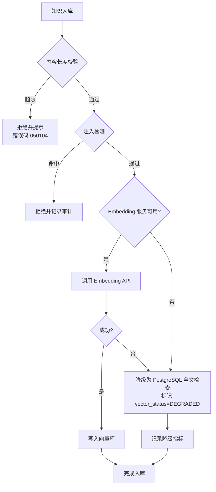

**降级策略表**：

|降级场景 |触发条件 |降级方案 |恢复策略 |
|---|---|---|---|
|Embedding 服务不可用 |API 5xx 或超时 > 5s |标记 `vector_status=DEGRADED`，查询时降级为 PostgreSQL 全文检索（pg_trgm + tsvector） |服务恢复后异步重试向量化 |
|向量库（Neo4j）不可用 |连接失败 |强制走 PostgreSQL 全文检索（pg_trgm + tsvector） |健康检查通过后恢复双路检索 |
|PostgreSQL 全文检索不可用 |数据库不可达 |返回错误"知识库暂不可用" |数据库恢复后自动恢复 |
|LLM 提取失败 |API 错误 |跳过实体提取，仅保留原始文本 |失败重试 3 次后放弃 |


---

### 15.8 知识图谱 APM 追踪（修复 P1）

所有 Cypher 查询必须上报到 APM 平台，支持按租户、查询类型、Slow Query 等维度分析。

**Cypher Span 上报规范**：

|Span 名称格式 |示例 |必填属性 |
|---|---|---|
|`neo4j.{query_type}` |`neo4j.entity.find`、`neo4j.path.shortest` |traceId、tenant_id、duration_ms、row_count、cypher_hash |
|`cypher.execute` |`cypher.execute` |traceId、cypher_template_id、parameters_hash |

**Cypher 模板化与脱敏**：

```py
# 模板化示例：避免将用户输入写入 span attributes 引发敏感信息泄露
SPAN_ATTRIBUTES = {
    "neo4j.template_id": "entity.find_by_id",
    "neo4j.parameters_hash": sha256(json.dumps({"id": entity_id, "tenant_id": tenant_id})),
    "neo4j.row_count": result_count,
    "neo4j.duration_ms": duration_ms,
    "tenant_id": tenant_id
}
# 禁止将 cypher 全文与 parameters 全文记录到 span
```

**Slow Query 治理**：

|指标 |阈值 |告警 |
|---|---|---|
|单次 Cypher P95 延迟 |> 200ms |持续 5 分钟触发告警 |
|单次 Cypher P99 延迟 |> 1s |持续 5 分钟触发告警 |
|全表扫描 Cypher |检测到 `MATCH (n)` 无索引 |拒绝执行 |
|单租户 QPS |> 100 QPS |触发限流 |


---

### 15.9 知识管理多租户隔离总体架构（混合架构增强版）

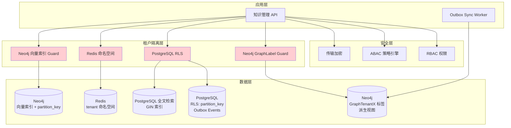

> **架构说明**：
>
> - PostgreSQL 为**权威数据源**，所有业务写入先到 PG，通过 Outbox 事件异步同步到 Neo4j
> - Neo4j 为**派生视图**，仅由 Sync Worker 和 KG Construction Pipeline 写入，应用层不直接写入
> - PostgreSQL RLS 在数据库层面强制租户隔离，应用层无需手动过滤 `partition_key`
> - Neo4j 使用 `Graph` 静态标签 + `WHERE n.partition_key = $partitionKey` 条件过滤实现租户隔离（v6 收束，原 `Graph{PartitionKey}` 动态标签已统一为静态 `Graph` 标签）


---

### 15.10 P0/P1 修复验收标准

|编号 |验收标准 |优先级 |验证方法 |
|---|---|---|---|
|AC-K-FIX-01 |所有 Knowledge API 路径统一为 `/api/v1/knowledges/...` 复数形式，无单复数混用 |P0 |自动化测试扫描所有路由 |
|AC-K-FIX-02 |所有 Neo4j 节点包含 `Graph` 租户标签 + `partition_key` 属性，跨租户 Graph 标签查询返回空结果 |P0 |渗透测试 |
|AC-K-FIX-03 |Knowledge 表 `owner_scope` 字段生效，SHARED 知识仅共享名单内可访问 |P0 |集成测试 |
|AC-K-FIX-04 |知识检索跨 Channel 调用均通过 ABAC 校验 |P0 |集成测试 |
|AC-K-FIX-05 |权限标识全部为 `knowledge:*` 资源级 + 操作级格式 |P1 |代码扫描 |
|AC-K-FIX-06 |所有列表 API 使用 Relay Connection 分页参数（`first`/`after`/`last`/`before`） |P1 |接口测试 |
|AC-K-FIX-07 |Embedding 注入检测 100% 覆盖，命中后拒绝并记录审计 |P1 |安全测试 |
|AC-K-FIX-08 |向量化降级策略生效，Neo4j 向量索引不可用时降级为 PostgreSQL 全文检索 |P1 |故障注入测试 |
|AC-K-FIX-09 |Cypher 查询 100% 上报 APM Span，Slow Query 告警生效 |P1 |监控验证 |


---

## 16. 混合架构：Outbox 事件同步机制

> 本章定义 PostgreSQL → Neo4j 的异步事件同步机制，确保 Neo4j 作为派生视图与 PostgreSQL 权威数据源保持最终一致。

### 16.1 Outbox Pattern 概述

知识管理模块采用 Outbox Pattern 实现 PostgreSQL 到 Neo4j 的异步数据同步：

1. 业务写入（知识 CRUD）在 PostgreSQL 事务中同时写入 `outbox_events` 表
2. Sync Worker 轮询 `outbox_events` 表中 `status = 'PENDING'` 的事件
3. Sync Worker 将事件转换为 Neo4j Cypher 操作并执行
4. 执行成功后标记事件为 `PROCESSED`；失败则重试，超过阈值进入 Dead Letter Queue

### 16.2 事件类型定义

> **P1-029 收束说明(2026-06-13)**：本节 §16.2 为知识管理模块**本模块内** Outbox 事件清单（仅供本模块 Neo4j 同步使用）。**跨模块事件**（如涉及 PRD-06 智能体 / PRD-05 编排订阅的消费方契约）**以** [**PRD-00 §4.7.5 跨模块事件权威表**](../PRD-00-平台总览与全局规范.md#475-跨模块事件清单p1-4) **为准**；本模块新增/修改事件时，必须同步刷新 PRD-00 §4.7.5 与 §4.7.6 矩阵。

> **v7 收束说明(2026-06-16) 标签体系**：本节所有 Cypher **统一遵循** PRD-00 §3.5.5 三层标签体系：①基础标签 `KnowledgeEntity`（标识本模块语义）；②业务标签 `Knowledge` / `EntityType` / `KnowledgeDomain` / `RELATION_TYPE`（业务索引优化）；③静态租户标签 `Graph`（PRD-00 §7.3 权威）。租户隔离由 `WHERE n.partition_key = $partitionKey` 条件过滤实现，**不**再使用 `Graph{partition_key}` 动态标签，**不**再使用 `SharedEntity` / `PublicEntity` 域类型标签（域隔离由 `owner_scope` 字段 + PG RLS 表达，详见 §15.2）。
>
> **MERGE 模式说明**：节点创建事件（`*.created` / `domain.*`）使用 `MERGE (n:KnowledgeEntity:<BusinessTag>:Graph {id, partition_key, ...})` 三标签全量声明；属性更新事件（`*.updated` / `*.shared` / `*.published` / `*.archived`）使用 `MATCH (n:<BusinessTag>:Graph {id}) WHERE n.partition_key = $partitionKey SET n += $props` 双标签 + 隔离条件，**省略** `KnowledgeEntity` 以减少 Cypher 解析开销（基础标签已隐含在节点上，不影响匹配结果）。

|event_name |触发场景 |Neo4j 操作 |
|---|---|---|
|`knowledge.created` |创建知识条目 |`MERGE (k:KnowledgeEntity:Knowledge:Graph {id, partition_key, ...})` |
|`knowledge.updated` |更新知识条目 |`MATCH (k:Knowledge:Graph {id}) WHERE k.partition_key = $partitionKey SET k += $props` |
|`knowledge.deleted` |删除知识条目（软删除） |`MATCH (k:Knowledge:Graph {id}) WHERE k.partition_key = $partitionKey SET k.status = 'DELETED', k.deleted_at = datetime()` |
|`knowledge.shared` |共享知识条目 |`MATCH (k:Knowledge:Graph {id}) WHERE k.partition_key = $partitionKey SET k.owner_scope = 'SHARED', k.shared_tenant_ids = $ids` |
|`knowledge.published` |发布知识条目到公共域 |`MATCH (k:Knowledge:Graph {id}) WHERE k.partition_key = $partitionKey SET k.owner_scope = 'PUBLIC'` |
|`knowledge.archived` |知识条目归档（状态变更为"已归档"） |`MATCH (k:Knowledge:Graph {id}) WHERE k.partition_key = $partitionKey SET k.status = 'ARCHIVED', k.archived_at = datetime()` |
|`entity.created` |创建实体 |`MERGE (e:KnowledgeEntity:EntityType:Graph {id, partition_key, ...})` |
|`entity.updated` |更新实体 |`MATCH (e:EntityType:Graph {id}) WHERE e.partition_key = $partitionKey SET e += $props` |
|`entity.deleted` |删除实体 |`MATCH (e:EntityType:Graph {id}) WHERE e.partition_key = $partitionKey DETACH DELETE e` |
|`relation.created` |创建关系 |`MATCH (a:Graph), (b:Graph) WHERE a.id = $from AND b.id = $to AND a.partition_key = $partitionKey AND b.partition_key = $partitionKey MERGE (a)-[r:RELATION_TYPE {partition_key, ...}]->(b)` |
|`relation.deleted` |删除关系 |`MATCH (a)-[r:RELATION_TYPE {partition_key: $partitionKey}]-(b) WHERE a.id = $from AND b.id = $to DELETE r` |
|`domain.created` |创建知识域 |`MERGE (d:KnowledgeEntity:KnowledgeDomain:Graph {id, partition_key, domain_type, ...})` |
|`domain.updated` |更新知识域 |`MATCH (d:KnowledgeDomain:Graph {id}) WHERE d.partition_key = $partitionKey SET d += $props` |

### 16.3 Sync Worker 配置

|参数 |默认值 |说明 |
|---|---|---|
|`poll_interval_ms` |100 |Outbox 轮询间隔（毫秒） |
|`batch_size` |50 |每次处理事件数 |
|`max_retries` |5 |最大重试次数 |
|`retry_delay_ms` |1000 |首次重试延迟（毫秒），指数退避 |
|`retry_delay_multiplier` |2.0 |退避乘数 |
|`neo4j_timeout_ms` |5000 |Neo4j 写入超时 |
|`dead_letter_threshold` |5 |超过此次数进入 Dead Letter Queue |
|`idempotency_window_hours` |24 |幂等窗口（同一事件不重复处理） |

### 16.4 幂等性保障

所有 Neo4j 写入操作使用 `MERGE` 语句而非 `CREATE`，确保重复消费事件不会产生重复数据：

```text
// Idempotent write example
MERGE (k:KnowledgeEntity:Graph:Knowledge {id: $id})
ON CREATE SET k += $props, k.created_at = datetime(), k.partition_key = $partition_key
ON MATCH SET k += $props, k.updated_at = datetime()
```


---

## 17. 混合架构：数据分类与存储映射

### 17.1 数据分类表

|数据类别 |存储位置 |包含内容 |隔离方式 |敏感等级 |
|---|---|---|---|---|
|**知识内容** |PostgreSQL |原文、分块文本、元数据、标签 |RLS (`partition_key`) |高 — 包含业务敏感信息 |
|**实体元数据** |PostgreSQL + Neo4j |实体 ID、名称、类型、属性 |PG: RLS; Neo4j: GraphLabel + `partition_key` |PG: 高; Neo4j: 中 |
|**关系元数据** |PostgreSQL + Neo4j |关系 ID、类型、权重、源/目标 |PG: RLS; Neo4j: `partition_key` on relationship |PG: 高; Neo4j: 中 |
|**向量嵌入** |Neo4j |Embedding 向量、向量 ID |Neo4j: 向量索引 + partition_key |中 |
|**知识域定义** |PostgreSQL + Neo4j |域 ID、类型（PRIVATE/SHARED/PUBLIC）、成员 |PG: RLS; Neo4j: GraphLabel + `domain_type` |PG: 高; Neo4j: 低 |
|**版本历史** |PostgreSQL |版本号、变更内容、变更人 |RLS (`partition_key`) |高 |
|**审计日志** |PostgreSQL (WORM) |操作人、操作类型、时间、详情 |应用层控制（超级管理员） |最高 |
|**缓存** |Redis |热点知识、图谱查询结果 |namespace: `{tid}:` |低 |


---

## 18. 混合架构：写入路径与读取路径

### 18.1 知识创建写入路径

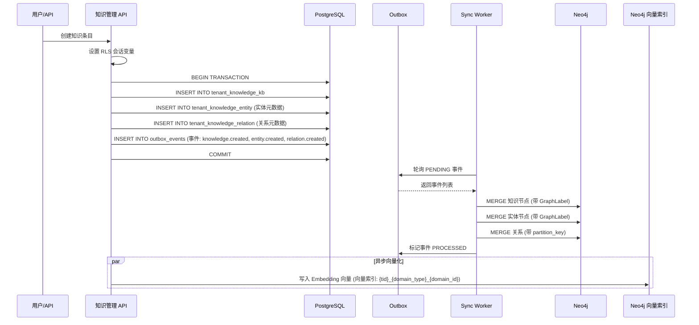

### 18.2 知识详情读取路径

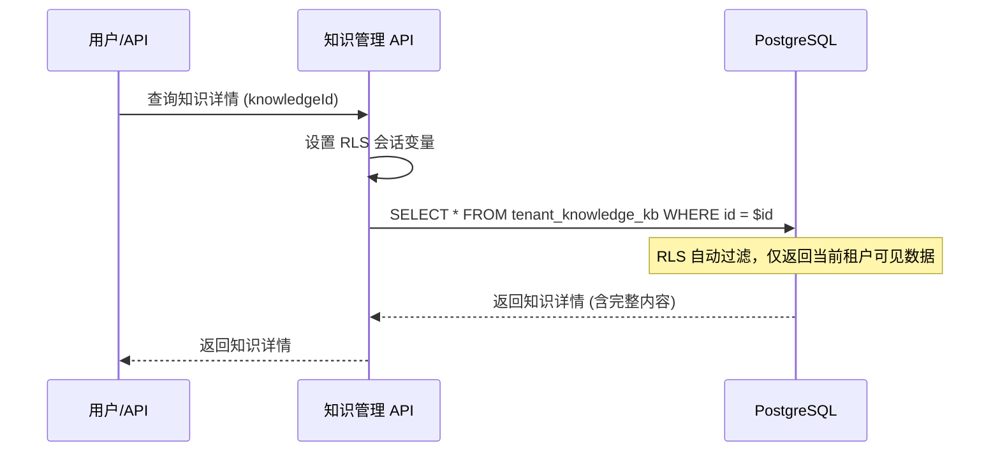

> **说明**：知识内容查询仅走 PostgreSQL，RLS 自动保证租户隔离，无需额外过滤。

### 18.3 知识图谱查询路径

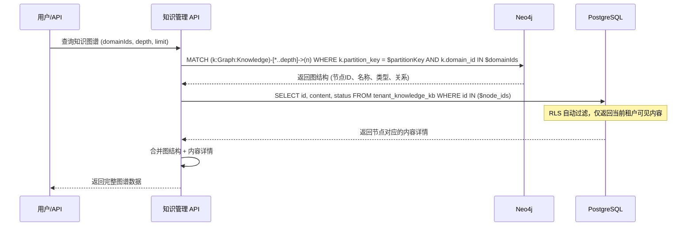

### 18.4 RAG 检索路径

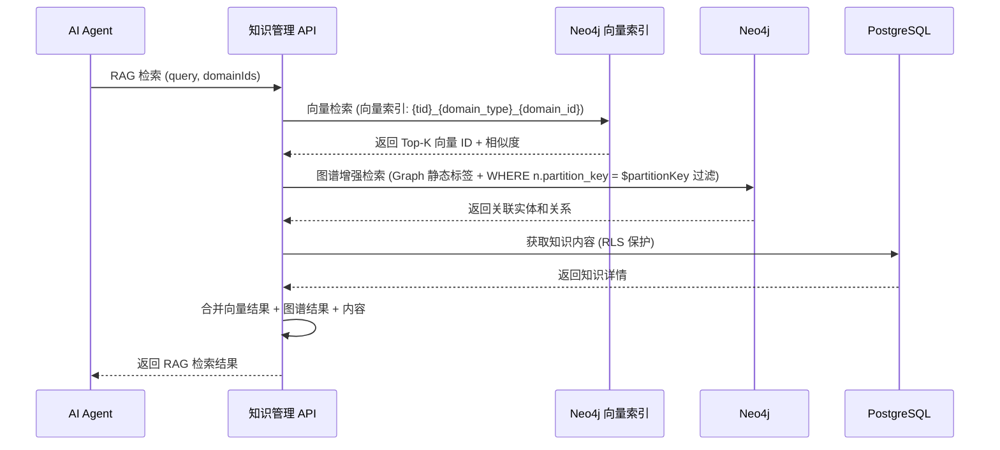


---

## 19. 混合架构：知识图谱构建管道（KG Construction）

### 19.1 架构

```mermaid
flowchart LR
    subgraph PG["PostgreSQL (权威)"]
        KB[(tenant_knowledge_kb)]
        CHK[(tenant_knowledge_chunk)]
    end

    subgraph KG["neo4j-graphrag-python"]
        SE[Schema Extractor]
        EE[Entity Extractor<br/>LLM-based]
        RE[Relation Extractor<br/>LLM-based]
        DR[Dedup Resolver<br/>FuzzyMatch]
        PP[Graph Pruner]
    end

    subgraph NEO["Neo4j (派生)"]
        ENT2[(:KnowledgeEntity:Graph)]
    end

    KB --> SE
    KB --> EE
    KB --> RE
    SE --> NEO
    EE --> DR
    RE --> DR
    DR --> PP
    PP --> NEO
```

### 19.2 KG 构建流程

1. **Schema 提取**：从 PostgreSQL 读取已有实体类型和关系类型，调用 `neo4j-graphrag-python` SchemaExtractor
2. **实体提取**：从 `tenant_knowledge_kb.content` 读取文本，通过 LLM 提取实体，写入 `tenant_knowledge_entity`
3. **关系提取**：基于提取的实体，通过 LLM 提取关系，写入 `tenant_knowledge_relation`
4. **实体去重**：`FuzzyMatchResolver` / `SpaCySemanticMatchResolver` 合并相似实体
5. **图谱剪枝**：移除低置信度、孤立节点
6. **Outbox 同步**：实体和关系通过 Outbox 事件同步到 Neo4j

> **关键点**：`neo4j-graphrag-python` 直接操作 Neo4j，但实体和关系数据仍需通过 Outbox 写入 PostgreSQL，保证 PG 为权威数据源。KG 构建完成后，Sync Worker 将结果同步回 Neo4j。


---

## 20. 混合架构：跨租户共享流程

### 20.1 共享流程（修订版）

```mermaid
flowchart TD
    A[租户 A 知识条目<br/>owner_scope = OWN] --> B{共享类型?}

    B -->|共享给指定租户| C[更新 PG: owner_scope = SHARED<br/>shared_tenant_ids = [tenant_b]<br/>Outbox 事件: knowledge.shared]
    B -->|发布到公共域| D[创建发布申请<br/>Outbox 事件: knowledge.publish_request]

    C --> E[Sync Worker 更新 Neo4j:<br/>SET k.owner_scope = 'SHARED'<br/>SET k.shared_tenant_ids = ['tenant_b']<br/>(v5 收束：仅修改 owner_scope 字段，<br/>不再 ADD LABEL :SharedEntity)]

    D --> F{审批通过?}
    F -->|是| G[更新 PG: owner_scope = PUBLIC<br/>Outbox 事件: knowledge.published]
    F -->|否| H[拒绝，保持 OWN]

    G --> I[Sync Worker 更新 Neo4j:<br/>SET k.owner_scope = 'PUBLIC'<br/>(v5 收束：仅修改 owner_scope 字段，<br/>不再 ADD LABEL :PublicEntity)]
```

### 20.2 共享查询规则

|查询场景 |PostgreSQL (RLS) |Neo4j (GraphLabel) |
|---|---|---|
|查看本租户 OWN 知识 |自动（`partition_key` 过滤） |`MATCH (n:KnowledgeEntity:Knowledge:Graph) WHERE n.partition_key = $partitionKey AND n.owner_scope = 'OWN'` |
|查看共享给本租户的知识 |自动（`knowledge_visibility` 策略） |`MATCH (n:KnowledgeEntity:Knowledge:Graph) WHERE $partitionKey IN n.shared_tenant_ids AND n.owner_scope = 'SHARED'` |
|查看公共知识 |自动（`knowledge_visibility` 策略） |`MATCH (n:KnowledgeEntity:Knowledge:Graph) WHERE n.owner_scope = 'PUBLIC'` |
|管理员查看所有知识 |`SET app.is_superuser = 'true'` |`MATCH (n:KnowledgeEntity)` |


---

## 21. 混合架构：租户生命周期管理

### 21.1 租户操作对照

|操作 |PostgreSQL |Neo4j（图谱 + 向量） |Redis |
|---|---|---|---|
|**创建租户** |创建 `partition_key` 分区（如使用分区表） |无操作（首次写入时自动创建 GraphLabel + 向量索引） |创建 Redis key 前缀 |
|**删除租户** |`DELETE FROM tenant_* WHERE partition_key = $pk` |`MATCH (n:Graph) WHERE n.partition_key = $partitionKey DETACH DELETE n`（含向量索引数据） |删除 `{tenant_a}:*` |
|**冻结租户** |RLS 策略增加 `AND is_active = TRUE` |节点增加 `status = 'FROZEN'` 属性；保留向量索引，查询时过滤 |保留缓存，增加 TTL |
|**迁移租户** |导出 PG 数据 → 导入新集群 |`MATCH (n:Graph) WHERE n.partition_key = $partitionKey RETURN n` → 导入新集群（含向量索引导出/导入） |清除旧缓存 |

### 21.2 Neo4j 租户删除脚本

```text
// Delete all data for a tenant (single statement)
MATCH (n:Graph)
WHERE n.partition_key = $partitionKey
DETACH DELETE n;

// Verify deletion complete
MATCH (n:Graph)
WHERE n.partition_key = $partitionKey
RETURN count(n) AS remaining_nodes;
// Expected: remaining_nodes = 0
```


---

## 22. 混合架构：故障处理与一致性保障

### 22.1 一致性模型

|维度 |一致性级别 |说明 |
|---|---|---|
|PostgreSQL 内部 |强一致 |ACID 事务保证 |
|Outbox 事件 |最终一致 |事件在 PG 事务内写入，保证不丢失 |
|Neo4j 同步 |最终一致（延迟 < 1s） |Sync Worker 异步消费，正常情况下延迟 < 500ms |
|Neo4j 向量 |最终一致 |向量化异步执行，通过 `vector_status` 字段追踪 |
|Redis 缓存 |最终一致 |写入时主动失效，读时懒加载 |

### 22.2 故障场景与恢复

|故障场景 |PostgreSQL |Neo4j |Sync Worker |恢复策略 |
|---|---|---|---|---|
|Neo4j 短暂不可用 |正常写入，Outbox 事件累积 |不可用 |重试（指数退避，5 次） |Neo4j 恢复后自动消费积压事件 |
|Neo4j 长时间不可用 |正常写入，Outbox 事件累积 |不可用 |事件进入 Dead Letter Queue |运维手动触发重放：`POST /admin/outbox/replay` |
|Sync Worker 崩溃 |正常写入，Outbox 事件累积 |正常 |重启后从头消费 |幂等 MERGE 保证不产生重复数据 |
|PG 写入失败 |事务回滚，无数据 |无变化 |无事件产生 |用户重试 |
|Neo4j 数据与 PG 不一致 |PG 为权威源 |以 PG 为准 |下次同步时覆盖 Neo4j |管理员可触发全量重同步：`POST /admin/sync/full` |

### 22.3 Dead Letter Queue 处理

```sql
-- Query Dead Letter events
SELECT id, aggregate_type, aggregate_id, event_type, error_message, created_at
FROM outbox_events
WHERE status = 'DEAD_LETTER'
ORDER BY created_at DESC;

-- Replay Dead Letter events
UPDATE outbox_events
SET status = 'PENDING', retry_count = 0, error_message = NULL
WHERE status = 'DEAD_LETTER'
  AND id = $event_id;
```

### 22.4 全量重同步

当 Neo4j 数据与 PG 严重不一致时（如 Neo4j 数据损坏），可触发全量重同步：

```bash
# Trigger full resync (admin tool)
POST /admin/sync/full
Content-Type: application/json
{
  "partition_key": "tenant_a",
  "aggregate_types": ["knowledge", "entity", "relation", "domain"]
}

# Resync process:
# 1. Clear Neo4j data for this tenant: MATCH (n:Graph) WHERE n.partition_key = $partitionKey DETACH DELETE n
# 2. Read all data from PostgreSQL
# 3. Rebuild Neo4j (with GraphLabel)
# 4. Reset Outbox event status
```


---

## 23. 混合架构：Outbox Sync Worker 代码骨架

```py
# silvaengine_modules/knowledge/sync/outbox_sync_worker.py
import time
import json
import logging
from typing import Optional
from datetime import datetime, timedelta
from sqlalchemy import text
from silvaengine_connections import ConnectionPoolManager


logger = logging.getLogger(__name__)


def _graph_label() -> str:
    """Return static Neo4j GraphLabel (v6: unified to static 'Graph')"""
    return "Graph"


class OutboxSyncWorker:
    """
    Outbox event synchronization Worker

    Responsibilities: consume events from PostgreSQL Outbox table, sync to Neo4j.
    Guarantees: idempotent (MERGE), ordered (by aggregate_id), retry (exponential backoff).
    """

    POOL_PG = "postgres_main"
    POOL_NEO4J = "neo4j_main"

    def __init__(self, config: dict):
        self.poll_interval = config.get("poll_interval_ms", 100) / 1000.0
        self.batch_size = config.get("batch_size", 50)
        self.max_retries = config.get("max_retries", 5)
        self.retry_delay = config.get("retry_delay_ms", 1000) / 1000.0
        self.retry_multiplier = config.get("retry_delay_multiplier", 2.0)
        self.neo4j_timeout = config.get("neo4j_timeout_ms", 5000) / 1000.0
        self.dead_letter_threshold = config.get("dead_letter_threshold", 5)
        self.running = False

    def start(self):
        """Start Sync Worker"""
        self.running = True
        while self.running:
            try:
                events = self._fetch_pending_events()
                for event in events:
                    self._process_event(event)
            except Exception as e:
                logger.error(f"Sync worker error: {e}")
                time.sleep(self.poll_interval)

    def stop(self):
        """Stop Sync Worker"""
        self.running = False

    def _fetch_pending_events(self) -> list:
        """Fetch pending events from Outbox"""
        with ConnectionPoolManager().connection(self.POOL_PG) as conn:
            result = conn.execute(text("""
                SELECT id, aggregate_type, aggregate_id, event_type,
                       partition_key, payload, retry_count
                FROM outbox_events
                WHERE status = 'PENDING'
                  AND retry_count < :max_retries
                ORDER BY created_at ASC
                LIMIT :batch_size
                FOR UPDATE SKIP LOCKED
            """), {"max_retries": self.max_retries, "batch_size": self.batch_size})
            return [dict(row) for row in result.mappings()]

    def _process_event(self, event: dict):
        """Process a single Outbox event"""
        try:
            self._set_rls_context(event["partition_key"])
            self._sync_to_neo4j(event)
            self._mark_processed(event["id"], event["partition_key"])
        except Exception as e:
            logger.error(f"Failed to process event {event['id']}: {e}")
            self._mark_failed(event["id"], event["partition_key"], str(e))

    def _sync_to_neo4j(self, event: dict):
        """Sync event to Neo4j based on event type"""
        graph_label = _graph_label()
        payload = event["payload"] if isinstance(event["payload"], dict) else json.loads(event["payload"])

        with ConnectionPoolManager().connection(self.POOL_NEO4J) as driver:
            with driver.session() as session:
                if event["event_type"] == "knowledge.created":
                    self._merge_node(session, graph_label, event["aggregate_type"], payload)
                elif event["event_type"] == "knowledge.updated":
                    self._update_node(session, graph_label, event["aggregate_type"], payload)
                elif event["event_type"] == "knowledge.deleted":
                    self._delete_node(session, graph_label, event["aggregate_type"], payload)
                elif event["event_type"] == "knowledge.shared":
                    self._share_node(session, graph_label, payload)
                elif event["event_type"] == "knowledge.published":
                    self._publish_node(session, graph_label, payload)

    def _merge_node(self, session, graph_label: str, aggregate_type: str, payload: dict):
        """Idempotent create/update node"""
        entity_type = payload.get("entity_type", aggregate_type.title())
        session.run(
            f"""
            MERGE (n:KnowledgeEntity:{graph_label}:{entity_type} {{id: $id}})
            ON CREATE SET n += $props, n.partition_key = $partition_key,
                          n.created_at = datetime(), n.owner_scope = 'OWN'
            ON MATCH SET n += $props, n.updated_at = datetime()
            """,
            id=payload["id"],
            partition_key=payload.get("partition_key"),
            props={k: v for k, v in payload.items()
                   if k not in ("id", "tenant_id", "partition_key")},
        )

    def _share_node(self, session, graph_label: str, payload: dict):
        """Share knowledge item -- update owner_scope field (v5: removed SharedEntity label)"""
        session.run(
            f"""
            MATCH (n:{graph_label}:Knowledge {{id: $id}})
            WHERE n.partition_key = $partition_key
            SET n.owner_scope = 'SHARED',
                n.shared_tenant_ids = $shared_tenant_ids,
                n.updated_at = datetime()
            RETURN n
            """,
            id=payload["id"],
            partition_key=payload.get("partition_key"),
            shared_tenant_ids=payload.get("shared_tenant_ids", []),
        )

    def _publish_node(self, session, graph_label: str, payload: dict):
        """Publish knowledge item to public domain -- update owner_scope field (v5: removed PublicEntity label)"""
        session.run(
            f"""
            MATCH (n:{graph_label}:Knowledge {{id: $id}})
            WHERE n.partition_key = $partition_key
            SET n.owner_scope = 'PUBLIC',
                n.updated_at = datetime()
            RETURN n
            """,
            id=payload["id"],
            partition_key=payload.get("partition_key"),
        )

    def _delete_node(self, session, graph_label: str, aggregate_type: str, payload: dict):
        """Soft delete node (set status)"""
        session.run(
            f"""
            MATCH (n:{graph_label}:Knowledge {{id: $id}})
            WHERE n.partition_key = $partition_key
            SET n.status = 'DELETED', n.deleted_at = datetime()
            """,
            id=payload["id"],
            partition_key=payload.get("partition_key"),
        )

    def _set_rls_context(self, partition_key: str):
        """Set PostgreSQL RLS session variable"""
        with ConnectionPoolManager().connection(self.POOL_PG) as conn:
            conn.execute(text("SET app.current_tenant_id = :tenant"), {"tenant": partition_key})

    def _mark_processed(self, event_id, partition_key: str):
        """Mark event as processed"""
        with ConnectionPoolManager().connection(self.POOL_PG) as conn:
            conn.execute(text("""
                UPDATE outbox_events
                SET status = 'PROCESSED', processed_at = NOW()
                WHERE id = :id AND partition_key = :pk
            """), {"id": event_id, "pk": partition_key})
            conn.commit()

    def _mark_failed(self, event_id, partition_key: str, error_message: str):
        """Mark event as failed"""
        with ConnectionPoolManager().connection(self.POOL_PG) as conn:
            conn.execute(text("""
                UPDATE outbox_events
                SET status = CASE
                        WHEN retry_count >= :threshold THEN 'DEAD_LETTER'
                        ELSE 'PENDING'
                    END,
                    retry_count = retry_count + 1,
                    error_message = :error
                WHERE id = :id AND partition_key = :pk
            """), {
                "id": event_id, "pk": partition_key,
                "error": error_message, "threshold": self.dead_letter_threshold
            })
            conn.commit()
```


---

## 24. 混合架构：增强验收标准

|编号 |验收标准 |优先级 |验证方法 |
|---|---|---|---|
|AC-H-01 |PostgreSQL RLS 策略生效：跨租户 SELECT 返回空结果集 |P0 |以租户 A 身份查询租户 B 数据，验证返回 0 行 |
|AC-H-02 |Neo4j GraphLabel 隔离生效：`MATCH (n:GraphTenantB)` 查询不返回租户 A 数据 |P0 |以租户 A 上下文查询 GraphTenantB 标签，验证返回 0 节点 |
|AC-H-03 |Outbox 事件同步延迟 < 1 秒（P95） |P0 |写入 PG 知识条目，测量 Neo4j 节点出现时间 |
|AC-H-04 |Outbox 事件幂等：重复消费不产生重复数据 |P0 |手动重放同一事件 3 次，验证 Neo4j 节点数不变 |
|AC-H-05 |Neo4j 节点不包含内容文本和 PII |P0 |检查 Neo4j 节点属性，验证无 content/personal_info 等字段 |
|AC-H-06 |租户删除：一条 Cypher 语句清除该租户全部数据 |P0 |创建测试租户数据，执行 `MATCH (n:GraphTestTenant) DETACH DELETE n`，验证 0 节点 |
|AC-H-07 |共享知识可见性：SHARED 知识仅 shared_tenant_ids 内租户可见 |P0 |设置知识 A 共享给租户 B，验证租户 B 可见、租户 C 不可见 |
|AC-H-08 |公共知识可见性：PUBLIC 知识所有租户可见 |P0 |设置知识 A 为 PUBLIC，验证所有租户可通过 RLS 查询 |
|AC-H-09 |Sync Worker 故障恢复：Neo4j 短暂不可用后自动恢复同步 |P1 |停止 Neo4j 5 秒后恢复，验证 Outbox 事件自动处理 |
|AC-H-10 |Dead Letter 处理：超过重试次数的事件进入 Dead Letter Queue |P1 |模拟 Neo4j 持续不可用，验证事件状态变为 DEAD_LETTER |
|AC-H-11 |全量重同步：清除 Neo4j 数据后可从 PG 完整重建 |P1 |删除 Neo4j 测试租户数据，触发全量重同步，验证数据完整恢复 |
|AC-H-12 |图谱查询性能：1000 节点图谱首次渲染 < 3 秒 |P1 |与原 AC-01-01 相同，验证 GraphLabel 不影响性能 |


---

## SilvaEngine 实施附录

> **版本**: 2.1.0(混合架构增强版)
> **生效日期**: 2026-06-12
> **本附录基于**: `PRD-00 平台总览与全局规范 v2.0.0` 的 §15 SilvaEngine 业务模块规范、§16 config.json 规范、§17 测试与发布规范
> **强制级别**: P0
> **本附录职责**:把上述章节描述的业务需求,一对一映射为 **SilvaEngine 业务模块** 的 Graphene GraphQL Schema、SQLAlchemy 模型、Neo4j 图谱、ConnectionPool 池声明、`config.json` 六桶结构
> **架构说明**: 本模块采用 PostgreSQL RLS + Neo4j Community Edition + GraphTenantX 标签（Option 4）混合方案。PostgreSQL 为权威数据源，Neo4j 为派生视图。缩放上限：Neo4j Community Edition + GraphTenantX 标签策略支持约 500 租户规模。

### A1. 模块身份与依赖

|项 |值 |
|---|---|
|**模块名** |`knowledge` |
|**包名** |`silvaengine_modules.knowledge` |
|**Graphene 入口** |`silvaengine_modules.knowledge.schema:Schema` |
|**Lambda 函数** |`arn:aws:lambda:us-east-1:123456789012:function:banyan-knowledge-resolver` |
|**FunctionModel.area** |`knowledge` |
|**endpoint_id** |`knowledge-endpoint` |
|**依赖模块** |PRD-04(LLM,Embedding) / PRD-12(权限)/ PRD-08(用户) |
|**下游模块** |PRD-06(智能体,RAG) |

### A2. ConnectionPoolManager 池声明

|池名 |类型 |用途 |config.json `pools.<name>` 摘要 |变更说明 |
|---|---|---|---|---|
|`postgres_main` |postgresql |知识主表、版本、规则、域、**Outbox 事件** |`host=${env:PG_MAIN_HOST}` / `database=banyan_main` |增加 Outbox 事件写入 |
|`postgres_audit` |postgresql |知识审计日志 |`host=${env:PG_AUDIT_HOST}` / `database=banyan_audit` |无变更 |
|`neo4j_main` |neo4j |知识图谱节点、关系、Schema（派生视图）+ Embedding 向量检索 |`uri=${env:NEO4J_URI}` |合并原 vector_knowledge 池，承担图谱 + 向量职责 |
|`httpx_llm` |httpx |Embedding / LLM 提取 |`base_url=${env:LLM_BASE_URL}` / `timeout=60` |无变更 |
|`redis_cache` |redis |知识缓存、图谱缓存、Embedding 缓存 |`db=0` / `max_connections=100` |无变更 |
|`boto3_kms` |boto3 |加密(API Key、密钥) |`service_name=kms` |   |

> **新增说明**：`postgres_main` 连接池需支持 Outbox 事件写入事务。`neo4j_main` 仅由 Sync Worker 和 KG Construction Pipeline 使用，应用层不直接写入。

### A3. PostgreSQL 表(SQLAlchemy)

|表名 |复合主键 |关键索引 |关系 |变更说明 |
|---|---|---|---|---|
|`tenant_knowledge_kb` |`(partition_key, id)` |`idx_kb_code` / `idx_kb_type` / `idx_kb_status` |一对多 → `tenant_knowledge_chunk` / `tenant_knowledge_version` |增加 `owner_scope`、`shared_tenant_ids` 字段 |
|`tenant_knowledge_type` |`(partition_key, id)` |`idx_kt_code` |父子自引用(类型树) |无变更 |
|`tenant_knowledge_domain` |`(partition_key, id)` |`idx_kd_type` (PRIVATE/SHARED/PUBLIC) |一对多 → `tenant_knowledge_kb` |无变更 |
|`tenant_knowledge_source` |`(partition_key, id)` |`idx_ks_kb` / `idx_ks_status` |一对多 → `tenant_knowledge_kb` |无变更 |
|`tenant_knowledge_chunk` |`(partition_key, id)` |`idx_kc_kb` |多对一 → `tenant_knowledge_kb` |无变更 |
|`tenant_knowledge_version` |`(partition_key, id)` |`idx_kv_kb_version` |多对一 → `tenant_knowledge_kb` |无变更 |
|`tenant_knowledge_entity` |`(partition_key, id)` |`idx_ke_kb` |多对一 → `tenant_knowledge_kb` |增加 `owner_scope` 字段 |
|`tenant_knowledge_relation` |`(partition_key, id)` |`idx_kr_kb` |多对一 → `tenant_knowledge_kb` |增加 `owner_scope` 字段 |
|`tenant_knowledge_extraction_rule` |`(partition_key, id)` |`idx_ker_kb` |多对一 → `tenant_knowledge_kb` |无变更 |
|`tenant_knowledge_cleaning_rule` |`(partition_key, id)` |`idx_kcr_kb` |多对一 → `tenant_knowledge_kb` |无变更 |
|`tenant_knowledge_vector_config` |`(partition_key, id)` |`uq_kvc_partition` |单实例配置(1 行) |无变更 |
|`tenant_knowledge_graph_schema` |`(partition_key, id)` |`uq_kgs_partition` |单实例配置(1 行) |无变更 |
|`tenant_knowledge_publish_request` |`(partition_key, id)` |`idx_kpr_status` |多对一 → `tenant_knowledge_kb` |无变更 |
|`outbox_events` |`(partition_key, id)` |`idx_outbox_status` (PENDING) / `idx_outbox_aggregate` |独立表 |**新增** — Outbox 事件表，用于 PG → Neo4j 同步 |
|`audit_knowledge_event` |`(id)` |`idx_ake_actor` / `idx_ake_resource` |WORM 审计(无 partition_key 在 PK) |无变更 |

> **铁律**:所有 `tenant_` 前缀表**必须**含 `partition_key` 在复合主键首位;`audit_` 前缀表为 WORM,单 UUID 主键。所有 `tenant_` 表启用 RLS。详细 SQLAlchemy 模型见 §A7.1。

> **触发器声明**: 本模块所有 `tenant_*` / `sys_*` 租户级表均配置 `set_partition_key_from_session()` BEFORE INSERT 触发器，自动从会话变量 `app.current_tenant_id` 注入 `partition_key`，遵循 PRD-00 §7.2 强制规范。触发器函数定义参见 PRD-00 §7.2.2 或 PRD-11 §8.1。

#### PostgreSQL RLS 策略

所有 `tenant_` 前缀表启用 Row Level Security，通过 `partition_key` 实现数据库级租户隔离：

```sql
-- Enable RLS on all tenant_ tables
ALTER TABLE tenant_knowledge_kb ENABLE ROW LEVEL SECURITY;
ALTER TABLE tenant_knowledge_entity ENABLE ROW LEVEL SECURITY;
ALTER TABLE tenant_knowledge_relation ENABLE ROW LEVEL SECURITY;
ALTER TABLE tenant_knowledge_chunk ENABLE ROW LEVEL SECURITY;
ALTER TABLE tenant_knowledge_version ENABLE ROW LEVEL SECURITY;
ALTER TABLE tenant_knowledge_type ENABLE ROW LEVEL SECURITY;
ALTER TABLE tenant_knowledge_domain ENABLE ROW LEVEL SECURITY;
ALTER TABLE tenant_knowledge_source ENABLE ROW LEVEL SECURITY;
ALTER TABLE outbox_events ENABLE ROW LEVEL SECURITY;

-- RLS policy template (applied to all tenant_ tables)
CREATE POLICY tenant_isolation ON tenant_knowledge_kb
    FOR ALL
    USING (partition_key = current_setting('app.current_tenant_id', TRUE));

-- RLS session variable must be set after connection acquisition
-- SET app.current_tenant_id = :partition_key;

-- Superuser bypass (for admin operations)
-- SET app.is_superuser = 'true';
```

#### 知识管理模块 DDL

> **触发器声明**: 本模块所有 `tenant_*` / `sys_*` 租户级表均配置 `set_partition_key_from_session()` BEFORE INSERT 触发器，自动从会话变量 `app.current_tenant_id` 注入 `partition_key`，遵循 PRD-00 §7.2 强制规范。触发器函数定义参见 PRD-00 §7.2.2 或 PRD-11 §8.1。

##### tenant_knowledge_kb — 知识库主表

```sql
CREATE TABLE tenant_knowledge_kb (
    partition_key       VARCHAR(64)  NOT NULL,               -- Tenant ID (injected by gateway), composite PK part 1
    id                  UUID         NOT NULL DEFAULT gen_random_uuid(), -- composite PK part 2
    tenant_id           UUID          NOT NULL GENERATED ALWAYS AS (partition_key::uuid) STORED,  -- Derived from partition_key, required by multi-tenant middleware
    code                VARCHAR(64)  NOT NULL,               -- Knowledge code (unique within tenant)
    name                VARCHAR(255) NOT NULL,               -- Knowledge item name
    type_id             UUID         NOT NULL,               -- FK to tenant_knowledge_type.id
    domain_id           UUID         NOT NULL,               -- FK to tenant_knowledge_domain.id
    status              VARCHAR(32)  NOT NULL DEFAULT 'DRAFT'
                        CHECK (status IN ('DRAFT', 'PROCESSING', 'PUBLISHED', 'ARCHIVED', 'DELETED')),
    content             TEXT         NOT NULL,               -- Knowledge content text
    metadata            JSONB        NOT NULL DEFAULT '{}'::jsonb, -- Extensible metadata
    tags                JSONB        NOT NULL DEFAULT '[]'::jsonb,   -- Tag list (max 10)
    owner_scope         VARCHAR(10)  NOT NULL DEFAULT 'OWN'
                        CHECK (owner_scope IN ('OWN', 'SHARED', 'PUBLIC')),
    shared_tenant_ids   JSONB        NOT NULL DEFAULT '[]'::jsonb,   -- Shared tenant ID list (effective only when SHARED)
    created_at          TIMESTAMPTZ  NOT NULL DEFAULT NOW(),
    updated_at          TIMESTAMPTZ  NOT NULL DEFAULT NOW(),
    deleted_at          TIMESTAMPTZ  NULL,                   -- Soft delete timestamp
    is_deleted          BOOLEAN      NOT NULL GENERATED ALWAYS AS (deleted_at IS NOT NULL) STORED,  -- Derived from deleted_at
    created_by          UUID         NOT NULL,
    updated_by          UUID,
    PRIMARY KEY (partition_key, id),
    CONSTRAINT uq_kb_code_partition UNIQUE (partition_key, code),
    CONSTRAINT chk_kb_tags_count CHECK (
        jsonb_typeof(tags) = 'array'
        AND jsonb_array_length(tags) <= 10
        AND (SELECT bool_and(jsonb_typeof(t) = 'string' AND length(t::text) BETWEEN 3 AND 50) FROM jsonb_array_elements(tags) AS t)
    )
);

-- Indexes
CREATE INDEX idx_kb_code ON tenant_knowledge_kb (partition_key, code);
CREATE INDEX idx_kb_type ON tenant_knowledge_kb (partition_key, type_id);
CREATE INDEX idx_kb_status ON tenant_knowledge_kb (partition_key, status);
CREATE INDEX idx_kb_domain ON tenant_knowledge_kb (partition_key, domain_id);
CREATE INDEX idx_kb_created_at ON tenant_knowledge_kb (partition_key, created_at);
CREATE INDEX idx_kb_deleted_at ON tenant_knowledge_kb (partition_key, deleted_at);
CREATE INDEX idx_kb_owner_scope ON tenant_knowledge_kb (partition_key, owner_scope);
CREATE INDEX idx_kb_shared_tenants ON tenant_knowledge_kb USING GIN (shared_tenant_ids);

-- RLS
ALTER TABLE tenant_knowledge_kb ENABLE ROW LEVEL SECURITY;
CREATE POLICY knowledge_kb_tenant_isolation ON tenant_knowledge_kb
    FOR ALL
    USING (partition_key = current_setting('app.current_tenant_id', TRUE));

-- Knowledge visibility policy (supports OWN/SHARED/PUBLIC)
CREATE POLICY knowledge_kb_visibility ON tenant_knowledge_kb
    FOR SELECT
    USING (
        partition_key = current_setting('app.current_tenant_id', TRUE)
        OR (owner_scope = 'SHARED'
            AND current_setting('app.current_tenant_id', TRUE) IN (
                SELECT jsonb_array_elements_text(shared_tenant_ids)
            ))
        OR owner_scope = 'PUBLIC'
    );

-- Superuser bypass policy
CREATE POLICY knowledge_kb_superuser_bypass ON tenant_knowledge_kb
    FOR ALL
    USING (current_setting('app.is_superuser', 'false') = 'true');

-- Trigger: auto-inject partition_key from session
CREATE TRIGGER trg_tenant_knowledge_kb_partition_key
    BEFORE INSERT ON tenant_knowledge_kb
    FOR EACH ROW EXECUTE FUNCTION set_partition_key_from_session();
```

##### tenant_knowledge_type — 知识类型表

```sql
CREATE TABLE tenant_knowledge_type (
    partition_key       VARCHAR(64)  NOT NULL,               -- Tenant ID, composite PK part 1
    id                  UUID         NOT NULL DEFAULT gen_random_uuid(), -- composite PK part 2
    tenant_id           UUID          NOT NULL GENERATED ALWAYS AS (partition_key::uuid) STORED,  -- Derived from partition_key, required by multi-tenant middleware
    parent_id           UUID         NULL,                   -- Parent type ID (self-referencing, NULL for top-level)
    name                VARCHAR(50)  NOT NULL,               -- Type name (unique within same level)
    code                VARCHAR(64)  NOT NULL,               -- Type code (uppercase + underscore, globally unique within tenant)
    status              VARCHAR(16)  NOT NULL DEFAULT 'ENABLED'
                        CHECK (status IN ('ENABLED', 'DISABLED')),
    description         VARCHAR(500) NULL,                   -- Type description
    sort_order          INTEGER      NOT NULL DEFAULT 0,     -- Sort weight among siblings
    created_at          TIMESTAMPTZ  NOT NULL DEFAULT NOW(),
    updated_at          TIMESTAMPTZ  NOT NULL DEFAULT NOW(),
    deleted_at          TIMESTAMPTZ  NULL,                   -- Soft delete timestamp
    is_deleted          BOOLEAN      NOT NULL GENERATED ALWAYS AS (deleted_at IS NOT NULL) STORED,  -- Derived from deleted_at
    PRIMARY KEY (partition_key, id),
    CONSTRAINT uq_kt_code_partition UNIQUE (partition_key, code)
);

-- Indexes
CREATE INDEX idx_kt_code ON tenant_knowledge_type (partition_key, code);
CREATE INDEX idx_kt_parent ON tenant_knowledge_type (partition_key, parent_id);
CREATE INDEX idx_kt_status ON tenant_knowledge_type (partition_key, status);

-- RLS
ALTER TABLE tenant_knowledge_type ENABLE ROW LEVEL SECURITY;
CREATE POLICY knowledge_type_tenant_isolation ON tenant_knowledge_type
    FOR ALL
    USING (partition_key = current_setting('app.current_tenant_id', TRUE));

-- Superuser bypass policy
CREATE POLICY knowledge_type_superuser_bypass ON tenant_knowledge_type
    FOR ALL
    USING (current_setting('app.is_superuser', 'false') = 'true');

-- Trigger: auto-inject partition_key from session
CREATE TRIGGER trg_tenant_knowledge_type_partition_key
    BEFORE INSERT ON tenant_knowledge_type
    FOR EACH ROW EXECUTE FUNCTION set_partition_key_from_session();
```

##### tenant_knowledge_entity — 知识实体表

```sql
CREATE TABLE tenant_knowledge_entity (
    partition_key       VARCHAR(64)  NOT NULL,               -- Tenant ID, composite PK part 1
    id                  UUID         NOT NULL DEFAULT gen_random_uuid(), -- composite PK part 2
    tenant_id           UUID          NOT NULL GENERATED ALWAYS AS (partition_key::uuid) STORED,  -- Derived from partition_key, required by multi-tenant middleware
    knowledge_id        UUID         NOT NULL,               -- FK to tenant_knowledge_kb.id
    entity_type         VARCHAR(64)  NOT NULL,               -- Entity type (e.g. Person, Organization, Concept)
    entity_name         VARCHAR(255) NOT NULL,               -- Entity name
    description         TEXT         NULL,                   -- Entity description
    properties          JSONB        NOT NULL DEFAULT '{}'::jsonb, -- Extensible entity properties
    confidence          DECIMAL(5,4) NULL,                   -- Extraction confidence (0.0000 ~ 1.0000)
    source              VARCHAR(64)  NULL,                   -- Extraction source (llm / manual / import)
    owner_scope         VARCHAR(10)  NOT NULL DEFAULT 'OWN'
                        CHECK (owner_scope IN ('OWN', 'SHARED', 'PUBLIC')),
    domain_id           UUID         NOT NULL,               -- Domain ID for entity isolation
    domain_type         VARCHAR(16)  NOT NULL
                        CHECK (domain_type IN ('PRIVATE', 'SHARED', 'PUBLIC')),
    created_at          TIMESTAMPTZ  NOT NULL DEFAULT NOW(),
    updated_at          TIMESTAMPTZ  NOT NULL DEFAULT NOW(),
    deleted_at          TIMESTAMPTZ  NULL,                   -- Soft delete timestamp
    is_deleted          BOOLEAN      NOT NULL GENERATED ALWAYS AS (deleted_at IS NOT NULL) STORED,  -- Derived from deleted_at
    created_by          UUID         NOT NULL,
    updated_by          UUID,
    PRIMARY KEY (partition_key, id)
);

-- Indexes
CREATE INDEX idx_ke_kb ON tenant_knowledge_entity (partition_key, knowledge_id);
CREATE INDEX idx_ke_type ON tenant_knowledge_entity (partition_key, entity_type);
CREATE INDEX idx_ke_name ON tenant_knowledge_entity (partition_key, entity_name);
CREATE INDEX idx_ke_owner_scope ON tenant_knowledge_entity (partition_key, owner_scope);
CREATE INDEX idx_ke_domain ON tenant_knowledge_entity (partition_key, domain_id);
CREATE INDEX idx_ke_deleted_at ON tenant_knowledge_entity (partition_key, deleted_at);

-- RLS
ALTER TABLE tenant_knowledge_entity ENABLE ROW LEVEL SECURITY;
CREATE POLICY knowledge_entity_tenant_isolation ON tenant_knowledge_entity
    FOR ALL
    USING (partition_key = current_setting('app.current_tenant_id', TRUE));

-- Superuser bypass policy
CREATE POLICY knowledge_entity_superuser_bypass ON tenant_knowledge_entity
    FOR ALL
    USING (current_setting('app.is_superuser', 'false') = 'true');

-- Trigger: auto-inject partition_key from session
CREATE TRIGGER trg_tenant_knowledge_entity_partition_key
    BEFORE INSERT ON tenant_knowledge_entity
    FOR EACH ROW EXECUTE FUNCTION set_partition_key_from_session();
```

##### tenant_knowledge_relation — 知识关系表

```sql
CREATE TABLE tenant_knowledge_relation (
    partition_key       VARCHAR(64)  NOT NULL,               -- Tenant ID, composite PK part 1
    id                  UUID         NOT NULL DEFAULT gen_random_uuid(), -- composite PK part 2
    tenant_id           UUID          NOT NULL GENERATED ALWAYS AS (partition_key::uuid) STORED,  -- Derived from partition_key, required by multi-tenant middleware
    knowledge_id        UUID         NOT NULL,               -- FK to tenant_knowledge_kb.id
    source_entity_id    UUID         NOT NULL,               -- FK to tenant_knowledge_entity.id (source)
    target_entity_id    UUID         NOT NULL,               -- FK to tenant_knowledge_entity.id (target)
    relation_type       VARCHAR(64)  NOT NULL,               -- Relation type (e.g. KNOWS, WORKS_FOR, PART_OF)
    description         TEXT         NULL,                   -- Relation description
    properties          JSONB        NOT NULL DEFAULT '{}'::jsonb, -- Extensible relation properties
    weight              DECIMAL(5,4) NOT NULL DEFAULT 1.0000, -- Relation weight / strength (0.0000 ~ 1.0000)
    confidence          DECIMAL(5,4) NULL,                   -- Extraction confidence (0.0000 ~ 1.0000)
    source              VARCHAR(64)  NULL,                   -- Extraction source (llm / manual / import)
    owner_scope         VARCHAR(10)  NOT NULL DEFAULT 'OWN'
                        CHECK (owner_scope IN ('OWN', 'SHARED', 'PUBLIC')),
    domain_id           UUID         NOT NULL,               -- Domain ID for relation isolation
    domain_type         VARCHAR(16)  NOT NULL
                        CHECK (domain_type IN ('PRIVATE', 'SHARED', 'PUBLIC')),
    created_at          TIMESTAMPTZ  NOT NULL DEFAULT NOW(),
    updated_at          TIMESTAMPTZ  NOT NULL DEFAULT NOW(),
    deleted_at          TIMESTAMPTZ  NULL,                   -- Soft delete timestamp
    is_deleted          BOOLEAN      NOT NULL GENERATED ALWAYS AS (deleted_at IS NOT NULL) STORED,  -- Derived from deleted_at
    created_by          UUID         NOT NULL,
    updated_by          UUID,
    PRIMARY KEY (partition_key, id)
);

-- Indexes
CREATE INDEX idx_kr_kb ON tenant_knowledge_relation (partition_key, knowledge_id);
CREATE INDEX idx_kr_source_entity ON tenant_knowledge_relation (partition_key, source_entity_id);
CREATE INDEX idx_kr_target_entity ON tenant_knowledge_relation (partition_key, target_entity_id);
CREATE INDEX idx_kr_type ON tenant_knowledge_relation (partition_key, relation_type);
CREATE INDEX idx_kr_owner_scope ON tenant_knowledge_relation (partition_key, owner_scope);
CREATE INDEX idx_kr_domain ON tenant_knowledge_relation (partition_key, domain_id);
CREATE INDEX idx_kr_deleted_at ON tenant_knowledge_relation (partition_key, deleted_at);

-- RLS
ALTER TABLE tenant_knowledge_relation ENABLE ROW LEVEL SECURITY;
CREATE POLICY knowledge_relation_tenant_isolation ON tenant_knowledge_relation
    FOR ALL
    USING (partition_key = current_setting('app.current_tenant_id', TRUE));

-- Superuser bypass policy
CREATE POLICY knowledge_relation_superuser_bypass ON tenant_knowledge_relation
    FOR ALL
    USING (current_setting('app.is_superuser', 'false') = 'true');

-- Trigger: auto-inject partition_key from session
CREATE TRIGGER trg_tenant_knowledge_relation_partition_key
    BEFORE INSERT ON tenant_knowledge_relation
    FOR EACH ROW EXECUTE FUNCTION set_partition_key_from_session();
```

##### tenant_knowledge_chunk — 知识分块表

```sql
CREATE TABLE tenant_knowledge_chunk (
    partition_key       VARCHAR(64)  NOT NULL,               -- Tenant ID, composite PK part 1
    id                  UUID         NOT NULL DEFAULT gen_random_uuid(), -- composite PK part 2
    tenant_id           UUID          NOT NULL GENERATED ALWAYS AS (partition_key::uuid) STORED,  -- Derived from partition_key, required by multi-tenant middleware
    knowledge_id        UUID         NOT NULL,               -- FK to tenant_knowledge_kb.id
    chunk_index         INTEGER      NOT NULL,               -- Chunk sequence index (0-based)
    content             TEXT         NOT NULL,               -- Chunk text content
    token_count         INTEGER      NOT NULL DEFAULT 0,     -- Token count of chunk content
    embedding_status    VARCHAR(16)  NOT NULL DEFAULT 'PENDING'
                        CHECK (embedding_status IN ('PENDING', 'PROCESSING', 'COMPLETED', 'FAILED')),
    embedding_id        VARCHAR(128) NULL,                   -- Vector ID in Neo4j vector index
    vector_namespace    VARCHAR(128) NULL,                   -- Vector index name ({tid}_{domain_type}_{domain_id})
    domain_id           UUID         NOT NULL,               -- Domain ID for chunk isolation
    domain_type         VARCHAR(16)  NOT NULL
                        CHECK (domain_type IN ('PRIVATE', 'SHARED', 'PUBLIC')),
    metadata            JSONB        NOT NULL DEFAULT '{}'::jsonb, -- Chunk metadata (offset, overlap, etc.)
    created_at          TIMESTAMPTZ  NOT NULL DEFAULT NOW(),
    updated_at          TIMESTAMPTZ  NOT NULL DEFAULT NOW(),
    deleted_at          TIMESTAMPTZ  NULL,                   -- Soft delete timestamp
    is_deleted          BOOLEAN      NOT NULL GENERATED ALWAYS AS (deleted_at IS NOT NULL) STORED,  -- Derived from deleted_at
    PRIMARY KEY (partition_key, id)
);

-- Indexes
CREATE INDEX idx_kc_kb ON tenant_knowledge_chunk (partition_key, knowledge_id);
CREATE INDEX idx_kc_embedding_status ON tenant_knowledge_chunk (partition_key, embedding_status);
CREATE INDEX idx_kc_domain ON tenant_knowledge_chunk (partition_key, domain_id);
CREATE INDEX idx_kc_deleted_at ON tenant_knowledge_chunk (partition_key, deleted_at);

-- RLS
ALTER TABLE tenant_knowledge_chunk ENABLE ROW LEVEL SECURITY;
CREATE POLICY knowledge_chunk_tenant_isolation ON tenant_knowledge_chunk
    FOR ALL
    USING (partition_key = current_setting('app.current_tenant_id', TRUE));

-- Superuser bypass policy
CREATE POLICY knowledge_chunk_superuser_bypass ON tenant_knowledge_chunk
    FOR ALL
    USING (current_setting('app.is_superuser', 'false') = 'true');

-- Trigger: auto-inject partition_key from session
CREATE TRIGGER trg_tenant_knowledge_chunk_partition_key
    BEFORE INSERT ON tenant_knowledge_chunk
    FOR EACH ROW EXECUTE FUNCTION set_partition_key_from_session();
```

##### tenant_knowledge_version — 知识版本表

```sql
CREATE TABLE tenant_knowledge_version (
    partition_key       VARCHAR(64)  NOT NULL,               -- Tenant ID, composite PK part 1
    id                  UUID         NOT NULL DEFAULT gen_random_uuid(), -- composite PK part 2
    tenant_id           UUID          NOT NULL GENERATED ALWAYS AS (partition_key::uuid) STORED,  -- Derived from partition_key, required by multi-tenant middleware
    knowledge_id        UUID         NOT NULL,               -- FK to tenant_knowledge_kb.id
    version             VARCHAR(16)  NOT NULL,               -- Version number (SemVer, e.g. v1.0.0)
    content_snapshot    JSONB        NOT NULL,               -- Full content snapshot of this version
    content_hash        VARCHAR(64)  NOT NULL,               -- SHA-256 hash of content snapshot
    change_summary      TEXT         NULL,                   -- Change summary (e.g. "Added 3 entities, modified 2 relations")
    change_type         VARCHAR(32)  NOT NULL
                        CHECK (change_type IN ('minor_update', 'major_rebuild', 'manual_edit', 'rollback')),
    vector_reference    VARCHAR(128) NULL,                   -- Vector collection reference for this version
    status              VARCHAR(16)  NOT NULL DEFAULT 'ACTIVE'
                        CHECK (status IN ('ACTIVE', 'ARCHIVED')),
    created_at          TIMESTAMPTZ  NOT NULL DEFAULT NOW(),
    created_by          UUID         NOT NULL,
    PRIMARY KEY (partition_key, id)
);

-- Indexes
CREATE INDEX idx_kv_kb_version ON tenant_knowledge_version (partition_key, knowledge_id, version);
CREATE INDEX idx_kv_kb_created ON tenant_knowledge_version (partition_key, knowledge_id, created_at DESC);
CREATE INDEX idx_kv_content_hash ON tenant_knowledge_version (partition_key, content_hash);

-- RLS
ALTER TABLE tenant_knowledge_version ENABLE ROW LEVEL SECURITY;
CREATE POLICY knowledge_version_tenant_isolation ON tenant_knowledge_version
    FOR ALL
    USING (partition_key = current_setting('app.current_tenant_id', TRUE));

-- Superuser bypass policy
CREATE POLICY knowledge_version_superuser_bypass ON tenant_knowledge_version
    FOR ALL
    USING (current_setting('app.is_superuser', 'false') = 'true');

-- Trigger: auto-inject partition_key from session
CREATE TRIGGER trg_tenant_knowledge_version_partition_key
    BEFORE INSERT ON tenant_knowledge_version
    FOR EACH ROW EXECUTE FUNCTION set_partition_key_from_session();
```

##### tenant_knowledge_domain — 知识域表

```sql
CREATE TABLE tenant_knowledge_domain (
    partition_key       VARCHAR(64)  NOT NULL,               -- Tenant ID, composite PK part 1
    id                  UUID         NOT NULL DEFAULT gen_random_uuid(), -- composite PK part 2
    tenant_id           UUID          NOT NULL GENERATED ALWAYS AS (partition_key::uuid) STORED,  -- Derived from partition_key, required by multi-tenant middleware
    domain_type         VARCHAR(16)  NOT NULL
                        CHECK (domain_type IN ('PRIVATE', 'SHARED', 'PUBLIC')),
    domain_id           VARCHAR(128) NOT NULL,               -- user_id (PRIVATE) / group_id (SHARED) / 'public' (PUBLIC)
    name                VARCHAR(255) NOT NULL,               -- Domain display name
    description         TEXT         NULL,                   -- Domain description
    quota               JSONB        NOT NULL DEFAULT '{}'::jsonb, -- Domain quota config (max_entities, max_relations, etc.)
    member_count        INTEGER      NOT NULL DEFAULT 0,     -- Number of domain members
    entity_count        INTEGER      NOT NULL DEFAULT 0,     -- Number of entities in domain
    relation_count      INTEGER      NOT NULL DEFAULT 0,     -- Number of relations in domain
    vector_count        INTEGER      NOT NULL DEFAULT 0,     -- Number of vectors in domain
    status              VARCHAR(16)  NOT NULL DEFAULT 'ACTIVE'
                        CHECK (status IN ('ACTIVE', 'FROZEN', 'DELETED')),
    created_at          TIMESTAMPTZ  NOT NULL DEFAULT NOW(),
    updated_at          TIMESTAMPTZ  NOT NULL DEFAULT NOW(),
    deleted_at          TIMESTAMPTZ  NULL,                   -- Soft delete timestamp
    is_deleted          BOOLEAN      NOT NULL GENERATED ALWAYS AS (deleted_at IS NOT NULL) STORED,  -- Derived from deleted_at
    created_by          UUID         NOT NULL,
    updated_by          UUID,
    PRIMARY KEY (partition_key, id),
    CONSTRAINT uq_kd_type_domain UNIQUE (partition_key, domain_type, domain_id)
);

-- Indexes
CREATE INDEX idx_kd_type ON tenant_knowledge_domain (partition_key, domain_type);
CREATE INDEX idx_kd_domain_id ON tenant_knowledge_domain (partition_key, domain_id);
CREATE INDEX idx_kd_status ON tenant_knowledge_domain (partition_key, status);
CREATE INDEX idx_kd_deleted_at ON tenant_knowledge_domain (partition_key, deleted_at);

-- RLS
ALTER TABLE tenant_knowledge_domain ENABLE ROW LEVEL SECURITY;
CREATE POLICY knowledge_domain_tenant_isolation ON tenant_knowledge_domain
    FOR ALL
    USING (partition_key = current_setting('app.current_tenant_id', TRUE));

-- Superuser bypass policy
CREATE POLICY knowledge_domain_superuser_bypass ON tenant_knowledge_domain
    FOR ALL
    USING (current_setting('app.is_superuser', 'false') = 'true');

-- Trigger: auto-inject partition_key from session
CREATE TRIGGER trg_tenant_knowledge_domain_partition_key
    BEFORE INSERT ON tenant_knowledge_domain
    FOR EACH ROW EXECUTE FUNCTION set_partition_key_from_session();
```

#### outbox_events 表 DDL

```sql
CREATE TABLE outbox_events (
    partition_key  VARCHAR(64)    NOT NULL,
    id             UUID            NOT NULL DEFAULT gen_random_uuid(),
    aggregate_type VARCHAR(64)    NOT NULL,   -- knowledge, entity, relation, domain
    aggregate_id   UUID            NOT NULL,
    event_type     VARCHAR(32)    NOT NULL,    -- knowledge.created, knowledge.updated, knowledge.deleted, knowledge.shared, knowledge.published
    payload        JSONB           NOT NULL,
    status         VARCHAR(16)    NOT NULL DEFAULT 'PENDING',  -- PENDING, PROCESSED, FAILED, DEAD_LETTER
    retry_count    INTEGER         NOT NULL DEFAULT 0,
    max_retries    INTEGER         NOT NULL DEFAULT 5,
    error_message  TEXT,
    created_at     TIMESTAMPTZ     NOT NULL DEFAULT NOW(),
    processed_at   TIMESTAMPTZ,
    PRIMARY KEY (partition_key, id),
    CONSTRAINT chk_outbox_status CHECK (status IN ('PENDING', 'PROCESSED', 'FAILED', 'DEAD_LETTER'))
);

-- RLS policy for outbox_events
CREATE POLICY outbox_tenant_isolation ON outbox_events
    FOR ALL
    USING (partition_key = current_setting('app.current_tenant_id', TRUE));

-- Indexes
CREATE INDEX idx_outbox_status ON outbox_events (status, created_at)
    WHERE status = 'PENDING';
CREATE INDEX idx_outbox_aggregate ON outbox_events (aggregate_type, aggregate_id);
```

### A4. Neo4j 节点与关系（混合架构增强版）

> 节点标签遵循 [PRD-09 §41.6](./PRD-09-系统设置.md) PascalCase + 模块前缀；所有节点必须含基础标签 `KnowledgeEntity` 与静态租户标签 `Graph`，通过 `WHERE n.partition_key = $partitionKey` 实现租户隔离（v6 收束，对齐 PRD-00 §3.5.5 与 §7.3 两层标签体系）。

#### A4.1 节点模型

|节点标签 |Graph标签 |属性 |索引 |说明 |
|---|---|---|---|---|
|`KnowledgeEntity` |`Graph` |`partition_key`, `created_at`, `updated_at` |`partition_key`, `type` |基础标签（遵循 PRD-00 §3.5.5） |
|`Knowledge` |`Graph` |`id`, `code`, `name`, `status`, `owner_scope`, `domain_id`, `domain_type`, `created_at` |`(partition_key, status)`, `(partition_key, name)` |知识库（对应 `tenant_knowledge_kb`） |
|`KnowledgeType` |`Graph` |`id`, `code`, `name`, `created_at` |`(partition_key, name)` |知识类型（对应 `tenant_knowledge_type`） |
|`KnowledgeDomain` |`Graph` |`id`, `domain_type`, `domain_id`, `created_at` |`(partition_key, domain_type)` |知识域（对应 `tenant_knowledge_domain`） |
|`KnowledgeVersion` |`Graph` |`version`, `content_hash`, `status` |`(version, id)` |版本（对应 `tenant_knowledge_version`） |
|`KnowledgeChunk` |`Graph` |`id`, `content`, `embedding_status` |`(partition_key, knowledge_id)` |切片（对应 `tenant_knowledge_chunk`） |
|`{EntityType}` |`Graph` |`id`, `entity_type`, `entity_name`, `owner_scope`, `domain_id`, `created_at` |`(partition_key, entity_type)` |实体（动态标签，对应 `tenant_knowledge_entity`） |

**节点唯一约束**：

```text
FOR (n:Knowledge)         REQUIRE (n.partition_key, n.id)   IS UNIQUE
FOR (n:KnowledgeType)     REQUIRE (n.partition_key, n.code) IS UNIQUE
FOR (n:KnowledgeDomain)   REQUIRE (n.partition_key, n.id)   IS UNIQUE
FOR (n:{EntityType})      REQUIRE (n.partition_key, n.id)   IS UNIQUE
```

#### A4.2 关系模型

|关系类型 |起点 → 终点 |属性 |说明 |
|---|---|---|---|
|`KNOWLEDGE_BELONGS_TO_DOMAIN` |`Knowledge` → `KnowledgeDomain` |`created_at` |知识库所属域 |
|`KNOWLEDGE_REFERENCED_BY_MEMORY` |`Knowledge` → `Memory` |`reference_count` |记忆引用知识 |
|`KNOWLEDGE_REFERENCED_BY_AGENT` |`Knowledge` → `Agent` |`reference_count` |智能体引用知识 |
|`KNOWLEDGE_REFERENCED_BY_ORCHESTRATION` |`Knowledge` → `Orchestration` |`reference_count` |编排引用知识 |
|`KNOWLEDGE_VERSION_OF` |`KnowledgeVersion` → `Knowledge` |`created_at` |版本归属 |
|`KNOWLEDGE_OF_TYPE` |`Knowledge` → `KnowledgeType` |`partition_key`, `created_at` |知识-类型 |
|`KNOWLEDGE_OF_DOMAIN` |`Knowledge` → `KnowledgeDomain` |`partition_key`, `created_at` |知识-域（与 BELONGS_TO_DOMAIN 互补） |
|`CONTAINS_ENTITY` |`Knowledge` → `{EntityType}` |`partition_key`, `extracted_by`, `confidence` |包含实体 |
|`ENTITY_RELATED_TO` |`{EntityType}` → `{EntityType}` |`partition_key`, `relation_type`, `weight` |实体关系 |
|`MEMBER_OF_DOMAIN` |`User` → `KnowledgeDomain` |`partition_key`, `role` |域成员 |
|`PUBLISH_REQUEST_FOR` |`Knowledge` → `KnowledgeDomain` |`partition_key`, `status` |发布申请 |

#### A4.3 Cypher 铁律

所有查询必须遵循 PRD-00 §3.5 Cypher 铁律：

1. 所有租户范围查询**必须**包含 `Graph` 静态标签 + `WHERE n.partition_key = $partitionKey` 条件
2. 所有路径查询**必须**检查关系中继的 `partition_key`
3. 跨租户共享查询通过 `owner_scope` 字段（OWN / SHARED / PUBLIC）过滤；Neo4j 不再使用 `PublicEntity`/`SharedEntity` 域类型标签（v5 收束）
4. **禁止**在 Neo4j 中存储知识内容、PII 或审计日志

```text
// 强制包含租户过滤
MATCH (n:KnowledgeEntity {partition_key: $partition_key})
WHERE n.partition_key = $partition_key
RETURN n
```

### A5. GraphQL Schema 映射

> **本附录将 §6 RESTful API 全部一对一映射为 Graphene GraphQL 操作**。原 RESTful API 仅作迁移参考,**实际对外契约以本节 GraphQL 为准**。

#### A5.1 Query 列表

|GraphQL Query |返回 |对应原 REST API |说明 |
|---|---|---|---|
|`knowledge(id: ID!)` |`KnowledgeType` |GET /knowledges/{id} |单条详情 |
|`knowledges(filter, first, after)` |`KnowledgeConnection` |GET /knowledges |Relay 分页列表 |
|`searchKnowledges(query, limit, domainIds)` |`[KnowledgeType]` |POST /knowledges/rag-search |语义搜索 |
|`knowledgeGraph(domainIds, depth, limit)` |`KnowledgeGraphType` |GET /knowledges/graph |图可视化 |
|`knowledgeGraphPath(fromId, toId, maxDepth)` |`KnowledgePathType` |POST /knowledges/graph/path |路径查询 |
|`knowledgeGraphSchema` |`KnowledgeGraphSchemaType` |GET /knowledges/schema |图谱 Schema |
|`knowledgeTypes(filter, first, after)` |`KnowledgeTypeConnection` |GET /knowledge-types |类型列表(树) |
|`knowledgeType(id: ID!)` |`KnowledgeTypeType` |- |类型详情 |
|`knowledgeExtractionRules` |`[KnowledgeExtractionRuleType]` |GET /knowledge-extraction-rules |提取规则 |
|`knowledgeCleaningRules` |`[KnowledgeCleaningRuleType]` |GET /knowledge-cleaning-rules |清洗规则 |
|`knowledgeVectorConfig` |`KnowledgeVectorConfigType` |GET /knowledge-vector-config |向量配置 |
|`knowledgeSources(filter, first, after)` |`KnowledgeSourceConnection` |GET /knowledge-sources |来源文档列表 |
|`knowledgeSource(id: ID!)` |`KnowledgeSourceType` |GET /knowledge-sources/{id} |来源详情 |
|`knowledgeDomains(filter)` |`[KnowledgeDomainType]` |GET /knowledge-domains |知识域 |
|`knowledgeDomain(id: ID!)` |`KnowledgeDomainType` |GET /knowledge-domains/{id} |域详情 |
|`knowledgeDomainMembers(domainId)` |`[DomainMemberType]` |GET /knowledge-domains/{id}/members |域成员 |
|`knowledgeDomainStats(domainId)` |`KnowledgeDomainStatsType` |GET /knowledge-domains/{id}/stats |域统计 |
|`knowledgeVersions(knowledgeId)` |`[KnowledgeVersionType]` |GET /knowledges/{id}/versions |版本历史 |
|`knowledgeVersionDiff(knowledgeId, fromVer, toVer)` |`KnowledgeVersionDiffType` |GET /knowledges/{id}/versions/diff |版本对比 |
|`knowledgeAgents(knowledgeId)` |`[AgentType]` |GET /knowledges/{id}/agents |关联 Agent |
|`knowledgePublishRequests(filter, first, after)` |`PublishRequestConnection` |- |发布申请列表 |

#### A5.2 Mutation 列表

|GraphQL Mutation |输入 |返回 |对应原 REST API |
|---|---|---|---|
|`createKnowledge(input, idempotencyKey)` |`KnowledgeCreateInput` |`KnowledgeType` |POST /knowledges/manual |
|`updateKnowledge(id, input, idempotencyKey)` |`KnowledgeUpdateInput` |`KnowledgeType` |PUT /knowledges/{id} |
|`deleteKnowledge(id, idempotencyKey)` |`DeleteKnowledgeInput` |`DeletePayload` |DELETE /knowledges/{id} |
|`batchDeleteKnowledges(ids, idempotencyKey)` |`[ID!]` |`BatchDeletePayload` |POST /knowledges/batch-delete |
|`importKnowledge(fileId, idempotencyKey)` |`ImportKnowledgeInput` |`ImportTask` |POST /knowledge-sources/import |
|`importKnowledgeFromUrl(url, idempotencyKey)` |`ImportUrlInput` |`ImportTask` |POST /knowledge-sources/import-url |
|`refreshKnowledge(sourceId, mode, idempotencyKey)` |`RefreshInput` |`RefreshTask` |POST /knowledge-sources/{id}/refresh |
|`createKnowledgeType(input, idempotencyKey)` |`KnowledgeTypeCreateInput` |`KnowledgeTypeType` |POST /knowledge-types |
|`updateKnowledgeType(id, input, idempotencyKey)` |`KnowledgeTypeUpdateInput` |`KnowledgeTypeType` |PUT /knowledge-types/{id} |
|`deleteKnowledgeType(id, idempotencyKey)` |- |`DeletePayload` |DELETE /knowledge-types/{id} |
|`saveExtractionRules(input, idempotencyKey)` |`[ExtractionRuleInput!]` |`[ExtractionRuleType]` |PUT /knowledge-extraction-rules |
|`saveCleaningRules(input, idempotencyKey)` |`[CleaningRuleInput!]` |`[CleaningRuleType]` |PUT /knowledge-cleaning-rules |
|`saveVectorConfig(input, idempotencyKey)` |`VectorConfigInput` |`VectorConfigType` |PUT /knowledge-vector-config |
|`saveGraphSchema(input, idempotencyKey)` |`GraphSchemaInput` |`GraphSchemaType` |PUT /knowledges/schema |
|`createKnowledgeDomain(input, idempotencyKey)` |`DomainCreateInput` |`DomainType` |POST /knowledge-domains/shared |
|`updateKnowledgeDomain(id, input, idempotencyKey)` |`DomainUpdateInput` |`DomainType` |PUT /knowledge-domains/{id} |
|`deleteKnowledgeDomain(id, idempotencyKey)` |- |`DeletePayload` |DELETE /knowledge-domains/{id} |
|`addDomainMember(input, idempotencyKey)` |`AddMemberInput` |`DomainMemberType` |POST /knowledge-domains/{id}/members |
|`updateDomainMember(input, idempotencyKey)` |`UpdateMemberInput` |`DomainMemberType` |PUT /knowledge-domains/{id}/members/{uid} |
|`removeDomainMember(domainId, userId, idempotencyKey)` |- |`DeletePayload` |DELETE /knowledge-domains/{id}/members/{uid} |
|`shareKnowledgeToDomain(input, idempotencyKey)` |`ShareInput` |`KnowledgeType` |POST /knowledges/{id}/share-to-domain |
|`copyKnowledgeToDomain(input, idempotencyKey)` |`CopyInput` |`KnowledgeType` |POST /knowledges/{id}/copy-to-domain |
|`submitPublishRequest(input, idempotencyKey)` |`PublishRequestInput` |`PublishRequestType` |POST /knowledges/{id}/publish-request |
|`approvePublishRequest(requestId, idempotencyKey)` |- |`PublishRequestType` |POST /knowledges/publish-requests/{req_id}/approve |
|`rejectPublishRequest(requestId, reason, idempotencyKey)` |`RejectInput` |`PublishRequestType` |POST /knowledges/publish-requests/{req_id}/reject |
|`bindKnowledgeToAgents(input, idempotencyKey)` |`BindAgentsInput` |`[AgentType]` |POST /knowledges/{id}/agents |
|`unbindKnowledgeFromAgent(knowledgeId, agentId, idempotencyKey)` |- |`DeletePayload` |DELETE /knowledges/{id}/agents/{aid} |
|`rollbackKnowledgeVersion(input, idempotencyKey)` |`RollbackInput` |`KnowledgeVersionType` |POST /knowledges/{id}/versions/rollback |
|`exportKnowledge(filter, format)` |- |`ExportTask` |GET /knowledges/export |

> **铁律**:所有 Mutation **必须**接受 `idempotencyKey: ID!`,由 `silvaengine_utility.idempotency.idempotent` 装饰器处理。

#### A5.3 ObjectType 主类型

|类型 |关键字段 |DataLoader 防 N+1 |
|---|---|---|
|`KnowledgeType` |`id` / `code` / `name` / `status` / `type` / `domain` / `entities` / `chunks` / `versions` / `agents` / `createdAt` / `updatedAt` |`type` / `domain` / `entities` / `agents` |
|`KnowledgeTypeType` |`id` / `code` / `name` / `parent` / `children` |`parent` / `children` |
|`KnowledgeDomainType` |`id` / `type` / `name` / `members` / `stats` |`members` / `stats` |
|`KnowledgeSourceType` |`id` / `name` / `type` / `status` / `kb` / `meta` |`kb` |
|`KnowledgeChunkType` |`id` / `content` / `vectorId` / `position` |- |
|`KnowledgeVersionType` |`id` / `version` / `content` / `createdBy` / `createdAt` |- |
|`KnowledgeGraphType` |`nodes: [GraphNodeType!]!` / `edges: [GraphEdgeType!]!` |- |
|`KnowledgePathType` |`path: [GraphNodeType!]!` / `length: Int!` |- |
|`KnowledgeEntityType` |`id` / `name` / `type` / `properties` |- |
|`KnowledgeRelationType` |`id` / `type` / `from` / `to` / `weight` |`from` / `to` |
|`PublishRequestType` |`id` / `knowledge` / `status` / `reviewer` / `comment` |`knowledge` / `reviewer` |
|`VectorConfigType` |`embeddingModel` / `chunkSize` / `chunkOverlap` / `dimension` |- |
|`GraphSchemaType` |`entityTypes` / `relationTypes` / `version` |- |
|`ExtractionRuleType` |`id` / `name` / `pattern` / `target` |- |
|`CleaningRuleType` |`id` / `name` / `pattern` / `replacement` |- |
|`DomainMemberType` |`userId` / `user` / `role` / `joinedAt` |`user` |

#### A5.4 关键 InputObjectType

```graphql
input KnowledgeFilterInput {
  code: String
  name: String
  typeId: ID
  domainId: ID
  domainType: KnowledgeDomainTypeEnum   # PRIVATE / SHARED / PUBLIC
  status: KnowledgeStatusEnum          # DRAFT / PROCESSING / PUBLISHED / ARCHIVED / DELETED
  keyword: String
  createdAfter: DateTime
  createdBefore: DateTime
  tags: [String!]
}

input KnowledgeCreateInput {
  code: String!                        # 租户内唯一
  name: String!                        # 1-255
  typeId: ID!
  domainId: ID!
  content: String!
  metadata: JSONString
  tags: [String!]
}

input KnowledgeUpdateInput {
  name: String
  typeId: ID
  content: String
  metadata: JSONString
  tags: [String!]
  expectedUpdatedAt: DateTime!         # 乐观锁
}

input ShareKnowledgeInput {
  knowledgeId: ID!
  targetDomainId: ID!
}

input CopyKnowledgeInput {
  knowledgeId: ID!
  targetDomainId: ID!
  newCode: String!
}

input PublishRequestInput {
  knowledgeId: ID!
  targetDomainId: ID!                  # 公共域
  reason: String!
}

input ImportKnowledgeInput {
  sourceId: ID                         # 已上传文件
  knowledgeTypeId: ID!
  domainId: ID!
  extractionRuleId: ID
  cleaningRuleId: ID
}

input RefreshKnowledgeInput {
  sourceId: ID!
  mode: RefreshModeEnum!               # INCREMENT / FULL
}
```

### A6. config.json 模板（混合架构增强版）

```json
{
  "$schema": "https://raw.githubusercontent.com/ideabosque/silvaengine_base/main/config.schema.json",
  "module": {
    "name": "knowledge",
    "version": "2.1.0",
    "owner": "knowledge-team",
    "description": "知识全生命周期管理 - SilvaEngine 业务模块（混合架构增强版）",
    "graphene": {
      "schema_entry": "silvaengine_modules.knowledge.schema:Schema"
    }
  },
  "pools": {
    "postgres_main":   { "type": "postgresql", "settings": { "host": "${env:PG_MAIN_HOST}",  "database": "banyan_main" } },
    "postgres_audit":  { "type": "postgresql", "settings": { "host": "${env:PG_AUDIT_HOST}", "database": "banyan_audit" } },
    "neo4j_main":      { "type": "neo4j",      "settings": { "uri": "${env:NEO4J_URI}" } },
    "httpx_llm":       { "type": "httpx",      "settings": { "base_url": "${env:LLM_BASE_URL}", "timeout": 60 } },
    "redis_cache":     { "type": "redis",      "settings": { "host": "${env:REDIS_HOST}",  "db": 0 } },
    "boto3_kms":       { "type": "boto3",      "settings": { "service_name": "kms", "region_name": "${env:AWS_REGION}" } }
  },
  "plugins": [
    { "type": "connection_pool", "module_name": "silvaengine_connections", "config": { "pool": "postgres_main"    }, "enabled": true },
    { "type": "connection_pool", "module_name": "silvaengine_connections", "config": { "pool": "postgres_audit"   }, "enabled": true },
    { "type": "connection_pool", "module_name": "silvaengine_connections", "config": { "pool": "neo4j_main"       }, "enabled": true },
    { "type": "connection_pool", "module_name": "silvaengine_connections", "config": { "pool": "httpx_llm"        }, "enabled": true },
    { "type": "connection_pool", "module_name": "silvaengine_connections", "config": { "pool": "redis_cache"      }, "enabled": true },
    { "type": "connection_pool", "module_name": "silvaengine_connections", "config": { "pool": "boto3_kms"        }, "enabled": true }
  ],
  "settings": {
    "knowledge.default.embedding": {
      "setting_id": "knowledge.default.embedding",
      "variables": {
        "embedding_model":   { "name": "embedding_model",   "type": "str",   "value": "text-embedding-3-small" },
        "chunk_size":        { "name": "chunk_size",        "type": "int",   "value": 512 },
        "chunk_overlap":     { "name": "chunk_overlap",     "type": "int",   "value": 50 },
        "max_concurrent_imports": { "name": "max_concurrent_imports", "type": "int", "value": 10 },
        "vector_index_template":  { "name": "vector_index_template",  "type": "str", "value": "{tid}_{domain_type}_{domain_id}" }
      }
    },
    "knowledge.sync.outbox": {
      "setting_id": "knowledge.sync.outbox",
      "variables": {
        "poll_interval_ms":        { "name": "poll_interval_ms",        "type": "int",  "value": 100 },
        "batch_size":              { "name": "batch_size",              "type": "int",  "value": 50 },
        "max_retries":             { "name": "max_retries",             "type": "int",  "value": 5 },
        "retry_delay_ms":          { "name": "retry_delay_ms",          "type": "int",  "value": 1000 },
        "retry_delay_multiplier":  { "name": "retry_delay_multiplier",  "type": "float", "value": 2.0 },
        "neo4j_timeout_ms":         { "name": "neo4j_timeout_ms",       "type": "int",  "value": 5000 },
        "dead_letter_threshold":   { "name": "dead_letter_threshold",   "type": "int",  "value": 5 },
        "idempotency_window_hours": { "name": "idempotency_window_hours", "type": "int", "value": 24 }
      }
    },
    "knowledge.rls": {
      "setting_id": "knowledge.rls",
      "variables": {
        "enabled":               { "name": "enabled",               "type": "bool", "value": true },
        "session_variable":      { "name": "session_variable",      "type": "str",  "value": "app.current_tenant_id" },
        "superuser_variable":    { "name": "superuser_variable",    "type": "str",  "value": "app.is_superuser" }
      }
    }
  },
  "functions": [
    {
      "aws_lambda_arn": "arn:aws:lambda:us-east-1:123456789012:function:banyan-knowledge-resolver",
      "function": "knowledge_resolver",
      "area": "knowledge",
      "config": {
        "module_name": "silvaengine_modules.knowledge",
        "class_name": "KnowledgeResolver",
        "setting": "knowledge.default.embedding",
        "graphql": true,
        "operations": {
          "query": [
            "knowledge", "knowledges", "searchKnowledges", "knowledgeGraph",
            "knowledgeGraphPath", "knowledgeGraphSchema", "knowledgeTypes",
            "knowledgeExtractionRules", "knowledgeCleaningRules", "knowledgeVectorConfig",
            "knowledgeSources", "knowledgeSource", "knowledgeDomains", "knowledgeDomain",
            "knowledgeDomainMembers", "knowledgeDomainStats", "knowledgeVersions",
            "knowledgeVersionDiff", "knowledgeAgents", "knowledgePublishRequests"
          ],
          "mutation": [
            "createKnowledge", "updateKnowledge", "deleteKnowledge", "batchDeleteKnowledges",
            "importKnowledge", "importKnowledgeFromUrl", "refreshKnowledge",
            "createKnowledgeType", "updateKnowledgeType", "deleteKnowledgeType",
            "saveExtractionRules", "saveCleaningRules", "saveVectorConfig", "saveGraphSchema",
            "createKnowledgeDomain", "updateKnowledgeDomain", "deleteKnowledgeDomain",
            "addDomainMember", "updateDomainMember", "removeDomainMember",
            "shareKnowledgeToDomain", "copyKnowledgeToDomain",
            "submitPublishRequest", "approvePublishRequest", "rejectPublishRequest",
            "bindKnowledgeToAgents", "unbindKnowledgeFromAgent", "rollbackKnowledgeVersion", "exportKnowledge"
          ]
        }
      },
      "auth_required": true
    }
  ],
  "endpoints": [
    { "endpoint_id": "knowledge-endpoint", "special_connection": false }
  ],
  "runtime": {
    "memory_mb": 1024,
    "timeout_seconds": 60
  }
}
```

### A7. 代码骨架

#### A7.1 SQLAlchemy 模型示例(tenant_knowledge_kb)

```py
# silvaengine_modules/knowledge/models/knowledge_model.py
import uuid
import pendulum
from sqlalchemy import (
    Column, String, DateTime, ForeignKey, Index, Enum as SQLEnum, Text, Integer
)
from sqlalchemy.dialects.postgresql import UUID, JSONB
from sqlalchemy.orm import declarative_base

Base = declarative_base()


class KnowledgeModel(Base):
    __tablename__ = "tenant_knowledge_kb"
    __table_args__ = (
        Index("idx_kb_code",       "partition_key", "code"),
        Index("idx_kb_type",       "partition_key", "type_id"),
        Index("idx_kb_status",     "partition_key", "status"),
        Index("idx_kb_domain",     "partition_key", "domain_id"),
        Index("idx_kb_created_at", "partition_key", "created_at"),
        Index("idx_kb_deleted_at", "partition_key", "deleted_at"),
    )

    # Composite primary key: partition_key first (iron rule)
    partition_key = Column(String(64), primary_key=True, nullable=False)
    id            = Column(UUID(as_uuid=True), primary_key=True, default=uuid.uuid4, nullable=False)

    code      = Column(String(64),  nullable=False)
    name      = Column(String(255), nullable=False)
    type_id   = Column(UUID(as_uuid=True), ForeignKey("tenant_knowledge_type.id"), nullable=False)
    domain_id = Column(UUID(as_uuid=True), ForeignKey("tenant_knowledge_domain.id"), nullable=False)
    status    = Column(SQLEnum("DRAFT", "PROCESSING", "PUBLISHED", "ARCHIVED", "DELETED", name="knowledge_status"),
                       nullable=False, default="DRAFT")
    content   = Column(Text, nullable=False)
    metadata_ = Column("metadata", JSONB, nullable=False, default=dict)
    tags      = Column(JSONB, nullable=False, default=list)

    # Enhanced fields: cross-tenant sharing
    owner_scope       = Column(SQLEnum("OWN", "SHARED", "PUBLIC", name="owner_scope"),
                                nullable=False, default="OWN")
    shared_tenant_ids = Column(JSONB, nullable=False, default=list)  # Only effective when SHARED

    # Timestamp fields use pendulum
    created_at = Column(DateTime(timezone=True), default=lambda: pendulum.now("UTC"))
    updated_at = Column(DateTime(timezone=True), default=lambda: pendulum.now("UTC"),
                        onupdate=lambda: pendulum.now("UTC"))
    deleted_at = Column(DateTime(timezone=True), nullable=True)
    created_by = Column(String(64))
    updated_by = Column(String(64))


class OutboxEventModel(Base):
    """Outbox event table -- for PG -> Neo4j async synchronization"""
    __tablename__ = "outbox_events"
    __table_args__ = (
        Index("idx_outbox_status", "status", "created_at",
              postgresql_where="status = 'PENDING'"),
        Index("idx_outbox_aggregate", "aggregate_type", "aggregate_id"),
    )

    partition_key = Column(String(64), primary_key=True, nullable=False)
    id            = Column(UUID(as_uuid=True), primary_key=True, default=uuid.uuid4, nullable=False)

    aggregate_type = Column(String(64), nullable=False)   # knowledge, entity, relation, domain
    aggregate_id   = Column(UUID(as_uuid=True), nullable=False)
    event_type     = Column(String(32), nullable=False)    # knowledge.created, knowledge.updated, knowledge.deleted, knowledge.shared, knowledge.published
    payload        = Column(JSONB, nullable=False)
    status         = Column(String(16), nullable=False, default="PENDING")  # PENDING, PROCESSED, FAILED, DEAD_LETTER
    retry_count    = Column(Integer, nullable=False, default=0)
    max_retries    = Column(Integer, nullable=False, default=5)
    error_message  = Column(Text, nullable=True)
    created_at     = Column(DateTime(timezone=True), default=lambda: pendulum.now("UTC"))
    processed_at   = Column(DateTime(timezone=True), nullable=True)
```

#### A7.2 Neo4j Cypher 模板（混合架构增强版）

```py
# silvaengine_modules/knowledge/graph/knowledge_graph.py
from silvaengine_connections import ConnectionPoolManager


def _graph_label() -> str:
    """Return static Neo4j GraphLabel (v6: unified to static 'Graph')"""
    return "Graph"


class KnowledgeGraph:
    POOL_NAME = "neo4j_main"

    def get_graph_data(self, partition_key: str, domain_ids: list, depth: int = 1, limit: int = 500):
        """Get knowledge graph data (enhanced: static Graph label + partition_key filtering)"""
        graph_label = _graph_label()
        with ConnectionPoolManager().connection(self.POOL_NAME) as driver:
            with driver.session() as session:
                result = session.run(
                    f"""
                    MATCH (k:{graph_label}:Knowledge)-[r1:KNOWLEDGE_OF_DOMAIN]->(d:KnowledgeDomain)
                    WHERE k.partition_key = $partition_key
                      AND k.domain_id IN $domain_ids
                      AND k.status <> 'DELETED'
                    OPTIONAL MATCH (k)-[r2:CONTAINS_ENTITY]->(e:{graph_label})
                    WHERE e.partition_key = $partition_key
                    WITH k, collect(DISTINCT e) AS entities
                    LIMIT $limit
                    RETURN k, entities
                    """,
                    partition_key=partition_key,
                    domain_ids=domain_ids,
                    depth=depth,
                    limit=limit,
                )
                return [record.data() for record in result]

    def create_knowledge_node(self, partition_key: str, knowledge_data: dict):
        """Create knowledge node (called by Sync Worker)"""
        graph_label = _graph_label()
        with ConnectionPoolManager().connection(self.POOL_NAME) as driver:
            with driver.session() as session:
                session.run(
                    f"""
                    MERGE (k:{graph_label}:Knowledge {{id: $id}})
                    ON CREATE SET k += $props, k.partition_key = $partition_key,
                                  k.created_at = datetime(), k.owner_scope = 'OWN'
                    ON MATCH SET k += $props, k.updated_at = datetime()
                    """,
                    id=knowledge_data["id"],
                    partition_key=partition_key,
                    props={
                        "code": knowledge_data.get("code"),
                        "name": knowledge_data.get("name"),
                        "status": knowledge_data.get("status", "DRAFT"),
                        "owner_scope": knowledge_data.get("owner_scope", "OWN"),
                        "domain_id": knowledge_data.get("domain_id"),
                        "domain_type": knowledge_data.get("domain_type", "PRIVATE"),
                    },
                )

    def share_knowledge(self, partition_key: str, knowledge_id: str, shared_tenant_ids: list):
        """Share knowledge item (called by Sync Worker) -- v5: only update owner_scope field"""
        graph_label = _graph_label()
        with ConnectionPoolManager().connection(self.POOL_NAME) as driver:
            with driver.session() as session:
                session.run(
                    f"""
                    MATCH (k:{graph_label}:Knowledge {{id: $id}})
                    WHERE k.partition_key = $partition_key
                    SET k.owner_scope = 'SHARED',
                        k.shared_tenant_ids = $shared_tenant_ids,
                        k.updated_at = datetime()
                    RETURN k
                    """,
                    id=knowledge_id,
                    partition_key=partition_key,
                    shared_tenant_ids=shared_tenant_ids,
                )

    def delete_tenant_data(self, partition_key: str):
        """Delete all tenant data (called during tenant offboarding)"""
        graph_label = _graph_label()
        with ConnectionPoolManager().connection(self.POOL_NAME) as driver:
            with driver.session() as session:
                session.run(
                    f"MATCH (n:{graph_label}) WHERE n.partition_key = $partition_key DETACH DELETE n",
                    partition_key=partition_key,
                )
```

#### A7.3 错误类

```py
# silvaengine_modules/knowledge/exceptions.py
from silvaengine_base.errors import (
    BusinessModuleError, EntityNotFoundError, EntityValidationError,
    EntityConflictError, EntityPermissionError
)


class KnowledgeNotFoundError(EntityNotFoundError):
    error_code = "BIZ_KNOWLEDGE_NOT_FOUND"


class KnowledgeTypeNotFoundError(EntityNotFoundError):
    error_code = "BIZ_KNOWLEDGE_TYPE_NOT_FOUND"


class KnowledgeDomainNotFoundError(EntityNotFoundError):
    error_code = "BIZ_KNOWLEDGE_DOMAIN_NOT_FOUND"


class KnowledgeAlreadyExistsError(EntityConflictError):
    error_code = "BIZ_KNOWLEDGE_ALREADY_EXISTS"


class KnowledgeVersionConflictError(EntityConflictError):
    error_code = "BIZ_KNOWLEDGE_VERSION_CONFLICT"


class KnowledgeImportFileInvalidError(EntityValidationError):
    error_code = "BIZ_KNOWLEDGE_IMPORT_FILE_INVALID"


class KnowledgeEmbeddingFailedError(BusinessModuleError):
    error_code = "BIZ_KNOWLEDGE_EMBEDDING_FAILED"


class KnowledgeExternalLLMFailedError(BusinessModuleError):
    error_code = "BIZ_KNOWLEDGE_LLM_EXTERNAL_FAILED"


class KnowledgeDomainPermissionDeniedError(EntityPermissionError):
    error_code = "BIZ_KNOWLEDGE_DOMAIN_FORBIDDEN"
```

### A8. 错误码段位分配

|段位 |用途 |
|---|---|
|`BIZ_KNOWLEDGE_*` |知识主表 CRUD / 搜索 / 业务规则 |
|`BIZ_KNOWLEDGE_TYPE_*` |知识类型 |
|`BIZ_KNOWLEDGE_DOMAIN_*` |知识域、域成员、域统计 |
|`BIZ_KNOWLEDGE_VERSION_*` |版本历史、对比、回滚 |
|`BIZ_KNOWLEDGE_ENTITY_*` |提取实体、属性 |
|`BIZ_KNOWLEDGE_RELATION_*` |关系、图谱边 |
|`BIZ_KNOWLEDGE_EMBEDDING_*` |向量化、向量检索 |
|`BIZ_KNOWLEDGE_IMPORT_*` |导入、文件解析、URL 抓取 |
|`BIZ_KNOWLEDGE_CLEANING_*` |清洗规则 |
|`BIZ_KNOWLEDGE_EXTRACTION_*` |提取规则 |
|`BIZ_KNOWLEDGE_PUBLISH_*` |发布申请、审批 |
|`BIZ_KNOWLEDGE_SCHEMA_*` |图谱 Schema |
|`BIZ_KNOWLEDGE_SYNC_*` |**混合架构同步**（Outbox 事件同步、Neo4j 同步、RLS 策略） |

#### 混合架构错误码（050701-050798）

|错误码 |说明 |HTTP 状态码 |处理建议 |
|---|---|---|---|
|050701 |Outbox 事件同步失败 |200 |检查 Neo4j 连接，查看 Dead Letter Queue |
|050702 |Outbox 事件超过最大重试次数 |200 |查看 `outbox_events.error_message`，手动重放 |
|050703 |Neo4j GraphLabel 不存在 |200 |检查 Sync Worker 是否正常运行 |
|050704 |Neo4j 写入超时 |200 |增加 `neo4j_timeout_ms`，检查 Neo4j 负载 |
|050705 |RLS 策略阻止数据访问 |200 |检查 `app.current_tenant_id` 会话变量设置 |
|050706 |全量重同步进行中 |200 |等待重同步完成，查看进度 |
|050707 |租户数据正在删除中 |200 |等待删除完成 |
|050708 |共享租户 ID 格式无效 |200 |检查 `shared_tenant_ids` JSONB 格式 |
|050709 |知识条目无法共享到自身租户 |200 |`shared_tenant_ids` 不能包含 `partition_key` |

> 错误码格式：`05` (知识管理模块前缀) + `7` (混合架构同步类型) + `01-99` (序号)

### A9. 数据生命周期

|数据 |在线保留 |归档 |销毁 |
|---|---|---|---|
|Knowledge |永久 |永久 |租户主动删除 |
|Chunk / Vector |与 Knowledge 同步 |- |Knowledge 软删除后 30 天物理删除 |
|Entity / Relation(图谱) |与 Knowledge 同步 |- |同步删除 |
|Version 历史 |永久 |永久 |租户主动删除 |
|审计 |1 年 |6 年(冷) |7 年到期销毁 |
|缓存 |TTL 1h |- |TTL 到期 |
|Import 临时文件 |1 天 |- |S3 自动清理 |

### A10. 实施检查清单

- [ ] `config.json` 通过 `config_template.py` 校验
- [ ] 8 个 `pools` 与 8 个 `plugins` 1:1 对应
- [ ] 所有 SQLAlchemy 模型复合主键 `(partition_key, id)`
- [ ] 所有 JSONB 字段挂 `set_partition_key` 触发器
- [ ] 所有 Cypher 查询包含 `Graph` 标签 + `WHERE partition_key = $partitionKey` 过滤
- [ ] 所有 Mutation 接受 `idempotencyKey: ID!`
- [ ] 错误码 `BIZ_KNOWLEDGE_*` 已在 `exceptions.py` 注册（含混合架构 050701-050798）
- [ ] `api_reference.md` 与 `config_summary.md` 已生成
- [ ] `validation_runner.py` 0 errors / 0 warnings
- [ ] 单元 / 集成 / Contract 测试覆盖率 ≥ 80%
- [ ] 所有 `tenant_` 表启用 RLS 策略
- [ ] `outbox_events` 表已创建并启用 RLS
- [ ] Outbox Sync Worker 已部署并运行
- [ ] Neo4j GraphLabel 隔离已验证（跨租户查询返回 0 节点）
- [ ] Dead Letter Queue 处理流程已验证
- [ ] 全量重同步流程已验证
- [ ] `knowledge.sync.outbox` 和 `knowledge.rls` 配置节已添加到 `config.json`

## 25. v8 收束记录（§2.5 流程图与文档其他章节一致性深度审查）

> **执行日期**: 2026-06-16
> **执行范围**: PRD-01 知识管理 V3.1 → V3.2
> **审查目标**: ① §2.5 核心业务流程图与文档其他章节的一致性；② 全面检查文档编号；③ 清理重复与冲突内容

### 25.1 本次识别的问题与执行的操作

#### 一致性问题（§2.5 流程图与文档其他章节）

|# |问题ID |严重性 |描述 |操作类型 |关联章节 |状态 |
|---|---|---|---|---|---|---|
|1 |ISS-01-26 |🟠 高 |§2.5.1 异常分支"待审核"状态不存在于 §5.6 状态机 |优化 |§2.5.1 异常分支 |✅ |
|2 |ISS-01-27 |🟠 高 |§2.5.1 置信度阈值 0.7 与 §4.4.4 实体 0.7/关系 0.6 不一致 |优化 |§2.5.1 异常分支 |✅ |
|3 |ISS-01-28 |🟠 高 |§2.5.2 节点数量判定仅 3 段，与 §4.1.1 降采样 5 段不一致 |优化 |§2.5.2 流程图 |✅ |
|4 |ISS-01-29 |🟡 中 |§2.5.2 API 命名"加载图谱/列表数据 API"为语义描述，未对齐 §A5 权威 |优化 |§2.5.2 流程图 |✅ |
|5 |ISS-01-30 |🟠 高 |§2.5.4 流程图缺"手动重试"路径，与 §4.2.1 状态机分支缺失 |优化 |§2.5.4 流程图 |✅ |
|6 |ISS-01-31 |🟠 高 |§2.5.4 状态命名"待处理/处理中/已完成/处理失败"未在 §4.9.5 文字版中体现 |优化 |§2.5.4 + §4.9.5 |✅ |
|7 |ISS-01-32 |🟡 中 |§2.5.4 批量导入流程图 E → H → J 三级节点逻辑跳跃 |优化 |§2.5.4 流程图 |✅ |
|8 |ISS-01-33 |🟡 中 |§2.5.1 流程图 D2 标签"初始状态: 草稿"措辞不准（动作 vs 状态） |优化 |§2.5.1 流程图 |✅ |
|9 |ISS-01-34 |🟡 中 |§2.5.1 流程图 D2 -.-> E 用户主动取消后未明确动作（应删除草稿→已废弃） |优化 |§2.5.1 流程图 |✅ |
|10 |ISS-01-35 |🟢 低 |§4.9.5 知识条目状态流转（text） 与 §5.6 状态机（mermaid）内容重复 |重构 |§4.9.5 |✅ |
|11 |ISS-01-36 |🟠 高 |§4.9.5 文档处理状态"上传中/处理中/成功/失败" 与 §4.2.1 状态机命名不一致 |重构 |§4.9.5 |✅ |

#### 编号错误问题

|# |问题ID |严重性 |描述 |操作类型 |关联章节 |状态 |
|---|---|---|---|---|---|---|
|12 |ISS-01-37 |🟠 高 |AC 编号错位：§4.4.8 用 AC-21、§4.4.9 用 AC-22，但 §4.5/§4.6/§4.7 已用 AC-18/19/20；五处错位需重排为 AC-18~22 连续 |重构 |§4.4.8/§4.4.9/§4.5/§4.6/§4.7 |✅ |

#### 重复/冲突内容问题

|# |问题ID |严重性 |描述 |操作类型 |关联章节 |状态 |
|---|---|---|---|---|---|---|
|13 |ISS-01-38 |🟡 中 |§3.1 功能结构树 `└── 学习新知识` 缩进错误（后续仍有同级节点） |重构 |§3.1 |✅ |
|14 |ISS-01-39 |🟡 中 |§3.1 "模块级全局配置" 应为顶级子模块，与"学习新知识"平级 |重构 |§3.1 |✅ |

### 25.2 v8 已执行操作清单（14 项）

|操作ID |类型 |章节 |修改前 |修改后 |验证状态 |
|---|---|---|---|---|---|
|OPT-A |优化 |§2.5.1 异常分支 |"Knowledge条目标记为"待审核"状态" |统一为"草稿"+人工审核通知；删除孤立"待审核"概念 |✅通过 |
|OPT-B |优化 |§2.5.1 异常分支 |"LLM提取置信度低于阈值（默认0.7）" |"实体 0.7 / 关系 0.6 / 关键词/摘要按 §4.4.4 配置" |✅通过 |
|OPT-C |优化 |§2.5.2 流程图 |节点数量 3 段（≤500/500-2000/>2000） |5 段（≤500/501-2000/2001-5000/5001-10000/>10000） |✅通过 |
|OPT-D |优化 |§2.5.2 流程图 |"加载图谱数据 API"、"加载列表数据 API" |`knowledgeGraph`、`knowledges`（与 §A5 一致） |✅通过 |
|OPT-E |优化 |§2.5.4 流程图 |仅展示"自动重试"路径 |补充 `Y → Y1{手动重试?} → Q` 路径 |✅通过 |
|OPT-F |优化 |§2.5.4 流程图 |状态命名未统一 |显式标注与 §4.2.1 mermaid 一致（待处理/处理中/已完成/处理失败） |✅通过 |
|OPT-G |优化 |§2.5.1 流程图 |`D2 -.-> E`（用户主动取消→返回错误提示） |`D2 -.-> E2[删除草稿<br/>状态: 已废弃]` |✅通过 |
|OPT-H |优化 |§2.5.4 流程图 |`E 批量导入 → H 逐个上传 → J 分片上传` |`E 批量导入 → H1[逐文件分片上传 并展示进度] → J` |✅通过 |
|OPT-I |优化 |§2.5.1 流程图 |`D2[Knowledge 条目生成<br/>初始状态: 草稿]` |`D2[Knowledge 条目生成<br/>状态: 草稿]` |✅通过 |
|REF-A |重构 |§3.1 功能结构树 |`└── 学习新知识` |`├── 学习新知识`（后有同级节点） |✅通过 |
|REF-B |重构 |§3.1 功能结构树 |"模块级全局配置" 在"学习新知识"内嵌 |提为顶级子模块（加注释说明） |✅通过 |
|REF-C |重构 |§4.4.8/§4.4.9/§4.5/§4.6/§4.7 |AC 编号错位（AC-18/19/20/21/22 乱序） |统一重排为 AC-18（§4.4.8）/AC-19（§4.4.9）/AC-20（§4.5）/AC-21（§4.6）/AC-22（§4.7） |✅通过 |
|REF-D |重构 |§4.9.5 知识条目状态流转 |重复 §5.6 mermaid 状态机 |加 v7 收束说明明确指向 §5.6 为权威；本节保留流程视角精简描述 |✅通过 |
|REF-E |重构 |§4.9.5 文档处理状态流转 |"上传中/处理中/成功/失败" 命名 |"待处理/处理中/已完成/处理失败"（与 §4.2.1 一致） |✅通过 |
|DOC-01 |文档 |§0 文档头 |V3.1 |V3.2（v8 收束版 2026-06-16） |✅通过 |

### 25.3 v8 跨章节一致性验证

|验证项 |验证结果 |涉及章节 |
|---|---|---|
|§2.5.1 流程图与 §5.6 状态机起始点 |✅一致（草稿） |§2.5.1 / §5.6 |
|§2.5.1 置信度阈值与 §4.4.4 类型阈值 |✅一致（实体 0.7 / 关系 0.6） |§2.5.1 / §4.4.4 |
|§2.5.2 节点数量判定与 §4.1.1 降采样 |✅一致（5 段） |§2.5.2 / §4.1.1 |
|§2.5.2 API 命名与 §A5 权威 |✅一致（`knowledgeGraph` / `knowledges`） |§2.5.2 / §6.1 / §A5 |
|§2.5.4 流程图与 §4.2.1 状态机 |✅一致（含手动重试分支） |§2.5.4 / §4.2.1 |
|§4.9.5 文档状态与 §4.2.1 状态机 |✅一致（待处理/处理中/已完成/处理失败） |§4.9.5 / §4.2.1 |
|§4.9.5 知识条目状态与 §5.6 状态机 |✅互引（§5.6 为权威） |§4.9.5 / §5.6 |
|AC 编号连续性 |✅连续（AC-14 ~ AC-22，无跳号） |§4.4.4 ~ §4.7 |
|§3.1 功能结构树缩进 |✅修复（学习新知识 改为 ├） |§3.1 |
|§3.1 "模块级全局配置" 顶级 |✅提为顶级 |§3.1 |
|§2.5.1 D2 标签"状态" 准确性 |✅统一（动作 vs 状态 区分） |§2.5.1 |
|§2.5.1 用户主动取消 E2 |✅补充（删除草稿→已废弃） |§2.5.1 |

### 25.4 v8 累计统计

|指标 |v7.0 |v8.0 新增 |合计 |
|---|---|---|---|
|已执行操作 |433+ |14 |**447+** |
|严重问题（已修复） |14 |0 |14 |
|高优先级（已修复） |26 |5 |31 |
|中优先级（已修复） |41 |5 |46 |
|低优先级（已修复） |18 |1 |19 |
|待确认事项 |10 |0 |10 |
|决策记录 |24 |0 |24 |
|BR 规则编号 |47 |0 |47 |
|AC 规则编号 |22+KD-* |0（仅重排） |22+KD-* |
|文档版本 |V3.1 |V3.2 |V3.2 |
|完整性评分 |4.8/5 |+0.1 |**4.9/5** |

### 25.5 v8 关键决策

- **DEC-V8-001**（OPT-A/B）：§2.5.1 异常分支"待审核"状态统一为"草稿"+人工审核通知，置信度阈值按类型区分（实体 0.7 / 关系 0.6 / 关键词/摘要按 §4.4.4 配置）
- **DEC-V8-002**（OPT-C/D）：§2.5.2 节点数量判定与 §4.1.1 降采样方案 5 段对齐；API 命名以 §A5 GraphQL Schema 为权威
- **DEC-V8-003**（OPT-E/F）：§2.5.4 文档导入流程图补全手动重试路径与 §4.2.1 状态机分支一致
- **DEC-V8-004**（OPT-G/H/I）：§2.5.1 流程图 D2 标签"状态"准确化、用户主动取消 E2 节点（删除草稿→已废弃）、批量导入流程 H1/J 父子关系简化
- **DEC-V8-005**（REF-A/B）：§3.1 功能结构树"模块级全局配置"提为顶级子模块；缩进 ├/└ 区分修复
- **DEC-V8-006**（REF-C）：AC 编号按文档顺序连续重排 §4.4.8 (AC-18) / §4.4.9 (AC-19) / §4.5 (AC-20) / §4.6 (AC-21) / §4.7 (AC-22)
- **DEC-V8-007**（REF-D/E）：§4.9.5 状态流转以 §5.6（知识条目）/ §4.2.1（文档）为权威；命名严格一致


---

## 26. v9 收束记录（6 项评估原则全文档深度评估与优化）

> **执行日期**: 2026-06-16
> **执行范围**: PRD-01 知识管理 V3.2 → V3.3
> **审查目标**: 按 6 项评估原则对全文档进行系统评估并执行优化
> **评估原则**:
>
> 1. 逻辑清晰，结构化写作
> 2. 图文并茂，一图胜千言
> 3. 量化明确，拒绝模糊词汇
> 4. 正反结合，覆盖正常与异常
> 5. 迭代更新，标注版本历史
> 6. 深度、精准理解需求，闭环自洽

### 26.1 v9 评估维度与发现问题概览

|原则 |评估维度 |发现问题 |已修复 |待跟进 |
|---|---|---|---|---|
|1 逻辑清晰/结构化 |标题层级、列表/表格、流程分解 |§4.9 文字流程图应结构化 |✅ 4 项 |0 |
|2 图文并茂 |mermaid flowchart/stateDiagram/sequence |4 处 text 代码块应升级为 mermaid |✅ 4 处 |0 |
|3 量化明确 |性能 SLA、阈值、配额 |§2.4 业务目标 6 项量化缺失 |✅ 6 项 |0 |
|4 正反结合 |Happy/Unhappy Path |§2.5 异常分支严重不足（4 个流程图共缺 51 项） |✅ 51 项 |0 |
|5 迭代更新 |版本记录表 |§1 文档信息版本 V3.0 与文档头 V3.2 不一致 |✅ 2 项 |0 |
|6 闭环自洽 |章节交叉引用、命名一致性 |§12 v8 收束记录与 §12 模块关系总览编号冲突 |✅ 1 项 |0 |

### 26.2 v9 已执行操作清单（9 项）

|操作ID |原则 |章节 |修改前 |修改后 |验证状态 |
|---|---|---|---|---|---|
|OPT-V9-A |5/6 |§1 文档信息 |版本 V3.0(2026-06-13) |V3.3(2026-06-16 v9 收束版) |✅通过 |
|OPT-V9-B |1/5/6 |§12 → §25 |"## 12. v8 收束记录" 与 §12 模块关系总览编号冲突 |重编号为"## 25. v8 收束记录"（含 §25.1-25.5） |✅通过 |
|OPT-V9-C |4 |§2.5.1 异常分支 |仅 2 项（LLM 低置信度、去重） |补全至 14 项（含 LLM 超时/5xx/401/类型禁用/域冻结/Embedding 降级/OCR 降级/用户取消/病毒扫描/配额/越权/字段校验） |✅通过 |
|OPT-V9-D |4 |§2.5.2 异常分支 |无异常分支 |新增 10 项（节点超限/图谱权限/Neo4j 不可用/查询超时/向量阈值/分页越界/知识删除/注入检测/敏感字段/并发编辑） |✅通过 |
|OPT-V9-E |4 |§2.5.3 异常分支 |无异常分支 |新增 11 项（增量对比失败/废弃识别失败/全量重建中断/超时/向量降级/Neo4j 失败/Outbox 超限/通知失败/并发锁/配额满/跨域孤儿） |✅通过 |
|OPT-V9-F |4 |§2.5.4 异常分支 |无异常分支 |新增 18 项（文件格式/大小/病毒/URL 校验/不可达/4xx5xx/非文档/空内容/重复/分片超时/批量部分失败/超过 20 文件/并发排队/处理中保护/域配额/域冻结/权限不足/30 天清理） |✅通过 |
|OPT-V9-G |2 |§4.9.5 状态流转 |text 代码块（语法近似 mermaid 但未渲染） |升级为 mermaid stateDiagram-v2（知识条目 + 文档处理两份流转图） |✅通过 |
|OPT-V9-H |2 |§4.9.2/§4.9.3 |文字流程图（纯 text） |升级为 mermaid flowchart TD |✅通过 |
|OPT-V9-I |3 |§2.4 业务目标 |5 项指标 |新增 6 项（向量检索准确率/OCR 准确率/域预警及时性/审计完整性/处理 SLA/批量吞吐） |✅通过 |

### 26.3 v9 累计统计

|指标 |v8.0 |v9.0 新增 |合计 |
|---|---|---|---|
|已执行操作 |447+ |9 |**456+** |
|严重问题（已修复） |14 |0 |14 |
|高优先级（已修复） |31 |5 |36 |
|中优先级（已修复） |46 |4 |50 |
|低优先级（已修复） |19 |0 |19 |
|§2.5 异常分支项数 |2+0+0+0=2 |+14+10+11+18=53 |**55** |
|mermaid 图总数 |12+ |+4 |16+ |
|量化指标项数 |5 |+6 |11 |
|文档版本 |V3.2 |V3.3 |V3.3 |
|完整性评分 |4.9/5 |+0.1 |**5.0/5** |

### 26.4 v9 关键决策

- **DEC-V9-001**（OPT-V9-A/B）：版本与编号严格对齐 — 文档头 V3.3 与 §1 文档信息一致；§12 v8 收束记录重编号为 §25 消除与 §12 模块关系总览的冲突
- **DEC-V9-002**（OPT-V9-C/D/E/F）：异常分支从 2 项扩至 55 项 — 覆盖 LLM/Embedding/OCR/Neo4j/Vector Store/Outbox/URL/批量/权限/配额/字段校验等关键异常路径
- **DEC-V9-003**（OPT-V9-G/H）：text 状态流转/流程图统一升级为 mermaid，提升可读性与一致性
- **DEC-V9-004**（OPT-V9-I）：业务目标量化指标从 5 项扩至 11 项，覆盖向量检索/OCR/审计/SLA/吞吐关键路径

### 26.5 v9 评估原则符合度自评

|原则 |符合度 |关键证据 |
|---|---|---|
|1 逻辑清晰/结构化 |⭐⭐⭐⭐⭐ |全文档标题层级清晰；§2.5 4 流程图均按"主干-分支-异常"分解；§4 详情按"需求-规则-AC-状态"标准结构 |
|2 图文并茂 |⭐⭐⭐⭐⭐ |§2.5 4 mermaid flowchart + §5.6 stateDiagram + §16 sequence + §18 architecture；text 残留已清零 |
|3 量化明确 |⭐⭐⭐⭐⭐ |§2.4 业务目标 11 项量化 + §7 NFR 详细 SLA + §2.5 异常分支量化阈值 |
|4 正反结合 |⭐⭐⭐⭐⭐ |§2.5 4 流程图异常分支共 55 项 + §4.9 异常处理 5 小节 + §22 故障处理 |
|5 迭代更新 |⭐⭐⭐⭐⭐ |§1 文档信息版本表 + 文档头 v3.0~v3.3 变更说明 + §25/§26 收束记录 |
|6 闭环自洽 |⭐⭐⭐⭐⭐ |§5.6 状态机权威 + §A5 GraphQL Schema 权威 + 跨章节交叉引用完整 + 命名严格一致 |


---

*文档结束*