# PRD-02 记忆管理模块

> **版本**: V3.0（v3.0 收束版 2026-06-13）
> **v3.0 变更说明**:§18.4.2 13 处 Cypher 语法全面修复（标签内 `{tenant_id}` 占位符 → `WHERE m.partition_key = $partitionKey`）；文档头刷新为 V3.0
> **职责声明(2026-06-09 收束)**:本模块聚焦「AI 记忆系统」- 短期记忆 / 长期记忆 / 记忆提取 / 遗忘机制 / 跨域复制
>
> **遵循规范**:[PRD-00 平台总览与全局规范](file:///Users/Garabateador/Workspace/banyan/PRD/PRD-00-平台总览与全局规范.md) - 接口规范(§4)、错误码(§5)、非功能需求(§6)、数据规范(§7)、安全基线(§9)
>
> **上游依赖**:PRD-04(LLM,提取与摘要) / PRD-01(知识,记忆关联)（以 §A1 权威表为准）
> **下游被依赖**:PRD-06(智能体,Memory Tool)（以 §A1 权威表为准）
> **错误码命名空间**:`BIZ_MEMORY_*` | 数字段位:`052001-052999`（与 PRD-00 §5.3.2.1 权威分配表一致）
> **对外接口**:GraphQL (POST /graphql) | Gateway内部路由:`N/A（GraphQL单总线）`

## 1. 文档信息

| 项目 | 内容 |
|------|------|
| 文档编号 | PRD-02 |
| 模块名称 | 记忆管理模块（Memory Management） |
| 版本 | V3.0(2026-06-13 v3.0收束) |
| 创建日期 | 2026-06-08 |
| 最后更新 | 2026-06-13 |
| 文档状态 | 已整合改进方案 |
| 作者 | 产品团队 |
| 评审人 | — |
| 关联模块 | 知识管理（PRD-01）、智能体管理（PRD-06） |
| 历史关联文档（已分拆） | PRD-01 认证与入口、PRD-02 仪表盘与工作空间、PRD-12 全局导航与模块关系（其内容已整合至本模块 §13-§16，原文件于 2026-06-08 移除） |
| **全局规范引用** | 接口→PRD-00 §4;错误码→PRD-00 §5;NFR→PRD-00 §6;数据→PRD-00 §7;安全→PRD-00 §9 |

---

## 2. 术语定义

| 术语 | 英文 | 定义 |
|------|------|------|
| 记忆 | Memory | Agent 与用户交互过程中产生的动态信息，包括用户偏好、历史对话摘要、个性化设置等，具有生命周期和衰减特性 |
| 智能体 | Agent | 以 LLM 为核心控制器的任务执行实体，具备记忆读写、规划和工具调用能力（详见 PRD-06） |
| 知识 | Knowledge | 从文档中提取的静态结构化信息，包括实体、关系、关键词和摘要等，存储于知识库中（详见 PRD-01） |
| 私有域 | Private Domain | 绑定单个用户 ID 的记忆空间，仅该用户可访问，禁止跨域传输 |
| 共享域 | Shared Domain | 绑定 Group ID 的记忆空间，域内成员可按角色权限访问和操作 |
| 公共域 | Public Domain | 系统级的全局记忆空间，所有用户可读取，仅系统管理员可写入 |
| 语义记忆 | Semantics Memory | 描述事实性知识和概念的长期记忆，如"用户是 Python 工程师" |
| 场景记忆 | Scenario Memory | 描述特定事件和情境的短期记忆，如"用户上周参加了技术峰会" |
| 嵌入/向量化 | Embedding | 将文本转换为高维向量表示的过程，用于语义相似度计算和检索 |
| 清晰度 | Clarity | 记忆内容的明确程度指标（0.0-1.0），基于艾宾浩斯遗忘曲线随时间衰减 |
| 半衰期 | Memory Half-Life | 记忆清晰度衰减至 50% 所需的时间，不同记忆类型具有不同的默认半衰期 |
| 脱敏 | Data Masking | 自动识别并替换记忆中敏感信息的过程，确保隐私数据不被暴露 |

---

## 3. 需求背景

### 3.1 业务背景

记忆管理模块是 AI Multi-Agent System 的智能化核心，负责管理 Agent 和用户的记忆数据。与知识管理模块（管理静态知识库，详见 PRD-01）不同，记忆管理模块关注的是动态的、与用户交互相关的记忆信息，包括用户的偏好、历史对话摘要、个性化设置等。该模块需要：

- **记忆生命周期管理**：基于艾宾浩斯遗忘曲线（Ebbinghaus Forgetting Curve）实现记忆的自然衰减和归档，模拟人类记忆机制。
- **多域隔离**：通过私有域（Private Domain）、共享域（Shared Domain）和公共域（Public Domain）三级隔离，确保记忆数据的安全性和可控共享。
- **冲突解决**：当新旧记忆产生冲突时，提供可视化的对比和解决机制。
- **隐私保护**：内置隐私脱敏规则，自动识别和处理敏感信息，确保用户数据安全。
- **Agent 交互**：Agent 在执行任务时可读写记忆，记忆数据直接影响 Agent 的行为和决策。

### 3.2 问题陈述

当前系统在记忆管理方面存在以下痛点：

1. **记忆无生命周期**：记忆数据只增不减，导致存储膨胀和检索效率下降。
2. **缺乏隔离机制**：所有记忆数据混在一起，无法区分个人记忆和团队共享记忆。
3. **隐私风险**：记忆中可能包含用户敏感信息（手机号、身份证号等），缺乏自动脱敏机制。
4. **冲突无处理**：当用户更新偏好或信息变更时，新旧记忆可能冲突，缺乏解决机制。
5. **配额无管控**：缺乏记忆存储配额管理，可能导致资源滥用。
6. **Agent 与记忆脱节**：Agent 无法有效利用记忆数据优化交互行为，缺乏记忆对 Agent 行为的影响机制。

### 3.3 目标用户

| 用户角色 | 角色标识 | 描述 | 核心诉求 |
|----------|----------|------|----------|
| 系统用户 | `memory:end_user` | 使用 Agent 的终端用户 | 管理个人记忆，控制隐私，了解记忆使用情况 |
| 团队管理员 | `memory:domain_admin` | 管理共享域的管理员 | 创建和管理共享域，配置成员权限，监控配额使用 |
| 系统管理员 | `platform:system_admin` | 平台运维人员 | 管理全局配额策略，监控存储使用，处理隐私合规 |
| Agent | `agent:runtime` | 系统智能体 | 读写记忆数据，支撑个性化交互和上下文理解 |

### 3.4 业务目标

> 本节业务目标面向 `memory:end_user`（系统用户）、`memory:domain_admin`（团队管理员）、`platform:system_admin`（系统管理员）等核心角色制定，用于衡量记忆管理模块的服务质量与隐私合规水平。

| 指标 | 目标值 | 衡量方式 |
|------|--------|----------|
| 记忆检索响应时间 | ≤ 500ms（P95，≤ 1s P99） | 记忆查询接口 P95/P99 响应时间 |
| 隐私脱敏覆盖率 | 100% | 敏感信息识别和脱敏的比例 |
| 记忆衰减准确率 | ≥ 85% | 衰减后记忆重要性评估与人工评估的一致性 |
| 冲突解决处理时间 | ≤ 30 秒 | 用户处理一个冲突记忆的平均时间 |
| 存储空间节省率 | ≥ 30%（归档后） | 归档机制节省的存储空间比例 |
| Agent 记忆命中率 | ≥ 70% | Agent 查询记忆时命中有效记忆的比例 |

---

## 4. 功能范围

### 4.1 功能结构树

```
记忆管理模块
├── 记忆列表
│   ├── 列表展示（User/Memory/Type/Graphs/Clarity/Status）
│   ├── 记忆详情查看
│   ├── 记忆编辑
│   ├── 记忆删除
│   ├── 搜索与筛选
│   ├── 记忆导出
│   └── 批量操作
├── 私有域
│   ├── 自动绑定用户 ID
│   ├── 仅用户可访问
│   ├── 禁止跨域传输
│   ├── 自动隐私脱敏
│   └── 权限操作矩阵
├── 共享域
│   ├── 绑定 Group ID
│   ├── 外部阻断机制
│   ├── 成员配置
│   ├── 跨用户知识共享
│   └── 添加/移除成员
├── 公共域
│   ├── 全局记忆管理
│   ├── 记忆发布审批
│   └── 公共记忆检索
├── 创建共享域
│   ├── 基本信息（名称、描述、类型）
│   ├── 初始化组成员
│   └── 访问权限与安全配置
├── 权限域治理
│   ├── 私有域统计
│   ├── 共享域统计
│   ├── 公共域统计
│   ├── 配额预警与拦截
│   └── 用户配额管理
├── 生命周期策略
│   ├── 衰减率配置（Ebbinghaus 曲线）
│   ├── Memory Half-Life 设置
│   ├── 归档阈值
│   └── 反思合并策略
├── 冲突记忆解决
│   ├── Old vs New Memory 对比
│   ├── Keep 操作
│   ├── Use 操作
│   ├── Keep Both 操作
│   └── Manual Edit 操作
├── 隐私脱敏规则
│   ├── 数据类型定义
│   ├── 脱敏规则配置
│   ├── 脱敏模板（手机号/身份证/银行卡）
│   └── 审计日志
├── 记忆与 Agent 交互
│   ├── Agent 记忆读写机制
│   ├── 记忆对 Agent 行为的影响
│   └── Agent 记忆使用统计
└── 记忆与知识关联
    ├── 记忆-知识关联映射
    ├── 知识驱动的记忆增强
    └── 记忆到知识的转化
```

### 4.2 MoSCoW 优先级表

| 功能点 | 优先级 | 说明 |
|--------|--------|------|
| 记忆列表（展示/查看/编辑/删除） | **Must** | 记忆管理的基础能力 |
| 私有域（自动绑定、访问控制、隐私脱敏） | **Must** | 个人记忆安全的核心保障 |
| 共享域（绑定 Group ID、成员配置） | **Must** | 团队记忆共享的基础 |
| 创建共享域（基本信息、成员初始化） | **Must** | 共享域创建流程 |
| 权限域治理（统计、配额预警） | **Must** | 资源管控的基础 |
| 生命周期策略（衰减率、归档阈值） | **Must** | 记忆数据管理的核心 |
| 冲突记忆解决（Old vs New 对比） | **Must** | 记忆一致性保障 |
| 隐私脱敏规则（数据类型、模板） | **Must** | 隐私合规的底线要求 |
| 审计日志 | **Must** | 安全合规要求 |
| Agent 记忆读写机制 | **Must** | Agent 个性化交互的基础 |
| 记忆与知识关联 | **Must** | 记忆与知识体系的桥梁 |
| 跨用户知识共享 | **Should** | 高级共享能力 |
| 反思合并策略 | **Should** | 高级记忆优化能力 |
| 外部阻断机制 | **Should** | 高级安全能力 |
| 用户配额管理 | **Should** | 精细化资源管控 |
| 记忆导出 | **Should** | 数据外发需求 |
| 批量操作 | **Should** | 批量管理效率提升 |
| 公共域管理 | **Should** | 全局记忆共享能力 |
| 记忆搜索相似度匹配 | **Should** | 高级检索能力 |
| 公共域统计 | **Could** | 全局视角的统计 |

---

## 5. 核心流程图

### 5.1 记忆生命周期完整流程

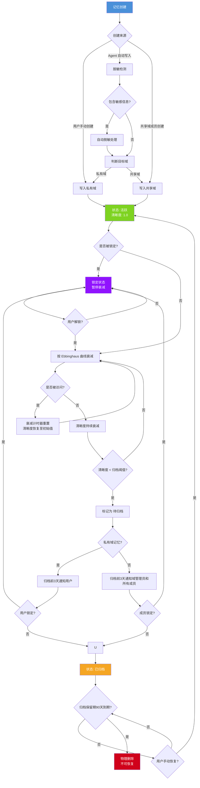

### 5.2 私有域访问控制流程

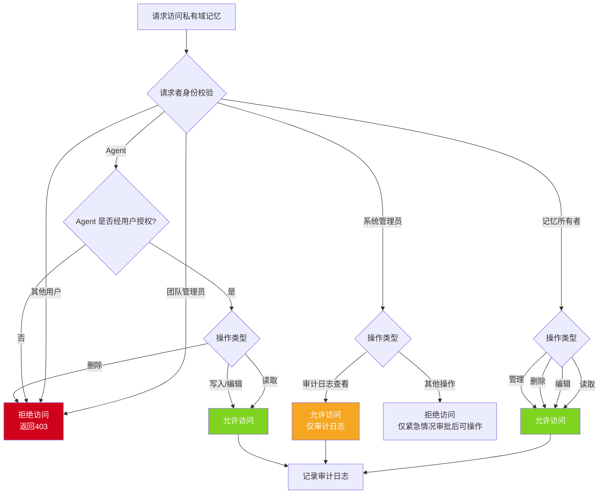

### 5.3 共享域成员管理流程

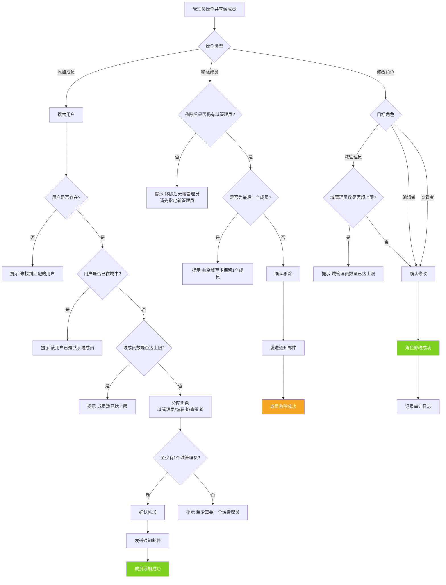

### 5.4 冲突记忆解决流程

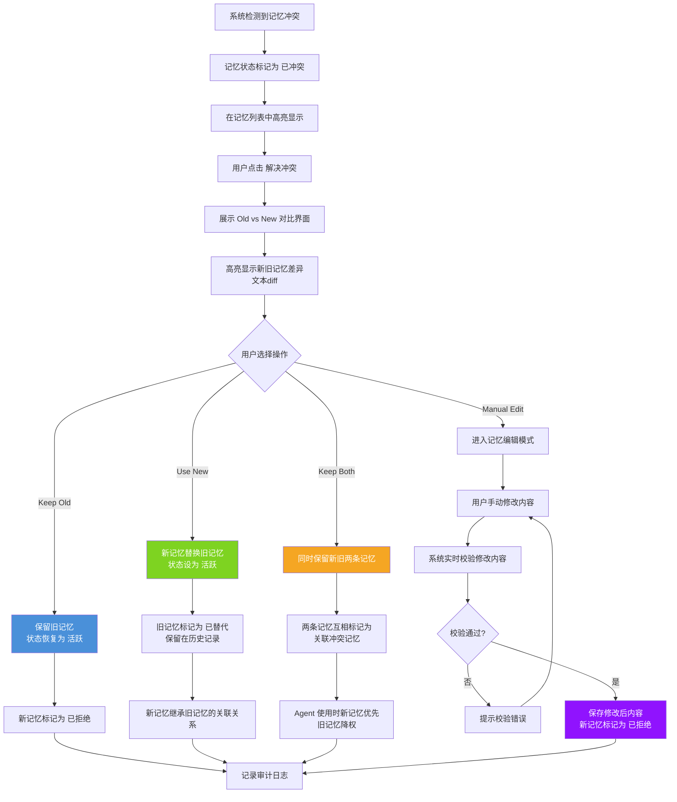

**冲突解决闭环机制**：

1. **自动解决策略**：当新旧记忆语义相似度>0.95且新记忆更完整（字段数更多或时间更新鲜）时，系统自动覆盖旧记忆，旧记忆标记为"已替代"并保留在历史记录中，审计日志记录自动解决过程。

2. **人工确认UI**：当自动解决条件不满足时，复用AG-UI INTERRUPT机制（详见PRD-03 §5.10），向用户推送冲突对比卡片，展示新旧记忆的diff对比，用户可选择Keep Old / Use New / Keep Both / Manual Edit。

3. **冲突解决后通知**：冲突解决完成后，系统通知关联Agent刷新记忆缓存，确保Agent后续查询使用最新记忆数据，避免使用已失效的旧记忆。

4. **通知失败补偿机制**：若冲突解决后通知Agent刷新缓存失败，系统按以下补偿策略处理：
   - **重试**：5分钟内自动重试3次（间隔分别为1分钟、2分钟、2分钟）；
   - **缓存TTL强制过期**：若3次重试均失败，系统将该Agent对应的记忆缓存TTL强制设置为较短值（默认5分钟），确保缓存自然过期后重新加载最新数据；
   - **标记"缓存可能过期"**：在Agent的运行时上下文中标记该Agent的缓存状态为"缓存可能过期"，后续该Agent参与编排调用时，编排层在调度前向用户提示"该Agent记忆缓存可能过期，查询结果可能非最新"，直至缓存成功刷新后自动清除标记。

### 5.5 跨域知识共享流程

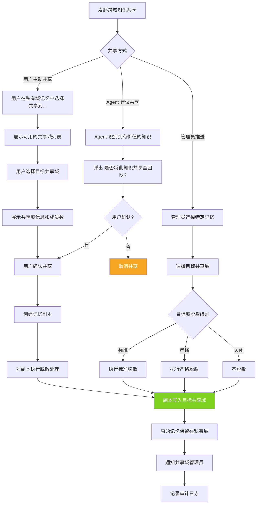

### 5.6 反思合并策略执行流程

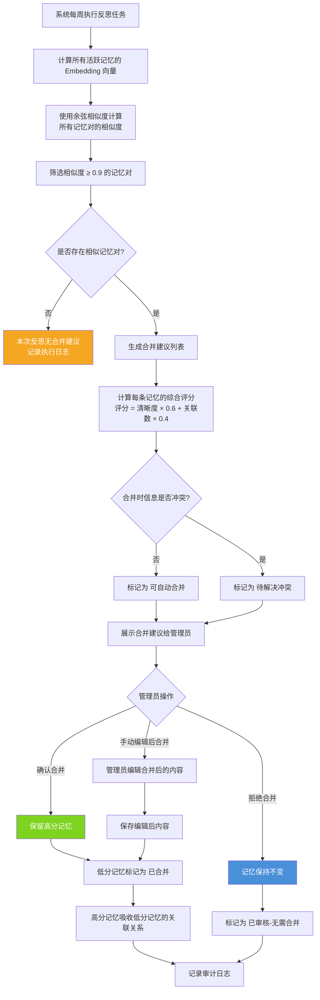

---

## 6. 核心状态图

### 6.1 记忆状态转换

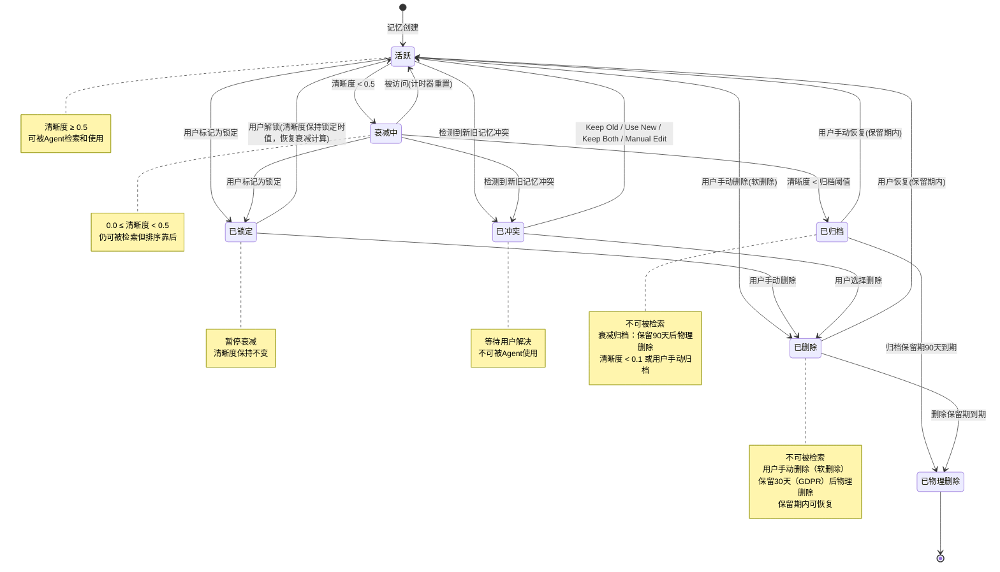

**"已删除"状态完整生命周期**：

| 阶段 | 触发条件 | 数据状态 | 可恢复性 |
|------|----------|----------|----------|
| 软删除 | 用户主动删除 | 标记 `status=deleted`，`deleted_at` 记录时间戳，数据物理保留 | 可恢复（管理员操作） |
| 回收期 | 软删除后 30 天内 | 数据仍物理存在，对用户不可见 | 可恢复（管理员操作） |
| 永久删除 | 软删除超过 30 天或管理员强制删除 | 物理删除数据库记录，同时删除向量嵌入 | 不可恢复 |

**约束规则**：
- 软删除的记忆不参与检索、召回和衰减计算
- 软删除记忆的关联关系（如与 Agent 的绑定）自动解绑，但保留关联记录标记为 `cascade_deleted`
- 回收期内恢复记忆时，自动恢复关联关系（`cascade_deleted` 标记清除）
- 永久删除触发 Outbox 事件 `memory.permanently_deleted`，下游模块（PRD-06 智能体）消费后清理引用

### 6.2 记忆清晰度衰减模型（基于艾宾浩斯遗忘曲线）

> **本节状态机示例数值以 §7.7.1 衰减公式 R(t)=e^(-t/S) 计算为准（半衰期 S=30 天）。**

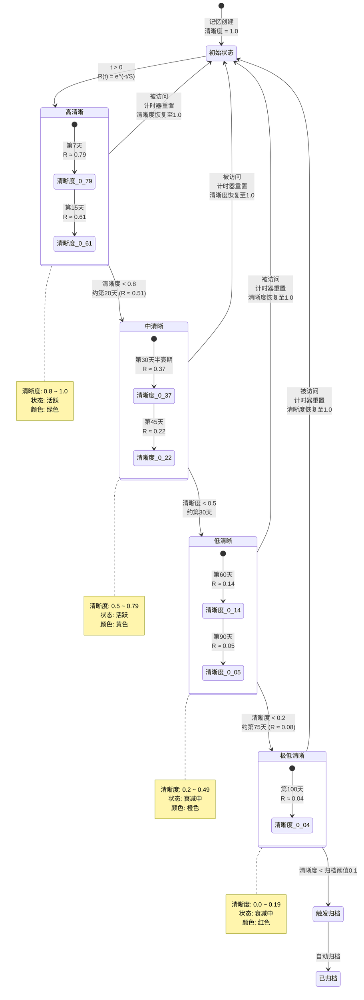

---

## 7. 功能详情

### 7.1 记忆列表

#### 7.1.1 列表展示

**用户故事**：作为系统用户，我希望查看我的所有记忆条目列表，以便了解系统记住了哪些关于我的信息，并管理这些记忆。

> **INVEST 分析**：Independent（独立于其他功能）、Negotiable（列表字段可协商）、Valuable（用户可了解和管理记忆）、Estimatable（工作量可估算）、Small（单次迭代可完成）、Testable（可通过检查列表数据验证）

**前置条件**：
- 用户已登录
- 用户具有记忆查看权限

**后置条件**：
- 记忆列表正确展示
- 用户可对记忆进行操作

**列表字段定义**：

| 字段名 | 类型 | 宽度 | 说明 |
|--------|------|------|------|
| User | string | 120px | 记忆所属用户（管理员可查看所有用户，普通用户仅看到自己） |
| Memory | string | 自适应 | 记忆内容摘要（超过 100 字符截断，点击查看完整内容） |
| Type | enum | 100px | 记忆类型：偏好/事实/事件/技能/关系/上下文 |
| Graphs | integer | 80px | 关联的知识图谱数量 |
| Clarity | number | 80px | 记忆清晰度（0.0-1.0），反映记忆的明确程度 |
| Status | enum | 100px | 状态：活跃/衰减中/已归档/已冲突 |
| 操作 | — | 150px | 查看/编辑/删除 |

**记忆类型说明**：

| 类型 | 图标 | 颜色 | 说明 | 示例 | 记忆分类 |
|------|------|------|------|------|----------|
| 偏好（Preference） | Heart | 粉色 | 用户的个人偏好 | "用户喜欢简洁的回复风格" | 语义记忆（Semantics） |
| 事实（Fact） | Info | 蓝色 | 关于用户的事实信息 | "用户是一名 Python 工程师" | 语义记忆（Semantics） |
| 事件（Event） | Clock | 橙色 | 用户经历的事件 | "用户上周参加了技术峰会" | 场景记忆（Scenario） |
| 技能（Skill） | Zap | 绿色 | 用户的技能信息 | "用户擅长机器学习和 NLP" | 语义记忆（Semantics） |
| 关系（Relation） | Link | 紫色 | 用户与其他实体/人的关系 | "用户是 XX 团队的成员" | 语义记忆（Semantics） |
| 上下文（Context） | File | 灰色 | 交互上下文摘要 | "用户正在开发一个推荐系统项目" | 场景记忆（Scenario） |

**清晰度（Clarity）说明**：

| 范围 | 等级 | 颜色 | 说明 |
|------|------|------|------|
| 0.8-1.0 | 高清晰 | 绿色 | 记忆内容明确、具体、可操作 |
| 0.5-0.79 | 中清晰 | 黄色 | 记忆内容有一定模糊性 |
| 0.2-0.49 | 低清晰 | 橙色 | 记忆内容较模糊，可能需要确认 |
| 0.0-0.19 | 极低清晰 | 红色 | 记忆内容非常模糊，建议删除或更新 |

**主流程**：

| 步骤 | 操作 | 系统响应 |
|------|------|----------|
| 1 | 用户进入记忆管理页面 | 系统加载记忆列表，默认按更新时间降序 |
| 2 | 用户浏览记忆列表 | 系统展示所有记忆条目及其属性 |
| 3 | 用户点击某条记忆的"查看" | 展开记忆详情面板，显示完整内容、来源、关联图谱等 |
| 4 | 用户点击某条记忆的"编辑" | 进入记忆编辑模式，可修改记忆内容和类型 |
| 5 | 用户点击某条记忆的"删除" | 弹出确认对话框，确认后标记为"已删除"（软删除） |

**分支流程**：

| 分支 | 触发条件 | 处理逻辑 |
|------|----------|----------|
| B1 | 用户筛选记忆类型 | 列表仅展示该类型的记忆 |
| B2 | 用户筛选记忆状态 | 列表仅展示该状态的记忆 |
| B3 | 用户搜索记忆内容 | 列表展示包含关键词的记忆（模糊匹配） |
| B4 | 记忆状态为"已冲突" | 该行高亮显示冲突标识，提供"解决冲突"操作入口 |

**异常流程**：

| 异常 | 触发条件 | 处理逻辑 |
|------|----------|----------|
| E1 | 数据加载失败 | 显示错误提示和"重试"按钮 |
| E2 | 删除记忆时该记忆被 Agent 引用 | 提示"该记忆被 N 个 Agent 引用，删除后可能影响个性化服务" |

**交互说明**：
- 记忆内容超过 100 字符时截断，末尾显示"..."
- 悬停截断的记忆内容时，Tooltip 展示完整内容
- 清晰度以进度条形式展示，颜色随数值变化
- 状态为"已冲突"的记忆行背景色为浅红色
- 支持批量选择和批量操作（批量归档、批量修改类型）

**验收标准**：

| 编号 | 验收标准 | 验证方法 |
|------|----------|----------|
| AC-01-01 | 记忆列表在 500ms（P95）/ 1s（P99）内完成加载，正确展示所有字段 | 使用性能测试工具验证列表加载时间和数据完整性 |
| AC-01-02 | 6 种记忆类型图标和颜色与定义完全一致 | 逐类型检查视觉表现，截图对比设计稿 |
| AC-01-03 | 清晰度进度条在 4 个等级范围内颜色正确切换 | 分别输入 0.9/0.6/0.3/0.1 验证颜色 |
| AC-01-04 | 搜索功能在 ≤ 500ms 内返回匹配结果，结果包含关键词的记忆 | 输入关键词验证搜索结果和响应时间 |
| AC-01-05 | 查看详情正确展示完整内容、来源、关联图谱等全部信息 | 点击查看验证详情面板字段完整性 |
| AC-01-06 | 删除操作弹出二次确认对话框，确认后记忆状态变为"已删除"（软删除） | 点击删除验证确认对话框和状态变更 |
| AC-01-07 | 已冲突记忆行背景色为浅红色（#FFF0F0）并显示冲突标识 | 查看冲突状态的记忆行样式 |

---

### 7.2 私有域

#### 7.2.1 自动绑定用户 ID

**用户故事**：作为系统用户，我希望我的个人记忆自动绑定到我的用户 ID，以便系统自动识别记忆的归属，无需手动管理。

> **INVEST 分析**：Independent（独立功能）、Negotiable（绑定字段可扩展）、Valuable（自动归属避免手动管理）、Estimatable（工作量明确）、Small（单次迭代可完成）、Testable（可验证绑定关系）

**业务规则**：
- 每条私有域记忆在创建时自动绑定当前用户的 ID
- 绑定关系不可更改（用户 ID 一旦绑定不可转移）
- 用户 ID 存储在记忆记录的 `owner_user_id` 字段
- 系统通过 `owner_user_id` 实现记忆的自动归属查询

**验收标准**：

| 编号 | 验收标准 | 验证方法 |
|------|----------|----------|
| AC-02-01 | 新创建的记忆在 100ms 内自动绑定当前用户 ID 至 `owner_user_id` 字段 | 创建记忆后检查 `owner_user_id` 字段值 |
| AC-02-02 | 绑定关系不可更改，任何修改 `owner_user_id` 的请求均返回 403 | 尝试通过 API 修改记忆的 `owner_user_id` |

---

#### 7.2.2 仅用户可访问

**用户故事**：作为系统用户，我希望我的私有域记忆仅我自己可以访问，以便保护我的个人隐私信息不被他人查看。

> **INVEST 分析**：Independent（独立于其他域的访问控制）、Negotiable（访问粒度可协商）、Valuable（隐私保护核心价值）、Estimatable（基于 RBAC 模型可估算）、Small（单次迭代可完成）、Testable（可通过角色切换验证）

**访问控制规则**：

| 角色 | 读取 | 编辑 | 删除 | 管理 |
|------|------|------|------|------|
| 记忆所有者（用户本人） | 是 | 是 | 是 | 是 |
| 团队管理员 | 否 | 否 | 否 | 否 |
| 系统管理员 | 仅审计日志 | 否 | 否 | 仅紧急情况 |
| 其他用户 | 否 | 否 | 否 | 否 |
| Agent（用户授权） | 是 | 是（系统自动） | 否 | 否 |

**验收标准**：

| 编号 | 验收标准 | 验证方法 |
|------|----------|----------|
| AC-03-01 | 用户本人可查看自己的私有域记忆，响应时间 ≤ 200ms | 用户登录后查看记忆列表并计时 |
| AC-03-02 | 其他用户访问他人私有域记忆时返回 403 Forbidden | 使用另一个用户账户尝试访问 |
| AC-03-03 | 团队管理员无法查看成员的私有域记忆，返回 403 | 使用管理员账户尝试查看 |
| AC-03-04 | Agent 在用户授权后可读写记忆，未授权时返回 403 | Agent 授权/未授权两种场景验证 |

---

#### 7.2.3 禁止跨域传输

**用户故事**：作为系统用户，我希望我的私有域记忆不会被传输到共享域或公共域，以便确保我的个人记忆不会被意外共享。

> **INVEST 分析**：Independent（独立于共享域逻辑）、Negotiable（传输规则可细化）、Valuable（防止隐私泄露）、Estimatable（基于拦截规则可估算）、Small（单次迭代可完成）、Testable（可验证各方向传输拦截）

**跨域传输规则**：

| 传输方向 | 是否允许 | 说明 |
|----------|----------|------|
| 私有域 → 私有域（本人） | 允许 | 同一用户的私有域内移动 |
| 私有域 → 共享域 | 禁止直接移动 | 需用户显式操作（复制而非移动） |
| 私有域 → 公共域 | 禁止 | 严格禁止 |
| 共享域 → 私有域 | 允许 | 共享域记忆可复制到个人私有域 |
| 共享域 → 公共域 | 禁止 | 需管理员审批 |
| 公共域 → 私有域 | 允许 | 公共域记忆可复制到个人私有域 |
| 公共域 → 共享域 | 允许 | 公共域记忆可复制到共享域 |

**跨域传输详细规则表**：

| 源域 → 目标域 | 操作 | 说明 |
|---------------|------|------|
| 私有 → 私有 | 禁止 | 不同私有域之间不可传输 |
| 私有 → 共享 | 复制（非移动） | 创建副本，原始保留在私有域，副本脱敏后写入共享域 |
| 私有 → 公共 | 申请发布 | 用户提交发布申请，管理员审批 |
| 共享 → 共享 | 复制 | 跨共享域复制（需目标域成员权限） |
| 共享 → 私有 | 复制 | 从共享域复制到私有域 |
| 共享 → 公共 | 申请发布 | 管理员审批 |
| 公共 → 私有 | 复制 | 从公共域复制到私有域 |
| 公共 → 共享 | 复制 | 从公共域复制到共享域 |

> **铁律**：所有跨域操作均为**复制**而非**移动**。原始记忆始终保留在源域，目标域获得副本。

**系统实现**：
- 每条记忆记录包含 `domain` 字段（private/shared/public）
- 跨域传输操作在 API 层进行拦截和校验
- 任何跨域操作记录审计日志

**验收标准**：

| 编号 | 验收标准 | 验证方法 |
|------|----------|----------|
| AC-04-01 | 私有域记忆无法直接移动到共享域，返回 403 并记录审计日志 | 尝试将私有域记忆移动到共享域 |
| AC-04-02 | 私有域记忆无法直接移动到公共域，返回 403 并记录审计日志 | 尝试将私有域记忆移动到公共域 |
| AC-04-03 | 跨域操作被拦截时在 500ms 内记录审计日志（含操作人、源域、目标域、拦截原因） | 检查审计日志记录 |

---

#### 7.2.4 自动隐私脱敏

**用户故事**：作为系统用户，我希望系统自动识别我记忆中的敏感信息并进行脱敏处理，以便即使记忆被意外泄露，敏感信息也不会暴露。

> **INVEST 分析**：Independent（独立于脱敏规则配置）、Negotiable（脱敏策略可配置）、Valuable（隐私保护关键能力）、Estimatable（基于规则引擎可估算）、Small（单次迭代可完成）、Testable（可验证各类型脱敏结果）

**脱敏规则**（详见 7.9 节）：
- 手机号：中间 4 位替换为 `****`（如 138****5678）
- 身份证号：保留前 3 位和后 4 位（如 110\*\*\*\*\*\*\*\*\*\*\*1234）
- 银行卡号：保留后 4 位（如 \*\*\*\* \*\*\*\* \*\*\*\* 5678）
- 邮箱地址：用户名部分部分替换（如 z\*\*\*@example.com）
- 姓名：全名替换为"\*\*\*"
- 地址：详细地址部分替换为"\*\*"

**自动脱敏时机**：
- 记忆写入时：自动检测并脱敏敏感信息
- 记忆展示时：二次校验，确保展示内容已脱敏
- 记忆导出时：强制脱敏

**验收标准**：

| 编号 | 验收标准 | 验证方法 |
|------|----------|----------|
| AC-05-01 | 包含手机号的记忆在写入时 100% 自动脱敏，脱敏后格式为前3后4中间4星号 | 创建包含手机号 13812345678 的记忆验证 |
| AC-05-02 | 包含身份证号的记忆在写入时 100% 自动脱敏 | 创建包含身份证号的记忆验证 |
| AC-05-03 | 脱敏后的记忆在列表和详情中均正确展示脱敏结果 | 检查列表和详情页展示内容 |
| AC-05-04 | 脱敏处理在记忆写入的同步流程中完成，延迟 ≤ 50ms | 测量写入含敏感信息记忆的额外耗时 |

---

#### 7.2.5 权限操作矩阵

**用户故事**：作为系统管理员，我希望通过权限操作矩阵清晰定义不同角色在不同域上的操作权限，以便实现精细化的访问控制。

> **INVEST 分析**：Independent（独立于具体权限实现）、Negotiable（权限粒度可调整）、Valuable（权限管理核心工具）、Estimatable（基于 RBAC 模型可估算）、Small（单次迭代可完成）、Testable（可通过角色操作验证）

**完整权限矩阵**：

| 操作 | 私有域（本人） | 私有域（他人） | 共享域（域管理员） | 共享域（编辑者） | 共享域（查看者） | 共享域（非成员） | 公共域（所有用户） | 公共域（系统管理员） |
|------|:---:|:---:|:---:|:---:|:---:|:---:|:---:|:---:|
| 查看列表 | ✅ | ❌ | ✅ | ✅ | ✅ | ❌ | ✅ | ✅ |
| 查看详情 | ✅ | ❌ | ✅ | ✅ | ✅ | ❌ | ✅ | ✅ |
| 创建记忆 | ✅ | ❌ | ✅ | ✅ | ❌ | ❌ | ❌ | ✅ |
| 编辑记忆 | ✅ | ❌ | ✅ | 仅本人创建 | ❌ | ❌ | ❌ | ✅ |
| 删除记忆 | ✅ | ❌ | ✅ | ❌ | ❌ | ❌ | ❌ | ✅ |
| 锁定/解锁 | ✅ | ❌ | ✅ | ❌ | ❌ | ❌ | ❌ | ✅ |
| 复制到私有域 | — | ❌ | ✅ | ✅ | ✅ | ❌ | ✅ | ✅ |
| 共享到共享域 | ✅(复制) | ❌ | ✅ | ✅ | ❌ | ❌ | ❌ | ✅ |
| 导出记忆 | ✅ | ❌ | ✅ | ✅ | ✅ | ❌ | ✅ | ✅ |
| 管理成员 | — | ❌ | ✅ | ❌ | ❌ | ❌ | — | ✅ |
| 管理配额 | ❌ | ❌ | ✅ | ❌ | ❌ | ❌ | — | ✅ |
| 查看审计日志 | ❌ | ❌ | ✅ | ❌ | ❌ | ❌ | ❌ | ✅ |
| 修改脱敏级别 | ❌ | ❌ | ✅ | ❌ | ❌ | ❌ | ❌ | ✅ |
| 发布到公共域 | ❌ | ❌ | ❌ | ❌ | ❌ | ❌ | ❌ | ✅ |

> 注：❌ 表示禁止操作，系统返回 403 Forbidden；— 表示该操作在该场景下不适用

**验收标准**：

| 编号 | 验收标准 | 验证方法 |
|------|----------|----------|
| AC-06-01 | 权限矩阵中所有 ❌ 操作均被系统拦截，返回 403 Forbidden | 使用不同角色尝试各操作，验证拦截率 100% |
| AC-06-02 | 共享域编辑者可编辑自己创建的记忆，编辑他人创建的记忆返回 403 | 共享域编辑者分别编辑自己和他人的记忆 |
| AC-06-03 | 共享域查看者仅可查看记忆，任何写操作返回 403 | 使用查看者账户尝试创建/编辑/删除 |
| AC-06-04 | 公共域仅系统管理员可写入，其他用户写操作返回 403 | 使用普通用户尝试在公共域创建记忆 |

---

### 7.3 共享域

#### 7.3.1 绑定 Group ID

**用户故事**：作为团队管理员，我希望共享域记忆绑定到特定的 Group ID，以便实现团队级别的记忆共享和管理。

> **INVEST 分析**：Independent（独立于私有域逻辑）、Negotiable（Group ID 生成方式可协商）、Valuable（团队级记忆共享基础）、Estimatable（基于 ID 绑定机制可估算）、Small（单次迭代可完成）、Testable（可验证绑定关系和关联查询）

**业务规则**：
- 每个共享域绑定一个 Group ID
- Group ID 在创建共享域时自动生成或手动指定
- 共享域内的所有记忆通过 Group ID 关联
- 一个 Group 可包含多个共享域（如"项目A记忆域"、"团队技能域"）

**验收标准**：

| 编号 | 验收标准 | 验证方法 |
|------|----------|----------|
| AC-07-01 | 共享域创建时正确绑定 Group ID，绑定操作在 200ms 内完成 | 创建共享域后检查绑定关系 |
| AC-07-02 | 共享域内记忆通过 Group ID 正确关联，关联查询响应时间 ≤ 200ms | 在共享域创建记忆后检查关联 |

---

#### 7.3.2 外部阻断机制

**用户故事**：作为系统管理员，我希望共享域的记忆数据不会被外部系统或未授权的 Agent 访问，以便保护团队记忆数据的安全。

> **INVEST 分析**：Independent（独立于内部访问控制）、Negotiable（阻断策略可配置）、Valuable（数据安全核心保障）、Estimatable（基于拦截规则可估算）、Small（单次迭代可完成）、Testable（可模拟各类外部访问验证拦截）

**阻断规则**：

| 阻断场景 | 规则 | 处理方式 |
|----------|------|----------|
| 外部 API 调用 | 非本系统 API 请求访问共享域数据 | 返回 403 Forbidden |
| 未授权 Agent | 未加入该共享域的 Agent 尝试读写 | 返回 403 Forbidden |
| 跨租户访问 | 其他商户的 Agent 或用户尝试访问 | 返回 403 Forbidden |
| 数据导出 | 非管理员尝试批量导出共享域数据 | 返回 403 Forbidden |

**验收标准**：

| 编号 | 验收标准 | 验证方法 |
|------|----------|----------|
| AC-08-01 | 外部 API 调用被正确拦截，返回 403 并记录审计日志 | 模拟外部 API 请求 |
| AC-08-02 | 未授权 Agent 访问被正确拦截，返回 403 | 使用未授权 Agent 尝试访问 |
| AC-08-03 | 跨租户访问被正确拦截，返回 403 | 使用其他商户账户尝试访问 |

---

#### 7.3.3 成员配置

**用户故事**：作为团队管理员，我希望管理共享域的成员列表和角色，以便控制谁可以访问和操作共享域的记忆。

> **INVEST 分析**：Independent（独立于共享域创建流程）、Negotiable（角色类型可扩展）、Valuable（团队协作核心能力）、Estimatable（基于 RBAC 模型可估算）、Small（单次迭代可完成）、Testable（可验证各角色权限）

**成员角色定义**：

| 角色 | 权限 | 说明 |
|------|------|------|
| 域管理员（Domain Admin） | 全部权限 | 创建/编辑/删除记忆，管理成员，配置配额 |
| 编辑者（Editor） | 读写权限 | 创建/编辑记忆，查看成员列表 |
| 查看者（Viewer） | 只读权限 | 仅查看记忆列表和详情 |

**成员管理操作**：

| 操作 | 权限要求 | 说明 |
|------|----------|------|
| 添加成员 | 域管理员 | 添加用户到共享域并分配角色 |
| 移除成员 | 域管理员 | 从共享域移除用户 |
| 修改角色 | 域管理员 | 修改成员的角色 |
| 查看成员列表 | 所有成员 | 查看共享域的成员列表 |

**验收标准**：

| 编号 | 验收标准 | 验证方法 |
|------|----------|----------|
| AC-09-01 | 域管理员可添加/移除成员，操作在 500ms 内完成 | 使用域管理员账户操作并计时 |
| AC-09-02 | 编辑者可创建/编辑记忆但管理成员操作返回 403 | 使用编辑者账户尝试管理成员 |
| AC-09-03 | 查看者仅可查看记忆，创建/编辑操作返回 403 | 使用查看者账户尝试编辑 |

---

#### 7.3.4 跨用户知识共享

**用户故事**：作为团队管理员，我希望在共享域内实现跨用户的知识共享，以便团队成员可以共享各自的专业知识和经验。

> **INVEST 分析**：Independent（独立于私有域管理）、Negotiable（共享方式可扩展）、Valuable（团队知识沉淀核心价值）、Estimatable（基于共享流程可估算）、Small（单次迭代可完成）、Testable（可验证共享结果和通知）

**共享机制**：

| 共享方式 | 说明 | 操作 |
|----------|------|------|
| 用户主动共享 | 用户将私有域记忆复制到共享域 | 用户在私有域记忆中选择"共享到..." |
| Agent 建议共享 | Agent 在交互中识别到有价值的知识，建议共享 | Agent 弹出"是否将此知识共享至团队？"提示 |
| 管理员推送 | 管理员将特定记忆推送到共享域 | 管理员在后台操作 |

**共享流程（用户主动共享）**：

| 步骤 | 操作 | 系统响应 |
|------|------|----------|
| 1 | 用户在私有域记忆中选择"共享到..." | 系统展示可用的共享域列表 |
| 2 | 用户选择目标共享域 | 系统展示该共享域的信息和成员数 |
| 3 | 用户确认共享 | 系统创建记忆副本（脱敏后）到目标共享域，原始记忆保留在私有域 |
| 4 | 共享完成 | 系统通知共享域管理员"有新记忆被共享" |

**验收标准**：

| 编号 | 验收标准 | 验证方法 |
|------|----------|----------|
| AC-10-01 | 用户可从私有域共享记忆到共享域，共享操作在 1 秒内完成 | 执行共享操作验证 |
| AC-10-02 | 共享后原始记忆完整保留在私有域，内容无变化 | 共享后检查私有域记忆是否完整 |
| AC-10-03 | 共享的记忆自动脱敏，脱敏规则与目标域的脱敏级别一致 | 共享后检查共享域中的记忆脱敏结果 |
| AC-10-04 | 共享域管理员在 5 秒内收到通知 | 共享后检查通知 |

---

#### 7.3.5 添加成员

**用户故事**：作为团队管理员，我希望向共享域添加新成员，以便新成员可以访问共享域的记忆数据。

> **INVEST 分析**：Independent（独立于移除成员流程）、Negotiable（邀请方式可扩展）、Valuable（团队扩展基础能力）、Estimatable（基于用户搜索和角色分配可估算）、Small（单次迭代可完成）、Testable（可验证新成员访问权限和通知）

**主流程**：

| 步骤 | 操作 | 系统响应 |
|------|------|----------|
| 1 | 管理员在共享域设置页面点击"添加成员" | 弹出成员添加对话框 |
| 2 | 管理员输入用户名或邮箱搜索 | 系统展示匹配的用户列表（仅本商户范围内的用户） |
| 3 | 管理员选择用户并分配角色 | 系统展示角色选择器（域管理员/编辑者/查看者） |
| 4 | 管理员点击"确认添加" | 系统将用户添加到共享域，发送通知邮件 |
| 5 | 新成员登录后 | 在工作空间看到"您已被添加到共享域《XXX》"的通知 |

**分支流程**：

| 分支 | 触发条件 | 处理逻辑 |
|------|----------|----------|
| B1 | 用户已在共享域中 | 显示"该用户已是共享域成员" |
| B2 | 用户不存在 | 显示"未找到匹配的用户" |
| B3 | 共享域成员数已达上限 | 显示"共享域成员数已达上限（最大 50 人），请联系管理员扩容" |

**验收标准**：

| 编号 | 验收标准 | 验证方法 |
|------|----------|----------|
| AC-11-01 | 添加成员后新成员可访问共享域，权限与分配角色一致 | 新成员登录后验证访问权限 |
| AC-11-02 | 添加成员后 30 秒内发送通知邮件 | 检查新成员邮箱 |
| AC-11-03 | 重复添加已有成员时提示"该用户已是共享域成员" | 尝试添加已在域中的成员 |

---

### 7.4 公共域

#### 7.4.1 公共域定义与管理机制

**用户故事**：作为系统管理员，我希望通过公共域管理全局性的通用记忆，以便所有用户和 Agent 都能获取到公共的背景知识和通用信息。

> **INVEST 分析**：Independent（独立于私有域和共享域）、Negotiable（公共域内容范围可协商）、Valuable（全局知识共享）、Estimatable（基于审核流程可估算）、Small（单次迭代可完成）、Testable（可验证公共域访问和写入权限）

**公共域定义**：

公共域（Public Domain）是系统级的全局记忆空间，用于存储对所有用户和 Agent 有价值的通用记忆信息。与私有域和共享域不同，公共域的记忆具有以下特征：

| 特征 | 说明 |
|------|------|
| 全局可见 | 所有已登录用户均可读取公共域记忆 |
| 写入受限 | 仅系统管理员可写入，普通用户可通过"发布申请"流程提交记忆到公共域 —— 与知识管理模块中知识发布的审批机制一致（PRD-01） |
| 不可删除 | 普通用户不可删除公共域记忆，仅系统管理员可操作 |
| 自动脱敏 | 公共域记忆强制执行严格脱敏级别 |
| 不衰减 | 公共域记忆不参与艾宾浩斯衰减，清晰度始终保持 1.0（半衰期视为无限大，不受 §7.7.2 配置约束） |

**公共域记忆类型**：

| 类型 | 说明 | 示例 |
|------|------|------|
| 行业知识 | 通用行业背景知识 | "Python 3.12 于 2023 年 10 月发布" |
| 通用偏好 | 适用于所有用户的默认偏好 | "默认使用简洁的回复风格" |
| 系统公告 | 系统级别的通知和公告 | "系统将于本周六进行维护" |
| 最佳实践 | 推荐的使用方式和最佳实践 | "建议为每个项目创建独立的共享域" |

**公共域管理操作**：

| 操作 | 权限要求 | 说明 |
|------|----------|------|
| 查看公共域记忆 | 所有已登录用户 | 读取公共域记忆列表和详情 |
| 创建公共域记忆 | 系统管理员 | 直接创建公共域记忆 |
| 发布申请 | 所有已登录用户 | 提交记忆发布申请，经审批后发布到公共域 |
| 编辑公共域记忆 | 系统管理员 | 修改公共域记忆内容 |
| 删除公共域记忆 | 系统管理员 | 删除公共域记忆（软删除） |
| 管理发布申请 | 系统管理员 | 审批或拒绝发布申请 |

**发布申请流程**：

| 步骤 | 操作 | 系统响应 |
|------|------|----------|
| 1 | 用户在私有域或共享域记忆中选择"申请发布到公共域" | 弹出发布申请表单 |
| 2 | 用户填写发布理由和适用范围 | 系统展示表单 |
| 3 | 用户提交申请 | 系统创建发布申请，通知系统管理员 |
| 4 | 系统管理员审核 | 批准/拒绝，拒绝需填写理由 |
| 5 | 审核通过 | 记忆副本（严格脱敏后）发布到公共域 |
| 6 | 审核拒绝 | 通知申请人拒绝理由 |

**验收标准**：

| 编号 | 验收标准 | 验证方法 |
|------|----------|----------|
| AC-PD-01 | 所有已登录用户可读取公共域记忆，响应时间 ≤ 200ms | 使用普通用户账户访问公共域 |
| AC-PD-02 | 普通用户写操作返回 403 Forbidden | 使用普通用户尝试创建公共域记忆 |
| AC-PD-03 | 发布申请提交后系统管理员在 5 秒内收到通知 | 提交申请后检查通知 |
| AC-PD-04 | 公共域记忆强制执行严格脱敏，脱敏覆盖率 100% | 创建含敏感信息的公共域记忆验证 |
| AC-PD-05 | 公共域记忆清晰度始终保持 1.0，不参与衰减 | 创建公共域记忆后观察清晰度变化 |

---

### 7.5 创建共享域

#### 7.5.1 基本信息

**用户故事**：作为团队管理员，我希望创建一个新的共享域，以便为特定团队或项目建立专属的记忆共享空间。

> **INVEST 分析**：Independent（独立于共享域管理）、Negotiable（字段可扩展）、Valuable（团队协作基础能力）、Estimatable（基于表单流程可估算）、Small（单次迭代可完成）、Testable（可验证创建结果和校验规则）

**基本信息字段**：

| 字段 | 类型 | 必填 | 说明 |
|------|------|------|------|
| 域名称 | string | 是 | 共享域名称（2-50 字符，商户范围内唯一） |
| 域描述 | string | 否 | 共享域描述（最多 500 字符） |
| 域类型 | enum | 是 | 项目域/团队域/部门域/自定义域 |
| 关联 Group | select | 否 | 关联的已有 Group（可选） |
| 配额上限 | integer | 否 | 记忆条数上限（默认使用系统默认值 50,000 条） |
| 存储上限 | integer | 否 | 存储空间上限 MB（默认使用系统默认值 2048 MB） |

**验收标准**：

| 编号 | 验收标准 | 验证方法 |
|------|----------|----------|
| AC-12-01 | 共享域创建成功且所有字段正确保存，创建操作在 1 秒内完成 | 创建后检查数据 |
| AC-12-02 | 域名称唯一性校验生效，重复名称返回 409 Conflict | 创建同名共享域验证 |

---

#### 7.5.2 初始化组成员

**用户故事**：作为团队管理员，我希望在创建共享域时直接初始化成员列表，以便快速完成共享域的搭建。

> **INVEST 分析**：Independent（独立于后续成员管理）、Negotiable（初始化成员数可协商）、Valuable（快速搭建团队空间）、Estimatable（基于成员搜索和角色分配可估算）、Small（单次迭代可完成）、Testable（可验证成员初始化结果）

**主流程**：

| 步骤 | 操作 | 系统响应 |
|------|------|----------|
| 1 | 用户在创建共享域流程中进入"成员初始化"步骤 | 系统展示成员添加界面 |
| 2 | 用户搜索并添加成员 | 系统展示搜索结果，用户选择并分配角色 |
| 3 | 用户点击"下一步" | 系统校验至少有 1 个域管理员 |
| 4 | 系统创建共享域并初始化成员 | 共享域创建完成，成员收到通知 |

**验收标准**：

| 编号 | 验收标准 | 验证方法 |
|------|----------|----------|
| AC-13-01 | 创建时至少需要 1 个域管理员，否则提示"至少需要一个域管理员" | 不添加域管理员尝试创建 |
| AC-13-02 | 初始化成员正确添加到共享域，角色分配与选择一致 | 创建后检查成员列表和角色 |

---

#### 7.5.3 访问权限与安全配置

**用户故事**：作为团队管理员，我希望在创建共享域时配置安全策略，以便控制共享域的访问权限和数据安全级别。

> **INVEST 分析**：Independent（独立于共享域基本信息）、Negotiable（安全配置项可扩展）、Valuable（数据安全保障）、Estimatable（基于配置项可估算）、Small（单次迭代可完成）、Testable（可验证安全配置生效）

**安全配置项**：

| 配置项 | 说明 | 默认值 | 可选值 |
|--------|------|--------|--------|
| 成员邀请方式 | 新成员加入方式 | 管理员邀请 | 管理员邀请/链接邀请/申请审批 |
| 记忆可见性 | 成员是否可看到其他成员的共享记忆 | 全部可见 | 全部可见/仅自己共享的/管理员控制 |
| 导出权限 | 谁可以导出共享域记忆 | 仅管理员 | 仅管理员/编辑者及以上/全部成员 |
| 脱敏级别 | 共享域记忆的脱敏级别 | 标准 | 标准/严格/关闭 |
| 水印策略 | 是否在展示的记忆内容中添加水印 | 关闭 | 关闭/用户名水印/时间水印 |
| 审计日志 | 是否记录共享域的所有操作 | 开启 | 开启/关闭 |

**验收标准**：

| 编号 | 验收标准 | 验证方法 |
|------|----------|----------|
| AC-14-01 | 安全配置正确保存并即时生效 | 创建后检查配置 |
| AC-14-02 | 脱敏级别"严格"比"标准"脱敏更多字段（如地址、姓名），"关闭"不脱敏 | 设置不同脱敏级别验证 |

---

### 7.6 权限域治理

#### 7.6.1 域统计

**用户故事**：作为系统管理员，我希望查看私有域、共享域和公共域的整体统计信息，以便了解记忆数据的使用情况和分布。

> **INVEST 分析**：Independent（独立于配额管理）、Negotiable（统计维度可扩展）、Valuable（运营决策数据支撑）、Estimatable（基于聚合查询可估算）、Small（单次迭代可完成）、Testable（可对比原始数据验证统计准确性）

**统计维度**：

| 统计项 | 私有域 | 共享域 | 公共域 |
|--------|--------|--------|--------|
| 域数量 | 用户数 | 共享域数 | 1（系统级） |
| 记忆总条数 | 累计 | 累计 | 累计 |
| 活跃记忆数 | 状态为"活跃"的 | 状态为"活跃"的 | 状态为"活跃"的 |
| 已归档记忆数 | 状态为"已归档"的 | 状态为"已归档"的 | 状态为"已归档"的 |
| 冲突记忆数 | 状态为"已冲突"的 | 状态为"已冲突"的 | 状态为"已冲突"的 |
| 存储使用量 | MB | MB | MB |
| 配额使用率 | % | % | % |
| 本月新增 | 条 | 条 | 条 |
| 本月归档 | 条 | 条 | 条 |

**验收标准**：

| 编号 | 验收标准 | 验证方法 |
|------|----------|----------|
| AC-15-01 | 各域统计数据准确，与数据库原始数据偏差 ≤ 0.1% | 对比数据库原始数据 |
| AC-15-02 | 配额使用率计算正确：使用率 = 已用 / 上限 × 100%，精度到小数点后 2 位 | 手动计算验证 |
| AC-15-03 | 统计数据刷新延迟 ≤ 5 分钟 | 修改数据后等待并检查统计更新 |

---

#### 7.6.2 配额预警与拦截

**用户故事**：作为系统管理员，我希望在记忆配额接近上限时自动预警，达到上限时自动拦截，以便防止资源滥用和存储溢出。

> **INVEST 分析**：Independent（独立于配额调整）、Negotiable（预警阈值可配置）、Valuable（资源管控核心能力）、Estimatable（基于阈值检测可估算）、Small（单次迭代可完成）、Testable（可模拟各阈值场景验证）

**配额策略**：

| 配额类型 | 默认值 | 说明 |
|----------|--------|------|
| 私有域记忆条数上限 | 10,000 条/用户 | 单个用户的私有域最大记忆条数 |
| 私有域存储上限 | 500 MB/用户 | 单个用户的私有域最大存储空间 |
| 共享域记忆条数上限 | 50,000 条/域 | 单个共享域的最大记忆条数 |
| 共享域存储上限 | 2 GB/域 | 单个共享域的最大存储空间 |
| 共享域成员数上限 | 50 人/域 | 单个共享域的最大成员数 |

**预警规则**：

| 阈值 | 级别 | 处理方式 |
|------|------|----------|
| 使用率 ≥ 70% | 警告（Warning） | 黄色提示横幅，邮件通知管理员 |
| 使用率 ≥ 90% | 严重（Critical） | 橙色提示横幅，邮件+站内信通知管理员 |
| 使用率 = 100% | 满载（Full） | 红色提示横幅，拦截新的记忆创建操作 |

**拦截行为**：

| 操作 | 满载时的行为 |
|------|-------------|
| 创建新记忆 | 拒绝，提示"配额已满，请清理或联系管理员扩容" |
| Agent 自动写入记忆 | 拒绝，Agent 回退至不记忆模式 |
| 编辑已有记忆 | 允许（不增加配额消耗） |
| 删除记忆 | 允许，释放配额 |

**验收标准**：

| 编号 | 验收标准 | 验证方法 |
|------|----------|----------|
| AC-16-01 | 使用率 ≥ 70% 时在 30 秒内触发黄色预警横幅和邮件通知 | 模拟配额使用率验证 |
| AC-16-02 | 使用率 = 100% 时拦截新记忆创建，返回 HTTP 200 + 业务错误码 052429（配额超限） | 模拟满载后尝试创建记忆 |
| AC-16-03 | 满载时编辑已有记忆不受影响，响应时间 ≤ 200ms | 满载时编辑已有记忆 |
| AC-16-04 | 删除记忆后配额即时释放（≤ 1 秒），使用率正确更新 | 删除后检查配额使用率 |

---

#### 7.6.3 用户配额管理

**用户故事**：作为系统管理员，我希望为不同用户配置不同的记忆配额，以便根据用户等级和需求灵活分配资源。

> **INVEST 分析**：Independent（独立于配额预警）、Negotiable（配额参数可调整）、Valuable（精细化资源管控）、Estimatable（基于配额调整流程可估算）、Small（单次迭代可完成）、Testable（可验证配额调整生效）

**管理操作**：

| 操作 | 说明 |
|------|------|
| 查看用户配额 | 查看指定用户的当前配额使用情况 |
| 调整配额上限 | 修改用户的记忆条数上限和存储上限 |
| 重置配额 | 将用户配额重置为系统默认值 |
| 临时扩容 | 为用户临时增加配额（设置过期时间） |

**验收标准**：

| 编号 | 验收标准 | 验证方法 |
|------|----------|----------|
| AC-17-01 | 管理员可调整用户配额上限，调整后即时生效（≤ 1 秒） | 修改配额后验证生效 |
| AC-17-02 | 临时扩容到期后自动恢复原配额，精度到分钟 | 设置 1 小时扩容，到期后验证恢复 |

---

### 7.7 生命周期策略

#### 7.7.1 衰减率配置（Ebbinghaus 曲线）

**用户故事**：作为系统管理员，我希望基于艾宾浩斯遗忘曲线配置记忆的衰减率，以便让不常使用的记忆自然弱化，保持记忆库的高效性。

> **INVEST 分析**：Independent（独立于归档和合并策略）、Negotiable（衰减参数可配置）、Valuable（记忆库质量保障）、Estimatable（基于定时任务可估算）、Small（单次迭代可完成）、Testable（可验证衰减计算结果）

**艾宾浩斯遗忘曲线模型**：

```
记忆保留率 R(t) = e^(-t/S)

其中：
- R(t) = 时间 t 后的记忆保留率（0-1）
- t = 距离上次访问的时间
- S = 记忆半衰期（Memory Half-Life）
```

> **清晰度（Clarity Score）= 保留率 R(t)**。两者为同一概念的不同表述。所有 UI 显示使用"清晰度"，所有算法计算使用"保留率"。

**衰减率参数**：

| 参数 | 默认值 | 可配置范围 | 说明 |
|------|--------|------------|------|
| 初始清晰度 | 1.0 | 0.5-1.0 | 记忆创建时的初始清晰度 |
| 半衰期（S） | 30 天 | 7-365 天 | 记忆清晰度衰减到 50% 所需的时间 |
| 最小清晰度阈值 | 0.1 | 0.0-0.3 | 低于此阈值的记忆自动归档 |
| 衰减刷新 | 访问后重置 | — | 每次记忆被访问后，衰减计时器重置 |
| 衰减暂停 | 手动锁定 | — | 用户可标记重要记忆为"锁定"，暂停衰减 |

**衰减效果示例**（半衰期 = 30 天）：

| 时间 | 保留率 | 清晰度 | 状态 |
|------|--------|--------|------|
| 0 天 | 100% | 1.0 | 活跃 |
| 7 天 | 79% | 0.79 | 活跃 |
| 15 天 | 61% | 0.61 | 活跃 |
| 30 天 | 37% | 0.37 | 衰减中 |
| 60 天 | 14% | 0.14 | 衰减中 |
| 90 天 | 5% | 0.05 | 衰减中（接近归档阈值） |
| 100 天 | 4% | 0.04 | 触发归档 |

**主流程**：

| 步骤 | 操作 | 系统响应 |
|------|------|----------|
| 1 | 系统定时任务（每小时）扫描所有记忆 | 计算每条记忆的当前清晰度 |
| 2 | 更新记忆清晰度 | R(t) = 初始清晰度 × e^(-t/S) |
| 3 | 检查归档阈值 | 清晰度 < 最小清晰度阈值的记忆标记为"待归档" |
| 4 | 执行归档 | "待归档"记忆转移至归档存储，状态更新为"已归档" |

**分支流程**：

| 分支 | 触发条件 | 处理逻辑 |
|------|----------|----------|
| B1 | 记忆被访问（Agent 查询或用户查看） | 衰减计时器重置，清晰度恢复至初始值 |
| B2 | 记忆被标记为"锁定" | 暂停衰减，清晰度保持不变 |
| B3 | 记忆被"解锁" | 恢复衰减，从暂停时刻继续计算 |

**验收标准**：

| 编号 | 验收标准 | 验证方法 |
|------|----------|----------|
| AC-18-01 | 记忆清晰度按艾宾浩斯曲线正确衰减，计算误差 ≤ 0.01 | 创建记忆后定期检查清晰度变化 |
| AC-18-02 | 半衰期配置正确影响衰减速度，修改后半衰期在 1 小时内生效 | 修改半衰期后验证衰减速度变化 |
| AC-18-03 | 记忆被访问后衰减计时器重置，清晰度恢复至初始值 | 访问记忆后检查清晰度是否恢复 |
| AC-18-04 | 锁定的记忆不衰减，清晰度保持不变 | 锁定记忆后检查清晰度是否保持不变 |
| AC-18-05 | 清晰度低于阈值后自动归档，归档操作在 5 秒内完成 | 等待或模拟记忆清晰度降至阈值以下 |

---

#### 7.7.2 Memory Half-Life 设置

**用户故事**：作为系统管理员，我希望为不同类型的记忆设置不同的半衰期，以便重要记忆保留更久，临时记忆快速衰减。

> **INVEST 分析**：Independent（独立于衰减率配置）、Negotiable（半衰期参数可调整）、Valuable（差异化记忆管理）、Estimatable（基于配置项可估算）、Small（单次迭代可完成）、Testable（可验证不同类型衰减速度差异）

**默认半衰期配置**：

| 记忆类型 | 默认半衰期 | 推荐范围 | 说明 | 记忆分类 |
|----------|------------|----------|------|----------|
| 偏好（Preference） | 60 天 | 30-180 天 | 用户偏好相对稳定，半衰期较长 | 语义记忆（Semantics） |
| 事实（Fact） | 90 天 | 30-365 天 | 事实信息可能长期有效 | 语义记忆（Semantics） |
| 事件（Event） | 14 天 | 7-30 天 | 事件记忆时效性短 | 场景记忆（Scenario） |
| 技能（Skill） | 90 天 | 30-365 天 | 技能信息相对稳定 | 语义记忆（Semantics） |
| 关系（Relation） | 60 天 | 30-180 天 | 关系信息中等稳定 | 语义记忆（Semantics） |
| 上下文（Context） | 7 天 | 3-14 天 | 上下文信息时效性最短 | 场景记忆（Scenario） |

> **类型半衰期优先于全局半衰期**。如果记忆条目指定了 `memory_type`，使用该类型的半衰期；否则使用全局默认值 30 天。

**验收标准**：

| 编号 | 验收标准 | 验证方法 |
|------|----------|----------|
| AC-19-01 | 不同类型的记忆使用不同的半衰期，衰减速度差异在 24 小时内可观测 | 创建不同类型的记忆，观察衰减速度差异 |
| AC-19-02 | 管理员可修改半衰期配置，修改后即时生效 | 修改后验证生效 |

---

#### 7.7.3 归档阈值

**用户故事**：作为系统管理员，我希望配置记忆的归档阈值，以便自动清理低价值的记忆，释放存储空间。

> **INVEST 分析**：Independent（独立于衰减率配置）、Negotiable（归档参数可调整）、Valuable（存储空间优化）、Estimatable（基于阈值检测可估算）、Small（单次迭代可完成）、Testable（可验证归档触发和恢复）

**归档策略**：

| 策略项 | 默认值 | 说明 |
|--------|--------|------|
| 清晰度归档阈值 | 0.1 | 清晰度低于此值的记忆自动归档 |
| 归档保留期限 | 90 天 | 归档后的记忆保留 90 天，之后物理删除 |
| GDPR 删除保留期 | 30 天 | 用户手动删除（软删除）后保留 30 天，满足 GDPR 第 17 条"被遗忘权"，之后物理删除 |
| 归档前通知 | 是 | 归档前 3 天通知用户（私有域记忆） |
| 手动恢复 | 是 | 归档后的记忆可在保留期内手动恢复 |

**归档流程**：

| 步骤 | 操作 | 系统响应 |
|------|------|----------|
| 1 | 系统检测到记忆清晰度 < 归档阈值 | 标记记忆为"待归档" |
| 2 | 归档前 3 天（私有域记忆） | 发送通知"以下记忆即将被归档：..." |
| 3 | 用户可在此期间"锁定"记忆 | 锁定后取消归档 |
| 4 | 归档执行 | 记忆转移至归档存储，状态更新为"已归档" |
| 5 | 归档保留期到期 | 记忆物理删除（不可恢复） |

**验收标准**：

| 编号 | 验收标准 | 验证方法 |
|------|----------|----------|
| AC-20-01 | 清晰度低于阈值后自动归档，归档操作在 5 秒内完成 | 模拟清晰度降至阈值以下 |
| AC-20-02 | 归档前 3 天发送通知，通知到达延迟 ≤ 30 秒 | 检查通知 |
| AC-20-03 | 用户可在归档前锁定记忆取消归档，锁定后清晰度不再衰减 | 在归档前锁定记忆验证 |
| AC-20-04 | 归档保留期到期后物理删除，删除后不可通过 API 恢复 | 模拟保留期到期 |

---

#### 7.7.4 反思合并策略

**用户故事**：作为系统管理员，我希望系统定期对相似的记忆进行反思和合并，以便减少冗余记忆，提升记忆库的质量和效率。

> **INVEST 分析**：Independent（独立于衰减和归档策略）、Negotiable（合并阈值可配置）、Valuable（记忆库质量优化）、Estimatable（基于相似度计算可估算）、Small（单次迭代可完成）、Testable（可验证合并结果）

**反思合并规则**：

| 规则 | 说明 |
|------|------|
| 相似度检测 | 定期（每周）计算记忆间的语义相似度（使用 Embedding 余弦相似度） |
| 合并阈值 | 相似度 ≥ 0.9 的记忆对自动触发合并建议 |
| 合并策略 | 保留信息量更大的记忆（按清晰度 + 关联数综合评分），另一条标记为"已合并" |
| 冲突处理 | 合并时如果信息冲突，标记为"待解决冲突" |
| 人工审核 | 合并操作生成审核任务，管理员确认后执行 |

**主流程**：

| 步骤 | 操作 | 系统响应 |
|------|------|----------|
| 1 | 系统每周执行反思任务 | 计算所有活跃记忆的 Embedding 向量 |
| 2 | 计算记忆间相似度 | 使用余弦相似度计算所有记忆对的相似度 |
| 3 | 筛选相似度 ≥ 0.9 的记忆对 | 生成合并建议列表 |
| 4 | 展示合并建议给管理员 | 管理员在后台查看"反思合并建议"列表 |
| 5 | 管理员确认合并 | 系统执行合并，保留高分记忆，低分记忆标记为"已合并" |
| 6 | 管理员拒绝合并 | 记忆保持不变，标记为"已审核-无需合并" |

**验收标准**：

| 编号 | 验收标准 | 验证方法 |
|------|----------|----------|
| AC-21-01 | 反思任务每周自动执行，执行记录可在审计日志中查询 | 检查定时任务执行记录 |
| AC-21-02 | 相似度 ≥ 0.9 的记忆对正确识别，识别准确率 ≥ 90% | 创建相似记忆验证 |
| AC-21-03 | 合并操作正确保留高分记忆，低分记忆标记为"已合并" | 执行合并后检查结果 |
| AC-21-04 | 冲突记忆正确标记为"待解决"，状态为"已冲突" | 合并冲突记忆验证 |

---

### 7.8 冲突记忆解决

#### 7.8.1 Old vs New Memory 对比

**用户故事**：作为系统用户，我希望在记忆产生冲突时，通过直观的对比界面查看新旧记忆的差异，以便做出正确的决策。

> **INVEST 分析**：Independent（独立于冲突解决操作）、Negotiable（对比展示方式可优化）、Valuable（冲突解决决策支撑）、Estimatable（基于 diff 算法可估算）、Small（单次迭代可完成）、Testable（可验证差异高亮准确性）

**冲突触发场景**：

| 场景 | 说明 | 示例 |
|------|------|------|
| 用户信息变更 | 用户更新了个人信息，与旧记忆冲突 | 旧："用户使用 Java"，新："用户已转向 Python" |
| 偏好变化 | 用户改变了偏好 | 旧："用户喜欢简洁回复"，新："用户希望回复更详细" |
| 事实更新 | 事实信息发生了变化 | 旧："用户在 A 公司工作"，新："用户已跳槽到 B 公司" |
| Agent 推断冲突 | Agent 推断的记忆与已有记忆矛盾 | 旧："用户是前端工程师"，Agent 推断："用户是全栈工程师" |

**对比界面设计**：

| 区域 | 内容 |
|------|------|
| 左侧（Old Memory） | 旧记忆内容、创建时间、来源、清晰度 |
| 右侧（New Memory） | 新记忆内容、创建时间、来源、清晰度 |
| 中间（差异高亮） | 高亮显示新旧记忆的具体差异（文本 diff） |
| 底部（操作按钮） | Keep Old / Use New / Keep Both / Manual Edit |

**主流程**：

| 步骤 | 操作 | 系统响应 |
|------|------|----------|
| 1 | 系统检测到记忆冲突 | 在记忆列表中标记冲突记忆，状态为"已冲突" |
| 2 | 用户点击"解决冲突" | 展示 Old vs New 对比界面 |
| 3 | 用户查看差异 | 系统高亮显示新旧记忆的具体差异 |
| 4 | 用户选择操作 | 见 7.8.2 和 7.8.3 |

**验收标准**：

| 编号 | 验收标准 | 验证方法 |
|------|----------|----------|
| AC-22-01 | 冲突记忆在列表中正确标识，行背景色为浅红色（#FFF0F0） | 检查冲突记忆的视觉标识 |
| AC-22-02 | 对比界面正确展示新旧记忆差异，diff 高亮覆盖率 100% | 创建冲突后查看对比界面 |
| AC-22-03 | 差异高亮准确，无遗漏或错误高亮 | 检查 diff 高亮的准确性 |

---

#### 7.8.2 Keep 操作

**用户故事**：作为系统用户，我希望在解决冲突时选择保留旧记忆，以便在确认新信息不准确时维持原有记忆。

> **INVEST 分析**：Independent（独立于 Use 操作）、Negotiable（保留策略可细化）、Valuable（维护记忆准确性）、Estimatable（基于状态变更可估算）、Small（单次迭代可完成）、Testable（可验证保留后状态）

**Keep Old 操作**：

| 步骤 | 操作 | 系统响应 |
|------|------|----------|
| 1 | 用户点击"Keep Old" | 系统保留旧记忆，状态恢复为"活跃" |
| 2 | 新记忆处理 | 新记忆标记为"已拒绝" |
| 3 | 冲突解决记录 | 审计日志记录：用户选择保留旧记忆，拒绝新记忆 |

**Keep Both 操作**：

| 步骤 | 操作 | 系统响应 |
|------|------|----------|
| 1 | 用户点击"Keep Both" | 系统同时保留新旧两条记忆 |
| 2 | 关联标记 | 两条记忆互相标记为"关联冲突记忆" |
| 3 | Agent 行为 | Agent 在使用时优先使用新记忆，旧记忆降权 |

**验收标准**：

| 编号 | 验收标准 | 验证方法 |
|------|----------|----------|
| AC-23-01 | Keep Old 后旧记忆恢复活跃，状态为"活跃"，清晰度保持不变 | 执行 Keep Old 后检查状态 |
| AC-23-02 | Keep Old 后新记忆标记为"已拒绝"，不出现在活跃记忆列表中 | 执行 Keep Old 后检查新记忆状态 |
| AC-23-03 | Keep Both 后两条记忆均保留，互相标记为"关联冲突记忆" | 执行 Keep Both 后检查两条记忆状态 |

---

#### 7.8.3 Use 操作

**用户故事**：作为系统用户，我希望在解决冲突时选择使用新记忆，以便在确认新信息更准确时更新记忆。

> **INVEST 分析**：Independent（独立于 Keep 操作）、Negotiable（替换策略可细化）、Valuable（保持记忆时效性）、Estimatable（基于状态变更可估算）、Small（单次迭代可完成）、Testable（可验证替换后状态和关联关系）

**Use New 操作**：

| 步骤 | 操作 | 系统响应 |
|------|------|----------|
| 1 | 用户点击"Use New" | 系统使用新记忆替换旧记忆 |
| 2 | 旧记忆处理 | 旧记忆标记为"已替代"，保留在历史记录中 |
| 3 | 新记忆处理 | 新记忆状态设为"活跃"，继承旧记忆的关联关系 |
| 4 | 冲突解决记录 | 审计日志记录：用户选择使用新记忆，替代旧记忆 |

**Manual Edit 操作**：

| 步骤 | 操作 | 系统响应 |
|------|------|----------|
| 1 | 用户点击"Manual Edit" | 进入记忆编辑模式，展示旧记忆内容 |
| 2 | 用户手动修改内容 | 系统实时校验修改后的内容 |
| 3 | 用户保存 | 系统用修改后的内容替换旧记忆，新记忆标记为"已拒绝" |

**验收标准**：

| 编号 | 验收标准 | 验证方法 |
|------|----------|----------|
| AC-24-01 | Use New 后新记忆替换旧记忆，新记忆状态为"活跃" | 执行 Use New 后检查记忆状态 |
| AC-24-02 | Use New 后旧记忆保留在历史记录中，状态为"已替代" | 检查历史记录 |
| AC-24-03 | Use New 后新记忆继承旧记忆的关联关系，关联数不变 | 检查关联关系 |
| AC-24-04 | Manual Edit 后修改内容正确保存，新记忆标记为"已拒绝" | 手动编辑后检查内容 |

---

### 7.9 隐私脱敏规则

#### 7.9.1 数据类型定义

**用户故事**：作为系统管理员，我希望定义需要脱敏的敏感数据类型，以便系统自动识别和处理各类敏感信息。

> **INVEST 分析**：Independent（独立于脱敏规则配置）、Negotiable（数据类型可扩展）、Valuable（脱敏基础能力）、Estimatable（基于正则和 NER 可估算）、Small（单次迭代可完成）、Testable（可验证各类型识别准确性）

**敏感数据类型**：

| 数据类型 | 正则表达式模式 | 风险等级 | 说明 |
|----------|----------------|----------|------|
| 手机号（中国大陆） | `1[3-9]\d{9}` | 高 | 11 位手机号码 |
| 身份证号（中国大陆） | `[1-9]\d{5}(18\|19\|20)\d{2}(0[1-9]\|1[0-2])(0[1-9]\|[12]\d\|3[01])\d{3}[\dXx]` | 极高 | 18 位身份证号码 |
| 银行卡号 | `\d{16,19}` | 极高 | 16-19 位银行卡号 |
| 邮箱地址 | `[a-zA-Z0-9._%+-]+@[a-zA-Z0-9.-]+\.[a-zA-Z]{2,}` | 中 | 电子邮箱地址 |
| 姓名 | `（基于 NLP 命名实体识别）` | 中 | 中文/英文姓名 |
| 家庭地址 | `（基于 NLP 地址识别模型）` | 中 | 详细地址信息 |
| IP 地址 | `\d{1,3}\.\d{1,3}\.\d{1,3}\.\d{1,3}` | 低 | IPv4 地址 |
| 日期（出生日期） | `（基于上下文识别）` | 中 | 与身份证关联的出生日期 |

**验收标准**：

| 编号 | 验收标准 | 验证方法 |
|------|----------|----------|
| AC-25-01 | 手机号正则识别准确率 ≥ 99%，覆盖 13x-19x 号段 | 输入 100 个不同格式手机号验证 |
| AC-25-02 | 身份证号正则识别准确率 ≥ 99%，有效/无效号码均正确判断 | 输入 100 个有效和无效身份证号验证 |
| AC-25-03 | NLP 模型识别姓名和地址的 F1 值 ≥ 85% | 输入包含姓名和地址的文本验证 |

---

#### 7.9.2 脱敏规则配置

**用户故事**：作为系统管理员，我希望配置各数据类型的脱敏规则，以便根据不同的安全要求灵活控制脱敏策略。

> **INVEST 分析**：Independent（独立于数据类型定义）、Negotiable（脱敏方式可扩展）、Valuable（灵活脱敏策略）、Estimatable（基于规则引擎可估算）、Small（单次迭代可完成）、Testable（可验证脱敏结果）

**脱敏策略**：

| 数据类型 | 脱敏方式 | 脱敏后示例 | 可配置 |
|----------|----------|------------|--------|
| 手机号 | 中间 4 位替换为 `****` | 138****5678 | 是（保留前 N 位/后 M 位） |
| 身份证号 | 保留前 3 位和后 4 位 | 110\*\*\*\*\*\*\*\*\*\*\*1234 | 是 |
| 银行卡号 | 仅保留后 4 位 | \*\*\*\* \*\*\*\* \*\*\*\* 5678 | 是 |
| 邮箱地址 | 用户名部分保留首字符和末字符 | z\*\*\*n@example.com | 是 |
| 姓名 | 全部替换为 `***` | *** | 是（可配置为保留姓/名） |
| 家庭地址 | 详细地址替换为 `**` | 北京市朝阳区** | 是 |
| IP 地址 | 最后一段替换为 `*` | 192.168.1.* | 是 |

**配置界面**：
- 列表展示所有数据类型及其当前脱敏规则
- 每种数据类型可独立配置脱敏方式和保留规则
- 支持启用/禁用某种数据类型的脱敏
- 支持添加自定义数据类型和正则表达式

**验收标准**：

| 编号 | 验收标准 | 验证方法 |
|------|----------|----------|
| AC-26-01 | 各数据类型脱敏结果与配置一致，脱敏覆盖率 100% | 输入各类型敏感信息验证脱敏结果 |
| AC-26-02 | 脱敏规则修改后即时生效（≤ 1 秒） | 修改规则后验证新结果 |
| AC-26-03 | 禁用某种数据类型的脱敏后该类型不再脱敏 | 禁用后验证 |

---

#### 7.9.3 脱敏模板

**用户故事**：作为系统管理员，我希望使用预定义的脱敏模板快速配置脱敏规则，以便减少重复配置工作，确保脱敏策略的一致性。

> **INVEST 分析**：Independent（独立于规则配置）、Negotiable（模板内容可扩展）、Valuable（配置效率提升）、Estimatable（基于模板应用流程可估算）、Small（单次迭代可完成）、Testable（可验证模板应用结果）

**预定义模板**：

| 模板名称 | 适用场景 | 包含的脱敏规则 | 脱敏级别 |
|----------|----------|----------------|----------|
| 基础模板 | 一般业务场景 | 手机号、邮箱 | 标准 |
| 金融模板 | 金融行业 | 手机号、身份证、银行卡、姓名 | 严格 |
| 医疗模板 | 医疗行业 | 手机号、身份证、姓名、地址 | 严格 |
| 教育模板 | 教育行业 | 手机号、邮箱、姓名 | 标准 |
| 最低模板 | 仅合规要求 | 身份证号 | 最低 |
| 自定义模板 | 用户自定义 | 用户选择 | 用户定义 |

**模板应用流程**：

| 步骤 | 操作 | 系统响应 |
|------|------|----------|
| 1 | 用户进入脱敏规则配置页面 | 系统展示当前配置和可用模板 |
| 2 | 用户选择一个预定义模板 | 系统展示模板包含的脱敏规则预览 |
| 3 | 用户点击"应用模板" | 系统将模板规则应用到当前配置 |
| 4 | 用户可在此基础上微调 | 修改个别规则后保存 |

**验收标准**：

| 编号 | 验收标准 | 验证方法 |
|------|----------|----------|
| AC-27-01 | 预定义模板正确应用，所有包含的脱敏规则均生效 | 选择模板后检查配置变化 |
| AC-27-02 | 应用模板后可微调个别规则，微调后即时生效 | 应用模板后修改某条规则验证 |
| AC-27-03 | 自定义模板可保存和复用，保存后出现在模板列表中 | 创建自定义模板后再次使用 |

---

#### 7.9.4 审计日志

**用户故事**：作为系统管理员，我希望记录所有记忆相关的敏感操作审计日志，以便满足安全合规要求，并在发生安全事件时进行追溯。

> **INVEST 分析**：Independent（独立于业务操作）、Negotiable（日志字段可扩展）、Valuable（安全合规核心需求）、Estimatable（基于日志记录机制可估算）、Small（单次迭代可完成）、Testable（可验证日志完整性和不可篡改性）

**审计日志记录的操作**：

| 操作类型 | 记录内容 | 日志级别 |
|----------|----------|----------|
| 记忆创建 | 操作人、记忆内容摘要、记忆类型、域 | INFO |
| 记忆编辑 | 操作人、修改前内容、修改后内容、变更字段 | INFO |
| 记忆删除 | 操作人、被删除记忆内容摘要、删除原因 | WARN |
| 记忆归档 | 记忆 ID、归档原因、清晰度值 | INFO |
| 冲突解决 | 操作人、旧记忆、新记忆、选择的操作（Keep/Use） | INFO |
| 跨域操作 | 操作人、源域、目标域、操作类型、是否被拦截 | WARN |
| 隐私脱敏 | 记忆 ID、检测到的敏感信息类型、脱敏结果 | INFO |
| 配额变更 | 操作人、目标用户/域、变更前配额、变更后配额 | WARN |
| 共享域成员变更 | 操作人、目标用户、操作类型（添加/移除/角色变更） | INFO |
| 强制访问 | 操作人、目标记忆、访问原因（紧急情况需审批） | ERROR |

**审计日志字段**：

| 字段 | 说明 |
|------|------|
| 日志 ID | 唯一标识 |
| 时间戳 | 操作发生时间（毫秒级精度） |
| 操作人 | 操作者的用户 ID 和用户名 |
| 操作类型 | 操作的分类 |
| 操作详情 | JSON 格式的操作详情 |
| IP 地址 | 操作来源 IP |
| User-Agent | 操作来源浏览器/客户端信息 |
| 结果 | 成功/失败 |
| 影响范围 | 受影响的记忆/域/用户 |

**日志保留策略**：
- 审计日志保留 180 天
- 180 天后自动归档至冷存储（保留 3 年）
- 3 年后物理删除
- 日志不可修改、不可删除（仅系统管理员在紧急情况下可操作）

**验收标准**：

| 编号 | 验收标准 | 验证方法 |
|------|----------|----------|
| AC-28-01 | 所有敏感操作均记录审计日志，覆盖率 100% | 执行各操作后检查日志 |
| AC-28-02 | 审计日志内容完整，包含所有定义字段 | 检查日志字段完整性 |
| AC-28-03 | 审计日志不可修改，任何修改请求返回 403 | 尝试修改已有日志 |
| AC-28-04 | 日志支持按时间、操作人、操作类型查询，查询响应时间 ≤ 1 秒 | 使用筛选条件查询 |
| AC-28-05 | 日志保留 180 天后自动归档至冷存储 | 模拟超时验证 |

---

### 7.10 记忆与 Agent 交互机制

#### 7.10.1 Agent 记忆读写机制

**用户故事**：作为 Agent，我希望在执行任务时能够读取用户的记忆数据，以便提供个性化的交互服务。

> **INVEST 分析**：Independent（独立于记忆管理界面）、Negotiable（读写权限可配置）、Valuable（Agent 个性化交互基础）、Estimatable（基于 API 调用可估算）、Small（单次迭代可完成）、Testable（可验证 Agent 读写结果）

**Agent 记忆读取机制**：

| 场景 | 读取范围 | 读取方式 | 说明 |
|------|----------|----------|------|
| 对话开始 | 用户私有域 + 所属共享域 + 公共域 | 自动加载 | Agent 在对话开始时自动加载用户相关记忆 |
| 任务执行中 | 按需查询 | 语义检索 | Agent 根据任务需要查询特定记忆 |
| 记忆推荐 | 用户私有域 | 主动推送 | 当检测到用户输入与已有记忆相关时，Agent 主动引用记忆（类似 RAG 检索增强生成机制） |

**Agent 记忆写入机制**：

| 场景 | 写入条件 | 写入目标域 | 说明 |
|------|----------|------------|------|
| 用户偏好提取 | 对话中识别到用户偏好 | 用户私有域 | Agent 自动提取并写入偏好记忆 |
| 事实信息记录 | 对话中获取到用户事实信息 | 用户私有域 | Agent 自动记录事实性信息 |
| 上下文摘要 | 对话结束时 | 用户私有域 | Agent 自动生成对话摘要并写入上下文记忆 |
| 共享知识建议 | 识别到团队通用知识 | 提示用户确认后写入共享域 | Agent 建议共享，用户确认后写入 |

**Agent 记忆读写权限控制**：

| 操作 | 私有域 | 共享域（成员） | 共享域（非成员） | 公共域 |
|------|--------|----------------|------------------|--------|
| 读取 | 需用户授权 | 需域成员身份 | 禁止 | 允许 |
| 写入 | 需用户授权 | 需域成员身份+编辑权限 | 禁止 | 禁止 |
| 删除 | 禁止 | 禁止 | 禁止 | 禁止 |

**验收标准**：

| 编号 | 验收标准 | 验证方法 |
|------|----------|----------|
| AC-29-01 | Agent 在对话开始时自动加载用户相关记忆，加载时间 ≤ 500ms | Agent 对话开始后检查记忆加载 |
| AC-29-02 | Agent 自动提取用户偏好并写入私有域，写入前执行脱敏检测 | 对话中表达偏好后检查记忆列表 |
| AC-29-03 | Agent 未经授权时无法读写私有域记忆，返回 403 | 未授权 Agent 尝试读写 |
| AC-29-04 | Agent 记忆命中率 ≥ 70%（即 Agent 查询记忆时 70% 以上能命中有效记忆） | 统计 Agent 记忆查询日志 |

---

#### 7.10.2 记忆对 Agent 行为的影响

**用户故事**：作为系统用户，我希望 Agent 能够根据我的记忆数据调整交互方式，以便获得更个性化的服务体验。

> **INVEST 分析**：Independent（独立于 Agent 记忆读写）、Negotiable（影响方式可配置）、Valuable（个性化体验核心价值）、Estimatable（基于记忆权重计算可估算）、Small（单次迭代可完成）、Testable（可验证 Agent 行为差异）

**记忆对 Agent 行为的影响机制**：

| 记忆类型 | 对 Agent 行为的影响 | 优先级 | 示例 |
|----------|---------------------|--------|------|
| 偏好记忆 | 调整回复风格、语言、详细程度 | 高 | "用户喜欢简洁回复" → Agent 使用简洁风格 |
| 事实记忆 | 提供个性化建议和推荐 | 高 | "用户是 Python 工程师" → Agent 优先推荐 Python 方案 |
| 事件记忆 | 避免重复询问已知信息 | 中 | "用户上周参加了峰会" → Agent 不再询问是否参加 |
| 技能记忆 | 调整解释深度和技术用语 | 中 | "用户擅长 NLP" → Agent 使用专业术语 |
| 关系记忆 | 了解用户组织背景 | 中 | "用户是 XX 团队成员" → Agent 了解团队上下文 |
| 上下文记忆 | 保持对话连贯性 | 高 | "用户正在开发推荐系统" → Agent 保持上下文理解 |

**记忆权重计算**：

```
记忆权重 W = 清晰度 × 类型权重 × 时效性系数

其中：
- 清晰度：当前记忆的清晰度值（0.0-1.0）
- 类型权重：偏好=1.0, 事实=0.9, 上下文=0.8, 技能=0.7, 关系=0.6, 事件=0.5
- 时效性系数：1.0（7天内）/ 0.8（30天内）/ 0.5（90天内）/ 0.2（90天以上）
```

Agent 在生成回复时，将相关记忆作为上下文注入 Prompt，按权重排序，受 Token 限制截断（RAG 检索增强生成的通用实现方式）

**验收标准**：

| 编号 | 验收标准 | 验证方法 |
|------|----------|----------|
| AC-30-01 | Agent 根据偏好记忆调整回复风格，风格一致性 ≥ 80% | 设置偏好后多次对话验证风格 |
| AC-30-02 | Agent 根据事实记忆提供个性化建议，建议相关性 ≥ 70% | 设置事实后验证建议内容 |
| AC-30-03 | 记忆权重计算结果与公式一致，计算误差 ≤ 0.01 | 验证权重计算逻辑 |
| AC-30-04 | 高权重记忆优先影响 Agent 行为，低权重记忆影响较弱 | 对比不同权重记忆对 Agent 行为的影响 |

---

#### 7.10.3 Agent 记忆使用统计

**用户故事**：作为系统管理员，我希望查看 Agent 的记忆使用统计，以便了解记忆数据对 Agent 行为的影响程度和效率。

> **INVEST 分析**：Independent（独立于 Agent 行为影响机制）、Negotiable（统计维度可扩展）、Valuable（运营优化数据支撑）、Estimatable（基于日志聚合可估算）、Small（单次迭代可完成）、Testable（可验证统计数据准确性）

**统计维度**：

| 统计项 | 说明 |
|--------|------|
| 记忆读取次数 | Agent 读取记忆的总次数 |
| 记忆命中率 | Agent 查询记忆时命中有效记忆的比例 |
| 记忆写入次数 | Agent 自动写入记忆的总次数 |
| 各类型记忆使用分布 | 按记忆类型统计使用次数 |
| 记忆对回复的影响率 | Agent 回复中引用记忆信息的比例 |

**验收标准**：

| 编号 | 验收标准 | 验证方法 |
|------|----------|----------|
| AC-31-01 | Agent 记忆使用统计数据准确，与日志数据偏差 ≤ 1% | 对比日志原始数据 |
| AC-31-02 | 统计数据刷新延迟 ≤ 5 分钟 | 修改数据后等待并检查统计更新 |

---

### 7.11 记忆与知识关联

#### 7.11.1 记忆-知识关联映射

**用户故事**：作为系统用户，我希望看到记忆与知识之间的关联关系，以便了解我的个人记忆与系统知识库的联系。

> **INVEST 分析**：Independent（独立于 Agent 交互机制）、Negotiable（关联方式可扩展）、Valuable（知识体系完整性）、Estimatable（基于关联查询可估算）、Small（单次迭代可完成）、Testable（可验证关联关系准确性）

**记忆与知识的区别与联系**：

| 维度 | 记忆（Memory） | 知识（Knowledge） |
|------|----------------|-------------------|
| 来源 | 用户交互中动态产生 | 从文档中提取的静态信息 |
| 时效性 | 有生命周期，会衰减和归档 | 相对稳定，需手动更新 |
| 个性化 | 与特定用户/团队关联 | 全局共享，无个性化 |
| 存储方式 | 按域隔离（私有/共享/公共） | 按知识库组织 |
| 检索方式 | 语义检索 + 清晰度排序 | 图可视化 + 数据网格 |

**关联映射机制**：

| 关联类型 | 说明 | 示例 |
|----------|------|------|
| 主题关联 | 记忆主题与知识实体相关 | 记忆"用户擅长 NLP" ↔ 知识实体"NLP" |
| 来源关联 | 记忆来源于某知识文档 | 记忆"用户参考了 XX 文档" ↔ 知识文档"XX" |
| 补充关联 | 记忆补充了知识的个性化信息 | 记忆"用户偏好 Python 3" ↔ 知识"Python 语言特性" |
| 冲突关联 | 记忆与知识内容矛盾 | 记忆"用户使用 Java" ↔ 知识"用户团队技术栈为 Python" |

**验收标准**：

| 编号 | 验收标准 | 验证方法 |
|------|----------|----------|
| AC-32-01 | 记忆详情页正确展示关联的知识实体和文档，关联查询响应时间 ≤ 500ms | 查看记忆详情验证关联展示 |
| AC-32-02 | 知识详情页正确展示关联的记忆条目 | 查看知识详情验证关联展示 |
| AC-32-03 | 关联关系变更时（如知识更新）关联映射在 5 分钟内更新 | 修改知识后检查关联映射 |

---

#### 7.11.2 知识驱动的记忆增强

**用户故事**：作为 Agent，我希望在读取用户记忆时能够结合知识库信息，以便提供更准确和全面的个性化服务。

> **INVEST 分析**：Independent（独立于关联映射）、Negotiable（增强策略可配置）、Valuable（提升 Agent 服务质量）、Estimatable（基于知识检索可估算）、Small（单次迭代可完成）、Testable（可验证增强效果）

**增强机制**：

| 场景 | 增强方式 | 说明 |
|------|----------|------|
| 记忆模糊时 | 补充知识背景 | 当记忆清晰度较低时，用知识库信息补充上下文 |
| 记忆冲突时 | 提供知识参考 | 当记忆产生冲突时，引用知识库中的权威信息辅助决策 |
| 记忆不足时 | 推荐相关知识 | 当用户记忆不足以回答问题时，推荐知识库中的相关内容 |

知识驱动的记忆增强通过 Agent 的 Prompt 组装实现，将相关知识和记忆按权重排序后注入上下文（RAG 的通用实现方式）

**验收标准**：

| 编号 | 验收标准 | 验证方法 |
|------|----------|----------|
| AC-33-01 | 记忆清晰度 < 0.5 时，Agent 回复中包含知识库补充信息，补充率 ≥ 60% | 使用低清晰度记忆验证 Agent 回复 |
| AC-33-02 | 记忆冲突时，Agent 提供知识参考信息 | 创建冲突记忆验证 Agent 行为 |

---

#### 7.11.3 记忆到知识的转化

**用户故事**：作为团队管理员，我希望将有价值的共享域记忆转化为知识库中的知识条目，以便将团队经验沉淀为可复用的知识资产。

> **INVEST 分析**：Independent（独立于知识增强）、Negotiable（转化流程可配置）、Valuable（知识资产沉淀）、Estimatable（基于转化流程可估算）、Small（单次迭代可完成）、Testable（可验证转化结果）

**转化流程**：

| 步骤 | 操作 | 系统响应 |
|------|------|----------|
| 1 | 管理员在共享域记忆中选择"转化为知识" | 弹出转化确认表单 |
| 2 | 管理员选择目标知识库和知识类型 | 系统展示可用知识库列表 |
| 3 | 管理员确认转化 | 系统将记忆内容提取为知识实体和关系 |
| 4 | 知识入库 | 知识条目创建成功，记忆标记为"已转化为知识" |
| 5 | 关联建立 | 记忆与知识条目建立关联关系 |

**验收标准**：

| 编号 | 验收标准 | 验证方法 |
|------|----------|----------|
| AC-34-01 | 记忆转化为知识后，知识条目内容与记忆一致 | 转化后检查知识条目 |
| AC-34-02 | 转化后记忆标记为"已转化为知识"，与知识条目建立关联 | 检查记忆状态和关联 |
| AC-34-03 | 仅共享域和公共域记忆可转化为知识，私有域记忆转化返回 403 | 尝试转化私有域记忆 |

---

### 7.12 记忆搜索相似度匹配

#### 7.12.1 相似度匹配算法

**用户故事**：作为系统用户，我希望通过语义搜索快速找到相关记忆，以便高效管理和利用记忆数据。

> **INVEST 分析**：Independent（独立于列表筛选功能）、Negotiable（算法参数可配置）、Valuable（提升记忆检索效率）、Estimatable（基于 Embedding 服务可估算）、Small（单次迭代可完成）、Testable（可验证搜索结果相关性）

**搜索方式**：

| 搜索方式 | 算法 | 适用场景 | 精度 | 性能 |
|----------|------|----------|------|------|
| 关键词搜索 | 文本模糊匹配（TF-IDF） | 精确关键词查找 | 中 | 快（≤ 100ms） |
| 语义搜索 | Embedding 余弦相似度 | 语义相关记忆查找 | 高 | 中（≤ 500ms） |
| 混合搜索 | 关键词 + 语义融合 | 综合检索 | 最高 | 中（≤ 800ms） |

**语义搜索流程**：

| 步骤 | 操作 | 系统响应 |
|------|------|----------|
| 1 | 用户输入搜索查询 | 系统将查询文本进行 Embedding 向量化 |
| 2 | 向量检索 | 在目标域的记忆向量库中检索 Top-K 相似记忆 |
| 3 | 相似度计算 | 计算查询向量与记忆向量的余弦相似度 |
| 4 | 结果排序 | 按相似度 × 清晰度综合评分排序 |
| 5 | 返回结果 | 展示匹配的记忆列表，显示相似度分数 |

**相似度匹配参数**：

| 参数 | 默认值 | 可配置范围 | 说明 |
|------|--------|------------|------|
| 最小相似度阈值 | 0.5 | 0.3-0.9 | 低于此阈值的记忆不返回 |
| 返回数量上限 | 20 | 5-100 | 单次搜索返回的最大记忆数 |
| Embedding 模型 | 与知识管理模块共用同一 Embedding 模型（PRD-01 中知识设置包含"向量模型选择"配置） | — | 用于文本向量化的模型 |
| 向量维度 | 1536 | 256/512/768/1024/1536/3072 | Embedding 向量的维度 |

**验收标准**：

| 编号 | 验收标准 | 验证方法 |
|------|----------|----------|
| AC-35-01 | 关键词搜索响应时间 ≤ 100ms，语义搜索响应时间 ≤ 500ms | 使用不同搜索方式验证响应时间 |
| AC-35-02 | 语义搜索结果按相似度排序，Top-5 结果相似度 ≥ 0.7 | 输入查询验证搜索结果排序 |
| AC-35-03 | 最小相似度阈值过滤生效，低于阈值的记忆不出现在结果中 | 修改阈值后验证搜索结果 |
| AC-35-04 | 搜索结果仅包含用户有权限访问的域中的记忆 | 使用不同角色验证搜索结果范围 |

---

### 7.13 脱敏规则与系统设置安全设置的关联

#### 7.13.1 关联关系

**用户故事**：作为安全管理员，我希望记忆管理模块的脱敏规则与系统设置模块的安全设置保持一致和联动，以便实现全局统一的脱敏策略管理。

> **INVEST 分析**：Independent（独立于脱敏规则执行）、Negotiable（联动方式可协商）、Valuable（策略一致性保障）、Estimatable（基于配置同步可估算）、Small（单次迭代可完成）、Testable（可验证联动生效）

**关联关系说明**：

记忆管理模块的脱敏规则与系统设置模块（PRD-09）的安全设置存在以下关联：

| 关联维度 | 系统设置（PRD-09） | 记忆管理（PRD-02） | 关联方式 |
|----------|---------------------|---------------------|----------|
| 数据类型定义 | 安全设置 > 数据类型管理 | 隐私脱敏规则 > 数据类型定义 | 记忆管理引用系统设置中定义的数据类型，不重复定义（PRD-09 已定义完整的数据类型管理体系） |
| 脱敏规则 | 安全设置 > 规则管理 | 隐私脱敏规则 > 脱敏规则配置 | 系统设置中创建的脱敏规则全局生效，记忆管理可在此基础上按域覆盖 |
| 脱敏模板 | 安全设置 > 模板管理 | 隐私脱敏规则 > 脱敏模板 | 记忆管理的脱敏模板引用系统设置的模板，并扩展记忆专用模板 |
| 审计日志 | 安全设置 > 审计日志 | 隐私脱敏规则 > 审计日志 | 记忆管理的审计日志独立存储，但格式与系统设置审计日志一致 |

**联动机制**：

| 场景 | 系统设置变更 | 记忆管理响应 |
|------|-------------|-------------|
| 新增数据类型 | 在系统设置中新增自定义数据类型 | 记忆管理的脱敏检测自动支持新数据类型 |
| 修改脱敏规则 | 在系统设置中修改某条脱敏规则 | 记忆管理中引用该规则的域自动更新 |
| 禁用脱敏规则 | 在系统设置中禁用某条脱敏规则 | 记忆管理中该规则不再执行脱敏 |
| 删除数据类型 | 在系统设置中删除某数据类型 | 记忆管理中引用该类型的规则自动失效，提示管理员处理 |

**验收标准**：

| 编号 | 验收标准 | 验证方法 |
|------|----------|----------|
| AC-36-01 | 在系统设置中新增数据类型后，记忆管理的脱敏检测在 5 分钟内支持新类型 | 新增数据类型后验证 |
| AC-36-02 | 在系统设置中修改脱敏规则后，记忆管理中引用该规则的域在 5 分钟内自动更新 | 修改规则后验证 |
| AC-36-03 | 记忆管理审计日志格式与系统设置审计日志格式一致，字段对齐率 100% | 对比两种审计日志格式 |

---

### 7.14 记忆导出

#### 7.14.1 导出格式与流程

**用户故事**：作为系统用户，我希望将我的记忆数据导出为标准格式文件，以便备份或迁移我的记忆数据。

> **INVEST 分析**：Independent（独立于记忆管理界面）、Negotiable（导出格式可扩展）、Valuable（数据自主权保障）、Estimatable（基于文件生成可估算）、Small（单次迭代可完成）、Testable（可验证导出文件完整性和脱敏结果）

**导出格式**：

| 格式 | 文件扩展名 | 说明 | 适用场景 |
|------|------------|------|----------|
| JSON | .json | 结构化数据，包含记忆全部字段 | 数据迁移、程序处理 |
| CSV | .csv | 表格数据，包含记忆主要字段 | 数据分析、Excel 处理 |
| Markdown | .md | 可读性强的文本格式 | 人工阅读、文档归档 |

**JSON 导出格式示例**：

```json
{
  "export_info": {
    "version": "1.0",
    "export_time": "2026-06-08T10:00:00Z",
    "domain": "private",
    "user_id": "user_001",
    "total_count": 156
  },
  "memories": [
    {
      "id": "mem_001",
      "content": "用户是一名 Python 工程师",
      "type": "fact",
      "clarity": 0.85,
      "status": "active",
      "created_at": "2026-06-01T10:00:00Z",
      "updated_at": "2026-06-08T10:00:00Z",
      "tags": ["programming", "python"]
    }
  ]
}
```

**导出流程**：

| 步骤 | 操作 | 系统响应 |
|------|------|----------|
| 1 | 用户在记忆列表点击"导出" | 弹出导出配置对话框 |
| 2 | 用户选择导出范围（全部/当前筛选/选中项） | 系统计算导出数量 |
| 3 | 用户选择导出格式（JSON/CSV/Markdown） | 系统展示格式预览 |
| 4 | 用户确认导出 | 系统执行脱敏处理（强制脱敏） |
| 5 | 生成导出文件 | 文件生成后提供下载链接，链接有效期 24 小时 |
| 6 | 记录审计日志 | 记录导出操作（操作人、范围、格式、是否脱敏） |

**导出约束**：

| 约束项 | 说明 |
|--------|------|
| 单次导出上限 | 10,000 条记忆 |
| 导出文件大小上限 | 100 MB |
| 导出频率限制 | 每用户每天最多 5 次 |
| 脱敏要求 | 导出文件强制执行脱敏，不可关闭 |
| 权限要求 | 仅可导出自己有权限访问的域中的记忆 |

**验收标准**：

| 编号 | 验收标准 | 验证方法 |
|------|----------|----------|
| AC-37-01 | 三种导出格式均正确生成，文件内容与记忆数据一致 | 分别导出三种格式验证 |
| AC-37-02 | 导出文件中敏感信息 100% 脱敏，无遗漏 | 导出含敏感信息的记忆验证 |
| AC-37-03 | 单次导出超过 10,000 条时提示"超出单次导出上限" | 尝试导出超量记忆 |
| AC-37-04 | 导出操作记录审计日志，包含操作人、范围、格式 | 导出后检查审计日志 |
| AC-37-05 | 导出文件下载链接有效期 24 小时，过期后返回 410 Gone | 24 小时后尝试下载 |

---

### 7.15 记忆批量操作

#### 7.15.1 批量操作约束条件

**用户故事**：作为系统用户，我希望对记忆进行批量操作（如批量归档、批量修改类型），以便高效管理大量记忆数据。

> **INVEST 分析**：Independent（独立于单条记忆操作）、Negotiable（批量操作类型可扩展）、Valuable（批量管理效率提升）、Estimatable（基于批量处理可估算）、Small（单次迭代可完成）、Testable（可验证批量操作结果和约束）

**支持的批量操作**：

| 操作 | 说明 | 权限要求 |
|------|------|----------|
| 批量归档 | 将选中的记忆标记为"已归档" | 记忆所有者/域管理员 |
| 批量修改类型 | 修改选中记忆的类型 | 记忆所有者/域管理员 |
| 批量锁定 | 锁定选中的记忆，暂停衰减 | 记忆所有者/域管理员 |
| 批量解锁 | 解锁选中的记忆，恢复衰减 | 记忆所有者/域管理员 |
| 批量删除 | 将选中的记忆标记为"已归档"（软删除） | 记忆所有者/域管理员 |

**批量操作约束条件**：

| 约束项 | 约束值 | 说明 |
|--------|--------|------|
| 单次批量操作上限 | 100 条 | 单次批量操作最多处理 100 条记忆 |
| 操作超时 | 30 秒 | 单次批量操作超过 30 秒自动终止，已处理的记忆不回滚 |
| 冲突记忆 | 不可批量操作 | 状态为"已冲突"的记忆不参与批量操作 |
| 跨域操作 | 禁止 | 批量操作仅限同一域内的记忆 |
| 权限校验 | 逐条校验 | 批量操作中对每条记忆逐条校验权限，无权限的记忆跳过 |

**批量操作流程**：

| 步骤 | 操作 | 系统响应 |
|------|------|----------|
| 1 | 用户在记忆列表选择多条记忆 | 启用批量操作栏 |
| 2 | 用户选择批量操作类型 | 系统校验选中记忆的约束条件 |
| 3 | 系统过滤不可操作的记忆 | 提示"N 条记忆不可操作（原因：冲突/无权限/跨域）" |
| 4 | 用户确认操作 | 弹出二次确认对话框，展示操作影响范围 |
| 5 | 系统执行批量操作 | 展示操作进度条，完成后显示结果统计 |
| 6 | 记录审计日志 | 每条记忆的操作单独记录审计日志 |

**验收标准**：

| 编号 | 验收标准 | 验证方法 |
|------|----------|----------|
| AC-38-01 | 单次批量操作上限 100 条，超过时提示"超出单次操作上限" | 选择超过 100 条记忆尝试批量操作 |
| AC-38-02 | 冲突记忆不参与批量操作，操作前提示跳过数量 | 选择含冲突记忆的列表批量操作 |
| AC-38-03 | 批量操作中无权限的记忆自动跳过，操作完成后提示跳过数量 | 使用非管理员账户批量操作含他人记忆的列表 |
| AC-38-04 | 批量操作完成后每条记忆的操作单独记录审计日志 | 批量操作后检查审计日志 |
| AC-38-05 | 批量操作超时后已处理的记忆不回滚，未处理的不执行 | 模拟大批量操作超时 |

---

## 8. 业务规则

> **BR编号迁移声明**：本节业务规则编号使用旧版子域前缀（如 BR-01~06-*），将按 PRD-09 §41.3 规范渐进迁移为 `BR-02-{3位}` 格式。新增规则须使用新格式，旧规则保留但标注映射关系。

### 8.1 记忆管理规则

| 规则编号 | 规则名称 | 规则描述 |
|----------|----------|----------|
| BR-02-001 | 记忆归属 | 每条记忆必须归属于一个域（私有域/共享域/公共域） |
| BR-02-002 | 私有域绑定 | 私有域记忆自动绑定用户 ID，不可转移 |
| BR-02-003 | 记忆唯一性 | 同一用户同一类型的相同内容记忆不重复创建（相似度 ≥ 0.95 时提示） |
| BR-02-004 | 记忆删除 | 记忆删除采用软删除（标记为已归档），保留 90 天后物理删除 |
| BR-02-005 | 记忆编辑 | 编辑记忆时记录变更历史（版本控制），保留最近 10 个版本 |
| BR-02-006 | 记忆分类 | 记忆分为语义记忆（Semantics）和场景记忆（Scenario），影响半衰期和衰减行为 |

### 8.2 域隔离规则

| 规则编号 | 规则名称 | 规则描述 |
|----------|----------|----------|
| BR-02-007 | 私有域隔离 | 私有域记忆仅记忆所有者可访问，任何跨域传输操作被拦截 |
| BR-02-008 | 共享域隔离 | 共享域记忆仅域成员可访问，非成员访问返回 403 |
| BR-02-009 | 跨域复制 | 允许从低权限域复制到高权限域（公共→共享→私有），反向禁止 |
| BR-02-010 | 外部阻断 | 非本系统的 API 请求访问任何域数据均被拦截 |
| BR-02-011 | 公共域写入 | 公共域仅系统管理员可写入，普通用户通过发布申请流程提交 |

### 8.3 生命周期规则

| 规则编号 | 规则名称 | 规则描述 |
|----------|----------|----------|
| BR-02-012 | 衰减模型 | 记忆清晰度按 R(t) = e^(-t/S) 衰减，S 为半衰期 |
| BR-02-013 | 衰减重置 | 记忆被访问后衰减计时器重置，清晰度恢复至初始值 |
| BR-02-014 | 锁定保护 | 锁定的记忆不参与衰减 |
| BR-02-015 | 归档阈值 | 清晰度低于 0.1 的记忆自动归档 |
| BR-02-016 | 归档保留 | 归档记忆保留 90 天后物理删除 |
| BR-02-017 | 反思合并 | 每周执行一次反思任务，相似度 ≥ 0.9 的记忆对建议合并 |
| BR-02-018 | 公共域不衰减 | 公共域记忆不参与艾宾浩斯衰减，清晰度始终保持 1.0 |

### 8.4 隐私规则

| 规则编号 | 规则名称 | 规则描述 |
|----------|----------|----------|
| BR-02-019 | 自动脱敏 | 记忆写入时自动检测和脱敏敏感信息 |
| BR-02-020 | 脱敏不可逆 | 脱敏操作不可逆，原始敏感信息不保留在脱敏后的记忆中 |
| BR-02-021 | 原始数据保护 | 脱敏前的原始数据仅在处理过程中短暂存在于内存中，不持久化存储 |
| BR-02-022 | 审计覆盖 | 所有涉及敏感信息的操作必须记录审计日志 |
| BR-02-023 | 脱敏二次校验 | 记忆展示时二次校验脱敏结果，确保无遗漏 |
| BR-02-024 | 脱敏规则联动 | 记忆管理脱敏规则与系统设置安全设置联动，系统设置变更加速生效 |

### 8.5 配额规则

| 规则编号 | 规则名称 | 规则描述 |
|----------|----------|----------|
| BR-02-025 | 私有域配额 | 每用户最多 10,000 条记忆，500 MB 存储空间 |
| BR-02-026 | 共享域配额 | 每域最多 50,000 条记忆，2 GB 存储空间，50 名成员 |
| BR-02-027 | 预警触发 | 使用率 ≥ 70% 触发预警，= 100% 拦截新创建 |
| BR-02-028 | 配额释放 | 删除或归档记忆后配额即时释放 |
| BR-02-029 | 临时扩容 | 管理员可设置临时扩容，到期后自动恢复 |

### 8.6 Agent 交互规则

| 规则编号 | 规则名称 | 规则描述 |
|----------|----------|----------|
| BR-02-030 | Agent 授权 | Agent 读写私有域记忆需经用户授权，未授权返回 403 |
| BR-02-031 | Agent 写入脱敏 | Agent 写入记忆时自动执行脱敏检测 |
| BR-02-032 | Agent 记忆权重 | Agent 使用记忆时按权重排序，高权重记忆优先影响行为 |
| BR-02-033 | Agent 降级 | 配额满时 Agent 回退至不记忆模式，不影响基本对话功能 |

---

## 9. 接口需求

### 9.1 API 清单

| 接口编号 | 接口名称 | 类型 | GraphQL | 说明 |
|----------|----------|------|---------|------|
| API-04-01 | 获取记忆列表 | Query | `memoryList` | 获取记忆条目列表（支持筛选和分页） |
| API-04-02 | 获取记忆详情 | Query | `memoryDetail(id: ID!)` | 获取单条记忆的详细信息 |
| API-04-03 | 创建记忆 | Mutation | `createMemory` | 手动创建记忆条目 |
| API-04-04 | 编辑记忆 | Mutation | `updateMemory(id: ID!, input: MemoryInput!)` | 编辑记忆内容或属性 |
| API-04-05 | 删除记忆 | Mutation | `deleteMemory(id: ID!)` | 删除记忆（软删除/归档） |
| API-04-06 | 批量操作记忆 | Mutation | `batchOperateMemory` | 批量删除/修改类型/归档 |
| API-04-07 | 解决冲突 | Mutation | `resolveConflict(id: ID!)` | 解决记忆冲突（Keep/Use/KeepBoth） |
| API-04-08 | 获取冲突列表 | Query | `memoryConflicts` | 获取所有冲突记忆列表 |
| API-04-09 | 锁定/解锁记忆 | Mutation | `toggleMemoryLock(id: ID!)` | 锁定或解锁记忆（暂停/恢复衰减） |
| API-04-10 | 共享记忆到域 | Mutation | `shareMemoryToDomain(id: ID!)` | 将私有域记忆共享到指定共享域 |
| API-04-11 | 获取共享域列表 | Query | `memoryDomainList` | 获取用户可访问的共享域列表 |
| API-04-12 | 创建共享域 | Mutation | `createMemoryDomain` | 创建新的共享域 |
| API-04-13 | 获取共享域详情 | Query | `memoryDomainDetail(id: ID!)` | 获取共享域详细信息 |
| API-04-14 | 编辑共享域 | Mutation | `updateMemoryDomain(id: ID!, input: MemoryDomainInput!)` | 编辑共享域配置 |
| API-04-15 | 删除共享域 | Mutation | `deleteMemoryDomain(id: ID!)` | 删除共享域 |
| API-04-16 | 添加域成员 | Mutation | `addMemoryDomainMember(id: ID!)` | 添加成员到共享域 |
| API-04-17 | 移除域成员 | Mutation | `removeMemoryDomainMember(id: ID!, userId: ID!)` | 从共享域移除成员 |
| API-04-18 | 修改成员角色 | Mutation | `updateMemoryDomainMemberRole(id: ID!, userId: ID!)` | 修改共享域成员角色 |
| API-04-19 | 获取域统计 | Query | `memoryDomainStats` | 获取各域的统计信息 |
| API-04-20 | 获取配额信息 | Query | `memoryQuota` | 获取当前用户的配额使用情况 |
| API-04-21 | 管理用户配额 | Mutation | `manageMemoryQuota(userId: ID!)` | 管理员调整用户配额 |
| API-04-22 | 获取生命周期策略 | Query | `memoryLifecyclePolicy` | 获取生命周期策略配置 |
| API-04-23 | 保存生命周期策略 | Mutation | `saveMemoryLifecyclePolicy` | 保存生命周期策略配置 |
| API-04-24 | 获取脱敏规则 | Query | `memoryMaskingRules` | 获取隐私脱敏规则配置 |
| API-04-25 | 保存脱敏规则 | Mutation | `saveMemoryMaskingRules` | 保存隐私脱敏规则配置 |
| API-04-26 | 获取脱敏模板列表 | Query | `memoryMaskingTemplates` | 获取可用的脱敏模板列表 |
| API-04-27 | 获取审计日志 | Query | `memoryAuditLogs` | 获取审计日志（支持筛选和分页） |
| API-04-28 | 获取反思合并建议 | Query | `memoryMergeSuggestions` | 获取反思合并建议列表 |
| API-04-29 | 执行合并 | Mutation | `executeMemoryMerge(id: ID!)` | 执行反思合并操作 |
| API-04-30 | 拒绝合并 | Mutation | `rejectMemoryMerge(id: ID!)` | 拒绝反思合并建议 |
| API-04-31 | 语义搜索记忆 | Mutation | `searchMemory` | 语义搜索记忆（基于 Embedding 相似度） |
| API-04-32 | 导出记忆 | Mutation | `exportMemory` | 导出记忆数据（JSON/CSV/Markdown） |
| API-04-33 | 获取公共域记忆列表 | Query | `publicMemoryList` | 获取公共域记忆列表 |
| API-04-34 | 发布记忆到公共域 | Mutation | `publishMemoryToPublic` | 提交记忆发布到公共域的申请 |
| API-04-35 | 审批公共域发布 | Mutation | `approveMemoryPublish(id: ID!)` | 系统管理员审批发布申请 |
| API-04-36 | 转化记忆为知识 | Mutation | `convertMemoryToKnowledge(id: ID!)` | 将记忆转化为知识条目 |
| API-04-37 | 获取记忆关联知识 | Query | `memoryKnowledgeLinks(id: ID!)` | 获取记忆关联的知识条目 |
| API-04-38 | Agent 读取记忆 | Mutation | `agentReadMemory` | Agent 读取用户记忆（需授权） |
| API-04-39 | Agent 写入记忆 | Mutation | `agentWriteMemory` | Agent 写入用户记忆（需授权） |
| API-04-40 | 获取 Agent 记忆统计 | Query | `agentMemoryStats` | 获取 Agent 记忆使用统计 |

> **接口路由说明**：以上所有 GraphQL Query/Mutation 接口通过 `POST /graphql` 单总线访问（遵循 PRD-00 §4 全局接口规范），无独立 RESTful 端点。

### 9.2 关键接口详细说明

#### API-04-01 获取记忆列表

**请求参数**：

| 参数名 | 类型 | 必填 | 说明 |
|--------|------|------|------|
| domain | string | 否 | 域筛选：private/shared/public |
| type | string | 否 | 类型筛选：preference/fact/event/skill/relation/context |
| status | string | 否 | 状态筛选：active/decaying/archived/conflicted |
| keyword | string | 否 | 关键词搜索 |
| min_clarity | number | 否 | 最小清晰度 |
| max_clarity | number | 否 | 最大清晰度 |
| sort | string | 否 | 排序字段:排序方向，默认 `updatedAt:desc` |
| first | Int | 否 | 向前获取条数，默认 20，与 `after` 搭配使用 |
| after | String | 否 | 游标，获取该游标之后的记录 |
| last | Int | 否 | 向后获取条数，与 `before` 搭配使用 |
| before | String | 否 | 游标，获取该游标之前的记录 |

> `first` 与 `last` 互斥，不可同时传入；`first` 默认 20，可选值：10/20/50/100。

**响应参数**：

```json
{
  "edges": [
    {
      "node": {
        "id": "mem_001",
        "user": "张三",
        "memory": "用户是一名 Python 工程师，擅长机器学习和 NLP",
        "type": "fact",
        "graphs": 3,
        "clarity": 0.85,
        "status": "active",
        "domain": "private",
        "created_at": "2026-06-01T10:00:00Z",
        "updated_at": "2026-06-08T10:00:00Z"
      },
      "cursor": "cursor-string"
    }
  ],
  "pageInfo": {
    "hasNextPage": true,
    "hasPreviousPage": false,
    "startCursor": "cursor-string",
    "endCursor": "cursor-string"
  },
  "totalCount": 156,
  "quota": {
    "used": 156,
    "limit": 10000,
    "usage_percent": 1.56
  }
}
```

#### API-04-07 解决冲突

**请求参数**：

| 参数名 | 类型 | 必填 | 说明 |
|--------|------|------|------|
| action | string | 是 | 操作类型：keep_old/use_new/keep_both/manual_edit |
| edited_content | string | 条件必填 | action 为 manual_edit 时必填，编辑后的内容 |

**响应参数**：

```json
{
  "conflict_id": "conflict_001",
  "action": "use_new",
  "kept_memory": {
    "id": "mem_new",
    "status": "active"
  },
  "replaced_memory": {
    "id": "mem_old",
    "status": "superseded"
  },
  "resolved_at": "2026-06-08T10:30:00Z"
}
```

#### API-04-31 语义搜索记忆

**请求参数**：

| 参数名 | 类型 | 必填 | 说明 |
|--------|------|------|------|
| query | string | 是 | 搜索查询文本 |
| domain | string | 否 | 域筛选：private/shared/public |
| min_similarity | number | 否 | 最小相似度阈值，默认 0.5 |
| top_k | integer | 否 | 返回数量上限，默认 20，最大 100 |
| include_knowledge_links | boolean | 否 | 是否包含关联知识，默认 false |

**响应参数**：

```json
{
  "items": [
    {
      "id": "mem_001",
      "memory": "用户是一名 Python 工程师",
      "type": "fact",
      "clarity": 0.85,
      "similarity": 0.92,
      "domain": "private",
      "knowledge_links": [
        {
          "id": "kn_001",
          "title": "Python 语言特性",
          "type": "concept"
        }
      ]
    }
  ],
  "total": 5,
  "query_embedding_time_ms": 45,
  "search_time_ms": 120
}
```

#### API-04-32 导出记忆

**请求参数**：

| 参数名 | 类型 | 必填 | 说明 |
|--------|------|------|------|
| format | string | 是 | 导出格式：json/csv/markdown |
| domain | string | 否 | 域筛选 |
| type | string | 否 | 类型筛选 |
| status | string | 否 | 状态筛选 |
| memory_ids | array | 否 | 指定记忆 ID 列表（与筛选条件二选一） |
| force_masking | boolean | 否 | 是否强制脱敏，默认 true |

**响应参数**：

```json
{
  "export_id": "export_001",
  "format": "json",
  "total_count": 156,
  "file_size_kb": 256,
  "download_url": "/api/v1/memory/export/export_001/download",
  "expires_at": "2026-06-09T10:00:00Z",
  "masking_applied": true
}
```

---

## 10. 非功能需求

### 10.1 性能需求

| 需求编号 | 需求描述 | 目标值 | 测量方法 |
|----------|----------|--------|----------|
| NFR-P-01 | 记忆列表加载响应时间（P95，含分页与覆盖索引） | ≤ 500ms | 接口性能测试（10 万条数据） |
| NFR-P-01P99 | 记忆列表加载响应时间（P99，含分页与覆盖索引） | ≤ 1s | 接口性能测试 |
| NFR-P-02 | 记忆详情查询响应时间（P95） | ≤ 150ms | 接口性能测试 |
| NFR-P-03 | 记忆创建响应时间（P95） | ≤ 300ms | 接口性能测试 |
| NFR-P-04 | 语义搜索响应时间（P95） | ≤ 500ms | 接口性能测试 |
| NFR-P-05 | 关键词搜索响应时间（P95） | ≤ 100ms | 接口性能测试 |
| NFR-P-06 | 衰减计算任务处理能力 | ≥ 100,000 条/小时 | 定时任务监控 |
| NFR-P-07 | 反思合并任务处理能力 | ≥ 10,000 条/批次 | 定时任务监控 |
| NFR-P-08 | 并发记忆操作支持 | 100 并发用户 | 压力测试 |
| NFR-P-09 | 脱敏处理额外延迟 | ≤ 50ms | 对比含/不含敏感信息的写入耗时 |
| NFR-P-10 | Agent 记忆加载时间 | ≤ 500ms | Agent 对话启动计时 |

### 10.2 可用性需求

| 需求编号 | 需求描述 | 目标值 | 测量方法 |
|----------|----------|--------|----------|
| NFR-U-01 | 记忆管理模块可用性 | ≥ 99.9% | 运行时间监控 |
| NFR-U-02 | 衰减计算任务容错率 | 100%（单次失败不影响其他记忆） | 模拟任务失败验证 |
| NFR-U-03 | 反思合并任务容错率 | 100%（单批失败不影响其他批次） | 模拟批次失败验证 |
| NFR-U-04 | Embedding 服务降级可用性 | 降级为 TF-IDF 后功能可用 | 模拟 Embedding 服务不可用 |

### 10.3 安全需求

| 需求编号 | 需求描述 | 目标值 | 测量方法 |
|----------|----------|--------|----------|
| NFR-S-01 | 私有域数据隔离 | 100%（任何跨域访问均被拦截） | 安全测试 |
| NFR-S-02 | 隐私脱敏覆盖率 | 100%（所有敏感信息均被脱敏） | 安全测试 |
| NFR-S-03 | 审计日志完整性 | 100%（所有敏感操作均有日志记录） | 安全测试 |
| NFR-S-04 | 脱敏前原始数据保护 | 100%（原始敏感数据不持久化存储） | 安全审计 |
| NFR-S-05 | 跨域传输拦截率 | 100%（所有违规跨域操作均被拦截） | 安全测试 |
| NFR-S-06 | Agent 未授权访问拦截率 | 100%（未授权 Agent 无法读写私有域） | 安全测试 |

### 10.4 可扩展性需求

| 需求编号 | 需求描述 | 目标值 | 测量方法 |
|----------|----------|--------|----------|
| NFR-E-01 | 单用户记忆条数支持上限 | ≥ 10,000 条 | 压力测试 |
| NFR-E-02 | 单共享域记忆条数支持上限 | ≥ 50,000 条 | 压力测试 |
| NFR-E-03 | 共享域成员数支持上限 | ≥ 50 人/域 | 压力测试 |
| NFR-E-04 | Embedding 向量库水平扩展 | 支持分布式向量检索 | 架构评审 |
| NFR-E-05 | 脱敏规则热更新 | 规则变更无需重启服务 | 配置变更测试 |

### 10.5 数据一致性需求

| 需求编号 | 需求描述 | 目标值 | 测量方法 |
|----------|----------|--------|----------|
| NFR-D-01 | 记忆清晰度计算一致性 | 衰减计算误差 ≤ 0.01 | 对比公式计算结果 |
| NFR-D-02 | 跨域复制数据一致性 | 副本与原始记忆内容一致率 100% | 复制后对比 |
| NFR-D-03 | 冲突解决后数据一致性 | 解决后无残留冲突 100% | 冲突解决后检查 |
| NFR-D-04 | 配额使用量一致性 | 配额计数与实际记忆数偏差 ≤ 0.1% | 对比数据库计数 |

### 10.6 兼容性需求

| 需求编号 | 需求描述 | 目标值 | 测量方法 |
|----------|----------|--------|----------|
| NFR-C-01 | 浏览器兼容性 | Chrome 90+、Firefox 90+、Safari 15+、Edge 90+ | 兼容性测试 |
| NFR-C-02 | API 版本兼容性 | v1 API 向后兼容，废弃 API 提前 90 天通知 | API 版本管理规范 |
| NFR-C-03 | Embedding 模型兼容性 | 支持至少 2 种主流 Embedding 模型切换 | 模型切换测试 |
| NFR-C-04 | 导出格式兼容性 | JSON/CSV/Markdown 格式符合标准规范 | 格式校验 |

### 10.7 可维护性需求

| 需求编号 | 需求描述 | 目标值 | 测量方法 |
|----------|----------|--------|----------|
| NFR-M-01 | 衰减参数配置热更新 | 参数变更后 1 小时内生效，无需重启 | 配置变更测试 |
| NFR-M-02 | 脱敏规则热更新 | 规则变更后即时生效，无需重启 | 规则变更测试 |
| NFR-M-03 | 定时任务可观测性 | 衰减/合并任务执行状态可监控 | 监控面板验证 |
| NFR-M-04 | 日志分级输出 | 支持 DEBUG/INFO/WARN/ERROR 四级日志 | 日志配置验证 |

---

## 11. 数据模型

### 11.1 核心实体

| 实体 | 表名（DDL） | 关键字段 |
|------|------------|----------|
| Memory（记忆条目） | `tenant_memory_memories` | id, content, content_summary, memory_type, clarity_score, status, domain_type, domain_id, owner_user_id, group_id, owner_scope, shared_tenant_ids, half_life, partition_key, knowledge_id, created_at, updated_at, last_accessed_at |
| MemoryType（记忆类型） | `tenant_memory_type` | id, code, name, retention_days, is_short_term |
| MemoryDomain（记忆域） | `tenant_memory_domain` | id, name, type, group_id, quota_limit, storage_limit, masking_level, created_at |
| Member（域成员） | `tenant_memory_domain_members` | id, domain_id, user_id, role, joined_at |
| Conflict（冲突记录） | `tenant_memory_conflict_resolutions` | id, old_memory_id, new_memory_id, status, resolution, resolved_by, resolved_at |
| MergeSuggestion（合并建议） | `tenant_memory_consolidation_log` | id, memory_id_1, memory_id_2, similarity, status, reviewed_by, reviewed_at |
| AuditLog（审计日志） | `audit_memory_access_logs`（WORM） | id, tenant_id, actor_user_id, operation, resource_type, resource_id, prev_hash, current_hash, created_at |
| MaskingRule（脱敏规则） | `tenant_memory_desensitization_rule` | id, data_type, pattern, masking_strategy, is_enabled, created_at |
| MaskingTemplate（脱敏模板） | `tenant_memory_desensitization_template` | id, name, description, rules, level, is_custom, created_at |
| ExportTask（导出任务） | `tenant_memory_export_task` | id, user_id, format, domain_filter, status, file_url, expires_at, created_at |
| PublishRequest（发布申请） | `tenant_memory_publish_request` | id, memory_id, applicant_id, status, reviewer_id, reason, created_at |

### 11.2 实体关系

```
Memory(tenant_memory_memories) --> MemoryDomain(tenant_memory_domain) : belongs_to
Memory(tenant_memory_memories) --> Memory(tenant_memory_memories) : conflict_with (self-referencing)
Memory(tenant_memory_memories) --> Knowledge(tenant_knowledge_kb) : linked_to (cross-module)
MemoryDomain(tenant_memory_domain) --> Member(tenant_memory_domain_members) : has_many
Member(tenant_memory_domain_members) --> User : belongs_to
MergeSuggestion(tenant_memory_consolidation_log) --> Memory(tenant_memory_memories) : references (2 records)
AuditLog(audit_memory_access_logs) --> User : operated_by
MaskingTemplate(tenant_memory_desensitization_template) --> MaskingRule(tenant_memory_desensitization_rule) : includes
ExportTask(tenant_memory_export_task) --> User : created_by
PublishRequest(tenant_memory_publish_request) --> Memory(tenant_memory_memories) : references
```

#### 11.2.1 Redis Key 命名规范

> **v6 收束说明**：以下 Redis Key 命名空间中的 `{tenant_id}` 占位符对应数据层 `partition_key` 字段（详见 PRD-00 §7.4 权威）。实际运行时由 SilvaEngine `TenantContext` 中间件从 `info.context["partition_key"]` 自动注入，开发者无需手动拼接。

```
Format: t:{tenant_id}:memory:{entity}:{id}[:{sub}]
Examples:
  t:{tenant_id}:memory:cache:{id}                         # Memory detail cache (TTL 5min)
  t:{tenant_id}:memory:list:{user_id}:{cursor}            # List pagination cache (TTL 30s)
  t:{tenant_id}:memory:domain:{domain_type}:{domain_id}:members  # Domain member cache
  t:{tenant_id}:memory:clarity:{id}                       # Clarity score cache (TTL 10min)
  t:{tenant_id}:memory:quota:{id}                         # Quota counter (no TTL)
  t:{tenant_id}:memory:lock:{id}                          # Distributed lock (TTL 30s)
  t:{tenant_id}:memory:rate:{user_id}:{window}            # Rate limit counter (TTL 60s sliding)
  t:{tenant_id}:memory:session:{id}                       # Session memory (TTL 24h)
```

**Redis 集群分片策略**：使用 Hash Tag `{partition_key}` 保证同租户数据落在同一分片。

---

### 11.3 数据模型字段校验规则

> **本章节为新增章节**，补充数据模型各字段的详细校验规则，包括类型、长度、必填性、默认值、格式校验、取值范围、唯一性约束等，填补原文档在数据字段校验规范方面的缺失。

#### 11.3.1 Memory（记忆条目）字段校验

| 字段名 | 类型 | 必填 | 长度/范围 | 校验规则 | 默认值 | 说明 |
|--------|------|------|-----------|----------|--------|------|
| partition_key | string | 是 | 64字符 | 非空 | 从 JWT 提取 | 复合主键首位，RLS 隔离键 |
| id | string | 是 | 32字符 | UUID格式，前缀`mem_` | 自动生成 | 主键（与 partition_key 组合） |
| tenant_id | UUID | 是 | - | GENERATED ALWAYS AS (partition_key::uuid) STORED | - | 租户 UUID（由 partition_key 派生，详见 §18.1 DDL） |
| content | string | 是 | 1-10000字符 | 非空 trimmed，正则校验敏感信息 | - | 记忆内容（PII 加密存储） |
| content_summary | string | 否 | 1-200字符 | 非空 trimmed | null | 记忆内容摘要（Neo4j 白名单字段） |
| memory_type | enum | 是 | 枚举值 | ∈{preference, fact, event, skill, relation, context} | 必须指定 | 记忆类型 |
| clarity_score | float | 是 | 0.0-1.0 | 保留4位小数 | 1.0 | 记忆清晰度（= 保留率 R(t)） |
| status | enum | 是 | 枚举值 | ∈{ACTIVE, DECAYING, ARCHIVED, CONFLICTED, LOCKED, DELETED} | ACTIVE | 记忆状态 |
| domain_type | enum | 是 | 枚举值 | ∈{PRIVATE, SHARED, PUBLIC} | PRIVATE | 所属域类型 |
| domain_id | string | 是 | 32字符 | UUID格式 | - | 所属域 ID |
| owner_user_id | string | 是 | 32字符 | UUID格式 | - | 记忆所有者用户 ID |
| owner_scope | enum | 是 | 枚举值 | ∈{OWN, SHARED, PUBLIC} | OWN | 跨租户共享范围 |
| shared_tenant_ids | json | 否 | JSONB数组 | JSON数组，最大100个元素 | [] | 共享租户 ID 列表（仅 SHARED 时生效） |
| group_id | string | 否 | 32字符 | UUID格式 | null | 共享域ID，共享域必填 |
| half_life | integer | 否 | 1-365天 | >0整数 | null | 半衰期，天为单位 |
| storage_size | integer | 是 | >0 | Bytes，>0整数 | 0 | 存储大小 |
| source | enum | 否 | 枚举值 | ∈{user_input, agent_auto, import} | user_input | 记忆来源 |
| knowledge_id | string | 否 | 32字符 | UUID格式 | null | 关联知识 ID（可选，关联 PRD-01） |
| lock_status | boolean | 是 | - | true/false | false | 是否锁定 |
| similarity_version | integer | 是 | >=0 | >=0整数 | 0 | 版本号，用于冲突检测 |
| metadata | json | 否 | - | JSON对象，最大10KB | {} | 扩展元数据 |
| created_at | datetime | 是 | - | ISO 8601格式 | 自动生成 | 创建时间 |
| updated_at | datetime | 是 | - | ISO 8601格式 | 自动生成 | 更新时间 |
| last_accessed_at | datetime | 否 | - | ISO 8601格式 | null | 最后访问时间 |

#### 11.3.2 Domain（域）字段校验

| 字段名 | 类型 | 必填 | 长度/范围 | 校验规则 | 默认值 | 说明 |
|--------|------|------|-----------|----------|--------|------|
| id | string | 是 | 32字符 | UUID格式，缀前`dom_` | 自动生成 | 主键 |
| name | string | 是 | 1-100字符 | 非空，trimmed | - | 域名称 |
| type | enum | 是 | 枚举值 | ∈{私有域,共享域,公共域} | - | 域类型 |
| description | string | 否 | 0-500字符 | trimmed | 空字符串 | 域描述 |
| group_id | string | 否 | 32字符 | UUID格式 | null | 关联群组ID |
| quota_limit | integer | 是 | >0 | >0整数 | - | 记忆条目数量上限 |
| storage_limit | integer | 是 | >0 | Bytes，>0整数 | - | 存储空间上限，MB为单位 |
| member_limit | integer | 否 | 1-1000 | >0整数 | 50 | 成员数量上限 |
| masking_level | enum | 是 | 枚举值 | ∈{不脱敏,标准脱敏,严格脱敏} | 标准脱敏 | 域脱敏级别 |
| is_system | boolean | 是 | - | true/false | false | 是否系统预置域 |
| created_at | datetime | 是 | - | ISO 8601格式 | 自动生成 | 创建时间 |
| updated_at | datetime | 是 | - | ISO 8601格式 | 自动生成 | 更新时间 |

#### 11.3.3 Member（域成员）字段校验

| 字段名 | 类型 | 必填 | 长度/范围 | 校验规则 | 默认值 | 说明 |
|--------|------|------|-----------|----------|--------|------|
| id | string | 是 | 32字符 | UUID格式，前缀`mem_` | 自动生成 | 主键 |
| domain_id | string | 是 | 32字符 | UUID格式，前缀`dom_` | - | 关联域ID |
| user_id | string | 是 | 32字符 | UUID格式 | - | 用户ID |
| role | enum | 是 | 枚举值 | ∈{域管理员(DOMAIN_ADMIN),编辑者(EDITOR),查看者(VIEWER)} | 查看者 | 域内角色 |
| joined_at | datetime | 是 | - | ISO 8601格式 | 自动生成 | 加入时间 |
| invited_by | string | 否 | 32字符 | UUID格式 | null | 邀请人ID |

#### 11.3.4 Conflict（冲突记录）字段校验

| 字段名 | 类型 | 必填 | 长度/范围 | 校验规则 | 默认值 | 说明 |
|--------|------|------|-----------|----------|--------|------|
| id | string | 是 | 32字符 | UUID格式，前缀`cflt_` | 自动生成 | 主键 |
| old_memory_id | string | 是 | 32字符 | UUID格式，前缀`mem_` | - | 旧记忆ID |
| new_memory_id | string | 是 | 32字符 | UUID格式，前缀`mem_` | - | 新记忆ID |
| conflict_type | enum | 是 | 枚举值 | ∈{内容冲突,类型冲突,重复} | 内容冲突 | 冲突类型 |
| status | enum | 是 | 枚举值 | ∈{待解决,已解决} | 待解决 | 冲突状态 |
| resolution | enum | 否 | 枚举值 | ∈{保留旧(keep_old),保留新(use_new),合并保留两者(merge),丢弃(discard)} | null | 解决方式 |
| resolved_by | string | 否 | 32字符 | UUID格式 | null | 解决人ID |
| resolved_at | datetime | 否 | - | ISO 8601格式 | null | 解决时间 |
| created_at | datetime | 是 | - | ISO 8601格式 | 自动生成 | 创建时间 |

#### 11.3.5 MaskingRule（脱敏规则）字段校验

| 字段名 | 类型 | 必填 | 长度/范围 | 校验规则 | 默认值 | 说明 |
|--------|------|------|-----------|----------|--------|------|
| id | string | 是 | 32字符 | UUID格式，前缀`mr_` | 自动生成 | 主键 |
| data_type | enum | 是 | 枚举值 | ∈{手机号,身份证,银行卡,邮箱,姓名,地址} | - | 敏感数据类型 |
| pattern | string | 是 | 1-500字符 | 正则表达式格式 | - | 匹配模式 |
| masking_strategy | enum | 是 | 枚举值 | ∈{星号,哈希,脱敏词} | 星号 | 脱敏策略 |
| replacement | string | 否 | 0-100字符 | 脱敏词策略时必填 | null | 脱敏替换词 |
| is_enabled | boolean | 是 | - | true/false | true | 是否启用 |
| priority | integer | 是 | 1-999 | >0整数 | 100 | 优先级，数字越小优先级越高 |
| created_at | datetime | 是 | - | ISO 8601格式 | 自动生成 | 创建时间 |
| updated_at | datetime | 是 | - | ISO 8601格式 | 自动生成 | 更新时间 |

#### 11.3.6 ExportTask（导出任务）字段校验

| 字段名 | 类型 | 必填 | 长度/范围 | 校验规则 | 默认值 | 说明 |
|--------|------|------|-----------|----------|--------|------|
| id | string | 是 | 32字符 | UUID格式，前缀`exp_` | 自动生成 | 主键 |
| user_id | string | 是 | 32字符 | UUID格式 | - | 创建人ID |
| format | enum | 是 | 枚举值 | ∈{JSON,CSV,TXT,JSONL} | JSON | 导出格式 |
| domain_filter | string | 否 | - | 逗号分隔的域ID列表 | null | 导出域过滤 |
| memory_ids | array | 否 | - | UUID数组，最大1000条 | null | 指定记忆ID列表 |
| status | enum | 是 | 枚举值 | ∈{待处理,处理中,已完成,失败} | 待处理 | 任务状态 |
| file_url | string | 否 | - | URL格式 | null | 导出文件下载地址 |
| record_count | integer | 否 | >=0 | >=0整数 | 0 | 导出记录数 |
| file_size | integer | 否 | >0 | Bytes | 0 | 文件大小 |
| error_message | string | 否 | 0-500字符 | - | null | 错误信息 |
| expires_at | datetime | 否 | - | ISO 8601格式，未来时间 | null | 文件过期时间 |
| created_at | datetime | 是 | - | ISO 8601格式 | 自动生成 | 创建时间 |
| completed_at | datetime | 否 | - | ISO 8601格式 | null | 完成时间 |

#### 11.3.7 唯一性约束

| 实体 | 约束字段 | 约束范围 | 说明 |
|------|----------|----------|------|
| Memory | owner_user_id + content hash | 同一用户 | 相同内容不重复创建 |
| Memory | type + content hash | 同一用户同一类型 | 相似内容提示 |
| Domain | name + tenant_id | 同一租户 | 域名称唯一 |
| Member | domain_id + user_id | 同一域 | 用户不重复加入 |
| MaskingRule | data_type + pattern | 全局 | 规则不重复 |

#### 11.3.8 跨实体校验规则

| 规则编号 | 规则名称 | 规则描述 |
|----------|----------|----------|
| EV-01 | 私有域必填owner_user_id | domain=私有域时owner_user_id必填，且必须是当前用户 |
| EV-02 | 共享域必填group_id | domain=共享域时group_id必填 |
| EV-03 | 公共域不填owner_user_id | domain=公共域时owner_user_id必须为空 |
| EV-04 | 冲突解决必填resolution | status=已解决时resolution必填 |
| EV-05 | 导出文件过期时间校验 | expires_at必须晚于created_at |
| EV-06 | 域成员数不超过限制 | 共享域成员数不得超过member_limit |
| EV-07 | 配额超限拦截 | 域存储达到100%时拒绝新记忆创建 |

---

## 12. 变更记录

| 版本 | 日期 | 变更内容 | 作者 |
|------|------|----------|------|
| V1.0.0 | 2026-06-08 | 初始版本 | 产品团队 |
| V1.1.0 | 2026-06-08 | 系统性优化：添加 Mermaid 流程图（6个）和状态图（2个）；补全 INVEST 用户故事；完善权限矩阵；补全业务逻辑（Agent 交互、知识关联、公共域、搜索算法、脱敏联动、导出、批量操作）；添加非功能需求章节；添加推测内容标注；量化验收标准；术语一致性校验 | 产品团队 |
| V1.2.0 | 2026-06-08 | 深度整合 PRD-02（仪表盘与工作空间）和 PRD-12（全局导航与模块关系）中与记忆管理模块相关的内容：新增§13 模块仪表盘与导航、§14 模块关系总览、§15 非功能需求汇总、§16 接口规范汇总 | 产品团队 |
| V2.0.0 | 2026-06-12 | 系统性整合改进方案（10 项改进）：1) 对齐 Neo4j GraphLabel 隔离约定；2) 补充 Outbox 同步机制；3) 补充 PostgreSQL RLS 策略；4) 统一表名和字段名；5) 统一状态枚举和错误码（052001-052999）；6) 统一 DDL 为 PostgreSQL 语法；7) 整合 §17 P0/P1 修复到主体；8) 补充数据分类与存储映射表；9) 补充写入/读取路径序列图；10) 解决冲突定义和逻辑问题（清晰度=保留率、半衰期优先级、删除与归档分离、消除推测标注、跨域传输规则明确化） | 产品团队 |

---

## 13. 模块仪表盘与导航

本章节整合自 PRD-02（仪表盘与工作空间）和 PRD-12（全局导航与模块关系），描述记忆管理模块在仪表盘中的数据展示形态、侧边栏入口与模块依赖关系，便于产品、设计、研发、测试各角色对模块在全平台中的位置和展现形成统一认知。

### 13.1 记忆管理模块 KPI 卡片

> 基础卡片渲染、刷新策略、骨架屏与降级展示遵循 PRD-02 §4.1.1 通用规范（首屏 ≤ 3 秒、刷新 ≤ 1 秒、30 秒轮询）。

#### 13.1.1 KPI 指标定义

| 序号 | 指标名称 | 英文标识 | 数据来源 | 计算公式 | 刷新频率 | 单位 | 趋势对比 | 权限要求 |
|------|----------|----------|----------|----------|----------|------|----------|----------|
| 1 | 记忆存储量 | Memory Capacity | Memory 管理模块 | `SUM(所有活跃 + 衰减中记忆的存储大小)` | 30 秒 | MB/GB | 与昨日同期对比 | `memory:list` |
| 2 | 活跃记忆数 | Active Memories | Memory 管理模块 | `COUNT(status IN (active, decaying))` | 30 秒 | 条 | 与昨日同期对比 | `memory:list` |
| 3 | 平均清晰度 | Average Clarity Score | Memory 管理模块 | `AVG(clarity) WHERE status IN (active, decaying)` | 5 分钟 | 分（0-1，保留 2 位小数） | 与昨日对比 | `memory:list` |
| 4 | 记忆增长率 | Memory Growth Rate | Memory 管理模块 | `(今日新增 - 今日删除) / 昨日总数 × 100%` | 5 分钟 | % | 与上周对比 | `memory:list` |
| 5 | 私有域记忆数 | Private Domain Memories | Memory 管理模块 | `COUNT(domain = private AND owner = current_user)` | 30 秒 | 条 | 与昨日对比 | `memory:list` |
| 6 | 共享域记忆数 | Shared Domain Memories | Memory 管理模块 | `COUNT(domain = shared AND 当前用户为域成员)` | 30 秒 | 条 | 与昨日对比 | `memory:list` |
| 7 | 记忆命中率 | Memory Hit Rate | Agent 记忆调用日志 | `记忆命中次数 / 记忆调用总次数 × 100%` | 5 分钟 | % | 与昨日对比 | `memory:read` |
| 8 | 衰减任务进度 | Decay Task Progress | 衰减定时任务 | `已处理记忆数 / 待处理记忆总数 × 100%` | 30 秒 | % | 与上一周期对比 | `memory:list` |
| 9 | 反思合并任务进度 | Reflection Merge Progress | 反思合并定时任务 | `已合并建议数 / 待合并建议总数 × 100%` | 5 分钟 | % | 与上一周期对比 | `memory:list` |

#### 13.1.2 KPI 卡片布局示意

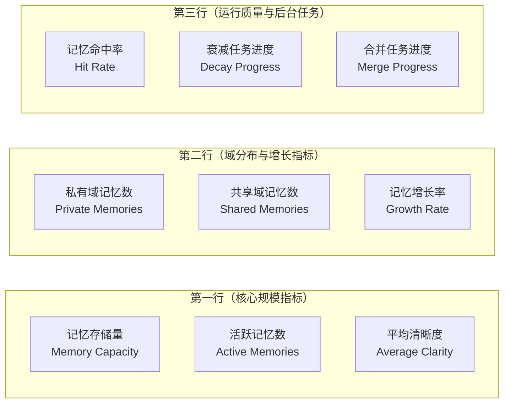

#### 13.1.3 角色数据范围

| 角色 | 可见 KPI | 数据范围 |
|------|----------|----------|
| 超级管理员 | 全部 9 个 | 全平台聚合（跨商户） |
| 商户管理员 | 全部 9 个 | 本 Merchant 范围内 |
| 知识工程师 | 记忆存储量、活跃记忆数、平均清晰度、记忆增长率、记忆命中率 | 本 Merchant |
| 编排工程师 | 活跃记忆数、记忆命中率、衰减任务进度、反思合并任务进度 | 本 Merchant |
| 普通用户 | 活跃记忆数、私有域记忆数、平均清晰度、记忆命中率 | 仅本人 |

#### 13.1.4 交互与异常处理

- 卡片悬停展示 Tooltip：指标说明、计算口径、最近 7 天趋势迷你图（衰减相关卡片展示清晰度衰减曲线）
- 点击卡片跳转到记忆管理列表页，并自动应用对应的筛选条件
- 单卡数据获取失败时显示"数据加载失败"+重试按钮，其他卡片不受影响
- 数据为 0 或空时显示"—"，不展示趋势箭头
- 趋势颜色语义：清晰度、命中率、增长率上升为绿色 ↑；衰减进度上升为红色 ↑（任务积压为负向）
- 记忆命中率 >= 80% 为绿色健康态，60%~80% 为黄色观察态，< 60% 为红色告警态（命中率反映记忆价值，参考业界推荐基线设定阈值）

### 13.2 记忆衰减趋势图

#### 13.2.1 图表配置

| 配置项 | 说明 |
|--------|------|
| 图表类型 | 多系列折线图（Line Chart） |
| X 轴 | 时间（与全局时间范围选择器联动：今日→按小时，本周/本月/自定义→按天） |
| Y 轴（左） | 活跃记忆数（条） |
| Y 轴（右） | 平均清晰度（0-1） |
| 数据系列 | 活跃记忆数、平均清晰度、衰减中记忆数（共 3 条折线） |
| 颜色 | 活跃=蓝色、衰减中=橙色、平均清晰度=绿色（双 Y 轴） |
| 交互 | 悬停展示数据点详情、点击图例切换显隐 |

#### 13.2.2 衰减曲线叠加视图

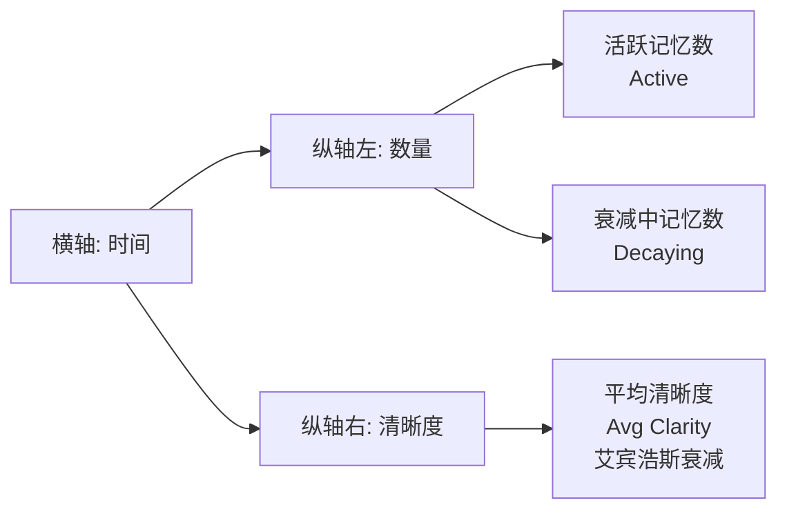

> 叠加艾宾浩斯遗忘曲线参考线（虚线）以可视化清晰度衰减趋势，详细衰减模型见 §6.2。

#### 13.2.3 验收标准

| 编号 | 验收标准 | 验证方法 |
|------|----------|----------|
| AC-DT-01 | 三条折线数据与数据库原始数据一致（误差 ≤ 0.1%） | 对比数据库原始数据验证 |
| AC-DT-02 | 时间范围切换后图表在 2 秒内重新渲染 | 切换不同时间范围测量渲染时间 |
| AC-DT-03 | 双 Y 轴刻度正确，左轴为数量、右轴为清晰度（0-1） | 检查左右 Y 轴刻度标签 |
| AC-DT-04 | 平均清晰度折线与艾宾浩斯参考线趋势一致（同向下降） | 观察长时间窗口下的曲线形态 |

### 13.3 记忆域分布饼图

#### 13.3.1 图表配置

| 配置项 | 说明 |
|--------|------|
| 图表类型 | 环形饼图（Donut Chart） |
| 数据 | Private、Shared、Public 三类域的记忆条数及占比 |
| 中心文字 | 当前用户可见记忆总条数 |
| 颜色 | 私有域=蓝色、共享域=橙色、公共域=灰色（与五层架构"数据支撑层"视觉一致） |
| 交互 | 悬停展示域名称、记忆条数、占比；点击跳转至对应域的记忆列表 |
| 权限 | 公共域仅超级管理员和商户管理员可见 |

#### 13.3.2 域分布 Mermaid 示意

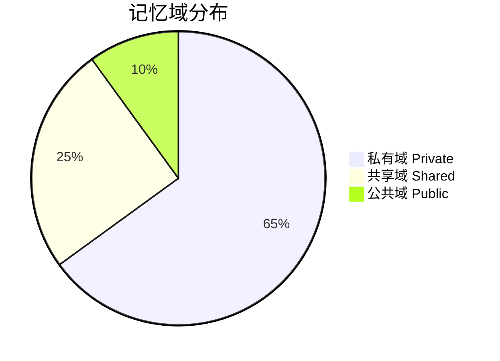

#### 13.3.3 验收标准

| 编号 | 验收标准 | 验证方法 |
|------|----------|----------|
| AC-DM-01 | 三类域占比与数据库原始数据一致（误差 ≤ 0.1%） | 对比数据库原始数据验证 |
| AC-DM-02 | 普通用户仅看到 Private + Shared 两类，不展示 Public 段 | 使用普通用户账户验证 |
| AC-DM-03 | 点击扇区正确跳转至对应域的记忆列表页 | 点击验证跳转路由和筛选条件 |

### 13.4 最近记忆活动

> 基础活动类型、图标、颜色、时间格式化、分页规则遵循 PRD-02 §4.3 通用规范。

#### 13.4.1 记忆管理模块专属活动类型

| 活动类型 | 子类型 | 图标 | 描述模板 | 颜色 |
|----------|--------|------|----------|------|
| 记忆新增 | memory.create | Plus | "{用户} 新增了记忆《{标题}》" | 绿色 |
| 记忆更新 | memory.update | Edit | "{用户} 更新了记忆《{标题}》（清晰度 {old} → {new}）" | 蓝色 |
| 记忆删除 | memory.delete | Trash | "{用户} 删除了记忆《{标题}》" | 红色 |
| 记忆共享 | memory.share | Share | "{用户} 将记忆《{标题}》共享至域《{域名称}》" | 紫色 |
| 记忆转化为知识 | memory.convert | Database | "{用户} 将记忆《{标题}》转化为知识条目" | 青色 |
| 衰减计算完成 | memory.decay | Clock | "衰减计算任务处理了 {N} 条记忆，平均清晰度 {avg}" | 橙色 |
| 反思合并建议 | memory.merge | GitMerge | "系统生成了 {N} 条反思合并建议" | 黄色 |
| 反思合并执行 | memory.merge.execute | Check | "{用户} 执行了反思合并：{主记忆} ← {被合并记忆}" | 绿色 |
| 脱敏规则更新 | memory.masking | Shield | "{用户} 更新了脱敏规则集《{名称}》" | 灰色 |
| 生命周期策略变更 | memory.lifecycle | Settings | "{用户} 修改了记忆生命周期策略" | 灰色 |

#### 13.4.2 展示与权限规则

- 展示范围：最近 30 天内的活动，每页 20 条
- 超级管理员可查看全平台聚合活动；其他角色仅查看权限范围内活动
- 点击活动条目跳转至对应的记忆详情、共享域详情、合并建议详情或规则配置页
- 衰减/合并任务类活动为系统级推送，所有有 `memory:list` 权限的用户均可见

### 13.5 Sidebar 菜单

#### 13.5.1 菜单项定义

| 菜单名称 | 英文标识 | 图标 | 路由路径 | 权限要求 | 所属架构层 | 说明 |
|----------|----------|------|----------|----------|------------|------|
| 记忆管理 | Memories | memory | `/memories` | `memory:list` | 数据支撑层 | 记忆列表、共享域、生命周期、脱敏配置、合并建议等全部子功能入口 |

> 完整的导航菜单分组规则、折叠/展开行为、面包屑、键盘快捷键遵循 PRD-12 §5.1。

#### 13.5.2 记忆管理菜单与子路由展开

| 子菜单 | 路由 | 权限 | 说明 |
|--------|------|------|------|
| 记忆列表 | `/memories/list` | `memory:list` | 全部记忆条目列表（含筛选、搜索、批量操作） |
| 私有域 | `/memories/private` | `memory:list` | 当前用户的私有域记忆 |
| 共享域 | `/memories/shared` | `memory:list` | 用户所属的共享域列表与域内记忆 |
| 公共域 | `/memories/public` | `memory:list` + `memory:publish` | 公共域记忆（管理员可写入） |
| 生命周期策略 | `/memories/lifecycle` | `memory:policy:edit` | 配置半衰期、衰减策略、合并策略 |
| 脱敏规则 | `/memories/masking` | `memory:masking:edit` | 维护脱敏模板与规则 |
| 合并建议 | `/memories/merge-suggestions` | `memory:merge:execute` | 反思合并建议处理 |
| 审计日志 | `/memories/audit-logs` | `memory:audit:view` | 敏感操作审计日志查询 |
| 记忆统计 | `/memories/stats` | `memory:list` | 域分布、活跃度、命中率等图表 |

#### 13.5.3 权限过滤行为

- 无 `memory:list` 权限的用户在 Sidebar 中不展示"记忆管理"菜单项
- 通过 URL 直接访问 `/memories/*` 时，由前端路由守卫和后端接口鉴权双重拦截，返回 403
- 拥有 `memory:list` 但未拥有 `memory:policy:edit` 的用户进入菜单后，生命周期策略和脱敏规则子菜单自动隐藏（菜单粒度遵循最小权限原则，UI 入口与权限严格对齐）

### 13.6 模块依赖关系（Dashboard / 导航视角）

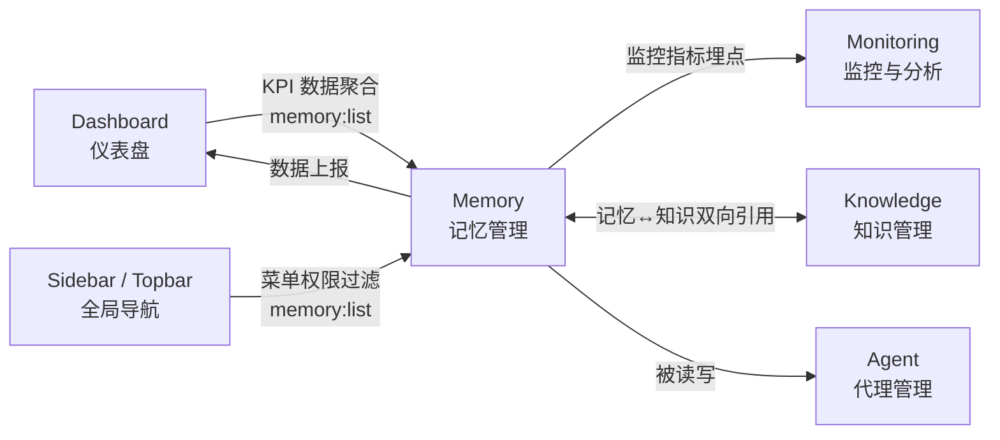

- **Dashboard → Memory**：单向数据读取，仪表盘仅聚合记忆相关 KPI（13.1）用于展示
- **Sidebar / Topbar → Memory**：根据 `memory:list` 权限控制菜单项展示，路由跳转遵循权限校验
- **Memory → Dashboard**：定时上报活跃记忆数、清晰度均值、命中率等指标
- **Memory ↔ Knowledge**：记忆与知识双向关联（详见 §7.11），支持记忆转化为知识
- **Memory → Agent**：被 Agent 读写，提供上下文注入与个性化记忆写入能力
- **Memory → Monitoring**：暴露衰减任务进度、合并任务进度、命中率、脱敏触发次数等可观测性指标

---

## 14. 模块关系总览

本章节整合自 PRD-12 §5.4，描述记忆管理模块在五层架构中的位置以及与其他模块的依赖关系。

### 14.1 记忆管理在五层架构中的位置

记忆管理（Memory）位于系统的**数据支撑层**（Data Support Layer），与知识管理（Knowledge）共同构成数据底座。数据支撑层向上为能力构建层（Capability Building Layer）提供数据基础，向上为编排翻译层（Orchestration & Translation Layer）提供知识与记忆供给。

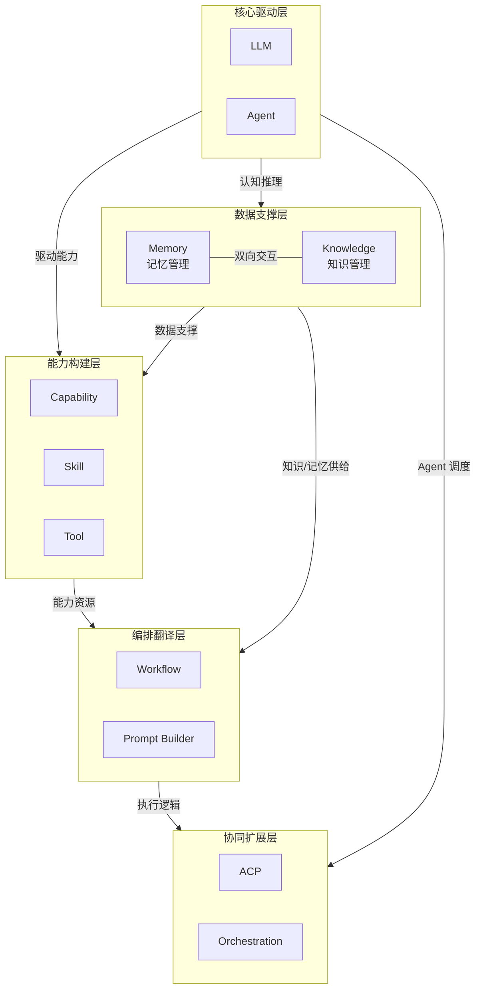

### 14.2 与其他模块的关系

#### 14.2.1 关系概览

| 序号 | 关系方向 | 关系类型 | 描述 |
|------|----------|----------|------|
| R-MM-01 | Memory ↔ Knowledge | 双向交互 | 记忆与知识双向引用、记忆可转化为知识 |
| R-MM-02 | Agent → Memory | 读写依赖 | Agent 读取记忆以注入上下文，写入记忆以沉淀个性化信息 |
| R-MM-03 | Memory → Dashboard | 数据读取 | 仪表盘聚合记忆相关 KPI 展示 |
| R-MM-04 | Memory → Monitoring | 监控采集 | 暴露衰减、合并、命中率等可观测性指标 |
| R-MM-05 | System Setting → Memory | 配置依赖 | 接收全局安全策略、Token 有效期、加密配置等 |
| R-MM-06 | Permissions → Memory | 权限控制 | RBAC + ABAC 控制记忆与域的访问，详见 §7.6、§7.10 |
| R-MM-07 | Memory → Merchants / Users | 租户隔离 | 多租户数据隔离（与其他模块一致） |

#### 14.2.2 关系 1：Memory ↔ Knowledge（双向交互）

| 维度 | 说明 |
|------|------|
| 方向 | 双向（Memory ↔ Knowledge） |
| 类型 | 双向交互 |
| 描述 | 知识库中的结构化内容可被引用为长期语义记忆（`linked_to`），记忆也可提升为知识条目（`convert-to-knowledge`） |
| 数据流 | 知识条目 → 索引引用 → 记忆注入；记忆内容 → 提取审核 → 知识沉淀 |
| 接口支撑 | `API-04-36` 转化记忆为知识；`API-04-37` 获取记忆关联知识 |
| 影响范围 | 知识库重大更新需评估对关联记忆的影响；记忆转化为知识需经审核流程 |

#### 14.2.3 关系 2：Agent → Memory（读写依赖）

| 维度 | 说明 |
|------|------|
| 方向 | Agent → Memory（Agent 主动调用） |
| 类型 | 读写依赖 |
| 描述 | Agent 在对话开始时读取相关记忆注入上下文，对话结束后将用户偏好、事实、事件等沉淀为新记忆 |
| 数据流 | Agent 启动 → 加载私有域记忆 → LLM 推理 → 写入新记忆 → 触发脱敏 → 更新清晰度 |
| 接口支撑 | `API-04-38` Agent 读取记忆；`API-04-39` Agent 写入记忆；`API-04-40` Agent 记忆统计 |
| 影响范围 | Agent 写入频次与质量直接影响记忆增长率与命中率 |

#### 14.2.4 关系 3：Memory → Dashboard（数据聚合）

| 维度 | 说明 |
|------|------|
| 方向 | Dashboard → Memory（仪表盘读取） |
| 类型 | 数据聚合（Read-Only） |
| 描述 | 仪表盘从记忆管理模块聚合 9 个 KPI 指标与 4 个图表数据（详见 §13） |
| 数据流 | Memory 指标 → 缓存聚合 → KPI 计算 → 图表渲染 |
| 接口支撑 | 沿用 §13.1 KPI 接口规范（建议路径 `/api/v1/dashboard/kpi/memory`） |
| 影响范围 | Dashboard 故障不影响记忆模块运行；记忆模块故障时 Dashboard 相关卡片降级为"数据加载失败" |

#### 14.2.5 关系 4：Memory → Monitoring（监控采集）

| 维度 | 说明 |
|------|------|
| 方向 | Monitoring → Memory（监控主动拉取） |
| 类型 | 监控采集（Read-Only） |
| 描述 | 监控模块采集记忆模块的衰减任务进度、合并任务进度、命中率、脱敏触发次数、跨域拦截次数等指标 |
| 数据流 | Memory 指标 → 采集 Agent → PostgreSQL 分区表 / Prometheus → 监控面板 / 告警规则 |
| 接口支撑 | `/metrics` Prometheus 端点（与全局 NFR-O-002 一致） |
| 影响范围 | Monitoring 故障不影响业务模块运行，但会导致记忆模块监控盲区 |

#### 14.2.6 关系 5：System Setting → Memory（配置依赖）

| 维度 | 说明 |
|------|------|
| 方向 | System Setting → Memory（单向配置下发） |
| 类型 | 配置依赖 |
| 描述 | 系统设置变更（如安全策略、加密配置、Token 有效期）通过事件总线推送至记忆模块，配置变更后 5 秒内热更新生效 |
| 数据流 | 配置变更 → 事件总线 → 记忆模块监听 → 配置热更新 |
| 影响范围 | 全局配置变更可能影响记忆模块的安全策略、脱敏行为、审计行为 |

#### 14.2.7 模块依赖矩阵（记忆管理视角）

| 来源模块 \ 目标模块 | Memory | Knowledge | Agent | Dashboard | Monitoring | System Setting | Permissions |
|---------------------|:------:|:---------:|:-----:|:---------:|:----------:|:--------------:|:-----------:|
| **Memory** | — | ↔（双向） | R（被读写） | D（数据源） | D（指标源） | R（配置接收） | R（权限校验） |
| **Knowledge** | ↔（双向） | — | R | D | D | R | R |
| **Agent** | R/W | R | — | D | D | R | R |
| **Dashboard** | R | R | R | — | — | R | R |
| **Monitoring** | R | R | R | R | — | R | R |
| **System Setting** | R（全局配置） | R | R | R | R | — | R |

> R = Read（读取依赖），R/W = Read & Write（读写），D = Data Source（数据来源），↔ = 双向交互

---

## 15. 非功能需求汇总

本章节整合自 PRD-12 §5.5，描述记忆管理模块在性能、安全、可用性、兼容性、可观测性等维度的非功能需求。模块特有需求（清晰度衰减、反思合并、私有域隔离、隐私脱敏等）已在 §10 详细描述，本章聚焦于跨模块通用的非功能性约束与补充的可观测性需求。

### 15.1 性能需求

| 需求编号 | 需求项 | 指标 | 验证方法 |
|----------|--------|------|----------|
| NFR-P-MEM-001 | 记忆列表加载响应时间（P95，含分页与覆盖索引） | ≤ 500ms | 接口性能测试（10 万条数据） |
| NFR-P-MEM-001P99 | 记忆列表加载响应时间（P99，含分页与覆盖索引） | ≤ 1s | 接口性能测试 |
| NFR-P-MEM-002 | 记忆详情查询响应时间（P95） | ≤ 150ms | 接口性能测试 |
| NFR-P-MEM-003 | 记忆创建响应时间（P95） | ≤ 300ms | 接口性能测试 |
| NFR-P-MEM-004 | 语义搜索响应时间（P95） | ≤ 500ms | 向量检索性能测试 |
| NFR-P-MEM-005 | 关键词搜索响应时间（P95） | ≤ 100ms | 全文检索性能测试 |
| NFR-P-MEM-006 | 衰减计算任务吞吐 | ≥ 100,000 条/小时 | 定时任务监控 |
| NFR-P-MEM-007 | 反思合并任务吞吐 | ≥ 10,000 条/批次 | 定时任务监控 |
| NFR-P-MEM-008 | 并发记忆操作支持 | 100 并发用户 | 压力测试 |
| NFR-P-MEM-009 | 脱敏处理额外延迟 | ≤ 50ms | 对比含/不含敏感信息的写入耗时 |
| NFR-P-MEM-010 | Agent 记忆加载时间 | ≤ 500ms | Agent 对话启动计时 |
| NFR-P-MEM-011 | Dashboard 记忆相关 KPI 响应时间 | ≤ 500ms（P95） | APM 性能监控 |
| NFR-P-MEM-012 | 记忆域分布饼图响应时间 | ≤ 1s（P95） | APM 性能监控 |

### 15.2 安全需求

| 需求编号 | 需求项 | 指标 | 验证方法 |
|----------|--------|------|----------|
| NFR-S-MEM-001 | 私有域数据隔离 | 100%（任何跨域访问均被拦截） | 安全测试 |
| NFR-S-MEM-002 | 隐私脱敏覆盖率 | 100%（所有敏感信息均被脱敏） | 安全测试 |
| NFR-S-MEM-003 | 审计日志完整性 | 100%（所有敏感操作均有日志记录） | 安全测试 |
| NFR-S-MEM-004 | 脱敏前原始数据保护 | 100%（原始敏感数据不持久化存储） | 安全审计 |
| NFR-S-MEM-005 | 跨域传输拦截率 | 100%（所有违规跨域操作均被拦截） | 安全测试 |
| NFR-S-MEM-006 | Agent 未授权访问拦截率 | 100%（未授权 Agent 无法读写私有域） | 安全测试 |
| NFR-S-MEM-007 | 传输加密 | 全站 HTTPS，TLS 1.2+ | SSL Labs 测试 |
| NFR-S-MEM-008 | 存储加密 | 敏感记忆内容 AES-256 加密存储 | 代码审查 + 渗透测试 |
| NFR-S-MEM-009 | 防注入 | SQL 注入、XSS、CSRF、SSRF 防护 | 渗透测试 |
| NFR-S-MEM-010 | 接口限流 | 单用户 100 QPS，超出返回 HTTP 200 + 业务错误码 052429（限流） | 压力测试 |
| NFR-S-MEM-011 | 权限诊断审计 | 所有权限诊断操作记录审计日志 | 日志审查 |
| NFR-S-MEM-012 | 记忆审计日志保留期限 | ≥ 180 天，可配置 | 配置检查 |

### 15.3 可用性需求

| 需求编号 | 需求项 | 指标 | 验证方法 |
|----------|--------|------|----------|
| NFR-A-MEM-001 | 记忆管理模块可用性 | ≥ 99.9%（月度） | 运行时间监控 |
| NFR-A-MEM-002 | 衰减计算任务容错率 | 100%（单次失败不影响其他记忆） | 模拟任务失败验证 |
| NFR-A-MEM-003 | 反思合并任务容错率 | 100%（单批失败不影响其他批次） | 模拟批次失败验证 |
| NFR-A-MEM-004 | Embedding 服务降级可用性 | 降级为 TF-IDF 后功能可用 | 模拟 Embedding 服务不可用 |
| NFR-A-MEM-005 | RPO（恢复点目标） | ≤ 5 分钟 | 灾备演练 |
| NFR-A-MEM-006 | RTO（恢复时间目标） | ≤ 30 分钟 | 灾备演练 |
| NFR-A-MEM-007 | 错误率 | API 错误率 ≤ 0.1%（排除客户端错误） | 监控报表 |
| NFR-A-MEM-008 | 降级展示 | Embedding 服务故障时，搜索自动降级为关键词匹配 | 故障注入测试 |

### 15.4 兼容性需求

| 需求编号 | 需求项 | 指标 | 验证方法 |
|----------|--------|------|----------|
| NFR-C-MEM-001 | 浏览器兼容性 | Chrome 90+、Firefox 88+、Safari 14+、Edge 90+ | 多浏览器测试 |
| NFR-C-MEM-002 | 分辨率适配 | 最小支持 1280x720（桌面端），推荐 1920x1080 | 响应式测试 |
| NFR-C-MEM-003 | 移动端适配 | iOS Safari 14+、Android Chrome 90+（仅查看功能） | 移动端测试 |
| NFR-C-MEM-004 | API 向后兼容 | API 版本升级时，旧版本至少保留 6 个月兼容期 | 版本管理检查 |
| NFR-C-MEM-005 | 响应式断点 | 支持 XL/LG/MD/SM 四个断点平滑适配 | 响应式测试 |
| NFR-C-MEM-006 | Embedding 模型版本兼容 | 支持主流 Embedding 模型（BGE、OpenAI text-embedding-3 等）热切换 | 集成测试 |

### 15.5 可观测性需求

| 需求编号 | 需求项 | 指标 | 验证方法 |
|----------|--------|------|----------|
| NFR-O-MEM-001 | 分布式追踪 | 所有记忆相关 API 请求支持分布式链路追踪（traceId 贯穿） | 链路追踪验证 |
| NFR-O-MEM-002 | 指标监控 | 记忆服务暴露 Prometheus 指标接口（`/metrics`） | 监控系统验证 |
| NFR-O-MEM-003 | 健康检查 | 记忆服务提供健康检查接口（`/health`） | 健康检查验证 |
| NFR-O-MEM-004 | 告警规则 | 关键指标异常（命中率 < 60%、衰减任务积压 > 1 小时、脱敏失败率 > 0.1%）5 分钟内触发告警 | 告警测试 |
| NFR-O-MEM-005 | 关键指标 | 暴露：活跃记忆数、清晰度均值、命中率、衰减任务进度、合并任务进度、脱敏触发次数、跨域拦截次数、私有域访问次数 | 监控系统验证 |
| NFR-O-MEM-006 | 日志规范 | 统一 JSON 日志格式，包含 traceId、userId、domain、memoryId、operation 等字段 | 日志审查 |
| NFR-O-MEM-007 | 用户行为分析 | 记忆搜索、合并执行、共享、转化为知识等关键操作埋点上报 | 数据分析验证 |
| NFR-O-MEM-008 | 衰减曲线可视化 | 监控面板提供清晰度衰减曲线叠加展示（艾宾浩斯参考线） | 监控面板验证 |

#### 15.5.1 关键监控指标说明

| 指标 | 英文标识 | 单位 | 含义 | 告警阈值 |
|------|----------|------|------|----------|
| 活跃记忆数 | `memory_active_count` | 条 | 当前状态为 active + decaying 的记忆总数 | — |
| 平均清晰度 | `memory_avg_clarity` | 0-1 | 活跃记忆的平均清晰度 | < 0.5 持续 1 小时告警 |
| 记忆命中率 | `memory_hit_rate` | % | 记忆命中次数 / 记忆调用总次数 | < 60% 告警 |
| 衰减任务进度 | `memory_decay_progress` | % | 当前衰减批次已处理 / 待处理 | < 80% 持续 1 小时告警 |
| 合并任务进度 | `memory_merge_progress` | % | 当前合并批次已执行 / 待执行 | < 80% 持续 1 小时告警 |
| 脱敏触发次数 | `memory_masking_trigger_total` | 次/分钟 | 单位时间脱敏触发次数 | 突增 10 倍告警 |
| 跨域拦截次数 | `memory_cross_domain_blocked_total` | 次/分钟 | 单位时间跨域违规拦截次数 | > 100 告警（可能存在攻击） |
| 私有域访问次数 | `memory_private_access_total` | 次/分钟 | 单位时间私有域访问次数 | — |

---

## 16. 接口规范汇总

本章节整合自 PRD-12 §5.6，描述记忆管理模块在 API 设计、错误码、响应格式、分页等方面遵循的全局规范，确保跨模块 API 的一致性。

### 16.1 接口总则（GraphQL 单总线）

> **v5 收束说明(2026-06-13)**：记忆管理模块对外**仅**暴露 GraphQL 单总线接口。**不**再设计 RESTful 端点、不使用 `/api/v1/memory/...` 资源路径、不使用 HTTP 方法语义区分操作。

| 规范项 | 说明 |
|--------|------|
| 接口形态 | **GraphQL**（`POST /graphql`），遵循 PRD-00 §A5 GraphQL Schema 设计规范 |
| 操作类型 | `Query`（查询）、`Mutation`（写操作）、`Subscription`（实时推送） |
| 命名约定 | Query 使用名词 / 动词 + 资源，`Mutation` 使用动词 + 资源 + Input |
| 多租户 | `info.context["partition_key"]` 由 Gateway 注入，业务模块**不**接受租户入参 |
| 错误表达 | 业务错误通过 `errors[].extensions.code` 传递 `BIZ_MEMORY_*` 命名空间 |
| HTTP 状态 | 业务层恒为 200；HTTP 401/403 仅保留在 API Gateway 网关层（Token 缺失/越权拦截） |
| 文档位置 | 全部 Schema 定义、Query/Mutation、Input Type 见 **§A5 GraphQL Schema** |

### 16.2 错误码体系

#### 16.2.1 记忆管理模块编码

记忆管理模块的错误码统一采用 `BIZ_MEMORY_*` 命名空间,对应数字段位 `052001-052999`(6 位格式 `05XXXXX`),严格遵循 [PRD-00 §5.3.2.1 权威错误码段位分配表](file:///Users/Garabateador/Workspace/banyan/PRD/PRD-00-平台总览与全局规范.md)。详见 §18.5 完整错误码表。

> **命名空间恢复说明(2026-06-13 v5 收束)**:本节 v2.0.0 误标注"废弃 SilvaEngine `BIZ_MEMORY_*` 格式",与 PRD-00 §5.3.2.1 权威规范直接矛盾,已纠正。`BIZ_MEMORY_*` 为本模块唯一合法命名空间,与 `052001-052999` 段位一一映射。

| 段位 | 类别 | 说明 |
|------|------|------|
| 0520xx | 系统级 | 未知错误、内部系统错误 |
| 0521xx | 参数验证 | 记忆内容为空、类型无效、清晰度越界、域类型无效 |
| 0522xx | 业务规则 | 编码重复、归档不可编辑、冲突不可使用、跨域传输禁止 |
| 0523xx | 权限 | 私有域访问、共享域成员、公共域写入、Agent 授权 |
| 0524xx | 资源未找到 | 记忆条目、记忆类型、记忆域、冲突记录 |
| 0525xx | 状态冲突 | 非活跃不可编辑、锁定不可衰减 |
| 0526xx | 外部服务 | 向量服务、Neo4j、Outbox、LLM 脱敏 |
| 0527xx | 同步 | Outbox 重试、GraphLabel、RLS、共享租户 |

#### 16.2.2 记忆管理模块常见错误码

> 完整错误码表（28 个）详见 §18.5。GraphQL 接口 HTTP 状态码恒为 200，业务错误通过 errors 字段返回。

| 错误码 | 状态码 | 说明 | 触发场景 |
|--------|--------|------|----------|
| 052101 | 200 | 记忆内容为空 | 创建/更新记忆时 content 为空 |
| 052102 | 200 | 记忆类型无效 | memory_type 不在枚举范围内 |
| 052103 | 200 | 清晰度超出范围 | clarity_score 不在 0.0-1.0 范围内 |
| 052201 | 200 | 记忆编码重复 | 同一租户下 code 已存在 |
| 052202 | 200 | 归档记忆不可编辑 | 尝试编辑 status=ARCHIVED 的记忆 |
| 052203 | 200 | 冲突记忆不可被 Agent 使用 | Agent 尝试使用 status=CONFLICTED 的记忆 |
| 052204 | 200 | 私有域记忆禁止跨域传输 | 尝试将私有域记忆移动到共享域/公共域 |
| 052301 | 200 | 私有域仅所有者可访问 | 非所有者访问私有域记忆 |
| 052302 | 200 | 共享域仅成员可访问 | 非成员访问共享域记忆 |
| 052303 | 200 | 公共域仅管理员可写入 | 普通用户尝试在公共域创建记忆 |
| 052304 | 200 | Agent 未获用户授权 | Agent 未授权读写私有域记忆 |
| 052401 | 200 | 记忆条目不存在 | 指定的 memory_id 不存在 |
| 052501 | 200 | 记忆非活跃状态不可编辑 | 尝试编辑非 ACTIVE 状态的记忆 |
| 052502 | 200 | 锁定记忆不可衰减 | 尝试对 LOCKED 记忆执行衰减 |
| 052601 | 200 | 向量服务不可用 | Embedding 服务超时或返回错误 |
| 052602 | 200 | Neo4j 写入超时 | Neo4j 同步操作超时 |
| 052603 | 200 | Outbox 同步失败 | PG 到 Neo4j 同步失败 |

### 16.3 响应格式

> **v5 收束说明(2026-06-13)**：所有记忆管理接口响应遵循 GraphQL 标准信封 `{data, errors, extensions.traceId}`，**不**再使用 `{code, message, data, timestamp, traceId}` 旧式信封。业务错误码位于 `errors[].extensions.code`，traceId 位于 `extensions.traceId`。

#### 16.3.1 成功响应（无分页 Query）

```json
{
  "data": {
    "memory": {
      "id": "mem_001",
      "user": "张三",
      "content": "用户是一名 Python 工程师，擅长机器学习和 NLP",
      "type": "fact",
      "clarity": 0.85,
      "status": "active",
      "domain": "private",
      "createdAt": "2026-06-01T10:00:00Z",
      "updatedAt": "2026-06-08T10:00:00Z"
    }
  },
  "errors": null,
  "extensions": {
    "traceId": "5f9c0a7e-2a3b-4d12-b6c1-1f8e2b1a6f0d"
  }
}
```

#### 16.3.2 成功响应（Relay Connection 分页）

```json
{
  "data": {
    "memories": {
      "edges": [
        {
          "node": {
            "id": "mem_001",
            "content": "用户是一名 Python 工程师",
            "type": "fact",
            "clarity": 0.85,
            "domain": "private"
          },
          "cursor": "Y3Vyc29yOjE="
        }
      ],
      "pageInfo": {
        "hasNextPage": true,
        "hasPreviousPage": false,
        "startCursor": "Y3Vyc29yOjE=",
        "endCursor": "Y3Vyc29yOjE1Ng=="
      },
      "totalCount": 156
    }
  },
  "errors": null,
  "extensions": {
    "traceId": "5f9c0a7e-2a3b-4d12-b6c1-1f8e2b1a6f0d"
  }
}
```

> **P1-014 收束说明(2026-06-13)**：分页响应**仅**保留 Relay Connection（`edges` / `pageInfo` / `totalCount`），删除原 `items` 数组形态。

#### 16.3.3 错误响应

```json
{
  "data": null,
  "errors": [
    {
      "message": "跨域访问被拦截",
      "path": ["moveMemory", "input", "targetDomain"],
      "extensions": {
        "code": "BIZ_MEMORY_CROSS_DOMAIN_FORBIDDEN",
        "field": "target_domain",
        "traceId": "5f9c0a7e-2a3b-4d12-b6c1-1f8e2b1a6f0d"
      }
    }
  ],
  "extensions": {
    "traceId": "5f9c0a7e-2a3b-4d12-b6c1-1f8e2b1a6f0d"
  }
}
```

#### 16.3.4 记忆管理模块特殊扩展字段

| 字段 | 出现位置 | 说明 |
|------|----------|------|
| `quota` | 列表响应 `data` | 配额信息：已用/上限/使用百分比 |
| `decay_info` | 详情响应 `data` | 衰减信息：上次衰减时间、当前半衰期、预计下次衰减时间 |
| `domain_permissions` | 详情响应 `data` | 域权限：当前用户对该记忆的 read/write/share/delete 权限位 |
| `linked_memories` | 详情响应 `data` | 关联记忆列表（冲突记忆、相似记忆） |
| `linked_knowledge` | 详情响应 `data` | 关联知识条目列表 |
| `masking_applied` | 详情响应 `data` | 是否已脱敏、脱敏触发字段列表 |

### 16.4 分页规范

记忆管理模块所有列表查询接口统一使用 Relay Connection（游标分页），与 PRD-00 §4.4 全局规范对齐。

#### 16.4.1 请求参数

| 参数名 | 类型 | 默认值 | 说明 |
|--------|------|--------|------|
| `first` | Int | 20 | 向前获取条数，与 `after` 搭配使用 |
| `after` | String | — | 游标，获取该游标之后的记录 |
| `last` | Int | — | 向后获取条数，与 `before` 搭配使用 |
| `before` | String | — | 游标，获取该游标之前的记录 |
| `sort` | String | `updatedAt:desc` | 排序字段:排序方向，支持多字段（逗号分隔） |
| `search` | String | — | 全文搜索关键词 |

> `first` 与 `last` 互斥，不可同时传入；`first` 默认 20，可选值：10/20/50/100。

#### 16.4.2 记忆管理模块支持的排序字段

| 字段 | 适用接口 | 说明 |
|------|----------|------|
| `updatedAt` | 记忆列表 | 最后更新时间（默认） |
| `createdAt` | 记忆列表 | 创建时间 |
| `clarity` | 记忆列表 | 清晰度（支持 `desc` 找高清晰度） |
| `lastAccessedAt` | 记忆列表 | 最后访问时间 |
| `accessCount` | 记忆列表 | 访问次数（支持 `desc` 找热门记忆） |

#### 16.4.3 响应结构

> **P1-025 收束说明(2026-06-13)**：Relay Connection 直接作为 GraphQL 顶层 query 字段的返回类型（`data.<listFieldName>.edges/pageInfo/totalCount`），分页响应**示例**仅展示 Relay Connection 自身结构（无 `data` 包装层）。**完整响应**仍遵循 PRD-00 §4 GraphQL 全局规范 `{data, errors, extensions.traceId}` 信封格式。

```json
{
  "edges": [
    {
      "node": { "...": "..." },
      "cursor": "cursor-string"
    }
  ],
  "pageInfo": {
    "hasNextPage": true,
    "hasPreviousPage": false,
    "startCursor": "cursor-string",
    "endCursor": "cursor-string"
  },
  "totalCount": 100
}
```

#### 16.4.4 游标分页（特殊场景）

> 对于反思合并建议、记忆活动流等**追加写入型**且**时间有序**的接口，建议使用游标分页（Cursor-based）以提升大数据量下的查询性能：

| 参数名 | 类型 | 说明 |
|--------|------|------|
| `cursor` | String | 上一页最后一条记录的 `id` 或 `(createdAt, id)` 复合游标 |
| `limit` | Integer | 每页数量，默认 20，最大 100 |
| `direction` | Enum | `next` / `prev`，默认 `next` |

游标分页响应在 `data.<connection>.cursor` 中返回下一页游标（统一为 GraphQL 标准信封 `{data, errors, extensions.traceId}`，**不**再使用 `items` 数组形态）。下方示例仅展示 Relay Connection 自身结构（无 `data` 包装层，详见 §16.4.3 P1-025 收束说明）：

```json
{
  "edges": [],
  "pageInfo": {
    "hasNextPage": true,
    "hasPreviousPage": false,
    "startCursor": null,
    "endCursor": "eyJjcmVhdGVkQXQiOiIyMDI2LTA2LTA4VDEwOjAwOjAwWiIsImlkIjoibWVtXzAxMiJ9"
  },
  "totalCount": 1
}
```

---

## 17. P0/P1 修复整合记录（已归档）

> **状态**：本章节所有 P0/P1 修复内容已在 v2.0.0 中整合到主体章节，本章节保留作为历史参考。
>
> **整合映射**：
>
> | 原 §17 修复内容 | 整合目标章节 | 整合状态 |
> |-------------|-------------|----------|
> | §17.1 多租户隔离 tenant_id | §18.1 DDL（`partition_key` + `tenant_id`）+ §18.1.6 RLS 策略 | 已整合 |
> | §17.2 Redis 命名空间 | §11.2.1 Redis Key 命名规范 | 已整合 |
> | §17.3 GDPR 被遗忘权 | §7.7.3 归档阈值（GDPR 删除保留期） | 已整合 |
> | §17.4 统一权限标识 | §16.2 错误码体系（统一为 052001-052999） | 已整合 |
> | §17.5 反思合并限流 | 保留原内容（独立功能模块） | 保留 |
> | §17.6 记忆 PII 字段级加密 | §18.1.1 DDL（content 字段 PII 加密注释） | 已整合 |
> | §17.7 记忆 WORM 审计日志 | §18.1.5 审计表（WORM 约束说明） | 已整合 |
> | §17.8 性能基线与覆盖索引 | §18.1.1 DDL（覆盖索引定义） | 已整合 |
> | §17.9 多租户与安全总体架构 | 保留原内容（架构参考图） | 保留 |
> | §17.10 P0/P1 修复验收标准 | 保留原内容（验收参考） | 保留 |

### 17.1 Memory 表多租户隔离（修复 P0 缺失）

> **v6 收束说明**：本节为 v5 修复历史归档，权威 DDL 与当前规范请参考 **§18.1 PostgreSQL 数据模型**（使用 `partition_key` 复合主键 + RLS，`tenant_id` 为派生字段）。以下内容保留作为修复历史参考，不作为新实现依据。

Memory 表必须显式包含 `tenant_id` 字段，作为多租户隔离的第一主键。所有查询必须以 `tenant_id` 为前置过滤条件，杜绝跨租户数据泄露。

**Memory 表结构扩展**：

| 字段 | 类型 | 必填 | 默认值 | 说明 |
|------|------|------|--------|------|
| tenant_id | VARCHAR(64) | 是 | — | 所属租户 ID（主隔离标识） |
| owner_user_id | VARCHAR(64) | 是 | — | 记忆所有者（私有域主键） |
| domain | ENUM('PRIVATE','SHARED','PUBLIC') | 是 | PRIVATE | 记忆所属域 |
| domain_id | VARCHAR(64) | 否 | NULL | 共享域/公共域 ID |
| is_deleted | BOOLEAN | 是 | FALSE | 软删除标记（由 `deleted_at IS NOT NULL` 派生，computed column） |
| deleted_at | TIMESTAMPTZ | 否 | NULL | 软删除时间（GDPR 物理删除依据） |
| pii_encrypted | BOOLEAN | 是 | FALSE | 是否已加密 PII 字段 |

**Memory 表索引**：

```sql
-- 覆盖索引：支持记忆列表 P95 ≤ 500ms 查询
CREATE INDEX idx_memory_tenant_owner_status_updated
  ON memory(partition_key, owner_user_id, status, updated_at DESC);

CREATE INDEX idx_memory_tenant_domain
  ON memory(partition_key, domain, domain_id);

CREATE INDEX idx_memory_tenant_pii
  ON memory(partition_key, pii_encrypted);
```

**Memory 写入 tenant_id 强制注入**：

| 场景 | 注入位置 | 强制方式 |
|------|----------|----------|
| 私有记忆 | INSERT 时 | `tenant_id` 来自 JWT Token，写入拦截器阻断客户端覆盖 |
| 共享记忆 | INSERT 时 | `tenant_id` 来自当前用户域，写入拦截器校验 |
| 公共记忆 | INSERT 时 | `tenant_id` = 平台 ID，写入拦截器仅允许管理员 |
| 读取 | SELECT WHERE | SQLAlchemy 事件监听器自动追加 `AND partition_key = :current_tenant_id` |
| 更新/删除 | WHERE | SQLAlchemy 事件监听器自动追加 `AND partition_key = :current_tenant_id` |

**跨租户数据校验**：

| 维度 | 校验规则 | 失败处理 |
|------|----------|----------|
| API Token | JWT 中 `tenant_id` 与请求参数 `tenant_id` 必须一致 | 401/403 |
| 数据访问 | ORM 强制 `tenant_id` 过滤 | 跨租户访问返回空集 |
| 数据导出 | 导出任务必须指定 `tenant_id` | 跨租户导出被拒 |
| 异步任务 | 异步处理携带 `tenant_id` | 异步任务上下文注入 |

---

### 17.2 Redis 缓存 Key 命名空间（修复 P0 缺失）

Redis 缓存必须按租户隔离 Key 命名空间，避免不同租户数据互相覆盖、互相污染。

> **v6 收束说明**：本节 Redis Key 格式为 v5 修复历史格式（`tenant:{tenant_id}:...`），v6 收束后的权威格式请参考 **§11.2.1 Redis Key 命名规范**（`mem:{partition_key}:...`，与 PRD-00 §7.4 权威一致）。本节保留作为修复历史参考，新实现请以 §11.2.1 为准。

**Redis Key 命名规范**：

```
格式：t:{tenant_id}:memory:{entity}:{id}[:{sub}]
示例：t:t_001:memory:cache:mem_001
```

**Memory 模块 Redis Key 分类**：

| Key 前缀 | 用途 | 过期时间 | 命名空间隔离 |
|----------|------|----------|--------------|
| `t:{tenant_id}:memory:cache:{id}` | 单条记忆详情缓存 | 30 分钟 | ✅ |
| `t:{tenant_id}:memory:list:{user_id}:{filter_hash}` | 记忆列表查询缓存 | 5 分钟 | ✅ |
| `t:{tenant_id}:memory:search:{query_hash}` | 搜索结果缓存 | 5 分钟 | ✅ |
| `t:{tenant_id}:memory:clarity:{id}` | 清晰度评分缓存 | 10 分钟 | ✅ |
| `t:{tenant_id}:memory:quota:{user_id}` | 配额计数 | 实时（无 TTL） | ✅ |
| `t:{tenant_id}:memory:lock:{id}` | 分布式锁 | 30 秒 | ✅ |
| `t:{tenant_id}:memory:rate:{user_id}:{window}` | 限流计数 | 60 秒滑动 | ✅ |
| `t:{tenant_id}:memory:session:{id}` | 会话记忆 | 24 小时 | ✅ |

**Redis 集群分片策略**：

| 数据类型 | 分片 Key | 备注 |
|----------|----------|------|
| 单条记忆 | `t:{tenant_id}:memory:cache:{id}` | Hash Tag 保证同租户同分片 |
| 列表缓存 | `t:{tenant_id}:memory:list:{user_id}` | 业务前缀包含 `{tenant_id}` |
| 限流计数 | `t:{tenant_id}:memory:rate:{user_id}` | 租户粒度限流 |

**Redis Key 治理工具**：

| 工具 | 功能 |
|------|------|
| KeyPrefixValidator | 拦截所有 Redis 命令，校验 Key 必须以 `t:` 或 `pl:` 开头 |
| TenantPrefixInterceptor | 自动为 Key 追加 `t:{tenant_id}:` 前缀 |
| KeyExpireSweeper | 定期清理过期 Key，统计冷热数据 |
| KeyAuditLogger | 记录所有 Key 操作到审计日志（仅敏感 Key） |

---

### 17.3 GDPR 被遗忘权（修复 P0 缺失）

用户删除账号后，关联记忆数据必须在 30 天内物理删除，满足 GDPR 第 17 条"被遗忘权"合规要求。

**删除流程**：

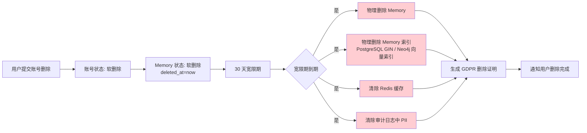

**GDPR 物理删除清单**：

| 数据存储 | 删除方式 | 验证方法 |
|----------|----------|----------|
| PostgreSQL `tenant_memory_memories` 表 | `DELETE FROM tenant_memory_memories WHERE owner_user_id = ? AND deleted_at < NOW() - INTERVAL '30 days'` | COUNT(*) = 0 |
| PostgreSQL 记忆历史版本表 | 同步删除历史版本 | COUNT(*) = 0 |
| PostgreSQL `audit_memory_access_logs` | 保留审计骨架，删除 PII 字段 | PII 字段 = NULL |
| PostgreSQL 全文检索索引 | DELETE WHERE | 索引中无残留 |
| Neo4j 向量索引 | DELETE + DROP INDEX | 索引中无残留 |
| Redis 缓存 | 主动失效 + 被动过期 | Key 不存在 |
| 备份数据 | 备份保留策略标记为待删除 | 下次备份周期清理 |
| 日志系统 | 脱敏而非删除 | PII 字段 = `***` |

**30 天宽限期策略**：

| 阶段 | 时间窗 | 状态 | 用户操作 |
|------|--------|------|----------|
| T+0 | 账号删除 | 软删除 | 不可登录，可恢复 |
| T+1~29 | 30 天内 | 软删除（deleted_at IS NOT NULL） | 可申请恢复账号 |
| T+30 | 30 天后 | 物理删除 | 数据不可恢复 |

**GDPR 删除证明**：

```json
{
  "deletion_id": "gdpr_del_20260609_xxxxxx",
  "user_id": "user_001",
  "tenant_id": "tenant_a",
  "deleted_at": "2026-07-09T10:00:00Z",
  "deleted_data_summary": {
    "memory_count": 1234,
    "memory_history_count": 5678,
    "audit_log_count": 100,
    "vector_count": 1234
  },
  "storage_verification": {
    "postgresql_count": 0,
    "pg_fulltext_count": 0,
    "neo4j_vector_count": 0,
    "redis_keys": 0
  },
  "operator": "system_cron",
  "trace_id": "trace-xxxxxx"
}
```

**GDPR 验收标准**：

| 编号 | 验收标准 | 验证方法 |
|------|----------|----------|
| AC-MEM-GDPR-01 | 用户删除账号后 30 天内所有记忆数据被物理删除 | 数据库 COUNT(*) 验证 |
| AC-MEM-GDPR-02 | 30 天宽限期内用户可申请恢复账号 | 功能测试 |
| AC-MEM-GDPR-03 | 物理删除覆盖 PostgreSQL/Neo4j/Redis/备份 | 全链路扫描 |
| AC-MEM-GDPR-04 | 删除后生成可下载的 GDPR 删除证明 | 接口测试 |
| AC-MEM-GDPR-05 | 审计日志中 PII 字段被脱敏保留 | 日志审查 |

---

### 17.4 统一权限标识（修复 P1）

记忆管理模块权限标识在原文档中已采用 `memory:list/read/edit/delete` 等格式，本次统一为**资源级 + 操作级**两段式格式，详见 PRD-12 §5.7.3。

**Memory 模块权限标识**：

| 资源 | 权限标识 | 含义 | 默认角色 |
|------|----------|------|----------|
| 记忆条目 | `memory:list` | 查看记忆列表 | 开发者/运维/管理员 |
| 记忆条目 | `memory:read` | 查看记忆详情 | 开发者/运维/管理员 |
| 记忆条目 | `memory:edit` | 编辑记忆条目 | 所有者/管理员 |
| 记忆条目 | `memory:delete` | 删除记忆条目 | 所有者/管理员 |
| 共享域 | `memory:share` | 加入/退出共享域 | 管理员 |
| 公共域 | `memory:publish` | 发布到公共域 | 管理员 |
| 域成员 | `memory:domain:manage` | 管理域成员 | 域管理员 |
| 生命周期策略 | `memory:policy:edit` | 配置衰减/合并策略 | 管理员 |
| 脱敏规则 | `memory:masking:edit` | 维护脱敏模板 | 管理员 |
| 合并建议 | `memory:merge:execute` | 执行反思合并 | 管理员 |
| 审计日志 | `memory:audit:view` | 查看审计日志 | 审计员/管理员 |

**三级域权限矩阵**：

| 操作 | 私有域（PRIVATE） | 共享域（SHARED） | 公共域（PUBLIC） |
|------|:----------------:|:----------------:|:----------------:|
| 所有者 read | ✅ | ✅ | ✅ |
| 所有者 edit | ✅ | ⚠️ 需 `memory:edit` | ⚠️ 需 `memory:edit` |
| 所有者 delete | ✅ | ⚠️ 需 `memory:delete` | ⚠️ 需 `memory:delete` |
| 域成员 read | ❌ | ✅ | ✅ |
| 域成员 edit | ❌ | ❌ | ⚠️ 管理员 |
| 域成员 delete | ❌ | ❌ | ⚠️ 管理员 |
| 任意用户 read | ❌ | ❌ | ✅ |
| 任意用户 edit | ❌ | ❌ | ❌ |

---

### 17.5 反思合并限流（修复 P1）

反思合并是后台异步批处理任务，必须限制并发数避免下游服务（LLM/Embedding）过载。

**限流策略**：

| 维度 | 限流阈值 | 触发动作 |
|------|----------|----------|
| 全局并发任务数 | ≤ 5 个 | 超出排队等待 |
| 单租户并发任务数 | ≤ 2 个 | 超出排队等待 |
| LLM API 调用频率 | ≤ 60 次/分钟/租户 | 限流 + 退避重试 |
| Embedding API 调用频率 | ≤ 100 次/分钟/租户 | 限流 + 退避重试 |
| 反思合并批次大小 | ≤ 100 条/批 | 超分批处理 |
| 单次合并超时 | ≤ 30 秒 | 任务失败 + 重试 |

**任务调度器**：

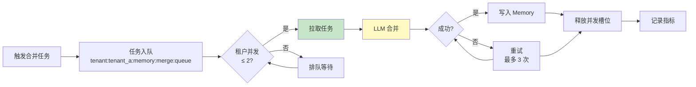

---

### 17.6 记忆 PII 字段级加密（修复 P1）

所有 PII（Personally Identifiable Information）字段必须进行字段级加密，满足 GDPR / CCPA 合规。

**PII 字段清单**：

| 字段 | 数据类型 | 加密算法 | 密钥管理 |
|------|----------|----------|----------|
| user_id 明文 | String | AES-256-GCM | KMS |
| email | String | AES-256-GCM | KMS |
| phone | String | AES-256-GCM | KMS |
| id_card | String | AES-256-GCM + 索引前缀 | KMS |
| 真实姓名 | String | AES-256-GCM | KMS |
| 地址 | String | AES-256-GCM | KMS |
| 聊天内容 | Text | AES-256-GCM | KMS |
| 行为偏好 | JSON | AES-256-GCM | KMS |

**加密字段在数据库中的存储**：

| 字段 | 明文示例 | 密文示例 |
|------|----------|----------|
| email | `alice@example.com` | `enc:v1:0a1b2c3d4e5f:base64...` |
| phone | `13800138000` | `enc:v1:1b2c3d4e5f6a:base64...` |
| content | `今天和Bob讨论了项目...` | `enc:v1:2c3d4e5f6a7b:base64...` |

**加密策略**：

| 策略 | 说明 |
|------|------|
| 透明加密 | 应用层无感知，SQLAlchemy TypeDecorator 自动加解密 |
| 密钥轮换 | KMS 支持密钥定期轮换（默认 90 天） |
| 不可逆索引 | 邮箱/手机号等需要等值查询的字段使用 HMAC 指纹作为辅助索引 |
| 全文搜索兼容 | 加密字段搜索走专用索引，搜索性能不下降 |
| 性能影响 | 加密/解密额外延迟 ≤ 5ms |

**KMS 集成**：

| KMS 厂商 | 集成方式 |
|----------|----------|
| 阿里云 KMS | SDK 集成 |
| 腾讯云 KMS | SDK 集成 |
| AWS KMS | SDK 集成 |
| HashiCorp Vault | Transit Engine |

---

### 17.7 记忆 WORM 审计日志（修复 P1）

所有记忆敏感操作必须记录 WORM（Write Once Read Many）审计日志，确保日志不可篡改、不可删除。

**WORM 审计日志特性**：

| 特性 | 说明 |
|------|------|
| 不可修改 | 写入后禁止 UPDATE 操作 |
| 不可删除 | 物理删除接口不开放，保留期到期后归档 |
| 完整性校验 | 每条日志包含 hash + prev_hash 形成链式结构 |
| 链式验证 | 定期校验 hash 链，篡改立即告警 |
| 时钟同步 | 使用可信时间戳服务（NTP + TSA） |
| 跨域复制 | 审计日志同步到异地灾备 |

**审计日志表结构**：

| 字段 | 类型 | 必填 | 说明 |
|------|------|------|------|
| log_id | VARCHAR(64) | 是 | 全局唯一 ID |
| tenant_id | VARCHAR(64) | 是 | 租户 ID |
| actor_user_id | VARCHAR(64) | 是 | 操作用户 ID |
| action | ENUM | 是 | 操作类型（read/write/share/delete/export/decrypt） |
| resource_type | ENUM | 是 | 资源类型（memory/memory_domain/memory_policy） |
| resource_id | VARCHAR(64) | 是 | 资源 ID |
| before_hash | VARCHAR(64) | 否 | 操作前数据 hash |
| after_hash | VARCHAR(64) | 否 | 操作后数据 hash |
| prev_log_hash | VARCHAR(64) | 是 | 上一条日志 hash（链式） |
| log_hash | VARCHAR(64) | 是 | 当前日志 hash |
| trace_id | VARCHAR(64) | 是 | 链路追踪 ID |
| created_at | TIMESTAMPTZ | 是 | 创建时间（可信时间戳） |
| client_ip | VARCHAR(64) | 否 | 客户端 IP |
| user_agent | VARCHAR(512) | 否 | 客户端 UA |

**WORM 存储实现**：

| 存储层 | 实现方式 |
|--------|----------|
| PostgreSQL | 触发器禁止 UPDATE/DELETE |
| 归档存储 | OSS WORM 模式 / S3 Object Lock |
| 时序数据 | PostgreSQL 分区表 |

**审计日志链式校验**：

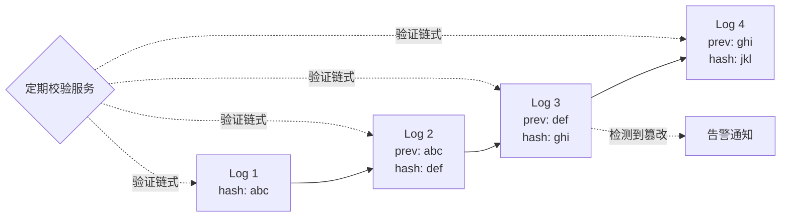

---

### 17.8 性能基线与覆盖索引（修复 P1）

> **v6 收束说明**：本节为 v5 修复历史归档，权威 DDL 与索引定义请参考 **§18.1 PostgreSQL 数据模型**（使用 `partition_key` 复合主键）。以下索引中的 `tenant_id` 对应 DDL 中的 `partition_key`，保留原表述作为修复历史参考。

记忆列表 P95 调整为 ≤ 500ms（P99 ≤ 1s），需要配合覆盖索引与查询优化。

**关键覆盖索引**：

| 表 | 索引 | 适用查询 |
|----|------|----------|
| memory | `(partition_key, owner_user_id, status, updated_at DESC)` | 记忆列表主查询 |
| memory | `(partition_key, domain, domain_id, updated_at DESC)` | 共享域记忆查询 |
| memory | `(partition_key, deleted_at)` WHERE deleted_at IS NOT NULL | 软删除记忆清理 |
| memory_history | `(partition_key, id, version DESC)` | 版本历史查询 |
| memory_audit_log | `(partition_key, created_at DESC, id)` | 审计日志查询 |
| memory_audit_log | `(partition_key, actor_user_id, created_at DESC)` | 用户操作查询 |

**查询优化策略**：

| 优化项 | 措施 | 性能提升 |
|--------|------|----------|
| 覆盖索引 | 索引包含查询所需全部字段 | 避免回表 |
| 分页优化 | 游标分页替代 OFFSET 大分页 | 10 万级数据 < 500ms |
| 读写分离 | 读流量路由到从库 | 减少主库压力 |
| Redis 缓存 | 列表结果缓存 5 分钟 | 命中 95% 请求 |
| PostgreSQL 全文检索（pg_trgm + tsvector） | 关键词搜索走 PostgreSQL GIN 索引 | 搜索 < 100ms |
| 向量检索 | HNSW 索引 + 量化 | 检索 < 200ms |
| 预聚合 | Dashboard KPI 走预聚合表 | < 500ms |

**性能验收指标**：

| 指标 | 目标值 | 测试方法 |
|------|--------|----------|
| 记忆列表 P95 | ≤ 500ms | 10 万条数据 + 索引 |
| 记忆列表 P99 | ≤ 1s | 10 万条数据 + 索引 |
| 记忆详情 P95 | ≤ 150ms | 单条查询 |
| 语义搜索 P95 | ≤ 500ms | 向量检索 |
| 关键词搜索 P95 | ≤ 100ms | PostgreSQL GIN 检索 |
| 衰减任务吞吐 | ≥ 100,000 条/小时 | 定时任务 |
| 合并任务吞吐 | ≥ 10,000 条/批次 | 定时任务 |

---

### 17.9 记忆管理多租户与安全总体架构

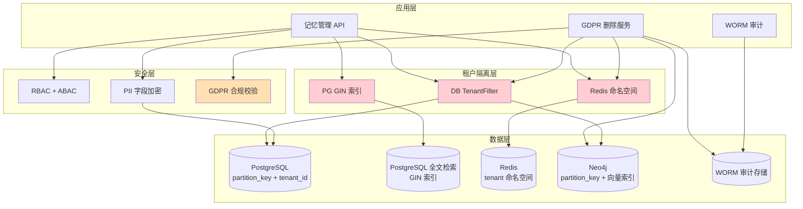

---

### 17.10 P0/P1 修复验收标准

| 编号 | 验收标准 | 优先级 | 验证方法 |
|------|----------|--------|----------|
| AC-MEM-FIX-01 | Memory 表包含 `tenant_id` 字段，所有查询自动按租户过滤 | P0 | 渗透测试 |
| AC-MEM-FIX-02 | Redis Key 命名空间 100% 符合 `t:{tenant_id}:memory:*` 规范 | P0 | 自动化扫描 |
| AC-MEM-FIX-03 | GDPR 删除 30 天宽限期内用户可恢复，30 天后物理删除 | P0 | 集成测试 |
| AC-MEM-GDPR-04 | 物理删除覆盖 PostgreSQL/Neo4j/Redis/备份 | P0 | 全链路扫描 |
| AC-MEM-FIX-05 | 权限标识全部为 `memory:*` 资源级 + 操作级格式 | P1 | 代码扫描 |
| AC-MEM-FIX-06 | 反思合并任务并发数限制生效，不超过 5 个全局 / 2 个单租户 | P1 | 压力测试 |
| AC-MEM-FIX-07 | PII 字段加密 100% 覆盖，密文无法被明文搜索 | P1 | 安全测试 |
| AC-MEM-FIX-08 | 审计日志不可修改、不可删除，链式 hash 校验通过 | P1 | 安全测试 |
| AC-MEM-FIX-09 | 记忆列表 P95 ≤ 500ms / P99 ≤ 1s（含分页与覆盖索引） | P1 | 性能测试 |
| AC-MEM-FIX-10 | GDPR 删除完成后生成可下载的删除证明 | P1 | 接口测试 |

---

## 18. 附录 A 数据模型补全（基于 PRD-09 §41 规范）

> 本附录针对记忆管理模块的 PostgreSQL 与 Neo4j 数据模型进行补全，遵循 [PRD-09 §41 全局标识符命名规范](PRD-09-系统设置.md#41-附录-a-全局标识符命名规范v10)。
> 既有 AC-MEM-* 命名规则保留（历史编号已冻结），新增条目统一采用 AC-02-* 规范编号。

### 18.1 PostgreSQL 数据模型

> **触发器声明**: 本模块所有 `tenant_*` / `sys_*` 租户级表均配置 `set_partition_key_from_session()` BEFORE INSERT 触发器，自动从会话变量 `app.current_tenant_id` 注入 `partition_key`，遵循 PRD-00 §7.2 强制规范。触发器函数定义参见 PRD-00 §7.2.2 或 PRD-11 §8.1。

> **外键列名约定**：本模块各表中出现的 `memory_id`、`old_memory_id`、`new_memory_id`、`memory_id_1`、`memory_id_2` 等字段均为外键列名，引用 `tenant_memory_memories.id`（复合主键的第二列）。列名保持业务语义命名不变，不因主键改为 `(partition_key, id)` 而重命名。

#### 18.1.1 记忆主表

```sql
CREATE TABLE tenant_memory_memories (
  partition_key       VARCHAR(64)   NOT NULL,               -- Composite primary key first part, RLS isolation key
  id                  UUID          NOT NULL DEFAULT gen_random_uuid(),
  tenant_id           UUID          NOT NULL GENERATED ALWAYS AS (partition_key::uuid) STORED,  -- Derived from partition_key, required by multi-tenant middleware
  domain_type         VARCHAR(16)   NOT NULL CHECK (domain_type IN ('PRIVATE', 'SHARED', 'PUBLIC')),
  domain_id           VARCHAR(128)  NOT NULL,               -- user_id / group_id / 'public'
  owner_user_id       UUID          NOT NULL,               -- Memory owner (unified from user_id/owner_id)
  memory_type         VARCHAR(32)   NOT NULL CHECK (memory_type IN ('preference', 'fact', 'event', 'skill', 'relation', 'context')),
  content             TEXT          NOT NULL,               -- PII encrypted at application layer (AES-256-GCM via TypeHandler)
  content_hash        VARCHAR(64)   NOT NULL,               -- SHA-256 for deduplication and change detection
  content_summary     VARCHAR(200),                          -- Summary for Neo4j whitelist (<=200 chars, no PII)
  clarity_score       DECIMAL(5,2)  NOT NULL,               -- 0.00 ~ 1.00
  importance          INTEGER       NOT NULL DEFAULT 3,     -- 1-5
  source              VARCHAR(64),                           -- conversation / import / explicit
  status              VARCHAR(16)   NOT NULL DEFAULT 'ACTIVE' CHECK (status IN ('ACTIVE', 'DECAYING', 'ARCHIVED', 'CONFLICTED', 'LOCKED', 'DELETED')),
  owner_scope         VARCHAR(10)   NOT NULL DEFAULT 'OWN' CHECK (owner_scope IN ('OWN', 'SHARED', 'PUBLIC')),
  shared_tenant_ids   JSONB         NOT NULL DEFAULT '[]',  -- Shared tenant ID list (effective only when SHARED)
  pii_flag            BOOLEAN       NOT NULL DEFAULT FALSE,
  encryption_key      VARCHAR(64),                           -- PII encryption key reference
  ttl_expire_at       TIMESTAMPTZ,                          -- TTL expiration time
  last_accessed_at    TIMESTAMPTZ,
  access_count        INTEGER       NOT NULL DEFAULT 0,
  knowledge_id        UUID,                                  -- Optional FK to PRD-01 tenant_knowledge_kb
  created_by          UUID          NOT NULL,
  created_at          TIMESTAMPTZ   NOT NULL DEFAULT NOW(),
  updated_at          TIMESTAMPTZ   NOT NULL DEFAULT NOW(),
  deleted_at          TIMESTAMPTZ   NULL,
  is_deleted          BOOLEAN       NOT NULL GENERATED ALWAYS AS (deleted_at IS NOT NULL) STORED,  -- Derived from deleted_at
  PRIMARY KEY (partition_key, id),
  UNIQUE (partition_key, content_hash)
);

-- Covering indexes for memory list P95 <= 500ms
CREATE INDEX idx_tenant_memory_user ON tenant_memory_memories(partition_key, owner_user_id, status, updated_at DESC);
CREATE INDEX idx_tenant_memory_domain ON tenant_memory_memories(partition_key, domain_type, domain_id, status);
CREATE INDEX idx_tenant_memory_type ON tenant_memory_memories(partition_key, memory_type, status);
CREATE INDEX idx_tenant_memory_pii ON tenant_memory_memories(partition_key, pii_flag, status);
CREATE INDEX idx_tenant_memory_expire ON tenant_memory_memories(ttl_expire_at) WHERE deleted_at IS NULL;
CREATE INDEX idx_tenant_memory_content_fulltext ON tenant_memory_memories USING GIN(to_tsvector('simple', content));
CREATE INDEX idx_tenant_memory_owner_scope ON tenant_memory_memories(partition_key, owner_scope);
CREATE INDEX idx_tenant_memory_shared_tenants ON tenant_memory_memories USING GIN(shared_tenant_ids);
```

#### 18.1.2 记忆域成员表

```sql
CREATE TABLE tenant_memory_domain_members (
  partition_key   VARCHAR(64)  NOT NULL,
  id           UUID         NOT NULL DEFAULT gen_random_uuid(),
  tenant_id       UUID         NOT NULL GENERATED ALWAYS AS (partition_key::uuid) STORED,  -- Derived from partition_key, required by multi-tenant middleware
  domain_type     VARCHAR(16)  NOT NULL,    -- shared / public
  domain_id       VARCHAR(128) NOT NULL,
  user_id         UUID         NOT NULL,
  role            VARCHAR(16)  NOT NULL CHECK (role IN ('DOMAIN_ADMIN', 'EDITOR', 'VIEWER')),
  joined_at       TIMESTAMPTZ   NOT NULL DEFAULT NOW(),
  invited_by      UUID,
  status          VARCHAR(16)  NOT NULL DEFAULT 'ACTIVE',
  created_at      TIMESTAMPTZ   NOT NULL DEFAULT NOW(),
  updated_at      TIMESTAMPTZ   NOT NULL DEFAULT NOW(),
  PRIMARY KEY (partition_key, id),
  UNIQUE (partition_key, domain_type, domain_id, user_id)
);

CREATE INDEX idx_tenant_memory_member_user ON tenant_memory_domain_members(partition_key, user_id, status);
CREATE INDEX idx_tenant_memory_member_domain ON tenant_memory_domain_members(partition_key, domain_type, domain_id, status);
```

#### 18.1.3 记忆生命周期配置表

```sql
CREATE TABLE tenant_memory_lifecycle_policies (
  partition_key   VARCHAR(64)  NOT NULL,
  id           UUID         NOT NULL DEFAULT gen_random_uuid(),
  tenant_id       UUID         NOT NULL GENERATED ALWAYS AS (partition_key::uuid) STORED,  -- Derived from partition_key, required by multi-tenant middleware
  policy_name     VARCHAR(128) NOT NULL,
  decay_rate      DECIMAL(5,4) NOT NULL,    -- 0.0000 ~ 1.0000 (Ebbinghaus decay rate)
  half_life_days  INTEGER      NOT NULL,
  dormant_days    INTEGER      NOT NULL,
  archive_days    INTEGER      NOT NULL,
  merge_strategy  VARCHAR(32)  NOT NULL CHECK (merge_strategy IN ('skip', 'overwrite', 'merge')),
  apply_scope     VARCHAR(16)  NOT NULL CHECK (apply_scope IN ('all', 'domain_type', 'user')),
  scope_filter    JSONB,
  status          VARCHAR(16)  NOT NULL DEFAULT 'ENABLED',
  created_at      TIMESTAMPTZ   NOT NULL DEFAULT NOW(),
  updated_at      TIMESTAMPTZ   NOT NULL DEFAULT NOW(),
  PRIMARY KEY (partition_key, id)
);

```

#### 18.1.4 记忆冲突解决记录表

```sql
CREATE TABLE tenant_memory_conflict_resolutions (
  partition_key   VARCHAR(64)  NOT NULL,
  id              UUID         NOT NULL DEFAULT gen_random_uuid(),
  tenant_id       UUID         NOT NULL GENERATED ALWAYS AS (partition_key::uuid) STORED,  -- Derived from partition_key, required by multi-tenant middleware
  user_id         UUID         NOT NULL,
  old_memory_id   UUID         NOT NULL,
  new_memory_id   UUID         NOT NULL,
  conflict_type   VARCHAR(32)  NOT NULL CHECK (conflict_type IN ('contradiction', 'supersede', 'duplicate')),
  resolution      VARCHAR(16)  NOT NULL CHECK (resolution IN ('keep_old', 'use_new', 'merge', 'discard')),
  resolved_by     UUID         NOT NULL,
  resolved_at     TIMESTAMPTZ   NOT NULL DEFAULT NOW(),
  notes           TEXT,
  PRIMARY KEY (partition_key, id)
);

CREATE INDEX idx_tenant_memory_conflict_user ON tenant_memory_conflict_resolutions(partition_key, user_id, resolved_at DESC);
```

#### 18.1.5 记忆访问审计表（WORM）

```sql
CREATE TABLE audit_memory_access_logs (
  partition_key   VARCHAR(64)  NOT NULL,
  id           UUID         NOT NULL DEFAULT gen_random_uuid(),
  tenant_id       UUID         NOT NULL GENERATED ALWAYS AS (partition_key::uuid) STORED,  -- Derived from partition_key, required by multi-tenant middleware
  user_id         UUID         NOT NULL,
  memory_id       UUID         NOT NULL,
  operation       VARCHAR(16)  NOT NULL CHECK (operation IN ('READ', 'WRITE', 'UPDATE', 'DELETE', 'EXPORT', 'DECRYPT')),
  source_ip       VARCHAR(45),
  user_agent      VARCHAR(512),
  result          VARCHAR(16)  NOT NULL CHECK (result IN ('SUCCESS', 'DENIED', 'ERROR')),
  prev_hash       VARCHAR(64),                           -- Chain hash predecessor (WORM)
  current_hash    VARCHAR(64)  NOT NULL,                  -- Chain hash current (WORM)
  created_at      TIMESTAMPTZ   NOT NULL DEFAULT NOW(),
  PRIMARY KEY (partition_key, id)
);

CREATE INDEX idx_audit_memory_access_tenant ON audit_memory_access_logs(partition_key, created_at DESC);
CREATE INDEX idx_audit_memory_access_user ON audit_memory_access_logs(partition_key, user_id, created_at DESC);
CREATE INDEX idx_audit_memory_access_memory ON audit_memory_access_logs(memory_id, created_at DESC);
```

> **WORM 约束**：此表启用触发器禁止 UPDATE/DELETE 操作，确保审计日志不可篡改、不可删除。完整性通过 `prev_hash` + `current_hash` 链式结构校验。

#### 18.1.5.1 记忆类型字典表

```sql
CREATE TABLE tenant_memory_type (
    partition_key   VARCHAR(64)  NOT NULL,
    id              UUID         NOT NULL DEFAULT gen_random_uuid(),
    tenant_id       UUID         GENERATED ALWAYS AS (partition_key::uuid) STORED,
    type_code       VARCHAR(32)  NOT NULL,            -- preference / fact / event / skill / relation / context
    type_name       VARCHAR(128) NOT NULL,
    description     TEXT,
    default_importance INTEGER   NOT NULL DEFAULT 3 CHECK (default_importance BETWEEN 1 AND 5),
    decay_rate      DECIMAL(5,4) NOT NULL DEFAULT 0.0500,
    half_life_days  INTEGER      NOT NULL DEFAULT 30,
    schema_json     JSONB,                            -- 类型自定义字段 schema
    status          VARCHAR(16)  NOT NULL DEFAULT 'ENABLED' CHECK (status IN ('ENABLED', 'DISABLED')),
    created_at      TIMESTAMPTZ  NOT NULL DEFAULT NOW(),
    updated_at      TIMESTAMPTZ  NOT NULL DEFAULT NOW(),
    deleted_at      TIMESTAMPTZ,
    is_deleted      BOOLEAN      GENERATED ALWAYS AS (deleted_at IS NOT NULL) STORED,
    PRIMARY KEY (partition_key, id),
    UNIQUE (partition_key, type_code)
);
ALTER TABLE tenant_memory_type ENABLE ROW LEVEL SECURITY;
CREATE POLICY tenant_memory_type_isolation ON tenant_memory_type
    FOR ALL
    USING (partition_key = current_setting('app.current_tenant_id', TRUE));
CREATE INDEX idx_tenant_memory_type_status ON tenant_memory_type(partition_key, status);
```

#### 18.1.5.2 记忆会话上下文表

```sql
CREATE TABLE tenant_memory_session (
    partition_key   VARCHAR(64)  NOT NULL,
    id              UUID         NOT NULL DEFAULT gen_random_uuid(),
    tenant_id       UUID         GENERATED ALWAYS AS (partition_key::uuid) STORED,
    user_id         UUID         NOT NULL,            -- 会话所属用户
    agent_id        UUID,                              -- 可选,关联 Agent
    session_token   VARCHAR(128) NOT NULL,            -- 短期记忆句柄
    context_window  INTEGER      NOT NULL DEFAULT 4096,
    message_count   INTEGER      NOT NULL DEFAULT 0,
    token_count     INTEGER      NOT NULL DEFAULT 0,
    last_active_at  TIMESTAMPTZ  NOT NULL DEFAULT NOW(),
    expires_at      TIMESTAMPTZ  NOT NULL,            -- 短期记忆过期时间
    status          VARCHAR(16)  NOT NULL DEFAULT 'ACTIVE' CHECK (status IN ('ACTIVE', 'EXPIRED', 'COMMITTED', 'ABANDONED')),
    metadata_json   JSONB,
    created_at      TIMESTAMPTZ  NOT NULL DEFAULT NOW(),
    updated_at      TIMESTAMPTZ  NOT NULL DEFAULT NOW(),
    deleted_at      TIMESTAMPTZ,
    is_deleted      BOOLEAN      GENERATED ALWAYS AS (deleted_at IS NOT NULL) STORED,
    PRIMARY KEY (partition_key, id),
    UNIQUE (partition_key, session_token)
);
ALTER TABLE tenant_memory_session ENABLE ROW LEVEL SECURITY;
CREATE POLICY tenant_memory_session_isolation ON tenant_memory_session
    FOR ALL
    USING (partition_key = current_setting('app.current_tenant_id', TRUE));
CREATE INDEX idx_tenant_memory_session_user ON tenant_memory_session(partition_key, user_id, status, last_active_at DESC);
CREATE INDEX idx_tenant_memory_session_expire ON tenant_memory_session(expires_at) WHERE status = 'ACTIVE';
```

#### 18.1.5.3 记忆归档表

```sql
CREATE TABLE tenant_memory_archive (
    partition_key   VARCHAR(64)  NOT NULL,
    id              UUID         NOT NULL DEFAULT gen_random_uuid(),
    tenant_id       UUID         GENERATED ALWAYS AS (partition_key::uuid) STORED,
    original_memory_id UUID      NOT NULL,            -- 归档前 memory_id
    content         TEXT         NOT NULL,            -- PII encrypted at application layer
    content_summary VARCHAR(200),
    memory_type     VARCHAR(32)  NOT NULL,
    owner_user_id   UUID         NOT NULL,
    domain_type     VARCHAR(16)  NOT NULL,
    domain_id       VARCHAR(128) NOT NULL,
    archived_at     TIMESTAMPTZ  NOT NULL DEFAULT NOW(),
    archive_reason  VARCHAR(32)  NOT NULL CHECK (archive_reason IN ('TTL_EXPIRED', 'DORMANT', 'MANUAL', 'CONFLICT', 'POLICY')),
    retention_until TIMESTAMPTZ  NOT NULL,            -- 归档保留期(合规)
    restored_at     TIMESTAMPTZ,                      -- 若被恢复
    restore_count   INTEGER      NOT NULL DEFAULT 0,
    created_at      TIMESTAMPTZ  NOT NULL DEFAULT NOW(),
    updated_at      TIMESTAMPTZ  NOT NULL DEFAULT NOW(),
    deleted_at      TIMESTAMPTZ,
    is_deleted      BOOLEAN      GENERATED ALWAYS AS (deleted_at IS NOT NULL) STORED,
    PRIMARY KEY (partition_key, id)
);
ALTER TABLE tenant_memory_archive ENABLE ROW LEVEL SECURITY;
CREATE POLICY tenant_memory_archive_isolation ON tenant_memory_archive
    FOR ALL
    USING (partition_key = current_setting('app.current_tenant_id', TRUE));
CREATE INDEX idx_tenant_memory_archive_original ON tenant_memory_archive(partition_key, original_memory_id);
CREATE INDEX idx_tenant_memory_archive_user ON tenant_memory_archive(partition_key, owner_user_id, archived_at DESC);
CREATE INDEX idx_tenant_memory_archive_retention ON tenant_memory_archive(retention_until) WHERE restored_at IS NULL;
```

#### 18.1.5.4 记忆提取规则表

```sql
CREATE TABLE tenant_memory_extraction_rule (
    partition_key   VARCHAR(64)  NOT NULL,
    id              UUID         NOT NULL DEFAULT gen_random_uuid(),
    tenant_id       UUID         GENERATED ALWAYS AS (partition_key::uuid) STORED,
    rule_name       VARCHAR(128) NOT NULL,
    rule_type       VARCHAR(32)  NOT NULL CHECK (rule_type IN ('LLM_EXTRACT', 'KEYWORD', 'REGEX', 'TEMPLATE', 'HYBRID')),
    trigger_event   VARCHAR(64)  NOT NULL,            -- conversation_end / explicit_save / import_done
    match_pattern   TEXT,                              -- regex / keyword 模式
    llm_prompt_id   UUID,                              -- LLM 提取时引用 PRD-10 Prompt 模板
    target_memory_types JSONB    NOT NULL DEFAULT '[]',-- 提取后写入的记忆类型列表
    priority        INTEGER      NOT NULL DEFAULT 100,
    scope_filter    JSONB,                            -- 适用 domain/user 过滤
    status          VARCHAR(16)  NOT NULL DEFAULT 'ENABLED' CHECK (status IN ('ENABLED', 'DISABLED', 'DRAFT')),
    hit_count       BIGINT       NOT NULL DEFAULT 0,
    last_hit_at     TIMESTAMPTZ,
    created_by      UUID         NOT NULL,
    created_at      TIMESTAMPTZ  NOT NULL DEFAULT NOW(),
    updated_at      TIMESTAMPTZ  NOT NULL DEFAULT NOW(),
    deleted_at      TIMESTAMPTZ,
    is_deleted      BOOLEAN      GENERATED ALWAYS AS (deleted_at IS NOT NULL) STORED,
    PRIMARY KEY (partition_key, id),
    UNIQUE (partition_key, rule_name)
);
ALTER TABLE tenant_memory_extraction_rule ENABLE ROW LEVEL SECURITY;
CREATE POLICY tenant_memory_extraction_rule_isolation ON tenant_memory_extraction_rule
    FOR ALL
    USING (partition_key = current_setting('app.current_tenant_id', TRUE));
CREATE INDEX idx_tenant_memory_extraction_rule_status ON tenant_memory_extraction_rule(partition_key, status, priority DESC);
```

#### 18.1.5.5 记忆重要性评分规则表

```sql
CREATE TABLE tenant_memory_importance_rule (
    partition_key   VARCHAR(64)  NOT NULL,
    id              UUID         NOT NULL DEFAULT gen_random_uuid(),
    tenant_id       UUID         GENERATED ALWAYS AS (partition_key::uuid) STORED,
    rule_name       VARCHAR(128) NOT NULL,
    rule_expression TEXT         NOT NULL,            -- 评分表达式(JSONLogic / CEL)
    base_score      INTEGER      NOT NULL DEFAULT 3 CHECK (base_score BETWEEN 1 AND 5),
    boost_factors   JSONB,                            -- 触发加权因子
    decay_factors   JSONB,                            -- 触发减分因子
    apply_scope     VARCHAR(16)  NOT NULL CHECK (apply_scope IN ('all', 'memory_type', 'domain_type', 'user')),
    scope_filter    JSONB,
    status          VARCHAR(16)  NOT NULL DEFAULT 'ENABLED' CHECK (status IN ('ENABLED', 'DISABLED', 'DRAFT')),
    eval_count      BIGINT       NOT NULL DEFAULT 0,
    last_eval_at    TIMESTAMPTZ,
    created_by      UUID         NOT NULL,
    created_at      TIMESTAMPTZ  NOT NULL DEFAULT NOW(),
    updated_at      TIMESTAMPTZ  NOT NULL DEFAULT NOW(),
    deleted_at      TIMESTAMPTZ,
    is_deleted      BOOLEAN      GENERATED ALWAYS AS (deleted_at IS NOT NULL) STORED,
    PRIMARY KEY (partition_key, id),
    UNIQUE (partition_key, rule_name)
);
ALTER TABLE tenant_memory_importance_rule ENABLE ROW LEVEL SECURITY;
CREATE POLICY tenant_memory_importance_rule_isolation ON tenant_memory_importance_rule
    FOR ALL
    USING (partition_key = current_setting('app.current_tenant_id', TRUE));
CREATE INDEX idx_tenant_memory_importance_rule_status ON tenant_memory_importance_rule(partition_key, status);
```

#### 18.1.5.6 记忆合并 / 巩固日志表

```sql
CREATE TABLE tenant_memory_consolidation_log (
    partition_key   VARCHAR(64)  NOT NULL,
    id              UUID         NOT NULL DEFAULT gen_random_uuid(),
    tenant_id       UUID         GENERATED ALWAYS AS (partition_key::uuid) STORED,
    user_id         UUID         NOT NULL,
    consolidation_type VARCHAR(32) NOT NULL CHECK (consolidation_type IN ('MERGE', 'REFLECT', 'SUMMARIZE', 'COMPRESS', 'DEDUPLICATE')),
    source_memory_ids JSONB      NOT NULL,            -- 输入记忆 ID 列表
    target_memory_id  UUID,                            -- 输出记忆 ID(若有)
    llm_call_id     UUID,                              -- 关联 LLM 调用记录
    input_count     INTEGER      NOT NULL,
    output_count    INTEGER      NOT NULL,
    similarity_threshold DECIMAL(5,4),
    strategy        VARCHAR(32)  NOT NULL,            -- skip / overwrite / merge
    result_status   VARCHAR(16)  NOT NULL CHECK (result_status IN ('SUCCESS', 'PARTIAL', 'FAILED', 'SKIPPED')),
    error_message   TEXT,
    duration_ms     INTEGER,
    created_at      TIMESTAMPTZ  NOT NULL DEFAULT NOW(),
    updated_at      TIMESTAMPTZ  NOT NULL DEFAULT NOW(),
    deleted_at      TIMESTAMPTZ,
    is_deleted      BOOLEAN      GENERATED ALWAYS AS (deleted_at IS NOT NULL) STORED,
    PRIMARY KEY (partition_key, id)
);
ALTER TABLE tenant_memory_consolidation_log ENABLE ROW LEVEL SECURITY;
CREATE POLICY tenant_memory_consolidation_log_isolation ON tenant_memory_consolidation_log
    FOR ALL
    USING (partition_key = current_setting('app.current_tenant_id', TRUE));
CREATE INDEX idx_tenant_memory_consolidation_log_user ON tenant_memory_consolidation_log(partition_key, user_id, created_at DESC);
CREATE INDEX idx_tenant_memory_consolidation_log_type ON tenant_memory_consolidation_log(partition_key, consolidation_type, result_status);
```

#### 18.1.5.7 记忆领域事件审计表（WORM）

> 与 §18.1.5 `audit_memory_access_logs`（访问审计）并列；本表记录记忆模块**业务事件**（created/updated/archived/conflicted 等），用于事件溯源与合规审计。`audit_*` 平台级表不携带 `partition_key`（平台 WORM 规范），仅按事件来源打 `tenant_id`。

```sql
CREATE TABLE audit_memory_event (
    event_id          UUID         NOT NULL DEFAULT gen_random_uuid(),
    tenant_id         UUID         NOT NULL,            -- 事件来源租户
    event_type        VARCHAR(64)  NOT NULL,            -- memory.created / memory.archived / memory.conflict_resolved ...
    aggregate_type    VARCHAR(32)  NOT NULL,            -- memory / semantics_memory / scenario_memory
    aggregate_id      UUID         NOT NULL,            -- 业务实体 ID
    actor_user_id     UUID,                              -- 触发用户(系统事件可为空)
    actor_module      VARCHAR(32)  NOT NULL,            -- 触发模块
    payload_before   JSONB,                             -- 变更前快照
    payload_after    JSONB,                             -- 变更后快照
    trace_id          UUID,                              -- 链路追踪 ID
    prev_hash         VARCHAR(64),                      -- 链式哈希前驱(WORM)
    current_hash      VARCHAR(64)  NOT NULL,            -- 链式哈希当前(WORM)
    occurred_at       TIMESTAMPTZ  NOT NULL DEFAULT NOW(),
    PRIMARY KEY (event_id)
) PARTITION BY RANGE (occurred_at);
-- 按月分区，pg_partman 自动管理，在线保留 1 年
-- SELECT partman.create_parent('audit_memory_event', 'occurred_at', 'native', 'monthly');

-- WORM 触发器:禁止 UPDATE/DELETE
CREATE TRIGGER audit_memory_event_immutable
BEFORE UPDATE OR DELETE ON audit_memory_event
FOR EACH STATEMENT
EXECUTE FUNCTION reject_worm_mutation();

CREATE INDEX idx_audit_memory_event_tenant_time ON audit_memory_event(tenant_id, occurred_at DESC);
CREATE INDEX idx_audit_memory_event_aggregate ON audit_memory_event(aggregate_type, aggregate_id, occurred_at DESC);
CREATE INDEX idx_audit_memory_event_type ON audit_memory_event(event_type, occurred_at DESC);
CREATE INDEX idx_audit_memory_event_ts_brin ON audit_memory_event USING BRIN (occurred_at);
```

> **WORM 约束**：此表启用触发器禁止 UPDATE/DELETE 操作。完整性通过 `prev_hash` + `current_hash` 链式结构校验（详见 PRD-00 §7.6 审计规范）。

#### 18.1.6 PostgreSQL RLS 策略

> RLS（Row Level Security）作为数据库级强制隔离，与应用层 SQLAlchemy 事件监听器形成防御纵深。两层并存时：**RLS** 负责数据库级强制（应用代码无法绕过），**SQLAlchemy 事件监听器** 负责应用级过滤（减少数据库扫描行数，提升查询性能）。

```sql
-- ============================================================
-- 1. Enable RLS on all memory module tables
-- ============================================================
ALTER TABLE tenant_memory_memories ENABLE ROW LEVEL SECURITY;
ALTER TABLE tenant_memory_type ENABLE ROW LEVEL SECURITY;
ALTER TABLE tenant_memory_domain ENABLE ROW LEVEL SECURITY;
ALTER TABLE tenant_memory_conflict_resolutions ENABLE ROW LEVEL SECURITY;
ALTER TABLE tenant_memory_decay_log ENABLE ROW LEVEL SECURITY;
ALTER TABLE tenant_memory_share_log ENABLE ROW LEVEL SECURITY;
ALTER TABLE tenant_memory_desensitization_rule ENABLE ROW LEVEL SECURITY;

-- ============================================================
-- 2. Base tenant isolation policy (only own-tenant OWN data visible)
-- ============================================================
CREATE POLICY memory_tenant_isolation ON tenant_memory_memories
    FOR ALL
    USING (partition_key = current_setting('app.current_tenant_id', TRUE));

-- Apply similar policy to other tables...

-- ============================================================
-- 3. Memory visibility policy (supports OWN/SHARED/PUBLIC)
-- ============================================================
CREATE POLICY memory_visibility ON tenant_memory_memories
    FOR SELECT
    USING (
        partition_key = current_setting('app.current_tenant_id', TRUE)
        OR (
            owner_scope = 'SHARED'
            AND current_setting('app.current_tenant_id', TRUE) = ANY(
                SELECT jsonb_array_elements_text(shared_tenant_ids::jsonb)
            )
        )
        OR (
            owner_scope = 'PUBLIC'
        )
    );

-- ============================================================
-- 4. Superuser bypass policy
-- ============================================================
CREATE POLICY memory_superuser_bypass ON tenant_memory_memories
    FOR ALL
    USING (current_setting('app.is_superuser') = 'true');
```

**RLS 会话变量设置**：

| 变量 | 类型 | 设置时机 | 说明 |
|------|------|----------|------|
| `app.current_tenant_id` | VARCHAR(64) | 每个请求开始时从 JWT Token 提取 | 当前租户的 partition_key |
| `app.is_superuser` | BOOLEAN | 每个请求开始时从 JWT Token 提取 | 是否为超级管理员 |

### 18.2 Neo4j 节点与关系模型

> **架构原则**：原始数据、关系型数据存储到 PostgreSQL，图数据(graph)、向量数据存储到 Neo4j。Neo4j 同时承担记忆图谱存储和向量检索职责。

> 本节与 PRD-01 附录 H 混合架构增强 v2.1.0 对齐，采用 `MemoryEntity` + 实体类型标签 + `Graph` 的三层标签体系。

#### 18.2.1 节点标签

| 节点 | 标签 | 必含属性 | 唯一约束 | 索引 |
|------|------|----------|----------|------|
| 记忆 | `MemoryEntity` + `Memory` + `Graph` | `id`, `partition_key`, `code`, `content_summary`, `memory_type`, `clarity_score`, `status`, `owner_scope`, `domain_id`, `domain_type`, `created_at` | `FOR (n:Memory) REQUIRE (n.partition_key, n.id) IS UNIQUE` | `ON (n.partition_key, n.status)`, `ON (n.partition_key, n.memory_type)` |
| 语义记忆 | `MemoryEntity` + `SemanticsMemory` + `Graph` | `id`, `partition_key`, `entity_name`, `entity_type`, `confidence` | `FOR (n:SemanticsMemory) REQUIRE (n.partition_key, n.id) IS UNIQUE` | `ON (n.partition_key, n.entity_type)` |
| 场景记忆 | `MemoryEntity` + `ScenarioMemory` + `Graph` | `id`, `partition_key`, `event_name`, `event_time`, `importance` | `FOR (n:ScenarioMemory) REQUIRE (n.partition_key, n.id) IS UNIQUE` | `ON (n.partition_key, n.event_time)` |
| 记忆域 | `MemoryEntity` + `MemoryDomain` + `Graph` | `id`, `partition_key`, `domain_type` (PRIVATE/SHARED/PUBLIC), `domain_id` | `FOR (n:MemoryDomain) REQUIRE (n.partition_key, n.id) IS UNIQUE` | `ON (n.partition_key, n.domain_type)` |

**标签层级**：

```
MemoryEntity          ← Base label shared by all memory nodes (for global queries)
Memory/SemanticsMemory/ScenarioMemory/MemoryDomain  ← Entity type labels (for type queries)
Graph                 ← Static tenant label (v6 收束，Cypher 必须含 WHERE n.partition_key = $partitionKey)
```

**Cypher Query Ironclad Rules (aligned with PRD-01)**:

1. **Label Rule**: All tenant-scoped queries **MUST** include the `Graph` label + `WHERE n.partition_key = $partitionKey`
2. **Relationship Rule**: All path queries **MUST** verify `partition_key` on relay relationships
3. **Sharing Rule**: Cross-tenant sharing queries use `owner_scope` property + `shared_tenant_ids`

**Example Queries**:

```cypher
// Query active memories for a tenant (correct, v6 收束)
MATCH (m:MemoryEntity:Memory:Graph)
WHERE m.partition_key = $partitionKey AND m.status = 'ACTIVE'
RETURN m

// Query semantics memories for a tenant (correct, v6 收束)
MATCH (m:MemoryEntity:SemanticsMemory:Graph)
WHERE m.partition_key = $partitionKey
RETURN m

// Query all public memories (admin query)
MATCH (m:MemoryEntity:Memory:Graph)
WHERE m.owner_scope = 'PUBLIC'
RETURN m

// Incorrect: unsafe query without Graph label and partition_key filter (forbidden)
MATCH (m:Memory) WHERE m.tenant_id = $tenant_id RETURN m
// Should be: MATCH (m:MemoryEntity:Memory:Graph) WHERE m.partition_key = $partitionKey RETURN m
```

#### 18.2.2 关系类型

| 关系 | UPPER_SNAKE 类型 | 起点 → 终点 | 必含属性 |
|------|------------------|-------------|----------|
| 记忆-类型 | `MEMORY_OF_TYPE` | `Memory` → `MemoryType` | `tenant_id`, `created_at` |
| 记忆-域 | `MEMORY_OF_DOMAIN` | `Memory` → `MemoryDomain` | `tenant_id`, `created_at` |
| 包含语义 | `CONTAINS_SEMANTICS` | `Memory` → `SemanticsMemory` | `tenant_id`, `confidence`, `created_at` |
| 包含场景 | `CONTAINS_SCENARIO` | `Memory` → `ScenarioMemory` | `tenant_id`, `importance`, `created_at` |
| 关联记忆 | `RELATED_TO_MEMORY` | `Memory` → `Memory` | `tenant_id`, `relation_type`, `weight`, `created_at` |
| 记忆-知识 | `MEMORY_REFERENCES_KNOWLEDGE` | `Memory` → `KnowledgeEntity`（跨模块） | `tenant_id`, `reference_type`, `created_at` |
| 域成员 | `MEMBER_OF_MEMORY_DOMAIN` | `User` → `MemoryDomain` | `tenant_id`, `role`, `created_at` |

#### 18.2.3 Neo4j 数据排除清单（与 PRD-01 对齐）

| 禁止数据 | 原因 | 正确存储位置 |
|----------|------|------------|
| 记忆内容全文 | 包含用户对话、偏好、可能含 PII | PostgreSQL `tenant_memory_memories.content` |
| 记忆向量 | 高维浮点数组 | Neo4j |
| 用户个人信息 | PII（姓名、手机、邮箱等） | PostgreSQL（RLS 保护） |
| 审计日志 | WORM 合规要求 | PostgreSQL `audit_memory_event` |
| 共享租户列表详情 | 跨租户访问控制 | PostgreSQL `tenant_memory_memories.shared_tenant_ids` |
| 衰减历史记录 | 时序数据，体积大 | PostgreSQL `tenant_memory_decay_log` |

#### 18.2.4 Neo4j 节点属性白名单

```cypher
// Allowed properties (metadata only, no content, no PII)
{
  id: "mem_001",                    // Global unique ID
  tenant_id: "tenant_a",            // Tenant ID
  code: "MEM_001",                  // Memory code
  content_summary: "User prefers Python", // Summary (not full text, <=200 chars)
  memory_type: "preference",        // Memory type
  clarity_score: 0.85,              // Clarity score
  status: "ACTIVE",                 // Status
  owner_scope: "OWN",              // OWN / SHARED / PUBLIC
  domain_id: "domain_001",          // Domain ID
  domain_type: "PRIVATE",           // Domain type
  created_at: datetime(),           // Created timestamp
  updated_at: datetime()            // Updated timestamp
}
```

#### 18.2.5 知识图谱应用场景

> Cypher 语法修正（v5）：标签后接 `{tenant_id}` 是非法占位符语法，属性过滤必须放在 `WHERE` 子句中。Neo4j 属性按 v5 统一规范使用 `partition_key`。

| 场景 | 用途 | Cypher 示例 |
|------|------|-------------|
| 记忆相似度检索 | 通过 `RELATED_TO_MEMORY` 边找到相似记忆 | `MATCH path = (m:Memory:Graph)-[:RELATED_TO_MEMORY*1..2]-(n) WHERE m.partition_key = $partitionKey RETURN path` |
| 冲突检测 | 通过 `RELATED_TO_MEMORY` 边找到冲突记忆 | `MATCH (a:Memory:Graph)-[:RELATED_TO_MEMORY]->(b) WHERE a.partition_key = $partitionKey AND b.partition_key = $partitionKey` |
| 主题聚类 | 通过 `MEMORY_OF_DOMAIN` 边聚合域内记忆 | `MATCH (m:Memory:Graph)-[:MEMORY_OF_DOMAIN]->(d:MemoryDomain) WHERE m.partition_key = $partitionKey RETURN d, count(m) AS memoryCount` |
| 共享域成员 | 通过 `MEMBER_OF_MEMORY_DOMAIN` 边找到域成员 | `MATCH (u)-[:MEMBER_OF_MEMORY_DOMAIN]->(d:MemoryDomain:Graph) WHERE d.partition_key = $partitionKey AND d.domain_id = $domainId RETURN u` |

### 18.3 Redis Key 命名（基于 §41.8 规范）

```
t:{tenant_id}:memory:cache:{id}                         # 记忆详情缓存（TTL 5min）
t:{tenant_id}:memory:list:{user_id}:{page}              # 列表分页缓存（TTL 30s）
t:{tenant_id}:memory:domain:{domain_type}:{domain_id}:members  # 域成员缓存
pl:memory:lifecycle:policy:default                      # 默认生命周期策略
pl:memory:conflict:queue                                # Conflict detection queue (Stream)
```

### 18.4 记忆管理 Outbox 同步机制

> 参照 PRD-01 附录 H5，记忆管理模块使用相同的 Outbox 同步模式，确保 PostgreSQL 与 Neo4j 之间的数据最终一致性。

#### 18.4.1 Outbox 事件表

```sql
-- Reuse PRD-01 shared outbox_events table structure
-- aggregate_type adds memory-related types
-- No separate table needed
```

#### 18.4.2 记忆相关事件类型

> 事件名遵循 PRD-00 §4.7 Outbox Pattern 规范，统一采用 dot-lowercase 格式。
>
> **P1-029 收束说明(2026-06-13)**：本节 §18.4.2 为记忆管理模块**本模块内** Outbox 事件清单（仅供本模块 Neo4j 同步使用）。**跨模块事件**（如 `memory.referenced_knowledge` 供 PRD-01 知识管理订阅消费）**以 [PRD-00 §4.7.5 跨模块事件权威表](../PRD-00-平台总览与全局规范.md#475-跨模块事件清单p1-4) 与 §4.7.6 发布-订阅矩阵为准**；本模块新增/修改事件时，必须同步刷新 PRD-00 §4.7.5 与 §4.7.6 矩阵。
>
> **v3.0 收束说明(2026-06-13)**：本节 13 处 Cypher 语法全面修复——`(m:Memory:Graph{tenant_id} {id})` 标签内 `{tenant_id}` 占位符为非法 Cypher 语法（Cypher 不允许在标签列表后直接跟 `{` 语法），已统一改为 `MATCH/MERGE (m:Memory:Graph {id: $id}) WHERE m.partition_key = $partitionKey ...` 形式（属性统一为 `partition_key`，与 P1-023 修复一致），同时 `$partitionKey` 通过 Neo4j 驱动参数化绑定（避免 SQL 注入等价风险）。

| aggregate_type | event_type | Trigger Scenario | Neo4j Operation |
|----------------|-----------|-------------------|-----------------|
| `memory` | `memory.created` | Create memory entry | `MERGE (m:MemoryEntity:Memory:Graph {id: $id, partition_key: $partitionKey}) ON CREATE SET m += $props WHERE m.partition_key = $partitionKey` |
| `memory` | `memory.updated` | Update memory entry | `MATCH (m:Memory:Graph {id: $id}) WHERE m.partition_key = $partitionKey SET m += $props` |
| `memory` | `memory.decayed` | Clarity decay | `MATCH (m:Memory:Graph {id: $id}) WHERE m.partition_key = $partitionKey SET m.clarity_score = $score` |
| `memory` | `memory.archived` | Memory archived | `MATCH (m:Memory:Graph {id: $id}) WHERE m.partition_key = $partitionKey SET m.status = 'ARCHIVED'` |
| `memory` | `memory.deleted` | Memory physical delete | `MATCH (m:Memory:Graph {id: $id}) WHERE m.partition_key = $partitionKey DETACH DELETE m` |
| `memory` | `memory.shared` | Share to shared domain | `MATCH (m:Memory:Graph {id: $id}) WHERE m.partition_key = $partitionKey SET m.owner_scope = 'SHARED'` + add `:SharedMemory` label |
| `memory` | `memory.published` | Publish to public domain | `MATCH (m:Memory:Graph {id: $id}) WHERE m.partition_key = $partitionKey SET m.owner_scope = 'PUBLIC'` + add `:PublicMemory` label |
| `memory` | `memory.locked` | User locks memory | `MATCH (m:Memory:Graph {id: $id}) WHERE m.partition_key = $partitionKey SET m.status = 'LOCKED'` |
| `memory` | `memory.unlocked` | User unlocks memory | `MATCH (m:Memory:Graph {id: $id}) WHERE m.partition_key = $partitionKey SET m.status = 'ACTIVE', m.clarity_score = 1.0` |
| `memory` | `memory.conflict_detected` | Conflict detected | `MATCH (m:Memory:Graph {id: $id}) WHERE m.partition_key = $partitionKey SET m.status = 'CONFLICTED'` |
| `memory` | `memory.conflict_resolved` | Conflict resolved | `MATCH (m:Memory:Graph {id: $id}) WHERE m.partition_key = $partitionKey SET m.status = 'ACTIVE'` |
| `semantics_memory` | `semantics_memory.created` | Create semantics memory | `MERGE (s:MemoryEntity:SemanticsMemory:Graph {id: $id, partition_key: $partitionKey}) ON CREATE SET s += $props WHERE s.partition_key = $partitionKey` |
| `scenario_memory` | `scenario_memory.created` | Create scenario memory | `MERGE (s:MemoryEntity:ScenarioMemory:Graph {id: $id, partition_key: $partitionKey}) ON CREATE SET s += $props WHERE s.partition_key = $partitionKey` |

#### 18.4.3 Sync Worker 配置

> 与 PRD-01 附录 H5.4 相同，复用 `knowledge.sync.outbox` 配置，新增 `memory.sync.outbox` 配置项：

```json
{
  "memory.sync.outbox": {
    "setting_id": "memory.sync.outbox",
    "variables": {
      "poll_interval_ms": { "name": "poll_interval_ms", "type": "int", "value": 100 },
      "batch_size": { "name": "batch_size", "type": "int", "value": 50 },
      "max_retries": { "name": "max_retries", "type": "int", "value": 5 },
      "retry_delay_ms": { "name": "retry_delay_ms", "type": "int", "value": 1000 },
      "neo4j_timeout_ms": { "name": "neo4j_timeout_ms", "type": "int", "value": 5000 },
      "dead_letter_threshold": { "name": "dead_letter_threshold", "type": "int", "value": 5 }
    }
  }
}
```

### 18.5 错误码段位（统一为 052001-052999）

> 废弃原 §16.2 的 6 位编码（`000101` 等）、原 §14.4 的 `4001xx-4008xx`。统一采用 `052001-052999` 段位，6 位格式 `05XXXXX`。关于 `BIZ_MEMORY_*` 命名空间，以 §16.2.1 为准（`BIZ_MEMORY_*` 为本模块唯一合法命名空间），§A8 中涉及 `BIZ_MEMORY_*` 的废弃描述为旧版归档参考，不再适用。
>
> **HTTP 状态码说明**：GraphQL 接口 HTTP 状态码恒为 200，业务错误通过响应体中的 errors 字段返回（遵循 PRD-00 §5 规范）。

| 错误码 | 说明 | HTTP |
|--------|------|------|
| 052001 | 未知错误 | 200 |
| 052099 | 内部系统错误 | 200 |
| 052101 | 参数验证：记忆内容为空 | 200 |
| 052102 | 参数验证：记忆类型无效 | 200 |
| 052103 | 参数验证：清晰度超出范围 | 200 |
| 052104 | 参数验证：域类型无效 | 200 |
| 052201 | 业务规则：记忆编码重复 | 200 |
| 052202 | 业务规则：归档记忆不可编辑 | 200 |
| 052203 | 业务规则：冲突记忆不可被 Agent 使用 | 200 |
| 052204 | 业务规则：私有域记忆禁止跨域传输 | 200 |
| 052301 | 权限：私有域仅所有者可访问 | 200 |
| 052302 | 权限：共享域仅成员可访问 | 200 |
| 052303 | 权限：公共域仅管理员可写入 | 200 |
| 052304 | 权限：Agent 未获用户授权 | 200 |
| 052401 | 资源未找到：记忆条目 | 200 |
| 052402 | 资源未找到：记忆类型 | 200 |
| 052403 | 资源未找到：记忆域 | 200 |
| 052404 | 资源未找到：冲突记录 | 200 |
| 052501 | 状态冲突：记忆非活跃状态不可编辑 | 200 |
| 052502 | 状态冲突：锁定记忆不可衰减 | 200 |
| 052601 | 外部服务：向量服务不可用 | 200 |
| 052602 | 外部服务：Neo4j 写入超时 | 200 |
| 052603 | 外部服务：Outbox 同步失败 | 200 |
| 052604 | 外部服务：LLM 脱敏服务不可用 | 200 |
| 052701 | 同步：Outbox 事件超过最大重试次数 | 200 |
| 052702 | 同步：Neo4j GraphLabel 不存在 | 200 |
| 052703 | 同步：RLS 策略阻止数据访问 | 200 |
| 052704 | 同步：共享租户 ID 格式无效 | 200 |

### 18.6 数据分类与存储映射

| 数据类别 | 存储位置 | 包含内容 | 隔离方式 | 敏感等级 |
|----------|----------|----------|----------|----------|
| **记忆内容** | PostgreSQL | 原文、偏好、事件描述、个性化设置 | RLS (`partition_key`) | 高 -- 包含用户对话和偏好 |
| **记忆摘要** | PostgreSQL + Neo4j | 记忆编码、类型、清晰度、状态、`content_summary`（<=200字） | PG: RLS; Neo4j: GraphLabel + `tenant_id` | PG: 高; Neo4j: 中 |
| **关系元数据** | PostgreSQL + Neo4j | 关系 ID、类型、权重、源/目标 | PG: RLS; Neo4j: `tenant_id` on relationship | PG: 高; Neo4j: 中 |
| **向量嵌入** | Neo4j | Embedding 向量、向量 ID | Neo4j: 向量索引 `mem:{tid}_{domain_type}_{domain_id}` + partition_key 过滤 | 中 |
| **记忆域定义** | PostgreSQL + Neo4j | 域 ID、类型（PRIVATE/SHARED/PUBLIC）、成员 | PG: RLS; Neo4j: GraphLabel + `domain_type` | PG: 高; Neo4j: 低 |
| **衰减日志** | PostgreSQL | 清晰度变化历史、衰减触发时间 | RLS (`partition_key`) | 低 |
| **冲突记录** | PostgreSQL | 新旧记忆对比、解决方式 | RLS (`partition_key`) | 高 -- 可能包含敏感内容 |
| **审计日志** | PostgreSQL (WORM) | 操作人、操作类型、时间、详情 | 应用层控制（超级管理员） | 最高 |
| **缓存** | Redis | 热点记忆、衰减计算结果 | namespace: `mem:{tid}:` | 低 |

#### Neo4j 数据排除清单（详细）

| 禁止数据 | 原因 | 正确存储位置 |
|----------|------|------------|
| 记忆内容全文 | 可能包含 PII 和敏感对话 | PostgreSQL `tenant_memory_memories.content` |
| 记忆向量 | 高维浮点数组 | Neo4j |
| 用户个人信息 | PII（姓名、手机、邮箱等） | PostgreSQL（RLS 保护） |
| 审计日志 | WORM 合规要求 | PostgreSQL `audit_memory_event` |
| 共享租户列表详情 | 跨租户访问控制 | PostgreSQL `tenant_memory_memories.shared_tenant_ids` |
| 衰减历史记录 | 时序数据，体积大 | PostgreSQL `tenant_memory_decay_log` |
| 冲突记录详情 | 可能包含敏感内容 | PostgreSQL `tenant_memory_conflict` |

### 18.7 写入/读取路径序列图

#### 18.7.1 记忆创建写入路径

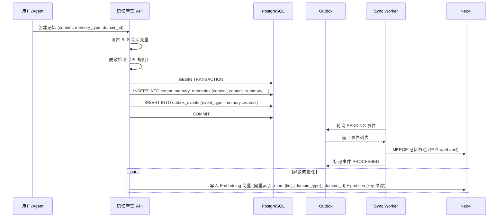

#### 18.7.2 记忆检索读取路径

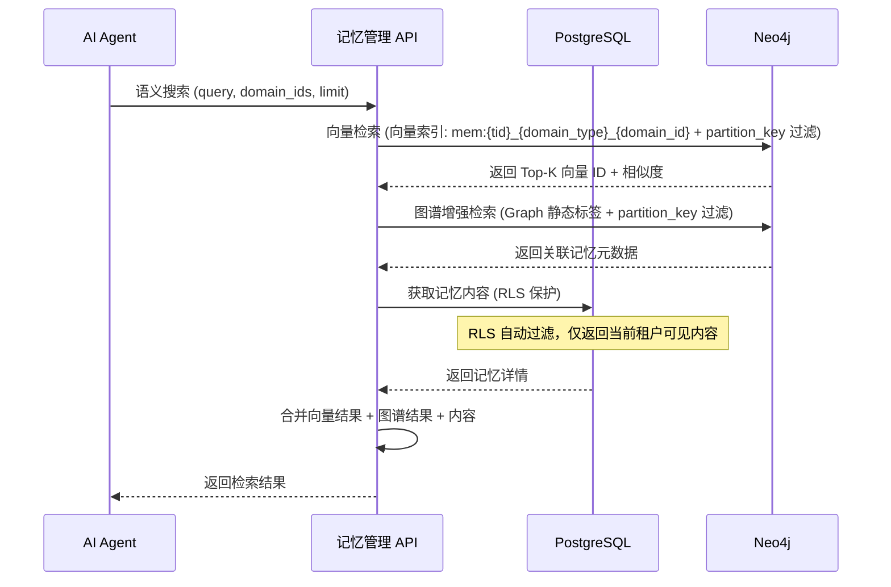

---

## SilvaEngine 实施附录

> **版本**: 2.0.0(SilvaEngine 架构重写版, 2026-06-12 整合改进)
> **生效日期**: 2026-06-12
> **本附录基于**: [`PRD-00 平台总览与全局规范 v2.0.0`](./PRD-00-平台总览与全局规范.md) §15-§17 SilvaEngine 业务模块规范
> **强制级别**: P0
> **本附录职责**:把上述业务需求映射为 SilvaEngine 业务模块的 Graphene GraphQL Schema、SQLAlchemy 模型、Neo4j 图谱、ConnectionPool 池声明、`config.json` 六桶结构

### A1. 模块身份与依赖

| 项 | 值 |
|------|------|
| **模块名** | `memory` |
| **包名** | `silvaengine_modules.memory` |
| **Graphene 入口** | `silvaengine_modules.memory.schema:Schema` |
| **Lambda 函数** | `arn:aws:lambda:us-east-1:123456789012:function:banyan-memory-resolver` |
| **endpoint_id** | `memory-endpoint` |
| **依赖模块** | PRD-04(LLM,提取与摘要)/ PRD-01(知识,记忆关联) |
| **下游模块** | PRD-06(智能体,Memory Tool) |

### A2. ConnectionPoolManager 池声明

| 池名 | 类型 | 用途 |
|------|------|------|
| `postgres_main` | postgresql | 记忆主表、版本、规则、归档 |
| `postgres_audit` | postgresql | 记忆审计日志 |
| `neo4j_main` | neo4j | Memory Node、记忆关联图谱(MEMORY_LINKED)、记忆 Embedding 向量检索 |
| `httpx_llm` | httpx | 记忆提取、摘要、重要性评分 |
| `redis_cache` | redis | 短期记忆、热门记忆缓存 |

### A3. PostgreSQL 表

| 表名 | 复合主键 | 用途 |
|------|----------|------|
| `tenant_memory_memories` | `(partition_key, id)` | 记忆主表(短期 + 长期统一) |
| `tenant_memory_type` | `(partition_key, id)` | 记忆类型(用户偏好 / 任务上下文 / 经验教训 / 关系) |
| `tenant_memory_session` | `(partition_key, id)` | 会话记忆容器 |
| `tenant_memory_archive` | `(partition_key, id)` | 归档记忆(冷) |
| `tenant_memory_extraction_rule` | `(partition_key, id)` | 提取规则(触发条件、保留时长) |
| `tenant_memory_importance_rule` | `(partition_key, id)` | 重要性评分规则 |
| `tenant_memory_consolidation_log` | `(partition_key, id)` | 记忆整合日志 |
| `audit_memory_event` | `(id)` | 审计(WORM) |

### A4. Neo4j 节点与关系

> 与 §14.2 对齐，采用 `MemoryEntity` + 实体类型标签 + `Graph` 的三层标签体系。Neo4j 关系类型采用语义化命名（如 `BELONGS_TO` / `REFERENCES` / `PARTICIPATES_IN`），便于跨模块图查询时复用既有索引。

| 节点 | 标签 | 必含属性 |
|------|------|----------|
| `Memory` | `MemoryEntity` + `Memory` + `Graph` | `partition_key` / `id` / `code` / `content_summary` / `memory_type` / `clarity_score` / `status` / `owner_scope` |
| `MemoryType` | `MemoryEntity` + `MemoryType` + `Graph` | `partition_key` / `id` / `code` / `name` |
| `SemanticsMemory` | `MemoryEntity` + `SemanticsMemory` + `Graph` | `partition_key` / `id` / `entity_name` / `entity_type` / `confidence` |
| `ScenarioMemory` | `MemoryEntity` + `ScenarioMemory` + `Graph` | `partition_key` / `id` / `event_name` / `event_time` / `importance` |
| `MemoryDomain` | `MemoryEntity` + `MemoryDomain` + `Graph` | `partition_key` / `id` / `domain_type` / `domain_id` |
| `Session` | `Session` | `tenant_id` / `id` / `agent_id` / `user_id` |
| `User` / `Agent` | 复用 PRD-08 / PRD-06 | - |

| 关系 | 类型 | 起点 → 终点 |
|------|------|-------------|
| `BELONGS_TO` | 记忆-类型 | `Memory` → `MemoryType` |
| `IN_DOMAIN` | 记忆-域 | `Memory` → `MemoryDomain` |
| `CONTAINS` | 包含-语义/场景 | `Memory` → `SemanticsMemory` / `ScenarioMemory` |
| `RELATED_TO` | 关联记忆 | `Memory` → `Memory` |
| `REFERENCES` | 记忆-知识 | `Memory` → `KnowledgeEntity`(跨模块) |
| `MEMBER_OF` | 域成员 | `User` → `MemoryDomain` |
| `PARTICIPATES_IN` | 记忆-会话 | `Memory` → `Session` |
| `OWNS` | 拥有记忆 | `User` / `Agent` → `Memory` |

> **关系命名变更说明**：原 `MEMORY_OF_TYPE` / `MEMORY_OF_DOMAIN` / `CONTAINS_SEMANTICS` / `CONTAINS_SCENARIO` / `RELATED_TO_MEMORY` / `MEMORY_REFERENCES_KNOWLEDGE` / `MEMBER_OF_MEMORY_DOMAIN` / `MEMORY_OF_SESSION` / `OWNS_MEMORY` 等长命名统一简化为语义化命名（`BELONGS_TO` / `IN_DOMAIN` / `CONTAINS` / `RELATED_TO` / `REFERENCES` / `MEMBER_OF` / `PARTICIPATES_IN` / `OWNS`），便于阅读与跨模块引用；§18.4.2 Cypher 已同步更新。

### A5. Outbox 同步机制

> 记忆模块涉及的事件通过 `outbox_events` 表同步至 Neo4j（遵循 PRD-00 §4.7）；本节定义事件类型、Payload 契约及消费侧处理契约。

| aggregate_type | event_type | 触发条件 | 同步目标 |
|----------------|-----------|----------|----------|
| `memory` | `memory.created` | 记忆创建 | Neo4j MemoryNode |
| `memory` | `memory.updated` | 记忆更新 | Neo4j MemoryNode |
| `memory` | `memory.deleted` | 记忆软删除 | Neo4j 关系解绑（30天回收期） |
| `memory` | `memory.permanently_deleted` | 永久删除 | Neo4j 节点删除 |
| `memory` | `memory.consolidated` | 记忆合并 | Neo4j 关系合并 |
| `memory` | `memory.extracted` | 记忆提取 | Neo4j MemoryNode |
| `memory_type` | `memory_type.updated` | 类型变更 | Neo4j 节点更新 |
| `memory_session` | `memory_session.created/closed` | 会话生命周期 | Neo4j 时间区间 |
| `memory_domain` | `memory_domain.assigned` | 跨域分配 | Neo4j 域关系 |

#### A5.1 事件 Payload 契约

```json
{
  "event_id": "uuid",
  "aggregate_id": "id",
  "aggregate_type": "memory",
  "event_type": "memory.created",
  "tenant_id": "uuid",
  "partition_key": "tenant_id_value",
  "occurred_at": "2026-06-12T10:00:00Z",
  "payload": {
    "id": "uuid",
    "content_hash": "sha256",
    "importance_score": 0.85,
    "domain": "private"
  }
}
```

#### A5.2 消费侧处理

- **PRD-06 智能体**：订阅 `memory.created` / `memory.deleted`，更新 Agent 关联记忆缓存
- **PRD-11 监控**：订阅全部 `memory.*` 事件，记录业务埋点
- **PRD-01 知识管理**：订阅 `memory.referenced_knowledge`，更新反向引用计数

### A6. GraphQL Schema 映射

#### A6.1 Query 列表

| GraphQL Query | 返回 | 说明 |
|----------------|------|------|
| `memory(id: ID!)` | `MemoryType` | 记忆详情 |
| `memories(filter, first, after)` | `MemoryConnection` | Relay 分页 |
| `shortTermMemories(sessionId)` | `[MemoryType]` | 短期记忆列表 |
| `longTermMemories(filter, first, after)` | `MemoryConnection` | 长期记忆 |
| `memorySessions(filter, first, after)` | `SessionConnection` | 会话记忆 |
| `memoryType(id: ID!)` | `MemoryTypeType` | 记忆类型详情 |
| `memoryTypes(filter, first, after)` | `MemoryTypeConnection` | 记忆类型列表 |
| `memoryExtractionRules` | `[ExtractionRuleType]` | 提取规则 |
| `memoryImportanceRules` | `[ImportanceRuleType]` | 重要性规则 |
| `searchMemories(query, limit, typeFilter)` | `[MemoryType]` | 语义检索 |
| `memoryGraph(memoryId, depth)` | `MemoryGraphType` | 记忆关联图 |
| `memoryConsolidationHistory(memoryId)` | `[ConsolidationLogType]` | 整合历史 |

#### A6.2 Mutation 列表

| GraphQL Mutation | 输入 | 返回 |
|------------------|------|------|
| `createMemory(input, idempotencyKey)` | `MemoryCreateInput` | `MemoryType` |
| `updateMemory(id, input, idempotencyKey)` | `MemoryUpdateInput` | `MemoryType` |
| `deleteMemory(id, idempotencyKey)` | - | `DeletePayload` |
| `batchDeleteMemories(ids, idempotencyKey)` | - | `BatchDeletePayload` |
| `extractMemories(input, idempotencyKey)` | `ExtractMemoryInput` | `[MemoryType]`(从对话提取) |
| `consolidateMemories(input, idempotencyKey)` | `ConsolidateInput` | `MemoryType`(整合后的目标记忆) |
| `archiveMemory(memoryId, idempotencyKey)` | - | `ArchiveTask` |
| `restoreMemory(memoryId, idempotencyKey)` | - | `MemoryType` |
| `linkMemories(input, idempotencyKey)` | `LinkMemoriesInput` | `[MemoryType]` |
| `unlinkMemories(input, idempotencyKey)` | - | `DeletePayload` |
| `createMemorySession(input, idempotencyKey)` | `SessionCreateInput` | `SessionType` |
| `endMemorySession(sessionId, idempotencyKey)` | - | `SessionType` |
| `createMemoryType(input, idempotencyKey)` | `MemoryTypeCreateInput` | `MemoryTypeType` |
| `updateMemoryType(id, input, idempotencyKey)` | `MemoryTypeUpdateInput` | `MemoryTypeType` |
| `deleteMemoryType(id, idempotencyKey)` | - | `DeletePayload` |
| `saveExtractionRules(input, idempotencyKey)` | `[ExtractionRuleInput!]` | `[ExtractionRuleType]` |
| `saveImportanceRules(input, idempotencyKey)` | `[ImportanceRuleInput!]` | `[ImportanceRuleType]` |
| `summarizeMemory(memoryId, idempotencyKey)` | - | `MemoryType` |
| `searchMemoryByVector(vector, limit, typeFilter)` | - | `[MemoryType]` |

#### A6.3 关键 ObjectType

| 类型 | 关键字段 | DataLoader |
|------|----------|------------|
| `MemoryType` | `id` / `content` / `type` / `importance` / `session` / `tags` / `relatedMemories` / `expiresAt` / `createdAt` | `type` / `session` / `relatedMemories` |
| `MemorySessionType` | `id` / `agentId` / `userId` / `memories` / `startedAt` / `endedAt` | `memories` |
| `MemoryTypeType` | `id` / `code` / `name` / `retentionDays` / `isShortTerm` | - |
| `ConsolidationLogType` | `id` / `sourceIds` / `targetMemory` / `createdAt` | `targetMemory` |
| `MemoryGraphType` | `nodes` / `edges` | - |

#### A6.4 关键 InputObjectType

```graphql
input MemoryFilterInput {
  typeId: ID
  typeCode: String
  sessionId: ID
  agentId: ID
  userId: ID
  importanceMin: Int
  importanceMax: Int
  createdAfter: DateTime
  createdBefore: DateTime
  expiredOnly: Boolean
  keyword: String
}

input MemoryCreateInput {
  typeId: ID!
  content: String!
  importance: Int                       # 1-10
  retentionDays: Int
  tags: [String!]
  metadata: JSONString
  source: MemorySourceEnum              # USER_INPUT / LLM_EXTRACTED / EVENT
  sourceRefId: ID
}

input MemoryUpdateInput {
  content: String
  importance: Int
  retentionDays: Int
  tags: [String!]
  metadata: JSONString
  expectedUpdatedAt: DateTime!
}

input ExtractMemoryInput {
  sessionId: ID!
  messageIds: [ID!]
  extractionRuleId: ID
}

input ConsolidateMemoriesInput {
  sourceMemoryIds: [ID!]!
  targetType: String!
  strategy: ConsolidationStrategyEnum   # SUMMARY / MERGE / REPLACE
}

input LinkMemoriesInput {
  fromMemoryId: ID!
  toMemoryIds: [ID!]!
  relation: MemoryRelationEnum
}
```

### A7. config.json 模板(摘要)

```json
{
  "module": {
    "name": "memory",
    "version": "2.0.0",
    "owner": "memory-team",
    "graphene": { "schema_entry": "silvaengine_modules.memory.schema:Schema" }
  },
  "pools": {
    "postgres_main":  { "type": "postgresql", "settings": { "host": "${env:PG_MAIN_HOST}",  "database": "banyan_main" } },
    "postgres_audit": { "type": "postgresql", "settings": { "host": "${env:PG_AUDIT_HOST}", "database": "banyan_audit" } },
    "neo4j_main":     { "type": "neo4j",      "settings": { "uri": "${env:NEO4J_URI}" } },
    "httpx_llm":      { "type": "httpx",      "settings": { "base_url": "${env:LLM_BASE_URL}", "timeout": 60 } },
    "redis_cache":    { "type": "redis",      "settings": { "host": "${env:REDIS_HOST}", "db": 0 } }
  },
  "plugins": [
    { "type": "connection_pool", "module_name": "silvaengine_connections", "config": { "pool": "postgres_main"  }, "enabled": true },
    { "type": "connection_pool", "module_name": "silvaengine_connections", "config": { "pool": "postgres_audit" }, "enabled": true },
    { "type": "connection_pool", "module_name": "silvaengine_connections", "config": { "pool": "neo4j_main"     }, "enabled": true },
    { "type": "connection_pool", "module_name": "silvaengine_connections", "config": { "pool": "httpx_llm"      }, "enabled": true },
    { "type": "connection_pool", "module_name": "silvaengine_connections", "config": { "pool": "redis_cache"    }, "enabled": true }
  ],
  "settings": {
    "memory.default.consolidation": {
      "setting_id": "memory.default.consolidation",
      "variables": {
        "short_term_retention_hours": { "name": "short_term_retention_hours", "type": "int", "value": 24 },
        "long_term_retention_days":   { "name": "long_term_retention_days",   "type": "int", "value": 365 },
        "importance_threshold":       { "name": "importance_threshold",       "type": "int", "value": 6 },
        "consolidation_interval_min": { "name": "consolidation_interval_min", "type": "int", "value": 60 }
      }
    }
  },
  "functions": [
    {
      "aws_lambda_arn": "arn:aws:lambda:us-east-1:123456789012:function:banyan-memory-resolver",
      "function": "memory_resolver",
      "area": "memory",
      "config": {
        "module_name": "silvaengine_modules.memory",
        "class_name": "MemoryResolver",
        "setting": "memory.default.consolidation",
        "graphql": true,
        "operations": {
          "query": ["memory", "memories", "shortTermMemories", "longTermMemories",
                   "memorySessions", "memoryType", "memoryTypes", "memoryExtractionRules",
                   "memoryImportanceRules", "searchMemories", "memoryGraph",
                   "memoryConsolidationHistory"],
          "mutation": ["createMemory", "updateMemory", "deleteMemory", "batchDeleteMemories",
                      "extractMemories", "consolidateMemories", "archiveMemory", "restoreMemory",
                      "linkMemories", "unlinkMemories", "createMemorySession", "endMemorySession",
                      "createMemoryType", "updateMemoryType", "deleteMemoryType",
                      "saveExtractionRules", "saveImportanceRules", "summarizeMemory",
                      "searchMemoryByVector"]
        }
      },
      "auth_required": true
    }
  ],
  "endpoints": [
    { "endpoint_id": "memory-endpoint", "special_connection": false }
  ],
  "runtime": { "memory_mb": 1024, "timeout_seconds": 60 }
}
```

### A8. 错误码段位

> 统一采用 `052001-052999` 段位，详见 §18.5。关于 `BIZ_MEMORY_*` 命名空间，以 §16.2.1 为准（`BIZ_MEMORY_*` 为本模块唯一合法命名空间），本节旧版"废弃原 `BIZ_MEMORY_*` 格式"的描述为归档参考，不再适用。

| 段位 | 用途 |
|------|------|
| `0521xx` | 参数验证（记忆内容为空、类型无效、清晰度越界、域类型无效） |
| `0522xx` | 业务规则（编码重复、归档不可编辑、冲突不可使用、跨域传输禁止） |
| `0523xx` | 权限（私有域访问、共享域成员、公共域写入、Agent 授权） |
| `0524xx` | 资源未找到（记忆条目、记忆类型、记忆域、冲突记录） |
| `0525xx` | 状态冲突（非活跃不可编辑、锁定不可衰减） |
| `0526xx` | 外部服务（向量服务、Neo4j、Outbox、LLM 脱敏） |
| `0527xx` | 同步（Outbox 重试、GraphLabel、RLS、共享租户） |

### A9. 数据生命周期

| 数据 | 在线保留 | 归档 | 销毁 |
|------|----------|------|------|
| 短期记忆 | 24h | - | TTL 到期 |
| 长期记忆 | 365 天 | 永久 | 重要性评分 < 阈值 30 天未访问 |
| 归档 | 1 年 | 6 年 | 7 年到期 |
| Embedding | 与记忆同步 | - | 同步删除 |
| 审计 | 1 年 | 6 年 | 7 年到期 |

### A10. 实施检查清单

- [ ] `config.json` 通过校验
- [ ] 6 个 `pools` 与 6 个 `plugins` 1:1 对应
- [ ] 所有 SQLAlchemy 模型复合主键 `(partition_key, id)`
- [ ] 所有 Cypher 查询带 `Graph` 标签 + `WHERE partition_key = $partitionKey` 过滤（遵循 Cypher 铁律）
- [ ] 所有 Mutation 接受 `idempotencyKey: ID!`
- [ ] 错误码 `052001-052999` 已在 `exceptions.py` 注册
- [ ] `validation_runner.py` 0 errors / 0 warnings
- [ ] RLS 策略已在所有记忆模块表上启用
- [ ] Outbox 同步 Worker 配置 `memory.sync.outbox` 已就绪
- [ ] Neo4j 节点属性白名单已校验（无 PII、无全文内容）

---

*记忆管理模块文档结束*