# PRD-03 能力管理模块

> **版本**: V3.0（v3.0 收束版 2026-06-13）
> **v3.0 变更说明**:文档头刷新为 V3.0；错误码段位与 PRD-00 §5.3.2.1.1 增补条目对齐
> **职责声明(2026-06-09 收束)**:本模块聚焦「AI 能力/工具/Skills/AG-UI 统一资源池」- Provider / MCP Server / MCP Tool / AI Agent Skills / AG-UI Component / 多租户隔离 / KMS
>
> **遵循规范**:[PRD-00 平台总览与全局规范](file:///Users/Garabateador/Workspace/banyan/PRD/PRD-00-平台总览与全局规范.md) - 接口规范(§4)、错误码(§5)、非功能需求(§6)、数据规范(§7)、安全基线(§9)
>
> **上游依赖**:PRD-04(LLM) / PRD-05(Workflow) / PRD-06(Agent) / PRD-08(用户管理) / PRD-11(监控与分析) / PRD-12(权限管理)（以 §A1 权威表为准）
> **下游被依赖**:PRD-06(智能体,Tool/Skill 挂载) / PRD-05(编排,工具调用)（以 §A1 权威表为准）
> **错误码命名空间**:`BIZ_CAPABILITY_*` | 数字段位 `053001-053999`（通用 / Provider / Tool / Skill / AG-UI 子段位），与 PRD-00 §5.3.2.1 权威分配表一致
> **对外接口**:GraphQL (POST /graphql) | Gateway内部路由:N/A（GraphQL单总线，原 `/api/v1/capabilities` 已弃用）

## 1. 文档信息

| 项目 | 内容 |
|------|------|
| 文档编号 | PRD-03 |
| 文档版本 | V3.0(2026-06-13 v3.0收束) |
| 创建日期 | 2026-06-08 |
| 最后更新 | 2026-06-13 |
| 模块名称 | 能力管理模块（Capability Management） |
| 所属产品 | AI Multi-Agent System |
| 文档状态 | 收束重构中 |
| 编写人 | 产品团队 |
| 评审人 | — |
| 关联模块 | 知识管理（PRD-01）、记忆管理（PRD-02）、智能体管理（PRD-06）、大语言模型（PRD-04） |
| 历史关联文档（已分拆） | PRD-01 认证与入口、PRD-02 仪表盘与工作空间、PRD-12 全局导航与模块关系（其内容已整合至本模块 §12-§15，原文件于 2026-06-08 移除） |
| **全局规范引用** | 接口→PRD-00 §4;错误码→PRD-00 §5;NFR→PRD-00 §6;数据→PRD-00 §7;安全→PRD-00 §9 |

> **v2.0.0 变更说明**：整合改进方案、混合架构附录、代码对齐需求三份文档。主要变更：统一 DDL 为 PostgreSQL 语法、补充 RLS/Outbox/GraphLabel 三大混合架构机制、统一实体命名和 API/错误码编号、补充代码已实现功能（双传输/外部代理/包上传/三层缓存/认证三通道/异步执行等）。

---

## 2. 术语定义

| 术语 | 英文 | 定义 |
|------|------|------|
| **能力** | Capability | 将 Agent 可调用的**AI Agent Skills（内部专长）**、**MCP Tool（外部工具）**和**UI 组件（AG-UI 形式）**整合为统一资源池的抽象层。三类子资源在 Capability 层面共享统一的发现、激活、调用、监控接口 |
| **工具** | Tool | AI模型与外部系统交互的标准化接口，封装了特定的功能能力（如CSV解析、PDF生成、数据库查询等），供Agent在推理过程中按需调用 |
| **AI Agent Skill** | AI Agent Skill | 一种以 `SKILL.md` 描述的开放格式的智能体专长包，遵循 [agentskills.io](https://agentskills.io/home) 规范：包含 metadata（name + description）和 instructions，可选 bundle `scripts/`、`references/`、`assets/`。通过"渐进式披露"加载（Discovery → Activation → Execution），可被任意 Skills 兼容 Agent 按需加载并执行 |
| **AG-UI 协议** | AG-UI（Agent–User Interaction Protocol） | 一个开放的、基于事件（Event-based）的智能体-用户交互协议，由 CopilotKit 主导并已集成 LangGraph / CrewAI / Microsoft Agent Framework / Google ADK 等。规范在 agent 与前端之间传输状态、UI 意图、工具调用、多模态附件、思考步骤、中断/重定向、自定义事件等 |
| **UI 组件** | AG-UI Component | 在 AG-UI 协议下，Agent 可下发到前端、由前端"按 schema 渲染"的声明式 UI 元素（含 Generative UI 静态/声明式组件、Frontend Tool Calls、Backend Tool Rendering、Sub-agents 嵌套 UI 等）。区别于 MCP Tool 的"数据/系统动作"，UI 组件专责"用户可视交互" |
| **模型上下文协议** | MCP（Model Context Protocol） | 由Anthropic提出的标准化协议，定义了AI模型与外部工具/数据源之间的通信规范，包括工具注册、发现、调用和上下文传递机制。位于 Agent↔Tools 集成层 |
| **能力提供者** | Provider | 能力的来源方，可以是本地进程（Stdio）、内部服务（Internalizable）或远程服务（Remote），负责承载和暴露Tool接口 |
| **传输协议** | Transport | MCP Server与客户端之间的通信方式，包括Stdio（标准输入输出）、SSE（Server-Sent Events）、Streamable HTTP等 |
| **智能体** | Agent | 以LLM为核心控制器，集成记忆、规划和Tool调用的任务执行实体 |
| **技能** | Skill | Agent内部封装的、用于解决特定领域问题的内聚性逻辑与知识组合 |
| **Skill 包结构** | SKILL.md + Resources | 符合 agentskills.io 规范的标准化 Skill 目录结构：根目录必须有 `SKILL.md`（含 frontmatter metadata：name、description）；可选子目录 `scripts/`（可执行代码）、`references/`（参考文档）、`assets/`（模板/资源） |
| **渐进式披露** | Progressive Disclosure | agentskills.io 规定的 Skill 加载三阶段：① Discovery（启动时仅加载 name+description）→ ② Activation（任务匹配时加载完整 SKILL.md）→ ③ Execution（按需执行 scripts/ 加载 references/）。显著降低 Context Window 占用 |
| **生成式 UI** | Generative UI | AG-UI 协议下的"模型输出→稳定、类型化的 UI 组件"能力。包含两种形态：① Static（前端控制、模型输出已注册组件类型）② Declarative（小型声明式语言，Agent 提出组件树与约束，前端验证后挂载） |
| **A2A 协议** | A2A（Agent-to-Agent） | Google 发起的智能体间通信协议，与 MCP（Agent↔Tools）、AG-UI（Agent↔User）并列为三大开放智能体协议。A2A 协议本身由 [PRD-06 §16.2 代理通信](file:///Users/Garabateador/Workspace/banyan/PRD/PRD-06-智能体管理.md) 定义 |
| **MCP Server** | MCP Server | MCP 协议服务器，提供 Tool/Resource/Prompt 三类能力。本 PRD 中 "Provider" 与 "MCP Server" 指同一实体，数据模型统一使用 "MCP Server"，UI 层可显示 "Provider" |
| **GraphLabel** | GraphLabel | Neo4j 静态租户标签 `Graph`，租户隔离通过 `WHERE n.partition_key = $partitionKey` 条件过滤实现（v6 收束，原 `Graph{partition_key}` 动态标签已统一为静态 `Graph` 标签）。所有 Neo4j 节点必须包含此标签以实现租户隔离 |
| **Outbox Pattern** | Outbox Pattern | 事务性消息_outbox 模式，PG 写入业务数据后同步写入 outbox_events 表，Sync Worker 异步将事件同步到 Neo4j |
| **Partition Key** | Partition Key | 租户分区键，UUID 格式字符串（遵循 PRD-00 §7.2 规范） |
| **owner_scope** | owner_scope | 能力共享范围，枚举值 OWN/SHARED/PUBLIC。替代原 `share_level`（private/tenant-private/public） |
| **mcp_type** | mcp_type | MCP 能力类型，枚举值 tool/resource/prompt。代码中对应 `mcp-functions` 表的 `mcp_type` 字段 |

---

## 3. 需求背景

### 3.1 问题陈述

在AI Multi-Agent System中，Agent需要调用各类外部Tool来完成复杂任务（如数据解析、文件处理、API调用等）。当前面临以下核心问题：

1. **工具来源分散**：Tool可能来自本地脚本、内部微服务或第三方远程API，缺乏统一的管理入口
2. **配置复杂度高**：不同类型的MCP Server（Stdio/Internalizable/Remote）配置参数差异大，用户需要理解底层协议细节
3. **工具发现困难**：用户无法快速了解系统中有哪些可用Tool、每个Tool的功能和参数要求
4. **缺乏运行时监控**：Tool调用成功率和响应时间缺乏可视化追踪，故障排查困难
5. **能力复用性差**：不同Agent需要重复配置相同的Tool集，无法形成统一的Capability资源池

伴随 AI Agent Skills 与 AG-UI 协议的引入，能力（Capability）的外延进一步扩大，面临以下新增核心问题：

6. **Skill 专长零散沉淀在 Prompt/代码片段中**：企业内部已有大量"专长知识"（如法务审阅流程、数据分析模板、演示文稿规范），但分散在 Wiki / Notion / 个人文档中，无法被 Agent 按需加载复用；缺少符合 [agentskills.io](https://agentskills.io/home) 规范的"可发现、可激活、可执行"开放打包格式
7. **Skill 发现与上下文占用矛盾**：传统 Prompt 工程把"专长"塞进 System Prompt，导致 Context Window 大量浪费、且不同任务需"全量预装"；缺少"渐进式披露"机制（仅在任务匹配时加载完整 SKILL.md）以减少 token 消耗
8. **Skill 跨 Agent 复用缺位**：同一专长被多个 Agent 重复实现、重复调优，缺少"共享 Skills 库 + 复用统计 + 复用推荐"
9. **Skill 安全审计与版本管理薄弱**：专长一旦升级可能影响下游所有 Agent，但缺少 SemVer 版本管理 + 灰度发布 + 回滚机制；缺少安全审计环节（恶意脚本注入、敏感数据泄露）
10. **用户-智能体交互协议未统一**：当前仅支持"文本流+工具结果"两通道，缺少 AG-UI 协议规定的多模态附件（文件/图片/音频/转写）、Thinking Steps 可视化、Interrupts（Human-in-the-Loop）、Shared State（前后端共享）等能力
11. **生成式 UI 缺位**：LLM 输出仍是"一坨 Markdown"，缺少"Static / Declarative Generative UI"——Agent 可下发"类型化 UI 组件"（表单/卡片/图表/Tab）由前端按 schema 渲染，降低用户理解成本
12. **子 Agent 递归调用的 UI 嵌套不可见**：当主 Agent 委派子 Agent 时，前端无法可视化"嵌套层级"和"局部状态"，缺少"嵌套 UI 容器"和"递归深度控制"
13. **多端适配碎片化**：Web、Mobile、Slack、IM 等客户端各自实现 Agent UI 交互，缺少"客户端类型检测 + 平台特定组件映射 + 响应式布局适配"

### 3.2 目标用户

| 用户角色 | 描述 | 核心诉求 |
|----------|------|----------|
| 平台管理员 | 管理全局Capability资源池 | 统一管理Provider、Tool、Skill 与 AG-UI 组件；监控运行状态；确保系统稳定 |
| Agent开发者 | 为Agent选择和配置所需Tool | 快速发现和集成Tool/Skill/AG-UI 组件；调试调用链路 |
| 运维工程师 | 监控Provider健康状态 | 排查Tool/Skill 调用异常；保障服务可用性 |
| **Skill 开发者**（新增） | 编写并提交 AI Agent Skill | 将部门/团队的领域专长打包为符合 [agentskills.io](https://agentskills.io/home) 规范的 SKILL.md（含 frontmatter metadata、scripts/、references/、assets/）；提交注册并通过安全审计；迭代版本与跨 Agent 复用 |
| **UI 组件设计师**（新增） | 设计并维护 AG-UI 组件模板 | 定义符合 AG-UI 协议的组件 schema（Static / Declarative 形态）；适配多端（Web/Mobile/Slack/IM）；提供可视化的嵌套 UI 容器与子 Agent 调用 UI 模板 |
| **终端用户**（新增） | 与 Agent 进行多轮、多模态、交互式对话 | 通过统一 AG-UI 协议体验流式对话 + 多模态附件 + 可视化思考步骤 + 生成式 UI 渲染 + 嵌套子 Agent UI + Human-in-the-Loop 中断与重定向 |

### 3.3 业务目标

| 指标 | 目标值 | 衡量方式 |
|------|--------|----------|
| Provider创建成功率 | ≥ 98% | 创建成功数/创建总数 |
| Tool加载成功率 | ≥ 95% | 加载成功数/加载总数 |
| Tool调用响应时间 | ≤ 2秒（P95） | Tool调用接口P95响应时间 |
| Provider连接测试响应时间 | ≤ 5秒（P95） | 连接测试接口P95响应时间 |
| Provider可用率 | ≥ 99.5% | Provider正常运行时长/总时长 |
| **Skill 注册审核通过率** | ≥ 85% | 审核通过数 / 提交注册总数 |
| **Skill 激活成功率** | ≥ 95% | Agent 任务匹配的 Skill 被成功加载到上下文的次数 / 任务匹配次数 |
| **Skill 复用率** | ≥ 30% | 至少被 2 个 Agent 引用的 Skill 数量 / 总 Skill 数量 |
| **AG-UI 事件投递成功率** | ≥ 99.5% | 投递成功事件数 / 总事件数 |
| **生成式 UI 组件渲染成功率** | ≥ 98% | 前端按 schema 渲染成功的组件数 / Agent 下发组件总数 |
| **AG-UI 端到端延迟** | ≤ 200ms（P95） | 事件从 Agent 发出到前端渲染完成的 P95 延迟 |
| **客户端适配覆盖率** | ≥ 95% | 至少 4 类客户端（Web / Mobile / Slack / IM）支持的事件类型占比 |

### 3.4 用户角色定义

> 本章节定义能力管理模块涉及的所有用户角色及其权限范围、使用场景。

#### 3.4.1 用户角色列表

> **角色标识格式**：`{角色域}:{角色名称}`，遵循 PRD-12 §1.5 规范。

| 角色标识 | 角色名称 | 职责描述 | 使用场景 |
|----------|----------|----------|----------|
| `capability:platform-admin` | 平台管理员 | 管理全局 Capability 资源池，统一管理 Provider、Tool、Skill 与 AG-UI 组件；监控系统运行状态；确保系统稳定 | Provider 的创建/编辑/删除/启用/停用；Tool 的加载与配置；AG-UI 组件注册与管理；系统级配置变更 |
| `capability:agent-developer` | Agent开发者 | 为 Agent 选择和配置所需 Tool/Skill/AG-UI 组件；调试调用链路 | 浏览和搜索可用 Tool/Skill；绑定 Tool 与 Agent；查看 Tool 详情和调用日志 |
| `capability:operations-engineer` | 运维工程师 | 监控 Provider 健康状态；排查 Tool/Skill 调用异常；保障服务可用性 | 查看 Provider 和 Tool 的运行时状态；分析调用日志和性能指标；执行紧急的启用/停用操作 |
| `capability:skill-developer` | Skill开发者 | 编写并提交 AI Agent Skill；将领域专长打包为符合 agentskills.io 规范的 SKILL.md | 上传 Skill 包；提交注册审核；管理 Skill 版本；监控 Skill 使用情况 |
| `capability:ui-component-designer` | UI组件设计师 | 设计并维护 AG-UI 组件模板；定义符合 AG-UI 协议的组件 schema | 注册 Static/Declarative 组件；配置多端适配映射；测试组件渲染效果 |
| `capability:end-user` | 终端用户 | 与 Agent 进行多轮、多模态、交互式对话 | 通过 AG-UI 协议体验流式对话；接收和交互 Generative UI；发起 Human-in-the-Loop 中断 |

#### 3.4.2 权限矩阵

| 功能 | 平台管理员 | Agent开发者 | 运维工程师 | Skill开发者 | UI组件设计师 | 终端用户 |
|------|:----------:|:-----------:|:-----------:|:-----------:|:------------:|:---------:|
| **Provider管理** |
| 查看Provider列表 | ✓ | ✓ | ✓ | — | — | — |
| 创建Provider | ✓ | — | — | — | — | — |
| 编辑Provider | ✓ | — | — | — | — | — |
| 删除Provider | ✓ | — | — | — | — | — |
| 启用/停用Provider | ✓ | — | ✓ | — | — | — |
| **Tool管理** |
| 查看Tool列表 | ✓ | ✓ | ✓ | — | — | — |
| 查看Tool详情 | ✓ | ✓ | ✓ | — | — | — |
| 编辑Tool上下文 | ✓ | — | — | — | — | — |
| 切换Tool状态 | ✓ | — | — | — | — | — |
| **Skill管理** |
| 浏览Skills注册表 | ✓ | ✓ | ✓ | ✓ | — | — |
| 上传/编辑Skill包 | ✓ | — | — | ✓ | — | — |
| 提交Skill审核 | ✓ | — | — | ✓ | — | — |
| 审核Skill | ✓ | — | — | — | — | — |
| 配置灰度/回滚 | ✓ | — | — | — | — | — |
| 浏览共享Skills库 | ✓ | ✓ | — | ✓ | — | — |
| 跨Agent绑定Skill | — | ✓ | — | — | — | — |
| **AG-UI组件管理** |
| 注册前端组件 | ✓ | — | — | — | ✓ | — |
| 查看组件注册表 | ✓ | ✓ | ✓ | — | ✓ | — |
| 建立AG-UI会话 | ✓ | ✓ | — | — | — | ✓ |
| 推送AG-UI事件 | ✓ | ✓ | — | — | — | — |
| 查看会话状态 | ✓ | ✓ | — | — | — | ✓ |
| **运行时监控** |
| 查看Runtime Logs | ✓ | ✓ | ✓ | — | — | — |
| 查看健康检查状态 | ✓ | ✓ | ✓ | — | — | — |
| 手动触发健康检查 | ✓ | — | ✓ | — | — | — |

> **注**：权限矩阵遵循最小权限原则（Principle of Least Privilege），每个角色仅授予完成其职责所需的最小权限集。

#### 3.4.3 使用场景定义

| 场景编号 | 场景名称 | 触发条件 | 涉及角色 | 主要操作 |
|----------|----------|----------|----------|----------|
| CAP-SC-001 | Provider接入新MCP Server | 业务需要接入新的外部工具能力 | 平台管理员 | 创建Provider → 配置连接 → 测试连通性 → 加载Tools |
| CAP-SC-002 | Agent集成所需Tool | Agent开发者为Agent配置工具能力 | Agent开发者 | 浏览Tool列表 → 查看Tool详情 → 绑定Tool与Agent |
| CAP-SC-003 | Tool调用异常排查 | 收到Tool调用失败告警 | 运维工程师 | 查看Runtime Logs → 分析错误原因 → 执行恢复操作 |
| CAP-SC-004 | Skill包注册上线 | Skill开发者完成新的领域专长包开发 | Skill开发者 → 平台管理员 | 上传Skill包 → 提交审核 → SecurityAdmin审核 → 发布上线 |
| CAP-SC-005 | 生成式UI组件注册 | UI设计师需要注册新的Generative UI组件 | UI组件设计师 → 平台管理员 | 设计组件Schema → 注册组件 → 配置多端适配 |
| CAP-SC-006 | 多模态对话交互 | 终端用户发起包含附件的对话请求 | 终端用户 | 上传附件 → 发送消息 → 接收Generative UI响应 → 可选中断 |

### 3.5 核心业务流程

#### 3.4.1 Provider创建完整流程

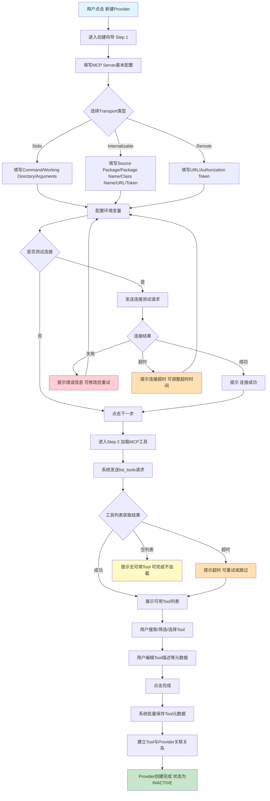
```mermaid
flowchart TD
    A[用户点击 新建Provider] --> B[进入创建向导 Step 1]
    B --> C[填写MCP Server基本配置]
    C --> D{选择Transport类型}
    D -->|Stdio| E1[填写Command/Working Directory/Arguments]
    D -->|Internalizable| E2[填写Source Package/Package Name/Class Name/URL/Token]
    D -->|Remote| E3[填写URL/Authorization Token]
    E1 --> F[配置环境变量]
    E2 --> F
    E3 --> F
    F --> G{是否测试连接}
    G -->|是| H[发送连接测试请求]
    H --> I{连接结果}
    I -->|成功| J[提示 连接成功]
    I -->|失败| K[提示错误信息 可修改后重试]
    I -->|超时| L[提示连接超时 可调整超时时间]
    K --> F
    L --> F
    G -->|否| M[点击下一步]
    J --> M
    M --> N[进入Step 2 加载MCP工具]
    N --> O[系统发送list_tools请求]
    O --> P{工具列表获取结果}
    P -->|成功| Q[展示可用Tool列表]
    P -->|超时| R[提示超时 可重试或跳过]
    P -->|空列表| S[提示无可用Tool 可完成不加载]
    R --> Q
    Q --> T[用户搜索/筛选/选择Tool]
    T --> U[用户编辑Tool描述等元数据]
    U --> V[点击完成]
    V --> W[系统批量保存Tool元数据]
    W --> X[建立Tool与Provider关联关系]
    X --> Y[Provider创建完成 状态为INACTIVE]

    style A fill:#e1f5fe
    style Y fill:#c8e6c9
    style K fill:#ffcdd2
    style L fill:#ffe0b2
    style R fill:#ffe0b2
    style S fill:#fff9c4
```

#### 3.4.2 MCP Server连接测试流程

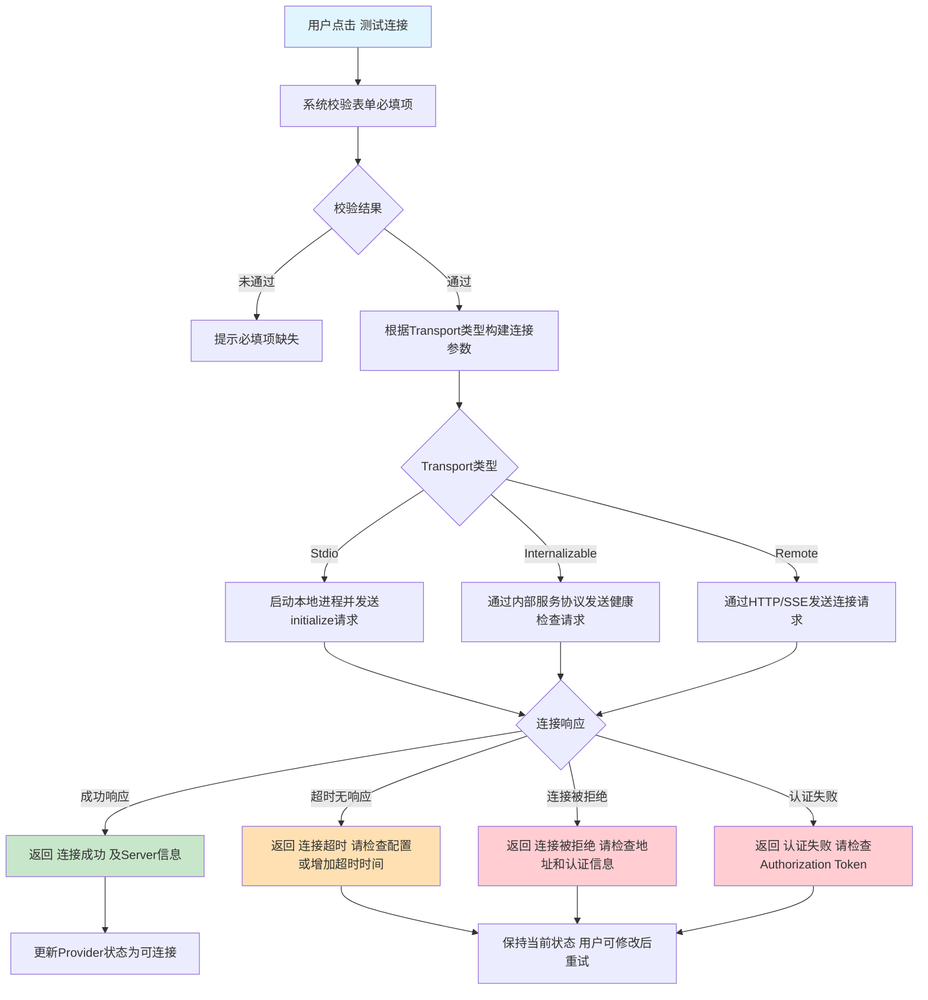
```mermaid
flowchart TD
    A[用户点击 测试连接] --> B[系统校验表单必填项]
    B --> C{校验结果}
    C -->|未通过| D[提示必填项缺失]
    C -->|通过| E[根据Transport类型构建连接参数]
    E --> F{Transport类型}
    F -->|Stdio| G1[启动本地进程并发送initialize请求]
    F -->|Internalizable| G2[通过内部服务协议发送健康检查请求]
    F -->|Remote| G3[通过HTTP/SSE发送连接请求]
    G1 --> H{连接响应}
    G2 --> H
    G3 --> H
    H -->|成功响应| I[返回 连接成功 及Server信息]
    H -->|超时无响应| J[返回 连接超时 请检查配置或增加超时时间]
    H -->|连接被拒绝| K[返回 连接被拒绝 请检查地址和认证信息]
    H -->|认证失败| L[返回 认证失败 请检查Authorization Token]
    I --> M[更新Provider状态为可连接]
    J --> N[保持当前状态 用户可修改后重试]
    K --> N
    L --> N

    style A fill:#e1f5fe
    style I fill:#c8e6c9
    style J fill:#ffe0b2
    style K fill:#ffcdd2
    style L fill:#ffcdd2
```

#### 3.4.3 工具发现与加载流程

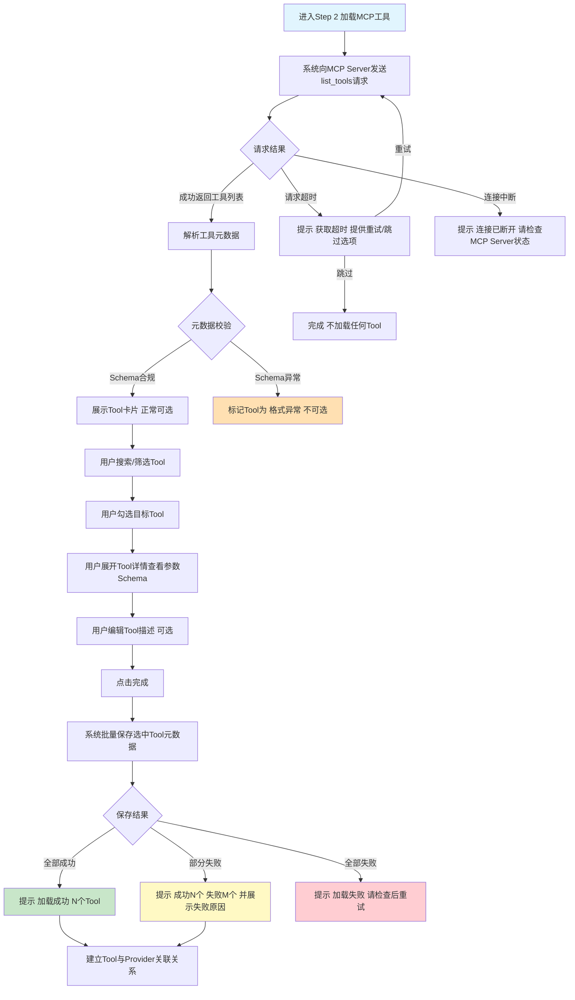
```mermaid
flowchart TD
    A[进入Step 2 加载MCP工具] --> B[系统向MCP Server发送list_tools请求]
    B --> C{请求结果}
    C -->|成功返回工具列表| D[解析工具元数据]
    C -->|请求超时| E[提示 获取超时 提供重试/跳过选项]
    C -->|连接中断| F[提示 连接已断开 请检查MCP Server状态]
    D --> G{元数据校验}
    G -->|Schema合规| H[展示Tool卡片 正常可选]
    G -->|Schema异常| I[标记Tool为 格式异常 不可选]
    E -->|重试| B
    E -->|跳过| J[完成 不加载任何Tool]
    H --> K[用户搜索/筛选Tool]
    K --> L[用户勾选目标Tool]
    L --> M[用户展开Tool详情查看参数Schema]
    M --> N[用户编辑Tool描述 可选]
    N --> O[点击完成]
    O --> P[系统批量保存选中Tool元数据]
    P --> Q{保存结果}
    Q -->|全部成功| R[提示 加载成功 N个Tool]
    Q -->|部分失败| S[提示 成功N个 失败M个 并展示失败原因]
    Q -->|全部失败| T[提示 加载失败 请检查后重试]
    R --> U[建立Tool与Provider关联关系]
    S --> U

    style A fill:#e1f5fe
    style R fill:#c8e6c9
    style S fill:#fff9c4
    style T fill:#ffcdd2
    style I fill:#ffe0b2
```

#### 3.4.4 Provider删除影响评估流程

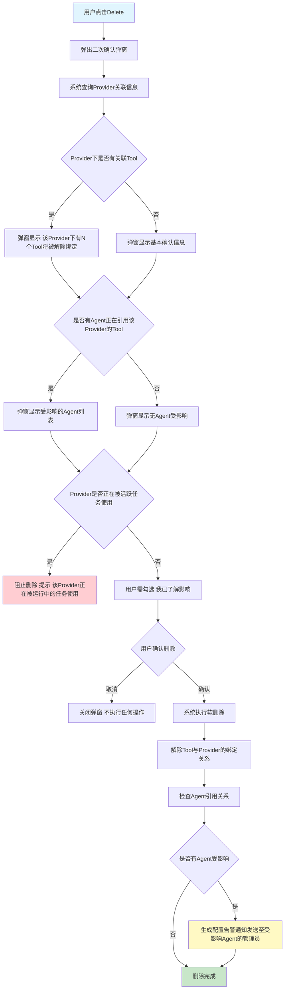
```mermaid
flowchart TD
    A[用户点击Delete] --> B[弹出二次确认弹窗]
    B --> C[系统查询Provider关联信息]
    C --> D{Provider下是否有关联Tool}
    D -->|是| E[弹窗显示 该Provider下有N个Tool将被解除绑定]
    D -->|否| F[弹窗显示基本确认信息]
    E --> G{是否有Agent正在引用该Provider的Tool}
    F --> G
    G -->|是| H[弹窗显示受影响的Agent列表]
    G -->|否| I[弹窗显示无Agent受影响]
    H --> J{Provider是否正在被活跃任务使用}
    I --> J
    J -->|是| K[阻止删除 提示 该Provider正在被运行中的任务使用]
    J -->|否| L[用户需勾选 我已了解影响]
    L --> M{用户确认删除}
    M -->|取消| N[关闭弹窗 不执行任何操作]
    M -->|确认| O[系统执行软删除]
    O --> P[解除Tool与Provider的绑定关系]
    P --> Q[检查Agent引用关系]
    Q --> R{是否有Agent受影响}
    R -->|是| S[生成配置告警通知发送至受影响Agent的管理员]
    R -->|否| T[删除完成]
    S --> T

    style A fill:#e1f5fe
    style K fill:#ffcdd2
    style T fill:#c8e6c9
    style S fill:#fff9c4
```

#### 3.4.5 AI Agent Skill 注册与渐进式披露流程

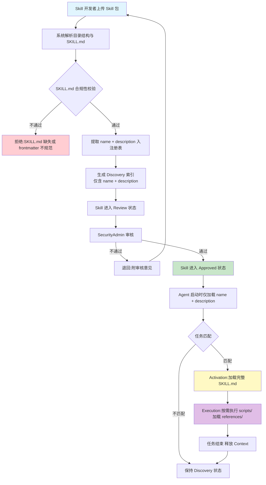
```mermaid
flowchart TD
    A[Skill 开发者上传 Skill 包] --> B[系统解析目录结构与 SKILL.md]
    B --> C{SKILL.md 合规性校验}
    C -->|不通过| D1[拒绝:SKILL.md 缺失或 frontmatter 不规范]
    C -->|通过| D2[提取 name + description 入注册表]
    D2 --> E[生成 Discovery 索引<br/>仅含 name + description]
    E --> F[Skill 进入 Review 状态]
    F --> G[SecurityAdmin 审核]
    G -->|不通过| H1[退回:附审核意见]
    H1 --> A
    G -->|通过| H2[Skill 进入 Approved 状态]
    H2 --> I[Agent 启动时仅加载 name + description]
    I --> J{任务匹配}
    J -->|不匹配| K1[保持 Discovery 状态]
    J -->|匹配| K2[Activation:加载完整 SKILL.md]
    K2 --> L[Execution:按需执行 scripts/ 加载 references/]
    L --> M[任务结束 释放 Context]
    M --> K1

    style A fill:#e1f5fe
    style D1 fill:#ffcdd2
    style H2 fill:#c8e6c9
    style K2 fill:#fff9c4
    style L fill:#e1bee7
```

#### 3.4.6 AG-UI 组件渲染与事件驱动流程

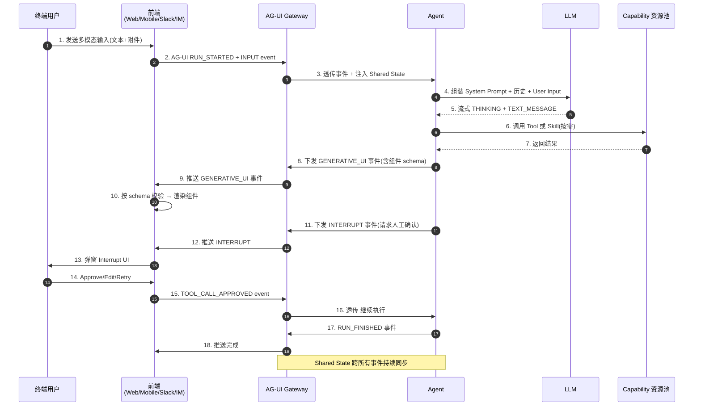
```mermaid
sequenceDiagram
    autonumber
    participant User as 终端用户
    participant Client as 前端<br/>(Web/Mobile/Slack/IM)
    participant Gateway as AG-UI Gateway
    participant Agent as Agent
    participant LLM as LLM
    participant Capability as Capability 资源池

    User->>Client: 1. 发送多模态输入(文本+附件)
    Client->>Gateway: 2. AG-UI RUN_STARTED + INPUT event
    Gateway->>Agent: 3. 透传事件 + 注入 Shared State
    Agent->>LLM: 4. 组装 System Prompt + 历史 + User Input
    LLM-->>Agent: 5. 流式 THINKING + TEXT_MESSAGE
    Agent->>Capability: 6. 调用 Tool 或 Skill(按需)
    Capability-->>Agent: 7. 返回结果
    Agent->>Gateway: 8. 下发 GENERATIVE_UI 事件(含组件 schema)
    Gateway->>Client: 9. 推送 GENERATIVE_UI 事件
    Client->>Client: 10. 按 schema 校验 → 渲染组件
    Agent->>Gateway: 11. 下发 INTERRUPT 事件(请求人工确认)
    Gateway->>Client: 12. 推送 INTERRUPT
    Client->>User: 13. 弹窗 Interrupt UI
    User->>Client: 14. Approve/Edit/Retry
    Client->>Gateway: 15. TOOL_CALL_APPROVED event
    Gateway->>Agent: 16. 透传 继续执行
    Agent->>Gateway: 17. RUN_FINISHED 事件
    Gateway->>Client: 18. 推送完成

    Note over Agent,Gateway: Shared State 跨所有事件持续同步
```

#### 3.4.7 外部 MCP Server 清单同步流程（Phase 1）

> 代码实现：`syncExternalMcpServer` mutation → `MCPHttpClient` → list_tools/resources/prompts → upsert 到本地 DB（`source="external"`）

**前置条件**：外部 MCP Server 的 `endpoint`（HTTP URL）和 `auth` 配置已保存。

**流程步骤**：
1. API 接收同步请求（含 `server_id`、可选 `namePrefix`）
2. 系统通过 `MCPHttpClient` 连接远程 MCP Server
3. 调用 `list_tools`、`list_resources`、`list_prompts` 获取远程能力清单
4. 将远程清单转换为本地 manifest 格式
5. 执行 `validate_manifest()` 校验（7+ 规则：必含功能类型、必含 name+type、Tool 必含 inputSchema 等）
6. 持久化到本地 DB，标记 `source="external"`，`class_name="ExternalMCPProxy"`
7. 清除旧缓存 + 预热新缓存
8. 返回同步结果（新增/更新/删除的工具数量）

**namePrefix 冲突避免**：当同一 partition_key 下注册多个外部 MCP Server 时，可通过 `namePrefix` 参数为工具名添加前缀，避免命名冲突。

**错误处理**：连接失败 → 返回 502 + 错误详情；校验失败 → 返回 422 + 校验错误列表。

#### 3.4.8 外部 MCP Server 代理执行流程（Phase 2）

> 代码实现：运行时检测 `source=="external"` → 内置 `ExternalMCPProxy` 适配器 → `_resolve_external_name()` → `MCPHttpClient.call_tool()`

**前置条件**：外部 MCP Server 已通过 Phase 1 完成清单同步。

**流程步骤**：
1. Agent 发起 Tool 调用请求
2. 系统检测目标 Tool 的 `source="external"`
3. 返回内置 `ExternalMCPProxy` 适配器（无需 S3 下载）
4. 通过 `_resolve_external_name()` 解析原始远程工具名（去除 namePrefix）
5. 通过 `MCPHttpClient` 转发调用到远程 MCP Server
6. 接收响应并返回给 Agent

**关键逻辑**：`_resolve_external_name()` 三步解析：
1. 检查 `data.external_name` 字段（优先）
2. 检查 `namePrefix` 前缀匹配
3. 回退到原始 `name` 字段

#### 3.4.9 包上传管道（S3 + Base64 双通道）

> 代码实现：`generateMcpPackageUploadUrl` → S3 Presigned URL → `processMcpPackage` → 校验/提取/持久化

**通道 A：S3 Presigned URL 上传（推荐）**
1. 客户端请求上传 URL → 系统生成 S3 Presigned PUT URL（15 分钟过期）
2. 客户端直接上传 ZIP 包到 S3
3. 客户端通知上传完成 → 系统调用 `processMcpPackage`
4. 下载 ZIP → 路径遍历防护 → 解压
5. 校验 `mcp_configuration.json` manifest（7+ 规则）
6. JSON Schema 归一化（camelCase → snake_case, type coercion）
7. 持久化到 DB → 清除旧缓存 + 预热新缓存

**通道 B：Base64 内联上传（备选，<4.5MB）**
1. 客户端将 ZIP 包 Base64 编码后内联提交
2. 系统解码 → 上传到 S3 → 委托 `processMcpPackage`

**Manifest 校验规则（7+）**：
1. 必须包含至少一种功能类型（tools/resources/prompts/modules）
2. 每项功能必须包含 `name` 和 `type` 字段
3. Tool 类型必须包含 `inputSchema`
4. `name` 必须匹配正则 `^[a-zA-Z][a-zA-Z0-9_-]*$`
5. `module_name` 在同一 partition_key 内必须唯一
6. `class_name` 必须存在且非空
7. `function_name` 必须存在且非空
8. 嵌套结构深度不超过 5 层

#### 3.4.10 异步工具执行架构

> 代码实现：`async_execute_tool_function()` → 后台线程 → 3s 轮询 → EmbeddedResource 引用

**执行流程**：
1. Agent 发起 Tool 调用请求
2. 系统检测 Tool 的 `is_async` 标记
3. **同步路径**（is_async=false）：直接执行 → 返回结果
4. **异步路径**（is_async=true）：
   a. 创建 FunctionCall 记录（状态=PENDING）
   b. 提交到后台线程池执行
   c. 3 秒轮询执行状态
   d. **已完成**：返回完整结果
   e. **未完成**：返回 EmbeddedResource 引用格式

**EmbeddedResource 格式**：
```json
{
  "type": "resource",
  "uri": "mcp://function-call/{function_call_uuid}",
  "text": "Tool execution in progress. Use this URI to poll results.",
  "name": "async_tool_result"
}
```

**结果查询**：客户端通过 `GET /api/v1/capabilities/tools/invocations/{function_call_uuid}` 查询最终结果（本接口通过 API Gateway 内部路由暴露，前端统一通过 GraphQL 单总线访问）。

#### 3.4.11 Skill 跨 Agent 复用与推荐流程

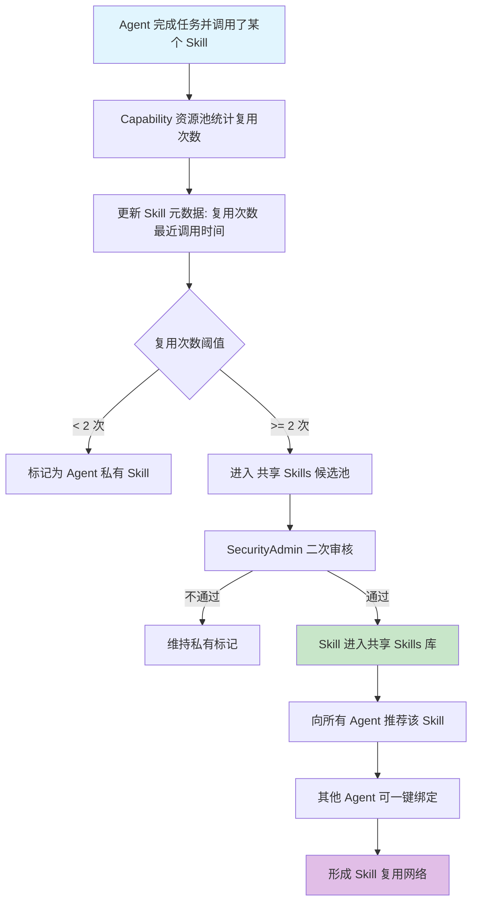
```mermaid
flowchart TD
    A[Agent 完成任务并调用了某个 Skill] --> B[Capability 资源池统计复用次数]
    B --> C[更新 Skill 元数据: 复用次数 最近调用时间]
    C --> D{复用次数阈值}
    D -->|< 2 次| E1[标记为 Agent 私有 Skill]
    D -->|>= 2 次| E2[进入 共享 Skills 候选池]
    E2 --> F[SecurityAdmin 二次审核]
    F -->|不通过| G1[维持私有标记]
    F -->|通过| G2[Skill 进入共享 Skills 库]
    G2 --> H[向所有 Agent 推荐该 Skill]
    H --> I[其他 Agent 可一键绑定]
    I --> J[形成 Skill 复用网络]

    style A fill:#e1f5fe
    style G2 fill:#c8e6c9
    style J fill:#e1bee7
```

---

## 4. 功能范围

### 4.1 功能结构树

```
能力管理模块
├── 能力列表
│   ├── Provider列表展示
│   ├── 新建Provider
│   ├── 编辑Provider
│   └── 删除Provider
├── MCP工具管理
│   ├── 工具列表展示
│   ├── 工具搜索与筛选
│   ├── 工具状态管理
│   └── 工具执行上下文查看
├── MCP工具上下文
│   ├── 工具详情查看
│   ├── 关联Runtime Logs查看
│   └── 工具参数定义查看
├── 编辑MCP工具上下文
│   ├── 基本信息编辑
│   ├── 状态切换
│   └── 时间戳查看
├── 配置MCP服务器（Step 1）
│   ├── 基本配置（名称/状态/超时/传输协议）
│   ├── Stdio传输配置
│   ├── Internalizable Connection配置
│   ├── Remote Connection配置
│   └── 环境变量配置
├── 加载MCP工具（Step 2）
│   ├── 可用工具搜索
│   ├── 工具选择与加载
│   └── 工具详情编辑
├── 工具与Agent关联管理
│   ├── 关联关系查看
│   ├── 手动绑定/解绑
│   └── 影响评估
├── AI Agent Skills 管理（新增 — 遵循 agentskills.io 规范）
│   ├── Skills 发现 Discovery
│   │   ├── 启动时仅加载 name + description
│   │   ├── Skills 注册表浏览
│   │   ├── Skills 搜索与筛选
│   │   └── Skills 分类与标签
│   ├── Skills 激活 Activation
│   │   ├── 任务匹配时加载完整 SKILL.md
│   │   ├── 动态激活策略配置
│   │   └── 激活条件规则引擎
│   ├── Skills 执行 Execution
│   │   ├── 执行指令解析
│   │   ├── 可选执行 scripts/ 代码（Sandbox 隔离）
│   │   ├── 可选加载 references/ 文档
│   │   └── 上下文窗口回收
│   ├── Skills 注册与审核
│   │   ├── Skills 提交注册
│   │   ├── 审核工作流（SecurityAdmin）
│   │   ├── 状态：Draft / Review / Approved / Published / Deprecated / Archived
│   │   └── 审核意见与反馈
│   ├── Skills 版本管理
│   │   ├── SemVer 版本号规范
│   │   ├── 版本历史与变更日志
│   │   ├── 灰度发布与回滚
│   │   └── 兼容性矩阵
│   └── Skills 跨 Agent 复用
│       ├── 共享 Skills 库
│       ├── Agent-Skill 绑定关系
│       ├── 复用权限控制
│       └── 复用统计与推荐
└── AG-UI 式 UI 组件管理（新增 — 遵循 docs.ag-ui.com 协议）
    ├── 生成式 UI 组件 Generative UI
    │   ├── 组件模板库（Static）
    │   ├── 声明式组件（Declarative）
    │   ├── 组件参数配置
    │   └── 组件 schema 校验
    ├── 事件驱动 UI 协议 Event-driven Protocol
    │   ├── AG-UI 事件类型定义
    │   ├── 事件订阅与发布
    │   ├── 事件处理流程
    │   └── 自定义事件扩展
    ├── 多轮会话 UI 状态管理 State Management
    │   ├── 会话状态机
    │   ├── Shared State 共享存储
    │   ├── 状态持久化
    │   └── 状态恢复机制
    ├── 结构化 + 非结构化 IO 混合渲染 Multimodal IO
    │   ├── 结构化数据组件
    │   ├── 文本/语音/图像混合
    │   ├── 多模态附件预览
    │   └── 混合布局引擎
    ├── 子 Agent 递归调用 UI 嵌套 Sub-agents
    │   ├── 嵌套 UI 容器
    │   ├── 递归深度控制
    │   ├── 嵌套层级可视化
    │   └── 局部状态隔离
    └── 客户端适配（Web / Mobile / Slack / IM）
        ├── 客户端类型检测
        ├── 响应式布局适配
        ├── 平台特定组件映射
        └── 渐进式降级
```

### 4.2 MoSCoW优先级表

| 功能 | 优先级 | 说明 |
|------|--------|------|
| 能力列表 - Provider列表展示 | **Must** | 核心功能，Provider管理的基础视图 |
| 新建Provider | **Must** | 核心功能，支持创建新的能力提供者 |
| 编辑Provider | **Must** | 核心功能，支持修改Provider配置 |
| 删除Provider | **Must** | 核心功能，支持移除不再使用的Provider |
| 配置MCP服务器 - Step 1 | **Must** | 核心功能，MCP Server接入的必要步骤 |
| 加载MCP工具 - Step 2 | **Must** | 核心功能，从MCP Server发现和加载Tool |
| MCP工具管理 - 工具列表 | **Must** | 核心功能，Tool管理的入口视图 |
| MCP工具上下文 - 详情查看 | **Should** | 重要功能，帮助用户理解Tool能力 |
| 编辑MCP工具上下文 | **Should** | 重要功能，支持Tool元数据修改 |
| 关联Runtime Logs查看 | **Should** | 重要功能，支持运行时调试和监控 |
| 工具搜索与筛选 | **Should** | 重要功能，提升Tool发现效率 |
| 工具与Agent关联管理 | **Should** | 重要功能，管理Tool与Agent的绑定关系 |
| 环境变量配置 | **Could** | 增强功能，支持敏感信息的安全注入 |
| Internalizable Connection | **Could** | 增强功能，支持内部Java服务接入 |
| Provider健康检查 | **Could** | 增强功能，自动监控Provider运行状态 |
| **AI Agent Skills — 启动时 Discovery 索引** | **Must** | 启动仅加载 name+description；Context Window 节省关键 |
| **AI Agent Skills — 任务匹配 Activation** | **Must** | 任务命中时加载完整 SKILL.md，渐进式披露核心 |
| **AI Agent Skills — SKILL.md 注册与审核** | **Must** | SKILL.md frontmatter 合规 + SecurityAdmin 审核 |
| **AI Agent Skills — SemVer 版本管理** | **Must** | 语义化版本号 + 灰度 + 回滚 |
| **AI Agent Skills — Sandbox 隔离执行** | **Must** | scripts/ 在隔离环境执行，防越权访问 |
| **AI Agent Skills — 跨 Agent 复用库** | **Should** | 共享 Skills 库 + 一键绑定 |
| **AI Agent Skills — 复用统计与推荐** | **Could** | 复用次数 ≥ 2 自动入共享候选池 |
| **AG-UI 协议 — GENERATIVE_UI 事件下发** | **Must** | Agent 下发组件 schema，前端按 schema 渲染 |
| **AG-UI 协议 — 事件总线（RUN_*/TEXT_*/TOOL_*）** | **Must** | AG-UI 14 类标准事件类型必须全部支持 |
| **AG-UI 协议 — Shared State 共享存储** | **Must** | 前后端类型化共享 store，事件源式 diff |
| **AG-UI 协议 — INTERRUPT 中断与恢复** | **Must** | Human-in-the-Loop 暂停/审批/编辑/重试 |
| **AG-UI 协议 — 多模态附件（文件/图片/音频）** | **Should** | 类型化附件 + 实时媒体支持 |
| **AG-UI 协议 — THINKING 可视化** | **Should** | 中间推理过程可视化（不暴露原始 CoT） |
| **AG-UI 协议 — Sub-agents 嵌套 UI 容器** | **Should** | 递归委派时嵌套 UI + 深度控制 |
| **AG-UI 协议 — 客户端适配（Web/Mobile/Slack/IM）** | **Should** | 客户端类型检测 + 平台特定组件映射 |
| **AG-UI 协议 — Agent Steering 实时重定向** | **Could** | 运行时动态修改 Agent 行为 |
| **AG-UI 协议 — Tool Output Streaming** | **Could** | 工具结果流式渲染 |
| **AG-UI 协议 — Custom Events 自定义事件** | **Could** | 协议未覆盖场景的开放扩展 |

---

## 5. 功能详情

### 5.1 能力列表

#### 5.1.1 Provider列表展示

**用户故事**：作为平台管理员，我希望查看系统中所有已注册的Provider列表及其关键信息，以便在5秒内快速了解Capability资源池的整体状况和各Provider的健康状态。

**前置条件**：
- 用户已登录系统并具有"能力管理"模块的查看权限
- 系统中至少存在一个已注册的Provider

**后置条件**：
- 列表页面正确展示所有Provider的核心字段信息
- 支持按字段排序和分页浏览

**主流程**：
1. 用户进入"能力管理"模块，默认展示"能力列表"页面
2. 系统查询所有已注册的Provider记录
3. 列表以表格形式展示以下字段：
   - **Provider Name**：能力提供者名称，支持点击跳转至详情页
   - **Transport**：传输协议类型，以标签形式展示（Stdio / Internalizable / Remote）
   - **Timeout**：超时时间（单位：秒），如"30s"
   - **Status**：运行状态，以状态徽标展示（ACTIVE-绿色 / INACTIVE-灰色 / UNHEALTHY-红色 / DEGRADED-黄色 / DISABLED-暗灰）
   - **操作列**：包含Edit、Delete、Tools三个操作按钮
4. 列表支持按Provider Name正序/倒序排列
5. 列表支持分页，默认每页展示20条记录

**分支流程**：
- **分支A - 无Provider记录**：列表区域显示空状态插图和"暂无Provider，点击新建"引导按钮
- **分支B - Provider状态异常**：Status列显示红色UNHEALTHY徽标，鼠标悬停显示错误摘要信息

**异常流程**：
- **异常A - 查询超时**：系统展示加载失败提示，提供"重试"按钮
- **异常B - 权限不足**：页面展示"无权限访问"提示，引导联系管理员

**交互说明**：
- 列表行支持hover高亮效果
- Tools按钮点击后展开下拉面板，展示该Provider下所有已加载的Tool列表
- 删除操作需二次确认弹窗

**验收标准**：
- AC1：列表正确展示Provider Name、Transport、Timeout、Status四个字段，数据与数据库一致，偏差率为0%
- AC2：Status字段使用颜色编码区分五种状态（ACTIVE-绿色 / INACTIVE-灰色 / DEGRADED-黄色 / UNHEALTHY-红色 / DISABLED-暗灰），颜色对比度≥4.5:1
- AC3：点击Tools按钮后，下拉面板在500ms内完成加载并展示Tool列表
- AC4：列表支持分页，切换页码后数据正确刷新，每页默认展示20条记录
- AC5：无数据时展示空状态引导界面，引导按钮可点击跳转至创建页面

---

#### 5.1.2 新建Provider

**用户故事**：作为平台管理员，我希望通过两步式向导流程创建新的Provider并配置MCP Server，以便在3分钟内将新的外部Tool接入系统Capability资源池。

**前置条件**：
- 用户已登录并具有"能力管理"的创建权限
- 当前无正在进行的Provider创建流程

**后置条件**：
- 新Provider记录写入数据库，状态默认为INACTIVE
- MCP Server配置信息持久化存储
- 如完成Step 2，则已加载的Tool关联至该Provider

**主流程**：
1. 用户在能力列表页点击"新建Provider"按钮
2. 系统打开创建向导弹窗/页面，进入Step 1 - 配置MCP服务器
3. 用户填写MCP Server配置信息（详见5.5节）
4. 用户点击"下一步"，系统验证配置信息合法性
5. 系统进入Step 2 - 加载MCP工具（详见5.6节）
6. 用户完成Tool选择和编辑后，点击"完成"
7. 系统保存Provider记录和Tool关联关系
8. 页面返回能力列表，新Provider出现在列表中，状态为INACTIVE

**分支流程**：
- **分支A - 仅完成Step 1**：用户在Step 1点击"保存草稿"，Provider以INACTIVE状态保存，Tool列表为空
- **分支B - 连接测试失败**：Step 1中点击"测试连接"失败，系统提示具体错误信息，用户可修改配置后重试

**异常流程**：
- **异常A - Provider名称重复**：系统在Step 1实时校验名称唯一性，重复时输入框下方显示红色提示"该Provider名称已存在"
- **异常B - 保存失败**：系统提示"保存失败，请稍后重试"，保留用户已填写的表单数据

**交互说明**：
- 创建向导采用两步式布局，顶部显示步骤进度条（Step 1/Step 2）
- Step 1和Step 2之间支持前后切换，已填写数据自动保留
- 每个步骤底部提供"上一步"、"保存草稿"、"下一步/完成"操作按钮

**验收标准**：
- AC1：点击"新建Provider"后，向导在1秒内完成渲染
- AC2：Step 1必填字段（MCP Server Name、Transport）未填写时，"下一步"按钮置灰不可点击
- AC3：Provider名称全局唯一（不区分大小写），重复时实时提示，校验响应时间≤300ms
- AC4：保存成功后，列表页新增对应记录，字段信息与用户填写一致，偏差率为0%
- AC5：草稿保存后，Provider状态为INACTIVE，Tool数量为0

---

#### 5.1.3 编辑Provider

**用户故事**：作为平台管理员，我希望修改已有Provider的配置信息（如Transport类型、连接地址、超时时间等），以便在MCP Server发生变更时无需删除重建即可完成配置更新。

**前置条件**：
- 用户已登录并具有"能力管理"的编辑权限
- 目标Provider存在且未被系统锁定

**后置条件**：
- Provider配置信息更新至数据库
- 如修改了连接配置，系统重新建立与MCP Server的连接

**主流程**：
1. 用户在Provider列表中点击目标行的"Edit"按钮
2. 系统打开编辑页面，回填当前Provider的配置信息
3. 用户修改需要变更的字段
4. 用户点击"保存"
5. 系统校验修改后的配置合法性
6. 系统更新数据库记录
7. 如Transport或连接地址变更，系统异步重新连接MCP Server
8. 页面返回列表，更新后的信息即时反映

**分支流程**：
- **分支A - 修改Transport类型**：切换Transport后，对应的连接配置区域动态切换（如从Stdio切换至Remote，Stdio配置区隐藏，Remote配置区展示）
- **分支B - Provider处于Active状态时编辑**：系统提示"修改配置将导致短暂的服务中断，是否继续？"

**异常流程**：
- **异常A - 连接测试失败**：保存时系统自动测试新配置的连通性，失败则阻止保存并提示具体错误
- **异常B - 并发编辑冲突**：如另一用户正在编辑同一Provider，系统提示"该Provider正在被其他用户编辑，请稍后再试"

**交互说明**：
- 编辑页面复用创建向导的Step 1布局
- 修改后的字段高亮显示变更标记
- 保存按钮在提交期间显示loading状态，防止重复提交

**验收标准**：
- AC1：编辑页面正确回填所有已有配置信息，回填准确率100%
- AC2：修改Transport类型后，连接配置区域在300ms内完成动态切换
- AC3：保存成功后列表信息即时更新，延迟≤1秒
- AC4：连接测试失败的配置不允许保存，错误提示信息明确
- AC5：并发编辑时正确提示冲突，冲突检测响应时间≤500ms

---

#### 5.1.4 删除Provider

**用户故事**：作为平台管理员，我希望在删除Provider前系统能完整展示其影响范围（关联Tool数量、受影响Agent列表），以便做出知情的删除决策，避免误删导致Agent功能异常。

**前置条件**：
- 用户已登录并具有"能力管理"的删除权限
- 目标Provider存在

**后置条件**：
- Provider记录从数据库中软删除
- 关联的Tool记录解除与该Provider的绑定关系
- 已引用该Provider Tool的Agent收到配置告警通知

**主流程**：
1. 用户在Provider列表中点击目标行的"Delete"按钮
2. 系统弹出二次确认弹窗，显示Provider名称和关联信息
3. 用户确认删除
4. 系统执行软删除操作
5. 系统解除该Provider下所有Tool的绑定关系
6. 系统检查是否有Agent正在引用该Provider的Tool
7. 如有引用，系统生成配置告警通知
8. 页面返回列表，该Provider不再显示

**分支流程**：
- **分支A - Provider下有关联Tool**：确认弹窗中额外显示"该Provider下有N个Tool将被解除绑定"的警告信息
- **分支B - Provider正在被Agent使用**：确认弹窗中显示受影响的Agent列表，用户需勾选"我已了解影响"后方可确认

**异常流程**：
- **异常A - Provider正在被活跃任务使用**：系统阻止删除，提示"该Provider正在被运行中的任务使用，请等待任务完成后再删除"

**交互说明**：
- 删除确认弹窗采用警告样式（红色边框/图标）
- 弹窗中清晰展示删除影响的范围
- 删除操作支持"取消"退出

**验收标准**：
- AC1：点击Delete后1秒内弹出确认弹窗，展示Provider名称和关联统计（Tool数量、Agent引用数量）
- AC2：确认删除后，Provider从列表中移除，列表刷新延迟≤1秒
- AC3：关联的Tool正确解除绑定关系，解除后Tool状态变更为Unavailable
- AC4：被Agent引用时，弹窗展示受影响Agent列表，包含Agent名称和引用Tool数量
- AC5：活跃任务使用中时，阻止删除并给出明确提示，不允许绕过

---

### 5.2 MCP工具管理

#### 5.2.1 工具列表展示

**用户故事**：作为Agent开发者，我希望查看系统中所有已加载的MCP Tool列表及其状态，以便在10秒内快速定位可用Tool并了解其运行状况。

**前置条件**：
- 用户已登录并具有"MCP工具管理"的查看权限
- 系统中至少存在一个已加载的MCP Tool

**后置条件**：
- Tool列表正确展示所有Tool的核心信息

**主流程**：
1. 用户进入"MCP工具管理"页面
2. 系统查询所有已加载的MCP Tool记录
3. 列表以表格形式展示以下字段：
   - **Tool Name**：Tool名称，如"csv_parser"、"json_extractor"、"pdf_generator"
   - **Description**：Tool功能描述，如"Parse CSV files into structured data"
   - **Status**：Tool状态（Available-绿色 / Unavailable-红色 / Configuring-黄色）
   - **操作列**：包含Config（配置）、Execution Context（执行上下文）两个操作按钮
4. 列表支持按Tool Name、Status筛选
5. 列表支持关键词搜索（匹配Tool Name和Description）

**分支流程**：
- **分支A - 无Tool记录**：展示空状态插图和"请先配置MCP Server并加载Tool"引导文案
- **分支B - 部分Tool不可用**：Unavailable状态的工具行显示警告图标，鼠标悬停展示不可用原因

**异常流程**：
- **异常A - Tool状态查询超时**：列表展示数据，但Status列显示"检测中"状态，后台异步更新

**交互说明**：
- 搜索框支持实时搜索（输入防抖300ms）
- Config按钮点击后跳转至编辑MCP工具上下文页面
- Execution Context按钮点击后展开侧边面板，展示Tool执行上下文信息

**验收标准**：
- AC1：列表正确展示Tool Name、Description、Status三个字段，数据与数据库一致
- AC2：Status使用颜色编码区分三种状态，颜色对比度≥4.5:1
- AC3：搜索功能在输入后500ms内返回结果，结果准确率100%
- AC4：Config按钮正确跳转至编辑页面，跳转延迟≤500ms
- AC5：Execution Context按钮正确展开侧边面板，面板渲染延迟≤300ms

---

#### 5.2.2 工具状态管理

**用户故事**：作为平台管理员，我希望启用或禁用特定的MCP Tool，以便在不删除Tool的情况下控制其可用性，并在禁用时明确了解受影响的Agent范围。

**前置条件**：
- 用户已登录并具有Tool状态管理的权限
- 目标Tool存在

**后置条件**：
- Tool状态更新为用户指定的状态
- 状态变更事件通知到所有订阅该Tool的Agent

**主流程**：
1. 用户在Tool列表中点击目标Tool的Status切换开关
2. 系统弹出状态变更确认（仅从Available切换至Unavailable时）
3. 用户确认变更
4. 系统更新Tool状态
5. 系统发布状态变更事件
6. 列表中Tool状态即时更新

**分支流程**：
- **分支A - 批量状态切换**：用户勾选多个Tool后，点击批量操作栏的"启用"/"禁用"按钮
- **分支B - Tool被Agent引用时禁用**：系统提示"N个Agent正在使用该Tool，禁用后相关功能将不可用"

**异常流程**：
- **异常A - 状态切换失败**：系统提示"状态切换失败"，保留原状态

**验收标准**：
- AC1：状态切换开关交互流畅，响应时间不超过500ms
- AC2：禁用确认弹窗正确展示受影响Agent数量和名称列表
- AC3：状态变更后列表即时刷新，刷新延迟≤500ms
- AC4：批量操作支持同时切换最多50个Tool状态

---

### 5.3 MCP工具上下文

#### 5.3.1 工具详情查看

**用户故事**：作为Agent开发者，我希望查看MCP Tool的完整详细信息（包括参数定义、返回值结构、使用示例等），以便准确理解Tool的输入输出规范，避免在Agent工作流中集成时出现参数错误。

**前置条件**：
- 用户已登录并具有Tool详情的查看权限
- 目标Tool存在

**后置条件**：
- Tool详情页面正确展示完整信息

**主流程**：
1. 用户在Tool列表中点击目标Tool的Tool Name链接
2. 系统打开Tool详情页面，展示以下信息：
   - **基本信息区**：Tool Name、Description、所属Provider、Status、创建时间、更新时间
   - **参数定义区**：以JSON Schema格式展示Tool的输入参数定义（参数名、类型、是否必填、默认值、描述）
   - **返回值结构**：以JSON示例格式展示Tool的返回数据结构
   - **使用示例**：展示Tool调用的示例代码/请求
   - **关联Runtime Logs**：展示该Tool最近的调用日志列表（时间、调用者、状态、耗时）
3. 用户可点击Runtime Logs中的某条记录查看详细日志

**分支流程**：
- **分支A - Tool无调用记录**：Runtime Logs区域显示"暂无调用记录"
- **分支B - Tool参数定义复杂**：参数定义区支持折叠/展开嵌套对象

**异常流程**：
- **异常A - Tool详情加载失败**：页面展示错误提示和"重试"按钮

**交互说明**：
- 参数定义区使用代码高亮格式展示JSON Schema
- Runtime Logs列表支持分页，默认展示最近20条
- 页面顶部提供"返回列表"导航

**验收标准**：
- AC1：Tool详情页正确展示所有基本信息字段，字段完整率100%
- AC2：参数定义以标准JSON Schema格式展示，支持语法高亮
- AC3：返回值结构以JSON示例展示，格式正确率100%
- AC4：Runtime Logs列表按时间倒序排列，展示最近20条记录
- AC5：页面加载时间不超过2秒（P95）

---

#### 5.3.2 关联Runtime Logs查看

**用户故事**：作为运维工程师，我希望查看特定MCP Tool的运行时调用日志（包括请求参数、响应结果、错误信息和调用链路追踪ID），以便在5分钟内定位Tool调用异常的根因。

**前置条件**：
- 用户已登录并具有Runtime Logs的查看权限
- 目标Tool存在且有调用记录

**后置条件**：
- Runtime Logs列表正确展示历史调用记录

**主流程**：
1. 用户在Tool详情页的Runtime Logs区域查看日志列表
2. 列表展示以下字段：
   - **调用时间**：精确到秒的时间戳
   - **调用者**：发起调用的Agent名称或用户标识
   - **调用状态**：Success（绿色）/ Failed（红色）/ Timeout（橙色）
   - **耗时**：Tool执行耗时（毫秒）
   - **操作**：查看详情按钮
3. 用户点击某条日志的"查看详情"
4. 系统展示完整调用信息：
   - 请求参数（JSON格式）
   - 响应结果（JSON格式）
   - 错误信息（如有）
   - 调用链路追踪ID

**分支流程**：
- **分支A - 按状态筛选日志**：用户可点击状态标签筛选特定状态的日志
- **分支B - 按时间范围筛选**：用户可选择时间范围过滤日志

**异常流程**：
- **异常A - 日志查询超时**：提示"日志查询超时，请缩小时间范围后重试"

**验收标准**：
- AC1：Runtime Logs列表正确展示调用时间、调用者、状态、耗时四个字段
- AC2：日志详情页完整展示请求参数、响应结果和错误信息，字段完整率100%
- AC3：支持按状态和时间范围筛选，筛选结果准确率100%
- AC4：日志列表按时间倒序排列
- AC5：调用链路追踪ID可点击跳转至全链路追踪页面

---

### 5.4 编辑MCP工具上下文

**用户故事**：作为平台管理员，我希望编辑MCP Tool的元数据信息（描述、状态等），以便优化Tool的可读性，使Agent开发者能更准确地理解Tool的用途和使用方式。

**前置条件**：
- 用户已登录并具有Tool编辑权限
- 目标Tool存在

**后置条件**：
- Tool元数据更新至数据库
- 变更记录写入审计日志

**主流程**：
1. 用户在Tool列表中点击目标Tool的"Config"按钮
2. 系统打开编辑MCP工具上下文页面，展示可编辑字段：
   - **Name**：Tool名称（文本输入框，只读，来源于MCP Server注册信息）
   - **Description**：Tool描述（多行文本框，可编辑）
   - **Status**：Tool状态（下拉选择：Available / Unavailable）
   - **Updated At**：最后更新时间（只读，自动生成）
   - **Created At**：创建时间（只读，自动生成）
3. 用户修改Description或Status
4. 用户点击"保存"
5. 系统校验输入合法性
6. 系统更新数据库记录
7. 系统记录审计日志（操作人、操作时间、变更内容）
8. 页面返回Tool列表，更新后的信息即时反映

**分支流程**：
- **分支A - 修改Tool状态为Unavailable**：系统提示"禁用后，引用该Tool的Agent将无法调用"
- **分支B - Description为空**：用户清空Description后，系统提示"描述不能为空"

**异常流程**：
- **异常A - 保存失败**：系统提示"保存失败，请稍后重试"，保留用户修改内容

**交互说明**：
- Name和Created At/Updated At字段以只读样式展示（灰色背景）
- Description文本框支持最多500字符输入，右下角显示剩余字符数
- 保存按钮在未修改时置灰不可点击

**验收标准**：
- AC1：编辑页面正确回填所有字段信息，回填准确率100%
- AC2：Name字段为只读，不可修改，修改操作无响应
- AC3：Description字段限制500字符，超限时实时提示剩余字符数
- AC4：保存成功后列表信息即时更新，延迟≤1秒
- AC5：审计日志正确记录变更内容，包含操作人、操作时间、变更前后值

---

### 5.5 配置MCP服务器（Step 1）

**用户故事**：作为平台管理员，我希望通过结构化的配置界面添加新的MCP Server，并根据不同的Transport类型填写对应的连接参数，以便将外部Tool接入系统Capability资源池而无需理解底层协议细节。

**前置条件**：
- 用户正在新建Provider或编辑已有Provider
- 用户已进入创建向导的Step 1

**后置条件**：
- MCP Server配置信息通过合法性校验
- 系统可基于该配置建立与MCP Server的连接

**主流程**：
1. 系统展示MCP Server配置表单，包含以下区域：

   **A. 基本配置区**
   - **MCP Server Name**：必填，文本输入，全局唯一
   - **Status**：下拉选择（ACTIVE / INACTIVE），默认INACTIVE
   - **Timeout**：数字输入（单位：秒），默认30秒，范围1-300
   - **Transport**：单选（Stdio / Internalizable Connection / Remote Connection）

   **B. 传输协议配置区（根据Transport选择动态展示）**

   **B1. Stdio配置（Transport = Stdio时展示）**
   - **Command**：必填，启动MCP Server的命令（如"npx"、"python"）
   - **Working Directory**：选填，工作目录路径
   - **Arguments**：选填，命令行参数，支持多个参数（标签式输入）

   **B2. Internalizable Connection配置（Transport = Internalizable时展示）**
   - **Source Package**：必填，源包标识
   - **Package Name**：必填，包名称
   - **Class Name**：必填，实现类全限定名
   - **URL**：必填，服务地址
   - **Authorization Token**：选填，授权令牌（密码输入框，支持显示/隐藏切换）

   **B3. Remote Connection配置（Transport = Remote时展示）**
   - **URL**：必填，远程MCP Server地址（如"https://mcp.example.com/api"）
   - **Authorization Token**：选填，授权令牌（密码输入框）

   **C. 环境变量配置区**
   - 支持添加多组Key-Value环境变量
   - Key和Value均为文本输入
   - 支持删除已添加的变量组

2. 用户填写配置信息
3. 用户点击"测试连接"按钮（可选）
4. 系统根据配置尝试连接MCP Server
5. 连接成功，系统提示"连接成功"
6. 用户点击"下一步"进入Step 2

**分支流程**：
- **分支A - Transport切换**：用户切换Transport类型，对应的配置区域动态切换，已填写的其他Transport数据保留（切换回来时恢复）
- **分支B - 测试连接超时**：使用配置的Timeout值作为测试超时时间，超时后提示"连接超时，请检查配置或增加超时时间"
- **分支C - Stdio Arguments多参数**：用户输入参数后按回车添加为标签，每个标签支持单独删除

**异常流程**：
- **异常A - 必填字段为空**：对应输入框下方显示红色提示"此字段为必填项"
- **异常B - URL格式不合法**：URL输入框下方显示"请输入合法的URL地址"
- **异常C - MCP Server Name重复**：实时校验，输入框下方显示"该名称已存在"
- **异常D - 测试连接被拒绝**：提示"连接被拒绝，请检查地址和认证信息"

**交互说明**：
- Transport选择使用卡片式单选组件，每个选项包含图标和简短说明
- 环境变量区域支持动态添加/删除行
- "测试连接"按钮在测试期间显示loading动画
- Authorization Token字段默认隐藏内容，点击眼睛图标切换显示

**验收标准**：
- AC1：基本配置区四个字段正确展示，MCP Server Name为必填，未填写时"下一步"按钮置灰
- AC2：选择Stdio时展示Command、Working Directory、Arguments三个字段，字段展示延迟≤300ms
- AC3：选择Internalizable时展示Source Package、Package Name、Class Name、URL、Authorization Token五个字段
- AC4：选择Remote时展示URL、Authorization Token两个字段
- AC5：Transport切换后，配置区域在300ms内完成动态切换
- AC6：测试连接功能正确反映连接结果（成功/失败/超时），结果准确率100%
- AC7：环境变量支持添加和删除，Key不允许重复，重复时实时提示
- AC8：所有必填字段未填写时，"下一步"按钮置灰不可点击

---

### 5.6 加载MCP工具（Step 2）

**用户故事**：作为平台管理员，我希望从已配置的MCP Server中发现、预览和选择需要加载的Tool，以便将外部Capability纳入系统资源池，并能在加载前预览Tool的参数定义和返回值结构。

**前置条件**：
- 用户已完成Step 1配置且连接测试通过（或跳过测试）
- MCP Server当前可访问

**后置条件**：
- 用户选中的Tool被加载到系统Capability资源池中
- Tool元数据（名称、描述、参数定义）持久化存储

**主流程**：
1. 系统进入Step 2，自动向MCP Server发送Tool发现请求（list_tools）
2. 页面展示加载动画："正在从MCP Server获取可用Tool..."
3. MCP Server返回可用Tool列表
4. 页面展示可用Tool列表，每个Tool卡片包含：
   - **Tool Name**：Tool名称
   - **Description**：功能描述（截断至100字符，点击展开全文）
   - **选择框**：复选框，默认全选
5. 页面顶部提供搜索框，支持按Tool Name和Description关键词搜索
6. 用户可通过搜索筛选需要的Tool
7. 用户点击某个Tool卡片展开详情面板，展示：
   - 完整Description
   - 输入参数Schema（JSON格式）
   - 返回值Schema（JSON格式）
   - 可编辑字段：Description（可修改为更友好的描述）
8. 用户选择需要加载的Tool（勾选复选框）
9. 用户点击"完成"
10. 系统批量保存选中Tool的元数据
11. 系统建立Tool与Provider的关联关系
12. 向导关闭，返回能力列表页

**分支流程**：
- **分支A - Tool发现请求超时**：页面提示"Tool列表获取超时"，提供"重试"和"跳过（不加载Tool）"两个选项
- **分支B - MCP Server返回空Tool列表**：页面展示"该MCP Server未暴露任何Tool"，提供"完成（不加载Tool）"按钮
- **分支C - 部分Tool加载失败**：系统展示加载结果摘要："成功加载N个Tool，M个Tool加载失败"，失败Tool以红色标记并展示失败原因
- **分支D - 取消加载**：用户点击"取消"，系统不保存任何Tool，返回Step 1

**异常流程**：
- **异常A - MCP Server连接中断**：Tool发现过程中连接断开，页面提示"连接已断开，请检查MCP Server状态"
- **异常B - Tool元数据格式异常**：某个Tool的参数Schema不符合规范，该Tool卡片标记为"格式异常"，不可选择

**交互说明**：
- Tool卡片采用网格布局（每行2-3个卡片）
- 搜索框实时过滤（防抖300ms），无匹配结果时展示"未找到匹配Tool"
- Tool详情面板以侧边抽屉形式展开
- 已选Tool数量实时显示在"完成"按钮旁："完成（已选N个Tool）"

**验收标准**：
- AC1：进入Step 2后，系统在5秒内完成Tool发现请求（P95）
- AC2：Tool列表正确展示Tool Name和Description，展示准确率100%
- AC3：搜索功能支持按名称和描述关键词过滤，搜索结果准确率100%
- AC4：点击Tool卡片可展开详情面板，展示参数Schema，面板渲染延迟≤500ms
- AC5：Description字段可编辑修改，修改后保存成功
- AC6：勾选Tool后点击"完成"，Tool成功加载到系统，加载成功率≥95%
- AC7：加载结果摘要正确展示成功和失败数量，统计准确率100%
- AC8：取消操作不保存任何数据，数据库无新增记录

---

### 5.7 工具与Agent关联关系管理

**用户故事**：作为Agent开发者，我希望查看和管理Tool与Agent之间的关联关系，以便了解哪些Agent正在使用特定Tool，避免在禁用或删除Tool时导致Agent功能异常。

**前置条件**：
- 用户已登录并具有Tool关联管理的查看权限
- 目标Tool存在

**后置条件**：
- 关联关系信息正确展示

**主流程**：
1. 用户在Tool详情页查看"关联Agent"区域
2. 系统展示与该Tool关联的Agent列表，包含以下字段：
   - **Agent Name**：Agent名称，支持点击跳转至Agent详情页
   - **Bind Type**：绑定类型（auto-自动关联 / manual-手动绑定）
   - **Bind Time**：绑定时间
   - **Access Count**：[TBD-产品决策] Agent调用该Tool的次数 —— 依据：用于评估Tool对Agent的价值和依赖程度
   - **Last Access Time**：[TBD-产品决策] Agent最后调用该Tool的时间 —— 依据：用于识别长期未使用的关联关系
3. 用户可点击"手动绑定"按钮，选择需要绑定该Tool的Agent
4. 用户可点击"解除绑定"按钮，解除Agent与Tool的关联关系

**分支流程**：
- **分支A - 无关联Agent**：展示"暂无Agent使用该Tool"
- **分支B - 解除绑定被Agent引用的Tool**：系统提示"该Agent正在使用此Tool，解除绑定后相关功能将不可用"

**异常流程**：
- **异常A - 绑定操作失败**：系统提示"绑定失败，请稍后重试"

**验收标准**：
- AC1：关联Agent列表正确展示Agent Name、Bind Type、Bind Time字段
- AC2：手动绑定操作成功后，关联列表即时刷新，延迟≤1秒
- AC3：解除绑定操作需二次确认，确认后关联关系正确移除
- AC4：[TBD-产品决策] Access Count和Last Access Time字段准确反映Agent调用统计 —— 依据：调用统计需与Runtime Logs数据一致

---

### 5.8 状态转换图

#### 5.8.1 Provider状态转换

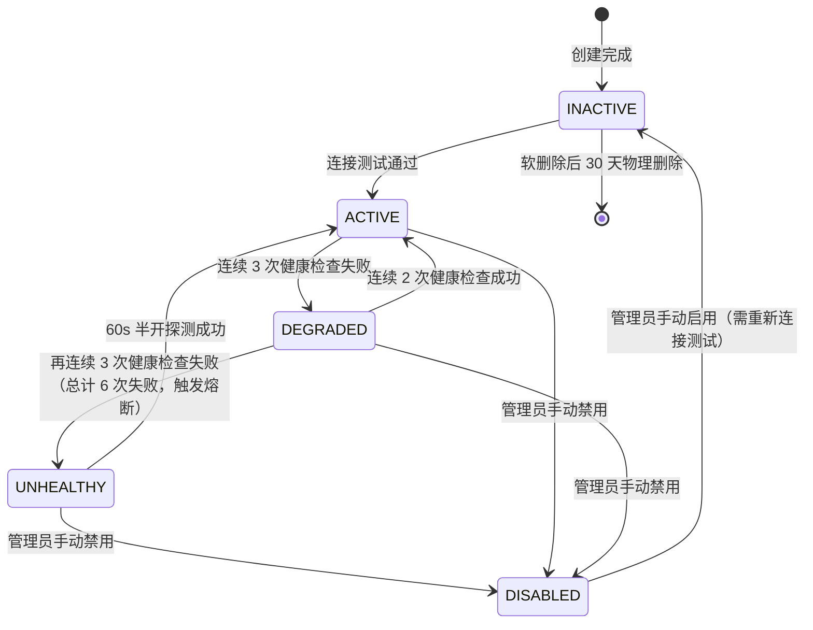
```mermaid
stateDiagram-v2
    [*] --> INACTIVE: 创建完成
    INACTIVE --> ACTIVE: 连接测试通过
    ACTIVE --> DEGRADED: 连续 3 次健康检查失败
    DEGRADED --> ACTIVE: 连续 2 次健康检查成功
    DEGRADED --> UNHEALTHY: 再连续 3 次健康检查失败（总计 6 次失败，触发熔断）
    UNHEALTHY --> ACTIVE: 60s 半开探测成功
    UNHEALTHY --> DISABLED: 管理员手动禁用
    ACTIVE --> DISABLED: 管理员手动禁用
    DEGRADED --> DISABLED: 管理员手动禁用
    DISABLED --> INACTIVE: 管理员手动启用（需重新连接测试）
    INACTIVE --> [*]: 软删除后 30 天物理删除
```

**Provider 状态说明（5 态）**：

| 状态 | 说明 |
|------|------|
| **INACTIVE** | 初始/停用状态。Provider 已创建但未启用，不响应 Tool 调用请求，配置信息保留。手动启用时需重新连接测试。 |
| **ACTIVE** | 正常运行状态。MCP Server 可连接，Tool 可正常调用，健康检查持续通过。 |
| **DEGRADED** | 降级状态。健康检查连续 3 次失败，Tool 调用可能偶发超时，系统仍尝试服务请求。 |
| **UNHEALTHY** | 不健康状态。健康检查再连续 3 次失败（总计 6 次失败），Tool 调用大概率失败，触发熔断。 |
| **DISABLED** | 禁用状态。管理员手动禁用，完全停止服务。重新启用需经历 INACTIVE → ACTIVE 流程。 |

**Provider 状态转换规则**：

| 当前状态 | 目标状态 | 触发条件 | 说明 |
|----------|----------|----------|------|
| INACTIVE | ACTIVE | 连接测试通过 | 启用前必须验证 MCP Server 连通性 |
| ACTIVE | DEGRADED | 连续 3 次健康检查失败 | 间歇失败告警 |
| DEGRADED | ACTIVE | 连续 2 次健康检查成功 | 自动恢复 |
| DEGRADED | UNHEALTHY | 再连续 3 次健康检查失败（总计 6 次失败） | 降级持续恶化，触发熔断 |
| UNHEALTHY | ACTIVE | 60s 半开探测成功 | 半开状态探测恢复 |
| UNHEALTHY | DISABLED | 管理员手动禁用 | 管理员判断需完全停止 |
| ACTIVE | DISABLED | 管理员手动禁用 | 管理员主动禁用 |
| DEGRADED | DISABLED | 管理员手动禁用 | 管理员主动禁用 |
| DISABLED | INACTIVE | 管理员手动启用（需重新连接测试） | 重新启用需验证连通性 |

> **严格降级路径约束**：状态严格遵循 `ACTIVE → DEGRADED → UNHEALTHY` 顺序降级，**不允许跳跃**（即 ACTIVE 不可直接转为 UNHEALTHY，必须先经过 DEGRADED）。此约束与 §6.7 / BR-03-003 一致。

> **Provider-Tool 级联规则**：
> - DEGRADED 状态下 Tool 保持 Available 但标记 `degraded=true`
> - Agent 调用时优先选择非 DEGRADED Provider 的 Tool
> - UNHEALTHY 状态下 Tool 级联变为 Unavailable

**Provider ERROR 自动恢复探测机制**：

当 Provider 进入 ERROR（即 UNHEALTHY）状态后，系统启动自动恢复探测流程：

1. **探测间隔**：采用指数退避策略，初始间隔 5 分钟，最大间隔 60 分钟
   - 第1次探测：ERROR 后 5 分钟
   - 第2次探测：10 分钟后
   - 第3次探测：20 分钟后
   - 第4次及以后：每 60 分钟

2. **探测方式**：向 Provider 发送轻量级健康检查请求（如 `models.list` 或等效的只读 API 调用）

3. **恢复判定**：连续 2 次探测成功后，自动将 Provider 状态从 ERROR 恢复为 ACTIVE

4. **恢复失败处理**：若连续 24 小时探测均失败，触发告警通知（通知渠道遵循 PRD-11 告警规范），但探测不停止

5. **手动干预**：管理员可随时手动将 Provider 状态重置为 ACTIVE 或 INACTIVE，手动操作优先于自动探测

6. **事件通知**：状态恢复时通过 Outbox 发送 `provider.status_changed` 事件，下游模块（PRD-04、PRD-05）消费后更新路由表

#### 5.8.2 工具状态转换

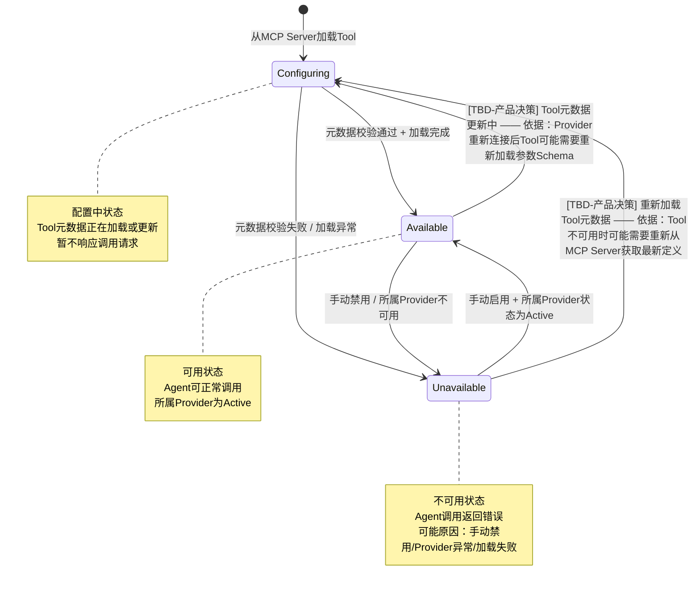
```mermaid
stateDiagram-v2
    [*] --> Configuring : 从MCP Server加载Tool

    Configuring --> Available : 元数据校验通过 + 加载完成
    Configuring --> Unavailable : 元数据校验失败 / 加载异常

    Available --> Unavailable : 手动禁用 / 所属Provider不可用
    Available --> Configuring : [TBD-产品决策] Tool元数据更新中 —— 依据：Provider重新连接后Tool可能需要重新加载参数Schema

    Unavailable --> Available : 手动启用 + 所属Provider状态为Active
    Unavailable --> Configuring : [TBD-产品决策] 重新加载Tool元数据 —— 依据：Tool不可用时可能需要重新从MCP Server获取最新定义

    note right of Available
        可用状态
        Agent可正常调用
        所属Provider为Active
    end note

    note right of Unavailable
        不可用状态
        Agent调用返回错误
        可能原因：手动禁用/Provider异常/加载失败
    end note

    note right of Configuring
        配置中状态
        Tool元数据正在加载或更新
        暂不响应调用请求
    end note
```

**Tool状态转换规则**：

| 当前状态 | 目标状态 | 触发条件 | 说明 |
|----------|----------|----------|------|
| Configuring | Available | 元数据校验通过 + 加载完成 | 正常加载流程 |
| Configuring | Unavailable | 元数据校验失败 / 加载异常 | Schema格式异常等 |
| Available | Unavailable | 手动禁用 / Provider不可用 | Provider状态变更级联影响 |
| Available | Configuring | Tool元数据更新中 | [TBD-产品决策] Provider重新连接后Tool参数Schema可能变化 —— 依据：MCP Server升级后Tool定义可能更新 |
| Unavailable | Available | 手动启用 + Provider为Active | 需同时满足两个条件 |
| Unavailable | Configuring | 重新加载Tool元数据 | [TBD-产品决策] 不可用Tool重新加载时先进入配置中状态 —— 依据：确保元数据一致性 |

---

### 5.9 AI Agent Skills 管理（新增 — 遵循 [agentskills.io](https://agentskills.io/home) 规范）

#### 5.9.1 Skills 发现（Discovery）

**用户故事**：作为 Agent 启动器，我希望在系统启动时只加载所有已注册 Skill 的 `name` + `description` 字段到一个轻量索引中，以便快速判断"哪些 Skill 可能与当前任务相关"，同时将 Context Window 占用控制在毫秒级。

**Skill 包目录结构（必填 + 可选）**：

```
my-itinerary-skill/
├── SKILL.md           # 必填：frontmatter metadata + instructions
├── scripts/           # 可选：可执行代码
│   ├── optimize.py
│   └── format.sh
├── references/        # 可选：参考文档（按需加载）
│   ├── schema.json
│   └── business-rules.md
├── assets/            # 可选：模板/资源
│   ├── template.docx
│   └── icon.png
└── ...                # 其他自定义子目录
```

**SKILL.md frontmatter 必填字段**：

```yaml
---
name: itinerary-planning        # 必填，1-64 字符，匹配 ^[a-z0-9-]+$
description: |                  # 必填，1-1024 字符，自然语言描述
  Plan a multi-day travel itinerary given destination, dates, budget,
  and traveler preferences. Use when the user asks to plan a trip.
version: 1.2.0                  # 必填，SemVer 格式
license: Apache-2.0             # 必填
allowed-tools: []               # 可选，限制 Skill 可调用的 MCP Tool
---
```

**Discovery 索引行为**：

- **索引内容**：`{id, name, description, version, tags, owner_partition_key, last_updated_at}`
- **不索引内容**：`SKILL.md` 正文、`scripts/` 代码、`references/` 大文档、`assets/` 资源文件
- **加载时机**：Agent 启动时 / 系统冷启动后 5 秒内完成
- **存储位置**：Redis 缓存 `t:{tenant_id}:capability:skill:discovery:index`（TTL 300 秒）
- **容量上限**：单租户最多 1,000 个 Skill；总 Discovery 索引大小 ≤ 512KB。达到容量上限后，新Skill注册请求将被拒绝并返回 `0530xx`（业务容量约束错误，具体码位实现时分配）错误，提示用户联系管理员扩容或清理闲置Skill。容量上限支持系统配置化调整（PRD-09 系统设置）。

**用户交互**：

- 平台管理员可在"Skills 列表"页浏览、搜索、按标签筛选
- 每个 Skill 显示：name / description / version / 状态 / 引用 Agent 数 / 最后调用时间

#### 5.9.2 Skills 激活（Activation）

**用户故事**：作为 Agent 任务执行器，我希望在每次 LLM 调用前，根据当前任务描述与 Discovery 索引进行语义匹配，仅对匹配的 Skill 触发完整 `SKILL.md` 加载，以减少 Token 消耗。

**激活流程**：

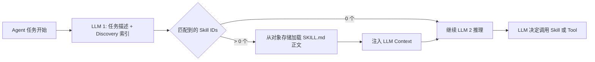
```mermaid
flowchart LR
    A[Agent 任务开始] --> B[LLM 1: 任务描述 + Discovery 索引]
    B --> C{匹配到的 Skill IDs}
    C -->|> 0 个| D[从对象存储加载 SKILL.md 正文]
    D --> E[注入 LLM Context]
    C -->|0 个| F[继续 LLM 2 推理]
    E --> F
    F --> G[LLM 决定调用 Skill 或 Tool]
```

**激活策略**：

| 策略 | 触发条件 | 行为 |
|------|---------|------|
| 语义相似度匹配 | Discovery 索引中 Skill description 与任务描述的 Embedding 余弦相似度 ≥ 0.75 | 激活该 Skill |
| 显式声明 | Agent 配置中显式列出 `required_skills: [...]` | 强制激活 |
| 工具关联 | Skill frontmatter `allowed-tools` 包含某个 Tool | 当该 Tool 被调用时联动激活 |
| 手动 | 管理员在 UI 手动激活 | 强制激活 |

**激活并发控制**：单次任务最多并行激活 5 个 Skill（防止 Context Window 爆炸）

#### 5.9.3 Skills 执行（Execution）

**用户故事**：作为 Skill 加载到 Context 后的 LLM 推理阶段，我希望 LLM 按照 SKILL.md 的 instructions 指引执行——可选择执行 `scripts/` 中的代码（沙箱隔离）、加载 `references/` 中的大文档、引用 `assets/` 中的模板。

**scripts/ 执行沙箱**：

- **隔离技术**：AWS Lambda 自身隔离 + IAM 权限边界（默认方案）；高隔离需求场景使用 AWS Step Functions 编排 Fargate 任务执行
- **资源限制**：CPU 1 核 / 内存 512MB / 磁盘 1GB / 网络 默认拒绝
- **超时**：默认 60 秒，可按 Skill 配置（最大 600 秒）
- **网络白名单**：通过 SKILL.md frontmatter `network.allowed-domains` 声明
- **文件系统**：只读访问 Skill 自身目录，写入 `/tmp/skill-{id}/`

**references/ 按需加载**：

- 触发条件：LLM 在推理中显式引用某 references 路径
- 加载方式：流式读取，按 chunk（最大 8KB）注入 Context
- 回收时机：当前轮次推理结束（不持久化到后续轮次）

**assets/ 引用**：

- 仅作为 URL/路径占位符注入 Context（如 `file://./assets/template.docx`）
- 实际渲染由前端按 Client Type 适配

**执行错误处理**：

| 错误类型 | 处理策略 |
|---------|---------|
| scripts/ 超时 | 中止执行，返回 Timeout 错误，触发 §3.4.5 流程的 Reject |
| scripts/ 沙箱逃逸尝试 | 立即冻结 Skill 状态，回退至 Draft 并标注原因，安全审计告警 |
| references/ 文件缺失 | 跳过该 references，继续推理 |
| 权限违规 | 拒绝执行，错误码 053063 |

**运行时沙箱约束**：scripts/ 中所有可执行文件必须在 AWS Lambda 隔离环境中运行（默认方案），高隔离需求场景通过 AWS Step Functions 编排 Fargate 任务执行，由 Runtime 层强制执行。

#### 5.9.4 Skills 注册与审核

**用户故事**：作为 Skill 开发者，我希望将本地编写好的 Skill 包提交到平台注册，经过 SecurityAdmin 审核后即可被全租户的 Agent 引用。

**注册流程**：

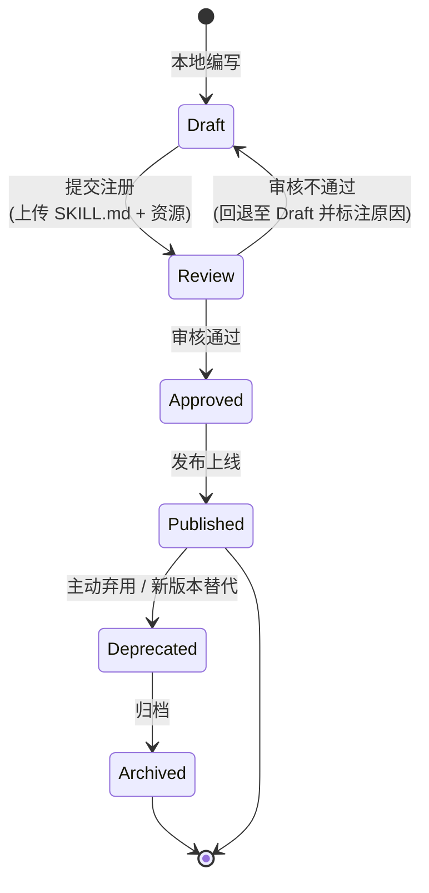
```mermaid
stateDiagram-v2
    [*] --> Draft: 本地编写
    Draft --> Review: 提交注册<br/>(上传 SKILL.md + 资源)
    Review --> Draft: 审核不通过<br/>(回退至 Draft 并标注原因)
    Review --> Approved: 审核通过
    Approved --> Published: 发布上线
    Published --> Deprecated: 主动弃用 / 新版本替代
    Deprecated --> Archived: 归档
    Archived --> [*]
    Published --> [*]
```

**审核维度（SecurityAdmin Checklist）**：

1. **frontmatter 合规性**：name/description/version/license 字段完整、格式正确
2. **SKILL.md 内容审查**：是否包含敏感信息（密码、Token、内部 IP）、是否含注入攻击载荷
3. **scripts/ 代码审查**：检查是否包含尝试逃逸沙箱的调用（如直接访问宿主文件系统、网络端口扫描等）
4. **references/ 内容审查**：是否含商业机密、GDPR 敏感数据
5. **许可证合规**：license 字段必须为 SPDX 标识符

**审核结果通知**：站内信 + 邮件（若用户在 User Profile 启用了邮件通知）

#### 5.9.5 Skills 版本管理

**用户故事**：作为 Skill 维护者，我希望使用 SemVer 规范管理 Skill 的多个版本，支持灰度发布与回滚，以便在升级时不破坏下游 Agent。

**版本号规范（SemVer 2.0.0）**：

| 字段 | 含义 | 升级示例 |
|------|------|---------|
| Major | 不兼容的 API 变更 | `1.x.y` → `2.0.0` |
| Minor | 向后兼容的功能新增 | `1.0.0` → `1.1.0` |
| Patch | 向后兼容的 Bug 修复 | `1.0.0` → `1.0.1` |

**Agent-Skill 绑定引用方式**：

- 精确版本：`itinerary-planning@1.2.0`
- 浮动版本：`itinerary-planning@^1.2.0`（兼容 1.x.x）
- Latest：`itinerary-planning@latest`（始终指向 Approved 最新版本）

**灰度发布流程**：

1. 提交新版本 → 进入 Review 状态
2. 选择"灰度"模式 → 配置灰度比例（如 10% 的 Agent 流量）
3. 系统按 hash(agent_id + id) 取模分配灰度范围
4. 监控 30 分钟：失败率 / 激活成功率 / 错误码分布
5. 通过：扩大比例至 50% → 100%
6. 失败：一键回滚至上一稳定版本

**回滚机制**：

- 任意时刻，管理员可"Rollback to v1.2.0"——所有 Agent 在下一个任务周期切换版本
- 回滚后，灰度比例归零，新版本重新进入 Review

#### 5.9.6 Skills 跨 Agent 复用

**用户故事**：作为 Agent 开发者，我希望能够浏览已被其他 Agent 引用的共享 Skill 库，一键绑定到自己的 Agent 上，以避免重复造轮子。

**复用统计机制**：

- Capability 资源池维护 Skill 复用元数据：`{id, ref_agent_count, last_ref_time, total_invocations}`
- 每次 Agent 引用 Skill 时，原子更新上述字段
- 复用次数 ≥ 2 的 Skill 自动进入"共享 Skills 候选池"

**共享 Skills 库浏览**：

- 按"被引用次数 Top 20 / 最近 7 天新增 / 按业务标签"展示
- 每个 Skill 显示：name / description / version / 引用 Agent 数 / 平均调用成功率
- 一键绑定按钮：将 Skill 引用加入当前 Agent 的 `required_skills` 列表

**复用权限控制**：

| 共享级别 | 范围 | 谁可引用 |
|---------|------|---------|
| `OWN` | 单 Agent | 仅 Agent Owner |
| `SHARED` | 单租户 | 租户内所有 Agent Developer |
| `PUBLIC` | 跨租户 | 跨租户（需 Marketplace 审批） |

**复用推荐算法**：

- 基于 Agent 已有 Skill 集合，使用 Embedding 相似度推荐 Top 5
- 候选 Skill 须满足 `Approved` 状态 + 与 Agent 业务域有 ≥ 0.6 相似度

---

### 5.10 AG-UI 式 UI 组件管理（新增 — 遵循 [docs.ag-ui.com](https://docs.ag-ui.com/introduction) 协议）

#### 5.10.1 生成式 UI 组件（Generative UI Components）

**用户故事**：作为终端用户，我希望 Agent 输出的不再是"一坨 Markdown 文本"，而是结构化的 UI 组件（表单/卡片/图表/Tab），以便直观地完成数据提交、信息浏览、决策选择。

**两种形态**：

| 形态 | 定义 | 适用场景 |
|------|------|---------|
| **Static Generative UI** | 前端预注册组件类型，Agent 输出"已注册组件类型 + 参数" | 表单、按钮、列表、Tab、卡片 |
| **Declarative Generative UI** | Agent 提出组件树与约束，前端按 schema 校验后挂载 | 复杂动态布局、未知组合 |

**Static 组件类型库（首批）**：

| 类型 | Schema 字段 | 用途 |
|------|------------|------|
| `form` | `[{name, label, type, required, options}]` | 数据采集表单 |
| `card` | `{title, content, imageUrl, actions}` | 信息卡片 |
| `chart` | `{chartType, data, xAxis, yAxis}` | 图表（bar/line/pie/doughnut） |
| `table` | `{columns, rows, pagination}` | 数据表格 |
| `tabs` | `[{label, content}]` | 多 Tab 切换 |
| `action` | `{label, actionType, payload}` | 动作按钮（OpenURL/SubmitForm/CallTool） |
| `confirm` | `{title, message, approveLabel, rejectLabel}` | 确认对话框 |
| `progress` | `{label, percent, status}` | 进度条 |

**Declarative 组件树示例**：

```json
{
  "type": "container",
  "direction": "column",
  "children": [
    { "type": "heading", "level": 2, "text": "推荐结果" },
    {
      "type": "list",
      "items": [
        { "type": "card", "title": "东京 5 日游", "content": "..." }
      ]
    }
  ]
}
```

**组件 schema 校验**：前端必须按组件类型白名单（仅允许前端已注册的 Static 类型 + Declarative 基础原语）挂载，未知类型降级为文本渲染

#### 5.10.2 事件驱动 UI 协议（Event-driven UI Protocol）

**用户故事**：作为前端开发工程师，我希望 Agent 与前端之间通过统一的"事件流"进行通信，所有状态变化都以事件形式下发，前端按事件类型做出响应。

**AG-UI 14 类标准事件类型**（全部必须支持）：

| 事件前缀 | 事件示例 | 用途 |
|---------|---------|------|
| `RUN_*` | `RUN_STARTED`, `RUN_FINISHED`, `RUN_ERROR` | 会话生命周期 |
| `TEXT_MESSAGE_*` | `TEXT_MESSAGE_START`, `TEXT_MESSAGE_CONTENT`, `TEXT_MESSAGE_END` | 流式文本输出 |
| `TOOL_CALL_*` | `TOOL_CALL_START`, `TOOL_CALL_ARGS`, `TOOL_CALL_END` | 前端 Tool 调用 |
| `TOOL_CALL_RESULT` | — | Tool 调用结果回传 |
| `STATE_*` | `STATE_SNAPSHOT`, `STATE_DELTA`, `STATE_MESSAGES`, `STATE_EVENTS` | Shared State 同步 |
| `MESSAGES_SNAPSHOT` | — | 历史消息快照 |
| `RAW` | — | 透传原始事件 |
| `CUSTOM` | — | 自定义扩展 |
| `THINKING_*` | `THINKING_START`, `THINKING_END` | 思考步骤可视化 |
| `THINKING_TEXT_MESSAGE_*` | — | 思考的文本流 |
| `GENERATIVE_UI` | — | 组件 schema 下发 |
| `INTERRUPT` | — | Human-in-the-Loop 中断 |
| `STEP_*` | `STEP_STARTED`, `STEP_FINISHED` | 编排步骤状态 |
| `SUB-AGENT_*` | `SUB_AGENT_STARTED`, `SUB_AGENT_FINISHED` | 子 Agent 生命周期 |

**RUN_ERROR 事件详细定义**：

| 事件类型 | 描述 | Payload | 说明 |
|----------|------|---------|------|
| `RUN_ERROR` | Agent运行时异常 | `{ type: string, message: string, retryable: boolean }` | 推送Agent运行时异常到前端，详见 PRD-06 §7.10 |

**事件传输**：WebSocket（首选）/ Server-Sent Events（兼容）/ HTTP Long Polling（兜底）

> **AG-UI 实时事件推送实现方案**：AG-UI 实时事件推送通过 AWS API Gateway WebSocket 实现（Lambda 后端），或使用 AWS AppSync Subscriptions（GraphQL 原生订阅）。两种方案均支持多租户隔离与事件鉴权，具体选型由部署环境决定。

**事件订阅**：

- 客户端按 `client_id` 订阅事件流
- 支持按 `event_type` 过滤
- 断线重连后，从最后一个 `state_snapshot` 恢复

#### 5.10.3 多轮会话 UI 状态管理（State Management）

**用户故事**：作为终端用户，我希望在多轮对话中，前端能维护会话状态（草稿/历史/UI 状态），并在断线刷新后恢复。

**会话状态机**：

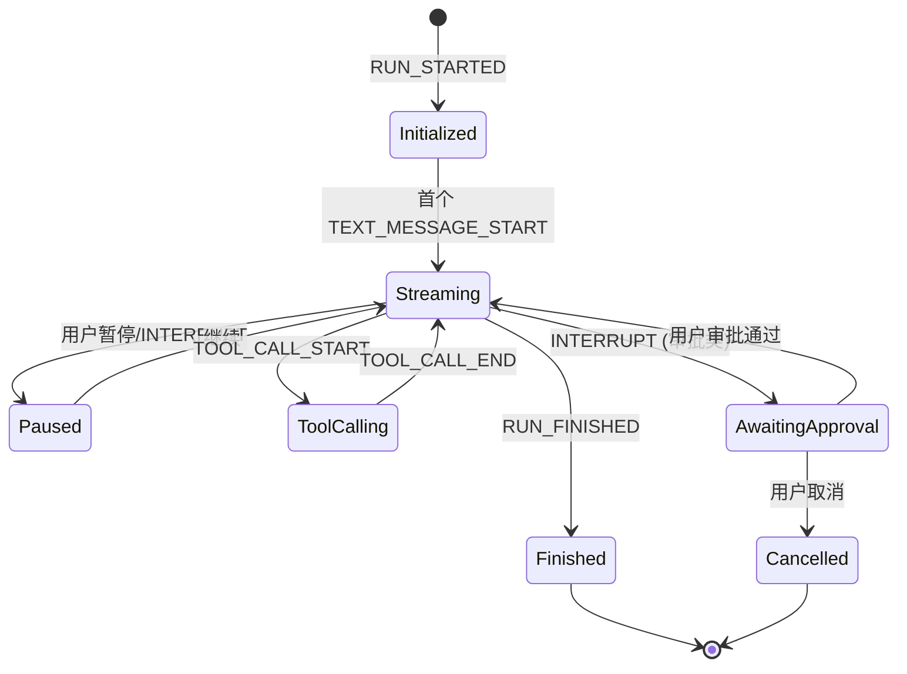
```mermaid
stateDiagram-v2
    [*] --> Initialized: RUN_STARTED
    Initialized --> Streaming: 首个 TEXT_MESSAGE_START
    Streaming --> Paused: 用户暂停/INTERRUPT
    Paused --> Streaming: 继续
    Streaming --> ToolCalling: TOOL_CALL_START
    ToolCalling --> Streaming: TOOL_CALL_END
    Streaming --> AwaitingApproval: INTERRUPT (审批类)
    AwaitingApproval --> Streaming: 用户审批通过
    AwaitingApproval --> Cancelled: 用户取消
    Streaming --> Finished: RUN_FINISHED
    Finished --> [*]
    Cancelled --> [*]
```

**Shared State 共享存储**：

- 类型化 JSON Schema 描述 State 结构（如 `{messages: [], uiState: {currentTab: 1}, formData: {}}`）
- 前后端通过 `STATE_SNAPSHOT`（全量）+ `STATE_DELTA`（增量 diff）同步
- 服务端持久化至 Redis `t:{tenant_id}:capability:agui:{id}:state`（TTL 24h）

**断线恢复**：客户端重连时，服务端下发最新 `STATE_SNAPSHOT`，前端 diff 渲染

#### 5.10.4 结构化 + 非结构化 IO 混合渲染（Multimodal IO）

**用户故事**：作为终端用户，我希望在前端界面上同时看到：Agent 的流式文本回复、可视化图表、文件附件预览、语音波形，以及我自己的富文本输入框。

**支持的多模态附件类型**：

| 类型 | Schema | 渲染 |
|------|--------|------|
| 图像 | `{type: "image", url, mime, width, height}` | 内联预览 / 弹出全屏 |
| 音频 | `{type: "audio", url, duration, transcript?}` | 播放器 + 波形 + 转写文本 |
| 视频 | `{type: "video", url, poster, duration}` | 播放器 |
| 文件 | `{type: "file", url, name, size, mime}` | 下载按钮 + 预览缩略图 |
| 文本 | `{type: "text", content}` | Markdown 渲染 |
| 富文本 | `{type: "rich_text", delta}` | 协作光标 + 增量编辑 |

**混合布局引擎**：

- 顶层布局：Flex 容器，方向 `column`（移动端）/ `row`（桌面）
- 子元素按 Agent 下发顺序排列
- 文本消息与 UI 组件按"消息气泡 + 卡片"交替布局

**多模态输入**：用户可同时上传图片 + 文本 + 文件，所有附件打包到 `INPUT` 事件

#### 5.10.5 子 Agent 递归调用 UI 嵌套（Sub-agents Composition）

**用户故事**：作为终端用户，我希望当主 Agent 委派给子 Agent 时，前端能以"嵌套 UI 容器"形式展示子 Agent 的执行过程，嵌套层级清晰可控。

**嵌套 UI 容器**：

- 主 Agent 调用子 Agent 时，下发 `SUB_AGENT_STARTED` 事件 + `parent_session_id`
- 前端创建"嵌套 UI 容器"：子 Agent 的所有事件在该容器内渲染
- 容器支持折叠/展开/复制 id

**递归深度控制**：

- 默认上限：3 层（主 → 子 → 孙）
- 超过上限：拒绝委派，下发 `INTERRUPT` 事件（提示"递归深度超限"）

**嵌套层级可视化**：

- 顶部导航面包屑：`主 Agent > 子 Agent A > 子 Agent B`
- 左侧树状图：所有活跃子 Agent 节点

**局部状态隔离**：

- 子 Agent 的 Shared State 嵌套在父 Agent 的 `sub_states: {child_session_id: state}` 中
- 子 Agent 不能直接修改父 Agent 的根 State

#### 5.10.6 客户端适配（Web / Mobile / Slack / IM）

**用户故事**：作为终端用户，无论我是从 Web、移动 App、Slack 还是 IM 发起会话，都应获得一致的 AG-UI 体验。

**客户端类型检测**：

- 通过 `User-Agent` + `client_id` 标识识别
- 支持的客户端：`web`, `ios`, `android`, `slack`, `teams`, `feishu`, `wechat-work`, `terminal`

**平台特定组件映射**：

| Static 组件 | Web | Mobile | Slack | IM |
|------------|-----|--------|-------|-----|
| `form` | 原生 HTML Form | 原生 Form | Block Kit Modal | 文本指令解析 |
| `card` | Material Card | 原生 Card | Block Kit Section | 富文本卡片 |
| `chart` | ECharts | 原生 Canvas | 不可用（降级为表格） | 不可用（降级为文本） |
| `confirm` | 原生 Modal | 原生 Alert | Block Kit Dialog | 文字 + 表情 |
| `action` | HTML Button | 原生 Button | Block Kit Button | 文字指令 |

**响应式布局适配**：

- Web：Grid 布局，断点 `xs/sm/md/lg/xl`
- Mobile：Stack 布局，单列为主
- Slack/IM：Block Kit / 富文本，组件尽量转为 Block/Message

**渐进式降级策略**：

1. 优先尝试平台原生组件
2. 不支持时降级为"链接 + 文字"
3. 仍不支持时降级为"纯文本描述 + 提示用户去 Web 查看"

**客户端能力声明**（声明在 client 注册时）：

```json
{
  "client_id": "web-prod-001",
  "platform": "web",
  "capabilities": {
    "generative_ui_static": true,
    "generative_ui_declarative": true,
    "multimodal_input": true,
    "interrupt_ui": true,
    "sub_agent_nesting": true
  }
}
```

---

## 6. 业务规则

> **v6 收束说明**：本节使用 `CAP-BR-` 模块前缀编号为旧版规范。v6 收束后的权威业务规则请参考 **§18 业务规则**（使用 `BR-03-{3 位}` 编号，遵循 PRD-09 §41.3 BR 编号规范）。本节作为详细规则参考保留，便于追溯。

### 6.1 Provider管理规则

| 规则编号 | 规则描述 |
|----------|----------|
| CAP-BR-001 | Provider Name在系统内全局唯一，不区分大小写 |
| CAP-BR-002 | 新建Provider默认状态为INACTIVE，需手动启用 |
| CAP-BR-003 | Provider删除采用软删除机制，保留30天后物理删除 |
| CAP-BR-004 | 同一Provider下加载的Tool数量上限为100个 |
| CAP-BR-005 | Provider的Timeout配置范围为1-300秒，超出范围拒绝保存 |
| CAP-BR-006 | 处于ACTIVE状态且被活跃任务引用的Provider不允许删除 |
| CAP-BR-007 | [TBD-产品决策] Provider状态从INACTIVE切换至ACTIVE时，系统自动触发一次连接测试 —— 依据：确保启用时MCP Server确实可用 |

### 6.2 MCP Server配置规则

| 规则编号 | 规则描述 |
|----------|----------|
| CAP-BR-008 | Stdio类型的Command字段不允许包含shell管道符（\|）和重定向符号（>、>>） |
| CAP-BR-009 | Remote Connection的URL必须以http://或https://开头 |
| CAP-BR-010 | Authorization Token在数据库中加密存储（AES-256），日志中脱敏展示（仅显示前4位+****） |
| CAP-BR-011 | 环境变量Key不允许重复，且不允许包含空格和特殊字符（仅允许字母、数字、下划线） |
| CAP-BR-012 | Internalizable Connection的Class Name必须符合Python模块路径格式（如 silvaengine_modules.capability.tools:CustomTool），通过 PluginManager.load_plugin() 动态加载 |
| CAP-BR-013 | [TBD-产品决策] 环境变量Value中包含敏感信息（如密码、密钥）时，系统自动识别并加密存储 —— 依据：Key名称包含password/secret/token/key等关键词时自动触发加密 |

### 6.3 MCP工具管理规则

| 规则编号 | 规则描述 |
|----------|----------|
| CAP-BR-014 | Tool Name来源于MCP Server注册信息，系统内不允许修改 |
| CAP-BR-015 | Tool Description支持用户自定义覆盖，原始描述保留在元数据中 |
| CAP-BR-016 | Tool状态为Unavailable时，Agent调用该Tool将收到"Tool不可用"错误响应 |
| CAP-BR-017 | 同一Tool可被多个Agent引用，但同一Provider下Tool Name唯一 |
| CAP-BR-018 | Runtime Logs保留期限为90天，超过90天的日志自动归档清理 |
| CAP-BR-019 | Tool状态与所属Provider状态级联：Provider变为INACTIVE/UNHEALTHY时，其下所有Tool自动变为Unavailable；Provider变为DEGRADED时，其下Tool保持Available但标记 `degraded=true`，Agent调用时优先选择非DEGRADED Provider的Tool |

### 6.4 工具加载规则

| 规则编号 | 规则描述 |
|----------|----------|
| CAP-BR-020 | Tool发现请求超时时间使用Provider配置的Timeout值 |
| CAP-BR-021 | Tool参数Schema必须符合JSON Schema规范，不符合的Tool标记为异常 |
| CAP-BR-022 | 重复加载同名Tool时，系统提示"该Tool已存在，是否更新？" |
| CAP-BR-023 | Tool加载失败不影响其他Tool的加载，系统记录失败原因供后续排查 |

### 6.5 传输协议配置差异与适用场景

| 维度 | Stdio | Internalizable | Remote |
|------|-------|----------------|--------|
| **通信方式** | 标准输入输出（stdin/stdout） | [TBD-产品决策] 内部Python模块调用协议 —— 依据：SilvaEngine模块通过PluginManager加载 | HTTP/SSE/Streamable HTTP |
| **运行位置** | 本地进程（系统启动和管理） | 内部模块（SilvaEngine Plugin进程内或同Lambda） | 远程服务器（公网或内网） |
| **必填配置** | Command | Source Package、Package Name、Class Name、URL | URL |
| **可选配置** | Working Directory、Arguments | Authorization Token | Authorization Token |
| **认证方式** | 无需认证（本地进程） | Authorization Token | Authorization Token |
| **适用场景** | 本地命令行工具（如npx启动的MCP Server） | [TBD-产品决策] 企业内部Python模块封装的Tool —— 依据：Internalizable配置项指向SilvaEngine模块类 | 第三方SaaS服务、云端MCP Server |
| **延迟特征** | 低延迟（本地进程通信） | 中等延迟（内网通信） | 较高延迟（网络通信） |
| **稳定性** | 依赖本地进程健康 | 依赖内部服务可用性 | 依赖网络和远程服务稳定性 |
| **安全要求** | 进程隔离和权限控制 | Token认证 + 内网隔离 | HTTPS + Token认证 |
| **环境变量** | 支持（注入至子进程环境） | [TBD-产品决策] 支持（注入至Python进程os.environ） —— 依据：Python服务可通过os.environ获取 | 不适用（远程服务自行管理环境变量） |
| **健康检查** | 进程存活检测 | [TBD-产品决策] HTTP健康检查端点 —— 依据：微服务通常提供/health端点 | HTTP健康检查端点 |

### 6.6 工具调用完整链路

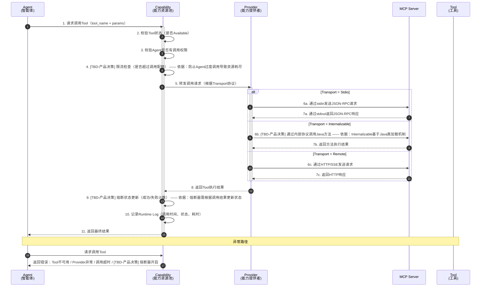
```mermaid
sequenceDiagram
    autonumber
    participant Agent as Agent<br>(智能体)
    participant Cap as Capability<br>(能力资源池)
    participant Provider as Provider<br>(能力提供者)
    participant MCPServer as MCP Server
    participant Tool as Tool<br>(工具)

    Agent->>Cap: 1. 请求调用Tool（tool_name + params）
    activate Cap
    Cap->>Cap: 2. 校验Tool状态（是否Available）
    Cap->>Cap: 3. 校验Agent是否有调用权限
    Cap->>Cap: 4. [TBD-产品决策] 限流检查（是否超过调用配额） —— 依据：防止Agent过度调用导致资源耗尽
    Cap->>Provider: 5. 转发调用请求（根据Transport协议）
    activate Provider

    alt Transport = Stdio
        Provider->>MCPServer: 6a. 通过stdin发送JSON-RPC请求
        MCPServer-->>Provider: 7a. 通过stdout返回JSON-RPC响应
    else Transport = Internalizable
        Provider->>MCPServer: 6b. [TBD-产品决策] 通过内部协议调用Java方法 —— 依据：Internalizable基于Java类加载机制
        MCPServer-->>Provider: 7b. 返回方法执行结果
    else Transport = Remote
        Provider->>MCPServer: 6c. 通过HTTP/SSE发送请求
        MCPServer-->>Provider: 7c. 返回HTTP响应
    end

    deactivate Provider
    Provider-->>Cap: 8. 返回Tool执行结果
    Cap->>Cap: 9. [TBD-产品决策] 熔断状态更新（成功/失败计数） —— 依据：熔断器需根据调用结果更新状态
    Cap->>Cap: 10. 记录Runtime Log（调用时间、状态、耗时）
    Cap-->>Agent: 11. 返回最终结果

    deactivate Cap

    Note over Agent,Tool: 异常路径

    Agent->>Cap: 请求调用Tool
    Cap-->>Agent: 返回错误：Tool不可用 / Provider异常 / 调用超时 / [TBD-产品决策] 熔断器开启
```

**调用链路规则**：

| 步骤 | 规则 | 说明 |
|------|------|------|
| 2-状态校验 | Tool状态必须为Available | Unavailable/Configuring状态返回"Tool不可用"错误 |
| 3-权限校验 | Agent必须与Tool存在绑定关系 | [TBD-产品决策] 未绑定的Agent调用返回"无调用权限" —— 依据：Capability作为资源池需控制访问权限 |
| 4-限流检查 | 单Agent单Tool调用频率上限为60次/分钟 | [TBD-产品决策] 默认限流阈值 —— 依据：防止Agent异常循环调用 |
| 5-超时控制 | 使用Provider配置的Timeout值 | 超时后返回"调用超时"错误 |
| 9-熔断更新 | 连续5次调用失败触发熔断 | [TBD-产品决策] 熔断阈值 —— 依据：避免持续向异常Provider发送请求 |
| 10-日志记录 | 所有调用均记录Runtime Log | 包含成功/失败/超时三种状态 |

### 6.7 Provider健康检查机制

| 维度 | 说明 |
|------|------|
| **检查方式** | 定期向 MCP Server 发送 ping / health-check 请求（MCP 协议原生支持） |
| **状态机** | 严格遵循 §5.8.1 五状态机：`INACTIVE` / `ACTIVE` / `DEGRADED` / `UNHEALTHY` / `DISABLED` |
| **检查频率** | `ACTIVE` / `DEGRADED` 状态 Provider 每 **30 秒**检查一次，支持配置化（10s/30s/60s/300s）；`UNHEALTHY` 状态降级为 5 分钟探测（指数退避）；`INACTIVE` / `DISABLED` 状态跳过 |
| **失败判定** | 连续 3 次健康检查失败：`ACTIVE → DEGRADED`；再连续 3 次失败（总计 6 次）：`DEGRADED → UNHEALTHY`（触发熔断） |
| **恢复判定** | [TBD-产品决策] 连续2次健康检查成功，Provider 状态恢复为 `ACTIVE`（DEGRADED 与 UNHEALTHY 均适用，需 2 次连续成功）—— 依据：确保恢复稳定性 |
| **检查范围** | Stdio：进程存活检测 + ping请求；Internalizable：HTTP健康检查端点；Remote：HTTP健康检查端点 |
| **通知机制** | Provider状态变更时，通知所有引用其Tool的Agent |
| **[TBD-产品决策] 熔断保护** | `UNHEALTHY` 状态下，暂停该Provider下所有Tool的调用请求，直接返回"Provider异常" —— 依据：避免向不可用的Provider发送请求造成资源浪费 |

### 6.8 工具版本管理机制

| 维度 | 说明 |
|------|------|
| **版本来源** | [TBD-产品决策] Tool版本由MCP Server在注册时声明，通过Tool元数据中的version字段获取 —— 依据：MCP协议Tool定义可包含版本信息 |
| **版本格式** | 语义化版本号（SemVer），如v1.2.3 |
| **版本更新触发** | Provider重新连接MCP Server后，系统自动检测Tool版本变化 |
| **版本变更策略** | [TBD-产品决策] 小版本更新（Patch）自动生效；大版本更新（Major）需用户确认 —— 依据：大版本可能存在不兼容变更，需人工确认 |
| **版本回滚** | [TBD-产品决策] 支持回滚至最近3个历史版本 —— 依据：新版本出现兼容性问题时需快速回退 |
| **版本记录** | 每次版本变更记录变更时间、变更类型、变更内容 |

### 6.9 工具调用限流与熔断策略

**注：以下限流与熔断参数均由 Gateway 层执行（遵循 PRD-00 §4.6 限流规范），业务模块不实现限流逻辑。本节仅定义业务侧的限流参数需求，供 Gateway 配置引用。**

| 策略类型 | 维度 | 说明 |
|----------|------|------|
| **限流** | 单Agent单Tool调用频率 | [TBD-产品决策] 默认60次/分钟，可按Provider配置调整 —— 依据：不同Tool的调用频率需求不同 |
| **限流** | 全局Tool调用并发数 | [TBD-产品决策] 默认100并发，超过后请求排队等待 —— 依据：保护系统资源不被过度消耗 |
| **限流** | Provider级别总调用频率 | [TBD-产品决策] 默认200次/分钟 —— 依据：防止单个Provider被过度调用 |
| **熔断** | 触发条件 | [TBD-产品决策] 连续5次调用失败或1分钟内失败率≥50% —— 依据：常见熔断器配置模式 |
| **熔断** | 熔断状态 | Closed（正常）→ Open（熔断，直接拒绝）→ Half-Open（半开，允许少量探测请求） |
| **熔断** | 恢复条件 | [TBD-产品决策] Half-Open状态下连续2次调用成功，恢复为Closed —— 依据：确保服务确实恢复后再放开流量 |
| **熔断** | 熔断时长 | [TBD-产品决策] 默认30秒，可按Provider配置 —— 依据：不同Provider的恢复时间不同 |
| **降级** | 降级策略 | [TBD-产品决策] 熔断开启后返回预定义的降级响应（如空结果+错误提示），而非直接报错 —— 依据：提升Agent在Tool不可用时的容错能力 |

### 6.10 环境变量安全注入机制

| 维度 | 说明 |
|------|------|
| **注入方式** | Stdio：注入至子进程环境变量；Internalizable：[TBD-产品决策] 注入至Python进程os.environ —— 依据：Python服务通过os.environ获取 |
| **敏感信息识别** | [TBD-产品决策] Key名称包含password/secret/token/key/api_key等关键词时，系统自动标记为敏感变量 —— 依据：常见敏感信息命名规范 |
| **加密存储** | 敏感变量Value使用AES-256加密后存储至数据库，非敏感变量明文存储 |
| **传输安全** | 敏感变量在传输过程中使用TLS加密，不在URL参数中传递 |
| **脱敏展示** | 敏感变量在界面上默认显示为"••••••••"，点击眼睛图标可临时查看（需二次验证） |
| **审计日志** | 敏感变量的创建、修改、删除操作记录至审计日志，Value值脱敏展示 |
| **[TBD-产品决策] 变量轮换** | 支持定期轮换敏感变量Value，轮换时自动更新关联的MCP Server连接 —— 依据：安全合规要求定期更换密钥和令牌 |

### 6.11 AI Agent Skills 管理规则

| 规则编号 | 规则描述 |
|----------|----------|
| CAP-BR-SK-001 | SKILL.md 为 Skill 包的必填根文件，缺失或 frontmatter 不规范的注册请求一律拒绝 |
| CAP-BR-SK-002 | frontmatter 中 `name` 字段须匹配正则 `^[a-z0-9-]{1,64}$`，全租户内唯一（不区分大小写） |
| CAP-BR-SK-003 | frontmatter 中 `version` 字段须符合 SemVer 2.0.0 规范（`MAJOR.MINOR.PATCH`，可选 `-prerelease`） |
| CAP-BR-SK-004 | frontmatter 中 `license` 字段必须为合法 SPDX 标识符（如 `Apache-2.0` / `MIT`），未声明则默认专有授权 |
| CAP-BR-SK-005 | SKILL.md 正文 + references/ 总大小 ≤ 10MB（防止 Context Window 爆炸） |
| CAP-BR-SK-006 | scripts/ 中所有可执行文件必须在 AWS Lambda 隔离环境中运行（默认方案），高隔离需求场景通过 AWS Step Functions 编排 Fargate 任务执行，不得访问 Skill 自身目录之外的文件系统 |
| CAP-BR-SK-007 | Skill 默认拒绝所有出站网络访问；如需访问外部域名，须在 frontmatter `network.allowed-domains` 显式声明 |
| CAP-BR-SK-008 | Skill 状态机严格遵循 Draft → Review → Approved → Published → (Deprecated → Archived) 流程；审核不通过回退至 Draft 并标注原因 |
| CAP-BR-SK-009 | 同一 Skill 名（`name`）的同一 Major 版本下，只允许 1 个 Approved 版本；新 Minor/Patch 版本作为补丁发布 |
| CAP-BR-SK-010 | 灰度发布过程中，监控指标（失败率 > 5% 或 激活成功率 < 90%）触发自动暂停 |
| CAP-BR-SK-011 | Agent-Skill 绑定须显式指定版本范围（精确/浮动/Latest），禁止引用未声明版本的 Skill |
| CAP-BR-SK-012 | 共享 Skills 库中 `PUBLIC` 级别的 Skill 须经过 Marketplace 审批（与 Marketplace 审批流程一致（Marketplace 归属 PRD-03 能力管理模块，跨租户共享功能标注为 V3.0 延后实现，当前版本 PUBLIC 级 Skill 仅支持租户内共享）） |
| CAP-BR-SK-013 | 复用次数 ≥ 2 的 Skill 自动进入"共享 Skills 候选池"，但需 SecurityAdmin 二次审核后转为 `SHARED` 或 `PUBLIC` |
| CAP-BR-SK-014 | 沙箱逃逸尝试（违反 §6.11 CAP-BR-SK-006/007）会立即冻结 Skill 回退至 Draft 并标注原因，并触发安全审计告警（PRD-11 §X 告警） |
| CAP-BR-SK-015 | Skill 升级时下游 Agent 的影响范围（被引用的 Agent 数）必须在审核信息中显式列出 |

### 6.12 AG-UI 组件管理规则

| 规则编号 | 规则描述 |
|----------|----------|
| CAP-BR-AG-001 | 全部 16 类 AG-UI 标准事件（`RUN_*` / `TEXT_MESSAGE_*` / `TOOL_CALL_*` / `STATE_*` / `MESSAGES_SNAPSHOT` / `RAW` / `CUSTOM` / `THINKING_*` / `GENERATIVE_UI` / `INTERRUPT` / `STEP_*` / `SUB-AGENT_*`）必须全部支持，未实现事件以 053401 错误码上报 |
| CAP-BR-AG-002 | GENERATIVE_UI 事件下发的组件 schema 必须先经过前端"组件类型白名单"校验；未知类型降级为文本渲染 |
| CAP-BR-AG-003 | Static Generative UI 仅允许下发前端已注册的组件类型（首批 8 类：form / card / chart / table / tabs / action / confirm / progress） |
| CAP-BR-AG-004 | Declarative Generative UI 组件树深度不得超过 5 层，防止前端渲染性能问题 |
| CAP-BR-AG-005 | Shared State 必须支持类型化 JSON Schema；前后端通过 STATE_SNAPSHOT（首次全量）+ STATE_DELTA（增量 diff）同步 |
| CAP-BR-AG-006 | INTERRUPT 事件超时默认 5 分钟；超时后默认行为为"取消"，可由 Agent 配置为"自动继续"或"上报管理员" |
| CAP-BR-AG-007 | Sub-agents 嵌套默认深度上限 3 层（主 → 子 → 孙）；超过上限下发 INTERRUPT 事件，提示"递归深度超限" |
| CAP-BR-AG-008 | 多模态附件总大小单次输入不超过 50MB；超过时拒绝下发 INPUT 事件，返回 053409 错误 |
| CAP-BR-AG-009 | 客户端能力声明（`capabilities`）由客户端在 WebSocket 握手时声明；服务端按声明过滤下发事件 |
| CAP-BR-AG-010 | 不可用组件的渐进式降级顺序：平台原生组件 → 链接 + 文字 → 纯文本描述；任何降级必须生成降级审计日志 |
| CAP-BR-AG-011 | 所有 AG-UI 事件必须携带 `partition_key`、`id`、`trace_id` 三个标识，缺失或非法返回 053412 错误 |
| CAP-BR-AG-012 | 端到端事件投递 P95 延迟 ≤ 200ms（业务目标 §3.3）；超时事件进入"重试队列"最多 3 次，仍失败则下发 `RUN_ERROR` 事件 |
| CAP-BR-AG-013 | AG-UI WebSocket 连接必须实现心跳机制：客户端每 30s 发送 ping，服务端 60s 内未收到 ping 则主动断开 |
| CAP-BR-AG-014 | AG-UI 事件持久化期限：在线会话 24h（Redis）+ 离线会话 90 天（PostgreSQL 历史表），过期自动清理 |
| CAP-BR-AG-015 | 客户端类型变更（如从 Web 切换到 Mobile）时，须重新走握手流程并更新 `client_id`；禁止在同一会话中变更客户端类型 |

---

## 7. 数据模型

### 7.1 Provider数据模型

| 字段名 | 类型 | 必填 | 说明 |
|--------|------|------|------|
| provider_id | string (UUID) | 是 | Provider唯一标识，系统自动生成 |
| provider_name | string | 是 | Provider名称，全局唯一，不区分大小写，最大长度100字符 |
| status | enum | 是 | Provider状态：INACTIVE / ACTIVE / DEGRADED / UNHEALTHY / DISABLED，默认INACTIVE |
| transport | enum | 是 | 传输协议类型：Stdio / Internalizable / Remote |
| timeout | integer | 是 | 超时时间（秒），默认30，范围1-300 |
| stdio_config | object | 否 | Stdio传输配置（transport=Stdio时必填） |
| stdio_config.command | string | 条件必填 | 启动MCP Server的命令，最大长度500字符 |
| stdio_config.working_directory | string | 否 | 工作目录路径，最大长度500字符 |
| stdio_config.arguments | string[] | 否 | 命令行参数列表，最多20个参数 |
| internalizable_config | object | 否 | Internalizable传输配置（transport=Internalizable时必填） |
| internalizable_config.source_package | string | 条件必填 | 源包标识，最大长度200字符 |
| internalizable_config.package_name | string | 条件必填 | 包名称，最大长度200字符 |
| internalizable_config.class_name | string | 条件必填 | 实现类全限定名，最大长度500字符 |
| internalizable_config.url | string | 条件必填 | 服务地址，最大长度500字符 |
| internalizable_config.authorization_token | string | 否 | 授权令牌，加密存储 |
| remote_config | object | 否 | Remote传输配置（transport=Remote时必填） |
| remote_config.url | string | 条件必填 | 远程MCP Server地址，最大长度500字符 |
| remote_config.authorization_token | string | 否 | 授权令牌，加密存储 |
| environment_variables | object[] | 否 | 环境变量列表 |
| environment_variables.key | string | 条件必填 | 变量名，仅允许字母/数字/下划线，最大长度100字符 |
| environment_variables.value | string | 条件必填 | 变量值，敏感变量加密存储，最大长度2000字符 |
| environment_variables.is_sensitive | boolean | 否 | [TBD-产品决策] 是否为敏感变量，系统自动识别或手动标记 —— 依据：区分敏感变量用于脱敏展示和加密存储 |
| tool_count | integer | 否 | 已加载Tool数量，最大100 |
| health_status | object | 否 | [TBD-产品决策] 健康检查状态信息 —— 依据：Provider健康检查机制需要存储检查结果 |
| health_status.last_check_time | datetime | 否 | [TBD-产品决策] 最后一次健康检查时间 —— 依据：判断检查是否过期 |
| health_status.consecutive_failures | integer | 否 | [TBD-产品决策] 连续健康检查失败次数 —— 依据：用于判断是否触发状态切换 |
| health_status.error_message | string | 否 | [TBD-产品决策] 最近一次健康检查错误信息 —— 依据：用于在界面上展示错误摘要 |
| created_at | datetime | 是 | 创建时间，系统自动生成 |
| updated_at | datetime | 是 | 最后更新时间，系统自动更新 |
| created_by | string | 是 | 创建人 |
| updated_by | string | 是 | 最后更新人 |
| is_deleted | boolean | 是 | 是否已软删除（由 deleted_at IS NOT NULL 派生） |
| deleted_at | datetime | 否 | 软删除时间 |

### 7.2 Tool数据模型

| 字段名 | 类型 | 必填 | 说明 |
|--------|------|------|------|
| tool_id | string (UUID) | 是 | Tool唯一标识，系统自动生成 |
| tool_name | string | 是 | Tool名称，来源于MCP Server注册信息，同一Provider下唯一，最大长度200字符 |
| provider_id | string (UUID) | 是 | 所属Provider ID，外键关联Provider |
| description | string | 否 | Tool功能描述，用户可自定义覆盖，最大长度500字符 |
| original_description | string | 否 | MCP Server原始描述，不可修改 |
| status | enum | 是 | Tool状态：Available / Unavailable / Configuring，默认Configuring |
| input_schema | object | 否 | 输入参数JSON Schema定义 |
| output_schema | object | 否 | [TBD-产品决策] 输出参数JSON Schema定义 —— 依据：MCP协议Tool定义包含输出Schema |
| version | string | 否 | [TBD-产品决策] Tool版本号，语义化版本格式 —— 依据：6.8节工具版本管理机制 |
| usage_example | string | 否 | [TBD-产品决策] Tool调用示例代码 —— 依据：5.3.1节工具详情查看中包含使用示例 |
| rate_limit | object | 否 | [TBD-产品决策] 限流配置 —— 依据：6.9节工具调用限流策略 |
| rate_limit.calls_per_minute | integer | 否 | [TBD-产品决策] 每分钟最大调用次数，默认60 —— 依据：6.9节限流策略定义 |
| circuit_breaker | object | 否 | [TBD-产品决策] 熔断配置 —— 依据：6.9节工具调用熔断策略 |
| circuit_breaker.failure_threshold | integer | 否 | [TBD-产品决策] 连续失败触发阈值，默认5 —— 依据：6.9节熔断触发条件 |
| circuit_breaker.timeout_seconds | integer | 否 | [TBD-产品决策] 熔断时长（秒），默认30 —— 依据：6.9节熔断时长配置 |
| circuit_breaker.state | enum | 否 | [TBD-产品决策] 熔断器状态：Closed / Open / Half-Open —— 依据：6.9节熔断状态定义 |
| created_at | datetime | 是 | 创建时间，系统自动生成 |
| updated_at | datetime | 是 | 最后更新时间，系统自动更新 |
| created_by | string | 是 | 创建人 |
| updated_by | string | 是 | 最后更新人 |
| is_deleted | boolean | 是 | 是否已软删除（由 deleted_at IS NOT NULL 派生） |
| deleted_at | datetime | 否 | 软删除时间 |

### 7.3 Tool与Agent关联关系模型

| 字段名 | 类型 | 必填 | 说明 |
|--------|------|------|------|
| relation_id | string (UUID) | 是 | 关联关系唯一标识 |
| tool_id | string (UUID) | 是 | Tool ID，外键关联Tool |
| agent_id | string (UUID) | 是 | Agent ID，外键关联Agent |
| bind_type | enum | 是 | [TBD-产品决策] 绑定类型：auto（自动关联）/ manual（手动绑定） —— 依据：Agent可通过调用自动关联Tool，也可手动绑定 |
| bind_time | datetime | 是 | 绑定时间 |
| bind_by | string | 否 | 绑定操作人（manual类型时有值） |
| access_count | integer | 否 | [TBD-产品决策] Agent调用该Tool的次数 —— 依据：用于评估Tool对Agent的价值 |
| last_access_time | datetime | 否 | [TBD-产品决策] Agent最后调用该Tool的时间 —— 依据：用于识别长期未使用的关联 |

### 7.4 Runtime Log数据模型

| 字段名 | 类型 | 必填 | 说明 |
|--------|------|------|------|
| log_id | string (UUID) | 是 | 日志唯一标识 |
| tool_id | string (UUID) | 是 | Tool ID |
| agent_id | string (UUID) | 否 | 调用者Agent ID |
| caller_name | string | 是 | 调用者名称（Agent名称或用户标识） |
| call_status | enum | 是 | 调用状态：Success / Failed / Timeout |
| request_params | object | 否 | 请求参数（JSON格式） |
| response_result | object | 否 | 响应结果（JSON格式） |
| error_message | string | 否 | 错误信息（Failed/Timeout时有值） |
| execution_time_ms | integer | 是 | 执行耗时（毫秒） |
| trace_id | string | 否 | 调用链路追踪ID |
| called_at | datetime | 是 | 调用时间 |
| retention_days | integer | 是 | 日志保留天数，默认90 |

### 7.5 AI Agent Skill 数据模型

| 字段名 | 类型 | 必填 | 说明 |
|--------|------|------|------|
| id | string (UUID) | 是 | Skill 唯一标识，系统自动生成 |
| name | string | 是 | Skill 名称（来自 SKILL.md frontmatter），全租户内唯一，匹配 `^[a-z0-9-]{1,64}$` |
| description | string | 是 | Skill 描述（来自 frontmatter），1-1024 字符 |
| version | string | 是 | 版本号（来自 frontmatter），SemVer 2.0.0 格式，如 `1.2.0` |
| license | string | 否 | 许可证（来自 frontmatter），SPDX 标识符 |
| owner_partition_key | string (UUID) | 是 | 所属租户 ID |
| owner_user_id | string (UUID) | 是 | 创建者用户 ID |
| status | enum | 是 | Skill 状态：Draft / Review / Approved / Published / Deprecated / Archived |
| owner_scope | enum | 是 | 共享范围：OWN / SHARED / PUBLIC，默认 OWN |
| frontmatter | object | 是 | SKILL.md frontmatter 完整内容（JSON） |
| skill_md_url | string | 是 | SKILL.md 正文在对象存储中的 URL |
| scripts | object[] | 否 | scripts/ 目录下可执行文件清单：`[{name, type, size_bytes, checksum, sandbox_required}]` |
| references | object[] | 否 | references/ 目录下参考文档清单：`[{path, size_bytes, mime, lazy_load}]` |
| assets | object[] | 否 | assets/ 目录下资源清单：`[{path, size_bytes, mime}]` |
| total_size_bytes | integer | 是 | SKILL.md + references + assets 总字节数，最大 10MB |
| allowed_tools | string[] | 否 | frontmatter `allowed-tools` 字段，可调用 MCP Tool 白名单 |
| network_policy | object | 否 | `network.allowed-domains` 列表，默认全部拒绝 |
| max_execution_seconds | integer | 否 | scripts 最大执行秒数，默认 60，最大 600 |
| ref_agent_count | integer | 是 | 被 Agent 引用次数，默认 0 |
| last_ref_time | datetime | 否 | 最后被引用时间 |
| total_invocations | integer | 是 | 历史累计调用次数，默认 0 |
| last_invocation_time | datetime | 否 | 最后调用时间 |
| review_status | enum | 是 | 审核状态：Review / Approved / Rejected / NotRequired |
| reviewer_id | string (UUID) | 否 | 审核人（SecurityAdmin）ID |
| reviewed_at | datetime | 否 | 审核时间 |
| review_comments | string | 否 | 审核意见 |
| canary_ratio | integer | 否 | 灰度发布比例（0-100），仅对 Approved + Major 升级生效 |
| deprecated_by | string (UUID) | 否 | 弃用者 ID |
| deprecated_at | datetime | 否 | 弃用时间 |
| created_at | datetime | 是 | 创建时间 |
| updated_at | datetime | 是 | 最后更新时间 |
| created_by | string | 是 | 创建人 |
| updated_by | string | 否 | 最后更新人 |
| is_deleted | boolean | 是 | 软删除标记（由 deleted_at IS NOT NULL 派生） |
| deleted_at | datetime | 否 | 软删除时间 |

**Agent-Skill 绑定关系数据模型**：

| 字段名 | 类型 | 必填 | 说明 |
|--------|------|------|------|
| relation_id | string (UUID) | 是 | 绑定关系唯一标识 |
| partition_key | string (UUID) | 是 | 租户 ID |
| agent_id | string (UUID) | 是 | Agent ID |
| skill_id | string (UUID) | 是 | Skill ID（外键关联 Skill 表 id） |
| version_constraint | enum | 是 | 版本约束：exact / caret / latest |
| pinned_version | string | 否 | 精确版本号（如 `1.2.0`），version_constraint=exact 时必填 |
| caret_upper | string | 否 | 浮动版本上限（如 `1.x.x`），version_constraint=caret 时必填 |
| is_required | boolean | 是 | 是否强制激活（true 强制 / false 条件激活），默认 true |
| activation_strategy | enum | 否 | 激活策略：semantic / explicit / tool-linked / manual |
| activation_threshold | decimal | 否 | 语义匹配阈值，0-1，默认 0.75 |
| bind_type | enum | 是 | 绑定类型：auto / manual |
| bind_time | datetime | 是 | 绑定时间 |
| bind_by | string | 否 | 绑定操作人（manual 时有值） |
| invocations_count | integer | 否 | 累计激活次数 |
| last_activation_time | datetime | 否 | 最后激活时间 |
| created_at | datetime | 是 | 创建时间 |
| updated_at | datetime | 是 | 更新时间 |

### 7.7 MCP Settings 数据模型

> 对应代码 `mcp-settings` 表，已采用 PostgreSQL JSONB 方案，通过 GIN 索引加速 `setting` JSONB 字段的查询。

| 字段 | 类型 | 说明 |
|------|------|------|
| partition_key | VARCHAR(64) | 租户分区键（复合主键） |
| id | VARCHAR(128) | 配置标识（复合主键） |
| setting | JSONB | 配置值（JSON 对象） |
| description | TEXT | 配置描述 |
| created_at | TIMESTAMPTZ | 创建时间 |
| updated_at | TIMESTAMPTZ | 更新时间 |

**复合主键**：`(partition_key, id)`

**用途**：存储 MCP Server 连接配置、外部 MCP Server 凭证（bearer_token, headers）、Partition Key 默认值（endpoint_id, part_id）、缓存配置等。

### 7.6 AG-UI 组件数据模型

| 字段名 | 类型 | 必填 | 说明 |
|--------|------|------|------|
| id | string (UUID) | 是 | 组件唯一标识 |
| name | string | 是 | 组件名称（注册到前端），如 `form` / `card` / `chart` |
| display_name | string | 是 | 组件显示名（中文） |
| category | enum | 是 | 组件分类：Static / Declarative |
| schema_definition | object | 是 | 组件 JSON Schema（前端按此校验） |
| preview_image_url | string | 否 | 组件预览图 |
| description | string | 否 | 组件功能描述 |
| is_registered | boolean | 是 | 前端是否已注册（必须 true 才允许 Agent 调用） |
| registered_clients | string[] | 否 | 已注册该组件的客户端类型列表 |
| fallback_strategy | enum | 是 | 降级策略：native / link / text |
| created_at | datetime | 是 | 创建时间 |
| updated_at | datetime | 是 | 更新时间 |
| created_by | string | 是 | 创建人 |
| is_deleted | boolean | 是 | 软删除标记（由 deleted_at IS NOT NULL 派生） |

**AG-UI 会话状态数据模型**：

| 字段名 | 类型 | 必填 | 说明 |
|--------|------|------|------|
| id | string (UUID) | 是 | AG-UI 会话 ID（主键） |
| partition_key | string (UUID) | 是 | 租户 ID |
| user_id | string (UUID) | 是 | 用户 ID |
| agent_id | string (UUID) | 是 | Agent ID |
| client_id | string | 是 | 客户端 ID |
| client_platform | enum | 是 | 客户端类型：web / ios / android / slack / teams / feishu / wechat-work / terminal |
| client_capabilities | object | 是 | 客户端能力声明（generative_ui_static / generative_ui_declarative / multimodal_input / interrupt_ui / sub_agent_nesting 等布尔值） |
| state_schema | object | 是 | Shared State 的 JSON Schema 定义 |
| state_snapshot | object | 是 | 当前 Shared State 全量快照 |
| messages | object[] | 是 | 历史消息（含 TEXT_MESSAGE / TOOL_CALL / INTERRUPT 等） |
| sub_states | object | 否 | 子 Agent 状态：`{child_session_id: state_snapshot}` |
| nesting_depth | integer | 是 | 当前嵌套深度（主 Agent = 0，子 Agent = 1，孙 Agent = 2...），最大 3 |
| parent_session_id | string (UUID) | 否 | 父会话 ID（子 Agent 时有值） |
| status | enum | 是 | 会话状态：Active / Paused / AwaitingApproval / Finished / Cancelled / Error |
| trace_id | string | 是 | W3C Trace Context 的 trace_id |
| last_heartbeat_at | datetime | 是 | 最后心跳时间 |
| created_at | datetime | 是 | 会话创建时间 |
| updated_at | datetime | 是 | 最后更新时间 |
| expires_at | datetime | 是 | 过期时间（默认 +24h） |

**AG-UI 事件历史数据模型**（持久化至 PostgreSQL 历史表，90 天保留）：

| 字段名 | 类型 | 必填 | 说明 |
|--------|------|------|------|
| id | string (UUID) | 是 | 事件唯一标识 |
| session_id | string (UUID) | 是 | 所属会话 ID |
| partition_key | string (UUID) | 是 | 租户 ID |
| event_type | string | 是 | AG-UI 事件类型（如 `TEXT_MESSAGE_CONTENT`、`GENERATIVE_UI`、`INTERRUPT`） |
| event_payload | object | 是 | 事件完整 payload（JSON） |
| event_source | enum | 是 | 事件源：agent / client / gateway |
| trace_id | string | 是 | 链路追踪 ID |
| span_id | string | 否 | 当前 Span ID |
| latency_ms | integer | 否 | 端到端延迟（毫秒） |
| is_degraded | boolean | 是 | 是否触发降级 |
| client_id | string | 是 | 目标客户端 ID |
| delivered_at | datetime | 是 | 投递时间 |
| acked_at | datetime | 否 | 客户端 ACK 时间 |
| retry_count | integer | 是 | 重试次数，默认 0 |
| created_at | datetime | 是 | 事件创建时间 |

---

## 8. 接口需求

> **API 编号统一说明**：原 `CAP-API-xxx` 编号已统一为 `API-03-xxx` 三段式编号，范围 API-03-001 至 API-03-056。
>
> **接口路由说明（v6 收束）**：以下接口**仅**作为 API 编号与 GraphQL Schema 的对应关系参考，能力管理模块对外**不**暴露独立 RESTful 端点，统一通过 GraphQL 单总线（`POST /graphql`）访问，详见 §15.1 与 PRD-00 §4。`BasePath: /api/v1/capabilities` 字段为历史路径说明，**不**作为实际接口路径使用。

### 8.1 Provider管理接口

| 接口编号 | 接口名称 | 类型 | GraphQL | 说明 |
|----------|----------|------|---------|------|
| API-03-001 | 获取Provider列表 | Query | `providerList` | 支持分页、排序、状态筛选 |
| API-03-002 | 获取Provider详情 | Query | `providerDetail(id: ID!)` | 返回完整配置信息 |
| API-03-003 | 创建Provider | Mutation | `createProvider(input: ProviderInput!)` | 创建新Provider记录 |
| API-03-004 | 更新Provider | Mutation | `updateProvider(id: ID!, input: ProviderInput!)` | 更新Provider配置信息 |
| API-03-005 | 删除Provider | Mutation | `deleteProvider(id: ID!)` | 软删除Provider |
| API-03-006 | 测试Provider连接 | Mutation | `testProviderConnection(id: ID!)` | 测试MCP Server连通性 |
| API-03-007 | [TBD-产品决策] Provider健康检查 | Mutation | `providerHealthCheck(id: ID!)` | 手动触发健康检查 —— 依据：6.7节Provider健康检查机制 |

### 8.2 MCP工具管理接口

| 接口编号 | 接口名称 | 类型 | GraphQL | 说明 |
|----------|----------|------|---------|------|
| API-03-008 | 获取Tool列表 | Query | `toolList` | 支持分页、搜索、状态筛选 |
| API-03-009 | 获取Tool详情 | Query | `toolDetail(id: ID!)` | 返回Tool完整信息 |
| API-03-010 | 更新Tool上下文 | Mutation | `updateToolContext(id: ID!, input: ToolContextInput!)` | 更新Tool元数据 |
| API-03-011 | 更新Tool状态 | Mutation | `updateToolStatus(id: ID!, input: ToolStatusInput!)` | 切换Tool状态 |
| API-03-012 | 批量更新Tool状态 | Mutation | `batchUpdateToolStatus(input: BatchToolStatusInput!)` | 批量切换状态 |

### 8.3 工具发现与加载接口

| 接口编号 | 接口名称 | 类型 | GraphQL | 说明 |
|----------|----------|------|---------|------|
| API-03-013 | 发现可用Tool | Mutation | `discoverTools(providerId: ID!)` | 从MCP Server获取Tool列表 |
| API-03-014 | 加载选中Tool | Mutation | `loadTools(providerId: ID!, input: LoadToolsInput!)` | 批量加载Tool到系统 |
| API-03-015 | 获取Provider下的Tool列表 | Query | `providerToolList(providerId: ID!)` | 获取指定Provider的Tool |

### 8.4 Runtime Logs接口

| 接口编号 | 接口名称 | 类型 | GraphQL | 说明 |
|----------|----------|------|---------|------|
| API-03-016 | 获取Tool Runtime Logs | Query | `toolRuntimeLogs(id: ID!)` | 支持分页、状态筛选、时间范围 |
| API-03-017 | 获取日志详情 | Query | `logDetail(id: ID!, logId: ID!)` | 返回完整调用信息 |

### 8.5 Tool与Agent关联接口

| 接口编号 | 接口名称 | 类型 | GraphQL | 说明 |
|----------|----------|------|---------|------|
| API-03-018 | 获取Tool关联Agent列表 | Query | `toolAgentList(id: ID!)` | 获取与Tool关联的Agent列表 |
| API-03-019 | 手动绑定Tool与Agent | Mutation | `bindToolAgent(id: ID!, input: BindAgentInput!)` | 建立Tool与Agent的关联关系 |
| API-03-020 | 解除Tool与Agent绑定 | Mutation | `unbindToolAgent(id: ID!, agentId: ID!)` | 解除关联关系 |

### 8.6 AI Agent Skills 管理接口

> 编号遵循 [PRD-09 §41.1 API 编号规范](file:///Users/Garabateador/Workspace/banyan/PRD/PRD-09-系统设置.md)：`API-{模块编号 2 位}-{3 位顺序号}`。本节编号 `API-03-021` 起。

| 接口编号 | 接口名称 | 类型 | GraphQL | 说明 |
|----------|----------|------|---------|------|
| API-03-021 | 上传 Skill 包 | Mutation | `uploadSkill(input: SkillPackageInput!)` | 接收 multipart/form-data：SKILL.md + scripts/ + references/ + assets/ 压缩包；系统自动解析 frontmatter |
| API-03-022 | 获取 Skill 列表 | Query | `skillList` | 支持分页、搜索、状态筛选、版本筛选 |
| API-03-023 | 获取 Skill 详情 | Query | `skillDetail(id: ID!)` | 返回 Skill 完整元数据（不含 scripts/ 内容） |
| API-03-024 | 获取 SKILL.md 正文 | Query | `skillMarkdown(id: ID!)` | 返回完整 SKILL.md 内容（用于预览） |
| API-03-025 | 更新 Skill 状态 | Mutation | `updateSkillStatus(id: ID!, input: SkillStatusInput!)` | 切换状态（Draft/Review/Approved/Published/Deprecated/Archived） |
| API-03-026 | 提交审核 | Mutation | `submitSkillReview(id: ID!)` | 将 Draft 状态 Skill 提交至 SecurityAdmin 审核 |
| API-03-027 | 审核 Skill | Mutation | `reviewSkill(id: ID!, input: ReviewInput!)` | 审核操作（approve/reject），需 SecurityAdmin 权限 |
| API-03-028 | 获取版本列表 | Query | `skillVersionList(id: ID!)` | 返回 Skill 的所有 SemVer 版本 |
| API-03-029 | 发布新版本 | Mutation | `publishSkillVersion(id: ID!, input: VersionInput!)` | 发布新的 SemVer 版本 |
| API-03-030 | 配置灰度比例 | Mutation | `configureSkillCanary(id: ID!, input: CanaryInput!)` | 设置灰度发布比例（0-100） |
| API-03-031 | 回滚至指定版本 | Mutation | `rollbackSkillVersion(id: ID!, input: RollbackInput!)` | 指定目标版本号，立即全量回滚 |
| API-03-032 | 共享 Skills 库浏览 | Query | `sharedSkillLibrary` | 按被引用次数/时间/标签筛选共享 Skill |
| API-03-033 | 跨 Agent 一键绑定 | Mutation | `bindSkillAgent(id: ID!, input: BindAgentInput!)` | 将 Skill 引用加入指定 Agent 的 `required_skills` |
| API-03-034 | 解除 Agent-Skill 绑定 | Mutation | `unbindSkillAgent(id: ID!, agentId: ID!)` | 解除绑定关系 |
| API-03-035 | 获取 Skill 复用统计 | Query | `skillUsageStats(id: ID!)` | 返回 ref_agent_count / total_invocations / last_ref_time 等指标 |
| API-03-036 | 获取 Discovery 索引 | Query | `skillDiscoveryIndex` | 返回当前租户的 Skill Discovery 索引（仅 name+description+version+tags） |
| API-03-037 | 激活 Skill | Mutation | `activateSkill(id: ID!)` | 任务匹配时调用，触发完整 SKILL.md 加载 |
| API-03-038 | 执行 Skill scripts/ | Mutation | `executeSkillScripts(id: ID!, input: ExecuteInput!)` | 在沙箱中执行 Skill scripts/ 中的可执行文件 |
| API-03-039 | 加载 Skill references/ | Query | `loadSkillReferences(id: ID!, path: String!)` | 流式返回 references/ 中的文档内容 |

### 8.7 AG-UI 组件管理接口

| 接口编号 | 接口名称 | 类型 | GraphQL | 说明 |
|----------|----------|------|---------|------|
| API-03-040 | 注册前端组件 | Mutation | `registerComponent(input: ComponentInput!)` | 注册新的 Static / Declarative 组件（带 JSON Schema） |
| API-03-041 | 获取组件列表 | Query | `componentList` | 返回已注册的所有 AG-UI 组件 |
| API-03-042 | 获取组件详情 | Query | `componentDetail(id: ID!)` | 返回组件 schema 与预览 |
| API-03-043 | 更新组件 Schema | Mutation | `updateComponentSchema(id: ID!, input: SchemaInput!)` | 更新组件 JSON Schema 定义 |
| API-03-044 | 下线组件 | Mutation | `deleteComponent(id: ID!)` | 软删除组件（仅当下线无 Agent 引用时） |
| API-03-045 | 客户端能力注册 | Mutation | `registerClientCapability(clientId: ID!, input: ClientCapabilityInput!)` | 客户端握手时声明 capabilities |
| API-03-046 | 客户端能力查询 | Query | `clientCapability(clientId: ID!)` | 查询指定客户端的 capabilities 声明 |
| API-03-047 | 建立 AG-UI 会话 | Mutation | `createAguiSession(input: SessionInput!)` | 创建新的 AG-UI 会话，返回 id + WebSocket URL |
| API-03-048 | 关闭 AG-UI 会话 | Mutation | `closeAguiSession(sessionId: ID!)` | 主动结束会话，释放资源 |
| API-03-049 | 获取会话状态 | Query | `aguiSessionState(sessionId: ID!)` | 返回 Shared State 全量快照 + 历史消息 |
| API-03-050 | 推送 AG-UI 事件 | Mutation | `pushAguiEvent(sessionId: ID!, input: EventInput!)` | Agent 侧主动推送事件（如 GENERATIVE_UI / INTERRUPT） |
| API-03-051 | 获取事件历史 | Query | `aguiEventHistory(sessionId: ID!)` | 分页返回该会话的事件历史（90 天内） |
| API-03-052 | 获取客户端事件订阅 | Query | `clientEventSubscription(clientId: ID!)` | 列出该客户端订阅的事件类型 |
| API-03-053 | 配置事件订阅 | Mutation | `configureEventSubscription(clientId: ID!, input: SubscriptionInput!)` | 配置客户端按事件类型过滤 |
| API-03-054 | 心跳上报 | Mutation | `heartbeatReport(sessionId: ID!)` | 客户端每 30s 发送心跳维持连接 |
| API-03-055 | 投递确认 ACK | Mutation | `ackAguiEvent(sessionId: ID!, eventId: ID!)` | 客户端对收到事件确认 ACK |
| API-03-056 | 投递重试触发 | Mutation | `retryAguiEvent(sessionId: ID!, eventId: ID!)` | 对超时未 ACK 事件手动触发重投 |

---

## 9. 权限矩阵

### 9.1 功能权限矩阵

| 功能模块 | 操作 | 平台管理员 | Agent开发者 | 运维工程师 |
|----------|------|:-----------:|:-----------:|:-----------:|
| **Provider管理** | 查看Provider列表 | ✓ | ✓ | ✓ |
| | 创建Provider | ✓ | — | — |
| | 编辑Provider | ✓ | — | — |
| | 删除Provider | ✓ | — | — |
| | 测试Provider连接 | ✓ | ✓ | ✓ |
| | 启用/停用Provider | ✓ | — | — |
| **MCP工具管理** | 查看Tool列表 | ✓ | ✓ | ✓ |
| | 搜索/筛选Tool | ✓ | ✓ | ✓ |
| | 查看Tool详情 | ✓ | ✓ | ✓ |
| | 编辑Tool上下文 | ✓ | — | — |
| | 切换Tool状态 | ✓ | — | — |
| | 批量切换Tool状态 | ✓ | — | — |
| **工具发现与加载** | 发现可用Tool | ✓ | — | — |
| | 加载选中Tool | ✓ | — | — |
| **Runtime Logs** | 查看调用日志 | ✓ | ✓ | ✓ |
| | 查看日志详情 | ✓ | ✓ | ✓ |
| | 按状态/时间筛选日志 | ✓ | ✓ | ✓ |
| **Tool与Agent关联** | 查看关联Agent | ✓ | ✓ | — |
| | 手动绑定/解绑 | ✓ | ✓ | — |
| **环境变量** | 查看环境变量（脱敏） | ✓ | — | — |
| | 添加/编辑/删除环境变量 | ✓ | — | — |
| | 查看敏感变量明文 | ✓ | — | — |
| **AI Agent Skills（新增）** | 浏览 Skills 注册表 | ✓ | ✓ | ✓ |
| | 上传/编辑 Skill 包 | ✓ | — | — |
| | 提交 Skill 审核 | ✓ | — | — |
| | 审核 Skill | ✓ | — | — |
| | 配置灰度比例 / 回滚 | ✓ | — | — |
| | 浏览共享 Skills 库 | ✓ | ✓ | — |
| | 跨 Agent 一键绑定 | — | ✓ | — |
| | 解除 Agent-Skill 绑定 | — | ✓ | — |
| | 弃用 Skill | ✓ | — | — |
| **AG-UI 组件（新增）** | 注册前端组件 | ✓ | — | — |
| | 更新组件 Schema | ✓ | — | — |
| | 下线组件 | ✓ | — | — |
| | 查看组件注册表 | ✓ | ✓ | ✓ |
| | 建立 AG-UI 会话 | ✓ | ✓ | — |
| | 推送 AG-UI 事件 | ✓ | ✓ | — |
| | 关闭 AG-UI 会话 | ✓ | ✓ | ✓ |
| | 查看会话状态/历史 | ✓ | ✓ | — |

### 9.2 数据权限规则

| 规则编号 | 规则名称 | 规则描述 |
|----------|----------|----------|
| DP-01 | 角色权限控制 | 基于角色控制功能访问权限，Agent开发者仅可查看和绑定Tool，不可修改Provider配置 |
| DP-02 | 敏感信息保护 | Authorization Token和环境变量敏感值仅平台管理员可查看明文，其他角色仅见脱敏值 |
| DP-03 | 操作审计 | 所有写操作（创建/修改/删除/状态变更）记录操作人、时间、变更内容，保留180天 |
| DP-04 | Agent调用权限 | Agent仅可调用状态为Available且已建立绑定关系的Tool |
| DP-05 | [TBD-产品决策] 删除保护 | Active状态且被活跃任务引用的Provider不允许删除，需先停用并等待任务完成 —— 依据：防止运行时服务中断 |
| DP-06 | Skill 私有保护 | `owner_scope=OWN` 的 Skill 仅 Skill Owner 可引用 |
| DP-07 | Skill 租户共享 | `owner_scope=SHARED` 的 Skill 仅本租户 Agent Developer 可引用 |
| DP-08 | Skill 跨租户 | `owner_scope=PUBLIC` 的 Skill 跨租户可引用，但须经过 Marketplace 审批（与 Marketplace 审批流程一致（Marketplace 归属 PRD-03 能力管理模块，跨租户共享功能标注为 V3.0 延后实现，当前版本 PUBLIC 级 Skill 仅支持租户内共享）） |
| DP-09 | Skill 沙箱隔离 | scripts/ 在 AWS Lambda 隔离环境中执行（默认方案），高隔离需求场景通过 AWS Step Functions 编排 Fargate 任务执行，禁止访问 Skill 自身目录之外的文件系统与默认禁止网络 |
| DP-10 | AG-UI 客户端能力匹配 | 仅当客户端 capabilities 声明支持某事件类型时，服务端才下发该类型事件 |
| DP-11 | AG-UI 多租户隔离 | AG-UI 会话严格按 `partition_key` 隔离；跨租户访问会话 id 返回 053412 错误 |
| DP-12 | AG-UI 中断审计 | INTERRUPT 事件全量记录至审计日志，保留 180 天 |

### 9.3 认证三通道架构

> 代码实现：`FlexJWTMiddleware` 支持三种认证提供者，通过 `AUTH_PROVIDER` 环境变量切换。

| 认证提供者 | 配置 | 适用场景 |
|-----------|------|---------|
| **Local JWT** | HS256, `jwt_secret_key`, `users.json` | 本地开发/测试 |
| **Amazon Cognito** | USER_PASSWORD_AUTH, JWKS RS256 | 生产环境（AWS） |
| **API Gateway** | Lambda authorizer | API Gateway 集成部署 |

**JWT 配置**：
- Local：HS256 签名，15 分钟过期，`jwt_secret_key` 环境变量
- Cognito：RS256 签名，JWKS 端点自动发现

**特殊令牌**：
- **Admin Static Token**：`ADMIN_STATIC_TOKEN` 环境变量，绕过用户查找，用于运维管理
- **Permanent Token**：`get_or_create_admin_token()` 创建永不过期 JWT（perm=True），用于长期服务间调用

**路径白名单**：`/auth/*` 和 `/health` 路径跳过认证。

---

## 10. 非功能需求

### 10.1 性能需求

| 编号 | 需求项 | 目标值 | 测量方式 |
|------|--------|--------|----------|
| NFR-01 | Provider列表查询响应时间 | ≤ 500ms（P95，100条数据） | APM监控接口响应时间 |
| NFR-02 | Provider详情查询响应时间 | ≤ 200ms（P95） | APM监控接口响应时间 |
| NFR-03 | Tool列表查询响应时间 | ≤ 500ms（P95，1000条数据） | APM监控接口响应时间 |
| NFR-04 | Tool详情查询响应时间 | ≤ 200ms（P95） | APM监控接口响应时间 |
| NFR-05 | Provider连接测试响应时间 | ≤ 5秒（P95） | APM监控接口响应时间 |
| NFR-06 | Tool发现请求响应时间 | ≤ 5秒（P95） | APM监控接口响应时间 |
| NFR-07 | Tool调用响应时间 | ≤ 2秒（P95） | APM监控接口响应时间 |
| NFR-08 | 并发查询支持 | ≥ 500 QPS | 压力测试 |
| NFR-09 | 并发Tool调用支持 | ≥ 100 QPS | 压力测试 |
| NFR-10 | Runtime Logs查询响应时间 | ≤ 1秒（P95，单Tool最近100条） | APM监控接口响应时间 |

### 10.2 可用性需求

| 编号 | 需求项 | 目标值 | 说明 |
|------|--------|--------|------|
| NFR-11 | 系统可用性 | ≥ 99.9% | 年度停机时间 ≤ 8.76小时 |
| NFR-12 | 故障恢复时间（RTO） | ≤ 30分钟 | 从故障发生到服务恢复 |
| NFR-13 | 数据恢复点目标（RPO） | ≤ 5分钟 | 最大可接受数据丢失时间 |
| NFR-14 | Provider可用率 | ≥ 99.5% | Provider正常运行时长/总时长 |
| NFR-15 | [TBD-产品决策] MCP Server重连时间 | ≤ 10秒 —— 依据：MCP Server短暂不可用后应能快速恢复连接 | 连接中断到重新建立的时间 |

### 10.3 安全需求

| 编号 | 需求项 | 说明 |
|------|--------|------|
| NFR-16 | 传输加密 | 所有API通信使用HTTPS/TLS 1.2+ |
| NFR-17 | 存储加密 | Authorization Token和敏感环境变量使用AES-256加密存储 |
| NFR-18 | 访问控制 | 基于RBAC模型控制Provider和Tool的增删改查权限 |
| NFR-19 | 操作审计 | 记录所有Provider和Tool的创建、修改、删除操作日志，保留180天 |
| NFR-20 | 敏感信息脱敏 | Authorization Token和敏感环境变量在日志和界面中脱敏展示 |
| NFR-21 | 命令注入防护 | Stdio类型Command字段禁止包含shell管道符和重定向符号 |
| NFR-22 | [TBD-产品决策] 进程隔离 | Stdio类型MCP Server进程运行在沙箱环境中，限制文件系统和网络访问权限 —— 依据：防止恶意MCP Server通过本地进程攻击宿主系统 |

### 10.4 兼容性需求

| 编号 | 需求项 | 说明 |
|------|--------|------|
| NFR-23 | 浏览器兼容 | Chrome ≥ 90、Firefox ≥ 88、Safari ≥ 14、Edge ≥ 90 |
| NFR-24 | 移动端适配 | 能力管理页面在平板端（≥ 768px）可用，手机端仅支持列表查看 |
| NFR-25 | MCP协议兼容 | 支持MCP协议规范2025-03-26版本及以上 |
| NFR-26 | Transport兼容 | 支持Stdio、SSE、Streamable HTTP三种Transport类型 |
| NFR-27 | [TBD-产品决策] MCP Server兼容 | 兼容基于MCP官方SDK开发的标准MCP Server（Python/TypeScript/Java） —— 依据：MCP官方提供多语言SDK |

### 10.5 无障碍需求

| 编号 | 需求项 | 说明 |
|------|--------|------|
| NFR-28 | 颜色对比度 | 状态颜色编码满足WCAG 2.1 AA级标准，对比度≥4.5:1 |
| NFR-29 | 键盘导航 | 所有交互元素支持键盘Tab导航和Enter/Space操作 |
| NFR-30 | 屏幕阅读器 | 状态徽标提供aria-label描述，表格提供完整的表头和单元格关联 |
| NFR-31 | 焦点管理 | 弹窗打开时焦点自动移入弹窗，关闭后焦点返回触发元素 |
| NFR-32 | 错误提示 | 表单校验错误信息与对应输入框通过aria-describedby关联 |

### 10.6 可维护性需求

| 编号 | 需求项 | 说明 |
|------|--------|------|
| NFR-33 | 监控覆盖 | 所有API接口、MCP Server连接、Tool调用均有监控指标 |
| NFR-34 | 告警机制 | Provider健康检查失败率>10%、Tool调用失败率>5%、调用延迟>P95阈值2倍时触发告警 |
| NFR-35 | 日志规范 | 所有操作日志遵循统一格式，包含trace_id支持链路追踪 |
| NFR-36 | 配置化 | Provider超时时间、限流阈值、熔断参数均支持动态配置，无需重启服务 |

### 10.7 AI Agent Skills 与 AG-UI 组件 NFR（新增）

| 维度 | 编号 | 需求项 | 说明 |
|------|------|--------|------|
| **性能** | NFR-37 | Skill Discovery 加载延迟 | Agent 启动时 Discovery 索引加载 P95 ≤ 500ms（1000 Skill 规模） |
| 性能 | NFR-38 | Skill Activation 延迟 | 任务匹配后 SKILL.md 加载到 Context P95 ≤ 200ms |
| 性能 | NFR-39 | Skill Execution 超时 | scripts/ 默认超时 60s，可按 Skill 配置最大 600s |
| 性能 | NFR-40 | AG-UI 端到端事件投递 | 事件从 Agent 发出到前端渲染完成 P95 ≤ 200ms（业务目标 §3.3） |
| 性能 | NFR-41 | AG-UI 事件吞吐 | 单租户峰值 1,000 events/s；突发可扩至 5,000 events/s |
| **容量** | NFR-42 | Skill 数量上限 | 单租户最多 1,000 个 Skill（Approved 状态），超出需申请扩容 |
| 容量 | NFR-43 | Skill 包大小 | SKILL.md + references + assets 总大小 ≤ 10MB |
| 容量 | NFR-44 | AG-UI 并发会话 | 单租户最多 10,000 并发会话，超出排队等待 |
| 容量 | NFR-45 | AG-UI 嵌套深度 | Sub-agents 嵌套默认上限 3 层（主 → 子 → 孙） |
| **兼容性** | NFR-46 | agentskills.io 兼容 | 严格遵循 [agentskills.io](https://agentskills.io/home) 规范 v1.0+：SKILL.md frontmatter、目录结构、渐进式披露 |
| 兼容性 | NFR-47 | AG-UI 协议兼容 | 严格遵循 [docs.ag-ui.com](https://docs.ag-ui.com/introduction) v1.0+：14 类标准事件、Static + Declarative UI、Shared State、Sub-agents、Interrupts |
| 兼容性 | NFR-48 | AG-UI 客户端兼容 | 至少支持 4 类客户端：Web（Chrome ≥ 90 / Safari ≥ 14 / Firefox ≥ 88 / Edge ≥ 90）、iOS（≥ 15）、Android（≥ 10）、Slack、飞书 |
| **安全** | NFR-49 | Skill 沙箱隔离 | scripts/ 在 AWS Lambda 隔离环境中执行（默认方案），高隔离需求场景通过 AWS Step Functions 编排 Fargate 任务执行，CPU 1 核 / 内存 512MB / 磁盘 1GB / 网络默认拒绝 |
| 安全 | NFR-50 | Skill 审核必填 | 所有 Skill 上线前必须经过 SecurityAdmin 审核（Draft → Review → Approved → Published 流程不可跳过） |
| 安全 | NFR-51 | Skill 沙箱逃逸告警 | 检测到沙箱逃逸尝试时立即冻结 Skill 回退至 Draft 并标注原因，并触发 §PRD-11 告警（信息安全等级：严重） |
| 安全 | NFR-52 | AG-UI 事件鉴权 | 客户端 WebSocket 握手时必须携带 JWT / API Key，缺失或非法拒绝连接 |
| **可靠性** | NFR-53 | Skill 灰度自动暂停 | 灰度期间失败率 > 5% 或激活成功率 < 90% 触发自动暂停 |
| 可靠性 | NFR-54 | AG-UI 心跳保活 | 客户端每 30s 发送 ping，服务端 60s 内未收到 ping 主动断开 |
| 可靠性 | NFR-55 | AG-UI 事件重试 | 投递超时事件进入重试队列最多 3 次，仍失败下发 RUN_ERROR |
| 可靠性 | NFR-56 | AG-UI 断线恢复 | 客户端重连后从最新 STATE_SNAPSHOT 恢复，确保状态一致性 |
| **可维护性** | NFR-57 | Skill 复用统计 | Capability 资源池维护 `{ref_agent_count, last_ref_time, total_invocations}` 原子计数 |
| 可维护性 | NFR-58 | AG-UI 事件审计 | 所有事件持久化至 PostgreSQL 历史表，保留 90 天 |
| 可维护性 | NFR-59 | AG-UI 降级审计 | 任何渐进式降级（原生组件 → 链接 → 文本）必须生成降级审计日志 |
| **合规** | NFR-60 | Skill 许可证 | SKILL.md frontmatter `license` 必须为合法 SPDX 标识符 |
| 合规 | NFR-61 | Skill 共享审批 | `PUBLIC` 级别 Skill 须经过 Marketplace 审批（与 Marketplace 审批流程一致（Marketplace 归属 PRD-03 能力管理模块，跨租户共享功能标注为 V3.0 延后实现，当前版本 PUBLIC 级 Skill 仅支持租户内共享）） |
| 合规 | NFR-62 | AG-UI 多租户隔离 | AG-UI 会话严格按 `partition_key` 隔离；跨租户访问返回 053412 错误 |

---

## 11. 上线风险与预案

### 11.1 风险清单

| 风险编号 | 风险描述 | 影响程度 | 发生概率 | 风险等级 |
|----------|----------|----------|----------|----------|
| CAP-RISK-001 | MCP Server连接不稳定导致Tool发现失败 | 高 | 中 | 高 |
| CAP-RISK-002 | 删除被Agent引用的Provider导致Agent功能异常 | 高 | 低 | 中 |
| CAP-RISK-003 | 大量Tool加载导致系统性能下降 | 中 | 低 | 低 |
| CAP-RISK-004 | Authorization Token泄露 | 高 | 低 | 中 |
| CAP-RISK-005 | Stdio类型MCP Server进程异常退出 | 中 | 中 | 中 |
| CAP-RISK-006 | Tool参数Schema格式异常导致解析失败 | 低 | 中 | 低 |
| CAP-RISK-007 | [TBD-产品决策] 熔断器误触发导致正常Tool调用被拒绝 —— 依据：偶发超时可能触发熔断器 | 中 | 低 | 低 |
| CAP-RISK-008 | [TBD-产品决策] Provider健康检查风暴导致系统负载过高 —— 依据：大量Provider同时进行健康检查可能占用过多资源 | 中 | 低 | 低 |

### 11.2 预案详情

| 风险编号 | 预防措施 | 应急预案 |
|----------|----------|----------|
| CAP-RISK-001 | 提供连接测试功能，配置合理的超时和重试机制 | 提供手动重试按钮，支持跳过Tool发现步骤，后续手动加载 |
| CAP-RISK-002 | 删除前检查引用关系，弹窗展示受影响范围 | 删除操作支持撤销（30天内），系统自动通知受影响Agent的管理员 |
| CAP-RISK-003 | 限制单Provider Tool数量上限（100个），分批加载 | 实施加载队列机制，超限时提示用户分批操作 |
| CAP-RISK-004 | Token加密存储，日志脱敏展示，传输使用HTTPS | 提供Token轮换功能，泄露后支持立即重置 |
| CAP-RISK-005 | 实现进程健康检查和自动重启机制 | 告警通知运维人员，提供手动重启入口 |
| CAP-RISK-006 | 加载时进行Schema格式校验，异常Tool标记不可用 | 提供Schema手动编辑功能，支持修正后重新加载 |
| CAP-RISK-007 | [TBD-产品决策] 熔断器采用滑动窗口统计，设置合理的失败阈值和半开探测机制 —— 依据：避免偶发失败误触发熔断 | [TBD-产品决策] 提供手动关闭熔断器的运维入口，紧急情况下可强制恢复 —— 依据：运维人员需能快速恢复服务 |
| CAP-RISK-008 | [TBD-产品决策] 健康检查采用随机抖动策略，避免所有Provider同时检查 —— 依据：分布式系统中常见的避免惊群效应策略 | [TBD-产品决策] 临时降低健康检查频率或暂停检查，优先保障在线服务 —— 依据：健康检查为辅助功能，不应影响核心调用链路 |

### 11.3 上线检查清单

- [ ] Provider创建流程已测试（三种Transport类型、连接测试、草稿保存）
- [ ] Provider编辑流程已测试（Transport切换、并发编辑冲突）
- [ ] Provider删除流程已测试（关联Tool、受影响Agent、活跃任务阻止）
- [ ] Tool发现与加载流程已测试（正常加载、部分失败、全部失败、超时）
- [ ] Tool状态管理已测试（启用/禁用、批量操作、级联影响）
- [ ] Tool与Agent关联已测试（绑定、解绑、影响评估）
- [ ] Runtime Logs查询已测试（分页、状态筛选、时间范围筛选）
- [ ] 环境变量安全注入已测试（敏感变量识别、加密存储、脱敏展示）
- [ ] [TBD-产品决策] Provider健康检查已测试（正常检测、连续失败状态切换、恢复） —— 依据：6.7节健康检查机制
- [ ] [TBD-产品决策] 限流与熔断策略已测试（限流阈值、熔断触发、半开恢复） —— 依据：6.9节限流与熔断策略
- [ ] 权限隔离已验证（不同角色功能权限正确）
- [ ] 监控告警已配置（Provider健康状态、Tool调用失败率、调用延迟）
- [ ] 压力测试通过（500 QPS查询、100 QPS Tool调用）
- [ ] 敏感信息保护已验证（Token加密存储、日志脱敏、传输加密）

---

## 12. 模块仪表盘与导航

> 本章节内容整合自 PRD-02（仪表盘与工作空间）和 PRD-12（全局导航与模块关系）中与【能力管理】模块相关的仪表盘展示、导航菜单、模块依赖关系内容，作为能力管理模块对外的"门面"与"纽带"视图。

### 12.1 能力管理模块 KPI 卡片

能力管理模块在 Dashboard 数据概览中提供专属的 KPI 卡片组（与 PRD-02 §4.1.1 通用 KPI 卡片组协同展示），用于让商户管理员和平台管理员快速掌握 Capability 资源池的整体运行状况。

**KPI 指标定义**：

| 序号 | 指标名称 | 数据来源 | 计算公式 | 刷新频率 | 单位 | 格式 | 趋势对比 |
|------|----------|----------|----------|----------|------|------|----------|
| 1 | Total Providers | 能力管理模块 | `COUNT(本 Merchant 下所有未软删除的 Provider 记录)` | 30秒 | 个 | 千分位格式 | 与昨日同期对比 |
| 2 | Active Providers | 能力管理模块 | `COUNT(状态为 Active 的 Provider 记录)` | 30秒 | 个 | 千分位格式 | 与昨日同期对比 |
| 3 | Total Tools | 能力管理模块 | `COUNT(所有已加载的 MCP Tool 记录)` | 30秒 | 个 | 千分位格式 | 与昨日同期对比 |
| 4 | Available Tools | 能力管理模块 | `COUNT(状态为 Available 的 Tool 记录)` | 30秒 | 个 | 千分位格式 | 与昨日同期对比 |
| 5 | Tool Call Count | Runtime Logs 统计 | `COUNT(所选时间范围内 Tool 调用记录)` | 30秒 | 次 | 千分位格式 | 与上一周期对比 |
| 6 | Average Tool Latency | Runtime Logs 统计 | `AVG(所有 Tool 调用的执行耗时)` | 30秒 | ms | 整数 | 与上一周期对比（越低越好，绿色↓） |
| 7 | Health Check Pass Rate | Provider 健康检查 | `健康检查成功次数 / 健康检查总次数 × 100%` | 5分钟 | % | 保留1位小数 | 与昨日对比 |

**主流程**：

| 步骤 | 操作 | 系统响应 |
|------|------|----------|
| 1 | 商户管理员/平台管理员进入仪表盘 | 系统并发请求 7 个能力管理 KPI 数据接口，骨架屏渲染 |
| 2 | 数据返回 | 7 个 KPI 卡片渲染完成，展示数值、趋势箭头和对比百分比 |
| 3 | 用户悬停某个 KPI 卡片 | Tooltip 展示详细说明、计算口径和最近 7 天趋势迷你图 |
| 4 | 用户点击某个 KPI 卡片 | 跳转至能力管理模块对应详情页（如点击 "Total Providers" 跳转至 `/capabilities` 列表页） |
| 5 | 数据自动刷新（KPI 每 30 秒，健康检查指标每 5 分钟） | 卡片数值更新，变化时数字有过渡动画（300ms） |

**不同角色的数据范围**：

| 角色 | 数据范围 | 说明 |
|------|----------|------|
| 超级管理员 | 全平台所有 Merchant 的 Provider 和 Tool 聚合数据 | 可查看全平台维度的 KPI 数值 |
| 商户管理员 | 本 Merchant 下所有 Provider 和 Tool 数据 | 仅展示本 Merchant 范围内的数据 |
| Agent 开发者 | 本 Merchant 下 Tool 调用相关数据 | 可见 Tool Call Count、Average Tool Latency、Available Tools |
| 运维工程师 | 本 Merchant 下 Provider 健康相关数据 | 可见 Health Check Pass Rate、Active Providers |

**分支流程**：

| 分支 | 触发条件 | 处理逻辑 |
|------|----------|----------|
| B1 | 某个 KPI 数据获取失败 | 该卡片显示"数据加载失败"，提供"重试"按钮，其他卡片不受影响 |
| B2 | 用户权限不足查看某个 KPI | 该卡片显示"无权限查看"，其余正常展示 |
| B3 | 数据为 0 或空 | 显示"—"，不显示趋势箭头 |
| B4 | Average Tool Latency 下降 | 绿色下箭头 ↓，显示 "-X%"（下降为正向） |

**验收标准**：

| 编号 | 验收标准 | 验证方法 |
|------|----------|----------|
| AC-CAP-KPI-01 | 7 个能力管理 KPI 卡片在 3 秒内全部渲染完成 | 使用 Performance API 测量渲染时间 |
| AC-CAP-KPI-02 | KPI 卡片数据刷新时间 ≤ 1 秒 | 从触发刷新到卡片数值更新完成的时间 |
| AC-CAP-KPI-03 | 数据每 30 秒自动刷新，刷新间隔误差 ≤ 2 秒 | 使用定时器监控刷新事件 |
| AC-CAP-KPI-04 | Health Check Pass Rate 计算公式正确 | 验证 `成功次数 / 总次数 × 100%` |
| AC-CAP-KPI-05 | 点击 KPI 卡片正确跳转至能力管理模块对应页面 | 逐一点击 7 个卡片，验证跳转路由 |

---

### 12.2 热门 Capability Top 10 排行图

**用户故事**：作为商户管理员，我希望通过横向柱状图查看最热门的 Agent Capability 排行，以便了解 Agent 最常调用的能力分布，指导资源分配和 Provider 容量规划。

> 本节内容与 PRD-02 §4.1.2.5（热门 Capability 排行图）保持一致，此处从能力管理模块视角补充数据来源和跳转目标。

**图表配置**：

| 配置项 | 说明 |
|--------|------|
| 图表类型 | 水平柱状图（Horizontal Bar Chart） |
| 数据来源 | Runtime Logs 中 Agent 维度的 Tool 调用聚合 |
| 数据 | Top 10 热门 Capability 及其调用次数 |
| X 轴 | 调用次数（次） |
| Y 轴 | Capability 名称（含所属 Provider） |
| 交互 | 悬停显示详情（Capability 描述、Provider、调用次数、成功率）、点击跳转至 Capability 详情 |
| 排序 | 按调用次数降序排列 |
| 时间范围 | 与 Dashboard 全局时间范围选择器联动（今日/本周/本月/自定义） |

**主流程**：

| 步骤 | 操作 | 系统响应 |
|------|------|----------|
| 1 | 用户查看仪表盘 | 系统加载 Top 10 热门 Capability 数据，按时间范围过滤 |
| 2 | 用户悬停某柱状条 | Tooltip 展示该 Capability 的 Provider 名称、调用次数、成功率 |
| 3 | 用户点击某柱状条 | 跳转至 `/capabilities/tools/{id}` 详情页 |
| 4 | 用户切换全局时间范围 | 图表重新加载并渲染对应时间范围的数据 |

**分支流程**：

| 分支 | 触发条件 | 处理逻辑 |
|------|----------|----------|
| B1 | 系统无 Tool 调用记录 | 图表显示空状态"暂无 Capability 调用记录" |
| B2 | 某 Provider 状态为 Error | 其下 Capability 在排行榜中标记警告图标 |
| B3 | 时间范围内数据量过大 | 自动降采样至 10 个 Top 能力 |

**验收标准**：

| 编号 | 验收标准 | 验证方法 |
|------|----------|----------|
| AC-CAP-TR-01 | Top 10 热门 Capability 数据与 Runtime Logs 聚合结果一致且按降序排列 | 对比数据库 Runtime Logs 验证 |
| AC-CAP-TR-02 | 点击柱状条正确跳转至 Tool 详情页 | 点击验证跳转路由 |
| AC-CAP-TR-03 | 时间范围切换后图表在 2 秒内重新渲染完成 | 切换不同时间范围，测量渲染时间 |
| AC-CAP-TR-04 | Tooltip 展示的 Provider、调用次数、成功率数据准确 | 悬停数据点验证 |

---

### 12.3 Provider 健康状态饼图

**用户故事**：作为运维工程师，我希望通过饼图直观了解当前所有 Provider 的健康状态分布（ACTIVE / INACTIVE / DEGRADED / UNHEALTHY / DISABLED），以便快速识别异常 Provider 并及时处理。

**图表配置**：

| 配置项 | 说明 |
|--------|------|
| 图表类型 | 环形饼图（Donut Chart） |
| 数据 | 各状态 Provider 的数量及占比 |
| 状态分类 | ACTIVE（绿色）/ INACTIVE（灰色）/ DEGRADED（黄色）/ UNHEALTHY（红色）/ DISABLED（暗灰） |
| 交互 | 悬停显示状态名称、数量、占比；点击扇区跳转至该状态筛选下的 Provider 列表 |
| 中心文字 | 当前 Provider 总数 |
| 刷新频率 | 5 分钟（与 Health Check Pass Rate KPI 同步） |

**主流程**：

| 步骤 | 操作 | 系统响应 |
|------|------|----------|
| 1 | 用户查看仪表盘 | 系统加载 Provider 健康状态饼图 |
| 2 | 用户悬停某个状态扇区 | 高亮该扇区，Tooltip 展示状态名称、数量、占比 |
| 3 | 用户点击某个状态扇区 | 跳转至 `/capabilities` 列表页，自动筛选该状态 |

**分支流程**：

| 分支 | 触发条件 | 处理逻辑 |
|------|----------|----------|
| B1 | 无 Provider 记录 | 展示空状态插图和"暂无 Provider"提示 |
| B2 | Error 状态 Provider 数量 ≥ 1 | 饼图顶部展示黄色横幅"当前有 N 个 Provider 处于异常状态" |
| B3 | 用户无权限查看 Provider 列表 | 仅展示"无权限查看"占位图 |

**验收标准**：

| 编号 | 验收标准 | 验证方法 |
|------|----------|----------|
| AC-CAP-HC-01 | 各状态 Provider 占比与数据库一致（误差 ≤ 0.1%） | 对比数据库验证 |
| AC-CAP-HC-02 | 点击扇区正确跳转至能力管理列表页并应用状态筛选 | 点击扇区验证跳转和筛选条件 |
| AC-CAP-HC-03 | 中心文字展示当前 Provider 总数 | 检查中心文字 |

---

### 12.4 最近 Tool 调用活动

**用户故事**：作为运维工程师，我希望在仪表盘"最近活动"区域看到 Tool 调用的最近动态（包括成功、失败、超时），以便实时监控 Capability 资源池的运行状况。

**活动类型**：

| 活动类型 | 图标 | 描述模板 | 颜色 |
|----------|------|----------|------|
| Tool 调用成功 | Check | "{Agent} 成功调用了 Tool《{Tool 名称}》（耗时 {Xms}）" | 绿色 |
| Tool 调用失败 | X | "{Agent} 调用 Tool《{Tool 名称}》失败：{错误摘要}" | 红色 |
| Tool 调用超时 | Clock | "{Agent} 调用 Tool《{Tool 名称}》超时（{Xms}ms）" | 橙色 |
| Provider 状态变更 | Alert | "Provider《{Provider 名称}》状态从 {旧状态} 变更为 {新状态}" | 蓝色 |
| Tool 状态变更 | Setting | "Tool《{Tool 名称}》状态变更为 {新状态}" | 灰色 |

**展示规则**：

| 规则 | 说明 |
|------|------|
| 数据来源 | 能力管理模块的 Runtime Logs |
| 时间范围 | 最近 30 天内的活动记录 |
| 展示数量 | 每页 20 条，支持"查看更多"分页加载（每次加载 20 条） |
| 时间格式 | 1小时内显示"X分钟前"，24小时内显示"X小时前"，超过24小时显示"YYYY-MM-DD HH:mm" |
| 筛选 | 支持按活动类型（成功/失败/超时/状态变更）筛选 |
| 点击跳转 | 点击活动条目跳转至 Tool 详情页或 Provider 详情页 |

**验收标准**：

| 编号 | 验收标准 | 验证方法 |
|------|----------|----------|
| AC-CAP-AC-01 | Tool 调用活动按时间倒序排列，最新活动在最上方 | 创建 Tool 调用后检查列表顺序 |
| AC-CAP-AC-02 | 各活动类型的图标和颜色与定义一致 | 触发不同类型的活动验证 |
| AC-CAP-AC-03 | 点击活动条目正确跳转至 Tool 详情页或 Provider 详情页 | 点击验证跳转路由 |
| AC-CAP-AC-04 | 时间格式化规则正确（<1h → "X分钟前"，<24h → "X小时前"，≥24h → "YYYY-MM-DD HH:mm"） | 检查不同时间跨度的格式 |
| AC-CAP-AC-05 | 分页加载正确，每次加载 20 条，总数与后端一致 | 创建超过 20 条活动记录后验证分页 |

---

### 12.5 Sidebar 菜单（`capability:list` 权限）

能力管理模块在全局左侧导航栏中对应"能力管理"菜单项，与 PRD-12 §5.1.3 导航菜单项定义保持一致。

**菜单项定义**：

| 序号 | 菜单名称 | 英文标识 | 图标 | 路由路径 | 权限要求 | 所属架构层 | 说明 |
|------|----------|----------|------|----------|----------|------------|------|
| 4 | 能力管理 | Capabilities | capability | `/capabilities` | `capability:list` | 能力构建层 | AI 能力的注册与配置 |

**菜单分组规则**：

> 能力管理属于"能力构建层"分组，使用分割线与"数据支撑层"（知识管理、记忆管理）和"核心驱动层"（大模型管理、代理管理）区分。

**权限过滤规则**：

| 规则编号 | 规则描述 |
|----------|----------|
| BR-NAV-CAP-001 | 仅有 `capability:list` 权限的用户才可看到"能力管理"菜单项 |
| BR-NAV-CAP-002 | 无权限用户不展示"能力管理"菜单项 |
| BR-NAV-CAP-003 | 折叠状态下，鼠标悬停"能力管理"图标时展示 Tooltip 提示菜单名称 |
| BR-NAV-CAP-004 | 通过 URL 直接访问 `/capabilities` 但无权限时，展示 403 页面 |

**权限矩阵**：

| 功能/操作 | 超级管理员 | 商户管理员 | Agent 开发者 | 运维工程师 | 普通用户 |
|-----------|:----------:|:----------:|:------------:|:----------:|:--------:|
| 访问能力管理 | ✅ | ✅ | ✅ | ✅ | ❌ |

> 上述权限矩阵与 PRD-12 §5.7.2 全局导航模块权限矩阵保持一致。

**验收标准**：

| 编号 | 验收标准 | 验证方法 |
|------|----------|----------|
| AC-CAP-NAV-01 | 仅有 `capability:list` 权限的用户可看到"能力管理"菜单项 | 分别以 5 种角色登录验证菜单展示 |
| AC-CAP-NAV-02 | 无权限用户不展示"能力管理"菜单项 | 收回权限后检查菜单 |
| AC-CAP-NAV-03 | 当前所在能力管理模块时菜单项正确高亮 | 切换至能力管理页面后检查高亮状态 |
| AC-CAP-NAV-04 | 折叠状态悬停展示 Tooltip | 折叠后悬停图标验证 Tooltip 内容 |
| AC-CAP-NAV-05 | 通过 URL 直接访问 `/capabilities` 但无权限时返回 403 | 以普通用户身份直接访问验证 |

---

### 12.6 模块依赖关系

能力管理模块在系统中的依赖关系涉及 LLM、Agent、Workflow、Prompt Builder 等多个核心模块，本节从能力管理视角梳理依赖关系（完整图谱参见 PRD-12 §5.4 模块关系总览）。

**能力管理依赖矩阵**：

| 依赖模块 | 依赖类型 | 依赖描述 | 文档参考 |
|----------|----------|----------|----------|
| LLM | 模型选择 | 能力调用时需要选择 LLM 模型进行推理，LLM 参数配置影响能力的执行效果 | PRD-04 |
| Agent | 能力调用 | Agent 在执行任务时按需调用 Tool，Tool 作为 Agent 的能力资源 | PRD-06 |
| Workflow | 能力引用 | Workflow 节点可引用 Capability 实现工作流步骤的能力执行 | PRD-05 |
| 监控与分析 | 数据采集 | Provider 健康状态、Tool 调用指标需上报至监控模块 | PRD-11 |
| 用户管理 | 权限管理 | Provider 和 Tool 的增删改查需基于 RBAC 权限控制 | PRD-08 |

**模块依赖关系图**：

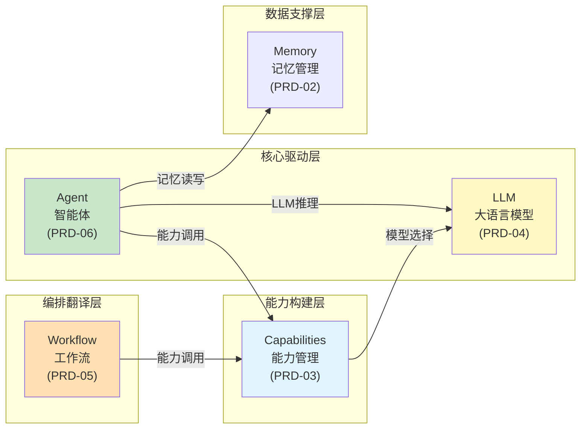
```mermaid
flowchart LR
    subgraph Cap["能力构建层"]
        CAP["Capabilities<br/>能力管理<br/>(PRD-03)"]
    end

    subgraph Core["核心驱动层"]
        LLM["LLM<br/>大语言模型<br/>(PRD-04)"]
        AGENT["Agent<br/>智能体<br/>(PRD-06)"]
    end

    subgraph Orch["编排翻译层"]
        WF["Workflow<br/>工作流<br/>(PRD-05)"]
    end

    subgraph Data["数据支撑层"]
        MEM["Memory<br/>记忆管理<br/>(PRD-02)"]
    end

    AGENT -->|"能力调用"| CAP
    WF -->|"能力调用"| CAP
    CAP -->|"模型选择"| LLM
    AGENT -->|"记忆读写"| MEM
    AGENT -->|"LLM推理"| LLM

    style CAP fill:#e1f5fe
    style LLM fill:#fff9c4
    style AGENT fill:#c8e6c9
    style WF fill:#ffe0b2
```

**模块依赖关系规则**：

| 规则编号 | 规则描述 |
|----------|----------|
| BR-CAP-DEP-001 | 能力管理被 Agent 和 Workflow 依赖调用，被调用时需保证 Provider 状态为 Active 且 Tool 状态为 Available |
| BR-CAP-DEP-002 | 能力管理依赖 LLM 选择，Capability 调用时必须指定具体的 LLM 模型 ID |
| BR-CAP-DEP-003 | LLM 模型不可用时，依赖该模型的能力调用返回错误"模型不可用" |
| BR-CAP-DEP-004 | Provider 状态变更需通过事件总线通知所有依赖的 Agent 和 Workflow |
| BR-CAP-DEP-005 | Tool 状态变更需通过事件总线通知所有已绑定的 Agent |

**验收标准**：

| 编号 | 验收标准 | 验证方法 |
|------|----------|----------|
| AC-CAP-DEP-01 | 能力管理依赖矩阵正确反映与 5 个模块的依赖关系 | 代码审查验证 |
| AC-CAP-DEP-02 | Agent 调用能力时正确校验 Provider 和 Tool 状态 | 单元测试覆盖 |
| AC-CAP-DEP-03 | Provider 状态变更后 5 秒内通知到所有 Agent | 集成测试验证 |
| AC-CAP-DEP-04 | LLM 模型不可用时能力调用正确返回错误 | 故障注入测试 |

---

## 13. 模块关系总览

> 本章节内容整合自 PRD-12 §5.4 模块关系总览，从能力管理模块视角补充其在五层架构中的位置及与其他模块的关系。

### 13.1 能力管理在五层架构中的位置

AI Multi-Agent System 采用五层架构体系，能力管理模块位于**能力构建层**，是构建 Agent 可调用能力资源池的核心抽象层。

**系统五层架构总览**：

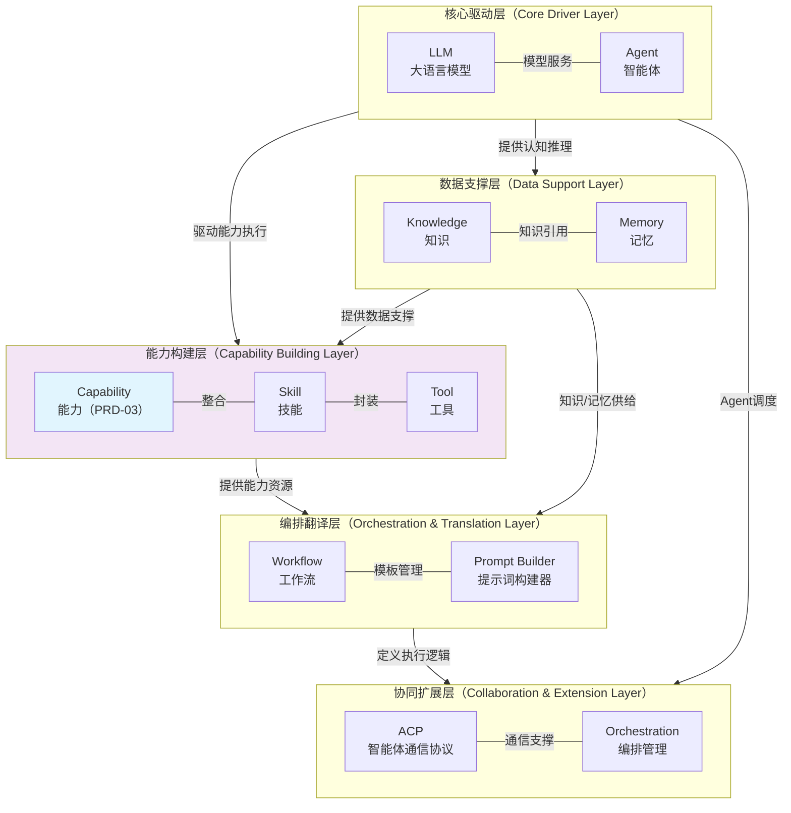
```mermaid
flowchart TB
    subgraph Layer5["协同扩展层（Collaboration & Extension Layer）"]
        ACP["ACP<br/>智能体通信协议"]
        ORCH["Orchestration<br/>编排管理"]
    end

    subgraph Layer4["编排翻译层（Orchestration & Translation Layer）"]
        WF["Workflow<br/>工作流"]
        PB["Prompt Builder<br/>提示词构建器"]
    end

    subgraph Layer3["能力构建层（Capability Building Layer）"]
        CAP["Capability<br/>能力（PRD-03）"]
        SKILL["Skill<br/>技能"]
        TOOL["Tool<br/>工具"]
    end

    subgraph Layer2["数据支撑层（Data Support Layer）"]
        KNOW["Knowledge<br/>知识"]
        MEM["Memory<br/>记忆"]
    end

    subgraph Layer1["核心驱动层（Core Driver Layer）"]
        LLM["LLM<br/>大语言模型"]
        AGENT["Agent<br/>智能体"]
    end

    Layer1 -->|"提供认知推理"| Layer2
    Layer1 -->|"驱动能力执行"| Layer3
    Layer2 -->|"提供数据支撑"| Layer3
    Layer3 -->|"提供能力资源"| Layer4
    Layer4 -->|"定义执行逻辑"| Layer5
    Layer2 -->|"知识/记忆供给"| Layer4
    Layer1 -->|"Agent调度"| Layer5

    LLM ---|"模型服务"| AGENT
    KNOW ---|"知识引用"| MEM
    CAP ---|"整合"| SKILL
    SKILL ---|"封装"| TOOL
    WF ---|"模板管理"| PB
    ACP ---|"通信支撑"| ORCH

    style CAP fill:#e1f5fe
    style Layer3 fill:#f3e5f5
```

**能力构建层职责说明**：

| 维度 | 说明 |
|------|------|
| **层级定位** | 系统的中间层，向下接收 LLM 推理服务和数据支撑，向上为编排层和能力调用方提供统一资源池 |
| **核心职责** | 构建 Agent 可调用的能力资源池（Capability + Skill + Tool），屏蔽底层 MCP 协议和 Transport 差异 |
| **关键能力** | Provider 注册与管理、Tool 发现与加载、Runtime Logs 记录、限流熔断保护、健康检查 |
| **价值贡献** | 统一 Tool 来源（Stdio/Internalizable/Remote）、标准化 Tool 发现与调用协议、提供统一的资源池视图 |

**Capability 与 Skill、Tool 的关系**：

| 实体 | 英文 | 关系 |
|------|------|------|
| Capability | 能力 | 抽象层，整合内部 Skill 和外部 Tool 为统一资源池 |
| Skill | 技能 | Agent 内部封装的领域知识与逻辑组合，可调用 Tool 完成具体任务 |
| Tool | 工具 | 外部系统能力的标准化接口，通过 MCP 协议注册至 Provider |

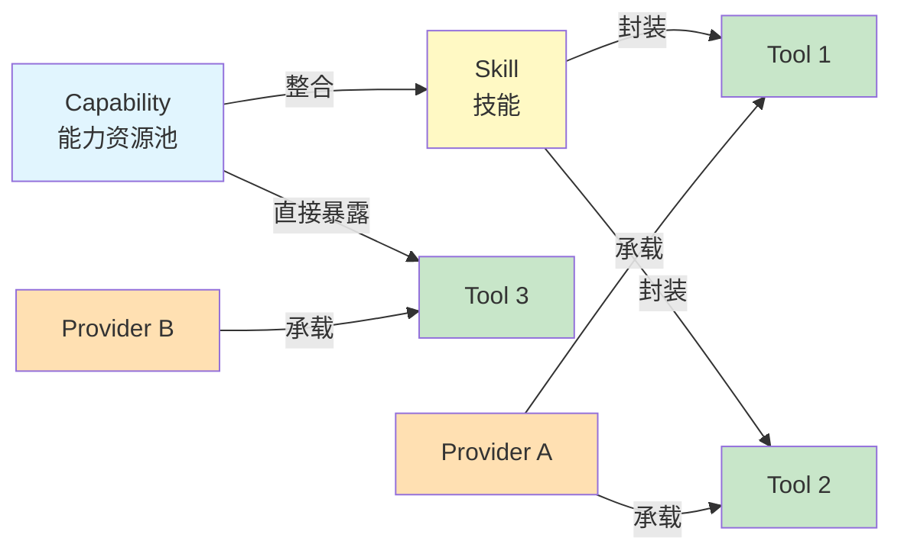
```mermaid
flowchart LR
    CAP["Capability<br/>能力资源池"] -->|"整合"| SK["Skill<br/>技能"]
    SK -->|"封装"| T1["Tool 1"]
    SK -->|"封装"| T2["Tool 2"]
    CAP -->|"直接暴露"| T3["Tool 3"]

    P1["Provider A"] -->|"承载"| T1
    P1 -->|"承载"| T2
    P2["Provider B"] -->|"承载"| T3

    style CAP fill:#e1f5fe
    style SK fill:#fff9c4
    style T1 fill:#c8e6c9
    style T2 fill:#c8e6c9
    style T3 fill:#c8e6c9
    style P1 fill:#ffe0b2
    style P2 fill:#ffe0b2
```

---

### 13.2 与其他模块的关系

能力管理模块与系统中多个核心模块存在依赖和被依赖关系，本节详细说明与各模块的交互方式。

**关系1：能力管理 ↔ LLM（大模型管理）**

| 维度 | 说明 |
|------|------|
| 方向 | Capability ↔ LLM |
| 类型 | 双向依赖 |
| 描述 | 能力管理整合 Skill 和 Tool 为统一资源池，能力调用时需要选择 LLM 模型进行推理；LLM 的参数配置（Temperature、Top-P 等）影响能力的执行效果 |
| 数据流 | 能力定义 → 模型选择 → LLM 调用 → 结果返回 → 能力执行 |
| 影响范围 | LLM 模型不可用时，依赖该模型的能力调用将失败并返回"模型不可用"错误 |
| 文档参考 | PRD-04 大语言模型模块 |

**关系2：能力管理 ↔ Agent（代理管理）**

| 维度 | 说明 |
|------|------|
| 方向 | Agent → Capability |
| 类型 | 调用依赖（单向） |
| 描述 | Agent 在执行任务时按需调用 Tool 完成数据处理、文件操作、API 调用等具体动作。Agent 需先与 Tool 建立绑定关系才能调用 |
| 数据流 | Agent 任务执行 → Tool 发现 → 状态校验 → 调用请求 → 结果返回 |
| 影响范围 | Provider 状态变更或 Tool 状态变更需通过事件总线通知到所有相关 Agent |
| 文档参考 | PRD-06 代理管理模块 |

**关系3：能力管理 ↔ Workflow（工作流管理）**

| 维度 | 说明 |
|------|------|
| 方向 | Workflow → Capability |
| 类型 | 调用依赖（单向） |
| 描述 | 工作流节点可引用 Capability 实现工作流步骤的能力执行，如数据查询、文件处理、API 调用等节点 |
| 数据流 | 工作流节点执行 → Tool 调用 → 返回结果 → 工作流推进 |
| 影响范围 | Tool 删除或状态变更时需评估对工作流节点的影响 |
| 文档参考 | PRD-05 编排管理模块（Workflow 子模块） |

**关系4：能力管理 ↔ 监控与分析**

| 维度 | 说明 |
|------|------|
| 方向 | Monitoring → Capability |
| 类型 | 监控采集（单向） |
| 描述 | 监控与分析模块从能力管理采集 Provider 健康状态、Tool 调用成功率、响应时间、限流熔断事件等运行指标 |
| 数据流 | 能力管理指标 → 采集 Agent → PostgreSQL 分区表 / Prometheus → 监控面板/告警规则 |
| 影响范围 | 监控采集不影响能力管理业务运行，但故障会导致监控盲区 |
| 文档参考 | PRD-11 监控与分析模块 |

**关系5：能力管理 ↔ 用户管理（权限）**

| 维度 | 说明 |
|------|------|
| 方向 | Capability → User |
| 类型 | 权限依赖（单向） |
| 描述 | Provider 和 Tool 的增删改查需基于 RBAC 权限控制，Agent 开发者仅可查看和绑定 Tool，不可修改 Provider 配置 |
| 数据流 | 用户登录 → 权限加载 → 菜单过滤 → 功能鉴权 |
| 影响范围 | 权限回收时需实时更新能力管理模块的可见性和操作权限 |
| 文档参考 | PRD-08 用户管理模块 |

**关系6：能力管理 → Memory（记忆管理）**

| 维度 | 说明 |
|------|------|
| 方向 | Capability → Memory |
| 类型 | 可选依赖（单向） |
| 描述 | [TBD-产品决策] Tool 调用结果可选择性地写入 Memory，用于 Agent 后续对话的上下文引用 —— 依据：Tool 执行结果包含重要业务数据时，记忆化可提升 Agent 多轮对话的连贯性 |
| 数据流 | Tool 调用 → 结果评估 → 写入 Memory → 后续对话检索 |
| 影响范围 | Memory 写入失败不影响 Tool 调用主流程 |
| 文档参考 | PRD-02 记忆管理模块 |

---

## 14. 非功能需求汇总

> 本章节内容整合自 PRD-12 §5.5 非功能需求汇总，针对能力管理模块特性做具体化和补充。

> **说明**：本节为非功能需求的系统化汇总，与 §10 存在内容重叠。以 §10 NFR-01~NFR-32 为权威定义，本节补充 §10 未覆盖的运维和可观测性相关需求。

### 14.1 性能需求

> 本节需求与 §10.1 NFR-01~NFR-10 高度重叠，以 §10 为权威定义。以下仅保留 §10 未覆盖的条目。

| 编号 | 需求项 | 指标 | 验证方法 | 文档参考 |
|------|--------|------|----------|----------|
| CAP-NFR-P-010 | 能力管理 KPI 卡片加载时间 | ≤ 3秒（首屏 7 个 KPI 全部渲染完成） | Performance API 测量 | 沿用 PRD-02 NFR-P-01 |
| CAP-NFR-P-011 | Tool 加载成功率 | ≥ 95% | 加载成功数 / 加载总数 | 沿用 §3.3 业务目标 |
| CAP-NFR-P-012 | Provider 创建成功率 | ≥ 98% | 创建成功数 / 创建总数 | 沿用 §3.3 业务目标 |

**性能基线**：

| 指标 | 能力管理基线值 | 通用基线值（PRD-12） | 关系 |
|------|----------------|---------------------|------|
| API P95 响应时间 | ≤ 500ms | ≤ 500ms | 与通用基线一致 |
| API P99 响应时间 | ≤ 2秒 | ≤ 2秒 | 与通用基线一致 |
| 列表分页加载 | ≤ 1秒 | ≤ 1秒 | 与通用基线一致 |
| 搜索响应时间 | ≤ 1秒 | ≤ 1秒 | 与通用基线一致 |
| Tool 调用 P95 延迟 | ≤ 2秒 | — | 能力管理特性指标 |

---

### 14.2 安全需求

> 本节需求与 §10.3 NFR-16~NFR-22 高度重叠，以 §10 为权威定义。以下仅保留 §10 未覆盖的条目。

| 编号 | 需求项 | 指标 | 验证方法 | 文档参考 |
|------|--------|------|----------|----------|
| CAP-NFR-S-008 | 多租户隔离 | Provider 和 Tool 数据按 Merchant 隔离，杜绝跨租户数据访问 | 渗透测试 | 沿用 PRD-12 NFR-S-008 |
| CAP-NFR-S-009 | 防注入 | SQL 注入、XSS、CSRF、SSRF 防护 | 渗透测试 | 沿用 PRD-12 NFR-S-009 |
| CAP-NFR-S-010 | 请求限流 | 单用户 API 调用频率限制（100次/分钟）；Tool 调用限流默认 60次/分钟/Agent | 压力测试 | 沿用 PRD-12 NFR-S-010 + §6.9 |
| CAP-NFR-S-011 | Token 轮换 | [TBD-产品决策] 支持定期轮换敏感变量 Value，轮换时自动更新关联的 MCP Server 连接 | 功能测试 | 沿用 §6.10 |
| CAP-NFR-S-012 | 审计日志完整性 | 所有审计日志不可篡改 | 日志审查 | 沿用 PRD-12 NFR-S-007 |

**Token 加密与脱敏规则（与 §6.2 CAP-BR-010 一致）**：

| Token 类型 | 存储方式 | 界面展示 | 日志展示 |
|------------|----------|----------|----------|
| Authorization Token | AES-256 加密 | 密码框（默认隐藏） | 前 4 位 + **** |
| 敏感环境变量 Value | AES-256 加密 | ••••••••（默认脱敏，可临时查看） | ••••••••（完全脱敏） |
| 非敏感环境变量 Value | 明文 | 明文 | 明文 |

---

### 14.3 可用性需求

> 本节需求与 §10.2 NFR-11~NFR-15 高度重叠，以 §10 为权威定义。以下仅保留 §10 未覆盖的条目。

| 编号 | 需求项 | 指标 | 验证方法 | 文档参考 |
|------|--------|------|----------|----------|
| CAP-NFR-A-006 | 故障切换时间 | ≤ 10 秒（自动故障切换） | 高可用测试 | 沿用 PRD-12 NFR-A-006 |
| CAP-NFR-A-007 | API 错误率 | ≤ 0.1%（排除客户端错误） | 监控报表 | 沿用 PRD-12 NFR-A-007 |
| CAP-NFR-A-008 | Runtime Logs 保留期限 | 90 天，超期自动归档清理 | 备份记录 | 沿用 §6.3 CAP-BR-018 |
| CAP-NFR-A-009 | 熔断保护 | 健康检查失败期间，暂停该 Provider 下所有 Tool 的调用请求 | 故障注入测试 | 沿用 §6.7 |
| CAP-NFR-A-010 | 软删除保留期 | 30 天后物理删除 | 备份记录 | 沿用 §6.1 CAP-BR-003 |

**降级策略**：

| 场景 | 降级方案 |
|------|----------|
| Provider 连接失败 | Tool 调用返回"Provider 异常"错误，不向不可用 Provider 发送请求 |
| Tool 发现超时 | 提供手动重试按钮，支持跳过 Tool 发现步骤，后续手动加载 |
| 熔断器开启 | 返回预定义的降级响应（如空结果+错误提示），而非直接报错 |
| 监控采集失败 | 业务功能正常运行，仅监控数据缺失 |
| Runtime Logs 存储异常 | 记录日志但不影响 Tool 调用主流程 |

---

### 14.4 兼容性需求

> 本节需求与 §10.4 NFR-23~NFR-27 高度重叠，以 §10 为权威定义。以下仅保留 §10 未覆盖的条目。

| 编号 | 需求项 | 指标 | 验证方法 | 文档参考 |
|------|--------|------|----------|----------|
| CAP-NFR-C-006 | API 向后兼容 | API 版本升级时，旧版本至少保留 6 个月兼容期 | 版本管理检查 | 沿用 PRD-12 NFR-C-004 |
| CAP-NFR-C-007 | 分辨率适配 | 最小支持 1280x720（桌面端），推荐 1920x1080 | 响应式测试 | 沿用 PRD-12 NFR-C-002 |
| CAP-NFR-C-008 | 响应式断点 | 支持 XL/LG/MD/SM 四个断点平滑适配 | 响应式测试 | 沿用 PRD-12 NFR-C-005 |

**MCP 协议版本兼容矩阵**：

| MCP 协议版本 | 支持状态 | 说明 |
|--------------|----------|------|
| 2025-03-26 | ✅ 完全支持 | 基准版本 |
| 2025-06-18 | ✅ 完全支持 | 兼容性升级 |
| 更早版本 | [TBD-产品决策] 部分支持 | Tool 列表格式可能存在差异 |

---

### 14.5 可观测性需求

| 编号 | 需求项 | 指标 | 验证方法 | 文档参考 |
|------|--------|------|----------|----------|
| CAP-NFR-O-001 | 监控覆盖 | 所有 API 接口、MCP Server 连接、Tool 调用均有监控指标 | 监控系统验证 | 沿用 §10.6 NFR-33 + PRD-12 NFR-O-002 |
| CAP-NFR-O-002 | 告警机制 | Provider 健康检查失败率 > 10%、Tool 调用失败率 > 5%、调用延迟 > P95 阈值 2 倍时触发告警 | 告警测试 | 沿用 §10.6 NFR-34 + PRD-12 NFR-O-004 |
| CAP-NFR-O-003 | 日志规范 | 所有操作日志遵循统一格式，包含 trace_id 支持链路追踪 | 日志审查 | 沿用 §10.6 NFR-35 + PRD-12 NFR-M-004 |
| CAP-NFR-O-004 | 配置化 | Provider 超时时间、限流阈值、熔断参数均支持动态配置，无需重启服务 | 配置验证 | 沿用 §10.6 NFR-36 + PRD-12 NFR-M-003 |
| CAP-NFR-O-005 | 分布式追踪 | 所有 API 请求支持分布式链路追踪（traceId 贯穿） | 链路追踪验证 | 沿用 PRD-12 NFR-O-001 |
| CAP-NFR-O-006 | 指标暴露 | 所有服务暴露 Prometheus 指标接口（/metrics） | 监控系统验证 | 沿用 PRD-12 NFR-O-002 |
| CAP-NFR-O-007 | 健康检查接口 | 所有服务提供健康检查接口（/health） | 健康检查验证 | 沿用 PRD-12 NFR-O-003 |
| CAP-NFR-O-008 | OpenAPI 文档 | 所有 API 接口自动生成 OpenAPI 文档 | 文档检查 | 沿用 PRD-12 NFR-M-005 |

**关键监控指标**：

| 指标名称 | 指标类型 | 告警阈值 | 备注 |
|----------|----------|----------|------|
| Provider 可用率 | Gauge | < 99.5% | 持续 5 分钟触发告警 |
| Provider 健康检查失败率 | Gauge | > 10% | 持续 5 分钟触发告警 |
| Tool 调用成功率 | Gauge | < 95% | 持续 5 分钟触发告警 |
| Tool 调用 P95 延迟 | Histogram | > 4秒 | P95 阈值 2 倍 |
| Tool 调用 QPS | Counter | — | 用于容量规划 |
| 熔断器开启次数 | Counter | > 10次/分钟 | 异常熔断触发告警 |
| Runtime Log 写入失败次数 | Counter | > 0 | 立即告警 |

**链路追踪规范**：

| 字段 | 说明 |
|------|------|
| trace_id | 全局链路追踪 ID，从 API 网关贯穿至 MCP Server 调用 |
| span_id | 单个调用环节的标识 |
| parent_span_id | 父级 Span ID |
| user_id | 当前操作用户 ID |
| merchant_id | 当前操作商户 ID |
| provider_id | Provider 唯一标识（Tool 调用时） |
| tool_id | Tool 唯一标识（Tool 调用时） |

### 14.6 三层缓存架构

> 代码实现：L1 内存配置缓存 + L2 方法级 LRU + L3 级联清除

**缓存层级**：

| 层级 | 实现 | TTL | 说明 |
|------|------|-----|------|
| L1 | `Config.mcp_configuration[partition_key]` | 1800s | 内存级 MCP 配置缓存 |
| L2 | `@method_cache` 装饰器 | 1800s | 方法级 LRU 缓存 |
| L3 | `purge_entity_cascading_cache` | — | 级联缓存清除 |

**级联清除依赖图**：
- `partition` → 清除该分区下所有缓存
- `module` → `function` → `function_call`
- `module` → `setting`

**Admin Cache 管理端点**（以下接口通过 API Gateway 内部路由暴露，前端统一通过 GraphQL 单总线访问）：

| 端点 | 方法 | 说明 |
|------|------|------|
| `/api/v1/capabilities/admin/cache/refresh` | POST | 刷新指定分区缓存 |
| `/api/v1/capabilities/admin/cache/status` | GET | 查看缓存状态 |
| `/api/v1/capabilities/admin/cache/{partition_key}` | DELETE | 删除指定分区缓存 |
| `/api/v1/capabilities/admin/cache` | DELETE | 删除全部缓存 |

**缓存预热时机**：
- `processMcpPackage` 完成后
- `syncExternalMcpServer` 完成后
- GraphQL 配置变更后

### 14.7 Rate Limiting

> 代码实现：`rate_limit_check()` in `mcp_app.py`

**限流机制**：per-IP 限流，可配置阈值。

**配置项**：
- `rate_limit_per_minute`：每分钟请求数限制（默认 60）
- `rate_limit_burst`：突发请求数（默认 10）

**超限响应**：HTTP 200 + 业务错误码 `053403`(限流触发) + `Retry-After` 响应头（HTTP 429 仅在 API Gateway 网关层使用）。

### 14.8 数据分类与存储映射

| 数据类别 | 存储位置 | 隔离方式 | 敏感等级 |
|----------|----------|----------|----------|
| Provider 配置 | PostgreSQL | RLS (`partition_key`) | 最高 — 含 API Key/Token |
| Tool 元数据 | PostgreSQL + Neo4j | PG: RLS; Neo4j: GraphLabel | PG: 高; Neo4j: 低 |
| Skill 元数据 | PostgreSQL + Neo4j | PG: RLS; Neo4j: GraphLabel | PG: 高; Neo4j: 低 |
| Skill 脚本/资源 | S3 / PostgreSQL LO | S3: tenant prefix; PG: RLS | 高 — 可执行代码 |
| AG-UI 事件 | PostgreSQL | RLS (`partition_key`) | 高 — 可能含 PII |
| AG-UI 组件 Schema | PostgreSQL + Neo4j | PG: RLS; Neo4j: GraphLabel | 低 |
| Tool 调用日志 | PostgreSQL | RLS (`partition_key`) | 中 |
| MCP 配置缓存 | Redis | `cap:{tid}:` namespace | 低 |
| MCP 函数注册 | PostgreSQL JSONB | RLS (`partition_key`) + GIN 索引 | 中 |
| MCP 模块注册 | PostgreSQL JSONB | RLS (`partition_key`) + GIN 索引 | 中 |
| 审计日志 | PostgreSQL (WORM) | 应用层控制 | 最高 |

---

## 15. 接口规范汇总

> 本章节内容整合自 PRD-12 §5.6 接口规范汇总，针对能力管理模块的 API 设计做具体化说明。

### 15.1 接口总则（GraphQL 单总线）

> **v5 收束说明(2026-06-13)**：能力管理模块对外**仅**暴露 GraphQL 单总线接口。**不**再设计 RESTful 端点、不使用 `/api/v1/capabilities/...` 资源路径、不使用 HTTP 方法语义区分操作。

| 规范项 | 说明 |
|--------|------|
| 接口形态 | **GraphQL**（`POST /graphql`），遵循 PRD-00 §A5 GraphQL Schema 设计规范 |
| 操作类型 | `Query`（查询）、`Mutation`（写操作）、`Subscription`（实时推送） |
| 命名约定 | Query 使用名词 / 动词 + 资源，`Mutation` 使用动词 + 资源 + Input |
| 多租户 | `info.context["partition_key"]` 由 Gateway 注入，业务模块**不**接受租户入参 |
| 错误表达 | 业务错误通过 `errors[].extensions.code` 传递 `BIZ_CAPABILITY_*` 命名空间 |
| HTTP 状态 | 业务层恒为 200；HTTP 401/403 仅保留在 API Gateway 网关层（Token 缺失/越权拦截） |
| 文档位置 | 全部 Schema 定义、Query/Mutation、Input Type 见 **§A5 GraphQL Schema** |

---

### 15.2 错误码体系

> **错误码统一说明**：原 `070xxx` 格式错误码已废弃，统一为 `053001-053999` 段位（6 位码），与 §1 文档信息中声明的错误码命名空间对齐。原 054xxx 段位已重新分配至 0533xx-0534xx（避免占用 PRD-12 权限域 054xxx 段位）。§24 中的 `5xxxx` 格式也已统一。

**详细错误码定义请参考 §24，本节不再重复定义**。§24 已按段位逐项列出所有错误码（053001-053099 通用、053100-053199 Provider、053200-053299 Tool、053300-053399 Skill、053400-053499 AG-UI、053500-053999 预留）。

---

### 15.3 响应格式

能力管理模块 API 响应遵循全局统一响应格式，详见 PRD-12 §5.6.4。

> **v5 收束说明(2026-06-13)**：所有能力管理接口响应遵循 GraphQL 标准信封 `{data, errors, extensions.traceId}`，**不**再使用 `{code, message, data, timestamp, traceId}` 旧式信封。业务错误码位于 `errors[].extensions.code`，traceId 位于 `extensions.traceId`。

**成功响应示例（Tool 列表查询 - Relay Connection）**：

```json
{
  "data": {
    "tools": {
      "edges": [
        {
          "cursor": "Y3Vyc29yOjE=",
          "node": {
            "id": "tool_001",
            "name": "csv_parser",
            "description": "Parse CSV files into structured data",
            "status": "Available",
            "providerId": "provider_001",
            "providerName": "DataTools MCP",
            "version": "1.0.0",
            "createdAt": "2026-06-01T10:30:00Z",
            "updatedAt": "2026-06-08T15:20:00Z"
          }
        }
      ],
      "pageInfo": {
        "hasNextPage": true,
        "hasPreviousPage": false,
        "startCursor": "Y3Vyc29yOjE=",
        "endCursor": "Y3Vyc29yOjE="
      },
      "totalCount": 50
    }
  },
  "errors": null,
  "extensions": {
    "traceId": "5f9c0a7e-2a3b-4d12-b6c1-1f8e2b1a6f0d"
  }
}
```

> **P1-014 收束说明(2026-06-13)**：分页响应**仅**保留 Relay Connection（`edges` / `pageInfo` / `totalCount`），删除原 `items` 数组形态。

**成功响应示例（Provider 详情）**：

```json
{
  "data": {
    "provider": {
      "id": "provider_001",
      "name": "DataTools MCP",
      "status": "Active",
      "transport": "Stdio",
      "timeout": 30,
      "stdioConfig": {
        "command": "npx",
        "workingDirectory": "/opt/mcp-servers",
        "arguments": ["-y", "@modelcontextprotocol/server-csv"]
      },
      "toolCount": 5,
      "healthStatus": {
        "lastCheckTime": "2026-06-08T15:25:00Z",
        "consecutiveFailures": 0,
        "errorMessage": null
      },
      "createdAt": "2026-06-01T10:30:00Z",
      "updatedAt": "2026-06-08T15:20:00Z",
      "createdBy": "u_admin_001",
      "updatedBy": "u_admin_001"
    }
  },
  "errors": null,
  "extensions": {
    "traceId": "5f9c0a7e-2a3b-4d12-b6c1-1f8e2b1a6f0d"
  }
}
```

**错误响应示例（Provider 名称已存在）**：

```json
{
  "data": null,
  "errors": [
    {
      "message": "Provider 名称 'DataTools MCP' 已存在，请使用其他名称",
      "path": ["createProvider", "input", "name"],
      "extensions": {
        "code": "BIZ_CAPABILITY_PROVIDER_NAME_DUPLICATED",
        "field": "name",
        "traceId": "5f9c0a7e-2a3b-4d12-b6c1-1f8e2b1a6f0d"
      }
    }
  ],
  "extensions": {
    "traceId": "5f9c0a7e-2a3b-4d12-b6c1-1f8e2b1a6f0d"
  }
}
```

**外部服务错误响应示例**（MCP Server 连接超时）：

```json
{
  "data": null,
  "errors": [
    {
      "message": "连接 https://mcp.example.com 超时（30秒），请检查网络或增加超时时间",
      "path": ["testProviderConnection", "input"],
      "extensions": {
        "code": "BIZ_CAPABILITY_MCP_CONNECTION_TIMEOUT",
        "field": "mcpServerUrl",
        "traceId": "5f9c0a7e-2a3b-4d12-b6c1-1f8e2b1a6f0d"
      }
    }
  ],
  "extensions": {
    "traceId": "5f9c0a7e-2a3b-4d12-b6c1-1f8e2b1a6f0d"
  }
}
```

---

### 15.4 分页规范

能力管理模块的列表查询 API 遵循全局分页规范，详见 PRD-12 §5.6.6。统一采用 **Relay Connection** 规范（Cursor-based Pagination），不再使用 `page` / `pageSize` 模式。

**分页请求参数（Relay Connection 规范）**：

| 参数名 | 类型 | 默认值 | 必填 | 说明 |
|--------|------|--------|------|------|
| first | Integer | 20 | 否 | 返回前 N 条记录，可选值：10/20/50/100 |
| after | String | - | 否 | 翻页游标（上一页响应中的 `endCursor`），首次查询不传 |
| before | String | - | 否 | 反向翻页游标，与 `last` 配合使用 |
| last | Integer | - | 否 | 返回后 N 条记录，与 `before` 配合使用 |
| sort | String | createdAt:desc | 否 | 排序字段:排序方向，支持多字段排序（逗号分隔） |
| search | String | - | 否 | 全文搜索关键词 |
| status | String | - | 否 | 状态筛选（Provider：ACTIVE/INACTIVE/DEGRADED/UNHEALTHY/DISABLED；Tool：Available/Unavailable/Configuring） |
| provider_id | String | - | 否 | Provider ID 筛选（仅 Tool 列表） |
| transport | String | - | 否 | Transport 类型筛选（仅 Provider 列表） |

**分页响应结构（Relay Connection 规范）**：

> **P1-025 收束说明(2026-06-13)**：Relay Connection 直接作为 GraphQL 顶层 query 字段的返回类型（`data.<listFieldName>.edges/pageInfo/totalCount`），分页响应**示例**仅展示 Relay Connection 自身结构（无 `data` 包装层）。**完整响应**仍遵循 PRD-00 §4 GraphQL 全局规范 `{data, errors, extensions.traceId}` 信封格式。

```json
{
  "edges": [
    {
      "cursor": "Y3Vyc29yOjE=",
      "node": {
        "id": "tool_001",
        "name": "csv_parser",
        "status": "Available"
      }
    }
  ],
  "pageInfo": {
    "hasNextPage": true,
    "hasPreviousPage": false,
    "startCursor": "Y3Vyc29yOjE=",
    "endCursor": "Y3Vyc29yOjIw"
  },
  "totalCount": 50
}
```

**分页响应字段说明**：

| 字段名 | 类型 | 说明 |
|--------|------|------|
| edges | Array | 边集合，每条边包含 `cursor` 和 `node` |
| edges[].cursor | String | 不透明游标（Base64 编码），用于翻页 |
| edges[].node | Object | 单条数据记录 |
| pageInfo | Object | 分页元信息 |
| pageInfo.hasNextPage | Boolean | 是否存在下一页 |
| pageInfo.hasPreviousPage | Boolean | 是否存在上一页 |
| pageInfo.startCursor | String | 当前页第一条数据的游标 |
| pageInfo.endCursor | String | 当前页最后一条数据的游标 |
| totalCount | Integer | 总记录数（按当前过滤条件） |

**能力管理 API 分页典型场景**：

| 接口 | 默认排序 | 支持筛选字段 |
|------|----------|--------------|
| Provider 列表 | createdAt:desc | status、transport、search |
| Tool 列表 | createdAt:desc | status、provider_id、search |
| Runtime Logs | called_at:desc | call_status、tool_id、time_range |
| 关联 Agent 列表 | bind_time:desc | bind_type |

**分页验收标准**：

| 编号 | 验收标准 | 验证方法 |
|------|----------|----------|
| AC-CAP-PG-01 | 分页接口支持 first、after、sort、search 四个标准参数（Relay Connection 规范） | 接口测试 |
| AC-CAP-PG-02 | 分页响应结构符合 Relay Connection 规范（含 edges / pageInfo / totalCount） | 接口测试 |
| AC-CAP-PG-03 | 超出范围的 after 游标返回空 edges 而非错误 | 接口测试 |
| AC-CAP-PG-04 | first 仅接受 10/20/50/100 四个值，其他值返回参数错误 | 接口测试 |
| AC-CAP-PG-05 | 排序字段支持 createdAt、updatedAt、name 等 | 接口测试 |
| AC-CAP-PG-06 | 游标使用 Base64 编码的不透明字符串，禁止业务侧解析 | 接口测试 |

---

## 16. P0/P1 修复：多租户隔离、MCP 安全与限流增强

> 本章节为依据《Banyan 平台 9 大模块后端技术评估报告》对 PRD-03 能力管理模块的 P0（立即修复）与 P1（重要优化）级别补充内容。所有修复均以最小侵入方式叠加在原文档之上，不影响现有章节逻辑。

### 16.1 Provider/Tool 多租户隔离（修复 P0 缺失）

> **说明**：`partition_key` 即为 PRD-01 中的 `partition_key`，两者为同一值。本文档统一使用 `partition_key` 作为多租户隔离键。
>
> PostgreSQL RLS 策略详见 §19.6。

Provider 与 Tool 表必须显式包含 `partition_key` 字段，作为多租户隔离的第一主键，杜绝跨租户访问。

**Provider 表结构扩展**：

| 字段 | 类型 | 必填 | 默认值 | 说明 |
|------|------|------|--------|------|
| provider_id | VARCHAR(64) | 是 | — | 全局唯一 |
| partition_key | VARCHAR(64) | 是 | — | 所属租户 ID（主隔离标识） |
| provider_name | VARCHAR(100) | 是 | — | Provider 名称（租户内唯一） |
| transport | ENUM | 是 | — | Stdio / Internalizable / Remote |
| status | ENUM | 是 | INACTIVE | INACTIVE / ACTIVE / DEGRADED / UNHEALTHY / DISABLED |
| secret_ref_id | VARCHAR(64) | 否 | NULL | KMS Secret 引用 ID |
| is_deleted | BOOLEAN | 是 | FALSE | 软删除标记（由 deleted_at IS NOT NULL 派生） |
| created_at | TIMESTAMPTZ | 是 | — | 创建时间 |
| created_by | UUID | 是 | — | 创建者用户ID |

**Tool 表结构扩展**：

| 字段 | 类型 | 必填 | 默认值 | 说明 |
|------|------|------|--------|------|
| tool_id | VARCHAR(64) | 是 | — | 全局唯一 |
| partition_key | VARCHAR(64) | 是 | — | 所属租户 ID |
| provider_id | VARCHAR(64) | 是 | — | 所属 Provider（需校验同租户） |
| tool_name | VARCHAR(100) | 是 | — | Tool 名称 |
| status | ENUM | 是 | Configuring | Available / Unavailable / Configuring |
| is_deleted | BOOLEAN | 是 | FALSE | 软删除标记（由 deleted_at IS NOT NULL 派生） |

**Provider 索引**：

```sql
CREATE UNIQUE INDEX uk_provider_tenant_name
  ON provider(partition_key, provider_name) WHERE deleted_at IS NULL;

CREATE INDEX idx_provider_tenant_status
  ON provider(partition_key, status);
```

**跨租户访问防护**：

| 维度 | 校验规则 | 失败处理 |
|------|----------|----------|
| API Token | JWT 中 `partition_key` 与请求 `partition_key` 必须一致 | 返回 200 + errors（权限错误码） |
| Provider 操作 | `provider_id` 所属 `partition_key` 必须等于当前 `partition_key` | 返回 200 + errors（不泄露存在性） |
| Tool 操作 | `tool_id` 与 `provider_id` 同属一个 `partition_key` | 返回 200 + errors |
| 异步任务 | 任务上下文注入 `partition_key`，跨租户执行被拦截 | 任务失败 |
| 跨租户引用 | Agent 绑定 Tool 时校验 `partition_key` 一致 | 绑定失败 |

---

### 16.2 MCP Server Secret KMS 加密（修复 P0 缺失）

原文档 §6.2 CAP-BR-010 已规定 Authorization Token 与敏感环境变量使用 AES-256 加密，本次修复明确 **KMS（Key Management Service）接入**，密钥不再落地应用。

**KMS 加密架构**：

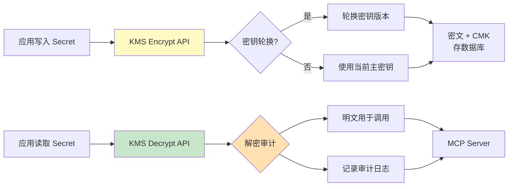
```mermaid
flowchart LR
    A[应用写入 Secret] --> B[KMS Encrypt API]
    B --> C{密钥轮换?}
    C -->|是| D[轮换密钥版本]
    C -->|否| E[使用当前主密钥]
    D --> F[密文 + CMK<br/>存数据库]
    E --> F
    G[应用读取 Secret] --> H[KMS Decrypt API]
    H --> I{解密审计}
    I --> J[明文用于调用]
    I --> K[记录审计日志]
    J --> L[MCP Server]
    K --> L

    style B fill:#fff9c4
    style H fill:#c8e6c9
    style I fill:#ffe0b2
```

**KMS 集成规范**：

| 维度 | 规范 |
|------|------|
| 密钥算法 | AES-256-GCM（含完整性校验） |
| 密钥托管 | AWS KMS（通过 boto3_kms 连接池）；HashiCorp Vault 作为本地开发替代 |
| 密钥轮换 | 主密钥 90 天自动轮换；数据密钥每次解密请求随机生成 |
| 密钥访问 | 应用通过 IAM Role / Service Account 获取，不接触明文密钥 |
| 审计日志 | 所有 Decrypt 操作记录到 CloudTrail / 操作审计，含 user、partition_key、resource_id |
| 备份加密 | 数据库备份使用独立的 KMS 密钥加密 |
| 离线容灾 | 支持 KMS 不可用时降级为本地加密（HSM 备份密钥） |

**MCP Server Secret 字段加密**：

| 字段 | 加密前 | 加密后 | 存储位置 |
|------|--------|--------|----------|
| Authorization Token | `Bearer eyJhbGciOiJIUzI1...` | `kms:v1:cmk_cap_a:0a1b2c3d...` | `provider.auth_token` |
| API Key | `sk-1234567890abcdef` | `kms:v1:cmk_cap_a:1b2c3d4e...` | `provider.api_key` |
| 敏感环境变量 | `DB_PASSWORD=xxx` | `kms:v1:cmk_cap_a:2c3d4e5f...` | `env_var.value` |
| OAuth Client Secret | `secret_xxxxx` | `kms:v1:cmk_cap_a:3c4d5e6f...` | `oauth.client_secret` |

**解密性能**：

| 场景 | 延迟 | 优化策略 |
|------|------|----------|
| 单次解密 | ≤ 50ms | KMS SDK 连接池 |
| 批量解密（100 条） | ≤ 200ms | 并发解密 + 缓存 |
| 缓存命中 | ≤ 5ms | 解密结果内存缓存 5 分钟 |
| KMS 不可用 | 返回错误 | 启动时检查 KMS 可用性 |

---

### 16.3 OAuth/SSO 企业级单点登录（修复 P0 缺失）

企业客户必须支持 SAML 2.0 与 OIDC 单点登录，对接企业 IdP（Identity Provider）实现统一身份管理。

**SSO 集成架构**：

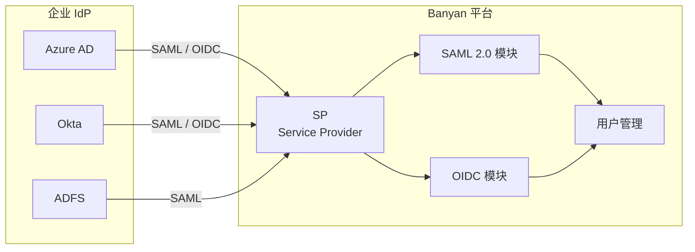
```mermaid
flowchart LR
    subgraph ENTERPRISE["企业 IdP"]
        AZURE[Azure AD]
        OKTA[Okta]
        ADFS[ADFS]
    end

    subgraph PLATFORM["Banyan 平台"]
        SP[SP<br/>Service Provider]
        SAML[SAML 2.0 模块]
        OIDC[OIDC 模块]
        USR[用户管理]
    end

    AZURE -->|SAML / OIDC| SP
    OKTA -->|SAML / OIDC| SP
    ADFS -->|SAML| SP
    SP --> SAML
    SP --> OIDC
    SAML --> USR
    OIDC --> USR
```

**SAML 2.0 规范**：

| 维度 | 规范 |
|------|------|
| 协议版本 | SAML 2.0 |
| 绑定 | HTTP-POST Binding、HTTP-Redirect Binding |
| NameID 格式 | urn:oasis:names:tc:SAML:1.1:nameid-format:emailAddress |
| 签名算法 | SHA-256 |
| Assertion 加密 | 可选（高安全场景必选） |
| IdP 证书 | 管理员上传 IdP 证书，支持多证书轮换 |
| SP 元数据 | 平台导出 SP EntityID 与 ACS URL |
| 登出 | SLO（Single Logout）支持 HTTP-Redirect 与 SOAP |

**OIDC 规范**：

| 维度 | 规范 |
|------|------|
| 协议版本 | OpenID Connect Core 1.0 |
| 授权模式 | Authorization Code + PKCE |
| Scope | openid、profile、email、groups |
| Token 类型 | ID Token（JWT）+ Access Token + Refresh Token |
| 签名算法 | RS256（RSA-SHA256） |
| JWKS | 通过 IdP JWKS URL 动态获取公钥 |
| 用户信息 | 通过 userinfo endpoint 获取 |

**SSO 集成步骤**：

| 步骤 | 操作 |
|------|------|
| 1 | 管理员在企业 IdP 注册 Banyan 平台为 SP/Client |
| 2 | 获取 IdP 元数据（EntityID、SLO URL、证书 / JWKS URL、ClientID、ClientSecret） |
| 3 | 在 Banyan 平台 SSO 配置页面填写 IdP 信息 |
| 4 | 上传 SP 元数据到 IdP（自动生成 EntityID 与 ACS URL） |
| 5 | 测试 SSO 登录：使用企业账号登录验证 |
| 6 | 配置用户属性映射：邮件、姓名、所属组等 |
| 7 | 启用 SSO：用户登录自动跳转到企业 IdP |

**SSO 用户属性映射**：

| IdP 属性 | 平台字段 | 必填 |
|----------|----------|------|
| email / NameID | `user.email` | 是 |
| given_name | `user.first_name` | 否 |
| family_name | `user.last_name` | 否 |
| groups / roles | `user.roles` | 否 |
| department | `user.department` | 否 |
| employee_id | `user.external_id` | 否 |

**SSO 验收标准**：

| 编号 | 验收标准 | 验证方法 |
|------|----------|----------|
| AC-CAP-SSO-01 | 支持 SAML 2.0 SP 角色，可与 Azure AD/Okta/ADFS 集成 | 集成测试 |
| AC-CAP-SSO-02 | 支持 OIDC Authorization Code + PKCE 流程 | 集成测试 |
| AC-CAP-SSO-03 | SSO 登录成功后自动创建/匹配平台用户 | 功能测试 |
| AC-CAP-SSO-04 | 支持 SLO 单点登出，会话失效跨应用 | 集成测试 |
| AC-CAP-SSO-05 | IdP 证书 / JWKS 轮换不影响已登录用户 | 故障注入 |
| AC-CAP-SSO-06 | 群组属性自动映射到平台角色 | 功能测试 |

---

### 16.4 统一权限标识（修复 P1）

能力管理模块权限标识在原文档中已采用 `capability:list` 等格式，本次统一为**资源级 + 操作级**两段式格式 `capability:list/read/edit/delete`，与 PRD-12 §5.7.3 全局规范对齐。

**Capability 模块权限标识**：

| 资源 | 权限标识 | 含义 | 默认角色 |
|------|----------|------|----------|
| Provider | `capability:list` | 查看 Provider 列表 | 开发者/运维/管理员 |
| Provider | `capability:read` | 查看 Provider 详情 | 开发者/运维/管理员 |
| Provider | `capability:edit` | 创建/编辑 Provider | 管理员 |
| Provider | `capability:delete` | 删除 Provider | 管理员 |
| Tool | `tool:list` | 查看 Tool 列表 | 开发者/运维/管理员 |
| Tool | `tool:read` | 查看 Tool 详情 | 开发者/运维/管理员 |
| Tool | `tool:edit` | 编辑 Tool 元数据 | 开发者/管理员 |
| Tool | `tool:delete` | 删除 Tool | 管理员 |
| Tool | `tool:status:manage` | 切换 Tool 状态 | 开发者/管理员 |
| Tool | `tool:bind` | 绑定/解绑 Agent | 开发者/管理员 |
| Tool | `tool:secret:reveal` | 查看敏感变量明文 | 管理员（高敏感） |
| 运行时日志 | `runtime_log:list` | 查看 Runtime Logs | 运维/管理员 |
| 运行时日志 | `runtime_log:export` | 导出 Runtime Logs | 运维/管理员 |

**权限矩阵**：

| 功能/操作 | 超级管理员 | 商户管理员 | 开发者 | 运维 | 普通用户 |
|-----------|:----------:|:----------:|:------:|:----:|:--------:|
| capability:list | ✅ | ✅ | ✅ | ✅ | ❌ |
| capability:read | ✅ | ✅ | ✅ | ✅ | ❌ |
| capability:edit | ✅ | ✅ | ❌ | ❌ | ❌ |
| capability:delete | ✅ | ✅ | ❌ | ❌ | ❌ |
| tool:edit | ✅ | ✅ | ✅ | ❌ | ❌ |
| tool:delete | ✅ | ✅ | ❌ | ❌ | ❌ |
| tool:secret:reveal | ✅ | ✅ | ❌ | ❌ | ❌ |

---

### 16.5 Capability 调用链路 APM 追踪（修复 P1）

所有 Capability 调用必须支持分布式链路追踪，traceId 从 API 网关贯穿到 MCP Server 调用，span 上报 APM 平台。

**Trace Span 规范**：

| Span 名称 | 父 Span | 必填属性 | 说明 |
|----------|---------|----------|------|
| `api.capability.list` | api-gateway | traceId、partition_key、user_id、first、after | API 入口 |
| `capability.provider.query` | `api.capability.list` | traceId、provider_id、partition_key | Provider 查询 |
| `capability.tool.bind` | `api.capability.bind` | traceId、tool_id、agent_id、partition_key | Tool 绑定 |
| `mcp.connect` | `capability.provider.test_connection` | traceId、provider_id、partition_key、transport、duration_ms | MCP Server 连接 |
| `mcp.tool.discover` | `mcp.connect` | traceId、provider_id、tool_count、duration_ms | Tool 发现 |
| `mcp.tool.invoke` | `agent.execute` | traceId、tool_id、provider_id、partition_key、duration_ms、status、error_code | Tool 调用 |
| `capability.rate_limit.check` | `mcp.tool.invoke` | traceId、partition_key、user_id、agent_id、limit_type、limit_value | 限流校验 |
| `capability.circuit_breaker.check` | `mcp.tool.invoke` | traceId、provider_id、state、failure_count | 熔断检查 |

**TraceId 传递规范**：

| 层级 | 传递方式 |
|------|----------|
| HTTP 入口 | Header `X-Trace-Id`（如未传入则生成 UUID） |
| 内部方法 | Python `contextvars` / structlog |
| 异步任务 | 任务消息携带 `trace_id` 字段 |
| 消息队列 | Message Header `trace_id` |
| MCP Server | MCP 协议 `_meta.traceId` 字段 |
| 数据库 | 不传递，SQL 不包含 trace_id（性能） |
| 日志 | structlog `trace_id` 自动绑定 |

**APM 上报工具**：

| 工具 | 用途 |
|------|------|
| OpenTelemetry SDK | Java/Python/Node.js 自动埋点 |
| Jaeger / OpenTelemetry | Trace 存储与展示 |
| Prometheus + Grafana | 指标监控与告警 |
| 日志平台（PostgreSQL 分区表） | 日志聚合与 traceId 关联 |

**调用链路示例**：

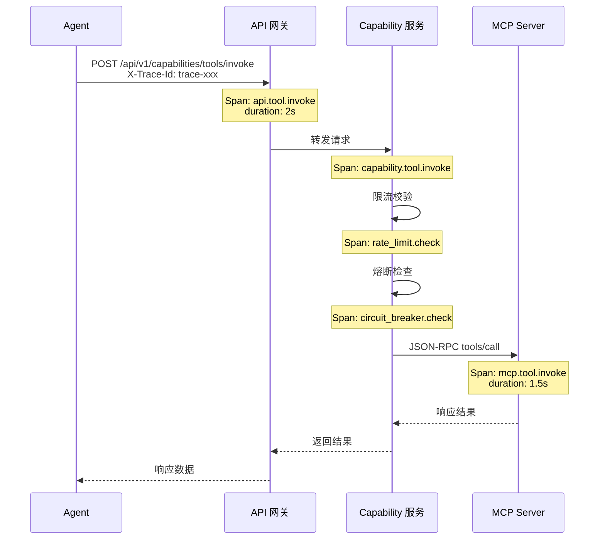
```mermaid
sequenceDiagram
    participant AG as Agent
    participant API as API 网关
    participant CAP as Capability 服务
    participant MCP as MCP Server

    AG->>API: POST /api/v1/capabilities/tools/invoke<br/>X-Trace-Id: trace-xxx
    Note over API: Span: api.tool.invoke<br/>duration: 2s
    API->>CAP: 转发请求
    Note over CAP: Span: capability.tool.invoke
    CAP->>CAP: 限流校验
    Note over CAP: Span: rate_limit.check
    CAP->>CAP: 熔断检查
    Note over CAP: Span: circuit_breaker.check
    CAP->>MCP: JSON-RPC tools/call
    Note over MCP: Span: mcp.tool.invoke<br/>duration: 1.5s
    MCP-->>CAP: 响应结果
    CAP-->>API: 返回结果
    API-->>AG: 响应数据
```

---

### 16.6 多维度限流（修复 P1）

Capability 调用必须支持**用户 / 租户 / Agent / 全局**四维度限流，精细化保护下游服务。

**限流策略矩阵**：

| 维度 | 限流键 | 限流阈值 | 触发动作 |
|------|--------|----------|----------|
| 用户 | `tenant:{partition_key}:capability:rate:user:{user_id}` | 100 次/分钟 | 限流 + 提示 |
| 租户 | `tenant:{partition_key}:capability:rate:tenant` | 5,000 次/分钟 | 限流 + 告警 |
| Agent | `tenant:{partition_key}:capability:rate:agent:{agent_id}` | 300 次/分钟 | 限流 + 提示 |
| 全局 | `global:capability:rate:total` | 50,000 次/分钟 | 限流 + 告警 |
| Provider | `tenant:{partition_key}:capability:rate:provider:{provider_id}` | 1,000 次/分钟 | 限流 + 降级 |

**限流算法**：

| 场景 | 算法 | 说明 |
|------|------|------|
| 普通 API | 滑动窗口 | 60 秒滑动窗口，避免突刺 |
| Tool 调用 | 令牌桶 | 允许突发流量，平均速率限制 |
| 批量导出 | 漏桶 | 严格控制速率，避免下游过载 |
| 高频轮询 | 固定窗口 | 简单场景使用 |

**限流响应**：

> GraphQL 接口 HTTP 状态码恒为 200，限流错误通过 errors 字段返回（遵循 PRD-00 §5 规范）。

| HTTP 状态码 | 错误码 | 提示信息 |
|-------------|--------|----------|
| 200 | 053050 | "调用过于频繁，请稍后重试" |
| 200 | 053050 | "租户级限流触发，请联系管理员" |
| 200 | 053050 | "Agent 级限流触发，请减少调用" |
| 200 | 053051 | "系统繁忙，已临时降级" |

**限流响应头**：

| Header | 说明 |
|--------|------|
| `X-RateLimit-Limit` | 限流阈值 |
| `X-RateLimit-Remaining` | 剩余配额 |
| `X-RateLimit-Reset` | 配额重置时间（秒） |
| `Retry-After` | 建议重试等待时间（秒） |

---

### 16.7 Provider 健康检查间隔明确（修复 P1）

原文档 §6.7 中 Provider 健康检查频率为推测值（60 秒），本次明确**默认 30 秒**健康检查周期。

> **状态机权威性说明**：本节 Provider 健康检查涉及的状态机严格遵循 §5.8.1 中定义的 5 状态机（`INACTIVE` / `ACTIVE` / `DEGRADED` / `UNHEALTHY` / `DISABLED`），不再使用历史的 3 状态（Active / Inactive / Error）描述。状态映射关系：`Active → ACTIVE`、`Inactive → INACTIVE`、`Error → UNHEALTHY`，新增 `DEGRADED`（降级）与 `DISABLED`（禁用）两态。

**健康检查参数配置**：

| 参数 | 默认值 | 可选值 | 说明 |
|------|--------|--------|------|
| `health_check_interval` | 30 秒 | 10s / 30s / 60s / 300s | ACTIVE / DEGRADED 状态 Provider 检查间隔 |
| `health_check_interval_unhealthy` | 5 分钟 | 1m / 5m / 15m | UNHEALTHY 状态探测间隔（指数退避，见 §5.8.1） |
| `health_check_timeout` | 5 秒 | 1s ~ 10s | 单次健康检查超时 |
| `failure_threshold` | 3 次 | 1 ~ 10 | 连续失败次数触发 ACTIVE → DEGRADED；再连续 3 次（总计 6 次）触发 DEGRADED → UNHEALTHY |
| `recovery_threshold` | 2 次 | 1 ~ 5 | 连续成功次数恢复 ACTIVE 状态 |
| `concurrent_health_checks` | 10 | 1 ~ 50 | 全局并发健康检查数 |
| `jitter_ratio` | 0.1 | 0.0 ~ 0.5 | 随机抖动比例，避免惊群 |

**健康检查执行流程**（对齐 §5.8.1 五状态机）：

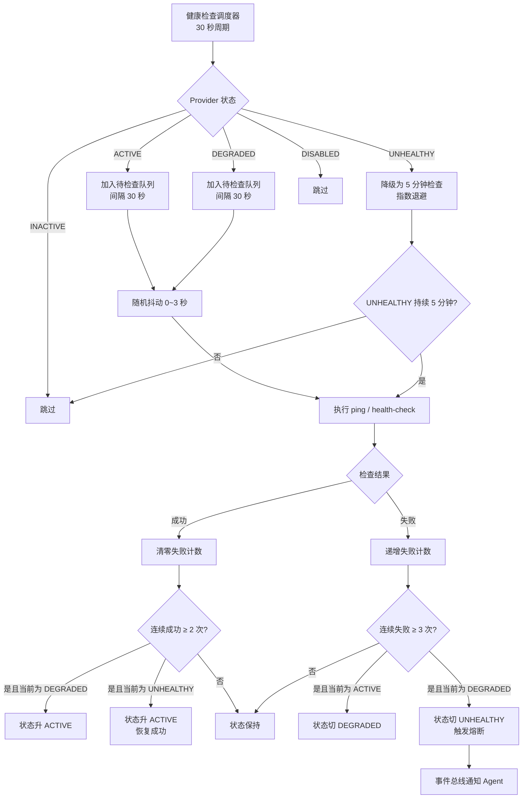
```mermaid
flowchart TD
    A[健康检查调度器<br/>30 秒周期] --> B{Provider 状态}
    B -->|ACTIVE| C[加入待检查队列<br/>间隔 30 秒]
    B -->|DEGRADED| C2[加入待检查队列<br/>间隔 30 秒]
    B -->|UNHEALTHY| D[降级为 5 分钟检查<br/>指数退避]
    B -->|INACTIVE| Z[跳过]
    B -->|DISABLED| Z2[跳过]
    C --> E[随机抖动 0~3 秒]
    C2 --> E
    E --> F[执行 ping / health-check]
    F --> G{检查结果}
    G -->|成功| H[清零失败计数]
    G -->|失败| I[递增失败计数]
    H --> J{连续成功 ≥ 2 次?}
    J -->|是且当前为 DEGRADED| K1[状态升 ACTIVE]
    J -->|是且当前为 UNHEALTHY| K2[状态升 ACTIVE<br/>恢复成功]
    J -->|否| K[状态保持]
    I --> L{连续失败 ≥ 3 次?}
    L -->|是且当前为 ACTIVE| M1[状态切 DEGRADED]
    L -->|是且当前为 DEGRADED| M2[状态切 UNHEALTHY<br/>触发熔断]
    L -->|否| K
    M2 --> N[事件总线通知 Agent]
    D --> O{UNHEALTHY 持续 5 分钟?}
    O -->|是| F
    O -->|否| Z
```

**健康检查指标**：

| 指标 | 类型 | 告警阈值 |
|------|------|----------|
| `provider_health_check_total` | Counter | — |
| `provider_health_check_failure_total` | Counter | 失败率 > 10% 告警 |
| `provider_health_check_duration_ms` | Histogram | P95 > 5s 告警 |
| `provider_consecutive_failures` | Gauge | ≥ 3 触发 ACTIVE → DEGRADED；≥ 6 触发 DEGRADED → UNHEALTHY |
| `provider_state_transitions_total{from,to}` | Counter | UNHEALTHY 转换 > 10次/分钟告警 |
| `provider_active_total` | Gauge | — |
| `provider_degraded_total` | Gauge | DEGRADED 占比 > 20% 告警 |
| `provider_unhealthy_total` | Gauge | UNHEALTHY 占比 > 5% 告警 |
| `provider_disabled_total` | Gauge | — |

> **熔断例外声明**：健康检查请求不纳入熔断统计，始终允许执行（遵循 PRD-00 §5.4.5 熔断例外规则）。

---

### 16.8 能力管理多租户与安全总体架构

```mermaid
flowchart TB
    subgraph APP["应用层"]
        API[Capability API]
        SSO[SSO 模块]
    end

    subgraph SEC["安全层"]
        RBAC[RBAC + ABAC]
        KMS[KMS 加密]
        RATELIMIT[四维度限流]
    end

    subgraph GUARD["租户隔离层"]
        DBTEN[DB TenantFilter]
        CACHETEN[Redis 命名空间]
        MCPTEN[MCP Server 隔离]
    end

    subgraph DATA["数据层"]
        DB[(PostgreSQL<br/>partition_key + RLS)]
        REDIS[(Redis<br/>tenant 命名空间)]
        MCP[(MCP Server<br/>partition_key 配置)]
    end

    API --> RBAC
    API --> KMS
    API --> RATELIMIT
    API --> DBTEN
    API --> CACHETEN
    API --> MCPTEN
    SSO --> RBAC

    DBTEN --> DB
    CACHETEN --> REDIS
    MCPTEN --> MCP

    style DBTEN fill:#ffcdd2
    style CACHETEN fill:#ffcdd2
    style MCPTEN fill:#ffcdd2
    style KMS fill:#fff9c4
    style RATELIMIT fill:#fff9c4
```

---

### 16.9 P0/P1 修复验收标准

| 编号 | 验收标准 | 优先级 | 验证方法 |
|------|----------|--------|----------|
| AC-CAP-FIX-01 | Provider/Tool 表包含 `partition_key` 字段，跨租户访问返回 404 | P0 | 渗透测试 |
| AC-CAP-FIX-02 | MCP Server Secret 通过 KMS 加密，密钥不落应用 | P0 | 代码审查 + 渗透测试 |
| AC-CAP-FIX-03 | 支持 SAML 2.0 / OIDC 单点登录，集成 Azure AD/Okta | P0 | 集成测试 |
| AC-CAP-FIX-04 | 权限标识全部为 `capability:*` 资源级 + 操作级格式 | P1 | 代码扫描 |
| AC-CAP-FIX-05 | Capability 调用链路 APM traceId 100% 贯穿 | P1 | APM 验证 |
| AC-CAP-FIX-06 | 四维度限流（用户/租户/Agent/全局）生效，超限返回 HTTP 200 + 业务错误码 053403（限流触发） | P1 | 压力测试 |
| AC-CAP-FIX-07 | Provider 健康检查默认 30 秒，配置可调 | P1 | 功能测试 |
| AC-CAP-FIX-08 | 健康检查连续 3 次失败触发 `ACTIVE → DEGRADED`，再连续 3 次失败（总计 6 次）触发 `DEGRADED → UNHEALTHY`，恢复 2 次连续成功切回 `ACTIVE` | P1 | 故障注入测试 |
| AC-CAP-FIX-09 | 健康检查支持随机抖动避免惊群 | P1 | 压测验证 |

---

*本章内容整合自 PRD-02 仪表盘与工作空间和 PRD-12 全局导航与模块关系，与能力管理模块现有 Provider/MCP 工具/运行时日志/限流熔断等核心功能保持术语一致和功能衔接。*

---

## 17. 验收标准矩阵

> 编号遵循 [PRD-09 §41.2 AC 编号规范](file:///Users/Garabateador/Workspace/banyan/PRD/PRD-09-系统设置.md)，格式 `AC-03-{3 位顺序号}`。

| 编号 | 验收标准 | 验证方法 |
|------|----------|----------|
| AC-03-001 | MCP Server 注册时校验 `partition_key`、`server_name`（同租户内唯一）、`endpoint`、`auth_type` 必填项 | Schema 校验 + 接口测试 |
| AC-03-002 | MCP Server `auth_type` 支持 `NONE` / `API_KEY` / `OAUTH2` / `BEARER` 四种，非法值拒绝 | 枚举校验测试 |
| AC-03-003 | MCP Server 列表查询自动注入 `partition_key` 过滤条件，跨租户返回 403 | 越权访问测试 |
| AC-03-004 | MCP Server 更新仅允许修改 `display_name`、`description`、`tags`、`config`；`server_name`、`partition_key` 不可变 | 字段保护测试 |
| AC-03-005 | MCP Server 删除为软删除（`deleted_at` 写入），30 天内可恢复 | 数据快照 + 时间回滚测试 |
| AC-03-006 | Tool 列表接口必须先校验所属 MCP Server 状态，`Unhealthy` Server 下 Tool 不可见 | 故障注入测试 |
| AC-03-007 | Tool Schema 校验：JSON Schema 必须包含 `name`、`description`、`input_schema`，缺一拒绝 | Schema 校验测试 |
| AC-03-008 | Tool 调用请求体大小限制 1 MB，超过返回 053062 | 边界值测试 |
| AC-03-009 | Tool 同步调用超时默认 30 秒，可配置 1~120 秒；超时返回 053006 | 超时注入测试 |
| AC-03-010 | Tool 异步调用提交后返回 `invocation_id`，结果通过 Webhook / 轮询获取 | 异步链路测试 |
| AC-03-011 | Provider 状态机在 `ACTIVE` → `DEGRADED` → `UNHEALTHY` → `DISABLED` 之间按规则切换 | 状态机驱动测试 |
| AC-03-012 | Provider 连续 3 次健康检查失败切 `DEGRADED`；再连续 3 次失败（总计 6 次）切 `UNHEALTHY`；恢复 2 次连续成功切回 `ACTIVE` | 故障注入 + 恢复测试 |
| AC-03-013 | Provider 健康检查周期默认 30 秒，误差 ±2 秒内 | 定时器监控 |
| AC-03-014 | Provider 健康检查支持随机抖动（0~5 秒）避免惊群 | 压测 + 日志审查 |
| AC-03-015 | Tool 调用按 `partition_key` + `tool_name` + `user_id` + `agent_id` 四维度限流 | 压测验证 |
| AC-03-016 | Tool 单租户 QPS 超限返回 053050，限流响应携带 `retry_after` 字段 | 限流压测 |
| AC-03-017 | Tool 调用上下文（Context）包含 `traceId`、`tenantId`、`userId`、`agentId`、`invocationChain` | 日志采样 + 链路追踪 |
| AC-03-018 | Tool 输入参数按 JSON Schema 严格校验，多余字段返回 053201 警告并丢弃 | 参数注入测试 |
| AC-03-019 | Tool 输出结果超过 5 MB 触发截断 + 分片标识（`truncated=true`, `next_offset`） | 大响应测试 |
| AC-03-020 | Tool 敏感字段（`password`、`token`、`secret`）在调用日志中脱敏为 `***` | 日志扫描 |
| AC-03-021 | Provider 凭证（API Key、OAuth Client Secret）经 KMS 加密后落库，密文不返回 API | 渗透测试 + DB 抓包 |
| AC-03-022 | MCP Server 注册时自动发起握手探测，连续 3 次失败则 `register_status=Failed` | 端到端注册测试 |
| AC-03-023 | Tool 调用统计指标 `tool_invocations_total` / `tool_invocations_duration_ms` 上报到 PRD-11 | 监控对接测试 |
| AC-03-024 | Tool 错误信息按"安全降级"原则展示：内部错误（`5xx`）对用户展示通用消息，原始错误写入日志 | 错误注入 + 日志审查 |
| AC-03-025 | MCP Server `last_health_check_at` 字段每次健康检查后更新，停滞超过 5 分钟触发告警 | 数据巡检 |
| AC-03-026 | Tool 调用幂等性：相同 `idempotency_key` 5 分钟内复用结果，避免重复执行 | 幂等测试 |
| AC-03-027 | Provider Fallback 链按 `priority` 升序生效，全部失败返回 053051 | Fallback 演练 |
| AC-03-028 | Tool 列表导出支持 JSON / CSV / Markdown 三种格式，单次上限 10,000 条 | 大批量导出测试 |
| AC-03-029 | MCP Server 导入支持 JSONL 批量上传，单批次 ≤ 500 个，导入失败条目返回错误明细 | 批量导入测试 |
| AC-03-030 | 能力调用审计日志保留 180 天，支持按 `tenantId`、`userId`、`toolName`、时间段检索 | 审计查询测试 |

---

## 18. 业务规则

> 编号遵循 [PRD-09 §41.3 BR 编号规范](file:///Users/Garabateador/Workspace/banyan/PRD/PRD-09-系统设置.md)，格式 `BR-03-{3 位顺序号}`。

| 编号 | 规则名称 | 触发条件 | 期望结果 |
|------|----------|----------|----------|
| BR-03-001 | MCP Server 同租户唯一 | 同租户下创建同名 `server_name` | 拒绝创建，返回 053001 |
| BR-03-002 | Tool 名空间隔离 | 不同 MCP Server 下 Tool 名可重名 | 按 `mcp_server_id + tool_name` 联合唯一定位 |
| BR-03-003 | Provider 状态转换单向降级 | 健康检查失败累计 | 状态严格 `ACTIVE → DEGRADED → UNHEALTHY` 降级，不允许跳跃 |
| BR-03-004 | Provider 恢复严格判定 | UNHEALTHY 状态下连续 2 次健康检查成功 | 才允许切回 `ACTIVE`，单次成功不切 |
| BR-03-005 | Tool 超时分级 | 同步调用超时 | 30s 默认；配置范围 1~120s；超时返回 053102 |
| BR-03-006 | 异步调用必须带幂等键 | 异步 Tool 调用 | `idempotency_key` 缺失返回 053204 |
| BR-03-007 | 限流四维度叠加 | 任一维度超限 | 立即拒绝（先租户、再用户、再 Agent、再全局） |
| BR-03-008 | 健康检查随机抖动 | 大规模并发探测 | 0~5 秒随机偏移，避免集中探测 |
| BR-03-009 | Tool 敏感字段脱敏 | 日志写入、API 响应 | 字段值替换为 `***`，长度不超过 16 字符 |
| BR-03-010 | MCP Server 删除级联处理 | 删除 MCP Server | 关联 Tool 标记 `deprecated=true`，不物理删除（保留 30 天） |
| BR-03-011 | Fallback 优先级 | Provider 多实例部署 | 按 `priority ASC` 选择；同优先级随机 |
| BR-03-012 | 凭证轮换 | Provider 凭证更新 | 旧凭证 5 分钟内仍可成功（灰度），5 分钟后强制刷新 |
| BR-03-013 | 配额日切 | Token 配额 | 按 `partition_key` 自然日（00:00 UTC+8）清零；不支持跨日累积 |
| BR-03-014 | 错误码段位 | 能力管理错误 | 统一使用 `053001-053999` 段位（0530xx 通用、0531xx Provider、0532xx Tool、0533xx Skill、0534xx AG-UI、0535xx-0539xx 预留） |
| BR-03-015 | Webhook 签名 | Tool 异步回调 | 强制 HMAC-SHA256 签名，5 分钟内有效 |
| BR-03-016 | 调用链路追踪 | Tool 调用 | `traceId` 100% 贯穿，跨服务透传 |
| BR-03-017 | 导入冲突策略 | MCP Server 批量导入 | 默认 `skip`（跳过已存在）；可选 `override` 或 `rename` |
| BR-03-018 | Tool Schema 版本 | Tool Schema 变更 | 旧版本调用必须显式指定 `schema_version`，否则按 `latest` 处理 |
| BR-03-019 | Provider 禁用 | 管理员手动禁用 | 立即停止接受新调用，已建立的连接 30s 内优雅关闭 |
| BR-03-020 | 上下文注入顺序 | Tool 调用上下文合并 | 系统字段 → 租户字段 → 用户字段 → Agent 字段 → 自定义字段；后者可覆盖前者同名键 |

---

## 19. PostgreSQL 数据模型

> **触发器声明**: 本模块所有 `tenant_*` / `sys_*` 租户级表均配置 `set_partition_key_from_session()` BEFORE INSERT 触发器，自动从会话变量 `app.current_tenant_id` 注入 `partition_key`，遵循 PRD-00 §7.2 强制规范。触发器函数定义参见 PRD-00 §7.2.2 或 PRD-11 §8.1。

> 表名遵循 [PRD-09 §41.5 PG 表命名规范](file:///Users/Garabateador/Workspace/banyan/PRD/PRD-09-系统设置.md)，格式 `{scope}_{module}_{entity_name}`，主键策略 `composite PK (partition_key, id)`。

### 19.1 `tenant_capability_mcp_servers`

MCP Server 注册表，存储每个租户注册的 MCP Server 元信息、认证配置与运行状态。

```sql
CREATE TABLE tenant_capability_mcp_servers (
    partition_key    VARCHAR(64) NOT NULL,                       -- partition_key, composite PK part 1
    id               UUID          NOT NULL DEFAULT gen_random_uuid(),-- composite PK part 2
    tenant_id          UUID         NOT NULL GENERATED ALWAYS AS (partition_key::uuid) STORED,  -- Derived from partition_key, required by multi-tenant middleware
    server_name      VARCHAR(128)  NOT NULL,                       -- 同租户内唯一
    display_name     VARCHAR(256)  NOT NULL,
    description      TEXT          NULL,
    endpoint         VARCHAR(512)  NOT NULL,                       -- MCP Server URL
    auth_type        VARCHAR(16)   NOT NULL,                       -- NONE / API_KEY / OAUTH2 / BEARER
    auth_ciphertext  TEXT          NULL,                           -- KMS 加密后的凭证
    protocol_version VARCHAR(16)   NOT NULL DEFAULT '2025-06-18',
    health_check_url VARCHAR(512)  NULL,                           -- 默认 /health
    health_interval  INTEGER       NOT NULL DEFAULT 30,             -- 秒
    health_timeout   INTEGER       NOT NULL DEFAULT 5,              -- 秒
    status           VARCHAR(16)   NOT NULL DEFAULT 'INACTIVE'
                    CHECK (status IN ('INACTIVE','ACTIVE','DEGRADED','UNHEALTHY','DISABLED')),
    last_health_at   TIMESTAMPTZ   NULL,
    consecutive_fail INTEGER       NOT NULL DEFAULT 0,
    tags             JSONB         NULL,
    config           JSONB         NULL,                            -- 透传 MCP Server 配置
    register_status  VARCHAR(16)   NOT NULL DEFAULT 'Pending'
                    CHECK (register_status IN ('Pending','Success','Failed')),
    created_at       TIMESTAMPTZ   NOT NULL DEFAULT now(),
    updated_at       TIMESTAMPTZ   NOT NULL DEFAULT now(),
    created_by       UUID          NOT NULL,
    updated_by       UUID          NULL,
    deleted_at       TIMESTAMPTZ   NULL,
    is_deleted       BOOLEAN       NOT NULL GENERATED ALWAYS AS (deleted_at IS NOT NULL) STORED,  -- Derived from deleted_at
    PRIMARY KEY (partition_key, id),
    UNIQUE (partition_key, server_name, deleted_at)
);
CREATE INDEX idx_mcp_servers_tenant_status ON tenant_capability_mcp_servers(partition_key, status, deleted_at);

-- RLS will be enabled in §19.6
```

### 19.2 `tenant_capability_mcp_tools`

MCP Server 下的 Tool 清单表，记录 Tool 名称、描述、输入输出 Schema。

```sql
CREATE TABLE tenant_capability_mcp_tools (
    partition_key   VARCHAR(64) NOT NULL,                            -- partition_key
    id              UUID          NOT NULL DEFAULT gen_random_uuid(),
    tenant_id          UUID         NOT NULL GENERATED ALWAYS AS (partition_key::uuid) STORED,  -- Derived from partition_key, required by multi-tenant middleware
    mcp_server_id   UUID          NOT NULL,                            -- 关联 tenant_capability_mcp_servers.id
    tool_name       VARCHAR(128)  NOT NULL,
    display_name    VARCHAR(256)  NOT NULL,
    description     TEXT          NULL,
    input_schema    JSONB         NOT NULL,                            -- JSON Schema
    output_schema   JSONB         NULL,
    schema_version  VARCHAR(16)   NOT NULL DEFAULT 'v1',
    is_deprecated   BOOLEAN       NOT NULL DEFAULT FALSE,
    deprecated_at   TIMESTAMPTZ   NULL,
    sync_timeout_s  INTEGER       NOT NULL DEFAULT 30,
    max_payload_b   INTEGER       NOT NULL DEFAULT 1048576,            -- 1 MB
    tags            JSONB         NULL,
    created_at      TIMESTAMPTZ   NOT NULL DEFAULT now(),
    updated_at      TIMESTAMPTZ   NOT NULL DEFAULT now(),
    created_by      UUID          NOT NULL,
    updated_by      UUID          NULL,
    deleted_at      TIMESTAMPTZ   NULL,
    is_deleted      BOOLEAN       NOT NULL GENERATED ALWAYS AS (deleted_at IS NOT NULL) STORED,  -- Derived from deleted_at
    PRIMARY KEY (partition_key, id),
    UNIQUE (partition_key, mcp_server_id, tool_name, schema_version, deleted_at)
);
CREATE INDEX idx_mcp_tools_server ON tenant_capability_mcp_tools(partition_key, mcp_server_id, deleted_at);

-- RLS will be enabled in §19.6
```

### 19.3 `tenant_capability_tool_invocations`

Tool 调用流水表，记录每次 Tool 调用的全链路信息（含限流、错误、耗时、Token 用量）。

```sql
CREATE TABLE tenant_capability_tool_invocations (
    partition_key       VARCHAR(64) NOT NULL,                          -- partition_key
    id                  UUID          NOT NULL DEFAULT gen_random_uuid(),
    tenant_id          UUID         NOT NULL GENERATED ALWAYS AS (partition_key::uuid) STORED,  -- Derived from partition_key, required by multi-tenant middleware
    invocation_id       UUID          NOT NULL,                          -- 业务侧唯一
    idempotency_key     VARCHAR(128)  NULL,
    mcp_server_id       UUID          NOT NULL,
    tool_id             UUID          NOT NULL,
    tool_name           VARCHAR(128)  NOT NULL,
    call_mode           VARCHAR(16)   NOT NULL
                    CHECK (call_mode IN ('SYNC','ASYNC')),
    user_id             UUID          NULL,
    agent_id            UUID          NULL,
    orchestration_id    UUID          NULL,
    trace_id            VARCHAR(64)   NOT NULL,
    request_payload     JSONB         NOT NULL,
    response_payload    JSONB         NULL,
    response_truncated  BOOLEAN       NOT NULL DEFAULT FALSE,
    status              VARCHAR(16)   NOT NULL
                    CHECK (status IN ('Running','Success','Failed','Timeout','Cancelled')),
    http_status         INTEGER       NULL,
    error_code          VARCHAR(8)    NULL,
    error_message       TEXT          NULL,
    duration_ms         INTEGER       NULL,
    token_consumed      INTEGER       NULL,
    cost_yuan           NUMERIC(12,6) NULL,
    started_at          TIMESTAMPTZ   NOT NULL DEFAULT now(),
    finished_at         TIMESTAMPTZ   NULL,
    created_at          TIMESTAMPTZ   NOT NULL DEFAULT now(),
    updated_at          TIMESTAMPTZ   NOT NULL DEFAULT now(),
    created_by          UUID          NOT NULL,
    updated_by          UUID          NULL,
    deleted_at          TIMESTAMPTZ   NULL,
    is_deleted          BOOLEAN       NOT NULL GENERATED ALWAYS AS (deleted_at IS NOT NULL) STORED,  -- Derived from deleted_at
    PRIMARY KEY (partition_key, id),
    UNIQUE (partition_key, invocation_id)
);
CREATE INDEX idx_invocations_trace ON tenant_capability_tool_invocations(partition_key, trace_id);
CREATE INDEX idx_invocations_agent ON tenant_capability_tool_invocations(partition_key, agent_id, started_at DESC);
CREATE INDEX idx_invocations_status ON tenant_capability_tool_invocations(partition_key, status, started_at DESC);

-- RLS will be enabled in §19.6
```

### 19.4 `tenant_capability_agent_skills`

> 命名遵循 [PRD-09 §41.5 PG 表命名规范](file:///Users/Garabateador/Workspace/banyan/PRD/PRD-09-系统设置.md)：`{scope}_{module}_{entity_name}`，composite PK `(partition_key, id)`。

```sql
CREATE TABLE tenant_capability_agent_skills (
  partition_key         VARCHAR(64) NOT NULL,
  id                   UUID          NOT NULL DEFAULT gen_random_uuid(),
  tenant_id          UUID         NOT NULL GENERATED ALWAYS AS (partition_key::uuid) STORED,  -- Derived from partition_key, required by multi-tenant middleware
  name                  VARCHAR(64)   NOT NULL,
  description           VARCHAR(1024) NOT NULL,
  version               VARCHAR(32)   NOT NULL,
  license               VARCHAR(64)   NOT NULL,
  owner_user_id         UUID          NOT NULL,
  status                VARCHAR(16)   NOT NULL DEFAULT 'Draft'
                    CHECK (status IN ('Draft','Review','Approved','Published','Deprecated','Archived')),
  owner_scope           VARCHAR(16)   NOT NULL DEFAULT 'OWN'
                    CHECK (owner_scope IN ('OWN','SHARED','PUBLIC')),
  frontmatter           JSONB         NOT NULL,
  skill_md_url          TEXT          NOT NULL,
  scripts               JSONB,
  references_meta       JSONB,
  assets                JSONB,
  total_size_bytes      BIGINT        NOT NULL DEFAULT 0,
  allowed_tools         JSONB,
  network_policy        JSONB,
  max_execution_seconds INTEGER       NOT NULL DEFAULT 60,
  ref_agent_count       INTEGER       NOT NULL DEFAULT 0,
  last_ref_time         TIMESTAMPTZ,
  total_invocations     BIGINT        NOT NULL DEFAULT 0,
  last_invocation_time  TIMESTAMPTZ,
  review_status         VARCHAR(16)   NOT NULL DEFAULT 'NotRequired'
                    CHECK (review_status IN ('NotRequired','Review','Approved','Rejected')),
  reviewer_id           UUID,
  reviewed_at           TIMESTAMPTZ,
  review_comments       TEXT,
  canary_ratio          INTEGER       NOT NULL DEFAULT 0,
  deprecated_by         UUID,
  deprecated_at         TIMESTAMPTZ,
  shared_tenant_ids     JSONB         NOT NULL DEFAULT '[]'::jsonb,
  created_at            TIMESTAMPTZ   NOT NULL DEFAULT now(),
  updated_at            TIMESTAMPTZ   NOT NULL DEFAULT now(),
  created_by            UUID          NOT NULL,
  updated_by            UUID,
  deleted_at            TIMESTAMPTZ,
  is_deleted            BOOLEAN       NOT NULL GENERATED ALWAYS AS (deleted_at IS NOT NULL) STORED,  -- Derived from deleted_at
  PRIMARY KEY (partition_key, id),
  UNIQUE (partition_key, name, version)
);
CREATE INDEX idx_skills_status ON tenant_capability_agent_skills(partition_key, status) WHERE deleted_at IS NULL;
CREATE INDEX idx_skills_share ON tenant_capability_agent_skills(partition_key, owner_scope, status);
CREATE INDEX idx_skills_owner ON tenant_capability_agent_skills(partition_key, owner_user_id);
CREATE INDEX idx_skills_ref_count ON tenant_capability_agent_skills(partition_key, ref_agent_count DESC);

-- RLS will be enabled in §19.6
```

### 19.5 `tenant_capability_agui_sessions`

```sql
CREATE TABLE tenant_capability_agui_sessions (
  partition_key       VARCHAR(64) NOT NULL,
  id                  UUID          NOT NULL DEFAULT gen_random_uuid(),
  tenant_id          UUID         NOT NULL GENERATED ALWAYS AS (partition_key::uuid) STORED,  -- Derived from partition_key, required by multi-tenant middleware
  user_id             UUID          NOT NULL,
  agent_id            UUID          NOT NULL,
  client_id           VARCHAR(128)  NOT NULL,
  client_platform     VARCHAR(32)   NOT NULL,
  client_capabilities JSONB        NOT NULL,
  state_schema        JSONB         NOT NULL,
  state_snapshot      JSONB         NOT NULL,
  messages            JSONB         NOT NULL DEFAULT '[]',
  sub_states          JSONB,
  nesting_depth       INTEGER       NOT NULL DEFAULT 0,
  parent_session_id   UUID,
  status              VARCHAR(16)   NOT NULL DEFAULT 'Active'
                    CHECK (status IN ('Active','Completed','Failed','Expired','Cancelled')),
  trace_id            VARCHAR(64)   NOT NULL,
  last_heartbeat_at   TIMESTAMPTZ   NOT NULL DEFAULT now(),
  created_at          TIMESTAMPTZ   NOT NULL DEFAULT now(),
  updated_at          TIMESTAMPTZ   NOT NULL DEFAULT now(),
  expires_at          TIMESTAMPTZ   NOT NULL,
  PRIMARY KEY (partition_key, id)
);
CREATE INDEX idx_sessions_user ON tenant_capability_agui_sessions(partition_key, user_id, status, updated_at DESC);
CREATE INDEX idx_sessions_agent ON tenant_capability_agui_sessions(partition_key, agent_id, status);
CREATE INDEX idx_sessions_trace ON tenant_capability_agui_sessions(partition_key, trace_id);
CREATE INDEX idx_sessions_expires ON tenant_capability_agui_sessions(expires_at);

-- RLS will be enabled in §19.6

CREATE TABLE tenant_capability_agui_events (
  partition_key  VARCHAR(64) NOT NULL,
  id              UUID          NOT NULL DEFAULT gen_random_uuid(),
  tenant_id          UUID         NOT NULL GENERATED ALWAYS AS (partition_key::uuid) STORED,  -- Derived from partition_key, required by multi-tenant middleware
  session_id     UUID          NOT NULL,
  event_type     VARCHAR(64)   NOT NULL,
  event_payload  JSONB         NOT NULL,
  event_source   VARCHAR(16)   NOT NULL,
  trace_id       VARCHAR(64)   NOT NULL,
  span_id        VARCHAR(64),
  latency_ms     INTEGER,
  is_degraded    BOOLEAN       NOT NULL DEFAULT FALSE,
  client_id      VARCHAR(128)  NOT NULL,
  delivered_at   TIMESTAMPTZ   NOT NULL DEFAULT now(),
  acked_at       TIMESTAMPTZ,
  retry_count    INTEGER       NOT NULL DEFAULT 0,
  created_at     TIMESTAMPTZ   NOT NULL DEFAULT now(),
  PRIMARY KEY (partition_key, id)
);
CREATE INDEX idx_events_session ON tenant_capability_agui_events(partition_key, session_id, created_at);
CREATE INDEX idx_events_type ON tenant_capability_agui_events(partition_key, event_type, created_at DESC);
CREATE INDEX idx_events_trace ON tenant_capability_agui_events(trace_id);
-- NOTE: PARTITION BY RANGE removed — deferred to Phase 2

-- RLS will be enabled in §19.6
```

### 19.6 `tenant_capability_settings`

> 代码 `mcp-settings` 表的 PostgreSQL JSONB 对应表，通过 GIN 索引加速 `setting` JSONB 字段的 `jsonb_path_query` 查询。

```sql
CREATE TABLE tenant_capability_settings (
    partition_key  VARCHAR(64) NOT NULL,
    setting_id     VARCHAR(128) NOT NULL,
    tenant_id          UUID         NOT NULL GENERATED ALWAYS AS (partition_key::uuid) STORED,  -- Derived from partition_key, required by multi-tenant middleware
    setting        JSONB         NOT NULL DEFAULT '{}',
    description    TEXT,
    created_at     TIMESTAMPTZ   NOT NULL DEFAULT now(),
    updated_at     TIMESTAMPTZ   NOT NULL DEFAULT now(),
    PRIMARY KEY (partition_key, setting_id)
);

-- RLS will be enabled in §19.6
```

### 19.7 `tenant_capability_agent_tools`

> Agent-Tool 绑定关系表。

```sql
CREATE TABLE tenant_capability_agent_tools (
    partition_key  VARCHAR(64) NOT NULL,
    id              UUID          NOT NULL DEFAULT gen_random_uuid(),
    tenant_id          UUID         NOT NULL GENERATED ALWAYS AS (partition_key::uuid) STORED,  -- Derived from partition_key, required by multi-tenant middleware
    agent_id       UUID          NOT NULL,
    tool_id        UUID          NOT NULL,
    bind_type      VARCHAR(16)   NOT NULL DEFAULT 'MANUAL'
                  CHECK (bind_type IN ('MANUAL','AUTO','INHERITED')),
    priority       INTEGER       NOT NULL DEFAULT 0,
    created_at     TIMESTAMPTZ   NOT NULL DEFAULT now(),
    updated_at     TIMESTAMPTZ   NOT NULL DEFAULT now(),
    PRIMARY KEY (partition_key, id),
    CONSTRAINT fk_agent_tools_agent
        FOREIGN KEY (partition_key, agent_id)
        REFERENCES tenant_capability_agent_skills(partition_key, id)
        ON DELETE CASCADE,
    CONSTRAINT fk_agent_tools_tool
        FOREIGN KEY (partition_key, tool_id)
        REFERENCES tenant_capability_mcp_tools(partition_key, id)
        ON DELETE CASCADE,
    CONSTRAINT uk_agent_tool UNIQUE (partition_key, agent_id, tool_id)
);
CREATE INDEX idx_agent_tools_agent ON tenant_capability_agent_tools(partition_key, agent_id);

-- RLS will be enabled in §19.9
```

### 19.8 `tenant_capability_agui_components`

> AG-UI 组件注册表。

```sql
CREATE TABLE tenant_capability_agui_components (
    partition_key  VARCHAR(64) NOT NULL,
    id              UUID          NOT NULL DEFAULT gen_random_uuid(),
    tenant_id          UUID         NOT NULL GENERATED ALWAYS AS (partition_key::uuid) STORED,  -- Derived from partition_key, required by multi-tenant middleware
    component_name VARCHAR(256)  NOT NULL,
    component_type VARCHAR(16)   NOT NULL DEFAULT 'STATIC'
                  CHECK (component_type IN ('STATIC','DECLARATIVE','FRONTEND_TOOL')),
    schema_version VARCHAR(32)   NOT NULL DEFAULT '1.0.0',
    component_schema JSONB       NOT NULL DEFAULT '{}',
    owner_scope    VARCHAR(16)   NOT NULL DEFAULT 'OWN'
                  CHECK (owner_scope IN ('OWN','SHARED','PUBLIC')),
    shared_tenant_ids JSONB      NOT NULL DEFAULT '[]'::jsonb,
    status         VARCHAR(16)   NOT NULL DEFAULT 'ACTIVE'
                  CHECK (status IN ('ACTIVE','DEPRECATED','DISABLED')),
    created_at     TIMESTAMPTZ   NOT NULL DEFAULT now(),
    updated_at     TIMESTAMPTZ   NOT NULL DEFAULT now(),
    PRIMARY KEY (partition_key, id),
    CONSTRAINT uk_agui_component_name
        UNIQUE (partition_key, component_name, schema_version)
);
CREATE INDEX idx_agui_components_status ON tenant_capability_agui_components(partition_key, status);
CREATE INDEX idx_agui_components_scope ON tenant_capability_agui_components(partition_key, owner_scope);

-- RLS will be enabled in §19.9
```

### 19.9 `tenant_capability_skill_tools`

> Skill-Tool 关联表（替代 `allowed_tools JSONB` 作为权威关联表）。

```sql
CREATE TABLE tenant_capability_skill_tools (
    partition_key  VARCHAR(64) NOT NULL,
    id              UUID          NOT NULL DEFAULT gen_random_uuid(),
    tenant_id          UUID         NOT NULL GENERATED ALWAYS AS (partition_key::uuid) STORED,  -- Derived from partition_key, required by multi-tenant middleware
    skill_id       UUID          NOT NULL,
    tool_id        UUID          NOT NULL,
    bind_type      VARCHAR(16)   NOT NULL DEFAULT 'ALLOWED'
                  CHECK (bind_type IN ('ALLOWED','REQUIRED','OPTIONAL')),
    created_at     TIMESTAMPTZ   NOT NULL DEFAULT now(),
    PRIMARY KEY (partition_key, id),
    CONSTRAINT fk_skill_tools_skill
        FOREIGN KEY (partition_key, skill_id)
        REFERENCES tenant_capability_agent_skills(partition_key, id)
        ON DELETE CASCADE,
    CONSTRAINT fk_skill_tools_tool
        FOREIGN KEY (partition_key, tool_id)
        REFERENCES tenant_capability_mcp_tools(partition_key, id)
        ON DELETE CASCADE,
    CONSTRAINT uk_skill_tool UNIQUE (partition_key, skill_id, tool_id)
);

-- RLS will be enabled in §19.10
```

### 19.10 PostgreSQL RLS 策略

> 对齐 PRD-01 混合架构要求，为所有能力管理表启用行级安全策略。

```sql
-- Enable RLS on all capability tables
ALTER TABLE tenant_capability_mcp_servers ENABLE ROW LEVEL SECURITY;
ALTER TABLE tenant_capability_mcp_tools ENABLE ROW LEVEL SECURITY;
ALTER TABLE tenant_capability_tool_invocations ENABLE ROW LEVEL SECURITY;
ALTER TABLE tenant_capability_agent_skills ENABLE ROW LEVEL SECURITY;
ALTER TABLE tenant_capability_agui_sessions ENABLE ROW LEVEL SECURITY;
ALTER TABLE tenant_capability_agui_events ENABLE ROW LEVEL SECURITY;
ALTER TABLE tenant_capability_settings ENABLE ROW LEVEL SECURITY;
ALTER TABLE tenant_capability_agent_tools ENABLE ROW LEVEL SECURITY;
ALTER TABLE tenant_capability_agui_components ENABLE ROW LEVEL SECURITY;
ALTER TABLE tenant_capability_skill_tools ENABLE ROW LEVEL SECURITY;

-- Base tenant isolation policy (applied to ALL tables)
CREATE POLICY capability_tenant_isolation ON tenant_capability_mcp_servers
    FOR ALL
    USING (partition_key = current_setting('app.current_tenant_id', TRUE));

-- Repeat for all other tables with same pattern...
CREATE POLICY capability_tenant_isolation_tools ON tenant_capability_mcp_tools
    FOR ALL USING (partition_key = current_setting('app.current_tenant_id', TRUE));
CREATE POLICY capability_tenant_isolation_invocations ON tenant_capability_tool_invocations
    FOR ALL USING (partition_key = current_setting('app.current_tenant_id', TRUE));
CREATE POLICY capability_tenant_isolation_skills ON tenant_capability_agent_skills
    FOR ALL USING (partition_key = current_setting('app.current_tenant_id', TRUE));
CREATE POLICY capability_tenant_isolation_sessions ON tenant_capability_agui_sessions
    FOR ALL USING (partition_key = current_setting('app.current_tenant_id', TRUE));
CREATE POLICY capability_tenant_isolation_events ON tenant_capability_agui_events
    FOR ALL USING (partition_key = current_setting('app.current_tenant_id', TRUE));
CREATE POLICY capability_tenant_isolation_settings ON tenant_capability_settings
    FOR ALL USING (partition_key = current_setting('app.current_tenant_id', TRUE));
CREATE POLICY capability_tenant_isolation_agent_tools ON tenant_capability_agent_tools
    FOR ALL USING (partition_key = current_setting('app.current_tenant_id', TRUE));
CREATE POLICY capability_tenant_isolation_agui_components ON tenant_capability_agui_components
    FOR ALL USING (partition_key = current_setting('app.current_tenant_id', TRUE));
CREATE POLICY capability_tenant_isolation_skill_tools ON tenant_capability_skill_tools
    FOR ALL USING (partition_key = current_setting('app.current_tenant_id', TRUE));

-- Capability visibility policy (supports cross-tenant SHARED/PUBLIC)
CREATE POLICY capability_visibility ON tenant_capability_agent_skills
    FOR SELECT
    USING (
        partition_key = current_setting('app.current_tenant_id', TRUE)
        OR (owner_scope = 'SHARED'
            AND current_setting('app.current_tenant_id', TRUE) = ANY(
                SELECT jsonb_array_elements_text(shared_tenant_ids)
            ))
        OR owner_scope = 'PUBLIC'
    );

-- Superuser bypass policy
CREATE POLICY capability_superuser_bypass ON tenant_capability_mcp_servers
    FOR ALL
    USING (current_setting('app.is_superuser', 'false') = 'true');
```

---

## 20. Neo4j 节点模型

> 节点标签遵循 [PRD-09 §41.6](file:///Users/Garabateador/Workspace/banyan/PRD/PRD-09-系统设置.md) PascalCase，关系 `UPPER_SNAKE_CASE`；节点必须含 `domain_id` 与 `domain_type`。

### 20.1 节点定义（GraphLabel 隔离）

> 对齐 PRD-01 混合架构 Cypher 铁律：所有节点必须包含 `CapabilityEntity` 基础标签 + `Graph` 静态租户标签，Cypher 必须含 `WHERE n.partition_key = $partitionKey` 条件。

> **v5 收束说明(2026-06-13)**：标签层级从"基础+租户+实体类型+域类型"四层收敛为"基础+租户+实体类型"三层（域类型由 `partition_key` 复合主键 + RLS 表达，不再单独挂域标签）。

> **v5 收束补充(节点后缀)**：节点标签后缀统一为 `Entity`（**不再**使用 `Node` 后缀），详见 **§A4 v5 收束说明**。原 `MCPServerNode`/`ToolNode`/`AgentSkillNode` 等旧命名已批量校准为 `MCPServerEntity`/`ToolEntity`/`SkillEntity`，§20.6 AG-UI 节点同步完成校准。

**标签层级**：
```
CapabilityEntity                              ← 基础标签（所有能力节点共有）
Graph                                         ← 静态租户标签（v6 收束，原 `Graph{partition_key}` 动态标签已统一为静态 `Graph`，Cypher 必须含 `WHERE n.partition_key = $partitionKey`）
MCPServerEntity / ToolEntity / SkillEntity / AguiComponentEntity      ← 实体类型标签（v5：统一 Entity 后缀，不再用 Node）
```

| 节点标签 | 关键属性 | 说明 |
|----------|---------|------|
| `CapabilityEntity` | — | 基础标签，所有能力节点共有 |
| `Graph` | — | 静态租户标签，Cypher 必须含 `WHERE n.partition_key = $partitionKey` 条件（v6 收束，原 `Graph{partition_key}` 动态标签已统一为静态 `Graph`） |
| `MCPServerEntity` | server_id, server_name, endpoint, auth_type, status, mcp_type | MCP 服务器 |
| `ToolEntity` | tool_id, tool_name, schema_version, is_deprecated, mcp_type | MCP 工具 |
| `SkillEntity` | id, name, version, status, owner_scope | AI Agent Skill |
| `AguiComponentEntity` | id, name, category, schema_version | AG-UI 组件 |

**Neo4j 数据排除清单**（禁止存入 Neo4j 的数据）：
1. Provider 配置详情（API Key、Token、连接字符串）→ PostgreSQL
2. Tool 输入/输出 Schema 完整定义 → PostgreSQL
3. AG-UI 事件 payload（可能含 PII）→ PostgreSQL
4. Skill 脚本内容 → S3
5. 审计日志 → PostgreSQL (WORM)
6. 用户会话状态 → PostgreSQL

**Neo4j 节点属性白名单**：

MCPServer 允许属性：`server_id, server_name, endpoint, auth_type, status, mcp_type, domain_id, owner_scope, deleted_at, created_at, updated_at`

Tool 允许属性：`tool_id, tool_name, schema_version, is_deprecated, mcp_type, domain_id, call_count, last_called_at, created_at, updated_at`

Skill 允许属性：`id, name, version, status, owner_scope, domain_id, ref_agent_count, created_at, updated_at`

### 20.2 关系定义

| 关系类型 | 起点 → 终点 | 含义 |
|----------|-------------|------|
| `BELONGS_TO` | `MCPServer` / `Tool` / `Skill` / `AguiComponent` → `CapabilityEntity` | 节点归属于能力域 |
| `SERVER_EXPOSES_TOOL` | `MCPServer` → `Tool` | MCP Server 暴露 Tool |
| `ROUTES_TO` | `Tool` → `Provider` | Tool 调用路由到 Provider |
| `FALLBACK_TO` | `Provider` → `Provider` | Fallback 链关系，按 `priority` 升序 |
| `CALLS` | `(:Agent)` → `Tool` | Agent 节点调用 Tool（与 PRD-06 协同） |
| `SKILL_USES_TOOL` | `Skill` → `Tool` | Skill 使用 Tool（bind_type 属性） |
| `SKILL_RENDERS_UI` | `Skill` → `AguiComponent` | Skill 渲染 AG-UI 组件 |
| `AGENT_OWNS_SKILL` | `Agent` → `Skill` | Agent 拥有 Skill |
| `AGENT_CALLS_TOOL` | `Agent` → `Tool` | Agent 直接调用 Tool |

### 20.3 约束示例

```cypher
CREATE CONSTRAINT capability_mcp_server_unique IF NOT EXISTS
ON (n:CapabilityEntity:MCPServerEntity) ASSERT (n.partition_key, n.server_id) IS UNIQUE;

CREATE CONSTRAINT capability_tool_unique IF NOT EXISTS
ON (n:CapabilityEntity:ToolEntity) ASSERT (n.partition_key, n.tool_id) IS UNIQUE;

CREATE INDEX capability_node_domain IF NOT EXISTS
FOR (n:CapabilityEntity:CapabilityEntity) ON (n.partition_key, n.domain_id);
```

### 20.4 拓扑示意

```mermaid
graph LR
    CAP[CapabilityEntity] -->|BELONGS_TO| S1[MCPServerEntity: db-mcp]
    CAP -->|BELONGS_TO| S2[MCPServerEntity: api-mcp]
    S1 -->|EXPOSES| T1[ToolEntity: query_db]
    S1 -->|EXPOSES| T2[ToolEntity: list_tables]
    S2 -->|EXPOSES| T3[ToolEntity: http_get]
    T1 -->|ROUTES_TO| P1[ProviderEntity: pg-primary]
    T1 -->|ROUTES_TO| P2[ProviderEntity: pg-replica]
    T1 -->|FALLBACK_TO| P1
    P1 -->|FALLBACK_TO| P2
```

### 20.5 AI Agent Skill 节点（新增 — 遵循 agentskills.io 规范）

> 节点标签遵循 [PRD-09 §41.6](file:///Users/Garabateador/Workspace/banyan/PRD/PRD-09-系统设置.md) PascalCase + 模块前缀，关系 `UPPER_SNAKE_CASE`。

#### 20.5.1 节点定义

| 节点标签 | 必含属性 | 选填属性 | 说明 |
|----------|----------|----------|------|
| `AgentSkillEntity` | `partition_key`, `domain_type`, `domain_id`, `id`, `name`, `version`, `status`, `owner_scope` | `description`, `tags`, `ref_agent_count`, `last_ref_time` | AI Agent Skill 节点（来自 agentskills.io 规范的 SKILL.md） |
| `SkillScriptEntity` | `partition_key`, `id`, `script_name`, `script_type`, `checksum` | `entry_point`, `execution_mode` | Skill 内 scripts/ 中的可执行文件（沙箱执行） |
| `SkillReferenceEntity` | `partition_key`, `id`, `ref_path`, `mime` | `size_bytes`, `lazy_load` | Skill 内 references/ 中的参考文档（按需加载） |
| `AgentEntity` | `partition_key`, `agent_id`, `name` | `version` | 引用该 Skill 的 Agent 节点（共享 [PRD-06 智能体](file:///Users/Garabateador/Workspace/banyan/PRD/PRD-06-智能体管理.md) 节点定义） |

#### 20.5.2 关系定义

| 关系类型 | 起点 | 终点 | 必填属性 | 说明 |
|----------|------|------|----------|------|
| `BINDS_TO_SKILL` | `AgentEntity` | `AgentSkillEntity` | `version_constraint`, `pinned_version`, `activation_strategy`, `bind_at` | Agent 与 Skill 的绑定关系 |
| `CONTAINS_SCRIPT` | `AgentSkillEntity` | `SkillScriptEntity` | `checksum` | Skill 包含可执行脚本 |
| `CONTAINS_REFERENCE` | `AgentSkillEntity` | `SkillReferenceEntity` | `lazy_load` | Skill 包含参考文档 |
| `SHARES_SKILL_WITH` | `AgentSkillEntity` | `AgentSkillEntity` | `owner_scope`, `approved_at` | 跨 Agent 共享关系 |
| `REVIEWED_BY` | `AgentSkillEntity` | `UserEntity` | `reviewed_at`, `review_status` | 审核人与 Skill 的关系（UserEntity 来自 [PRD-08](file:///Users/Garabateador/Workspace/banyan/PRD/PRD-08-用户管理.md)） |

#### 20.5.3 约束与索引

```cypher
CREATE CONSTRAINT agent_skill_unique IF NOT EXISTS
FOR (n:CapabilityEntity:AgentSkillEntity:AgentSkill:Graph) REQUIRE (n.partition_key, n.domain_type, n.domain_id, n.id) IS UNIQUE;

CREATE CONSTRAINT skill_name_version_unique IF NOT EXISTS
FOR (n:CapabilityEntity:AgentSkillEntity:AgentSkill:Graph) REQUIRE (n.partition_key, n.name, n.version) IS UNIQUE;

CREATE INDEX agent_skill_status IF NOT EXISTS
FOR (n:CapabilityEntity:AgentSkillEntity:AgentSkill) ON (n.partition_key, n.status);

CREATE INDEX agent_skill_share IF NOT EXISTS
FOR (n:CapabilityEntity:AgentSkillEntity:AgentSkill) ON (n.partition_key, n.owner_scope, n.status);

CREATE INDEX agent_skill_ref_count IF NOT EXISTS
FOR (n:CapabilityEntity:AgentSkillEntity:AgentSkill) ON (n.partition_key, n.ref_agent_count DESC);

CREATE INDEX skill_script_lookup IF NOT EXISTS
FOR (n:CapabilityEntity:SkillScriptEntity:SkillScript) ON (n.partition_key, n.id);

CREATE INDEX skill_ref_lookup IF NOT EXISTS
FOR (n:CapabilityEntity:SkillReferenceEntity:SkillReference) ON (n.partition_key, n.id);
```

#### 20.5.4 域隔离约束

```cypher
// Skill 域隔离：跨域访问返回 053063 错误
MATCH (s:CapabilityEntity:SkillEntity:Graph {partition_key: $partition_key})
WHERE s.domain_type = 'OWN' AND s.domain_id <> $user_id
RETURN s LIMIT 0;  // 应返回空集
```

### 20.6 AG-UI 节点（新增 — 遵循 docs.ag-ui.com 协议）

#### 20.6.1 节点定义

| 节点标签 | 必含属性 | 选填属性 | 说明 |
|----------|----------|----------|------|
| `AguiComponentEntity` | `partition_key`, `id`, `name`, `category`, `schema_version` | `is_registered`, `registered_clients`, `preview_url` | AG-UI 前端组件节点（Static / Declarative） |
| `AguiSessionEntity` | `partition_key`, `id`, `user_id`, `agent_id`, `client_platform`, `status` | `trace_id`, `nesting_depth`, `parent_session_id` | AG-UI 会话节点 |
| `AguiEventEntity` | `partition_key`, `session_id`, `id`, `event_type`, `event_source` | `latency_ms`, `is_degraded` | AG-UI 事件节点（持久化至 Neo4j 用于图谱分析） |
| `ClientEntity` | `partition_key`, `client_id`, `platform`, `capabilities_hash` | `last_handshake_at` | 客户端节点（Web / Mobile / Slack / IM） |

#### 20.6.2 关系定义

| 关系类型 | 起点 | 终点 | 必填属性 | 说明 |
|----------|------|------|----------|------|
| `RENDERS_COMPONENT` | `AguiSessionEntity` | `AguiComponentEntity` | `rendered_at`, `event_id` | 会话渲染过该组件 |
| `EMITS_EVENT` | `AguiSessionEntity` | `AguiEventEntity` | `emitted_at`, `latency_ms` | 会话发出过该事件 |
| `OWNS_COMPONENT` | `AguiComponentEntity` | `ClientEntity` | `registered_at` | 客户端注册了该组件 |
| `CONNECTS_TO` | `AguiSessionEntity` | `ClientEntity` | `connected_at`, `handshake_token` | 会话连接到客户端 |
| `NESTED_IN` | `AguiSessionEntity` | `AguiSessionEntity` | `depth`, `parent_span` | 子 Agent 会话嵌套 |
| `RENDERS_TO` | `AguiEventEntity` | `AguiComponentEntity` | `event_type` | 事件类型为 GENERATIVE_UI 时关联组件 |

#### 20.6.3 约束与索引

```cypher
CREATE CONSTRAINT agui_component_unique IF NOT EXISTS
ON (n:CapabilityEntity:AguiComponentEntity) ASSERT (n.partition_key, n.id) IS UNIQUE;

CREATE CONSTRAINT agui_session_unique IF NOT EXISTS
ON (n:CapabilityEntity:AguiSessionEntity) ASSERT (n.partition_key, n.id) IS UNIQUE;

CREATE CONSTRAINT agui_event_unique IF NOT EXISTS
ON (n:CapabilityEntity:AguiEventEntity) ASSERT (n.partition_key, n.id) IS UNIQUE;

CREATE CONSTRAINT client_unique IF NOT EXISTS
ON (n:CapabilityEntity:ClientEntity) ASSERT (n.partition_key, n.client_id) IS UNIQUE;

CREATE INDEX agui_session_status IF NOT EXISTS
FOR (n:CapabilityEntity:AguiSessionEntity) ON (n.partition_key, n.status, n.last_heartbeat_at DESC);

CREATE INDEX agui_event_type IF NOT EXISTS
FOR (n:CapabilityEntity:AguiEventEntity) ON (n.partition_key, n.event_type, n.emitted_at DESC);

CREATE INDEX agui_event_trace IF NOT EXISTS
FOR (n:CapabilityEntity:AguiEventEntity) ON (n.partition_key, n.trace_id);
```

#### 20.6.4 拓扑示意

```mermaid
graph LR
    A[AgentEntity] -->|BINDS_TO_SKILL| S1[SkillEntity<br/>itinerary-planning@1.2.0]
    S1 -->|CONTAINS_SCRIPT| SC1[SkillScriptEntity<br/>optimize.py]
    S1 -->|CONTAINS_REFERENCE| R1[SkillReferenceEntity<br/>business-rules.md]
    A2[AgentEntity] -->|BINDS_TO_SKILL| S1
    S1 -.->|SHARES_SKILL_WITH| S2[SkillEntity<br/>itinerary-planning@1.1.0]

    SES[AguiSessionEntity<br/>session-uuid-001] -->|EMITS_EVENT| E1[AguiEventEntity<br/>GENERATIVE_UI]
    SES -->|RENDERS_COMPONENT| C1[AguiComponentEntity<br/>form]
    E1 -->|RENDERS_TO| C1
    SES -->|CONNECTS_TO| CL1[ClientEntity<br/>web-prod-001]
    C1 -->|OWNS_COMPONENT| CL1

    SES2[AguiSessionEntity<br/>sub-session-uuid-002] -->|NESTED_IN| SES
    SES2 -->|CONNECTS_TO| CL2[ClientEntity<br/>mobile-ios-001]
```

### 20.7 Outbox 同步机制

> 复用 PRD-01 的 `outbox_events` 表结构和 Sync Worker，实现 PG → Neo4j 最终一致性同步。

**能力相关事件类型**：

| aggregate_type | event_type | 触发场景 | Neo4j 操作 |
|---------------|-----------|---------|-----------|
| mcp_server | mcp_server.created | 新增 MCP Server | MERGE 节点 + GraphLabel |
| mcp_server | mcp_server.updated | 更新 MCP Server 属性 | MATCH SET 属性 |
| mcp_server | mcp_server.status_changed | 状态变更 | MATCH SET status |
| mcp_server | mcp_server.deleted | 软删除 | DETACH DELETE |
| tool | tool.registered | 新增 Tool | MERGE 节点 + SERVER_EXPOSES_TOOL 关系 |
| tool | tool.updated | 更新 Tool 属性 | MATCH SET 属性 |
| tool | tool.unregistered | 删除 Tool | DETACH DELETE |
| skill | skill.created | 新增 Skill | MERGE 节点 + GraphLabel |
| skill | skill.published | Skill 发布 | MATCH SET status |
| skill | skill.version_upgraded | 版本升级 | MATCH SET version |
| skill | skill.shared | 共享级别变更 | MATCH SET owner_scope, shared_tenant_ids |
| agui_component | agui_component.registered | 新增组件 | MERGE 节点 + GraphLabel |
| agui_component | agui_component.updated | 更新组件 | MATCH SET 属性 |

---

## 21. RESTful API 清单

> **v6 收束说明(2026-06-14)**：本章节原包含 25 个 RESTful 端点（API-03-001~API-03-025），与 §15.1 v5 收束说明（"不再设计 RESTful 端点、不使用 `/api/v1/capabilities/...` 资源路径、不使用 HTTP 方法语义区分操作"）相矛盾。已**整章删除** RESTful 端点表格，能力管理模块对外**仅**通过 GraphQL 单总线接口（`POST /graphql`）暴露，详见 §15.1 与 PRD-00 §4。
>
> 编号体系 `API-03-001~API-03-025` 仅作历史参考保留，前端实现统一通过 GraphQL Schema 访问，无独立 RESTful 端点。


---

## 22. 非功能需求

> **说明**：本节原包含独立的 NFR 定义（NFR-03-*），与 §10 NFR-01~NFR-32 高度重复且存在数值冲突（如 Provider 列表 P95：§10 为 ≤500ms，§22 原为 ≤300ms）。现已统一以 §10 为权威版本，§22 原有内容废弃。

**权威 NFR 定义**：参见 §10（NFR-01~NFR-32）。
**运维与可观测性补充**：参见 §14.6~§14.8（三层缓存、Rate Limiting、数据分类与存储映射）。

---

## 23. 监控埋点规范

> 与 [PRD-11 监控与分析](file:///Users/Garabateador/Workspace/banyan/PRD/PRD-11-监控与分析.md) 对齐，遵循统一指标命名 `module_entity_action_unit`。

### 23.1 RED 指标（请求维度）

| 指标 | 类型 | 标签 | 说明 |
|------|------|------|------|
| `capability_mcp_server_requests_total` | Counter | `partition_key, server_name, status` | MCP Server 管理 API 请求量 |
| `capability_tool_invocations_total` | Counter | `partition_key, tool_name, call_mode, status` | Tool 调用总量 |
| `capability_tool_invocations_duration_ms` | Histogram | `partition_key, tool_name, status` | Tool 调用耗时（ms） |
| `capability_provider_health_check_total` | Counter | `partition_key, provider_name, status` | Provider 健康检查次数 |
| `capability_provider_health_check_duration_ms` | Histogram | `partition_key, provider_name, status` | 健康检查耗时 |

### 23.2 USE 指标（资源维度）

| 指标 | 类型 | 标签 | 说明 |
|------|------|------|------|
| `capability_mcp_server_active_count` | Gauge | `partition_key, status` | 当前活跃 MCP Server 数 |
| `capability_tool_concurrency` | Gauge | `partition_key, tool_name` | Tool 实时并发 |
| `capability_fallback_hit_total` | Counter | `partition_key, provider_name` | Fallback 触发次数 |

### 23.3 业务指标

| 指标 | 类型 | 标签 | 说明 |
|------|------|------|------|
| `capability_async_pending_invocations` | Gauge | `partition_key` | 异步调用待处理数 |
| `capability_token_consumed_total` | Counter | `partition_key, tool_name` | Tool 调用消耗 Token |
| `capability_cost_yuan_total` | Counter | `partition_key, tool_name` | Tool 调用累计成本 |

### 23.4 告警规则

| 告警 ID | 条件 | 级别 | 通知渠道 |
|---------|------|------|----------|
| ALERT-CAP-001 | `provider_health_check_failure_rate` 5 分钟内 > 10% | P2 | 钉钉 + 邮件 |
| ALERT-CAP-002 | `tool_invocations_duration_ms` P95 > 5s 持续 5 分钟 | P2 | 钉钉 |
| ALERT-CAP-003 | `async_pending_invocations` > 1000 持续 10 分钟 | P2 | 钉钉 |
| ALERT-CAP-004 | Provider 连续 3 次健康检查失败（`ACTIVE → DEGRADED`）或再连续 3 次失败总计 6 次（`DEGRADED → UNHEALTHY` 状态切换） | P1 | 钉钉 + 电话 |
| ALERT-CAP-005 | 单租户 QPS 持续 5 分钟超限 | P1 | 钉钉 |

### 23.5 链路追踪

- **traceId 生成**：由 API Gateway 在入口生成，跨服务透传至 MCP Server 调用
- **Span 划分**：`http.request` → `auth.check` → `rate.limit` → `mcp.invoke` → `provider.call`
- **关键属性**：`tenant.id`、`user.id`、`agent.id`、`tool.name`、`mcp.server`、`provider.name`、`invocation.id`

---

## 24. 错误码段位（053001-053999）

> **错误码统一说明**：原 `5xxxx` 格式错误码已废弃，统一为 `053001-053999` 段位。原 `054xxx` 段位已重新分配至 `0533xx-0534xx`（避免占用 PRD-12 权限域 054xxx 段位）。完整错误码表参见 §15.2。
>
> **HTTP 状态码说明**：GraphQL 接口 HTTP 状态码恒为 200，业务错误通过响应体中的 errors 字段返回（遵循 PRD-00 §5 规范）。
>
> 遵循 [PRD-00 §5.3.2.1](file:///Users/Garabateador/Workspace/banyan/PRD/PRD-00-平台总览与全局规范.md) 段位分配：PRD-03 能力管理使用 `053001-053999`。

### 24.1 0530xx 通用错误（MCP Server + 调度 + 上下文）

| 错误码 | 含义 | HTTP |
|--------|------|------|
| 053001 | MCP Server 同租户重名 | 200 |
| 053002 | MCP Server 不存在或已删除 | 200 |
| 053003 | MCP Server 协议版本不支持 | 200 |
| 053004 | MCP Server 端点不可达 | 200 |
| 053005 | MCP Server 认证失败 | 200 |
| 053006 | MCP Server 注册握手失败 | 200 |
| 053007 | MCP Server 状态禁用，不可调用 | 200 |
| 053050 | 单租户 QPS 超限 | 200 |
| 053051 | Provider 链全部失败 | 200 |
| 053052 | 路由策略不匹配 | 200 |
| 053053 | 调度器内部异常 | 200 |
| 053060 | traceId 缺失或非法 | 200 |
| 053061 | 上下文注入冲突 | 200 |
| 053062 | 上下文大小超限 | 200 |
| 053063 | 用户上下文越权 | 200 |

### 24.2 0531xx Provider 错误

| 错误码 | 含义 | HTTP |
|--------|------|------|
| 053101 | Provider 凭证无效 | 200 |
| 053102 | Provider 调用超时 | 200 |
| 053103 | Provider 返回 5xx | 200 |
| 053104 | Provider 配额耗尽 | 200 |
| 053105 | Provider 已禁用 | 200 |
| 053106 | Provider 连续失败进入熔断 | 200 |

### 24.3 0532xx Tool 错误

| 错误码 | 含义 | HTTP |
|--------|------|------|
| 053201 | Tool 输入参数校验失败 | 200 |
| 053202 | Tool 不存在或已弃用 | 200 |
| 053203 | Tool 输出超过大小限制 | 200 |
| 053204 | 异步调用缺少 idempotency_key | 200 |
| 053205 | Tool 描述为空 | 200 |
| 053206 | Tool Schema 版本不匹配 | 200 |

### 24.4 0533xx Skill 错误（AI Agent Skills + 跨 Agent 复用）

| 错误码 | 含义 | HTTP |
|--------|------|------|
| 053301 | SKILL.md 缺失 | 200 |
| 053302 | frontmatter 字段缺失或不规范 | 200 |
| 053303 | Skill name 重复 | 200 |
| 053304 | SemVer 版本号格式错误 | 200 |
| 053305 | Skill 包总大小超过 10MB | 200 |
| 053306 | scripts/ 沙箱执行超时 | 200 |
| 053307 | scripts/ 沙箱逃逸尝试（安全告警） | 200 |
| 053308 | scripts/ 网络访问被拒绝 | 200 |
| 053309 | Skill 状态非法流转（如 Draft → Published 跳过审核） | 200 |
| 053310 | 灰度比例非法（必须 0-100） | 200 |
| 053311 | 回滚至已弃用版本 | 200 |
| 053312 | Agent-Skill 绑定版本约束非法 | 200 |
| 053313 | 跨租户访问 OWN Skill | 200 |
| 053314 | 复用次数阈值不满足 | 200 |
| 053315 | Marketplace 审批未通过 | 200 |
| 053316 | Discovery 索引加载失败 | 200 |
| 053317 | Activation 加载 SKILL.md 失败 | 200 |
| 053318 | references/ 文档缺失 | 200 |
| 053350 | 共享级别不匹配 | 200 |
| 053351 | 复用次数不足 2 次 | 200 |
| 053352 | 共享 Skills 库审核未通过 | 200 |
| 053353 | 一键绑定失败 | 200 |
| 053354 | 跨租户引用 Skill 未授权 | 200 |

### 24.5 0534xx AG-UI 错误（协议 + UI 渲染与降级）

| 错误码 | 含义 | HTTP |
|--------|------|------|
| 053401 | AG-UI 事件类型未实现 | 200 |
| 053402 | WebSocket 握手鉴权失败 | 200 |
| 053403 | WebSocket 握手 JWT 缺失或非法 | 200 |
| 053404 | 客户端能力声明缺失 | 200 |
| 053405 | GENERATIVE_UI 组件类型未注册 | 200 |
| 053406 | Declarative 组件树深度超过 5 层 | 200 |
| 053407 | Shared State Schema 校验失败 | 200 |
| 053408 | INTERRUPT 事件超时 | 200 |
| 053409 | 多模态附件总大小超过 50MB | 200 |
| 053410 | Sub-agents 嵌套深度超过 3 层 | 200 |
| 053411 | 事件 trace_id 缺失 | 200 |
| 053412 | 事件会话 id 与 partition_key 不匹配 | 200 |
| 053413 | 跨租户访问 AG-UI 会话 | 200 |
| 053414 | 客户端类型变更 | 200 |
| 053415 | 事件重试次数耗尽 | 200 |
| 053416 | 心跳超时（60s 内未收到 ping） | 200 |
| 053417 | 客户端订阅事件类型非法 | 200 |
| 053418 | 渐进式降级失败 | 200 |
| 053450 | 组件 schema 校验失败 | 200 |
| 053451 | 前端组件未注册（is_registered=false） | 200 |
| 053452 | 平台特定组件映射失败 | 200 |
| 053453 | 多模态附件 MIME 不支持 | 200 |
| 053454 | 子 Agent 嵌套 UI 渲染失败 | 200 |
| 053455 | 客户端平台不支持（无降级路径） | 200 |
| 053456 | 断线恢复 state_snapshot 失败 | 200 |
| 053457 | 渐进式降级链路异常 | 200 |

---

## SilvaEngine 实施附录

> **版本**: 2.0.0(SilvaEngine 架构重写版)
> **生效日期**: 2026-06-09
> **本附录基于**: [`PRD-00 平台总览与全局规范 v2.0.0`](./PRD-00-平台总览与全局规范.md) §15-§17 SilvaEngine 业务模块规范
> **强制级别**: P0
> **本附录职责**:把上述业务需求映射为 SilvaEngine 业务模块的 Graphene GraphQL Schema、SQLAlchemy 模型、Neo4j 图谱、ConnectionPool 池声明、`config.json` 六桶结构

### A1. 模块身份与依赖

| 项 | 值 |
|------|------|
| **模块名** | `capability` |
| **包名** | `silvaengine_modules.capability` |
| **Graphene 入口** | `silvaengine_modules.capability.schema:Schema` |
| **Lambda 函数** | `arn:aws:lambda:us-east-1:123456789012:function:banyan-capability-resolver` |
| **endpoint_id** | `capability-endpoint` |
| **依赖模块** | PRD-04(LLM) / PRD-05(Workflow) / PRD-06(Agent) / PRD-08(用户管理) / PRD-11(监控与分析) / PRD-12(权限管理)（与下方显式依赖列表一致） |
| **下游模块** | PRD-06(智能体,Tool/Skill 挂载)/ PRD-05(编排,工具调用) |

**显式依赖列表**（与 §12.6 依赖矩阵严格一致）：

| 依赖模块 | 对应 PRD | 依赖类型 | 依赖描述 |
|----------|----------|----------|----------|
| LLM | PRD-04 | 模型选择 | 能力调用时需要选择 LLM 模型进行推理，LLM 参数配置影响能力的执行效果 |
| Agent | PRD-06 | 能力调用 | Agent 在执行任务时按需调用 Tool，Tool 作为 Agent 的能力资源 |
| Workflow | PRD-05 | 能力引用 | Workflow 节点可引用 Capability 实现工作流步骤的能力执行 |
| 监控与分析 | PRD-11 | 数据采集 | Provider 健康状态、Tool 调用指标需上报至监控模块 |
| 用户管理 | PRD-08 | 权限管理 | Provider 和 Tool 的增删改查需基于 RBAC 权限控制 |
| 权限管理 | PRD-12 | 工具授权 | Tool 授权策略、capability:* 资源级权限标识由 PRD-12 提供 |

### A2. ConnectionPoolManager 池声明

| 池名 | 类型 | 用途 |
|------|------|------|
| `postgres_main` | postgresql | 工具、技能、Provider、AG-UI 资源主表 |
| `postgres_audit` | postgresql | 工具调用审计(高频) |
| `neo4j_main` | neo4j | 工具-技能图谱、Provider 拓扑、工具/技能 Embedding 语义检索（所有模块共享同一 Neo4j 实例，通过向量索引 + partition_key 隔离（遵循 PRD-00 §3.6 规范），避免实例碎片化） |
| `httpx_mcp` | httpx | MCP Server HTTP 调用 |
| `httpx_llm` | httpx | 技能生成、工具描述 |
| `httpx_external` | httpx | 其他第三方 HTTP 工具 |
| `redis_cache` | redis | 工具清单缓存、Schema 缓存 |

### A3. PostgreSQL 表

| 表名 | 复合主键 | 用途 |
|------|----------|------|
| `tenant_capability_mcp_servers` | `(partition_key, id)` | MCP Server 注册表 |
| `tenant_capability_mcp_tools` | `(partition_key, id)` | MCP Tool 主表 |
| `tenant_capability_agent_skills` | `(partition_key, id)` | AI Agent Skill |
| `tenant_capability_tool_invocations` | `(partition_key, id)` | 工具/技能调用记录 |
| `tenant_capability_agui_sessions` | `(partition_key, id)` | AG-UI 会话资源 |
| `tenant_capability_agui_events` | `(partition_key, id)` | AG-UI 事件记录 |
| `tenant_capability_settings` | `(partition_key, setting_id)` | 能力模块配置 |
| `tenant_capability_agent_tools` | `(partition_key, id)` | Agent-Tool 绑定关系 |
| `tenant_capability_agui_components` | `(partition_key, id)` | AG-UI 组件注册表 |
| `tenant_capability_skill_tools` | `(partition_key, id)` | Skill-Tool 关联表 |
| `tenant_capability_invocation_log` | `(partition_key, id)` | 调用日志(全量,异步写入) |
| `tenant_capability_authorization_policy` | `(partition_key, id)` | 工具授权策略 |
| `meta_cap_tool_type` | `(id)` | 工具类型字典(平台级) |
| `audit_cap_invocation` | `(id)` | 审计 WORM |

### A4. Neo4j 节点与关系

> **v5 收束说明(2026-06-13)**：Neo4j 节点标签后缀统一为 `Entity`（**不再**使用 `Node` 后缀），与 PRD-00 §3.5.5 标签规范对齐：`Provider` → `ProviderEntity` / `Tool` → `ToolEntity` / `Skill` → `SkillEntity` / `MCPServer` → `MCPServerEntity`。

| 节点 | 标签 | 必含属性 |
|------|------|----------|
| `Provider` | `CapabilityEntity:ProviderEntity:Graph` | `partition_key` / `id` / `name` / `type` |
| `Tool` | `CapabilityEntity:ToolEntity:Graph` | `partition_key` / `id` / `name` / `type` (HTTP/FUNCTION/MCP) |
| `Skill` | `CapabilityEntity:SkillEntity:Graph` | `partition_key` / `id` / `name` |
| `MCPServer` | `CapabilityEntity:MCPServerEntity:Graph` | `partition_key` / `id` / `endpoint` |
| `Agent` | `AgentEntity:Graph` | 复用 PRD-06 |
| `User` | `UserEntity:Graph` | 复用 PRD-08 |

| 关系 | 类型 | 起点 → 终点 | 属性 |
|------|------|-------------|------|
| `TOOL_OF_PROVIDER` | `TOOL_OF_PROVIDER` | `Tool` → `Provider` | - |
| `TOOL_BACKED_BY_MCP` | `TOOL_BACKED_BY_MCP` | `Tool` → `MCPServer` | - |
| `SKILL_COMPOSED_OF` | `SKILL_COMPOSED_OF` | `Skill` → `Tool` | `order` / `is_parallel` |
| `SKILL_REQUIRES` | `SKILL_REQUIRES` | `Skill` → `Skill`(依赖) | - |
| `AGENT_OWNS_TOOL` | `AGENT_OWNS_TOOL` | `Agent` → `Tool` | - |
| `AGENT_OWNS_SKILL` | `AGENT_OWNS_SKILL` | `Agent` → `Skill` | - |
| `USER_AUTHORIZED_TOOL` | `USER_AUTHORIZED_TOOL` | `User` → `Tool` | `scopes` |

### A5. GraphQL Schema 映射

#### A5.1 Query 列表

| GraphQL Query | 返回 | 说明 |
|----------------|------|------|
| `provider(id: ID!)` | `ProviderType` | Provider 详情 |
| `providers(filter, first, after)` | `ProviderConnection` | Provider 列表 |
| `tool(id: ID!)` | `ToolType` | 工具详情 |
| `tools(filter, first, after)` | `ToolConnection` | 工具列表 |
| `searchTools(query, limit, typeFilter)` | `[ToolType]` | 语义搜索工具 |
| `skill(id: ID!)` | `SkillType` | 技能详情 |
| `skills(filter, first, after)` | `SkillConnection` | 技能列表 |
| `searchSkills(query, limit)` | `[SkillType]` | 语义搜索技能 |
| `mcpServer(id: ID!)` | `MCPServerType` | MCP Server 详情 |
| `mcpServers(filter, first, after)` | `MCPServerConnection` | MCP Server 列表 |
| `mcpServerTools(serverId)` | `[ToolType]` | MCP Server 提供的工具 |
| `aguiResource(id: ID!)` | `AguiResourceType` | AG-UI 资源详情 |
| `aguiResources(filter)` | `[AguiResourceType]` | AG-UI 资源列表 |
| `invocation(id: ID!)` | `InvocationType` | 调用记录详情 |
| `invocations(filter, first, after)` | `InvocationConnection` | 调用记录列表 |
| `toolAuthorizationPolicies(toolId)` | `[AuthorizationPolicyType]` | 工具授权策略 |
| `toolGraph(toolId, depth)` | `ToolGraphType` | 工具图谱 |
| `skillDependencyGraph(skillId, depth)` | `SkillGraphType` | 技能依赖图 |

#### A5.2 Mutation 列表

| GraphQL Mutation | 输入 | 返回 |
|------------------|------|------|
| `createProvider(input, idempotencyKey)` | `ProviderCreateInput` | `ProviderType` |
| `updateProvider(id, input, idempotencyKey)` | `ProviderUpdateInput` | `ProviderType` |
| `deleteProvider(id, idempotencyKey)` | - | `DeletePayload` |
| `testProviderConnection(id, idempotencyKey)` | - | `TestConnectionResultType` |
| `createTool(input, idempotencyKey)` | `ToolCreateInput` | `ToolType` |
| `updateTool(id, input, idempotencyKey)` | `ToolUpdateInput` | `ToolType` |
| `deleteTool(id, idempotencyKey)` | - | `DeletePayload` |
| `batchDeleteTools(ids, idempotencyKey)` | - | `BatchDeletePayload` |
| `invokeTool(input, idempotencyKey)` | `InvokeToolInput` | `InvocationType` |
| `testTool(input, idempotencyKey)` | `TestToolInput` | `TestToolResultType` |
| `importToolFromOpenApi(spec, idempotencyKey)` | `OpenApiImportInput` | `[ToolType]` |
| `createSkill(input, idempotencyKey)` | `SkillCreateInput` | `SkillType` |
| `updateSkill(id, input, idempotencyKey)` | `SkillUpdateInput` | `SkillType` |
| `deleteSkill(id, idempotencyKey)` | - | `DeletePayload` |
| `composeSkillFromTools(input, idempotencyKey)` | `ComposeSkillInput` | `SkillType` |
| `createMcpServer(input, idempotencyKey)` | `McpServerCreateInput` | `MCPServerType` |
| `updateMcpServer(id, input, idempotencyKey)` | `McpServerUpdateInput` | `MCPServerType` |
| `deleteMcpServer(id, idempotencyKey)` | - | `DeletePayload` |
| `syncMcpServerTools(serverId, idempotencyKey)` | - | `McpServerType` |
| `createAguiResource(input, idempotencyKey)` | `AguiResourceCreateInput` | `AguiResourceType` |
| `updateAguiResource(id, input, idempotencyKey)` | `AguiResourceUpdateInput` | `AguiResourceType` |
| `deleteAguiResource(id, idempotencyKey)` | - | `DeletePayload` |
| `grantToolAuthorization(input, idempotencyKey)` | `GrantToolInput` | `AuthorizationPolicyType` |
| `revokeToolAuthorization(input, idempotencyKey)` | - | `DeletePayload` |

#### A5.3 关键 ObjectType

| 类型 | 关键字段 | DataLoader |
|------|----------|------------|
| `ProviderType` | `id` / `name` / `type` / `apiKeyMasked` / `tools` / `status` | `tools` |
| `ToolType` | `id` / `name` / `type` (HTTP/FUNCTION/MCP) / `schema` (JSONSchema) / `provider` / `agentBindings` / `invocationStats` | `provider` / `agentBindings` |
| `SkillType` | `id` / `name` / `description` / `composedOf` (有序 Tool 列表) / `dependencies` | `composedOf` / `dependencies` |
| `MCPServerType` | `id` / `name` / `endpoint` / `tools` / `status` / `lastSyncAt` | `tools` |
| `AguiResourceType` | `id` / `name` / `type` (COMPONENT/FORM) / `schema` / `agentBindings` | `agentBindings` |
| `InvocationType` | `id` / `tool` / `agent` / `user` / `input` / `output` / `status` / `latencyMs` / `errorMessage` / `startedAt` / `completedAt` | `tool` / `agent` / `user` |
| `AuthorizationPolicyType` | `id` / `tool` / `user` / `scopes` / `expiresAt` | `tool` / `user` |
| `ToolGraphType` | `nodes` / `edges` | - |

#### A5.4 关键 InputObjectType

```graphql
input ToolFilterInput {
  type: ToolTypeEnum                 # HTTP / FUNCTION / MCP
  providerId: ID
  name: String
  status: ToolStatusEnum
  agentId: ID
  keyword: String
}

input ToolCreateInput {
  providerId: ID
  type: ToolTypeEnum!
  name: String!                       # 1-128
  description: String
  schema: JSONString!                 # JSON Schema 输入/输出
  endpoint: String                    # HTTP/MCP 必填
  method: HttpMethodEnum
  headers: JSONString
  timeoutMs: Int                      # 默认 30000
  retryPolicy: RetryPolicyInput
  authConfig: AuthConfigInput
  isPublic: Boolean
}

input InvokeToolInput {
  toolId: ID!
  input: JSONString!
  context: JSONString                 # Agent / User / Session 上下文
  timeoutMs: Int
}

input ComposeSkillInput {
  name: String!
  description: String
  toolRefs: [SkillToolRefInput!]!     # 工具引用 + 顺序 + 是否并行
  dependencies: [ID!]
}

input SkillToolRefInput {
  toolId: ID!
  order: Int!
  isParallel: Boolean
  config: JSONString
}

input OpenApiImportInput {
  spec: JSONString!                   # OpenAPI 3.x spec
  baseUrl: String
  defaultAuth: AuthConfigInput
}
```

### A6. config.json 模板(摘要)

```json
{
  "module": {
    "name": "capability",
    "version": "2.0.0",
    "owner": "capability-team",
    "graphene": { "schema_entry": "silvaengine_modules.capability.schema:Schema" }
  },
  "pools": {
    "postgres_main":     { "type": "postgresql", "settings": { "host": "${env:PG_MAIN_HOST}",  "database": "banyan_main" } },
    "postgres_audit":    { "type": "postgresql", "settings": { "host": "${env:PG_AUDIT_HOST}", "database": "banyan_audit" } },
    "neo4j_main":        { "type": "neo4j",      "settings": { "uri": "${env:NEO4J_URI}" } },
    "httpx_mcp":         { "type": "httpx",      "settings": { "base_url": "${env:MCP_DEFAULT_BASE}", "timeout": 30 } },
    "httpx_llm":         { "type": "httpx",      "settings": { "base_url": "${env:LLM_BASE_URL}",     "timeout": 60 } },
    "httpx_external":    { "type": "httpx",      "settings": { "timeout": 30 } },
    "redis_cache":       { "type": "redis",      "settings": { "host": "${env:REDIS_HOST}", "db": 0 } }
  },
  "plugins": [
    { "type": "connection_pool", "module_name": "silvaengine_connections", "config": { "pool": "postgres_main"     }, "enabled": true },
    { "type": "connection_pool", "module_name": "silvaengine_connections", "config": { "pool": "postgres_audit"    }, "enabled": true },
    { "type": "connection_pool", "module_name": "silvaengine_connections", "config": { "pool": "neo4j_main"        }, "enabled": true },
    { "type": "connection_pool", "module_name": "silvaengine_connections", "config": { "pool": "httpx_mcp"         }, "enabled": true },
    { "type": "connection_pool", "module_name": "silvaengine_connections", "config": { "pool": "httpx_llm"         }, "enabled": true },
    { "type": "connection_pool", "module_name": "silvaengine_connections", "config": { "pool": "httpx_external"    }, "enabled": true },
    { "type": "connection_pool", "module_name": "silvaengine_connections", "config": { "pool": "redis_cache"       }, "enabled": true }
  ],
  "settings": {
    "capability.default.invoke": {
      "id": "capability.default.invoke",
      "variables": {
        "default_timeout_ms":     { "name": "default_timeout_ms",     "type": "int",  "value": 30000 },
        "max_retry":              { "name": "max_retry",              "type": "int",  "value": 3 },
        "circuit_breaker_window": { "name": "circuit_breaker_window", "type": "int",  "value": 60 },
        "circuit_breaker_threshold": { "name": "circuit_breaker_threshold", "type": "int", "value": 10 }
      }
    }
  },
  "functions": [
    {
      "aws_lambda_arn": "arn:aws:lambda:us-east-1:123456789012:function:banyan-capability-resolver",
      "function": "capability_resolver",
      "area": "capability",
      "config": {
        "module_name": "silvaengine_modules.capability",
        "class_name": "CapabilityResolver",
        "setting": "capability.default.invoke",
        "graphql": true,
        "operations": {
          "query": ["provider", "providers", "tool", "tools", "searchTools",
                   "skill", "skills", "searchSkills", "mcpServer", "mcpServers",
                   "mcpServerTools", "aguiResource", "aguiResources",
                   "invocation", "invocations", "toolAuthorizationPolicies",
                   "toolGraph", "skillDependencyGraph"],
          "mutation": ["createProvider", "updateProvider", "deleteProvider",
                      "testProviderConnection", "createTool", "updateTool", "deleteTool",
                      "batchDeleteTools", "invokeTool", "testTool", "importToolFromOpenApi",
                      "createSkill", "updateSkill", "deleteSkill", "composeSkillFromTools",
                      "createMcpServer", "updateMcpServer", "deleteMcpServer", "syncMcpServerTools",
                      "createAguiResource", "updateAguiResource", "deleteAguiResource",
                      "grantToolAuthorization", "revokeToolAuthorization"]
        }
      },
      "auth_required": true
    }
  ],
  "endpoints": [
    { "endpoint_id": "capability-endpoint", "special_connection": false }
  ],
  "runtime": { "memory_mb": 1024, "timeout_seconds": 60 }
}
```

### A7. 错误码段位

> **段位说明**：能力管理模块错误码统一采用 `053001-053999` 6 位数字段位（与 §24 一致），命名空间为 `BIZ_CAPABILITY_*`（与 PRD-00 §5.3.2.1 权威分配表一致）。原 `054xxx` 段位已重新分配至 `0533xx-0534xx`（避免占用 PRD-12 权限域 054xxx 段位）。完整错误码逐项定义见 §24。

| 段位 | 用途 | 对应 PRD 章节 |
|------|------|---------------|
| `053001-053099` | 通用（MCP Server 连接/握手/工具同步、调度、上下文） | §24.1, §24.4, §24.5 |
| `053100-053199` | Provider（凭证、限流、状态机、跨租户） | §24.3 |
| `053200-053299` | Tool（CRUD、调用超时、参数校验、Schema 校验、授权） | §24.2 |
| `053300-053399` | Skill（AI Agent Skills 注册、审核、版本、跨 Agent 复用） | §24.6, §24.8 |
| `053400-053499` | AG-UI（协议、UI 渲染、组件降级） | §24.7, §24.9 |
| `053500-053999` | 预留 | — |

**子段位细分（与 §24 严格对应）**：

- `053001-053099`：通用错误（MCP Server 连接/握手/工具同步、调度、上下文）
- `053100-053199`：Provider 错误（凭证、限流、状态机、跨租户）
- `053200-053299`：Tool 错误（CRUD、调用超时、参数校验、Schema 校验、授权）
- `053300-053399`：Skill 错误（AI Agent Skills 注册、审核、版本、跨 Agent 复用）
- `053400-053499`：AG-UI 错误（协议、UI 渲染、组件降级）
- `053500-053999`：预留段位（未来扩展）

> 详细错误码列表请参考 §24 完整定义。

### A8. 数据生命周期

| 数据 | 在线保留 | 归档 | 销毁 |
|------|----------|------|------|
| 工具/技能主表 | 永久 | 永久 | 租户主动删除 |
| Provider 主表 | 永久 | 永久 | 租户主动删除 |
| MCP Server 主表 | 永久 | 永久 | 租户主动删除 |
| 调用记录(Invocation) | 90 天 | 1 年 | 1 年到期 |
| 调用日志(InvocationLog) | 30 天 | 6 月 | 6 月到期 |
| 审计 | 1 年 | 6 年 | 7 年到期 |
| 缓存(工具清单、Schema) | TTL 1h | - | TTL 到期 |

### A9. 实施检查清单

- [ ] `config.json` 通过校验
- [ ] 8 个 `pools` 与 8 个 `plugins` 1:1 对应
- [ ] 所有 SQLAlchemy 模型复合主键 `(partition_key, id)`
- [ ] 所有 Cypher 查询带 `WHERE n.partition_key = $partition_key`
- [ ] 所有 Mutation 接受 `idempotencyKey: ID!`
- [ ] CircuitBreaker 配置已注入(`capability.default.invoke`)
- [ ] MCP Server 协议适配器已实现
- [ ] OpenAPI 导入器已实现
- [ ] 错误码 `053001-053999` 段位已注册（通用 / Provider / Tool / Skill / AG-UI 子段位）
- [ ] `validation_runner.py` 0 errors / 0 warnings

---

*文档结束*
