# PRD-04 大语言模型模块

> **版本**: V3.0（v3.0 收束版 2026-06-13）
> **v3.0 变更说明**:§6.1 状态机 UNHEALTHY→ACTIVE 收束为"连续 3 次成功"（5+3 对称策略）；§20.2 补充 5+3 恢复时间 SLA（LLM-SLA-A-003d/e/f）；§5.2 补充恢复分支；全文 Error→UNHEALTHY 统一刷新（UI 描述、活动日志、SLA 指标、BR-037 等）
> **职责声明(2026-06-09 收束)**:本模块聚焦「大语言模型接入与调用管理」- 模型接入 / 调用 / 限流 / 缓存 / 失败转移 / 多模型对比
>
> **遵循规范**:[PRD-00 平台总览与全局规范](file:///Users/Garabateador/Workspace/banyan/PRD/PRD-00-平台总览与全局规范.md) - 接口规范(§4)、错误码(§5)、非功能需求(§6)、数据规范(§7)、安全基线(§9)
>
> **上游依赖**:无
> **下游被依赖**:PRD-03 能力、PRD-06 智能体、PRD-10 Prompt
> **错误码命名空间**：`BIZ_LLM_*` | **数字段位**：`140001-140999`
> **对外接口**：GraphQL (POST /graphql) | **Gateway内部路由**：/api/v1/llm

## 1. 文档信息

| 项目 | 内容 |
|------|------|
| 文档版本 | V3.0(2026-06-13 v3.0收束) |
| 创建日期 | 2026-06-08 |
| 最后更新 | 2026-06-13 |
| 模块名称 | 大语言模型模块（LLM Management） |
| 所属产品 | AI Multi-Agent System |
| 文档状态 | 收束重构中 |
| 编写人 | 产品团队 |
| 历史关联文档（已分拆） | PRD-01 认证与入口、PRD-02 仪表盘与工作空间、PRD-12 全局导航与模块关系（其内容已整合至本模块 §16-§19，原文件于 2026-06-08 移除） |
| **全局规范引用** | 接口→PRD-00 §4;错误码→PRD-00 §5;NFR→PRD-00 §6;数据→PRD-00 §7;安全→PRD-00 §9 |

---

## 2. 术语定义

| 术语 | 定义 |
|------|------|
| **LLM（Large Language Model）** | 基于深度学习在海量文本数据上训练的生成式AI模型，具备自然语言理解、推理和生成能力，是智能系统的认知引擎，为Agent提供核心的语义理解和决策推理支持 |
| **Agent（智能体）** | 以LLM为核心控制器，集成记忆、规划和工具调用能力的任务执行实体，能够理解自然语言指令，自主分解任务并完成用户交付的目标 |
| **API Protocol** | LLM服务对外暴露的通信协议类型，包括OpenAI兼容协议、Anthropic协议、Gemini协议、Azure OpenAI协议、Ollama协议等，决定了请求/响应的数据格式和认证方式 |
| **API Key** | 调用LLM服务所需的身份认证密钥，用于标识调用者身份和计费 |
| **Secret** | LLM服务的安全凭证，与API Key配合使用进行双向认证 |
| **Max Context** | 模型单次推理可处理的最大上下文窗口长度（单位：Token），决定了模型能"看到"的历史对话和输入信息的上限 |
| **Temperature** | 控制模型输出随机性的参数，值域通常为0.0-2.0，值越高输出越随机/创造性，值越低输出越确定/保守 |
| **Top P** | 核采样（Nucleus Sampling）参数，控制模型在概率累积前P的候选Token中进行采样，用于平衡输出多样性和质量 |
| **Stop Sequences** | 停止序列，定义模型在生成过程中遇到指定字符串时停止输出，用于控制输出格式和长度 |
| **Fallback Model** | 备选模型，当主模型不可用（服务故障、限流等）时自动降级使用的替代LLM，保障Agent推理的连续性 |

---

## 3. 需求背景

### 3.1 问题陈述

大语言模型（LLM）是AI Multi-Agent System的核心认知引擎，所有Agent的推理和决策能力均依赖于LLM的支撑。当前面临以下核心问题：

1. **模型来源多样**：系统需要对接多种LLM服务（OpenAI、Anthropic、开源模型等），不同服务的API Protocol、认证方式和参数配置差异大
2. **配置管理分散**：API Key、Secret等敏感凭证缺乏统一的安全管理机制，硬编码或散落在不同配置文件中
3. **模型参数调优困难**：Temperature、Max Context等参数对Agent行为影响显著，但缺乏可视化的参数管理和对比能力
4. **Agent-模型关联不透明**：无法清晰了解哪些Agent正在使用哪个模型，模型变更时影响范围难以评估
5. **多模型切换成本高**：不同场景可能需要不同的模型（如简单任务用轻量模型、复杂推理用强力模型），但切换流程繁琐
6. **缺乏模型可用性保障**：模型服务故障时无自动检测和降级机制，导致Agent推理中断
7. **API Key安全管理缺失**：缺乏Key轮换提醒和过期预警机制，存在安全隐患

### 3.2 目标用户

| 用户角色 | 使用场景 |
|----------|----------|
| 平台管理员 | 管理全局LLM资源，配置模型接入参数，监控API使用情况，管理API Key轮换 |
| Agent开发者 | 为Agent选择合适的LLM模型，调整推理参数以优化Agent表现，配置备选模型 |
| 运维工程师 | 监控模型服务健康状态，管理API Key轮换，排查模型调用异常 |

### 3.3 业务目标

- 建立统一的LLM模型管理入口，支持主流API Protocol的标准化接入
- 提供安全的凭证管理机制，API Key和Secret加密存储，支持定期轮换
- 实现模型参数的可视化配置和调优，降低Agent开发者使用门槛
- 建立清晰的Agent-模型关联关系，支持影响范围评估和灰度切换
- 实现模型健康检查与自动恢复机制，保障Agent推理的连续性
- 支持主模型+备选模型的降级策略，消除单点故障风险

### 3.4 用户角色定义

> 本章节定义大语言模型模块涉及的所有用户角色及其权限范围、使用场景。

#### 3.4.1 用户角色列表

> **角色标识格式**：`{角色域}:{角色名称}`，遵循 PRD-12 §1.5 规范。

| 角色标识 | 角色名称 | 职责描述 | 使用场景 |
|----------|----------|----------|----------|
| `llm:platform_admin` | 平台管理员 | 管理全局LLM资源，配置模型接入参数，监控系统运行状态，管理API Key轮换，保障模型服务安全稳定 | 模型的创建/编辑/删除/启用/停用；API Key的轮换与配置；配额设置与用量监控；健康检查与故障恢复 |
| `llm:agent_developer` | Agent开发者 | 为Agent选择合适的LLM模型，调整推理参数以优化Agent表现，配置备选模型 | 浏览可用模型列表；选择和配置主/备选模型；调整模型参数（Temperature、Max Context等）；查看模型关联Agent |
| `llm:operations_engineer` | 运维工程师 | 监控模型服务健康状态，管理API Key轮换，排查模型调用异常，保障服务连续性 | 查看健康检查状态；分析调用日志和性能指标；手动触发健康检查；处理模型服务故障 |
| `llm:cost_analyst` | 成本分析师 | 分析模型使用成本，优化资源分配 | 查看用量统计和成本估算；分析Token消耗趋势；评估模型性价比 |

#### 3.4.2 权限矩阵

| 功能 | 平台管理员 | Agent开发者 | 运维工程师 | 成本分析师 |
|------|:----------:|:-----------:|:-----------:|:---------:|
| **模型管理** |
| 查看模型列表 | ✓ | ✓ | ✓ | ✓ |
| 新建模型 | ✓ | — | — | — |
| 编辑模型基本信息 | ✓ | — | — | — |
| 编辑模型参数 | ✓ | ✓（仅参数区域） | — | — |
| 删除模型 | ✓ | — | — | — |
| 启用/停用模型 | ✓ | — | ✓ | — |
| **API Key管理** |
| 查看API Key状态 | ✓ | ✓ | ✓ | — |
| 轮换API Key | ✓ | — | ✓ | — |
| 配置过渡期 | ✓ | — | ✓ | — |
| **关联Agent** |
| 查看关联Agent列表 | ✓ | ✓ | ✓ | — |
| 解除Agent关联 | ✓ | ✓（仅自己创建的Agent） | — | — |
| 配置备选模型 | ✓ | ✓ | — | — |
| **健康检查** |
| 查看健康检查状态 | ✓ | ✓ | ✓ | — |
| 手动触发健康检查 | ✓ | — | ✓ | — |
| **配额与用量** |
| 设置模型配额 | ✓ | — | — | — |
| 查看用量统计 | ✓ | ✓（仅关联模型） | ✓ | ✓ |
| 导出调用日志 | ✓ | — | ✓ | — |
| **调用追踪** |
| 查询调用日志 | ✓ | ✓（仅关联模型） | ✓ | — |
| 查看调用详情 | ✓ | ✓（仅关联模型） | ✓ | — |

> **注**：权限矩阵遵循最小权限原则（Principle of Least Privilege），每个角色仅授予完成其职责所需的最小权限集。

#### 3.4.3 使用场景定义

| 场景编号 | 场景名称 | 触发条件 | 涉及角色 | 主要操作 |
|----------|----------|----------|----------|----------|
| LLM-SC-001 | 新模型接入 | 业务需要接入新的LLM服务商能力 | 平台管理员 | 创建模型 → 配置API连接信息 → 测试连通性 → 配置模型参数 |
| LLM-SC-002 | Agent绑定模型 | Agent开发者为Agent配置LLM支持 | Agent开发者 | 浏览模型列表 → 选择主/备选模型 → 配置降级策略 |
| LLM-SC-003 | API Key轮换 | API Key即将过期或发生泄露 | 平台管理员/运维工程师 | 发起轮换 → 输入新Key → 测试连通性 → 确认轮换（可选过渡期） |
| LLM-SC-004 | 模型故障排查 | 收到模型调用失败告警 | 运维工程师 | 查看调用日志 → 分析错误原因 → 手动触发健康检查 → 执行恢复操作 |
| LLM-SC-005 | 用量成本分析 | 需要了解模型使用成本分布 | 平台管理员/成本分析师 | 查看用量统计 → 分析Token消耗趋势 → 评估模型性价比 |
| LLM-SC-006 | 模型参数调优 | Agent表现不符合预期 | Agent开发者 | 查看模型参数配置 → 调整Temperature/Max Output等参数 → 验证效果 |

---

## 4. 功能范围

### 4.1 功能结构树

```
大语言模型模块
├── 模型列表
│   ├── 模型列表展示
│   ├── 模型搜索与筛选
│   ├── 新建模型
│   ├── 编辑模型
│   └── 删除模型
├── 创建/更新模型
│   ├── 基本信息配置
│   │   ├── Model Name / Model ID
│   │   ├── API Protocol / API URL
│   │   ├── API Key / Secret
│   │   ├── Headers配置
│   │   └── Timeout配置
│   └── 模型参数配置
│       ├── Max Context
│       ├── Temperature
│       ├── Max Output
│       ├── Top P
│       └── Stop Sequences
├── 关联代理
│   ├── 关联代理列表展示
│   ├── 代理详情查看
│   └── 代理关联管理
├── 模型健康检查
│   ├── 定时健康检查
│   ├── 连续失败自动标记 UNHEALTHY
│   └── 自动恢复机制
├── API Key管理
│   ├── Key过期预警
│   ├── 一键轮换
│   └── 新旧Key过渡期
├── 多模型备选配置
│   ├── 主模型指定
│   ├── 备选模型配置
│   └── 降级策略管理
├── 模型配额与用量
│   ├── 配额限制设置
│   ├── 用量统计展示
│   └── 用量告警
└── 模型调用追踪
    ├── 调用链路记录
    ├── 调用日志查询
    └── 调用异常追踪
```

### 4.2 MoSCoW优先级表

| 功能 | 优先级 | 说明 |
|------|--------|------|
| 模型列表 - 列表展示 | **Must** | 核心功能，模型管理的基础视图 |
| 新建模型 | **Must** | 核心功能，支持接入新的LLM服务 |
| 编辑模型 | **Must** | 核心功能，支持修改模型配置 |
| 删除模型 | **Must** | 核心功能，支持移除不再使用的模型 |
| 创建/更新模型 - 基本信息配置 | **Must** | 核心功能，模型接入的必要配置 |
| 创建/更新模型 - 模型参数配置 | **Must** | 核心功能，推理参数的精细调控 |
| 模型健康检查 - 定时检查与自动恢复 | **Must** | 核心功能，保障模型可用性 |
| API Key管理 - 一键轮换 | **Must** | 核心功能，API Key安全管理 |
| 关联代理 - 列表展示 | **Should** | 重要功能，了解模型使用情况 |
| 模型搜索与筛选 | **Should** | 重要功能，提升模型查找效率 |
| 多模型备选配置 | **Should** | 重要功能，消除单点故障 |
| 模型配额与用量统计 | **Should** | 重要功能，成本管控和用量监控 |
| 模型调用追踪 | **Should** | 重要功能，调用链路可观测性 |
| API Key管理 - 过期预警 | **Should** | 重要功能，主动安全预警 |
| Headers配置 | **Could** | 增强功能，支持自定义HTTP头 |
| 关联代理 - 代理关联管理 | **Could** | 增强功能，支持从模型维度管理Agent关联 |
| API Key管理 - 新旧Key过渡期 | **Could** | 增强功能，无感Key轮换 |

---

## 5. 关键业务流程

### 5.1 模型创建与配置流程

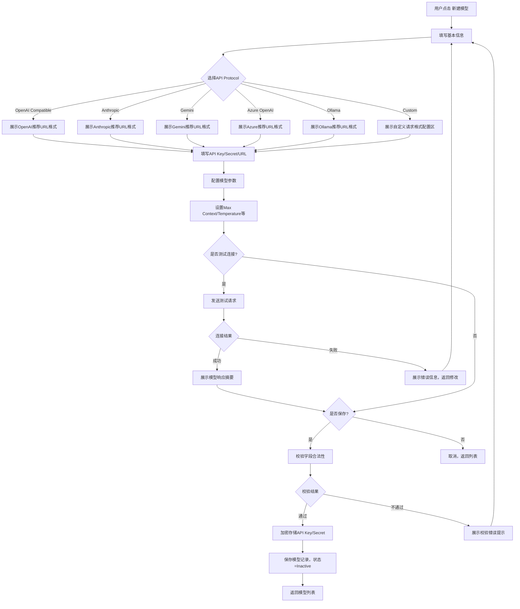

### 5.2 模型连接测试流程

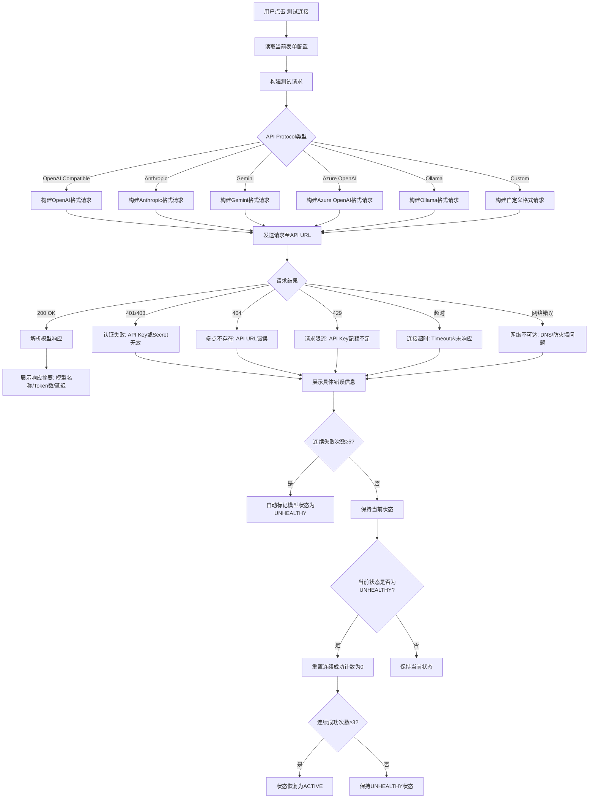

> **v3.0 变更说明(2026-06-13)**：§5.2 流程图补充 UNHEALTHY 状态下的**连续 3 次成功→ACTIVE** 恢复分支（5+3 对称策略），与 §5.3 / §7.4.3 / LLM-BR-019 完全一致。

### 5.3 模型健康检查与自动恢复流程

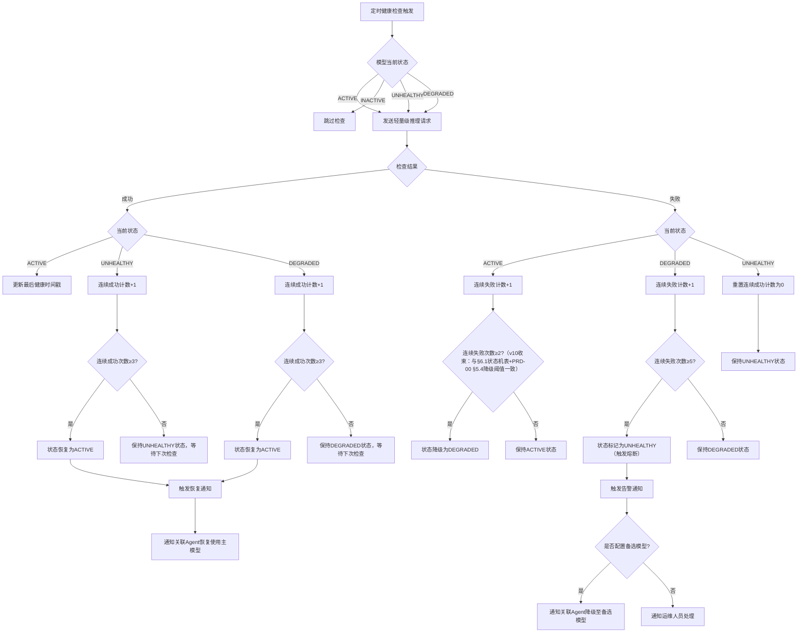

**级联通知说明（UNHEALTHY → Agent → 编排）**：

当模型状态变更为 UNHEALTHY 时，系统需执行以下级联通知流程，确保降级端到端闭环：

| 级联层级 | 通知目标 | 通知内容 | 处理策略 |
|----------|----------|----------|----------|
| L1：模型层 | 关联该模型的全部 Agent | 模型 `{model_id}` 已进入 UNHEALTHY 状态，熔断已触发 | 1. 若 Agent 已配置备选模型 → 自动降级至备选模型，Agent 保持 Active 状态；2. 若 Agent 未配置备选模型 → Agent 进入 Paused 状态，同时发送通知至管理员（通知渠道：站内消息 + 邮件） |
| L2：编排层 | 包含受影响 Agent 的全部编排 | Agent `{agent_id}` 因模型 UNHEALTHY 已降级/暂停 | 1. 若编排中仅部分 Agent 受影响且非关键路径 → 编排标记为 PartialSuccess，继续执行；2. 若编排中受影响 Agent 位于关键路径或全部 Agent 依赖同一 UNHEALTHY 模型 → 编排标记为 Paused，暂停执行并通知管理员 |
| L3：恢复层 | 之前受影响的 Agent 及编排 | 模型 `{model_id}` 已恢复为 ACTIVE 状态 | Agent 自动恢复使用主模型（无需管理员手动干预）；编排自动恢复执行，无需重新调度（正在执行的任务继续推进，新任务正常接收） |

**级联通知时序要求**：
- L1 通知须在模型状态变更为 UNHEALTHY 后 **30 秒内** 发出；
- L2 通知须在 Agent 完成降级/暂停决策后 **60 秒内** 发出；
- L3 恢复通知须在模型恢复为 ACTIVE 后 **30 秒内** 发出；
- 所有级联通知事件须记录审计日志，包含：模型ID、Agent ID列表、编排ID列表、通知时间戳、处理结果。

### 5.4 API Key轮换流程

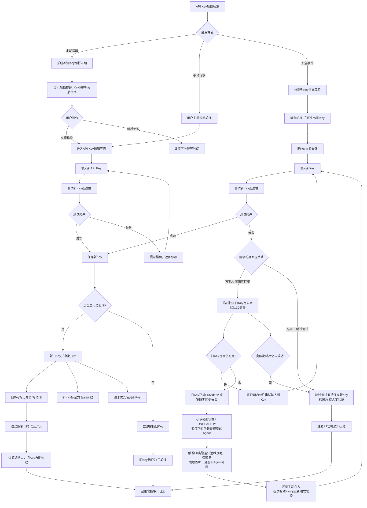

### 5.5 Agent关联管理流程

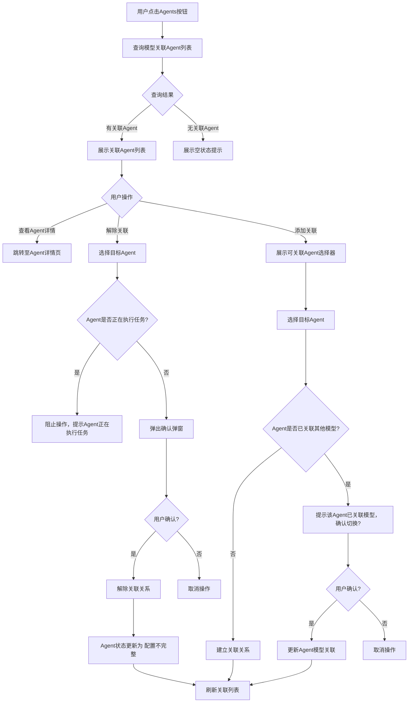

---

## 6. 关键状态转换

### 6.1 模型状态转换图

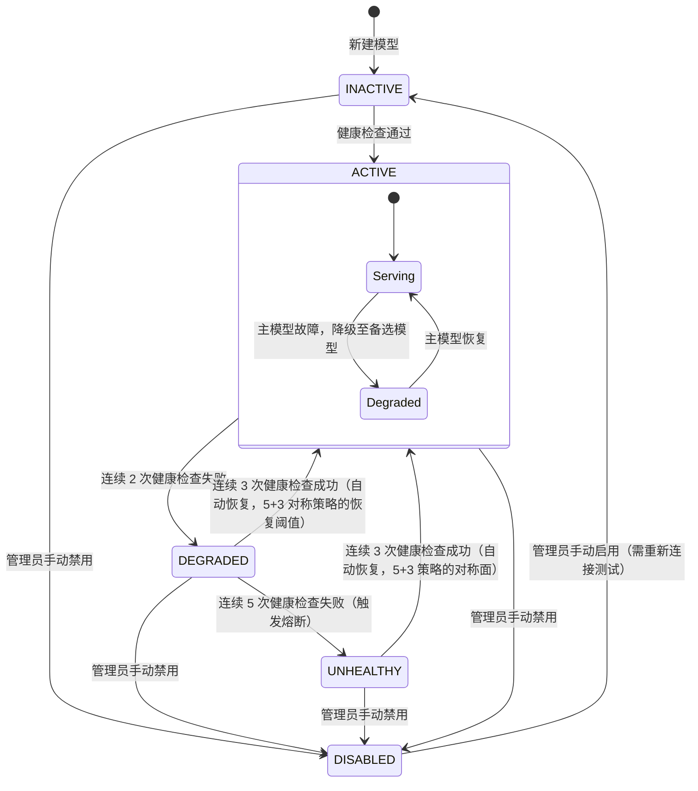

> **v3.0 变更说明(2026-06-13)**：UNHEALTHY → ACTIVE 恢复阈值由"60s 半开探测成功"收束为"**连续 3 次健康检查成功**"（5+3 对称策略），与 LLM-BR-019 / LLM-SLA-A-003 完全一致；半开探测窗口仍为 60 秒（即每 5 分钟探测一次，连续 3 次成功≈15 分钟内恢复）。

**状态说明**：

| 状态 | 含义 | 触发条件 | 系统行为 |
|------|------|----------|----------|
| INACTIVE | 模型已配置但未启用 | 新建模型默认状态 / 手动停用 | 不参与健康检查，Agent 不可调用 |
| ACTIVE | 模型正常可用 | 健康检查通过 / 自动恢复成功 | 参与定时健康检查，Agent 可正常调用 |
| DEGRADED | 模型降级（部分请求失败） | 连续 2 次健康检查失败 | 触发告警，Agent 仍可调用但可能超时 |
| UNHEALTHY | 模型不可用（熔断中） | 连续 5 次健康检查失败 | 触发熔断，Agent 调用自动拒绝 |
| DISABLED | 模型已禁用 | 管理员手动禁用 | 完全停止服务，Agent 不可调用 |

**状态转换规则（严格降级路径）**：

| 当前状态 | 目标状态 | 触发条件 | 说明 |
|----------|----------|----------|------|
| INACTIVE | ACTIVE | 健康检查通过 | 启用前必须验证连通性 |
| INACTIVE | DISABLED | 管理员手动禁用 | 初始即禁用 |
| ACTIVE | DEGRADED | 连续 2 次健康检查失败 | 间歇失败告警 |
| ACTIVE | DISABLED | 管理员手动禁用 | 管理员主动禁用 |
| DEGRADED | ACTIVE | 连续 3 次健康检查成功 | 自动恢复（5+3 对称策略，与 Mermaid 图一致） |
| DEGRADED | UNHEALTHY | 连续 5 次健康检查失败 | 降级持续恶化，触发熔断 |
| DEGRADED | DISABLED | 管理员手动禁用 | 管理员主动禁用 |
| UNHEALTHY | ACTIVE | 连续 3 次健康检查成功（5+3 对称策略的恢复阈值） | 半开状态探测恢复（每 5 分钟探测一次，累计 3 次成功约 15 分钟） |
| UNHEALTHY | DISABLED | 管理员手动禁用 | 管理员判断需完全停止 |
| DISABLED | INACTIVE | 管理员手动启用 | 重新启用需验证连通性 |

> **严格降级路径约束**：状态严格遵循 `ACTIVE → DEGRADED → UNHEALTHY` 顺序降级，**不允许跳跃**（即 ACTIVE 不可直接转为 UNHEALTHY，必须先经过 DEGRADED）。此约束与 §15.1 / BR-04-005 一致。

### 6.2 API Key状态转换图

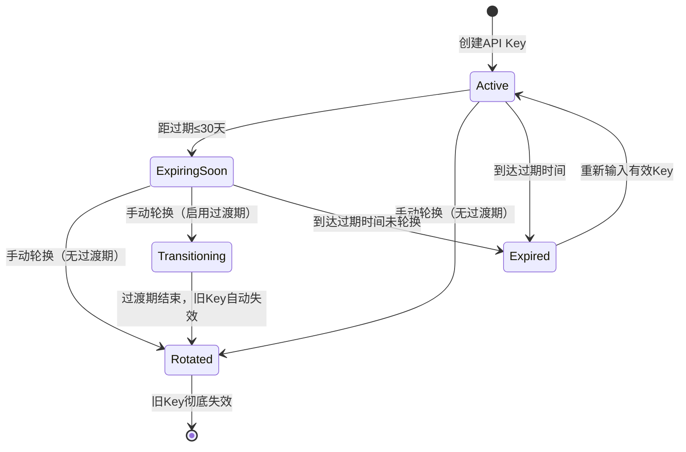

**状态说明**：

| 状态 | 含义 | 触发条件 | 系统行为 |
|------|------|----------|----------|
| Active（当前有效） | API Key正常可用 | 创建或轮换完成 | 正常用于模型调用认证 |
| ExpiringSoon（即将过期） | API Key即将过期 | 距过期时间≤30天 | 系统发送轮换提醒通知 |
| Transitioning（过渡中） | 新旧Key并存 | 启用过渡期的轮换操作 | 请求优先使用新Key，旧Key仍可使用 |
| Expired（已过期） | API Key已失效 | 到达过期时间 | 模型调用失败，触发紧急轮换提醒 |
| Rotated（已轮换） | 旧Key已被新Key替换 | 轮换完成且过渡期结束 | 旧Key不可使用，记录审计日志 |

---

## 7. 功能详情

### 7.1 模型列表

#### 7.1.1 模型列表展示

**用户故事**：作为平台管理员，我希望查看系统中所有已配置的LLM模型列表及其关键信息，以便快速了解系统可用的模型资源和各模型的运行状态。

**前置条件**：
- 用户已登录系统并具有"大语言模型"模块的查看权限
- 系统中至少存在一个已配置的LLM模型

**后置条件**：
- 列表页面正确展示所有模型的核心字段信息
- 支持按字段排序和分页浏览

**主流程**：
1. 用户进入"大语言模型"模块，默认展示模型列表页面
2. 系统查询所有已配置的LLM模型记录
3. 列表以表格形式展示以下字段：
   - **Model Name**：模型显示名称，如"GPT-4o"、"Claude-3.5-Sonnet"，支持点击跳转至详情页
   - **Model ID**：模型唯一标识，如"gpt-4o-2024-08-06"、"claude-3-5-sonnet-20241022"
   - **API URL**：模型服务地址，如"https://api.openai.com/v1"，超长文本截断显示，鼠标悬停展示完整URL
   - **API Protocol**：模型通信协议类型，以标签形式展示
   - **Status**：模型状态，以状态徽标展示（ACTIVE-绿色 / INACTIVE-灰色 / DEGRADED-黄色 / UNHEALTHY-红色 / DISABLED-灰色）
   - **API Key状态**：以图标展示Key状态（有效-绿色钥匙 / 即将过期-黄色警告 / 已过期-红色错误）
   - **关联Agent数**：当前关联的Agent数量，点击可展开关联列表
   - **操作列**：包含Edit、Delete、Agents三个操作按钮
4. 列表支持按Model Name、Status、API Protocol排序
5. 列表支持分页，默认每页展示20条记录

**分支流程**：
- **分支A - 无模型记录**：列表区域显示空状态插图和"暂无模型配置，点击新建"引导按钮
- **分支B - 模型状态异常**：Status列显示红色 UNHEALTHY 徽标，鼠标悬停显示错误摘要（如"API Key已过期"、"连接超时"）
- **分支C - API Key即将过期**：API Key状态列显示黄色警告图标，鼠标悬停显示"Key将在N天后过期"

**异常流程**：
- **异常A - 查询超时**：系统展示加载失败提示，提供"重试"按钮
- **异常B - 权限不足**：页面展示"无权限访问"提示，引导联系管理员

**交互说明**：
- 列表行支持hover高亮效果
- Agents按钮点击后展开下拉面板，展示该模型关联的Agent列表
- 删除操作需二次确认弹窗
- API URL字段超长时以省略号截断，悬停展示Tooltip
- API Key状态图标点击可跳转至Key管理区域

**验收标准**：
- AC1：列表正确展示Model Name、Model ID、API URL、API Protocol、Status、API Key状态、关联Agent数七个字段，数据与数据库一致
- AC2：Status字段使用颜色编码区分五种状态（ACTIVE-绿色 / INACTIVE-灰色 / DEGRADED-黄色 / UNHEALTHY-红色 / DISABLED-灰色）
- AC3：API Key状态图标正确反映Key当前状态（有效/即将过期/已过期）
- AC4：点击Agents按钮后，下拉面板在500ms内完成加载并展示关联Agent列表
- AC5：列表支持分页，切换页码后数据在1s内正确刷新
- AC6：无数据时展示空状态引导界面
- AC7：API URL超长时正确截断，悬停展示完整内容

---

#### 7.1.2 模型搜索与筛选

**用户故事**：作为Agent开发者，我希望通过关键词搜索和状态筛选快速定位目标模型，以便高效地为Agent选择合适的LLM。

**前置条件**：
- 用户已登录并具有模型列表的查看权限

**后置条件**：
- 列表根据搜索和筛选条件正确过滤展示

**主流程**：
1. 用户在模型列表页顶部的搜索框中输入关键词
2. 系统实时搜索（输入防抖300ms），匹配Model Name和Model ID字段
3. 列表仅展示匹配的模型记录
4. 用户可通过 Status 筛选标签（All / ACTIVE / INACTIVE / DEGRADED / UNHEALTHY / DISABLED）进一步过滤
5. 用户可通过API Protocol筛选标签（All / OpenAI Compatible / Anthropic / Gemini / Azure OpenAI / Ollama / Custom）进一步过滤
6. 搜索和筛选条件可叠加使用

**分支流程**：
- **分支A - 无搜索结果**：列表区域显示"未找到匹配的模型"提示
- **分支B - 清除搜索条件**：用户清空搜索框或点击筛选标签"All"，列表恢复展示全部模型

**异常流程**：
- **异常A - 搜索请求超时**：保留用户搜索条件，提示"搜索超时，请重试"

**验收标准**：
- AC1：搜索支持按Model Name和Model ID模糊匹配
- AC2：输入后500ms内返回搜索结果
- AC3：Status筛选标签正确过滤对应状态的模型
- AC4：API Protocol筛选标签正确过滤对应协议的模型
- AC5：搜索和筛选条件可叠加使用
- AC6：清除条件后列表恢复完整展示

---

#### 7.1.3 新建模型

**用户故事**：作为平台管理员，我希望通过结构化的配置表单接入新的LLM模型，以便扩展系统的认知能力。

**前置条件**：
- 用户已登录并具有"大语言模型"的创建权限

**后置条件**：
- 新模型记录写入数据库，状态默认为Inactive
- API Key和Secret加密存储
- 模型参数配置持久化

**主流程**：
1. 用户在模型列表页点击"新建模型"按钮
2. 系统打开创建模型页面/弹窗，展示两个配置区域：

   **区域A：基本信息**
   - **Model Name**：必填，模型显示名称（如"GPT-4o"）
   - **Model ID**：必填，模型唯一标识（如"gpt-4o-2024-08-06"）
   - **API Protocol**：必填，下拉选择（OpenAI Compatible / Anthropic / Gemini / Azure OpenAI / Ollama / Custom）
   - **API URL**：必填，模型服务端点地址
   - **API Key**：必填，身份认证密钥（密码输入框）
   - **Secret**：选填，安全凭证（密码输入框）
   - **Headers**：选填，自定义HTTP请求头（Key-Value编辑器）
   - **Timeout**：数字输入（单位：秒），默认60秒，范围10-600

   **区域B：模型参数**
   - **Max Context**：数字输入（单位：Token），默认128000，范围1-2000000
   - **Temperature**：数字输入（范围0.0-2.0），默认0.7，支持两位小数
   - **Max Output**：数字输入（单位：Token），默认4096，范围1-128000
   - **Top P**：数字输入（范围0.0-1.0），默认1.0，支持两位小数
   - **Stop Sequences**：文本输入，支持多个停止序列（标签式输入）

3. 用户填写所有必填字段和需要的可选字段
4. 用户点击"测试连接"按钮（可选），系统尝试调用模型API验证连通性
5. 测试成功，系统展示模型响应摘要
6. 用户点击"保存"
7. 系统校验所有字段合法性
8. 系统加密存储API Key和Secret
9. 系统保存模型记录，状态默认为Inactive
10. 页面返回模型列表，新模型出现在列表中

**分支流程**：
- **分支A - API Protocol切换**：选择不同协议后，API URL输入框下方展示该协议的推荐URL格式提示
- **分支B - 测试连接失败**：系统展示具体错误信息（如"401 Unauthorized"、"Connection refused"），用户可修改配置后重试
- **分支C - Headers多组配置**：用户可添加多组Key-Value请求头，支持删除

**异常流程**：
- **异常A - Model Name或Model ID重复**：实时校验，输入框下方显示红色提示"该名称/ID已存在"
- **异常B - API URL格式不合法**：输入框下方显示"请输入合法的URL地址"
- **异常C - 保存失败**：系统提示"保存失败，请稍后重试"，保留用户已填写的表单数据
- **异常D - 参数超出范围**：对应输入框下方显示范围提示（如"Temperature取值范围为0.0-2.0"）

**交互说明**：
- 创建页面采用分区布局，基本信息和模型参数分为两个卡片区域
- API Key和Secret字段默认隐藏内容，提供眼睛图标切换显示
- "测试连接"按钮在测试期间显示loading动画和预计等待时间
- 模型参数区域提供"恢复默认值"快捷按钮
- Stop Sequences输入后按回车添加为标签，每个标签支持单独删除

**验收标准**：
- AC1：创建页面正确展示所有配置字段，必填字段有明确标识
- AC2：Model Name和Model ID全局唯一，重复时实时提示（校验响应时间≤500ms）
- AC3：API Key和Secret以密码形式展示，支持显示/隐藏切换
- AC4：测试连接功能正确反映API连通性（成功/失败/超时），测试超时上限30秒
- AC5：模型参数范围校验正确，超出范围时提示
- AC6：保存成功后列表新增对应记录，字段信息与用户填写一致
- AC7：新模型默认状态为Inactive
- AC8：Headers支持添加多组Key-Value，Key不允许重复

---

#### 7.1.4 编辑模型

**用户故事**：作为平台管理员，我希望修改已有LLM模型的配置信息和推理参数，以便适应模型服务的变更或优化Agent表现。

**前置条件**：
- 用户已登录并具有"大语言模型"的编辑权限
- 目标模型存在

**后置条件**：
- 模型配置信息更新至数据库
- 如修改了API Key或Secret，新凭证加密存储
- 变更记录写入审计日志

**主流程**：
1. 用户在模型列表中点击目标行的"Edit"按钮
2. 系统打开编辑页面，回填当前模型的所有配置信息
3. API Key和Secret字段回填为掩码形式（如"sk-****-****-1234"）
4. 用户修改需要变更的字段
5. 用户点击"保存"
6. 系统校验修改后的配置合法性
7. 系统更新数据库记录
8. 系统记录审计日志（操作人、操作时间、变更字段）
9. 页面返回列表，更新后的信息即时反映

**分支流程**：
- **分支A - 修改API Key**：用户清空API Key字段并输入新值，系统提示"修改API Key后需重新测试连接"
- **分支B - 修改模型参数**：用户调整Temperature等参数，系统展示参数变更对比提示（如"Temperature: 0.7 -> 0.9"）
- **分支C - 模型被Agent引用时编辑**：系统提示"N个Agent正在使用该模型，修改参数可能影响Agent行为"

**异常流程**：
- **异常A - 测试连接失败**：保存时如用户修改了API相关配置，系统自动测试新配置的连通性，失败则阻止保存
- **异常B - 并发编辑冲突**：如另一用户正在编辑同一模型，系统提示"该模型正在被其他用户编辑"

**交互说明**：
- 编辑页面复用创建页面的布局
- 修改后的字段高亮显示变更标记（黄色背景）
- API Key和Secret字段支持"显示原值"和"输入新值"两种模式
- 保存按钮在提交期间显示loading状态

**验收标准**：
- AC1：编辑页面正确回填所有已有配置信息
- AC2：API Key和Secret以掩码形式回填
- AC3：修改后的字段有视觉变更标记（黄色背景高亮）
- AC4：保存成功后列表信息在1s内即时更新
- AC5：审计日志正确记录变更内容（操作人、时间、变更字段）
- AC6：并发编辑时正确提示冲突

---

#### 7.1.5 删除模型

**用户故事**：作为平台管理员，我希望删除不再使用的LLM模型配置，以减少安全隐患和维护成本。

**前置条件**：
- 用户已登录并具有"大语言模型"的删除权限
- 目标模型存在

**后置条件**：
- 模型记录从数据库中软删除
- API Key和Secret标记为已失效（不可用），30天后随物理删除一起清除。软删除恢复时需重新配置API Key。
- 已关联该模型的Agent收到配置告警通知

**主流程**：
1. 用户在模型列表中点击目标行的"Delete"按钮
2. 系统弹出二次确认弹窗，显示模型名称和关联信息
3. 用户确认删除
4. 系统执行软删除操作
5. 系统清除API Key和Secret的加密存储记录
6. 系统检查是否有Agent正在使用该模型
7. 如有引用，系统生成配置告警通知
8. 页面返回列表，该模型不再显示

**分支流程**：
- **分支A - 模型被Agent引用**：确认弹窗中展示受影响Agent列表，用户需勾选"我已了解影响"后方可确认
- **分支B - 模型正在处理活跃请求**：系统阻止删除，提示"该模型正在处理请求，请等待完成后再删除"

**异常流程**：
- **异常A - 删除失败**：系统提示"删除失败，请稍后重试"

**交互说明**：
- 删除确认弹窗采用警告样式（红色边框/图标）
- 弹窗中清晰展示删除影响的范围
- 删除操作支持"取消"退出

**验收标准**：
- AC1：点击Delete后弹出确认弹窗，展示模型名称和关联Agent数量
- AC2：确认删除后，模型从列表中移除（1s内刷新）
- AC3：API Key和Secret从加密存储中彻底清除
- AC4：被Agent引用时，弹窗展示受影响Agent列表，需勾选确认后方可删除
- AC5：活跃请求处理中时，阻止删除并给出明确提示

---

### 7.2 创建/更新模型 - 详细配置

#### 7.2.1 基本信息配置

**用户故事**：作为平台管理员，我希望配置LLM模型的基本连接信息，以便系统能够正确地与模型服务建立通信。

**前置条件**：
- 用户正在创建或编辑模型
- 基本信息配置区域已展示

**后置条件**：
- 模型连接信息通过合法性校验
- 系统可基于该配置与模型服务建立通信

**主流程**：
1. 用户在基本信息区域逐项填写/修改配置：

   **Model Name**：
   - 文本输入框，最大长度50字符
   - 实时校验唯一性
   - 示例值："GPT-4o"、"Claude-3.5-Sonnet"、"Qwen-Max"

   **Model ID**：
   - 文本输入框，最大长度100字符
   - 实时校验唯一性
   - 示例值："gpt-4o-2024-08-06"、"claude-3-5-sonnet-20241022"

   **API Protocol**：
   - 下拉选择组件
   - 选项：OpenAI Compatible / Anthropic / Gemini / Azure OpenAI / Ollama / Custom
   - 切换后动态更新API URL的占位提示

   **API URL**：
   - 文本输入框，需以http://或https://开头
   - 根据API Protocol展示推荐格式：
     - OpenAI Compatible: "https://api.openai.com/v1"
     - Anthropic: "https://api.anthropic.com/v1"
     - Gemini: "https://generativelanguage.googleapis.com/v1beta"
     - Azure OpenAI: "https://{resource-name}.openai.azure.com/openai"
     - Ollama: "http://localhost:11434"
     - Custom: 无提示

   **API Key**：
   - 密码输入框，必填
   - 支持显示/隐藏切换
   - 输入框右侧提供"从剪贴板粘贴"快捷按钮

   **Secret**：
   - 密码输入框，选填
   - 支持显示/隐藏切换
   - 下方提示文字："部分模型服务需要Secret与API Key配合使用"

   **Headers**：
   - Key-Value编辑器，支持动态添加/删除行
   - Key为文本输入，Value为文本输入
   - 常见预设Header提供快捷添加（如"Content-Type: application/json"）

   **Timeout**：
   - 数字输入框，单位：秒
   - 默认值：60
   - 范围：10-600
   - 下方提示文字："建议根据模型推理复杂度设置，复杂任务建议120秒以上"

2. 用户完成所有必填字段的填写
3. 系统实时校验各字段合法性

**分支流程**：
- **分支A - 选择Custom协议**：API Protocol选择Custom后，额外展示"自定义请求格式"配置区域，允许用户定义请求体模板
- **分支B - API Key格式校验**：根据API Protocol校验API Key格式（如OpenAI格式以"sk-"开头），格式不符时展示警告（非阻断）

**异常流程**：
- **异常A - API URL不可达**：测试连接时URL不可达，提示具体错误信息

**验收标准**：
- AC1：所有字段正确展示，必填字段有红色星号标识
- AC2：API Protocol切换后，API URL占位提示在300ms内更新
- AC3：API Key和Secret字段支持显示/隐藏切换
- AC4：Headers支持动态添加和删除行
- AC5：Timeout范围校验正确，超出范围时提示
- AC6：Model Name和Model ID唯一性校验响应时间不超过500ms

---

#### 7.2.2 模型参数配置

**用户故事**：作为Agent开发者，我希望可视化地配置和调整LLM的推理参数，以便根据不同任务场景优化模型的输出质量和行为表现。

**前置条件**：
- 用户正在创建或编辑模型
- 模型参数配置区域已展示

**后置条件**：
- 模型推理参数配置通过合法性校验
- 参数值持久化存储

**主流程**：
1. 用户在模型参数区域逐项配置：

   **Max Context（最大上下文窗口）**：
   - 数字输入框，单位：Token
   - 默认值：128000
   - 范围：1-2,000,000
   - 下方说明文字："定义模型单次推理可处理的最大Token数量，包含输入和输出"
   - 提供常见模型预设快捷按钮：4K / 8K / 32K / 128K / 200K

   **Temperature（温度）**：
   - 滑块 + 数字输入框组合控件
   - 默认值：0.7
   - 范围：0.0-2.0，步长0.01（支持两位小数）
   - 滑块下方展示效果说明：
     - 0.0-0.3：输出确定性高，适合事实性问答、代码生成
     - 0.4-0.7：平衡创造性和准确性，适合通用对话
     - 0.8-1.0：输出随机性高，适合创意写作、头脑风暴
     - 1.0-2.0：极高随机性，实验性使用

   **Max Output（最大输出长度）**：
   - 数字输入框，单位：Token
   - 默认值：4096
   - 范围：1-128000
   - 下方说明文字："限制模型单次响应的最大Token数量"
   - 校验规则：Max Output建议不超过Max Context的80%，超出时展示警告但不阻止保存

   **Top P（核采样概率）**：
   - 滑块 + 数字输入框组合控件
   - 默认值：1.0
   - 范围：0.0-1.0，步长0.01（支持两位小数）
   - 下方说明文字："控制采样候选Token的范围，值越小输出越集中"

   **Stop Sequences（停止序列）**：
   - 标签式输入组件
   - 用户输入字符串后按回车添加为标签
   - 每个标签支持点击删除按钮移除
   - 下方说明文字："模型在生成过程中遇到这些字符串时将停止输出"
   - 示例值："\n\nHuman:"、"</response>"、"[END]"

2. 用户根据任务需求调整参数
3. 系统实时校验参数范围和逻辑关系

**分支流程**：
- **分支A - 使用预设参数**：用户点击"恢复默认值"按钮，所有参数恢复为系统默认值
- **分支B - Max Output超过Max Context的80%**：系统展示警告"输出长度接近上下文窗口上限，可能导致输出截断"，但不阻止保存

**异常流程**：
- **异常A - 参数超出范围**：对应输入框边框变红，下方显示范围提示
- **异常B - Temperature和Top P同时为极低值**：系统提示"Temperature和Top P均设为极低值可能导致输出重复"

**交互说明**：
- Temperature和Top P使用滑块控件，拖动时实时更新数值显示
- Max Context预设按钮点击后，输入框值立即更新
- 参数区域提供"高级设置"折叠面板，Stop Sequences默认折叠在高级设置中
- 每个参数字段旁提供信息图标（i），悬停展示详细说明

**验收标准**：
- AC1：所有参数字段正确展示，默认值正确
- AC2：Temperature和Top P滑块拖动流畅，数值实时更新（延迟≤100ms）
- AC3：Max Context预设按钮正确设置对应值
- AC4：Max Output超过Max Context 80%时展示警告
- AC5：Stop Sequences支持添加和删除标签
- AC6：参数超出范围时输入框边框变红并提示
- AC7："恢复默认值"按钮正确重置所有参数

---

### 7.3 关联代理

#### 7.3.1 关联代理列表展示

**用户故事**：作为平台管理员，我希望查看某个LLM模型关联的所有Agent列表，以便评估模型变更的影响范围和了解模型的使用情况。

**前置条件**：
- 用户已登录并具有模型关联信息的查看权限
- 目标模型存在且至少关联了一个Agent

**后置条件**：
- 关联代理列表正确展示所有使用该模型的Agent信息

**主流程**：
1. 用户在模型列表中点击目标行的"Agents"按钮
2. 系统展开下拉面板，展示关联代理列表
3. 列表以表格形式展示以下字段：
   - **Agent Name**：代理名称，支持点击跳转至代理详情页
   - **Created At**：关联创建时间
   - **Updated At**：最后更新时间
   - **Status**：代理状态（Active-绿色 / Inactive-灰色）
   - **操作列**：包含Edit、Delete两个操作按钮
4. 列表支持按Agent Name排序
5. 面板底部展示关联Agent总数统计

**分支流程**：
- **分支A - 无关联Agent**：下拉面板展示"该模型暂未被任何Agent使用"
- **分支B - 关联Agent数量较多**：面板支持滚动浏览，展示"查看全部"链接跳转至完整关联代理页面

**异常流程**：
- **异常A - 查询超时**：面板展示加载失败提示，提供"重试"按钮

**交互说明**：
- 下拉面板从"Agents"按钮下方展开，宽度与表格列对齐
- 面板最大高度400px，超出后内部滚动
- Edit按钮点击后跳转至代理编辑页面
- Delete按钮点击后解除Agent与该模型的关联（非删除Agent本身）

**验收标准**：
- AC1：下拉面板正确展示Agent Name、Created At、Updated At、Status四个字段
- AC2：面板底部展示关联Agent总数
- AC3：无关联Agent时展示空状态提示
- AC4：Edit按钮正确跳转至代理编辑页面
- AC5：Delete按钮正确解除关联关系

---

#### 7.3.2 代理关联管理

**用户故事**：作为平台管理员，我希望从模型维度管理Agent的关联关系，以便在模型变更时快速调整受影响Agent的模型配置。

**前置条件**：
- 用户已登录并具有代理关联管理的权限
- 目标模型和目标Agent均存在

**后置条件**：
- Agent与模型的关联关系更新
- 如解除关联，Agent需要重新配置模型

**主流程**：
1. 用户在关联代理列表中点击目标Agent的"Delete"按钮
2. 系统弹出确认弹窗："解除该Agent与当前模型的关联？Agent将无法进行推理直到配置新模型。"
3. 用户确认解除
4. 系统解除Agent与模型的关联关系
5. 系统更新Agent状态为"配置不完整"
6. 关联列表刷新，该Agent不再显示

**分支流程**：
- **分支A - Agent正在执行任务**：系统阻止解除关联，提示"该Agent正在执行任务，请等待完成后再操作"

**异常流程**：
- **异常A - 解除关联失败**：系统提示"操作失败，请稍后重试"

**验收标准**：
- AC1：解除关联前弹出确认弹窗，明确说明影响
- AC2：确认后关联关系正确解除（1s内生效）
- AC3：Agent状态更新为"配置不完整"
- AC4：活跃任务中的Agent不允许解除关联

---

### 7.4 模型健康检查

#### 7.4.1 定时健康检查

**用户故事**：作为运维工程师，我希望系统自动定时检查所有Active状态模型的服务可用性，以便及时发现模型服务异常并触发告警。

**前置条件**：
- 系统中存在Active状态的模型
- 健康检查定时任务已启动

**后置条件**：
- 健康检查结果更新模型状态
- 异常模型触发告警通知

**主流程**：
1. 系统每隔5分钟对Active状态的模型执行健康检查
2. 健康检查发送轻量级推理请求（如"Hi"单Token输入，Max Output=1）
3. 检查结果判定：
   - 响应成功（HTTP 200且返回有效内容）：检查通过
   - 响应失败（非200状态码/超时/网络错误）：检查失败
4. 检查通过：更新模型最后健康时间戳
5. 检查失败：累计连续失败次数

**分支流程**：
- **分支A - Inactive模型**：跳过健康检查，不消耗API调用配额
- **分支B - 模型处于 UNHEALTHY 状态**：仍执行健康检查，用于判断是否可自动恢复

**异常流程**：
- **异常A - 健康检查请求本身超时**：视为检查失败，使用配置的Timeout值

**验收标准**：
- AC1：Active状态模型每5分钟（±30秒）执行一次健康检查
- AC2：健康检查使用轻量级请求，消耗Token数≤10
- AC3：Inactive模型不参与健康检查
- AC4：检查结果在30秒内返回

---

#### 7.4.2 连续失败自动标记UNHEALTHY

**用户故事**：作为运维工程师，我希望模型连续多次健康检查失败时系统自动标记为UNHEALTHY状态，以便及时感知服务异常并触发降级策略。

**前置条件**：
- 模型当前状态为ACTIVE
- 健康检查正在运行

**后置条件**：
- 模型状态更新为UNHEALTHY
- 关联Agent收到降级通知
- 运维人员收到告警通知

**主流程**：
1. 模型健康检查连续5次失败
2. 系统自动将模型状态从ACTIVE更新为UNHEALTHY（触发熔断）
3. 系统记录状态变更日志（变更时间、连续失败次数、最后错误信息）
4. 系统检查该模型是否配置了备选模型
5. 如有备选模型，通知关联Agent降级至备选模型
6. 如无备选模型，发送告警通知至运维人员

**验收标准**：
- AC1：连续5次健康检查失败后，模型状态自动变更为UNHEALTHY（状态变更延迟≤30秒）
- AC2：状态变更日志包含变更时间、连续失败次数、最后错误信息
- AC3：配置备选模型时，关联Agent在60秒内自动降级
- AC4：无备选模型时，运维人员在60秒内收到告警通知

---

#### 7.4.3 自动恢复机制

**用户故事**：作为运维工程师，我希望UNHEALTHY状态的模型在服务恢复后能自动恢复为ACTIVE状态，以便减少人工干预并快速恢复服务。

**前置条件**：
- 模型当前状态为UNHEALTHY
- 健康检查仍在运行

**后置条件**：
- 模型状态恢复为ACTIVE
- 关联Agent恢复使用主模型

**主流程**：
1. UNHEALTHY状态模型每5分钟继续执行健康检查
2. 健康检查连续3次成功
3. 系统自动将模型状态从UNHEALTHY恢复为ACTIVE
4. 系统记录恢复日志
5. 通知关联Agent恢复使用主模型
6. 发送恢复通知至运维人员

**分支流程**：
- **分支A - 恢复过程中再次失败**：重置连续成功计数，保持UNHEALTHY状态

**验收标准**：
- AC1：UNHEALTHY状态模型每5分钟执行健康检查
- AC2：连续3次健康检查成功后，模型状态自动恢复为ACTIVE
- AC3：恢复后关联Agent在60秒内自动切回主模型
- AC4：恢复通知在60秒内送达运维人员

---

### 7.5 API Key管理

#### 7.5.1 Key过期预警

**用户故事**：作为平台管理员，我希望系统在API Key即将过期时主动提醒我，以便提前安排Key轮换，避免服务中断。

**前置条件**：
- 模型已配置API Key
- API Key设置了过期时间

**后置条件**：
- 管理员收到过期预警通知
- 模型列表中Key状态更新

**主流程**：
1. 系统每日检查所有API Key的过期时间
2. 距过期时间≤30天时，Key状态标记为"即将过期"
3. 系统发送预警通知（站内消息+邮件）至平台管理员
4. 模型列表中API Key状态图标更新为黄色警告
5. 距过期时间≤7天时，升级为紧急预警，通知频率提升至每日一次

**分支流程**：
- **分支A - Key无过期时间**：系统无法检测过期时间，Key状态始终显示为"有效"，依赖管理员手动轮换

**验收标准**：
- AC1：距过期≤30天时，Key状态自动更新为"即将过期"
- AC2：预警通知在检测后1小时内送达管理员
- AC3：距过期≤7天时，通知频率提升至每日一次
- AC4：模型列表Key状态图标正确反映预警状态

---

#### 7.5.2 一键轮换

**用户故事**：作为平台管理员，我希望通过一键操作快速轮换API Key，以便在Key泄露或即将过期时迅速更换，保障服务安全。

**前置条件**：
- 用户已登录并具有API Key管理权限
- 目标模型存在

**后置条件**：
- 新API Key加密存储
- 旧API Key标记为已轮换
- 轮换操作记录审计日志

**主流程**：
1. 用户在模型编辑页面或Key管理区域点击"轮换Key"按钮
2. 系统弹出轮换弹窗，提示输入新API Key
3. 用户输入新API Key
4. 系统测试新Key的连通性
5. 测试通过后，用户确认轮换
6. 系统加密存储新API Key
7. 旧Key标记为"已轮换"
8. 系统记录审计日志（操作人、操作时间、旧Key前4位+后4位）
9. 模型使用新Key进行后续调用

**分支流程**：
- **分支A - 新Key测试失败**：阻止轮换，提示错误信息
- **分支B - 紧急轮换（Key泄露）**：旧Key立即失效，不启用过渡期

**异常流程**：
- **异常A - 轮换过程中模型正在处理请求**：等待当前请求完成后切换，最长等待时间60秒

**验收标准**：
- AC1：一键轮换操作在3步内完成（输入新Key→测试→确认）
- AC2：新Key测试通过后才能确认轮换
- AC3：轮换完成后旧Key立即不可用于新请求
- AC4：审计日志正确记录轮换操作（含操作人、时间、旧Key脱敏信息）

---

#### 7.5.3 新旧Key过渡期

**用户故事**：作为平台管理员，我希望在API Key轮换时设置新旧Key并存的过渡期，以便正在进行的请求使用旧Key完成，新请求使用新Key，实现无感轮换。

**前置条件**：
- 用户已发起API Key轮换操作
- 选择启用过渡期模式

**后置条件**：
- 过渡期内新旧Key均有效
- 过渡期结束后旧Key自动失效

**主流程**：
1. 用户在轮换弹窗中勾选"启用过渡期"
2. 设置过渡期时长（默认7天，范围1-30天）
3. 用户确认轮换
4. 系统保存新Key为"当前有效"，旧Key标记为"即将过期"
5. 过渡期内，新请求优先使用新Key，旧Key仍可响应进行中的请求
6. 过渡期倒计时展示在模型详情页
7. 过渡期结束，旧Key自动标记为"已轮换"并失效
8. 系统记录过渡期结束审计日志

**分支流程**：
- **分支A - 过渡期内手动终止**：用户可提前终止过渡期，旧Key立即失效
- **分支B - 过渡期内旧Key异常**：如旧Key在过渡期内被服务商撤销，系统立即将新Key提升为唯一有效Key

**验收标准**：
- AC1：过渡期支持1-30天自定义设置，默认7天
- AC2：过渡期内新请求100%使用新Key
- AC3：过渡期倒计时在模型详情页实时展示
- AC4：过渡期结束后旧Key自动失效（延迟≤60秒）
- AC5：支持提前手动终止过渡期

---

### 7.6 多模型备选配置

#### 7.6.1 主模型与备选模型配置

**用户故事**：作为Agent开发者，我希望为Agent配置主模型和备选模型，以便主模型不可用时自动降级至备选模型，保障Agent推理的连续性。

**前置条件**：
- 用户正在配置Agent的模型关联
- 系统中存在多个可用模型

**后置条件**：
- Agent配置了主模型和至少一个备选模型
- 降级策略生效

**主流程**：
1. 用户在Agent配置中选择"主模型"（必选）
2. 用户点击"添加备选模型"，从模型列表中选择备选模型
3. 备选模型按优先级排序（优先级1为首选降级目标）
4. 用户配置降级策略：
   - **自动降级**：主模型 UNHEALTHY 时自动切换至备选模型
   - **手动确认**：主模型 UNHEALTHY 时通知用户确认后切换
5. 用户配置恢复策略：
   - **自动恢复**：主模型恢复 ACTIVE 后自动切回
   - **手动恢复**：主模型恢复后需用户确认切回
6. 保存配置

**分支流程**：
- **分支A - 备选模型也 UNHEALTHY**：继续降级至下一优先级备选模型；所有备选模型均不可用时，Agent状态标记为"模型不可用"
- **分支B - 备选模型参数差异**：系统提示备选模型的参数配置（如Max Context不同），用户确认是否继承主模型参数

**验收标准**：
- AC1：支持配置1个主模型和最多3个备选模型
- AC2：备选模型支持优先级排序
- AC3：自动降级策略下，主模型 UNHEALTHY 后60秒内切换至备选模型
- AC4：所有模型不可用时，Agent状态正确标记为"模型不可用"
- AC5：自动恢复策略下，主模型恢复Active后60秒内切回

---

### 7.7 模型配额与用量统计

#### 7.7.1 配额限制设置

**用户故事**：作为平台管理员，我希望为每个模型设置API调用配额限制，以便控制成本和防止滥用。

**前置条件**：
- 用户已登录并具有模型配额管理权限
- 目标模型存在

**后置条件**：
- 模型配额限制生效
- 超出配额时触发限制策略

**主流程**：
1. 用户在模型详情页进入"配额设置"区域
2. 配置以下配额项：
   - **每日请求上限**：数字输入，单位：次，0表示不限制
   - **每日Token上限**：数字输入，单位：Token，0表示不限制
   - **每分钟请求上限（RPM）**：数字输入，单位：次/分钟，0表示不限制
3. 配置超出配额时的策略：
   - **拒绝请求**：返回 HTTP 200 + 业务错误码 140403（限流触发），Agent降级至备选模型
   - **排队等待**：请求进入队列，等待配额释放
4. 保存配额配置

**验收标准**：
- AC1：支持设置每日请求上限、每日Token上限、RPM三项配额
- AC2：配额设置为0时表示不限制
- AC3：超出配额时按配置策略执行（拒绝/排队）
- AC4：配额用量每日0点（系统时区）自动重置

---

#### 7.7.2 用量统计展示

**用户故事**：作为平台管理员，我希望查看各模型的API调用用量统计，以便了解成本分布和优化模型使用策略。

**前置条件**：
- 模型已有调用记录

**后置条件**：
- 用量统计数据正确展示

**主流程**：
1. 用户在模型详情页进入"用量统计"区域
2. 系统展示以下统计数据：
   - **今日请求次数**：当日累计请求次数
   - **今日Token消耗**：当日累计输入+输出Token数
   - **今日费用估算**：基于模型单价和Token消耗估算
   - **7日趋势图**：请求次数和Token消耗的7日折线图
   - **配额使用率**：当前用量/配额上限的百分比进度条
3. 支持按时间范围筛选（今日/7日/30日/自定义）

**验收标准**：
- AC1：用量统计数据与实际调用记录一致（误差≤1%）
- AC2：7日趋势图正确展示请求次数和Token消耗趋势
- AC3：配额使用率进度条正确反映当前用量占比
- AC4：统计数据刷新延迟≤5分钟

---

### 7.8 模型调用追踪

#### 7.8.1 调用链路记录

**用户故事**：作为运维工程师，我希望追踪每次模型调用的完整链路，以便排查调用异常和优化调用性能。

**前置条件**：
- 模型已被Agent调用
- 调用追踪功能已启用

**后置条件**：
- 调用链路记录持久化存储

**主流程**：
1. 每次Agent调用模型时，系统自动记录以下信息：
   - **Trace ID**：调用链路唯一标识
   - **Agent ID / Agent Name**：调用方Agent信息
   - **Model ID / Model Name**：被调用模型信息
   - **请求时间**：调用发起时间（毫秒精度）
   - **响应时间**：模型返回结果时间
   - **耗时**：响应时间-请求时间（毫秒）
   - **输入Token数**：本次请求的输入Token数量
   - **输出Token数**：本次请求的输出Token数量
   - **状态码**：HTTP响应状态码
   - **错误信息**：如调用失败，记录错误详情
2. 调用记录写入追踪日志存储

**验收标准**：
- AC1：每次模型调用均生成唯一Trace ID
- AC2：调用记录包含Agent、模型、时间、Token、状态等完整信息
- AC3：调用记录写入延迟≤1秒
- AC4：调用记录保留90天

---

#### 7.8.2 调用日志查询

**用户故事**：作为运维工程师，我希望查询和筛选模型调用日志，以便快速定位特定时间段的调用异常。

**前置条件**：
- 调用追踪功能已启用
- 存在调用记录

**后置条件**：
- 查询结果正确展示

**主流程**：
1. 用户在模型详情页进入"调用日志"区域
2. 系统展示最近的调用记录列表
3. 用户可通过以下条件筛选：
   - 时间范围
   - 状态码（成功/失败）
   - Agent名称
   - 耗时范围
4. 点击记录可查看调用详情（请求参数、响应内容、错误堆栈）

**验收标准**：
- AC1：调用日志列表支持按时间、状态码、Agent、耗时筛选
- AC2：查询结果在3秒内返回
- AC3：点击记录可查看完整调用详情
- AC4：支持导出调用日志（CSV格式）

---

## 8. 模型参数对Agent行为的影响

### 8.1 参数影响对照表

| 参数 | 低值行为 | 高值行为 | 对Agent的影响 | 推荐场景 |
|------|----------|----------|---------------|----------|
| **Temperature** | 输出确定性高，结果稳定可复现 | 输出随机性高，结果多样不可预测 | 低值适合需要精确执行的任务（代码生成、数据提取）；高值适合需要创造性的任务（文案撰写、方案设计） | 事实性任务：0.0-0.3；通用对话：0.4-0.7；创意任务：0.8-1.0 |
| **Top P** | 候选Token集中，输出聚焦 | 候选Token分散，输出多样 | 与Temperature协同控制输出质量；低Top P适合需要精确术语的场景 | 需精确术语：0.1-0.5；通用场景：0.9-1.0 |
| **Max Context** | 可处理信息量少，长对话易丢失上下文 | 可处理信息量大，长对话保持完整上下文 | 低值可能导致Agent在多轮对话中遗忘早期信息；高值增加Token消耗和成本 | 简单问答：4K-8K；复杂推理：32K-128K；长文档处理：128K-200K |
| **Max Output** | 输出简短，可能截断重要内容 | 输出详尽，但增加响应时间和成本 | 低值可能导致Agent回复不完整；高值适合需要详细输出的场景 | 简短回复：512-1024；标准回复：2048-4096；详细报告：8192+ |
| **Stop Sequences** | 无停止序列，模型按Max Output输出 | 设置停止序列，模型在指定位置终止 | 合理设置可控制Agent输出格式，避免冗余内容 | 对话场景："\n\nHuman:"；结构化输出："</result>" |

### 8.2 参数组合建议

| 任务类型 | Temperature | Top P | Max Context | Max Output | 说明 |
|----------|-------------|-------|-------------|------------|------|
| 代码生成 | 0.0-0.2 | 0.5-1.0 | 32K-128K | 4096-8192 | 需要确定性输出，较大上下文理解代码结构 |
| 数据提取/格式化 | 0.0-0.1 | 0.5-1.0 | 8K-32K | 1024-2048 | 需要精确输出，较小上下文即可 |
| 通用对话 | 0.4-0.7 | 0.9-1.0 | 32K-128K | 2048-4096 | 平衡创造性和准确性 |
| 创意写作 | 0.8-1.0 | 0.9-1.0 | 32K-128K | 4096-8192 | 鼓励多样性和创造性 |
| 复杂推理 | 0.2-0.5 | 0.9-1.0 | 128K-200K | 4096-8192 | 需要大上下文和适度确定性 |
| 长文档摘要 | 0.3-0.5 | 0.9-1.0 | 128K-200K | 2048-4096 | 需要大上下文读取全文 |

---

## 9. 不同API Protocol的请求格式差异

### 9.1 请求格式对照表

| 字段 | OpenAI Compatible | Anthropic | Gemini | Azure OpenAI | Ollama | Custom |
|------|-------------------|-----------|--------|--------------|--------|--------|
| **请求路径** | `/v1/chat/completions` | `/v1/messages` | `/v1beta/models/{model}:generateContent` | `/openai/deployments/{deployment}/chat/completions?api-version={version}` | `/api/chat` | 用户自定义 |
| **认证方式** | `Authorization: Bearer {API Key}` | `x-api-key: {API Key}` + `anthropic-version: 2023-06-01` | `key={API Key}` (Query参数) | `api-key: {API Key}` (Header) | 无认证或 `Authorization` | 用户自定义 |
| **Content-Type** | `application/json` | `application/json` | `application/json` | `application/json` | `application/json` | 用户自定义 |
| **模型标识字段** | `model` | `model` | `model` (在URL路径中) | `deployment` (在URL路径中) | `model` | 用户自定义 |
| **消息格式** | `messages: [{role, content}]` | `messages: [{role, content}]` | `contents: [{role, parts}]` | `messages: [{role, content}]` | `messages: [{role, content}]` | 用户自定义 |
| **Temperature字段** | `temperature` | `temperature` | `generationConfig.temperature` | `temperature` | `temperature` | 用户自定义 |
| **Max Output字段** | `max_tokens` | `max_tokens` | `generationConfig.maxOutputTokens` | `max_tokens` | `max_tokens` | 用户自定义 |
| **Top P字段** | `top_p` | `top_p` | `generationConfig.topP` | `top_p` | `top_p` | 用户自定义 |
| **Stop Sequences字段** | `stop` | `stop_sequences` | `generationConfig.stopSequences` | `stop` | `stop` | 用户自定义 |
| **Secret使用** | 不使用 | 可用于签名验证 | 不使用 | 不使用 | 不使用 | 用户自定义 |

### 9.2 请求体示例

**OpenAI Compatible**：
```json
{
  "model": "gpt-4o-2024-08-06",
  "messages": [{"role": "user", "content": "Hello"}],
  "temperature": 0.7,
  "max_tokens": 4096,
  "top_p": 1.0,
  "stop": ["\n\nHuman:"]
}
```

**Anthropic**：
```json
{
  "model": "claude-3-5-sonnet-20241022",
  "messages": [{"role": "user", "content": "Hello"}],
  "temperature": 0.7,
  "max_tokens": 4096,
  "top_p": 1.0,
  "stop_sequences": ["\n\nHuman:"]
}
```

**Gemini**：
```json
{
  "contents": [{"role": "user", "parts": [{"text": "Hello"}]}],
  "generationConfig": {
    "temperature": 0.7,
    "maxOutputTokens": 4096,
    "topP": 1.0,
    "stopSequences": ["\n\nHuman:"]
  }
}
```

**Azure OpenAI**：
```json
{
  "messages": [{"role": "user", "content": "Hello"}],
  "temperature": 0.7,
  "max_tokens": 4096,
  "top_p": 1.0
}
```

**Ollama**：
```json
{
  "model": "llama3",
  "messages": [{"role": "user", "content": "Hello"}],
  "temperature": 0.7,
  "max_tokens": 4096
}
```

---

## 10. 业务规则

> **v6 收束说明**：本节使用 `LLM-BR-` 模块前缀编号为旧版规范。v6 收束后的权威业务规则请参考 **§29 业务规则**（使用 `BR-04-{3 位}` 编号，遵循 PRD-09 §41.3 BR 编号规范）。本节作为详细规则参考保留，便于追溯。

### 10.1 模型管理规则

| 规则编号 | 规则描述 |
|----------|----------|
| LLM-BR-001 | Model Name在系统内全局唯一，不区分大小写 |
| LLM-BR-002 | Model ID在系统内全局唯一，不区分大小写 |
| LLM-BR-003 | 新建模型默认状态为INACTIVE，需手动启用 |
| LLM-BR-004 | 模型删除采用软删除机制，保留30天后物理删除 |
| LLM-BR-005 | API Key和Secret在数据库中必须使用AES-256加密存储 |
| LLM-BR-006 | API Key和Secret在日志和前端展示中必须脱敏（仅显示前4位和后4位） |
| LLM-BR-007 | 处于ACTIVE状态且被活跃任务使用的模型不允许删除 |
| LLM-BR-008 | 模型状态变更（ACTIVE↔DEGRADED↔UNHEALTHY、INACTIVE→DISABLED 等任意状态流转）必须记录审计日志 |

### 10.2 模型参数规则

| 规则编号 | 规则描述 |
|----------|----------|
| LLM-BR-009 | Max Context取值范围为1-2,000,000 Token |
| LLM-BR-010 | Temperature取值范围为0.0-2.0，支持两位小数 |
| LLM-BR-011 | Max Output取值范围为1-128,000 Token，建议不超过Max Context的80%，超出时展示警告 |
| LLM-BR-012 | Top P取值范围为0.0-1.0，支持两位小数 |
| LLM-BR-013 | Stop Sequences最多支持20个，每个序列最大长度200字符 |
| LLM-BR-014 | Temperature和Top P均为0时，系统自动将Top P修正为0.01并提示用户 |

### 10.3 模型连接规则

| 规则编号 | 规则描述 |
|----------|----------|
| LLM-BR-015 | Timeout取值范围为10-600秒 |
| LLM-BR-016 | API URL必须以http://或https://开头 |
| LLM-BR-017 | 测试连接超时使用配置的Timeout值，但上限为30秒（避免测试等待过久） |
| LLM-BR-018 | 连续5次测试连接失败，系统自动将模型状态标记为UNHEALTHY |
| LLM-BR-019 | 模型状态为UNHEALTHY时，系统每5分钟自动尝试一次健康检查，连续3次成功后恢复为ACTIVE |

### 10.4 健康检查规则

| 规则编号 | 规则描述 |
|----------|----------|
| LLM-BR-020 | ACTIVE状态模型每5分钟执行一次健康检查 |
| LLM-BR-021 | 健康检查使用轻量级推理请求，消耗Token数≤10 |
| LLM-BR-022 | 连续2次健康检查失败，模型状态从ACTIVE降级为DEGRADED；连续5次失败降级为UNHEALTHY（严格降级路径，不允许跳跃） |
| LLM-BR-023 | DEGRADED/UNHEALTHY状态模型每5分钟继续执行健康检查 |
| LLM-BR-024 | 连续3次健康检查成功，DEGRADED/UNHEALTHY状态自动恢复为ACTIVE（与决策#3 5+3对称策略一致：5次失败触发UNHEALTHY,3次成功恢复ACTIVE） |
| LLM-BR-025 | INACTIVE/DISABLED状态模型不参与健康检查 |

### 10.5 API Key管理规则

| 规则编号 | 规则描述 |
|----------|----------|
| LLM-BR-026 | API Key轮换必须先测试新Key连通性，测试通过后方可确认轮换 |
| LLM-BR-027 | API Key过渡期默认7天，最长30天，过渡期内新旧Key均有效 |
| LLM-BR-028 | 过渡期内新请求优先使用新Key |
| LLM-BR-029 | 过渡期结束后旧Key自动失效 |
| LLM-BR-030 | 距API Key过期≤30天时触发预警通知 |
| LLM-BR-031 | 距API Key过期≤7天时升级为紧急预警，通知频率提升至每日一次 |
| LLM-BR-032 | API Key轮换操作必须记录审计日志（操作人、时间、旧Key脱敏信息） |

### 10.6 关联代理规则

| 规则编号 | 规则描述 |
|----------|----------|
| LLM-BR-033 | 一个Agent同一时间只能关联一个主模型，但可配置最多3个备选模型 |
| LLM-BR-034 | 解除模型关联后，Agent状态自动变更为"配置不完整"，不可被编排调用 |
| LLM-BR-035 | 模型参数变更后，已关联的Agent在下次推理时自动使用新参数（无需重启Agent） |
| LLM-BR-036 | 模型删除后，所有关联Agent收到配置告警通知 |
| LLM-BR-037 | 主模型 UNHEALTHY 时，如配置了备选模型，Agent自动降级至优先级最高的可用备选模型 |
| LLM-BR-038 | 所有备选模型均不可用时，Agent状态标记为"模型不可用" |

### 10.7 配额管理规则

| 规则编号 | 规则描述 |
|----------|----------|
| LLM-BR-039 | 模型配额支持每日请求上限、每日Token上限、RPM三项配置 |
| LLM-BR-040 | 配额设置为0表示不限制 |
| LLM-BR-041 | 配额用量每日0点（系统时区）自动重置 |
| LLM-BR-042 | 超出配额时按配置策略执行（拒绝请求或排队等待） |

### 10.8 调用追踪规则

| 规则编号 | 规则描述 |
|----------|----------|
| LLM-BR-043 | 每次模型调用必须生成唯一Trace ID |
| LLM-BR-044 | 调用记录保留90天 |
| LLM-BR-045 | 调用记录中的请求和响应内容不得包含API Key和Secret明文 |
| LLM-BR-046 | 调用追踪默认启用，管理员可关闭 |

---

## 11. 权限矩阵

### 11.1 大语言模型模块权限矩阵

| 功能操作 | 平台管理员 | Agent开发者 | 运维工程师 |
|----------|:----------:|:-----------:|:----------:|
| 查看模型列表 | ✅ | ✅ | ✅ |
| 搜索与筛选模型 | ✅ | ✅ | ✅ |
| 查看模型详情 | ✅ | ✅ | ✅ |
| 新建模型 | ✅ | ❌ | ❌ |
| 编辑模型基本信息 | ✅ | ❌ | ❌ |
| 编辑模型参数 | ✅ | ✅（仅参数区域） | ❌ |
| 删除模型 | ✅ | ❌ | ❌ |
| 测试模型连接 | ✅ | ✅ | ✅ |
| 启用/停用模型 | ✅ | ❌ | ✅ |
| 查看关联Agent列表 | ✅ | ✅ | ✅ |
| 解除Agent关联 | ✅ | ✅（仅自己创建的Agent） | ❌ |
| 配置备选模型 | ✅ | ✅ | ❌ |
| 管理API Key（轮换/过渡期） | ✅ | ❌ | ✅ |
| 查看健康检查状态 | ✅ | ✅ | ✅ |
| 手动触发健康检查 | ✅ | ❌ | ✅ |
| 设置模型配额 | ✅ | ❌ | ❌ |
| 查看用量统计 | ✅ | ✅（仅关联模型） | ✅ |
| 查看调用日志 | ✅ | ✅（仅关联模型） | ✅ |
| 导出调用日志 | ✅ | ❌ | ✅ |

---

## 12. 数据模型

### 12.1 模型配置数据模型（LLM Model）

> **权威声明**：v3.6已将数据模型字段与DDL（§30.1）取并集统一，命名以DDL为准。数据模型现为DDL的完整业务描述，两者字段一一对应。

**字段对齐表（DDL §30.1 ↔ 数据模型 §12.1）**

> **v3.6 统一声明**：数据模型字段已与DDL取并集统一，命名以DDL为准。以下为历史映射记录，供追溯参考。

**历史命名映射（已统一，DDL列名 = 数据模型字段名）**

| 历史数据模型字段名 | DDL列名（现统一） | 说明 |
|------------------|------------------|------|
| api_url | api_endpoint | 模型服务端点URL |
| api_key_encrypted | api_key_ciphertext | AES-256加密后的API Key |
| max_context | context_window | 最大上下文窗口（Token） |
| temperature | default_temperature | 温度参数 |
| max_output | default_max_tokens | 最大输出长度（Token） |
| top_p | default_top_p | 核采样概率 |

**历史语义差异（已解决）**

| 历史差异 | 解决方式 |
|---------|---------|
| status (Enum) vs is_enabled (Boolean) | 数据模型改用is_enabled(Boolean)，业务状态通过状态机管理（DEC-022） |
| api_protocol枚举不一致 | 已统一为6值枚举（DEC-021） |

**历史DDL独有字段（已补充至数据模型）**

display_name, provider_id, api_version, deployment_name, unit_price_input, unit_price_output, supports_streaming, supports_multimodal, supports_function, owner_scope, shared_tenant_ids, content_summary, model_type, region, priority, configuration, reasoning, web_tools, skills, tags — 共20项，v3.6已补充。

| 字段名 | 类型 | 必填 | 默认值 | 说明 |
|--------|------|:----:|--------|------|
| id | UUID | 是 | 自动生成 | 模型唯一标识，复合主键第二列 |
| model_name | String(128) | 是 | - | 模型名称，同租户内唯一（含deleted_at） |
| display_name | String(256) | 是 | - | 模型显示名称 |
| provider_id | UUID | 是 | - | 供应商ID，外键→public_llm_provider_definitions.id |
| api_protocol | Enum | 是 | - | API协议类型：OPENAI_COMPATIBLE / ANTHROPIC / GEMINI / AZURE_OPENAI / OLLAMA / CUSTOM |
| api_endpoint | String(512) | 是 | - | 模型服务端点URL |
| api_key_ciphertext | Text | 否 | null | AES-256加密后的API Key（KMS加密） |
| api_version | String(32) | 否 | null | API版本号，Azure必填 |
| deployment_name | String(128) | 否 | null | 部署名称，Azure必填 |
| default_temperature | Decimal(4,2) | 是 | 0.70 | 温度参数，范围0.00-2.00 |
| default_max_tokens | Integer | 是 | 2048 | 最大输出长度（Token），>0 |
| default_top_p | Decimal(4,2) | 是 | 1.00 | 核采样概率，范围0.00-1.00 |
| context_window | Integer | 是 | 8192 | 最大上下文窗口（Token），>0 |
| unit_price_input | Decimal(12,6) | 是 | - | 输入单价（元/1k token） |
| unit_price_output | Decimal(12,6) | 是 | - | 输出单价（元/1k token） |
| supports_streaming | Boolean | 是 | true | 是否支持流式输出 |
| supports_multimodal | Boolean | 是 | false | 是否支持多模态 |
| supports_function | Boolean | 是 | true | 是否支持Function Calling |
| is_enabled | Boolean | 是 | true | 是否启用。is_enabled=false时状态机强制为DISABLED；is_enabled=true时状态机可在INACTIVE/ACTIVE/DEGRADED/UNHEALTHY间转换 |
| owner_scope | String(16) | 是 | OWN | 所有者范围：OWN / SHARED / PUBLIC |
| shared_tenant_ids | JSON | 否 | [] | 共享租户ID列表 |
| content_summary | String(200) | 否 | null | 内容摘要 |
| model_type | String(32) | 否 | null | 模型类型 |
| region | String(32) | 否 | null | 部署区域 |
| priority | Integer | 否 | 0 | 优先级 |
| configuration | JSON | 否 | {} | 扩展配置（Handler配置） |
| reasoning | JSON | 否 | null | 推理能力配置 |
| web_tools | JSON | 否 | null | Web工具配置 |
| skills | JSON | 否 | null | 技能配置 |
| tags | JSON | 否 | null | 标签 |
| is_deleted | Boolean | 否 | false | 软删除标记（由 `deleted_at IS NOT NULL` 派生，STORED计算列） |
| deleted_at | DateTime | 否 | null | 软删除时间 |
| created_at | DateTime | 是 | 自动生成 | 创建时间 |
| updated_at | DateTime | 是 | 自动更新 | 最后更新时间 |
| created_by | UUID | 是 | - | 创建人ID |
| updated_by | UUID | 否 | null | 最后更新人ID |

### 12.2 Agent-模型关联数据模型（Agent Model Binding）

| 字段名 | 类型 | 必填 | 默认值 | 说明 |
|--------|------|:----:|--------|------|
| id | String (UUID) | 是 | 自动生成 | 关联唯一标识，主键 |
| agent_id | String (UUID) | 是 | - | Agent唯一标识，外键 |
| model_id | String (UUID) | 是 | - | 模型唯一标识，外键 |
| binding_type | Enum | 是 | PRIMARY | 关联类型：PRIMARY（主模型）/ FALLBACK（备选模型） |
| fallback_priority | Integer | 否 | null | 备选模型优先级（1=最高），仅FALLBACK类型使用 |
| degradation_strategy | Enum | 否 | AUTO | 降级策略：AUTO / MANUAL |
| recovery_strategy | Enum | 否 | AUTO | 恢复策略：AUTO / MANUAL |
| is_active | Boolean | 是 | true | 关联是否生效 |
| created_at | DateTime | 是 | 自动生成 | 创建时间 |
| updated_at | DateTime | 是 | 自动更新 | 最后更新时间 |

### 12.3 API Key轮换记录数据模型（API Key Rotation Log）

| 字段名 | 类型 | 必填 | 默认值 | 说明 |
|--------|------|:----:|--------|------|
| id | String (UUID) | 是 | 自动生成 | 轮换记录唯一标识，主键 |
| model_id | String (UUID) | 是 | - | 关联模型ID，外键 |
| old_key_masked | String(50) | 是 | - | 旧Key脱敏值（前4位+后4位） |
| new_key_masked | String(50) | 是 | - | 新Key脱敏值（前4位+后4位） |
| rotation_type | Enum | 是 | - | 轮换类型：SCHEDULED / MANUAL / EMERGENCY |
| has_transition_period | Boolean | 是 | false | 是否启用过渡期 |
| transition_start_at | DateTime | 否 | null | 过渡期开始时间 |
| transition_end_at | DateTime | 否 | null | 过渡期结束时间 |
| transition_days | Integer | 否 | 7 | 过渡期天数 |
| status | Enum | 是 | COMPLETED | 轮换状态：IN_TRANSITION / COMPLETED |
| created_at | DateTime | 是 | 自动生成 | 轮换操作时间 |
| created_by | String (UUID) | 是 | - | 操作人ID |

### 12.4 模型调用追踪数据模型（Model Call Trace）

| 字段名 | 类型 | 必填 | 默认值 | 说明 |
|--------|------|:----:|--------|------|
| id | String (UUID) | 是 | 自动生成 | 追踪记录唯一标识，主键 |
| trace_id | String(64) | 是 | - | 调用链路唯一标识 |
| agent_id | String (UUID) | 是 | - | 调用方Agent ID |
| agent_name | String(100) | 否 | - | 调用方Agent名称（冗余，便于查询） |
| model_id | String (UUID) | 是 | - | 被调用模型ID |
| model_name | String(50) | 否 | - | 被调用模型名称（冗余，便于查询） |
| request_time | DateTime | 是 | - | 请求发起时间（毫秒精度） |
| response_time | DateTime | 否 | null | 响应返回时间 |
| duration_ms | Integer | 否 | null | 调用耗时（毫秒） |
| input_tokens | Integer | 否 | 0 | 输入Token数量 |
| output_tokens | Integer | 否 | 0 | 输出Token数量 |
| status_code | Integer | 否 | null | HTTP响应状态码 |
| error_message | Text | 否 | null | 错误信息 |
| is_fallback | Boolean | 否 | false | 是否为备选模型调用 |
| created_at | DateTime | 是 | 自动生成 | 记录创建时间 |

### 12.5 模型状态变更日志数据模型（Model Status Change Log）

| 字段名 | 类型 | 必填 | 默认值 | 说明 |
|--------|------|:----:|--------|------|
| id | String (UUID) | 是 | 自动生成 | 日志唯一标识，主键 |
| model_id | String (UUID) | 是 | - | 关联模型ID |
| model_name | String(50) | 否 | - | 模型名称（冗余） |
| old_status | Enum | 是 | - | 变更前状态：INACTIVE / ACTIVE / DEGRADED / UNHEALTHY / DISABLED |
| new_status | Enum | 是 | - | 变更后状态：INACTIVE / ACTIVE / DEGRADED / UNHEALTHY / DISABLED |
| change_reason | String(500) | 否 | null | 变更原因（如"连续5次健康检查失败"） |
| trigger_type | Enum | 是 | - | 触发类型：MANUAL / AUTO_HEALTH_CHECK / AUTO_RECOVERY |
| operator_id | String (UUID) | 否 | null | 操作人ID（手动操作时记录） |
| created_at | DateTime | 是 | 自动生成 | 变更时间 |

---

## 13. 接口需求

### 13.1 模型管理接口

| 接口编号 | 接口名称 | 类型 | GraphQL | 说明 |
|----------|----------|------|---------|------|
| LLM-API-001 | 获取模型列表 | Query | modelList | 支持分页、排序、状态筛选、关键词搜索、API Protocol筛选 |
| LLM-API-002 | 获取模型详情 | Query | modelDetail(id: ID!) | 返回完整配置信息（API Key脱敏） |
| LLM-API-003 | 创建模型 | Mutation | createModel(input: ModelInput!) | 创建新模型记录 |
| LLM-API-004 | 更新模型 | Mutation | updateModel(id: ID!, input: ModelInput!) | 更新模型配置信息 |
| LLM-API-005 | 删除模型 | Mutation | deleteModel(id: ID!) | 软删除模型 |
| LLM-API-006 | 测试模型连接 | Mutation | testModelConnection(id: ID!) | 测试模型API连通性 |
| LLM-API-007 | 启用模型 | Mutation | activateModel(id: ID!) | 将模型状态从Inactive切换为Active |
| LLM-API-008 | 停用模型 | Mutation | deactivateModel(id: ID!) | 将模型状态从Active切换为Inactive |

### 13.2 关联代理接口

| 接口编号 | 接口名称 | 类型 | GraphQL | 说明 |
|----------|----------|------|---------|------|
| LLM-API-009 | 获取模型关联代理列表 | Query | modelAgentList(id: ID!) | 支持分页、排序 |
| LLM-API-010 | 解除代理关联 | Mutation | removeModelAgent(id: ID!, agentId: ID!) | 解除指定Agent与模型的关联 |
| LLM-API-011 | 批量解除代理关联 | Mutation | batchRemoveModelAgents(id: ID!, agentIds: [ID!]!) | 批量解除多个Agent的关联 |

### 13.3 API Key管理接口

| 接口编号 | 接口名称 | 类型 | GraphQL | 说明 |
|----------|----------|------|---------|------|
| LLM-API-012 | 轮换API Key | Mutation | rotateApiKey(id: ID!) | 轮换API Key，支持过渡期配置 |
| LLM-API-013 | 终止Key过渡期 | Mutation | terminateKeyTransition(id: ID!) | 提前终止过渡期，旧Key立即失效 |
| LLM-API-014 | 获取Key轮换记录 | Query | apiKeyRotationList(id: ID!) | 查询Key轮换历史记录 |

### 13.4 健康检查接口

| 接口编号 | 接口名称 | 类型 | GraphQL | 说明 |
|----------|----------|------|---------|------|
| LLM-API-015 | 手动触发健康检查 | Mutation | triggerHealthCheck(id: ID!) | 手动触发指定模型的健康检查 |
| LLM-API-016 | 获取健康检查历史 | Query | healthCheckHistory(id: ID!) | 查询模型健康检查历史记录 |

### 13.5 配额与用量接口

| 接口编号 | 接口名称 | 类型 | GraphQL | 说明 |
|----------|----------|------|---------|------|
| LLM-API-017 | 设置模型配额 | Mutation | setModelQuota(id: ID!, input: QuotaInput!) | 设置模型配额限制 |
| LLM-API-018 | 获取用量统计 | Query | modelUsage(id: ID!) | 获取模型用量统计，支持时间范围筛选 |

### 13.6 调用追踪接口

| 接口编号 | 接口名称 | 类型 | GraphQL | 说明 |
|----------|----------|------|---------|------|
| LLM-API-019 | 查询调用日志 | Query | modelTraceList(id: ID!) | 查询模型调用追踪记录，支持多条件筛选 |
| LLM-API-020 | 获取调用详情 | Query | traceDetail(traceId: ID!) | 获取指定调用链路的详细信息 |
| LLM-API-021 | 导出调用日志 | Query | exportModelTraces(id: ID!) | 导出调用日志（CSV格式） |

---

## 14. 非功能需求

> **v6 收束说明**：本节使用 `NFR-PERF-/NFR-COMP-/NFR-SEC-` 模块前缀编号为旧版规范。v6 收束后的权威 NFR 请参考 **§32 非功能需求**（使用 `NFR-04-{维度}-{3 位}` 编号，遵循 PRD-09 §41.4 NFR 编号规范）。本节作为详细 NFR 参考保留，便于追溯。

### 14.1 性能需求

| 需求编号 | 需求描述 | 验收指标 |
|----------|----------|----------|
| NFR-PERF-001 | 模型列表页面加载时间 | 首屏加载时间≤2秒（100条模型记录以内） |
| NFR-PERF-002 | 模型创建/编辑保存响应时间 | 保存操作响应时间≤1秒 |
| NFR-PERF-003 | 测试连接响应时间 | 测试结果在配置的Timeout内返回，上限30秒 |
| NFR-PERF-004 | 搜索响应时间 | 搜索结果返回时间≤500ms |
| NFR-PERF-005 | 健康检查执行时间 | 单次健康检查在30秒内完成 |
| NFR-PERF-006 | API Key轮换操作时间 | 轮换操作（不含过渡期）≤3秒 |
| NFR-PERF-007 | 调用日志查询响应时间 | 查询结果返回时间≤3秒（30天内数据） |
| NFR-PERF-008 | 并发模型管理操作 | 支持10个用户同时操作模型管理功能 |

### 14.2 安全需求

| 需求编号 | 需求描述 | 验收指标 |
|----------|----------|----------|
| NFR-SEC-001 | API Key加密存储 | API Key和Secret使用AES-256加密存储，数据库中无明文 |
| NFR-SEC-002 | API Key脱敏展示 | 前端和日志中API Key仅显示前4位和后4位 |
| NFR-SEC-003 | API Key传输安全 | API Key在前后端传输中使用HTTPS加密 |
| NFR-SEC-004 | 操作审计 | 所有模型创建、编辑、删除、Key轮换操作记录审计日志 |
| NFR-SEC-005 | 权限控制 | 模型管理操作严格遵循权限矩阵，越权操作返回403 |
| NFR-SEC-006 | 调用日志脱敏 | 调用追踪记录中不包含API Key和Secret明文 |

### 14.3 可用性需求

| 需求编号 | 需求描述 | 验收指标 |
|----------|----------|----------|
| NFR-AVAIL-001 | 模型管理服务可用性 | 模型管理模块SLA≥99.9% |
| NFR-AVAIL-002 | 健康检查可用性 | 健康检查定时任务可用性≥99.5% |
| NFR-AVAIL-003 | 自动降级响应时间 | 主模型故障后，Agent在60秒内降级至备选模型 |
| NFR-AVAIL-004 | 自动恢复响应时间 | 主模型恢复后，Agent在60秒内切回主模型 |

### 14.4 可扩展性需求

| 需求编号 | 需求描述 | 验收指标 |
|----------|----------|----------|
| NFR-SCALE-001 | 模型数量支持 | 系统支持管理≥100个LLM模型配置 |
| NFR-SCALE-002 | API Protocol扩展 | 新增API Protocol类型时，无需修改核心代码，仅添加协议适配器 |
| NFR-SCALE-003 | 调用追踪存储 | 调用追踪日志支持≥1000万条记录存储（90天保留期） |

### 14.5 可维护性需求

| 需求编号 | 需求描述 | 验收指标 |
|----------|----------|----------|
| NFR-MAINT-001 | 配置变更热生效 | 模型参数变更后，Agent下次推理时自动使用新参数，无需重启 |
| NFR-MAINT-002 | 数据库迁移兼容 | 数据模型变更提供向后兼容的迁移脚本 |
| NFR-MAINT-003 | 日志分级 | 系统日志支持DEBUG/INFO/WARN/ERROR四级，生产环境默认INFO |

### 14.6 兼容性需求

| 需求编号 | 需求描述 | 验收指标 |
|----------|----------|----------|
| NFR-COMP-001 | 浏览器兼容 | 支持Chrome≥100、Firefox≥100、Safari≥15、Edge≥100 |
| NFR-COMP-002 | API Protocol兼容 | 支持OpenAI Compatible、Anthropic、Gemini、Azure OpenAI、Ollama五种协议，可扩展Custom协议 |
| NFR-COMP-003 | 响应式布局 | 模型管理页面在1280px-2560px宽度范围内正常展示 |

---

## 15. 上线风险与预案

| 风险编号 | 风险描述 | 影响程度 | 发生概率 | 预防措施 | 应急预案 |
|----------|----------|----------|----------|----------|----------|
| LLM-RISK-001 | API Key泄露导致模型服务被滥用 | 高 | 低 | API Key加密存储，日志脱敏，定期轮换提醒 | 支持一键重置API Key，泄露后立即失效旧Key |
| LLM-RISK-002 | 模型服务不可用导致Agent推理失败 | 高 | 中 | 实现健康检查机制，支持配置备选模型 | Agent自动降级至备选模型，告警通知运维人员 |
| LLM-RISK-003 | 模型参数误配置导致Agent行为异常 | 中 | 中 | 参数变更时展示影响范围提示，支持参数对比 | 提供参数回滚功能，保留最近10次参数配置快照 |
| LLM-RISK-004 | 删除被Agent引用的模型导致推理中断 | 高 | 低 | 删除前检查引用关系，弹窗展示受影响范围 | 删除操作支持撤销（30天内），系统自动通知受影响Agent管理员 |
| LLM-RISK-005 | 大量并发请求导致模型API限流 | 中 | 中 | 实现请求队列和限流机制，支持配额管理 | 自动排队等待，超时后降级至备选模型 |
| LLM-RISK-006 | 不同协议模型配置混淆 | 低 | 低 | API Protocol切换时动态更新配置提示和校验规则 | 提供配置模板和示例值，降低配置错误率 |
| LLM-RISK-007 | 健康检查请求消耗过多API配额 | 低 | 中 | 健康检查使用轻量级请求（≤10 Token），Inactive模型不检查 | 提供健康检查开关，紧急时可关闭 |
| LLM-RISK-008 | API Key过渡期内新旧Key同时有效增加泄露面 | 中 | 低 | 过渡期默认7天，支持提前终止；过渡期内加强访问日志监控 | 发现异常立即终止过渡期，旧Key即刻失效 |

---

## 16. 模块仪表盘与导航

本章节聚焦大语言模型（LLM）模块在仪表盘（Dashboard）与全局导航（Global Navigation）中的呈现与集成，涵盖 KPI 卡片、可视化图表、趋势列表、Sidebar 菜单项与模块依赖关系。

### 16.1 LLM 管理模块 KPI 卡片

LLM 管理模块在 Dashboard 顶部提供 7 个核心 KPI 卡片，从"接入规模、运行状态、调用规模、性能质量、成本控制"五个维度全面反映大语言模型模块的运营情况。

| 序号 | 指标名称 | 数据来源 | 计算公式 | 刷新频率 | 单位 | 格式 | 趋势对比 |
|------|----------|----------|----------|----------|------|------|----------|
| 1 | Total LLM Providers（LLM 服务商总数） | LLM 管理模块 | `COUNT(去重后的 api_protocol 数量)` | 5分钟 | 个 | 整数 | 与上周同期对比 |
| 2 | Active LLM Models（活跃 LLM 模型数） | LLM 管理模块 | `COUNT(status = Active 的模型记录)` | 30秒 | 个 | 整数 | 与昨日同期对比 |
| 3 | Total API Calls（总 API 调用次数） | 调用追踪模块 | `COUNT(统计周期内 status_code = 200 的调用记录)` | 30秒 | 次 | 千分位格式 | 与昨日同期对比 |
| 4 | Total Token Consumption（总 Token 消耗） | 调用追踪模块 | `SUM(input_tokens + output_tokens)` | 30秒 | Token | 千分位格式 + 自适应（<1万显示 Token，≥1万显示万 Token，保留1位小数） | 与昨日同期对比 |
| 5 | Average Response Time（平均响应时间） | 调用追踪模块 | `AVG(duration_ms)` | 30秒 | ms | 整数 | 与昨日对比（越低越好，绿色↓） |
| 6 | LLM Error Rate（LLM 错误率） | 调用追踪模块 | `COUNT(status_code >= 400 的调用) / COUNT(总调用) × 100%` | 30秒 | % | 保留2位小数 | 与昨日对比（越低越好，绿色↓） |
| 7 | Estimated Cost（估算成本） | 调用追踪模块 + 配额模块 | `SUM(input_tokens × input_unit_price + output_tokens × output_unit_price)` | 5分钟 | 元 | 货币格式（保留2位小数，¥ 符号） | 与昨日同期对比 |

**不同角色的 KPI 数据范围**：

| 角色 | 数据范围 | 说明 |
|------|----------|------|
| 超级管理员 | 全平台所有 Merchant 聚合数据 | 可查看所有 Merchant 的 LLM 资源汇总数据 |
| 商户管理员 | 本 Merchant 下所有数据 | 仅展示当前 Merchant 范围内的 LLM 资源，不同 Merchant 数据严格隔离 |
| Agent 开发者 | 本人关联的 LLM 模型数据 | KPI 卡片中仅 Active LLM Models、Average Response Time 可见 |
| 运维工程师 | 本 Merchant 下 LLM 运维相关数据 | 7 个 KPI 卡片全部可见 |
| 普通用户 | 无 LLM 维度数据查看权限 | 不展示 LLM 相关 KPI 卡片 |

**验收标准**：

| 编号 | 验收标准 | 验证方法 |
|------|----------|----------|
| AC-LLM-KPI-01 | 7 个 LLM 相关 KPI 卡片在 3 秒内全部渲染完成 | 使用 Performance API 测量从页面请求到所有卡片渲染完成的时间，连续测试 10 次取 P95 值 |
| AC-LLM-KPI-02 | KPI 卡片数据刷新时间 ≤ 1 秒 | 从触发刷新请求到卡片数值更新完成的时间，连续测试 10 次取 P95 值 |
| AC-LLM-KPI-03 | 趋势对比百分比与数据库原始数据计算结果一致（误差 ≤ 0.1%） | 对比前端展示的趋势百分比与后端计算结果 |
| AC-LLM-KPI-04 | 单个 KPI 数据接口超时不影响其他卡片展示 | 使用 Mock 拦截单个 KPI 接口，验证其余卡片正常渲染 |
| AC-LLM-KPI-05 | Token 消耗数据采用自适应单位展示（<1万显示 Token，≥1万显示万 Token） | 构造不同量级的 Token 消耗数据验证展示格式 |
| AC-LLM-KPI-06 | 估算成本基于 Token 单价配置计算，误差 ≤ 0.01 元 | 验证计算公式和 Token 单价配置 |

### 16.2 LLM 使用对比图

LLM 使用对比图用于对比不同 LLM 模型的调用次数和响应时间，帮助编排工程师与运维工程师优化 LLM 选择和成本控制。该图表与 PRD-02 §4.1.2.4 的 LLM 使用对比图对齐呈现，但本节进一步明确 LLM 维度的数据契约。

**用户故事**：作为编排工程师，我希望通过柱状图对比不同 LLM 模型的调用次数和响应时间，以便优化 LLM 选择和成本控制。

**图表配置**：

| 配置项 | 说明 |
|--------|------|
| 图表类型 | 分组柱状图（Grouped Bar Chart） |
| X 轴 | LLM 名称（按 model_name 升序排列） |
| Y 轴（左） | 调用次数（次），自适应千分位格式 |
| Y 轴（右） | 平均响应时间（ms） |
| 数据系列 | 调用次数（蓝色）、平均响应时间（橙色） |
| 交互 | 悬停显示详情、点击跳转至 LLM 模型详情 |
| 时间范围 | 与全局时间范围选择器联动（今日/本周/本月/自定义） |
| 默认排序 | 调用次数降序 |

**主流程**：

| 步骤 | 操作 | 系统响应 |
|------|------|----------|
| 1 | 用户进入仪表盘 | 系统加载 LLM 使用对比图，按全局时间范围选择器加载数据 |
| 2 | 用户悬停某 LLM 柱状条 | Tooltip 展示该 LLM 的详细数据：调用次数、Token 消耗、平均响应时间、错误率 |
| 3 | 用户点击某 LLM 柱状条 | 跳转至该 LLM 模型的详情页面（`/llm/models/{id}`） |
| 4 | 用户切换全局时间范围 | 图表重新加载并渲染数据 |
| 5 | 用户点击图例 | 该数据系列（调用次数/响应时间）显示/隐藏切换 |

**分支流程**：

| 分支 | 触发条件 | 处理逻辑 |
|------|----------|----------|
| B1 | 某 LLM 无调用数据 | 该 LLM 柱状条高度为 0，图例中显示为灰色并标注"暂无数据" |
| B2 | LLM 数量超过 20 | 自动筛选调用次数 Top 20 的 LLM，剩余合并为"其他 LLM"展示 |
| B3 | 数据量过大导致渲染卡顿 | 自动降采样至 100 个数据点，显示"数据已聚合"提示 |

**验收标准**：

| 编号 | 验收标准 | 验证方法 |
|------|----------|----------|
| AC-LLM-USE-01 | 各 LLM 的调用次数和响应时间数据与数据库原始数据一致（误差 ≤ 0.1%） | 对比数据库原始数据验证 |
| AC-LLM-USE-02 | 双 Y 轴刻度正确，左轴为调用次数（千分位格式）、右轴为响应时间（ms） | 检查左右 Y 轴刻度标签和单位 |
| AC-LLM-USE-03 | 点击柱状条正确跳转至对应 LLM 模型详情页 | 点击验证跳转路由 |
| AC-LLM-USE-04 | Tooltip 展示的详细数据与数据库记录一致 | 悬停数据点验证 |
| AC-LLM-USE-05 | 时间范围切换后图表在 2 秒内重新渲染完成 | 切换不同时间范围，测量渲染时间 |

### 16.3 热门 LLM Top 5

热门 LLM Top 5 列表展示使用最频繁的 LLM 模型排行，帮助商户管理员与运维工程师了解 LLM 资源消耗情况，优化成本与资源分配。

**用户故事**：作为商户管理员，我希望查看使用最频繁的 LLM 排行，以便了解 LLM 资源消耗情况，优化成本。

**列表字段**：

| 字段 | 说明 | 排序 |
|------|------|------|
| 排名 | 1-5 | 按调用次数降序 |
| LLM 名称 | LLM 的 model_name 与 model_id（如 "GPT-4o (gpt-4o-2024-08-06)"） | — |
| API Protocol | 服务商协议类型（OpenAI Compatible / Anthropic / Gemini / Azure OpenAI / Ollama / Custom） | — |
| 调用次数 | 统计周期内的调用次数 | 降序 |
| Token 消耗 | 统计周期内的 Token 消耗量（输入 + 输出） | 降序 |
| 平均响应时间 | 平均每次调用的响应时间（ms） | — |
| 错误率 | 错误调用次数 / 总调用次数 × 100% | — |
| 成本估算 | 统计周期内的估算成本，计算公式：`输入 Token 数 × 输入单价 + 输出 Token 数 × 输出单价` | 降序 |
| 当前状态 | 模型当前状态（ACTIVE / INACTIVE / DEGRADED / UNHEALTHY / DISABLED），带状态指示色 | — |

**主流程**：

| 步骤 | 操作 | 系统响应 |
|------|------|----------|
| 1 | 用户查看仪表盘 | 系统加载热门 LLM Top 5 列表 |
| 2 | 用户悬停某 LLM 行 | 高亮该行，显示简要摘要 Tooltip（含模型参数配置：Max Context、Temperature） |
| 3 | 用户点击某 LLM 行 | 跳转至该 LLM 模型的详情页面 |
| 4 | 用户点击列头 | 支持按调用次数、Token 消耗、错误率、成本估算等列进行升降序切换 |

**分支流程**：

| 分支 | 触发条件 | 处理逻辑 |
|------|----------|----------|
| B1 | 统计周期内无可用 LLM | 显示"暂无热门 LLM"空状态 |
| B2 | 某 LLM 状态为 UNHEALTHY | 该行展示错误标识，错误率数值高亮为红色 |
| B3 | 用户无 `dashboard:chart:view` 权限 | 列表卡片不展示，不占位 |

**验收标准**：

| 编号 | 验收标准 | 验证方法 |
|------|----------|----------|
| AC-LLM-TOP5-01 | Top 5 热门 LLM 数据与数据库调用日志一致且按调用次数降序排列 | 对比数据库调用日志验证 |
| AC-LLM-TOP5-02 | 成本估算基于实际 Token 单价计算，误差 ≤ 0.01 元 | 验证计算公式和 Token 单价配置 |
| AC-LLM-TOP5-03 | 错误率保留 2 位小数，计算公式 = 错误调用数 / 总调用数 × 100% | 检查数据格式和计算结果 |
| AC-LLM-TOP5-04 | 点击 LLM 行正确跳转至模型详情页 | 点击验证跳转路由 |
| AC-LLM-TOP5-05 | UNHEALTHY 状态 LLM 行展示错误标识且错误率数值高亮为红色 | 创建 UNHEALTHY 状态模型验证视觉效果 |

### 16.4 LLM 错误率趋势图

LLM 错误率趋势图以折线图形式展示统计周期内 LLM 模块的错误率变化情况，帮助运维工程师及时发现模型服务异常。

**图表配置**：

| 配置项 | 说明 |
|--------|------|
| 图表类型 | 单系列折线图（Line Chart），可叠加阈值参考线 |
| X 轴 | 时间（日期/小时，根据选择的时间范围自适应：今日→按小时，本周/本月→按天） |
| Y 轴 | 错误率（%），范围 0%-100% |
| 数据系列 | 整体错误率（蓝色实线）、各 LLM 错误率（彩色虚线，悬停时显示） |
| 阈值参考线 | 警告阈值 1%（黄色虚线）、告警阈值 5%（红色虚线） |
| 交互 | 悬停显示详情、点击数据点跳转到该时间段的调用日志 |
| 时间范围 | 与全局时间范围选择器联动 |

**验收标准**：

| 编号 | 验收标准 | 验证方法 |
|------|----------|----------|
| AC-LLM-ERR-01 | 错误率数据与数据库调用日志一致（误差 ≤ 0.01%） | 对比数据库原始数据验证 |
| AC-LLM-ERR-02 | 阈值参考线（1% 警告、5% 告警）正确展示 | 检查参考线位置和颜色 |
| AC-LLM-ERR-03 | 时间范围切换后图表在 2 秒内重新渲染完成 | 切换不同时间范围，测量渲染时间 |
| AC-LLM-ERR-04 | 错误率超过阈值时数据点高亮为红色 | 构造超过阈值的数据验证 |

### 16.5 最近 LLM 调用活动

最近 LLM 调用活动面板在 Dashboard "最近活动"区域展示 LLM 模块相关的最新事件，与 PRD-02 §4.3 的"最近活动"机制对齐。

**LLM 模块活动类型**：

| 活动类型 | 图标 | 描述模板 | 颜色 |
|----------|------|----------|------|
| LLM 新增 | Plus | "{用户} 新增了 LLM 模型《{model_name}》" | 绿色 |
| LLM 更新 | Edit | "{用户} 更新了 LLM 模型《{model_name}》的配置" | 蓝色 |
| LLM 删除 | Trash | "{用户} 删除了 LLM 模型《{model_name}》" | 红色 |
| LLM 启用 | Play | "{用户} 启用了 LLM 模型《{model_name}》" | 绿色 |
| LLM 停用 | Pause | "{用户} 停用了 LLM 模型《{model_name}》" | 灰色 |
| API Key 轮换 | Key | "{用户} 轮换了 LLM 模型《{model_name}》的 API Key" | 紫色 |
| 状态变更 - ACTIVE→UNHEALTHY | AlertTriangle | "LLM 模型《{model_name}》连续5次健康检查失败，状态变更为 UNHEALTHY（触发熔断）" | 红色 |
| 状态变更 - UNHEALTHY→ACTIVE | Check | "LLM 模型《{model_name}》连续3次健康检查成功，状态自动恢复为 ACTIVE" | 绿色 |
| API Key 过期预警 | Bell | "LLM 模型《{model_name}》的 API Key 将在 {N} 天后过期，请及时轮换" | 橙色 |

**展示规则**：

| 规则 | 说明 |
|------|------|
| 时间范围 | 最近 30 天内的活动记录 |
| 展示数量 | 每页 10 条，支持"查看更多"分页加载 |
| 时间格式 | 1 小时内显示"X 分钟前"，24 小时内显示"X 小时前"，超过 24 小时显示 "YYYY-MM-DD HH:mm" |
| 筛选 | 支持按活动类型筛选（仅 LLM 相关） |
| 点击跳转 | 点击活动条目跳转至对应的 LLM 模型详情页 |

**验收标准**：

| 编号 | 验收标准 | 验证方法 |
|------|----------|----------|
| AC-LLM-ACT-01 | LLM 活动按时间倒序排列，最新活动在最上方 | 触发 LLM 活动后检查列表顺序 |
| AC-LLM-ACT-02 | 各活动类型的图标和颜色与定义一致 | 触发不同类型的活动验证 |
| AC-LLM-ACT-03 | 点击活动条目正确跳转至 LLM 模型详情页 | 点击验证跳转路由 |
| AC-LLM-ACT-04 | 时间格式化规则正确（<1h → "X 分钟前"，<24h → "X 小时前"，≥24h → "YYYY-MM-DD HH:mm"） | 检查不同时间跨度的格式 |

### 16.6 Sidebar 菜单项（`llm:list` 权限）

LLM 管理模块在全局 Sidebar 左侧导航中作为独立菜单项展示，本节明确其导航元数据、权限控制与交互规则，与 PRD-12 §5.1.3 的全局导航定义对齐。

**菜单项元数据**：

| 字段 | 值 |
|------|------|
| 菜单名称 | 大模型管理 |
| 英文标识 | LLM |
| 图标 | llm |
| 路由路径 | /llm |
| 权限要求 | `llm:list` |
| 所属架构层 | 核心驱动层（Core Driver Layer） |
| 架构分组 | 核心驱动层（与"代理管理"同组，使用分割线区分） |
| 菜单排序 | 在"代理管理"之前展示（同架构层内固定顺序） |

**权限要求**：

| 角色 | 是否有权限 |
|------|------------|
| 超级管理员 | ✅ |
| 商户管理员 | ✅ |
| 部门管理员 | ❌ |
| 普通用户 | ❌ |
| 审计员 | ❌ |

**导航交互规则**：

| 规则编号 | 规则描述 |
|----------|----------|
| LLM-NAV-001 | Sidebar 仅在用户拥有 `llm:list` 权限时展示"大模型管理"菜单项 |
| LLM-NAV-002 | 当前位于 `/llm/**` 路径下时，菜单项高亮展示（左侧 3px 强调色指示条） |
| LLM-NAV-003 | 折叠状态下，鼠标悬停图标展示 Tooltip："大模型管理" |
| LLM-NAV-004 | 权限被管理员收回时，通过 WebSocket 推送，菜单项在 5 秒内自动隐藏 |
| LLM-NAV-005 | 直接访问 `/llm` 但无 `llm:list` 权限时，展示 403 页面而非重定向 |

**验收标准**：

| 编号 | 验收标准 | 验证方法 |
|------|----------|----------|
| AC-LLM-SB-01 | 拥有 `llm:list` 权限的用户在 Sidebar 中可见"大模型管理"菜单项 | 对比用户权限与菜单展示 |
| AC-LLM-SB-02 | 无 `llm:list` 权限的用户不展示该菜单项 | 收回权限后检查菜单 |
| AC-LLM-SB-03 | 当前位于 LLM 模块时菜单项正确高亮 | 切换至 `/llm` 路径检查高亮状态 |
| AC-LLM-SB-04 | 折叠状态悬停展示 Tooltip "大模型管理" | 折叠后悬停图标验证 |
| AC-LLM-SB-05 | 直接访问 `/llm` 但无权限时返回 403 | 以普通用户身份直接访问验证 |

### 16.7 模块依赖关系（Dashboard 视角）

Dashboard 从 LLM 模块聚合数据用于 KPI 卡片、可视化图表与最近活动，其数据依赖关系如下：

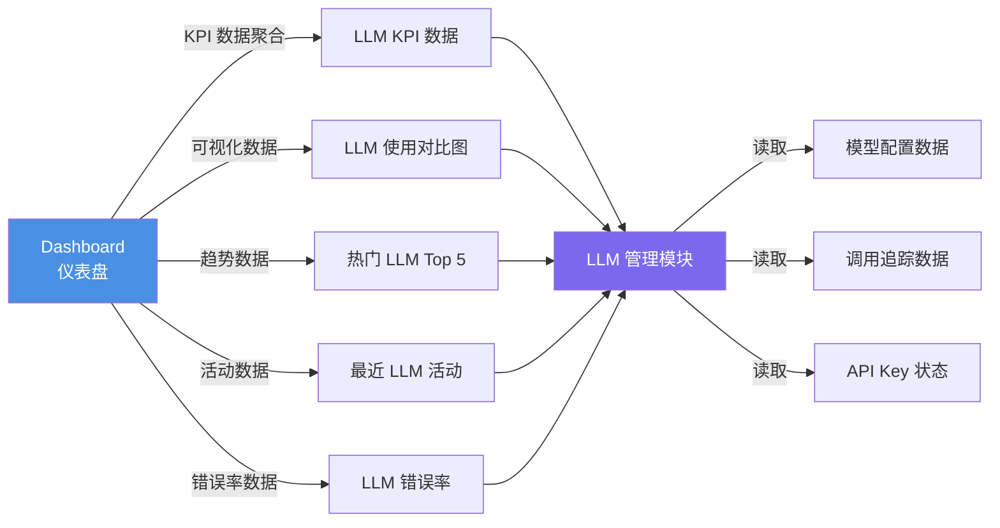

**数据流转说明**：

| 数据流方向 | 数据内容 | 缓存策略 |
|------------|----------|----------|
| Dashboard → LLM 模块 | Dashboard 通过 LLM 模块的聚合接口读取 KPI、图表、活动数据 | KPI TTL=30s，图表 TTL=5min |
| LLM 模块 → 模型配置 | LLM 模块读取模型配置（model_name、status、api_protocol 等） | 无缓存，实时查询 |
| LLM 模块 → 调用追踪 | LLM 模块聚合调用追踪表（model_call_trace）数据 | 物化视图，预计算每 5 分钟刷新 |
| LLM 模块 → API Key 状态 | LLM 模块读取 API Key 当前状态（Active/ExpiringSoon/Expired 等） | TTL=30s |

**接口依赖清单**（与 PRD-02 §7.1 中的 API-02-04、API-02-08 对齐）：

| 接口编号 | 接口名称 | 类型 | GraphQL | 说明 |
|----------|----------|------|---------|------|
| LLM-DASH-001 | 获取 LLM KPI 数据 | Query | llmKpiData | 获取 7 个 LLM KPI 卡片数据 |
| LLM-DASH-002 | 获取 LLM 使用对比数据 | Query | llmUsageComparison | 获取 LLM 使用对比图数据 |
| LLM-DASH-003 | 获取热门 LLM Top 5 | Query | llmTrendingTop5 | 获取热门 LLM Top 5 列表 |
| LLM-DASH-004 | 获取 LLM 错误率趋势 | Query | llmErrorRateTrend | 获取 LLM 错误率趋势数据 |
| LLM-DASH-005 | 获取最近 LLM 活动 | Query | llmRecentActivities | 获取最近 LLM 相关活动 |

---

### 17.2 LLM 模块在统一监控体系中的定位

LLM 模块作为核心驱动层的核心组件，其可观测性数据（API 调用延迟、Token 消耗、Provider 健康度、错误率等）应统一上报至 **[PRD-11 监控与分析](PRD-11-监控与分析.md)** 进行聚合分析：

- **LLM 性能与可用性 SLA**（§20）：核心指标 P95/P99 延迟、可用性 — 通过 PRD-11 §4.7.3 LLM 调用延迟与错误率 业务监控大盘展示
- **LLM 链路 APM 追踪**（§21）：跨 LLM Provider 的 Trace 上下文传递 — 统一汇入 PRD-11 §4.4 链路追踪
- **LLM 专属监控指标**（§22）：各 Provider 健康度、模型切换次数 — 统一由 PRD-11 §4.3 指标采集与管理 接收
- **Prompt 注入防护**（§23）：安全事件审计 — 上报至 PRD-11 §4.5.6 审计日志
- **A2A 协议安全（LLM 侧）**（§24）：跨 Agent 通信安全事件 — 关联 PRD-11 §4.4.5 跨模块追踪
- **LLM 租户隔离**（§25）：跨租户访问尝试 — 触发 PRD-11 §6.2 BR-11-007 告警规则
- **LLM 限流与配额**（§26）：限流事件 — 触发 PRD-11 §4.6 告警管理
- **LLM 错误码扩展（14 段位细分）**（§27）：错误码上报 — 关联 PRD-11 §10.3 错误码段位 15 段位规范

> LLM 模块的横切监控实现细节仍保留在本 PRD（§20-§27），但所有指标 / Trace / 日志的**统一存储、聚合分析、告警分发、仪表盘展示**均归口至 PRD-11 监控与分析。

本章节基于 PRD-12 §5.4 的全局模块关系框架，针对大语言模型（LLM）模块进行模块关系详细说明，明确 LLM 模块在五层架构中的位置、与其他模块的依赖关系及数据流转路径。

### 17.1 大语言模型在五层架构中的位置

大语言模型（LLM）模块位于系统的"核心驱动层"（Core Driver Layer），是 AI Multi-Agent System 的智能核心，为整个系统提供认知推理能力。

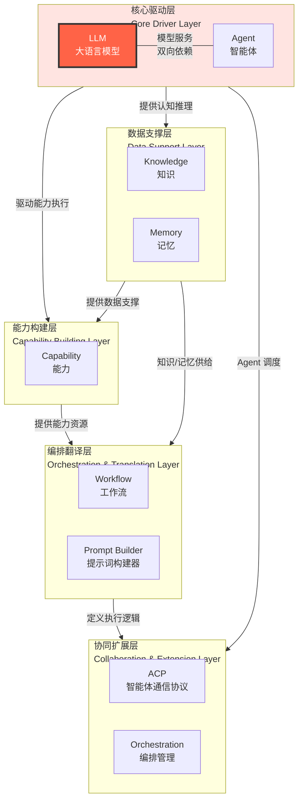

**层级说明**：

| 架构层 | 包含模块 | LLM 在该层的角色 |
|--------|----------|------------------|
| 核心驱动层 | LLM、Agent | LLM 是核心驱动层的两大支柱之一，为整个系统提供认知推理能力 |
| 能力构建层 | Capability | LLM 参与能力调用的推理执行 |
| 数据支撑层 | Knowledge、Memory | LLM 通过 Agent 间接消费知识与记忆 |
| 编排翻译层 | Workflow、Prompt Builder | LLM 作为 Prompt 模板渲染后的执行目标 |
| 协同扩展层 | Orchestration、ACP | LLM 通过 Agent 参与多 Agent 协同 |

### 17.2 LLM 模块依赖关系详解

#### 17.3.1 LLM ↔ Agent（核心驱动层内部 — 双向依赖）

| 维度 | 说明 |
|------|------|
| 方向 | LLM ↔ Agent |
| 类型 | 双向依赖 |
| 描述 | LLM（大模型管理）提供模型服务，Agent（代理管理）以 LLM 为核心控制器进行任务执行。Agent 调用时需要选择具体的 LLM 模型，LLM 的配置变更会影响 Agent 的执行效果 |
| 数据流 | Agent 请求 → 模型选择 → LLM 推理调用 → 结果返回 → Agent 决策 |
| 影响范围 | LLM 服务故障时，所有依赖该模型的 Agent 将无法执行推理任务 |
| 关联实体 | agent_model_binding 表（PRIMARY / FALLBACK） |
| PRD-04 关联章节 | §7.3 关联代理、§7.6 多模型备选配置 |

#### 17.2.2 Capability ↔ LLM（能力构建层 — 双向依赖）

| 维度 | 说明 |
|------|------|
| 方向 | Capability ↔ LLM |
| 类型 | 双向依赖 |
| 描述 | Capability（能力管理）整合 Skill 和 Tool 为统一资源池，能力调用时需要选择 LLM 模型进行推理，LLM 的参数配置影响能力的执行效果 |
| 数据流 | 能力定义 → 模型选择 → LLM 调用 → 结果返回 → 能力执行 |
| 影响范围 | LLM 模型不可用时，依赖该模型的能力调用将失败 |
| 关联接口 | LLM-API-009 获取模型关联代理列表（Capability 通过此接口获取可用模型） |
| PRD-04 关联章节 | §7.7.1 配额限制设置、§7.7.2 用量统计展示 |

#### 17.2.3 Prompt Builder → LLM（编排翻译层 — 模型调用）

| 维度 | 说明 |
|------|------|
| 方向 | Prompt Builder → LLM |
| 类型 | 模型调用依赖 |
| 描述 | Prompt Builder（提示词构建器）渲染 Prompt 模板后，需调用 LLM 完成推理。Prompt 模板中可指定使用的 LLM 模型，模板渲染后的请求下发至指定 LLM |
| 数据流 | Prompt 模板 → 变量填充 → 模型选择 → LLM 调用 → 结果返回 |
| 影响范围 | LLM 不可用时，依赖该 LLM 的 Prompt 调用将失败 |
| 关联接口 | LLM-API-002 获取模型详情（Prompt Builder 引用模型时校验模型可用性） |
| PRD-04 关联章节 | §7.4 模型健康检查、§7.8 模型调用追踪 |

#### 17.2.4 Dashboard → LLM（数据聚合 — 只读依赖）

| 维度 | 说明 |
|------|------|
| 方向 | Dashboard → LLM |
| 类型 | 数据读取（聚合） |
| 描述 | Dashboard（仪表盘）从 LLM 模块聚合 KPI、图表、活动数据，用于 LLM 管理模块的概览展示。Dashboard 仅读取数据，不产生写入操作 |
| 数据流 | LLM 模块数据 → 聚合查询 → KPI 计算 → 图表渲染 |
| 影响范围 | Dashboard 故障不影响 LLM 模块运行；LLM 模块故障时 Dashboard 卡片显示"数据加载失败" |
| 关联接口 | LLM-DASH-001 ~ LLM-DASH-005（见 §16.7） |
| PRD-04 关联章节 | §16 模块仪表盘与导航 |

#### 17.3.5 Monitoring → LLM（监控数据采集 — 横向依赖）

| 维度 | 说明 |
|------|------|
| 方向 | Monitoring → LLM |
| 类型 | 监控采集 |
| 描述 | Monitoring（监控与分析）从 LLM 模块采集运行指标（调用次数、Token 消耗、错误率、响应时间）和日志数据，进行监控分析和告警。LLM 模块需暴露标准的监控指标接口 |
| 数据流 | LLM 调用指标 → 采集 Agent → PostgreSQL 分区表 / Prometheus → 监控面板 / 告警规则 |
| 影响范围 | Monitoring 故障不影响 LLM 模块运行，但会导致监控盲区 |
| 关联指标 | 调用次数、Token 消耗、错误率、响应时间、模型状态变更、API Key 轮换事件 |

#### 17.3.6 System Setting → LLM（全局配置 — 配置依赖）

| 维度 | 说明 |
|------|------|
| 方向 | System Setting → LLM |
| 类型 | 配置依赖（虚线） |
| 描述 | System Setting（系统设置）为 LLM 模块提供全局配置参数（如 LLM 默认 Temperature、默认 Max Context、全局 LLM 调用上限等）。配置变更时通过事件总线推送至 LLM 模块 |
| 数据流 | 配置变更 → 事件总线 → LLM 模块监听 → 配置热更新 |
| 影响范围 | 全局配置变更可能影响 LLM 模块的默认行为 |

### 17.4 LLM 模块依赖关系矩阵

| 上游依赖方 \ LLM | 调用 LLM | 读取 LLM 配置 | 触发 LLM 健康检查 | 接收 LLM 事件 | 监控 LLM 指标 |
|------------------|:--------:|:-------------:|:-----------------:|:-------------:|:-------------:|
| Agent（代理管理） | ✅（主调用方） | ✅ | ✅（调用前检查） | ✅（状态变更、降级通知） | — |
| Capability（能力管理） | ✅ | ✅ | — | ✅ | — |
| Prompt Builder（提示词构建器） | ✅ | ✅ | — | — | — |
| Workflow（工作流） | 间接（通过 Agent） | ✅ | — | ✅ | — |
| Orchestration（编排） | 间接（通过 Agent） | ✅ | — | ✅ | — |
| Dashboard（仪表盘） | — | ✅ | — | ✅ | ✅ |
| Monitoring（监控分析） | — | — | ✅（主动触发） | ✅ | ✅（采集） |
| System Setting（系统设置） | — | ✅（配置推送） | — | — | — |

> ✅ = 存在依赖，— = 无直接依赖

### 17.5 LLM 模块依赖关系流程图

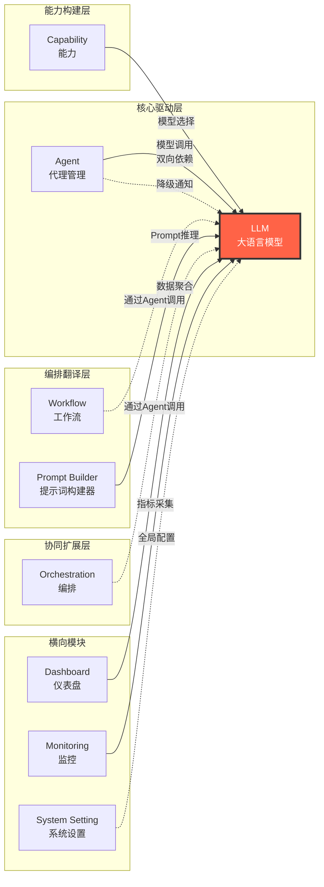

---

## 18. 非功能需求汇总

本章节汇总 LLM 模块特有的非功能需求（性能、安全、可用性、兼容性、可观测性），与 PRD-12 §5.5 全局非功能需求框架对齐，并补充 LLM 模块的特有约束。PRD-04 原有 §14 中的非功能需求为 LLM 模块内部基线，本节为 Dashboard 集成、全局安全和可观测性维度的扩展需求。

### 18.1 性能需求

| 需求编号 | 需求项 | 指标 | 验证方法 |
|----------|--------|------|----------|
| LLM-NFR-P-001 | Dashboard LLM KPI 接口响应时间 | ≤ 500ms（P95） | APM 性能监控 |
| LLM-NFR-P-002 | Dashboard LLM 图表数据接口响应时间 | ≤ 1s（P95） | APM 性能监控 |
| LLM-NFR-P-003 | Dashboard LLM 趋势列表响应时间 | ≤ 800ms（P95） | APM 性能监控 |
| LLM-NFR-P-004 | LLM 错误率趋势图渲染时间 | ≤ 2 秒 | 使用 Performance API 测量 |
| LLM-NFR-P-005 | 热门 LLM Top 5 列表加载时间 | ≤ 1 秒 | 接口性能测试 |
| LLM-NFR-P-006 | 最近 LLM 活动分页加载 | ≤ 1 秒（10 条/页） | 接口性能测试 |
| LLM-NFR-P-007 | LLM 数据刷新延迟 | ≤ 30 秒（KPI）/ 5 分钟（图表） | 端到端监控 |
| LLM-NFR-P-008 | LLM 图表数据降采样 | 数据点超过 200 时自动降采样至 100 个 | 构造大数据量场景验证 |
| LLM-NFR-P-009 | Sidebar 加载时间（含 LLM 权限过滤） | ≤ 300ms | 前端性能监控 |
| LLM-NFR-P-010 | LLM KPI 物化视图刷新 | 每 5 分钟预计算刷新 | 物化视图刷新日志 |

### 18.2 安全需求

| 需求编号 | 需求项 | 指标 | 验证方法 |
|----------|--------|------|----------|
| LLM-NFR-S-001 | 传输加密 | 全站 HTTPS，TLS 1.2+；LLM API 调用 HTTPS | SSL Labs 测试 |
| LLM-NFR-S-002 | API Key 加密存储 | LLM 模块 API Key 使用 AES-256 加密存储，数据库中无明文 | 数据库直查验证 |
| LLM-NFR-S-003 | API Key 脱敏展示 | 前端和日志中 API Key 仅显示前 4 位和后 4 位 | 前端检查 + 日志审查 |
| LLM-NFR-S-004 | Dashboard LLM 数据权限隔离 | 不同 Merchant 的 LLM 数据严格隔离，跨 Merchant 访问返回 403 | 渗透测试 |
| LLM-NFR-S-005 | Sidebar 权限隔离 | Sidebar 大模型管理菜单严格按 `llm:list` 权限过滤，禁止通过 URL 绕过访问 | 渗透测试 |
| LLM-NFR-S-006 | 接口鉴权 | 所有 Dashboard LLM 接口需携带有效 Token，无效 Token 返回 401 | 使用无效/过期 Token 验证 |
| LLM-NFR-S-007 | 接口限流 | 单用户 100 QPS，超出返回 HTTP 200 + 业务错误码 140403（限流触发） | 使用压测工具模拟超限请求 |
| LLM-NFR-S-008 | LLM 审计日志 | 所有 LLM 模块敏感操作记录审计日志（不可篡改） | 日志审查 |
| LLM-NFR-S-009 | 错误码安全 | 错误响应中不泄露 API Key、Secret、内部堆栈等敏感信息 | 错误响应内容审查 |
| LLM-NFR-S-010 | 防注入 | LLM 相关接口 SQL 注入、XSS、CSRF 防护 | 渗透测试 |
| LLM-NFR-S-011 | CORS 策略 | LLM 模块接口仅允许白名单域名跨域访问 | 配置检查 |

### 18.3 可用性需求

| 需求编号 | 需求项 | 指标 | 验证方法 |
|----------|--------|------|----------|
| LLM-NFR-A-001 | Dashboard LLM 服务可用性 | ≥ 99.9%（月度） | 监控报表 |
| LLM-NFR-A-002 | LLM 模块服务可用性 | LLM 管理模块 SLA ≥ 99.9% | 监控报表 |
| LLM-NFR-A-003 | 单个 LLM KPI 接口故障隔离 | 单个 LLM KPI 接口故障不影响其他卡片展示 | 模拟单个接口故障，验证其余卡片正常 |
| LLM-NFR-A-004 | LLM 模块数据离线降级 | 离线状态下展示缓存数据，顶部显示离线提示 | 断开网络后验证页面展示 |
| LLM-NFR-A-005 | LLM 模块降级机制 | 主 LLM 故障后，Agent 在 60 秒内降级至备选模型 | 故障注入测试 |
| LLM-NFR-A-006 | LLM 模块自动恢复 | 主 LLM 恢复后，Agent 在 60 秒内切回主模型 | 故障恢复测试 |
| LLM-NFR-A-007 | WebSocket 断线重连 | 权限 / 状态推送 WebSocket 断线自动重连（指数退避，最大 5 次，间隔 1s/2s/4s/8s/16s） | 模拟网络中断验证 |
| LLM-NFR-A-008 | WebSocket 降级 | WebSocket 重连失败后降级为 HTTP 轮询（30 秒间隔） | 模拟持续断线验证 |
| LLM-NFR-A-009 | 错误率 SLA | LLM 模块 API 错误率 ≤ 0.1%（排除客户端错误） | 监控报表 |
| LLM-NFR-A-010 | RPO / RTO | LLM 模块数据 RPO ≤ 1 分钟（P0 核心），RTO ≤ 5 分钟（P0 核心，与 PRD-09 §41.12 对齐） | 灾备演练 |

### 18.4 兼容性需求

| 需求编号 | 需求项 | 指标 | 验证方法 |
|----------|--------|------|----------|
| LLM-NFR-C-001 | Dashboard 浏览器兼容 | Chrome ≥ 90、Firefox ≥ 88、Safari ≥ 14、Edge ≥ 90 | BrowserStack 验证 |
| LLM-NFR-C-002 | Dashboard 移动端兼容 | iOS Safari ≥ 14、Android Chrome ≥ 90 | 真机或模拟器验证 |
| LLM-NFR-C-003 | Dashboard 分辨率适配 | ≥ 1280px 桌面端完整布局，768px~1279px 平板适配，< 768px 移动端单列布局 | Chrome DevTools 模拟 |
| LLM-NFR-C-004 | API Protocol 兼容 | 支持 OpenAI Compatible、Anthropic、Gemini、Azure OpenAI、Ollama，可扩展 Custom 协议 | 接入多协议模型验证 |
| LLM-NFR-C-005 | API 向后兼容 | LLM 模块 API 版本升级时，旧版本至少保留 6 个月兼容期 | 版本管理检查 |
| LLM-NFR-C-006 | 响应式断点 | Sidebar 在 XL/LG/MD/SM 四个断点平滑适配 | 响应式测试 |

### 18.5 可观测性需求

| 需求编号 | 需求项 | 指标 | 验证方法 |
|----------|--------|------|----------|
| LLM-NFR-O-001 | 分布式追踪 | LLM 模块所有 API 请求支持分布式链路追踪（traceId 贯穿 Dashboard→LLM→Agent 全链路） | 链路追踪验证 |
| LLM-NFR-O-002 | Prometheus 指标暴露 | LLM 模块服务暴露 `/metrics` 接口，包含调用次数、Token 消耗、错误率、响应时间、模型状态变更等关键指标 | 监控系统验证 |
| LLM-NFR-O-003 | 健康检查接口 | LLM 模块服务提供 `/health` 健康检查接口 | 健康检查验证 |
| LLM-NFR-O-004 | 告警规则 | 关键指标异常时 5 分钟内触发告警：LLM 错误率 > 5%、主模型连续 3 次健康检查失败、API Key 即将过期 | 告警测试 |
| LLM-NFR-O-005 | Dashboard 埋点 | Dashboard 中 LLM 图表点击、KPI 卡片查看、LLM 详情页跳转等关键操作埋点上报 | 数据分析验证 |
| LLM-NFR-O-006 | 审计日志完整性 | LLM 模块所有敏感操作（创建、删除、API Key 轮换、健康检查触发）记录不可篡改审计日志 | 日志审查 |
| LLM-NFR-O-007 | LLM 错误日志 | LLM 调用失败时记录详细错误信息（状态码、错误消息、模型 ID、Trace ID） | 错误日志审查 |

---

## 19. GraphQL 接口规范汇总（LLM 模块）

本章节基于 **PRD-00 §4**（全局 GraphQL 单总线规范）与 **PRD-12 §5.6**（模块级接口规范框架），针对 LLM 模块的 GraphQL Schema、错误码体系、响应格式与分页规范进行汇总。LLM 模块对外**仅**通过 GraphQL 单总线暴露，`/api/v1/llm/**` 仅作为 API Gateway → GraphQL 引擎的内部转发前缀（详见 §19.2），不在此定义任何 RESTful 资源命名、HTTP 方法语义或路径参数。

### 19.1 GraphQL Schema 概览

LLM 模块 GraphQL 端点统一为 `POST /api/v1/llm/graphql`（由 API Gateway 转发，参见 §19.2），单次请求可同时携带多个根字段（Query / Mutation）。Subscription 通过 WebSocket 通道（`graphql-ws` 协议）承载。下面分节列出 Query / Mutation / Subscription、Object / Input / Enum 类型，以及 SDL 片段示例。

#### 19.1.1 Query 列表

| 字段 | 返回类型 | 用途 | 关键错误码 |
|------|----------|------|-----------|
| `modelDetail(id: ID!)` | `LlmModel` | 按 ID 查询单个 LLM 模型 | 140100 |
| `models(filter: ModelFilter, sort: ModelSort, first: Int, after: String, last: Int, before: String)` | `ModelConnection!` | LLM 模型列表，Relay 分页 | 140101 / 140102 |
| `modelTraceConnection(modelId: ID!, first: Int, after: String, sort: TraceSort)` | `TraceConnection!` | 关联调用追踪分页 | 140100 |
| `providerDetail(id: ID!)` | `LlmProvider` | 按 ID 查询 Provider | 140200 |
| `providers(filter: ProviderFilter, first: Int, after: String, sort: ProviderSort)` | `ProviderConnection!` | Provider 列表 | 140200 / 140204 |
| `apiKeyDetail(id: ID!)` | `LlmApiKey` | 按 ID 查询 API Key（敏感字段脱敏） | 140300 / 140301 / 140302 |
| `apiKeys(providerId: ID!, first: Int, after: String, sort: ApiKeySort)` | `ApiKeyConnection!` | Provider 下 API Key 列表 | 140300 |
| `healthCheckHistory(modelId: ID!, first: Int, after: String, sort: HealthCheckSort)` | `HealthCheckConnection!` | 健康检查历史 | 140100 / 140204 |
| `agentBindingConnection(modelId: ID!, first: Int, after: String, sort: AgentBindingSort)` | `AgentBindingConnection!` | 关联 Agent 分页 | 140100 |
| `dashboardLlmKpi(window: KpiWindow!)` | `DashboardLlmKpi!` | Dashboard LLM 聚合指标 | 140702 |

#### 19.1.2 Mutation 列表

| 字段 | 输入 | 返回 | 关键错误码 |
|------|------|------|-----------|
| `createModel(input: CreateModelInput!)` | `CreateModelInput!` | `LlmModel!` | 140101 / 140206 |
| `updateModel(id: ID!, input: UpdateModelInput!)` | `UpdateModelInput!` | `LlmModel!` | 140100 / 140102 / 140103 |
| `deleteModel(id: ID!)` | - | `DeletePayload!` | 140100 / 140104 |
| `testConnection(modelId: ID!)` | - | `ConnectionTestResult!` | 140201 / 140202 / 140203 |
| `createProvider(input: CreateProviderInput!)` | `CreateProviderInput!` | `LlmProvider!` | 140201 / 140206 |
| `updateProvider(id: ID!, input: UpdateProviderInput!)` | `UpdateProviderInput!` | `LlmProvider!` | 140200 / 140204 |
| `rotateApiKey(apiKeyId: ID!, strategy: ApiKeyRotationStrategy!)` | - | `LlmApiKey!` | 140303 / 140304 / 140305 |
| `revokeApiKey(apiKeyId: ID!, reason: String)` | - | `LlmApiKey!` | 140302 |
| `bindAgents(modelId: ID!, agentIds: [ID!]!)` | - | `AgentBindingConnection!` | 140100 / 140104 |
| `unbindAgent(modelId: ID!, agentId: ID!)` | - | `DeletePayload!` | 140100 |
| `batchUnbindAgents(modelId: ID!, agentIds: [ID!]!)` | - | `BatchUnbindPayload!` | 140100 |
| `invokeLlm(input: InvokeLlmInput!)` | `InvokeLlmInput!` | `LlmInvokeResult!` | 140400 / 140401 / 140402 / 140403 / 140404 |
| `submitToolCall(invocationId: ID!, calls: [ToolCallInput!]!)` | - | `ToolCallResult!` | 140406 / 140407 |

#### 19.1.3 Subscription 列表

| 字段 | 参数 | 推送负载 | 关键错误码 |
|------|------|----------|-----------|
| `streamLlmResponse(invocationId: ID!)` | `invocationId: ID!` | `StreamChunk!` | 140500 / 140501 / 140502 |
| `streamToolCall(invocationId: ID!)` | `invocationId: ID!` | `ToolCallEvent!` | 140500 |

Subscription 通道由 API Gateway 的 WebSocket 网关承载，使用 `graphql-ws` 协议，客户端通过 `ws://{gateway}/api/v1/llm/graphql/ws` 建立长连接。

#### 19.1.4 Object Types

```graphql
type LlmModel {
  id: ID!
  tenantId: ID!                        # Read-only, derived from partition_key
  modelName: String!
  displayName: String!
  apiProtocol: ApiProtocol!
  provider: LlmProvider!
  isEnabled: Boolean!
  healthStatus: ModelStatus!           # State machine status: INACTIVE/ACTIVE/DEGRADED/UNHEALTHY/DISABLED
  ownerScope: String!
  sharedTenantIds: [ID!]
  createdAt: DateTime!
  updatedAt: DateTime!
  agentCount: Int!
  lastInvokedAt: DateTime
  health: ModelHealth
}

type LlmProvider {
  id: ID!
  tenantId: ID!                        # Read-only, derived from partition_key
  name: String!
  baseUrl: String!
  protocol: ApiProtocol!
  status: ProviderStatus!
  maxConcurrency: Int!
  apiKeys(first: Int, after: String): ApiKeyConnection!
}

type LlmApiKey {
  id: ID!
  provider: LlmProvider!
  status: ApiKeyStatus!
  expiresAt: DateTime
  maskedKey: String!
  rotationStrategy: ApiKeyRotationStrategy
  lastRotatedAt: DateTime
}

type ModelConnection {
  edges: [ModelEdge!]!
  pageInfo: PageInfo!
  totalCount: Int!
}

type ModelEdge { cursor: String!, node: LlmModel! }
type PageInfo { hasNextPage: Boolean!, hasPreviousPage: Boolean!, startCursor: String, endCursor: String }
type DeletePayload { id: ID!, deletedAt: DateTime! }
type BatchUnbindPayload { modelId: ID!, unboundCount: Int!, failedAgentIds: [ID!]! }
type ConnectionTestResult { ok: Boolean!, latencyMs: Int, message: String }
type LlmInvokeResult { invocationId: ID!, content: String, toolCalls: [ToolCall!], usage: TokenUsage! }
type StreamChunk { invocationId: ID!, delta: String!, finishReason: String }
type TokenUsage { inputTokens: Int!, outputTokens: Int!, totalTokens: Int! }
type DashboardLlmKpi {
  totalProviders: KpiMetric!
  activeModels: KpiMetric!
  totalApiCalls: KpiMetric!
  totalTokenConsumption: KpiMetric!
  averageResponseTimeMs: KpiMetric!
  errorRatePercent: KpiMetric!
  estimatedCost: KpiMetric!
}
type KpiMetric { value: Float!, unit: String!, trendPercent: Float! }
```

#### 19.1.5 Input Types

```graphql
input CreateModelInput {
  modelName: String!
  apiProtocol: ApiProtocol!
  providerId: ID!
  config: JSON
  description: String
}
input UpdateModelInput { modelName: String, config: JSON, description: String, status: ModelStatus }
input CreateProviderInput { name: String!, baseUrl: String!, protocol: ApiProtocol!, maxConcurrency: Int! }
input UpdateProviderInput { name: String, baseUrl: String, maxConcurrency: Int, status: ProviderStatus }
input ModelFilter { status: ModelStatus, providerId: ID, search: String }
input ModelSort { field: ModelSortField!, direction: SortDirection! }
enum ModelSortField { CREATED_AT, UPDATED_AT, MODEL_NAME, STATUS }
input ProviderFilter { status: ProviderStatus, search: String }
input InvokeLlmInput { modelId: ID!, messages: [ChatMessageInput!]!, tools: [ToolDefinitionInput], stream: Boolean = false }
input ChatMessageInput { role: ChatRole!, content: String!, name: String, toolCallId: String }
input ToolDefinitionInput { name: String!, description: String, parameters: JSON }
input ToolCallInput { toolCallId: String!, name: String!, arguments: JSON! }
input ApiKeyRotationStrategy { type: RotationType!, intervalSeconds: Int }
```

#### 19.1.6 Enum 定义

```graphql
enum ApiProtocol { OPENAI_COMPATIBLE, ANTHROPIC, GEMINI, AZURE_OPENAI, OLLAMA, CUSTOM }
enum ModelStatus { INACTIVE, ACTIVE, DEGRADED, UNHEALTHY, DISABLED }
enum ProviderStatus { HEALTHY, DEGRADED, UNHEALTHY, MAINTENANCE }
enum ApiKeyStatus { ACTIVE, EXPIRING_SOON, TRANSITIONING, EXPIRED, ROTATED }
enum ChatRole { SYSTEM, USER, ASSISTANT, TOOL }
enum RotationType { TIME_BASED, USAGE_BASED, MANUAL }
enum SortDirection { ASC, DESC }
enum KpiWindow { LAST_1H, LAST_24H, LAST_7D, LAST_30D }
```

#### 19.1.7 Schema 片段示例（SDL）

```graphql
schema {
  query: Query
  mutation: Mutation
  subscription: Subscription
}

type Query {
  modelDetail(id: ID!): LlmModel
  models(
    filter: ModelFilter
    sort: ModelSort
    first: Int = 20
    after: String
    last: Int
    before: String
  ): ModelConnection!
  dashboardLlmKpi(window: KpiWindow! = LAST_24H): DashboardLlmKpi!
}

type Mutation {
  createModel(input: CreateModelInput!): LlmModel!
  testConnection(modelId: ID!): ConnectionTestResult!
  batchUnbindAgents(modelId: ID!, agentIds: [ID!]!): BatchUnbindPayload!
}
```

> **字段演进约定**：Schema 版本演进通过 `@deprecated(reason: "...")` 指令标识废弃字段（客户端可通过 `extensions.isDeprecated` 检测），不再使用 URL 路径版本号。Schema 整体兼容性遵循 PRD-00 §4.3 演化策略。

### 19.2 Gateway 内部路由（简表引用）

LLM 模块对外**仅**通过 GraphQL 单总线暴露，无独立 RESTful 端点。`/api/v1/llm` 仅为 API Gateway → GraphQL 引擎的内部转发前缀，具体网关路由、限流、鉴权钩子请参见 **PRD-00 §4.2 网关路由**。本节仅给出最简化的内部转发条目，**不在此定义任何 HTTP 方法语义、资源命名规则、路径参数风格**。

| Gateway 内部路径 | 转发目标 | 协议 | 用途 |
|------------------|----------|------|------|
| `POST /api/v1/llm/graphql` | GraphQL 引擎（`graphql-engine-llm`） | HTTPS | 单总线 Query / Mutation |
| `POST /api/v1/llm/graphql/ws` | GraphQL 引擎（`graphql-engine-llm`） | WebSocket（`graphql-ws`） | Subscription 长连接 |
| `GET  /api/v1/llm/healthz` | LLM 进程健康探针 | HTTPS | 容器 Liveness 探针（不暴露业务） |
| `GET  /api/v1/llm/readyz` | LLM 进程就绪探针 | HTTPS | 容器 Readiness 探针（不暴露业务） |

> **说明**：
> - `/api/v1/llm/**` 是 API Gateway 内部命名空间；客户端业务请求**只能**通过 `POST /api/v1/llm/graphql` 提交；不得自行拼装 `/api/v1/llm/models/{id}` 等 RESTful 路径。
> - 健康检查端点（`/healthz`、`/readyz`）仅供 Kubernetes / Consul 使用，不在业务 API 文档中列出，亦不参与业务错误码统计。
> - 认证（`Authorization: Bearer {Token}`）、Token 刷新（GraphQL `Mutation refreshToken`）的网关策略由 **PRD-00 §4.2** 统一描述，本章不再重复。

### 19.3 错误码体系（LLM 模块）

LLM 模块错误码遵循 **PRD-00 §5 全局错误码规范**：段位 `140001-140999`、命名空间统一为 `BIZ_LLM_*`（不设二级前缀）。对客户端通过 GraphQL `errors[].extensions.code` 返回数字错误码（字符串形式），内部日志/告警使用 `BIZ_LLM_*` 命名。

#### 19.3.1 错误码段位 140001-140999（与 PRD-00 §5 对齐）

| 段位 | 用途 | 段位容量 |
|------|------|----------|
| 140001-140099 | 通用错误（UNKNOWN、INTERNAL 等） | 99 |
| 140100-140199 | 模型资源相关 | 100 |
| 140200-140299 | Provider 相关 | 100 |
| 140300-140399 | API Key 相关 | 100 |
| 140400-140499 | 调用执行相关（超时、限流、熔断） | 100 |
| 140500-140599 | 流式 / WebSocket / 消息组 | 100 |
| 140600-140699 | 安全相关（注入、过滤、A2A） | 100 |
| 140700-140799 | 租户隔离 / Outbox / partition_key | 100 |
| 140800-140899 | 文件相关 | 100 |
| 140900-140999 | 预留扩展 | 100 |

#### 19.3.2 命名空间 BIZ_LLM_*

LLM 模块所有命名错误码统一归属于 `BIZ_LLM_*` 命名空间，允许使用描述性二级前缀（如 `BIZ_LLM_MODEL_*`、`BIZ_LLM_PROVIDER_*`、`BIZ_LLM_API_KEY_*`）以提升可读性；业务子类型由数字错误码段位（4 位段位的高 3 位）区分，二级前缀与数字段位必须一一对应。

GraphQL `errors[].extensions.code` 与命名错误码的映射示例：

```json
"errors": [
  {
    "message": "Provider 认证失败: API Key 无效或已过期",
    "path": ["testConnection"],
    "extensions": {
      "code": "140203",
      "traceId": "trace-abc123-def456"
    }
  }
]
```

#### 19.3.3 错误码总览表

| 错误码 | 命名错误码 | 错误类型 | 说明 |
|--------|-----------|----------|------|
| 140001 | BIZ_LLM_UNKNOWN | 通用错误 | LLM 模块未知错误 |
| 140100 | BIZ_LLM_MODEL_NOT_FOUND | 资源不存在 | 模型不存在 |
| 140101 | BIZ_LLM_MODEL_INVALID | 参数校验错误 | 模型配置校验失败 |
| 140102 | BIZ_LLM_MODEL_STATUS_CONFLICT | 状态冲突 | 模型状态冲突 |
| 140103 | BIZ_LLM_MODEL_VERSION_CONFLICT | 状态冲突 | 模型版本冲突 |
| 140104 | BIZ_LLM_MODEL_PROVIDER_IN_USE | 业务规则错误 | 模型已在其他 Provider 中使用 |
| 140200 | BIZ_LLM_PROVIDER_NOT_FOUND | 资源不存在 | Provider 不存在 |
| 140201 | BIZ_LLM_PROVIDER_CONNECTION_FAILED | 外部服务错误 | Provider 连接失败 |
| 140202 | BIZ_LLM_PROVIDER_TIMEOUT | 外部服务错误 | Provider 连接超时 |
| 140203 | BIZ_LLM_PROVIDER_AUTH_FAILED | 外部服务错误 | Provider 认证失败 |
| 140204 | BIZ_LLM_PROVIDER_STATUS_CONFLICT | 状态冲突 | Provider 状态冲突 |
| 140205 | BIZ_LLM_PROVIDER_MAX_CONCURRENCY | 限流 | Provider 已达到最大并发数 |
| 140206 | BIZ_LLM_PROVIDER_MODEL_UNSUPPORTED | 业务规则错误 | Provider 不支持此模型 |
| 140207 | BIZ_LLM_PROVIDER_RESPONSE_INVALID | 外部服务错误 | Provider 响应格式错误 |
| 140300 | BIZ_LLM_API_KEY_NOT_FOUND | 资源不存在 | API Key 不存在 |
| 140301 | BIZ_LLM_API_KEY_EXPIRED | 权限错误 | API Key 已过期 |
| 140302 | BIZ_LLM_API_KEY_REVOKED | 权限错误 | API Key 已吊销 |
| 140303 | BIZ_LLM_API_KEY_INSUFFICIENT | 计费错误 | API Key 余额不足 |
| 140304 | BIZ_LLM_API_KEY_ROTATING | 状态冲突 | API Key 轮换中 |
| 140305 | BIZ_LLM_API_KEY_AUTH_UNSUPPORTED | 参数校验错误 | API Key 认证方式不支持 |
| 140400 | BIZ_LLM_INVOKE_TIMEOUT | 外部服务错误 | 调用超时 |
| 140401 | BIZ_LLM_INVOKE_FAILED | 外部服务错误 | 调用失败（Provider 返回错误） |
| 140402 | BIZ_LLM_QUOTA_EXCEEDED | 限流 | 配额超限 |
| 140403 | BIZ_LLM_RATE_LIMITED | 限流 | 限流触发 |
| 140404 | BIZ_LLM_CIRCUIT_BREAKER | 服务降级 | 降级熔断触发（连续 5 次失败转 UNHEALTHY，与 §6 一致） |
| 140405 | BIZ_LLM_EMPTY_RESPONSE_RETRY_EXHAUSTED | 外部服务错误 | 空响应重试耗尽 |
| 140406 | BIZ_LLM_TOOL_CALL_FAILED | 内部错误 | 工具调用失败 |
| 140407 | BIZ_LLM_TOOL_CALL_PARAM_INVALID | 参数校验错误 | 工具调用参数解析失败 |
| 140500 | BIZ_LLM_WEBSOCKET_DISCONNECTED | 连接错误 | WebSocket 连接断开 |
| 140501 | BIZ_LLM_STREAM_TIMEOUT | 外部服务错误 | 流式推送超时 |
| 140502 | BIZ_LLM_MESSAGE_GROUP_INVALID | 参数校验错误 | 消息组 ID 无效 |
| 140600 | BIZ_LLM_PROMPT_INJECTION | 安全错误 | Prompt 注入检测 |
| 140601 | BIZ_LLM_OUTPUT_FILTERED | 安全错误 | 输出过滤触发 |
| 140602 | BIZ_LLM_A2A_DENIED | 权限错误 | A2A 调用被拒绝 |
| 140700 | BIZ_LLM_TENANT_ISOLATION_CONFLICT | 权限错误 | 租户隔离策略冲突 |
| 140701 | BIZ_LLM_TENANT_QUOTA_EXCEEDED | 限流 | 租户配额超限 |
| 140702 | BIZ_LLM_OUTBOX_SYNC_FAILED | 内部错误 | Outbox 同步失败 |
| 140703 | BIZ_LLM_PARTITION_KEY_INVALID | 参数校验错误 | `partition_key` 无效（Neo4j 属性名） |
| 140800 | BIZ_LLM_FILE_UPLOAD_FAILED | 内部错误 | 文件上传失败 |
| 140801 | BIZ_LLM_FILE_NOT_FOUND | 资源不存在 | 文件不存在 |
| 140802 | BIZ_LLM_FILE_FORMAT_UNSUPPORTED | 参数校验错误 | 文件格式不支持 |

#### 19.3.4 GraphQL errors[].extensions.code 映射

数字错误码通过 GraphQL `errors[].extensions.code` 字段返回（字符串形式，例如 `"140101"`），`extensions.traceId` 携带链路追踪 ID。HTTP 状态码在业务层恒为 200（网关层 401/403 例外，与 PRD-00 §4.1 一致），业务层不再使用 HTTP 4xx/5xx 表达业务错误。

#### 19.3.5 错误响应示例（GraphQL 标准 errors 数组）

**参数校验错误（140101）**：

```json
{
  "data": null,
  "errors": [
    {
      "message": "模型配置校验失败: model_name 不能为空",
      "path": ["createModel"],
      "extensions": {
        "code": "140101",
        "traceId": "trace-abc123-def456",
        "fieldErrors": [
          { "field": "model_name", "message": "model_name 不能为空" }
        ]
      }
    }
  ],
  "extensions": { "traceId": "trace-abc123-def456" }
}
```

**外部服务错误（140203）**：

```json
{
  "data": null,
  "errors": [
    {
      "message": "Provider 认证失败: API Key 无效或已过期",
      "path": ["testConnection"],
      "extensions": {
        "code": "140203",
        "traceId": "trace-abc123-def456",
        "modelId": "model-001",
        "apiProtocol": "OPENAI_COMPATIBLE",
        "upstreamStatus": 401
      }
    }
  ],
  "extensions": { "traceId": "trace-abc123-def456" }
}
```

**资源不存在（140100）**：

```json
{
  "data": null,
  "errors": [
    {
      "message": "LLM 模型不存在",
      "path": ["modelDetail"],
      "extensions": {
        "code": "140100",
        "traceId": "trace-abc123-def456",
        "modelId": "model-999"
      }
    }
  ],
  "extensions": { "traceId": "trace-abc123-def456" }
}
```

### 19.4 GraphQL 响应格式

LLM 模块所有 GraphQL 响应统一遵循 **GraphQL Spec 2021-10-01** 的 `{data, errors, extensions}` 三元组，业务层不再使用 `code / data / timestamp / traceId` 这种 RESTful 风格包装。

#### 19.4.1 成功响应（GraphQL 标准 data + errors:null）

```json
{
  "data": {
    "modelDetail": {
      "id": "model-001",
      "modelName": "GPT-4o 生产环境",
      "apiProtocol": "OPENAI_COMPATIBLE",
      "status": "ACTIVE"
    }
  },
  "errors": null,
  "extensions": {
    "traceId": "trace-abc123-def456"
  }
}
```

#### 19.4.2 业务错误响应（extensions.code 携带 14xxxx）

业务错误时 `data` 字段为对应根字段的 `null`（若有多个根字段，未出错字段仍正常返回），错误信息在 `errors` 数组中，`extensions.code` 携带 14 段位数字错误码（字符串形式）。完整示例见 §19.3.5。

#### 19.4.3 Dashboard LLM 聚合响应

Dashboard LLM 聚合通过 `Query.dashboardLlmKpi` 获取，响应中 `data.dashboardLlmKpi` 承载 KPI 对象，**不**使用 `code / message / data / timestamp` 包装：

```json
{
  "data": {
    "dashboardLlmKpi": {
      "totalProviders": { "value": 3, "unit": "个", "trendPercent": 0.0 },
      "activeModels": { "value": 12, "unit": "个", "trendPercent": 2.5 },
      "totalApiCalls": { "value": 56890, "unit": "次", "trendPercent": 5.2 },
      "totalTokenConsumption": { "value": 12.4, "unit": "万Token", "trendPercent": 3.1 },
      "averageResponseTimeMs": { "value": 320, "unit": "ms", "trendPercent": -15.0 },
      "errorRatePercent": { "value": 0.85, "unit": "%", "trendPercent": -0.12 },
      "estimatedCost": { "value": 256.80, "unit": "元", "trendPercent": 4.2 }
    }
  },
  "errors": null,
  "extensions": { "traceId": "trace-abc123-def456" }
}
```

### 19.5 Relay Connection 分页规范

LLM 模块所有列表接口（模型列表、关联 Agent 列表、调用追踪日志、健康检查历史、API Key 轮换记录等）严格遵循 **PRD-00 §4.4 Relay Connection** 规范，响应仅使用 `connection`（`edges` / `pageInfo` / `totalCount`），**不**再使用 `items` 数组。

| 参数名 | 类型 | 默认值 | 取值范围 | 说明 |
|--------|------|--------|----------|------|
| `first` | Int | 20 | 1-100 | 从游标 `after` 之后开始的最多记录数 |
| `after` | String | - | Base64 游标 | 上一页响应的 `endCursor`，向后翻页 |
| `last` | Int | - | 1-100 | 从游标 `before` 之前开始的最多记录数 |
| `before` | String | - | Base64 游标 | 上一页响应的 `startCursor`，向前翻页 |
| `sort` | `ModelSort!` | `{field: CREATED_AT, direction: DESC}` | 见下表 | 单字段排序（多字段使用复合 input） |
| `filter` | `ModelFilter` | null | - | 过滤条件 |

**LLM 模块支持的排序字段**：

| Query 字段 | 用途 | 支持的 `sort.field` 枚举 |
|-----------|------|--------------------------|
| `models` | 模型列表 | `CREATED_AT`、`UPDATED_AT`、`MODEL_NAME`、`STATUS` |
| `agentBindingConnection` | 关联 Agent 列表 | `CREATED_AT`、`AGENT_NAME`、`BINDING_TYPE` |
| `modelTraceConnection` | 调用追踪日志 | `REQUEST_TIME`、`DURATION_MS`、`STATUS_CODE` |
| `healthCheckHistory` | 健康检查历史 | `CHECK_TIME`、`STATUS`、`DURATION_MS` |
| `apiKeys` | API Key 轮换记录 | `CREATED_AT`、`ROTATION_TYPE`、`STATUS` |

**Relay Connection 响应结构**（仅含 `connection`，**不**含 `items` 数组）：

```json
{
  "data": {
    "models": {
      "edges": [
        {
          "cursor": "Y3Vyc29yOjE=",
          "node": {
            "id": "model-001",
            "modelName": "GPT-4o 生产环境",
            "apiProtocol": "OPENAI_COMPATIBLE",
            "status": "ACTIVE",
            "agentCount": 12
          }
        }
      ],
      "pageInfo": {
        "hasNextPage": true,
        "hasPreviousPage": false,
        "startCursor": "Y3Vyc29yOjE=",
        "endCursor": "Y3Vyc29yOjI1"
      },
      "totalCount": 25
    }
  },
  "errors": null,
  "extensions": { "traceId": "trace-abc123-def456" }
}
```

### 19.6 接口规范验收标准

| 编号 | 验收标准 | 验证方法 |
|------|----------|----------|
| AC-LLM-API-01 | LLM 模块对外遵循 GraphQL 单总线 + **PRD-00 §4** 规范，**不**对外暴露 RESTful 端点；`/api/v1/llm/**` 仅作为 API Gateway 内部转发前缀 | API 审查 + 网关路由表审计 |
| AC-LLM-API-02 | LLM 模块业务响应 HTTP 恒为 200；业务错误经 `errors[].extensions.code` 表达；HTTP 401/403 仅保留在 API Gateway 网关层 | 接口自动化测试 + 错误码映射单测 |
| AC-LLM-API-03 | LLM 模块响应格式符合统一规范：`{data, errors, extensions.traceId}` 三元组，**不**使用 `code/data/timestamp` 包装 | 接口自动化测试，覆盖率 100% |
| AC-LLM-API-04 | 错误码体系完整且正确：命名空间 `BIZ_LLM_*`（无二级前缀），段位 `140001-140999`，覆盖 9 大错误类型 | 接口测试 + 错误码枚举静态检查 |
| AC-LLM-API-05 | 分页遵循 Relay Connection（**不**使用 `items` 数组），使用 `first/after/last/before` + `edges/pageInfo/totalCount` | 接口测试 + Schema 静态检查 |
| AC-LLM-API-06 | LLM 模块错误响应不泄露 API Key、Secret、内部堆栈等敏感信息 | 错误响应内容审查 + 渗透测试 |
| AC-LLM-API-07 | LLM 模块所有响应携带 `extensions.traceId`，支持分布式链路追踪 | 链路追踪验证 |
| AC-LLM-API-08 | LLM 模块所有业务请求携带 `Authorization: Bearer {Token}`，网关统一鉴权 | 请求拦截审查 + 网关日志审计 |

---

## 20. LLM 性能与可用性 SLA

本章补充 PRD-04 §14（基础非功能需求）与 §18（全局非功能需求）中尚未覆盖的 LLM 专属性能与可用性指标，建立面向 LLM 推理特性的 SLA 体系。所有指标与 PRD-09 §21 配置中心指标保持一致，可通过配置中心下发。

### 20.1 性能 SLA 指标

| 指标编号 | 指标名称 | 目标值 | 计算口径 | 采集方式 |
|----------|----------|--------|----------|----------|
| LLM-SLA-P-001 | TTFT（Time To First Token，首 Token 延迟） | P50 ≤ 800ms，P95 ≤ 2s，P99 ≤ 4s | 从请求进入到收到第一个 Token 的耗时 | 推理网关埋点 |
| LLM-SLA-P-002 | TPOT（Time Per Output Token，单 Token 生成时间） | P50 ≤ 50ms，P95 ≤ 120ms，P99 ≤ 250ms | 总输出时长 / 输出 Token 数 | 推理网关埋点 |
| LLM-SLA-P-003 | Token 消耗速率 | ≤ 200 Token/秒（单租户单模型） | 滑动窗口 60 秒内平均速率 | 限流组件埋点 |
| LLM-SLA-P-004 | 单次调用成本 | 实时计算并按租户汇总 | `input_tokens × input_unit_price + output_tokens × output_unit_price` | 用量计费模块 |
| LLM-SLA-P-005 | 错误率 | ≤ 0.5%（业务错误，extensions.code 14xxxx）/ ≤ 0.1%（Provider 上游 5xx） | 错误调用数 / 总调用数 | API 网关 + 调用追踪 |
| LLM-SLA-P-006 | 并发上限 | 单租户 100 QPS（默认，可调） | 滑动窗口 1 秒内请求数 | 限流组件 |
| LLM-SLA-P-007 | 端到端调用耗时 | P95 ≤ 10s（含排队、推理、流式分发） | 全链路 trace 汇总 | APM 链路追踪 |
| LLM-SLA-P-008 | 缓存命中率 | ≥ 30%（语义级缓存，仅统计非多轮对话请求） | 命中次数 / 首轮请求次数 | 缓存组件埋点 |
| LLM-SLA-P-009 | Fallback 切换耗时 | ≤ 10 秒 | 主模型失败到备选模型开始输出的耗时 | 降级开关埋点 |
| LLM-SLA-P-010 | 健康检查间隔 | 5 分钟（可调范围 30s~300s，默认 5 分钟与 LLM-BR-020 一致） | 定时任务间隔 | 调度组件 |

### 20.2 可用性 SLA 指标

| 指标编号 | 指标名称 | 目标值 | 验证方法 |
|----------|----------|--------|----------|
| LLM-SLA-A-001 | 模型可用性 | ≥ 99.5%（月度） | 监控报表（基于健康检查结果） |
| LLM-SLA-A-002 | 连续失败自动 UNHEALTHY | 连续 5 次健康检查失败自动变更为 UNHEALTHY 状态（与 §6.1 状态机一致） | 故障注入测试 |
| LLM-SLA-A-002b | 连续失败自动 DEGRADED | 连续 2 次健康检查失败自动降级为 DEGRADED 状态（与 §6.1 状态机及 LLM-BR-022 一致；5+3 策略中 5 次失败→UNHEALTHY，2 次失败→DEGRADED 为早期预警） | 故障注入测试 |
| LLM-SLA-A-003 | 自动恢复 | 连续 3 次健康检查成功从 UNHEALTHY 自动恢复为 ACTIVE | 故障恢复测试 |
| LLM-SLA-A-003b | DEGRADED 自动恢复 | 连续 3 次健康检查成功从 DEGRADED 自动恢复为 ACTIVE（与 UNHEALTHY 恢复策略一致，5+3 策略） | 故障恢复测试 |
| LLM-SLA-A-003c | 恢复时间 SLA | UNHEALTHY/DEGRADED 状态模型恢复检测间隔 5 分钟，状态自动恢复延迟 ≤ 30 秒 | 故障恢复测试 |
| LLM-SLA-A-003d | **5+3 恢复时长** | UNHEALTHY 状态恢复至 ACTIVE 的**最坏时长** = 5 分钟 × 3 次 ≈ 15 分钟；与 PRD-09 §39.6 RTO ≤ 15 分钟对齐 | 故障恢复测试 |
| LLM-SLA-A-003e | 恢复时延 P95 | UNHEALTHY → ACTIVE 全链路 P95 ≤ 15 分钟（含探测、决策、状态写入、Agent 切回） | 故障恢复测试 |
| LLM-SLA-A-003f | 恢复成功率 | 连续 3 次探测中允许 0 次失败（不允许中途失败重置计数） | 故障恢复测试 |
| LLM-SLA-A-004 | Fallback 自动切换 | 主模型 UNHEALTHY 后 10 秒内降级至备选模型 | 故障注入测试 |
| LLM-SLA-A-005 | 计划内维护窗口 | 每月不超过 2 次，每次不超过 2 小时 | 维护记录 |
| LLM-SLA-A-006 | 数据备份频率 | 每日全量备份 + 每小时增量备份 | 备份记录 |
| LLM-SLA-A-007 | RPO | ≤ 1 分钟（P0 核心业务，与 PRD-09 §41.12 对齐） | 灾备演练 |
| LLM-SLA-A-008 | RTO | ≤ 5 分钟（P0 核心业务，与 PRD-09 §41.12 对齐） | 灾备演练 |
| LLM-SLA-A-009 | 故障切换时间 | ≤ 10 秒 | 高可用测试 |
| LLM-SLA-A-010 | 限流降级 | 触发限流时返回 HTTP 200 + 业务错误码 140403（遵循 PRD-00 §4 GraphQL 单总线规范），携带 `retry_after` 字段 | 压测验证 |

**SLA 度量与服务降级矩阵**：

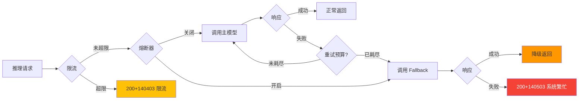

### 20.3 缓存策略

> **v5 收束说明(2026-06-13)**: 本节 L1/L2/L3/L4 为**业务内容分层**（语义/模板/元数据/配额），区别于 PRD-00 §8 的**技术分层**（进程内存/Redis/Pub-Sub/PG 物化视图）。两层映射关系：业务 L1/L2 落地于 PRD-00 §8 技术 L1+L2，业务 L3/L4 落地于 PRD-00 §8 技术 L2+L4。技术层 L3 Pub/Sub 统一作为业务各层失效广播通道。**技术实现、TTL 下限、击穿/雪崩防护、Pub/Sub 失效广播**等基础规范以 PRD-00 §8 为准，本节仅补充 LLM 模块业务内容维度的 TTL 上限与命中率目标。详见 [PRD-00 §8 全局缓存规范](#)。

| 缓存层 | 缓存内容 | TTL | 命中率目标 | 击穿防护 |
|--------|----------|-----|-----------|----------|
| L1 语义级缓存 | Prompt 哈希 → 输出 | 5 分钟（按内容变化自动失效） | ≥ 30% | 分布式锁 + 单飞（singleflight） |
| L2 模板级缓存 | Prompt 模板渲染结果 | 10 分钟 | ≥ 60% | 预热 + 异步刷新 |
| L3 模型元数据缓存 | LLM Provider/Model 配置 | 30 秒 | ≥ 95% | Pub/Sub 失效 |
| L4 用量与配额缓存 | 租户配额余额 | 5 秒 | — | 滑动窗口计数 |

**雪崩防护**（与 PRD-00 §8.4 对齐）：
- 缓存过期时间增加 ±10% 随机扰动，避免集中失效
- 关键缓存使用后台异步刷新（refresh-ahead）策略
- 缓存预热：模型启动时预加载关联 Agent 的高频 Prompt 模板

**多轮对话排除规则**：当请求包含对话历史（History 区段非空）时，语义缓存自动跳过查找，直接调用 LLM。语义缓存仅对无 History 的首轮请求生效。原因：多轮对话中 History 变化导致缓存 Key 不同，缓存命中率极低，查找开销大于收益。

---

## 21. LLM 链路 APM 追踪

LLM 模块作为推理核心，必须在调用全链路（Agent → BFF/Orchestrator → 推理网关 → LLM Provider → 上游 API）实现端到端的分布式追踪，便于定位性能瓶颈与失败根因。

### 21.1 traceId 贯穿规则

| 字段 | 来源 | 传递方式 |
|------|------|----------|
| `traceId` | 入口 HTTP 请求头 `X-Trace-Id`，缺失则由网关生成 | 上下文注入 + 异步透传 |
| `spanId` | 每个处理节点生成 | OpenTelemetry SDK 自动管理 |
| `parentSpanId` | 上游 spanId | 显式传播 |
| `tenantId` | JWT 解析 | Baggage 注入 |
| `agentId` / `modelId` | 业务上下文 | Baggage 注入 |
| `llm.protocol` | LLM 模块确定 | Span attribute |
| `llm.input_tokens` / `llm.output_tokens` | 推理响应 | Span attribute |

### 21.2 必报 Span 列表

| Span 名称 | 父 Span | 必报 attribute |
|-----------|---------|----------------|
| `llm.gateway.dispatch` | `agent.invoke` | `llm.partition_key`, `llm.model_id`, `llm.protocol` |
| `llm.provider.request` | `llm.gateway.dispatch` | `llm.endpoint`, `llm.api_key_alias` |
| `llm.provider.stream` | `llm.provider.request` | `llm.ttft_ms`, `llm.tpot_ms` |
| `llm.cache.lookup` | `llm.gateway.dispatch` | `llm.cache.hit`, `llm.cache.layer` |
| `llm.fallback.switch` | `llm.gateway.dispatch` | `llm.fallback.from`, `llm.fallback.to`, `llm.fallback.reason` |
| `llm.safety.check` | `llm.gateway.dispatch` | `llm.safety.decision`, `llm.safety.rule` |
| `llm.usage.record` | `llm.gateway.dispatch` | `llm.usage.input_tokens`, `llm.usage.output_tokens`, `llm.usage.cost` |

### 21.3 采样与存储

| 配置项 | 默认值 | 说明 |
|--------|--------|------|
| 采样率 | 10%（错误请求 100%） | 基础采样率可在 PRD-00 §6 NFR-O-001 中调整 |
| 采样维度 | 租户、模型、协议 | 按维度差异化采样 |
| Span 存储 | Jaeger / Tempo | 保留 7 天（可调） |
| 失败 Span 保留 | 30 天 | 便于事后分析 |

### 21.4 验收标准

| 编号 | 验收标准 | 验证方法 |
|------|----------|----------|
| AC-LLM-APM-01 | LLM 调用全链路 100% 携带 traceId | Jaeger 查询验证 |
| AC-LLM-APM-02 | TTFT / TPOT 等关键 attribute 准确上报 | 注入测试数据后比对 |
| AC-LLM-APM-03 | Fallback 切换可在链路中清晰展示 | 模拟主模型失败验证 span 链 |
| AC-LLM-APM-04 | 错误请求 100% 采样，便于排障 | 强制 5xx 验证采样 |

---

## 22. LLM 专属监控指标

LLM 模块除通用 API 指标外，必须暴露推理特性的专属指标，供 Monitoring 模块采集与告警。

| 指标名称 | Metric 类型 | 标签 | 单位 | 告警阈值 |
|----------|------------|------|------|----------|
| `llm_request_total` | Counter | `partition_key`, `model_id`, `protocol`, `status` | 次 | — |
| `llm_request_duration_seconds` | Histogram | `partition_key`, `model_id`, `protocol` | 秒 | P95 > 10s |
| `llm_ttft_seconds` | Histogram | `partition_key`, `model_id` | 秒 | P95 > 2s |
| `llm_tpot_seconds` | Histogram | `partition_key`, `model_id` | 秒 | P95 > 120ms |
| `llm_tokens_total` | Counter | `partition_key`, `model_id`, `direction`（input/output） | Token | — |
| `llm_token_rate_per_second` | Gauge | `partition_key`, `model_id` | Token/秒 | > 阈值 |
| `llm_cost_total_yuan` | Counter | `partition_key`, `model_id` | 元 | — |
| `llm_error_rate` | Gauge | `partition_key`, `model_id` | % | > 1% |
| `llm_cache_hit_total` | Counter | `partition_key`, `layer` | 次 | — |
| `llm_cache_hit_ratio` | Gauge | `partition_key` | % | — |
| `llm_fallback_switch_total` | Counter | `partition_key`, `from_model`, `to_model`, `reason` | 次 | — |
| `llm_health_check_total` | Counter | `model_id`, `result` | 次 | — |
| `llm_health_check_consecutive_failures` | Gauge | `model_id` | 次 | ≥ 3 |
| `llm_safety_block_total` | Counter | `partition_key`, `layer`, `rule` | 次 | — |
| `llm_prompt_injection_detected_total` | Counter | `partition_key`, `model_id`, `severity` | 次 | — |

**失败原因分布**（必报，标签 `reason` 取值）：

| reason 取值 | 含义 | 是否计费 |
|-------------|------|----------|
| `upstream_4xx` | 上游返回 4xx（含 401/403/404/429） | 不计费 |
| `upstream_5xx` | 上游返回 5xx | 不计费 |
| `upstream_timeout` | 上游调用超时 | 不计费 |
| `safety_block` | 安全过滤拦截 | 不计费 |
| `tenant_quota_exceeded` | 租户配额耗尽 | 不计费 |
| `rate_limited` | 触发限流 | 不计费 |
| `model_in_unhealthy_state` | 模型处于 UNHEALTHY 状态 | 不计费 |
| `fallback_exhausted` | Fallback 全部失败 | 不计费 |
| `internal_error` | 系统内部错误 | 不计费 |

---

## 23. Prompt 注入防护

LLM 模块必须建立"输入清洗、指令隔离、输出过滤"三道防线，抵御 Prompt 注入与越权指令，详见 PRD-00 §9.5 合规规范中对输入内容安全的要求。

### 23.1 三道防线总览

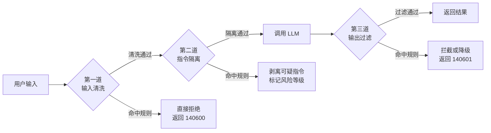

### 23.2 第一道防线：输入清洗

| 处理项 | 处理方式 | 拒绝策略 |
|--------|----------|----------|
| HTML/JS 标签 | 移除或转义 | 发现 `<script>` 等高危标签直接拒绝 |
| SQL 片段 | 关键字过滤 + 参数化 | 命中 `';drop`、`union select` 等模式直接拒绝 |
| Shell 元字符 | 过滤 | `rm -rf`、`mkfs` 等高危命令直接拒绝 |
| URL 外链 | 白名单 + SSRF 防护 | 非白名单域名直接拒绝 |
| 编码绕过 | Unicode 归一化 + Base64 解码后二次扫描 | 检测到混淆模式直接拒绝 |
| 超长输入 | 截断到 Max Context - 500 Token | 超过硬上限直接拒绝 |
| 已知攻击模板 | 规则库匹配（与 PRD-00 §9.5 合规规则库共享） | 命中直接拒绝 |

**输入长度限制**：

| 参数 | 默认值 | 范围 | 作用 |
|------|--------|------|------|
| 单次输入最大 Token | 100,000 | 1~模型上下文窗口-4096 | 超过按业务策略截断或拒绝；上限由模型能力动态决定 |
| 单次输入最大字符数 | 400,000 | 1~800,000 | 字符级硬上限 |
| 单租户每日输入 Token | 10,000,000 | 可在配额中调整 | 超过触发限流 |

### 23.3 第二道防线：指令隔离

指令隔离通过系统消息（System Prompt）与用户消息（User Prompt）的结构化分离，防止用户输入覆盖系统指令。

| 隔离机制 | 实现方式 |
|----------|----------|
| 系统指令固化 | 系统 Prompt 模板与用户输入使用不同字段，模板在服务端拼接，客户端不可见 |
| 输入标记化 | 用户输入两侧插入分隔符（如 `<<USER_INPUT>>...<<END>>`） |
| 指令白名单 | 仅允许白名单中的工具调用指令（如 MCP 工具名） |
| 角色锁定 | 通过 API 协议字段（如 OpenAI `role`）强制为 user，不允许客户端伪造 system/assistant |
| 上下文消毒 | 每轮对话前重新注入系统 Prompt，防止上下文窗口"漂移" |

**指令隔离规则**：

| 规则编号 | 规则描述 |
|----------|----------|
| BR-LLM-ISO-001 | 系统 Prompt 模板由服务端持有，客户端不可修改 |
| BR-LLM-ISO-002 | 用户输入与系统指令使用结构化字段分离，API 协议层强制 |
| BR-LLM-ISO-003 | 模型返回的 tool_calls 必须命中白名单，不在白名单的工具拒绝执行 |
| BR-LLM-ISO-004 | 检测到用户输入试图重置/覆盖系统指令时，标记为高风险并记录 |
| BR-LLM-ISO-005 | 多轮对话中每隔 N 轮重新注入系统 Prompt，防止遗忘 |

### 23.4 第三道防线：输出过滤

LLM 输出内容在返回客户端前必须经过内容安全过滤，命中规则时进行拦截、降级或脱敏。

| 过滤类别 | 规则示例 | 处理策略 |
|----------|----------|----------|
| 涉政 | 现任领导人负面信息、敏感历史事件 | 直接拦截，返回 140601 |
| 涉暴 | 武器制造、暴力恐怖、人身攻击 | 直接拦截 |
| 涉黄 | 色情、低俗内容 | 直接拦截 |
| 涉毒 | 毒品制造、获取方法 | 直接拦截 |
| 隐私泄露 | 身份证号、手机号、银行卡号（明文） | 自动脱敏后再返回 |
| 幻觉链接 | 模型生成的 URL 且不在白名单 | 移除链接并降级 |
| 不当指令 | 模型试图调用非白名单工具 | 剥离并告警 |
| 长度失控 | 输出超过 Max Output | 截断并标记 |
| 重复内容 | 同一短语重复超过 20 次 | 截断 |

**脱敏实现**：

| 字段 | 脱敏规则 | 示例 |
|------|----------|------|
| 身份证号 | 保留前 6 后 4，中间用 `*` | `110101********1234` |
| 手机号 | 保留前 3 后 4 | `138****5678` |
| 银行卡号 | 保留前 4 后 4 | `6222 **** **** 1234` |
| 邮箱 | 邮箱名前 2 字符后 `***` | `zh***@example.com` |

### 23.5 风险分级与降级

| 风险等级 | 触发条件 | 处理策略 |
|----------|----------|----------|
| 低风险 | 仅命中 PII 脱敏 | 自动脱敏后返回 |
| 中风险 | 命中敏感词但非高危类别 | 替换为占位符并告警 |
| 高风险 | 命中涉政、涉暴、Prompt 注入 | 直接拒绝，返回 140601 |
| 严重风险 | 持续触发或来自已知恶意租户 | 临时禁用该租户的 LLM 调用并告警 |

### 23.6 验收标准

| 编号 | 验收标准 | 验证方法 |
|------|----------|----------|
| AC-LLM-SAFE-01 | 已知 Prompt 注入模板 100% 被第一道防线拦截 | 注入测试集验证 |
| AC-LLM-SAFE-02 | 系统 Prompt 与用户输入在 API 协议层结构化分离 | 代码审查 + 接口测试 |
| AC-LLM-SAFE-03 | 模型试图调用非白名单工具时被拒绝 | 模拟工具调用验证 |
| AC-LLM-SAFE-04 | 涉政、涉暴关键词 100% 被第三道防线拦截 | 关键词库回归测试 |
| AC-LLM-SAFE-05 | PII 字段在输出中按规则脱敏 | 注入 PII 测试验证 |
| AC-LLM-SAFE-06 | 严重风险触发后该租户调用被临时禁用 | 故障注入测试 |

---

## 24. A2A 协议安全（LLM 侧）

LLM 模块在 Agent → LLM Provider 链路、A2A 协议通信中必须满足统一的安全规范，与 PRD-06 §A2A 协议安全保持一致。

### 24.1 身份认证

| 认证项 | 要求 |
|--------|------|
| 通信加密 | 全链路 TLS 1.2+，禁用 TLS 1.0/1.1 |
| 身份凭证 | AppKey + Secret 双因子，Secret 仅服务端持有 |
| 凭证存储 | AES-256-GCM 加密存储，密钥由 HSM/KMS 托管（详见 PRD-00 §9.7） |
| 凭证轮换 | 支持 90 天自动轮换 + 紧急立即轮换 |
| 凭证传递 | 通过 `Authorization: Bearer {AppKey}:{Signature}` 头传递，Signature = HMAC-SHA256(secret, timestamp + nonce + body) |
| 时钟同步 | 客户端与服务端时钟偏差 ≤ 60s，超出拒绝请求 |

### 24.2 防重放机制

| 防护项 | 实现方式 |
|--------|----------|
| 时间戳 | 请求携带 `X-Timestamp`，偏差超过 60s 拒绝 |
| Nonce | 每次请求生成唯一 `X-Nonce`（UUID），服务端缓存 10 分钟 |
| 签名绑定 | Signature 包含 timestamp + nonce + body，篡改任意字段即失败 |
| 防爆破 | 同一 AppKey 1 分钟内失败 ≥ 10 次自动锁定 5 分钟 |
| 序列号（可选） | 严格敏感场景使用单调递增 sequence |

### 24.3 流量控制

| 控制项 | 阈值 |
|--------|------|
| 单 AppKey QPS | 默认 100，可调 |
| 单 AppKey 并发 | 默认 50，可调 |
| 单 AppKey 每日 Token | 默认 10,000,000 |
| 突发允许 | 1.5 倍 QPS 持续 ≤ 10s |

### 24.4 安全审计

| 审计项 | 必含字段 |
|--------|----------|
| 鉴权失败 | AppKey、时间戳、客户端 IP、User-Agent、失败原因 |
| 凭证轮换 | 操作人、操作时间、AppKey 别名（不含明文） |
| 限流触发 | AppKey、QPS、限流阈值、时间窗口 |
| 异常调用 | 来源 IP、目标模型、调用频率、关联 traceId |

### 24.5 验收标准

| 编号 | 验收标准 | 验证方法 |
|------|----------|----------|
| AC-A2A-SEC-01 | 通信全链路 TLS 1.2+，禁用低版本 | SSL Labs 测试 |
| AC-A2A-SEC-02 | 携带过期时间戳的请求 100% 被拒绝 | 篡改时间戳验证 |
| AC-A2A-SEC-03 | 重复 Nonce 在缓存窗口内 100% 被拒绝 | 重放测试 |
| AC-A2A-SEC-04 | 同一 AppKey 失败 10 次后被临时锁定 | 故障注入测试 |
| AC-A2A-SEC-05 | AppKey/Secret 数据库中无明文 | 数据库直查验证 |

---

## 25. LLM 租户隔离

LLM 模块所有数据必须按租户（tenant）严格隔离，跨租户访问视为安全事件。

### 25.1 必含字段

`tenant_llm_model_configs`、`tenant_llm_call_logs`、`tenant_llm_api_keys`、`tenant_llm_token_quota` 等核心表均必须包含以下字段：

| 字段 | 类型 | 是否可空 | 说明 |
|------|------|----------|------|
| `partition_key` | VARCHAR(64) | NOT NULL | 租户分区键，UUID 格式字符串（遵循 PRD-00 §7.2 规范） |
| `created_by` | UUID | NOT NULL | 创建人用户 ID |
| `updated_by` | UUID | NULL | 更新人用户 ID |
| `owner_scope` | VARCHAR(16) | NOT NULL | `OWN` / `SHARED` / `PUBLIC` |

### 25.2 隔离策略

| 隔离层级 | 实现方式 | 验证方法 |
|----------|----------|----------|
| 应用层 | 所有查询 SQL 必须携带 `partition_key` 条件 | 代码审查 + SQL Review |
| 框架层 | SQLAlchemy 拦截器自动注入 `partition_key` 过滤条件 | 单元测试 |
| 数据层 | 数据库表设计 `partition_key` 为复合主键首位 | Schema Review |
| 行级安全 | 敏感表启用 PostgreSQL RLS（详见 PRD-00 §7.5） | 渗透测试 |
| 缓存层 | Redis Key 强制带 `tenant:` 前缀，详见 PRD-00 §7.4 | 缓存 Key 扫描 |
| API 层 | GraphQL/REST 接口按 `partition_key` 过滤，越权返回 403 | 接口测试 |

### 25.3 跨租户操作白名单

仅以下场景允许跨租户操作，且必须记录审计日志：

| 场景 | 操作方 | 审计要求 |
|------|--------|----------|
| 平台级 LLM Provider 共享 | 超级管理员 | 必须记录 `operator`、`reason`、`target_tenant_ids` |
| 平台级 Fallback Pool | 超级管理员 | 同上 |
| 平台级监控聚合 | 监控服务 | 只读访问，记录 `traceId` |

### 25.4 验收标准

| 编号 | 验收标准 | 验证方法 |
|------|----------|----------|
| AC-LLM-TEN-01 | LLM 核心表 100% 包含 `partition_key` 字段 | Schema 审查 |
| AC-LLM-TEN-02 | 跨租户访问直接返回 403 或 404 | 渗透测试 |
| AC-LLM-TEN-03 | RLS 策略在数据库层强制生效 | 数据库验证 |
| AC-LLM-TEN-04 | 缓存 Key 100% 携带租户前缀 | Redis 扫描 |

---

## 26. LLM 限流与配额

LLM 资源作为高成本计算资源，必须从租户、用户、模型、协议四个维度实施精细化限流。

### 26.1 限流维度

| 维度 | 限流键 | 默认阈值 |
|------|--------|----------|
| 租户级 | `partition_key` | 100 QPS、10M Token/日 |
| 用户级 | `user_id` | 20 QPS、1M Token/日 |
| 模型级 | `model_id` | 单模型可独立配置 |
| 协议级 | `api_protocol` | 防止单协议滥用 |
| AppKey 级 | `app_key_alias` | 与 PRD-06 A2A 限流保持一致 |

### 26.2 限流策略

| 策略 | 适用场景 | 算法 |
|------|----------|------|
| 滑动窗口 | 通用 QPS 限流 | Redis Sliding Window |
| 令牌桶 | 突发流量允许 | Python `aiolimiter` / 自定义令牌桶中间件 |
| 漏桶 | 平滑输出 | Redis Lua 脚本 |
| 自适应 | 异常期间自动收紧 | 根据错误率动态调整 |

### 26.3 限流响应

| 触发条件 | HTTP 状态码 | 错误码 | 响应体 |
|----------|-------------|--------|--------|
| 触发 QPS 限流 | 200 | 140403 | `{ "code": 140403, "message": "请求频率超限，请稍后重试", "retry_after": 60 }` |
| 触发 Token 限流 | 200 | 140402 | `{ "code": 140402, "message": "Token 用量已耗尽", "quota_remaining": 0 }` |
| 触发并发限流 | 200 | 140403 | `{ "code": 140403, "message": "并发请求过多" }` |

### 26.4 配额管理

| 配额项 | 周期 | 默认值 | 超限处理 |
|--------|------|--------|----------|
| 每日调用次数 | 自然日 | 10,000 | 超过返回 140402 |
| 每日 Token 数 | 自然日 | 10,000,000 | 超过返回 140402 |
| 每月成本 | 自然月 | 10,000 元 | 超过自动告警 + 限制 80% |
| 单次 Max Token | 单次 | 模型上下文窗口-4096 | 超过截断 |

### 26.5 验收标准

| 编号 | 验收标准 | 验证方法 |
|------|----------|----------|
| AC-LLM-RL-01 | 触发限流时返回 HTTP 200 + 业务错误码 140403 + `retry_after` 字段（遵循 PRD-00 §4 GraphQL 单总线规范） | 压测验证 |
| AC-LLM-RL-02 | 限流按 tenant/model/user 多维度生效 | 多维度压测 |
| AC-LLM-RL-03 | 配额耗尽后该租户调用被拒绝 | 配额耗尽测试 |
| AC-LLM-RL-04 | 自适应限流在错误率上升时自动收紧 | 故障注入测试 |

---

## 27. LLM 错误码扩展（140 段位细分）

> **v6 收束说明**：本节为错误码扩展说明（§19.3 的详细展开），§34 为错误码段位清单。两节为不同视角（扩展说明 vs 段位清单），非重复。权威错误码定义请参考 **§19.3 错误码体系**（遵循 PRD-00 §5 全局错误码规范）。

为支持上述 NFR、安全、限流、租户隔离能力，在 PRD-04 §19.3 错误码体系基础上扩展如下子段位。

| 段位 | 含义 | 已用错误码 |
|------|------|------------|
| 1401x | 模型配置 | 140100 模型不存在、140101 模型配置校验失败、140102 模型状态冲突、140103 模型版本冲突、140104 模型已被使用 |
| 1402x | Provider | 140200 Provider 不存在、140201 Provider 连接失败、140202 Provider 连接超时、140203 Provider 认证失败、140204 Provider 状态冲突、140205 Provider 最大并发、140206 Provider 不支持模型、140207 Provider 响应格式错误 |
| 1403x | API Key | 140300 API Key 不存在、140301 API Key 过期、140302 API Key 吊销、140303 API Key 余额不足、140304 API Key 轮换中、140305 API Key 认证方式不支持 |
| 1404x | 调用与配额 | 140400 调用超时、140401 调用失败、140402 配额超限、140403 限流触发、140404 熔断触发、140405 空响应重试耗尽、140406 工具调用失败、140407 工具调用参数解析失败 |
| 1405x | 流式输出 | 140500 WebSocket 断开、140501 流式推送超时、140502 消息组 ID 无效 |
| 1406x | 安全防护 | 140600 Prompt 注入检测、140601 输出过滤触发、140602 A2A 调用被拒绝 |
| 1407x | 多租户隔离 | 140700 租户隔离策略冲突、140701 租户配额超限、140702 Outbox 同步失败、140703 partition_key 无效 |
| 1408x | 文件操作 | 140800 文件上传失败、140801 文件不存在、140802 文件格式不支持 |

**错误码使用示例**：

| 场景 | 错误码 | HTTP |
|------|--------|------|
| 用户输入包含 SQL 注入片段 | 140600 | 200 |
| 模型输出包含敏感词 | 140601 | 200 |
| 租户跨边界访问他人模型 | 140700 | 200 |
| 主模型连续失败触发 Fallback | 140404 | 200（带降级标记） |
| 全部 Fallback 失败 | 140404 | 200 |

---

## 28. 验收标准矩阵

> 编号遵循 [PRD-09 §41.2 AC 编号规范](file:///Users/Garabateador/Workspace/banyan/PRD/PRD-09-系统设置.md)，格式 `AC-04-{3 位顺序号}`。

| 编号 | 验收标准 | 验证方法 |
|------|----------|----------|
| AC-04-001 | Model Config 创建时校验 `model_name`（同租户内唯一）、`model_type`、`provider_id`、`api_protocol` 必填 | Schema 校验 |
| AC-04-002 | Model Config 支持 `OpenAI` / `Anthropic` / `Azure` / `Baidu` / `Aliyun` / `Local` 6 种 `provider_type` | 枚举校验测试 |
| AC-04-003 | Model Config `api_key` 字段写入 KMS 密文，API 返回时脱敏为 `sk-***xxxx` | 渗透测试 + 抓包 |
| AC-04-004 | Provider 路由按 `model_type` + `region` + `priority` 匹配，匹配失败返回 140201 | 路由演练 |
| AC-04-005 | LLM 同步调用 P95 端到端延迟 ≤ 3 s（不含模型生成时间） | 全链路 APM |
| AC-04-006 | LLM 流式调用首字节延迟（TTFB）P95 ≤ 800 ms | 流式压测 |
| AC-04-007 | LLM 调用按 `partition_key` + `user_id` + `model_id` + `app_key_alias` 四维度限流 | 限流压测 |
| AC-04-008 | 单租户 QPS 超限返回 140403，响应携带 `retry_after` | 限流压测 |
| AC-04-009 | Token 配额耗尽后该租户调用直接拒绝 140402 | 配额耗尽测试 |
| AC-04-010 | 输入 Prompt 长度不超过模型上下文窗口-4096 tokens；超限返回 140407 | 边界值测试 |
| AC-04-011 | 输出 Max Token 限制（按模型配置）；超限自动截断并标记 `finish_reason=length` | 截断测试 |
| AC-04-012 | Token 计费按 `prompt_tokens` + `completion_tokens` 双侧计费，误差 0 | 对账测试 |
| AC-04-013 | LLM 调用结果按 Prompt 指纹（SHA-256 of `prompt + model + temperature`）缓存 5 分钟 | 缓存命中率压测 |
| AC-04-014 | 缓存 Key 强制 `partition_key` 前缀，跨租户缓存零污染 | 缓存扫描 |
| AC-04-015 | A2A 调用必须携带 `AppKey` + `Signature`，缺失返回 140602 | 签名验证测试 |
| AC-04-016 | A2A Session Token 24 小时过期，过期返回 140602 | TTL 注入测试 |
| AC-04-017 | A2A 时钟偏移 > 300 秒的请求被拒绝 140602 | 时间戳篡改测试 |
| AC-04-018 | 跨租户访问他人 Model Config 返回 140700 | 越权扫描 |
| AC-04-019 | 平台级共享 Model 仅超级管理员可访问，记录审计日志 | 权限扫描 |
| AC-04-020 | Fallback 链按 `priority ASC` 触发，主 Provider 连续 3 次失败切备 | Fallback 演练 |
| AC-04-021 | Fallback 链全部失败返回 140404（HTTP 200 + 降级标记） | 故障注入 |
| AC-04-022 | Provider 错误率 > 30% 持续 1 分钟自动熔断 60 秒 | 故障注入 |
| AC-04-023 | Prompt 注入检测：包含 `ignore previous`、`system prompt` 等关键词返回 140600 | 注入测试 |
| AC-04-024 | 输出内容安全：命中敏感词（色情/暴力/政治）返回 140601 | 内容审查测试 |
| AC-04-025 | 严重风险租户封禁：连续 5 次命中注入直接拒绝 30 分钟 140600 | 行为画像测试 |
| AC-04-026 | LLM 调用全链路 APM traceId 100% 贯穿 | APM 采样 |
| AC-04-027 | LLM 调用日志保留 90 天，支持按 `partition_key/modelId/traceId/timeRange` 检索 | 日志查询 |
| AC-04-028 | 单次响应超过 60 秒强制截断，返回部分内容 + 140401 | 长文本压测 |
| AC-04-029 | Model Config 删除为软删除，关联调用流水 30 天内可关联 | 数据快照 |
| AC-04-030 | 成本核算按 `token_consumed × unit_price` 计算，账单与对账一致 | 财务对账 |
| AC-04-031 | 自适应限流在 Provider 错误率上升时自动收紧 QPS 阈值 50% | 故障注入 |
| AC-04-032 | 多模态输入（图像/音频）单独计费，账单标注 `multimedia=true` | 多模态压测 |
| AC-04-033 | 工具调用（Function Calling）参数按 JSON Schema 严格校验 | Fuzzing 测试 |
| AC-04-034 | 流式响应必须支持 SSE 协议，断连后 30 秒内可重连（Resume） | 流式断连测试 |
| AC-04-035 | 配额按自然日（UTC+8 00:00）清零，账单 T+1 出账 | 时区边界测试 |

---

## 29. 业务规则

> 编号遵循 [PRD-09 §41.3 BR 编号规范](file:///Users/Garabateador/Workspace/banyan/PRD/PRD-09-系统设置.md)，格式 `BR-04-{3 位顺序号}`。

| 编号 | 规则名称 | 触发条件 | 期望结果 |
|------|----------|----------|----------|
| BR-04-001 | Model Config 同租户唯一 | 同租户下创建同名 `model_name` | 拒绝创建，返回 140101 |
| BR-04-002 | Token 计数公式 | LLM 响应返回 | `total = prompt_tokens + completion_tokens`；账单按此计费 |
| BR-04-003 | Provider 健康降级 | 单 Provider 连续 3 次 5xx | 切备，按 Fallback 链 `priority ASC` 切换 |
| BR-04-004 | 缓存命中条件 | 相同 `prompt_hash` + `model_id` + `temperature=0` | 5 分钟内复用结果，节省 Token |
| BR-04-005 | 配额扣减时序 | LLM 调用成功后 | 先扣减 `daily_tokens`，失败回滚；不允许透支 |
| BR-04-006 | 错误重试策略 | Provider 5xx 或网络超时 | 指数退避 1s/2s/4s，最多 3 次，仍失败走 Fallback |
| BR-04-007 | 流式响应截断 | 流式调用中断 | 已输出 Token 正常计费，未生成部分不计费 |
| BR-04-008 | 凭证轮换 | Provider API Key 更新 | 旧 Key 5 分钟灰度，5 分钟后强制失效 |
| BR-04-009 | Prompt 注入拦截 | 检测到注入关键词 | 立即拒绝 140600，记录安全日志 |
| BR-04-010 | 严重风险封禁 | 同一租户 5 分钟内 5 次注入 | 拒绝 30 分钟 140600，触发安全告警 |
| BR-04-011 | 缓存 Key 隔离 | 缓存写入 | 强制带 `tenant:` 前缀，禁止跨租户复用 |
| BR-04-012 | Fallback 链长度 | 配置 Fallback | 单链最多 5 个 Provider，全部失败返回 140404 |
| BR-04-013 | A2A 签名校验 | 任何 A2A 调用 | HMAC-SHA256 校验失败立即拒绝 140602 |
| BR-04-014 | 跨租户访问 | 任意调用携带他人 `partition_key` | 拒绝 140700，记录审计 |
| BR-04-015 | 平台级共享范围 | 超级管理员操作 | 仅 `PUBLIC` 级别 Model 可被多个租户共享 |
| BR-04-016 | 限流优先级 | 多维度同时超限 | 按租户 > 用户 > 模型 > AppKey 优先级判定，先到先拒 |
| BR-04-017 | Token 计算精度 | 计费场景 | 按模型 `unit_price × token/1000`，精度 6 位小数 |
| BR-04-018 | 输出安全过滤 | LLM 输出 | 命中敏感词返回 140601，原文仅入审计日志，不返回用户 |
| BR-04-019 | 调用日志采样 | 高 QPS 调用 | 默认 100% 采样；超 100 QPS 降采样至 10% |
| BR-04-020 | 配额预警 | Token 消耗达 80% | 触发预警通知租户管理员 |
| BR-04-021 | 成本月切 | 每月 1 日 00:00 | 月度账单 T+1 出账，支持按部门/Agent 维度分摊 |
| BR-04-022 | 模型禁用 | 管理员手动禁用 | 立即停止接受调用，已发起请求 10s 内优雅结束 |
| BR-04-023 | 多模态计费 | 图像/音频输入 | 按 `multimedia_units` 计费，1 张图 ≈ 1000 tokens |
| BR-04-024 | Function Call 超时 | 工具调用 30s 未返回 | 强制终止，标记 `finish_reason=tool_timeout` |
| BR-04-025 | Fallback 自动恢复 | 主 Provider 恢复后 | 探测 2 次连续成功自动切回主，恢复时间记录。切回策略：主模型恢复后，新请求路由到主模型；已在Fallback模型上执行的请求继续完成（不中断），切换过程无不可用窗口 |

---

## 30. PostgreSQL 数据模型

> **触发器声明**: 本模块所有 `tenant_*` / `sys_*` 租户级表均配置 `set_partition_key_from_session()` BEFORE INSERT 触发器，自动从会话变量 `app.current_tenant_id` 注入 `partition_key`，遵循 PRD-00 §7.2 强制规范。触发器函数定义参见 PRD-00 §7.2.2 或 PRD-11 §8.1。

> 表名遵循 [PRD-09 §41.5 PG 表命名规范](file:///Users/Garabateador/Workspace/banyan/PRD/PRD-09-系统设置.md)，模块标识 `llm`，主键策略 `composite PK (partition_key, id)`。

### 30.1 `tenant_llm_model_configs`

Model 配置表，记录租户下 LLM 模型配置、参数、API Key 密文等。

```sql
CREATE TABLE tenant_llm_model_configs (
    partition_key       VARCHAR(64)  NOT NULL,                            -- UUID format tenant partition key (PRD-00 §7.2)
    id                  UUID         NOT NULL DEFAULT gen_random_uuid(),
    tenant_id          UUID         NOT NULL GENERATED ALWAYS AS (partition_key::uuid) STORED,  -- Derived from partition_key, required by multi-tenant middleware
    model_name          VARCHAR(128) NOT NULL,                            -- 同租户内唯一
    display_name        VARCHAR(256) NOT NULL,
    provider_id         UUID         NOT NULL,                            -- 关联 public_llm_provider_definitions.id
    api_protocol        VARCHAR(30)  NOT NULL
        CHECK (api_protocol IN ('OPENAI_COMPATIBLE', 'ANTHROPIC', 'GEMINI', 'AZURE_OPENAI', 'OLLAMA', 'CUSTOM')),
    api_endpoint        VARCHAR(512) NOT NULL,
    api_key_ciphertext  TEXT         NULL,                                -- KMS 加密
    api_version         VARCHAR(32)  NULL,                                 -- Azure 必填
    deployment_name     VARCHAR(128) NULL,                                 -- Azure 必填
    default_temperature DECIMAL(4,2) NOT NULL DEFAULT 0.7,
    default_max_tokens  INTEGER      NOT NULL DEFAULT 2048,
    default_top_p       DECIMAL(4,2) NOT NULL DEFAULT 1.0,
    context_window      INTEGER      NOT NULL DEFAULT 8192,
    unit_price_input    DECIMAL(12,6) NOT NULL,                           -- 元 / 1k token
    unit_price_output   DECIMAL(12,6) NOT NULL,
    supports_streaming  BOOLEAN      NOT NULL DEFAULT TRUE,
    supports_multimodal BOOLEAN      NOT NULL DEFAULT FALSE,
    supports_function   BOOLEAN      NOT NULL DEFAULT TRUE,
    is_enabled          BOOLEAN      NOT NULL DEFAULT TRUE,
    health_status       VARCHAR(16)  NOT NULL DEFAULT 'INACTIVE'
                    CHECK (health_status IN ('INACTIVE', 'ACTIVE', 'DEGRADED', 'UNHEALTHY', 'DISABLED')),  -- PRD-04 §6.1 五态状态机
    consecutive_failures   INTEGER   NOT NULL DEFAULT 0,                    -- 连续健康检查失败次数，5次触发UNHEALTHY
    consecutive_successes  INTEGER   NOT NULL DEFAULT 0,                    -- 连续健康检查成功次数，3次恢复ACTIVE
    last_health_check_at   TIMESTAMPTZ NULL,                                 -- 最后健康检查时间
    last_health_check_result VARCHAR(16) NULL,                               -- SUCCESS / FAILURE
    last_error_message     TEXT      NULL,                                   -- 最后错误信息
    fallback_model_ids   JSONB        DEFAULT '[]',                          -- 备选模型ID列表（最多3个按优先级）
    owner_scope         VARCHAR(16)  NOT NULL DEFAULT 'OWN'
                    CHECK (owner_scope IN ('OWN', 'SHARED', 'PUBLIC')),  -- OWN / SHARED / PUBLIC
    shared_tenant_ids   JSONB        DEFAULT '[]',
    content_summary     VARCHAR(200) NULL,
    model_type          VARCHAR(32)  NULL,
    region              VARCHAR(32)  NULL,
    priority            INTEGER      DEFAULT 0,
    configuration       JSONB        DEFAULT '{}',                         -- Handler 配置
    reasoning           JSONB        NULL,                                 -- 推理配置
    web_tools           JSONB        NULL,                                 -- 网页工具配置
    skills              JSONB        NULL,                                 -- Skills 配置
    tags                JSONB        NULL,
    created_at          TIMESTAMPTZ  NOT NULL DEFAULT now(),
    updated_at          TIMESTAMPTZ  NOT NULL DEFAULT now(),
    created_by          UUID         NOT NULL,
    updated_by          UUID         NULL,
    deleted_at          TIMESTAMPTZ  NULL,
    is_deleted          BOOLEAN      NOT NULL GENERATED ALWAYS AS (deleted_at IS NOT NULL) STORED,  -- Derived from deleted_at
    PRIMARY KEY (partition_key, id),
    UNIQUE (partition_key, model_name, deleted_at)
);
CREATE INDEX idx_model_configs_tenant_provider ON tenant_llm_model_configs(partition_key, provider_id, deleted_at);
CREATE INDEX idx_model_configs_shared ON tenant_llm_model_configs USING GIN (shared_tenant_ids);
CREATE INDEX idx_model_configs_health_status ON tenant_llm_model_configs(partition_key, health_status) WHERE deleted_at IS NULL;
CREATE INDEX idx_model_configs_active_health ON tenant_llm_model_configs(partition_key, is_enabled, health_status) WHERE deleted_at IS NULL AND is_enabled = TRUE AND health_status IN ('ACTIVE','DEGRADED','UNHEALTHY');

-- RLS
ALTER TABLE tenant_llm_model_configs ENABLE ROW LEVEL SECURITY;
CREATE POLICY llm_tenant_isolation ON tenant_llm_model_configs
    FOR ALL
    USING (partition_key = current_setting('app.current_tenant_id', TRUE));
CREATE POLICY llm_visibility ON tenant_llm_model_configs
    FOR SELECT
    USING (
        partition_key = current_setting('app.current_tenant_id', TRUE)
        OR (owner_scope = 'SHARED'
            AND current_setting('app.current_tenant_id', TRUE) = ANY(
                SELECT jsonb_array_elements_text(shared_tenant_ids::jsonb)
            ))
        OR (owner_scope = 'PUBLIC')
    );
CREATE POLICY llm_superuser_bypass ON tenant_llm_model_configs
    FOR ALL
    USING (current_setting('app.is_superuser') = 'true');
```

### 30.2 `public_llm_provider_definitions`

Provider 全局定义表，记录各 Provider 厂商的接入参数模板（系统级，不分租户）。

```sql
CREATE TABLE public_llm_provider_definitions (
    partition_key    VARCHAR(64)  NOT NULL DEFAULT 'public',           -- Public table uses 'public' as default partition_key
    id               UUID         NOT NULL DEFAULT gen_random_uuid(),
    tenant_id        UUID         NOT NULL GENERATED ALWAYS AS (partition_key::uuid) STORED,  -- Derived from partition_key, required by multi-tenant middleware
    provider_code    VARCHAR(64)  NOT NULL,                               -- openai / anthropic / azure / baidu / aliyun / local
    display_name     VARCHAR(256) NOT NULL,
    provider_type    VARCHAR(32)  NOT NULL,
    default_endpoint VARCHAR(512) NOT NULL,
    protocol_version VARCHAR(32)  NOT NULL,
    auth_type        VARCHAR(16)  NOT NULL,                               -- API_KEY / OAUTH2 / IAM
    sdk_class        VARCHAR(256) NULL,                                    -- Python SDK 模块路径
    doc_url          VARCHAR(512) NULL,
    is_builtin       BOOLEAN      NOT NULL DEFAULT FALSE,
    created_at       TIMESTAMPTZ  NOT NULL DEFAULT now(),
    updated_at       TIMESTAMPTZ  NOT NULL DEFAULT now(),
    created_by       UUID         NOT NULL,
    updated_by       UUID         NULL,
    deleted_at       TIMESTAMPTZ  NULL,
    is_deleted       BOOLEAN      NOT NULL GENERATED ALWAYS AS (deleted_at IS NOT NULL) STORED,  -- Derived from deleted_at
    PRIMARY KEY (partition_key, id),
    UNIQUE (partition_key, provider_code, deleted_at)
);

-- RLS
ALTER TABLE public_llm_provider_definitions ENABLE ROW LEVEL SECURITY;
CREATE POLICY provider_public_read ON public_llm_provider_definitions
    FOR SELECT
    USING (TRUE);
CREATE POLICY provider_superuser_write ON public_llm_provider_definitions
    FOR ALL
    USING (current_setting('app.is_superuser') = 'true');
```

### 30.3 `tenant_llm_call_logs`

LLM 调用流水表，记录每次 LLM 调用的全链路信息（含 Token、Cost、错误码）。

```sql
CREATE TABLE tenant_llm_call_logs (
    partition_key        VARCHAR(64)  NOT NULL,                              -- UUID format tenant partition key (PRD-00 §7.2)
    id                   UUID         NOT NULL DEFAULT gen_random_uuid(),
    tenant_id          UUID         NOT NULL GENERATED ALWAYS AS (partition_key::uuid) STORED,  -- Derived from partition_key, required by multi-tenant middleware
    call_id              UUID         NOT NULL,                              -- 业务侧唯一
    trace_id             VARCHAR(64)  NOT NULL,
    user_id              UUID         NULL,
    agent_id             UUID         NULL,
    orchestration_id     UUID         NULL,
    app_key_alias        VARCHAR(128) NULL,
    model_id             UUID         NOT NULL,
    model_name           VARCHAR(128) NOT NULL,
    provider_id          UUID         NOT NULL,
    provider_type        VARCHAR(32)  NOT NULL,
    owner_scope          VARCHAR(16)  NULL,
    shared_tenant_ids    JSONB        NULL,
    call_mode            VARCHAR(16)  NOT NULL,                              -- SYNC / STREAM / ASYNC
    prompt_hash          CHAR(64)     NOT NULL,                              -- SHA-256
    prompt_tokens        INTEGER      NOT NULL DEFAULT 0,
    completion_tokens    INTEGER      NOT NULL DEFAULT 0,
    total_tokens         INTEGER      NOT NULL DEFAULT 0,
    multimedia_units     INTEGER      NOT NULL DEFAULT 0,
    cost_yuan            DECIMAL(12,6) NOT NULL DEFAULT 0,
    is_cache_hit         BOOLEAN      NOT NULL DEFAULT FALSE,
    finish_reason        VARCHAR(32)  NULL,                                  -- stop / length / content_filter / tool_calls / tool_timeout
    status               VARCHAR(16)  NOT NULL,                              -- Running / Success / Failed / Timeout / Cancelled
    http_status          INTEGER      NULL,
    error_code           VARCHAR(8)   NULL,
    error_message        TEXT         NULL,
    duration_ms          INTEGER      NULL,
    started_at           TIMESTAMPTZ  NOT NULL DEFAULT now(),
    finished_at          TIMESTAMPTZ  NULL,
    created_at           TIMESTAMPTZ  NOT NULL DEFAULT now(),
    updated_at           TIMESTAMPTZ  NOT NULL DEFAULT now(),
    created_by           UUID         NOT NULL,
    updated_by           UUID         NULL,
    deleted_at           TIMESTAMPTZ  NULL,
    is_deleted           BOOLEAN      NOT NULL GENERATED ALWAYS AS (deleted_at IS NOT NULL) STORED,  -- Derived from deleted_at
    PRIMARY KEY (partition_key, id)
) PARTITION BY RANGE (started_at);
-- 部分唯一索引：仅对未软删除行生效，允许同 call_id 软删除后重建
CREATE UNIQUE INDEX uq_call_logs_partition_call_id ON tenant_llm_call_logs (partition_key, call_id) WHERE deleted_at IS NULL;
CREATE INDEX idx_call_logs_trace ON tenant_llm_call_logs(partition_key, trace_id);
CREATE INDEX idx_call_logs_user ON tenant_llm_call_logs(partition_key, user_id, started_at DESC);
CREATE INDEX idx_call_logs_model ON tenant_llm_call_logs(partition_key, model_id, started_at DESC);
CREATE INDEX idx_call_logs_status ON tenant_llm_call_logs(partition_key, status, started_at DESC);
CREATE INDEX idx_call_logs_started ON tenant_llm_call_logs(partition_key, started_at DESC);
CREATE INDEX idx_call_logs_agent ON tenant_llm_call_logs(partition_key, agent_id, started_at DESC);

-- RLS
ALTER TABLE tenant_llm_call_logs ENABLE ROW LEVEL SECURITY;
CREATE POLICY llm_call_logs_tenant ON tenant_llm_call_logs
    FOR ALL USING (partition_key = current_setting('app.current_tenant_id', TRUE));
```

### 30.4 `tenant_llm_api_keys`

API Key 独立实体表，支持轮换、过渡期、状态机管理（PRD-04 §7.5/§12.3）。

```sql
CREATE TABLE tenant_llm_api_keys (
    partition_key        VARCHAR(64)  NOT NULL,
    id                   UUID         NOT NULL DEFAULT gen_random_uuid(),
    tenant_id            UUID         NOT NULL GENERATED ALWAYS AS (partition_key::uuid) STORED,
    model_id             UUID         NOT NULL,
    provider_id          UUID         NOT NULL,
    key_alias            VARCHAR(128) NOT NULL,
    key_ciphertext       TEXT         NOT NULL,                              -- KMS 加密
    key_masked           VARCHAR(32)  NOT NULL,                              -- 前4+后4脱敏
    status               VARCHAR(16)  NOT NULL DEFAULT 'ACTIVE'
                    CHECK (status IN ('ACTIVE', 'EXPIRED', 'REVOKED', 'ROTATING', 'ROTATED')),
    is_primary           BOOLEAN      NOT NULL DEFAULT TRUE,
    expires_at           TIMESTAMPTZ  NULL,                                  -- NULL=永不过期
    transition_start_at  TIMESTAMPTZ  NULL,
    transition_end_at    TIMESTAMPTZ  NULL,
    last_used_at         TIMESTAMPTZ  NULL,
    last_tested_at       TIMESTAMPTZ  NULL,
    last_test_result     VARCHAR(16)  NULL,
    created_at           TIMESTAMPTZ  NOT NULL DEFAULT now(),
    updated_at           TIMESTAMPTZ  NOT NULL DEFAULT now(),
    created_by           UUID         NOT NULL,
    updated_by           UUID         NULL,
    deleted_at           TIMESTAMPTZ  NULL,
    is_deleted           BOOLEAN      NOT NULL GENERATED ALWAYS AS (deleted_at IS NOT NULL) STORED,
    PRIMARY KEY (partition_key, id),
    UNIQUE (partition_key, model_id, key_alias) WHERE deleted_at IS NULL,
    UNIQUE (partition_key, model_id, is_primary) WHERE is_primary = TRUE AND deleted_at IS NULL
);
CREATE INDEX idx_api_keys_model ON tenant_llm_api_keys(partition_key, model_id, status) WHERE deleted_at IS NULL;
CREATE INDEX idx_api_keys_expiring ON tenant_llm_api_keys(partition_key, expires_at) WHERE expires_at IS NOT NULL AND status = 'ACTIVE';
CREATE INDEX idx_api_keys_transition ON tenant_llm_api_keys(partition_key, transition_end_at) WHERE status = 'ROTATING' AND transition_end_at IS NOT NULL;

ALTER TABLE tenant_llm_api_keys ENABLE ROW LEVEL SECURITY;
CREATE POLICY llm_api_keys_tenant ON tenant_llm_api_keys FOR ALL USING (partition_key = current_setting('app.current_tenant_id', TRUE));
```

### 30.5 `tenant_llm_api_key_rotation_logs`

API Key 轮换审计日志表（PRD-04 §7.5.2/§12.3）。

```sql
CREATE TABLE tenant_llm_api_key_rotation_logs (
    partition_key        VARCHAR(64)  NOT NULL,
    id                   UUID         NOT NULL DEFAULT gen_random_uuid(),
    tenant_id            UUID         NOT NULL GENERATED ALWAYS AS (partition_key::uuid) STORED,
    model_id             UUID         NOT NULL,
    api_key_id           UUID         NOT NULL,
    old_key_id           UUID         NULL,
    old_key_masked       VARCHAR(32)  NOT NULL,
    new_key_masked       VARCHAR(32)  NOT NULL,
    rotation_type        VARCHAR(16)  NOT NULL CHECK (rotation_type IN ('PLANNED', 'EMERGENCY')),
    transition_enabled   BOOLEAN      NOT NULL DEFAULT FALSE,
    transition_days      INTEGER      NULL CHECK (transition_days BETWEEN 1 AND 30),
    transition_start_at  TIMESTAMPTZ  NULL,
    transition_end_at    TIMESTAMPTZ  NULL,
    test_passed          BOOLEAN      NOT NULL DEFAULT FALSE,
    created_at           TIMESTAMPTZ  NOT NULL DEFAULT now(),
    created_by           UUID         NOT NULL,
    PRIMARY KEY (partition_key, id)
);
CREATE INDEX idx_rotation_logs_model ON tenant_llm_api_key_rotation_logs(partition_key, model_id, created_at DESC);

ALTER TABLE tenant_llm_api_key_rotation_logs ENABLE ROW LEVEL SECURITY;
CREATE POLICY llm_rotation_logs_tenant ON tenant_llm_api_key_rotation_logs FOR ALL USING (partition_key = current_setting('app.current_tenant_id', TRUE));
```

### 30.6 `tenant_llm_agent_bindings`

Agent-模型绑定关系表（PRD-04 §7.3/§12.2），主模型+最多3备选。

```sql
CREATE TABLE tenant_llm_agent_bindings (
    partition_key         VARCHAR(64)  NOT NULL,
    id                    UUID         NOT NULL DEFAULT gen_random_uuid(),
    tenant_id             UUID         NOT NULL GENERATED ALWAYS AS (partition_key::uuid) STORED,
    agent_id              UUID         NOT NULL,
    model_id              UUID         NOT NULL,
    binding_type          VARCHAR(16)  NOT NULL CHECK (binding_type IN ('PRIMARY', 'FALLBACK')),
    priority              INTEGER      DEFAULT 0,
    degradation_strategy  VARCHAR(16)  DEFAULT 'AUTO' CHECK (degradation_strategy IN ('AUTO', 'MANUAL')),
    recovery_strategy     VARCHAR(16)  DEFAULT 'AUTO' CHECK (recovery_strategy IN ('AUTO', 'MANUAL')),
    is_active             BOOLEAN      NOT NULL DEFAULT TRUE,
    created_at            TIMESTAMPTZ  NOT NULL DEFAULT now(),
    updated_at            TIMESTAMPTZ  NOT NULL DEFAULT now(),
    created_by            UUID         NOT NULL,
    updated_by            UUID         NULL,
    deleted_at            TIMESTAMPTZ  NULL,
    PRIMARY KEY (partition_key, id),
    UNIQUE (partition_key, agent_id, model_id) WHERE deleted_at IS NULL,
    UNIQUE (partition_key, agent_id, binding_type) WHERE binding_type = 'PRIMARY' AND deleted_at IS NULL
);
CREATE INDEX idx_agent_bindings_agent ON tenant_llm_agent_bindings(partition_key, agent_id, binding_type, priority) WHERE deleted_at IS NULL;
CREATE INDEX idx_agent_bindings_model ON tenant_llm_agent_bindings(partition_key, model_id) WHERE deleted_at IS NULL;

ALTER TABLE tenant_llm_agent_bindings ENABLE ROW LEVEL SECURITY;
CREATE POLICY llm_agent_bindings_tenant ON tenant_llm_agent_bindings FOR ALL USING (partition_key = current_setting('app.current_tenant_id', TRUE));
```

### 30.7 `tenant_llm_health_check_logs`

健康检查历史表（PRD-04 §7.4/§19.1.1），按月分区。

```sql
CREATE TABLE tenant_llm_health_check_logs (
    partition_key          VARCHAR(64)  NOT NULL,
    id                     UUID         NOT NULL DEFAULT gen_random_uuid(),
    tenant_id              UUID         NOT NULL GENERATED ALWAYS AS (partition_key::uuid) STORED,
    model_id               UUID         NOT NULL,
    check_type             VARCHAR(16)  NOT NULL DEFAULT 'SCHEDULED' CHECK (check_type IN ('SCHEDULED', 'MANUAL', 'RECOVERY')),
    result                 VARCHAR(16)  NOT NULL CHECK (result IN ('SUCCESS', 'FAILURE')),
    http_status            INTEGER      NULL,
    latency_ms             INTEGER      NULL,
    error_code             VARCHAR(8)   NULL,
    error_message          TEXT         NULL,
    consecutive_failures   INTEGER      NOT NULL DEFAULT 0,
    consecutive_successes  INTEGER      NOT NULL DEFAULT 0,
    status_before          VARCHAR(16)  NOT NULL,
    status_after           VARCHAR(16)  NOT NULL,
    checked_at             TIMESTAMPTZ  NOT NULL DEFAULT now(),
    created_at             TIMESTAMPTZ  NOT NULL DEFAULT now(),
    PRIMARY KEY (partition_key, id)
) PARTITION BY RANGE (checked_at);
CREATE INDEX idx_health_check_model_time ON tenant_llm_health_check_logs(partition_key, model_id, checked_at DESC);

ALTER TABLE tenant_llm_health_check_logs ENABLE ROW LEVEL SECURITY;
CREATE POLICY llm_health_check_tenant ON tenant_llm_health_check_logs FOR ALL USING (partition_key = current_setting('app.current_tenant_id', TRUE));
```

### 30.8 `tenant_llm_model_status_changes`

模型状态变更审计日志表（PRD-04 §6.1/§12.5），按月分区。

```sql
CREATE TABLE tenant_llm_model_status_changes (
    partition_key          VARCHAR(64)  NOT NULL,
    id                     UUID         NOT NULL DEFAULT gen_random_uuid(),
    tenant_id              UUID         NOT NULL GENERATED ALWAYS AS (partition_key::uuid) STORED,
    model_id               UUID         NOT NULL,
    status_before          VARCHAR(16)  NOT NULL,
    status_after           VARCHAR(16)  NOT NULL,
    change_reason          VARCHAR(32)  NOT NULL,
    consecutive_failures   INTEGER      NULL,
    consecutive_successes  INTEGER      NULL,
    last_error_message     TEXT         NULL,
    changed_at             TIMESTAMPTZ  NOT NULL DEFAULT now(),
    changed_by             UUID         NULL,
    created_at             TIMESTAMPTZ  NOT NULL DEFAULT now(),
    PRIMARY KEY (partition_key, id)
) PARTITION BY RANGE (changed_at);
CREATE INDEX idx_status_changes_model_time ON tenant_llm_model_status_changes(partition_key, model_id, changed_at DESC);

ALTER TABLE tenant_llm_model_status_changes ENABLE ROW LEVEL SECURITY;
CREATE POLICY llm_status_changes_tenant ON tenant_llm_model_status_changes FOR ALL USING (partition_key = current_setting('app.current_tenant_id', TRUE));
```

### 30.9 `tenant_llm_token_quota`

Token 配额配置表（PRD-04 §7.7.1/§A3）。

```sql
CREATE TABLE tenant_llm_token_quota (
    partition_key         VARCHAR(64)  NOT NULL,
    id                    UUID         NOT NULL DEFAULT gen_random_uuid(),
    tenant_id             UUID         NOT NULL GENERATED ALWAYS AS (partition_key::uuid) STORED,
    model_id              UUID         NOT NULL,
    daily_request_limit   INTEGER      NOT NULL DEFAULT 0,
    daily_token_limit     BIGINT       NOT NULL DEFAULT 0,
    rpm_limit             INTEGER      NOT NULL DEFAULT 0,
    over_limit_strategy   VARCHAR(16)  NOT NULL DEFAULT 'REJECT' CHECK (over_limit_strategy IN ('REJECT', 'QUEUE')),
    reset_timezone        VARCHAR(32)  NOT NULL DEFAULT 'Asia/Shanghai',
    is_active             BOOLEAN      NOT NULL DEFAULT TRUE,
    created_at            TIMESTAMPTZ  NOT NULL DEFAULT now(),
    updated_at            TIMESTAMPTZ  NOT NULL DEFAULT now(),
    created_by            UUID         NOT NULL,
    updated_by            UUID         NULL,
    deleted_at            TIMESTAMPTZ  NULL,
    PRIMARY KEY (partition_key, id),
    UNIQUE (partition_key, model_id) WHERE deleted_at IS NULL
);
CREATE INDEX idx_token_quota_model ON tenant_llm_token_quota(partition_key, model_id) WHERE deleted_at IS NULL AND is_active = TRUE;

ALTER TABLE tenant_llm_token_quota ENABLE ROW LEVEL SECURITY;
CREATE POLICY llm_token_quota_tenant ON tenant_llm_token_quota FOR ALL USING (partition_key = current_setting('app.current_tenant_id', TRUE));
```

### 30.10 `tenant_llm_token_usage`

Token 用量聚合表（PRD-04 §7.7.2/§16 KPI），按日分区。

```sql
CREATE TABLE tenant_llm_token_usage (
    partition_key    VARCHAR(64)   NOT NULL,
    id               UUID          NOT NULL DEFAULT gen_random_uuid(),
    tenant_id        UUID          NOT NULL GENERATED ALWAYS AS (partition_key::uuid) STORED,
    model_id         UUID          NOT NULL,
    usage_date       DATE          NOT NULL,
    request_count    INTEGER       NOT NULL DEFAULT 0,
    success_count    INTEGER       NOT NULL DEFAULT 0,
    failure_count    INTEGER       NOT NULL DEFAULT 0,
    input_tokens     BIGINT        NOT NULL DEFAULT 0,
    output_tokens    BIGINT        NOT NULL DEFAULT 0,
    total_tokens     BIGINT        NOT NULL DEFAULT 0,
    cost_yuan        DECIMAL(12,6) NOT NULL DEFAULT 0,
    avg_latency_ms   INTEGER       NULL,
    p95_latency_ms   INTEGER       NULL,
    cache_hit_count  INTEGER       NOT NULL DEFAULT 0,
    created_at       TIMESTAMPTZ   NOT NULL DEFAULT now(),
    updated_at       TIMESTAMPTZ   NOT NULL DEFAULT now(),
    PRIMARY KEY (partition_key, id),
    UNIQUE (partition_key, model_id, usage_date)
) PARTITION BY RANGE (usage_date);
CREATE INDEX idx_token_usage_model_date ON tenant_llm_token_usage(partition_key, model_id, usage_date DESC);
CREATE INDEX idx_token_usage_date ON tenant_llm_token_usage(partition_key, usage_date DESC);

ALTER TABLE tenant_llm_token_usage ENABLE ROW LEVEL SECURITY;
CREATE POLICY llm_token_usage_tenant ON tenant_llm_token_usage FOR ALL USING (partition_key = current_setting('app.current_tenant_id', TRUE));
```

### 30.11 `tenant_llm_invocations`

运行时调用状态表（PRD-04 §19.1.2 invokeLlm/streamLlmResponse），承载进行中调用状态。

```sql
CREATE TABLE tenant_llm_invocations (
    partition_key           VARCHAR(64)   NOT NULL,
    id                      UUID          NOT NULL DEFAULT gen_random_uuid(),
    tenant_id               UUID          NOT NULL GENERATED ALWAYS AS (partition_key::uuid) STORED,
    trace_id                VARCHAR(64)   NOT NULL,
    call_id                 UUID          NULL,
    model_id                UUID          NOT NULL,
    api_key_id              UUID          NULL,
    agent_id                UUID          NULL,
    user_id                 UUID          NULL,
    invocation_mode         VARCHAR(16)   NOT NULL CHECK (invocation_mode IN ('SYNC', 'STREAM', 'ASYNC')),
    status                  VARCHAR(16)   NOT NULL DEFAULT 'PENDING' CHECK (status IN ('PENDING', 'RUNNING', 'SUCCESS', 'FAILED', 'TIMEOUT', 'CANCELLED')),
    messages_hash           CHAR(64)      NULL,
    temperature             DECIMAL(4,2)  NULL,
    max_tokens              INTEGER       NULL,
    top_p                   DECIMAL(4,2)  NULL,
    stop_sequences          JSONB         NULL,
    tools_config            JSONB         NULL,
    response_content        TEXT          NULL,
    finish_reason           VARCHAR(32)   NULL,
    input_tokens            INTEGER       NULL,
    output_tokens           INTEGER       NULL,
    total_tokens            INTEGER       NULL,
    cost_yuan               DECIMAL(12,6) NULL,
    is_cache_hit            BOOLEAN       NULL,
    fallback_from_model_id  UUID          NULL,
    error_code              VARCHAR(8)    NULL,
    error_message           TEXT          NULL,
    ttft_ms                 INTEGER       NULL,
    duration_ms             INTEGER       NULL,
    started_at              TIMESTAMPTZ   NOT NULL DEFAULT now(),
    finished_at             TIMESTAMPTZ   NULL,
    created_at              TIMESTAMPTZ   NOT NULL DEFAULT now(),
    updated_at              TIMESTAMPTZ   NOT NULL DEFAULT now(),
    PRIMARY KEY (partition_key, id)
);
CREATE INDEX idx_invocations_trace ON tenant_llm_invocations(partition_key, trace_id);
CREATE INDEX idx_invocations_model_status ON tenant_llm_invocations(partition_key, model_id, status, started_at DESC) WHERE status IN ('PENDING','RUNNING');
CREATE INDEX idx_invocations_agent ON tenant_llm_invocations(partition_key, agent_id, started_at DESC);

ALTER TABLE tenant_llm_invocations ENABLE ROW LEVEL SECURITY;
CREATE POLICY llm_invocations_tenant ON tenant_llm_invocations FOR ALL USING (partition_key = current_setting('app.current_tenant_id', TRUE));
```

### 30.12 `tenant_llm_tool_calls`

Function Calling 工具调用记录表（PRD-04 §19.1.2 submitToolCall/BR-04-024）。

```sql
CREATE TABLE tenant_llm_tool_calls (
    partition_key    VARCHAR(64)  NOT NULL,
    id               UUID         NOT NULL DEFAULT gen_random_uuid(),
    tenant_id        UUID         NOT NULL GENERATED ALWAYS AS (partition_key::uuid) STORED,
    invocation_id    UUID         NOT NULL,
    tool_call_id     VARCHAR(128) NOT NULL,
    tool_name        VARCHAR(128) NOT NULL,
    tool_type        VARCHAR(32)  NULL CHECK (tool_type IN ('MCP', 'BUILTIN', 'CUSTOM')),
    arguments        JSONB        NOT NULL,
    result           JSONB        NULL,
    status           VARCHAR(16)  NOT NULL DEFAULT 'PENDING' CHECK (status IN ('PENDING', 'RUNNING', 'SUCCESS', 'FAILED')),
    error_code       VARCHAR(8)   NULL,
    error_message    TEXT         NULL,
    duration_ms      INTEGER      NULL,
    started_at       TIMESTAMPTZ  NOT NULL DEFAULT now(),
    finished_at      TIMESTAMPTZ  NULL,
    created_at       TIMESTAMPTZ  NOT NULL DEFAULT now(),
    updated_at       TIMESTAMPTZ  NOT NULL DEFAULT now(),
    PRIMARY KEY (partition_key, id),
    UNIQUE (partition_key, invocation_id, tool_call_id)
);
CREATE INDEX idx_tool_calls_invocation ON tenant_llm_tool_calls(partition_key, invocation_id, started_at DESC);
CREATE INDEX idx_tool_calls_status ON tenant_llm_tool_calls(partition_key, status, started_at DESC) WHERE status IN ('PENDING','RUNNING');

ALTER TABLE tenant_llm_tool_calls ENABLE ROW LEVEL SECURITY;
CREATE POLICY llm_tool_calls_tenant ON tenant_llm_tool_calls FOR ALL USING (partition_key = current_setting('app.current_tenant_id', TRUE));
```

### 30.13 `tenant_llm_prompt_injection_logs`

Prompt 注入检测日志表（PRD-04 §23/BR-04-009/010），按月分区。

```sql
CREATE TABLE tenant_llm_prompt_injection_logs (
    partition_key    VARCHAR(64)  NOT NULL,
    id               UUID         NOT NULL DEFAULT gen_random_uuid(),
    tenant_id        UUID         NOT NULL GENERATED ALWAYS AS (partition_key::uuid) STORED,
    model_id         UUID         NULL,
    invocation_id    UUID         NULL,
    trace_id         VARCHAR(64)  NOT NULL,
    defense_layer    VARCHAR(16)  NOT NULL CHECK (defense_layer IN ('INPUT_CLEAN', 'INSTRUCTION_ISOLATION', 'OUTPUT_FILTER')),
    detection_rule   VARCHAR(64)  NOT NULL,
    severity         VARCHAR(16)  NOT NULL CHECK (severity IN ('LOW', 'MEDIUM', 'HIGH', 'CRITICAL')),
    action           VARCHAR(16)  NOT NULL CHECK (action IN ('BLOCK', 'STRIP', 'FLAG', 'DEGRADE')),
    input_snippet    TEXT         NULL,
    output_snippet   TEXT         NULL,
    detected_at      TIMESTAMPTZ  NOT NULL DEFAULT now(),
    created_at       TIMESTAMPTZ  NOT NULL DEFAULT now(),
    PRIMARY KEY (partition_key, id)
) PARTITION BY RANGE (detected_at);
CREATE INDEX idx_injection_logs_model_time ON tenant_llm_prompt_injection_logs(partition_key, model_id, detected_at DESC);
CREATE INDEX idx_injection_logs_severity ON tenant_llm_prompt_injection_logs(partition_key, severity, detected_at DESC) WHERE severity IN ('HIGH','CRITICAL');

ALTER TABLE tenant_llm_prompt_injection_logs ENABLE ROW LEVEL SECURITY;
CREATE POLICY llm_injection_logs_tenant ON tenant_llm_prompt_injection_logs FOR ALL USING (partition_key = current_setting('app.current_tenant_id', TRUE));
```

### 30.14 `audit_llm_event`

LLM 领域审计 WORM 表（PRD-04 §A3/§30.5.1），按月分区，不可篡改。

```sql
CREATE TABLE audit_llm_event (
    event_id        UUID         NOT NULL DEFAULT gen_random_uuid(),
    partition_key   VARCHAR(64)  NOT NULL,
    tenant_id       UUID         NOT NULL GENERATED ALWAYS AS (partition_key::uuid) STORED,
    event_type      VARCHAR(64)  NOT NULL,
    entity_type     VARCHAR(32)  NOT NULL CHECK (entity_type IN ('MODEL', 'PROVIDER', 'API_KEY', 'QUOTA', 'INVOCATION')),
    entity_id       VARCHAR(128) NOT NULL,
    actor_type      VARCHAR(16)  NOT NULL CHECK (actor_type IN ('USER', 'SYSTEM', 'SCHEDULED_TASK')),
    actor_id        UUID         NULL,
    action          VARCHAR(32)  NOT NULL,
    changes         JSONB        NULL,
    ip_address      VARCHAR(45)  NULL,
    user_agent      VARCHAR(256) NULL,
    request_id      VARCHAR(64)  NULL,
    occurred_at     TIMESTAMPTZ  NOT NULL DEFAULT now(),
    created_at      TIMESTAMPTZ  NOT NULL DEFAULT now(),
    PRIMARY KEY (event_id)
) PARTITION BY RANGE (occurred_at);
CREATE INDEX idx_audit_llm_entity ON audit_llm_event(partition_key, entity_type, entity_id, occurred_at DESC);
CREATE INDEX idx_audit_llm_event_type ON audit_llm_event(partition_key, event_type, occurred_at DESC);
CREATE INDEX idx_audit_llm_actor ON audit_llm_event(partition_key, actor_id, occurred_at DESC);

-- WORM 保护：禁止 UPDATE / DELETE，仅允许 INSERT
CREATE OR REPLACE FUNCTION prevent_llm_audit_modify() RETURNS TRIGGER AS $$
BEGIN
    RAISE EXCEPTION 'audit_llm_event is WORM-protected: INSERT only';
END;
$$ LANGUAGE plpgsql;
CREATE TRIGGER trg_llm_audit_worm BEFORE UPDATE OR DELETE ON audit_llm_event
    FOR EACH ROW EXECUTE FUNCTION prevent_llm_audit_modify();
```

---

## 30.15 RLS 策略说明

所有 `tenant_` 前缀表均启用 PostgreSQL RLS（Row Level Security），确保租户数据在数据库层隔离。

| 表名 | RLS 策略 | 说明 |
|------|----------|------|
| `tenant_llm_model_configs` | `llm_tenant_isolation` / `llm_visibility` / `llm_superuser_bypass` | 租户隔离 + 共享可见性 + 超级管理员绕过 |
| `tenant_llm_call_logs` | `llm_call_logs_tenant` | 租户隔离 |
| `tenant_llm_api_keys` | `llm_api_keys_tenant` | 租户隔离 |
| `tenant_llm_api_key_rotation_logs` | `llm_rotation_logs_tenant` | 租户隔离 |
| `tenant_llm_agent_bindings` | `llm_agent_bindings_tenant` | 租户隔离 |
| `tenant_llm_health_check_logs` | `llm_health_check_tenant` | 租户隔离 |
| `tenant_llm_model_status_changes` | `llm_status_changes_tenant` | 租户隔离 |
| `tenant_llm_token_quota` | `llm_token_quota_tenant` | 租户隔离 |
| `tenant_llm_token_usage` | `llm_token_usage_tenant` | 租户隔离 |
| `tenant_llm_invocations` | `llm_invocations_tenant` | 租户隔离 |
| `tenant_llm_tool_calls` | `llm_tool_calls_tenant` | 租户隔离 |
| `tenant_llm_prompt_injection_logs` | `llm_injection_logs_tenant` | 租户隔离 |
| `public_llm_provider_definitions` | `provider_public_read` / `provider_superuser_write` | 公共只读 + 超级管理员写入 |
| `audit_llm_event` | 无RLS（WORM保护触发器） | 审计表通过触发器保护，无需RLS |
| `outbox_events` | `outbox_events_tenant` | 租户隔离 |

**RLS 策略通用规则**：

- `tenant_` 前缀表必须执行 `ALTER TABLE ... ENABLE ROW LEVEL SECURITY`
- 默认策略：`partition_key = current_setting('app.current_tenant_id', TRUE)`
- 共享可见性：`owner_scope = 'SHARED' AND current_setting('app.current_tenant_id', TRUE) = ANY(shared_tenant_ids)`
- 公共可见性：`owner_scope = 'PUBLIC'`
- 超级管理员绕过：`current_setting('app.is_superuser') = 'true'`

---

## 30.5 数据分类与存储映射

LLM 模块数据按特性分类存储，确保数据存放到最合适的存储介质。

### 30.5.1 LLM 模块数据分类表

| 数据类别 | 具体数据 | 主存储 | 辅助存储 | 保留周期 |
|----------|----------|--------|----------|----------|
| 模型配置 | `tenant_llm_model_configs` | PostgreSQL | - | 永久 |
| Provider 定义 | `public_llm_provider_definitions` | PostgreSQL | - | 永久 |
| API Key 凭据 | `tenant_llm_api_keys` | PostgreSQL（KMS 加密） | - | 永久（软删除保留） |
| Key 轮换审计 | `tenant_llm_api_key_rotation_logs` | PostgreSQL | - | 永久 |
| Agent 绑定 | `tenant_llm_agent_bindings` | PostgreSQL | - | 永久 |
| 调用记录 | `tenant_llm_call_logs` | PostgreSQL | PostgreSQL 冷归档分区表 | 90 天(热) / 1 年(冷) |
| 运行时调用 | `tenant_llm_invocations` | PostgreSQL | Redis（进行中状态） | 30 天 |
| 工具调用 | `tenant_llm_tool_calls` | PostgreSQL | - | 30 天 |
| 健康检查历史 | `tenant_llm_health_check_logs` | PostgreSQL 分区表 | - | 6 个月 |
| 状态变更审计 | `tenant_llm_model_status_changes` | PostgreSQL 分区表 | - | 1 年 |
| Token 用量 | `tenant_llm_token_usage` | PostgreSQL 分区表 | - | 365 天 |
| 注入检测日志 | `tenant_llm_prompt_injection_logs` | PostgreSQL 分区表 | - | 1 年 |
| 向量数据 | Embedding 结果 | Neo4j | - | 按业务需求 |
| 缓存数据 | 模型列表、Token 计数 | Redis | - | 5 分钟~24 小时 |
| 审计日志 | `audit_llm_event` | PostgreSQL WORM 分区表 | - | 7 年 |
| 配额配置 | `tenant_llm_token_quota` | PostgreSQL | Redis(实时计数) | 永久 |

### 30.5.2 Neo4j 数据排除清单

以下 LLM 模块数据**不写入** Neo4j，避免图数据库冗余：

| 数据 | 排除原因 | 实际存储 |
|------|----------|----------|
| 调用记录 (`tenant_llm_call_logs`) | 时序数据量大，不适合图结构 | PostgreSQL 分区表 |
| 运行时调用 (`tenant_llm_invocations`) | 运行时状态数据，短生命周期 | PostgreSQL |
| 工具调用 (`tenant_llm_tool_calls`) | 运行时明细数据，无图关系需求 | PostgreSQL |
| Token 用量聚合 (`tenant_llm_token_usage`) | 聚合统计，无关联查询需求 | PostgreSQL 分区表 |
| 健康检查历史 (`tenant_llm_health_check_logs`) | 时序数据量大，不适合图结构 | PostgreSQL 分区表 |
| 状态变更审计 (`tenant_llm_model_status_changes`) | 审计日志，无图关系需求 | PostgreSQL 分区表 |
| 注入检测日志 (`tenant_llm_prompt_injection_logs`) | 安全日志，无图关系需求 | PostgreSQL 分区表 |
| API Key 凭据 (`tenant_llm_api_keys`) | 敏感数据，仅存密文 | PostgreSQL（KMS 加密） |
| Key 轮换审计 (`tenant_llm_api_key_rotation_logs`) | 审计日志，无图关系需求 | PostgreSQL |
| 审计日志 (`audit_llm_event`) | WORM 合规数据，不可修改 | PostgreSQL WORM 分区表 |
| 缓存数据 | 临时数据，无持久化需求 | Redis |
| 向量数据 | 图数据库向量索引存储 | Neo4j |

**Neo4j 中仅存储**以下 LLM 模块关系数据：

- 模型与 Provider 的归属关系（`PROVIDED_BY`）
- 模型与协议类型的使用关系（`USES_PROTOCOL`）
- 模型与 API Key 的认证关系（`AUTHENTICATED_BY`）
- 模型与备选模型的降级关系（`FALLBACK_TO_MODEL`）
- API Key 轮换关系（`ROTATED_TO`）
- 模型与 Agent 的绑定关系（`BINDS_AGENT`）
- 模型健康检查关系（`HEALTH_CHECKED_BY`）

### 30.5.3 Neo4j 节点与关系（LLMEntity 标签规范）

> **遵循 PRD-00 §3.5.5 强制 P0 规范**：所有 Neo4j 节点必须同时携带 `{ModuleEntity}Entity` 基础标签（LLM 模块为 `LLMEntity`）、具体实体类型标签以及租户图标签（`Graph`），共三标签结构。

**LLM 模块 Neo4j 节点定义**：

| 节点标签 | 必含标签组合 | 业务主键 | 说明 |
|----------|--------------|----------|------|
| 模型配置节点 | `LLMEntity:LLMModel:Graph` | `(partition_key, id)` | 关联 Agent 调用与 Provider 关系，承载五态状态机 |
| Provider 模板节点 | `LLMEntity:LLMProvider:Graph` | `(partition_key, id)` | Provider 模板定义（公共表 partition_key='public'） |
| API Key 节点 | `LLMEntity:LLMApiKey:Graph` | `(partition_key, id)` | API Key 凭据（加密存储），支持轮换状态机 |
| 协议类型节点 | `LLMEntity:LLMProtocol:Graph` | `(partition_key, id)` | API 协议类型（OPENAI_COMPATIBLE/ANTHROPIC/GEMINI/AZURE_OPENAI/OLLAMA/CUSTOM） |

**关系定义**：

| 关系类型 | 起始节点 | 结束节点 | 属性 |
|----------|----------|----------|------|
| `PROVIDED_BY` | LLMModel | LLMProvider | `created_at` |
| `USES_PROTOCOL` | LLMModel | LLMProtocol | `created_at` |
| `AUTHENTICATED_BY` | LLMModel | LLMApiKey | `is_active`、`is_primary` |
| `FALLBACK_TO_MODEL` | LLMModel | LLMModel | `priority` |
| `ROTATED_TO` | LLMApiKey | LLMApiKey | `rotated_at` |
| `BINDS_AGENT` | LLMModel | Agent | `is_primary`、`priority` |
| `HEALTH_CHECKED_BY` | LLMModel | LLMModel | `checked_at`、`result` |

**Cypher 约束与索引（带 LLMEntity 基础标签前缀）**：

```cypher
// 唯一性约束（带 LLMEntity 基础标签前缀 + Graph 静态标签）
CREATE CONSTRAINT llm_model_pk IF NOT EXISTS
  FOR (n:LLMEntity:LLMModel:Graph) REQUIRE (n.partition_key, n.id) IS UNIQUE;

CREATE CONSTRAINT llm_provider_pk IF NOT EXISTS
  FOR (n:LLMEntity:LLMProvider:Graph) REQUIRE (n.partition_key, n.id) IS UNIQUE;

CREATE CONSTRAINT llm_api_key_pk IF NOT EXISTS
  FOR (n:LLMEntity:LLMApiKey:Graph) REQUIRE (n.partition_key, n.id) IS UNIQUE;

CREATE CONSTRAINT llm_protocol_pk IF NOT EXISTS
  FOR (n:LLMEntity:LLMProtocol:Graph) REQUIRE (n.partition_key, n.id) IS UNIQUE;

// 索引（带 LLMEntity: 前缀过滤）
CREATE INDEX llm_model_tenant_idx IF NOT EXISTS
  FOR (n:LLMEntity:LLMModel) ON (n.partition_key);

CREATE INDEX llm_provider_tenant_idx IF NOT EXISTS
  FOR (n:LLMEntity:LLMProvider) ON (n.partition_key);

CREATE INDEX llm_entity_label_idx IF NOT EXISTS
  FOR (n:LLMEntity) ON (n.partition_key);
```

**查询示例（含 `Graph` 标签过滤）**：

```cypher
// 查询某租户的所有 ACTIVE 模型及其 Provider（PROVIDED_BY 关系）
MATCH (m:LLMEntity:LLMModel:Graph)
      -[:PROVIDED_BY]->(p:LLMEntity:LLMProvider:Graph)
WHERE m.health_status = 'ACTIVE' AND m.partition_key = $partitionKey
  AND p.partition_key = $partitionKey
RETURN m, p;

// 查询模型的备选模型链（FALLBACK_TO_MODEL 关系）
MATCH (m:LLMEntity:LLMModel:Graph)
      -[:FALLBACK_TO_MODEL]->(fallback:LLMEntity:LLMModel:Graph)
WHERE m.partition_key = $partitionKey
RETURN m.model_name, fallback.model_name, fallback.health_status;

// 跨租户访问必须带 Graph 标签校验（防止租户越权）
MATCH (m:LLMEntity:LLMModel:Graph)
WHERE m.partition_key = $partitionKey
RETURN m;
```

> **重要约束**：所有 Cypher 写入/查询必须显式带 `Graph` 标签过滤 + `WHERE partition_key = $partitionKey`，租户隔离在图数据库层强制执行。LLMEntity 基础标签是所有 LLM 模块节点的最小公共标签。

---

## 32. 非功能需求

> 编号遵循 [PRD-09 §41.4](file:///Users/Garabateador/Workspace/banyan/PRD/PRD-09-系统设置.md) `NFR-04-{维度}-{3 位}`。

### 32.1 性能（Performance）

| 编号 | 指标 | 目标 | 验证方法 |
|------|------|------|----------|
| NFR-04-P-001 | 同步 Chat 接口 P95 端到端延迟 | ≤ 3 s（不含模型生成） | 全链路 APM |
| NFR-04-P-002 | 流式 Chat 接口首字节延迟（TTFB） | P95 ≤ 800 ms | 流式压测 |
| NFR-04-P-003 | Embedding 接口 P95 延迟 | ≤ 1 s | 压测 |
| NFR-04-P-004 | Model Config 查询 P95 延迟 | ≤ 200 ms | 100 并发压测 |
| NFR-04-P-005 | 调用流水查询 P95 延迟 | ≤ 500 ms（百万行级） | 大数据量压测 |
| NFR-04-P-006 | Fallback 切换时间 | ≤ 5 s | 故障注入 |
| NFR-04-P-007 | 缓存命中率 | ≥ 40% | 缓存统计 |
| NFR-04-P-008 | 单租户并发支撑 | ≥ 100 QPS | 压测 |

### 32.2 安全（Security）

| 编号 | 指标 | 目标 | 验证方法 |
|------|------|------|----------|
| NFR-04-S-001 | API Key KMS 加密 | 100% 凭证加密落库 | 渗透测试 + DB 抓包 |
| NFR-04-S-002 | 跨租户访问拦截 | 100% 拦截，零越权 | 越权扫描 |
| NFR-04-S-003 | Prompt 注入检测 | ≥ 95% 检出率 | 注入测试集 |
| NFR-04-S-004 | 输出内容安全 | 100% 命中敏感词拦截 | 内容审查测试 |
| NFR-04-S-005 | A2A 签名校验 | 100% 强制 HMAC-SHA256 | 篡改测试 |
| NFR-04-S-006 | 严重风险租户封禁 | 100% 触发后 30 分钟拒绝 | 行为画像测试 |
| NFR-04-S-007 | 调用日志审计 | 100% 记录，含 `traceId/tenantId/userId` | 日志巡检 |
| NFR-04-S-008 | 审计日志保留 | ≥ 180 天 | 备份验证 |

### 32.3 可用性（Availability）

| 编号 | 指标 | 目标 | 验证方法 |
|------|------|------|----------|
| NFR-04-A-001 | 模块 SLA | ≥ 99.95% | 月度统计 |
| NFR-04-A-002 | RTO | ≤ 5 分钟（核心业务） | 故障演练 |
| NFR-04-A-003 | RPO | ≤ 1 分钟 | 备份恢复演练 |
| NFR-04-A-004 | Fallback 链有效性 | 至少 1 个 Fallback 命中率 ≥ 99% | Fallback 演练 |
| NFR-04-A-005 | 多 Provider 多活 | 至少 2 个 Provider 互备 | 配置巡检 |
| NFR-04-A-006 | 配额系统降级 | 配额服务故障时进入"只读模式" | 故障演练 |
| NFR-04-A-007 | 缓存服务降级 | Redis 故障时自动旁路 | 故障演练 |
| NFR-04-A-008 | 流式断连重连 | 30 秒内可恢复 | 断连测试 |

### 32.4 可维护性（Maintainability）

| 编号 | 指标 | 目标 | 验证方法 |
|------|------|------|----------|
| NFR-04-M-001 | API 文档自动生成 | 100% OpenAPI 3.1 覆盖 | 文档检查 |
| NFR-04-M-002 | 单元测试覆盖率 | ≥ 85% | Python coverage.py 报告 |
| NFR-04-M-003 | 关键路径集成测试 | 100% 覆盖 | CI 检查 |
| NFR-04-M-004 | 错误码一致性 | 100% 使用 1400xx 段位 | 静态扫描 |
| NFR-04-M-005 | 日志结构化率 | ≥ 95% JSON 格式 | 日志采样 |
| NFR-04-M-006 | Provider 接入模板化 | 新 Provider 接入 ≤ 1 人天 | 接入演练 |
| NFR-04-M-007 | 模型参数热更新 | 100% 无需重启 | 配置变更演练 |
| NFR-04-M-008 | 注入关键词动态更新 | 100% 热加载 | 规则变更演练 |

---

## 33. 监控埋点规范

> 与 [PRD-11 监控与分析](file:///Users/Garabateador/Workspace/banyan/PRD/PRD-11-监控与分析.md) 对齐，遵循统一指标命名 `module_entity_action_unit`。

### 33.1 RED 指标

| 指标 | 类型 | 标签 | 说明 |
|------|------|------|------|
| `llm_chat_completions_total` | Counter | `partition_key, model_id, provider_type, status` | Chat 调用总量 |
| `llm_chat_completions_duration_ms` | Histogram | `partition_key, model_id, status` | Chat 端到端耗时 |
| `llm_chat_completions_ttfb_ms` | Histogram | `partition_key, model_id` | 首字节延迟（流式） |
| `llm_embeddings_total` | Counter | `partition_key, model_id, status` | Embedding 调用量 |
| `llm_provider_health_total` | Counter | `partition_key, provider_id, status` | Provider 健康检查次数 |

### 33.2 USE 指标

| 指标 | 类型 | 标签 | 说明 |
|------|------|------|------|
| `llm_concurrent_requests` | Gauge | `partition_key, model_id` | 实时并发请求数 |
| `llm_provider_active_count` | Gauge | `partition_key, status` | 当前活跃 Provider 数 |
| `llm_fallback_hit_total` | Counter | `partition_key, provider_id` | Fallback 触发次数 |
| `llm_cache_size_bytes` | Gauge | `partition_key` | 缓存占用空间 |

### 33.3 业务指标

| 指标 | 类型 | 标签 | 说明 |
|------|------|------|------|
| `llm_prompt_tokens_total` | Counter | `partition_key, model_id` | 累计 Prompt Token |
| `llm_completion_tokens_total` | Counter | `partition_key, model_id` | 累计 Completion Token |
| `llm_total_tokens_total` | Counter | `partition_key, model_id` | 累计 Total Token |
| `llm_cost_yuan_total` | Counter | `partition_key, model_id` | 累计成本（元） |
| `llm_cache_hit_total` | Counter | `partition_key, model_id` | 缓存命中次数 |
| `llm_quota_remaining` | Gauge | `partition_key, model_id` | 剩余 Token 配额 |
| `llm_prompt_injection_blocked_total` | Counter | `partition_key, model_id` | Prompt 注入拦截次数 |

### 33.4 告警规则

| 告警 ID | 条件 | 级别 | 通知渠道 |
|---------|------|------|----------|
| ALERT-LLM-001 | `llm_chat_completions_duration_ms` P95 > 5s 持续 5 分钟 | P2 | 钉钉 |
| ALERT-LLM-002 | `llm_provider_health_failure_rate` 5 分钟内 > 10% | P1 | 钉钉 + 电话 |
| ALERT-LLM-003 | `llm_quota_remaining` < 20% 阈值 | P3 | 邮件 |
| ALERT-LLM-004 | `llm_prompt_injection_blocked_total` 5 分钟内 > 10 次 | P1 | 安全值班 |
| ALERT-LLM-005 | Fallback 链全部失败 | P0 | 钉钉 + 电话 + 短信 |
| ALERT-LLM-006 | 严重风险租户被封禁 | P0 | 安全值班 + 邮件 |

### 33.5 链路追踪

- **traceId 生成**：由 API Gateway 在入口生成
- **Span 划分**：`http.request` → `auth.check` → `rate.limit` → `llm.invoke` → `provider.call` → `token.billing`
- **关键属性**：`tenant.id`、`user.id`、`agent.id`、`model.id`、`provider.type`、`prompt.hash`、`token.usage`、`cost.yuan`

---

## 34. 错误码段位（1400xx）

> 遵循 PRD-00 §5 全局错误码规范：PRD-04 大语言模型使用 `1400xx` 段位（与 PRD-09 对齐）。
> 对外 API 返回数字错误码，内部使用 `BIZ_LLM_*` 命名错误码。

### 34.1 1401x 模型配置错误

| 错误码 | 内部命名 | 含义 | HTTP |
|--------|----------|------|------|
| 140100 | BIZ_LLM_MODEL_NOT_FOUND | 模型不存在 | 200 |
| 140101 | BIZ_LLM_MODEL_INVALID | 模型配置校验失败 | 200 |
| 140102 | BIZ_LLM_MODEL_STATUS_CONFLICT | 模型状态冲突 | 200 |
| 140103 | BIZ_LLM_MODEL_VERSION_CONFLICT | 模型版本冲突 | 200 |
| 140104 | BIZ_LLM_MODEL_PROVIDER_IN_USE | 模型已在其他 Provider 中使用 | 200 |

### 34.2 14002x Provider 错误

| 错误码 | 内部命名 | 含义 | HTTP |
|--------|----------|------|------|
| 140200 | BIZ_LLM_PROVIDER_NOT_FOUND | Provider 不存在 | 200 |
| 140201 | BIZ_LLM_PROVIDER_CONNECTION_FAILED | Provider 连接失败 | 200 |
| 140202 | BIZ_LLM_PROVIDER_TIMEOUT | Provider 连接超时 | 200 |
| 140203 | BIZ_LLM_PROVIDER_AUTH_FAILED | Provider 认证失败 | 200 |
| 140204 | BIZ_LLM_PROVIDER_STATUS_CONFLICT | Provider 状态冲突 | 200 |
| 140205 | BIZ_LLM_PROVIDER_MAX_CONCURRENCY | Provider 已达到最大并发数 | 200 |
| 140206 | BIZ_LLM_PROVIDER_MODEL_UNSUPPORTED | Provider 不支持此模型 | 200 |
| 140207 | BIZ_LLM_PROVIDER_RESPONSE_INVALID | Provider 响应格式错误 | 200 |

### 34.3 14003x API Key 错误

| 错误码 | 内部命名 | 含义 | HTTP |
|--------|----------|------|------|
| 140300 | BIZ_LLM_API_KEY_NOT_FOUND | API Key 不存在 | 200 |
| 140301 | BIZ_LLM_API_KEY_EXPIRED | API Key 已过期 | 200 |
| 140302 | BIZ_LLM_API_KEY_REVOKED | API Key 已吊销 | 200 |
| 140303 | BIZ_LLM_API_KEY_INSUFFICIENT | API Key 余额不足 | 200 |
| 140304 | BIZ_LLM_API_KEY_ROTATING | API Key 轮换中 | 200 |
| 140305 | BIZ_LLM_API_KEY_AUTH_UNSUPPORTED | API Key 认证方式不支持 | 200 |

### 34.4 14004x 调用与配额错误

| 错误码 | 内部命名 | 含义 | HTTP |
|--------|----------|------|------|
| 140400 | BIZ_LLM_INVOKE_TIMEOUT | 调用超时 | 200 |
| 140401 | BIZ_LLM_INVOKE_FAILED | 调用失败（Provider 返回错误） | 200 |
| 140402 | BIZ_LLM_QUOTA_EXCEEDED | 配额超限 | 200 |
| 140403 | BIZ_LLM_RATE_LIMITED | 限流触发 | 200 |
| 140404 | BIZ_LLM_CIRCUIT_BREAKER | 降级熔断触发 | 200 |
| 140405 | BIZ_LLM_EMPTY_RESPONSE_RETRY_EXHAUSTED | 空响应重试耗尽 | 200 |
| 140406 | BIZ_LLM_TOOL_CALL_FAILED | 工具调用失败 | 200 |
| 140407 | BIZ_LLM_TOOL_CALL_PARAM_INVALID | 工具调用参数解析失败 | 200 |

### 34.5 14005x 流式输出错误

| 错误码 | 内部命名 | 含义 | HTTP |
|--------|----------|------|------|
| 140500 | BIZ_LLM_WEBSOCKET_DISCONNECTED | WebSocket 连接断开 | 200 |
| 140501 | BIZ_LLM_STREAM_TIMEOUT | 流式推送超时 | 200 |
| 140502 | BIZ_LLM_MESSAGE_GROUP_INVALID | 消息组 ID 无效 | 200 |

### 34.6 14006x 安全防护错误

| 错误码 | 内部命名 | 含义 | HTTP |
|--------|----------|------|------|
| 140600 | BIZ_LLM_PROMPT_INJECTION | Prompt 注入检测 | 200 |
| 140601 | BIZ_LLM_OUTPUT_FILTERED | 输出过滤触发 | 200 |
| 140602 | BIZ_LLM_A2A_DENIED | A2A 调用被拒绝 | 200 |

### 34.7 14007x 多租户隔离错误

| 错误码 | 内部命名 | 含义 | HTTP |
|--------|----------|------|------|
| 140700 | BIZ_LLM_TENANT_ISOLATION_CONFLICT | 租户隔离策略冲突 | 200 |
| 140701 | BIZ_LLM_TENANT_QUOTA_EXCEEDED | 租户配额超限 | 200 |
| 140702 | BIZ_LLM_OUTBOX_SYNC_FAILED | Outbox 同步失败 | 200 |
| 140703 | BIZ_LLM_PARTITION_KEY_INVALID | partition_key 无效 | 200 |

### 34.8 1408x 文件操作错误

| 错误码 | 内部命名 | 含义 | HTTP |
|--------|----------|------|------|
| 140800 | BIZ_LLM_FILE_UPLOAD_FAILED | 文件上传失败 | 200 |
| 140801 | BIZ_LLM_FILE_NOT_FOUND | 文件不存在 | 200 |
| 140802 | BIZ_LLM_FILE_FORMAT_UNSUPPORTED | 文件格式不支持 | 200 |

### 34.9 BIZ_LLM_* 内部错误码映射表

> 命名空间与 PRD-00 §5 对齐,统一为 `BIZ_LLM_*`;不再细分 `BIZ_LLM_MODEL_*` / `BIZ_LLM_PROVIDER_*` 等二级前缀,所有错误码归属于同一 `BIZ_LLM_*` 命名空间。

| 内部命名 | 数字错误码 | 说明 |
|----------|-----------|------|
| `BIZ_LLM_*` | 140001-140999 | LLM 模块内部错误码统一命名空间 |

---

## 35. 资源池声明

> 本节与 §A2 ConnectionPoolManager 池声明保持一致,共声明 8 个核心资源池,所有池命名在 PRD-04 模块全局唯一。

| 池名 | 类型 | 用途 |
|------|------|------|
| `postgres_main` | postgresql | 模型目录、Provider、配额、调用记录、Outbox 事件 |
| `postgres_audit` | postgresql | LLM 调用审计 |
| `neo4j_main` | neo4j | LLM 知识图谱关联(模型-Provider-能力关系)、LLM Embedding 语义检索(专供 LLM 模块内部使用,向量索引) |
| `redis_cache` | redis | 模型列表缓存、Token 计数缓存 |
| `redis_queue` | redis | 异步任务队列(Fallback、重试、降级) |
| `redis_quota` | redis | Token 配额原子计数(Lua 扣减) |
| `redis_sentinel` | redis | 限流 / 熔断状态(Sentinel 维度) |
| `outbox_sync` | postgresql | Outbox 事件同步(与 PRD-01/PRD-02 对齐) |

> 注:`httpx_*` Provider 调用池等专项池仍在 §A2 完整列出,本节聚焦于跨 Provider 共享的核心 8 池。

---

## 36. PRD-04 Outbox 事件清单

> LLM 模块的领域事件遵循 PRD-00 §4.7 Outbox Pattern,统一写入 `outbox_events`(详见 §A3.1),由事件发布器异步投递到 SQS。消费方需基于 `idempotency_key` 幂等处理(PRD-00 §4.7.4)。

| aggregate_type | event_type | 触发条件 | 同步目标 |
|----------------|-----------|----------|----------|
| `llm.model` | `llm.model.created/updated/deleted` | 模型增删改 | Neo4j `LLMModel` |
| `llm.model` | `llm.model.status_changed` | 模型状态变更（ACTIVE→DEGRADED→UNHEALTHY 及恢复） | Agent降级/恢复决策 → PRD-06 智能体 / PRD-05 编排 / PRD-01 知识(向量化暂停/恢复) / PRD-02 记忆(提取暂停/恢复) / PRD-11 监控 |
| `llm.provider` | `llm.provider.registered/updated` | Provider 注册/更新 | Neo4j `LLMProvider` |
| `llm.apikey` | `llm.apikey.rotated/revoked` | API Key 轮换/吊销 | 审计 + 通知下游 |
| `llm.fallback` | `llm.fallback.triggered` | Fallback 链触发 | 监控埋点(PRD-11) |
| `llm.circuit_breaker` | `llm.circuit_breaker.state_changed` | 熔断状态变更 | 监控告警 |

> 事件保留期遵循 PRD-00 §4.7.4:已消费事件保留 7 天后归档,未消费事件永久保留;消费超时阈值 5 分钟,超时后标记 FAILED 并触发告警。

---

## SilvaEngine 实施附录

> **版本**: 2.1.0(混合架构与代码对齐增强版)
> **生效日期**: 2026-06-12
> **本附录基于**: [`PRD-00 平台总览与全局规范 v2.0.0`](./PRD-00-平台总览与全局规范.md) §15-§17
> **强制级别**: P0

### A1. 模块身份与依赖

| 项 | 值 |
|------|------|
| **模块名** | `llm` |
| **包名** | `silvaengine_modules.llm` |
| **Graphene 入口** | `silvaengine_modules.llm.schema:Schema` |
| **Lambda 函数** | `arn:aws:lambda:us-east-1:123456789012:function:banyan-llm-resolver` |
| **endpoint_id** | `llm-endpoint` |
| **依赖模块** | PRD-09(系统设置,Provider 凭据) |
| **下游模块** | PRD-01(知识,Embedding)/ PRD-02(记忆,提取)/ PRD-03(能力,Provider)/ PRD-06(Agent)/ PRD-10(Prompt) |

### A2. ConnectionPoolManager 池声明

| 池名 | 类型 | 用途 |
|------|------|------|
| `postgres_main` | postgresql | 模型目录、Provider、配额、调用记录、Outbox 事件 |
| `postgres_audit` | postgresql | LLM 调用审计 |
| `neo4j_main` | neo4j | LLM 知识图谱关联(模型-Provider-能力关系)、LLM Embedding 语义检索(专供 LLM 模块内部使用,向量索引) |
| `httpx_anthropic` | httpx | Anthropic Claude 调用 |
| `httpx_openai` | httpx | OpenAI GPT/Embedding 调用 |
| `httpx_azure` | httpx | Azure OpenAI 调用 |
| `httpx_bedrock` | httpx | AWS Bedrock 调用 |
| `httpx_huggingface` | httpx | HuggingFace Inference 调用 |
| `httpx_ollama` | httpx | 自托管 Ollama 调用 |
| `redis_cache` | redis | 模型列表缓存、Token 计数缓存 |
| `redis_queue` | redis | 异步任务队列(Fallback、重试、降级) |
| `outbox_sync` | postgresql | Outbox 事件同步(与 PRD-01/PRD-02 对齐) |

### A3. PostgreSQL 表

> **v3.1 收束说明（2026-06-19）**：本节表清单已与《数据库设计方案.md》对齐。删除 `tenant_llm_provider`（与 `public_llm_provider_definitions` 重复）、`tenant_llm_prompt_template`（属 PRD-10）、`meta_llm_provider_type`（未使用），新增 11 张表以支撑 PRD-04 完整功能（API Key 独立实体/轮换/Agent 绑定/健康检查/状态变更/配额/用量/运行时调用/工具调用/注入检测/审计）。`public_llm_provider_definitions` 主键对齐为复合主键 `(partition_key, id)`。

| 表名 | 复合主键 | 用途 |
|------|----------|------|
| `tenant_llm_model_configs` | `(partition_key, id)` | 模型目录(GPT-4o、Claude 3.5、Qwen 2.5、Llama 3 等)，含五态状态机字段 |
| `public_llm_provider_definitions` | `(partition_key, id)` | Provider 全局定义(平台级，partition_key 默认 'public') |
| `tenant_llm_call_logs` | `(partition_key, id)` | LLM 调用记录(全量，按日分区) |
| `tenant_llm_api_keys` | `(partition_key, id)` | API Key 独立实体(轮换/过渡期/状态机) |
| `tenant_llm_api_key_rotation_logs` | `(partition_key, id)` | API Key 轮换审计日志 |
| `tenant_llm_agent_bindings` | `(partition_key, id)` | Agent-模型绑定关系(主模型+最多3备选) |
| `tenant_llm_health_check_logs` | `(partition_key, id)` | 健康检查历史(按月分区) |
| `tenant_llm_model_status_changes` | `(partition_key, id)` | 模型状态变更审计日志(按月分区) |
| `tenant_llm_token_quota` | `(partition_key, id)` | Token 配额配置(每日请求/Token/RPM上限) |
| `tenant_llm_token_usage` | `(partition_key, id)` | Token 用量聚合(按日预聚合，按日分区) |
| `tenant_llm_invocations` | `(partition_key, id)` | 运行时调用状态(进行中/完成态) |
| `tenant_llm_tool_calls` | `(partition_key, id)` | Function Calling 工具调用记录 |
| `tenant_llm_prompt_injection_logs` | `(partition_key, id)` | Prompt 注入检测日志(三道防线) |
| `audit_llm_event` | `(event_id)` | 审计 WORM(按月分区，不可篡改) |
| `outbox_events` | `(partition_key, id)` | **全局共享表** — Outbox 事件存储(与 PRD-00 §4.7.2 一致,跨模块共用) |

**字段说明**：

- `tenant_llm_model_configs` 增加 `owner_scope` / `shared_tenant_ids` / `content_summary` / `model_type` / `region` / `priority` / `configuration` / `reasoning` / `web_tools` / `skills` 字段，以及 `health_status` / `consecutive_failures` / `consecutive_successes` / `last_health_check_at` / `last_health_check_result` / `last_error_message` / `fallback_model_ids` 状态机与健康检查字段
- `tenant_llm_call_logs` 增加 `owner_scope` / `shared_tenant_ids` 字段
- `shared_tenant_ids` 为 JSONB 类型，格式 `['tenant-uuid-1', 'tenant-uuid-2']`，空数组表示不共享
- `owner_scope` 取值：`OWN` / `SHARED` / `PUBLIC`，默认 `OWN`
- `health_status` 取值：`INACTIVE` / `ACTIVE` / `DEGRADED` / `UNHEALTHY` / `DISABLED`（PRD-04 §6.1 五态状态机）
- 完整字段定义详见《数据库设计方案.md》§8.8 及 §8.35a-§8.35k

#### A3.1 `outbox_events` 表 DDL(全局共享表)

> 与 PRD-00 §4.7.2 一致,作为跨模块事件存储;LLM 模块的所有领域事件统一写入该表,由事件发布器异步投递到 SQS。

```sql
CREATE TABLE outbox_events (
    partition_key   VARCHAR(64) NOT NULL,       -- Multi-tenant partition key
    id              UUID NOT NULL DEFAULT gen_random_uuid(),
    aggregate_type  VARCHAR(64) NOT NULL,       -- 聚合根类型（如 'llm.model'）
    aggregate_id    VARCHAR(128) NOT NULL,       -- 聚合根ID
    event_type      VARCHAR(128) NOT NULL,       -- 事件类型（如 'llm.model.created'）
    payload         JSONB NOT NULL,              -- 事件载荷
    created_at      TIMESTAMPTZ NOT NULL DEFAULT NOW(),
    published_at    TIMESTAMPTZ,                 -- 发布时间（NULL=未发布）
    consumed_at     TIMESTAMPTZ,                 -- 消费时间（NULL=未消费）
    idempotency_key VARCHAR(256) NOT NULL,       -- 幂等键（aggregate_type+aggregate_id+event_type+created_at_ms）
    status          VARCHAR(16) NOT NULL DEFAULT 'PENDING',  -- PENDING/PUBLISHED/CONSUMED/FAILED
    PRIMARY KEY (partition_key, id)
);

-- RLS
ALTER TABLE outbox_events ENABLE ROW LEVEL SECURITY;
CREATE POLICY outbox_events_tenant ON outbox_events
    FOR ALL
    USING (partition_key = current_setting('app.current_tenant_id', TRUE));
```

### A4. GraphQL Schema 映射

> **v10 收束说明（2026-06-14）**：本节 GraphQL Schema 列表（§A4.1-§A4.4）已弃用，**以 §19.1 GraphQL Schema 为唯一权威**（主体需求章节）。本节保留仅供历史参考，实施时严格使用 §19.1 的命名规范（如 `LlmModel` 类型而非 `LLMModelType`、`modelDetail` Query 而非 `model`、Relay Connection 分页规范）。
> 
> 决策依据：v10 精读发现 §A4 与 §19.1 两套 GraphQL Schema 命名风格、字段集、对象类型完全不同（NEW-P04-09/10/19），以 §19.1 主体需求章节为权威可避免两套实现分裂。
> 
> 保留范围：§A4.5 熔断器配置、§A4.6 AG-UI 事件映射仍为权威（与 config.json 配套）。

#### A4.1 Query 列表（已弃用，以 §19.1.1 为权威）

| GraphQL Query | 返回 | 说明 |
|----------------|------|------|
| `model(id: ID!)` | `LLMModelType` | 模型详情 |
| `models(filter, first, after)` | `LLMModelConnection` | 模型目录 |
| `provider(id: ID!)` | `LLMProviderType` | Provider 详情 |
| `providers(filter)` | `[LLMProviderType]` | Provider 列表 |
| `tokenQuota(quotaType, quotaId)` | `TokenQuotaType` | Token 配额 |
| `tokenUsage(filter, groupBy, first, after)` | `TokenUsageConnection` | Token 用量 |
| `callRecord(id: ID!)` | `LLMCallRecordType` | 调用记录 |
| `callRecords(filter, first, after)` | `LLMCallRecordConnection` | 调用记录列表 |
| `modelMetrics(modelId, timeRange)` | `ModelMetricsType` | 模型指标(成功率、延迟) |
| `embeddingModels(filter)` | `[EmbeddingModelType]` | Embedding 模型 |

#### A4.2 Mutation 列表（已弃用，以 §19.1.2 为权威）

| GraphQL Mutation | 输入 | 返回 |
|------------------|------|------|
| `createModel(input, idempotencyKey)` | `LLMModelCreateInput` | `LLMModelType` |
| `updateModel(id, input, idempotencyKey)` | `LLMModelUpdateInput` | `LLMModelType` |
| `deleteModel(id, idempotencyKey)` | - | `DeletePayload` |
| `createProvider(input, idempotencyKey)` | `LLMProviderCreateInput` | `LLMProviderType` |
| `updateProvider(id, input, idempotencyKey)` | `LLMProviderUpdateInput` | `LLMProviderType` |
| `deleteProvider(id, idempotencyKey)` | - | `DeletePayload` |
| `testProviderConnection(id, idempotencyKey)` | - | `TestConnectionResultType` |
| `chatCompletion(input, idempotencyKey)` | `ChatCompletionInput` | `ChatCompletionType` |
| `chatCompletionStream(input, idempotencyKey)` | `ChatCompletionInput` | SSE 流 |
| `embedding(input, idempotencyKey)` | `EmbeddingInput` | `EmbeddingType` |
| `setTokenQuota(input, idempotencyKey)` | `SetQuotaInput` | `TokenQuotaType` |
| `batchDeleteModels(ids, idempotencyKey)` | - | `BatchDeletePayload` |

#### A4.3 关键 ObjectType

| 类型 | 关键字段 | DataLoader |
|------|----------|------------|
| `LLMModelType` | `id` / `name` / `provider` / `modelFamily` / `contextWindow` / `maxOutputTokens` / `capabilities` / `pricing` / `status` / `ownerScope` / `sharedTenantIds` / `contentSummary` | `provider` |
| `LLMProviderType` | `id` / `name` / `type` (ANTHROPIC/OPENAI/AZURE/BEDROCK/HUGGINGFACE/OLLAMA) / `endpoint` / `apiKeyMasked` / `models` / `status` / `providerCode` / `protocolVersion` / `authType` / `sdkClass` | `models` |
| `ChatCompletionType` | `id` / `model` / `messages` / `content` / `usage` (prompt/completion/total) / `finishReason` / `latencyMs` | - |
| `TokenQuotaType` | `id` / `quotaType` (USER/TENANT/AGENT) / `quotaId` / `limitPerDay` / `limitPerMonth` / `used` / `resetAt` | - |
| `LLMCallRecordType` | `id` / `model` / `agent` / `user` / `promptTokens` / `completionTokens` / `totalTokens` / `costUsd` / `latencyMs` / `status` / `errorCode` / `startedAt` / `ownerScope` / `sharedTenantIds` | `model` / `agent` / `user` |
| `EmbeddingType` | `id` / `model` / `vector` (Float 列表) / `dimension` / `usage` | - |

#### A4.4 关键 InputObjectType

```graphql
input ChatMessage {
  role: ChatRoleEnum!                # SYSTEM / USER / ASSISTANT / TOOL
  content: String!
  name: String                       # tool role 时必填
  toolCallId: String
  toolCalls: [ToolCallInput!]
}

input ChatCompletionInput {
  modelId: ID!
  messages: [ChatMessage!]!
  temperature: Float
  topP: Float
  maxTokens: Int
  stop: [String!]
  tools: [ToolDefinitionInput!]
  toolChoice: ToolChoiceEnum
  responseFormat: ResponseFormatInput
  user: String                       # 终端用户 ID(供 OpenAI 滥用检测)
  contextAgentId: ID                 # 关联到 PRD-06 Agent
  contextUserId: ID
}

input EmbeddingInput {
  modelId: ID!
  input: [String!]!
  encodingFormat: EncodingFormatEnum # FLOAT / BASE64
  dimensions: Int                    # 降维
}

input LLMModelCreateInput {
  modelName: String!
  displayName: String!
  providerId: ID!
  apiProtocol: ApiProtocolEnum!
  apiEndpoint: String!
  apiKeyCiphertext: String
  apiVersion: String
  deploymentName: String
  defaultTemperature: Float
  defaultMaxTokens: Int
  defaultTopP: Float
  contextWindow: Int
  unitPriceInput: Decimal!
  unitPriceOutput: Decimal!
  supportsStreaming: Boolean
  supportsMultimodal: Boolean
  supportsFunction: Boolean
  isEnabled: Boolean
  ownerScope: OwnerScopeEnum
  sharedTenantIds: [ID!]
  contentSummary: String
  modelType: String
  region: String
  priority: Int
  configuration: JSONString
  reasoning: JSONString
  webTools: JSONString
  skills: JSONString
  tags: JSONString
}

input LLMModelUpdateInput {
  displayName: String
  apiEndpoint: String
  apiKeyCiphertext: String
  apiVersion: String
  deploymentName: String
  defaultTemperature: Float
  defaultMaxTokens: Int
  defaultTopP: Float
  contextWindow: Int
  unitPriceInput: Decimal
  unitPriceOutput: Decimal
  supportsStreaming: Boolean
  supportsMultimodal: Boolean
  supportsFunction: Boolean
  isEnabled: Boolean
  ownerScope: OwnerScopeEnum
  sharedTenantIds: [ID!]
  contentSummary: String
  modelType: String
  region: String
  priority: Int
  configuration: JSONString
  reasoning: JSONString
  webTools: JSONString
  skills: JSONString
  tags: JSONString
}

input LLMProviderCreateInput {
  providerCode: String!
  displayName: String!
  providerType: String!
  defaultEndpoint: String!
  protocolVersion: String!
  authType: AuthTypeEnum!
  sdkClass: String
  docUrl: String
  isBuiltin: Boolean
}

input LLMProviderUpdateInput {
  displayName: String
  defaultEndpoint: String
  protocolVersion: String
  authType: AuthTypeEnum
  sdkClass: String
  docUrl: String
}

input SetQuotaInput {
  quotaType: TokenQuotaTypeEnum!
  quotaId: ID!
  limitPerDay: Int
  limitPerMonth: Int
  resetAt: DateTime
}
```

#### A4.5 LLM 熔断配置

> LLM 模块熔断遵循 PRD-00 §5.4.5 平台级基线,本节仅提供配置项说明,参数取值以平台级基线为准。

```json
{
  "circuit_breaker": {
    "window_seconds": 10,
    "failure_rate_threshold": 0.5,
    "min_calls": 5,
    "open_state_duration_seconds": 60,
    "half_open_probe_count": 1
  }
}
```

| 配置项 | 含义 | 基线值(PRD-00 §5.4.5) |
|--------|------|------------------------|
| `window_seconds` | 滑动窗口长度(秒) | 10s(可配范围 5-60s) |
| `failure_rate_threshold` | 窗口内失败率阈值 | 0.5(可配范围 30%-80%) |
| `min_calls` | 窗口内最小调用数,避免低流量误熔断 | 5(可配范围 3-10) |
| `open_state_duration_seconds` | 熔断开启后,多长时间后转入半开探测 | 60s |
| `half_open_probe_count` | 半开状态放行探测请求数 | 1 |

#### A4.6 LLM 流式输出与 AG-UI 事件映射

> LLM 模块流式输出遵循 PRD-00 §10 AG-UI 协议规范,事件映射:

| AG-UI 事件 | LLM 触发点 |
|-----------|-----------|
| `TEXT_MESSAGE_START` | 流式响应开始 |
| `TEXT_MESSAGE_CONTENT` | 每个流式 chunk |
| `TEXT_MESSAGE_END` | 流式响应结束 |
| `RUN_ERROR (type=LLM_UNAVAILABLE)` | 模型不可用、连续 3 次失败 |
| `RUN_ERROR (type=TOKEN_BUDGET_EXCEEDED)` | 超 token 预算 |

### A5. config.json 模板(摘要)

```json
{
  "module": {
    "name": "llm",
    "version": "2.1.0",
    "owner": "llm-team",
    "graphene": { "schema_entry": "silvaengine_modules.llm.schema:Schema" }
  },
  "pools": {
    "postgres_main":     { "type": "postgresql", "settings": { "host": "${env:PG_MAIN_HOST}",  "database": "banyan_main" } },
    "postgres_audit":    { "type": "postgresql", "settings": { "host": "${env:PG_AUDIT_HOST}", "database": "banyan_audit" } },
    "neo4j_main":        { "type": "neo4j",      "settings": { "host": "${env:NEO4J_HOST}", "port": 7687 } },
    "httpx_anthropic":   { "type": "httpx",      "settings": { "base_url": "https://api.anthropic.com", "timeout": 120 } },
    "httpx_openai":      { "type": "httpx",      "settings": { "base_url": "https://api.openai.com/v1", "timeout": 120 } },
    "httpx_azure":       { "type": "httpx",      "settings": { "base_url": "${env:AZURE_OPENAI_BASE}", "timeout": 120 } },
    "httpx_bedrock":     { "type": "httpx",      "settings": { "base_url": "${env:BEDROCK_BASE}",        "timeout": 120 } },
    "httpx_huggingface": { "type": "httpx",      "settings": { "base_url": "https://api-inference.huggingface.co", "timeout": 60 } },
    "httpx_ollama":      { "type": "httpx",      "settings": { "base_url": "${env:OLLAMA_BASE}", "timeout": 120 } },
    "redis_cache":       { "type": "redis",      "settings": { "host": "${env:REDIS_HOST}", "db": 0 } },
    "redis_queue":       { "type": "redis",      "settings": { "host": "${env:REDIS_HOST}", "db": 1 } },
    "outbox_sync":       { "type": "postgresql", "settings": { "host": "${env:PG_MAIN_HOST}", "database": "banyan_main" } }
  },
  "plugins": [
    { "type": "connection_pool", "module_name": "silvaengine_connections", "config": { "pool": "postgres_main"     }, "enabled": true },
    { "type": "connection_pool", "module_name": "silvaengine_connections", "config": { "pool": "postgres_audit"    }, "enabled": true },
    { "type": "connection_pool", "module_name": "silvaengine_connections", "config": { "pool": "neo4j_main"        }, "enabled": true },
    { "type": "connection_pool", "module_name": "silvaengine_connections", "config": { "pool": "httpx_anthropic"   }, "enabled": true },
    { "type": "connection_pool", "module_name": "silvaengine_connections", "config": { "pool": "httpx_openai"      }, "enabled": true },
    { "type": "connection_pool", "module_name": "silvaengine_connections", "config": { "pool": "httpx_azure"       }, "enabled": true },
    { "type": "connection_pool", "module_name": "silvaengine_connections", "config": { "pool": "httpx_bedrock"     }, "enabled": true },
    { "type": "connection_pool", "module_name": "silvaengine_connections", "config": { "pool": "httpx_huggingface" }, "enabled": true },
    { "type": "connection_pool", "module_name": "silvaengine_connections", "config": { "pool": "httpx_ollama"      }, "enabled": true },
    { "type": "connection_pool", "module_name": "silvaengine_connections", "config": { "pool": "redis_cache"       }, "enabled": true },
    { "type": "connection_pool", "module_name": "silvaengine_connections", "config": { "pool": "redis_queue"       }, "enabled": true },
    { "type": "connection_pool", "module_name": "silvaengine_connections", "config": { "pool": "outbox_sync"       }, "enabled": true }
  ],
  "sync": {
    "outbox": {
      "enabled": true,
      "batch_size": 100,
      "flush_interval_seconds": 5,
      "retry_policy": { "max_retries": 3, "backoff_seconds": [1, 2, 4] },
      "tables": ["tenant_llm_model_configs", "tenant_llm_call_logs"]
    }
  },
  "rls": {
    "enabled": true,
    "tenant_column": "partition_key",
    "visibility_policy": "llm_visibility",
    "superuser_bypass": "llm_superuser_bypass"
  },
  "circuit_breaker": {
    "enabled": true,
    "window_seconds": 60,
    "failure_threshold": 5,
    "recovery_timeout_seconds": 30,
    "half_open_max_calls": 3
  },
  "settings": {
    "llm.default.routing": {
      "setting_id": "llm.default.routing",
      "variables": {
        "default_model_id":          { "name": "default_model_id",          "type": "str",  "value": "claude-3-5-sonnet" },
        "default_embedding_model_id":{ "name": "default_embedding_model_id","type": "str",  "value": "text-embedding-3-small" },
        "max_retries":               { "name": "max_retries",               "type": "int",  "value": 3 },
        "fallback_model_ids":        { "name": "fallback_model_ids",        "type": "json", "value": ["gpt-4o", "qwen-2.5-72b"] }
      }
    }
  },
  "functions": [
    {
      "aws_lambda_arn": "arn:aws:lambda:us-east-1:123456789012:function:banyan-llm-resolver",
      "function": "llm_resolver",
      "area": "llm",
      "config": {
        "module_name": "silvaengine_modules.llm",
        "class_name": "LLMResolver",
        "setting": "llm.default.routing",
        "graphql": true,
        "operations": {
          "query": ["model", "models", "provider", "providers", "tokenQuota",
                   "tokenUsage", "callRecord", "callRecords", "modelMetrics", "embeddingModels"],
          "mutation": ["createModel", "updateModel", "deleteModel",
                      "createProvider", "updateProvider", "deleteProvider", "testProviderConnection",
                      "chatCompletion", "chatCompletionStream", "embedding", "setTokenQuota",
                      "batchDeleteModels"]
        }
      },
      "auth_required": true
    }
  ],
  "endpoints": [
    { "endpoint_id": "llm-endpoint", "special_connection": false }
  ],
  "runtime": { "memory_mb": 1024, "timeout_seconds": 120 }
}
```

### A6. 错误码段位

> 命名空间与 PRD-00 §5 对齐,统一为 `BIZ_LLM_*`;不再细分 `BIZ_LLM_MODEL_*` / `BIZ_LLM_PROVIDER_*` 等二级前缀,所有错误码归属于同一 `BIZ_LLM_*` 命名空间(数字段位 140001-140999)。

| 段位 | 用途 |
|------|------|
| `BIZ_LLM_*` | LLM 通用(调用失败、连接、超时、流中断、Provider、模型 CRUD、限流、Token、安全、租户、文件等) |

### A7. 数据生命周期

| 数据 | 在线保留 | 归档 | 销毁 |
|------|----------|------|------|
| 模型目录 | 永久 | 永久 | 租户主动删除 |
| Provider 配置 | 永久 | 永久 | 租户主动删除 |
| 调用记录 | 90 天 | 1 年 | 1 年到期 |
| Token 用量聚合 | 365 天 | 永久 | 永久 |
| 审计 | 1 年 | 6 年 | 7 年到期 |

### A8. 实施检查清单

- [ ] `config.json` 通过校验
- [ ] 12 个 `pools` 与 12 个 `plugins` 1:1 对应
- [ ] 所有 SQLAlchemy 模型复合主键 `(partition_key, id)`
- [ ] 所有 Mutation 接受 `idempotencyKey: ID!`
- [ ] CircuitBreaker + 重试 + Fallback 链路已实现
- [ ] Token 配额扣减走 Redis 原子操作(Lua)
- [ ] SSE 流通过 API Gateway WebSocket / Streaming 转发
- [ ] Provider 凭据通过 KMS 加密(占位符 `${env:KMS_KEY_ID}`)
- [ ] 错误码 `BIZ_LLM_*` 已注册
- [ ] `validation_runner.py` 0 errors / 0 warnings

---

*文档结束*
