# PRD-05 编排管理模块

> **版本**: V3.0（v3.0 收束版 2026-06-13）
> **v3.0 变更说明**:文档头刷新为 V3.0；错误码段位与 PRD-00 §5.3.2.1.1 增补条目对齐
> **职责声明(2026-06-09 收束)**:本模块聚焦「工作流编排与多智能体协作」- 工作流 / Agent 协作 / A2A 协议 / ACP 协议 / APM 编排追踪
>
> **遵循规范**:[PRD-00 平台总览与全局规范](file:///Users/Garabateador/Workspace/banyan/PRD/PRD-00-平台总览与全局规范.md) - 接口规范(§4)、错误码(§5)、非功能需求(§6)、数据规范(§7)、安全基线(§9)
>
> **上游依赖**:PRD-03(能力,工具调用) / PRD-04(LLM,决策节点) / PRD-06(Agent,A2A 协议) / PRD-10(Prompt Builder,Chat 协作 Prompt 模板组装)（以 §A1 权威表为准）
> **下游被依赖**:PRD-06(智能体嵌入工作流) / PRD-11(监控,执行链路追踪)（以 §A1 权威表为准）
> **错误码命名空间**：`BIZ_ORCHESTRATION_*` | **数字段位**：`055001-055999`
> **对外接口**：GraphQL (POST /graphql) | **Gateway内部路由**：统一收敛至 `/graphql`，遵循 PRD-00 §4 GraphQL 全局规范

## 1. 文档信息

| 项目 | 内容 |
|------|------|
| 文档版本 | V3.0(2026-06-13 v3.0收束) |
| 创建日期 | 2026-06-08 |
| 最后更新 | 2026-06-13 |
| 模块名称 | 编排管理模块（Orchestration Management） |
| 所属产品 | AI Multi-Agent System |
| 文档状态 | 收束重构中 |
| 编写人 | 产品团队 |
| 历史关联文档（已分拆） | PRD-01 认证与入口、PRD-02 仪表盘与工作空间、PRD-12 全局导航与模块关系（其内容已整合至本模块 §15-§18，原文件于 2026-06-08 移除） |
| **全局规范引用** | 接口→PRD-00 §4;错误码→PRD-00 §5;NFR→PRD-00 §6;数据→PRD-00 §7;安全→PRD-00 §9 |

---

## 2. 术语定义

| 术语 | 定义 |
|------|------|
| **Orchestration（编排）** | 多智能体为共同目标进行协作的过程与机制，定义了多个Agent之间的协作模式、任务分配策略和信息流转规则，是实现复杂任务自动化处理的核心能力 |
| **Workflow（工作流）** | 定义操作步骤的顺序、分支条件与依赖关系的逻辑骨架，由节点（Node）和边（Edge）组成，支持顺序执行、条件分支、循环迭代和并行批处理等控制结构 |
| **ACP（Agent Communication Protocol）** | 规范多智能体之间信息交换的通信标准，定义了Agent间的消息格式、路由规则和事件订阅机制，确保异构Agent之间的互操作性 |
| **A2A（Agent-to-Agent）** | Agent间的直接通信协议，支持服务发现、远程调用和事件订阅，使Agent能够跨网络边界进行协作 |
| **Agent（智能体）** | 具备自主决策和任务执行能力的智能实体，能够理解自然语言指令、调用工具（Capability）并与其他Agent协作完成复杂任务 |
| **Capability（能力）** | Agent可执行的操作单元，包括MCP工具调用、API接口调用和内部处理逻辑，是Agent对外暴露的功能接口 |
| **协调模式（Coordination）** | 基于可视化工作流画布定义的多Agent协作模式，通过逻辑节点（分支/循环/批量）和代理节点（物流/商品/价格/订单/库存）的组合编排任务执行流程 |
| **聊天模式（Chat）** | 基于对话式交互的Agent协作模式，用户通过自然语言描述任务需求，系统自动解析并分配给合适的Agent执行 |
| **MCP（Model Context Protocol）** | 模型上下文协议，定义了Agent与外部工具/资源之间的标准化交互接口，使Agent能够调用MCP Server提供的工具能力 |

---

## 3. 需求背景

### 3.1 问题陈述

在实际业务场景中，复杂任务往往需要多个Agent协同完成。例如，一个电商订单处理流程可能涉及物流Agent、库存Agent、价格Agent、订单Agent等多个角色的协作。当前面临以下核心问题：

1. **协作流程不透明**：多Agent之间的任务分配和信息流转缺乏可视化的编排工具，协作逻辑难以理解和维护
2. **编排方式单一**：仅支持固定的工作流模式，无法适应需要灵活对话式交互的场景
3. **Agent配置与编排耦合**：Agent的创建和编排流程混杂在一起，导致配置复杂度高、复用性差
4. **缺乏预览和调试能力**：编排完成后无法在实际运行前预览效果，调试成本高
5. **跨系统协作困难**：缺乏标准化的Agent间通信协议（A2A/ACP），异构系统间的Agent协作难以实现

### 3.2 目标用户

| 用户角色 | 使用场景 |
|----------|----------|
| 业务架构师 | 设计多Agent协作流程，定义任务分配策略和信息流转规则 |
| Agent开发者 | 在编排中配置Agent参数，调试工作流逻辑 |
| 平台管理员 | 管理编排生命周期，监控编排运行状态 |
| 业务运营人员 | 通过聊天模式与编排交互，执行日常业务任务 |

### 3.3 业务目标

- 提供可视化工作流画布，支持拖拽式编排多Agent协作流程
- 支持协调模式（Coordination）和聊天模式（Chat）两种编排方式，覆盖结构化和非结构化场景
- 实现编排内Agent的独立配置，支持Agent的创建和参数调整
- 提供客户端预览和代码预览能力，支持编排效果的快速验证
- 支持A2A协议配置，实现跨系统Agent协作

### 3.4 用户角色定义

> 本章节定义编排管理模块涉及的所有用户角色及其权限范围、使用场景。

#### 3.4.1 用户角色列表

> **角色标识格式**：`{角色域}:{角色名称}`，遵循 PRD-12 §1.5 规范。

| 角色标识 | 角色名称 | 职责描述 | 使用场景 |
|----------|----------|----------|----------|
| `orchestration:business-architect` | 业务架构师 | 设计多Agent协作流程，定义任务分配策略和信息流转规则 | 使用协调模式设计复杂工作流；定义Agent间的数据传递关系；评估编排的性能和可靠性 |
| `orchestration:agent-developer` | Agent开发者 | 在编排中配置Agent参数，调试工作流逻辑 | 配置Agent的基本属性和能力；设计Agent内部工作流；测试和调试编排执行 |
| `orchestration:platform-admin` | 平台管理员 | 管理编排生命周期，监控编排运行状态 | 编排的创建/编辑/删除/发布/归档；监控编排执行状态和性能指标；处理异常和故障 |
| `orchestration:business-operations` | 业务运营人员 | 通过聊天模式与编排交互，执行日常业务任务 | 使用聊天模式发起任务；监控任务执行状态；查看执行结果 |
| `orchestration:auditor` | 审计员 | 审计编排的创建、修改、执行等操作日志 | 查看编排操作审计日志；分析编排使用情况 |

#### 3.4.2 权限矩阵

| 功能 | 业务架构师 | Agent开发者 | 平台管理员 | 业务运营人员 | 审计员 |
|------|:----------:|:-----------:|:----------:|:------------:|:------:|
| **编排管理** |
| 查看编排列表 | ✓ | ✓ | ✓ | ✓ | ✓ |
| 新建编排 | ✓ | ✓ | ✓ | — | — |
| 编辑编排 | ✓ | ✓（自己创建的） | ✓ | — | — |
| 删除编排 | — | — | ✓ | — | — |
| 复制编排 | ✓ | ✓ | ✓ | — | — |
| 发布/归档编排 | ✓ | — | ✓ | — | — |
| **工作流编排** |
| 配置协调模式工作流 | ✓ | ✓ | ✓ | — | — |
| 配置聊天模式 | ✓ | ✓ | ✓ | ✓ | — |
| Convert to Workflow | ✓ | ✓ | ✓ | ✓ | — |
| 配置Agent基本信息 | ✓ | ✓ | ✓ | — | — |
| 配置A2A远程Agent | ✓ | ✓ | ✓ | — | — |
| 配置Agent内部工作流 | ✓ | ✓ | ✓ | — | — |
| **预览与执行** |
| 客户端预览 | ✓ | ✓ | ✓ | ✓ | — |
| 代码预览 | ✓ | ✓ | ✓ | — | — |
| 复制链接 | ✓ | ✓ | ✓ | ✓ | — |
| 执行编排 | ✓ | ✓ | ✓ | — | — |
| **监控与日志** |
| 查看编排执行监控 | ✓ | ✓ | ✓ | ✓ | — |
| 查看编排版本历史 | ✓ | ✓ | ✓ | — | — |
| 回滚编排版本 | — | — | ✓ | — | — |
| 查看审计日志 | — | — | ✓ | — | ✓ |
| **MCP Server** |
| 新建MCP Server | ✓ | ✓ | ✓ | — | — |

> **注**：权限矩阵遵循最小权限原则（Principle of Least Privilege），每个角色仅授予完成其职责所需的最小权限集。

#### 3.4.3 使用场景定义

| 场景编号 | 场景名称 | 触发条件 | 涉及角色 | 主要操作 |
|----------|----------|----------|----------|----------|
| ORC-SC-001 | 电商订单处理编排 | 业务需要自动化处理电商订单流程 | 业务架构师 | 设计协调模式工作流 → 添加物流/库存/价格/订单Agent → 配置节点间数据流转 |
| ORC-SC-002 | 客户服务聊天编排 | 客服人员需要快速响应客户咨询 | 业务运营人员/Agent开发者 | 使用聊天模式描述任务 → Convert to Workflow转换 → 调整工作流细节 |
| ORC-SC-003 | 跨系统Agent协作 | 需要与外部系统进行Agent通信 | 业务架构师/平台管理员 | 配置A2A远程Agent → 设置握手超时和重试策略 → 测试跨系统调用 |
| ORC-SC-004 | 编排执行异常处理 | 编排执行过程中出现错误 | 平台管理员/Agent开发者 | 查看执行日志 → 分析失败原因 → 回滚或修复工作流 |
| ORC-SC-005 | 编排版本管理 | 需要回退到之前的编排配置 | 平台管理员 | 查看版本历史 → 选择目标版本 → 执行回滚操作 |
| ORC-SC-006 | 编排性能优化 | 编排执行时间过长或资源消耗过高 | 业务架构师/Agent开发者 | 查看执行监控 → 分析节点耗时 → 优化工作流结构 |

---

## 4. 功能范围

### 4.1 功能结构树

> **收束说明**：编排模式枚举以 §26 DDL 中 `mode` 字段定义为权威（`Graph / Batch / Loop / Chat` 四种），本节 `Coordination` 对应 DDL 中的 `Graph` 模式。§4.1/§5.1 中的 `Coordination / Chat` 二分法为业务视角简化描述，技术实现以四模式为准。

```
编排管理模块
├── 编排列表
│   ├── 编排列表展示
│   ├── 搜索与筛选
│   ├── 新建编排
│   ├── 查看编排
│   ├── 编辑编排
│   ├── 复制编排
│   └── 删除编排
├── 编排预览
│   ├── 客户端预览（Preview with selected client）
│   ├── 代码预览（Code）
│   ├── 复制代码（Copy Code）
│   └── 复制链接（Copy Link）
├── 创建编排 - 步骤1：基本信息
│   ├── Name / Type / Status / Avatar
│   ├── Description
│   └── Constraint
├── 创建编排 - 步骤2.1：协调模式
│   ├── 可视化工作流画布
│   ├── 逻辑节点（Branch / Loop / Batch）
│   ├── 代理节点（Shipping / Product / Price / Order / Inventory）
│   └── 新建MCP Server快捷入口
├── 创建编排 - 步骤2.2：聊天模式
│   ├── 任务描述
│   ├── 对话式交互界面
│   └── Convert to Workflow
├── 创建编排 - 步骤3：代理基本信息
│   ├── Name / Status / Avatar / Constraint
│   ├── Type（Self-built / Remote）
│   ├── A2A配置
│   ├── 自动获取A2A能力列表
│   └── Model / Description / Capability Type / Call Timeout / Retry Count
└── 创建编排 - 步骤4：代理内部工作流
    ├── 可视化工作流画布
    ├── Start / End节点
    └── 自定义变量
```

### 4.2 MoSCoW优先级表

| 功能 | 优先级 | 说明 |
|------|--------|------|
| 编排列表 - 列表展示 | **Must** | 核心功能，编排管理的基础视图 |
| 新建编排 - 步骤1基本信息 | **Must** | 核心功能，编排创建的必要步骤 |
| 创建编排 - 步骤2.1协调模式 | **Must** | 核心功能，可视化工作流编排 |
| 创建编排 - 步骤3代理基本信息 | **Must** | 核心功能，编排内Agent配置 |
| 创建编排 - 步骤4代理内部工作流 | **Must** | 核心功能，Agent内部逻辑定义 |
| 编辑/删除编排 | **Must** | 核心功能，编排生命周期管理 |
| 编排预览 - 客户端预览 | **Should** | 重要功能，效果验证 |
| 编排预览 - 代码预览 | **Should** | 重要功能，开发者调试 |
| 创建编排 - 步骤2.2聊天模式 | **Should** | 重要功能，对话式编排 |
| 复制编排 | **Should** | 重要功能，编排复用 |
| Convert to Workflow | **Should** | 重要功能，聊天模式转工作流 |
| 新建MCP Server快捷入口 | **Could** | 增强功能，工具快速接入 |
| A2A配置 | **Could** | 增强功能，跨系统Agent协作 |
| 复制链接 | **Could** | 增强功能，编排分享 |

---

## 5. 关键业务流程

### 5.1 编排创建完整流程（4步骤向导）

> **收束说明**：编排模式枚举以 §26 DDL 中 `mode` 字段定义为权威（`Graph / Batch / Loop / Chat` 四种），本节 `Coordination` 对应 DDL 中的 `Graph` 模式。§4.1/§5.1 中的 `Coordination / Chat` 二分法为业务视角简化描述，技术实现以四模式为准。

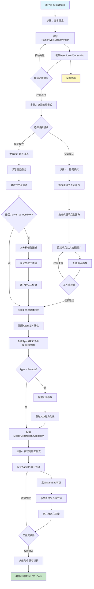
```mermaid
flowchart TD
    A[用户点击 新建编排] --> B[步骤1: 基本信息]
    B --> B1[填写Name/Type/Status/Avatar]
    B1 --> B2[填写Description/Constraint]
    B2 --> B3{校验必填字段}
    B3 -->|校验通过| C[步骤2: 选择编排模式]
    B3 -->|校验失败| B1

    C --> C1{选择编排模式}
    C1 -->|协调模式| D[步骤2.1: 协调模式]
    C1 -->|聊天模式| E[步骤2.2: 聊天模式]

    D --> D1[拖拽逻辑节点到画布]
    D1 --> D2[拖拽代理节点到画布]
    D2 --> D3[连接节点定义执行顺序]
    D3 --> D4[配置节点参数]
    D4 --> D5{工作流校验}
    D5 -->|校验通过| F[步骤3: 代理基本信息]
    D5 -->|校验失败| D3

    E --> E1[填写任务描述]
    E1 --> E2[对话式交互测试]
    E2 --> E3{是否Convert to Workflow?}
    E3 -->|是| E4[AI分析任务描述]
    E4 --> E5[自动生成工作流]
    E5 --> E6[用户确认工作流]
    E6 --> F
    E3 -->|否| F

    F --> F1[配置Agent基本属性]
    F1 --> F2[配置Agent类型 Self-built/Remote]
    F2 --> F3{Type = Remote?}
    F3 -->|是| F4[配置A2A参数]
    F4 --> F5[获取A2A能力列表]
    F5 --> F6[配置Model/Description/Capability]
    F3 -->|否| F6
    F6 --> G[步骤4: 代理内部工作流]

    G --> G1[设计Agent内部工作流]
    G1 --> G2[定义Start/End节点]
    G2 --> G3[添加自定义处理节点]
    G3 --> G4[定义自定义变量]
    G4 --> G5{工作流校验}
    G5 -->|校验通过| H[点击完成 保存编排]
    G5 -->|校验失败| G1

    B2 --> I[保存草稿]
    H --> J[编排创建成功 状态: Draft]

    style A fill:#e1f5fe
    style J fill:#c8e6c9
    style I fill:#fff9c4
```

### 5.2 协调模式工作流编排流程

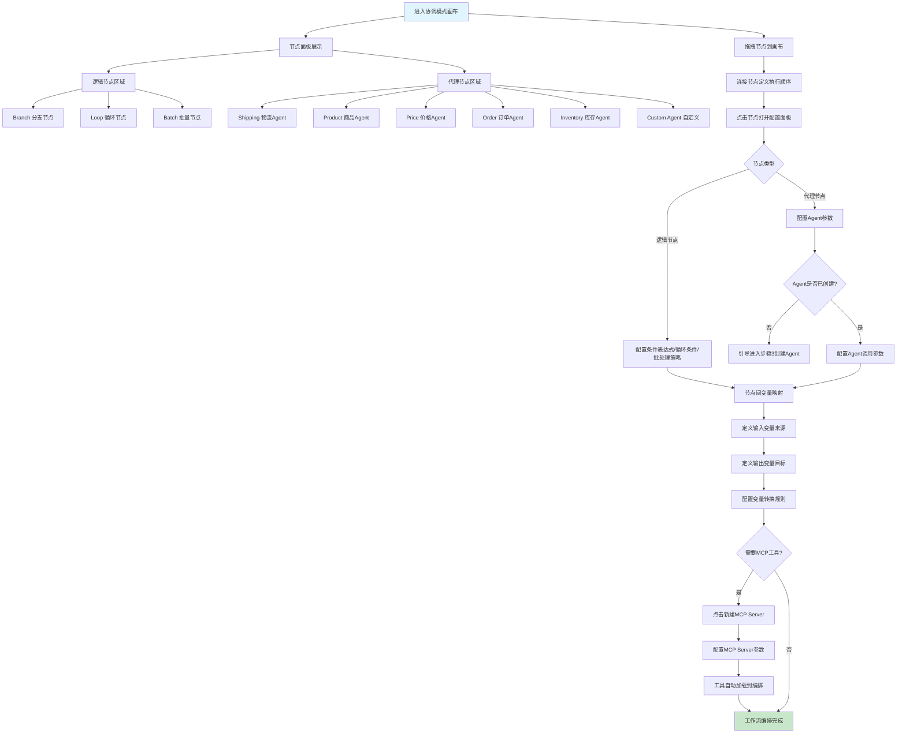
```mermaid
flowchart TD
    A[进入协调模式画布] --> B[节点面板展示]
    B --> B1[逻辑节点区域]
    B --> B2[代理节点区域]

    B1 --> C1[Branch 分支节点]
    B1 --> C2[Loop 循环节点]
    B1 --> C3[Batch 批量节点]

    B2 --> D1[Shipping 物流Agent]
    B2 --> D2[Product 商品Agent]
    B2 --> D3[Price 价格Agent]
    B2 --> D4[Order 订单Agent]
    B2 --> D5[Inventory 库存Agent]
    B2 --> D6[Custom Agent 自定义]

    A --> E[拖拽节点到画布]
    E --> F[连接节点定义执行顺序]
    F --> G[点击节点打开配置面板]

    G --> H{节点类型}
    H -->|逻辑节点| I[配置条件表达式/循环条件/批处理策略]
    H -->|代理节点| J[配置Agent参数]

    J --> J1{Agent是否已创建?}
    J1 -->|否| J2[引导进入步骤3创建Agent]
    J1 -->|是| J3[配置Agent调用参数]

    I --> K[节点间变量映射]
    J3 --> K
    K --> K1[定义输入变量来源]
    K1 --> K2[定义输出变量目标]
    K2 --> K3[配置变量转换规则]

    K3 --> L{需要MCP工具?}
    L -->|是| M[点击新建MCP Server]
    M --> M1[配置MCP Server参数]
    M1 --> M2[工具自动加载到编排]
    M2 --> N[工作流编排完成]
    L -->|否| N

    style A fill:#e1f5fe
    style N fill:#c8e6c9
```

### 5.3 聊天模式→Convert to Workflow转换流程

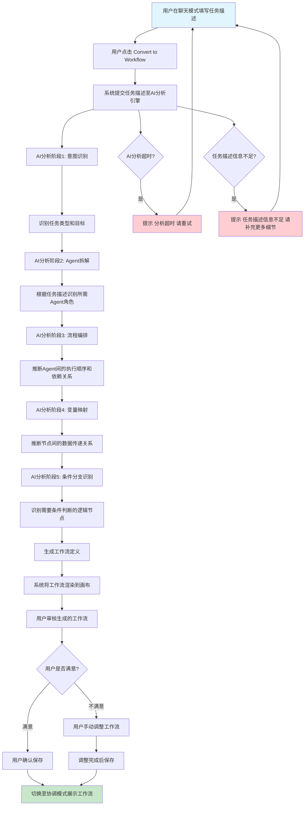
```mermaid
flowchart TD
    A[用户在聊天模式填写任务描述] --> B[用户点击 Convert to Workflow]
    B --> C[系统提交任务描述至AI分析引擎]

    C --> D[AI分析阶段1: 意图识别]
    D --> D1[识别任务类型和目标]
    D1 --> E[AI分析阶段2: Agent拆解]
    E --> E1[根据任务描述识别所需Agent角色]
    E1 --> F[AI分析阶段3: 流程编排]
    F --> F1[推断Agent间的执行顺序和依赖关系]
    F1 --> G[AI分析阶段4: 变量映射]
    G --> G1[推断节点间的数据传递关系]
    G1 --> H[AI分析阶段5: 条件分支识别]
    H --> H1[识别需要条件判断的逻辑节点]
    H1 --> I[生成工作流定义]

    I --> J[系统将工作流渲染到画布]
    J --> K[用户审核生成的工作流]
    K --> L{用户是否满意?}
    L -->|满意| M[用户确认保存]
    M --> N[切换至协调模式展示工作流]
    L -->|不满意| O[用户手动调整工作流]
    O --> P[调整完成后保存]
    P --> N

    C --> Q{AI分析超时?}
    Q -->|是| R[提示 分析超时 请重试]
    R --> A

    C --> S{任务描述信息不足?}
    S -->|是| T[提示 任务描述信息不足 请补充更多细节]
    T --> A

    style A fill:#e1f5fe
    style N fill:#c8e6c9
    style R fill:#ffcdd2
    style T fill:#ffcdd2
```

### 5.4 A2A远程Agent配置与能力获取流程

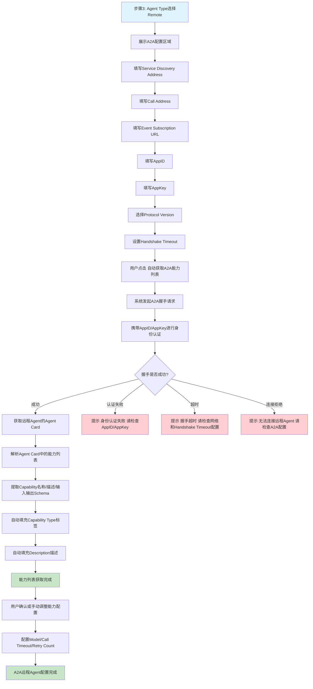
```mermaid
flowchart TD
    A[步骤3: Agent Type选择Remote] --> B[展示A2A配置区域]
    B --> B1[填写Service Discovery Address]
    B1 --> B2[填写Call Address]
    B2 --> B3[填写Event Subscription URL]
    B3 --> B4[填写AppID]
    B4 --> B5[填写AppKey]
    B5 --> B6[选择Protocol Version]
    B6 --> B7[设置Handshake Timeout]

    B7 --> C[用户点击 自动获取A2A能力列表]
    C --> D[系统发起A2A握手请求]
    D --> D1[携带AppID/AppKey进行身份认证]
    D1 --> E{握手是否成功?}

    E -->|成功| F[获取远程Agent的Agent Card]
    F --> F1[解析Agent Card中的能力列表]
    F1 --> F2[提取Capability名称/描述/输入输出Schema]
    F2 --> G[自动填充Capability Type标签]
    G --> G1[自动填充Description描述]
    G1 --> H[能力列表获取完成]

    E -->|认证失败| I[提示 身份认证失败 请检查AppID/AppKey]
    E -->|超时| J[提示 握手超时 请检查网络和Handshake Timeout配置]
    E -->|连接拒绝| K[提示 无法连接远程Agent 请检查A2A配置]

    H --> L[用户确认或手动调整能力配置]
    L --> M[配置Model/Call Timeout/Retry Count]
    M --> N[A2A远程Agent配置完成]

    style A fill:#e1f5fe
    style H fill:#c8e6c9
    style N fill:#c8e6c9
    style I fill:#ffcdd2
    style J fill:#ffcdd2
    style K fill:#ffcdd2
```

### 5.5 编排预览执行流程

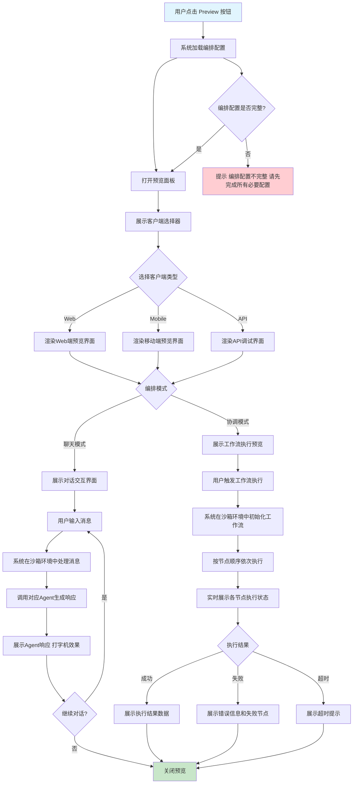
```mermaid
flowchart TD
    A[用户点击 Preview 按钮] --> B[系统加载编排配置]
    B --> C[打开预览面板]
    C --> D[展示客户端选择器]

    D --> E{选择客户端类型}
    E -->|Web| F1[渲染Web端预览界面]
    E -->|Mobile| F2[渲染移动端预览界面]
    E -->|API| F3[渲染API调试界面]

    F1 --> G{编排模式}
    F2 --> G
    F3 --> G

    G -->|协调模式| H[展示工作流执行预览]
    H --> H1[用户触发工作流执行]
    H1 --> H2[系统在沙箱环境中初始化工作流]
    H2 --> H3[按节点顺序依次执行]
    H3 --> H4[实时展示各节点执行状态]
    H4 --> H5{执行结果}
    H5 -->|成功| H6[展示执行结果数据]
    H5 -->|失败| H7[展示错误信息和失败节点]
    H5 -->|超时| H8[展示超时提示]

    G -->|聊天模式| I[展示对话交互界面]
    I --> I1[用户输入消息]
    I1 --> I2[系统在沙箱环境中处理消息]
    I2 --> I3[调用对应Agent生成响应]
    I3 --> I4[展示Agent响应 打字机效果]
    I4 --> I5{继续对话?}
    I5 -->|是| I1
    I5 -->|否| J[关闭预览]

    H6 --> J
    H7 --> J
    H8 --> J

    B --> K{编排配置是否完整?}
    K -->|否| L[提示 编排配置不完整 请先完成所有必要配置]
    K -->|是| C

    style A fill:#e1f5fe
    style J fill:#c8e6c9
    style L fill:#ffcdd2
```

**编排降级策略（模型 UNHEALTHY 级联）**：

当编排中包含的 Agent 因关联模型进入 UNHEALTHY 状态而降级或暂停时，编排须执行以下降级策略，确保与 PRD-04 §5.3 级联通知流程和 PRD-06 §6.1 Agent 降级处理策略对齐：

| 场景 | 受影响 Agent 位置 | 编排处理策略 | 编排结果状态 | 说明 |
|------|-------------------|-------------|-------------|------|
| 部分Agent降级（已配置备选模型） | 非关键路径 | 降级 Agent 继续使用备选模型执行，编排正常运行 | Running（降级运行） | 降级 Agent 的推理质量可能下降，编排结果中标注降级节点 |
| 部分Agent降级（已配置备选模型） | 关键路径 | 降级 Agent 继续使用备选模型执行，编排正常运行，但标记为降级 | Running（降级运行） | 关键路径降级需在编排执行结果中明确标注 |
| 部分Agent暂停（未配置备选模型） | 非关键路径 | 暂停 Agent 跳过执行，其余节点继续运行 | PartialSuccess | 非关键路径节点失败不影响整体流程，结果中标注跳过节点 |
| 部分Agent暂停（未配置备选模型） | 关键路径 | 编排暂停执行，等待 Agent 恢复或管理员干预 | Paused | 关键路径 Agent 不可用时编排无法继续，通知管理员 |
| 多个Agent依赖同一UNHEALTHY模型 | 含关键路径 | 按上述规则判断：若关键路径 Agent 有备选模型则降级运行，否则编排暂停 | PartialSuccess 或 Paused | 同一模型故障影响多个 Agent 时，统一处理避免重复通知 |
| 多个Agent依赖同一UNHEALTHY模型 | 均为非关键路径 | 受影响 Agent 均按各自降级策略处理，编排继续运行 | PartialSuccess | 合并通知，避免通知风暴 |

**编排降级决策流程**：
1. 编排接收到 Agent 降级/暂停通知后，评估受影响 Agent 在编排中的位置（关键路径 vs 非关键路径）；
2. 根据上表策略确定编排结果状态；
3. 若编排进入 Paused 状态，系统发送通知至管理员（站内消息 + 邮件），通知内容包含：编排 ID、编排名称、暂停原因、受影响 Agent 列表、建议操作；
4. 降级决策须在 Agent 降级/暂停通知到达后 **60 秒内** 完成。

**编排恢复策略**：
- 模型恢复 ACTIVE 后，受影响的 Agent 自动恢复（详见 PRD-06 §6.1 恢复策略），编排自动恢复执行，**无需重新调度**；
- 正在执行的任务从暂停点继续推进，新任务正常接收；
- 编排状态从 Paused 自动恢复为 Running，从 PartialSuccess 的降级运行自动恢复为正常 Running；
- 所有降级/恢复事件须记录审计日志，包含：编排 ID、Agent 降级详情、编排状态变更时间戳、恢复时间戳。

---

## 6. 状态模型

### 6.1 编排状态转换

> **收束说明**：编排状态枚举以 §26 DDL 中 `status` 字段定义为权威（`Draft / Published / Archived`）。`Deleted` 为逻辑删除（`is_deleted` 标记）而非独立状态。§6.1 状态转换规则已与DDL同步对齐。

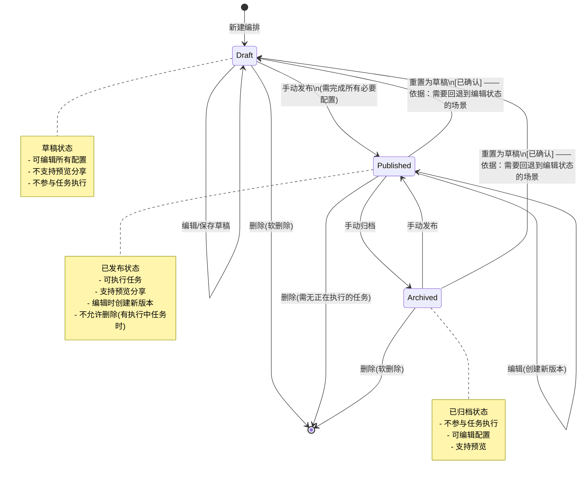
```mermaid
stateDiagram-v2
    [*] --> Draft: 新建编排

    Draft --> Published: 手动发布\n(需完成所有必要配置)
    Draft --> Draft: 编辑/保存草稿
    Draft --> [*]: 删除(软删除)

    Published --> Archived: 手动归档
    Published --> Published: 编辑(创建新版本)
    Published --> Draft: 重置为草稿\n[已确认] —— 依据：需要回退到编辑状态的场景
    Published --> [*]: 删除(需无正在执行的任务)

    Archived --> Published: 手动发布
    Archived --> Draft: 重置为草稿\n[已确认] —— 依据：需要回退到编辑状态的场景
    Archived --> [*]: 删除(软删除)

    note right of Draft
        草稿状态
        - 可编辑所有配置
        - 不支持预览分享
        - 不参与任务执行
    end note

    note right of Published
        已发布状态
        - 可执行任务
        - 支持预览分享
        - 编辑时创建新版本
        - 不允许删除(有执行中任务时)
    end note

    note right of Archived
        已归档状态
        - 不参与任务执行
        - 可编辑配置
        - 支持预览
    end note
```

**状态转换规则**：

| 转换路径 | 触发条件 | 前置约束 | 说明 |
|----------|----------|----------|------|
| → Draft | 新建编排 | 无 | 默认初始状态 |
| Draft → Published | 手动发布 | 编排配置完整（至少1个Agent、工作流已定义） | 发布前校验配置完整性 |
| Draft → 软删除 | 删除 | 无 | 软删除，标记deleted_at |
| Published → Archived | 手动归档 | 无正在执行的任务 | 归档后不再接受新任务 |
| Published → Published | 编辑保存 | 无 | [已确认] 编辑已发布编排时创建新版本，原版本保留 —— 依据：版本管理需要保留历史版本 |
| Published → Draft | 重置为草稿 | 无正在执行的任务 | [已确认] 需要回退到编辑状态的场景 —— 依据：业务上可能需要重新调整编排逻辑 |
| Published → 软删除 | 删除 | 无正在执行的任务 | 删除前检查执行状态 |
| Archived → Published | 手动发布 | 编排配置完整 | 重新发布需校验配置 |
| Archived → Draft | 重置为草稿 | 无 | [已确认] 需要回退到编辑状态的场景 |
| Archived → 软删除 | 删除 | 无 | 软删除 |

### 6.2 工作流执行状态

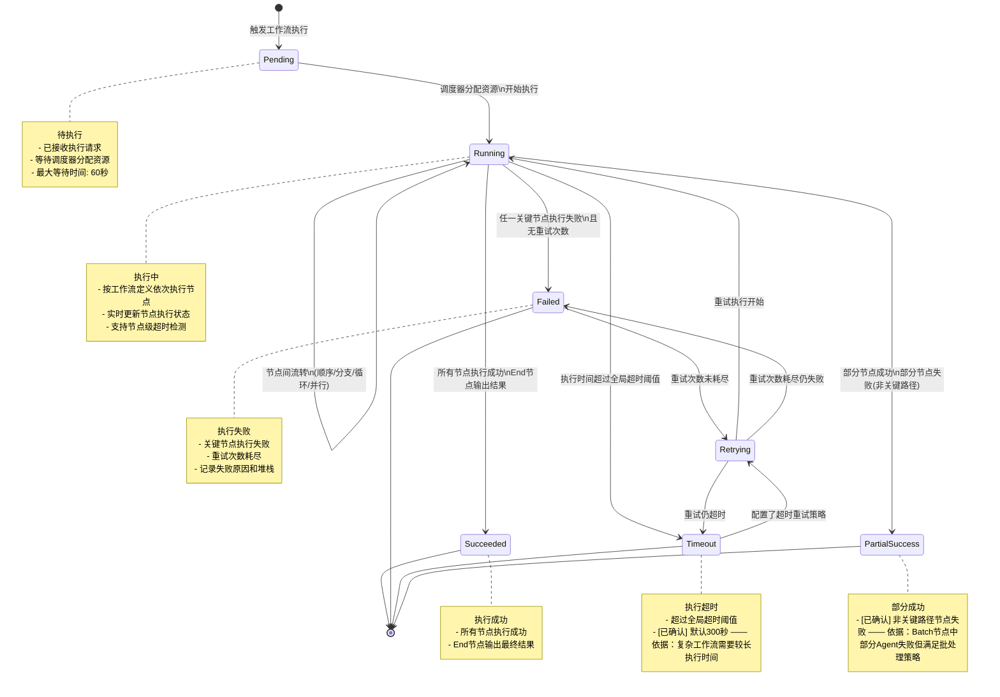
```mermaid
stateDiagram-v2
    [*] --> Pending: 触发工作流执行

    Pending --> Running: 调度器分配资源\n开始执行

    Running --> Running: 节点间流转\n(顺序/分支/循环/并行)
    Running --> Succeeded: 所有节点执行成功\nEnd节点输出结果
    Running --> Failed: 任一关键节点执行失败\n且无重试次数
    Running --> Timeout: 执行时间超过全局超时阈值
    Running --> PartialSuccess: 部分节点成功\n部分节点失败(非关键路径)

    Failed --> Retrying: 重试次数未耗尽
    Retrying --> Running: 重试执行开始
    Retrying --> Failed: 重试次数耗尽仍失败

    Timeout --> Retrying: 配置了超时重试策略
    Retrying --> Timeout: 重试仍超时

    Succeeded --> [*]
    Failed --> [*]
    Timeout --> [*]
    PartialSuccess --> [*]

    note right of Pending
        待执行
        - 已接收执行请求
        - 等待调度器分配资源
        - 最大等待时间: 60秒
    end note

    note right of Running
        执行中
        - 按工作流定义依次执行节点
        - 实时更新节点执行状态
        - 支持节点级超时检测
    end note

    note right of Succeeded
        执行成功
        - 所有节点执行成功
        - End节点输出最终结果
    end note

    note right of Failed
        执行失败
        - 关键节点执行失败
        - 重试次数耗尽
        - 记录失败原因和堆栈
    end note

    note right of Timeout
        执行超时
        - 超过全局超时阈值
        - [已确认] 默认300秒 —— 依据：复杂工作流需要较长执行时间
    end note

    note right of PartialSuccess
        部分成功
        - [已确认] 非关键路径节点失败 —— 依据：Batch节点中部分Agent失败但满足批处理策略
    end note
```

**工作流执行状态规则**：

| 规则编号 | 规则描述 |
|----------|----------|
| ORC-EX-001 | 工作流执行全局超时阈值默认为300秒，可通过编排Constraint配置覆盖 |
| ORC-EX-002 | 单个Agent节点执行超时由Call Timeout配置决定，默认30秒 |
| ORC-EX-003 | 失败重试次数由Retry Count配置决定，默认3次，重试间隔采用指数退避策略（1s/2s/4s） |
| ORC-EX-004 | [已确认] Pending状态最大等待时间为60秒，超时后自动标记为Failed —— 依据：避免资源长时间占用 |
| BR-05-021 | PartialSuccess 状态——当工作流中非关键节点失败但关键节点全部成功时，工作流标记为 PartialSuccess，结果聚合策略为"关键节点结果保留+非关键节点错误记录"。产品决策：PartialSuccess 视为成功（可查看部分结果），但需在结果中标注失败的节点列表。 |

**PartialSuccess 消费方处理定义**：

| 消费方 | 处理策略 | 说明 |
|--------|----------|------|
| 前端展示 | 工作流状态标签显示为"部分成功"（黄色/橙色标识），与"成功"（绿色）和"失败"（红色）形成视觉差异；结果面板分区展示：成功节点结果正常展示 + 失败节点折叠展示（含错误原因与重试入口） | 用户可直观区分完整成功与部分成功，并快速定位失败节点 |
| 下游流程触发 | PartialSuccess 视为成功，允许触发下游流程；下游流程仅接收成功节点的输出作为输入，失败节点的输出不参与下游数据传递 | 保证下游流程数据完整性，避免因部分节点失败导致级联错误 |
| 事件通知 | 发送 `workflow.executed` 事件（payload 中 `status=PartialSuccess`，`failed_nodes` 字段列出失败节点 ID 与错误信息） | 订阅方可根据 `status` 差异化处理 |
| 监控告警 | PartialSuccess 计入工作流成功率统计（分子+1），同时单独统计 PartialSuccess 比率，比率超过阈值时触发 P2 告警 | 兼顾成功率指标与异常趋势感知 |

> **超时层级说明**：工作流超时分为三个层级，由内到外逐级覆盖：(1) **节点超时**（默认60s，BR-05-012）——单个节点的最大执行时间，超时后节点标记为 TIMEOUT；(2) **全局超时**（默认300s，ORC-EX-001）——从工作流启动起的整体超时，超时后所有运行中节点取消；(3) **总执行超时**（DDL max_duration_s 默认600s）——包含重试在内的总执行时间上限。三层关系：节点超时 ≤ 全局超时 ≤ 总执行超时，违反此约束的配置在创建时被拒绝。

---

## 7. 功能详情

### 7.1 编排列表

#### 7.1.1 编排列表展示

**用户故事**：作为业务架构师，我希望查看系统中所有已创建的编排列表及其关键信息，以便快速了解现有编排资源和各编排的运行状态。

> **INVEST分析**：Independent（独立于其他功能）、Negotiable（展示字段可协商）、Valuable（提供全局视图）、Estimable（工作量可估算）、Small（单一功能）、Testable（验收标准可量化）

**前置条件**：
- 用户已登录系统并具有"编排管理"模块的查看权限
- 系统中至少存在一个已创建的编排

**后置条件**：
- 列表页面正确展示所有编排的核心字段信息
- 支持按字段排序和分页浏览

**主流程**：
1. 用户进入"编排管理"模块，默认展示编排列表页面
2. 系统查询所有已创建的编排记录
3. 列表以表格形式展示以下字段：
   - **Orchestration Name**：编排名称，支持点击跳转至编排详情/编辑页
   - **Description**：编排功能描述，超长文本截断显示（超过80字符截断并显示"..."）
   - **Updated At**：最后更新时间，格式为"YYYY-MM-DD HH:mm:ss"
   - **Status**：编排状态，以状态徽标展示（Published-绿色 / Archived-灰色 / Draft-黄色）
   - **Type**：编排类型，以标签展示（Internet / E-commerce）
   - **Mode**：编排模式，以标签展示（协调 / 聊天）
   - **操作列**：包含View、Edit、Delete、Copy四个操作按钮
4. 列表支持按Orchestration Name、Updated At排序
5. 列表支持分页，默认每页展示20条记录
6. 列表顶部提供"新建编排"快捷入口按钮

**分支流程**：
- **分支A - 无编排记录**：列表区域显示空状态插图和"暂无编排，点击创建您的第一个编排"引导按钮
- **分支B - 编排为草稿状态**：Status列显示黄色Draft徽标，操作列的View按钮置灰不可点击

**异常流程**：
- **异常A - 查询超时**：系统展示加载失败提示，提供"重试"按钮
- **异常B - 权限不足**：页面展示"无权限访问"提示

**交互说明**：
- 列表行支持hover高亮效果
- 操作按钮以图标+Tooltip形式展示，节省列表空间
- 删除操作需二次确认弹窗
- Copy操作成功后展示"已复制"提示，2秒后自动消失

**验收标准**：
- AC1：列表正确展示Orchestration Name、Description、Updated At、Status四个字段，字段值与数据库一致
- AC2：Status字段使用颜色编码区分三种状态（Published=#4CAF50绿色、Archived=#9E9E9E灰色、Draft=#FFC107黄色）
- AC3：操作列包含View、Edit、Delete、Copy四个按钮，各按钮Tooltip文字正确
- AC4：列表支持分页，每页20条，切换页码后数据在1秒内刷新
- AC5：无数据时展示空状态引导界面，包含插图和创建按钮
- AC6：Copy操作成功后展示"已复制"提示，2秒±0.5秒后自动消失

---

#### 7.1.2 搜索与筛选

**用户故事**：作为业务架构师，我希望通过关键词搜索和状态筛选快速定位目标编排，以便高效地管理大量编排资源。

> **INVEST分析**：Independent（独立功能）、Negotiable（搜索字段可扩展）、Valuable（提升检索效率）、Estimable（工作量可估算）、Small（单一功能）、Testable（响应时间可量化）

**前置条件**：
- 用户已登录并具有编排列表的查看权限

**后置条件**：
- 列表根据搜索和筛选条件正确过滤展示

**主流程**：
1. 用户在编排列表页顶部的搜索框中输入关键词
2. 系统实时搜索（输入防抖300ms），匹配Orchestration Name和Description字段
3. 用户可通过Status筛选标签（All / Published / Archived / Draft）进一步过滤
4. 搜索和筛选条件可叠加使用

**分支流程**：
- **分支A - 无搜索结果**：展示"未找到匹配的编排"提示
- **分支B - 清除条件**：清空搜索框或点击"All"标签，列表恢复完整展示

**验收标准**：
- AC1：搜索支持按Orchestration Name和Description模糊匹配，匹配结果在500ms内返回
- AC2：输入防抖间隔为300ms±50ms，避免频繁请求
- AC3：Status筛选标签正确过滤，切换标签后列表在500ms内更新
- AC4：搜索和筛选条件可叠加使用，同时生效

---

#### 7.1.3 复制编排

**用户故事**：作为Agent开发者，我希望基于已有编排快速创建一个副本，以便在相似场景下复用编排逻辑，减少重复配置工作。

> **INVEST分析**：Independent（独立功能）、Negotiable（复制范围可协商）、Valuable（减少重复配置）、Estimable（工作量可估算）、Small（单一操作）、Testable（副本完整性可验证）

**前置条件**：
- 用户已登录并具有编排的创建权限
- 源编排存在

**后置条件**：
- 新编排创建成功，包含源编排的所有配置副本
- 新编排名称自动添加"(副本)"后缀
- 新编排状态默认为Draft

**主流程**：
1. 用户在编排列表中点击目标行的"Copy"按钮
2. 系统弹出命名弹窗，预填名称为"源编排名称(副本)"
3. 用户可修改名称（可选）
4. 用户点击"确认"
5. 系统深拷贝源编排的所有配置（基本信息、工作流定义、Agent配置等）
6. 系统创建新编排记录，状态为Draft
7. 列表刷新，新编排出现在列表中
8. 系统展示"复制成功"提示

**分支流程**：
- **分支A - 名称冲突**：用户修改后的名称与已有编排重名，系统提示"该名称已存在"
- **分支B - 取消复制**：用户点击"取消"，操作终止

**异常流程**：
- **异常A - 复制失败**：系统提示"复制失败，请稍后重试"

**验收标准**：
- AC1：点击Copy后弹出命名弹窗，预填名称格式为"源编排名称(副本)"
- AC2：确认后新编排出现在列表中，状态为Draft
- AC3：新编排包含源编排的完整配置副本（工作流节点数、Agent数、变量数均与源编排一致）
- AC4：名称冲突时提示"该名称已存在"，阻止创建
- AC5：复制操作在3秒内完成（编排节点数≤30时）

---

#### 7.1.4 删除编排

**用户故事**：作为平台管理员，我希望删除不再使用的编排，以便保持系统资源的整洁和高效利用。

> **INVEST分析**：Independent（独立功能）、Negotiable（删除策略可协商）、Valuable（资源管理）、Estimable（工作量可估算）、Small（单一操作）、Testable（删除结果可验证）

**前置条件**：
- 用户已登录并具有编排的删除权限
- 目标编排存在

**后置条件**：
- 编排标记为Deleted状态（软删除）
- 编排在列表中不再展示（或以删除状态展示）

**主流程**：
1. 用户在编排列表中点击目标行的"Delete"按钮
2. 系统弹出二次确认弹窗，展示编排名称和删除影响说明
3. 用户点击"确认删除"
4. 系统校验编排当前状态：
   - 编排处于Published状态且有正在执行的任务 → 拒绝删除
   - 其他状态 → 执行软删除
5. 系统将编排标记为Deleted状态，记录删除时间
6. 列表刷新，已删除编排不再展示
7. 系统展示"删除成功"提示

**分支流程**：
- **分支A - Published状态且有执行中任务**：系统提示"该编排正在执行任务，无法删除"
- **分支B - 取消删除**：用户点击"取消"，操作终止

**异常流程**：
- **异常A - 删除失败**：系统提示"删除失败，请稍后重试"

**验收标准**：
- AC1：删除前弹出二次确认弹窗，展示编排名称
- AC2：Published状态且有执行中任务时拒绝删除，提示"该编排正在执行任务，无法删除"
- AC3：软删除成功后编排标记为Deleted状态，列表不再展示
- AC4：删除成功后展示"删除成功"提示
- AC5：30天内支持撤销删除，恢复编排和Agent配置

---

### 7.2 编排预览

#### 7.2.1 客户端预览

**用户故事**：作为业务运营人员，我希望在实际部署前通过客户端预览功能体验编排的交互效果，以便验证编排是否符合业务预期。

> **INVEST分析**：Independent（独立功能）、Negotiable（客户端类型可扩展）、Valuable（降低部署风险）、Estimable（工作量可估算）、Small（单一功能）、Testable（预览效果可验证）

**前置条件**：
- 用户已登录并具有编排预览权限
- 目标编排存在且配置完整（非Draft状态或已配置至少一个Agent）

**后置条件**：
- 预览界面正确展示编排的交互效果
- 预览操作不影响生产环境数据

**主流程**：
1. 用户在编排详情页点击"Preview"按钮
2. 系统打开预览面板，顶部展示客户端选择器（Preview with selected client）
3. 用户选择预览客户端类型（如Web / Mobile / API）
4. 系统根据选择的客户端类型渲染预览界面：
   - **协调模式编排**：展示工作流的执行预览，用户可触发工作流并观察各节点的执行状态
   - **聊天模式编排**：展示对话交互界面，用户可输入消息并获取Agent响应
5. 预览面板底部提供"关闭预览"按钮

**分支流程**：
- **分支A - 编排配置不完整**：预览面板展示"编排配置不完整，请先完成所有必要配置"
- **分支B - 切换客户端类型**：用户切换客户端类型，预览界面在2秒内重新渲染

**异常流程**：
- **异常A - 预览加载失败**：面板展示错误提示和"重试"按钮
- **异常B - Agent调用超时**：预览界面展示"响应超时，请检查Agent配置"

**交互说明**：
- 预览面板以全屏覆盖层或侧边大面板形式展示
- 客户端选择器使用下拉组件，包含客户端图标和名称
- 预览环境使用独立沙箱，与生产环境隔离
- 预览操作标注"Preview Mode"水印

**验收标准**：
- AC1：点击Preview后预览面板在2秒内完成加载
- AC2：客户端选择器正确展示可用客户端类型（至少包含Web、Mobile、API三种）
- AC3：协调模式预览可触发工作流执行并展示节点状态（Pending/Running/Succeeded/Failed）
- AC4：聊天模式预览支持对话交互，Agent响应延迟≤5秒
- AC5：预览环境与生产环境数据隔离，预览操作不写入生产数据库
- AC6：预览界面标注"Preview Mode"半透明水印，不遮挡交互区域

---

#### 7.2.2 代码预览

**用户故事**：作为Agent开发者，我希望查看编排的代码表示形式，以便理解编排的底层逻辑、进行代码级调试和集成开发。

> **INVEST分析**：Independent（独立功能）、Negotiable（代码格式可扩展）、Valuable（辅助开发调试）、Estimable（工作量可估算）、Small（单一功能）、Testable（代码准确性可验证）

**前置条件**：
- 用户已登录并具有编排预览权限
- 目标编排存在且已配置工作流或聊天模式

**后置条件**：
- 代码预览区域正确展示编排的代码表示

**主流程**：
1. 用户在编排详情页点击"Code"标签页
2. 系统将编排配置转换为代码表示（JSON/YAML格式）
3. 代码预览区域展示完整代码，包含：
   - 编排基本信息
   - 工作流节点定义和连接关系
   - Agent配置参数
   - 变量定义
4. 代码区域支持语法高亮
5. 用户可点击"Copy Code"按钮复制全部代码

**分支流程**：
- **分支A - 切换代码格式**：用户可在JSON和YAML格式之间切换，切换后1秒内完成渲染
- **分支B - 代码过长**：代码区域支持滚动浏览和折叠/展开

**交互说明**：
- 代码预览区域使用等宽字体和暗色主题
- Copy Code按钮点击后变为"已复制"状态，2秒后恢复
- 代码区域支持行号显示

**验收标准**：
- AC1：代码预览区域正确展示编排的完整代码表示，字段与编排配置一致
- AC2：代码支持语法高亮（关键字、字符串、数字等语法元素颜色区分）
- AC3：Copy Code按钮正确复制代码到剪贴板，复制内容与展示内容100%一致
- AC4：支持JSON和YAML格式切换，切换后1秒内完成渲染
- AC5：代码区域支持滚动浏览，行号与代码行一一对应

---

#### 7.2.3 复制链接

**用户故事**：作为业务架构师，我希望获取编排的分享链接，以便将编排预览分享给团队成员进行评审。

> **INVEST分析**：Independent（独立功能）、Negotiable（链接有效期可配置）、Valuable（团队协作）、Estimable（工作量可估算）、Small（单一操作）、Testable（链接可访问性可验证）

**前置条件**：
- 用户已登录并具有编排的查看权限
- 目标编排存在

**后置条件**：
- 分享链接复制到用户剪贴板

**主流程**：
1. 用户在编排详情页点击"Copy Link"按钮
2. 系统生成编排的分享链接（包含编排ID和只读Token）
3. 链接复制到用户剪贴板
4. 系统展示"链接已复制"提示

**分支流程**：
- **分支A - 编排为Draft状态**：系统提示"草稿状态的编排不支持分享链接"

**验收标准**：
- AC1：点击Copy Link后链接正确复制到剪贴板
- AC2：分享链接格式为`{baseURL}/preview/{orchestrationId}?token={readOnlyToken}`，Token有效期[已确认]默认7天 —— 依据：分享链接应有时效性控制
- AC3：通过分享链接可访问编排的只读预览，无法编辑
- AC4：复制成功后展示"链接已复制"提示，2秒±0.5秒后消失

---

### 7.3 创建编排 - 步骤1：基本信息

**用户故事**：作为业务架构师，我希望定义编排的基本属性（名称、类型、描述等），以便为后续的协作流程设计奠定基础。

> **INVEST分析**：Independent（独立步骤）、Negotiable（字段可扩展）、Valuable（编排创建必要步骤）、Estimable（工作量可估算）、Small（表单填写）、Testable（字段校验可验证）

**前置条件**：
- 用户已登录并具有编排的创建权限
- 用户点击了"新建编排"按钮

**后置条件**：
- 编排基本信息通过合法性校验
- 系统创建编排记录（Draft状态）

**主流程**：
1. 系统展示编排创建向导，进入步骤1 - 基本信息
2. 用户填写以下字段：

   **Name**：必填，编排名称，最大长度50字符，全局唯一
   - 示例值："电商订单处理编排"、"客户服务多Agent协作"

   **Type**：必填，单选
   - Internet：互联网场景
   - E-commerce：电商场景
   - （可扩展更多场景类型）

   **Status**：下拉选择
   - Draft（默认）：草稿
   - Published：已发布
   - Archived：已归档

   **Avatar**：选填，编排头像/图标
   - 支持上传图片或选择预设图标
   - 图片要求：正方形，最大2MB，支持PNG/JPG/SVG

   **Description**：选填，编排功能描述
   - 多行文本框，最大长度500字符
   - 示例值："该编排协调物流、库存、价格和订单四个Agent，实现电商订单的自动化处理流程"

   **Constraint**：选填，编排约束条件
   - 多行文本框，用于描述编排的运行约束（如执行时间限制、资源限制等）
   - 示例值："单次执行时间不超过30秒，并发上限为10"

3. 用户点击"下一步"
4. 系统校验必填字段
5. 系统创建编排记录（Draft状态）
6. 进入步骤2

**分支流程**：
- **分支A - 名称重复**：实时校验，输入框下方显示"该编排名称已存在"
- **分支B - 保存草稿**：用户点击"保存草稿"，系统保存当前信息并退出向导

**异常流程**：
- **异常A - 保存失败**：系统提示"保存失败，请稍后重试"

**交互说明**：
- 向导顶部展示步骤进度条（步骤1/2/3/4）
- Type选择使用卡片式单选组件，每个选项包含图标和说明
- Avatar上传区域支持拖拽上传

**验收标准**：
- AC1：步骤1正确展示所有字段，必填字段（Name、Type）有红色星号标识
- AC2：Name全局唯一校验，输入后500ms内返回校验结果，重复时显示"该编排名称已存在"
- AC3：Type选择使用卡片式组件，包含Internet和E-commerce两个选项
- AC4：Avatar支持图片上传（PNG/JPG/SVG，≤2MB）和预设图标选择
- AC5：Description限制500字符，超限时输入框下方显示"已超出X字符"提示
- AC6：点击"下一步"通过校验后1秒内进入步骤2
- AC7：保存草稿后编排以Draft状态保存，列表页可查看到该编排

---

### 7.4 创建编排 - 步骤2.1：协调模式

**用户故事**：作为业务架构师，我希望通过可视化工作流画布设计多Agent协作流程，以便直观地定义任务分配逻辑和信息流转规则。

> **INVEST分析**：Independent（独立步骤）、Negotiable（节点类型可扩展）、Valuable（核心编排能力）、Estimable（工作量较大）、Small（拆分为画布操作和节点配置）、Testable（工作流输出可验证）

**前置条件**：
- 用户已完成步骤1基本信息配置
- 用户在步骤2选择了"协调模式"

**后置条件**：
- 工作流定义通过合法性校验
- 工作流节点和连接关系持久化存储

**主流程**：
1. 系统展示可视化工作流画布，画布左侧展示节点面板
2. 节点面板分为两个区域：

   **A. 逻辑节点区域**
   - **Branch（分支节点）**：条件分支，根据条件判断走不同路径
     - 配置项：条件表达式（支持变量引用）、分支数量（2-N）
   - **Loop（循环节点）**：循环执行，重复执行子流程直到满足退出条件
     - 配置项：循环条件表达式、最大循环次数（默认10次，上限100次）
   - **Batch（批量节点）**：并行批处理，将任务分发给多个Agent并行执行
     - 配置项：批处理策略（全部成功/任一成功/多数成功）、超时策略

   **B. 代理节点区域**
   以下代理节点为 E-commerce 类型编排的预设模板示例。实际代理节点应根据编排 Type 动态展示对应场景的预设模板，用户也可从 Agent 列表中自由选择。
   - **Shipping（物流Agent）**：处理物流相关任务
   - **Product（商品Agent）**：处理商品信息相关任务
   - **Price（价格Agent）**：处理价格计算和查询任务
   - **Order（订单Agent）**：处理订单管理任务
   - **Inventory（库存Agent）**：处理库存查询和更新任务
   - **Custom Agent（自定义Agent）**：用户自定义的Agent节点

3. 用户从节点面板拖拽节点到画布上
4. 用户通过连线工具连接节点，定义执行顺序
5. 用户点击节点打开配置面板，设置节点参数
6. 用户可调整节点位置、连线关系
7. 画布支持缩放（放大/缩小/适应画布）和平移
8. 用户点击"下一步"进入步骤3

**分支流程**：
- **分支A - 新建MCP Server**：画布工具栏提供"新建MCP Server"快捷按钮，点击后弹出MCP Server配置弹窗（复用能力管理模块的配置表单），配置完成后工具自动加载到当前编排
- **分支B - 节点配置代理**：点击代理节点后，如该Agent尚未创建，系统引导用户进入步骤3创建Agent
- **分支C - 工作流校验失败**：点击"下一步"时系统校验工作流完整性（如是否有未连接的节点、是否有孤立节点），校验失败时高亮问题节点并提示

**异常流程**：
- **异常A - 画布操作异常**：节点拖拽失败或连线异常，系统自动恢复到上一个稳定状态
- **异常B - 工作流保存失败**：系统提示"保存失败"，保留画布当前状态

**交互说明**：
- 画布采用无限画布设计，支持鼠标滚轮缩放和拖拽平移
- 节点使用不同颜色区分类型（逻辑节点-蓝色，代理节点-绿色）
- 连线使用带箭头的有向边，支持直线和折线两种样式
- 节点面板支持搜索过滤
- 画布工具栏提供：撤销/重做、对齐工具、自动布局、清空画布
- 右键菜单支持：删除节点、复制节点、查看节点配置

**验收标准**：
- AC1：画布正确展示逻辑节点（Branch/Loop/Batch）和代理节点（Shipping/Product/Price/Order/Inventory），共9种节点类型
- AC2：支持从面板拖拽节点到画布，拖拽响应延迟≤100ms
- AC3：支持通过连线工具连接节点，连线带有方向箭头
- AC4：点击节点可打开配置面板，配置面板在300ms内加载完成
- AC5：画布支持缩放（10%-200%）和平移操作，操作流畅无卡顿
- AC6：工作流校验能检测未连接和孤立节点，高亮问题节点并显示具体错误信息
- AC7：新建MCP Server快捷按钮正确打开配置弹窗
- AC8：撤销/重做功能正常工作，支持至少20步操作历史

---

### 7.5 创建编排 - 步骤2.2：聊天模式

**用户故事**：作为业务运营人员，我希望通过对话式交互界面定义编排的任务需求，以便无需理解工作流概念即可快速创建Agent协作流程。

> **INVEST分析**：Independent（独立步骤）、Negotiable（AI分析策略可调整）、Valuable（降低编排门槛）、Estimable（工作量可估算）、Small（对话式交互）、Testable（转换结果可验证）

**前置条件**：
- 用户已完成步骤1基本信息配置
- 用户在步骤2选择了"聊天模式"

**后置条件**：
- 任务描述和对话配置持久化存储
- 系统基于任务描述生成初始Agent协作方案

**主流程**：
1. 系统展示聊天模式配置界面，包含以下区域：

   **A. 任务描述区域**
   - 多行文本框，用户描述编排的任务目标和协作需求
   - 示例："当客户咨询订单状态时，需要同时查询物流信息和库存信息，然后汇总生成回复"
   - 下方提供"AI辅助优化"按钮，点击后AI自动优化任务描述

   **B. 对话式交互界面**
   - 展示对话预览区域，模拟用户与编排的交互过程
   - 用户可输入测试消息，系统基于任务描述模拟Agent响应
   - 对话区域展示：
     - 用户消息（右侧气泡）
     - Agent响应（左侧气泡，标注Agent名称）
     - 系统消息（中间提示，如"正在调用物流Agent..."）

   **C. Convert to Workflow按钮**
   - 页面底部提供"Convert to Workflow"按钮
   - 点击后系统将对话式配置转换为可视化工作流

2. 用户填写任务描述
3. 用户可在对话区域进行测试交互
4. 用户点击"下一步"或"Convert to Workflow"

**分支流程**：
- **分支A - Convert to Workflow**：用户点击"Convert to Workflow"，系统分析任务描述，自动生成工作流节点和连接关系，切换至步骤2.1协调模式展示生成的工作流
- **分支B - AI辅助优化**：用户点击"AI辅助优化"，系统分析任务描述并给出优化建议，用户可接受或忽略
- **分支C - 任务描述为空**：用户未填写任务描述时，"下一步"按钮置灰
- **分支D - 点击"下一步"**：点击"下一步"进入步骤3（代理基本信息），聊天模式下步骤3仅展示 Agent 名称、描述、关联模型等基础配置项，不包含协调模式的节点编排画布。点击"Convert to Workflow"将聊天配置转换为协调模式工作流，进入完整的画布编辑界面。

**异常流程**：
- **异常A - AI分析超时**：AI辅助优化或Convert to Workflow时超时（超过30秒），提示"分析超时，请重试"
- **异常B - Convert to Workflow失败**：任务描述信息不足，系统提示"任务描述信息不足，请补充更多细节"

**交互说明**：
- 对话区域采用即时通讯样式，消息按时间顺序排列
- Agent响应支持打字机效果（逐字展示）
- Convert to Workflow按钮带有AI图标，暗示使用AI分析能力

**验收标准**：
- AC1：任务描述区域正确展示，支持多行文本输入，最小长度10字符
- AC2：对话区域支持模拟交互，消息样式区分用户（右侧蓝色）、Agent（左侧绿色）、系统（中间灰色）
- AC3：AI辅助优化按钮正确触发优化建议，响应时间≤10秒
- AC4：Convert to Workflow正确将对话配置转换为工作流，转换时间≤15秒
- AC5：转换后的工作流在步骤2.1中正确展示，节点数≥2且连接关系完整
- AC6：任务描述为空时"下一步"按钮置灰不可点击

**聊天模式能力边界**：

| 维度 | 支持范围 | 不支持范围 |
|------|----------|------------|
| 会话类型 | 单轮对话、多轮连续对话 | 群聊、广播 |
| 消息格式 | 纯文本、Markdown、结构化卡片 | 富媒体（图片/音频/视频）生成 |
| 上下文管理 | 自动上下文窗口管理、摘要压缩 | 跨会话上下文共享 |
| 工具调用 | 单步工具调用、串行多步工具调用 | 并行工具调用、工具链编排 |
| 记忆引用 | 自动召回相关记忆 | 用户手动选择记忆片段 |
| 流式输出 | 支持 SSE 流式输出 | WebSocket 双向流 |
| 会话持久化 | 会话历史持久化至 PostgreSQL | 会话状态实时同步至多端 |
| 中断恢复 | 支持从最后完成步骤恢复 | 不支持从中间步骤断点恢复 |

**约束规则**：
- 聊天模式下的单次对话 token 上限遵循 PRD-04 中模型配置的 max_output_tokens 约束
- 多轮对话上下文窗口溢出时，采用摘要压缩策略（保留最近 N 轮 + 摘要），而非简单截断
- 工具调用失败时，向用户返回错误信息并允许重试，不自动跳过
- 聊天模式不支持直接触发编排工作流，需通过 Agent 间接调用

---

### 7.6 创建编排 - 步骤3：代理基本信息

**用户故事**：作为Agent开发者，我希望在编排中配置Agent的基本属性和通信参数，以便Agent能够正确地参与协作流程。

> **INVEST分析**：Independent（独立步骤）、Negotiable（Agent参数可扩展）、Valuable（Agent配置核心步骤）、Estimable（工作量可估算）、Small（表单配置）、Testable（配置结果可验证）

**前置条件**：
- 用户已完成步骤2（协调模式或聊天模式）
- 用户在步骤2中添加了代理节点或系统自动生成了Agent配置

**后置条件**：
- Agent基本信息通过合法性校验
- Agent配置持久化存储

**主流程**：
1. 系统展示步骤3 - 代理基本信息配置页面
2. 页面左侧展示当前编排中的Agent列表，右侧展示选中Agent的配置表单
3. 用户点击某个Agent，右侧展示配置表单：

   **A. 基本属性**
   - **Name**：必填，Agent名称，最大长度50字符
   - **Status**：下拉选择（Active / Inactive / Draft）
   - **Avatar**：选填，Agent头像/图标
   - **Constraint**：选填，Agent运行约束条件

   **B. 类型配置**
   - **Type**：单选
     - Self-built（自建）：系统内创建的Agent
     - Remote（远程）：外部系统注册的Agent

   **C. A2A配置（Type = Remote时展示）**
   - **Service Discovery Address**：服务发现地址，用于Agent注册和发现
   - **Call Address**：远程调用地址，用于Agent间直接通信
   - **Event Subscription URL**：事件订阅地址，用于接收异步事件通知
   - **AppID**：应用标识，用于身份认证
   - **AppKey**：应用密钥（密码输入框）
   - **Protocol Version**：协议版本号（如"v1.0"、"v2.0"）
   - **Handshake Timeout**：握手超时时间（单位：秒），默认10秒

   **D. 能力配置**
   - **自动获取A2A能力列表**：按钮，点击后系统连接远程Agent自动获取其能力列表
   - **Model**：下拉选择，从系统已配置的LLM模型中选择
   - **Description**：Agent能力描述，描述Agent的功能和专长
   - **Capability Type**：能力类型标签（如"物流查询"、"价格计算"），支持多标签
   - **Call Timeout**：调用超时时间（单位：秒），默认30秒
   - **Retry Count**：失败重试次数，默认3次，范围0-10

4. 用户填写/修改Agent配置
5. 用户点击"下一步"进入步骤4

**分支流程**：
- **分支A - Type切换**：从Self-built切换至Remote时，展示A2A配置区域；切换回Self-built时隐藏
- **分支B - 自动获取A2A能力列表**：点击后系统连接远程Agent，获取其暴露的能力列表并自动填充Capability Type
- **分支C - Model下拉为空**：系统未配置LLM模型时，Model下拉展示"请先配置LLM模型"并引导跳转
- **分支D - 多Agent配置**：用户可依次点击左侧Agent列表中的每个Agent进行配置，已配置的Agent显示绿色勾选标记

**异常流程**：
- **异常A - A2A连接失败**：自动获取能力列表时连接失败，提示"无法连接远程Agent，请检查A2A配置"
- **异常B - A2A能力列表获取超时**：提示"获取超时，请检查网络和Handshake Timeout配置"

**交互说明**：
- 页面采用左右分栏布局，左侧Agent列表，右侧配置表单
- A2A配置区域默认折叠，点击"展开A2A配置"后展示
- 自动获取A2A能力列表按钮在获取期间显示loading动画
- Capability Type使用标签输入组件，支持自定义标签

**验收标准**：
- AC1：步骤3正确展示Agent列表和配置表单，左侧列表与步骤2添加的代理节点一一对应
- AC2：Type切换后A2A配置区域在300ms内正确显示/隐藏
- AC3：A2A配置包含7个字段（Service Discovery Address、Call Address、Event Subscription URL、AppID、AppKey、Protocol Version、Handshake Timeout）
- AC4：自动获取A2A能力列表功能正确工作，获取时间≤Handshake Timeout配置值
- AC5：Model下拉正确展示系统已配置的LLM模型列表
- AC6：Call Timeout范围1-300秒，Retry Count范围0-10次，超出范围时提示校验错误
- AC7：多Agent配置支持依次切换和配置，切换后表单数据正确加载
- AC8：已配置Agent显示绿色勾选标记，未配置Agent显示灰色圆点

---

### 7.7 创建编排 - 步骤4：代理内部工作流

**用户故事**：作为Agent开发者，我希望为编排中的每个Agent定义其内部工作流逻辑，以便精确控制Agent的任务执行步骤。

> **INVEST分析**：Independent（独立步骤）、Negotiable（节点类型可扩展）、Valuable（Agent内部逻辑定义）、Estimable（工作量较大）、Small（拆分为画布操作和变量定义）、Testable（工作流执行结果可验证）

**前置条件**：
- 用户已完成步骤3代理基本信息配置
- 用户选择了需要配置内部工作流的Agent

**后置条件**：
- Agent内部工作流定义通过合法性校验
- 工作流节点和连接关系持久化存储

**主流程**：
1. 系统展示步骤4 - 代理内部工作流配置页面
2. 页面左侧展示Agent列表（同步骤3），右侧展示选中Agent的工作流画布
3. 工作流画布包含以下预设节点：

   **A. Start节点（起始节点）**
   - 每个工作流自动包含一个Start节点，不可删除
   - 配置项：输入参数定义（从编排上下文或用户输入中接收的参数）
   - Start节点只能有出边，不能有入边

   **B. End节点（结束节点）**
   - 每个工作流自动包含一个End节点，不可删除
   - 配置项：输出参数定义（Agent执行结果的结构）
   - End节点只能有入边，不能有出边

   **C. 自定义节点**
   - 用户可添加自定义处理节点
   - 节点类型：工具调用（调用MCP工具/Capability）、条件判断、数据处理、变量赋值等
   - 每个节点可配置输入/输出映射

4. 用户在画布上设计Agent的内部工作流
5. 用户可定义自定义变量，用于在工作流节点间传递数据
   - 变量名：文本输入
   - 变量类型：下拉选择（String / Number / Boolean / Object / Array）
   - 默认值：根据类型输入
   - 作用域：工作流内全局有效

6. 用户点击"完成"保存编排

**分支流程**：
- **分支A - 工作流校验**：点击"完成"时系统校验工作流完整性（Start和End节点存在、无孤立节点、无循环依赖）
- **分支B - 变量引用**：节点配置中可引用自定义变量，系统提供变量选择器（下拉展示已定义的变量）
- **分支C - 多Agent工作流**：用户可切换左侧Agent列表配置不同Agent的内部工作流

**异常流程**：
- **异常A - 工作流存在循环依赖**：系统检测到循环依赖，高亮循环路径并提示"工作流存在循环依赖，请修正"
- **异常B - 保存失败**：系统提示"保存失败"，保留画布当前状态

**交互说明**：
- 工作流画布与步骤2.1的编排工作流画布采用相同的交互设计
- 自定义变量区域位于画布右侧，以面板形式展示
- 变量在节点配置中以"${variable_name}"格式引用
- Start节点固定在画布左上角，End节点固定在画布右下角

**验收标准**：
- AC1：步骤4正确展示Agent列表和工作流画布，左侧Agent列表与步骤3一致
- AC2：画布包含Start和End节点，且不可删除（删除按钮置灰或隐藏）
- AC3：支持添加自定义处理节点（工具调用、条件判断、数据处理、变量赋值4种类型）
- AC4：自定义变量支持创建、编辑和删除，变量类型支持String/Number/Boolean/Object/Array 5种
- AC5：节点配置中可引用自定义变量，变量选择器正确展示已定义变量列表
- AC6：工作流校验能检测循环依赖，高亮循环路径并显示具体错误信息
- AC7：点击"完成"后编排保存成功，页面跳转至编排列表
- AC8：多Agent内部工作流支持独立配置，切换Agent后画布正确加载对应工作流

---

## 8. 业务逻辑补全

### 8.1 Orchestration与Agent的完整协作关系

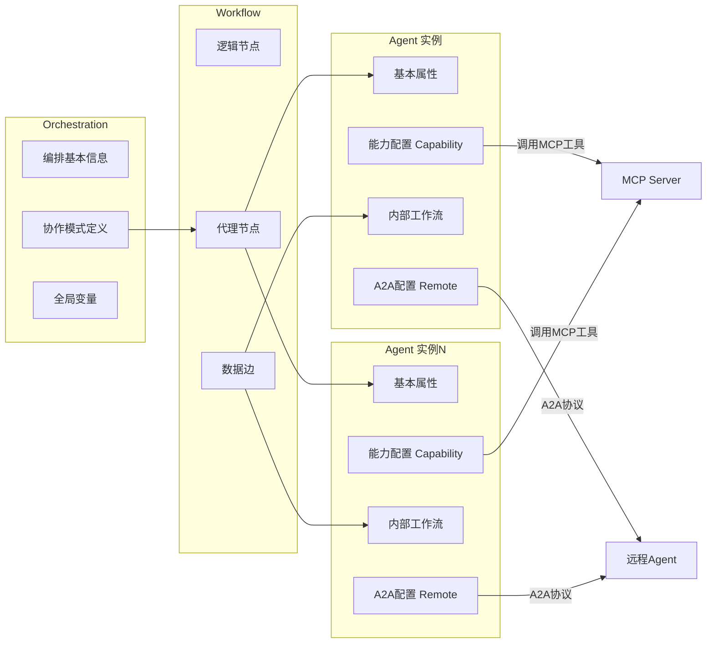
```mermaid
flowchart LR
    subgraph Orchestration
        direction TB
        O1[编排基本信息]
        O2[协作模式定义]
        O3[全局变量]
    end

    subgraph Workflow
        direction TB
        W1[逻辑节点]
        W2[代理节点]
        W3[数据边]
    end

    subgraph Agent1[Agent 实例]
        direction TB
        A1[基本属性]
        A2[能力配置 Capability]
        A3[内部工作流]
        A4[A2A配置 Remote]
    end

    subgraph Agent2[Agent 实例N]
        direction TB
        AN1[基本属性]
        AN2[能力配置 Capability]
        AN3[内部工作流]
        AN4[A2A配置 Remote]
    end

    O2 --> W2
    W2 --> A1
    W2 --> AN1
    W3 --> A3
    W3 --> AN3
    A2 --> |调用MCP工具| MCP[MCP Server]
    AN2 --> |调用MCP工具| MCP
    A4 --> |A2A协议| Remote[远程Agent]
    AN4 --> |A2A协议| Remote
```

**协作关系说明**：

| 关系维度 | 说明 |
|----------|------|
| 编排→工作流 | 一个Orchestration包含一个Workflow定义（协调模式）或一个Chat配置（聊天模式） |
| 编排→Agent | 一个Orchestration可包含1-20个Agent实例 |
| 工作流→Agent | Workflow中的代理节点引用编排内的Agent实例，通过代理节点调用Agent |
| Agent→Capability | Agent通过Capability Type标签声明其能力，内部工作流中的工具调用节点引用具体的MCP工具 |
| Agent→Agent | Agent间通过Workflow的数据边传递信息，Remote类型Agent通过A2A协议跨系统通信 |
| [已确认] 编排→全局变量 | 编排级别的全局变量在所有Agent间共享，Agent内部变量仅在Agent内部工作流中有效 —— 依据：工作流节点间需要跨Agent传递数据 |

### 8.2 工作流节点间的数据传递机制（变量映射）

**变量体系**：

| 变量类型 | 作用域 | 定义位置 | 引用格式 | 说明 |
|----------|--------|----------|----------|------|
| 编排全局变量 | 整个编排内所有Agent | 编排Constraint配置 | `${orchestration.variable_name}` | [已确认] 跨Agent共享的配置参数，如API密钥、环境标识 —— 依据：多Agent协作需要共享上下文信息 |
| 工作流变量 | 单个编排工作流内 | 步骤2.1工作流画布 | `${workflow.variable_name}` | 编排工作流节点间传递的中间数据 |
| Agent内部变量 | 单个Agent内部工作流内 | 步骤4工作流画布 | `${agent.variable_name}` | Agent内部节点间传递的中间数据 |
| 节点输出变量 | 当前节点下游 | 节点配置面板 | `${node.node_id.output_key}` | 上游节点的输出作为下游节点的输入 |
| 系统上下文变量 | 整个编排内 | 系统预定义 | `${system.request_id}` / `${system.timestamp}` | [已确认] 系统自动注入的运行时上下文 —— 依据：工作流执行需要追踪和关联请求 |

**节点间数据映射规则**：

1. **输入映射**：每个节点可配置输入参数的来源，支持以下映射方式：
   - 直接引用上游节点输出：`${node.upstream_id.result}`
   - 引用工作流变量：`${workflow.variable_name}`
   - 引用编排全局变量：`${orchestration.variable_name}`
   - 静态值：直接输入常量值

2. **输出映射**：每个节点执行完成后，其输出自动注册为节点输出变量，下游节点可引用

3. **类型转换**：[已确认] 当变量类型不匹配时，系统自动进行隐式类型转换（如Number→String），转换失败时标记为节点执行错误 —— 依据：不同Agent的输入输出Schema可能不一致

4. **变量冲突**：[已确认] 同名变量按作用域优先级解析：节点输出 > 工作流变量 > 编排全局变量 > 系统上下文变量 —— 依据：最小作用域优先原则

### 8.3 Convert to Workflow的AI分析逻辑

**AI分析流程**：

| 阶段 | 输入 | 处理逻辑 | 输出 |
|------|------|----------|------|
| 1. 意图识别 | 任务描述文本 | NLP解析任务类型、目标和约束条件 | 任务意图标签、关键实体 |
| 2. Agent拆解 | 任务意图 + 关键实体 | 根据任务描述识别所需Agent角色，匹配系统已有Agent或建议新建 | Agent列表及角色定义 |
| 3. 流程编排 | Agent列表 + 任务意图 | [已确认] 基于任务语义推断Agent间的执行顺序和依赖关系，使用拓扑排序生成DAG —— 依据：工作流本质上是有向无环图 | 工作流节点序列和连接关系 |
| 4. 变量映射 | Agent能力描述 + 工作流结构 | [已确认] 分析Agent的输入输出Schema，推断节点间的数据传递关系，自动生成变量映射 —— 依据：Agent间需要传递结构化数据 | 变量映射配置 |
| 5. 条件分支识别 | 任务描述中的条件语义 | 识别"如果...则...否则..."等条件语句，生成Branch节点 | 条件分支节点及条件表达式 |

**AI分析约束**：

| 约束项 | 说明 |
|--------|------|
| 最大分析时间 | 30秒，超时后提示用户重试 |
| 最小任务描述长度 | 10字符，低于此长度提示补充 |
| [已确认] 生成工作流节点数上限 | 20个节点 —— 依据：避免生成过于复杂的工作流，超出用户理解范围 |
| 用户确认 | 转换结果必须经用户确认后方可保存，用户可手动调整 |
| 原始数据保留 | 转换后保留原始聊天配置，支持回退到聊天模式 |

### 8.4 A2A协议的完整通信流程

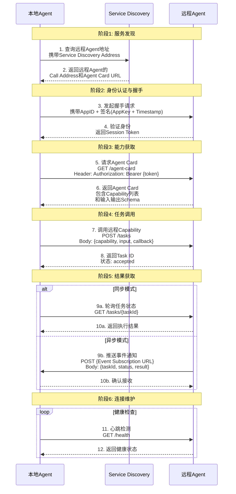
```mermaid
sequenceDiagram
    participant Local as 本地Agent
    participant SD as Service Discovery
    participant Remote as 远程Agent

    Note over Local,Remote: 阶段1: 服务发现
    Local->>SD: 1. 查询远程Agent地址<br/>携带Service Discovery Address
    SD-->>Local: 2. 返回远程Agent的<br/>Call Address和Agent Card URL

    Note over Local,Remote: 阶段2: 身份认证与握手
    Local->>Remote: 3. 发起握手请求<br/>携带AppID + 签名(AppKey + Timestamp)
    Remote-->>Local: 4. 验证身份<br/>返回Session Token

    Note over Local,Remote: 阶段3: 能力获取
    Local->>Remote: 5. 请求Agent Card<br/>GET /agent-card<br/>Header: Authorization: Bearer {token}
    Remote-->>Local: 6. 返回Agent Card<br/>包含Capability列表<br/>和输入输出Schema

    Note over Local,Remote: 阶段4: 任务调用
    Local->>Remote: 7. 调用远程Capability<br/>POST /tasks<br/>Body: {capability, input, callback}
    Remote-->>Local: 8. 返回Task ID<br/>状态: accepted

    Note over Local,Remote: 阶段5: 结果获取
    alt 同步模式
        Local->>Remote: 9a. 轮询任务状态<br/>GET /tasks/{taskId}
        Remote-->>Local: 10a. 返回执行结果
    else 异步模式
        Remote->>Local: 9b. 推送事件通知<br/>POST {Event Subscription URL}<br/>Body: {taskId, status, result}
        Local-->>Remote: 10b. 确认接收
    end

    Note over Local,Remote: 阶段6: 连接维护
    loop 健康检查
        Local->>Remote: 11. 心跳检测<br/>GET /health
        Remote-->>Local: 12. 返回健康状态
    end
```

**A2A通信规则**：

| 规则编号 | 规则描述 |
|----------|----------|
| A2A-COM-001 | 握手请求必须携带AppID和签名（AppKey + Timestamp的HMAC-SHA256签名） |
| A2A-COM-002 | Session Token有效期为[已确认] 24小时 —— 依据：平衡安全性和连接复用效率 |
| A2A-COM-003 | 任务调用支持同步和异步两种模式，默认使用异步模式 |
| A2A-COM-004 | 异步模式下，远程Agent通过Event Subscription URL推送事件通知 |
| A2A-COM-005 | [已确认] 健康检查间隔为30秒，连续3次检查失败后标记远程Agent为不可用 —— 依据：需要及时检测远程Agent故障 |
| A2A-COM-006 | [已确认] 任务调用失败时按Retry Count配置进行重试，重试间隔采用指数退避（1s/2s/4s） —— 依据：网络抖动场景需要渐进式重试 |

### 8.5 编排执行的超时和重试策略

**超时层级**：

| 超时层级 | 配置位置 | 默认值 | 说明 |
|----------|----------|--------|------|
| 全局执行超时 | 编排Constraint | 300秒 | 整个工作流执行的最大时长，超时后强制终止 |
| Agent调用超时 | Agent Call Timeout | 30秒 | 单个Agent节点执行的最大时长 |
| A2A握手超时 | Agent Handshake Timeout | 10秒 | A2A远程Agent握手的最大等待时长 |
| [已确认] 节点间传递超时 | 工作流配置 | 60秒 | 节点间数据传递的最大等待时长 —— 依据：大数据量传递可能需要较长时间 |
| [已确认] Pending等待超时 | 系统配置 | 60秒 | 工作流在Pending状态的最大等待时长 —— 依据：避免资源长时间占用 |

**重试策略**：

| 重试场景 | 触发条件 | 重试次数 | 重试间隔 | 说明 |
|----------|----------|----------|----------|------|
| Agent调用重试 | Agent执行失败（非业务逻辑错误） | Retry Count配置（默认3次） | 指数退避（1s/2s/4s） | 仅对可重试错误（网络超时、服务不可用）进行重试 |
| A2A连接重试 | A2A握手失败 | 3次 | 指数退避（1s/2s/4s） | [已确认] 连接级别的重试独立于调用重试 —— 依据：连接失败和调用失败是不同层级的问题 |
| [已确认] 工作流节点重试 | 非关键路径节点失败 | 1次 | 固定2秒 | 仅在Batch节点的非关键路径上重试 —— 依据：批处理场景允许部分失败 |
| 全局重试限制 | 工作流整体执行失败 | 不自动重试 | 无 | [已确认] 全局失败需人工介入或通过外部调度器触发 —— 依据：全局失败可能涉及业务逻辑错误，不宜自动重试 |

**超时处理流程**：

1. 全局执行超时 → 强制终止所有运行中节点 → 工作流状态标记为Timeout → 记录超时日志
2. Agent调用超时 → 当前节点标记为Failed → 根据Retry Count决定是否重试 → 重试耗尽后工作流状态取决于节点是否在关键路径
3. A2A握手超时 → 当前Agent标记为不可用 → [已确认] 降级为本地模式或使用缓存的历史能力列表 —— 依据：风险预案ORC-RISK-003

### 8.6 编排版本管理机制

**版本管理规则**：

| 规则编号 | 规则描述 |
|----------|----------|
| VER-001 | [已确认] 编排每次编辑保存时自动创建新版本，版本号格式为v{major}.{minor} —— 依据：需要追踪编排配置的变更历史 |
| VER-002 | [已确认] Published状态的编排编辑时，创建新版本（minor版本+1），原版本保留不变 —— 依据：运行中的编排不应被直接修改，避免影响正在执行的任务 |
| VER-003 | [已确认] 编排列表默认展示最新版本，支持查看历史版本列表 —— 依据：用户需要回溯编排的变更历史 |
| VER-004 | [已确认] 支持回滚到任意历史版本，回滚操作创建新版本（而非覆盖） —— 依据：回滚也是一次变更，应保留记录 |
| VER-005 | [已确认] 版本对比功能支持展示两个版本之间的差异（节点增删、参数变更、连线变更） —— 依据：用户需要了解版本间的具体变更内容 |
| VER-006 | [已确认] 历史版本保留上限为20个，超出后自动归档最旧的版本 —— 依据：避免版本数据无限增长 |

**版本数据模型**：

| 字段 | 类型 | 说明 |
|------|------|------|
| version_id | String | 版本唯一标识 |
| orchestration_id | String | 关联编排ID |
| version_number | String | 版本号（如v1.0、v1.1） |
| config_snapshot | JSON | 编排配置快照（包含工作流、Agent配置等完整信息） |
| change_summary | String | 变更摘要 |
| created_by | String | 创建人 |
| created_at | DateTime | 创建时间 |
| is_current | Boolean | 是否为当前版本 |

### 8.7 编排与Capability的关联关系

**关联模型**：

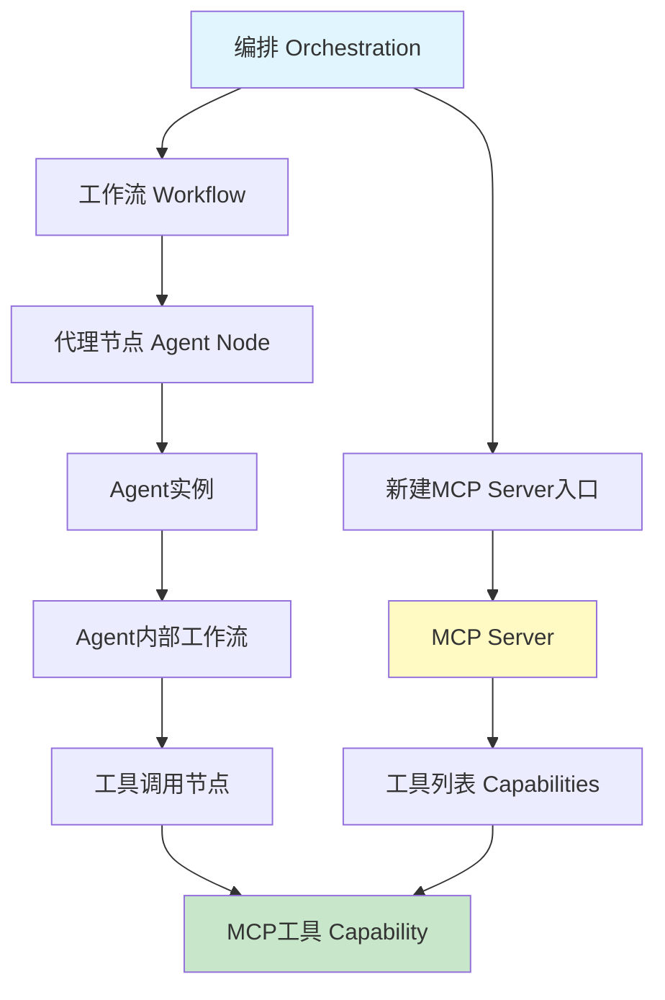
```mermaid
flowchart TD
    A[编排 Orchestration] --> B[工作流 Workflow]
    B --> C[代理节点 Agent Node]
    C --> D[Agent实例]
    D --> E[Agent内部工作流]
    E --> F[工具调用节点]
    F --> G[MCP工具 Capability]

    A --> H[新建MCP Server入口]
    H --> I[MCP Server]
    I --> J[工具列表 Capabilities]
    J --> G

    style A fill:#e1f5fe
    style G fill:#c8e6c9
    style I fill:#fff9c4
```

**关联规则**：

| 规则编号 | 规则描述 |
|----------|----------|
| CAP-001 | Agent通过Capability Type标签声明其能力类别，内部工作流中的工具调用节点引用具体的MCP工具（Capability） |
| CAP-002 | 编排工作流画布提供"新建MCP Server"快捷入口，配置完成后MCP Server提供的工具自动加载到当前编排 |
| CAP-003 | [已确认] 工具调用节点选择MCP工具时，系统展示当前编排关联的所有MCP Server的工具列表 —— 依据：Agent内部工作流需要调用具体的MCP工具 |
| CAP-004 | [已确认] MCP工具的输入输出Schema自动映射为工具调用节点的输入输出参数 —— 依据：减少手动配置工作量 |
| CAP-005 | [已确认] 编排删除时，关联的MCP Server配置不受影响（MCP Server是独立资源） —— 依据：MCP Server可被多个编排复用 |

### 8.8 协调模式与聊天模式的适用场景对比

| 对比维度 | 协调模式（Coordination） | 聊天模式（Chat） |
|----------|--------------------------|-------------------|
| **定义方式** | 可视化工作流画布，拖拽节点和连线 | 自然语言任务描述，对话式交互 |
| **适用场景** | 流程固定、逻辑清晰的结构化任务 | 流程灵活、需求模糊的探索性任务 |
| **典型用例** | 电商订单处理、库存同步、价格计算 | 客户咨询、智能客服、需求探索 |
| **编排精度** | 高，可精确控制每个节点的执行逻辑 | 中，依赖AI解析任务描述，可能存在歧义 |
| **学习成本** | 较高，需理解工作流概念和节点类型 | 较低，自然语言描述即可 |
| **可调试性** | 强，可逐步执行、查看节点状态 | 弱，对话过程较难追踪内部逻辑 |
| **可复用性** | 高，工作流模板可直接复用 | 中，需重新描述或转换为工作流后复用 |
| **灵活性** | 低，修改需重新编辑工作流 | 高，可通过对话动态调整 |
| **可预测性** | 高，执行路径明确 | 低，AI解析结果可能因描述差异而不同 |
| **模式转换** | 不可转换为聊天模式 | 可通过Convert to Workflow转换为协调模式 |
| **目标用户** | 业务架构师、Agent开发者 | 业务运营人员 |
| **配置复杂度** | 高（需配置节点、连线、变量映射） | 低（仅需任务描述） |
| **执行效率** | 高，预定义路径减少运行时决策 | [已确认] 较低，运行时需AI解析和路由 —— 依据：聊天模式每次执行都需要AI理解意图并分配Agent |

**模式选择建议**：

- **优先选择协调模式**：当任务流程明确、步骤固定、需要精确控制执行逻辑时
- **优先选择聊天模式**：当任务需求模糊、流程灵活、需要快速验证协作方案时
- **推荐工作流**：聊天模式验证 → Convert to Workflow转换 → 协调模式精细化 → 部署上线

---

## 9. 业务规则

> **v6 收束说明**：本节使用 `ORC-BR-` 模块前缀编号为旧版规范。v6 收束后的权威业务规则请参考 **§25 业务规则**（使用 `BR-05-{3 位}` 编号，遵循 PRD-09 §41.3 BR 编号规范）。本节作为详细规则参考保留，便于追溯。

### 9.1 编排管理规则

| 规则编号 | 规则描述 |
|----------|----------|
| ORC-BR-001 | 编排Name在系统内全局唯一，不区分大小写 |
| ORC-BR-002 | 新建编排默认状态为Draft，需手动发布为Published |
| ORC-BR-003 | 编排删除采用软删除机制，保留30天后物理删除 |
| ORC-BR-004 | 处于Published状态且正在执行任务的编排不允许删除 |
| ORC-BR-005 | 复制编排时，新编排状态固定为Draft，与源编排状态无关 |
| ORC-BR-006 | 编排内Agent数量上限为20个 |

### 9.2 工作流规则

| 规则编号 | 规则描述 |
|----------|----------|
| ORC-BR-007 | 每个工作流必须包含至少一个Start节点和一个End节点 |
| ORC-BR-008 | 工作流不允许存在循环依赖（除Loop节点外） |
| ORC-BR-009 | Branch节点至少有两个输出分支 |
| ORC-BR-010 | Loop节点最大循环次数上限为100次 |
| ORC-BR-011 | Batch节点并行执行的Agent数量上限为10个 |
| ORC-BR-012 | 工作流节点总数上限为30个（单个编排工作流） |
| ORC-BR-013 | Agent内部工作流节点总数上限为30个 |

### 9.3 聊天模式规则

| 规则编号 | 规则描述 |
|----------|----------|
| ORC-BR-014 | Convert to Workflow转换后的工作流需经用户确认后方可保存 |
| ORC-BR-015 | 任务描述最小长度为10个字符 |
| ORC-BR-016 | AI辅助优化不修改原始任务描述，仅提供建议供用户参考 |

### 9.4 A2A通信规则

| 规则编号 | 规则描述 |
|----------|----------|
| ORC-BR-017 | Handshake Timeout取值范围为1-60秒 |
| ORC-BR-018 | A2A能力列表获取失败不影响Agent基本配置的保存 |
| ORC-BR-019 | Remote类型Agent的Call Address必须以http://或https://开头 |
| ORC-BR-020 | AppKey在数据库中加密存储，展示时脱敏处理 |

---

## 10. 数据模型

### 10.1 编排（Orchestration）

| 字段名 | 类型 | 必填 | 默认值 | 约束 | 说明 |
|--------|------|------|--------|------|------|
| orchestration_id | String(UUID) | 是 | 系统生成 | 全局唯一 | 编排唯一标识 |
| partition_key | String(UUID) | 是 | 当前用户所属商户 | 外键→Merchant.id（非空、强引用、级联检查） | 所属租户（商户）ID，用于多租户隔离（v5 命名空间，原 `tenant_id` 字段名） |
| merchant_id | String(UUID) | 是 | 当前用户所属商户 | 外键→Merchant.id（冗余字段，便于按商户查询） | 商户ID，与 partition_key 保持一致。partition_key 为框架层多租户中间件要求的统一字段名（v5 命名空间），merchant_id 为业务语义字段。两者值一致但用途不同：partition_key 用于框架层自动租户隔离，merchant_id 用于业务查询与关联。 |
| name | String | 是 | 无 | 最大50字符，全局唯一 | 编排名称 |
| type | Enum | 是 | 无 | Internet / E-commerce / [已确认] 可扩展 —— 依据：未来可能支持更多业务场景 | 编排场景类型 |
| status | Enum | 是 | Draft | Draft / Published / Archived | 编排状态（与DDL对齐，Deleted为软删除而非独立状态） |
| soft_delete_flag | Boolean | 是 | false | 软删除标记，配合 deleted_at 使用 | 软删除标志（与 deleted_at 同步） |
| avatar | String(URL) | 否 | 无 | 正方形图片，≤2MB，PNG/JPG/SVG | 编排头像/图标 |
| description | String | 否 | 无 | 最大500字符 | 编排功能描述 |
| constraint | String | 否 | 无 | 最大1000字符 | 编排运行约束条件 |
| mode | Enum | 是 | 无 | Coordination / Chat | 编排协作模式 |
| version | String | 否 | v1.0 | 格式v{major}.{minor} | [已确认] 当前版本号 —— 依据：版本管理需要版本号标识 |
| created_by | String | 是 | 当前用户ID | 无 | 创建人 |
| created_at | DateTime | 是 | 当前时间 | 无 | 创建时间 |
| updated_at | DateTime | 是 | 当前时间 | 无 | 最后更新时间 |
| deleted_at | DateTime | 否 | 无 | 软删除时记录 | 删除时间 |

### 10.2 工作流（Workflow）

| 字段名 | 类型 | 必填 | 默认值 | 约束 | 说明 |
|--------|------|------|--------|------|------|
| workflow_id | String(UUID) | 是 | 系统生成 | 全局唯一 | 工作流唯一标识 |
| orchestration_id | String(UUID) | 是 | 无 | 外键→Orchestration（强引用、ON DELETE RESTRICT、被引用时禁止删除） | 关联编排ID |
| partition_key | String(UUID) | 是 | 继承自 Orchestration.partition_key | 外键→Merchant.id（非空） | 所属租户ID，与编排保持一致（v5 命名空间） |
| agent_id | String(UUID) | 否 | 无 | 外键→Agent（强引用、ON DELETE RESTRICT）；为空时为编排级工作流 | 关联Agent ID（Agent内部工作流时非空） |
| soft_delete_flag | Boolean | 是 | false | 软删除标记 | 软删除标志 |
| nodes | Array(Node) | 是 | [] | 节点数≤30（编排级）或≤30（Agent级） | 工作流节点列表 |
| edges | Array(Edge) | 是 | [] | 无 | 工作流连接边列表 |
| variables | Array(Variable) | 否 | [] | 无 | 工作流变量定义 |
| created_at | DateTime | 是 | 当前时间 | 无 | 创建时间 |
| updated_at | DateTime | 是 | 当前时间 | 无 | 最后更新时间 |

### 10.3 节点（Node）

| 字段名 | 类型 | 必填 | 默认值 | 约束 | 说明 |
|--------|------|------|--------|------|------|
| node_id | String | 是 | 系统生成 | 工作流内唯一 | 节点唯一标识 |
| node_type | Enum | 是 | 无 | AGENT / TOOL / LLM / CONDITION / LOOP / PARALLEL / JOIN / END | 节点类型 |
| name | String | 是 | 无 | 最大50字符 | 节点名称 |
| position_x | Number | 是 | 0 | 无 | 画布X坐标 |
| position_y | Number | 是 | 0 | 无 | 画布Y坐标 |
| config | Object | 否 | {} | 无 | 节点配置参数（JSON结构，不同节点类型配置不同） |
| input_mapping | Array(InputMapping) | 否 | [] | 无 | 输入参数映射 |
| output_mapping | Array(OutputMapping) | 否 | [] | 无 | 输出参数映射 |

> **节点类型权威枚举以 §26.2 DDL 为准**：`AGENT` / `TOOL` / `LLM` / `CONDITION` / `LOOP` / `PARALLEL` / `JOIN` / `END`。以下为各章节节点类型枚举对照映射表：

| §26.2 DDL（权威） | §10.3 旧值 | §27.1 Neo4j | §A5.3 GraphQL | 说明 |
|---------------------|------------|-------------|---------------|------|
| `AGENT` | `Agent` | `AGENT` | — | Agent 节点 |
| `TOOL` | `ToolCall` | `TOOL` | `TOOL` | 工具调用节点 |
| `LLM` | — | `LLM` | `LLM` | LLM 调用节点 |
| `CONDITION` | `Condition` / `Branch` | `CONDITION` | `CONDITION` | 条件分支节点 |
| `LOOP` | `Loop` | `LOOP` | `LOOP` | 循环节点 |
| `PARALLEL` | `Batch` | `PARALLEL` | `PARALLEL` | 并行执行节点 |
| `JOIN` | — | `JOIN` | — | 汇聚节点 |
| `END` | `End` | `END` | — | 结束节点 |
| — | `Start` | — | — | 起始节点（隐式，无需枚举） |
| — | `DataProcess` | — | — | 数据处理（已移除，由 config 承载） |
| — | `VariableAssign` | — | — | 变量赋值（已移除，由 config 承载） |
| — | — | `HUMAN` | `HUMAN` | 人工审批节点（待 DDL 同步） |
| — | — | `WAIT` | `WAIT` | 等待节点（待 DDL 同步） |
| — | — | `A2A` | `A2A` | Agent-to-Agent 节点（待 DDL 同步） |

### 10.4 边（Edge）

| 字段名 | 类型 | 必填 | 默认值 | 约束 | 说明 |
|--------|------|------|--------|------|------|
| edge_id | String | 是 | 系统生成 | 工作流内唯一 | 边唯一标识 |
| source_node_id | String | 是 | 无 | 引用Node.node_id | 起始节点ID |
| target_node_id | String | 是 | 无 | 引用Node.node_id | 目标节点ID |
| source_port | String | 否 | default | 无 | 起始节点输出端口 |
| target_port | String | 否 | default | 无 | 目标节点输入端口 |
| condition | String | 否 | 无 | 最大200字符 | 条件表达式（Branch节点的出边需要） |

### 10.5 变量（Variable）

| 字段名 | 类型 | 必填 | 默认值 | 约束 | 说明 |
|--------|------|------|--------|------|------|
| variable_name | String | 是 | 无 | 工作流内唯一，最大50字符 | 变量名称 |
| variable_type | Enum | 是 | String | String / Number / Boolean / Object / Array | 变量类型 |
| default_value | String | 否 | 无 | 需符合variable_type约束 | 默认值 |
| scope | Enum | 是 | workflow | workflow / agent / orchestration / system | 变量作用域 |
| description | String | 否 | 无 | 最大200字符 | 变量描述 |

### 10.6 Agent配置

| 字段名 | 类型 | 必填 | 默认值 | 约束 | 说明 |
|--------|------|------|--------|------|------|
| agent_id | String(UUID) | 是 | 系统生成 | 全局唯一 | Agent唯一标识 |
| orchestration_id | String(UUID) | 是 | 无 | 外键→Orchestration（强引用、ON DELETE RESTRICT、被引用时禁止删除） | 关联编排ID |
| partition_key | String(UUID) | 是 | 继承自 Orchestration.partition_key | 外键→Merchant.id（非空） | 所属租户ID，与编排保持一致（v5 命名空间） |
| knowledge_base_id | String(UUID) | 否 | 无 | 外键→Knowledge（强引用、ON DELETE RESTRICT）；引用已删除的Knowledge时禁止发布编排 | 关联知识库ID（Agent可引用的知识库） |
| soft_delete_flag | Boolean | 是 | false | 软删除标记 | 软删除标志 |
| name | String | 是 | 无 | 最大50字符 | Agent名称 |
| status | Enum | 是 | Draft | DRAFT / ACTIVE / INACTIVE / PAUSED / ERROR | Agent状态（与PRD-06 §9.1对齐） |
| avatar | String(URL) | 否 | 无 | 正方形图片，≤2MB | Agent头像/图标 |
| constraint | String | 否 | 无 | 最大500字符 | Agent运行约束条件 |
| agent_type | Enum | 是 | Self-built | Self-built / Remote | Agent类型 |
| model | String | 否 | 无 | 系统已配置的LLM模型 | 关联LLM模型 |
| description | String | 否 | 无 | 最大500字符 | Agent能力描述 |
| capability_types | Array(String) | 否 | [] | 无 | 能力类型标签列表 |
| call_timeout | Number | 否 | 30 | 1-300秒 | 调用超时时间（秒） |
| retry_count | Number | 否 | 3 | 0-10 | 失败重试次数 |
| created_at | DateTime | 是 | 当前时间 | 无 | 创建时间 |
| updated_at | DateTime | 是 | 当前时间 | 无 | 最后更新时间 |

### 10.7 A2A配置

| 字段名 | 类型 | 必填 | 默认值 | 约束 | 说明 |
|--------|------|------|--------|------|------|
| agent_id | String(UUID) | 是 | 无 | 外键→Agent，唯一 | 关联Agent ID |
| service_discovery_address | String | 是 | 无 | 合法URL格式 | 服务发现地址 |
| call_address | String | 是 | 无 | 以http://或https://开头 | 远程调用地址 |
| event_subscription_url | String | 否 | 无 | 合法URL格式 | 事件订阅地址 |
| app_id | String | 是 | 无 | 最大50字符 | 应用标识 |
| app_key | String | 是 | 无 | 加密存储，展示时脱敏 | 应用密钥 |
| protocol_version | String | 是 | v1.0 | 格式v{major}.{minor} | 协议版本号 |
| handshake_timeout | Number | 否 | 10 | 1-60秒 | 握手超时时间（秒） |

---

## 11. 权限矩阵

### 11.1 编排管理权限

编排管理模块统一使用 `orchestration:orchestration:{operation}` 三段式权限标识体系，遵循 PRD-12 §4.2.1 定义的 `{module}:{resource}:{operation}` 格式规范。完整权限标识如下：

| 权限标识 | 权限名称 | 描述 |
|----------|----------|------|
| `orchestration:orchestration:list` | 编排列表 | 查看编排列表、搜索、筛选 |
| `orchestration:orchestration:read` | 编排详情 | 查看编排详情、代码预览、客户端预览 |
| `orchestration:orchestration:create` | 创建编排 | 新建编排 |
| `orchestration:orchestration:edit` | 编辑编排 | 修改编排基本信息、工作流、Agent配置 |
| `orchestration:orchestration:delete` | 删除编排 | 软删除编排（30天可恢复） |
| `orchestration:orchestration:copy` | 复制编排 | 复制已有编排创建副本 |
| `orchestration:orchestration:execute` | 执行编排 | 触发工作流执行 |
| `orchestration:orchestration:activate` | 发布/归档编排 | 切换编排发布/归档状态 |
| `orchestration:version:read` | 查看版本历史 | 查看编排版本历史、版本对比 |
| `orchestration:version:rollback` | 回滚版本 | 回滚编排到指定历史版本 |
| `orchestration:orchestration:monitor` | 执行监控 | 查看编排执行监控、运行历史、APM追踪 |

| 功能操作 | 业务架构师 | Agent开发者 | 平台管理员 | 业务运营人员 |
|----------|:----------:|:-----------:|:----------:|:------------:|
| 查看编排列表 (`orchestration:orchestration:list`) | ✅ | ✅ | ✅ | ✅ |
| 搜索与筛选编排 (`orchestration:orchestration:list`) | ✅ | ✅ | ✅ | ✅ |
| 查看编排详情 (`orchestration:orchestration:read`) | ✅ | ✅ | ✅ | ✅ |
| 新建编排 (`orchestration:orchestration:create`) | ✅ | ✅ | ✅ | ❌ |
| 编辑编排 (`orchestration:orchestration:edit`) | ✅ | ✅（自己创建的） | ✅ | ❌ |
| 删除编排 (`orchestration:orchestration:delete`) | ❌ | ❌ | ✅ | ❌ |
| 复制编排 (`orchestration:orchestration:copy`) | ✅ | ✅ | ✅ | ❌ |
| 发布/归档编排 (`orchestration:orchestration:activate`) | ✅ | ❌ | ✅ | ❌ |
| 客户端预览 (`orchestration:orchestration:read`) | ✅ | ✅ | ✅ | ✅ |
| 代码预览 (`orchestration:orchestration:read`) | ✅ | ✅ | ✅ | ❌ |
| 复制链接 (`orchestration:orchestration:read`) | ✅ | ✅ | ✅ | ✅ |
| 执行编排 (`orchestration:orchestration:execute`) | ✅ | ✅ | ✅ | ❌ |
| 配置协调模式工作流 (`orchestration:orchestration:edit`) | ✅ | ✅ | ✅ | ❌ |
| 配置聊天模式 (`orchestration:orchestration:edit`) | ✅ | ✅ | ✅ | ✅ |
| Convert to Workflow (`orchestration:orchestration:edit`) | ✅ | ✅ | ✅ | ✅ |
| 配置Agent基本信息 (`orchestration:orchestration:edit`) | ✅ | ✅ | ✅ | ❌ |
| 配置A2A远程Agent (`orchestration:orchestration:edit`) | ✅ | ✅ | ✅ | ❌ |
| 获取A2A能力列表 (`orchestration:orchestration:read`) | ✅ | ✅ | ✅ | ❌ |
| 配置Agent内部工作流 (`orchestration:orchestration:edit`) | ✅ | ✅ | ✅ | ❌ |
| 新建MCP Server (`orchestration:orchestration:edit`) | ✅ | ✅ | ✅ | ❌ |
| 查看编排版本历史 (`orchestration:version:read`) | ✅ | ✅ | ✅ | ❌ |
| 回滚编排版本 (`orchestration:version:rollback`) | ❌ | ❌ | ✅ | ❌ |
| 管理编排执行监控 (`orchestration:orchestration:monitor`) | ✅ | ✅ | ✅ | ❌ |

> [已确认] 权限模型基于RBAC（基于角色的访问控制），支持自定义角色和细粒度权限配置 —— 依据：企业级系统通常需要灵活的权限管理

---

## 12. 非功能需求

### 12.1 性能需求

| 需求编号 | 需求描述 | 验收指标 |
|----------|----------|----------|
| NFR-PERF-001 | 编排列表页面加载时间 | 首屏加载时间≤2秒（数据量≤100条时） |
| NFR-PERF-002 | 编排列表搜索响应时间 | 搜索结果返回时间≤500ms |
| NFR-PERF-003 | 工作流画布操作响应时间 | 节点拖拽响应延迟≤100ms，画布缩放/平移帧率≥30fps |
| NFR-PERF-004 | 编排创建保存时间 | 步骤1基本信息保存≤1秒，完整编排保存≤3秒 |
| NFR-PERF-005 | 编排复制操作时间 | 复制操作完成时间≤3秒（编排节点数≤30时） |
| NFR-PERF-006 | 代码预览渲染时间 | 代码预览渲染时间≤1秒 |
| NFR-PERF-007 | 客户端预览加载时间 | 预览面板加载时间≤2秒 |
| NFR-PERF-008 | Convert to Workflow转换时间 | AI分析+工作流生成时间≤15秒 |
| NFR-PERF-009 | A2A能力列表获取时间 | 获取时间≤Handshake Timeout配置值 |
| NFR-PERF-010 | [已确认] 工作流执行吞吐量 | 单编排并发执行数≥10，系统总并发执行数≥100 —— 依据：多租户场景下需要支持多个编排同时执行 |

### 12.2 可用性需求

| 需求编号 | 需求描述 | 验收指标 |
|----------|----------|----------|
| NFR-USAB-001 | 编排创建向导步骤引导 | 步骤进度条清晰展示当前步骤（1/2/3/4），已完成步骤可回退编辑 |
| NFR-USAB-002 | 必填字段标识 | 所有必填字段使用红色星号（*）标识 |
| NFR-USAB-003 | 操作反馈 | 所有用户操作在2秒内给出反馈（成功/失败/加载中） |
| NFR-USAB-004 | 错误提示友好性 | 错误提示包含问题描述和解决建议，不展示技术异常堆栈 |
| NFR-USAB-005 | 工作流画布操作一致性 | 编排工作流画布和Agent内部工作流画布采用相同的交互设计 |
| NFR-USAB-006 | 键盘快捷键 | 工作流画布支持Ctrl+Z撤销、Ctrl+Y重做、Delete删除选中节点 |
| NFR-USAB-007 | [已确认] 无障碍访问 | 支持WCAG 2.1 AA级别，包含键盘导航和屏幕阅读器支持 —— 依据：企业级产品应满足无障碍标准 |

### 12.3 可靠性需求

| 需求编号 | 需求描述 | 验收指标 |
|----------|----------|----------|
| NFR-REL-001 | 编排数据持久化 | 编排配置数据持久化存储，系统重启后数据不丢失 |
| NFR-REL-002 | 工作流自动保存 | [已确认] 画布操作每30秒自动保存一次，异常退出后可恢复 —— 依据：避免用户长时间操作后意外丢失数据 |
| NFR-REL-003 | 软删除恢复 | 编排删除后30天内可撤销删除，恢复编排和Agent配置 |
| NFR-REL-004 | 预览环境隔离 | 预览操作不影响生产环境数据，使用独立沙箱 |
| NFR-REL-005 | 工作流执行容错 | 单个Agent节点失败不影响其他节点的执行状态记录 |
| NFR-REL-006 | [已确认] 系统可用性 | 编排管理模块可用性≥99.9%（月度） —— 依据：核心业务模块需要高可用保障 |
| **NFR-REL-007** | **RTO（恢复时间目标）** | **RTO ≤ 15分钟，与 PRD-09 §41.12 P1 重要级别统一为 RTO ≤ 15min** |
| **NFR-REL-008** | **RPO（恢复点目标）** | **RPO ≤ 5分钟，与 PRD-09 §41.12 P1 重要级别统一为 RPO ≤ 5min** |
| **NFR-REL-009** | **编排执行故障切换** | **编排执行实例故障时自动迁移到健康节点，迁移时间≤10秒** |
| **NFR-REL-010** | **跨模块事务一致性** | **编排涉及 Agent / Knowledge / Tool / LLM 跨模块写入时采用 Saga 或 Outbox 模式，任一子事务失败触发补偿回滚** |

### 12.4 安全需求

| 需求编号 | 需求描述 | 验收指标 |
|----------|----------|----------|
| NFR-SEC-001 | 身份认证 | 所有 API 请求需携带有效 Token,未认证由网关层返回 401(GraphQL 协议级错误) |
| NFR-SEC-002 | 权限控制 | 按权限矩阵控制功能访问,越权操作由业务层返回 055306 ~ 055309 业务错误码(业务层 HTTP 200) |
| NFR-SEC-003 | AppKey加密存储 | A2A配置中的AppKey使用AES-256加密存储，展示时脱敏处理（仅显示前4位和后4位） |
| NFR-SEC-004 | 分享链接安全 | 分享链接包含只读Token，[已确认] Token有效期默认7天，支持手动撤销 —— 依据：分享链接应有时效性控制和撤销能力 |
| NFR-SEC-005 | 操作审计 | 所有编排的创建、修改、删除操作记录审计日志，包含操作人、操作时间、操作内容 |
| NFR-SEC-006 | [已确认] 数据传输加密 | A2A通信强制使用HTTPS/TLS 1.2+ —— 依据：跨系统通信必须保证数据传输安全 |
| NFR-SEC-007 | [已确认] SQL注入防护 | 所有数据库查询使用参数化查询，防止SQL注入 —— 依据：Web应用安全基本要求 |
| **NFR-SEC-008** | **ACP身份认证** | **Agent间通信（ACP协议）必须携带AppID + HMAC-SHA256签名（AppKey + Timestamp + Nonce），服务端验证签名后颁发Session Token，Session Token有效期24小时** |
| **NFR-SEC-009** | **ACP防重放** | **ACP消息携带递增Nonce + 时间戳（±300秒时钟偏移），服务端记录Nonce集合（TTL=10分钟），重复Nonce直接拒绝** |
| **NFR-SEC-010** | **ACP消息完整性** | **ACP消息体使用HMAC-SHA256签名校验完整性,签名不匹配的消息直接拒绝(业务错误码 055601)** |
| **NFR-SEC-011** | **MCP Server健康检查** | **MCP Server健康检查周期固定为30秒，连续3次失败后标记为不可用并降级；恢复后自动重新加入可用列表** |
| **NFR-SEC-012** | **多租户隔离** | **所有编排相关查询自动附加 `WHERE partition_key = ?` 条件，ORM层强制校验，任何缺失租户过滤的查询拒绝执行** |
| **NFR-SEC-013** | **CSRF/CORS防护** | **状态变更接口强制CSRF Token校验，CORS白名单仅允许系统设置中配置的域名** |

### 12.5 可扩展性需求

| 需求编号 | 需求描述 | 验收指标 |
|----------|----------|----------|
| NFR-SCALE-001 | 编排场景类型可扩展 | Type字段支持扩展新场景类型，无需修改前端代码 |
| NFR-SCALE-002 | Agent节点类型可扩展 | 代理节点区域支持注册新的Agent类型 |
| NFR-SCALE-003 | MCP Server可扩展 | 支持动态注册新的MCP Server，工具自动加载 |
| NFR-SCALE-004 | 代码预览格式可扩展 | [已确认] 代码预览支持扩展新的输出格式（如Python DSL） —— 依据：不同开发者可能偏好不同的代码表示形式 |
| NFR-SCALE-005 | A2A协议版本兼容 | [已确认] 支持多版本A2A协议并行，通过Protocol Version字段区分 —— 依据：协议升级时需要向后兼容 |

### 12.6 兼容性需求

| 需求编号 | 需求描述 | 验收指标 |
|----------|----------|----------|
| NFR-COMP-001 | 浏览器兼容 | 支持Chrome 90+、Firefox 88+、Safari 14+、Edge 90+ |
| NFR-COMP-002 | 客户端类型兼容 | 预览支持Web、Mobile、API三种客户端类型 |
| NFR-COMP-003 | 数据格式兼容 | 代码预览支持JSON和YAML两种格式，[已确认] 支持双向无损转换 —— 依据：用户可能在不同格式间切换 |

---

## 13. 接口需求(收敛至 §A5 GraphQL)

> **收敛说明**: 编排管理模块对外接口**统一采用 GraphQL**(POST `/graphql`),详细 Query / Mutation 入口见 [§A5 GraphQL Schema 映射](#a5-graphql-schema-映射)。下方 §13.1 ~ §13.4 保留历史 `ORC-API-xxx` 编号,便于与 §28 / §A5 的 `API-05-xxx` 权限标识建立映射;**实际接入请以 §A5 GraphQL Schema 为准**。

### 13.1 编排管理接口(GraphQL 映射)

| 接口编号 | GraphQL 操作 | 旧 REST 路径 | 说明 |
|----------|--------------|--------------|------|
| ORC-API-001 | `workflows(filter, first, after, sort, search)` | GET /api/v1/orchestrations | 支持分页、排序、状态筛选、关键词搜索 |
| ORC-API-002 | `workflow(id)` | GET /api/v1/orchestrations/{id} | 返回完整编排配置 |
| ORC-API-003 | `createWorkflow(input, idempotencyKey)` | POST /api/v1/orchestrations | 创建新编排记录 |
| ORC-API-004 | `updateWorkflow(id, input, idempotencyKey)` | PUT /api/v1/orchestrations/{id} | 更新编排配置 |
| ORC-API-005 | `deleteWorkflow(id, idempotencyKey)` | DELETE /api/v1/orchestrations/{id} | 软删除编排 |
| ORC-API-006 | `duplicateWorkflow(id, idempotencyKey)` | POST /api/v1/orchestrations/{id}/duplicate | 深拷贝编排 |
| ORC-API-007 | `workflowCode(id, format)` | GET /api/v1/orchestrations/{id}/code | 返回 JSON/YAML 代码表示 |
| ORC-API-008 | `workflowVersion(workflowId, version)` | GET /api/v1/orchestrations/{id}/versions | 返回编排版本历史 |
| ORC-API-009 | `rollbackWorkflowVersion(input, idempotencyKey)` | POST /api/v1/orchestrations/{id}/versions/{versionId}/rollback | 回滚到指定版本 |
| ORC-API-010 | `activateWorkflow(id, idempotencyKey)` | POST /api/v1/orchestrations/{id}/activate | 将编排状态从 Draft/Archived 切换为 Published |
| ORC-API-011 | `deactivateWorkflow(id, idempotencyKey)` | POST /api/v1/orchestrations/{id}/deactivate | 将编排状态从 Published 切换为 Archived |

### 13.2 工作流接口(GraphQL 映射)

| 接口编号 | GraphQL 操作 | 旧 REST 路径 | 说明 |
|----------|--------------|--------------|------|
| ORC-API-012 | `workflowGraph(workflowId, version)` | GET /api/v1/orchestrations/{id}/workflow | 返回工作流节点和连接 |
| ORC-API-013 | `updateWorkflowGraph(workflowId, input, idempotencyKey)` | PUT /api/v1/orchestrations/{id}/workflow | 更新工作流节点和连接 |
| ORC-API-014 | `validateWorkflow(workflowId)` | POST /api/v1/orchestrations/{id}/workflow/validate | 校验工作流完整性 |
| ORC-API-015 | `convertChatToWorkflow(conversationId, idempotencyKey)` | POST /api/v1/orchestrations/{id}/chat-to-workflow | 将对话配置转换为工作流 |

### 13.3 代理配置接口(GraphQL 映射)

| 接口编号 | GraphQL 操作 | 旧 REST 路径 | 说明 |
|----------|--------------|--------------|------|
| ORC-API-016 | `workflowAgents(workflowId)` | GET /api/v1/orchestrations/{id}/agents | 返回编排内所有 Agent |
| ORC-API-017 | `updateWorkflowAgent(workflowId, agentId, input, idempotencyKey)` | PUT /api/v1/orchestrations/{id}/agents/{agentId} | 更新 Agent 配置 |
| ORC-API-018 | `a2aCapabilities(workflowId, agentId)` | POST /api/v1/orchestrations/{id}/agents/{agentId}/a2a-capabilities | 从远程 Agent 获取能力列表 |
| ORC-API-019 | `agentWorkflow(workflowId, agentId)` | GET /api/v1/orchestrations/{id}/agents/{agentId}/workflow | 返回 Agent 内部工作流 |
| ORC-API-020 | `updateAgentWorkflow(workflowId, agentId, input, idempotencyKey)` | PUT /api/v1/orchestrations/{id}/agents/{agentId}/workflow | 更新 Agent 内部工作流 |

### 13.4 预览接口(GraphQL 映射)

| 接口编号 | GraphQL 操作 | 旧 REST 路径 | 说明 |
|----------|--------------|--------------|------|
| ORC-API-021 | `previewLink(workflowId)` | GET /api/v1/orchestrations/{id}/preview-link | 生成只读预览链接 |
| ORC-API-022 | `executePreview(workflowId, input)` | POST /api/v1/orchestrations/{id}/preview/execute | 在沙箱环境中执行预览 |

---

## 14. 上线风险与预案

| 风险编号 | 风险描述 | 影响程度 | 发生概率 | 预防措施 | 应急预案 |
|----------|----------|----------|----------|----------|----------|
| ORC-RISK-001 | 复杂工作流导致执行性能下降 | 高 | 中 | 限制工作流节点数量上限（30个），实施执行超时机制（默认300秒） | 提供工作流性能分析工具，支持节点级别的耗时监控和优化建议 |
| ORC-RISK-002 | Convert to Workflow转换结果不符合预期 | 中 | 中 | 转换后强制用户审核确认，提供手动调整能力 | 保留原始聊天配置，支持回退到聊天模式 |
| ORC-RISK-003 | A2A远程Agent连接不稳定 | 高 | 中 | 实现连接健康检查（30秒间隔）和自动重连机制，配置合理的超时和重试 | Agent降级为本地模式，使用缓存的历史能力列表 |
| ORC-RISK-004 | 工作流循环依赖导致死循环 | 高 | 低 | 保存前强制校验循环依赖，Loop节点限制最大循环次数（100次） | 运行时检测循环执行次数，超限时强制中断并告警 |
| ORC-RISK-005 | 多Agent并发执行导致资源争用 | 中 | 中 | 实施资源配额管理，限制并发Agent数量（Batch上限10个） | 任务队列排队机制，超时后降级为串行执行 |
| ORC-RISK-006 | 编排删除后关联的Agent配置丢失 | 高 | 低 | 删除前检查并提示影响范围，编排删除采用软删除 | 30天内支持撤销删除，恢复编排和Agent配置 |
| ORC-RISK-007 | 预览环境与生产环境行为不一致 | 中 | 中 | 预览环境尽量复用生产配置，标注"Preview Mode"差异提示 | 提供预览日志和差异对比工具，帮助用户识别环境差异 |
| ORC-RISK-008 | [已确认] 编排版本数据无限增长 | 低 | 高 | 历史版本保留上限20个，超出后自动归档最旧版本 | 提供版本清理工具，支持手动归档和批量删除 |

---

## 15. 模块仪表盘与导航

本章聚焦于编排管理模块在系统仪表盘（Dashboard）与全局导航中的呈现与集成，从用户视角定义编排相关的数据可视化、操作入口与导航规范。

### 15.1 编排管理模块KPI卡片

**用户故事**：作为编排工程师，我希望在仪表盘首页看到编排管理模块专属的 KPI 卡片，以便快速掌握编排资源的整体规模与运行健康度。

**前置条件**：
- 用户已登录并具有 `dashboard:access` 权限
- 用户所属角色包含 `dashboard:kpi:view` 权限
- 编排工程师视图下，仅展示编排管理相关的 KPI 卡片

**后置条件**：
- KPI 卡片按所选时间范围加载并展示
- 数据每 30 秒自动刷新，刷新频率与其他模块 KPI 保持一致

**编排管理模块 KPI 卡片定义**：

| 序号 | 指标名称 | 数据来源 | 计算公式 | 刷新频率 | 单位 | 趋势对比 |
|------|----------|----------|----------|----------|------|----------|
| 1 | Total Orchestrations（编排总数） | 编排管理模块 | `COUNT(当前 Merchant 下所有未删除编排)` | 30秒 | 个 | 与昨日同期对比 |
| 2 | Published Orchestrations（已发布编排数） | 编排管理模块 | `COUNT(状态=Published 的编排)` | 30秒 | 个 | 与昨日同期对比 |
| 3 | Running Orchestrations（运行中编排数） | 编排管理模块 + 调度器 | `COUNT(状态=Running 的工作流执行实例)` | 30秒 | 个 | 与昨日同期对比 |
| 4 | Average Success Rate（平均成功率） | 编排管理模块 | `AVG(最近时间窗口内各编排的成功率)` | 30秒 | % | 与昨日对比 |
| 5 | Average Execution Time（平均执行耗时） | 编排管理模块 | `AVG(最近时间窗口内各编排的执行耗时)` | 30秒 | ms | 与昨日对比（越低越好，绿色↓） |
| 6 | Active Agents in Orchestrations（编排内活跃 Agent 数） | 编排管理模块 + Agent 管理模块 | `COUNT(最近 24 小时内被编排调用的 Agent 去重数)` | 30秒 | 个 | 与昨日对比 |

**编排工程师 Dashboard 视图规则**：
- 编排工程师角色登录后，KPI 卡片组仅展示上述 6 个编排管理相关卡片
- 趋势对比展示与昨日同期的变化百分比
- 平均执行耗时为反向指标，下降时使用绿色 ↓
- 卡片数值为 0 时显示"—"，不显示趋势箭头

**验收标准**：

| 编号 | 验收标准 | 验证方法 |
|------|----------|----------|
| AC-DASH-01 | 6 个编排管理 KPI 卡片在 3 秒内全部渲染完成 | Performance API 测量渲染时间，连续 10 次取 P95 |
| AC-DASH-02 | 编排工程师登录后仅展示编排管理相关卡片，不展示 Knowledge、LLM 等无关卡片 | 使用编排工程师账户验证 |
| AC-DASH-03 | KPI 数据刷新时间 ≤ 1 秒 | 触发刷新后测量更新完成时间 |
| AC-DASH-04 | 平均成功率保留 1 位小数，趋势对比与数据库原始数据一致 | 对比后端计算结果 |
| AC-DASH-05 | 点击"Total Orchestrations"卡片跳转至编排列表页面 | 点击卡片验证路由 |
| AC-DASH-06 | 平均执行耗时下降时显示绿色 ↓ 箭头（与其他指标相反） | 修改测试数据验证颜色与方向 |

### 15.2 热门 Orchestration Top 10

**用户故事**：作为编排工程师，我希望在仪表盘查看运行最频繁的 Orchestration 排行（Top 10），以便了解系统的工作负载分布和编排健康度。

**列表字段**：

| 字段 | 说明 |
|------|------|
| 排名 | 1-10 |
| Orchestration 名称 | 编排的名称，支持点击跳转至编排详情 |
| 编排模式 | Coordination（协调模式）/ Chat（聊天模式），以图标+标签展示 |
| 关联 Agent 数 | 编排内参与协作的 Agent 数量 |
| 运行次数 | 统计周期内的运行次数 |
| 平均耗时 | 每次运行的平均耗时（毫秒） |
| 成功率 | 编排执行成功的比例，保留 1 位小数 |

**主流程**：
1. 用户进入仪表盘 Dashboard
2. 系统加载"热门 Orchestration Top 10"列表，按运行次数降序排列
3. 用户悬停某条编排查看简要摘要 Tooltip
4. 用户点击某条编排跳转至编排详情/运行历史页面

**分支流程**：
- **分支A - 数据为空**：展示"暂无热门编排数据"提示
- **分支B - 时间范围切换**：与全局时间范围选择器联动，切换后重新加载

**验收标准**：

| 编号 | 验收标准 | 验证方法 |
|------|----------|----------|
| AC-DASH-07 | Top 10 热门编排数据与编排任务日志一致 | 对比后端任务日志数据 |
| AC-DASH-08 | 编排模式（协调/聊天）以图标+标签正确展示 | 检查视觉呈现 |
| AC-DASH-09 | 成功率 = 成功次数 / 总运行次数 × 100%，保留 1 位小数 | 验证计算逻辑与精度 |
| AC-DASH-10 | 列表在 2 秒内完成渲染 | Performance API 测量 |

### 15.3 Orchestration 运行状态实时图

**用户故事**：作为编排工程师，我希望在仪表盘看到当前正在运行的 Orchestration 实时状态（每 10 秒刷新），以便实时监控编排执行情况并及时处理异常。

**状态类型定义**：

| 状态 | 图标 | 颜色 | 说明 |
|------|------|------|------|
| 运行中 | Spinner | 蓝色 | 编排正在执行中 |
| 已完成 | Check | 绿色 | 编排执行成功 |
| 已失败 | X | 红色 | 编排执行失败 |
| 已取消 | Ban | 灰色 | 编排被用户取消 |
| 排队中 | Clock | 黄色 | 编排等待执行 |

**展示规则**：

| 规则 | 说明 |
|------|------|
| 展示数量 | 运行中的编排全部展示 + 最近 10 条已完成/失败/取消的 |
| 刷新频率 | 运行中的编排每 10 秒刷新状态 |
| 操作 | 运行中的编排支持"查看日志"和"取消"操作 |
| 实时推送 | 通过 WebSocket 推送状态变更事件，前端即时更新 |

**主流程**：
1. 系统加载当前正在运行的编排列表
2. 系统加载最近 10 条已完成/失败/取消的编排
3. 前端通过 WebSocket 订阅编排状态变更事件
4. 用户点击"查看日志"跳转至执行详情页面
5. 用户点击"取消"二次确认后终止运行中的编排

**分支流程**：
- **分支A - 取消编排**：二次确认后通过 GraphQL Mutation `cancelExecution(executionId, idempotencyKey)`(业务错误码 055413)取消,状态在 3 秒内变为"已取消"
- **分支B - 状态变更**：WebSocket 推送新状态后，前端列表自动更新并伴有过渡动画

**验收标准**：

| 编号 | 验收标准 | 验证方法 |
|------|----------|----------|
| AC-DASH-11 | 运行中编排每 10 秒自动刷新，刷新间隔误差 ≤ 2 秒 | 定时器监控，连续 10 次测量 |
| AC-DASH-12 | "取消"操作后编排状态在 3 秒内变为"已取消" | 触发取消后观测状态变化 |
| AC-DASH-13 | 状态图标和颜色与定义一致（蓝/绿/红/灰/黄） | 检查视觉表现 |
| AC-DASH-14 | WebSocket 断线后降级为 HTTP 轮询（30 秒间隔） | 模拟断线验证降级行为 |
| AC-DASH-15 | 取消操作需二次确认，确认弹窗展示编排名称 | 触发取消验证弹窗内容 |

### 15.4 编排类型分布

**用户故事**：作为编排工程师，我希望通过饼图了解当前 Merchant 下协调模式与聊天模式编排的占比，以便评估编排模式的使用偏好和未来演进方向。

**图表配置**：

| 配置项 | 说明 |
|--------|------|
| 图表类型 | 环形饼图（Donut Chart） |
| 数据维度 | 协调模式（Coordination）/ 聊天模式（Chat） |
| 数值 | 各模式编排数量及占比 |
| 中心文字 | 编排总数 |
| 交互 | 悬停展示模式名称、数量、占比；点击跳转至对应模式筛选后的列表 |
| 颜色 | 协调模式-蓝色、聊天模式-紫色 |

**验收标准**：

| 编号 | 验收标准 | 验证方法 |
|------|----------|----------|
| AC-DASH-16 | 各模式占比与数据库原始数据一致（误差 ≤ 0.1%） | 对比后端数据 |
| AC-DASH-17 | 点击扇区跳转至编排列表并自动应用模式筛选 | 点击验证路由和筛选条件 |
| AC-DASH-18 | 中心文字正确显示编排总数 | 验证中心文字与列表总数一致 |

### 15.5 最近编排活动

**用户故事**：作为编排工程师，我希望在仪表盘看到编排相关的最近活动动态（执行完成、配置变更、Agent 调整等），以便追踪编排的使用情况。

**活动类型**：

| 活动类型 | 图标 | 描述模板 | 颜色 |
|----------|------|----------|------|
| 编排创建 | Plus | "{用户} 创建了编排《{名称}》" | 绿色 |
| 编排发布 | Play | "{用户} 发布了编排《{名称}》" | 蓝色 |
| 编排归档 | Pause | "{用户} 归档了编排《{名称}》" | 灰色 |
| 编排删除 | Trash | "{用户} 删除了编排《{名称}》" | 红色 |
| 执行完成 | Check | "编排《{名称}》执行完成，耗时 {耗时}" | 绿色 |
| 执行失败 | X | "编排《{名称}》执行失败：{原因}" | 红色 |
| Agent 配置变更 | Edit | "{用户} 更新了编排《{编排}》中的 Agent《{Agent}》" | 蓝色 |

**展示规则**：

| 规则 | 说明 |
|------|------|
| 时间范围 | 最近 30 天内的编排活动记录 |
| 展示数量 | 每页 20 条，支持"查看更多"分页加载（每次加载 20 条） |
| 时间格式 | 1小时内显示"X分钟前"，24小时内显示"X小时前"，超过24小时显示"YYYY-MM-DD HH:mm" |
| 点击跳转 | 点击活动条目跳转至对应的编排详情或执行日志 |

**验收标准**：

| 编号 | 验收标准 | 验证方法 |
|------|----------|----------|
| AC-DASH-19 | 最近编排活动按时间倒序排列，最新活动在最上方 | 触发活动后检查列表顺序 |
| AC-DASH-20 | 活动类型图标和颜色与定义一致 | 触发不同类型活动验证 |
| AC-DASH-21 | 点击活动条目正确跳转至编排详情或执行日志 | 点击验证跳转路由 |
| AC-DASH-22 | 时间格式化规则正确（<1h → "X分钟前"，<24h → "X小时前"，≥24h → "YYYY-MM-DD HH:mm"） | 检查不同时间跨度格式 |

### 15.6 Sidebar 菜单

**用户故事**：作为系统用户，我希望在 Sidebar 左侧导航中通过"编排管理"菜单项快速进入编排管理模块，且该菜单项仅对我有权限的用户可见。

**菜单项定义**：

| 菜单名称 | 英文标识 | 图标 | 路由路径 | 权限要求 | 所属架构层 |
|----------|----------|------|----------|----------|------------|
| 编排管理 | Orchestrations | orchestration | /orchestrations | `orchestration:orchestration:list` | 协同扩展层 |

**导航分组规则**：
- 编排管理在 Sidebar 中归属于"协同扩展层"分组
- 与"数据支撑层"、"能力构建层"、"核心驱动层"、"编排翻译层"等其他架构层通过分割线区分
- 折叠状态下仅展示图标，悬停展示 Tooltip（"编排管理"）

**菜单权限控制**：

| 角色 | 是否展示编排管理菜单 | 数据范围 |
|------|---------------------|----------|
| 超级管理员 | ✅ | 全平台所有编排数据聚合 |
| 商户管理员 | ✅ | 本 Merchant 下所有编排 |
| 知识工程师 | ❌ | — |
| 编排工程师 | ✅ | 本 Merchant 下编排 |
| 普通用户 | ❌ | — |
| 审计员 | ❌ | — |

**全局搜索集成**：
- 全局搜索（Ctrl+K）支持搜索编排资源，搜索字段为"名称"和"描述"
- 搜索优先级权重为 0.7
- 搜索结果需用户具有 `orchestration:orchestration:read` 权限才展示

**验收标准**：

| 编号 | 验收标准 | 验证方法 |
|------|----------|----------|
| AC-DASH-23 | Sidebar 正确展示"编排管理"菜单项，归属"协同扩展层"分组 | 对比 14 个模块菜单展示 |
| AC-DASH-24 | 无 `orchestration:orchestration:list` 权限的用户不展示"编排管理"菜单 | 使用普通用户账户验证 |
| AC-DASH-25 | 折叠状态下悬停编排管理图标展示 Tooltip | 折叠后悬停验证 |
| AC-DASH-26 | 全局搜索可搜索编排资源，结果按权限过滤 | 搜索关键词验证结果 |
| AC-DASH-27 | 通过 URL 直接访问 `/orchestrations` 时无权限返回 055201 业务错误码(业务层 HTTP 200) | 使用无权限账户验证 |

### 15.7 模块依赖关系概览

**编排管理模块在 Dashboard 数据聚合中的位置**：

| 数据流方向 | 描述 |
|------------|------|
| Dashboard → Orchestration | Dashboard 通过 GraphQL Query `usageStats(range, sort=RUN_COUNT_DESC, first: 10)` 聚合编排运行数据用于热门 Top 10(替代旧 `GET /api/v1/dashboard/trending/orchestrations`) |
| Dashboard → Orchestration | Dashboard 通过编排状态接口聚合运行中编排数量 |
| Dashboard → Orchestration | Dashboard 数据刷新机制订阅 Orchestration 状态变更 WebSocket 事件 |
| Orchestration → Dashboard | Orchestration 状态变更时通过事件总线推送 WebSocket 消息 |

**编排管理依赖的下游数据源**：

| 依赖模块 | 数据用途 |
|----------|----------|
| 编排管理内部 | 编排总数、已发布编排数、运行中编排数、平均成功率、平均执行耗时 |
| Agent 管理模块 | 编排内活跃 Agent 数（最近 24 小时被调用的 Agent 去重数） |
| 调度器 | 运行中编排的实时状态 |
| WebSocket 服务 | 编排状态变更的实时推送 |

**模块依赖关系图**：

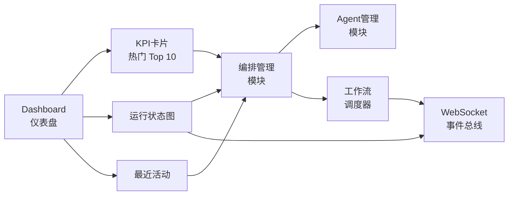
```mermaid
flowchart LR
    Dashboard[Dashboard<br/>仪表盘]
    Orch[KPI卡片<br/>热门 Top 10]
    Status[运行状态图]
    Activity[最近活动]
    Module[编排管理<br/>模块]
    Agent[Agent管理<br/>模块]
    Scheduler[工作流<br/>调度器]
    WS[WebSocket<br/>事件总线]

    Dashboard --> Orch
    Dashboard --> Status
    Dashboard --> Activity
    Orch --> Module
    Status --> Module
    Status --> WS
    Activity --> Module
    Module --> Agent
    Module --> Scheduler
    Scheduler --> WS
```

### 15.8 Chat 模式与 Prompt Builder 协作

Chat 模式上下文截断/摘要压缩遵循以下协作机制:

- 触发阈值: 32 轮截断, 80 轮 LLM 摘要压缩(基线参见 PRD-00 §5.7 Chat 模式上下文规范)
- 摘要压缩调用: 通过 PRD-10 提供的 GraphQL Mutation `compressConversation(conversationId, mode=SUMMARY)`(替代旧 `POST /api/v1/prompts/compress`)
- 失败降级: 保留最近 80 轮原文, 不阻塞当前对话

---

## 16. 模块关系总览

### 16.1 编排管理在五层架构中的位置

AI Multi-Agent System 基于五层架构体系构建，编排管理（Orchestration）位于**协同扩展层（Collaboration & Extension Layer）**，与 ACP（Agent Communication Protocol）共同构成多 Agent 协同与跨系统通信能力。

**五层架构全景**：

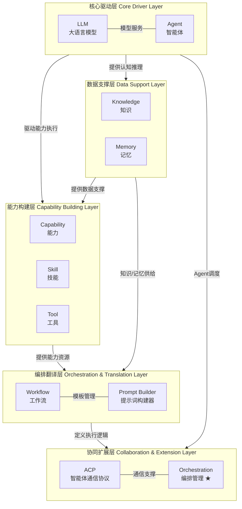
```mermaid
flowchart TB
    subgraph Layer5["协同扩展层 Collaboration & Extension Layer"]
        ACP["ACP<br/>智能体通信协议"]
        ORCH["Orchestration<br/>编排管理 ★"]
    end

    subgraph Layer4["编排翻译层 Orchestration & Translation Layer"]
        WF["Workflow<br/>工作流"]
        PB["Prompt Builder<br/>提示词构建器"]
    end

    subgraph Layer3["能力构建层 Capability Building Layer"]
        CAP["Capability<br/>能力"]
        SKILL["Skill<br/>技能"]
        TOOL["Tool<br/>工具"]
    end

    subgraph Layer2["数据支撑层 Data Support Layer"]
        KNOW["Knowledge<br/>知识"]
        MEM["Memory<br/>记忆"]
    end

    subgraph Layer1["核心驱动层 Core Driver Layer"]
        LLM["LLM<br/>大语言模型"]
        AGENT["Agent<br/>智能体"]
    end

    Layer1 -->|"提供认知推理"| Layer2
    Layer1 -->|"驱动能力执行"| Layer3
    Layer2 -->|"提供数据支撑"| Layer3
    Layer3 -->|"提供能力资源"| Layer4
    Layer4 -->|"定义执行逻辑"| Layer5
    Layer2 -->|"知识/记忆供给"| Layer4
    Layer1 -->|"Agent调度"| Layer5

    ACP ---|"通信支撑"| ORCH
    LLM ---|"模型服务"| AGENT
    WF ---|"模板管理"| PB
```

**层级定位说明**：

| 维度 | 说明 |
|------|------|
| 架构层 | 协同扩展层（Collaboration & Extension Layer） |
| 同层模块 | ACP（智能体通信协议） |
| 下层依赖 | 核心驱动层（Agent、LLM）、编排翻译层（Workflow）、能力构建层（Capability）、数据支撑层（Knowledge、Memory） |
| 核心职责 | 定义多 Agent 协作流程，调度 Agent 执行任务并通过 Workflow 控制执行逻辑 |
| 与 ACP 的关系 | ACP 提供 Agent 间通信标准，编排管理基于 ACP 实现 Agent 间的消息路由和事件订阅 |

### 16.2 与其他模块的关系

**关系1：协同扩展层内部 — Orchestration ↔ ACP**

| 维度 | 说明 |
|------|------|
| 方向 | Orchestration ↔ ACP |
| 类型 | 协同依赖 |
| 描述 | 编排管理基于 ACP（Agent Communication Protocol）实现 Agent 间的消息路由、事件订阅和远程调用。编排内的 Remote 类型 Agent 通过 ACP 与外部系统 Agent 通信 |
| 数据流 | 编排执行 → ACP 消息分发 → 远程 Agent → 结果回传 |
| 影响范围 | ACP 通信故障时，编排内的 Remote 类型 Agent 无法执行，影响跨系统协作场景 |

**关系2：协同扩展层 → 编排翻译层 — Orchestration → Workflow**

| 维度 | 说明 |
|------|------|
| 方向 | Orchestration → Workflow |
| 类型 | 调度依赖 |
| 描述 | 编排管理通过 Workflow 定义任务执行步骤，调用工作流引擎执行。编排工作流画布（步骤 2.1）和 Agent 内部工作流画布（步骤 4）均依赖 Workflow 模块 |
| 数据流 | 编排定义 → Workflow 实例化 → 节点执行 → 结果聚合 |
| 影响范围 | Workflow 模块故障时，编排的执行能力降级 |

**关系3：协同扩展层 → 核心驱动层 — Orchestration → Agent**

| 维度 | 说明 |
|------|------|
| 方向 | Orchestration → Agent |
| 类型 | 调度依赖 |
| 描述 | 编排管理调度 Agent 执行任务，编排内可包含 1-20 个 Agent 实例。Agent 通过 LLM 进行推理决策，编排负责任务分配和结果聚合 |
| 数据流 | 编排调度 → Agent 选择 → LLM 推理 → 结果返回 → 流程推进 |
| 影响范围 | Agent 下线或配置变更时需评估对编排流程的影响 |

**关系4：协同扩展层 → 能力构建层 — Orchestration → Capability**

| 维度 | 说明 |
|------|------|
| 方向 | Orchestration → Capability |
| 类型 | 资源依赖 |
| 描述 | 编排内的 Agent 通过 Capability 调用 MCP 工具、API 接口等能力资源。编排工作流画布提供"新建 MCP Server"快捷入口，配置完成后工具自动加载到当前编排 |
| 数据流 | Agent 节点 → Capability 调用 → MCP Server → 结果返回 |
| 影响范围 | Capability 不可用时，编排内依赖该能力的 Agent 节点执行失败 |

**模块依赖矩阵（编排管理相关）**：

```
                Orch   Agent  Workflow  ACP  LLM  Capability  Knowledge  Memory  Permission  Monitoring
Orchestration    -      R      R        R    R       R           -         -         R            R
```

> R = Read（读取依赖）

**编排管理核心依赖关系图**：

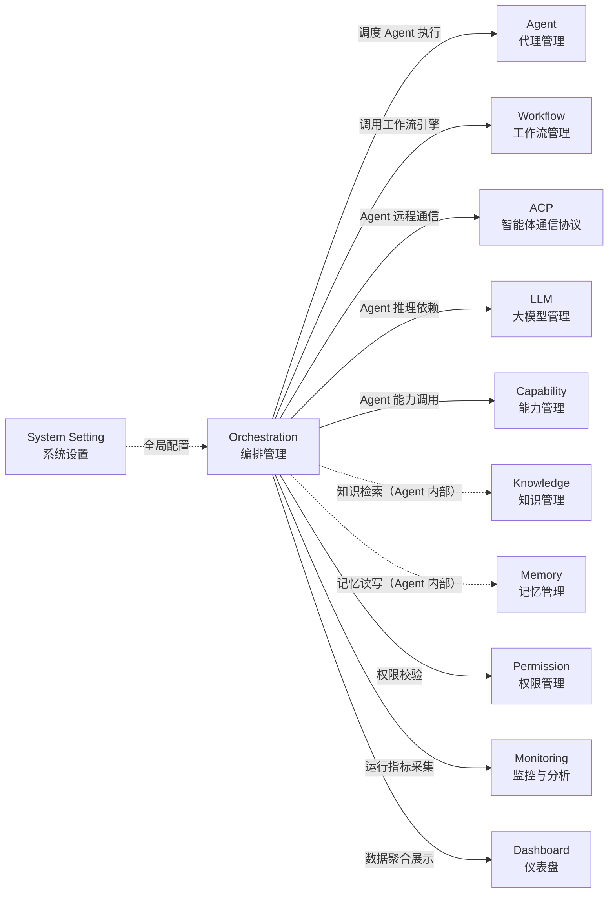
```mermaid
flowchart LR
    ORCH[Orchestration<br/>编排管理]

    AGENT[Agent<br/>代理管理]
    WF[Workflow<br/>工作流管理]
    ACP[ACP<br/>智能体通信协议]
    LLM[LLM<br/>大模型管理]
    CAP[Capability<br/>能力管理]
    KNOW[Knowledge<br/>知识管理]
    MEM[Memory<br/>记忆管理]
    PERM[Permission<br/>权限管理]
    MON[Monitoring<br/>监控与分析]
    DASH[Dashboard<br/>仪表盘]
    SET[System Setting<br/>系统设置]

    ORCH -->|"调度 Agent 执行"| AGENT
    ORCH -->|"调用工作流引擎"| WF
    ORCH -->|"Agent 远程通信"| ACP
    ORCH -->|"Agent 推理依赖"| LLM
    ORCH -->|"Agent 能力调用"| CAP
    ORCH -.->|"知识检索（Agent 内部）"| KNOW
    ORCH -.->|"记忆读写（Agent 内部）"| MEM
    ORCH -->|"权限校验"| PERM
    ORCH -->|"运行指标采集"| MON
    ORCH -->|"数据聚合展示"| DASH
    SET -.->|"全局配置"| ORCH
```

**数据流转关键路径**：

| 路径 | 描述 |
|------|------|
| 编排执行 | 用户触发 → 编排调度器 → Workflow 引擎 → Agent 节点 → Capability 调用 → LLM 推理 → 结果聚合 → 用户响应 |
| 状态监控 | 编排执行 → 状态变更事件 → 事件总线 → WebSocket 推送 → Dashboard 实时更新 |
| 跨系统协作 | 编排调度 → ACP 消息分发 → 远程 Agent（外部系统）→ 结果回传 → 编排聚合 |
| 配置热更新 | System Setting 变更 → 配置中心推送 → 编排模块监听 → 热更新生效 |
| **统一监控上报** | **编排执行 → 指标/Trace/日志 → [PRD-11 监控与分析](PRD-11-监控与分析.md) §4.3/§4.4/§4.5 → 业务监控大盘** |

---

## 17. 非功能需求汇总

本章汇总编排管理模块在性能、安全、可用性、兼容性和可观测性方面的非功能需求，作为模块质量保障的统一基线。

### 17.1 性能需求

| 需求编号 | 需求项 | 指标 | 验证方法 |
|----------|--------|------|----------|
| NFR-P-ORC-001 | 编排列表页面加载时间 | ≤ 2 秒（首屏渲染完成，数据量 ≤ 100 条时） | Lighthouse 性能测试 |
| NFR-P-ORC-002 | 编排列表搜索响应时间 | ≤ 500 ms（结果返回 P95） | 接口性能测试 |
| NFR-P-ORC-003 | 工作流画布操作响应时间 | 节点拖拽延迟 ≤ 100 ms，缩放/平移帧率 ≥ 30 fps | 前端性能监控 |
| NFR-P-ORC-004 | 编排创建保存时间 | 步骤 1 基本信息保存 ≤ 1 秒，完整编排保存 ≤ 3 秒 | 接口性能测试 |
| NFR-P-ORC-005 | 编排复制操作时间 | ≤ 3 秒（节点数 ≤ 30 时） | 接口性能测试 |
| NFR-P-ORC-006 | 代码预览渲染时间 | ≤ 1 秒（JSON/YAML 切换后） | 前端性能监控 |
| NFR-P-ORC-007 | 客户端预览加载时间 | ≤ 2 秒（预览面板渲染） | 前端性能监控 |
| NFR-P-ORC-008 | Convert to Workflow 转换时间 | AI 分析 + 工作流生成 ≤ 15 秒 | 接口性能测试 |
| NFR-P-ORC-009 | A2A 能力列表获取时间 | ≤ Handshake Timeout 配置值 | 接口性能测试 |
| NFR-P-ORC-010 | 编排并发执行吞吐量 | 单编排并发执行数 ≥ 10，系统总并发执行数 ≥ 100 | 压力测试 |
| NFR-P-ORC-011 | 编排 KPI 接口响应时间 | ≤ 500 ms（P95） | APM 性能监控 |
| NFR-P-ORC-012 | 热门 Orchestration Top 10 接口响应时间 | ≤ 1 秒（P95，10 万条任务日志） | 接口性能测试 |
| NFR-P-ORC-013 | 编排状态 WebSocket 消息延迟 | ≤ 100 ms（服务端到客户端） | 实时通信测试 |
| NFR-P-ORC-014 | 仪表盘编排数据刷新时间 | KPI 30 秒/图表 5 分钟/运行中编排 10 秒 | 定时器监控 |
| NFR-P-ORC-015 | 全局搜索编排响应时间 | ≤ 500 ms（返回前 20 条结果） | 搜索性能测试 |

### 17.2 安全需求

| 需求编号 | 需求项 | 指标 | 验证方法 |
|----------|--------|------|----------|
| NFR-S-ORC-001 | 身份认证 | 所有 API 请求需携带有效 Token,未认证由网关层返回 401(GraphQL 协议级错误) | 安全测试 |
| NFR-S-ORC-002 | 权限控制 | 按权限矩阵控制功能访问,越权操作由业务层返回 055306 ~ 055309 业务错误码(业务层 HTTP 200) | 渗透测试 |
| NFR-S-ORC-003 | 数据隔离 | 不同 Merchant 的编排数据严格隔离 | 渗透测试 |
| NFR-S-ORC-004 | AppKey 加密存储 | A2A 配置中的 AppKey 使用 AES-256 加密存储，展示时脱敏（仅显示前 4 位和后 4 位） | 代码审查 + 数据库检查 |
| NFR-S-ORC-005 | 分享链接安全 | 分享链接包含只读 Token，默认有效期 7 天，支持手动撤销 | 安全测试 |
| NFR-S-ORC-006 | 操作审计 | 编排创建、修改、删除、发布、归档操作记录审计日志，包含操作人、操作时间、操作内容 | 功能测试 |
| NFR-S-ORC-007 | A2A 通信加密 | 跨系统通信强制使用 HTTPS / TLS 1.2+ | SSL Labs 测试 |
| NFR-S-ORC-008 | SQL 注入防护 | 所有数据库查询使用参数化查询 | 渗透测试 |
| NFR-S-ORC-009 | XSS 防护 | 编排名称、描述、任务描述等文本字段输出时进行 HTML 转义 | 渗透测试 |
| NFR-S-ORC-010 | CSRF 防护 | 所有写操作接口启用 CSRF Token 校验 | 渗透测试 |
| NFR-S-ORC-011 | 接口限流 | 单租户 100 QPS,超出由网关层返回 HTTP 200 + 业务错误码 055429（限流触发）(GraphQL `errors[]` 携带 `THROTTLED`) | 压力测试 |
| NFR-S-ORC-012 | WebSocket 鉴权 | 未认证连接拒绝，权限变更后自动断开 | 安全测试 |
| NFR-S-ORC-013 | 软删除不可逆追溯 | 30 天物理删除前编排数据可审计、可恢复 | 审计日志审查 |
| NFR-S-ORC-014 | Dashboard 数据权限 | 编排管理 KPI 卡片按用户角色过滤数据范围 | 功能测试 |

### 17.3 可用性需求

| 需求编号 | 需求项 | 指标 | 验证方法 |
|----------|--------|------|----------|
| NFR-A-ORC-001 | 编排管理模块可用性 | ≥ 99.9%（月度） | 监控报表 |
| NFR-A-ORC-002 | 创建向导引导 | 步骤进度条清晰展示当前步骤（1/2/3/4），已完成步骤可回退编辑 | 功能测试 |
| NFR-A-ORC-003 | 必填字段标识 | 所有必填字段使用红色星号（*）标识 | 视觉走查 |
| NFR-A-ORC-004 | 操作反馈及时性 | 所有用户操作在 2 秒内给出反馈（成功/失败/加载中） | 功能测试 |
| NFR-A-ORC-005 | 错误提示友好性 | 错误提示包含问题描述和解决建议，不展示技术异常堆栈 | 视觉走查 |
| NFR-A-ORC-006 | 画布操作一致性 | 编排工作流画布和 Agent 内部工作流画布采用相同的交互设计 | 视觉走查 |
| NFR-A-ORC-007 | 键盘快捷键 | 工作流画布支持 Ctrl+Z 撤销、Ctrl+Y 重做、Delete 删除选中节点 | 功能测试 |
| NFR-A-ORC-008 | 软删除恢复 | 编排删除后 30 天内可撤销删除，恢复编排和 Agent 配置 | 功能测试 |
| NFR-A-ORC-009 | 预览环境隔离 | 预览操作不影响生产环境数据，使用独立沙箱 | 功能测试 |
| NFR-A-ORC-010 | 工作流自动保存 | 画布操作每 30 秒自动保存一次，异常退出后可恢复 | 功能测试 |
| NFR-A-ORC-011 | WebSocket 断线重连 | 指数退避（1s/2s/4s/8s/16s），最大 5 次，重连失败后降级为 HTTP 轮询（30 秒间隔） | 故障注入测试 |
| NFR-A-ORC-012 | 仪表盘编排降级 | 编排 KPI 接口故障时显示"数据加载失败"，其他模块 KPI 不受影响 | 故障注入测试 |
| NFR-A-ORC-013 | 工作流执行容错 | 单个 Agent 节点失败不影响其他节点的执行状态记录 | 功能测试 |
| NFR-A-ORC-014 | 无障碍访问 | 支持 WCAG 2.1 AA 级别，包含键盘导航和屏幕阅读器支持 | 无障碍测试 |

### 17.4 兼容性需求

| 需求编号 | 需求项 | 指标 | 验证方法 |
|----------|--------|------|----------|
| NFR-C-ORC-001 | 浏览器兼容 | Chrome 90+、Firefox 88+、Safari 14+、Edge 90+ | 多浏览器测试 |
| NFR-C-ORC-002 | 客户端类型兼容 | 预览支持 Web、Mobile、API 三种客户端类型 | 功能测试 |
| NFR-C-ORC-003 | 数据格式兼容 | 代码预览支持 JSON 和 YAML 两种格式，支持双向无损转换 | 功能测试 |
| NFR-C-ORC-004 | A2A 协议版本兼容 | 支持多版本 A2A 协议并行，通过 Protocol Version 字段区分 | 集成测试 |
| NFR-C-ORC-005 | 编排场景类型可扩展 | Type 字段支持扩展新场景类型，无需修改前端代码 | 架构评审 |
| NFR-C-ORC-006 | Agent 节点类型可扩展 | 代理节点区域支持注册新的 Agent 类型 | 架构评审 |
| NFR-C-ORC-007 | MCP Server 可扩展 | 支持动态注册新的 MCP Server，工具自动加载 | 功能测试 |
| NFR-C-ORC-008 | API 向后兼容 | API 版本升级时，旧版本至少保留 6 个月兼容期 | 版本管理检查 |
| NFR-C-ORC-009 | 移动端适配 | iOS Safari 14+、Android Chrome 90+（仅查看功能） | 移动端测试 |
| NFR-C-ORC-010 | 屏幕分辨率适配 | ≥ 1280px 桌面端完整布局，768px~1279px 平板适配，< 768px 移动端单列布局 | 响应式测试 |

### 17.5 可观测性需求

| 需求编号 | 需求项 | 指标 | 验证方法 |
|----------|--------|------|----------|
| NFR-O-ORC-001 | 分布式追踪 | 所有 API 请求支持分布式链路追踪（traceId 贯穿） | 链路追踪验证 |
| NFR-O-ORC-002 | 指标监控 | 编排服务暴露 Prometheus 指标接口（/metrics），包含执行次数、成功率、耗时分布 | 监控系统验证 |
| NFR-O-ORC-003 | 健康检查 | 编排服务提供健康检查接口（/health） | 健康检查验证 |
| NFR-O-ORC-004 | 告警规则 | 编排执行失败率超过 10% 或平均耗时超过 600 秒时，5 分钟内触发告警 | 告警测试 |
| NFR-O-ORC-005 | 日志规范 | 统一 JSON 日志格式，包含 traceId、orchestration_id、workflow_id、agent_id 用于关联查询 | 日志审查 |
| NFR-O-ORC-006 | 审计日志 | 编排生命周期事件（创建、修改、删除、发布、归档、执行）记录审计日志，不可篡改 | 审计日志验证 |
| NFR-O-ORC-007 | 业务埋点 | 编排关键操作（创建、执行、预览、分享）埋点上报，支持用户行为分析 | 数据分析验证 |
| NFR-O-ORC-008 | 实时状态推送 | 编排状态变更通过 WebSocket 实时推送至订阅客户端 | 实时通信测试 |
| NFR-O-ORC-009 | Dashboard 数据链路 | 编排 KPI 数据从采集到 Dashboard 展示的端到端延迟 ≤ 30 秒 | 链路追踪验证 |
| NFR-O-ORC-010 | 错误聚合 | 编排执行错误按类型聚合展示（连接错误、超时错误、参数错误等） | 监控报表验证 |

**编排管理可观测性架构图**：

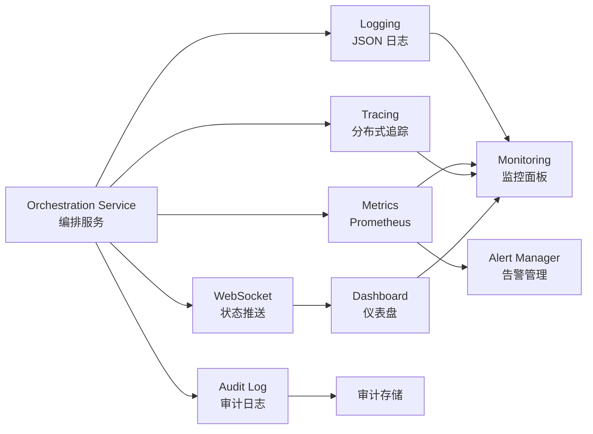
```mermaid
flowchart LR
    ORCH[Orchestration Service<br/>编排服务]
    LOG[Logging<br/>JSON 日志]
    METRICS[Metrics<br/>Prometheus]
    TRACE[Tracing<br/>分布式追踪]
    AUDIT[Audit Log<br/>审计日志]
    WS[WebSocket<br/>状态推送]
    DASH[Dashboard<br/>仪表盘]
    ALERT[Alert Manager<br/>告警管理]
    MON[Monitoring<br/>监控面板]

    ORCH --> LOG
    ORCH --> METRICS
    ORCH --> TRACE
    ORCH --> AUDIT
    ORCH --> WS
    LOG --> MON
    METRICS --> MON
    METRICS --> ALERT
    TRACE --> MON
    AUDIT --> AUDIT_LOG[审计存储]
    WS --> DASH
    DASH --> MON
```

---

## 18. 接口规范汇总

本章汇总编排管理模块遵循的统一接口规范，确保 API 设计的一致性，便于前端适配和跨模块集成。

### 18.1 接口规范(GraphQL 统一)

> **权威说明**: 编排管理模块对外接口**统一采用 GraphQL**(POST `/graphql`),遵循 [PRD-00 §4 GraphQL 全局规范](../PRD-00-平台总览与全局规范.md) 与 [§A5 GraphQL Schema 映射](#a5-graphql-schema-映射)。本节不再单独定义 RESTful 资源,所有查询(Query)/变更(Mutation)/订阅(Subscription) 详见 §A5.1 ~ §A5.3。**业务层统一返回 HTTP 200 + 业务错误码**(见 §18.2),GraphQL `errors[]` 仅承载协议级异常。

| 规范项 | 说明 | 参考 |
|--------|------|------|
| 协议 | GraphQL over HTTP(S),WebSocket(用于 Subscription/AG-UI 实时推送) | PRD-00 §4 |
| 端点 | `POST /graphql`(查询/变更) / `WS /graphql`(订阅) | §A5 |
| 鉴权 | `Authorization: Bearer {JWT}`,Header 透传 | PRD-00 §9 |
| 分页 | Relay Connection(`first` / `after` / `last` / `before` / `cursor` / `pageInfo` / `totalCount`) | §18.4 / §A5 |
| 错误码 | 业务错误码 6 位 `055001-055999`,HTTP 状态码统一 200 | §18.2 / §31 |
| 链路追踪 | 响应 `extensions.traceId` 与 HTTP Header `X-Trace-Id` | §20 |
| 幂等 | 所有 Mutation 接受 `idempotencyKey: ID!` | §A5.2 |
| 限流 | 单租户 100 QPS,超出由网关层返回 HTTP 200 + 业务错误码 055429（限流触发） | §18.4 |

**编排管理 GraphQL 操作入口**(详见 §A5):

- Query: `workflow` / `workflows` / `workflowVersion` / `node` / `execution` / `executions` / `nodeExecutions` / `a2aMessages` / `schedules` / `workflowGraph` / `executionTrace`
- Mutation: `createWorkflow` / `updateWorkflow` / `deleteWorkflow` / `publishWorkflowVersion` / `rollbackWorkflowVersion` / `createNode` / `updateNode` / `deleteNode` / `connectNodes` / `disconnectNodes` / `executeWorkflow` / `resumeExecution` / `cancelExecution` / `retryNodeExecution` / `sendA2aMessage` / `replyA2aMessage` / `createSchedule` / `updateSchedule` / `deleteSchedule` / `pauseSchedule` / `resumeSchedule`
- Subscription: `orchestrationEvents`(AG-UI 16 类事件,见 §21.2)

> **历史收敛**: 原 §18.1 RESTful 资源层级(`/orchestrations`、`/orchestrations/{id}/agents` 等)与 §28 RESTful API 清单已统一收敛至 §A5 GraphQL Schema,本版本起不再维护 RESTful 资源路径。

### 18.2 错误码体系

> **命名空间统一说明**: 本节错误码命名空间已统一为 `BIZ_ORCHESTRATION_*` + 数字段位 05xxxx(6 位 `055001-055999`),与 PRD-00 §5.3.2 权威表及 §31 保持一致。原 `BIZ_INTERNAL_*` + 09xxxx 方案已废弃。

编排管理模块错误码采用 6 位数字编码,数字段位统一为 **055001-055999**(与 PRD-00 §5.3.2 平台级段位分配对齐),结构为 `{模块2位}{类型1位}{子类1位}{序号2位}`。**业务层统一返回 HTTP 200 + 业务错误码**(遵循 PRD-00 §4 GraphQL 全局规范)。

**055001-055999 段位细分映射**:

| 段位 | 子领域 |
|------|--------|
| 0551xx | 配置(Configuration) |
| 0552xx | 节点(Node) |
| 0553xx | 编排(Orchestration) |
| 0554xx | 执行(Execution) |
| 0555xx | MCP 集成 |
| 0556xx | ACP 协议 |

**编排模块错误码空间**:

| 范围 | 说明 |
|------|------|
| 055001 ~ 055099 | 编排模块通用错误 |
| 055100 ~ 055199 | 编排模块配置错误(0551xx) |
| 055200 ~ 055299 | 编排模块节点错误(0552xx) |
| 055300 ~ 055399 | 编排模块业务规则/编排级错误(0553xx) |
| 055400 ~ 055499 | 编排模块执行错误(0554xx) |
| 055500 ~ 055599 | 编排模块 MCP 错误(0555xx) |
| 055600 ~ 055699 | 编排模块 ACP 协议错误(0556xx) |
| 055999 | 编排模块系统内部错误 |
| **05xxxx** | **编排模块命名空间(`BIZ_ORCHESTRATION_*`),与 §31 权威分配表一致** |

**编排模块常用错误码**(业务层统一返回 HTTP 200 + 业务错误码;HTTP 状态码仅用于网关层网络异常):

| 错误码 | 说明 | HTTP 状态码 |
|--------|------|-------------|
| 055001 | 编排模块未知错误 | 200 |
| 055099 | 编排模块系统内部错误 | 200 |
| 055101 | 编排名称不能为空 | 200 |
| 055102 | 编排类型不合法 | 200 |
| 055103 | 编排描述超过最大长度(500 字符) | 200 |
| 055104 | 工作流节点数超出上限(30 个) | 200 |
| 055105 | Agent 数量超出上限(20 个) | 200 |
| 055106 | Call Address 必须以 http:// 或 https:// 开头 | 200 |
| 055107 | Handshake Timeout 超出范围(1-60 秒) | 200 |
| 055108 | 任务描述长度不足(最小 10 字符) | 200 |
| 055201 | Agent 节点缺少 `agent_id` / `input_mapping` | 200 |
| 055202 | Tool 节点缺少 `mcp_server_id` / `tool_name` | 200 |
| 055203 | LLM 节点缺少 `model_id` / `prompt_template_id` | 200 |
| 055204 | 节点超时 | 200 |
| 055205 | Batch 节点并行 Agent 数超出上限(10 个) | 200 |
| 055206 | Loop 节点循环次数超出上限(100 次) | 200 |
| 055207 | Loop 节点缺少 `loop_condition` 表达式 | 200 |
| 055208 | 并行节点超过 16 路并发 | 200 |
| 055209 | 跨租户 Execution 访问 | 200 |
| 055210 | Agent 节点 QPS 超限(> 100 QPS/Agent) | 200 |
| 055301 | 编排名称已存在 | 200 |
| 055302 | 编排图存在循环依赖(非 DAG) | 200 |
| 055303 | Branch 节点至少需要两个输出分支 | 200 |
| 055304 | 编排 Schema 非法 | 200 |
| 055305 | 编排导入格式不支持 | 200 |
| 055306 | 无权限访问编排管理模块 | 200 |
| 055307 | 无权限编辑该编排 | 200 |
| 055308 | 无权限删除该编排 | 200 |
| 055309 | 无权限发布/归档该编排 | 200 |
| 055401 | 编排不存在 | 200 |
| 055402 | 工作流/节点不存在 | 200 |
| 055403 | Agent 不存在 | 200 |
| 055404 | A2A 远程 Agent 不存在 | 200 |
| 055405 | 编排版本不存在 | 200 |
| 055406 | 编排正在执行任务,无法删除 | 200 |
| 055407 | 编排状态不允许当前操作 | 200 |
| 055408 | 编排草稿状态不支持分享 | 200 |
| 055409 | 工作流校验未通过 | 200 |
| 055410 | 编排执行不存在 | 200 |
| 055411 | 编排执行已结束 | 200 |
| 055412 | 编排执行超时 | 200 |
| 055413 | 编排执行被取消 | 200(带 cancelled 标记) |
| 055414 | 编排节点重试耗尽 | 200 |
| 055415 | 编排断点恢复失败 | 200 |
| 055416 | 资源池隔离冲突 | 200 |
| 055501 | MCP Server Unhealthy | 200 |
| 055502 | MCP Tool 调用超时 | 200 |
| 055503 | MCP Tool 限流 | 200 |
| 055504 | MCP 工具已弃用 | 200 |
| 055505 | MCP 调用链路中断 | 200 |
| 055601 | ACP 签名缺失或不匹配 | 200 |
| 055602 | ACP Session Token 过期 | 200 |
| 055603 | ACP 时钟偏移超限 | 200 |
| 055604 | ACP Nonce 重复 | 200 |
| 055605 | ACP 协议版本不支持 | 200 |
| 055701 | 远程 Agent 连接失败 | 200 |
| 055702 | 远程 Agent 响应超时 | 200 |
| 055703 | A2A 能力列表获取失败 | 200 |
| 055704 | AI 分析引擎调用失败 | 200 |

**跨模块错误码段位(BIZ_ORCHESTRATION_* 命名空间)**:

> 遵循 [PRD-00 §5.3.2 平台级段位分配](../PRD-00-平台总览与全局规范.md):跨模块错误码使用统一命名空间 `BIZ_ORCHESTRATION_*`,数字段位 6 位 `055001-055999`,与各业务模块的 05xxxx 段位协同。

编排管理模块在跨模块联动时(如编排引用已删除的 Agent、引用已删除的知识库、调用外部 LLM/MCP 失败等)使用 `BIZ_ORCHESTRATION_*` 段位错误码,确保跨模块错误能够被统一识别和诊断;与本模块业务错误码(6 位数字段位)统一在同一命名空间下。**业务层统一返回 HTTP 200 + 业务错误码**。

| 错误码 | 说明 | HTTP 状态码 | 触发场景 |
|--------|------|-------------|----------|
| 055001 | 跨模块未知错误 | 200 | 跨模块调用未预期的系统级错误 |
| 055099 | 跨模块系统内部错误 | 200 | 跨模块系统级兜底错误 |
| 055101 | 编排引用的 Agent 已被删除 | 200 | 编排引用的 Agent 软删除标记为 true |
| 055102 | 编排引用的 Agent 已被禁用 | 200 | 编排引用的 Agent 状态为 Inactive |
| 055103 | 编排引用的知识库已被删除 | 200 | 编排引用的 Knowledge 软删除标记为 true |
| 055104 | 编排引用的工具(MCP Tool)已被删除 | 200 | MCP 工具不可用 |
| 055105 | 编排引用的 LLM 模型已被禁用 | 200 | LLM 模型状态为 Inactive |
| 055106 | 编排引用的工作流已被删除 | 200 | Workflow 软删除标记为 true |
| 055201 | 跨租户引用禁止 | 200 | 编排尝试引用其他租户的资源 |
| 055202 | Agent 与编排租户不一致 | 200 | 编排与被引用 Agent 的 partition_key 不一致 |
| 055501 | 跨模块事务回滚 | 200 | Saga/Outbox 补偿失败,事务回滚 |
| 055502 | 跨模块事务部分失败 | 200 | 编排保存时部分子模块提交成功部分失败 |

> **v5 收束说明(2026-06-13)**:原表将跨模块错误码直接占用 PRD-02 段位(`052001-052106`)及未授权段位(`059201/059202/059501/059502`),违反 PRD-00 §5.3.2.1 段位分配表。已回收至 PRD-05 自身段位 `055001-055999`。

**类型编码说明**：

| 类型编码 | 类型名称 |
|----------|----------|
| 00 | 通用错误 |
| 01 | 参数校验错误 |
| 02 | 业务规则错误 |
| 03 | 权限错误 |
| 04 | 资源不存在 |
| 05 | 状态冲突 |
| 06 | 外部服务错误 |
| 99 | 系统内部错误 |

### 18.3 响应格式

编排管理模块所有 API 遵循统一响应格式：

> **v5 收束说明(2026-06-13)**：所有编排管理接口响应遵循 GraphQL 标准信封 `{data, errors, extensions.traceId}`，**不**再使用 `{code, message, data, timestamp, traceId}` 旧式信封。业务错误码位于 `errors[].extensions.code`，traceId 位于 `extensions.traceId`。

**成功响应**：

```json
{
  "data": {
    "workflow": {
      "id": "orch_abc123",
      "name": "电商订单处理编排",
      "status": "Published",
      "mode": "Coordination",
      "createdAt": "2026-06-08T10:30:00Z"
    }
  },
  "errors": null,
  "extensions": {
    "traceId": "5f9c0a7e-2a3b-4d12-b6c1-1f8e2b1a6f0d"
  }
}
```

**分页响应(Relay Connection)**：

> **P1-025 收束说明(2026-06-13)**：Relay Connection 直接作为 GraphQL 顶层 query 字段的返回类型（`data.<listFieldName>.edges/pageInfo/totalCount`），分页响应**示例**仅展示 Relay Connection 自身结构（无 `data` 包装层）。**完整响应**仍遵循 PRD-00 §4 GraphQL 全局规范 `{data, errors, extensions.traceId}` 信封格式。

```json
{
  "edges": [
    {
      "cursor": "eyJpZCI6Im9yY2hfMDAxIn0=",
      "node": {
        "id": "orch_001",
        "name": "客户咨询处理流程",
        "status": "Published"
      }
    }
  ],
  "pageInfo": {
    "hasNextPage": true,
    "hasPreviousPage": false,
    "startCursor": "eyJpZCI6Im9yY2hfMDAxIn0=",
    "endCursor": "eyJpZCI6Im9yY2hfMDIwIn0="
  },
  "totalCount": 156
}
```

> **P1-014 收束说明(2026-06-13)**：分页响应**仅**保留 Relay Connection（`edges` / `pageInfo` / `totalCount`），删除原 `items` 数组形态。

**错误响应**：

```json
{
  "data": null,
  "errors": [
    {
      "message": "该编排名称已存在，请使用其他名称",
      "path": ["createWorkflow", "input", "name"],
      "extensions": {
        "code": "BIZ_ORCHESTRATION_NAME_DUPLICATED",
        "field": "name",
        "traceId": "5f9c0a7e-2a3b-4d12-b6c1-1f8e2b1a6f0d"
      }
    }
  ],
  "extensions": {
    "traceId": "5f9c0a7e-2a3b-4d12-b6c1-1f8e2b1a6f0d"
  }
}
```

**编排取消操作响应示例**：

```json
{
  "data": {
    "cancelExecution": {
      "id": "orch_abc123",
      "previousStatus": "Running",
      "currentStatus": "Cancelled",
      "cancelledAt": "2026-06-08T10:35:00Z"
    }
  },
  "errors": null,
  "extensions": {
    "traceId": "5f9c0a7e-2a3b-4d12-b6c1-1f8e2b1a6f0d"
  }
}
```

### 18.4 分页规范

编排管理模块所有列表查询接口遵循 Relay Connection 规范(对齐 PRD-00 §4.4 与 GraphQL 全局规范),与 §A4.1 GraphQL Schema 保持一致。

**请求参数(Relay Connection)**:

| 参数名 | 类型 | 默认值 | 说明 |
|--------|------|--------|------|
| first | Integer | 20 | 向前(从头到尾)分页时,返回前 N 条记录;N 可选值:10/20/50/100 |
| after | String | - | 翻页游标,配合 `first` 使用,传上一页 `pageInfo.endCursor` |
| last | Integer | - | 向后(从尾到头)分页时,返回后 N 条记录;与 `before` 配对使用 |
| before | String | - | 反向翻页游标,配合 `last` 使用,传上一页 `pageInfo.startCursor` |
| sort | String | createdAt:desc | 排序字段:排序方向,支持多字段排序(逗号分隔) |
| search | String | - | 全文搜索关键词 |
| filter | String | - | 过滤条件(JSON 序列化后 Base64 编码,见 PRD-00 §4.4) |

**分页响应结构(Relay Connection)**:

> **P1-025 收束说明(2026-06-13)**：Relay Connection 直接作为 GraphQL 顶层 query 字段的返回类型（`data.<listFieldName>.edges/pageInfo/totalCount`），分页响应**示例**仅展示 Relay Connection 自身结构（无 `data` 包装层）。**完整响应**仍遵循 PRD-00 §4 GraphQL 全局规范 `{data, errors, extensions.traceId}` 信封格式。

```json
{
  "edges": [
    {
      "cursor": "eyJpZCI6Im9yY2hfMDAxIn0=",
      "node": {
        "orchestration_id": "orch_001"
      }
    }
  ],
  "pageInfo": {
    "hasNextPage": true,
    "hasPreviousPage": false,
    "startCursor": "eyJpZCI6Im9yY2hfMDAxIn0=",
    "endCursor": "eyJpZCI6Im9yY2hfMDIwIn0="
  },
  "totalCount": 100
}
```

**编排管理分页接口约定(Relay Connection)**:

| 接口 | 默认 first | 最大 first | 排序字段 |
|------|------------|------------|----------|
| 编排列表 | 20 | 100 | createdAt / updatedAt / name |
| 编排内 Agent 列表 | 20 | 50 | createdAt / name |
| 编排执行历史 | 20 | 100 | startedAt / finishedAt |
| 编排版本历史 | 20 | 50 | createdAt |
| 编排活动列表 | 20 | 50 | createdAt |
| 热门编排 Top 10 | 10 | 10 | runCount:desc |

**编排列表请求示例(GraphQL Relay Connection)**:

```http
POST /graphql
Content-Type: application/json
Authorization: Bearer {JWT}

{
  "query": "query ListOrchestrations($first: Int, $after: String, $status: OrchestrationStatus) { workflows(first: $first, after: $after, filter: { status: $status }, sort: UPDATED_AT_DESC) { edges { cursor node { id name status mode updatedAt } } pageInfo { hasNextPage endCursor } totalCount } }",
  "variables": { "first": 20, "after": "eyJpZCI6Im9yY2hfMDIwIn0=", "status": "Published" }
}
```

**编排列表响应示例(Relay Connection)**:

```json
{
  "code": 200,
  "message": "success",
  "data": {
    "edges": [
      {
        "cursor": "eyJpZCI6Im9yY2hfMDAxIn0=",
        "node": {
          "orchestration_id": "orch_001",
          "name": "电商订单处理编排",
          "type": "E-commerce",
          "status": "Published",
          "mode": "Coordination",
          "agent_count": 5,
          "description": "协调物流、库存、价格和订单四个Agent的电商订单处理流程",
          "updated_at": "2026-06-08T10:30:00Z"
        }
      }
    ],
    "pageInfo": {
      "hasNextPage": true,
      "hasPreviousPage": false,
      "startCursor": "eyJpZCI6Im9yY2hfMDAxIn0=",
      "endCursor": "eyJpZCI6Im9yY2hfMDIwIn0="
    },
    "totalCount": 56
  },
  "timestamp": 1749385800000,
  "traceId": "trace-abc123-def456"
}
```

**接口鉴权与限流**：

| 规范项 | 说明 |
|--------|------|
| 端点 | GraphQL `POST /graphql`(查询/变更)/ `WS /graphql`(订阅) |
| 认证方式 | Bearer Token（JWT），请求头格式：`Authorization: Bearer {token}` |
| Token 刷新 | Access Token 过期后，使用 Refresh Token 获取新 Token |
| 认证失败 | 网关层返回 401 状态码(GraphQL 协议级错误) |
| 权限不足 | 业务层返回 200 + 业务错误码 `055306` ~ `055309`(见 §18.2) |
| 限流 | 单租户 100 QPS，超出由网关层返回 HTTP 200 + 业务错误码 055429（限流触发）(GraphQL `errors[]` 携带 `THROTTLED`) |

**接口验收标准**：

| 编号 | 验收标准 | 验证方法 |
|------|----------|----------|
| AC-API-ORC-01 | 编排管理所有 API 遵循 GraphQL 统一规范(POST `/graphql`) | GraphQL Schema 审查 |
| AC-API-ORC-02 | 所有操作通过 §A5 列出的 Query / Mutation / Subscription 入口 | Schema 审查 |
| AC-API-ORC-03 | 所有 API 响应格式符合统一规范（成功/分页/错误） | 接口自动化测试 |
| AC-API-ORC-04 | 错误码体系正确使用(`BIZ_ORCHESTRATION_*` 命名空间 + 6 位 `055001-055999` 段位,业务层统一 HTTP 200) | 接口测试 |
| AC-API-ORC-05 | 分页接口遵循 Relay Connection 规范(first/after/last/before/cursor/pageInfo/totalCount) | 接口测试 |
| AC-API-ORC-06 | 所有 Mutation 接受 `idempotencyKey: ID!` 实现幂等 | 接口测试 |
| AC-API-ORC-07 | 接口限流 100 QPS/租户，超出由网关层返回 HTTP 200 + 业务错误码 055429（限流触发） | 压力测试 |
| AC-API-ORC-08 | 所有响应包含 traceId(GraphQL `extensions.traceId` / HTTP `X-Trace-Id`)用于链路追踪 | 链路追踪验证 |

---

## 19. 跨模块事务一致性

本章定义编排管理模块在跨模块联动时的事务一致性约束，避免因 Agent / Knowledge / Tool / LLM / Workflow 等子模块的删除、禁用或状态变更导致编排处于"悬挂引用"状态。

### 19.1 事务一致性原则

| 原则编号 | 原则名称 | 原则描述 |
|----------|----------|----------|
| TX-ORC-001 | 强引用外键 | 编排(Orchestration)与 Agent、Workflow、Knowledge、MCP Tool、LLM Model 之间建立强引用外键(`ON DELETE RESTRICT`),被引用的资源不可被物理删除,仅可软删除 |
| TX-ORC-002 | 软删除传播 | 当被引用的资源(Agent、Knowledge、MCP Tool)被软删除时,编排自动将该引用标记为"已失效",并在保存时拒绝发布 |
| TX-ORC-003 | 状态联动校验 | 编排发布(Published)前必须校验所有引用的 Agent / Knowledge / Tool / LLM 状态均为 Active,否则返回 055101~055106 业务错误码(业务层 HTTP 200) |
| TX-ORC-004 | 跨模块事务模式 | 编排保存涉及多个子模块时采用 Saga 模式(含补偿事务)或 Outbox 模式,任一子事务失败触发补偿回滚 |
| TX-ORC-005 | 租户一致性 | 编排与被引用的所有资源必须属于同一 partition_key,跨租户引用返回 055201(业务层 HTTP 200) |

### 19.2 悬挂引用检测流程

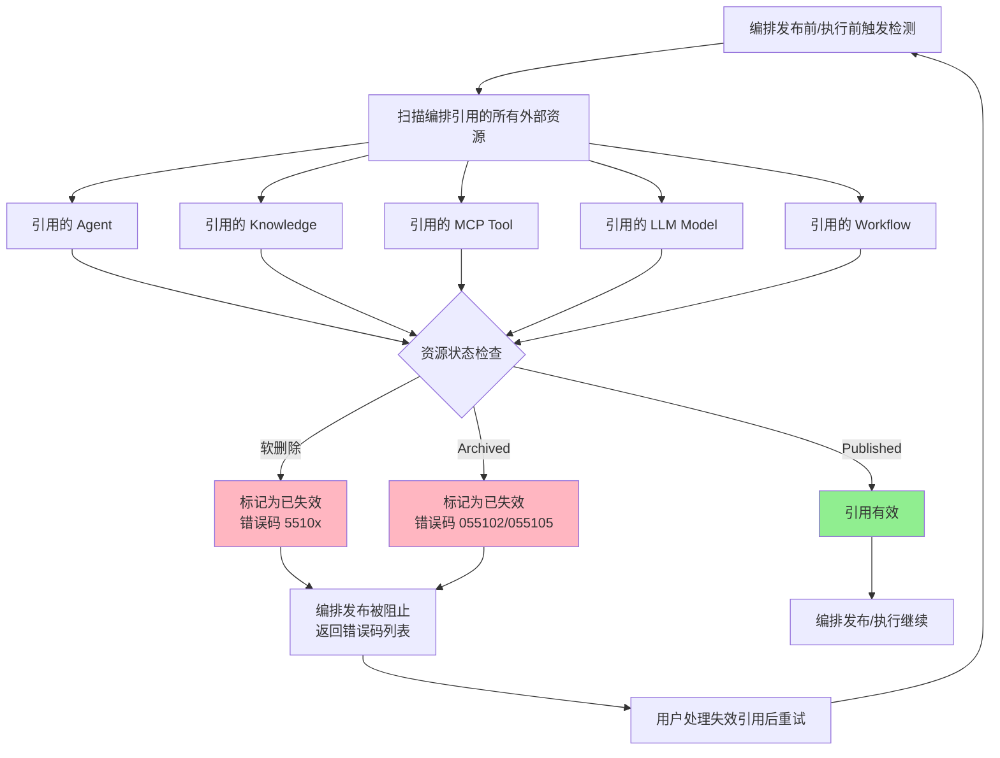
```mermaid
flowchart TD
    A[编排发布前/执行前触发检测] --> B[扫描编排引用的所有外部资源]
    B --> B1[引用的 Agent]
    B --> B2[引用的 Knowledge]
    B --> B3[引用的 MCP Tool]
    B --> B4[引用的 LLM Model]
    B --> B5[引用的 Workflow]

    B1 --> C{资源状态检查}
    B2 --> C
    B3 --> C
    B4 --> C
    B5 --> C

    C -->|软删除| D1[标记为已失效<br/>错误码 5510x]
    C -->|Archived| D2[标记为已失效<br/>错误码 055102/055105]
    C -->|Published| E[引用有效]

    D1 --> F[编排发布被阻止<br/>返回错误码列表]
    D2 --> F
    E --> G[编排发布/执行继续]

    F --> H[用户处理失效引用后重试]
    H --> A

    style D1 fill:#FFB6C1
    style D2 fill:#FFB6C1
    style E fill:#90EE90
```

### 19.3 跨模块错误码与场景对照表

> 跨模块错误码使用 `BIZ_ORCHESTRATION_*` 命名空间(数字段位 6 位 `055001-055999`),详见 §18.2。

| 错误码 | 场景 | 编排侧处理 |
|--------|------|-----------|
| 055101 | 引用已删除的 Agent | 编排自动从节点中移除该 Agent 引用,提示用户重新配置 |
| 055102 | 引用已禁用的 Agent | 编排节点标记为失效,发布时阻止 |
| 055103 | 引用已删除的 Knowledge | 编排 Agent 节点标记为失效,发布时阻止 |
| 055104 | 引用已删除的 MCP Tool | 编排 Agent 节点标记为失效,发布时阻止 |
| 055105 | 引用已禁用的 LLM | 编排 Agent 节点标记为失效,发布时阻止 |
| 055106 | 引用已删除的 Workflow | 编排标记为失效,不可执行 |
| 055201 | 跨租户引用 | 安全审计日志记录并告警,引用被强制移除 |
| 055501 | Saga 补偿失败 | 编排保存事务整体回滚,业务层返回 200 + 错误码 055501 |
| 055502 | 跨模块事务部分失败 | 已提交的子模块回滚,编排保存失败 |

### 19.4 验收标准

| 编号 | 验收标准 | 验证方法 |
|------|----------|----------|
| AC-TX-ORC-01 | 编排引用的 Agent 软删除后,编排发布时返回 055101 业务错误码(业务层 HTTP 200) | 软删除被引用 Agent,尝试发布编排 |
| AC-TX-ORC-02 | 编排引用的 Knowledge 软删除后,编排发布时返回 055103 业务错误码 | 软删除被引用 Knowledge,尝试发布编排 |
| AC-TX-ORC-03 | 跨租户引用时返回 055201 业务错误码并记录安全审计日志 | 用租户 A 的编排引用租户 B 的资源 |
| AC-TX-ORC-04 | Saga 模式下任一子事务失败触发补偿回滚 | 模拟子事务失败验证回滚 |
| AC-TX-ORC-05 | 物理删除被引用的资源被数据库外键约束阻止 | 尝试物理删除被编排引用的 Agent |

---

## 20. 编排执行链路 APM 追踪

本章定义编排执行链路的全链路 APM（Application Performance Monitoring）追踪规范，实现 traceId 在 Node、Agent、Tool、LLM 之间的贯穿。

### 20.1 追踪架构

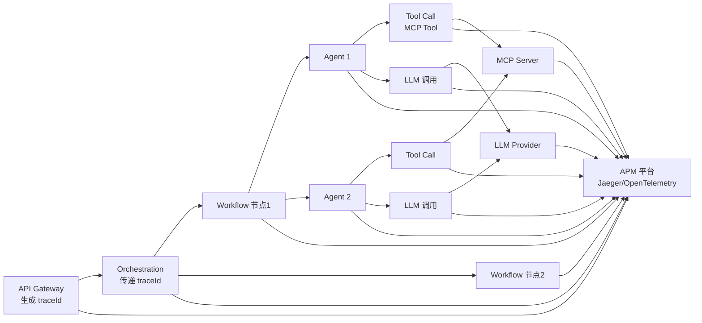
```mermaid
flowchart LR
    A[API Gateway<br/>生成 traceId] --> B[Orchestration<br/>传递 traceId]
    B --> C[Workflow 节点1]
    B --> D[Workflow 节点2]
    C --> E[Agent 1]
    C --> F[Agent 2]
    E --> G[Tool Call<br/>MCP Tool]
    E --> H[LLM 调用]
    F --> I[Tool Call]
    F --> J[LLM 调用]
    G --> K[MCP Server]
    H --> L[LLM Provider]
    I --> K
    J --> L

    A --> M[APM 平台<br/>Jaeger/OpenTelemetry]
    B --> M
    C --> M
    D --> M
    E --> M
    F --> M
    G --> M
    H --> M
    I --> M
    J --> M
    K --> M
    L --> M
```

### 20.2 traceId 传递规则

| 层级 | 传递方式 | 说明 |
|------|----------|------|
| API Gateway → Orchestration | HTTP Header `X-Trace-Id` | 入口处生成（UUID v4）或透传上游 traceId |
| Orchestration → Workflow | 上下文变量 `traceId` | 工作流执行时注入 |
| Workflow → Agent | 上下文变量 `traceId` | Agent 节点执行时注入 |
| Agent → Tool | 上下文变量 `traceId` | MCP 工具调用时通过 metadata 传递 |
| Agent → LLM | OpenTelemetry 协议 | LLM 调用使用 OTEL 协议上报 span |
| Agent → Agent（A2A） | HTTP Header `X-Trace-Id` | 跨 Agent 调用传递 |
| 所有日志 | JSON 字段 `traceId` | 统一日志格式包含 traceId |

### 20.3 关键追踪指标

| 指标 | 采集位置 | 单位 | 用途 |
|------|----------|------|------|
| `orchestration.duration` | 编排入口/出口 | ms | 编排整体执行耗时 |
| `orchestration.node.duration` | 节点入口/出口 | ms | 单个节点执行耗时 |
| `orchestration.agent.duration` | Agent 入口/出口 | ms | Agent 执行耗时 |
| `orchestration.tool.duration` | Tool Call 入口/出口 | ms | MCP 工具调用耗时 |
| `orchestration.llm.duration` | LLM 调用入口/出口 | ms | LLM 调用耗时（含网络+推理） |
| `orchestration.llm.tokens` | LLM 调用 | count | LLM Token 用量（prompt/completion） |
| `orchestration.error.count` | 异常捕获 | count | 编排执行异常次数 |

### 20.4 验收标准

| 编号 | 验收标准 | 验证方法 |
|------|----------|----------|
| AC-APM-ORC-01 | traceId 从 API Gateway 一路贯穿到 LLM Provider，所有日志/span 共享同一 traceId | 执行编排并在 APM 平台查询完整 trace |
| AC-APM-ORC-02 | 编排执行异常时，APM 平台可定位到具体节点、Agent、Tool、LLM 调用 | 触发异常后查询 trace 详情 |
| AC-APM-ORC-03 | 关键指标（duration/tokens/error.count）在 Prometheus 中可查询 | 验证指标已暴露 |
| AC-APM-ORC-04 | 跨 Agent（A2A）调用时 traceId 正确传递 | 跨 Agent 调用后在 APM 平台验证 trace 完整 |

---

## 21. Orchestration 实时监控

本章定义编排运行状态的实时监控能力，通过 WebSocket 推送和 APM 追踪实现编排执行的实时可视化。

### 21.1 实时监控架构

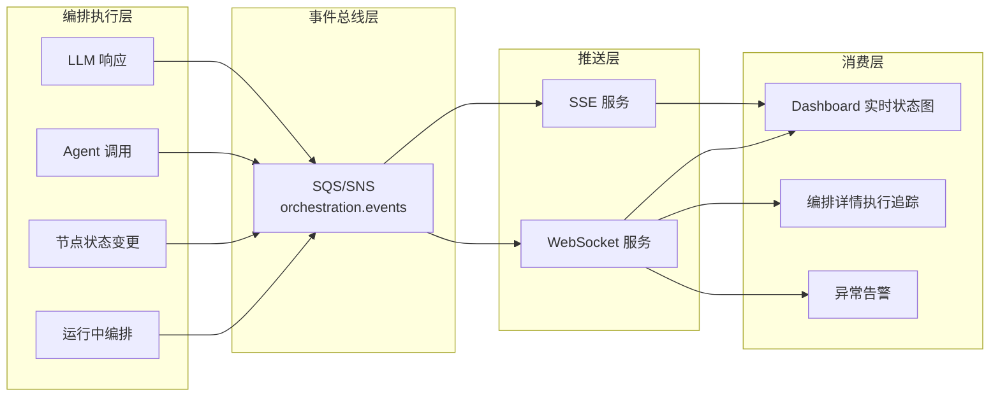
```mermaid
flowchart LR
    subgraph 编排执行层
        E1[运行中编排]
        E2[节点状态变更]
        E3[Agent 调用]
        E4[LLM 响应]
    end

    subgraph 事件总线层
        EB[SQS/SNS<br/>orchestration.events]
    end

    subgraph 推送层
        WS1[WebSocket 服务]
        WS2[SSE 服务]
    end

    subgraph 消费层
        C1[Dashboard 实时状态图]
        C2[编排详情执行追踪]
        C3[异常告警]
    end

    E1 --> EB
    E2 --> EB
    E3 --> EB
    E4 --> EB

    EB --> WS1
    EB --> WS2

    WS1 --> C1
    WS1 --> C2
    WS1 --> C3
    WS2 --> C1
```

### 21.2 WebSocket 推送事件类型(AG-UI 16 类事件)

> **协议契约**：编排 WebSocket 事件遵循 [PRD-00 §10.6.1 AG-UI 16 类事件契约](../PRD-00-平台总览与全局规范.md) 与 [PRD-00 §10 AG-UI 协议规范](../PRD-00-平台总览与全局规范.md),编排侧事件与 AG-UI 事件**严格 1:1 映射**。完整事件清单:
>
> | # | AG-UI 事件 | 编排侧事件 | 说明 |
> |---|------------|------------|------|
> | 1 | `RUN_STARTED` | `orchestration.run.started` | 编排/Agent Run 开始执行 |
> | 2 | `RUN_FINISHED` | `orchestration.run.finished` | 编排/Agent Run 执行完成 |
> | 3 | `RUN_CANCELLED` | `orchestration.run.cancelled` | 编排/Agent Run 被取消 |
> | 4 | `RUN_ERROR` | `orchestration.run.error` | 编排/Agent Run 顶层异常 |
> | 5 | `TEXT_MESSAGE_START` | `orchestration.text.start` | 流式文本消息开始 |
> | 6 | `TEXT_MESSAGE_CONTENT` | `orchestration.text.delta` | 流式文本消息增量内容 |
> | 7 | `TEXT_MESSAGE_END` | `orchestration.text.end` | 流式文本消息结束 |
> | 8 | `TOOL_CALL_START` | `orchestration.tool.start` | MCP Tool 调用开始 |
> | 9 | `TOOL_CALL_ARGS` | `orchestration.tool.args` | MCP Tool 调用参数(增量) |
> | 10 | `TOOL_CALL_END` | `orchestration.tool.end` | MCP Tool 调用结束 |
> | 11 | `TOOL_CALL_RESULT` | `orchestration.tool.result` | MCP Tool 调用结果回传 |
> | 12 | `STATE_DELTA` | `orchestration.state.delta` | 执行状态/变量增量变更(JsonPatch) |
> | 13 | `STEP_STARTED` | `orchestration.step.started` | 节点(Step)开始执行 |
> | 14 | `STEP_FINISHED` | `orchestration.step.finished` | 节点(Step)执行完成 |
> | 15 | `SUB_AGENT_STARTED` | `orchestration.subagent.started` | 子 Agent 启动(A2A 子调用) |
> | 16 | `SUB_AGENT_FINISHED` | `orchestration.subagent.finished` | 子 Agent 完成(A2A 子调用) |
>
> AG-UI 仅定义前端 ↔ 后端的事件契约,不涉及 Agent 间通信;与 ACP(Agent Communication Protocol,见 §22)和 A2A(Agent-to-Agent,见 PRD-06 §7.6)严格区分。

| 事件类型 | 触发时机 | Payload |
|----------|----------|---------|
| `orchestration.run.started` | 编排开始执行 | `{traceId, orchestrationId, mode, startedAt, inputSummary}` |
| `orchestration.run.finished` | 编排执行完成 | `{traceId, orchestrationId, status, totalDuration, totalTokens, outputSummary}` |
| `orchestration.run.cancelled` | 编排被取消 | `{traceId, orchestrationId, cancelledBy, cancelledAt, lastNodeKey}` |
| `orchestration.run.error` | 编排顶层异常 | `{traceId, orchestrationId, errorCode, errorMessage, stackTrace}` |
| `orchestration.text.start` | LLM 流式输出开始 | `{traceId, messageId, role, modelId}` |
| `orchestration.text.delta` | LLM 流式输出增量 | `{traceId, messageId, delta, index}` |
| `orchestration.text.end` | LLM 流式输出结束 | `{traceId, messageId, finishReason, usage}` |
| `orchestration.tool.start` | MCP Tool 调用开始 | `{traceId, toolCallId, mcpServerId, toolName, args}` |
| `orchestration.tool.args` | MCP Tool 调用参数增量 | `{traceId, toolCallId, delta}` |
| `orchestration.tool.end` | MCP Tool 调用结束 | `{traceId, toolCallId, latencyMs, status}` |
| `orchestration.tool.result` | MCP Tool 调用结果 | `{traceId, toolCallId, result, isError}` |
| `orchestration.state.delta` | 状态/变量增量变更 | `{traceId, operations: [JsonPatch]}` |
| `orchestration.step.started` | 节点开始执行 | `{traceId, nodeId, nodeType, startedAt}` |
| `orchestration.step.finished` | 节点执行完成 | `{traceId, nodeId, status, duration, output}` |
| `orchestration.subagent.started` | 子 Agent 启动 | `{traceId, parentNodeId, childAgentId, childRunId, capability}` |
| `orchestration.subagent.finished` | 子 Agent 完成 | `{traceId, parentNodeId, childAgentId, childRunId, status, duration, output}` |
| `orchestration.node.failed` | 节点执行失败(降级事件) | `{traceId, nodeId, errorCode, errorMessage, stackTrace}` |

### 21.3 实时监控降级策略

| 场景 | 处理策略 |
|------|----------|
| WebSocket 断线 | 客户端自动重连（指数退避 1s/2s/4s，最多 5 次），重连失败后降级为 HTTP 轮询（30 秒间隔） |
| 事件总线堆积 | 消费者丢弃过期事件，保留最新状态；监控事件堆积告警 |
| APM 平台不可用 | 编排执行不受影响，本地缓存最近 1000 条 span，APM 恢复后批量上报 |
| 客户端订阅数过多 | 单个编排最多支持 100 个并发订阅，超出后返回订阅失败业务错误码 055407 |

### 21.4 验收标准

| 编号 | 验收标准 | 验证方法 |
|------|----------|----------|
| AC-MON-ORC-01 | 编排执行状态变更后，订阅的 WebSocket 客户端在 1 秒内收到推送事件 | 启动编排并订阅 WebSocket，测量事件延迟 |
| AC-MON-ORC-02 | WebSocket 断线后 5 秒内自动重连 | 模拟网络中断验证重连 |
| AC-MON-ORC-03 | 异常事件（节点失败）触发实时告警 | 触发节点失败验证告警通知 |
| AC-MON-ORC-04 | 单个编排最多支持 100 个并发订阅 | 模拟 101 个并发订阅验证失败响应 |

---

## 22. ACP（Agent Communication Protocol）安全规范

> **协议边界**：ACP（Agent Communication Protocol）用于跨域 Agent 通信，与 A2A（智能体对智能体，见 [PRD-06 §7.6](../PRD-06-智能体管理.md)）、AG-UI（前端事件契约，见 [PRD-00 §10](../PRD-00-平台总览与全局规范.md)）严格区分；三者的适用场景、消息格式、安全模型与协议边界详见 [PRD-00 §10.6](../PRD-00-平台总览与全局规范.md)。
>
> | 协议 | 范围 | 方向 | 主要用途 |
> |------|------|------|----------|
> | ACP | Agent ↔ Agent（跨域） | 双向 | 跨域 Agent 任务派发与回执 |
> | A2A | Agent ↔ Agent（同域） | 双向 | 同域多 Agent 协同 |
> | AG-UI | 前端 ↔ 后端 | 服务端推送 | 编排执行状态实时可视化 |

本章定义 Agent 间通信协议（ACP）的安全规范，包括身份认证、防重放、消息完整性、机密性保护。

### 22.1 ACP 协议栈

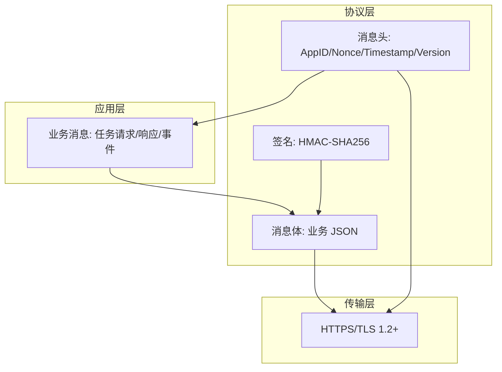
```mermaid
flowchart TB
    subgraph 应用层
        A1[业务消息: 任务请求/响应/事件]
    end

    subgraph 协议层
        B1[消息头: AppID/Nonce/Timestamp/Version]
        B2[消息体: 业务 JSON]
        B3[签名: HMAC-SHA256]
    end

    subgraph 传输层
        C1[HTTPS/TLS 1.2+]
    end

    A1 --> B2
    B1 --> A1
    B3 --> B2
    B2 --> C1
    B1 --> C1
```

### 22.2 身份认证流程

| 步骤 | 操作 | 说明 |
|------|------|------|
| 1 | 客户端生成请求 | 携带 `AppID` + `Timestamp`（ISO 8601） + `Nonce`（UUID） + `Body`（业务 JSON） |
| 2 | 客户端计算签名 | `Signature = HMAC-SHA256(AppKey, AppID + "\n" + Timestamp + "\n" + Nonce + "\n" + Body)` |
| 3 | 客户端发起请求 | HTTP Header: `X-App-Id`、`X-Timestamp`、`X-Nonce`、`X-Signature` |
| 4 | 服务端验证时间戳 | 时钟偏移 ≤ 300 秒,否则拒绝(业务错误码 055603) |
| 5 | 服务端验证 Nonce | 查询 Nonce 集合(Redis,TTL=10分钟),重复则拒绝(业务错误码 055604) |
| 6 | 服务端重新计算签名 | 用本地存储的 AppKey 计算签名并比对,不匹配则拒绝(业务错误码 055601) |
| 7 | 服务端颁发 Session Token | 通过认证后返回 Session Token，有效期 24 小时 |
| 8 | 后续请求 | 携带 `Authorization: Bearer {SessionToken}` |

### 22.3 安全规则

| 规则编号 | 规则名称 | 规则描述 |
|----------|----------|----------|
| ACP-SEC-001 | 强制 HMAC 签名 | 所有 ACP 消息必须携带 HMAC-SHA256 签名 |
| ACP-SEC-002 | 时钟偏移限制 | 客户端与服务端时钟偏移不得超过 300 秒 |
| ACP-SEC-003 | Nonce 防重放 | Nonce 必须全局唯一，TTL=10 分钟，重复 Nonce 直接拒绝 |
| ACP-SEC-004 | Session Token 有效期 | Session Token 有效期 24 小时，过期后必须重新握手 |
| ACP-SEC-005 | AppKey 加密存储 | AppKey 在数据库中 AES-256 加密存储，展示时脱敏 |
| ACP-SEC-006 | TLS 加密传输 | 所有 ACP 通信强制 HTTPS/TLS 1.2+ |
| ACP-SEC-007 | 错误码规范 | 认证失败相关业务错误码使用 055601~055605 段位(业务层 HTTP 200) |

### 22.4 验收标准

| 编号 | 验收标准 | 验证方法 |
|------|----------|----------|
| AC-ACP-01 | 缺失签名的 ACP 消息返回 055601 业务错误码(业务层 HTTP 200) | 移除签名头验证 |
| AC-ACP-02 | 时钟偏移超过 300 秒的消息被拒绝 | 篡改时间戳验证 |
| AC-ACP-03 | 重复 Nonce 的消息被拒绝 | 重放相同 Nonce 验证 |
| AC-ACP-04 | 签名不匹配的消息被拒绝 | 篡改消息体验证 |
| AC-ACP-05 | Session Token 24 小时后过期 | 设置短 TTL 验证过期机制 |

---

## 23. MCP Server 健康检查

本章定义 MCP Server 的健康检查规范，确保编排执行时能够及时检测 MCP Server 故障并自动降级。

### 23.1 健康检查规范

| 配置项 | 默认值 | 可配置范围 | 说明 |
|--------|--------|------------|------|
| 检查间隔 | **30 秒** | 10~300 秒 | 健康检查的固定周期 |
| 检查超时 | 5 秒 | 1~30 秒 | 单次健康检查的超时时间 |
| 连续失败阈值 | 3 次 | 1~10 次 | 连续失败达到阈值后标记为不可用 |
| 恢复探测间隔 | 60 秒 | 30~600 秒 | 标记不可用后的恢复探测间隔 |
| 检查端点 | `/health` | 任意 URL | MCP Server 提供的健康检查端点 |
| 检查方法 | GET | GET/POST | 健康检查 HTTP 方法 |

### 23.2 健康状态机

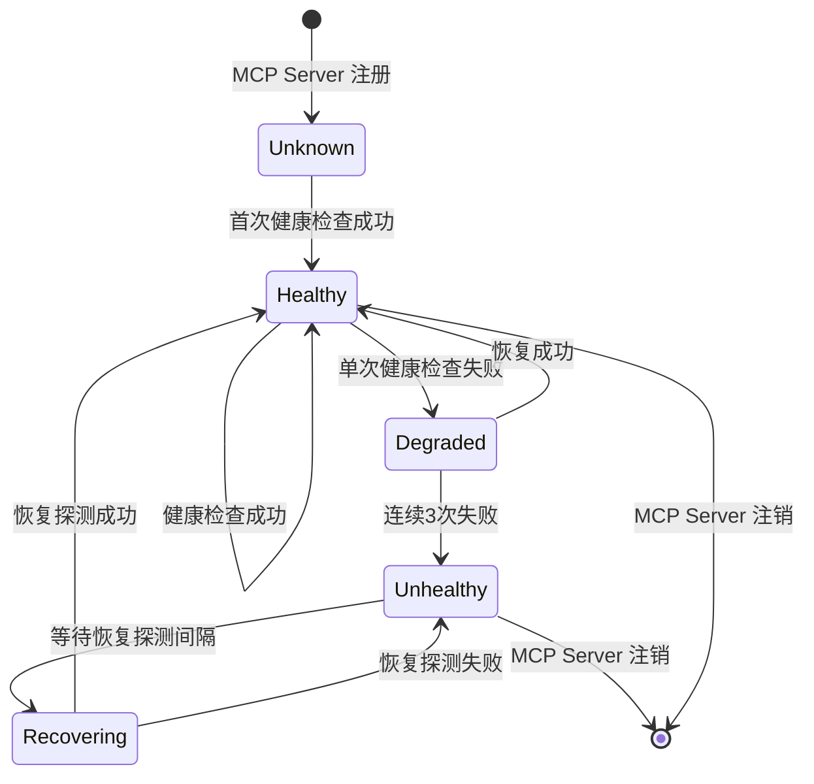
```mermaid
stateDiagram-v2
    [*] --> Unknown : MCP Server 注册
    Unknown --> Healthy : 首次健康检查成功
    Healthy --> Healthy : 健康检查成功
    Healthy --> Degraded : 单次健康检查失败
    Degraded --> Healthy : 恢复成功
    Degraded --> Unhealthy : 连续3次失败
    Unhealthy --> Recovering : 等待恢复探测间隔
    Recovering --> Healthy : 恢复探测成功
    Recovering --> Unhealthy : 恢复探测失败
    Unhealthy --> [*] : MCP Server 注销
    Healthy --> [*] : MCP Server 注销
```

### 23.3 编排侧的降级策略

| MCP Server 状态 | 编排侧行为 |
|----------------|-----------|
| Healthy | 正常调用，无感知 |
| Degraded | 编排继续调用，但记录告警日志（warn 级别） |
| Unhealthy | 编排节点标记为"工具不可用"，不发起调用，工作流继续执行但相关节点标记为 Skipped；触发告警通知 |

### 23.4 验收标准

| 编号 | 验收标准 | 验证方法 |
|------|----------|----------|
| AC-MCP-01 | 健康检查周期固定为 30 秒，误差不超过 ±2 秒 | 定时器监控连续 10 次 |
| AC-MCP-02 | MCP Server 连续 3 次健康检查失败后被标记为 Unhealthy | 模拟 3 次失败验证状态转换 |
| AC-MCP-03 | Unhealthy 状态下编排不调用该 MCP Server，相关节点标记为 Skipped | 触发 Unhealthy 后执行编排验证 |
| AC-MCP-04 | MCP Server 恢复后自动重新加入可用列表（探测间隔 60 秒） | 恢复后验证自动重新加入 |
| AC-MCP-05 | 健康检查结果可在编排监控页面查看 | 在监控页面查看 MCP Server 状态 |

---

## 24. 验收标准矩阵

> 编号遵循 [PRD-09 §41.2 AC 编号规范](file:///Users/Garabateador/Workspace/banyan/PRD/PRD-09-系统设置.md)，格式 `AC-05-{3 位顺序号}`。

| 编号 | 验收标准 | 验证方法 |
|------|----------|----------|
| AC-05-001 | Orchestration 创建时校验 `name`（同租户内唯一）、`mode`（Graph/Batch/Loop/Chat）、`entry_node_id` 必填 | Schema 校验 |
| AC-05-002 | Orchestration `mode` 支持 `Graph`（DAG）、`Batch`（批处理）、`Loop`（循环）、`Chat`（对话流）四种 | 枚举校验 |
| AC-05-003 | 节点类型枚举 `AGENT` / `TOOL` / `LLM` / `CONDITION` / `LOOP` / `PARALLEL` / `JOIN` / `END`，非法值拒绝 | 节点类型校验 |
| AC-05-004 | 编排图必须为 DAG（有向无环图），检测到环路返回 055302 业务错误码(业务层 HTTP 200) | 拓扑校验 |
| AC-05-005 | Orchestration 列表查询自动注入 `partition_key` 过滤，跨租户返回 055201 业务错误码 | 越权测试 |
| AC-05-006 | Orchestration 删除为软删除，关联 Execution 30 天内可追溯 | 数据快照 |
| AC-05-007 | Agent 节点必须指定 `agent_id` + `input_mapping`，缺失返回 055201 | 节点配置校验 |
| AC-05-008 | Tool 节点必须指定 `mcp_server_id` + `tool_name` + `input_mapping`，缺失返回 055202 | 节点配置校验 |
| AC-05-009 | LLM 节点必须指定 `model_id` + `prompt_template_id`，缺失返回 055203 | 节点配置校验 |
| AC-05-010 | Batch 模式批大小范围 1~1000，默认 50，配置范围外拒绝 055205 | 范围校验 |
| AC-05-011 | Loop 模式循环次数范围 1~1000，超过 1000 返回 055206 | 范围校验 |
| AC-05-012 | Loop 模式必须配置 `loop_condition` 表达式，否则 055207 | 表达式校验 |
| AC-05-013 | ACP 协议请求必须携带 `AppID` + `Signature`，缺失返回 055601 业务错误码 | 签名验证 |
| AC-05-014 | ACP Session Token 24 小时过期，过期返回 055602 业务错误码 | TTL 注入 |
| AC-05-015 | Chat Mode 支持多轮对话，context 长度限制遵循 PRD-00 §5 基线：32 轮截断 + 80 轮摘要压缩 | 对话流测试 |
| AC-05-016 | 并行节点支持最多 16 路并发，超过返回 055208 | 并发限制 |
| AC-05-017 | 编排执行 P95 端到端延迟（不含外部 LLM/Tool 调用） | 全链路 APM |
| AC-05-018 | 编排失败节点支持重试 3 次（指数退避），仍失败标记 `Failed` | 故障注入 |
| AC-05-019 | 编排执行结果持久化至 `tenant_orchestration_executions`，保留 90 天 | 数据巡检 |
| AC-05-020 | 编排执行审计日志记录每个节点的 `started_at` / `finished_at` / `status` / `output` | 日志巡检 |
| AC-05-021 | 编排执行支持手动 `cancel`，已运行节点完成，未启动节点标记 `Skipped` | 取消测试 |
| AC-05-022 | 编排执行支持断点恢复（Resume from `last_successful_node`） | 断点恢复测试 |
| AC-05-023 | Orchestration 版本管理：发布后生成 `version`，旧版本只读可回滚 | 版本回滚测试 |
| AC-05-024 | 编排图导入支持 JSON / YAML 两种格式，导入前 schema 校验 | 导入测试 |
| AC-05-025 | 编排图导出包含完整节点 + 边 + 变量定义，循环引用检测 | 导出测试 |
| AC-05-026 | 跨租户 Execution 不可见，访问他人 Execution 返回 055209 | 越权测试 |
| AC-05-027 | Agent 节点调用 PRD-06 Agent 时限流 100 QPS/Agent，超限返回 055210 | 限流压测 |
| AC-05-028 | Tool 节点调用 PRD-03 Tool 时注入 `orchestration_id` 到 Context | 日志采样 |
| AC-05-029 | LLM 节点调用 PRD-04 LLM 时强制 `temperature ∈ [0, 1]` 校验 | 参数校验 |
| AC-05-030 | 编排执行 traceId 100% 贯穿所有节点调用链 | APM 采样 |

---

## 25. 业务规则

> 编号遵循 [PRD-09 §41.3 BR 编号规范](file:///Users/Garabateador/Workspace/banyan/PRD/PRD-09-系统设置.md)，格式 `BR-05-{3 位顺序号}`。

| 编号 | 规则名称 | 触发条件 | 期望结果 |
|------|----------|----------|----------|
| BR-05-001 | Orchestration 同租户唯一 | 同租户下创建同名 `name` | 拒绝创建，返回 055301 |
| BR-05-002 | DAG 强制 | 编排图存在环路 | 拒绝保存，返回 055302 |
| BR-05-003 | 节点引用完整性 | 节点引用不存在的 `agent_id` / `tool_id` / `model_id` | 拒绝保存，返回 055201 |
| BR-05-004 | 执行重试策略 | 节点执行失败 | 指数退避 1s/2s/4s，最多 3 次，仍失败标 `Failed` |
| BR-05-005 | 并行分支汇聚 | 多分支并行执行 | `JOIN` 节点必须等所有上游完成，汇聚后再继续 |
| BR-05-006 | Loop 终止条件 | 循环执行中 | 满足 `loop_condition=false` 或达到 `max_iterations` 时终止 |
| BR-05-007 | 取消传播 | 用户取消编排 | 当前节点完成后停止；未启动节点标 `Skipped`，并行节点优雅收尾 |
| BR-05-008 | 断点恢复 | 执行中断后恢复 | 从 `last_successful_node` 继续，复用已完成的节点结果 |
| BR-05-009 | 版本不可变 | Orchestration 发布后 | 已发布版本不可修改；只能创建新版本或回滚 |
| BR-05-010 | ACP 签名校验 | 任何 ACP 请求 | HMAC-SHA256 校验失败立即拒绝 055601 |
| BR-05-011 | Chat Mode Context 合并 | 多轮对话 | 遵循PRD-00 §5基线：超过32轮自动截断最早消息，超过80轮触发LLM摘要压缩 |
| BR-05-012 | 节点超时 | 节点执行超过配置 `timeout_seconds`（默认 60s） | 强制终止，返回 055204 |
| BR-05-013 | 编排执行隔离 | 多租户同时执行 | 资源池按 tenant 隔离，防止单租户独占 |
| BR-05-014 | 错误码段位 | 编排管理错误 | 统一使用 6 位 `055001-055999` 段位(0551xx 配置、0552xx 节点、0553xx 编排、0554xx 执行、0555xx MCP、0556xx ACP;业务层统一 HTTP 200) |
| BR-05-015 | Trace 透传 | 节点调用下游 | `traceId` 100% 透传至 LLM / Tool / Agent 调用 |
| BR-05-016 | 执行优先级 | 多编排同时排队 | 按 `priority DESC` 调度；同优先级按 FIFO |
| BR-05-017 | Batch 失败策略 | 批处理中单条失败 | 默认 `continue`（继续后续）；可选 `fail_fast`（立即停止） |
| BR-05-018 | 节点输出 Schema | 节点定义 | 必须声明 `output_schema`，下游节点按 Schema 解析 |
| BR-05-019 | 编排导入冲突 | 同名 Orchestration 已存在 | 默认 `skip`；可选 `override` / `rename` |
| BR-05-020 | 资源消耗 | 节点调用 LLM/Tool | 单节点调用 Token 计入编排账单，归属 `orchestration_id` |

---

## 26. PostgreSQL 数据模型

> 表名遵循 [PRD-09 §41.5 PG 表命名规范](file:///Users/Garabateador/Workspace/banyan/PRD/PRD-09-系统设置.md)，模块标识 `orchestration`，主键策略 `composite PK (partition_key, id)`。

> **RLS & 触发器声明**: 本模块所有 `tenant_orchestration_*` 表均启用 PostgreSQL RLS 策略和 `set_partition_key_from_session()` 触发器，遵循 PRD-00 §7.2 强制规范。

### 26.1 `tenant_orchestration_orchestrations`

编排定义表，记录租户下编排图元数据、版本、状态。

```sql
CREATE TABLE tenant_orchestration_orchestrations (
    partition_key      VARCHAR(64)  NOT NULL,                                -- tenant_id
    id                 UUID         NOT NULL DEFAULT gen_random_uuid(),
    tenant_id          UUID         NOT NULL GENERATED ALWAYS AS (partition_key::uuid) STORED,  -- Derived from partition_key, required by multi-tenant middleware
    name               VARCHAR(128) NOT NULL,                                -- 同租户内唯一
    display_name       VARCHAR(256) NOT NULL,
    description        TEXT         NULL,
    mode               VARCHAR(16)  NOT NULL,                                -- Graph / Batch / Loop / Chat
    version            INTEGER      NOT NULL DEFAULT 1,
    status             VARCHAR(16)  NOT NULL DEFAULT 'Draft',                -- Draft / Published / Archived
    graph_dag          JSONB        NOT NULL,                                -- 节点 + 边 + 变量定义
    variables_schema   JSONB        NULL,                                    -- 编排输入变量 Schema
    output_schema      JSONB        NULL,                                    -- 编排输出 Schema
    entry_node_id      VARCHAR(64)  NOT NULL,
    max_duration_s     INTEGER      NOT NULL DEFAULT 600,                    -- 单次执行总超时
    priority           INTEGER      NOT NULL DEFAULT 50,                      -- 调度优先级
    tags               JSONB        NULL,
    published_at       TIMESTAMPTZ  NULL,
    published_by       UUID         NULL,
    created_at         TIMESTAMPTZ  NOT NULL DEFAULT NOW(),
    updated_at         TIMESTAMPTZ  NOT NULL DEFAULT NOW(),
    created_by         UUID         NOT NULL,
    updated_by         UUID         NULL,
    deleted_at         TIMESTAMPTZ  NULL,
    is_deleted         BOOLEAN      NOT NULL GENERATED ALWAYS AS (deleted_at IS NOT NULL) STORED,  -- Derived from deleted_at
    PRIMARY KEY (partition_key, id),
    UNIQUE (partition_key, name, version, deleted_at)
);
CREATE INDEX idx_orchestrations_tenant_status ON tenant_orchestration_orchestrations(partition_key, status, deleted_at);

-- Trigger: auto-inject partition_key from session
CREATE TRIGGER trg_tenant_orchestration_orchestrations_partition_key
  BEFORE INSERT ON tenant_orchestration_orchestrations
  FOR EACH ROW EXECUTE FUNCTION set_partition_key_from_session();

-- RLS: tenant isolation
ALTER TABLE tenant_orchestration_orchestrations ENABLE ROW LEVEL SECURITY;
CREATE POLICY tenant_isolation_tenant_orchestration_orchestrations ON tenant_orchestration_orchestrations
  USING (partition_key = current_setting('app.current_tenant_id', TRUE));
```

### 26.2 `tenant_orchestration_orchestration_nodes`

编排节点定义表，独立存储节点（便于版本对比与节点级复用）。

```sql
CREATE TABLE tenant_orchestration_orchestration_nodes (
    partition_key    VARCHAR(64)  NOT NULL,                                  -- tenant_id
    id               UUID         NOT NULL DEFAULT gen_random_uuid(),
    tenant_id        UUID         NOT NULL GENERATED ALWAYS AS (partition_key::uuid) STORED,  -- Derived from partition_key, required by multi-tenant middleware
    orchestration_id UUID         NOT NULL,                                  -- 关联 tenant_orchestration_orchestrations.id
    node_key         VARCHAR(64)  NOT NULL,                                  -- 编排图内唯一节点标识
    node_type        VARCHAR(16)  NOT NULL,                                  -- AGENT / TOOL / LLM / CONDITION / LOOP / PARALLEL / JOIN / END
    display_name     VARCHAR(256) NULL,
    config           JSONB        NOT NULL,                                  -- 节点配置（含 agent_id / tool_id / model_id 等引用）
    input_mapping    JSONB        NULL,                                      -- 输入参数映射
    output_schema    JSONB        NULL,                                      -- 输出 Schema
    timeout_s        INTEGER      NOT NULL DEFAULT 60,
    retry_count      INTEGER      NOT NULL DEFAULT 0,                        -- 重试次数（0~3）
    position_x       INTEGER      NOT NULL DEFAULT 0,                        -- 画布坐标
    position_y       INTEGER      NOT NULL DEFAULT 0,
    created_at       TIMESTAMPTZ  NOT NULL DEFAULT NOW(),
    updated_at       TIMESTAMPTZ  NOT NULL DEFAULT NOW(),
    created_by       UUID         NOT NULL,
    updated_by       UUID         NULL,
    deleted_at       TIMESTAMPTZ  NULL,
    is_deleted       BOOLEAN      NOT NULL GENERATED ALWAYS AS (deleted_at IS NOT NULL) STORED,  -- Derived from deleted_at
    PRIMARY KEY (partition_key, id),
    UNIQUE (partition_key, orchestration_id, node_key, deleted_at)
);
CREATE INDEX idx_orchestration_nodes_orch ON tenant_orchestration_orchestration_nodes(partition_key, orchestration_id, deleted_at);

-- Trigger: auto-inject partition_key from session
CREATE TRIGGER trg_tenant_orchestration_orchestration_nodes_partition_key
  BEFORE INSERT ON tenant_orchestration_orchestration_nodes
  FOR EACH ROW EXECUTE FUNCTION set_partition_key_from_session();

-- RLS: tenant isolation
ALTER TABLE tenant_orchestration_orchestration_nodes ENABLE ROW LEVEL SECURITY;
CREATE POLICY tenant_isolation_tenant_orchestration_orchestration_nodes ON tenant_orchestration_orchestration_nodes
  USING (partition_key = current_setting('app.current_tenant_id', TRUE));
```

### 26.3 `tenant_orchestration_orchestration_executions`

编排执行流水表，记录每次编排执行的全链路信息（含状态、节点状态、耗时、成本）。

```sql
CREATE TABLE tenant_orchestration_orchestration_executions (
    partition_key         VARCHAR(64)  NOT NULL,                              -- tenant_id
    id                    UUID         NOT NULL DEFAULT gen_random_uuid(),
    tenant_id             UUID         NOT NULL GENERATED ALWAYS AS (partition_key::uuid) STORED,  -- Derived from partition_key, required by multi-tenant middleware
    execution_id          UUID         NOT NULL,                              -- 业务侧唯一
    orchestration_id      UUID         NOT NULL,
    orchestration_version INTEGER      NOT NULL,
    mode                  VARCHAR(16)  NOT NULL,
    trace_id              VARCHAR(64)  NOT NULL,
    user_id               UUID         NULL,
    agent_id              UUID         NULL,
    input_variables       JSONB        NULL,
    output_result         JSONB        NULL,
    status                VARCHAR(16)  NOT NULL,                              -- Pending / Running / Success / Failed / Cancelled / Timeout
    current_node_key      VARCHAR(64)  NULL,
    node_states           JSONB        NULL,                                  -- 每个节点的状态、耗时、输出
    total_duration_ms     INTEGER      NULL,
    llm_token_used        INTEGER      NOT NULL DEFAULT 0,
    tool_invocations      INTEGER      NOT NULL DEFAULT 0,
    cost_yuan             DECIMAL(12,6) NOT NULL DEFAULT 0,
    error_code            VARCHAR(8)   NULL,
    error_message         TEXT         NULL,
    started_at            TIMESTAMPTZ  NOT NULL DEFAULT NOW(),
    finished_at           TIMESTAMPTZ  NULL,
    created_at            TIMESTAMPTZ  NOT NULL DEFAULT NOW(),
    updated_at            TIMESTAMPTZ  NOT NULL DEFAULT NOW(),
    created_by            UUID         NOT NULL,
    updated_by            UUID         NULL,
    deleted_at            TIMESTAMPTZ  NULL,
    is_deleted            BOOLEAN      NOT NULL GENERATED ALWAYS AS (deleted_at IS NOT NULL) STORED,  -- Derived from deleted_at
    PRIMARY KEY (partition_key, id),
    UNIQUE (partition_key, execution_id)
);
CREATE INDEX idx_executions_trace ON tenant_orchestration_orchestration_executions(partition_key, trace_id);
CREATE INDEX idx_executions_user ON tenant_orchestration_orchestration_executions(partition_key, user_id, started_at DESC);
CREATE INDEX idx_executions_status ON tenant_orchestration_orchestration_executions(partition_key, status, started_at DESC);
CREATE INDEX idx_executions_orch ON tenant_orchestration_orchestration_executions(partition_key, orchestration_id, started_at DESC);

-- Trigger: auto-inject partition_key from session
CREATE TRIGGER trg_tenant_orchestration_orchestration_executions_partition_key
  BEFORE INSERT ON tenant_orchestration_orchestration_executions
  FOR EACH ROW EXECUTE FUNCTION set_partition_key_from_session();

-- RLS: tenant isolation
ALTER TABLE tenant_orchestration_orchestration_executions ENABLE ROW LEVEL SECURITY;
CREATE POLICY tenant_isolation_tenant_orchestration_orchestration_executions ON tenant_orchestration_orchestration_executions
  USING (partition_key = current_setting('app.current_tenant_id', TRUE));
```

---

## 27. Neo4j 节点模型(权威定义,与 §A4 统一)

> 节点标签遵循 [PRD-09 §41.6](file:///Users/Garabateador/Workspace/banyan/PRD/PRD-09-系统设置.md) PascalCase,关系 `UPPER_SNAKE_CASE`;节点必须含 `partition_key` 与 `domain_id` / `domain_type`。**本节与 §A4 Neo4j 节点与关系统一为单一权威表**,采用 §A4 的 `Workflow` / `Node` / `Execution` 命名(更符合 GraphQL Schema 风格),并叠加 `OrchestrationEntity:Workflow:Graph` 三标签组合(承载租户分区与多视图)。

> **v5 收束说明(2026-06-13)**：Neo4j 节点/关系/约束/索引中**所有** `tenant_id` 统一替换为 `partition_key`，租户隔离语义保持一致。

> **收束说明(节点后缀+租户标签)**：(1) PRD-00 §3.5.5 规定实体类型标签后缀为 `Entity`，本节 `WorkflowNode` 已校准为 `Workflow`；(2) PRD-00 §7.3 规定租户标签为静态 `Graph`，本节已统一为静态 `Graph` 标签（v6 收束，原 `Graph{partition_key}` 动态标签已替换），Cypher 必须含 `WHERE n.partition_key = $partitionKey` 条件。

### 27.1 节点定义(权威)

| 节点标签 | 说明 | 关键属性 | 视图标签 |
|----------|------|----------|----------|
| `Workflow` | 工作流域聚合根(等价于旧 `OrchestrationNode`) | `partition_key`、`domain_id`、`id`、`name`、`version`、`mode` | `OrchestrationEntity`、`Graph` |
| `Node` | 通用工作流节点(LLM/Tool/Condition/Loop/Parallel/Join 等) | `partition_key`、`domain_id`、`id`、`workflow_id`、`type`、`config` | `OrchestrationEntity`、`Workflow`、`Graph` |
| `Execution` | 工作流执行实例 | `partition_key`、`domain_id`、`id`、`workflow_id`、`status` | `OrchestrationEntity`、`Graph` |
| `A2AMessage` | A2A 消息 | `partition_key`、`domain_id`、`id`、`from_agent`、`to_agent` | `Graph` |
| `Agent` | Agent 实体 | 复用 PRD-06(由 PRD-06 定义基础属性) | - |
| `Tool` | Tool 实体 | 复用 PRD-03 | - |
| `MCPServer` | MCP Server 实体 | `partition_key`、`domain_id`、`id`、`name`、`endpoint`、`status` | `Graph` |
| `Conversation` | Chat 会话(Chat 模式) | `partition_key`、`domain_id`、`id`、`workflow_id`、`user_id` | `OrchestrationEntity`、`Graph` |

**节点类型枚举(`Node.type`)**: `LLM` / `TOOL` / `AGENT` / `CONDITION` / `LOOP` / `PARALLEL` / `JOIN` / `HUMAN` / `WAIT` / `A2A` / `END`,与 §A5.3 `NodeTypeEnum` 一致。

> **历史收敛说明**: 原 §27.1 的 `OrchestrationNode` / `AgentNode` / `ToolNode` / `LLMNode` / `ConditionNode` / `LoopNode` / `ParallelNode` / `JoinNode` 八类细分节点已统一收敛为 `Node` + `type` 属性;具体节点类型由 `Node.type` 字段表达,GraphQL / Postgres 表均遵循 §A4 / §26 的统一命名。

### 27.2 关系定义

| 关系类型 | 起点 → 终点 | 含义 |
|----------|-------------|------|
| `WORKFLOW_HAS_NODE` | `Workflow` → `Node` | 工作流包含节点(属性 `order`) |
| `NODE_CONNECTS_TO` | `Node` → `Node` | 节点间连接(属性 `condition` / `weight`) |
| `EXECUTION_OF_WORKFLOW` | `Execution` → `Workflow` | 执行属于工作流 |
| `EXECUTION_TRIGGERED_NODE` | `Execution` → `Node` | 执行触发的节点 |
| `A2A_FROM_AGENT` | `A2AMessage` → `Agent` | 消息来源 Agent |
| `A2A_TO_AGENT` | `A2AMessage` → `Agent` | 消息目标 Agent |
| `NODE_INVOKES_TOOL` | `Node` → `Tool` | 节点调用工具(经由 `MCPServer`) |
| `NODE_TRIGGERS_AGENT` | `Node` → `Agent` | 节点触发 Agent(同域) |
| `CONVERSATION_OF_WORKFLOW` | `Conversation` → `Workflow` | Chat 会话绑定工作流 |

### 27.3 三标签组合(租户分区与多视图)

为支持多租户分区与跨视图查询(Graph / OrchestrationEntity / Workflow),编排管理模块 Neo4j 节点统一叠加 `partition_key` 维度的视图标签:

```cypher
// Workflow 节点叠加三标签:OrchestrationEntity:Workflow:Graph
// Node 节点叠加三标签:OrchestrationEntity:Workflow:Graph
// Execution 节点叠加双标签:OrchestrationEntity:Graph
```

**视图标签说明**：

| 标签 | 用途 |
|------|------|
| `OrchestrationEntity` | 编排实体视图(供 §A5 GraphQL 跨实体查询) |
| `Workflow` | 工作流节点视图(供拓扑/连接查询) |
| `Graph` | 静态租户分区标签（v6 收束，原 `Graph{partition_key}` 动态标签已统一为静态 `Graph`，Cypher 必须含 `WHERE n.partition_key = $partitionKey` 条件） |

**示例**: `MERGE (w:Workflow:OrchestrationEntity:Workflow:Graph {id: $id, partition_key: $partition_key})`

### 27.4 约束示例

```cypher
CREATE CONSTRAINT workflow_unique IF NOT EXISTS
ON (n:Workflow) ASSERT (n.partition_key, n.id) IS UNIQUE;

CREATE CONSTRAINT node_unique IF NOT EXISTS
ON (n:Node) ASSERT (n.partition_key, n.id) IS UNIQUE;

CREATE CONSTRAINT execution_unique IF NOT EXISTS
ON (n:Execution) ASSERT (n.partition_key, n.id) IS UNIQUE;

CREATE INDEX workflow_domain IF NOT EXISTS
FOR (n:Workflow) ON (n.partition_key, n.domain_id);
```

### 27.5 编排图示意

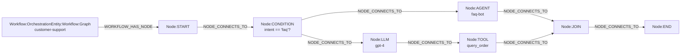
```mermaid
graph LR
    W[Workflow:OrchestrationEntity:Workflow:Graph<br/>customer-support] -->|WORKFLOW_HAS_NODE| S[Node:START]
    S -->|NODE_CONNECTS_TO| C[Node:CONDITION<br/>intent == 'faq'?]
    C -->|NODE_CONNECTS_TO| A1[Node:AGENT<br/>faq-bot]
    C -->|NODE_CONNECTS_TO| L1[Node:LLM<br/>gpt-4]
    A1 -->|NODE_CONNECTS_TO| J[Node:JOIN]
    L1 -->|NODE_CONNECTS_TO| T1[Node:TOOL<br/>query_order]
    T1 -->|NODE_CONNECTS_TO| J
    J -->|NODE_CONNECTS_TO| E[Node:END]
```

---

## 28. 章节编号保留

> **v6 收束说明**：§28 编号保留未使用。编排管理的完整规范已由 §1-§27（主体）+ §29-§31（收束后权威章节）覆盖，无需额外章节。本编号保留用于未来扩展。

---

## 29. 非功能需求

> 编号遵循 [PRD-09 §41.4](file:///Users/Garabateador/Workspace/banyan/PRD/PRD-09-系统设置.md) `NFR-05-{维度}-{3 位}`。

### 29.1 性能（Performance）

| 编号 | 指标 | 目标 | 验证方法 |
|------|------|------|----------|
| NFR-05-P-001 | 编排触发执行 P95 延迟 | ≤ 300 ms（不含节点执行） | 压测 |
| NFR-05-P-002 | 单编排 100 节点 P95 端到端延迟 | **P95 ≤ 30 s**(典型场景目标,**不含外部 LLM/Tool 调用**)/ **硬上限 60 s**(绝对超时阈值,**包含外部依赖**;触发后由 NFR-05-A-005 节点熔断与节点 `timeout_s` 默认值兜底) | 全链路压测 |
| NFR-05-P-003 | 并行节点调度延迟 | ≤ 50 ms/分支 | 压测 |
| NFR-05-P-004 | Chat 模式首字延迟 | P95 ≤ 1 s | 流式压测 |
| NFR-05-P-005 | 编排图渲染 P95 延迟 | ≤ 500 ms | UI 压测 |

### 29.2 安全（Security）

| 编号 | 指标 | 目标 | 验证方法 |
|------|------|------|----------|
| NFR-05-S-001 | 跨租户访问拦截 | 100% 拦截 Orchestration 与 Execution | 越权扫描 |
| NFR-05-S-002 | ACP 签名校验 | 100% 强制 HMAC-SHA256 | 篡改测试 |
| NFR-05-S-003 | 节点输入参数注入防护 | 100% 严格按 Schema 校验 | Fuzzing 测试 |
| NFR-05-S-004 | 编排执行沙箱 | 节点执行在隔离沙箱中 | 沙箱测试 |
| NFR-05-S-005 | 审计日志 | 100% 记录执行操作 | 日志巡检 |

### 29.3 可用性（Availability）

| 编号 | 指标 | 目标 | 验证方法 |
|------|------|------|----------|
| NFR-05-A-001 | 模块 SLA | ≥ 99.95% | 月度统计 |
| NFR-05-A-002 | RTO | ≤ 15 分钟（P1 重要） | 故障演练 |
| NFR-05-A-003 | RPO | ≤ 5 分钟 | 备份恢复演练 |
| NFR-05-A-004 | 断点恢复成功率 | ≥ 99% | 故障注入 |
| NFR-05-A-005 | 节点熔断 | 节点熔断遵循 [PRD-00 §5.4.5 平台级基线](../PRD-00-平台总览与全局规范.md)：10 秒滑动窗口内失败率 ≥ 50% 且最小调用 5 次触发熔断，60 秒后半开状态允许 1 个探测请求，探测成功则恢复 | 故障注入 |

### 29.4 可维护性（Maintainability）

| 编号 | 指标 | 目标 | 验证方法 |
|------|------|------|----------|
| NFR-05-M-001 | API 文档自动生成 | 100% OpenAPI 3.1 覆盖 | 文档检查 |
| NFR-05-M-002 | 单元测试覆盖率 | ≥ 80% | Python coverage.py 报告 |
| NFR-05-M-003 | 编排模板化 | 节点模板复用率 ≥ 60% | 模板统计 |
| NFR-05-M-004 | 错误码一致性 | 100% 使用 05xxxx 段位 | 静态扫描 |
| NFR-05-M-005 | 日志结构化率 | ≥ 95% JSON 格式 | 日志采样 |

---

## 30. 监控埋点规范

> 与 [PRD-11 监控与分析](file:///Users/Garabateador/Workspace/banyan/PRD/PRD-11-监控与分析.md) 对齐，遵循统一指标命名 `module_entity_action_unit`。

### 30.1 RED 指标

| 指标 | 类型 | 标签 | 说明 |
|------|------|------|------|
| `orchestration_executions_total` | Counter | `partition_key, mode, status` | 编排执行总量 |
| `orchestration_executions_duration_ms` | Histogram | `partition_key, mode, status` | 编排端到端耗时 |
| `orchestration_node_executions_total` | Counter | `partition_key, node_type, status` | 节点执行量 |
| `orchestration_node_duration_ms` | Histogram | `partition_key, node_type, status` | 节点执行耗时 |
| `orchestration_chat_messages_total` | Counter | `partition_key, status` | Chat 消息总量 |

### 30.2 USE 指标

| 指标 | 类型 | 标签 | 说明 |
|------|------|------|------|
| `orchestration_concurrent_executions` | Gauge | `partition_key, mode` | 实时并发执行数 |
| `orchestration_queue_size` | Gauge | `partition_key, priority` | 待调度队列长度 |
| `orchestration_node_retry_total` | Counter | `partition_key, node_type` | 节点重试次数 |

### 30.3 业务指标

| 指标 | 类型 | 标签 | 说明 |
|------|------|------|------|
| `orchestration_llm_token_total` | Counter | `partition_key, model_id` | 编排累计 LLM Token |
| `orchestration_tool_invocations_total` | Counter | `partition_key, tool_name` | 编排累计 Tool 调用 |
| `orchestration_cost_yuan_total` | Counter | `partition_key, orchestration_id` | 编排累计成本 |
| `orchestration_batch_throughput` | Gauge | `partition_key, job_id` | 批处理吞吐（条/秒） |
| `orchestration_breakpoint_resume_total` | Counter | `partition_key, status` | 断点恢复次数 |

### 30.4 告警规则

| 告警 ID | 条件 | 级别 | 通知渠道 |
|---------|------|------|----------|
| ALERT-ORC-001 | `orchestration_executions_duration_ms` P95 > 60s 持续 5 分钟 | P2 | 钉钉 |
| ALERT-ORC-002 | `orchestration_node_executions_total` 失败率 > 10% 持续 5 分钟 | P2 | 钉钉 |
| ALERT-ORC-003 | 编排队列长度 > 1000 持续 5 分钟 | P2 | 钉钉 |
| ALERT-ORC-004 | 单编排连续失败 > 5 次 | P1 | 钉钉 + 电话 |
| ALERT-ORC-005 | Chat 会话超时率 > 5% | P2 | 钉钉 |

### 30.5 链路追踪

- **traceId 生成**：由 API Gateway 在入口生成
- **Span 划分**：`orchestration.execute` → `node.execute` → `agent.invoke` / `tool.invoke` / `llm.invoke`
- **关键属性**：`tenant.id`、`user.id`、`orchestration.id`、`execution.id`、`node.key`、`node.type`、`mode`、`version`

---

## 31. 错误码段位(6 位 `055001-055999`)

> 遵循 [PRD-00 §5.3.2 平台级段位分配](../PRD-00-平台总览与全局规范.md):PRD-05 编排管理使用 6 位 `055001-055999` 段位,数字段位 05 开头;统一命名空间为 `BIZ_ORCHESTRATION_*`,详见 §18.2。**业务层统一返回 HTTP 200 + 业务错误码**(HTTP 4xx/5xx 仅在网关层用于协议级异常)。

### 31.1 0551xx 配置错误

| 错误码 | 含义 | HTTP |
|--------|------|------|
| 055101 | Orchestration 同租户重名 | 200 |
| 055102 | Orchestration 不存在 | 200 |
| 055103 | Orchestration 已发布,不可修改 | 200 |
| 055104 | Orchestration Schema 非法 | 200 |
| 055105 | Orchestration 导入格式不支持 | 200 |
| 055106 | 编排名称不能为空 | 200 |
| 055107 | 编排类型不合法 | 200 |
| 055108 | 编排描述超过最大长度(500 字符) | 200 |

### 31.2 0552xx 节点错误

| 错误码 | 含义 | HTTP |
|--------|------|------|
| 055201 | Agent 节点缺少 `agent_id` / `input_mapping` | 200 |
| 055202 | Tool 节点缺少 `mcp_server_id` / `tool_name` | 200 |
| 055203 | LLM 节点缺少 `model_id` / `prompt_template_id` | 200 |
| 055204 | 节点超时 | 200 |
| 055205 | Batch 节点并行 Agent 数超出上限(10 个) | 200 |
| 055206 | Loop 节点循环次数超出上限(100 次) | 200 |
| 055207 | Loop 节点缺少 `loop_condition` 表达式 | 200 |
| 055208 | 并行节点超过 16 路并发 | 200 |
| 055209 | 跨租户 Execution 访问 | 200 |
| 055210 | Agent 节点 QPS 超限(> 100 QPS/Agent) | 200 |

### 31.3 0553xx 编排错误

| 错误码 | 含义 | HTTP |
|--------|------|------|
| 055301 | 编排名称已存在 | 200 |
| 055302 | 编排图存在循环依赖(非 DAG) | 200 |
| 055303 | Branch 节点至少需要两个输出分支 | 200 |
| 055304 | 编排 Schema 非法 | 200 |
| 055305 | 编排导入格式不支持 | 200 |
| 055306 | 无权限访问编排管理模块 | 200 |
| 055307 | 无权限编辑该编排 | 200 |
| 055308 | 无权限删除该编排 | 200 |
| 055309 | 无权限发布/归档该编排 | 200 |

### 31.4 0554xx 执行错误

| 错误码 | 含义 | HTTP |
|--------|------|------|
| 055401 | 编排不存在 | 200 |
| 055402 | 工作流/节点不存在 | 200 |
| 055403 | Agent 不存在 | 200 |
| 055404 | A2A 远程 Agent 不存在 | 200 |
| 055405 | 编排版本不存在 | 200 |
| 055406 | 编排正在执行任务,无法删除 | 200 |
| 055407 | 编排状态不允许当前操作 | 200 |
| 055408 | 编排草稿状态不支持分享 | 200 |
| 055409 | 工作流校验未通过 | 200 |
| 055410 | 编排执行不存在 | 200 |
| 055411 | 编排执行已结束 | 200 |
| 055412 | 编排执行超时 | 200 |
| 055413 | 编排执行被取消 | 200(带 cancelled 标记) |
| 055414 | 编排节点重试耗尽 | 200 |
| 055415 | 编排断点恢复失败 | 200 |
| 055416 | 资源池隔离冲突 | 200 |

### 31.5 0555xx MCP 集成

| 错误码 | 含义 | HTTP |
|--------|------|------|
| 055501 | MCP Server Unhealthy | 200 |
| 055502 | MCP Tool 调用超时 | 200 |
| 055503 | MCP Tool 限流 | 200 |
| 055504 | MCP 工具已弃用 | 200 |
| 055505 | MCP 调用链路中断 | 200 |

### 31.6 0556xx ACP 协议

| 错误码 | 含义 | HTTP |
|--------|------|------|
| 055601 | ACP 签名缺失或不匹配 | 200 |
| 055602 | ACP Session Token 过期 | 200 |
| 055603 | ACP 时钟偏移超限 | 200 |
| 055604 | ACP Nonce 重复 | 200 |
| 055605 | ACP 协议版本不支持 | 200 |

### 31.7 0557xx A2A / 外部 Agent 集成

| 错误码 | 含义 | HTTP |
|--------|------|------|
| 055701 | 远程 Agent 连接失败 | 200 |
| 055702 | 远程 Agent 响应超时 | 200 |
| 055703 | A2A 能力列表获取失败 | 200 |
| 055704 | AI 分析引擎调用失败 | 200 |

---

## SilvaEngine 实施附录

> **版本**: 2.0.0(SilvaEngine 架构重写版)
> **生效日期**: 2026-06-09
> **本附录基于**: [`PRD-00 平台总览与全局规范 v2.0.0`](./PRD-00-平台总览与全局规范.md) §15-§17
> **强制级别**: P0

### A1. 模块身份与依赖

| 项 | 值 |
|------|------|
| **模块名** | `orchestration` |
| **包名** | `silvaengine_modules.orchestration` |
| **Graphene 入口** | `silvaengine_modules.orchestration.schema:Schema` |
| **Lambda 函数** | `arn:aws:lambda:us-east-1:123456789012:function:banyan-orchestration-resolver` |
| **endpoint_id** | `orchestration-endpoint` |
| **依赖模块** | PRD-03（能力，工具调用）/ PRD-04（LLM，决策节点）/ PRD-06（Agent，A2A 协议）/ PRD-10（Prompt Builder，Chat 协作 Prompt 模板组装，为 P1-5 Chat 协作做铺垫） |
| **下游模块** | PRD-06（智能体嵌入工作流）/ PRD-11（监控，执行链路追踪） |

### A2. ConnectionPoolManager 池声明

| 池名 | 类型 | 用途 |
|------|------|------|
| `postgres_main` | postgresql | 工作流定义、执行、节点、A2A 消息 |
| `postgres_audit` | postgresql | 工作流执行审计 |
| `neo4j_main` | neo4j | 工作流节点图、A2A 协作图 |
| `httpx_a2a` | httpx | Agent-to-Agent 协议(HTTP 双向) |
| `httpx_llm` | httpx | 决策节点 LLM 调用 |
| `redis_queue` | redis | 异步节点队列、状态机状态、断点续跑 |
| `redis_cache` | redis | 工作流定义缓存、Schema 缓存 |

### A3. PostgreSQL 表

| 表名 | 复合主键 | 用途 |
|------|----------|------|
| `tenant_orch_workflow` | `(partition_key, id)` | 工作流定义(DAG / 状态机) |
| `tenant_orch_workflow_version` | `(partition_key, id)` | 工作流版本(版本化) |
| `tenant_orch_node` | `(partition_key, id)` | 节点定义(LLM / Tool / Condition / Loop / Human / Wait / A2A / Parallel) |
| `tenant_orch_execution` | `(partition_key, id)` | 执行实例 |
| `tenant_orch_execution_state` | `(partition_key, id)` | 执行状态(断点续跑) |
| `tenant_orch_node_execution` | `(partition_key, id)` | 节点执行结果 |
| `tenant_orch_a2a_message` | `(partition_key, id)` | A2A 消息 |
| `tenant_orch_schedule` | `(partition_key, id)` | 定时触发规则 |
| `audit_orch_execution` | `(id)` | 审计 WORM |
| `meta_orch_node_type` | `(id)` | 节点类型字典(平台级) |

### A4. Neo4j 节点与关系

> **权威说明**: §A4 与 §27 已统一为单一权威节点定义表(以 §A4 GraphQL 风格的 `Workflow` / `Node` / `Execution` 命名为准),并叠加 `OrchestrationEntity:Workflow:Graph` 三标签组合,详见 [§27 Neo4j 节点模型](#27-neo4j-节点模型权威定义与-a4-统一)。

> **v5 收束说明(2026-06-13)**：Neo4j 属性字段统一使用 `partition_key`（v5 命名空间），不再使用 `tenant_id`。

> **v5 收束说明(2026-06-13)**：节点标签后缀统一为 `Entity`（**不再**使用 `Node` 后缀），与 PRD-00 §3.5.5 标签规范对齐：`WorkflowNode` → `Workflow` / `AgentNode` → `AgentEntity` / `ToolNode` → `ToolEntity`（详见 §27 收敛说明）。§A4 表格中的标签列补全三标签组合（基础标签 + 租户标签 + 实体类型标签），与 §27 完全一致。

| 节点 | 标签（v5 三标签组合） | 必含属性 |
|------|----------------------|----------|
| `Workflow` | `OrchestrationEntity:Workflow:Graph` | `partition_key` / `id` / `name` / `version` |
| `Node` | `OrchestrationEntity:NodeEntity:Graph` | `partition_key` / `id` / `type` / `config` |
| `Execution` | `OrchestrationEntity:ExecutionEntity:Graph` | `partition_key` / `id` / `workflow_id` / `status` |
| `A2AMessage` | `OrchestrationEntity:A2AMessageEntity:Graph` | `partition_key` / `id` / `from_agent` / `to_agent` |
| `Agent` | `OrchestrationEntity:AgentEntity:Graph` | 复用 PRD-06 |
| `Tool` | `OrchestrationEntity:ToolEntity:Graph` | 复用 PRD-03 |

| 关系 | 类型 | 起点 → 终点 | 属性 |
|------|------|-------------|------|
| `WORKFLOW_HAS_NODE` | `WORKFLOW_HAS_NODE` | `Workflow` → `Node` | `order` |
| `NODE_CONNECTS_TO` | `NODE_CONNECTS_TO` | `Node` → `Node` | `condition` / `weight` |
| `EXECUTION_OF_WORKFLOW` | `EXECUTION_OF_WORKFLOW` | `Execution` → `Workflow` | - |
| `EXECUTION_TRIGGERED_NODE` | `EXECUTION_TRIGGERED_NODE` | `Execution` → `Node` | - |
| `A2A_FROM_AGENT` | `A2A_FROM_AGENT` | `A2AMessage` → `Agent` | - |
| `A2A_TO_AGENT` | `A2A_TO_AGENT` | `A2AMessage` → `Agent` | - |
| `NODE_INVOKES_TOOL` | `NODE_INVOKES_TOOL` | `Node` → `Tool` | - |
| `NODE_TRIGGERS_AGENT` | `NODE_TRIGGERS_AGENT` | `Node` → `Agent` | - |

### A5. GraphQL Schema 映射

#### A5.1 Query 列表

| GraphQL Query | 返回 | 说明 |
|----------------|------|------|
| `workflow(id: ID!)` | `WorkflowType` | 工作流详情 |
| `workflows(filter, first, after)` | `WorkflowConnection` | 工作流列表 |
| `workflowVersion(workflowId, version)` | `WorkflowVersionType` | 特定版本 |
| `node(id: ID!)` | `NodeType` | 节点详情 |
| `execution(id: ID!)` | `ExecutionType` | 执行实例详情 |
| `executions(filter, first, after)` | `ExecutionConnection` | 执行实例列表 |
| `nodeExecutions(executionId)` | `[NodeExecutionType]` | 节点执行记录 |
| `a2aMessages(filter, first, after)` | `A2AMessageConnection` | A2A 消息 |
| `schedules(filter, first, after)` | `ScheduleConnection` | 定时触发 |
| `workflowGraph(workflowId, version)` | `WorkflowGraphType` | 工作流图(DAG 可视化) |
| `executionTrace(executionId)` | `ExecutionTraceType` | 执行链路追踪 |

#### A5.2 Mutation 列表

| GraphQL Mutation | 输入 | 返回 |
|------------------|------|------|
| `createWorkflow(input, idempotencyKey)` | `WorkflowCreateInput` | `WorkflowType` |
| `updateWorkflow(id, input, idempotencyKey)` | `WorkflowUpdateInput` | `WorkflowType` |
| `deleteWorkflow(id, idempotencyKey)` | - | `DeletePayload` |
| `publishWorkflowVersion(workflowId, idempotencyKey)` | - | `WorkflowVersionType` |
| `rollbackWorkflowVersion(input, idempotencyKey)` | - | `WorkflowVersionType` |
| `createNode(input, idempotencyKey)` | `NodeCreateInput` | `NodeType` |
| `updateNode(id, input, idempotencyKey)` | `NodeUpdateInput` | `NodeType` |
| `deleteNode(id, idempotencyKey)` | - | `DeletePayload` |
| `connectNodes(input, idempotencyKey)` | `ConnectNodesInput` | `[NodeConnectionType]` |
| `disconnectNodes(input, idempotencyKey)` | - | `DeletePayload` |
| `executeWorkflow(input, idempotencyKey)` | `ExecuteWorkflowInput` | `ExecutionType` |
| `resumeExecution(executionId, idempotencyKey)` | - | `ExecutionType` |
| `cancelExecution(executionId, idempotencyKey)` | - | `ExecutionType` |
| `retryNodeExecution(input, idempotencyKey)` | `RetryNodeInput` | `NodeExecutionType` |
| `sendA2aMessage(input, idempotencyKey)` | `A2AMessageInput` | `A2AMessageType` |
| `replyA2aMessage(messageId, content, idempotencyKey)` | - | `A2AMessageType` |
| `createSchedule(input, idempotencyKey)` | `ScheduleCreateInput` | `ScheduleType` |
| `updateSchedule(id, input, idempotencyKey)` | `ScheduleUpdateInput` | `ScheduleType` |
| `deleteSchedule(id, idempotencyKey)` | - | `DeletePayload` |
| `pauseSchedule(id, idempotencyKey)` | - | `ScheduleType` |
| `resumeSchedule(id, idempotencyKey)` | - | `ScheduleType` |

#### A5.3 关键 ObjectType

| 类型 | 关键字段 | DataLoader |
|------|----------|------------|
| `WorkflowType` | `id` / `name` / `description` / `version` / `nodes` / `connections` / `schedules` / `status` | `nodes` / `connections` |
| `WorkflowVersionType` | `id` / `version` / `definition` (JSON DAG) / `publishedBy` / `publishedAt` | - |
| `NodeType` | `id` / `workflowId` / `type` (LLM/TOOL/CONDITION/LOOP/HUMAN/WAIT/A2A/PARALLEL) / `config` / `position` | - |
| `ExecutionType` | `id` / `workflow` / `status` (RUNNING/SUCCEEDED/FAILED/CANCELLED/PAUSED) / `input` / `output` / `nodeExecutions` / `startedAt` / `completedAt` / `errorMessage` | `workflow` / `nodeExecutions` |
| `NodeExecutionType` | `id` / `node` / `execution` / `status` / `input` / `output` / `startedAt` / `completedAt` / `latencyMs` / `retryCount` | `node` / `execution` |
| `A2AMessageType` | `id` / `fromAgent` / `toAgent` / `content` / `correlationId` / `replyTo` / `status` | `fromAgent` / `toAgent` |
| `ScheduleType` | `id` / `workflow` / `cron` / `enabled` / `lastRunAt` / `nextRunAt` | `workflow` |
| `WorkflowGraphType` | `nodes` / `edges` | - |
| `ExecutionTraceType` | `spans` | - |

#### A5.4 关键 InputObjectType

```graphql
input WorkflowCreateInput {
  name: String!                        # 1-128
  description: String
  definition: JSONString!              # DAG JSON(节点 + 边)
}

input NodeCreateInput {
  workflowId: ID!
  type: NodeTypeEnum!
  name: String
  config: JSONString!                  # 节点配置
  position: JSONString                 # {x, y} 可视化坐标
}

input ConnectNodesInput {
  workflowId: ID!
  fromNodeId: ID!
  toNodeId: ID!
  condition: String                    # 边的条件表达式
  weight: Int
}

input ExecuteWorkflowInput {
  workflowId: ID!
  version: String
  input: JSONString!                   # 触发输入
  contextAgentId: ID
  async: Boolean                       # 异步执行(SQS)
}

input RetryNodeExecutionInput {
  nodeExecutionId: ID!
  force: Boolean
}

input A2AMessageInput {
  toAgentId: ID!
  content: JSONString!
  correlationId: ID
  replyTo: ID
  timeoutMs: Int
}

input ScheduleCreateInput {
  workflowId: ID!
  cron: String!                        # 标准 5 字段 cron
  input: JSONString
  enabled: Boolean
}
```

### A6. config.json 模板(摘要)

```json
{
  "module": {
    "name": "orchestration",
    "version": "2.0.0",
    "owner": "orchestration-team",
    "graphene": { "schema_entry": "silvaengine_modules.orchestration.schema:Schema" }
  },
  "pools": {
    "postgres_main": { "type": "postgresql", "settings": { "host": "${env:PG_MAIN_HOST}",  "database": "banyan_main" } },
    "postgres_audit":{ "type": "postgresql", "settings": { "host": "${env:PG_AUDIT_HOST}", "database": "banyan_audit" } },
    "neo4j_main":    { "type": "neo4j",      "settings": { "uri": "${env:NEO4J_URI}" } },
    "httpx_a2a":     { "type": "httpx",      "settings": { "timeout": 60 } },
    "httpx_llm":     { "type": "httpx",      "settings": { "base_url": "${env:LLM_BASE_URL}", "timeout": 60 } },
    "redis_queue":   { "type": "redis",      "settings": { "host": "${env:REDIS_HOST}", "db": 1 } },
    "redis_cache":   { "type": "redis",      "settings": { "host": "${env:REDIS_HOST}", "db": 0 } }
  },
  "plugins": [
    { "type": "connection_pool", "module_name": "silvaengine_connections", "config": { "pool": "postgres_main" }, "enabled": true },
    { "type": "connection_pool", "module_name": "silvaengine_connections", "config": { "pool": "postgres_audit"}, "enabled": true },
    { "type": "connection_pool", "module_name": "silvaengine_connections", "config": { "pool": "neo4j_main"    }, "enabled": true },
    { "type": "connection_pool", "module_name": "silvaengine_connections", "config": { "pool": "httpx_a2a"     }, "enabled": true },
    { "type": "connection_pool", "module_name": "silvaengine_connections", "config": { "pool": "httpx_llm"     }, "enabled": true },
    { "type": "connection_pool", "module_name": "silvaengine_connections", "config": { "pool": "redis_queue"   }, "enabled": true },
    { "type": "connection_pool", "module_name": "silvaengine_connections", "config": { "pool": "redis_cache"   }, "enabled": true }
  ],
  "settings": {
    "orchestration.default.execution": {
      "setting_id": "orchestration.default.execution",
      "variables": {
        "max_concurrent_executions": { "name": "max_concurrent_executions", "type": "int", "value": 1000 },
        "node_default_timeout_ms":    { "name": "node_default_timeout_ms",    "type": "int", "value": 60000, "description": "默认值 60 s；可被编排级 `max_duration_s` 覆盖；硬上限与 NFR-05-P-002（≤ 30 s 典型 P95 目标）配合 NFR-05-A-005 节点熔断兜底" },
        "max_node_retry":             { "name": "max_node_retry",             "type": "int", "value": 3 },
        "checkpointer_retention_days":{ "name": "checkpointer_retention_days","type": "int", "value": 7 },
        "a2a_default_timeout_ms":     { "name": "a2a_default_timeout_ms",     "type": "int", "value": 30000 }
      }
    }
  },
  "functions": [
    {
      "aws_lambda_arn": "arn:aws:lambda:us-east-1:123456789012:function:banyan-orchestration-resolver",
      "function": "orchestration_resolver",
      "area": "orchestration",
      "config": {
        "module_name": "silvaengine_modules.orchestration",
        "class_name": "OrchestrationResolver",
        "setting": "orchestration.default.execution",
        "graphql": true,
        "operations": {
          "query": ["workflow", "workflows", "workflowVersion", "node",
                   "execution", "executions", "nodeExecutions",
                   "a2aMessages", "schedules", "workflowGraph", "executionTrace"],
          "mutation": ["createWorkflow", "updateWorkflow", "deleteWorkflow",
                      "publishWorkflowVersion", "rollbackWorkflowVersion",
                      "createNode", "updateNode", "deleteNode", "connectNodes", "disconnectNodes",
                      "executeWorkflow", "resumeExecution", "cancelExecution", "retryNodeExecution",
                      "sendA2aMessage", "replyA2aMessage",
                      "createSchedule", "updateSchedule", "deleteSchedule",
                      "pauseSchedule", "resumeSchedule"]
        }
      },
      "auth_required": true
    }
  ],
  "endpoints": [
    { "endpoint_id": "orchestration-endpoint", "special_connection": false }
  ],
  "runtime": { "memory_mb": 1024, "timeout_seconds": 300 }
}
```

### A7. 错误码段位

> 遵循 [PRD-00 §5.3.2 平台级段位分配](../PRD-00-平台总览与全局规范.md):数字段位统一为 6 位 `055001-055999` 段位(编排模块 05 开头);统一命名空间为 `BIZ_ORCHESTRATION_*`(6 位数字段位),详见 §18.2 / §31。

| 段位 | 用途 |
|------|------|
| `BIZ_ORCHESTRATION_*` 0551xx | 通用/配置(与 PRD-00 §5.3.2 对齐) |
| `BIZ_ORCHESTRATION_*` 0552xx | 节点(`Node`)定义、类型、配置 |
| `BIZ_ORCHESTRATION_*` 0553xx | 编排(`Workflow`)业务规则、权限 |
| `BIZ_ORCHESTRATION_*` 0554xx | 执行(`Execution`)、调度、断点续跑 |
| `BIZ_ORCHESTRATION_*` 0555xx | MCP 集成 |
| `BIZ_ORCHESTRATION_*` 0556xx | ACP 协议 |
| `BIZ_ORCHESTRATION_*` 0557xx | A2A / 外部 Agent 集成 |
| `BIZ_SCHEDULE_*` | 定时触发、Cron(后续按 PRD-00 §5.3.2 收敛) |
| `BIZ_CHECKPOINT_*` | 状态机持久化 |

### A8. 数据生命周期

| 数据 | 在线保留 | 归档 | 销毁 |
|------|----------|------|------|
| 工作流定义 | 永久 | 永久 | 租户主动删除 |
| 执行实例 | 30 天 | 1 年 | 1 年到期 |
| 节点执行 | 7 天 | 30 天 | 30 天到期 |
| Checkpoint | 7 天 | - | 7 天到期 |
| A2A 消息 | 30 天 | 1 年 | 1 年到期 |
| 审计 | 1 年 | 6 年 | 7 年到期 |

### A9. 实施检查清单

- [ ] `config.json` 通过校验
- [ ] 7 个 `pools` 与 7 个 `plugins` 1:1 对应
- [ ] 所有 SQLAlchemy 模型复合主键 `(partition_key, id)`
- [ ] 所有 Cypher 查询带 `WHERE n.partition_key = $partition_key`
- [ ] 所有 Mutation 接受 `idempotencyKey: ID!`
- [ ] 状态机持久化走 Checkpoint 模式(Redis + S3)
- [ ] DAG 校验:DAG 无环、节点可达、类型正确
- [ ] A2A 协议实现 HTTP 双工 + 关联 ID + 重试
- [ ] 错误码 `BIZ_ORCHESTRATION_*` 已注册
- [ ] `validation_runner.py` 0 errors / 0 warnings

### A10. Outbox 事件定义

> **遵循规范**: [PRD-00 §4.7 Outbox Pattern 全局规范](./PRD-00-平台总览与全局规范.md)
> **强制级别**: P0,所有跨模块事件必须遵循 dot-lowercase 命名与统一 Payload 结构
>
> **P1-029 收束说明(2026-06-13)**：本节 §A10.1 为编排管理模块**本模块内** Outbox 事件清单（消费方列为模块订阅契约）。**跨模块事件的权威清单**（含同步目标、QoS、订阅矩阵）**以 [PRD-00 §4.7.5 跨模块事件权威表](./PRD-00-平台总览与全局规范.md#475-跨模块事件清单p1-4) 与 §4.7.6 发布-订阅矩阵为准**；本模块新增/修改事件时，必须同步刷新 PRD-00 §4.7.5 与 §4.7.6 矩阵。

#### A10.1 事件清单

| 事件名 | 触发条件 | 消费方 |
|--------|----------|--------|
| `workflow.created` | 工作流创建成功 | PRD-06 智能体 / PRD-11 监控 |
| `workflow.updated` | 工作流内容更新 | PRD-06 智能体 / PRD-11 监控 |
| `workflow.deleted` | 工作流删除完成 | PRD-06 智能体 / PRD-11 监控 |
| `workflow.published` | 工作流发布上线 | PRD-06 智能体(引用) / PRD-11 监控 |
| `workflow.unpublished` | 工作流取消发布 | PRD-06 智能体(引用) / PRD-11 监控 |
| `workflow.executed` | 工作流执行完成(无论成功/失败) | PRD-11 监控 |
| `workflow.execution_failed` | 工作流执行失败 | PRD-11 监控 |
| `node.executed` | 节点执行完成 | PRD-11 监控 |
| `node.execution_failed` | 节点执行失败 | PRD-11 监控 |

#### A10.2 Payload 结构

**workflow 类事件 Payload**:

```json
{
  "event_id": "uuid-v4",
  "event_type": "workflow.created",
  "aggregate_type": "workflow",
  "aggregate_id": "workflow-uuid",
  "partition_key": "tenant-uuid",
  "timestamp": "2026-06-12T10:00:00Z",
  "payload": {
    "workflow_id": "workflow-uuid",
    "orchestration_id": "orchestration-uuid",
    "name": "workflow-name",
    "version": 1,
    "status": "DRAFT",
    "node_count": 5,
    "created_by": "user-uuid"
  }
}
```

**node 类事件 Payload**:

```json
{
  "event_id": "uuid-v4",
  "event_type": "node.executed",
  "aggregate_type": "node",
  "aggregate_id": "node-uuid",
  "partition_key": "tenant-uuid",
  "timestamp": "2026-06-12T10:00:00Z",
  "payload": {
    "node_id": "node-uuid",
    "workflow_id": "workflow-uuid",
    "execution_id": "execution-uuid",
    "node_type": "llm_call",
    "status": "COMPLETED",
    "duration_ms": 1500,
    "error_message": null
  }
}
```

#### A10.3 事件与 Neo4j 同步映射

| 事件名 | Neo4j 同步操作 |
|--------|---------------|
| `workflow.created` | MERGE `(:Workflow:OrchestrationEntity:Workflow:Graph)` + SET 属性 |
| `workflow.updated` | SET `Workflow` 属性更新 |
| `workflow.deleted` | DETACH DELETE `Workflow` |
| `workflow.published` | SET `Workflow.status = 'PUBLISHED'` |
| `workflow.unpublished` | SET `Workflow.status = 'DRAFT'` |
| `workflow.executed` | SET `Workflow.last_executed_at` |
| `workflow.execution_failed` | SET `Workflow.last_error` |
| `node.executed` | 无 Neo4j 写入(仅监控埋点) |
| `node.execution_failed` | 无 Neo4j 写入(仅监控埋点) |

---

*文档结束*
