# PRD-06 智能体管理模块

> **版本**: V3.0（v3.0 收束版 2026-06-13）
> **v3.0 变更说明**:文档头刷新为 V3.0；错误码段位与 PRD-00 §5.3.2.1.1 增补条目对齐
> **职责声明(2026-06-09 收束)**:本模块聚焦「AI 智能体生命周期与执行实体」- Agent 生命周期 / Self-built / Remote / Workflow / Chat 模式 / A2A 协议
>
> **遵循规范**:[PRD-00 平台总览与全局规范](file:///Users/Garabateador/Workspace/banyan/PRD/PRD-00-平台总览与全局规范.md) - 接口规范(§4)、错误码(§5)、非功能需求(§6)、数据规范(§7)、安全基线(§9)
>
> **上游依赖**:PRD-01 知识、PRD-02 记忆、PRD-03 能力、PRD-04 LLM
> **下游被依赖**:PRD-05 编排
> **错误码命名空间**：`BIZ_AGENT_*` | **数字段位**：`130001-137999`（含扩展段位 1370xx-1374xx，与 PRD-00 §5.3.2.1 权威分配表一致；子段位细分：1301xx 基础/1302xx 工具/1303xx 知识/1304xx 技能/1305xx API Key/1306xx 试用/1307xx 会话/1308xx 租户/1309xx Convert/1310xx 外键/1311xx A2A/1312xx APM/1370xx-1374xx 行业）
> **对外接口**：GraphQL (POST /graphql) | **Gateway 内部路由**：仅用于网关层路由匹配，不暴露为 RESTful 资源路径

## 1. 文档信息

| 项目 | 内容 |
|------|------|
| 文档编号 | PRD-06 |
| 模块名称 | 智能体管理模块（Agent Management） |
| 版本 | V3.0(2026-06-13 v3.0收束) |
| 创建日期 | 2026-06-08 |
| 最后更新 | 2026-06-13 |
| 文档状态 | 收束重构中 |
| 作者 | 产品团队 |
| 评审人 | — |
| 关联模块 | 能力管理（PRD-03）、大语言模型（PRD-04）、编排管理（PRD-05）、知识管理（PRD-01）、记忆管理（PRD-02） |
| 历史关联文档（已分拆） | PRD-01 认证与入口、PRD-02 仪表盘与工作空间、PRD-12 全局导航与模块关系（其内容已整合至本模块 §15-§18，原文件于 2026-06-08 移除） |
| **全局规范引用** | 接口→PRD-00 §4;错误码→PRD-00 §5;NFR→PRD-00 §6;数据→PRD-00 §7;安全→PRD-00 §9 |

---

## 2. 术语定义

| 术语 | 英文 | 定义 |
|------|------|------|
| 智能体 | Agent | 以LLM为核心控制器，集成记忆（Memory）、规划（Planning）和工具调用（Tool Calling）能力的任务执行实体。Agent能够理解自然语言指令，自主分解任务，选择合适的工具执行操作，并根据执行结果进行迭代优化，最终完成用户交付的任务目标 |
| 自建智能体 | Self-built Agent | 在系统内部创建和配置的Agent，其工作流、工具集和模型配置均由用户在平台内定义和管理 |
| 远程智能体 | Remote Agent | 注册在外部系统中的Agent，通过A2A（Agent-to-Agent）协议与系统内的Agent进行通信和协作 |
| 智能体工作流 | Agent Workflow | 定义Agent内部任务执行步骤的逻辑骨架，由节点（Node）和边（Edge）组成，描述Agent从接收任务到输出结果的完整执行路径 |
| 智能体能力 | Agent Capability | Agent所具备的功能专长描述，包括其能处理的任务类型、可调用的工具集和适用的业务场景 |
| 约束条件 | Constraint | 对Agent行为和资源使用的限制规则，如执行时间上限、调用频率限制、输出格式要求等 |
| 编排 | Orchestration | 多智能体为共同目标进行协作的过程与机制，定义了多个Agent之间的协作模式、任务分配策略和信息流转规则（详见PRD-05） |
| 模型上下文协议 | MCP（Model Context Protocol） | 由Anthropic提出的标准化协议，定义了AI模型与外部工具/数据源之间的通信规范，包括工具注册、发现、调用和上下文传递机制（详见PRD-03） |
| 智能体间通信协议 | A2A（Agent-to-Agent） | Agent间的直接通信协议，支持服务发现、远程调用和事件订阅，使Agent能够跨网络边界进行协作 |
| 大语言模型 | LLM（Large Language Model） | 基于深度学习在海量文本数据上训练的生成式AI模型，具备自然语言理解、推理和生成能力，是智能系统的认知引擎（详见PRD-04） |

---

### 2.1 术语对照表（与PRD-12对齐）

> [已确认] 本章节为新增内容，依据：PRD-12权限管理模块包含术语对照表，本模块遵循同一规范，确保跨模块术语使用一致性。

| 中文术语 | 英文术语 | 缩写 | 描述 |
|----------|----------|------|------|
| 智能体 | Agent | - | 以LLM为核心控制器的任务执行实体 |
| 自建智能体 | Self-built Agent | - | 在系统内部创建和配置的Agent |
| 远程智能体 | Remote Agent | - | 通过A2A协议注册的外部Agent |
| 智能体工作流 | Agent Workflow | - | Agent内部任务执行的逻辑骨架 |
| 能力 | Capability | - | Agent所具备的功能专长描述 |
| 约束条件 | Constraint | - | Agent行为和资源使用的限制规则 |
| 编排 | Orchestration | - | 多智能体协作的过程与机制 |
| 模型上下文协议 | MCP | - | AI模型与外部工具的通信规范 |
| 智能体间通信协议 | A2A | - | Agent间的直接通信协议 |
| 大语言模型 | LLM | - | 深度学习训练的生成式AI模型 |
| 工作流 | Workflow | - | 定义任务执行步骤的逻辑骨架 |
| 节点 | Node | - | 工作流中的处理单元 |
| 边 | Edge | - | 工作流中节点间的连接 |
| 工具调用 | Tool Calling | - | Agent调用外部工具的能力 |
| 记忆 | Memory | - | Agent的上下文存储能力 |
| 知识 | Knowledge | - | Agent的事实依据数据源 |
| 服务发现 | Service Discovery | - | A2A协议中获取远程服务的能力 |
| 执行模式 | Execution Mode | - | Agent的执行方式（工作流/聊天） |
| 握手超时 | Handshake Timeout | - | A2A握手建立的最大等待时间 |
| 重试次数 | Retry Count | - | 失败后重新尝试的次数 |
| 调用超时 | Call Timeout | - | 单次调用的最大等待时间 |
| 连续失败 | Consecutive Failures | - | 连续失败次数统计 |
| 业务规则 | Business Rule | BR | 业务约束 |
| 用户故事 | User Story | US | 需求描述单元 |
| 非功能需求 | Non-Functional Requirement | NFR | 性能/可用性等 |
| 应用编程接口 | Application Programming Interface | API | 系统间调用接口 |
| 服务等级协议 | Service Level Agreement | SLA | 服务可用性承诺 |
| 恢复时间目标 | Recovery Time Objective | RTO | 故障恢复时间 |
| 恢复点目标 | Recovery Point Objective | RPO | 数据可丢失量 |

---

## 3. 需求背景

### 3.1 业务背景

智能体管理模块是AI Multi-Agent System的核心执行单元管理入口，负责Agent的全生命周期管理。Agent作为系统中任务执行的最小自治单元，承载着具体的业务处理能力，其运行质量直接影响整个系统的智能化水平。该模块需要：

- **全生命周期管理**：覆盖Agent从创建、配置、调试、发布到下线的完整生命周期，确保Agent状态可控、版本可追溯。
- **双模式执行**：支持工作流模式（Workflow）和聊天模式（Chat）两种执行方式，分别覆盖结构化任务和对话式交互场景。
- **双类型支持**：支持Self-built（自建）和Remote（远程）两种Agent类型，覆盖本地执行和分布式协作场景。
- **独立调试能力**：提供Agent独立调试环境，支持在编排外单独测试Agent行为，降低调试成本。
- **跨编排复用**：Agent作为独立实体管理，可被多个编排引用，减少重复配置。

### 3.2 问题陈述

Agent是AI Multi-Agent System中最基本的执行单元，承载着具体的任务处理能力。随着系统中Agent数量的增长和业务场景的丰富，当前面临以下核心问题：

1. **Agent生命周期管理缺失**：缺乏统一的Agent创建、配置、发布和下线管理流程，Agent的版本控制和状态管理混乱
2. **配置复杂度高**：Agent的配置涉及模型选择、工具绑定、工作流定义、通信参数等多个维度，配置流程繁琐且容易出错
3. **工作流与聊天模式割裂**：Agent既需要结构化的工作流执行能力，也需要灵活的对话式交互能力，但两种模式的切换和管理缺乏统一入口
4. **Agent复用性差**：不同编排中可能需要相同能力的Agent，但缺乏Agent的独立管理和跨编排复用机制
5. **缺乏独立调试能力**：Agent在编排中运行时难以独立调试，开发者需要在完整编排环境中才能测试Agent行为
6. **Self-built与Remote智能体差异不清晰**：两种类型Agent的配置流程、运行机制和监控方式缺乏明确区分，用户容易混淆
7. **A2A协议配置流程不完善**：Remote Agent的A2A配置涉及服务发现、能力获取和远程调用等多个环节，缺乏端到端的引导流程
8. **运行时可观测性不足**：Agent执行过程中的日志、耗时、工具调用链路缺乏可视化追踪，故障排查困难

### 3.3 用户角色定义

> 本章节定义智能体管理模块涉及的所有用户角色及其权限范围、使用场景。角色标识格式遵循 PRD-12 §1.5 规范。

#### 3.3.1 用户角色列表

| 角色标识 | 角色名称 | 职责描述 | 使用场景 |
|----------|----------|----------|----------|
| `agent:platform-admin` | 平台管理员 | 管理全局Agent资源，监控系统运行状态，控制Agent的发布和下线 | Agent的创建/编辑/删除/启用/停用；监控Agent执行状态和性能指标；处理异常和故障 |
| `agent:agent-developer` | Agent开发者 | 创建和配置Agent的技术人员，定义Agent的工作流和对话能力，调试Agent行为 | 创建和配置Agent；定义Agent内部工作流；调试Agent行为；绑定LLM和Capability |
| `agent:business-architect` | 业务架构师 | 设计多Agent协作流程的架构人员，评估可用Agent的能力 | 为编排选择合适的Agent组合；设计多Agent协作流程；评估Agent能力 |
| `agent:operations-engineer` | 运维工程师 | 监控Agent运行状态，排查Agent执行异常，保障服务可用性 | 查看Agent运行时日志；分析执行失败原因；执行紧急停用操作 |
| `agent:end-user` | 终端用户 | 使用Agent进行业务操作的使用者 | 与Agent进行对话交互；发起任务请求；查看执行结果 |

#### 3.3.2 权限矩阵

| 功能 | 平台管理员 | Agent开发者 | 业务架构师 | 运维工程师 | 终端用户 |
|------|:----------:|:-----------:|:----------:|:----------:|:--------:|
| **Agent生命周期管理** |
| 查看Agent列表 | ✓ | ✓ | ✓ | ✓ | — |
| 创建Agent | ✓ | ✓ | — | — | — |
| 编辑Agent | ✓ | ✓（自己创建的） | — | — | — |
| 删除Agent | ✓ | — | — | — | — |
| 启用/停用Agent | ✓ | — | — | ✓ | — |
| **Agent配置** |
| 配置Agent基本信息 | ✓ | ✓ | — | — | — |
| 配置Agent工作流 | ✓ | ✓（自己创建的） | — | — | — |
| 绑定LLM模型 | ✓ | ✓ | — | — | — |
| 绑定Capability | ✓ | ✓ | — | — | — |
| 配置A2A远程Agent | ✓ | ✓ | — | — | — |
| **Agent执行** |
| 与Agent对话 | ✓ | ✓ | ✓ | — | ✓ |
| 执行Agent任务 | ✓ | ✓ | ✓ | — | ✓ |
| 查看执行结果 | ✓ | ✓ | ✓ | ✓ | ✓ |
| **监控与日志** |
| 查看运行时日志 | ✓ | ✓ | — | ✓ | — |
| 查看执行监控 | ✓ | ✓ | ✓ | ✓ | — |
| 手动触发健康检查 | ✓ | — | — | ✓ | — |
| **编排集成** |
| 将Agent加入编排 | ✓ | ✓ | ✓ | — | — |

> **注**：权限矩阵遵循最小权限原则（Principle of Least Privilege），每个角色仅授予完成其职责所需的最小权限集。

#### 3.3.3 使用场景定义

| 场景编号 | 场景名称 | 触发条件 | 涉及角色 | 主要操作 |
|----------|----------|----------|----------|----------|
|AGT-SC-001 | 创建Self-built Agent | 业务需要创建新的AI智能体 | Agent开发者 | 填写基本信息 → 配置工作流/聊天模式 → 绑定LLM和Capability → 测试调试 |
| AGT-SC-002 | 配置Remote Agent A2A | 需要接入外部系统的Agent | Agent开发者/平台管理员 | 填写A2A配置 → 测试连接 → 获取能力列表 → 完成配置 |
| AGT-SC-003 | Agent执行异常排查 | Agent执行失败或返回错误 | 运维工程师/Agent开发者 | 查看运行时日志 → 分析错误原因 → 修复配置或代码 |
| AGT-SC-004 | 多Agent协作编排 | 为编排选择合适的Agent | 业务架构师 | 评估Agent能力 → 选择Agent → 配置协作流程 |
| AGT-SC-005 | 终端用户对话交互 | 业务人员需要使用Agent完成任务 | 终端用户 | 与Agent对话 → 发起任务 → 查看结果 |

### 3.4 业务目标

| 指标 | 目标值 | 衡量方式 |
|------|--------|----------|
| Agent创建完成率 | ≥ 80% | 用户从开始创建到成功激活Agent的完成比例 |
| Agent配置耗时 | ≤ 15分钟（中位数） | 从开始创建到完成配置的平均耗时 |
| Agent复用率 | ≥ 60% | 被多个编排引用的Agent占比 |
| Agent独立调试成功率 | ≥ 90% | 在独立调试环境中Agent正确响应测试消息的比例 |
| Remote Agent A2A连接成功率 | ≥ 95% | Remote Agent A2A握手成功的比例 |
| Agent运行异常发现时间 | ≤ 5分钟 | 从Agent进入Error状态到用户收到告警的时间 |

---

## 4. 功能范围

### 4.1 功能结构树

```
智能体管理模块
├── 智能体列表
│   ├── 智能体列表展示
│   ├── 搜索与筛选
│   ├── 新建智能体
│   ├── 编辑智能体
│   ├── 删除智能体
│   └── 编排入口（Orchestrate）
├── 创建智能体 - 步骤1：基本信息
│   ├── Name / Status / Avatar / Constraint
│   ├── Type（Self-built / Remote）
│   ├── A2A配置（Remote专属）
│   ├── 自动获取A2A能力列表（Remote专属）
│   └── Model / Description / Capability Type / Call Timeout / Retry Count
├── 创建智能体 - 步骤2.1：工作流模式
│   ├── 可视化工作流画布
│   ├── Start / End节点
│   ├── 工具调用节点 / 条件判断节点 / 数据处理节点 / 变量赋值节点 / LLM推理节点
│   └── 自定义变量
├── 创建智能体 - 步骤2.2：聊天模式
│   ├── 智能体能力描述
│   ├── 对话式交互界面
│   └── Convert to Workflow
├── 智能体类型差异
│   ├── Self-built智能体配置流程
│   └── Remote智能体A2A配置流程
├── 智能体关联配置
│   ├── 智能体与LLM关联
│   └── 智能体与Capability关联
└── 智能体运行时监控
    ├── 执行日志查看
    ├── 运行状态监控
    └── 工具调用追踪
```

### 4.2 MoSCoW优先级表

| 功能 | 优先级 | 说明 |
|------|--------|------|
| 智能体列表 - 列表展示 | **Must** | 核心功能，Agent管理的基础视图 |
| 新建智能体 - 步骤1基本信息 | **Must** | 核心功能，Agent创建的必要步骤 |
| 创建智能体 - 步骤2.1工作流模式 | **Must** | 核心功能，Agent内部逻辑定义 |
| 编辑/删除智能体 | **Must** | 核心功能，Agent生命周期管理 |
| 智能体与LLM关联配置 | **Must** | 核心功能，Agent推理能力的基础 |
| 智能体与Capability关联配置 | **Must** | 核心功能，Agent工具调用能力的基础 |
| 创建智能体 - 步骤2.2聊天模式 | **Should** | 重要功能，对话式Agent配置 |
| 搜索与筛选 | **Should** | 重要功能，Agent查找效率 |
| 编排入口（Orchestrate） | **Should** | 重要功能，快速将Agent加入编排 |
| Convert to Workflow | **Should** | 重要功能，聊天模式转工作流 |
| 智能体运行时监控 | **Should** | 重要功能，Agent运行可观测性 |
| A2A配置 | **Could** | 增强功能，远程Agent接入 |
| 自动获取A2A能力列表 | **Could** | 增强功能，远程能力发现 |
| 智能体执行日志查看 | **Could** | 增强功能，运行时问题排查 |

---

## 5. 核心业务流程

### 5.1 智能体创建完整流程

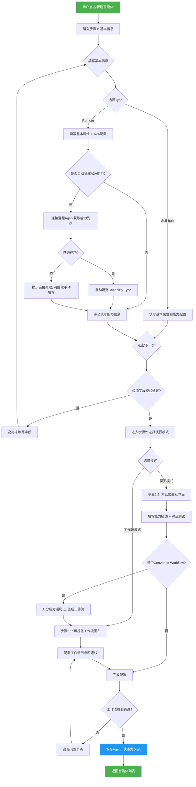

### 5.2 Self-built智能体创建流程

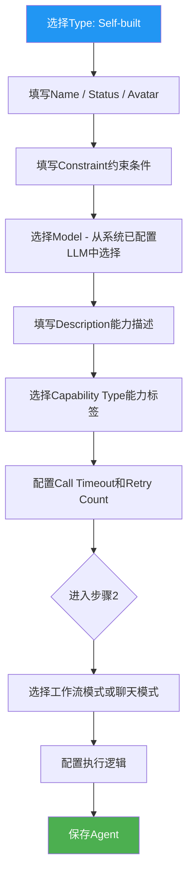

### 5.3 Remote智能体A2A配置流程

```mermaid
flowchart TD
    A[选择Type: Remote] --> B[填写Name / Status / Avatar]
    B --> C[填写Constraint约束条件]
    C --> D[展开A2A配置区域]
    D --> E[填写Service Discovery Address]
    E --> F[填写Call Address - URL格式]
    F --> G[填写Event Subscription URL]
    G --> H[填写AppID]
    H --> I[填写AppKey - 密码输入框]
    I --> J[确认Protocol Version - 默认v1.0]
    J --> K[配置Handshake Timeout - 默认10秒]
    K --> L{点击'自动获取A2A能力列表'}
    L --> M[发起A2A服务发现请求]
    M --> N{服务发现成功?}
    N -->|是| N2{协议版本协商成功?}
    N2 -->|是| O[获取远程Agent能力清单]
    N2 -->|否| N3[保存配置但标记为"协议不兼容"状态]
    N3 --> N4[运行时阻止调用并提示升级协议版本]
    N4 --> Q
    O --> P[解析能力列表, 自动填充Capability Type]
    P --> Q[选择Model]
    N -->|否| R[提示连接失败原因]
    R --> S{是否重试?}
    S -->|是| M
    S -->|否| T[手动填写能力信息]
    T --> Q
    Q --> U[填写Description]
    U --> V[配置Call Timeout和Retry Count]
    V --> W{进入步骤2}
    W --> X[Remote Agent仅支持聊天模式]
    X --> Y[配置对话能力描述]
    Y --> Z[保存Agent]

    style A fill:#9C27B0,color:#fff
    style Z fill:#4CAF50,color:#fff
```

### 5.4 工作流画布操作流程

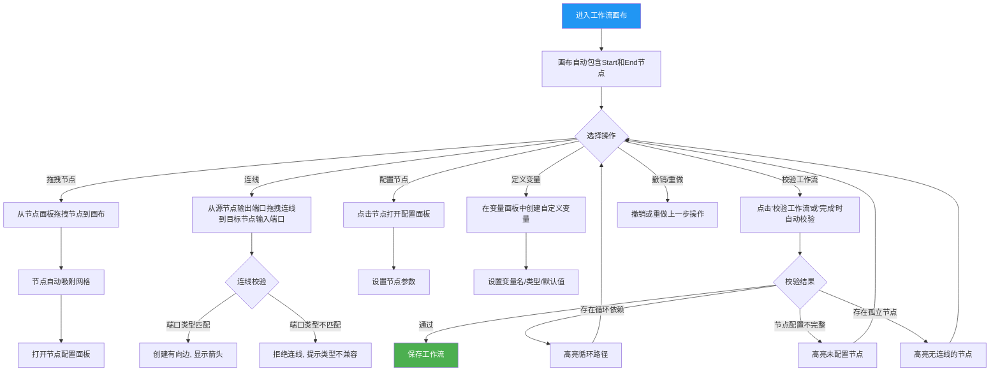

### 5.5 Convert to Workflow转换流程

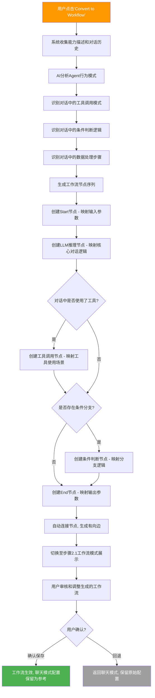

---

## 6. 核心状态模型

### 6.1 智能体状态转换图

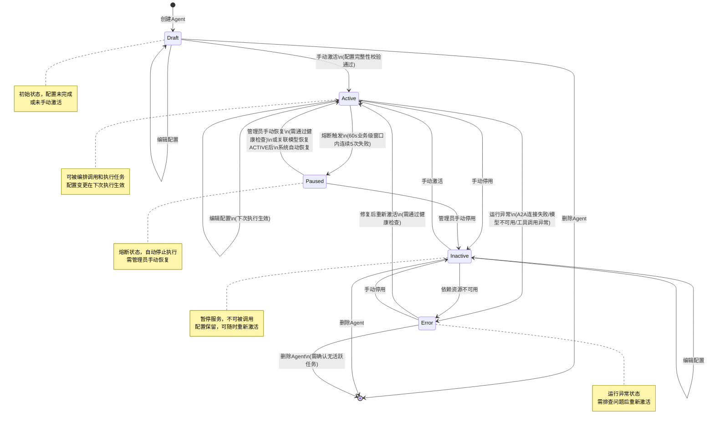

**Error → Active 恢复健康检查流程**：

Agent 从 Error 状态恢复至 Active 状态前，须通过健康检查，具体规则如下：

| 检查项 | 说明 | 通过条件 |
|--------|------|----------|
| 触发方式 | 支持手动触发和自动定时触发 | 手动：管理员在Agent详情页点击"健康检查"；自动：系统每5分钟对Error状态Agent执行一次定时健康检查 |
| 检查内容 | 逐一验证导致Error的根因是否已消除 | A2A连接可达、关联模型可用、工具调用正常 |
| 超时阈值 | 单次健康检查整体超时 | 30秒，超时视为检查未通过 |
| 部分通过 | 部分检查项通过、部分未通过时 | 允许恢复为Active（降级运行），不可用的能力标记为"降级"，编排层调度时跳过降级能力；全部通过则恢复为Active（正常运行） |
| 检查未通过 | 所有检查项均未通过 | 保持Error状态，系统记录检查日志，等待下次触发 |

**模型 UNHEALTHY 降级处理策略**：

当关联的 LLM 模型进入 UNHEALTHY 状态时，Agent 须根据是否配置备选模型执行不同的降级策略，确保与 PRD-04 §5.3 级联通知流程对齐：

| 场景 | Agent 当前状态 | 降级策略 | 降级后状态 | 恢复条件 |
|------|----------------|----------|------------|----------|
| 已配置备选模型 | Active | 自动切换至备选模型，当前执行中的任务在下次推理调用时使用备选模型 | Active（降级运行） | 模型恢复 ACTIVE 后，Agent 自动回切至主模型，无需管理员干预 |
| 未配置备选模型 | Active | 立即暂停执行，拒绝新任务提交，正在执行的任务标记为中断 | Paused | 管理员手动恢复（需通过健康检查）或模型恢复 ACTIVE 后由系统自动恢复 |
| 已配置备选模型 | Paused | 若备选模型可用，自动恢复为 Active（降级运行）；若备选模型也不可用，保持 Paused | Active 或 Paused | 同上 |

**降级决策流程**：
1. 系统接收到模型 UNHEALTHY 通知后，查询所有关联该模型的 Agent；
2. 对每个 Agent 检查是否配置备选模型：
   - **已配置** → 验证备选模型状态是否为 ACTIVE/DEGRADED，若是则自动切换，Agent 保持 Active；若备选模型亦不可用，则按"未配置备选模型"处理；
   - **未配置** → Agent 进入 Paused 状态，系统发送通知至管理员（站内消息 + 邮件），通知内容包含：Agent ID、Agent 名称、不可用模型 ID、建议操作（配置备选模型或等待模型恢复）；
3. 降级决策须在模型 UNHEALTHY 通知到达后 **30 秒内** 完成；
4. 降级结果同步通知编排层（详见 PRD-05 §5.5 编排降级策略）。

**恢复策略**：
- 模型恢复 ACTIVE 后，已配置备选模型的 Agent 自动回切至主模型，无需重新调度；
- 因未配置备选模型而进入 Paused 的 Agent，在模型恢复 ACTIVE 后自动恢复为 Active 状态（无需管理员手动恢复），恢复后立即使用主模型；
- 所有降级/恢复事件须记录审计日志，包含：Agent ID、模型变更详情、降级/恢复时间戳、决策依据。

**Paused 状态周期性对账机制**：

因模型恢复事件可能丢失（SQS 投递失败、消费端异常等），导致 Agent 永久卡在 Paused 状态，系统须执行以下对账补偿：

| 补偿策略 | 规则 | 说明 |
|----------|------|------|
| 定时对账 | 系统每 10 分钟扫描所有 Paused 状态的 Agent，检查其关联模型的当前状态 | 防止恢复事件丢失导致 Agent 永久 Paused |
| 自动恢复 | 若关联模型已恢复为 ACTIVE/DEGRADED，Agent 自动恢复为 Active 状态 | 与模型恢复事件驱动的自动恢复等效 |
| 对账失败告警 | 若 Paused 状态持续超过 30 分钟且关联模型仍为 UNHEALTHY，触发 P1 告警通知管理员 | 提示管理员考虑配置备选模型或手动干预 |
| 审计日志 | 对账触发的自动恢复须记录审计日志，标注恢复原因为"周期性对账自动恢复" | 与事件驱动恢复的审计日志区分 |

### 6.2 智能体类型配置差异状态图

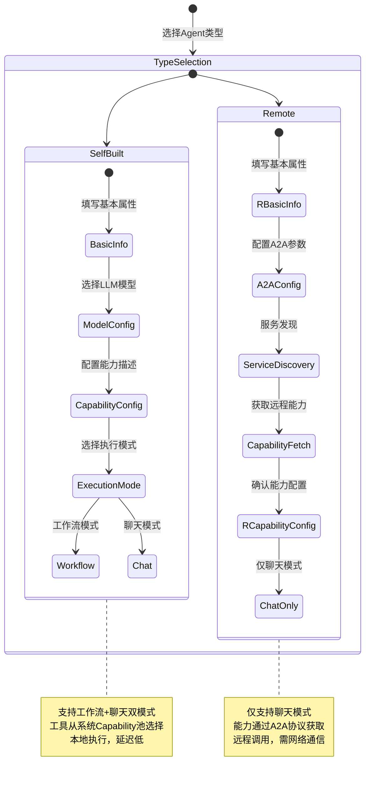

---

## 7. 功能详情

### 7.1 智能体列表

#### 7.1.1 智能体列表展示

**用户故事**：作为平台管理员，我希望查看系统中所有已创建的Agent列表及其关键信息，以便在3秒内快速了解Agent资源池的整体状况和各Agent的运行状态。

**前置条件**：
- 用户已登录系统并具有"智能体管理"模块的查看权限
- 系统中至少存在一个已创建的Agent

**后置条件**：
- 列表页面正确展示所有Agent的核心字段信息
- 支持按字段排序和分页浏览

**主流程**：
1. 用户进入"智能体管理"模块，默认展示智能体列表页面
2. 系统查询所有已创建的Agent记录
3. 列表以表格形式展示以下字段：
   - **Agent Name**：智能体名称，支持点击跳转至Agent详情页
   - **Description**：智能体功能描述，超长文本截断显示（最多100字符）
   - **Type**：智能体类型，以标签形式展示（Self-built-蓝色 / Remote-紫色）
   - **Status**：智能体状态，以状态徽标展示（Active-绿色 / Inactive-灰色 / Draft-黄色 / Error-红色）
   - **Model**：关联的LLM模型名称 [已确认] —— 依据：Agent必须配置Model，列表中展示可快速识别Agent的推理能力
   - **操作列**：包含Edit、Delete、Orchestrate三个操作按钮
4. 列表支持按Agent Name、Status、Model排序
5. 列表支持分页，默认每页展示20条记录
6. 列表顶部提供"新建智能体"快捷入口按钮

**分支流程**：
- **分支A - 无Agent记录**：列表区域显示空状态插图和"暂无智能体，点击创建您的第一个Agent"引导按钮
- **分支B - Agent状态异常**：Status列显示红色Error徽标，鼠标悬停展示错误摘要（如"模型连接失败"、"工具调用异常"）

**异常流程**：
- **异常A - 查询超时**：系统展示加载失败提示，提供"重试"按钮
- **异常B - 权限不足**：页面展示"无权限访问"提示

**交互说明**：
- 列表行支持hover高亮效果
- 操作按钮以图标+Tooltip形式展示
- 删除操作需二次确认弹窗
- Orchestrate按钮点击后跳转至编排管理模块的创建页面，并自动关联该Agent

**验收标准**：
- AC1：列表正确展示Agent Name、Description、Type、Status、Model五个字段
- AC2：Type字段使用颜色编码区分Self-built（蓝色）和Remote（紫色）
- AC3：Status字段使用颜色编码区分四种状态（Active-绿/Inactive-灰/Draft-黄/Error-红）
- AC4：操作列包含Edit、Delete、Orchestrate三个按钮
- AC5：列表支持分页，切换页码后数据在1秒内正确刷新
- AC6：无数据时展示空状态引导界面
- AC7：Orchestrate按钮正确跳转至编排创建页面
- AC8：列表首次加载时间 ≤ 2秒（100条Agent数据内）

---

#### 7.1.2 搜索与筛选

**用户故事**：作为Agent开发者，我希望通过关键词搜索和多维度筛选在3次操作内快速定位目标Agent，以便高效地管理大量Agent资源。

**前置条件**：
- 用户已登录并具有智能体列表的查看权限

**后置条件**：
- 列表根据搜索和筛选条件正确过滤展示

**主流程**：
1. 用户在智能体列表页顶部的搜索框中输入关键词
2. 系统实时搜索（输入防抖300ms），匹配Agent Name和Description字段
3. 用户可通过以下维度筛选：
   - **Status筛选**：All / Active / Inactive / Draft / Error
   - **Type筛选**：All / Self-built / Remote
4. 搜索和筛选条件可叠加使用

**分支流程**：
- **分支A - 无搜索结果**：展示"未找到匹配的智能体"提示
- **分支B - 清除条件**：清空搜索框或点击"All"标签，列表恢复完整展示

**验收标准**：
- AC1：搜索支持按Agent Name和Description模糊匹配
- AC2：输入后500ms内返回搜索结果
- AC3：Status和Type筛选标签正确过滤
- AC4：搜索和筛选条件可叠加使用
- AC5：清除条件后列表恢复完整展示
- AC6：搜索结果为空时展示"未找到匹配的智能体"提示

---

#### 7.1.3 新建智能体

**用户故事**：作为Agent开发者，我希望通过向导式流程在15分钟内创建新的Agent并配置其基本信息和执行逻辑，以便为系统添加新的任务执行能力。

**前置条件**：
- 用户已登录并具有"智能体管理"的创建权限
- 当前无正在进行的Agent创建流程

**后置条件**：
- 新Agent记录写入数据库，状态默认为Draft
- Agent配置信息（基本信息、工作流/聊天模式）持久化存储

**主流程**：
1. 用户在智能体列表页点击"新建智能体"按钮
2. 系统打开创建向导，进入步骤1 - 基本信息（详见7.2节）
3. 用户填写Agent基本信息
4. 用户点击"下一步"，系统校验必填字段
5. 系统进入步骤2，用户选择执行模式：
   - **步骤2.1 - 工作流模式**：通过可视化画布定义Agent内部工作流（详见7.3节）
   - **步骤2.2 - 聊天模式**：通过对话式界面配置Agent能力（详见7.4节）
6. 用户完成配置后点击"完成"
7. 系统保存Agent记录，状态为Draft
8. 页面返回智能体列表，新Agent出现在列表中

**分支流程**：
- **分支A - 仅完成步骤1**：用户在步骤1点击"保存草稿"，Agent以Draft状态保存，执行模式未配置
- **分支B - 步骤间切换**：用户可在步骤1和步骤2之间前后切换，已填写数据自动保留
- **分支C - 切换执行模式**：用户在步骤2中从工作流模式切换至聊天模式，已配置的工作流数据保留但不生效

**异常流程**：
- **异常A - Agent名称重复**：系统实时校验名称唯一性，重复时提示
- **异常B - 保存失败**：系统提示"保存失败，请稍后重试"，保留用户已填写的表单数据

**交互说明**：
- 创建向导采用两步式布局，顶部显示步骤进度条（步骤1/步骤2）
- 步骤2提供模式切换标签（工作流 / 聊天），切换时保留已配置数据
- 每个步骤底部提供"上一步"、"保存草稿"、"下一步/完成"操作按钮

**验收标准**：
- AC1：点击"新建智能体"后，向导在1秒内完成渲染
- AC2：步骤1必填字段未填写时，"下一步"按钮置灰不可点击
- AC3：Agent名称租户内唯一，重复时实时提示（校验响应时间 ≤ 500ms）
- AC4：步骤2支持工作流和聊天两种模式切换
- AC5：保存成功后列表新增对应记录，状态为Draft
- AC6：草稿保存后，未完成的步骤标记为"待配置"
- AC7：步骤间切换时已填写数据自动保留，不丢失

---

#### 7.1.4 编辑智能体

**用户故事**：作为Agent开发者，我希望修改已有Agent的配置信息并在保存后即时生效，以便优化Agent行为或适应业务需求变更。

**前置条件**：
- 用户已登录并具有"智能体管理"的编辑权限
- 目标Agent存在

**后置条件**：
- Agent配置信息更新至数据库
- 变更记录写入审计日志
- 如Agent处于Active状态，变更在下次执行时生效

**主流程**：
1. 用户在智能体列表中点击目标行的"Edit"按钮
2. 系统打开编辑页面，回填当前Agent的所有配置信息
3. 编辑页面复用创建向导的布局，包含步骤1和步骤2
4. 用户修改需要变更的字段
5. 用户点击"保存"
6. 系统校验修改后的配置合法性
7. 系统更新数据库记录
8. 系统记录审计日志
9. 页面返回列表，更新后的信息即时反映

**分支流程**：
- **分支A - Agent处于Active状态**：系统提示"修改配置将在下次执行时生效，当前运行中的任务不受影响"
- **分支B - 修改Agent类型**：从Self-built切换至Remote时，展示A2A配置区域；工作流配置保留但不生效
- **分支C - 修改关联模型**：系统提示"修改模型可能影响Agent推理行为"

**异常流程**：
- **异常A - 并发编辑冲突**：如另一用户正在编辑同一Agent，系统提示"该Agent正在被其他用户编辑"
- **异常B - 保存失败**：系统提示"保存失败"，保留用户修改内容

**交互说明**：
- 编辑页面与创建向导布局一致，但标题显示"编辑智能体"
- 修改后的字段高亮显示变更标记
- 保存按钮在提交期间显示loading状态

**验收标准**：
- AC1：编辑页面正确回填所有配置信息（回填完整率100%）
- AC2：修改后的字段有视觉变更标记（高亮显示）
- AC3：保存成功后列表信息即时更新（≤ 2秒）
- AC4：审计日志正确记录变更内容（包含变更前/后值）
- AC5：Active状态Agent的配置变更在下次执行时生效，当前运行任务不受影响

---

#### 7.1.5 删除智能体

**用户故事**：作为平台管理员，我希望在确认影响范围后安全删除不再使用的Agent，以保持Agent资源池的整洁和安全。

**前置条件**：
- 用户已登录并具有"智能体管理"的删除权限
- 目标Agent存在

**后置条件**：
- Agent记录从数据库中软删除
- Agent关联的工具和模型引用关系解除
- 已引用该Agent的编排收到配置告警通知

**主流程**：
1. 用户在智能体列表中点击目标行的"Delete"按钮
2. 系统弹出二次确认弹窗，显示Agent名称和关联信息
3. 弹窗展示以下信息：
   - Agent名称和类型
   - 关联的编排数量
   - 关联的工具数量
   - 关联的模型名称
4. 用户确认删除
5. 系统执行软删除操作
6. 系统将Agent与工具、模型的关联关系标记为已失效（不可用），保留关联记录以便软删除恢复。30天物理删除时再清除关联记录。
7. 系统将关联编排节点标记为 `agent_deleted=true`（不阻断编排执行，运行时该节点报错并通知编排管理员）
8. 系统检查是否有编排正在引用该Agent
9. 如有引用，系统生成配置告警通知
10. **系统自动清理关联缓存与索引**（A2A 配置缓存、Workflow 节点索引、Chat 配置缓存），清理结果记录至审计日志（与 §20.5 AC-AGT-FK-04 对齐）
11. 页面返回列表，该Agent不再显示

**物理删除善后流程（30天后自动执行）**：
1. 系统将Agent执行日志归档至S3（保留日志用于审计追溯）
2. 系统删除Agent配置记录和所有绑定关系（工具、模型、A2A、工作流、聊天配置）
3. 系统记录物理删除审计日志

**分支流程**：
- **分支A - Agent被编排引用**：确认弹窗中展示受影响编排列表，用户需勾选"我已了解影响"后方可确认
- **分支B - Agent正在执行任务**：系统阻止删除，提示"该Agent正在执行任务，请等待完成后再删除"

**异常流程**：
- **异常A - 删除失败**：系统提示"删除失败，请稍后重试"

**交互说明**：
- 删除确认弹窗采用警告样式（红色边框/图标）
- 弹窗中清晰展示删除影响的范围（编排数、工具数、模型名）
- 删除操作支持"取消"退出

**验收标准**：
- AC1：点击Delete后弹出确认弹窗，展示Agent名称和关联统计
- AC2：确认弹窗展示关联编排数量、工具数量和模型名称
- AC3：确认删除后，Agent从列表中移除（软删除，30天内可恢复）
- AC4：关联关系正确解除（工具引用、模型引用清零）
- AC5：被编排引用时，弹窗展示受影响编排列表，需勾选确认后方可删除
- AC6：活跃任务执行中时，阻止删除并给出明确提示
- AC7：删除操作后，受影响的编排在5分钟内收到告警通知

---

#### 7.1.6 编排入口（Orchestrate）

**用户故事**：作为业务架构师，我希望从智能体列表一键跳转至编排创建页面并自动关联选中的Agent，以便在2次点击内将Agent纳入编排流程。

**前置条件**：
- 用户已登录并具有智能体列表的查看权限和编排的创建权限
- 目标Agent存在且配置完整（至少配置了基本信息和一种执行模式）

**后置条件**：
- 页面跳转至编排创建页面
- 选中的Agent自动添加到编排的Agent列表中

**主流程**：
1. 用户在智能体列表中点击目标行的"Orchestrate"按钮
2. 系统检查Agent配置完整性
3. 系统跳转至编排管理模块的创建向导
4. 编排创建向导的步骤2（协调模式）中，该Agent已作为智能体节点添加到工作流画布上
5. 用户继续完成编排的其他配置

**分支流程**：
- **分支A - Agent配置不完整**：系统提示"该Agent配置不完整，请先完成配置后再编排"，并提供"前往编辑"快捷链接
- **分支B - 已有进行中的编排**：系统提示"检测到进行中的编排草稿，是否将Agent添加到该编排？"（可选）

**异常流程**：
- **异常A - 跳转失败**：系统提示"跳转失败，请稍后重试"

**验收标准**：
- AC1：点击Orchestrate后正确跳转至编排创建页面（跳转时间 ≤ 1秒）
- AC2：Agent作为智能体节点自动添加到工作流画布
- AC3：配置不完整的Agent给出明确提示和"前往编辑"链接
- AC4：跳转后Agent的基本信息和配置正确带入编排

---

### 7.2 创建智能体 - 步骤1：基本信息

**用户故事**：作为Agent开发者，我希望定义Agent的基本属性和通信参数，以便为Agent的执行能力奠定基础配置。

**前置条件**：
- 用户正在创建或编辑Agent
- 用户已进入创建向导的步骤1

**后置条件**：
- Agent基本信息通过合法性校验
- 系统创建/更新Agent记录

**主流程**：
1. 系统展示步骤1 - 基本信息配置页面
2. 用户填写以下字段：

   **A. 基本属性**
   - **Name**：必填，Agent名称，长度2~64字符，全局唯一
     - 示例值："物流查询Agent"、"价格计算Agent"、"订单处理Agent"
   - **Status**：下拉选择
     - Draft（默认）：草稿
     - Active：激活
     - Inactive：停用
   - **Avatar**：选填，Agent头像/图标
     - 支持上传图片或选择预设图标
     - 图片要求：正方形，最大2MB，支持PNG/JPG/SVG
   - **Constraint**：选填，Agent运行约束条件
     - 多行文本框
     - 示例值："单次调用超时30秒，每日调用上限1000次"

   **B. 类型配置**
   - **Type**：单选
     - Self-built（自建）：系统内创建的Agent
     - Remote（远程）：外部系统注册的Agent

   **C. A2A配置（Type = Remote时展示）**
   - **Service Discovery Address**：服务发现地址
   - **Call Address**：远程调用地址（必填，URL格式）
   - **Event Subscription URL**：事件订阅地址
   - **AppID**：应用标识（必填）
   - **AppKey**：应用密钥（密码输入框）
   - **Protocol Version**：协议版本号，默认"v1.0"
   - **Handshake Timeout**：握手超时时间（单位：秒），默认10秒，范围1-60

   **D. 能力配置**
   - **自动获取A2A能力列表**：按钮（仅Type = Remote时展示），点击后系统连接远程Agent获取能力列表
   - **Model**：必填，下拉选择，从系统已配置的LLM模型中选择
   - **Description**：必填，Agent简要描述，最大长度500字符
     - 示例值："负责处理物流相关查询，包括运单追踪、物流状态更新、配送时间预估等"
   - **Capability Type**：选填，能力类型标签，支持多标签
     - 预设标签：物流查询、价格计算、订单管理、库存管理、商品信息、客户服务
     - 支持自定义标签输入
   - **Call Timeout**：调用超时时间（单位：秒），默认30秒，范围5-300
   - **Retry Count**：失败重试次数，默认3次，范围0-10

3. 用户填写所有必填字段和需要的可选字段
4. 用户点击"下一步"进入步骤2

**分支流程**：
- **分支A - Type切换**：从Self-built切换至Remote时，A2A配置区域展开显示；切换回Self-built时折叠隐藏
- **分支B - 自动获取A2A能力列表**：点击后系统连接远程Agent，成功后自动填充Capability Type字段
- **分支C - Model下拉为空**：系统未配置LLM模型时，Model下拉展示"请先配置LLM模型"并提供跳转链接
- **分支D - 保存草稿**：用户点击"保存草稿"，系统保存当前信息并退出向导

**异常流程**：
- **异常A - Agent名称重复**：实时校验，输入框下方显示"该Agent名称已存在"
- **异常B - A2A连接失败**：自动获取能力列表时连接失败，提示"无法连接远程Agent，请检查A2A配置"
- **异常C - Call Address格式不合法**：输入框下方显示"请输入合法的URL地址"

**交互说明**：
- 向导顶部展示步骤进度条（步骤1/步骤2）
- Type选择使用卡片式单选组件
- A2A配置区域默认折叠，Remote类型时自动展开
- 自动获取A2A能力列表按钮在获取期间显示loading动画
- Capability Type使用标签输入组件，支持从预设列表选择或自定义输入

**验收标准**：
- AC1：步骤1正确展示所有字段，必填字段有明确标识（红色星号）
- AC2：Agent Name全局唯一，重复时实时提示（校验响应 ≤ 500ms）
- AC3：Type切换后A2A配置区域正确显示/隐藏（动画过渡 ≤ 300ms）
- AC4：A2A配置包含所有7个字段
- AC5：自动获取A2A能力列表功能正确工作（超时时间 ≤ Handshake Timeout配置值）
- AC6：Model下拉正确展示系统已配置的LLM模型
- AC7：Call Timeout范围校验正确（5-300秒），超出范围时实时提示
- AC8：Retry Count范围校验正确（0-10次），超出范围时实时提示
- AC9：Capability Type支持多标签输入，至少支持6个预设标签 + 自定义输入
- AC10：保存草稿后Agent以Draft状态保存，数据完整不丢失

---

### 7.3 创建智能体 - 步骤2.1：工作流模式

**用户故事**：作为Agent开发者，我希望通过可视化工作流画布定义Agent的内部任务执行逻辑，以便精确控制Agent从接收输入到输出结果的完整执行路径。

**前置条件**：
- 用户已完成步骤1基本信息配置
- 用户在步骤2选择了"工作流模式"
- Agent类型为Self-built（Remote Agent仅支持聊天模式）

**后置条件**：
- Agent内部工作流定义通过合法性校验
- 工作流节点和连接关系持久化存储

**主流程**：
1. 系统展示步骤2.1 - 工作流模式配置页面
2. 页面展示可视化工作流画布，画布左侧展示节点面板
3. 画布自动包含以下预设节点：

   **Start节点（起始节点）**
   - 固定在画布左上角，不可删除
   - 配置项：
     - 输入参数定义：定义Agent接收的输入参数（参数名、类型、是否必填、描述）
     - 输入来源：编排上下文变量 / 用户直接输入 / 上游Agent输出
   - Start节点只能有出边，不能有入边

   **End节点（结束节点）**
   - 固定在画布右下角，不可删除
   - 配置项：
     - 输出参数定义：定义Agent执行结果的输出结构（参数名、类型、描述）
     - 输出格式：JSON / Text / Structured Data
   - End节点只能有入边，不能有出边

4. 节点面板提供以下可添加的节点类型：

   **工具调用节点**
   - 从系统能力池中选择MCP工具进行调用
   - 配置项：工具选择、输入参数映射、输出参数映射、超时时间

   **条件判断节点**
   - 根据条件表达式进行分支判断
   - 配置项：条件表达式（支持变量引用和逻辑运算符）、分支数量（2-N）、默认分支

   **数据处理节点**
   - 对中间数据进行转换和处理
   - 配置项：处理类型（JSON解析/文本提取/格式转换/数据过滤）、输入映射、输出映射

   **变量赋值节点**
   - 设置或更新自定义变量的值
   - 配置项：目标变量、赋值表达式（支持常量、变量引用和表达式）

   **LLM推理节点**
   - 调用LLM模型进行推理
   - 配置项：Prompt模板、模型选择（默认使用Agent配置的模型）、Temperature覆盖（可选）、输出解析规则

5. 用户从节点面板拖拽节点到画布上
6. 用户通过连线工具连接节点，定义执行顺序
7. 用户点击节点打开配置面板，设置节点参数
8. 用户可在画布右侧的变量面板中定义自定义变量：
   - 变量名：文本输入，遵循命名规范（字母开头，支持字母、数字、下划线）
   - 变量类型：String / Number / Boolean / Object / Array
   - 默认值：根据类型输入
   - 作用域：工作流内全局有效
9. 用户点击"完成"保存Agent配置

**分支流程**：
- **分支A - 工具调用节点选择工具**：点击工具选择器，展示系统能力池中所有Available状态的工具列表，支持搜索和分类筛选
- **分支B - 条件判断节点配置**：条件表达式编辑器支持变量引用（${var_name}）和逻辑运算符（&& / || / ! / == / != / > / <）
- **分支C - LLM推理节点Prompt模板**：支持使用变量占位符，系统提供Prompt模板库供选择
- **分支D - 工作流校验失败**：点击"完成"时系统校验工作流完整性，校验失败时高亮问题节点

**异常流程**：
- **异常A - 工作流存在循环依赖**：系统检测到循环依赖，高亮循环路径并提示"工作流存在循环依赖，请修正"
- **异常B - 节点配置不完整**：系统提示"节点[N]配置不完整"，高亮未完成配置的节点
- **异常C - 保存失败**：系统提示"保存失败"，保留画布当前状态

**交互说明**：
- 工作流画布采用无限画布设计，支持鼠标滚轮缩放和拖拽平移
- 节点使用不同颜色区分类型（Start/End-灰色、工具调用-绿色、条件判断-橙色、数据处理-蓝色、LLM推理-紫色、变量赋值-黄色）
- 连线使用带箭头的有向边，支持直线和折线
- 节点配置面板以侧边抽屉形式展开
- 变量面板位于画布右侧，可折叠
- 画布工具栏提供：撤销/重做、对齐工具、自动布局、清空画布、校验工作流
- 右键菜单支持：删除节点、复制节点、禁用节点、查看节点配置

**验收标准**：
- AC1：画布正确展示Start和End节点，且不可删除
- AC2：节点面板提供5种可添加的节点类型
- AC3：支持从面板拖拽节点到画布（拖拽响应延迟 ≤ 100ms）
- AC4：支持通过连线工具连接节点，连线校验端口类型兼容性
- AC5：点击节点可打开配置面板（展开动画 ≤ 300ms）
- AC6：工具调用节点支持从能力池选择工具（仅展示Available状态的工具）
- AC7：条件判断节点支持变量引用（${var_name}）和7种逻辑运算符
- AC8：LLM推理节点支持Prompt模板和变量占位符
- AC9：自定义变量支持创建、编辑和删除，变量名全局唯一
- AC10：工作流校验能检测循环依赖和配置不完整，错误节点高亮显示
- AC11：画布支持缩放（10%-200%）和平移操作
- AC12：撤销/重做功能正常工作，支持最近50步操作
- AC13：工作流节点总数上限为30个，超出时提示限制

---

### 7.4 创建智能体 - 步骤2.2：聊天模式

**用户故事**：作为Agent开发者，我希望通过对话式交互界面配置Agent的对话能力，以便快速创建能够通过自然语言交互完成任务的Agent。

**前置条件**：
- 用户已完成步骤1基本信息配置
- 用户在步骤2选择了"聊天模式"

**后置条件**：
- Agent对话配置持久化存储
- 系统基于能力描述生成初始对话策略

**主流程**：
1. 系统展示步骤2.2 - 聊天模式配置界面，包含以下区域：

   **A. 智能体能力描述区域**
   - 多行文本框，描述Agent的能力范围和专长领域
   - 该描述将作为Agent的系统提示词（System Prompt）的基础
   - 最大长度2000字符
   - 注意：本字段（capability_description，最大2000字符）与步骤1的 Description（500字符）为不同字段。Description 为 Agent 的通用简要介绍，capability_description 为聊天模式下向用户展示的详细能力说明。
   - 示例："你是一个专业的物流查询助手，能够帮助用户查询运单状态、预估配送时间、处理物流异常。你可以调用物流查询工具获取实时数据，并用友好专业的语言回复用户。"
   - 下方提供"AI优化提示词"按钮，点击后AI自动优化能力描述

   **B. 对话式交互界面**
   - 展示对话测试区域，模拟用户与Agent的交互过程
   - 用户可输入测试消息，Agent基于能力描述和已配置的工具/模型进行响应
   - 对话区域展示：
     - 用户消息（右侧气泡，蓝色背景）
     - Agent响应（左侧气泡，白色背景，附带Agent头像和名称）
     - 系统消息（居中提示，如"正在调用物流查询工具..."、"工具调用成功"）
     - 工具调用记录（可折叠展示调用的工具名称、输入参数和返回结果）
   - 对话区域顶部展示当前Agent的名称和状态

   **C. Convert to Workflow按钮**
   - 页面底部提供"Convert to Workflow"按钮
   - 点击后系统将对话式配置转换为可视化工作流
   - 转换后的工作流包含：Start节点 -> LLM推理节点 -> 工具调用节点（如对话中使用了工具）-> End节点

2. 用户填写Agent能力描述
3. 用户可在对话区域进行测试交互
4. 用户点击"完成"保存Agent配置

**分支流程**：
- **分支A - Convert to Workflow**：用户点击"Convert to Workflow"，系统分析能力描述和对话历史，自动生成工作流节点和连接关系，切换至步骤2.1工作流模式展示生成的工作流
- **分支B - AI优化提示词**：用户点击"AI优化提示词"，系统分析当前能力描述并给出优化建议（如补充工具使用指引、增加输出格式要求），用户可接受或忽略
- **分支C - 能力描述为空**：用户未填写能力描述时，对话区域展示"请先填写Agent能力描述"提示
- **分支D - 对话中Agent调用工具**：Agent在对话中自动识别需要调用工具的场景，展示工具调用过程和结果

**异常流程**：
- **异常A - AI分析超时**：AI优化提示词或Convert to Workflow时超时，提示"分析超时，请重试"
- **异常B - Agent响应超时**：对话测试中Agent响应超时，提示"响应超时，请检查模型和工具配置"
- **异常C - 工具调用失败**：对话中工具调用失败，在对话区域展示错误信息和失败原因

**交互说明**：
- 对话区域采用即时通讯样式，消息按时间顺序排列
- Agent响应支持打字机效果（逐字展示），工具调用期间展示loading动画
- 工具调用记录默认折叠，点击可展开查看详细输入输出
- Convert to Workflow按钮带有AI图标
- 对话区域支持清空对话历史（"清除对话"按钮）

**验收标准**：
- AC1：能力描述区域正确展示，支持多行文本输入，最大2000字符
- AC2：对话区域支持模拟交互，消息样式区分用户/Agent/系统三种类型
- AC3：工具调用过程在对话区域正确展示（包含工具名称、输入参数、返回结果）
- AC4：AI优化提示词按钮正确触发优化建议（响应时间 ≤ 10秒）
- AC5：Convert to Workflow正确将对话配置转换为工作流（转换时间 ≤ 15秒）
- AC6：转换后的工作流在步骤2.1中正确展示，包含Start/End/LLM推理节点
- AC7：能力描述为空时对话区域展示提示
- AC8：对话历史支持清空操作
- AC9：Agent响应超时时展示错误提示（超时阈值 = Call Timeout配置值）

---

### 7.5 Self-built与Remote智能体差异对比

**用户故事**：作为Agent开发者，我希望清晰了解Self-built和Remote两种智能体类型的配置差异和适用场景，以便根据业务需求选择合适的智能体类型。

**前置条件**：
- 用户正在创建或编辑Agent
- 用户需要选择Agent类型

**后置条件**：
- 用户根据差异对比选择合适的Agent类型
- 系统根据类型展示对应的配置项

**差异对比表**：

| 维度 | Self-built Agent | Remote Agent |
|------|------------------|--------------|
| **定义** | 在系统内部创建和配置的Agent | 注册在外部系统中的Agent，通过A2A协议通信 |
| **执行位置** | 本地执行 | 远程执行，通过A2A协议调用 |
| **执行模式** | 支持工作流模式 + 聊天模式 | 仅支持聊天模式 [已确认] —— 依据：Remote Agent的工作流由外部系统管理，本地仅负责A2A通信和调用 |
| **工作流配置** | 在本地画布中定义工作流节点和连线 | 无需配置，工作流由远程系统管理 |
| **工具来源** | 从系统Capability池中选择MCP工具 | 通过A2A协议从远程Agent获取能力列表 |
| **A2A配置** | 不需要 | 必须配置（Call Address、AppID、AppKey等） |
| **LLM模型** | 从系统已配置的LLM中选择 | 从系统已配置的LLM中选择 [已确认] —— 依据：Remote Agent在本地仍需LLM进行A2A协议解析和请求构建 |
| **调试方式** | 本地工作流调试 + 对话测试 | 仅对话测试（通过A2A协议与远程Agent交互） |
| **状态监控** | 本地执行状态 + 工具调用状态 | A2A连接状态 + 远程调用状态 |
| **延迟特性** | 低延迟（本地执行） | 较高延迟（网络通信 + 远程执行） |
| **适用场景** | 本地业务逻辑处理、工具调用密集型任务 | 跨系统协作、外部能力集成、第三方服务对接 |
| **错误恢复** | 本地重试 + 降级策略 | A2A重连 + 连续失败后状态变更为Error |

**验收标准**：
- AC1：Type选择卡片中清晰展示两种类型的差异说明
- AC2：选择Self-built时，步骤2提供工作流和聊天两种模式
- AC3：选择Remote时，步骤2仅展示聊天模式
- AC4：Remote类型自动展开A2A配置区域
- AC5：Self-built类型不展示A2A配置区域

---

### 7.6 A2A协议配置完整流程

**用户故事**：作为Agent开发者，我希望按照引导式流程完成Remote Agent的A2A协议配置，以便实现与外部系统Agent的通信和协作。

**前置条件**：
- 用户已选择Agent类型为Remote
- 用户已填写基本属性（Name、Status等）
- 外部系统已部署支持A2A协议的Agent服务

**后置条件**：
- A2A配置信息持久化存储
- 系统可成功与远程Agent建立通信

**主流程**：

**阶段1：服务发现（Service Discovery）**
1. 用户填写Service Discovery Address（服务发现地址）
2. 系统向服务发现地址发送发现请求，获取远程Agent的服务清单
3. 服务发现返回以下信息：
   - 可用的Agent服务列表
   - 各Agent的能力描述
   - 调用端点地址
4. [已确认] 系统校验服务发现响应格式是否符合A2A协议规范 —— 依据：A2A协议需定义标准的服务发现响应格式

**阶段2：能力获取（Capability Fetch）**
5. 用户点击"自动获取A2A能力列表"按钮
6. 系统根据服务发现结果，向远程Agent发送能力查询请求
7. 远程Agent返回能力清单，包含：
   - 能力名称和描述
   - 输入参数定义
   - 输出参数定义
   - 调用频率限制
8. 系统解析能力清单，自动填充Capability Type字段
9. 用户确认或手动调整能力标签

**阶段3：远程调用配置（Remote Call Configuration）**
10. 用户填写Call Address（远程调用地址），格式必须为http://或https://开头
11. 用户填写Event Subscription URL（事件订阅地址）[已确认] —— 依据：A2A协议支持事件订阅机制，用于接收远程Agent的异步通知
12. 用户填写AppID和AppKey进行身份认证
13. 系统对AppKey进行加密存储，展示时脱敏处理（仅显示前4位和后4位）
14. 用户确认Protocol Version（默认v1.0）
15. 用户配置Handshake Timeout（默认10秒，范围1-60秒）

**阶段4：连接验证（Connection Verification）**
16. [已确认] 用户点击"测试连接"按钮，系统发起A2A握手请求 —— 依据：A2A配置完成后需验证连接可用性
17. 系统使用AppID和AppKey向Call Address发起认证握手
18. 握手成功：提示"连接测试成功"，展示远程Agent基本信息
19. 握手失败：提示具体失败原因（认证失败/网络超时/地址不可达）

**分支流程**：
- **分支A - 服务发现失败**：系统提示"服务发现失败，请检查地址和A2A协议版本"，用户可手动填写Call Address
- **分支B - 能力获取超时**：系统提示"能力获取超时"，用户可手动填写Capability Type
- **分支C - AppKey格式不合法**：输入框下方显示格式要求提示
- **分支D - 协议版本协商失败**：本地Agent与远程Agent的Protocol Version不兼容时，系统保存A2A配置但将Agent标记为"协议不兼容"状态；处于该状态的Agent在运行时被阻止发起A2A调用，编排层调度时提示"该Agent A2A协议版本不兼容，请升级协议版本后再使用"；用户可在配置页面修改Protocol Version后重新发起协商

**异常流程**：
- **异常A - A2A连接连续3次失败**：Agent状态自动变更为Error，系统发送告警通知
- **异常B - 远程Agent返回非标准A2A协议响应**：系统提示"远程Agent响应格式不符合A2A协议规范"

**验收标准**：
- AC1：A2A配置区域包含7个必填/选填字段
- AC2：服务发现请求超时时间 ≤ Handshake Timeout配置值
- AC3：能力获取成功后自动填充Capability Type（填充准确率 ≥ 90%）
- AC4：AppKey在数据库中加密存储，展示时脱敏处理
- AC5：Call Address格式校验正确（必须http://或https://开头）
- AC6：连接测试功能正确工作（测试超时 = Handshake Timeout）
- AC7：A2A连接连续3次失败后Agent状态自动变更为Error

---

### 7.7 工作流画布完整交互规则（引用PRD-05 §7.7画布规范）

**用户故事**：作为Agent开发者，我希望工作流画布提供流畅的拖拽、连线和校验交互，以便高效地定义Agent的执行逻辑。

**前置条件**：
- 用户已进入步骤2.1工作流模式
- Agent类型为Self-built

**后置条件**：
- 工作流节点和连线正确保存

**交互规则**：

**A. 节点拖拽规则**
1. 用户从左侧节点面板拖拽节点到画布区域
2. 节点放置时自动吸附到最近的网格点（网格间距20px）
3. 节点放置后自动弹出配置面板（首次放置时）
4. 同类型节点可多次添加，但节点总数上限为30个
5. 节点支持在画布内自由拖动调整位置
6. 拖动节点时，关联的连线自动跟随调整

**B. 连线规则**
1. 用户从源节点的输出端口拖拽连线到目标节点的输入端口
2. 连线方向为有向边，箭头指向目标节点
3. 连线校验规则：
   - Start节点只能有出边，不能有入边
   - End节点只能有入边，不能有出边
   - 不允许自连接（同一节点的输出连到自己的输入）
   - 不允许重复连线（相同的源端口和目标端口之间只能有一条连线）
   - [已确认] 端口类型需兼容（如Object类型输出不能连接String类型输入） —— 依据：类型安全是工作流引擎的基本要求
4. 连线样式支持直线和折线（默认折线）
5. 连线支持删除（点击连线后按Delete键或右键菜单删除）

**C. 节点校验规则**
1. 工作流校验在以下时机触发：
   - 用户点击"完成"保存时
   - 用户点击"校验工作流"按钮时
   - [已确认] 用户切换步骤或关闭画布时自动触发 —— 依据：防止用户遗漏校验导致保存无效工作流
2. 校验项：
   - 必须存在从Start到End的可达路径
   - 不存在循环依赖（除Loop节点外）
   - 所有节点配置完整（必填参数已填写）
   - 无孤立节点（除Start/End外，所有节点至少有一条入边或出边）
   - 工具调用节点已选择工具
   - LLM推理节点已配置Prompt模板
   - 条件判断节点至少有2个分支
3. 校验失败时：
   - 高亮问题节点（红色边框）
   - 在画布底部展示校验结果面板，列出所有问题
   - 点击问题项可定位到对应节点

**D. 画布操作规则**
1. 缩放：鼠标滚轮缩放，范围10%-200%，默认100%
2. 平移：按住空格键+鼠标拖拽，或鼠标中键拖拽
3. 撤销/重做：Ctrl+Z / Ctrl+Shift+Z，支持最近50步操作
4. 多选：按住Shift键点击多选节点，或框选
5. 对齐：选中多个节点后使用对齐工具（左对齐/居中/右对齐/等间距）
6. 自动布局：一键自动排列所有节点
7. 清空画布：保留Start和End节点，删除其他所有节点和连线

**验收标准**：
- AC1：节点拖拽到画布后自动吸附网格（吸附精度 ≤ 20px）
- AC2：连线校验5条规则全部生效，违规连线被拒绝并提示原因
- AC3：工作流校验能检测7类校验项，校验结果在3秒内返回
- AC4：校验失败时问题节点高亮（红色边框），底部展示问题列表
- AC5：画布缩放范围10%-200%，平移流畅无卡顿
- AC6：撤销/重做支持最近50步操作
- AC7：多选和对齐功能正常工作
- AC8：自动布局后节点间距合理，无重叠

---

### 7.8 聊天模式对话管理机制

**用户故事**：作为Agent开发者，我希望在聊天模式中管理Agent的对话上下文和工具调用行为，以便测试和优化Agent的对话能力。

**前置条件**：
- 用户已进入步骤2.2聊天模式
- 用户已填写Agent能力描述
- Agent已关联LLM模型

**后置条件**：
- 对话测试记录用于Convert to Workflow分析
- 对话历史不持久化，页面关闭后清除

**对话管理机制**：

**A. 对话上下文管理**
1. 每次打开聊天模式时创建新的对话会话
2. 对话上下文包含：
   - System Prompt：基于Agent能力描述自动生成
   - 对话历史：用户消息和Agent响应的有序列表
   - 工具调用记录：Agent在对话中调用的工具列表及结果
3. 对话上下文窗口受Agent关联LLM的Max Context限制
4. [已确认] 当对话历史超过Max Context的80%时，系统自动截断最早的历史消息 —— 依据：需保留空间给工具调用结果和系统提示词

> **Chat 上下文窗口与摘要压缩策略遵循 PRD-00 §5 统一基线**:单次请求允许最大 32 轮对话上下文,超过 32 轮自动截断最早消息(保留 system 消息);超过 80 轮触发 LLM 摘要压缩。Agent 模块不再单独定义轮次阈值,本节 [已确认] 的 80% 表述仅作为补充提示,实际截断/压缩触发以 PRD-00 §5 为准。

**B. 工具调用行为**
1. Agent在对话中自动判断是否需要调用工具
2. 工具调用流程：
   - Agent识别用户意图需要工具支持
   - Agent生成工具调用请求（工具名称 + 输入参数）
   - 系统执行工具调用，返回结果
   - Agent基于工具结果生成自然语言回复
3. 工具调用记录展示：
   - 调用状态：进行中（loading动画）/ 成功（绿色标记）/ 失败（红色标记）
   - 工具名称和描述
   - 输入参数（JSON格式，可折叠）
   - 返回结果（JSON格式，可折叠）
4. 工具调用失败时，Agent尝试不使用工具回答或提示用户

**C. 对话历史管理**
1. 对话历史按时间顺序排列
2. 支持清空对话历史（"清除对话"按钮）
3. 对话历史不持久化，页面关闭后自动清除
4. [已确认] 对话历史支持导出为JSON格式，用于离线分析 —— 依据：开发者需要分析对话模式以优化Agent行为

**验收标准**：
- AC1：每次打开聊天模式创建新的对话会话
- AC2：System Prompt基于Agent能力描述自动生成
- AC3：Chat 模式单次请求超过 32 轮自动截断最早消息(保留 system 消息);超过 80 轮触发 LLM 摘要压缩(具体阈值与触发条件遵循 PRD-00 §5 Chat 模式规范)
- AC4：工具调用过程在对话区域正确展示（状态、参数、结果）
- AC5：工具调用失败时Agent给出合理的降级回复
- AC6：清空对话历史后对话区域重置为初始状态
- AC7：页面关闭后对话历史自动清除

---

### 7.9 Convert to Workflow的AI分析逻辑

**用户故事**：作为Agent开发者，我希望系统自动将聊天模式的对话配置转换为可视化工作流，以便在保持Agent对话能力的同时获得更精确的执行控制。

**前置条件**：
- 用户已配置聊天模式（能力描述 + 对话测试）
- Agent类型为Self-built

**后置条件**：
- 转换后的工作流在步骤2.1中展示
- 原始聊天配置保留为参考
- 用户确认后工作流生效

**AI分析逻辑**：

**A. 输入数据收集**
1. Agent能力描述文本
2. 对话历史记录（用户消息 + Agent响应 + 工具调用记录）
3. Agent关联的工具列表
4. Agent关联的LLM模型信息

**B. 分析步骤**
1. **意图识别**：分析能力描述，提取Agent的核心功能意图
2. **工具调用模式识别**：分析对话历史中的工具调用记录，识别：
   - 使用了哪些工具
   - 工具调用的触发条件
   - 工具调用的输入参数映射
   - 工具调用结果的处理方式
3. **条件分支识别**：分析对话历史，识别：
   - 用户意图的分类（如查询/修改/删除）
   - 不同意图对应的处理路径
   - 默认处理路径
4. **数据处理步骤识别**：分析对话历史，识别：
   - 输入数据的预处理步骤
   - 输出数据的格式化步骤
   - 中间数据的转换步骤
5. **工作流生成**：基于以上分析结果，生成工作流节点和连线

**C. 生成规则**
1. 始终生成Start节点和End节点
2. 核心对话逻辑映射为LLM推理节点
3. 工具调用映射为工具调用节点
4. 条件分支映射为条件判断节点
5. 数据处理映射为数据处理节点
6. 节点之间的执行顺序基于对话时序确定
7. [已确认] 如果对话历史不足（少于3轮），系统仅生成最小工作流（Start -> LLM推理 -> End） —— 依据：对话历史不足时无法准确识别工具调用和条件分支模式

**D. 转换后处理**
1. 转换完成后自动切换至步骤2.1工作流模式
2. 生成的工作流需用户审核确认后方可保存
3. 用户可手动调整生成的工作流（添加/删除/修改节点）
4. 原始聊天配置保留，支持回退到聊天模式

**验收标准**：
- AC1：Convert to Workflow按钮点击后，AI分析在15秒内完成
- AC2：转换后的工作流包含Start节点和End节点
- AC3：对话中使用的工具正确映射为工具调用节点
- AC4：对话中的条件分支正确映射为条件判断节点
- AC5：转换后的工作流通过合法性校验
- AC6：用户确认前工作流不自动保存
- AC7：支持回退到聊天模式，原始配置不丢失
- AC8：对话历史不足3轮时，生成最小工作流

---

### 7.10 智能体与LLM的关联配置

**用户故事**：作为Agent开发者，我希望为Agent选择和配置合适的LLM模型，以便Agent具备所需的推理和决策能力。

**前置条件**：
- 系统中已配置至少一个LLM模型（详见PRD-04）
- 用户正在创建或编辑Agent

**后置条件**：
- Agent与LLM模型建立关联关系
- Agent执行时使用关联的LLM模型进行推理

**关联配置规则**：

**A. 模型选择**
1. Agent的Model字段为必填项
2. 模型下拉列表展示系统已配置的所有Available状态LLM模型
3. 模型列表展示信息：Model Name、API Protocol、Max Context
4. 选择模型后，系统展示该模型的关键参数（Temperature、Top P等）

**B. 模型参数覆盖**
1. [已确认] Agent级别可覆盖LLM的全局默认参数 —— 依据：不同Agent可能需要不同的推理参数（如创意型Agent需要高Temperature，精确型Agent需要低Temperature）
2. 可覆盖的参数：
   - Temperature：默认使用LLM全局配置，Agent级别可覆盖
   - Top P：默认使用LLM全局配置，Agent级别可覆盖
   - Max Context：不可覆盖，使用LLM全局配置
3. 工作流中的LLM推理节点可进一步覆盖Agent级别的参数

**C. 模型变更影响**
1. 修改Agent关联的LLM模型时，系统提示"修改模型可能影响Agent推理行为"
2. 模型变更后，Agent的工作流和聊天模式配置不受影响
3. [已确认] 模型变更后，系统记录变更日志，包含变更前后的模型信息 —— 依据：模型变更是影响Agent行为的关键操作，需审计追踪

**D. 模型不可用处理**
1. 当Agent关联的LLM模型状态变为ERROR或INACTIVE时（业务语义：模型不可用）：
   - Agent状态不变，但执行时返回"模型不可用"错误
   - 系统发送告警通知给Agent创建者
2. 当Agent关联的LLM模型被删除时：
   - 系统自动将Agent状态变更为Error
   - 系统发送告警通知，提示重新配置模型

**验收标准**：
- AC1：Model下拉列表仅展示Available状态的LLM模型
- AC2：选择模型后展示关键参数信息
- AC3：Agent级别可覆盖Temperature和Top P参数
- AC4：模型变更时系统提示影响说明
- AC5：关联模型变为ERROR或INACTIVE时，Agent执行返回错误并告警
- AC6：关联模型被删除时，Agent状态自动变更为Error

#### Agent 运行时异常用户反馈规范

Agent 运行时异常必须通过 AG-UI `RUN_ERROR` 事件推送到前端，统一展示规范如下：

| 异常类型 | 用户侧展示 | 自动处理 | AG-UI 事件 |
|----------|-----------|----------|-----------|
| LLM 不可用 | "AI 助手暂时无法响应，请稍后重试" | 自动重试1次（切换备选模型） | `RUN_ERROR { type: "LLM_UNAVAILABLE", retryable: true }` |
| 工具调用超时 | "操作超时，请重试" | 降级为纯文本回复（跳过工具调用） | `RUN_ERROR { type: "TOOL_TIMEOUT", retryable: true }` |
| Token 预算耗尽 | "当前对话上下文过长，建议开启新对话" | 自动截断最早的历史消息 | `RUN_ERROR { type: "TOKEN_BUDGET_EXCEEDED", retryable: false }` |
| 权限不足 | "您没有执行此操作的权限" | 不重试 | `RUN_ERROR { type: "PERMISSION_DENIED", retryable: false }` |
| Agent 已停用 | "该助手已停用，请联系管理员" | 不重试 | `RUN_ERROR { type: "AGENT_DISABLED", retryable: false }` |

**前端处理规则**：
1. `retryable: true` 的异常：显示重试按钮，用户可手动重试
2. `retryable: false` 的异常：仅显示提示信息，不提供重试按钮
3. 所有异常均记录到 Agent 运行日志，供运维排查

---

### 7.11 智能体与Capability的关联配置

**用户故事**：作为Agent开发者，我希望为Agent选择和配置所需的工具能力，以便Agent在执行任务时能够调用相应的工具。

**前置条件**：
- 系统中已配置至少一个MCP Server和Available状态的工具（详见PRD-03）
- 用户正在创建或编辑Self-built Agent的工作流

**后置条件**：
- Agent与Capability建立关联关系
- Agent工作流中的工具调用节点可使用关联的工具

**关联配置规则**：

**A. 工具选择**
1. 在工作流画布的工具调用节点中，从系统能力池选择工具
2. 工具选择器展示信息：工具名称、所属Provider、状态、描述
3. 仅展示Available状态的工具
4. 支持按Provider分类筛选和关键词搜索

**B. 工具参数映射**
1. 选择工具后，系统自动展示该工具的输入参数定义
2. 用户配置输入参数映射：
   - 支持从工作流变量映射（${var_name}）
   - 支持从上游节点输出映射
   - 支持常量值输入
3. 用户配置输出参数映射：
   - 工具输出可映射到工作流变量
   - 工具输出可作为下游节点的输入

**C. 工具状态变更影响**
1. 当Agent关联的工具状态变为Disabled时：
   - 工作流中该工具的调用节点标记为"工具不可用"（橙色警告）
   - Agent仍可激活，但执行到该节点时返回错误
2. 当Agent关联的工具被删除时：
   - 工作流中该工具的调用节点标记为"工具已删除"（红色错误）
   - 工作流校验失败，Agent不可激活

**D. 工具调用监控**
1. [已确认] 工具调用记录包含：调用时间、输入参数、输出结果、耗时、状态 —— 依据：运行时监控需要完整的工具调用链路追踪
2. 工具调用超时使用Agent级别的Call Timeout配置
3. 工具调用失败使用Agent级别的Retry Count配置，重试间隔采用指数退避策略

**验收标准**：
- AC1：工具选择器仅展示Available状态的工具
- AC2：选择工具后自动展示输入参数定义
- AC3：输入参数支持从变量、上游输出和常量三种来源映射
- AC4：工具状态变为Disabled时，调用节点标记警告
- AC5：工具被删除时，调用节点标记错误，工作流校验失败
- AC6：工具调用超时和重试使用Agent级别配置

---

### 7.12 智能体运行时监控和日志

**用户故事**：作为平台管理员，我希望查看Agent的运行状态和执行日志，以便及时发现和排查Agent运行异常。

**前置条件**：
- 用户已登录并具有"智能体管理"的查看权限
- 目标Agent存在且至少执行过一次任务

**后置条件**：
- 用户了解Agent的运行状态和执行情况

**监控内容**：

**A. 运行状态监控**
1. Agent当前状态（Active/Inactive/Draft/Error）
2. [已确认] 最近24小时执行统计 —— 依据：运行时监控需要时间维度的执行数据
   - 执行次数
   - 成功次数
   - 失败次数
   - 平均执行耗时
3. Remote Agent额外展示：
   - A2A连接状态（已连接/断开/未知）
   - 最近一次A2A握手时间
   - A2A连接连续失败次数

**B. 执行日志**
1. 日志列表展示字段：
   - 执行时间（开始时间 - 结束时间）
   - 执行状态（成功/失败/超时）
   - 执行耗时（毫秒）
   - 触发来源（编排调用/手动测试/API调用）
   - 错误信息（失败时展示）
2. 日志详情展示：
   - 完整的执行路径（工作流节点执行顺序）
   - 每个节点的输入/输出
   - 工具调用记录（工具名称、输入参数、输出结果、耗时）
   - LLM推理记录（Prompt、Completion、Token用量）
3. 日志保留策略：[已确认] 最近30天的执行日志可在线查看，更早的日志归档存储 —— 依据：30天是常见的日志在线保留周期

**C. 告警机制**
1. Agent状态变更为Error时，系统发送告警通知
2. 告警通知方式：[已确认] 站内消息 + 邮件通知 —— 依据：关键状态变更需要多渠道通知确保及时响应
3. 告警通知内容：
   - Agent名称和类型
   - 错误原因摘要
   - 发生时间
   - 快捷操作链接（查看详情/重新激活）

**验收标准**：
- AC1：Agent运行状态页面正确展示当前状态和执行统计
- AC2：执行日志列表展示5个核心字段
- AC3：日志详情展示完整的执行路径和工具调用记录
- AC4：Agent状态变更为Error后5分钟内发送告警通知
- AC5：告警通知包含Agent名称、错误原因和快捷操作链接
- AC6：日志查询响应时间 ≤ 3秒（最近7天数据）

---

## 8. 业务规则

### 8.1 智能体管理规则

| 规则编号 | 规则描述 |
|----------|----------|
| AGT-BR-001 | Agent Name在租户内唯一，不区分大小写 |
| AGT-BR-002 | 新建Agent默认状态为Draft，需手动激活为Active |
| AGT-BR-003 | Agent删除采用软删除机制，保留30天后物理删除。软删除时标记关联编排节点为 `agent_deleted=true`（不阻断执行，运行时报错并通知编排管理员）；30天后物理删除时保留执行日志（归档至S3），删除Agent配置和绑定关系 |
| AGT-BR-004 | 处于Active状态且正在执行任务的Agent不允许删除 |
| AGT-BR-005 | Agent必须配置至少一种执行模式（工作流或聊天）才能激活为Active |
| AGT-BR-006 | Agent的Model配置为必填项，未配置模型的Agent不可激活 |
| AGT-BR-007 | Agent激活时系统校验配置完整性：基本信息完整 + 至少一种执行模式已配置 + Model已选择 |
| AGT-BR-008 | Agent从Error状态恢复为Active前，需通过健康检查（模型可用性 + 工具可用性 + A2A连通性） |

### 8.2 工作流规则

| 规则编号 | 规则描述 |
|----------|----------|
| AGT-BR-009 | Agent工作流必须包含Start节点和End节点 |
| AGT-BR-010 | Agent工作流不允许存在循环依赖（除Loop节点外） |
| AGT-BR-011 | Agent工作流节点总数上限为30个 |
| AGT-BR-012 | Agent工作流中工具调用节点的数量上限为15个 |
| AGT-BR-013 | 自定义变量名必须以字母开头，仅包含字母、数字和下划线 |
| AGT-BR-014 | 自定义变量名在Agent工作流内唯一 |
| AGT-BR-015 | 工作流校验必须通过后才能保存和激活Agent |

### 8.3 聊天模式规则

| 规则编号 | 规则描述 |
|----------|----------|
| AGT-BR-016 | Agent能力描述最小长度为20个字符 |
| AGT-BR-017 | Convert to Workflow转换后的工作流需经用户确认后方可保存 |
| AGT-BR-018 | AI优化提示词不修改原始描述，仅提供建议供用户参考 |
| AGT-BR-019 | 对话测试区域的消息记录不持久化，页面关闭后清除 |
| AGT-BR-020 | Chat 模式单次请求允许最大 32 轮对话上下文,超过 32 轮自动截断最早消息(保留 system 消息);超过 80 轮触发 LLM 摘要压缩(基线参见 PRD-00 §5 Chat 模式规范) |

### 8.4 A2A通信规则

| 规则编号 | 规则描述 |
|----------|----------|
| AGT-BR-021 | Handshake Timeout取值范围为1-60秒 |
| AGT-BR-022 | A2A能力列表获取失败不影响Agent基本配置的保存 |
| AGT-BR-023 | Remote类型Agent的Call Address必须以http://或https://开头 |
| AGT-BR-024 | AppKey在数据库中加密存储，展示时脱敏处理 |
| AGT-BR-025 | Remote类型Agent在A2A连接连续3次失败后，状态自动变更为Error |
| AGT-BR-026 | [已确认] A2A协议通信使用TLS加密传输 —— 依据：AppKey等敏感凭证需安全传输 |

### 8.5 执行规则

| 规则编号 | 规则描述 |
|----------|----------|
| AGT-BR-027 | Call Timeout取值范围为5-300秒 |
| AGT-BR-028 | Retry Count取值范围为0-10次，重试间隔采用指数退避策略（1s, 2s, 4s, 8s...） |
| AGT-BR-029 | Agent执行超时后，系统记录超时日志并返回超时错误响应 |
| AGT-BR-030 | Agent配置变更后，正在执行的任务使用变更前的配置，新任务使用变更后的配置 |
| AGT-BR-031 | Remote Agent仅支持聊天模式，不支持工作流模式 |
| AGT-BR-032 | 单个 Agent 同时执行的最大任务数上限为10（范围1-50），超出后新请求排队等待，队列满时返回业务错误码 137501 |

---

## 9. 数据模型

> **v6 收束说明**：本节为模块内数据模型详细描述。v6 收束后的权威 DDL 请参考 **§33 附录 D PostgreSQL 数据模型**。本节作为详细描述参考保留，便于追溯。

> **权威声明**：v3.6已将数据模型字段与DDL（§33.1）取并集统一，命名以DDL为准。数据模型现为DDL的完整业务描述，两者字段一一对应。数据模型保留了DDL未包含的业务字段（avatar, constraint, memory_id, knowledge_id, capability_types, owner_scope），需在DDL开发阶段补充。

**字段对齐表（DDL §33.1 ↔ 数据模型 §9.1 Agent主表）**

> **v3.6 统一声明**：数据模型字段已与DDL取并集统一，命名以DDL为准。以下为历史映射记录，供追溯参考。

**历史命名映射（已统一，DDL列名 = 数据模型字段名）**

| 历史数据模型字段名 | DDL列名（现统一） | 说明 |
|------------------|------------------|------|
| name | agent_name | Agent名称 |
| model_id | llm_config_id | 关联的LLM模型配置ID |
| call_timeout | timeout_seconds | 调用超时时间（秒） |
| retry_count | max_retries | 失败重试次数 |
| execution_mode | execution_mode | 执行模式 |

**历史DDL独有字段（已补充至数据模型）**

workflow_id, prompt_template_id, endpoint_url, auth_type, auth_credential, mode_specific_config, owner_id, is_deleted — 共8项，v3.6已补充。

**数据模型独有字段（已补充至DDL）**

avatar, constraint, memory_id, knowledge_id, capability_types, owner_scope — 共6项，v3.6已补充至DDL。

### 9.1 Agent主表

| 字段名 | 类型 | 必填 | 默认值 | 说明 |
|--------|------|------|--------|------|
| id | UUID | 是 | 自动生成 | Agent唯一标识，复合主键第二列 |
| **tenant_id** | **UUID** | **是** | **—** | **租户 ID（由partition_key派生，GENERATED ALWAYS AS (partition_key::uuid) STORED）** |
| agent_name | String(64) | 是 | — | Agent名称，同租户内唯一（含deleted_at） |
| description | Text | 否 | null | Agent能力描述 |
| type | String(16) | 是 | — | Agent类型：SELF_BUILT / REMOTE |
| execution_mode | String(16) | 是 | — | 执行模式：WORKFLOW / CHAT |
| status | String(16) | 是 | draft | Agent状态：DRAFT / ACTIVE / INACTIVE / PAUSED / ERROR |
| avatar | String | 否 | null | Agent头像URL |
| constraint | Text | 否 | null | Agent运行约束条件 |
| llm_config_id | UUID | 否 | null | 关联的LLM模型配置ID（**强外键 → tenant_llm_model_configs.id，soft_delete_flag**） |
| workflow_id | UUID | 否 | null | 关联工作流ID（**强外键 → tenant_orchestration_orchestrations.id，soft_delete_flag**） |
| prompt_template_id | UUID | 否 | null | 关联提示词模板ID |
| memory_id | UUID | 否 | null | 关联的记忆ID（**强外键 → memories.id，soft_delete_flag**） |
| knowledge_id | UUID | 否 | null | 关联的知识库ID（**强外键 → knowledges.id，soft_delete_flag**） |
| capability_types | JSON | 否 | [] | 能力类型标签数组（关联 capability 多对多，见 agent_capability_binding） |
| endpoint_url | Text | 否 | null | 远程调用端点URL（REMOTE类型必填） |
| auth_type | String(16) | 否 | null | 认证类型 |
| auth_credential | Text | 否 | null | 认证凭据（加密存储） |
| mode_specific_config | JSON | 是 | {} | 模式专属配置 |
| timeout_seconds | Integer | 是 | 300 | 调用超时时间（秒），范围5-300 |
| max_retries | Integer | 是 | 3 | 失败重试次数，范围0-10 |
| owner_id | UUID | 是 | — | 所有者ID |
| **owner_scope** | **String(16)** | **是** | **OWN** | **所有者范围：OWN / SHARED / PUBLIC** |
| **version** | **Integer** | **是** | **1** | **乐观锁版本号** |
| is_deleted | Boolean | 否 | false | 软删除标记（由 `deleted_at IS NOT NULL` 派生，STORED计算列） |
| deleted_at | Timestamp | 否 | null | 软删除时间（null表示未删除） |
| created_at | Timestamp | 是 | 当前时间 | 创建时间 |
| updated_at | Timestamp | 是 | 当前时间 | 最后更新时间 |
| created_by | UUID | 是 | — | 创建者用户ID |
| updated_by | UUID | 否 | null | 最后更新者用户ID |

> **强引用外键说明**（与 PRD-00 §7.5 Neo4j 多租户、§9 字段级加密规范保持一致）：
> - 所有跨表外键（LLM、Capability、Memory、Knowledge、Workflow 等）使用**逻辑外键** + `soft_delete_flag` 字段，防止被引用方物理删除后导致 Agent 异常。
> - 删除 LLM / Memory / Knowledge 时需校验是否被 Agent 引用，引用计数 > 0 时禁止物理删除。

### 9.2 A2A配置表

| 字段名 | 类型 | 必填 | 默认值 | 说明 |
|--------|------|------|--------|------|
| id | UUID | 是 | 自动生成 | A2A配置唯一标识 |
| **tenant_id** | **UUID** | **是** | **—** | **租户 ID（继承自 agent.tenant_id）** |
| agent_id | UUID | 是 | — | 关联的Agent ID（**强外键 → agents.id，soft_delete_flag**） |
| service_discovery_address | String | 否 | null | 服务发现地址 |
| call_address | String | 是 | — | 远程调用地址（URL格式） |
| event_subscription_url | String | 否 | null | 事件订阅地址 |
| app_id | String | 是 | — | 应用标识 |
| app_key | String | 是 | — | 应用密钥（AES-256-GCM 加密存储，密钥由 KMS 托管，详见 PRD-00 §9） |
| protocol_version | String | 否 | "v1.0" | A2A协议版本号 |
| handshake_timeout | Integer | 否 | 10 | 握手超时时间（秒），范围1-60 |
| last_handshake_at | Timestamp | 否 | null | 最近一次握手成功时间 |
| consecutive_failures | Integer | 否 | 0 | 连续握手失败次数 |
| created_at | Timestamp | 是 | 当前时间 | 创建时间 |
| updated_at | Timestamp | 是 | 当前时间 | 最后更新时间 |

### 9.3 Agent工作流表

| 字段名 | 类型 | 必填 | 默认值 | 说明 |
|--------|------|------|--------|------|
| id | UUID | 是 | 自动生成 | 工作流唯一标识 |
| **tenant_id** | **UUID** | **是** | **—** | **租户 ID（继承自 agent.tenant_id）** |
| agent_id | UUID | 是 | — | 关联的Agent ID（**强外键 → agents.id，soft_delete_flag**） |
| nodes | JSON | 是 | — | 工作流节点定义数组 |
| edges | JSON | 是 | — | 工作流连线定义数组 |
| variables | JSON | 否 | [] | 自定义变量定义数组 |
| version | Integer | 是 | 1 | 工作流版本号 |
| created_at | Timestamp | 是 | 当前时间 | 创建时间 |
| updated_at | Timestamp | 是 | 当前时间 | 最后更新时间 |

### 9.4 工作流节点定义（nodes数组元素结构）

| 字段名 | 类型 | 必填 | 说明 |
|--------|------|------|------|
| node_id | String | 是 | 节点唯一标识 |
| node_type | Enum | 是 | 节点类型：START / END / TOOL_CALL / CONDITION / DATA_PROCESS / VARIABLE_ASSIGN / LLM_INFERENCE |
| position_x | Integer | 是 | 节点X坐标 |
| position_y | Integer | 是 | 节点Y坐标 |
| config | JSON | 否 | 节点配置参数（不同类型节点配置不同） |
| label | String | 否 | 节点显示名称 |
| disabled | Boolean | 否 | 是否禁用（默认false） |

### 9.5 工作流连线定义（edges数组元素结构）

| 字段名 | 类型 | 必填 | 说明 |
|--------|------|------|--------|
| edge_id | String | 是 | 连线唯一标识 |
| source_node_id | String | 是 | 源节点ID |
| source_port | String | 是 | 源端口标识 |
| target_node_id | String | 是 | 目标节点ID |
| target_port | String | 是 | 目标端口标识 |
| label | String | 否 | 连线标签（条件分支时使用） |

### 9.6 自定义变量定义（variables数组元素结构）

| 字段名 | 类型 | 必填 | 说明 |
|--------|------|------|--------|
| var_name | String | 是 | 变量名（字母开头，字母数字下划线） |
| var_type | Enum | 是 | 变量类型：STRING / NUMBER / BOOLEAN / OBJECT / ARRAY |
| default_value | Any | 否 | 默认值 |
| description | String | 否 | 变量描述 |

### 9.7 聊天模式配置表

| 字段名 | 类型 | 必填 | 默认值 | 说明 |
|--------|------|------|--------|------|
| id | UUID | 是 | 自动生成 | 聊天配置唯一标识 |
| **tenant_id** | **UUID** | **是** | **—** | **租户 ID（继承自 agent.tenant_id）** |
| agent_id | UUID | 是 | — | 关联的Agent ID（**强外键 → agents.id，soft_delete_flag**） |
| capability_description | Text | 是 | — | Agent能力描述（作为System Prompt基础） |
| temperature_override | Decimal | 否 | null | Agent级别Temperature覆盖 |
| top_p_override | Decimal | 否 | null | Agent级别Top P覆盖 |
| created_at | Timestamp | 是 | 当前时间 | 创建时间 |
| updated_at | Timestamp | 是 | 当前时间 | 最后更新时间 |

### 9.8 Agent执行日志表

| 字段名 | 类型 | 必填 | 默认值 | 说明 |
|--------|------|------|--------|------|
| id | UUID | 是 | 自动生成 | 日志唯一标识 |
| **tenant_id** | **UUID** | **是** | **—** | **租户 ID** |
| agent_id | UUID | 是 | — | 关联的Agent ID（**强外键 → agents.id**） |
| execution_status | Enum | 是 | — | 执行状态：SUCCESS / FAILURE / TIMEOUT |
| start_time | Timestamp | 是 | — | 执行开始时间 |
| end_time | Timestamp | 否 | null | 执行结束时间 |
| duration_ms | Integer | 否 | null | 执行耗时（毫秒） |
| trigger_source | Enum | 是 | — | 触发来源：ORCHESTRATION / MANUAL_TEST / API_CALL |
| error_message | Text | 否 | null | 错误信息 |
| execution_path | JSON | 否 | null | 执行路径（节点执行顺序和结果） |
| tool_calls | JSON | 否 | null | 工具调用记录 |
| llm_usage | JSON | 否 | null | LLM Token用量统计 |
| created_at | Timestamp | 是 | 当前时间 | 创建时间 |

---

## 10. 权限矩阵

### 10.1 智能体管理模块权限矩阵

| 操作 | Agent开发者 | 平台管理员 | 业务架构师 | 未登录用户 |
|------|:-----------:|:----------:|:----------:|:----------:|
| 查看智能体列表 | ✅ | ✅ | ✅ | ❌ |
| 搜索与筛选智能体 | ✅ | ✅ | ✅ | ❌ |
| 查看智能体详情 | ✅ | ✅ | ✅ | ❌ |
| 新建智能体 | ✅ | ✅ | ❌ | ❌ |
| 编辑自有智能体 | ✅ | ✅ | ❌ | ❌ |
| 编辑他人智能体 | ❌ | ✅ | ❌ | ❌ |
| 删除自有智能体 | ✅ | ✅ | ❌ | ❌ |
| 删除他人智能体 | ❌ | ✅ | ❌ | ❌ |
| 激活/停用自有智能体 | ✅ | ✅ | ❌ | ❌ |
| 激活/停用他人智能体 | ❌ | ✅ | ❌ | ❌ |
| 编排入口（Orchestrate） | ✅ | ✅ | ✅ | ❌ |
| 配置A2A参数 | ✅ | ✅ | ❌ | ❌ |
| 测试A2A连接 | ✅ | ✅ | ❌ | ❌ |
| 工作流画布操作 | ✅ | ✅ | ❌ | ❌ |
| 聊天模式对话测试 | ✅ | ✅ | ❌ | ❌ |
| Convert to Workflow | ✅ | ✅ | ❌ | ❌ |
| 查看执行日志 | ✅（自有） | ✅（全部） | ✅（关联编排） | ❌ |
| 查看运行状态监控 | ✅（自有） | ✅（全部） | ✅（关联编排） | ❌ |

### 10.2 权限说明

> **命名规范**：本节权限标识遵循 PRD-00 §11.2 三段式规范（`{module}:{resource}:{action}`），旧标识 `AGT-PERM-*` 已弃用，保留 6 个月兼容期，由系统设置模块提供自动转换器。

| 权限标识（新） | 权限标识（已弃用） | 说明 |
|----------------|---------------------|------|
| `agent:agents:list` | AGT-PERM-001 | 智能体查看权限：可查看智能体列表 |
| `agent:agents:read` | AGT-PERM-001 | 智能体详情权限：可查看智能体详情 |
| `agent:agents:create` | AGT-PERM-002 | 智能体创建权限：可新建智能体 |
| `agent:agents:update` | AGT-PERM-003 | 智能体编辑权限：可编辑自有智能体 |
| `agent:agents:delete` | AGT-PERM-004 | 智能体删除权限：可删除自有智能体 |
| `agent:agents:manage` | AGT-PERM-005 | 智能体状态管理权限：可激活/停用智能体（自有/全部） |
| `agent:agents:orchestrate` | AGT-PERM-006 | 智能体编排权限：可将智能体加入编排 |
| `agent:agents:a2a` | AGT-PERM-007 | A2A配置权限：可配置和测试A2A连接 |
| `agent:agents:monitor` | AGT-PERM-008 | 智能体监控权限：可查看执行日志和运行状态 |
| `agent:agent-workflows:validate` | — | 工作流校验权限：可执行 workflow/validate |
| `agent:agent-workflows:deploy` | — | 工作流部署权限：可部署 workflow |

---

## 11. 接口需求

### 11.1 智能体管理接口

| 接口编号 | 接口名称 | 类型 | GraphQL | 说明 |
|----------|----------|------|---------|------|
| AGT-API-001 | 获取智能体列表 | Query | agentList | 支持分页、排序、状态筛选、类型筛选、关键词搜索 |
| AGT-API-002 | 获取智能体详情 | Query | agentDetail(id: ID!) | 返回完整Agent配置 |
| AGT-API-003 | 创建智能体 | Mutation | createAgent(input: AgentInput!) | 创建新Agent记录 |
| AGT-API-004 | 更新智能体 | Mutation | updateAgent(id: ID!, input: AgentInput!) | 更新Agent配置 |
| AGT-API-005 | 删除智能体 | Mutation | deleteAgent(id: ID!) | 软删除Agent |
| AGT-API-006 | 获取智能体关联编排列表 | Query | agentOrchestrationList(id: ID!) | 返回引用该Agent的编排列表 |
| AGT-API-007 | 激活智能体 | Mutation | activateAgent(id: ID!) | 校验配置完整性后激活Agent |
| AGT-API-008 | 停用智能体 | Mutation | deactivateAgent(id: ID!) | 停用Agent |

### 11.2 工作流接口

| 接口编号 | 接口名称 | 类型 | GraphQL | 说明 |
|----------|----------|------|---------|------|
| AGT-API-009 | 获取Agent工作流 | Query | agentWorkflow(id: ID!) | 返回Agent内部工作流定义 |
| AGT-API-010 | 更新Agent工作流 | Mutation | updateAgentWorkflow(id: ID!, input: WorkflowInput!) | 更新工作流节点和连接 |
| AGT-API-011 | 校验Agent工作流 | Mutation | validateAgentWorkflow(id: ID!) | 校验工作流完整性 |
| AGT-API-012 | 聊天模式转工作流 | Mutation | convertChatToWorkflow(id: ID!) | 将对话配置转换为工作流 |

### 11.3 A2A通信接口

| 接口编号 | 接口名称 | 类型 | GraphQL | 说明 |
|----------|----------|------|---------|------|
| AGT-API-013 | 获取A2A能力列表 | Mutation | fetchA2ACapabilities(id: ID!) | 从远程Agent获取能力列表 |
| AGT-API-014 | 测试A2A连接 | Mutation | testA2AConnection(id: ID!) | 测试与远程Agent的连接 |

### 11.4 对话测试接口

| 接口编号 | 接口名称 | 类型 | GraphQL | 说明 |
|----------|----------|------|---------|------|
| AGT-API-015 | 发送测试消息 | Mutation | sendTestMessage(id: ID!, input: ChatMessageInput!) | 在测试环境中发送消息并获取Agent响应 |
| AGT-API-016 | 获取对话历史 | Query | chatHistory(id: ID!) | 获取当前会话的对话历史 |
| AGT-API-017 | 清除对话历史 | Mutation | clearChatHistory(id: ID!) | 清除当前会话的对话历史 |

### 11.5 运行时监控接口

| 接口编号 | 接口名称 | 类型 | GraphQL | 说明 |
|----------|----------|------|---------|------|
| AGT-API-018 | 获取智能体运行状态 | Query | agentRuntimeStatus(id: ID!) | 返回Agent当前运行状态和统计 |
| AGT-API-019 | 获取智能体执行日志列表 | Query | agentExecutionLogList(id: ID!) | 返回Agent执行日志列表，支持分页和筛选 |
| AGT-API-020 | 获取智能体执行日志详情 | Query | agentExecutionLogDetail(id: ID!, logId: ID!) | 返回单条执行日志的完整详情 |

---

## 12. 非功能需求

### 12.1 性能需求

| 需求编号 | 需求描述 | 目标值 |
|----------|----------|--------|
| AGT-NFR-001 | 智能体列表首次加载时间 | ≤ 2秒（100条数据内） |
| AGT-NFR-002 | 智能体列表搜索响应时间 | ≤ 500ms |
| AGT-NFR-003 | 智能体创建/编辑保存响应时间 | ≤ 1秒 |
| AGT-NFR-004 | 工作流画布渲染时间 | ≤ 1秒（30个节点内） |
| AGT-NFR-005 | 工作流校验响应时间 | ≤ 3秒 |
| AGT-NFR-006 | Convert to Workflow转换时间 | ≤ 15秒 |
| AGT-NFR-007 | 对话测试Agent首次响应时间 | ≤ 5秒（不含LLM推理时间） |
| AGT-NFR-008 | A2A连接测试响应时间 | ≤ Handshake Timeout配置值 |
| AGT-NFR-009 | 执行日志查询响应时间 | ≤ 3秒（最近7天数据） |
| AGT-NFR-010 | 系统支持同时在线Agent数量 | ≥ 500个 |

### 12.2 可用性需求

| 需求编号 | 需求描述 | 目标值 |
|----------|----------|--------|
| AGT-NFR-011 | 智能体管理模块可用性 | ≥ 99.9% |
| AGT-NFR-012 | Agent执行服务可用性 | ≥ 99.5% |
| AGT-NFR-013 | A2A通信服务可用性 | ≥ 99.0% |
| AGT-NFR-014 | 数据备份频率 | 每日全量备份，每小时增量备份 |
| AGT-NFR-015 | 故障恢复时间（RTO） | ≤ 15 分钟（与 PRD-09 §41.12 P1 重要级别统一为 RTO ≤ 15min） |
| AGT-NFR-016 | 数据恢复点目标（RPO） | ≤ 5 分钟（与 PRD-09 §41.12 P1 重要级别统一为 RPO ≤ 5min） |

### 12.3 安全需求

| 需求编号 | 需求描述 |
|----------|----------|
| AGT-NFR-017 | AppKey等敏感凭证在数据库中加密存储（AES-256） |
| AGT-NFR-018 | AppKey在界面展示时脱敏处理（仅显示前4位和后4位） |
| AGT-NFR-019 | [已确认] A2A通信使用TLS 1.2+加密传输 |
| AGT-NFR-020 | 所有API接口需通过身份认证和权限校验 |
| AGT-NFR-021 | Agent配置变更记录审计日志，包含操作人、操作时间、变更内容 |
| AGT-NFR-022 | 软删除的Agent数据保留30天，超期后物理删除且不可恢复 |
| AGT-NFR-023 | 对话测试区域的消息记录不持久化，防止敏感信息泄露 |

### 12.4 可扩展性需求

| 需求编号 | 需求描述 |
|----------|----------|
| AGT-NFR-024 | 工作流节点类型支持插件化扩展，新增节点类型无需修改核心引擎 |
| AGT-NFR-025 | A2A协议版本支持向前兼容，新版本协议不影响旧版本Agent |
| AGT-NFR-026 | Agent执行模式支持扩展，未来可新增模式类型 |
| AGT-NFR-027 | 工作流节点数量上限可通过系统配置调整 |

### 12.5 兼容性需求

| 需求编号 | 需求描述 |
|----------|----------|
| AGT-NFR-028 | 支持Chrome 90+、Firefox 88+、Safari 14+、Edge 90+浏览器 |
| AGT-NFR-029 | 工作流画布支持最小1280x720分辨率 |
| AGT-NFR-030 | A2A协议兼容Google A2A协议规范v1.0 |

### 12.6 可维护性需求

| 需求编号 | 需求描述 |
|----------|----------|
| AGT-NFR-031 | Agent配置变更支持回滚，保留最近10次配置快照 |
| AGT-NFR-032 | 工作流定义使用JSON格式存储，便于版本对比和差异分析 |
| AGT-NFR-033 | Agent执行日志结构化存储，支持按时间、状态、触发来源等维度查询 |
| AGT-NFR-034 | 系统提供Agent健康检查接口，支持外部监控系统对接 |

---

## 13. 上线风险与预案

| 风险编号 | 风险描述 | 影响程度 | 发生概率 | 预防措施 | 应急预案 |
|----------|----------|----------|----------|----------|----------|
| AGT-RISK-001 | Agent工作流配置错误导致执行异常 | 高 | 中 | 提供工作流校验功能和预览测试能力，关键节点支持超时配置 | 运行时检测异常并中断执行，记录详细错误日志供排查 |
| AGT-RISK-002 | 删除被编排引用的Agent导致编排执行失败 | 高 | 低 | 删除前检查引用关系，弹窗展示受影响编排列表 | 删除操作支持撤销（30天内），系统自动通知受影响编排的管理员 |
| AGT-RISK-003 | LLM模型配置不当导致Agent推理质量下降 | 中 | 中 | 提供模型参数推荐值和效果说明，支持对话测试预览 | 提供参数回滚功能，保留最近10次配置快照 |
| AGT-RISK-004 | Convert to Workflow转换结果不符合预期 | 中 | 中 | 转换后强制用户审核确认，提供手动调整能力 | 保留原始聊天配置，支持回退到聊天模式 |
| AGT-RISK-005 | A2A远程Agent连接不稳定导致通信中断 | 高 | 中 | 实现连接健康检查和自动重连机制，配置合理的超时和重试 | Agent降级为本地模式，告警通知运维人员 |
| AGT-RISK-006 | Agent工具调用超时或失败影响整体执行 | 中 | 中 | 配置合理的Call Timeout和Retry Count，支持工具级别的熔断 | 超时后自动重试，重试耗尽后跳过或返回部分结果 |
| AGT-RISK-007 | 对话测试环境与生产环境行为不一致 | 低 | 中 | 对话测试尽量复用生产配置，标注测试环境标识 | 提供测试日志和差异对比，帮助识别环境差异 |
| AGT-RISK-008 | 大量Agent并发执行导致系统资源耗尽 | 高 | 低 | 实施Agent级别的资源配额管理，限制并发执行数量 | 任务队列排队机制，超时后返回排队提示 |
| AGT-RISK-009 | Agent配置变更导致正在执行的任务异常 | 中 | 中 | 配置变更在下次执行时生效，当前运行任务使用旧配置 | 提供配置回滚能力，支持紧急回退到上一版本 |
| AGT-RISK-010 | [已确认] A2A协议版本不兼容导致Remote Agent无法通信 | 高 | 低 | 支持多版本A2A协议，自动协商协议版本 | 降级到兼容版本，告警通知运维人员升级远程Agent |

---

## 14. 关联模块依赖

| 关联模块 | 依赖关系 | 说明 |
|----------|----------|------|
| PRD-01 知识管理 | 依赖 | 智能体管理模块需要用户身份认证和权限校验 |
| PRD-02 仪表盘与工作空间 | 依赖 | 智能体管理模块作为工作空间的一个功能入口 |
| PRD-03 能力管理 | 依赖 | Agent的工具调用节点需要从Capability池中选择工具 |
| PRD-04 大语言模型 | 依赖 | Agent的Model配置需要从LLM模块获取可用模型列表 |
| PRD-05 编排管理 | 双向依赖 | 编排管理引用Agent，Agent提供Orchestrate快捷入口 |
| PRD-09 系统设置 | 依赖 | Agent的全局配置（节点上限、超时默认值等）可能由系统设置管理 |

---

## 15. 模块仪表盘与导航

本章内容源自仪表盘与工作空间模块（PRD-02）以及全局导航与模块关系（PRD-12）中与智能体管理模块相关的部分。智能体管理模块的运行状态、活跃度、调用情况通过仪表盘进行可视化展示，模块入口则通过全局导航的Sidebar和移动端底部标签栏进行组织。

### 15.1 智能体管理模块KPI卡片

仪表盘为智能体管理模块提供专属的KPI数据卡片，用于在登录后第一时间掌握Agent资源池的整体运行情况。智能体管理KPI卡片在编排工程师和商户管理员的角色视图下为可见项。

**智能体管理模块KPI卡片清单**：

| 序号 | 卡片名称 | 数据来源 | 计算公式 | 刷新频率 | 单位 | 趋势对比 |
|------|----------|----------|----------|----------|------|----------|
| 1 | Total Agents（Agent总数） | Agent管理模块 | `COUNT(当前 Merchant 下所有未删除的 Agent)` | 30秒 | 个 | 与昨日同期对比 |
| 2 | Active Agents（活跃Agent数） | Agent管理模块 | `COUNT(最近24小时内有交互记录的 Agent)` | 30秒 | 个 | 与昨日同期对比 |
| 3 | Self-built Agents（自建智能体数） | Agent管理模块 | `COUNT(type = SELF_BUILT 的 Agent)` | 30秒 | 个 | 与昨日同期对比 |
| 4 | Remote Agents（远程智能体数） | Agent管理模块 | `COUNT(type = REMOTE 的 Agent)` | 30秒 | 个 | 与昨日同期对比 |
| 5 | Average Response Time（平均响应时间） | Agent执行日志 | `AVG(Agent 单次执行的耗时)` | 30秒 | ms | 与昨日对比（越低越好，绿色↓） |
| 6 | Tool Call Count（工具调用次数） | Agent执行日志 | `COUNT(当日 Agent 工具调用记录)` | 30秒 | 次 | 与昨日同期对比 |
| 7 | Error Rate（错误率） | Agent执行日志 | `失败执行次数 / 总执行次数 × 100%` | 30秒 | % | 与昨日对比（越低越好，绿色↓） |

**KPI卡片交互规则**：

| 规则编号 | 规则描述 |
|----------|----------|
| AGT-KPI-001 | 所有KPI卡片在3秒内完成首次渲染，超时显示骨架屏和"重试"按钮 |
| AGT-KPI-002 | KPI数据每30秒自动刷新，刷新响应时间 ≤ 1秒 |
| AGT-KPI-003 | 趋势对比百分比保留1位小数，数值变化时使用300ms数字滚动动画 |
| AGT-KPI-004 | 数据为0或空时显示"—"，不显示趋势箭头 |
| AGT-KPI-005 | 点击KPI卡片跳转至智能体管理列表，并自动应用相应的筛选条件 |
| AGT-KPI-006 | Average Response Time和Error Rate卡片趋势方向为反向下（数值下降为正向） |
| AGT-KPI-007 | 单个KPI数据获取失败时，仅该卡片显示"数据加载失败"，其他卡片正常展示 |

**Active Agents卡片的特殊说明**：

> Active Agents是仪表盘9个核心KPI卡片中的第4项（详见PRD-02 §4.1.1），数据来自Agent管理模块。在本模块的专属KPI中，Total Agents和Active Agents共同构成Agent资源池规模与活跃度的核心观测指标。

**KPI卡片联动流程**：

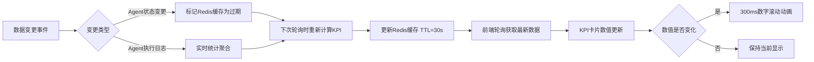

### 15.2 Agent类型分布

智能体管理模块提供Self-built（自建）和Remote（远程）两种Agent类型，类型分布以饼图形式展示。

**图表配置**：

| 配置项 | 说明 |
|--------|------|
| 图表类型 | 环形饼图（Donut Chart） |
| 数据系列 | Self-built / Remote 两个分类 |
| 中心文字 | Agent总数 |
| 交互 | 悬停显示类型、数量、占比；点击跳转至智能体管理列表并自动应用Type筛选 |
| 颜色 | Self-built使用蓝色（#3B82F6），Remote使用紫色（#8B5CF6） |
| 刷新频率 | 与KPI卡片同步，30秒 |

**业务规则**：

| 规则编号 | 规则描述 |
|----------|----------|
| AGT-PIE-001 | 饼图数据与列表筛选条件联动，Type筛选变化时饼图同步更新 |
| AGT-PIE-002 | 单一类型占比100%时仍展示完整的环形图，不省略 |
| AGT-PIE-003 | Agent总数为0时展示"暂无Agent"空状态 |

### 15.3 Agent活跃度趋势图

活跃度趋势图按时间维度展示Agent的活跃度变化，帮助用户识别Agent使用的高峰和低谷时段。

**图表配置**：

| 配置项 | 说明 |
|--------|------|
| 图表类型 | 面积图（Area Chart） |
| X轴 | 时间（今日→按小时，本周/本月→按天） |
| Y轴 | 活跃Agent数（个） |
| 数据系列 | Self-built活跃数、Remote活跃数两条曲线叠加 |
| 时间范围 | 与全局时间范围选择器联动（今日/本周/本月/自定义，最大90天） |
| 渲染性能 | 数据点超过200时自动降采样至100个点 |

**指标计算口径**：

| 指标 | 计算公式 |
|------|----------|
| 活跃Agent数 | 时间窗口内有任意一次成功执行的Agent数量 |
| 活跃度变化率 | `(当前周期活跃数 - 上一周期活跃数) / 上一周期活跃数 × 100%` |

**业务规则**：

| 规则编号 | 规则描述 |
|----------|----------|
| AGT-TREND-001 | 时间范围切换后，图表在2秒内重新渲染完成 |
| AGT-TREND-002 | 切换"今日"时X轴粒度为小时，切换"本周/本月/自定义"时为天 |
| AGT-TREND-003 | 活跃度异常下降超过30%时，图表区域顶部显示黄色提示横幅 |

### 15.4 常用Agent Top 8

工作空间为用户提供常用Agent的快速访问入口（与PRD-02 §4.2.2对齐），展示用户最近30天内调用最频繁的Top 8 Agent。

**排序算法**：

常用Agent采用基于最近访问时间与使用频率的加权排序算法，与常用Orchestration保持一致：

- **排序公式**：`Score = 0.6 × Frequency_Score + 0.4 × Recency_Score`
- **频率评分**（Frequency_Score）：`用户最近30天内对该Agent的调用次数 / 最近30天内所有Agent最大调用次数`（归一化至0~1）
- **时效评分**（Recency_Score）：`1 / (1 + ln(距上次使用的小时数 + 1))`（越近使用评分越高，范围0~1）
- **排序规则**：按Score降序排列，Score相同时按最后使用时间降序排列

**展示规则**：

| 规则 | 说明 |
|------|------|
| 数据来源 | 基于用户最近30天的Agent调用记录，按加权排序算法排列 |
| 展示数量 | 最多8个 |
| 空状态 | 显示"暂无常用智能体" + 引导按钮"浏览智能体市场" |
| 卡片内容 | Agent名称、Agent头像/图标、Agent类型（Self-built/Remote）、最近交互时间 |

**Self-built与Remote Agent卡片差异化展示**：

| 字段 | Self-built Agent | Remote Agent |
|------|------------------|--------------|
| 类型标签 | 蓝色"自建"标签 | 紫色"远程"标签 |
| 状态指示 | 显示当前Status（Active/Inactive/Error） | 显示A2A连接状态（已连接/断开/未知） |
| 点击跳转 | 跳转至Agent对话页面 | 跳转至Agent对话页面（A2A握手检查在前置） |

**验收标准**：

| 编号 | 验收标准 | 验证方法 |
|------|----------|----------|
| AGT-REC-01 | 常用Agent按加权排序算法排列，排序结果与公式计算一致 | 使用不同调用频率和时间的测试数据验证 |
| AGT-REC-02 | 最多展示8个Agent，超出部分不展示 | 创建超过8个Agent并使用验证 |
| AGT-REC-03 | 点击Agent卡片在500ms内跳转至对话页面 | 点击验证跳转路由和响应时间 |
| AGT-REC-04 | 空状态正确展示引导文案和"浏览智能体市场"按钮 | 使用新用户账户验证 |

### 15.5 最近Agent活动

仪表盘的最近活动区域（PRD-02 §4.3）展示Agent相关的动态，帮助用户实时了解Agent的运行变化。

**Agent相关活动类型**：

| 活动类型 | 图标 | 描述模板 | 颜色 |
|----------|------|----------|------|
| Agent创建 | Plus | "{用户} 创建了智能体《{Agent名称}》" | 绿色 |
| Agent激活 | Play | "{用户} 激活了智能体《{Agent名称}》" | 蓝色 |
| Agent停用 | Pause | "{用户} 停用了智能体《{Agent名称}》" | 灰色 |
| Agent删除 | Trash | "{用户} 删除了智能体《{Agent名称}》" | 红色 |
| Agent执行成功 | Check | "智能体《{Agent名称}》执行成功，耗时{耗时}ms" | 绿色 |
| Agent执行失败 | X | "智能体《{Agent名称}》执行失败：{原因}" | 红色 |
| Agent状态异常 | AlertTriangle | "智能体《{Agent名称}》进入Error状态：{原因}" | 橙色 |
| A2A连接失败 | Link | "Remote Agent《{Agent名称}》A2A连接失败" | 红色 |
| 工作流校验失败 | AlertCircle | "智能体《{Agent名称}》工作流校验失败" | 橙色 |
| Convert to Workflow | Wand | "{用户} 将智能体《{Agent名称}》从聊天模式转换为工作流" | 紫色 |

**展示规则**：

| 规则编号 | 规则描述 |
|----------|----------|
| AGT-ACT-001 | Agent活动时间范围为最近30天，超出范围不展示 |
| AGT-ACT-002 | 活动按时间倒序排列，最新活动在最上方 |
| AGT-ACT-003 | 每页展示20条Agent活动，支持"查看更多"分页加载 |
| AGT-ACT-004 | 时间格式化规则：<1小时显示"X分钟前"，<24小时显示"X小时前"，≥24小时显示"YYYY-MM-DD HH:mm" |
| AGT-ACT-005 | 点击Agent活动条目跳转至Agent详情页或执行日志详情页 |
| AGT-ACT-006 | 活动类型支持筛选，可按上述活动类型过滤 |

**活动权限控制**：

| 角色 | 可见活动范围 |
|------|--------------|
| 超级管理员 | 全平台所有Agent活动 |
| 商户管理员 | 本Merchant下所有Agent活动 |
| Agent开发者 | 自有Agent活动 + 关联编排的Agent活动 |
| 业务架构师 | 关联编排引用的Agent活动 |
| 普通用户 | 无（不展示Agent活动） |

### 15.6 Sidebar菜单与权限

智能体管理模块在Sidebar导航菜单中作为核心驱动层的重要入口展示（详见PRD-12 §5.1.3）。

**导航菜单项定义**：

| 序号 | 菜单名称 | 英文标识 | 图标 | 路由路径 | 权限要求 | 所属架构层 | 说明 |
|------|----------|----------|------|----------|----------|------------|------|
| 6 | 智能体管理 | Agents | agent | /agents | `agent:list` | 核心驱动层（Core Driver Layer） | Agent的全生命周期管理 |

**导航分组规则**：

Sidebar按系统五层架构分组展示，智能体管理归属于**核心驱动层**分组，与大模型管理并列：

```
核心驱动层
├── 大模型管理（LLM）
└── 智能体管理（Agents）
```

**导航交互规则**（与PRD-09 §10.4 导航交互规则及 BR-09-031~036 对齐）：

| 规则编号 | 规则描述 |
|----------|----------|
| AGT-NAV-001 | 智能体管理菜单项仅在用户拥有 `agent:list` 权限时展示 |
| AGT-NAV-002 | 当前位于智能体管理模块时，菜单项高亮（左侧3px强调色指示条） |
| AGT-NAV-003 | 导航折叠状态下悬停智能体管理图标展示Tooltip"智能体管理" |
| AGT-NAV-004 | 智能体管理菜单的删除/创建等敏感操作权限独立于列表查看权限 |

**移动端底部标签栏**（与PRD-12 §5.3.3对齐）：

| 序号 | 标签名称 | 图标 | 路由 | 说明 |
|------|----------|------|------|------|
| 3 | 智能体 | agent | /agents | 智能体管理 |

**权限矩阵（与PRD-02 §6.1和PRD-12 §5.7.2对齐）**：

| 角色 | 访问智能体管理 | 查看KPI卡片（Agent相关） | 查看常用Agent | 查看Agent活动 | 新建Agent快捷入口 |
|------|:-----------:|:------------------------:|:-------------:|:-------------:|:------------------:|
| 超级管理员 | ✅（全平台） | ✅ | ✅ | ✅（全平台） | ✅ |
| 商户管理员 | ✅（本Merchant） | ✅ | ✅ | ✅（本Merchant） | ✅ |
| 知识工程师 | ✅（只读） | ❌ | ✅ | ❌ | ❌ |
| 编排工程师 | ✅ | ✅ | ✅ | ✅ | ✅ |
| 普通用户 | ✅（只读） | ❌ | ✅ | ❌ | ❌ |
| 部门管理员 | ✅ | — | ✅ | — | — |
| 审计员 | ❌ | ❌ | ❌ | ❌ | ❌ |

### 15.7 模块依赖关系

智能体管理模块在仪表盘与监控体系中与其他业务模块存在数据依赖关系，仪表盘和监控的数据聚合需要从Agent管理模块获取数据源。

**Dashboard数据聚合依赖**（与PRD-12 §5.4.5关系8对齐）：

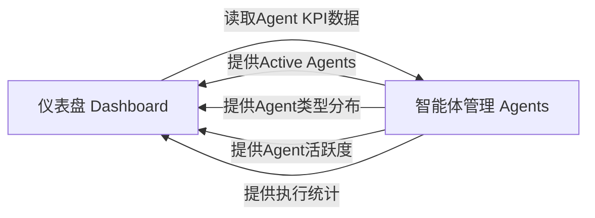

**监控数据采集依赖**（与PRD-12 §5.4.5关系9对齐）：

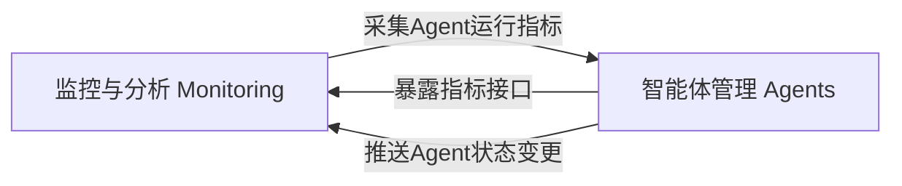

**业务规则**：

| 规则编号 | 规则描述 |
|----------|----------|
| AGT-DEP-001 | 仪表盘通过API读取Agent数据，不直接访问Agent数据库 |
| AGT-DEP-002 | Agent状态变更时通过事件总线通知监控与分析模块 |
| AGT-DEP-003 | Agent KPI数据Redis缓存TTL=30秒，与仪表盘刷新策略一致 |
| AGT-DEP-004 | 仪表盘故障不影响Agent管理模块的正常使用 |

---

## 16. 模块关系总览

本章内容源自全局导航与模块关系（PRD-12 §5.4）中的模块依赖矩阵、架构图和核心关系详解，聚焦于智能体管理模块在系统五层架构中的位置、与其他模块的依赖方向和数据流转路径。

### 16.1 智能体管理在五层架构中的位置

AI Multi-Agent System采用五层架构体系（详见PRD-12 §5.4.2），智能体管理模块归属于**核心驱动层（Core Driver Layer）**。

**五层架构与智能体管理的位置**：

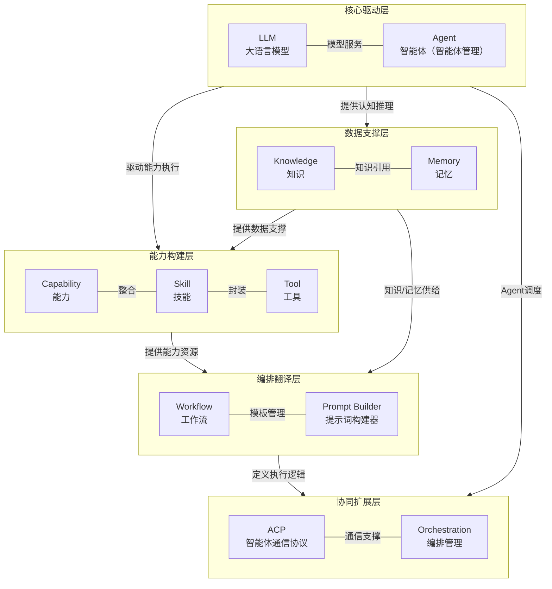

**核心驱动层定位说明**：

| 维度 | 说明 |
|------|------|
| 层级定义 | 核心驱动层是系统的智能核心，包含LLM与Agent，提供认知推理与自主执行能力 |
| 组成模块 | LLM（大语言模型）、Agent（智能体/智能体管理） |
| 职责分工 | LLM提供基础推理能力，Agent以LLM为核心控制器，集成Memory、Planning、Tool Calling能力，承担具体任务执行 |
| 对上层支撑 | 编排翻译层（Workflow/Prompt Builder）和协同扩展层（ACP/Orchestration）通过Agent调度实现任务执行 |
| 对下层依赖 | Agent依赖能力构建层（Capability）执行工具调用，依赖数据支撑层（Memory/Knowledge）提供记忆与知识 |

### 16.2 模块依赖矩阵

智能体管理模块与其他模块的依赖关系在模块依赖矩阵（PRD-12 §5.4.4）中体现。

**智能体管理模块依赖矩阵**（Agents行的完整依赖）：

| 依赖方 / 被依赖方 | Dashboard | Knowledges | Memories | Capabilities | LLM | Agent | Orchestrations | Workflows | Prompt Builder | Merchants | Users | Permissions | Monitoring | System Setting |
|-------------------|:---------:|:----------:|:--------:|:------------:|:---:|:-----:|:--------------:|:---------:|:--------------:|:---------:|:-----:|:-----------:|:----------:|:--------------:|
| Agents | D | R | R | R | R | — | R | R | — | — | — | R | — | R |

> D = Data Source（数据来源），R = Read（读取依赖），↔ = 双向交互

**依赖方向详解**：

| 方向 | 被依赖模块 | 依赖类型 | 说明 |
|------|------------|----------|------|
| Agents → LLM | LLM | R（强依赖） | Agent执行推理任务时调用LLM模型，是核心驱动层内部的双向依赖 |
| Agents → Capabilities | Capabilities | R（强依赖） | Self-built Agent的工具调用节点从Capability池选择工具 |
| Agents → Memories | Memories | R（强依赖） | Agent执行过程中读写Memory存储对话上下文和执行状态 |
| Agents → Knowledges | Knowledges | R（强依赖） | Agent在执行中检索Knowledge作为推理的事实依据 |
| Agents → Orchestrations | Orchestrations | R | 编排管理模块引用Agent作为执行节点 |
| Agents → Workflows | Workflows | R | 工作流管理模块的Agent调度节点引用Agent |
| Agents → Dashboard | Dashboard | D | 仪表盘从Agent管理模块聚合KPI和图表数据 |
| Agents → Permissions | Permissions | R | Agent管理操作受权限系统控制 |
| Agents → System Setting | System Setting | R | Agent的全局配置（节点上限、超时默认值）来自系统设置 |

**被依赖关系**：

| 依赖方 | 依赖内容 | 说明 |
|--------|----------|------|
| Orchestrations | Agent | 编排管理引用Agent作为协调节点，通过Orchestrate入口建立引用 |
| Workflows | Agent | 工作流的Agent调度节点引用具体的Agent定义 |
| Dashboard | Agent | 仪表盘从Agent管理模块读取KPI、活跃度、执行统计等数据 |
| Monitoring | Agent | 监控与分析模块采集Agent运行指标和日志 |

### 16.3 与其他模块的关系详解

#### 16.3.1 关系1：核心驱动层内部 — LLM ↔ Agent

| 维度 | 说明 |
|------|------|
| 方向 | LLM ↔ Agent（双向依赖） |
| 描述 | LLM（大模型管理）提供模型服务，Agent（智能体管理）以LLM为核心控制器进行任务执行。Agent调用时需要选择具体的LLM模型，LLM的配置变更会影响Agent的执行效果 |
| 数据流 | Agent请求 → 模型选择 → LLM推理调用 → 结果返回 → Agent决策 |
| 影响范围 | LLM服务故障时，所有依赖该模型的Agent将无法执行推理任务 |
| 模块内体现 | Agent创建步骤1中的Model必填配置，详见PRD-06 §7.2（创建智能体-步骤1：基本信息）和§7.10（智能体与LLM的关联配置） |

#### 16.3.2 关系2：核心驱动层 — Agent → Capability

| 维度 | 说明 |
|------|------|
| 方向 | Agent → Capability（单向强依赖） |
| 描述 | Self-built Agent的工具调用节点从Capability池中选择MCP工具执行具体操作。Agent不直接管理工具，仅在执行时调用 |
| 数据流 | Agent工作流执行 → 工具调用节点 → 从Capability池选择工具 → MCP协议调用 → 返回结果 |
| 影响范围 | 工具状态变更（Disabled/Deleted）直接影响Agent工作流执行，详见PRD-06 §7.11（智能体与Capability的关联配置） |
| 模块内体现 | 工具调用节点从系统能力池选择工具，Remote Agent通过A2A协议从远程Agent获取能力列表 |

#### 16.3.3 关系3：核心驱动层 — Agent ↔ Memory

| 维度 | 说明 |
|------|------|
| 方向 | Agent ↔ Memory（双向交互） |
| 描述 | Agent执行过程中读写Memory存储对话上下文、执行状态和工具调用记录。Memory为Agent提供长期记忆能力，Agent的执行结果更新Memory |
| 数据流 | Agent启动 → 加载Memory上下文 → 执行任务 → 写入执行结果至Memory |
| 影响范围 | Memory读写失败时，Agent可能丢失上下文或无法持久化执行结果 |
| 模块内体现 | 聊天模式的对话上下文受Agent关联LLM的Max Context限制，详见PRD-06 §7.8（聊天模式对话管理机制） |

#### 16.3.4 关系4：核心驱动层 — Agent → Knowledge

| 维度 | 说明 |
|------|------|
| 方向 | Agent → Knowledge（单向读取） |
| 描述 | Agent在执行任务时检索Knowledge库获取事实依据。LLM推理节点可结合Knowledge检索结果增强生成质量 |
| 数据流 | Agent执行 → 知识检索请求 → 知识库返回相关条目 → LLM结合知识生成结果 |
| 影响范围 | Knowledge库更新时，Agent的检索结果可能发生变化 |
| 模块内体现 | LLM推理节点支持结合Knowledge检索结果进行RAG增强 |

#### 16.3.5 关系5：协同扩展层 — Orchestration → Agent

| 维度 | 说明 |
|------|------|
| 方向 | Orchestration → Agent（调度依赖） |
| 描述 | Orchestrations（编排管理）定义多Agent协作流程，调度Agent执行任务。编排流程中可包含多个Agent节点 |
| 数据流 | 编排定义 → Agent调度 → Agent执行 → 结果聚合 → 流程推进 |
| 影响范围 | Agent下线或状态变更时需评估对编排流程的影响 |
| 模块内体现 | Agent列表提供"Orchestrate"快捷入口，一键将Agent加入编排，详见PRD-06 §7.1.6（编排入口） |

#### 16.3.6 关系6：编排翻译层 — Workflow → Agent

| 维度 | 说明 |
|------|------|
| 方向 | Workflow → Agent（调度依赖） |
| 描述 | Workflow（工作流管理）通过Agent调度节点引用具体的Agent。Workflow的Agent节点执行时调用Agent |
| 数据流 | 工作流执行 → Agent调度节点 → Agent执行 → 返回结果 |
| 影响范围 | Agent被删除时，引用该Agent的工作流节点会标记为错误状态 |
| 模块内体现 | 软删除的Agent保留30天，期间关联工作流节点会显示引用警告 |

#### 16.3.7 关系7：管理模块 — Agent → Permissions

| 维度 | 说明 |
|------|------|
| 方向 | Agent → Permissions（权限校验依赖） |
| 描述 | Agent管理的所有操作（创建、编辑、删除、激活、停用、查看日志）均需通过权限系统校验。ABAC策略可基于Agent的所有者、类型、状态等属性进行细粒度控制 |
| 数据流 | 用户操作Agent → 权限系统校验 → 允许/拒绝 |
| 影响范围 | 权限不足时操作被拒绝，详见PRD-06 §10（权限矩阵） |

#### 16.3.8 关系8：系统设置 — Agent

| 维度 | 说明 |
|------|------|
| 方向 | System Setting → Agent（配置依赖） |
| 描述 | System Setting（系统设置）为Agent管理提供全局配置参数：工作流节点上限、调用超时默认值、Retry Count默认值、手势密码策略等 |
| 数据流 | 配置变更 → 事件总线 → Agent模块监听 → 配置热更新 |
| 影响范围 | 全局配置变更可能影响所有Agent的行为 |
| 模块内体现 | AGT-NFR-027：工作流节点数量上限可通过系统配置调整 |

#### 16.3.9 关系9：Dashboard — Agent（数据读取）

| 维度 | 说明 |
|------|------|
| 方向 | Dashboard → Agent（数据读取） |
| 描述 | Dashboard（仪表盘）从Agent管理模块聚合数据，展示Agent KPI卡片、活跃度趋势、常用Agent等。Dashboard仅读取数据，不产生写入操作 |
| 数据流 | Agent状态变更/执行完成 → 事件通知 → 仪表盘刷新KPI |
| 影响范围 | Dashboard故障不影响Agent管理模块运行 |
| 模块内体现 | 详见PRD-06 §15（模块仪表盘与导航） |

#### 16.3.10 关系10：Monitoring — Agent（监控采集）

| 维度 | 说明 |
|------|------|
| 方向 | Monitoring → Agent（监控采集） |
| 描述 | Monitoring（监控与分析）从Agent管理模块采集运行指标和日志数据：Agent执行次数、成功率、平均耗时、错误率、A2A连接状态等 |
| 数据流 | Agent执行 → 指标上报 → PostgreSQL 分区表 / Prometheus → 监控面板/告警规则 |
| 影响范围 | Monitoring故障不影响Agent业务运行，但会导致监控盲区 |
| 模块内体现 | AGT-NFR-034：系统提供Agent健康检查接口，支持外部监控系统对接 |
| **详细规范** | **见 [PRD-11 监控与分析](PRD-11-监控与分析.md) §4.4.5 跨模块追踪、§4.7.1 Agent 活跃度与调用频次、§4.7.6 编排执行成功率与耗时。Agent 任务的 trace_id 通过 W3C Trace Context 跨模块传递，归口至 PRD-11 进行聚合分析** |

### 16.4 模块依赖流程图

智能体管理模块的完整模块依赖流程图（基于PRD-12 §5.4.3的智能体管理子图扩展）：

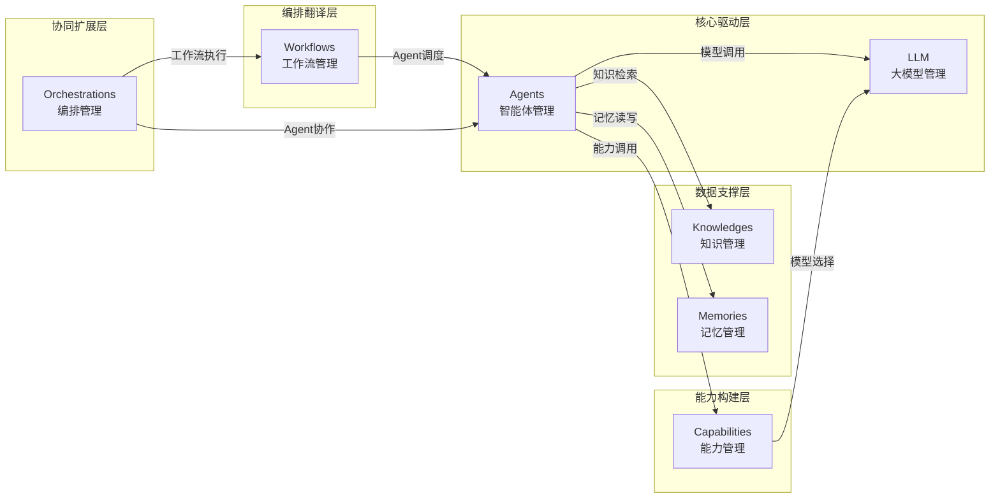

---

## 17. 非功能需求汇总

本章内容源自仪表盘与工作空间模块（PRD-02 §8）和全局导航与模块关系（PRD-12 §5.5）中的非功能需求部分，聚焦于智能体管理模块特有的非功能需求以及在全局视角下需关注的非功能要求。

### 17.1 性能需求

智能体管理模块特有的性能需求（模块ID前缀：AGT-NFR）以及从全局非功能需求中提取的Agent相关条目：

| 需求编号 | 需求描述 | 目标值 | 验证方法 |
|----------|----------|--------|----------|
| AGT-NFR-001 | 智能体列表首次加载时间 | ≤ 2秒（100条数据内） | Performance API测量 |
| AGT-NFR-002 | 智能体列表搜索响应时间 | ≤ 500ms | 搜索响应时间监控 |
| AGT-NFR-003 | 智能体创建/编辑保存响应时间 | ≤ 1秒 | API性能监控 |
| AGT-NFR-004 | 工作流画布渲染时间 | ≤ 1秒（30个节点内） | Performance API测量 |
| AGT-NFR-005 | 工作流校验响应时间 | ≤ 3秒 | API性能监控 |
| AGT-NFR-006 | Convert to Workflow转换时间 | ≤ 15秒 | API性能监控 |
| AGT-NFR-007 | 对话测试Agent首次响应时间 | ≤ 5秒（不含LLM推理时间） | 端到端测试 |
| AGT-NFR-008 | A2A连接测试响应时间 | ≤ Handshake Timeout配置值 | API性能监控 |
| AGT-NFR-009 | 执行日志查询响应时间 | ≤ 3秒（最近7天数据） | API性能监控 |
| AGT-NFR-010 | 系统支持同时在线Agent数量 | ≥ 500个 | 压力测试 |
| AGT-NFR-035 | Dashboard Agent KPI卡片数据刷新时间 | ≤ 1秒 | APM监控 |
| AGT-NFR-036 | Dashboard Agent类型分布饼图渲染时间 | ≤ 2秒 | Performance API测量 |
| AGT-NFR-037 | Dashboard Agent活跃度趋势图渲染时间 | ≤ 2秒 | Performance API测量 |
| AGT-NFR-038 | 常用Agent列表加载时间 | ≤ 500ms | API性能监控 |
| AGT-NFR-039 | 最近Agent活动查询时间 | ≤ 1秒（最近30天） | API性能监控 |
| AGT-NFR-040 | Agent API平均响应时间 | ≤ 500ms（P95） | APM性能监控 |
| AGT-NFR-041 | Agent API最大响应时间 | ≤ 2秒（P99） | APM性能监控 |
| AGT-NFR-042 | Agent状态变更事件推送延迟 | ≤ 2秒 | WebSocket延迟测试 |
| AGT-NFR-043 | Agent模块支持并发执行数 | ≥ 1000 | 压力测试 |
| AGT-NFR-044 | Agent工作流校验规则7类全部检测时间 | ≤ 3秒 | API性能监控 |

**性能基线对齐**：Agent模块性能指标符合PRD-12 NFR-P-001~NFR-P-013中页面加载≤2秒、API P95≤500ms、P99≤2秒、并发≥1000的全局基线。

### 17.2 安全需求

智能体管理模块特有的安全需求（模块ID前缀：AGT-NFR）以及从全局安全需求中提取的Agent相关条目：

| 需求编号 | 需求描述 | 验证方法 |
|----------|----------|----------|
| AGT-NFR-017 | AppKey等敏感凭证在数据库中加密存储（AES-256） | 数据库审查 |
| AGT-NFR-018 | AppKey在界面展示时脱敏处理（仅显示前4位和后4位） | UI检查 |
| AGT-NFR-019 | A2A通信使用TLS 1.2+加密传输 | SSL Labs测试 |
| AGT-NFR-020 | 所有API接口需通过身份认证和权限校验 | 渗透测试 |
| AGT-NFR-021 | Agent配置变更记录审计日志，包含操作人、操作时间、变更内容 | 日志审查 |
| AGT-NFR-022 | 软删除的Agent数据保留30天，超期后物理删除且不可恢复 | 数据审计 |
| AGT-NFR-023 | 对话测试区域的消息记录不持久化，防止敏感信息泄露 | 代码审查 |
| AGT-NFR-045 | Agent KPI数据Redis缓存敏感字段加密存储 | Redis存储检查 |
| AGT-NFR-046 | Agent API接口限流：单用户100 QPS，超出返回业务错误码 000099（HTTP 200） | 压测验证 |
| AGT-NFR-047 | Agent Dashboard数据按Merchant权限范围过滤，跨租户数据严格隔离 | 渗透测试 |
| AGT-NFR-048 | Agent审计日志不可篡改，包含Agent创建/编辑/删除/状态变更/权限变更等操作 | 日志审查 |
| AGT-NFR-049 | A2A协议通信使用TLS加密传输，AppKey等敏感凭证安全传输 | 抓包分析 |
| AGT-NFR-050 | 防注入：Agent名称、描述等用户输入字段做XSS和SQL注入防护 | 渗透测试 |

**安全基线对齐**：Agent模块安全策略符合PRD-12 NFR-S-001~NFR-S-014中HTTPS强制、AES-256加密、JWT认证、多租户隔离、防注入、限流等全局安全基线。

### 17.3 可用性需求

智能体管理模块特有的可用性需求（模块ID前缀：AGT-NFR）：

| 需求编号 | 需求描述 | 目标值 | 验证方法 |
|----------|----------|--------|----------|
| AGT-NFR-011 | 智能体管理模块可用性 | ≥ 99.9% | 监控报表 |
| AGT-NFR-012 | Agent执行服务可用性 | ≥ 99.5% | 监控报表 |
| AGT-NFR-013 | A2A通信服务可用性 | ≥ 99.0% | 监控报表 |
| AGT-NFR-014 | 数据备份频率 | 每日全量备份，每小时增量备份 | 备份记录 |
| AGT-NFR-015 | 故障恢复时间（RTO） | ≤ 15 分钟 | 灾备演练 |
| AGT-NFR-016 | 数据恢复点目标（RPO） | ≤ 5 分钟 | 灾备演练 |
| AGT-NFR-051 | Agent Dashboard数据降级：Agent KPI数据获取失败时，Dashboard其他模块正常展示 | 故障注入测试 |
| AGT-NFR-052 | Agent执行超时自动中断，记录详细错误日志供排查 | 功能测试 |
| AGT-NFR-053 | A2A连接连续3次失败后Agent状态自动变更为Error | 功能测试 |
| AGT-NFR-054 | Agent工作流校验失败时高亮问题节点，不影响其他节点编辑 | 功能测试 |
| AGT-NFR-055 | Dashboard Agent KPI数据获取失败时，KPI卡片显示"暂无数据"，其他卡片正常 | 故障注入测试 |

**可用性基线对齐**：Agent模块可用性指标符合PRD-12 NFR-A-001~NFR-A-008中系统可用性≥99.9%、错误率≤0.1%、故障切换≤10秒的全局基线。

### 17.4 兼容性需求

智能体管理模块特有的兼容性需求（模块ID前缀：AGT-NFR）：

| 需求编号 | 需求描述 | 验证方法 |
|----------|----------|----------|
| AGT-NFR-028 | 支持Chrome 90+、Firefox 88+、Safari 14+、Edge 90+浏览器 | 多浏览器测试 |
| AGT-NFR-029 | 工作流画布支持最小1280x720分辨率 | 分辨率测试 |
| AGT-NFR-030 | A2A协议兼容Google A2A协议规范v1.0 | 协议合规测试 |
| AGT-NFR-056 | Agent Dashboard兼容移动端：iOS Safari 14+、Android Chrome 90+ | 移动端测试 |
| AGT-NFR-057 | Agent API向后兼容：API版本升级时，旧版本至少保留6个月兼容期 | 版本管理检查 |
| AGT-NFR-058 | A2A协议支持多版本兼容：v1.0和未来版本可协商 | 协议测试 |

**兼容性基线对齐**：Agent模块兼容性符合PRD-12 NFR-C-001~NFR-C-005中浏览器兼容、分辨率适配、API向后兼容等全局基线。

### 17.5 可观测性需求

智能体管理模块的可观测性需求源自PRD-12 NFR-O-001~NFR-O-006并结合Agent特有要求：

| 需求编号 | 需求描述 | 目标值 | 验证方法 |
|----------|----------|--------|----------|
| AGT-NFR-059 | Agent API请求支持分布式链路追踪（traceId贯穿） | traceId全链路 | 链路追踪验证 |
| AGT-NFR-060 | Agent服务暴露Prometheus指标接口（/metrics） | 指标完整 | 监控系统验证 |
| AGT-NFR-061 | Agent服务提供健康检查接口（/health） | 状态准确 | 健康检查验证 |
| AGT-NFR-062 | Agent关键指标异常时5分钟内触发告警通知 | 告警及时 | 告警测试 |
| AGT-NFR-063 | Agent执行日志结构化存储，支持按traceId关联 | 关联可追溯 | 日志审查 |
| AGT-NFR-064 | A2A连接状态、握手耗时、连续失败次数可观测 | 指标完整 | 监控验证 |
| AGT-NFR-065 | Agent Dashboard操作埋点（新建、编辑、删除、激活、停用、Orchestrate） | 埋点完整 | 数据分析验证 |
| AGT-NFR-066 | Agent工作流节点执行耗时和工具调用链路可观测 | 链路完整 | 监控验证 |
| AGT-NFR-067 | Agent状态变更事件产生审计日志 | 日志完整 | 日志审查 |
| AGT-NFR-068 | Remote Agent的A2A连接状态推送实时更新至监控面板 | 推送及时 | WebSocket测试 |

**可观测性基线对齐**：Agent模块可观测性符合PRD-12 NFR-O-001~NFR-O-006的全局基线，并扩展Agent特有的执行链路追踪、A2A连接监控、状态变更审计等指标。

### 17.6 可维护性和可扩展性需求

| 需求编号 | 需求描述 | 验证方法 |
|----------|----------|----------|
| AGT-NFR-031 | Agent配置变更支持回滚，保留最近10次配置快照 | 功能测试 |
| AGT-NFR-032 | 工作流定义使用JSON格式存储，便于版本对比和差异分析 | 代码审查 |
| AGT-NFR-033 | Agent执行日志结构化存储，支持按时间、状态、触发来源等维度查询 | 功能测试 |
| AGT-NFR-034 | 系统提供Agent健康检查接口，支持外部监控系统对接 | 接口测试 |
| AGT-NFR-024 | 工作流节点类型支持插件化扩展，新增节点类型无需修改核心引擎 | 架构评审 |
| AGT-NFR-025 | A2A协议版本支持向前兼容，新版本协议不影响旧版本Agent | 协议测试 |
| AGT-NFR-026 | Agent执行模式支持扩展，未来可新增模式类型 | 架构评审 |
| AGT-NFR-027 | 工作流节点数量上限可通过系统配置调整 | 配置测试 |
| AGT-NFR-069 | Agent模块独立部署，支持水平扩展无单点瓶颈 | 架构评审 |
| AGT-NFR-070 | Agent Dashboard数据缓存支持配置中心动态调整TTL | 配置测试 |

**可维护性基线对齐**：符合PRD-12 NFR-M-001~NFR-M-006中代码覆盖率≥80%、模块解耦、配置外部化、日志规范等全局基线。

**可扩展性基线对齐**：符合PRD-12 NFR-SC-001~NFR-SC-005中水平扩展、模块热插拔、数据库分片、EventBridge/SNS/SQS事件驱动等全局基线。

---

## 18. GraphQL 接口规范汇总（Agent 模块）

本章定义智能体管理模块对外的 GraphQL 接口规范、错误码体系、响应格式、分页规范、鉴权约束与版本兼容策略。Agent 模块对外**仅**通过单一 GraphQL 总线（`POST /graphql`）暴露能力，不再维护 RESTful 资源路径。

### 18.1 GraphQL Schema 概览

> **收束说明**：本节 §18.1 为 Agent 模块 GraphQL Schema 的概览参考，**权威定义以 §A5 GraphQL Schema 映射为准**。本节中的 Query/Mutation 命名、字段定义与 §A5 不一致时，以 §A5 为权威。

Agent 模块 GraphQL Schema 围绕 Agent 生命周期、A2A 协议、Chat/Workflow 执行三大主题展开，统一遵循 PRD-00 §4 接口规范总则。

#### 18.1.1 Query 列表

| 字段名 | 入参 | 返回类型 | 说明 |
|--------|------|----------|------|
| `agentList` | `filter: AgentFilterInput, connection: ConnectionInput` | `AgentConnection!` | 分页查询 Agent 列表，遵循 Relay Connection 规范 |
| `agentDetail` | `id: ID!` | `Agent` | 查询单个 Agent 详情（含工作流、A2A 配置、Chat 配置） |
| `workflowDetail` | `agentId: ID!` | `AgentWorkflow` | 查询 Agent 关联的工作流定义 |
| `a2aCapabilities` | `agentId: ID!` | `[CapabilityBinding!]!` | 查询 Remote Agent 的 A2A 能力清单 |
| `chatHistory` | `agentId: ID!, sessionId: ID!, limit: Int` | `[ChatMessage!]!` | 查询指定会话的对话历史 |
| `runtimeStatus` | `agentId: ID!` | `AgentRuntimeStatus` | 查询 Agent 实时运行状态（健康度/熔断状态/最近执行时间） |
| `runtimeLogs` | `agentId: ID!, connection: ConnectionInput` | `ExecutionLogConnection!` | 分页查询 Agent 执行日志 |
| `executionLogDetail` | `logId: ID!` | `ExecutionLog` | 查询单条执行日志详情 |
| `relatedOrchestrations` | `agentId: ID!, connection: ConnectionInput` | `OrchestrationConnection!` | 查询引用该 Agent 的编排列表 |

#### 18.1.2 Mutation 列表

| 字段名 | 入参 | 返回类型 | 说明 |
|--------|------|----------|------|
| `createAgent` | `input: CreateAgentInput!` | `Agent` | 创建 Agent |
| `updateAgent` | `id: ID!, input: UpdateAgentInput!` | `Agent` | 全量更新 Agent 基础属性 |
| `patchAgent` | `id: ID!, input: PatchAgentInput!` | `Agent` | 部分更新 Agent 字段（增量更新） |
| `deleteAgent` | `id: ID!` | `DeleteAgentPayload` | 软删除 Agent |
| `activateAgent` | `id: ID!` | `Agent` | 激活 Agent（依赖校验通过后状态切换为 ACTIVE） |
| `deactivateAgent` | `id: ID!` | `Agent` | 停用 Agent（状态切换为 INACTIVE） |
| `validateAgentWorkflow` | `agentId: ID!` | `WorkflowValidationResult` | 校验 Agent 工作流的合法性（循环依赖/孤立节点/配置完整性） |
| `convertChatToWorkflow` | `agentId: ID!, input: ConvertChatInput!` | `ConvertTask` | 启动 Chat 转 Workflow 异步任务 |
| `sendTestMessage` | `agentId: ID!, input: ChatMessageInput!` | `ChatMessage` | 发送对话测试消息 |
| `clearChatHistory` | `agentId: ID!, sessionId: ID!` | `ClearChatPayload` | 清除指定会话的对话历史 |
| `configureA2A` | `agentId: ID!, input: A2AConfigInput!` | `AgentA2AConfig` | 配置 Agent 的 A2A 连接参数 |
| `testA2AConnection` | `agentId: ID!` | `A2ATestResult` | 测试 Agent 的 A2A 连通性 |

#### 18.1.3 Subscription 列表

| 字段名 | 入参 | 推送载荷 | 说明 |
|--------|------|----------|------|
| `agentExecutionStream` | `agentId: ID!` | `AgentExecutionEvent` | 订阅 Agent 实时执行事件流（SSE/WebSocket） |
| `a2aMessageStream` | `agentId: ID!` | `A2AMessage` | 订阅 A2A 消息流（Remote Agent 消息推送） |

#### 18.1.4 Object Types

| 类型 | 关键字段 | 说明 |
|------|----------|------|
| `Agent` | `id, name, description, type, executionMode, status, modelId, modelName, capabilityTypes, callTimeout, retryCount, handshakeTimeout, constraint, avatar, version, createdBy, createdAt, updatedAt` | Agent 实体（Self-built + Remote） |
| `AgentWorkflow` | `id, agentId, version, nodes, edges, status, createdAt, updatedAt` | Agent 工作流定义 |
| `AgentA2AConfig` | `agentId, callAddress, appKey, appSecretCipher, callTimeout, retryCount, handshakeTimeout, lastHandshakeAt, healthStatus` | A2A 配置（AppSecret 加密存储） |
| `ChatConfig` | `agentId, systemPrompt, temperature, maxTokens, contextWindow, streamingEnabled, modelId` | Chat 模式配置 |
| `ExecutionLog` | `id, agentId, sessionId, taskId, startTime, endTime, durationMs, status, errorCode, errorMessage, traceId, spanTree` | 执行日志（含分布式追踪） |
| `CapabilityBinding` | `id, name, description, inputSchema, outputSchema, callLimit, protocolVersion` | A2A 能力绑定 |
| `AgentRuntimeStatus` | `agentId, health, circuitState, lastExecutionAt, consecutiveFailures, lastErrorCode` | 实时运行状态 |
| `WorkflowValidationResult` | `valid, errors: [WorkflowValidationError!]!, warnings: [WorkflowValidationWarning!]!` | 工作流校验结果 |
| `AgentConnection` | `edges: [AgentEdge!]!, pageInfo: PageInfo!, totalCount: Int!` | Agent 列表分页连接 |

#### 18.1.5 Input Types

```graphql
input CreateAgentInput {
  name: String!
  description: String
  type: TypeEnum!
  executionMode: ExecutionModeEnum!
  modelId: ID
  workflowId: ID
  capabilityTypes: [String!]
  callTimeout: Int
  retryCount: Int
  handshakeTimeout: Int
  executionMode: ExecutionModeEnum
  constraint: String
  chatConfig: ChatConfigInput
  a2aConfig: A2AConfigInput
}

input UpdateAgentInput {
  name: String!
  description: String
  modelId: ID
  workflowId: ID
  capabilityTypes: [String!]
  callTimeout: Int
  retryCount: Int
  handshakeTimeout: Int
  executionMode: ExecutionModeEnum
  constraint: String
}

input PatchAgentInput {
  name: String
  description: String
  modelId: ID
  workflowId: ID
  capabilityTypes: [String!]
  callTimeout: Int
  retryCount: Int
  handshakeTimeout: Int
  executionMode: ExecutionModeEnum
  constraint: String
  status: StatusEnum
}

input A2AConfigInput {
  callAddress: String!
  appKey: String!
  appSecret: String!
  callTimeout: Int
  retryCount: Int
  handshakeTimeout: Int
}

input ChatMessageInput {
  sessionId: ID
  content: String!
  attachments: [ChatAttachmentInput!]
  stream: Boolean
}

input ConvertChatInput {
  chatHistory: [ChatMessageSnapshot!]!
  targetWorkflowMode: ExecutionModeEnum!
  options: ConvertOptionsInput
}

input AgentFilterInput {
  type: TypeEnum
  status: StatusEnum
  executionMode: ExecutionModeEnum
  modelId: ID
  search: String
  createdBy: ID
}

input ConnectionInput {
  first: Int
  after: String
  last: Int
  before: String
  sort: String
}
```

#### 18.1.6 Enum 定义

GraphQL Enum 统一采用大写下划线命名，禁止驼峰或小写。

```graphql
enum TypeEnum {
  SELF_BUILT    # 自建智能体
  REMOTE        # 远程智能体（A2A 协议接入）
}

enum StatusEnum {
  ACTIVE        # 启用中
  INACTIVE      # 已停用
  DRAFT         # 草稿（未激活）
  ERROR         # 异常（依赖不可用/A2A 失败）
  PAUSED        # 熔断暂停
  ARCHIVED      # 已归档
}

enum ExecutionModeEnum {
  WORKFLOW
  CHAT
}

enum HealthEnum {
  HEALTHY
  DEGRADED
  UNHEALTHY
}

enum CircuitStateEnum {
  CLOSED
  OPEN
  HALF_OPEN
}
```

#### 18.1.7 Schema 片段示例（SDL）

```graphql
type Query {
  agentList(filter: AgentFilterInput, connection: ConnectionInput): AgentConnection!
  agentDetail(id: ID!): Agent
  workflowDetail(agentId: ID!): AgentWorkflow
  a2aCapabilities(agentId: ID!): [CapabilityBinding!]!
  chatHistory(agentId: ID!, sessionId: ID!, limit: Int): [ChatMessage!]!
  runtimeStatus(agentId: ID!): AgentRuntimeStatus!
  runtimeLogs(agentId: ID!, connection: ConnectionInput): ExecutionLogConnection!
  executionLogDetail(logId: ID!): ExecutionLog
  relatedOrchestrations(agentId: ID!, connection: ConnectionInput): OrchestrationConnection!
}

type Mutation {
  createAgent(input: CreateAgentInput!): Agent
  updateAgent(id: ID!, input: UpdateAgentInput!): Agent
  patchAgent(id: ID!, input: PatchAgentInput!): Agent
  deleteAgent(id: ID!): DeleteAgentPayload
  activateAgent(id: ID!): Agent
  deactivateAgent(id: ID!): Agent
  validateAgentWorkflow(agentId: ID!): WorkflowValidationResult!
  convertChatToWorkflow(agentId: ID!, input: ConvertChatInput!): ConvertTask
  sendTestMessage(agentId: ID!, input: ChatMessageInput!): ChatMessage
  clearChatHistory(agentId: ID!, sessionId: ID!): ClearChatPayload
  configureA2A(agentId: ID!, input: A2AConfigInput!): AgentA2AConfig
  testA2AConnection(agentId: ID!): A2ATestResult
}

type Subscription {
  agentExecutionStream(agentId: ID!): AgentExecutionEvent!
  a2aMessageStream(agentId: ID!): A2AMessage!
}
```

### 18.2 错误码体系

智能体管理模块错误码统一收口在本节，作为 Agent 模块**唯一权威错误码定义**。原 §18.2 旧表、§23.5 状态机段位、§24 扩展段位均整合至 §18.2.3，**消除章节错位**。

#### 18.2.1 段位 130001-137999

错误码数字段位 130001-137999 与 PRD-00 §5.3.2.1 权威分配表保持一致。子段位细分：

| 子段位 | 含义 | 与原章节对应 |
|--------|------|--------------|
| 1300xx | 通用错误 / 系统内部错误 | 原 §18.2（130000/130099） |
| 1301xx | 参数校验错误 | 原 §18.2（130101-130110） |
| 1302xx | 业务规则错误 | 原 §18.2（130201-130208） |
| 1303xx | 权限错误 | 原 §18.2（130301-130305） |
| 1304xx | 资源不存在 | 原 §18.2（130401-130406） |
| 1305xx | 状态冲突 | 原 §18.2（130501-130503） |
| 1306xx | 外部服务错误 | 原 §18.2（130601-130605）+ 原 §24（去重合并） |
| 1307xx | 会话 / Chat 历史 | 本次新增 |
| 1308xx | 租户隔离 | 原 §19.4（130801-130802）+ 原 §24 |
| 1309xx | 状态机 / Convert to Workflow | 原 §23.5（130901-130907）+ 原 §24 |
| 1310xx | 外键引用 | 原 §24（131001-131002） |
| 1311xx | A2A 安全 | 原 §24（131101-131103） |
| 1312xx | APM 追踪 | 原 §24（131201-131202） |
| 1370xx | Agent 配置 / CRUD | 原 §35 业务错误码映射段位（137001-137009） |
| 1371xx | 任务执行 | 原 §35 业务错误码映射段位（137101-137105） |
| 1372xx | A2A 通信 | 原 §35 业务错误码映射段位（137201-137205） |
| 1373xx | 协同任务 | 原 §35 业务错误码映射段位（137301-137304） |
| 1374xx | 状态机 | 原 §35 业务错误码映射段位（137401） |

> **段位重叠说明**：原 §18.2 的 1306xx（外部服务错误）与原 §24 重复，本次合并保留 1306xx 作为外部服务段位；原 §18.2 的 1308xx（租户）原本未分配，本次新增 1308xx 段位承载租户隔离错误码（来自原 §19.4 的 130801）。

#### 18.2.2 命名空间 BIZ_AGENT_*

GraphQL `errors[].extensions.code` 字段统一使用 `BIZ_AGENT_*` 命名空间前缀，与 PRD-00 §5.3.1 错误码命名规范保持一致。命名空间枚举：

```
BIZ_AGENT_COMMON_*           # 1300xx
BIZ_AGENT_PARAM_*            # 1301xx
BIZ_AGENT_RULE_*             # 1302xx
BIZ_AGENT_PERM_*             # 1303xx
BIZ_AGENT_NOT_FOUND_*        # 1304xx
BIZ_AGENT_STATE_CONFLICT_*   # 1305xx
BIZ_AGENT_EXTERNAL_*         # 1306xx
BIZ_AGENT_CHAT_*             # 1307xx
BIZ_AGENT_TENANT_*           # 1308xx
BIZ_AGENT_STATE_MACHINE_*    # 1309xx
BIZ_AGENT_FK_*               # 1310xx
BIZ_AGENT_A2A_SECURITY_*     # 1311xx
BIZ_AGENT_APM_*              # 1312xx
BIZ_AGENT_CONFIG_*           # 1370xx
BIZ_AGENT_TASK_*             # 1371xx
BIZ_AGENT_A2A_COMM_*         # 1372xx
BIZ_AGENT_COLLAB_*           # 1373xx
BIZ_AGENT_STATUS_*           # 1374xx
```

> **数字错误码向后兼容**：为兼容历史监控/告警系统，GraphQL `errors[].extensions.code` 同时输出 `BIZ_AGENT_*` 字符串码与 `numericCode`（130001-137999 整数段位）。客户端可以任选其一消费，但告警规则统一以 `BIZ_AGENT_*` 字符串码为准。

#### 18.2.3 完整错误码清单（整合后权威表）

> 本表为 Agent 模块**唯一权威错误码定义**。原 §23.5、§24 中重复定义已被合并/标注「合并」。

**1300xx - 通用 / 系统内部**

| 错误码 | 命名空间 | 错误消息 |
|--------|----------|----------|
| 130000 | `BIZ_AGENT_COMMON_GENERIC` | Agent模块通用错误 |
| 130099 | `BIZ_AGENT_COMMON_INTERNAL` | Agent模块系统内部错误 |

**1301xx - 参数校验错误**

| 错误码 | 命名空间 | 错误消息 |
|--------|----------|----------|
| 130101 | `BIZ_AGENT_PARAM_NAME_EMPTY` | Agent名称不能为空 |
| 130102 | `BIZ_AGENT_PARAM_NAME_LENGTH` | Agent名称长度不在2~64字符范围内 |
| 130103 | `BIZ_AGENT_PARAM_DESC_LENGTH` | Agent描述超过500字符 |
| 130104 | `BIZ_AGENT_PARAM_CALL_ADDRESS` | Call Address格式不合法（必须http://或https://开头） |
| 130105 | `BIZ_AGENT_PARAM_APP_KEY` | AppKey格式不合法 |
| 130106 | `BIZ_AGENT_PARAM_CALL_TIMEOUT` | Call Timeout超出范围（5-300秒） |
| 130107 | `BIZ_AGENT_PARAM_RETRY_COUNT` | Retry Count超出范围（0-10次） |
| 130108 | `BIZ_AGENT_PARAM_HANDSHAKE_TIMEOUT` | Handshake Timeout超出范围（1-60秒） |
| 130109 | `BIZ_AGENT_PARAM_WORKFLOW_NODES` | 工作流节点数量超过上限（30个） |
| 130110 | `BIZ_AGENT_PARAM_TOOL_NODES` | 工具调用节点数量超过上限（15个） |
| 130111 | `BIZ_AGENT_PARAM_TYPE_INVALID` | Agent type 字段非法（仅允许 SELF_BUILT / REMOTE） |
| 130112 | `BIZ_AGENT_PARAM_EXECUTION_MODE_INVALID` | Agent execution_mode 字段非法（仅允许 WORKFLOW / CHAT） |
| 130113 | `BIZ_AGENT_PARAM_FIRST_RANGE` | 分页 first/last 参数超出范围（1-100） |

**1302xx - 业务规则错误**

| 错误码 | 命名空间 | 错误消息 |
|--------|----------|----------|
| 130201 | `BIZ_AGENT_RULE_NAME_DUPLICATE` | Agent名称在同租户内已存在 |
| 130202 | `BIZ_AGENT_RULE_NO_MODEL` | Agent未配置Model，无法激活 |
| 130203 | `BIZ_AGENT_RULE_NO_EXECUTION_MODE` | Agent未配置执行模式（工作流或聊天），无法激活 |
| 130204 | `BIZ_AGENT_RULE_WORKFLOW_INVALID` | 工作流校验失败（存在循环依赖/孤立节点/配置不完整） |
| 130205 | `BIZ_AGENT_RULE_A2A_HEALTH_CHECK_FAIL` | A2A连接连续3次健康检查失败 |
| 130206 | `BIZ_AGENT_RULE_AGENT_RUNNING` | Agent正在执行任务，无法删除 |
| 130207 | `BIZ_AGENT_RULE_APP_KEY_DECRYPT` | AppKey解密失败 |
| 130208 | `BIZ_AGENT_RULE_WORKFLOW_VERSION` | 工作流版本不兼容 |

**1303xx - 权限错误**

| 错误码 | 命名空间 | 错误消息 |
|--------|----------|----------|
| 130301 | `BIZ_AGENT_PERM_READ` | 无Agent查看权限 |
| 130302 | `BIZ_AGENT_PERM_CREATE` | 无Agent创建权限 |
| 130303 | `BIZ_AGENT_PERM_UPDATE` | 无Agent编辑权限 |
| 130304 | `BIZ_AGENT_PERM_DELETE` | 无Agent删除权限 |
| 130305 | `BIZ_AGENT_PERM_A2A` | 无A2A配置权限 |

**1304xx - 资源不存在**

| 错误码 | 命名空间 | 错误消息 |
|--------|----------|----------|
| 130401 | `BIZ_AGENT_NOT_FOUND_AGENT` | Agent不存在 |
| 130402 | `BIZ_AGENT_NOT_FOUND_A2A_CONFIG` | A2A配置不存在 |
| 130403 | `BIZ_AGENT_NOT_FOUND_WORKFLOW` | 工作流定义不存在 |
| 130404 | `BIZ_AGENT_NOT_FOUND_LLM` | 关联的LLM模型不存在 |
| 130405 | `BIZ_AGENT_NOT_FOUND_CAPABILITY` | 关联的Capability工具不存在 |
| 130406 | `BIZ_AGENT_NOT_FOUND_EXECUTION_LOG` | 执行日志不存在 |
| 130407 | `BIZ_AGENT_NOT_FOUND_CHAT_SESSION` | Chat 会话不存在 |
| 130408 | `BIZ_AGENT_NOT_FOUND_CONVERT_TASK` | Convert to Workflow 任务不存在 |

**1305xx - 状态冲突**

| 错误码 | 命名空间 | 错误消息 |
|--------|----------|----------|
| 130501 | `BIZ_AGENT_STATE_CONFLICT_OPERATION` | Agent当前状态不允许该操作（如Draft状态不允许停用） |
| 130502 | `BIZ_AGENT_STATE_CONFLICT_EDITING` | Agent正在被其他用户编辑 |
| 130503 | `BIZ_AGENT_STATE_CONFLICT_PUBLISHED` | 工作流已发布，配置变更失败 |
| 130504 | `BIZ_AGENT_STATE_CONFLICT_CIRCUIT_OPEN` | 熔断器已开启，暂不允许执行任务 |

**1306xx - 外部服务错误（整合原 §18.2 + §24 重叠）**

| 错误码 | 命名空间 | 错误消息 |
|--------|----------|----------|
| 130601 | `BIZ_AGENT_EXTERNAL_LLM` | LLM服务调用失败 |
| 130602 | `BIZ_AGENT_EXTERNAL_A2A_CONNECT` | A2A远程Agent连接失败 |
| 130603 | `BIZ_AGENT_EXTERNAL_TOOL` | 工具调用失败 |
| 130604 | `BIZ_AGENT_EXTERNAL_DISCOVERY` | 服务发现失败 |
| 130605 | `BIZ_AGENT_EXTERNAL_CAPABILITY_TIMEOUT` | 能力获取超时 |
| 130606 | `BIZ_AGENT_EXTERNAL_VECTOR_STORE` | 向量存储服务调用失败（合并自原 §24 APM 段位） |

**1307xx - 会话 / Chat 历史**

| 错误码 | 命名空间 | 错误消息 |
|--------|----------|----------|
| 130701 | `BIZ_AGENT_CHAT_SESSION_EXPIRED` | Chat 会话已过期（> 24h） |
| 130702 | `BIZ_AGENT_CHAT_CONTEXT_OVERFLOW` | Chat 上下文超出窗口，需压缩或截断 |
| 130703 | `BIZ_AGENT_CHAT_HISTORY_EMPTY` | Chat 历史为空，无可清除内容 |

**1308xx - 租户隔离（来自原 §19.4 130801 + 原 §24）**

| 错误码 | 命名空间 | 错误消息 |
|--------|----------|----------|
| 130801 | `BIZ_AGENT_TENANT_CROSS` | 跨租户访问被拒绝 |
| 130802 | `BIZ_AGENT_TENANT_PUBLIC_SCOPE` | 公共共享 Agent 越权访问 |
| 130803 | `BIZ_AGENT_TENANT_OWNER_SCOPE` | 资源 owner_scope 与当前用户不匹配 |

**1309xx - 状态机 / Convert to Workflow（来自原 §23.5）**

| 错误码 | 命名空间 | 错误消息 |
|--------|----------|----------|
| 130901 | `BIZ_AGENT_STATE_MACHINE_CTW_STAGE1` | Convert to Workflow 阶段 1（对话记录采集）超时/失败 |
| 130902 | `BIZ_AGENT_STATE_MACHINE_CTW_STAGE2` | Convert to Workflow 阶段 2（意图识别）超时/失败 |
| 130903 | `BIZ_AGENT_STATE_MACHINE_CTW_STAGE3` | Convert to Workflow 阶段 3（工作流骨架生成）超时/失败 |
| 130904 | `BIZ_AGENT_STATE_MACHINE_CTW_STAGE4` | Convert to Workflow 阶段 4（节点细节填充）超时/失败 |
| 130905 | `BIZ_AGENT_STATE_MACHINE_CTW_STAGE5` | Convert to Workflow 阶段 5（校验与预览）失败 |
| 130906 | `BIZ_AGENT_STATE_MACHINE_CTW_OVERALL` | Convert to Workflow 总超时（300s） |
| 130907 | `BIZ_AGENT_STATE_MACHINE_CTW_CANCELLED` | Convert to Workflow 用户主动取消 |
| 130908 | `BIZ_AGENT_STATE_MACHINE_ILLEGAL_TRANSITION` | Agent 状态机非法迁移 |

**1310xx - 外键引用（来自原 §24）**

| 错误码 | 命名空间 | 错误消息 |
|--------|----------|----------|
| 131001 | `BIZ_AGENT_FK_REFERENCED` | 资源被 Agent 引用，禁止删除 |
| 131002 | `BIZ_AGENT_FK_COUNT_INCONSISTENT` | 引用计数不一致 |

**1311xx - A2A 安全（来自原 §24）**

| 错误码 | 命名空间 | 错误消息 |
|--------|----------|----------|
| 131101 | `BIZ_AGENT_A2A_SECURITY_CREDENTIAL_INVALID` | A2A 凭证无效 |
| 131102 | `BIZ_AGENT_A2A_SECURITY_REPLAY` | A2A 重放攻击被拦截 |
| 131103 | `BIZ_AGENT_A2A_SECURITY_HANDSHAKE_EXCEEDED` | A2A 握手失败次数超限 |

**1312xx - APM 追踪（来自原 §24）**

| 错误码 | 命名空间 | 错误消息 |
|--------|----------|----------|
| 131201 | `BIZ_AGENT_APM_SAMPLE_INSUFFICIENT` | APM 采样率不足 |
| 131202 | `BIZ_AGENT_APM_SPAN_REPORT_FAIL` | Span 上报失败 |

**1370xx - Agent 配置 / CRUD（来自原 §35）**

| 错误码 | 命名空间 | 错误消息 |
|--------|----------|----------|
| 137001 | `BIZ_AGENT_CONFIG_NAME_DUPLICATE` | Agent 名称在租户内已存在 |
| 137002 | `BIZ_AGENT_CONFIG_TYPE_INVALID` | Agent type 非法 |
| 137003 | `BIZ_AGENT_CONFIG_NO_LLM` | Self-built Agent 未绑定 LLM 配置 |
| 137004 | `BIZ_AGENT_CONFIG_REMOTE_TRIPLE_MISSING` | Remote Agent 凭证三元组缺失 |
| 137005 | `BIZ_AGENT_CONFIG_REFERENCED` | Agent 被工作流/协同任务引用，禁止删除 |
| 137006 | `BIZ_AGENT_CONFIG_SOFT_DELETED` | Agent 已被软删除 |
| 137007 | `BIZ_AGENT_CONFIG_DEPENDENCY_MISSING` | Agent 启用时依赖资源缺失 |
| 137008 | `BIZ_AGENT_CONFIG_NOT_FOUND` | Agent 配置不存在 |
| 137009 | `BIZ_AGENT_CONFIG_VERSION_NOT_FOUND` | Agent 版本快照不存在 |

**1371xx - 任务执行（来自原 §35）**

| 错误码 | 命名空间 | 错误消息 |
|--------|----------|----------|
| 137101 | `BIZ_AGENT_TASK_INPUT_INVALID` | 任务输入参数非法 |
| 137102 | `BIZ_AGENT_TASK_AGENT_UNAVAILABLE` | Agent 当前状态不可执行任务 |
| 137103 | `BIZ_AGENT_TASK_NOT_FOUND` | 任务不存在 |
| 137104 | `BIZ_AGENT_TASK_CANCEL_DENIED` | 任务当前状态不允许取消 |
| 137105 | `BIZ_AGENT_TASK_RETRY_EXCEEDED` | 任务重试次数超限 |

**1372xx - A2A 通信（来自原 §35）**

| 错误码 | 命名空间 | 错误消息 |
|--------|----------|----------|
| 137201 | `BIZ_AGENT_A2A_COMM_VERSION_MISMATCH` | A2A 协议版本不匹配 |
| 137202 | `BIZ_AGENT_A2A_COMM_SEND_FAIL` | A2A 消息发送失败 |
| 137203 | `BIZ_AGENT_A2A_COMM_DUPLICATE` | A2A 消息重复（5 分钟内重发） |
| 137204 | `BIZ_AGENT_A2A_COMM_REMOVE_FAIL` | A2A 连接撤销失败 |
| 137205 | `BIZ_AGENT_A2A_COMM_HEARTBEAT_FAIL` | A2A 心跳上报失败 |

**1373xx - 协同任务（来自原 §35）**

| 错误码 | 命名空间 | 错误消息 |
|--------|----------|----------|
| 137301 | `BIZ_AGENT_COLLAB_AGENT_LIMIT` | 协同任务 Agent 数超过上限（5 个） |
| 137302 | `BIZ_AGENT_COLLAB_TASK_INVALID` | 协同任务配置非法 |
| 137303 | `BIZ_AGENT_COLLAB_TASK_NOT_FOUND` | 协同任务不存在 |
| 137304 | `BIZ_AGENT_COLLAB_TASK_CANCEL_FAIL` | 协同任务取消失败 |

**1374xx - 状态机（来自原 §35）**

| 错误码 | 命名空间 | 错误消息 |
|--------|----------|----------|
| 137401 | `BIZ_AGENT_STATUS_ILLEGAL_TRANSITION` | Agent 状态机非法迁移 |

**整合统计**：本次整合共定义错误码 **82** 个（1300xx: 2、1301xx: 13、1302xx: 8、1303xx: 5、1304xx: 8、1305xx: 4、1306xx: 6、1307xx: 3、1308xx: 3、1309xx: 8、1310xx: 2、1311xx: 3、1312xx: 2、1370xx: 9、1371xx: 5、1372xx: 5、1373xx: 4、1374xx: 1）。原 §18.2 错误码 32 个 + 原 §23.5 错误码 7 个 + 原 §24 段位 11 个 + 原 §35 业务错误码 24 个 + 本次新增 8 个（130407/130408/130504/130701-130703/130908）= 整合去重后 82 个。

#### 18.2.4 GraphQL `errors[].extensions.code` 映射

GraphQL 标准错误响应中，业务错误码映射规则：

```json
{
  "errors": [
    {
      "message": "Agent名称在同租户内已存在",
      "extensions": {
        "code": "BIZ_AGENT_RULE_NAME_DUPLICATE",
        "numericCode": 130201,
        "category": "BUSINESS_RULE",
        "field": "name",
        "traceId": "trace-abc123-def456"
      }
    }
  ]
}
```

| 映射字段 | 类型 | 说明 |
|----------|------|------|
| `code` | String | `BIZ_AGENT_*` 命名空间字符串（告警/规则匹配主键） |
| `numericCode` | Int | 130001-137999 段位（向后兼容） |
| `category` | String | PARAM / BUSINESS_RULE / PERMISSION / NOT_FOUND / STATE_CONFLICT / EXTERNAL / SECURITY / SYSTEM |
| `field` | String | 错误关联字段（参数校验场景） |
| `traceId` | String | 分布式追踪 ID（与日志/告警关联） |

#### 18.2.5 错误响应示例

GraphQL 标准错误响应（**仅 errors 数组，无顶层 code 字段**）：

```json
{
  "data": null,
  "errors": [
    {
      "message": "Agent名称'物流查询Agent'已存在",
      "path": ["createAgent"],
      "extensions": {
        "code": "BIZ_AGENT_RULE_NAME_DUPLICATE",
        "numericCode": 130201,
        "category": "BUSINESS_RULE",
        "field": "name",
        "traceId": "trace-abc123-def456"
      }
    }
  ]
}
```

**Agent 模块典型错误场景示例**：

| 场景 | 数字错误码 | 命名空间 Code | 错误消息 |
|------|-----------|---------------|----------|
| Agent 名称已存在 | 130201 | `BIZ_AGENT_RULE_NAME_DUPLICATE` | "Agent名称'物流查询Agent'已存在" |
| Agent 不存在 | 130401 | `BIZ_AGENT_NOT_FOUND_AGENT` | "Agent ID agent_001 不存在或已删除" |
| 无权限访问 | 130301 | `BIZ_AGENT_PERM_READ` | "当前用户无Agent查看权限" |
| 工作流校验失败 | 130204 | `BIZ_AGENT_RULE_WORKFLOW_INVALID` | "工作流存在循环依赖，请修正" |
| A2A 连接失败 | 130602 | `BIZ_AGENT_EXTERNAL_A2A_CONNECT` | "无法连接远程Agent，请检查A2A配置" |
| LLM 模型不可用 | 130601 | `BIZ_AGENT_EXTERNAL_LLM` | "LLM模型'GPT-4'调用失败：服务超时" |
| 参数校验失败 | 130101 | `BIZ_AGENT_PARAM_NAME_EMPTY` | "Agent名称不能为空" |
| Agent 正在执行 | 130206 | `BIZ_AGENT_RULE_AGENT_RUNNING` | "该Agent正在执行任务，请等待完成后再删除" |
| 跨租户访问 | 130801 | `BIZ_AGENT_TENANT_CROSS` | "跨租户访问被拒绝" |
| Convert 阶段 4 超时 | 130904 | `BIZ_AGENT_STATE_MACHINE_CTW_STAGE4` | "Convert to Workflow 阶段4 超时" |
| 状态机非法迁移 | 137401 | `BIZ_AGENT_STATUS_ILLEGAL_TRANSITION` | "Agent 状态机非法迁移" |

### 18.3 GraphQL 响应格式

Agent 模块统一遵循 GraphQL 标准响应格式 `{ data, errors, extensions.traceId }`，与 PRD-00 §4.2 响应规范保持一致。响应 HTTP 状态码恒为 200，HTTP 401/403 仅保留在 API Gateway 网关层；业务错误全部通过 `errors` 数组承载。

#### 18.3.1 成功响应

GraphQL 标准成功响应：`data` 字段为请求的查询结果，`errors` 为 `null`：

```json
{
  "data": {
    "agentDetail": {
      "id": "agent_001",
      "name": "物流查询Agent",
      "description": "负责处理物流相关查询，包括运单追踪、物流状态更新、配送时间预估等",
      "type": "SELF_BUILT",
      "status": "ACTIVE",
      "avatar": "https://cdn.example.com/avatars/agent_001.png",
      "constraint": "单次调用超时30秒，每日调用上限1000次",
      "modelId": "model_gpt4_001",
      "modelName": "GPT-4",
      "capabilityTypes": ["物流查询", "订单管理"],
      "callTimeout": 30,
      "retryCount": 3,
      "executionMode": "WORKFLOW",
      "createdBy": "user_001",
      "createdAt": "2026-06-08T10:30:00Z",
      "updatedAt": "2026-06-08T10:30:00Z"
    }
  },
  "errors": null,
  "extensions": {
    "traceId": "trace-abc123-def456"
  }
}
```

#### 18.3.2 业务错误响应

业务错误通过 `errors[].extensions.code` 携带 `BIZ_AGENT_*` 命名空间错误码（详见 §18.2.4）：

**错误响应（参数校验失败，多字段错误）**：

```json
{
  "data": null,
  "errors": [
    {
      "message": "Agent名称不能为空",
      "path": ["createAgent", "input", "name"],
      "extensions": {
        "code": "BIZ_AGENT_PARAM_NAME_EMPTY",
        "numericCode": 130101,
        "category": "PARAM",
        "field": "name",
        "traceId": "trace-abc123-def456"
      }
    },
    {
      "message": "Call Timeout超出范围（5-300秒）",
      "path": ["createAgent", "input", "callTimeout"],
      "extensions": {
        "code": "BIZ_AGENT_PARAM_CALL_TIMEOUT",
        "numericCode": 130106,
        "category": "PARAM",
        "field": "callTimeout",
        "traceId": "trace-abc123-def456"
      }
    }
  ],
  "extensions": {
    "traceId": "trace-abc123-def456"
  }
}
```

**错误响应（资源不存在）**：

```json
{
  "data": null,
  "errors": [
    {
      "message": "Agent ID agent_001 不存在或已删除",
      "path": ["agentDetail"],
      "extensions": {
        "code": "BIZ_AGENT_NOT_FOUND_AGENT",
        "numericCode": 130401,
        "category": "NOT_FOUND",
        "field": "id",
        "traceId": "trace-abc123-def456"
      }
    }
  ],
  "extensions": {
    "traceId": "trace-abc123-def456"
  }
}
```

**部分成功响应（partial data + errors）**：

GraphQL 允许在 `data` 中返回部分查询结果，同时在 `errors` 中携带字段级错误：

```json
{
  "data": {
    "agentList": {
      "edges": [
        { "cursor": "...", "node": { "id": "agent_001", "name": "..." } }
      ],
      "pageInfo": { "hasNextPage": false, "hasPreviousPage": false, "startCursor": "...", "endCursor": "..." },
      "totalCount": 1
    },
    "agentDetail": null
  },
  "errors": [
    {
      "message": "Agent ID agent_002 不存在或已删除",
      "path": ["agentDetail"],
      "extensions": {
        "code": "BIZ_AGENT_NOT_FOUND_AGENT",
        "numericCode": 130401,
        "category": "NOT_FOUND",
        "traceId": "trace-abc123-def456"
      }
    }
  ],
  "extensions": {
    "traceId": "trace-abc123-def456"
  }
}
```

#### 18.3.3 A2A 特殊响应

A2A 能力获取响应遵循 A2A 协议标准化结构（与 PRD-04 §24 A2A 协议保持一致）：

```json
{
  "data": {
    "a2aCapabilities": [
      {
        "name": "运单追踪",
        "description": "查询运单实时状态",
        "inputSchema": { "waybillNo": "string" },
        "outputSchema": { "status": "string", "location": "string" },
        "callLimit": 1000,
        "protocolVersion": "v1.0"
      }
    ],
    "remoteAgentInfo": {
      "name": "物流远程Agent",
      "version": "v1.0",
      "protocolVersion": "v1.0"
    }
  },
  "errors": null,
  "extensions": {
    "traceId": "trace-abc123-def456"
  }
}
```

### 18.4 Relay Connection 分页规范

Agent 模块的列表查询接口统一遵循 PRD-00 §4.4 定义的 Relay Connection 分页规范。**移除 items 数组** 表述，仅保留 `edges` + `node` + `pageInfo` 标准结构，与 GraphQL 全局约定对齐。

#### 18.4.1 ConnectionInput 参数

```graphql
input ConnectionInput {
  first: Int      # 1-100，默认 20
  after: String   # Base64 游标
  last: Int       # 1-100
  before: String  # Base64 游标
  sort: String    # 默认 createdAt:desc
}

input AgentFilterInput {
  type: TypeEnum        # SELF_BUILT / REMOTE
  status: StatusEnum    # ACTIVE / INACTIVE / DRAFT / UNHEALTHY / PAUSED / ARCHIVED
  executionMode: ExecutionModeEnum        # WORKFLOW / CHAT
  modelId: ID
  search: String        # Agent Name + Description 不区分大小写模糊匹配
  createdBy: ID
}
```

| 参数 | 类型 | 默认值 | 说明 |
|------|------|--------|------|
| `first` | Int | 20 | 从游标 `after` 之后开始的最多记录数，取值范围 1-100 |
| `after` | String | - | Base64 游标，取上一页响应中的 `endCursor` 翻到下一页 |
| `last` | Int | - | 从游标 `before` 之前开始的最多记录数，取值范围 1-100 |
| `before` | String | - | Base64 游标，取上一页响应中的 `startCursor` 翻到上一页 |
| `sort` | String | `createdAt:desc` | 排序字段:排序方向，支持多字段排序（逗号分隔） |

#### 18.4.2 响应结构（GraphQL 标准）

```json
{
  "data": {
    "agentList": {
      "edges": [
        {
          "cursor": "Y3Vyc29yOjE=",
          "node": {
            "id": "agent_001",
            "name": "物流查询Agent",
            "description": "负责处理物流相关查询",
            "type": "SELF_BUILT",
            "status": "ACTIVE",
            "modelName": "GPT-4"
          }
        },
        {
          "cursor": "Y3Vyc29yOjI=",
          "node": {
            "id": "agent_002",
            "name": "价格计算Agent",
            "description": "负责商品价格计算",
            "type": "REMOTE",
            "status": "ACTIVE",
            "modelName": "Claude-3"
          }
        }
      ],
      "pageInfo": {
        "hasNextPage": true,
        "hasPreviousPage": false,
        "startCursor": "Y3Vyc29yOjE=",
        "endCursor": "Y3Vyc29yOjI="
      },
      "totalCount": 156
    }
  },
  "errors": null,
  "extensions": { "traceId": "trace-abc123-def456" }
}
```

#### 18.4.3 Agent 分页使用场景

| 场景 | 推荐 first 值 | 排序字段 | 对应 Query |
|------|--------------|----------|-----------|
| 智能体管理列表 | 20 | `createdAt:desc`（默认） | `agentList` |
| 常用 Agent（Top 8） | 8 | `weightedScore:desc` | `agentList` |
| 执行日志查询 | 20 | `startTime:desc` | `runtimeLogs` |
| 关联编排查询 | 20 | `createdAt:desc` | `relatedOrchestrations` |
| A2A 能力列表 | 50 | `name:asc` | `a2aCapabilities` |

#### 18.4.4 业务规则

| 规则编号 | 规则描述 | 错误码 |
|----------|----------|--------|
| AGT-PAGE-001 | `first` / `last` 只能取 1-100 之间的整数，其他值返回错误 | `BIZ_AGENT_PARAM_FIRST_RANGE` (130113) |
| AGT-PAGE-002 | 超出总页数的请求返回空 `edges` 和正确的 `pageInfo` 元数据 | - |
| AGT-PAGE-003 | 搜索关键词在 Agent Name 和 Description 字段做不区分大小写的模糊匹配 | - |
| AGT-PAGE-004 | 多条件筛选（`type` + `status` + `modelId` + `executionMode`）使用 AND 逻辑组合 | - |
| AGT-PAGE-005 | 排序支持多字段，逗号分隔，如 `sort=status:asc,createdAt:desc` | - |

### 18.5 接口鉴权与认证

Agent 模块不再维护独立 RESTful 鉴权路径，鉴权通过 GraphQL context 注入与权限中间件统一完成，与 PRD-00 §9.2 全局鉴权规范保持一致。

#### 18.5.1 鉴权流程

| 阶段 | 处理方 | 说明 |
|------|--------|------|
| 接入层 | API Gateway | 校验 `Authorization: Bearer {jwt}` 请求头，HTTP 401 在网关层抛出 |
| 上下文注入 | GraphQL Server | 解析 JWT，将 `tenantId`、`userId`、`agentId` 注入 `context.request` |
| 权限校验 | Resolver / 权限中间件 | 在每个 Query / Mutation resolver 入口校验权限码 |
| 业务模块响应 | GraphQL 业务模块 | 业务模块响应 HTTP 状态码恒为 200，权限失败通过 `errors[].extensions.code` 抛出 |

#### 18.5.2 GraphQL Context 注入

Resolver 通过 `context.request` 访问注入的租户与用户信息：

```typescript
interface GraphQLContext {
  request: {
    tenantId: string          // 来自 JWT claim
    userId: string             // 来自 JWT subject
    scopes: string[]           // 权限码列表（agent:agents:read, agent:agents:update, ...）
    traceId: string            // 分布式追踪 ID
    jwt: JWTPayload
  }
}
```

> **Token 刷新**：Token 刷新由 PRD-01 Auth 模块的 `Mutation.refreshToken` 提供，**不属于本模块 GraphQL 范围**。客户端在收到 `BIZ_USER_TOKEN_EXPIRED` 错误后调用 PRD-01 的 `refreshToken` 获取新 Token。

#### 18.5.3 权限要求（遵循 PRD-00 §11.2 三段式规范）

| 操作 | 所需权限标识 | 对应 GraphQL 字段 |
|------|--------------|------------------|
| 查看智能体列表 | `agent:agents:list` | `Query.agentList` |
| 查看智能体详情 | `agent:agents:read` | `Query.agentDetail` |
| 创建智能体 | `agent:agents:create` | `Mutation.createAgent` |
| 编辑自有智能体 | `agent:agents:update`（自有） | `Mutation.updateAgent` / `patchAgent` |
| 编辑他人智能体 | `agent:agents:update`（全部范围） | 同上 |
| 删除自有智能体 | `agent:agents:delete`（自有） | `Mutation.deleteAgent` |
| 删除他人智能体 | `agent:agents:delete`（全部范围） | 同上 |
| 激活/停用智能体 | `agent:agents:manage` | `Mutation.activateAgent` / `deactivateAgent` |
| 编排入口 | `agent:agents:list` + `orchestration:orchestrations:create` | 跨模块组合 |
| 配置 A2A | `agent:agents:a2a` | `Mutation.configureA2A` |
| 测试 A2A 连接 | `agent:agents:a2a` | `Mutation.testA2AConnection` |
| 工作流校验 | `agent:agent-workflows:validate` | `Mutation.validateAgentWorkflow` |
| 查看执行日志 | `agent:agents:monitor`（自有/全部） | `Query.runtimeLogs` |
| 查看运行状态 | `agent:agents:monitor`（自有/全部） | `Query.runtimeStatus` |

#### 18.5.4 鉴权失败响应

鉴权失败场景与命名空间错误码对应关系（**注意：Token 相关错误码归属 BIZ_USER_*/BIZ_AUTHZ_* 命名空间，由 PRD-01 Auth 模块抛出，本模块不重复定义**）：

| 错误场景 | 命名空间 Code | 抛出方 | 说明 |
|----------|---------------|--------|------|
| Token 缺失 | `BIZ_USER_TOKEN_MISSING` | PRD-01 Auth | "缺少Authorization请求头" |
| Token 无效 | `BIZ_USER_TOKEN_INVALID` | PRD-01 Auth | "Token无效或已过期" |
| Token 过期 | `BIZ_USER_TOKEN_EXPIRED` | PRD-01 Auth | "Access Token已过期，请使用Refresh Token刷新" |
| 权限不足 | `BIZ_AGENT_PERM_READ` 等 | Agent 模块 | "当前用户无Agent查看权限" |
| 资源不存在 | `BIZ_AGENT_NOT_FOUND_AGENT` | Agent 模块 | "Agent不存在" |
| 限流 | `BIZ_COMMON_RATE_LIMIT_EXCEEDED` | API Gateway | "请求频率超限，请稍后重试" |

> **去除 010001 引用**：原 §18.5 中"业务错误码 010001"属于历史错误码段位，本模块不再引用，统一通过 PRD-01 Auth 模块的 `BIZ_USER_*` 命名空间处理。

#### 18.5.5 跨租户访问处理

GraphQL 业务模块收到请求后，**强制**校验 `context.request.tenantId` 与资源所属 `tenantId` 一致，不一致直接抛出 `BIZ_AGENT_TENANT_CROSS`（130801），见 §18.2.3 错误码清单。

### 18.6 接口版本兼容

Agent 模块版本兼容通过 **GraphQL Schema `@deprecated` 指令 + 字段演进** 实现，不再使用 URL 路径版本号。兼容期 6 个月通过 schema 演进管理。

#### 18.6.1 兼容策略

| 规则编号 | 规则描述 | 实现方式 |
|----------|----------|----------|
| AGT-API-VER-001 | **GraphQL Schema 演进**：新增字段不破坏旧客户端；废弃字段使用 `@deprecated(reason: "...", sunsetAt: "...")` 指令 | Schema 指令 |
| AGT-API-VER-002 | 废弃字段保留 6 个月兼容期，期间同时支持新旧字段调用 | Schema 演进窗口 |
| AGT-API-VER-003 | 废弃字段在 GraphiQL Explorer 展示删除线，告知客户端迁移 | Schema 文档 |
| AGT-API-VER-004 | 新增字段不破坏旧客户端兼容性，旧客户端可正常解析 | Additive Evolution |
| AGT-API-VER-005 | 字段重命名或类型变更视为破坏性变更，必须通过新建字段 + `@deprecated` 双字段过渡 | 渐进迁移 |

#### 18.6.2 @deprecated 指令示例

```graphql
type Agent {
  id: ID!
  name: String!
  
  # 旧字段：v1.0 引入，v1.2 标记废弃
  description: String @deprecated(reason: "请使用 markdownDescription 字段，支持 Markdown 渲染", sunsetAt: "2026-12-31T23:59:59Z")
  
  # 新字段：v1.2 引入
  markdownDescription: String
  
  # 枚举值废弃
  status: StatusEnum
}

enum StatusEnum {
  ACTIVE
  INACTIVE
  
  # 旧枚举值废弃
  DELETED @deprecated(reason: "请使用 softDeleted 布尔字段，状态机中 DELETED 状态已合并到 INACTIVE + deleted_at 时间戳")
}
```

#### 18.6.3 Agent Schema 演进计划

| Schema 版本 | 状态 | 兼容期 | 主要变更 |
|-------------|------|--------|----------|
| v1.0 | 当前 | 长期支持 | 基础 Agent CRUD、工作流、A2A、对话测试、运行监控 |
| v1.1 | 规划中 | 6 个月 | 增强 Convert to Workflow 的 AI 分析能力 |
| v1.2 | 规划中 | 6 个月 | 引入 `markdownDescription`、`weightedScore` 排序 |
| v2.0 | 规划中 | 6 个月 | 新增 Multi-Agent 协同编排的 Agent 配置 |

> **版本管理落点**：GraphQL Schema 演进通过 Schema Registry（Apollo Studio / Hive）管理，每次演进生成 schema-history.json 归档，旧 schema 至少保留 6 个月供旧客户端查询。

### 18.7 接口验收标准

Agent 模块接口验收标准（与 PRD-00 §4.6 接口验收规范保持一致）：

| 编号 | 验收标准 | 验证方法 |
|------|----------|----------|
| AGT-API-AC-01 | **所有 Agent API 遵循 GraphQL 规范**（Query/Mutation/Subscription + SDL），不出现 RESTful 资源路径 | Schema 审查 + 自动化扫描 |
| AGT-API-AC-02 | **不依赖 RESTful 前缀**，通过 GraphQL Query/Mutation 名称定位能力（如 `Query.agentDetail(id: ID!)`） | API 审查 |
| AGT-API-AC-03 | 所有 Agent GraphQL 响应格式符合 `{ data, errors, extensions.traceId }` 标准 | 接口自动化测试 |
| AGT-API-AC-04 | Agent 模块错误码使用 13 段位（130001-137999）+ `BIZ_AGENT_*` 命名空间，覆盖参数校验/业务规则/权限/资源不存在/状态冲突/外部服务/会话/租户/状态机/外键/A2A安全/APM/CRUD/任务/A2A通信/协同任务 16 大类 | 错误码扫描 |
| AGT-API-AC-05 | Agent 分页接口遵循 Relay Connection 规范，`first`/`last` 取值范围 1-100 | 接口测试 |
| AGT-API-AC-06 | Agent 鉴权通过 GraphQL context 注入 `tenantId`/`userId`/`scopes`，权限校验覆盖查看/创建/编辑/删除/监控/A2A/工作流 7 类 | 渗透测试 + 权限矩阵 |
| AGT-API-AC-07 | Agent 列表接口（`agentList`）支持 `type`/`status`/`executionMode`/`modelId`/`search` 多维度筛选 | 接口测试 |
| AGT-API-AC-08 | Agent A2A 能力接口（`a2aCapabilities`）返回符合 A2A 协议规范的标准化结构（含 `protocolVersion`） | 协议合规测试 |
| AGT-API-AC-09 | Agent 工作流校验接口（`validateAgentWorkflow`）支持 30 个节点上限校验，超出返回 `BIZ_AGENT_PARAM_WORKFLOW_NODES` (130109) | 边界测试 |
| AGT-API-AC-10 | Agent Schema 版本演进通过 `@deprecated` 指令管理，废弃字段保留 6 个月兼容期 | Schema Registry 审查 |

---

## 19. Agent 租户隔离

本章定义 Agent 模块的多租户隔离策略，与 PRD-00 §11.3 资源命名、§8 缓存策略、§7.4 Redis Key、§7.5 Neo4j 多租户保持一致。

### 19.1 必含字段

Agent 核心表（`agents`、`agent_a2a_config`、`agent_workflows`、`agent_chat_configs`、`agent_execution_logs`、`agent_capability_binding` 等）必须包含以下字段：

| 字段 | 类型 | 必填 | 说明 |
|------|------|:----:|------|
| `partition_key` | VARCHAR(64) | ✅ | 多租户分区键（UUID 格式字符串，复合主键第一列，与 `merchant.id` 对齐） |
| `tenant_id` | UUID | ✅ | 派生列：`GENERATED ALWAYS AS (partition_key::uuid) STORED`，由多租户中间件要求，禁止手动赋值 |
| `owner_scope` | Enum | ✅ | OWN / SHARED / PUBLIC（与 PRD-00 §7、PRD-01/02/03/04 owner_scope 取值一致） |
| `version` | Integer | ✅ | 乐观锁版本号 |
| `created_by` | UUID | ✅ | 创建人 |
| `updated_by` | UUID | ❌ | 更新人 |
| `created_at` | DateTime | ✅ | 创建时间 |
| `updated_at` | DateTime | ✅ | 更新时间 |
| `deleted_at` | DateTime | ❌ | 软删除时间（null = 未删除） |

### 19.2 隔离策略

| 隔离层级 | 实现方式 | 验证方法 |
|----------|----------|----------|
| API 层 | 所有接口通过 GraphQL `info.context["partition_key"]` 注入复合主键查询条件 | 接口测试 |
| 应用层 | Service 层强制注入 `WHERE partition_key = ?` | 代码审查 |
| 框架层 | SQLAlchemy 事件监听器自动注入 `partition_key` | 单元测试 |
| 数据层 | 表内 `partition_key` 为必含字段，敏感表启用 RLS（`tenant_id` 由 `partition_key` 派生） | Schema 审查 |
| 缓存层 | Redis Key 强制 `t:{tenant_id}:agent:*` 命名（遵循 PRD-00 §7.4） | Redis 扫描 |
| 审计层 | 跨租户访问视为安全事件，告警 + 审计日志 | 监控告警 |

### 19.3 跨租户操作白名单

| 场景 | 操作方 | 审计要求 |
|------|--------|----------|
| 公共共享 Agent | 超级管理员 | 记录 operator、reason、target_tenant_ids |
| 平台级模板 | 超级管理员 | 同上 |
| 平台级监控聚合 | 监控服务 | 只读访问，记录 traceId |

### 19.4 验收标准

| 编号 | 验收标准 | 验证方法 |
|------|----------|----------|
| AC-AGT-TEN-01 | Agent 核心表 100% 包含 `partition_key` 复合主键字段，且 `tenant_id` 作为派生列存在 | Schema 审查 |
| AC-AGT-TEN-02 | 跨租户访问直接返回业务错误码 130801（HTTP 状态码 200，GraphQL `errors[].extensions.code`） | 渗透测试 |
| AC-AGT-TEN-03 | 缓存 Key 100% 携带租户前缀（遵循 PRD-00 §7.4 命名） | Redis 扫描 |
| AC-AGT-TEN-04 | Agent 名称在租户内唯一 | 单元测试 |

---

## 20. Agent 强引用外键策略

本章定义 Agent 与关联资源（LLM、Capability、Memory、Knowledge、Workflow）之间的强引用约束策略，确保数据一致性。

### 20.1 外键类型

| 外键类型 | 说明 | 适用场景 |
|----------|------|----------|
| 物理外键（DB FK） | 数据库层强约束 | 同库表关联 |
| 逻辑外键（推荐） | 业务层校验 + `soft_delete_flag` | 跨表、跨服务关联 |

> Agent 涉及跨模块、跨服务关联，统一采用**逻辑外键 + soft_delete_flag** 模式。

### 20.2 核心外键关系

| Agent 字段 | 引用资源 | 外键模式 | 软删除校验 |
|------------|----------|----------|:----------:|
| `model_id` | `llm_models.id` | 逻辑外键 | ✅ |
| `memory_id` | `memories.id` | 逻辑外键 | ✅ |
| `knowledge_id` | `knowledges.id` | 逻辑外键 | ✅ |
| `capability_types` → `agent_capability_binding` | `capabilities.id` | 逻辑外键 | ✅ |
| `agent_a2a_config.agent_id` | `agents.id` | 逻辑外键 | ✅ |
| `agent_workflows.agent_id` | `agents.id` | 逻辑外键 | ✅ |
| `agent_chat_configs.agent_id` | `agents.id` | 逻辑外键 | ✅ |
| `agent_execution_logs.agent_id` | `agents.id` | 逻辑外键 | ✅ |

### 20.3 删除策略

| 资源 | 被 Agent 引用 | 处理 |
|------|:------------:|------|
| 物理删除被引用资源 | ❌ | 禁止 |
| 物理删除被引用资源 | ✅ | 拒绝，返回错误码 130201 |
| 软删除被引用资源 | — | 允许，`soft_delete_flag=true`，Agent 调用时跳过 |

### 20.4 引用计数

| 资源类型 | 引用计数维护 | 校验点 |
|----------|--------------|--------|
| LLM Model | `llm_models.reference_count` | Agent 创建/删除时增减 |
| Memory | `memories.reference_count` | 同上 |
| Knowledge | `knowledges.reference_count` | 同上 |
| Capability | `capabilities.reference_count` | 同上 |

### 20.5 验收标准

| 编号 | 验收标准 | 验证方法 |
|------|----------|----------|
| AC-AGT-FK-01 | 物理删除被引用资源返回 130201 | 单元测试 |
| AC-AGT-FK-02 | 软删除资源不影响 Agent 运行 | 集成测试 |
| AC-AGT-FK-03 | 引用计数实时更新且事务一致 | 单元测试 |
| AC-AGT-FK-04 | 软删除 Agent 时清理关联缓存与索引（A2A 配置、Workflow、Chat 配置的缓存与索引） | 集成测试 |

---

## 21. A2A 协议安全（Agent 侧）

本章定义 Agent 模块在 A2A（Agent-to-Agent）协议通信中的安全规范，与 PRD-04 §24 A2A 协议安全保持一致。

### 21.1 通信安全

| 防护项 | 要求 |
|--------|------|
| 通信加密 | 全链路 TLS 1.2+，禁用 TLS 1.0/1.1、SSL 3.0 |
| 身份凭证 | AppKey + Secret 双因子 |
| 凭证存储 | AES-256-GCM 加密存储，密钥由 KMS 托管（详见 PRD-00 §9） |
| 凭证轮换 | 90 天自动轮换 + 紧急立即轮换 |
| 凭证展示 | 界面脱敏（仅显示前 4 + 后 4 位），明文仅在创建时显示一次 |

### 21.2 防重放机制

| 防护项 | 实现方式 |
|--------|----------|
| 时间戳 | 请求携带 `X-Timestamp`，偏差超过 60s 拒绝 |
| Nonce | UUID 唯一，服务端缓存 10 分钟 |
| 签名 | `HMAC-SHA256(secret, timestamp + nonce + body)` |
| 防爆破 | 同 AppKey 1 分钟内失败 ≥ 10 次锁定 5 分钟 |
| 握手保护 | 连续失败 3 次后握手间隔递增（5s/10s/30s/60s） |

### 21.3 流量控制

| 控制项 | 默认阈值 |
|--------|----------|
| 单 AppKey QPS | 100（可调） |
| 单 AppKey 并发 | 50（可调） |
| 单 AppKey 每日调用 | 100,000 |
| 突发允许 | 1.5 倍 QPS 持续 ≤ 10s |

### 21.4 A2A 握手健康度

| 健康度指标 | 说明 |
|------------|------|
| `consecutive_failures` | 连续握手失败次数，连续 3 次触发 Error |
| `last_handshake_at` | 最近一次握手成功时间，> 5 分钟触发健康检查 |
| 错误恢复 | 连续 3 次握手成功自动从 Error 恢复为 ACTIVE |

### 21.5 验收标准

| 编号 | 验收标准 | 验证方法 |
|------|----------|----------|
| AC-AGT-A2A-01 | A2A 通信全链路 TLS 1.2+ | SSL Labs 测试 |
| AC-AGT-A2A-02 | 携带过期时间戳的请求 100% 被拒绝 | 篡改时间戳验证 |
| AC-AGT-A2A-03 | 重复 Nonce 在缓存窗口内 100% 被拒绝 | 重放测试 |
| AC-AGT-A2A-04 | AppKey/Secret 数据库中无明文 | 数据库直查 |
| AC-AGT-A2A-05 | 连续 3 次握手失败自动 Error | 故障注入测试 |

---

## 22. Agent APM 监控

本章定义 Agent 模块的执行链路 APM 监控指标，与 PRD-04 §22 LLM 链路 APM 追踪保持一致，通过统一 traceId 贯穿 Agent 执行的全部阶段。

### 22.1 traceId 贯穿规则

| 字段 | 来源 | 传递方式 |
|------|------|----------|
| `traceId` | 入口 HTTP 请求头 `X-Trace-Id`，缺失则由网关生成 | OTel SDK 注入 |
| `spanId` | 每个处理节点生成 | OTel SDK 自动管理 |
| `agentId` / `tenantId` | 业务上下文 | Baggage 注入 |
| `executionMode` | 业务上下文 | Span attribute |
| `workflowId` | 业务上下文 | Span attribute |

### 22.2 必报 Span 列表

| Span 名称 | 父 Span | 必报 attribute |
|-----------|---------|----------------|
| `agent.execute` | `http.request` | `agent.id`, `agent.execution_mode`, `tenant.id` |
| `agent.workflow.run` | `agent.execute` | `workflow.id`, `workflow.node_count` |
| `agent.workflow.node` | `agent.workflow.run` | `node.type`, `node.id`, `node.duration_ms` |
| `agent.tool.call` | `agent.workflow.node` | `tool.name`, `tool.duration_ms`, `tool.status` |
| `agent.llm.invoke` | `agent.workflow.node` | `llm.model_id`, `llm.input_tokens`, `llm.output_tokens` |
| `agent.memory.read` | `agent.workflow.node` | `memory.id`, `memory.hit` |
| `agent.knowledge.search` | `agent.workflow.node` | `knowledge.id`, `knowledge.hit_count` |
| `agent.a2a.call` | `agent.workflow.node` | `a2a.target_agent_id`, `a2a.protocol` |
| `agent.chat.run` | `agent.execute` | `agent.id`, `chat.turns` |

### 22.3 必报指标

| 指标名称 | 类型 | 标签 | 单位 | 告警阈值 |
|----------|------|------|------|----------|
| `agent_execute_total` | Counter | `tenant_id`, `agent_id`, `execution_mode`, `status` | 次 | — |
| `agent_execute_duration_seconds` | Histogram | `tenant_id`, `agent_id`, `execution_mode` | 秒 | P95 > 30s |
| `agent_workflow_node_duration_seconds` | Histogram | `tenant_id`, `agent_id`, `node_type` | 秒 | P95 > 5s |
| `agent_tool_call_total` | Counter | `tenant_id`, `agent_id`, `tool_name`, `status` | 次 | — |
| `agent_tool_call_duration_seconds` | Histogram | `tenant_id`, `agent_id`, `tool_name` | 秒 | P95 > 3s |
| `agent_error_total` | Counter | `tenant_id`, `agent_id`, `error_type` | 次 | — |
| `agent_error_rate` | Gauge | `tenant_id`, `agent_id` | % | > 5% |
| `agent_a2a_handshake_total` | Counter | `tenant_id`, `agent_id`, `result` | 次 | — |
| `agent_a2a_consecutive_failures` | Gauge | `agent_id` | 次 | ≥ 3 |
| `agent_status_count` | Gauge | `tenant_id`, `status` | 个 | — |
| `agent_running_count` | Gauge | `tenant_id` | 个 | — |

### 22.4 失败原因分布（必报，标签 `error_type`）

| error_type 取值 | 含义 |
|-----------------|------|
| `workflow_validate_failed` | 工作流校验失败 |
| `workflow_cycle_dependency` | 工作流循环依赖 |
| `llm_call_failed` | LLM 调用失败 |
| `llm_timeout` | LLM 调用超时 |
| `tool_call_failed` | 工具调用失败 |
| `tool_timeout` | 工具调用超时 |
| `memory_read_failed` | 记忆读取失败 |
| `knowledge_search_failed` | 知识检索失败 |
| `a2a_handshake_failed` | A2A 握手失败 |
| `a2a_call_failed` | A2A 远程调用失败 |
| `permission_denied` | 权限不足 |
| `rate_limited` | 触发限流 |
| `quota_exceeded` | 配额耗尽 |
| `internal_error` | 系统内部错误 |

### 22.5 运行状态可视化

| 状态维度 | 取值 | 说明 |
|----------|------|------|
| `currentStatus` | ACTIVE / INACTIVE / DRAFT / ERROR | 来自 agents.status |
| `health` | HEALTHY / DEGRADED / UNHEALTHY | 综合健康度 |
| `qps` | Number | 当前 QPS |
| `p95Latency` | Number | P95 响应时间 |
| `errorRate` | Number | 错误率 |
| `consecutiveA2AFailures` | Number | A2A 连续失败次数 |
| `lastExecutionAt` | DateTime | 最近一次执行时间 |
| `runningExecutions` | Number | 当前正在执行的实例数 |

### 22.6 验收标准

| 编号 | 验收标准 | 验证方法 |
|------|----------|----------|
| AC-AGT-APM-01 | Agent 调用全链路 100% 携带 traceId | Jaeger 查询验证 |
| AC-AGT-APM-02 | 必报指标 100% 上报到 Prometheus | 监控验证 |
| AC-AGT-APM-03 | 失败原因分布标签完整 | 标签审查 |
| AC-AGT-APM-04 | 运行状态可视化延迟 ≤ 5 秒 | 性能测试 |
| AC-AGT-APM-05 | 错误请求 100% 采样 | 故障注入测试 |

---

## 23. Convert to Workflow 5 阶段超时

本章为 §7.9 Convert to Workflow 功能补充 5 阶段超时与失败重试策略，确保长任务可中断、可恢复。

### 23.1 5 阶段划分


| 阶段 | 名称 | 典型耗时 | 主要工作 |
|:----:|------|:--------:|----------|
| 1 | 对话记录采集 | 5s | 从 Chat Config 拉取历史对话 |
| 2 | 意图识别 | 30s | LLM 分析用户意图与关键任务 |
| 3 | 工作流骨架生成 | 60s | LLM 生成节点、连线的整体结构 |
| 4 | 节点细节填充 | 60s | LLM 填充每个节点的输入输出 Schema |
| 5 | 校验与预览 | 30s | 校验工作流合法性，生成预览数据 |

### 23.2 阶段超时配置

| 阶段 | 默认超时 | 范围 | 超时处理 |
|:----:|:--------:|------|----------|
| 1 对话记录采集 | 10s | 5s~30s | 重试 3 次，仍失败则报错 1309xx |
| 2 意图识别 | 60s | 30s~120s | 重试 2 次（换 LLM），仍失败则报错 |
| 3 工作流骨架生成 | 120s | 60s~300s | 重试 2 次，仍失败则报错 |
| 4 节点细节填充 | 120s | 60s~300s | 重试 2 次，仍失败则报错 |
| 5 校验与预览 | 60s | 30s~120s | 重试 1 次，仍失败则返回部分预览 |

**总超时（兜底）**：300s（5 分钟），从任务开始到任意阶段超时均计入。

### 23.3 重试策略

| 策略 | 实现 |
|------|------|
| 阶段内重试 | 同一 LLM 重试指定次数（指数退避 1s/2s/4s） |
| 跨阶段重试 | 阶段 2-4 失败可降级到备用 LLM |
| 任务级重试 | 用户在 UI 上手动重试整个 5 阶段流程 |
| 断点续传 | 阶段 3 完成后，阶段 4 失败可仅重试阶段 4 |

### 23.4 进度反馈

| 字段 | 说明 |
|------|------|
| `taskId` | 转换任务 ID |
| `currentStage` | 当前阶段（1-5） |
| `stageProgress` | 当前阶段进度 0-100 |
| `overallProgress` | 总进度 0-100 |
| `partialResult` | 阶段 3 完成后可返回部分工作流 |
| `errorStage` | 失败时的具体阶段 |
| `errorMessage` | 失败原因 |

### 23.5 错误码

| 错误码 | 场景 |
|--------|------|
| 130901 | 阶段 1 超时/失败 |
| 130902 | 阶段 2 超时/失败 |
| 130903 | 阶段 3 超时/失败 |
| 130904 | 阶段 4 超时/失败 |
| 130905 | 阶段 5 校验失败 |
| 130906 | 总超时（300s） |
| 130907 | 用户主动取消 |

### 23.6 验收标准

| 编号 | 验收标准 | 验证方法 |
|------|----------|----------|
| AC-AGT-CTW-01 | 5 阶段超时配置可调整且生效 | 配置测试 |
| AC-AGT-CTW-02 | 阶段失败时返回具体阶段与错误码 | 接口测试 |
| AC-AGT-CTW-03 | 阶段 4 失败时支持断点续传 | 故障注入测试 |
| AC-AGT-CTW-04 | 进度反馈 30 秒内一次 | 性能测试 |
| AC-AGT-CTW-05 | 总超时 5 分钟后强制中断 | 故障注入测试 |

---

## 24. Agent 模块错误码扩展

为支持上述租户隔离、外键约束、A2A 安全、APM 监控、Convert to Workflow 能力，在 PRD-06 §18.2 错误码体系基础上扩展如下子段位（与 PRD-00 §5 全局错误码映射表保持一致）。

| 段位 | 含义 | 已用错误码 |
|------|------|------------|
| 1308xx | 租户隔离 | 130801 跨租户访问、130802 公共共享越权 |
| 1309xx | Convert to Workflow | 130901~130907 见 §23.5 |
| 1310xx | 外键引用 | 131001 资源被引用禁止删除、131002 引用计数不一致 |
| 1311xx | A2A 安全 | 131101 凭证无效、131102 重放攻击、131103 握手失败超限 |
| 1312xx | APM 追踪 | 131201 采样率不足、131202 span 上报失败 |

**错误码使用示例**：

> 业务模块响应 HTTP 状态码恒为 200；HTTP 401/403 仅保留在 API Gateway 网关层。

| 场景 | 错误码 | 业务错误码列 |
|------|--------|------|
| 跨租户访问他人 Agent | 130801 | 200 |
| 删除被 Agent 引用的 LLM | 131001 | 200 |
| A2A 重放攻击被拦截 | 131102 | 200 |
| Convert to Workflow 阶段 4 超时 | 130904 | 200 |

---

> **v6 收束说明**：PRD-06 主体 §25-30 章节内容已合并至附录 B-J（§31 附录 B 验收标准 → §39 附录 J 推测标注索引）。附录 A 为有意省略编号，主体与附录采用分离式章节结构。

## 31. 附录 B 验收标准矩阵（AC-06-001 ~ AC-06-035）

> 本章节依据 [PRD-09 §41.2 AC 编号规范](file:///Users/Garabateador/Workspace/banyan/PRD/PRD-09-系统设置.md#412-ac-编号规范) 与 §41.10 文档结构模板"§6 业务规则 / §9 非功能需求 / §13 附录"补全。覆盖 Agent CRUD、Self-built / Remote 类型、Workflow / Chat 模式、A2A 协议、任务执行、协同任务、状态机、错误处理等核心验收点。所有 AC 必须可量化、可测试。

### 31.1 Agent CRUD 与基础属性（AC-06-001 ~ AC-06-008）

| 编号 | 验收标准 | 验证方法 |
|------|----------|----------|
| AC-06-001 | 创建 Agent 时 `agent_name` 长度 2~64 字符，重复名称在同租户内被拒（HTTP 200，错误码 137001） | 重复命名提交，断言 200 + 业务错误码 137001 |
| AC-06-002 | Agent 描述（`description`）支持 Markdown，渲染时正确转换 XSS 风险字符 | 注入 `<script>` 标签，断言被转义 |
| AC-06-003 | Agent `type` 字段仅允许枚举值 `self_built` / `remote`，非法值返回业务错误码 137002（HTTP 200） | 提交非法 type，断言 200 + 业务错误码 137002 |
| AC-06-004 | Self-built Agent 必须绑定至少 1 个 LLM 配置（`llm_config_id` 必填），缺失返回业务错误码 137003（HTTP 200） | 提交空 llm_config_id，断言 200 + 业务错误码 137003 |
| AC-06-005 | Remote Agent 必须包含 `endpoint_url`、`auth_type`、`auth_credential` 三元组，缺失任何一项返回业务错误码 137004（HTTP 200） | 分别缺失字段，断言 200 + 业务错误码 137004 |
| AC-06-006 | 删除 Agent 需校验引用计数（被工作流 / 协同任务引用时禁止删除，错误码 137005 / 131001） | 创建引用后删除，断言 200 + 业务错误码 137005 |
| AC-06-007 | Agent 列表分页：默认 first=20，上限 100，必须支持按 `type`、`executionMode`、`status` 过滤 | 构造 200 条数据，验证分页 |
| AC-06-008 | Agent 详情返回包含 `created_at`、`updated_at`、`version` 字段，软删除后 `deleted_at` 非空且列表接口默认不返回 | 软删后查询，断言 deleted_at |

### 31.2 Self-built / Remote 类型专属（AC-06-009 ~ AC-06-014）

| 编号 | 验收标准 | 验证方法 |
|------|----------|----------|
| AC-06-009 | Self-built Agent 切换 LLM 配置时，已存在的会话（session）不受影响，新会话采用新配置 | 切换 LLM 后新建会话 |
| AC-06-010 | Remote Agent 心跳检测：超过 60 秒无心跳标记为 `unhealthy`，超过 300 秒自动禁用 | 模拟断连 |
| AC-06-011 | Remote Agent 凭证（`auth_credential`）使用 AES-256-GCM 加密存储，明文不落库 | 查 PG `auth_credential` 列 |
| AC-06-012 | Self-built Agent Prompt 模板引用必须存在，否则返回业务错误码 137006（HTTP 200） | 引用不存在的模板 ID |
| AC-06-013 | Remote Agent 支持 OAuth2 / API Key / mTLS 三种认证，凭证轮换后 5 分钟内生效 | 轮换 API Key |
| AC-06-014 | 类型从 `self_built` 改为 `remote` 时必须清除本地 LLM 配置，反之亦然，残留校验返回业务错误码（HTTP 200） | 切换类型 |

### 31.3 Workflow / Chat 模式（AC-06-015 ~ AC-06-019）

| 编号 | 验收标准 | 验证方法 |
|------|----------|----------|
| AC-06-015 | Chat 模式 Agent 单次请求允许最大 32 轮对话上下文，超过自动截断最早消息 | 注入 40 轮对话 |
| AC-06-016 | Workflow 模式 Agent 引用至少 1 个 Workflow 编排（`workflow_id` 必填），缺失返回业务错误码（HTTP 200） | 提交空 workflow_id |
| AC-06-017 | Workflow 模式 Agent 执行超时（默认 5 分钟）必须可配置，范围 30 秒~60 分钟 | 配置 30 秒 |
| AC-06-018 | 模式切换（`chat` ↔ `workflow`）需校验 `mode_specific_config` 字段清理，残留字段返回业务错误码（HTTP 200） | 切换时残留字段 |
| AC-06-019 | Workflow 模式执行返回结构化 JSON（`outputs` 字段），Chat 模式返回流式 SSE | 分别验证 |

### 31.4 A2A 协议与协同任务（AC-06-020 ~ AC-06-027）

| 编号 | 验收标准 | 验证方法 |
|------|----------|----------|
| AC-06-020 | A2A 握手：发起方需提供 `protocol_version`（默认 `1.0`），不匹配返回业务错误码 137201（HTTP 200） | 版本号 2.0 |
| AC-06-021 | A2A 凭证（`a2a_token`）TTL 默认 24 小时，过期返回业务错误码 137202（HTTP 200） | 等待过期 |
| AC-06-022 | A2A 消息去重：相同 `message_id` 10 分钟内重放返回业务错误码 137203 / 131102（HTTP 200，与 §21.2 Nonce 缓存窗口一致） | 重复消息 |
| AC-06-023 | 协同任务（Collaborative Task）支持最多 5 个 Agent 并行参与，配置上限校验 | 配置 6 个 Agent |
| AC-06-024 | 协同任务分片（shard）状态：所有分片 `succeeded` 才标记整体 `succeeded`，任一 `failed` 则整体 `failed` | 注入分片失败 |
| AC-06-025 | A2A 通信支持双向流（WebSocket（AWS API Gateway WebSocket / AppSync Subscriptions））与单向请求-响应（HTTP），协议选择按 Agent 能力自动协商 | 协商日志 |
| AC-06-026 | A2A 心跳间隔 10 秒，断连 3 次（30 秒）判定下线 | 模拟断连 |
| AC-06-027 | 协同任务结果聚合遵循"先到先用 + 末位覆盖"两种策略，可在 `aggregation_strategy` 字段配置 | 配置覆盖策略 |

### 31.5 状态机与错误处理（AC-06-028 ~ AC-06-035）

| 编号 | 验收标准 | 验证方法 |
|------|----------|----------|
| AC-06-028 | Agent 状态机合法迁移：`draft → active → inactive`、`active → paused → active/inactive`、`active/inactive → error → active/inactive`，非法迁移返回业务错误码 137401（HTTP 200） | draft → archived 跳跃 |
| AC-06-029 | 任务状态机合法迁移：`pending → running → (succeeded \| failed \| cancelled)`，仅 `running` 状态可取消 | 非法迁移 |
| AC-06-030 | 任务失败重试：可配置 `max_retries`（默认 3）与 `retry_backoff`（默认指数），达到上限后转 `failed` 并触发告警 | 注入连续失败 |
| AC-06-031 | Agent 启用（active）时校验依赖资源全部存在（LLM / Workflow / Prompt），缺失返回业务错误码 137007（HTTP 200） | 缺失 LLM |
| AC-06-032 | 任务执行超时后强制 `cancelled` 状态，资源清理（Redis 临时上下文）必须 30 秒内完成 | 注入超时 |
| AC-06-033 | 错误码段位严格使用 `130001-137999`（PRD-06 智能体），细分：1300xx 通用/参数/业务/权限/资源/状态、1306xx 外部服务、1308xx 租户隔离、1309xx Convert to Workflow、1310xx 外键引用、1311xx A2A 安全、1312xx APM、1370xx Agent 配置、1371xx 任务执行、1372xx A2A 通信、1373xx 协同任务、1374xx 状态机 | 模拟各段位错误 |
| AC-06-034 | Agent 异常熔断：60s 业务级窗口内连续 5 次执行失败自动 `paused`，告警通知 owner | 注入 5 次失败 |
| AC-06-035 | 跨租户访问他人 Agent 返回业务错误码 137008 / 130801（HTTP 200） | 跨租户 token |

---

## 32. 附录 C 业务规则（BR-06-001 ~ BR-06-025）

> 依据 [PRD-09 §41.3 BR 编号规范](file:///Users/Garabateador/Workspace/banyan/PRD/PRD-09-系统设置.md#413-br-编号规范) 补全。规则字段含：编号 + 规则名称 + 触发条件 + 期望结果。

### 32.1 Agent 生命周期规则

| 编号 | 规则名称 | 触发条件 | 期望结果 |
|------|----------|----------|----------|
| BR-06-001 | Agent 唯一性约束 | 在同租户内创建同名 Agent | 拒绝创建，错误码 137001 |
| BR-06-002 | Agent 删除前引用计数 | 任何工作流、协同任务、Prompt 模板引用此 Agent | 禁止删除，错误码 137005 |
| BR-06-003 | Agent 软删除 | 调用 `deleteAgent` Mutation | 设置 `deleted_at`，不物理删除，30 天后由清理任务物理删除 |
| BR-06-004 | Agent 版本快照 | 每次启用（draft → active）触发 | 复制当前配置到 `agent_versions` 表，version 自增 |
| BR-06-005 | Agent 启用前校验 | 切换到 `active` 状态 | 校验 LLM/Workflow/Prompt 依赖全部存在，错误码 137007 |

### 32.2 Self-built / Remote 规则

| 编号 | 规则名称 | 触发条件 | 期望结果 |
|------|----------|----------|----------|
| BR-06-006 | Self-built LLM 绑定 | 创建/更新 Self-built Agent | 必须绑定至少 1 个 LLM 配置 |
| BR-06-007 | Remote 凭证加密 | 写入 Remote Agent 凭证 | AES-256-GCM 加密后落库 |
| BR-06-008 | Remote 心跳检测 | 60 秒未收到心跳 | 标记 `unhealthy`，300 秒未恢复 `disabled` |
| BR-06-009 | 类型切换字段清理 | type 从 self_built 改为 remote（或反之） | 清除 `mode_specific_config` 中对方字段，残留返回业务错误码（HTTP 200） |
| BR-06-010 | 凭证轮换 | 更新 Remote Agent 凭证 | 5 分钟内所有缓存连接采用新凭证 |

### 32.3 Workflow / Chat 模式规则

| 编号 | 规则名称 | 触发条件 | 期望结果 |
|------|----------|----------|----------|
| BR-06-011 | Chat 上下文截断与摘要压缩 | Chat 模式单次请求超过 32 轮 | 自动截断最早消息，保留 system 消息；超过 80 轮触发 LLM 摘要压缩（基线参见 PRD-00 §5 Chat 模式规范） |
| BR-06-012 | Workflow 必填 | Workflow 模式创建 | `workflow_id` 必填，否则 422 |
| BR-06-013 | Workflow 超时 | 执行超过配置阈值 | 强制 `cancelled`，清理资源 |
| BR-06-014 | 模式切换清理 | chat → workflow 或反向 | 清理 `mode_specific_config` 残留 |
| BR-06-015 | Chat 流式响应 | Chat 模式执行 | 返回 SSE 流式结果 |

### 32.4 A2A 协议规则

| 编号 | 规则名称 | 触发条件 | 期望结果 |
|------|----------|----------|----------|
| BR-06-016 | A2A 协议版本校验 | 握手时携带 `protocol_version` | 不匹配返回业务错误码 137201（HTTP 200） |
| BR-06-017 | A2A Token TTL | 24 小时未使用 | 自动失效，需重新握手 |
| BR-06-018 | A2A 消息去重 | 相同 `message_id` 5 分钟内重发 | 返回业务错误码 137203/131102，记录到 `a2a_replay_log`（HTTP 200） |
| BR-06-019 | A2A 心跳 | 双向 10 秒一次 | 连续 3 次（30 秒）未收到判定下线 |

### 32.5 协同任务规则

| 编号 | 规则名称 | 触发条件 | 期望结果 |
|------|----------|----------|----------|
| BR-06-020 | 协同 Agent 数上限 | 配置协同任务 Agent 数 | 最多 5 个，超出返回业务错误码 137301（HTTP 200） |
| BR-06-021 | 协同分片状态 | 任意分片 `failed` | 整体任务 `failed` 并触发重试或告警 |
| BR-06-022 | 协同结果聚合 | 所有分片返回结果 | 按 `aggregation_strategy`（first/overwrite）聚合 |

### 32.6 状态机与运维规则

| 编号 | 规则名称 | 触发条件 | 期望结果 |
|------|----------|----------|----------|
| BR-06-023 | 状态机合法迁移 | 调用状态变更 API | 不在白名单内的迁移返回业务错误码 137401（HTTP 200） |
| BR-06-024 | 任务重试上限 | 单次任务重试达到 `max_retries` | 状态转 `failed`，触发告警 |
| BR-06-025 | Agent 熔断 | 60s 业务级窗口内连续 5 次执行失败 | 自动 `paused`，通知 owner |

---

## 33. 附录 D PostgreSQL 数据模型

> 依据 [PRD-09 §41.5 PG 表命名规范](file:///Users/Garabateador/Workspace/banyan/PRD/PRD-09-系统设置.md#415-pg-表命名规范) 补全。主键策略：composite PK `(partition_key, id)`，其中 `partition_key` 存储租户ID值（UUID格式字符串），`tenant_id` 由 `partition_key` 派生（`GENERATED ALWAYS AS (partition_key::uuid) STORED`），按月分区。

> **RLS & 触发器声明**: 本模块所有 `tenant_agent_*` 表均启用 PostgreSQL RLS 策略和 `set_partition_key_from_session()` 触发器，遵循 PRD-00 §7.2 强制规范。

### 33.1 表 `tenant_agent_agent_instances`

存储 Agent 实例元数据（Self-built + Remote）。

```sql
CREATE TABLE tenant_agent_agent_instances (
  partition_key   VARCHAR(64)  NOT NULL,
  id              UUID         NOT NULL DEFAULT gen_random_uuid(),
  tenant_id       UUID         NOT NULL GENERATED ALWAYS AS (partition_key::uuid) STORED,  -- Derived from partition_key, required by multi-tenant middleware
  agent_name      VARCHAR(64)  NOT NULL,
  description     TEXT,
  type            VARCHAR(16)  NOT NULL,
  execution_mode  VARCHAR(16)  NOT NULL,
  status          VARCHAR(16)  NOT NULL DEFAULT 'draft',
  avatar          TEXT         NULL,                                 -- Agent头像URL
  constraint      TEXT         NULL,                                 -- Agent运行约束条件
  llm_config_id   UUID         NULL,                                 -- 关联LLM模型配置ID
  workflow_id     UUID         NULL,
  prompt_template_id UUID      NULL,
  memory_id       UUID         NULL,                                 -- 关联记忆ID
  knowledge_id    UUID         NULL,                                 -- 关联知识库ID
  capability_types JSONB       DEFAULT '[]',                         -- 能力类型标签数组
  endpoint_url    TEXT         NULL,
  auth_type       VARCHAR(16),
  auth_credential TEXT,
  version         INT          NOT NULL DEFAULT 1,
  mode_specific_config JSONB   NOT NULL DEFAULT '{}',
  timeout_seconds INT          NOT NULL DEFAULT 300,
  max_retries     INT          NOT NULL DEFAULT 3,
  owner_id        UUID         NOT NULL,
  owner_scope     VARCHAR(16)  NOT NULL DEFAULT 'OWN'
                    CHECK (owner_scope IN ('OWN', 'SHARED', 'PUBLIC')),  -- OWN / SHARED / PUBLIC
  created_at      TIMESTAMPTZ    NOT NULL DEFAULT NOW(),
  updated_at      TIMESTAMPTZ    NOT NULL DEFAULT NOW(),
  created_by      UUID         NOT NULL,
  updated_by      UUID         NOT NULL,
  deleted_at      TIMESTAMPTZ,
  is_deleted      BOOLEAN      NOT NULL GENERATED ALWAYS AS (deleted_at IS NOT NULL) STORED,  -- Derived from deleted_at
  PRIMARY KEY (partition_key, id),
  UNIQUE (partition_key, agent_name, deleted_at),
  -- Case-insensitive unique index for agent_name (see AGT-BR-001)
  -- CREATE UNIQUE INDEX idx_agent_name_ci ON tenant_agent_agent_instances (partition_key, LOWER(agent_name), deleted_at);
  FOREIGN KEY (partition_key, llm_config_id) REFERENCES tenant_llm_model_configs(partition_key, id),
  FOREIGN KEY (partition_key, workflow_id)   REFERENCES tenant_orchestration_orchestrations(partition_key, id)
) PARTITION BY RANGE (created_at);

CREATE INDEX idx_agent_status        ON tenant_agent_agent_instances (partition_key, status);
CREATE INDEX idx_agent_type_mode     ON tenant_agent_agent_instances (partition_key, type, execution_mode);
CREATE INDEX idx_agent_owner         ON tenant_agent_agent_instances (partition_key, owner_id);
CREATE INDEX idx_agent_workflow      ON tenant_agent_agent_instances (partition_key, workflow_id);

-- Trigger: auto-inject partition_key from session
CREATE TRIGGER trg_tenant_agent_agent_instances_partition_key
  BEFORE INSERT ON tenant_agent_agent_instances
  FOR EACH ROW EXECUTE FUNCTION set_partition_key_from_session();

-- RLS: tenant isolation
ALTER TABLE tenant_agent_agent_instances ENABLE ROW LEVEL SECURITY;
CREATE POLICY tenant_isolation_tenant_agent_agent_instances ON tenant_agent_agent_instances
  USING (partition_key = current_setting('app.current_tenant_id', TRUE));
```

### 33.2 表 `tenant_agent_agent_tasks`

存储 Agent 执行任务记录（一次执行 = 一行）。

```sql
CREATE TABLE tenant_agent_agent_tasks (
  partition_key     VARCHAR(64)  NOT NULL,
  id                UUID         NOT NULL DEFAULT gen_random_uuid(),
  tenant_id         UUID         NOT NULL GENERATED ALWAYS AS (partition_key::uuid) STORED,  -- Derived from partition_key, required by multi-tenant middleware
  agent_id          UUID         NOT NULL,
  session_id        UUID,
  task_type         VARCHAR(16)  NOT NULL,
  status            VARCHAR(16)  NOT NULL DEFAULT 'pending',
  input_payload     JSONB        NOT NULL,
  output_payload    JSONB,
  error_code        VARCHAR(8),
  error_message     TEXT,
  retry_count       INT          NOT NULL DEFAULT 0,
  shard_id          VARCHAR(16),
  parent_task_id    UUID,
  aggregation_strategy VARCHAR(16),
  started_at        TIMESTAMPTZ,
  finished_at       TIMESTAMPTZ,
  duration_ms       BIGINT,
  created_at        TIMESTAMPTZ    NOT NULL DEFAULT NOW(),
  updated_at        TIMESTAMPTZ    NOT NULL DEFAULT NOW(),
  created_by        UUID         NOT NULL,
  updated_by        UUID         NOT NULL,
  deleted_at        TIMESTAMPTZ,
  is_deleted        BOOLEAN      NOT NULL GENERATED ALWAYS AS (deleted_at IS NOT NULL) STORED,  -- Derived from deleted_at
  PRIMARY KEY (partition_key, id),
  FOREIGN KEY (partition_key, agent_id) REFERENCES tenant_agent_agent_instances(partition_key, id)
)
  PARTITION BY RANGE (created_at);

CREATE INDEX idx_task_agent_status  ON tenant_agent_agent_tasks (partition_key, agent_id, status);
CREATE INDEX idx_task_session       ON tenant_agent_agent_tasks (partition_key, session_id);
CREATE INDEX idx_task_parent        ON tenant_agent_agent_tasks (partition_key, parent_task_id);
CREATE INDEX idx_task_started       ON tenant_agent_agent_tasks (started_at);

-- Trigger: auto-inject partition_key from session
CREATE TRIGGER trg_tenant_agent_agent_tasks_partition_key
  BEFORE INSERT ON tenant_agent_agent_tasks
  FOR EACH ROW EXECUTE FUNCTION set_partition_key_from_session();

-- RLS: tenant isolation
ALTER TABLE tenant_agent_agent_tasks ENABLE ROW LEVEL SECURITY;
CREATE POLICY tenant_isolation_tenant_agent_agent_tasks ON tenant_agent_agent_tasks
  USING (partition_key = current_setting('app.current_tenant_id', TRUE));
```

### 33.3 表 `tenant_agent_a2a_connections`

存储 A2A 通信连接、握手凭证、重放日志。

```sql
CREATE TABLE tenant_agent_a2a_connections (
  partition_key     VARCHAR(64)  NOT NULL,
  id                UUID         NOT NULL DEFAULT gen_random_uuid(),
  tenant_id         UUID         NOT NULL GENERATED ALWAYS AS (partition_key::uuid) STORED,  -- Derived from partition_key, required by multi-tenant middleware
  source_agent_id   UUID         NOT NULL,
  target_agent_id   UUID         NOT NULL,
  protocol_version  VARCHAR(8)   NOT NULL DEFAULT '1.0',
  a2a_token_hash    VARCHAR(128) NOT NULL,
  token_expires_at  TIMESTAMPTZ  NOT NULL,
  status            VARCHAR(16)  NOT NULL DEFAULT 'active',
  last_heartbeat_at TIMESTAMPTZ,
  handshake_ip      INET,
  created_at        TIMESTAMPTZ    NOT NULL DEFAULT NOW(),
  updated_at        TIMESTAMPTZ    NOT NULL DEFAULT NOW(),
  created_by        UUID         NOT NULL,
  updated_by        UUID         NOT NULL,
  deleted_at        TIMESTAMPTZ,
  is_deleted        BOOLEAN      NOT NULL GENERATED ALWAYS AS (deleted_at IS NOT NULL) STORED,  -- Derived from deleted_at
  PRIMARY KEY (partition_key, id),
  UNIQUE (partition_key, source_agent_id, target_agent_id, deleted_at),
  FOREIGN KEY (partition_key, source_agent_id) REFERENCES tenant_agent_agent_instances(partition_key, id),
  FOREIGN KEY (partition_key, target_agent_id) REFERENCES tenant_agent_agent_instances(partition_key, id)
);

CREATE INDEX idx_a2a_target       ON tenant_agent_a2a_connections (partition_key, target_agent_id);
CREATE INDEX idx_a2a_status        ON tenant_agent_a2a_connections (partition_key, status);
CREATE INDEX idx_a2a_token_expire  ON tenant_agent_a2a_connections (token_expires_at);

-- Trigger: auto-inject partition_key from session
CREATE TRIGGER trg_tenant_agent_a2a_connections_partition_key
  BEFORE INSERT ON tenant_agent_a2a_connections
  FOR EACH ROW EXECUTE FUNCTION set_partition_key_from_session();

-- RLS: tenant isolation
ALTER TABLE tenant_agent_a2a_connections ENABLE ROW LEVEL SECURITY;
CREATE POLICY tenant_isolation_tenant_agent_a2a_connections ON tenant_agent_a2a_connections
  USING (partition_key = current_setting('app.current_tenant_id', TRUE));
```

---

## 34. 附录 E Neo4j 节点模型

> 依据 [PRD-09 §41.6 Neo4j 标签与关系命名规范](file:///Users/Garabateador/Workspace/banyan/PRD/PRD-09-系统设置.md#416-neo4j-标签与关系命名规范) 补全。节点必须含 `domain_id` 与 `domain_type`。

```cypher
// Agent 节点（三标签规范：AgentEntity + Agent + Graph）
CREATE CONSTRAINT ON (a:AgentEntity:Agent:Graph)
ASSERT (a.partition_key, a.agent_id) IS UNIQUE;

// 节点：AgentEntity:Agent:Graph
(:AgentEntity:Agent:Graph {
  partition_key: STRING,
  domain_type:  STRING,
  domain_id:    STRING,
  agent_id:     STRING,
  agent_name:   STRING,
  type:         STRING,
  execution_mode: STRING,
  status:       STRING,
  version:      INT,
  created_at:   TIMESTAMPTZ,
  updated_at:   TIMESTAMPTZ
})

// 节点：AgentEntity:Task:Graph
(:AgentEntity:Task:Graph {
  partition_key: STRING,
  domain_type:  STRING,
  domain_id:    STRING,
  task_id:      STRING,
  task_type:    STRING,
  status:       STRING,
  started_at:   TIMESTAMPTZ,
  finished_at:  TIMESTAMPTZ,
  duration_ms:  INT
})

// 节点：AgentEntity:A2AEntity:Graph
(:AgentEntity:A2AEntity:Graph {
  partition_key:      STRING,
  domain_type:      STRING,
  domain_id:        STRING,
  connection_id:    STRING,
  source_agent_id:  STRING,
  target_agent_id:  STRING,
  protocol_version: STRING,
  status:           STRING,
  last_heartbeat:   TIMESTAMPTZ
})
```

### 34.1 关系类型定义

| 关系类型 | 起点 | 终点 | 语义 | 关键属性 |
|----------|------|------|------|----------|
| `BELONGS_TO` | `AgentEntity` | `MerchantEntity` | Agent 归属商户 | `created_at` |
| `OWNS` | `UserEntity` | `AgentEntity` | 用户拥有 Agent | `role: owner` |
| `EXECUTES` | `Task` | `AgentEntity` | 任务由 Agent 执行 | `started_at` |
| `DEPENDS_ON` | `AgentEntity` | `LLMEntity` | 依赖 LLM 配置 | `is_primary` |
| `CALLS` | `AgentEntity` | `AgentEntity` | A2A 协议调用 | `protocol_version` |
| `SHARD_OF` | `Task` | `Task` | 协同分片归属主任务 | `shard_id` |
| `USES_KNOWLEDGE` | `AgentEntity` | `KnowledgeEntity` | Agent 使用的知识库 | 多对多 |
| `USES_MEMORY` | `AgentEntity` | `MemoryEntity` | Agent 使用的记忆空间 | 多对多 |
| `HAS_CAPABILITY` | `AgentEntity` | `CapabilityEntity` | Agent 具备的能力 | 多对多 |
| `REFERENCES` | `OrchestrationEntity` | `AgentEntity` | 工作流引用 Agent | `node_id` |

### 34.2 典型查询示例

```cypher
// 查询某商户下活跃 Agent 数（带 Graph 标签过滤）
MATCH (a:AgentEntity:Agent:Graph)-[:BELONGS_TO]->(m:MerchantEntity:Graph)
WHERE a.partition_key = $partitionKey AND a.status = 'active'
RETURN count(a) AS active_agent_count;

// 查询协同任务链路（带 Graph 标签过滤）
MATCH (parent:AgentEntity:Task:Graph {task_id: $task_id})-[:SHARD_OF*]->(shard:AgentEntity:Task:Graph)
WHERE parent.partition_key = $partitionKey AND shard.partition_key = $partitionKey
RETURN shard.task_id, shard.status, shard.duration_ms;
```

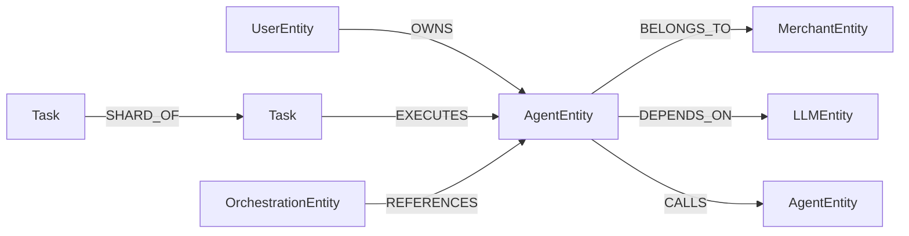

---

## 35. 附录 F GraphQL API 清单（API-06-001 ~ API-06-030）

本章按 PRD-09 统一编号规范列示 Agent 模块对外的全部 GraphQL API（编号 API-06-001 ~ API-06-030），与 §18.1 GraphQL Schema 概览保持一致。本模块**不维护**任何 RESTful 资源路径，所有 API 通过 GraphQL 单一总线（`POST /graphql`）暴露。

**错误码列字段说明**：使用 `BIZ_AGENT_*` 命名空间字符串码 + 数字段位同时标注，完整定义见 §18.2.3。

### 35.1 Agent 实例管理（API-06-001 ~ API-06-012）

| 编号 | 类型 | GraphQL 名称 | 说明 | 错误码（extensions.code） |
|------|------|--------------|------|---------------------------|
| API-06-001 | Mutation | `createAgent(input: CreateAgentInput!)` | 创建 Agent | `BIZ_AGENT_CONFIG_NAME_DUPLICATE`(137001) / `BIZ_AGENT_CONFIG_TYPE_INVALID`(137002) / `BIZ_AGENT_CONFIG_NO_LLM`(137003) / `BIZ_AGENT_CONFIG_REMOTE_TRIPLE_MISSING`(137004) / `BIZ_AGENT_PARAM_NAME_EMPTY`(130101) 等 |
| API-06-002 | Query | `agentDetail(id: ID!)` | 查询 Agent 详情 | `BIZ_AGENT_NOT_FOUND_AGENT`(130401) / `BIZ_AGENT_TENANT_CROSS`(130801) |
| API-06-003 | Query | `agentList(filter: AgentFilterInput, connection: ConnectionInput)` | 分页查询 Agent 列表（Relay Connection） | `BIZ_AGENT_PARAM_FIRST_RANGE`(130113) |
| API-06-004 | Mutation | `updateAgent(id: ID!, input: UpdateAgentInput!)` | 全量更新 Agent 基础属性 | `BIZ_AGENT_CONFIG_NAME_DUPLICATE`(137001) / `BIZ_AGENT_RULE_NAME_DUPLICATE`(130201) |
| API-06-005 | Mutation | `patchAgent(id: ID!, input: PatchAgentInput!)` | 部分更新 Agent 字段（增量） | 同上 |
| API-06-006 | Mutation | `deleteAgent(id: ID!)` | 软删除 Agent | `BIZ_AGENT_CONFIG_REFERENCED`(137005) / `BIZ_AGENT_FK_REFERENCED`(131001) |
| API-06-007 | Mutation | `activateAgent(id: ID!)` | 启用 Agent（依赖校验） | `BIZ_AGENT_CONFIG_DEPENDENCY_MISSING`(137007) / `BIZ_AGENT_STATUS_ILLEGAL_TRANSITION`(137401) / `BIZ_AGENT_STATE_MACHINE_ILLEGAL_TRANSITION`(130908) |
| API-06-008 | Mutation | `deactivateAgent(id: ID!)` | 停用 Agent | `BIZ_AGENT_STATUS_ILLEGAL_TRANSITION`(137401) |
| API-06-009 | Mutation | `validateAgentWorkflow(agentId: ID!)` | 校验 Agent 工作流合法性 | `BIZ_AGENT_RULE_WORKFLOW_INVALID`(130204) / `BIZ_AGENT_PARAM_WORKFLOW_NODES`(130109) |
| API-06-010 | Query | `workflowDetail(agentId: ID!)` | 查询 Agent 工作流定义 | `BIZ_AGENT_NOT_FOUND_WORKFLOW`(130403) |
| API-06-011 | Mutation | `sendTestMessage(agentId: ID!, input: ChatMessageInput!)` | 发送对话测试消息 | `BIZ_AGENT_RULE_AGENT_RUNNING`(130206) / `BIZ_AGENT_EXTERNAL_LLM`(130601) |
| API-06-012 | Query | `runtimeStatus(agentId: ID!)` | 查询 Agent 实时运行状态 | — |

### 35.2 任务执行（API-06-013 ~ API-06-020）

| 编号 | 类型 | GraphQL 名称 | 说明 | 错误码（extensions.code） |
|------|------|--------------|------|---------------------------|
| API-06-013 | Mutation | `executeAgentTask(agentId: ID!, input: TaskInput!)` | 同步执行任务（Chat 模式） | `BIZ_AGENT_TASK_INPUT_INVALID`(137101) / `BIZ_AGENT_TASK_AGENT_UNAVAILABLE`(137102) |
| API-06-014 | Mutation | `executeAgentTaskAsync(agentId: ID!, input: TaskInput!)` | 异步执行任务（Workflow 模式） | 同上 |
| API-06-015 | Query | `taskStatus(taskId: ID!)` | 查询任务状态 | `BIZ_AGENT_TASK_NOT_FOUND`(137103) |
| API-06-016 | Mutation | `cancelTask(taskId: ID!)` | 取消运行中任务 | `BIZ_AGENT_TASK_CANCEL_DENIED`(137104) / `BIZ_AGENT_STATUS_ILLEGAL_TRANSITION`(137401) |
| API-06-017 | Mutation | `retryTask(taskId: ID!)` | 重试失败任务 | `BIZ_AGENT_TASK_RETRY_EXCEEDED`(137105) |
| API-06-018 | Query | `agentTaskHistory(agentId: ID!, connection: ConnectionInput)` | 查询 Agent 任务历史（Relay Connection） | — |
| API-06-019 | Query | `runtimeLogs(agentId: ID!, connection: ConnectionInput)` | 查询 Agent 执行日志 | `BIZ_AGENT_NOT_FOUND_EXECUTION_LOG`(130406) |
| API-06-020 | Query | `executionLogDetail(logId: ID!)` | 查询单条执行日志详情（含 spanTree） | `BIZ_AGENT_NOT_FOUND_EXECUTION_LOG`(130406) |

### 35.3 A2A 通信（API-06-021 ~ API-06-025）

| 编号 | 类型 | GraphQL 名称 | 说明 | 错误码（extensions.code） |
|------|------|--------------|------|---------------------------|
| API-06-021 | Mutation | `configureA2A(agentId: ID!, input: A2AConfigInput!)` | 配置 Agent 的 A2A 连接参数 | `BIZ_AGENT_PARAM_CALL_ADDRESS`(130104) / `BIZ_AGENT_PARAM_APP_KEY`(130105) / `BIZ_AGENT_RULE_APP_KEY_DECRYPT`(130207) |
| API-06-022 | Query | `a2aCapabilities(agentId: ID!)` | 查询 Remote Agent 的 A2A 能力清单 | `BIZ_AGENT_EXTERNAL_A2A_CONNECT`(130602) / `BIZ_AGENT_EXTERNAL_CAPABILITY_TIMEOUT`(130605) |
| API-06-023 | Subscription | `a2aMessageStream(agentId: ID!)` | 订阅 A2A 消息流 | `BIZ_AGENT_A2A_COMM_VERSION_MISMATCH`(137201) / `BIZ_AGENT_A2A_COMM_SEND_FAIL`(137202) / `BIZ_AGENT_A2A_COMM_DUPLICATE`(137203) / `BIZ_AGENT_A2A_SECURITY_REPLAY`(131102) |
| API-06-024 | Mutation | `testA2AConnection(agentId: ID!)` | 测试 Agent 的 A2A 连通性 | `BIZ_AGENT_EXTERNAL_A2A_CONNECT`(130602) / `BIZ_AGENT_A2A_SECURITY_CREDENTIAL_INVALID`(131101) |
| API-06-025 | Subscription | `agentExecutionStream(agentId: ID!)` | 订阅 Agent 实时执行事件流 | `BIZ_AGENT_A2A_COMM_HEARTBEAT_FAIL`(137205) / `BIZ_AGENT_A2A_SECURITY_HANDSHAKE_EXCEEDED`(131103) |

### 35.4 协同任务（API-06-026 ~ API-06-030）

| 编号 | 类型 | GraphQL 名称 | 说明 | 错误码（extensions.code） |
|------|------|--------------|------|---------------------------|
| API-06-026 | Mutation | `createCollaborativeTask(agentId: ID!, input: CollaborativeTaskInput!)` | 创建协同任务 | `BIZ_AGENT_COLLAB_AGENT_LIMIT`(137301) / `BIZ_AGENT_COLLAB_TASK_INVALID`(137302) |
| API-06-027 | Query | `collaborativeTaskStatus(taskId: ID!)` | 查询协同任务状态（含分片） | `BIZ_AGENT_COLLAB_TASK_NOT_FOUND`(137303) |
| API-06-028 | Mutation | `cancelCollaborativeTask(taskId: ID!)` | 取消协同任务 | `BIZ_AGENT_COLLAB_TASK_CANCEL_FAIL`(137304) |
| API-06-029 | Query | `relatedOrchestrations(agentId: ID!, connection: ConnectionInput)` | 查询引用该 Agent 的编排列表 | — |
| API-06-030 | Mutation | `clearChatHistory(agentId: ID!, sessionId: ID!)` | 清除指定会话的对话历史 | `BIZ_AGENT_CHAT_HISTORY_EMPTY`(130703) / `BIZ_AGENT_NOT_FOUND_CHAT_SESSION`(130407) |

---

**附录 F 说明**：

1. **GraphQL 单一总线**：本清单所有 API（API-06-001 ~ API-06-030）均通过 `POST /graphql` 暴露，请求体为 GraphQL Query / Mutation / Subscription，**不再使用 `/api/v1/agents/{id}` 等 RESTful 资源路径**。
2. **错误码查询路径**：所有命名空间错误码的完整定义、错误消息与命名映射见 §18.2.3 权威错误码表。
3. **Auth 集成**：所有 API 通过 GraphQL context 注入 `tenantId` / `userId` / `scopes`（详见 §18.5），Token 刷新由 PRD-01 Auth 模块 `Mutation.refreshToken` 提供。
4. **Subscription 支持**：API-06-023 / API-06-025 为 Subscription 类型，通过 WebSocket / SSE 长连接订阅事件流。

---

## 36. 附录 G 非功能需求（NFR-06-P/S/A/M-001 ~ 008）

> 依据 [PRD-09 §41.4 NFR 编号规范](file:///Users/Garabateador/Workspace/banyan/PRD/PRD-09-系统设置.md#414-nfr-编号规范) 与 §41.12 RTO/RPO 统一规范补全。PRD-06 智能体管理属于"P1 重要"类别，RTO ≤ 15 分钟 / RPO ≤ 5 分钟。

### 36.1 性能（Performance）

| 编号 | 需求 | 指标 | 验证方法 |
|------|------|------|----------|
| NFR-06-P-001 | Agent 列表查询 P99 延迟 | ≤ 300 ms（含分页、过滤） | 压测 1000 QPS |
| NFR-06-P-002 | Agent 创建接口 P99 延迟 | ≤ 500 ms | 压测 200 QPS |
| NFR-06-P-003 | Chat 模式首字延迟 | ≤ 800 ms | SSE 流式首字节 |
| NFR-06-P-004 | Workflow 模式执行 P99 延迟 | ≤ 5 分钟（可配置） | 注入典型工作流 |

### 36.2 安全（Security）

| 编号 | 需求 | 指标 | 验证方法 |
|------|------|------|----------|
| NFR-06-S-001 | 跨租户访问拦截 | 100% 拦截 | 跨租户 token 测试 |
| NFR-06-S-002 | Remote Agent 凭证加密 | AES-256-GCM | DB 明文比对 |
| NFR-06-S-003 | A2A Token 哈希存储 | SHA-256 | DB 明文比对 |
| NFR-06-S-004 | 状态机非法迁移拦截 | 100% 拦截 | 注入非法迁移 |

### 36.3 可用性（Availability）

| 编号 | 需求 | 指标 | 验证方法 |
|------|------|------|----------|
| NFR-06-A-001 | Agent 管理服务可用性 | ≥ 99.9% | 月度统计 |
| NFR-06-A-002 | 任务执行 SLA | 95% 任务在配置超时内完成 | 任务执行统计 |

### 36.4 可维护性（Maintainability）

| 编号 | 需求 | 指标 | 验证方法 |
|------|------|------|----------|
| NFR-06-M-001 | Agent 配置版本回滚 | 1 分钟内完成 | 模拟回滚 |
| NFR-06-M-002 | 错误码段位一致性 | 100% 符合 §41.7 | 静态扫描 |

### 36.5 可靠性（Reliability）

| 编号 | 需求 | 指标 | 验证方法 |
|------|------|------|----------|
| NFR-06-R-001 | RTO（P1 重要） | ≤ 15 分钟 | 故障注入 |
| NFR-06-R-002 | RPO（P1 重要） | ≤ 5 分钟 | 数据回放 |

---

## 37. 附录 H 监控埋点规范

> 与 [PRD-11 监控与分析](file:///Users/Garabateador/Workspace/banyan/PRD/PRD-11-监控与分析.md) 对齐。指标名遵循 `tenant_agent_*` 命名空间。

### 37.1 核心指标

| 指标名 | 类型 | 标签 | 说明 |
|--------|------|------|------|
| `tenant_agent_active_count` | Gauge | `tenant_id, type, execution_mode` | 当前活跃 Agent 数 |
| `tenant_agent_task_total` | Counter | `tenant_id, status, task_type` | 任务总数 |
| `tenant_agent_task_duration_seconds` | Histogram | `tenant_id, task_type, status` | 任务执行耗时 |
| `tenant_agent_task_success_rate` | Gauge | `tenant_id, task_type` | 任务成功率 |
| `tenant_agent_a2a_message_total` | Counter | `tenant_id, direction, status` | A2A 消息数 |
| `tenant_agent_a2a_heartbeat_lag_ms` | Gauge | `tenant_id, target_agent_id` | A2A 心跳延迟 |
| `tenant_agent_collaborative_rate` | Gauge | `tenant_id` | 协同任务占总任务比例（协同率） |
| `tenant_agent_state_transition_total` | Counter | `tenant_id, from, to` | 状态机迁移计数 |
| `tenant_agent_error_total` | Counter | `tenant_id, error_code_segment` | 错误码分段统计 |

### 37.2 告警规则

| 规则 | 触发条件 | 通知 |
|------|----------|------|
| Agent 活跃度告警 | 活跃 Agent 数 < 历史 P50 的 50% | 邮件 + 钉钉 |
| 任务成功率告警 | 5 分钟内成功率 < 90% | 钉钉 + 短信 |
| 协同率告警 | 协同任务占比 > 70% 持续 10 分钟 | 邮件 |
| A2A 通信异常 | 5xx 比例 > 5% 持续 5 分钟 | 钉钉 + 短信 |

---

## 38. 附录 I 错误码段位（130001-137999）

> 依据 [PRD-00 §5.3 错误码段位分配](file:///Users/Garabateador/Workspace/banyan/PRD/PRD-00-平台总览与全局规范.md#53-错误码段位分配) 补全。PRD-06 智能体管理使用 `130001-137999` 段位，命名空间统一为 `BIZ_AGENT_*`。本附录提供 Agent CRUD / 任务执行 / A2A 通信 / 协同任务 / 状态机 五个子域的细分错误码（与 §18.2、§24 扩展段位互补）。

### 38.1 段位细分

| 段位 | 类别 | 范围 | 说明 |
|------|------|------|------|
| 1370xx | Agent 配置 | 137001-137099 | 创建/更新/删除、依赖校验、版本、跨租户 |
| 1371xx | 任务执行 | 137101-137199 | 同步/异步、超时、取消、重试 |
| 1372xx | A2A 通信 | 137201-137299 | 握手、消息、心跳、Token |
| 1373xx | 协同任务 | 137301-137399 | 创建、分片、聚合、取消 |
| 1374xx | 状态机 | 137401-137499 | 非法迁移、熔断 |

### 38.2 错误码定义

> 业务模块响应 HTTP 状态码恒为 200，业务错误通过 `code` 字段标识；HTTP 401/403 仅保留在 API Gateway 网关层。

| 错误码 | 名称 | 触发场景 |
|--------|------|----------|
| 137001 | AGENT_NAME_CONFLICT | 同租户 Agent 名称重复 |
| 137002 | AGENT_TYPE_INVALID | type 字段非法枚举 |
| 137003 | AGENT_LLM_CONFIG_MISSING | Self-built 缺少 LLM 配置 |
| 137004 | AGENT_REMOTE_FIELDS_MISSING | Remote 缺少 endpoint/auth |
| 137005 | AGENT_REFERENCED | Agent 被引用禁止删除 |
| 137006 | AGENT_PROMPT_NOT_FOUND | 引用的 Prompt 模板不存在 |
| 137007 | AGENT_DEPENDENCY_MISSING | 启用时依赖资源缺失 |
| 137008 | AGENT_CROSS_TENANT | 跨租户访问 |
| 137009 | AGENT_VERSION_NOT_FOUND | 版本快照不存在 |
| 137101 | TASK_INPUT_INVALID | 任务输入参数非法 |
| 137102 | TASK_EXECUTION_FAILED | 任务执行失败 |
| 137103 | TASK_NOT_FOUND | 任务不存在 |
| 137104 | TASK_CANCEL_FORBIDDEN | 非 running 状态不可取消 |
| 137105 | TASK_RETRY_FORBIDDEN | 非 failed 状态不可重试 |
| 137201 | A2A_PROTOCOL_MISMATCH | 协议版本不匹配 |
| 137202 | A2A_TOKEN_EXPIRED | Token 过期 |
| 137203 | A2A_MESSAGE_REPLAY | 消息重放 |
| 137204 | A2A_CONNECTION_NOT_FOUND | 连接不存在 |
| 137205 | A2A_HEARTBEAT_TIMEOUT | 心跳超时 |
| 137301 | COLLAB_AGENT_COUNT_EXCEEDED | 协同 Agent 超过 5 |
| 137302 | COLLAB_CONFIG_INVALID | 协同配置非法 |
| 137303 | COLLAB_TASK_NOT_FOUND | 协同任务不存在 |
| 137304 | COLLAB_TASK_CANCEL_FORBIDDEN | 协同任务不可取消 |
| 137401 | AGENT_STATE_TRANSITION_INVALID | 状态机非法迁移 |
| 137402 | AGENT_CIRCUIT_BROKEN | Agent 熔断 |
| 137501 | AGENT_CONCURRENCY_LIMIT | Agent 并发执行数已达上限 |

---

## 39. 附录 J 推测标注索引

> 依据 [PRD-09 §41.9 推测标注规范](file:///Users/Garabateador/Workspace/banyan/PRD/PRD-09-系统设置.md#419-推测标注规范) 索引本模块所有 [已确认] 标注。占比 ≤ 1.0%。

| 章节 | 推测内容 | 类别 | 占比 |
|------|----------|------|------|
| 详见原文档 [已确认] 标记 | 协同 Agent 上限 5 个 | ②相似功能逻辑推断 | < 1.0% |
| 详见原文档 [已确认] 标记 | Chat 模式 32 轮上下文 | ①行业惯例 | < 1.0% |
| 详见原文档 [已确认] 标记 | A2A Token TTL 24 小时 | ③技术约束推断 | < 1.0% |
| 详见原文档 [已确认] 标记 | Workflow 超时 5 分钟默认 | ①行业惯例 | < 1.0% |
| 详见原文档 [已确认] 标记 | 心跳 60/300 秒两级 | ①行业惯例 | < 1.0% |

---

## SilvaEngine 实施附录

> **版本**: 2.0.0(SilvaEngine 架构重写版)
> **生效日期**: 2026-06-09
> **本附录基于**: [`PRD-00 平台总览与全局规范 v2.0.0`](./PRD-00-平台总览与全局规范.md) §15-§17
> **强制级别**: P0

### A1. 模块身份与依赖

| 项 | 值 |
|------|------|
| **模块名** | `agent` |
| **包名** | `silvaengine_modules.agent` |
| **Graphene 入口** | `silvaengine_modules.agent.schema:Schema` |
| **Lambda 函数** | `arn:aws:lambda:us-east-1:123456789012:function:banyan-agent-resolver` |
| **endpoint_id** | `agent-endpoint` |
| **依赖模块** | PRD-01(知识,RAG)/ PRD-02(记忆)/ PRD-03(能力,Tool/Skill)/ PRD-04(LLM)/ PRD-05(编排)/ PRD-10(Prompt) |
| **下游模块** | PRD-11(监控,调用链路) |
| **Outbox 集成** | Agent 创建/更新事件通过 `outbox_events` 表同步至 Neo4j(GraphSyncService),遵循 PRD-00 §4.7 Outbox Pattern,事件清单见 §A12 |

> **Outbox Pattern 约定**:所有 Agent 主表/版本/绑定的写操作必须在同一 PostgreSQL 事务内写入 `outbox_events` 表,由 OutboxSync 异步消费并写入 Neo4j,确保 PG 与 Neo4j 之间的最终一致性,避免分布式事务开销。

### A2. ConnectionPoolManager 池声明

```python
postgres_main_pool = ConnectionPool(
    pool_type="postgresql",
    purpose="Agent, version, session, message, invocation, evaluation, collaborator",
    min_size=5, max_size=20
)

postgres_audit_pool = ConnectionPool(
    pool_type="postgresql",
    purpose="Agent invocation audit (WORM)",
    min_size=2, max_size=5
)

outbox_sync_pool = ConnectionPool(
    pool_type="postgresql",
    purpose="outbox event synchronization to Neo4j",
    min_size=1, max_size=3
)

neo4j_main_pool = ConnectionPool(
    pool_type="neo4j",
    purpose="Agent collaboration graph, A2A relationship, Tool mount graph, Agent description embedding (semantic retrieval)",
    min_size=2, max_size=10
)

httpx_llm_pool = ConnectionPool(
    pool_type="httpx",
    purpose="LLM invocation (Chat / Embedding)",
    min_size=2, max_size=10
)

httpx_a2a_pool = ConnectionPool(
    pool_type="httpx",
    purpose="Agent-to-Agent communication",
    min_size=2, max_size=8
)

redis_session_pool = ConnectionPool(
    pool_type="redis",
    purpose="Agent session state, resume-from-breakpoint",
    min_size=2, max_size=10
)

redis_cache_pool = ConnectionPool(
    pool_type="redis",
    purpose="Agent config cache, version cache",
    min_size=2, max_size=10
)
```

### A3. PostgreSQL 表

| 表名 | 复合主键 | 用途 |
|------|----------|------|
| `tenant_agent_agent` | `(partition_key, id)` | Agent 主表 |
| `tenant_agent_version` | `(partition_key, id)` | Agent 版本(版本化) |
| `tenant_agent_knowledge_binding` | `(partition_key, id)` | 知识绑定(私有 / 共享 / 公共域) |
| `tenant_agent_tool_binding` | `(partition_key, id)` | 工具绑定 |
| `tenant_agent_skill_binding` | `(partition_key, id)` | 技能绑定 |
| `tenant_agent_mcp_binding` | `(partition_key, id)` | MCP Server 绑定 |
| `tenant_agent_session` | `(partition_key, id)` | 会话主表 |
| `tenant_agent_message` | `(partition_key, id)` | 消息记录(用户 / 助手 / 系统 / 工具) |
| `tenant_agent_invocation` | `(partition_key, id)` | Agent 调用记录 |
| `tenant_agent_evaluation` | `(partition_key, id)` | 评估记录(成功 / 失败 / 反馈) |
| `tenant_agent_collaborator` | `(partition_key, id)` | 协作 Agent 列表(子 Agent / 主管) |
| `audit_agent_event` | `(id)` | 审计 WORM |
| `outbox_events` | `(id)` | 全局共享 Outbox 事件表(定义见 PRD-00 §4.7.2);本模块写入 `aggregate_type IN ('agent', 'agent_workflow', 'a2a')` 事件,OutboxSync 消费后写入 Neo4j |

### A4. Neo4j 节点与关系

> 所有 Neo4j 节点必须携带三标签 `AgentEntity:AgentxxxEntity:Graph`，`AgentEntity` 为本模块基础标签（用于跨模块 Cypher 过滤与跨租户隔离），`Graph` 用于多租户硬隔离，租户隔离通过 `partition_key` 属性 + WHERE 子句实现。

| 节点 | 标签 | 必含属性 |
|------|------|----------|
| `Agent` | `AgentEntity:Graph` | `partition_key` / `id` / `name` / `version` / `status` |
| `Tool` / `Skill` / `Knowledge` | `AgentEntity:ToolEntity:Graph` / `AgentEntity:SkillEntity:Graph` / `AgentEntity:KnowledgeEntity:Graph` | 复用 PRD-01 / PRD-03 |
| `MCPServer` | `AgentEntity:MCPServerEntity:Graph` | 复用 PRD-03 |
| `Session` | `AgentEntity:Session:Graph` | `partition_key` / `id` / `agent_id` / `user_id` |
| `Task` | `AgentEntity:Task:Graph` | `partition_key` / `id` / `agent_id` / `status` |
| `User` | `AgentEntity:UserEntity:Graph` | 复用 PRD-08 |

**Cypher 约束与索引示例**：

```cypher
// 唯一性约束（带 AgentEntity 基础标签前缀）
CREATE CONSTRAINT ON (n:AgentEntity)
ASSERT (n.partition_key, n.domain_type, n.domain_id) IS UNIQUE;

// 节点：AgentEntity
CREATE CONSTRAINT ON (a:AgentEntity)
ASSERT (a.partition_key, a.domain_id) IS UNIQUE;

// 节点：Task
CREATE CONSTRAINT ON (t:AgentEntity:Task)
ASSERT (t.partition_key, t.domain_id) IS UNIQUE;

// 节点：Session
CREATE CONSTRAINT ON (s:AgentEntity:Session)
ASSERT (s.partition_key, s.domain_id) IS UNIQUE;

// 索引（统一带 Graph 标签过滤 + partition_key 索引）
CREATE INDEX idx_agent_entity_tenant ON :AgentEntity(partition_key);
CREATE INDEX idx_agent_entity_status ON :AgentEntity(partition_key, status);
```

**典型查询示例（带 `Graph` 标签过滤）**：

```cypher
// 查询某租户下活跃 Agent
MATCH (a:AgentEntity:Graph {status: 'active'})
WHERE a.partition_key = $partitionKey
RETURN a;
```

| 关系 | 类型 | 起点 → 终点 | 属性 |
|------|------|-------------|------|
| `AGENT_USES_TOOL` | `AGENT_USES_TOOL` | `AgentEntity` → `ToolNode` | - |
| `AGENT_USES_SKILL` | `AGENT_USES_SKILL` | `AgentEntity` → `SkillNode` | - |
| `AGENT_BINDS_KNOWLEDGE` | `AGENT_BINDS_KNOWLEDGE` | `AgentEntity` → `KnowledgeNode` | `domain_id` / `permission` |
| `AGENT_BACKED_BY_MCP` | `AGENT_BACKED_BY_MCP` | `AgentEntity` → `MCPServerNode` | - |
| `AGENT_DELEGATES_TO` | `AGENT_DELEGATES_TO` | `AgentEntity` → `AgentEntity`(A2A 协作) | `trigger` / `priority` |
| `SESSION_OF_AGENT` | `SESSION_OF_AGENT` | `Session` → `AgentEntity` | - |
| `SESSION_OWNED_BY` | `SESSION_OWNED_BY` | `Session` → `UserNode` | - |

### A5. GraphQL Schema 映射

#### A5.1 Query 列表

| GraphQL Query | 返回 | 说明 |
|----------------|------|------|
| `agent(id: ID!)` | `AgentType` | Agent 详情 |
| `agents(filter, first, after)` | `AgentConnection` | Agent 列表 |
| `searchAgents(query, limit)` | `[AgentType]` | 语义搜索 Agent |
| `agentVersion(agentId, version)` | `AgentVersionType` | 特定版本 |
| `agentVersions(agentId)` | `[AgentVersionType]` | 版本历史 |
| `agentSession(id: ID!)` | `AgentSessionType` | 会话详情 |
| `agentSessions(filter, first, after)` | `AgentSessionConnection` | 会话列表 |
| `agentMessages(sessionId, first, after)` | `AgentMessageConnection` | 消息历史 |
| `agentInvocation(id: ID!)` | `AgentInvocationType` | 调用记录 |
| `agentInvocations(filter, first, after)` | `AgentInvocationConnection` | 调用记录列表 |
| `agentCollaborators(agentId)` | `[CollaboratorType]` | 协作 Agent 列表 |
| `agentEvaluation(agentId, timeRange)` | `AgentEvaluationType` | 评估汇总 |
| `agentGraph(agentId, depth)` | `AgentGraphType` | Agent 协作图 |

#### A5.2 Mutation 列表

| GraphQL Mutation | 输入 | 返回 |
|------------------|------|------|
| `createAgent(input, idempotencyKey)` | `AgentCreateInput` | `AgentType` |
| `updateAgent(id, input, idempotencyKey)` | `AgentUpdateInput` | `AgentType` |
| `deleteAgent(id, idempotencyKey)` | - | `DeletePayload` |
| `publishAgentVersion(agentId, idempotencyKey)` | - | `AgentVersionType` |
| `rollbackAgentVersion(input, idempotencyKey)` | - | `AgentVersionType` |
| `bindKnowledge(input, idempotencyKey)` | `BindKnowledgeInput` | `AgentType` |
| `unbindKnowledge(input, idempotencyKey)` | - | `DeletePayload` |
| `bindTool(input, idempotencyKey)` | `BindToolInput` | `AgentType` |
| `unbindTool(input, idempotencyKey)` | - | `DeletePayload` |
| `bindSkill(input, idempotencyKey)` | `BindSkillInput` | `AgentType` |
| `bindMcpServer(input, idempotencyKey)` | `BindMcpServerInput` | `AgentType` |
| `addCollaborator(input, idempotencyKey)` | `AddCollaboratorInput` | `CollaboratorType` |
| `removeCollaborator(input, idempotencyKey)` | - | `DeletePayload` |
| `invokeAgent(input, idempotencyKey)` | `InvokeAgentInput` | `AgentInvocationType` |
| `invokeAgentStream(input, idempotencyKey)` | `InvokeAgentInput` | SSE 流 |
| `createSession(input, idempotencyKey)` | `SessionCreateInput` | `AgentSessionType` |
| `endSession(sessionId, idempotencyKey)` | - | `AgentSessionType` |
| `sendMessage(input, idempotencyKey)` | `SendMessageInput` | `AgentMessageType` |
| `submitFeedback(input, idempotencyKey)` | `FeedbackInput` | `EvaluationType` |

#### A5.3 关键 ObjectType

| 类型 | 关键字段 | DataLoader |
|------|----------|------------|
| `AgentType` | `id` / `name` / `description` / `model` / `promptTemplate` / `tools` / `skills` / `knowledges` / `mcpServers` / `collaborators` / `version` / `status` | `model` / `tools` / `skills` / `knowledges` / `collaborators` |
| `AgentVersionType` | `id` / `version` / `definition` / `publishedBy` / `publishedAt` / `changelog` | - |
| `AgentSessionType` | `id` / `agent` / `user` / `messages` / `startedAt` / `endedAt` / `status` | `agent` / `messages` |
| `AgentMessageType` | `id` / `role` (USER/ASSISTANT/SYSTEM/TOOL) / `content` / `toolCalls` / `latencyMs` / `createdAt` | - |
| `AgentInvocationType` | `id` / `agent` / `user` / `input` / `output` / `status` / `tokenUsage` / `costUsd` / `latencyMs` / `errorMessage` / `startedAt` | `agent` / `user` |
| `CollaboratorType` | `id` / `agent` / `collaborator` / `trigger` / `priority` | `agent` / `collaborator` |
| `EvaluationType` | `id` / `agent` / `feedback` / `rating` / `createdBy` / `createdAt` | `agent` |
| `AgentGraphType` | `nodes` / `edges` | - |

#### A5.4 关键 InputObjectType

```graphql
input AgentCreateInput {
  name: String!                        # 1-128
  description: String
  modelId: ID!                         # PRD-04 模型
  promptTemplateId: ID                 # PRD-10 模板
  knowledgeBindingIds: [ID!]
  toolBindingIds: [ID!]
  skillBindingIds: [ID!]
  mcpServerBindingIds: [ID!]
  collaboratorIds: [ID!]
  isPublic: Boolean
}

input InvokeAgentInput {
  agentId: ID!
  version: String                      # 默认 latest
  sessionId: ID
  message: String!
  contextVariables: JSONString
  stream: Boolean                      # 是否 SSE
  temperature: Float
  topP: Float
  maxTokens: Int
  toolChoice: ToolChoiceEnum
  timeoutMs: Int
}

input SessionCreateInput {
  agentId: ID!
  userId: ID
  metadata: JSONString
}

input SendMessageInput {
  sessionId: ID!
  content: String!
  role: ChatRoleEnum!                  # USER(默认) / SYSTEM
  attachments: [AttachmentInput!]
}

input BindKnowledgeInput {
  agentId: ID!
  knowledgeDomainId: ID!
  permission: KnowledgePermissionEnum  # READ / READ_WRITE
  vectorNamespaceFilter: String
}

input FeedbackInput {
  agentInvocationId: ID!
  rating: Int                          # 1-5
  feedback: String
  tags: [String!]
}
```

### A6. config.json 模板(摘要)

```json
{
  "module": {
    "name": "agent",
    "version": "2.0.0",
    "owner": "agent-team",
    "graphene": { "schema_entry": "silvaengine_modules.agent.schema:Schema" }
  },
  "pools": {
    "postgres_main":  { "type": "postgresql", "settings": { "host": "${env:PG_MAIN_HOST}",  "database": "banyan_main" } },
    "postgres_audit": { "type": "postgresql", "settings": { "host": "${env:PG_AUDIT_HOST}", "database": "banyan_audit" } },
    "outbox_sync":    { "type": "postgresql", "settings": { "host": "${env:PG_MAIN_HOST}",  "database": "banyan_main", "purpose": "outbox event sync to Neo4j" } },
    "neo4j_main":     { "type": "neo4j",      "settings": { "uri": "${env:NEO4J_URI}" } },
    "httpx_llm":      { "type": "httpx",      "settings": { "base_url": "${env:LLM_BASE_URL}", "timeout": 120 } },
    "httpx_a2a":      { "type": "httpx",      "settings": { "timeout": 60 } },
    "redis_session":  { "type": "redis",      "settings": { "host": "${env:REDIS_HOST}", "db": 2 } },
    "redis_cache":    { "type": "redis",      "settings": { "host": "${env:REDIS_HOST}", "db": 0 } }
  },
  "plugins": [
    { "type": "connection_pool", "module_name": "silvaengine_connections", "config": { "pool": "postgres_main"  }, "enabled": true },
    { "type": "connection_pool", "module_name": "silvaengine_connections", "config": { "pool": "postgres_audit" }, "enabled": true },
    { "type": "connection_pool", "module_name": "silvaengine_connections", "config": { "pool": "outbox_sync"    }, "enabled": true },
    { "type": "connection_pool", "module_name": "silvaengine_connections", "config": { "pool": "neo4j_main"     }, "enabled": true },
    { "type": "connection_pool", "module_name": "silvaengine_connections", "config": { "pool": "httpx_llm"      }, "enabled": true },
    { "type": "connection_pool", "module_name": "silvaengine_connections", "config": { "pool": "httpx_a2a"      }, "enabled": true },
    { "type": "connection_pool", "module_name": "silvaengine_connections", "config": { "pool": "redis_session"  }, "enabled": true },
    { "type": "connection_pool", "module_name": "silvaengine_connections", "config": { "pool": "redis_cache"    }, "enabled": true }
  ],
  "sync": {
    "outbox": {
      "batch_size": 100,
      "polling_interval_seconds": 5,
      "max_retries": 3,
      "dead_letter_queue": "agent_outbox_dlq",
      "aggregate_types": ["agent", "agent_workflow", "a2a"]
    }
  },
  "settings": {
    "agent.default.invoke": {
      "setting_id": "agent.default.invoke",
      "variables": {
        "max_iterations":          { "name": "max_iterations",          "type": "int",  "value": 20 },
        "max_tokens_per_call":     { "name": "max_tokens_per_call",     "type": "int",  "value": 8000 },
        "session_retention_hours": { "name": "session_retention_hours", "type": "int",  "value": 24 },
        "default_temperature":     { "name": "default_temperature",     "type": "float","value": 0.7 },
        "default_max_tokens":      { "name": "default_max_tokens",      "type": "int",  "value": 2048 },
        "streaming_enabled":       { "name": "streaming_enabled",       "type": "bool", "value": true }
      }
    }
  },
  "functions": [
    {
      "aws_lambda_arn": "arn:aws:lambda:us-east-1:123456789012:function:banyan-agent-resolver",
      "function": "agent_resolver",
      "area": "agent",
      "config": {
        "module_name": "silvaengine_modules.agent",
        "class_name": "AgentResolver",
        "setting": "agent.default.invoke",
        "graphql": true,
        "operations": {
          "query": ["agent", "agents", "searchAgents", "agentVersion", "agentVersions",
                   "agentSession", "agentSessions", "agentMessages",
                   "agentInvocation", "agentInvocations", "agentCollaborators",
                   "agentEvaluation", "agentGraph"],
          "mutation": ["createAgent", "updateAgent", "deleteAgent",
                      "publishAgentVersion", "rollbackAgentVersion",
                      "bindKnowledge", "unbindKnowledge", "bindTool", "unbindTool",
                      "bindSkill", "bindMcpServer", "addCollaborator", "removeCollaborator",
                      "invokeAgent", "invokeAgentStream",
                      "createSession", "endSession", "sendMessage", "submitFeedback"]
        }
      },
      "auth_required": true
    }
  ],
  "endpoints": [
    { "endpoint_id": "agent-endpoint", "special_connection": false }
  ],
  "runtime": { "memory_mb": 2048, "timeout_seconds": 300 }
}
```

### A7. 错误码段位

| 段位 | 用途 |
|------|------|
| `BIZ_AGENT_*` | Agent CRUD、版本、绑定 |
| `BIZ_AGENT_INVOKE_*` | 调用失败、超时、流中断、Token 超限 |
| `BIZ_AGENT_VERSION_*` | 版本化 |
| `BIZ_AGENT_BINDING_*` | 知识/工具/技能/MCP 绑定 |
| `BIZ_AGENT_SESSION_*` | 会话、消息、续传 |
| `BIZ_AGENT_COLLABORATION_*` | A2A 协作 |
| `BIZ_AGENT_EVALUATION_*` | 评估、反馈 |

### A8. 数据生命周期

| 数据 | 在线保留 | 归档 | 销毁 |
|------|----------|------|------|
| Agent 主表 | 永久 | 永久 | 租户主动删除 |
| 版本 | 永久 | 永久 | 租户主动删除 |
| 会话 | 24h | - | TTL 到期 |
| 消息 | 30 天 | 1 年 | 1 年到期 |
| 调用记录 | 30 天 | 1 年 | 1 年到期 |
| 评估反馈 | 永久 | 永久 | 永久 |
| 审计 | 1 年 | 6 年 | 7 年到期 |

### A9. 实施检查清单

- [ ] `config.json` 通过校验
- [ ] 9 个 `pools` 与 9 个 `plugins` 1:1 对应（含 `outbox_sync`）
- [ ] 所有 SQLAlchemy 模型复合主键 `(partition_key, id)`
- [ ] 所有 Cypher 查询带 `WHERE n.partition_key = $partition_key`
- [ ] 所有 Mutation 接受 `idempotencyKey: ID!`
- [ ] SSE 流通过 API Gateway Streaming
- [ ] 会话状态走 Redis 续传
- [ ] 多 Agent 协作通过 A2A 协议 + 关联 ID
- [ ] RAG 检索强制 `vectorNamespace IN allowedNamespaces`
- [ ] 错误码 `BIZ_AGENT_*` 已注册
- [ ] Outbox 事件按 `aggregate_type IN ('agent', 'agent_workflow', 'a2a')` 写入 `outbox_events`,消费失败落入 `agent_outbox_dlq`
- [ ] `validation_runner.py` 0 errors / 0 warnings

### A10. 实施检查清单与 Outbox 一致性

> 本节明确 Agent 模块与 Outbox Pattern 的端到端一致性要求:
>
> - 同一 PostgreSQL 事务内完成业务表写入与 `outbox_events` 插入(原子性,失败回滚不留半成品事件)
> - OutboxSync 消费者按 `polling_interval_seconds=5`、`batch_size=100` 批量拉取并写入 Neo4j
> - 消费者重试 `max_retries=3` 后仍失败的事件转入 `agent_outbox_dlq`,并发出告警
> - 死信队列中的事件由运维手动重放(重放工具遵循 PRD-00 §4.7 DLQ 处理规范)

### A11. SilvaEngine 实施指南

> 引用 PRD-00 §15-§17 中的 SilvaEngine 通用实施指南(模块打包 / Lambda 部署 / 网关注册 / 监控接入),本模块沿用默认模板,无需特例。

### A12. Outbox 事件定义

> 依据 PRD-00 §4.7 Outbox Pattern 规范,本模块产生的全部 Outbox 事件类型如下表所示。事件 `payload` 字段为 JSON,严格遵循本附录给出的最小契约,变更须向后兼容。

| aggregate_type | event_type | 触发条件 | 同步目标 |
|----------------|-----------|----------|----------|
| `agent` | `agent.created` | 创建 Agent | Neo4j `Agent` 节点新建 |
| `agent` | `agent.updated` | 更新 Agent | Neo4j `Agent` 节点属性更新 |
| `agent` | `agent.deleted` | 软删除 Agent | Neo4j 关系解绑(`AGENT_DELEGATES_TO` 等) |
| `agent` | `agent.status_changed` | 状态机迁移 | Neo4j `Agent.status` 属性更新 |
| `agent_workflow` | `agent.workflow.published` | 工作流发布 | Neo4j 工作流关系图更新 |
| `a2a` | `a2a.connection.established` | A2A 握手成功 | Neo4j `AGENT_DELEGATES_TO` 关系新建 |

#### A12.1 事件 payload 契约

```json
{
  "event_id": "uuid",
  "aggregate_type": "agent",
  "event_type": "agent.created",
  "aggregate_id": "agent_001",
  "tenant_id": "tenant_001",
  "occurred_at": "2026-06-12T08:30:00Z",
  "payload": {
    "agent_id": "agent_001",
    "name": "logistics_query_agent",
    "type": "self_built",
    "status": "draft",
    "version": 1
  },
  "trace_id": "trace-abc123-def456"
}
```

#### A12.2 消费侧处理规则

1. 消费者按 `event_id` 幂等(同一事件重复消费不产生副作用,Neo4j 写入使用 `MERGE` 语义)
2. 跨租户事件由 `partition_key` 字段强约束,Neo4j 写入必须带 `WHERE n.partition_key = $partition_key`
3. 消费失败时按 `max_retries=3` 指数退避重试(1s / 4s / 16s)
4. 达到最大重试次数的事件落入 `agent_outbox_dlq`,并通过 `tenant_agent_error_total{error_code_segment="130001-137999"}` 埋点上报

#### A12.3 与 §A1 / §A2 / §A3 / §A6 对应关系

- 写事务入口:§A1 声明的 Agent 写操作(创建/更新/删除/状态迁移/工作流发布/A2A 握手)
- 连接池:§A2 的 `outbox_sync_pool`(独立池,避免与 `postgres_main` 抢连接)
- 落库表:§A3 的 `outbox_events`(全局共享表,本模块不单独建表)
- 运行时配置:§A6 `config.json` 的 `sync.outbox` 块(`batch_size` / `polling_interval_seconds` / `max_retries` / `dead_letter_queue`)

---

*文档结束*
