# PRD-07 商户管理模块

> **版本**: V3.0（v3.0 收束版 2026-06-13）
> **v3.0 变更说明**:文档头刷新为 V3.0；错误码段位与 PRD-00 §5.3.2.1.1 增补条目对齐
> **职责声明(2026-06-09 收束)**:本模块聚焦「租户(商户)与多租户隔离」- 多租户 / 商户注册认证 / BYOK / 合规 / 密钥管理 / 数据迁移 / 计费
>
> **遵循规范**:[PRD-00 平台总览与全局规范](file:///Users/Garabateador/Workspace/banyan/PRD/PRD-00-平台总览与全局规范.md) - 接口规范(§4)、错误码(§5)、非功能需求(§6)、数据规范(§7)、安全基线(§9)
>
> **上游依赖**:无
> **下游被依赖**:PRD-08 用户、PRD-12 权限、所有业务模块(提供 tenant_id)
> **错误码命名空间**：`BIZ_MERCHANT_*` | `BIZ_TENANT_*` | `BIZ_API_KEY_*` | `BIZ_SUBSCRIPTION_*` | `BIZ_CHANNEL_*` | **数字段位**：`200001-200999`（子段位细分：2001xx 商户/2002xx 渠道/2003xx 主题/2004xx 审计/2005xx API Key/2006xx 订阅/2007xx 注册/2008xx 巡检/2009xx 通知/2010xx-2019xx 配额与计费/2090xx-2099xx 预留扩展）
>
> **本期不实现声明**：`BIZ_SUBSCRIPTION_*`（2006xx）和计费相关错误码段位（2010xx-2019xx）本期不实现，相关DDL表（sys_tenant_subscription_plan、sys_tenant_subscription、sys_tenant_billing_record）从SilvaEngine附录中移除。错误码段位保留但标注为"预留"，后续版本补充业务规则定义。
> **对外接口**：GraphQL (POST /graphql) | **Gateway内部路由**：N/A（GraphQL单总线，原 /api/v1/merchants 已弃用）

---

## 1. 文档信息

| 项目 | 内容 |
|------|------|
| 文档编号 | PRD-07 |
| 模块名称 | 商户管理模块（Merchant Management） |
| 版本 | V3.0(2026-06-13 v3.0收束) |
| 创建日期 | 2026-06-08 |
| 最后更新 | 2026-06-13 |
| 文档负责人 | 产品经理 |
| 状态 | 收束重构中 |
| 关联文档 | [PRD-00 平台总览](file:///Users/Garabateador/Workspace/banyan/PRD/PRD-00-平台总览与全局规范.md)、[PRD-08 用户管理](file:///Users/Garabateador/Workspace/banyan/PRD/PRD-08-用户管理.md)、[PRD-12 权限管理](file:///Users/Garabateador/Workspace/banyan/PRD/PRD-12-权限管理.md) |
| 历史关联文档（已分拆） | PRD-01 认证与入口（原文件已于 2026-06-08 移除，其内容已整合至本模块 §17 商户注册与认证） |
| **全局规范引用** | 接口→PRD-00 §4;错误码→PRD-00 §5;NFR→PRD-00 §6;数据→PRD-00 §7;安全→PRD-00 §9 |

---

## 2. 术语定义

| 术语 | 英文 | 定义 |
|------|------|------|
| 商户 | Merchant | 系统中的核心租户单元，承载渠道接入、用户管理、业务配置等关键职责，是Multi-Tenant架构中数据隔离的基本边界 |
| 渠道 | Channel | 商户下的业务接入点，代表一个具体的应用或服务入口，一个商户可创建多个渠道 |
| 智能体 | Agent | 以LLM为核心控制器的任务执行实体，具备记忆、规划和工具调用能力（详见PRD-06） |
| 主题 | Theme | 渠道级别的视觉定制方案，包含颜色、字体、图标、布局等配置项，用于品牌化展示 |
| 多租户 | Multi-Tenant | 系统架构模式，多个商户共享同一套基础设施，但数据逻辑隔离，互不可见 |
| 基于角色的访问控制 | RBAC（Role-Based Access Control） | 通过角色分配权限的访问控制模型，用户通过关联角色获得对应权限 |
| 基于属性的访问控制 | ABAC（Attribute-Based Access Control） | 基于用户属性、资源属性、环境条件等动态判定权限的访问控制模型 |
| 配额 | Quota | 对商户资源使用量的限制，包括用户数、存储空间、API调用量等维度 |
| 审计日志 | Audit Log | 记录商户及渠道关键操作的不可篡改日志，用于合规审计和问题追溯 |
| 软删除 | Soft Delete | 标记数据为已删除但保留物理记录的删除方式，支持数据恢复和审计追踪 |

---

### 2.1 术语对照表（与PRD-12对齐）

> 本章节依据：PRD-12权限管理模块包含术语对照表，本模块遵循同一规范，确保跨模块术语使用一致性。

| 中文术语 | 英文术语 | 缩写 | 描述 |
|----------|----------|------|------|
| 商户 | Merchant | - | 核心租户单元，数据隔离的基本边界 |
| 渠道 | Channel | - | 商户下的业务接入点 |
| 主题 | Theme | - | 渠道级别的视觉定制方案 |
| 多租户 | Multi-Tenant | - | 共享基础设施但数据逻辑隔离的架构 |
| 配额 | Quota | - | 资源使用量的限制 |
| 审计日志 | Audit Log | - | 不可篡改的操作记录 |
| 软删除 | Soft Delete | - | 标记删除保留物理记录的方式 |
| 访问控制 | Access Control | AC | 决定谁能访问什么资源 |
| 角色 | Role | - | 一组权限的集合 |
| 权限 | Permission | - | 对资源的访问权 |
| 资源 | Resource | - | 被保护的对象 |
| 操作 | Action | - | 资源上可执行的动作 |
| 主体 | Subject | - | 访问资源的实体 |
| 属性 | Attribute | - | 主体/资源/操作/环境的特征 |
| 策略 | Policy | - | 决定访问是否允许的规则 |
| 继承 | Inheritance | - | 子角色继承父角色权限 |
| 互斥约束 | Separation of Duty | SoD | 互斥角色不可同时持有 |
| 默认拒绝 | Default Deny | - | 无明确允许即拒绝 |
| 最小权限 | Least Privilege | - | 授予完成工作所需的最小权限 |
| 白名单 | Whitelist | - | 无条件允许的列表 |
| 黑名单 | Blacklist | - | 无条件拒绝的列表 |
| 业务规则 | Business Rule | BR | 业务约束 |
| 用户故事 | User Story | US | 需求描述单元 |
| 非功能需求 | Non-Functional Requirement | NFR | 性能/可用性等 |
| 应用编程接口 | Application Programming Interface | API | 系统间调用接口 |
| 服务等级协议 | Service Level Agreement | SLA | 服务可用性承诺 |
| 恢复时间目标 | Recovery Time Objective | RTO | 故障恢复时间 |
| 恢复点目标 | Recovery Point Objective | RPO | 数据可丢失量 |

---

## 3. 需求背景

### 3.1 业务背景

banyan 平台 采用多租户（Multi-Tenant）架构，商户（Merchant）作为系统的核心租户单元，承载了渠道接入、用户管理、业务配置等关键职责。随着 banyan 平台接入商户数量的增长，运营团队需要一个统一、高效的商户管理界面，以支持商户的全生命周期管理，包括商户的创建、信息维护、渠道绑定、主题配置以及操作审计等。

在多租户架构下，商户间数据严格隔离，每个商户拥有独立的用户体系、渠道配置和资源配额。商户与渠道为一对多关系，一个商户可创建多个不同类型的渠道（Web、APP、小程序、API等），每个渠道可独立配置主题和安全策略。

### 3.2 问题陈述

1. **商户信息分散**：当前商户基本信息、渠道配置、主题设置分散在不同系统中，维护成本高且易出错。
2. **渠道管理效率低**：缺乏统一的渠道管理视图，运营人员无法快速查看某商户下所有渠道的运行状态。
3. **主题配置不灵活**：各渠道的主题定制能力有限，无法满足不同商户的品牌化需求。
4. **操作审计缺失**：商户及渠道的变更操作缺乏完整的审计追踪，无法满足合规要求。
5. **多租户隔离不透明**：商户间数据隔离机制缺乏可视化验证手段，存在数据泄露风险隐患。
6. **配额管理缺失**：商户资源使用量缺乏管控，可能导致个别商户过度占用系统资源。

### 3.3 用户角色定义

> 本章节定义商户管理模块涉及的所有用户角色及其权限范围、使用场景。角色标识格式遵循 PRD-12 §1.5 规范。

#### 3.3.1 用户角色列表

| 角色标识 | 角色名称 | 职责描述 | 使用场景 |
|----------|----------|----------|----------|
| `merchant:platform_admin` | 平台超级管理员 | 管理所有商户及渠道，配置全局主题模板，管理商户配额 | 商户的创建/审核/配置/归档；全局主题模板管理；商户配额配置 |
| `merchant:merchant_admin` | 商户管理员 | 管理本商户信息及下属渠道，配置商户主题，查看本商户配额使用情况 | 本商户信息管理；渠道创建和配置；主题配置；配额查看 |
| `merchant:operator` | 运营人员 | 查看商户及渠道状态，处理日常运维工作 | 查看商户状态；处理日常运维；监控渠道健康状态 |
| `merchant:auditor` | 审计人员 | 查看操作日志，进行合规审计 | 查看操作审计日志；分析商户变更记录；合规报告生成 |

#### 3.3.2 权限矩阵

| 功能 | 平台超级管理员 | 商户管理员 | 运营人员 | 审计人员 |
|------|:-------------:|:----------:|:--------:|:--------:|
| **商户管理** |
| 查看商户列表 | ✓（全平台） | ✓（本商户） | ✓（本商户） | ✓（全平台） |
| 创建商户 | ✓ | — | — | — |
| 编辑商户 | ✓ | ✓（本商户） | — | — |
| 审核商户 | ✓ | — | — | — |
| 删除商户 | ✓ | — | — | — |
| **渠道管理** |
| 查看渠道列表 | ✓ | ✓（本商户） | ✓（本商户） | ✓（全平台） |
| 创建渠道 | ✓ | ✓（本商户） | — | — |
| 编辑渠道 | ✓ | ✓（本商户） | — | — |
| 删除渠道 | ✓ | ✓（本商户） | — | — |
| **主题管理** |
| 查看主题列表 | ✓ | ✓（本商户） | ✓（本商户） | ✓ |
| 创建全局主题模板 | ✓ | — | — | — |
| 配置商户主题 | ✓ | ✓（本商户） | — | — |
| **配额管理** |
| 配置商户配额 | ✓ | — | — | — |
| 查看配额使用 | ✓ | ✓（本商户） | ✓（本商户） | ✓ |
| **审计** |
| 查看操作日志 | ✓ | ✓（本商户） | — | ✓（全平台） |
| 导出审计报告 | ✓ | — | — | ✓ |

> **注**：权限矩阵遵循最小权限原则（Principle of Least Privilege），每个角色仅授予完成其职责所需的最小权限集。

#### 3.3.3 使用场景定义

| 场景编号 | 场景名称 | 触发条件 | 涉及角色 | 主要操作 |
|----------|----------|----------|----------|----------|
| MCH-SC-001 | 新商户创建 | 平台超级管理员需要新增一个商户 | 平台超级管理员 | 填写商户基本信息 → 配置商户配额 → 创建默认渠道 → 完成商户创建 |
| MCH-SC-002 | 商户审核 | 新建商户需要通过审核才能正式启用 | 平台超级管理员 | 查看商户信息 → 审核资质文件 → 通过/驳回审核 |
| MCH-SC-003 | 渠道配置 | 商户管理员需要配置销售渠道 | 商户管理员 | 创建渠道 → 配置主题 → 设置渠道参数 → 上线渠道 |
| MCH-SC-004 | 主题定制 | 商户管理员需要定制品牌主题 | 商户管理员 | 选择主题模板 → 自定义配色/LOGO → 预览效果 → 保存配置 |
| MCH-SC-005 | 配额调整 | 平台超级管理员需要调整商户配额 | 平台超级管理员 | 查看当前配额 → 修改配额值 → 确认变更 |
| MCH-SC-006 | 合规审计 | 审计人员需要进行合规检查 | 审计人员 | 导出操作日志 → 分析变更记录 → 生成合规报告 |

### 3.4 核心目标

- 提供商户全生命周期管理能力，覆盖创建、配置、监控、归档全流程
- 实现商户与渠道的关联管理，支持一对多关系维护
- 提供灵活的主题配置能力，支持渠道级别的品牌定制
- 建立完整的操作审计体系，满足合规与安全要求
- 实现多租户数据隔离，确保商户间数据互不可见
- 提供商户配额管理能力，防止资源过度占用

---

## 4. 业务流程

### 4.1 商户创建完整流程

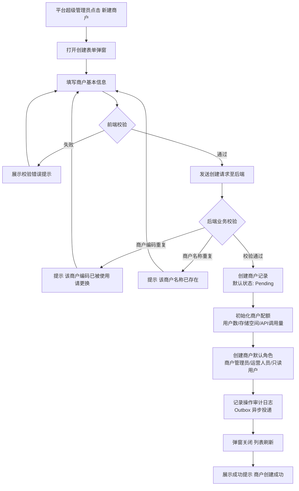

> [已确认] 商户创建后默认状态为 Pending（待审核），需平台超级管理员审核通过后变更为 Active —— 评审依据：多租户系统中商户入驻通常需要审核流程，确保商户资质合规

### 4.2 渠道创建与配置流程

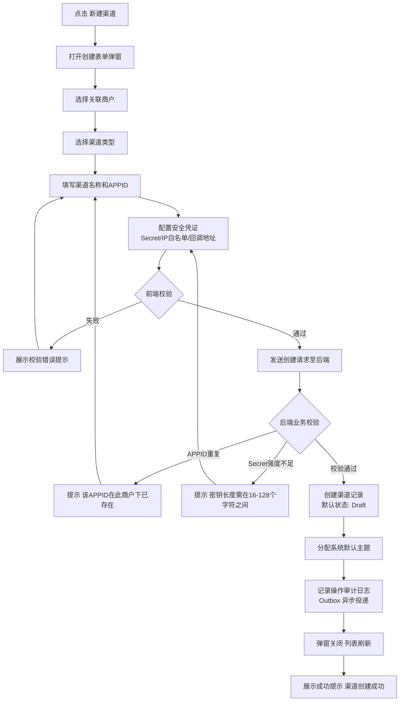

> [已确认] 渠道创建后默认状态为 Draft（草稿），需发布后才可正式使用 —— 评审依据：渠道涉及安全凭证配置，应允许用户在草稿状态下反复调整后再正式发布

### 4.3 主题配置与预览流程

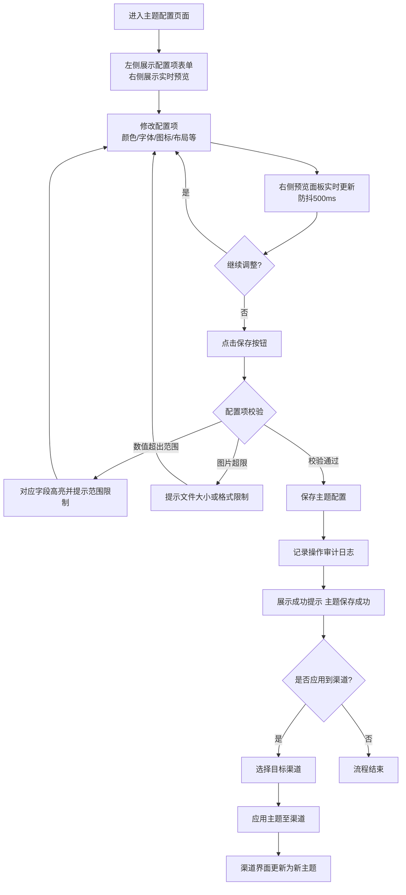

### 4.4 商户与渠道的关联关系管理流程

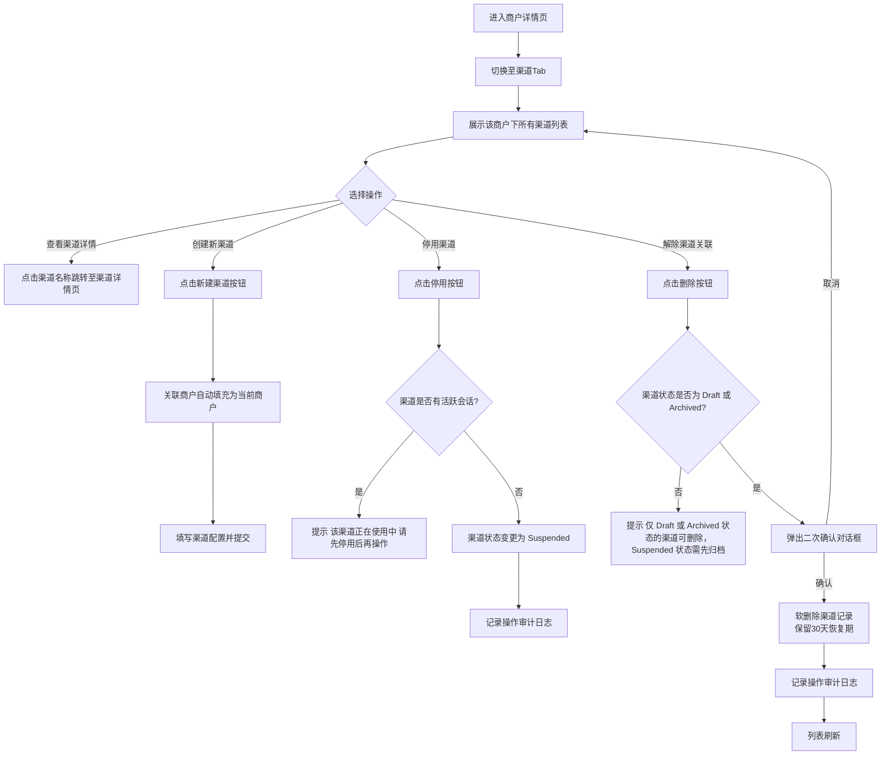

---

## 5. 状态模型

### 5.1 商户状态转换

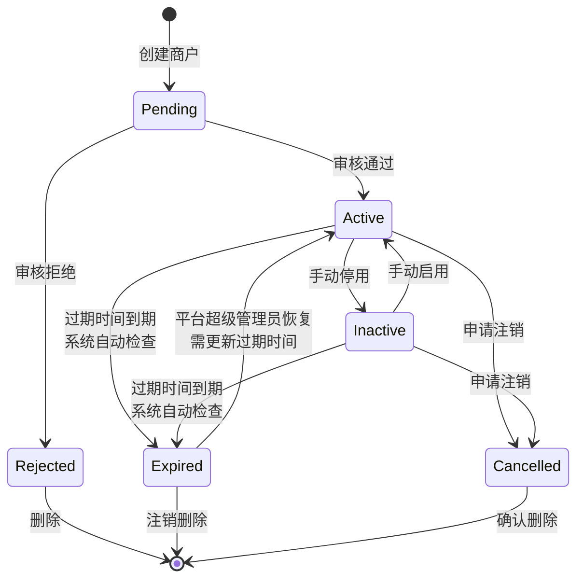

**商户状态定义**：

| 状态 | 英文标识 | 说明 |
|------|----------|------|
| 待审核 | Pending | 商户已创建，等待平台超级管理员审核 |
| 已拒绝 | Rejected | 商户审核未通过，可修改后重新提交 |
| 正常 | Active | 商户审核通过，可正常使用所有功能 |
| 停用 | Inactive | 商户被手动停用，商户下用户无法登录，渠道不可访问 |
| 已过期 | Expired | 商户服务到期，仅平台超级管理员可恢复为Active（需更新过期时间） |
| 已注销 | Cancelled | 商户申请注销，进入注销流程 |

> [已确认] 商户状态增加 Pending（待审核）和 Rejected（已拒绝）状态 —— 评审依据：多租户系统中商户入驻通常需要审核流程，与PRD-08中用户创建流程类似，需要审核机制确保合规

**商户状态转换规则**：

| 当前状态 | 目标状态 | 触发条件 | 事务边界 | 操作权限 |
|----------|----------|----------|----------|----------|
| Pending | Active | 平台超级管理员审核通过 | 状态更新 + 配额启用 + 角色激活 同事务 | `merchant:merchant:approve` |
| Pending | Rejected | 平台超级管理员审核拒绝 | 状态更新 + 拒绝原因记录 同事务 | `merchant:merchant:approve` |
| Rejected | Pending | 商户修改信息后重新提交 | 状态回退 + 字段更新 + 审计日志 同事务 | `merchant:merchant:update` |
| Active | Inactive | 手动停用 | 状态更新 + 渠道级联停用 同事务 | `merchant:merchant:update` |
| Inactive | Active | 手动启用 | 状态更新 + 渠道级联启用 同事务 | `merchant:merchant:update` |
| Active/Inactive | Expired | 系统每日凌晨自动检查过期时间 | 单条记录状态更新 独立事务 | 系统自动 |
| Expired | Active | 仅平台超级管理员手动恢复（需同步更新过期时间） | 状态更新 + 过期时间更新 + 渠道级联启用 + 审计日志 同事务 | `merchant:merchant:update`（仅平台超级管理员） |
| Active/Inactive | Cancelled | 商户申请注销 | 状态更新 + 资源冻结 + 审计日志 同事务 | `merchant:merchant:cancel` |
| Expired/Cancelled | （删除） | 软删除，保留30天恢复期 | 软删除标记 + 审计日志 同事务 | `merchant:merchant:delete` |

**商户状态变更跨模块事件通知机制**：

商户状态变更不仅影响商户模块自身，还需通过事件驱动机制通知关联模块执行级联操作，确保系统状态一致性。各状态变更事件及其通知范围如下：

| 状态变更事件 | 事件标识 | 通知模块 | 级联动作 |
|-------------|----------|---------|---------|
| 商户审核通过 | `merchant.approved` | 用户模块、渠道模块、Agent模块、知识库模块、记忆模块 | 激活商户管理员角色、启用渠道访问、恢复Agent调度、解冻知识库读写、解冻记忆读写 |
| 商户停用 | `merchant.deactivated` | 用户模块、渠道模块、Agent模块、知识库模块、记忆模块、编排模块、LLM模块、能力模块 | 禁止用户登录、渠道停止服务、Agent暂停执行、知识库冻结为只读、记忆冻结为只读、工作流停止调度、暂停LLM调用计费、标记能力为租户级不可用 |
| 商户重新激活 | `merchant.reactivated` | 用户模块、渠道模块、Agent模块、知识库模块、记忆模块、编排模块、LLM模块、能力模块 | 恢复用户登录、渠道恢复服务、Agent恢复执行、知识库恢复读写、记忆恢复读写、工作流恢复调度、恢复LLM调用计费、恢复能力可用性 |
| 商户过期 | `merchant.expired` | 用户模块、渠道模块、Agent模块、知识库模块、记忆模块、编排模块、LLM模块、能力模块 | 同停用级联动作 |
| 商户申请注销 | `merchant.cancelled` | 用户模块、渠道模块、Agent模块、知识库模块、记忆模块、编排模块、LLM模块、能力模块、审计模块 | 资源冻结、停止所有服务、暂停LLM调用、标记能力不可用、记录审计日志 |
| 商户确认删除 | `merchant.deleted` | 用户模块、渠道模块、Agent模块、知识库模块、记忆模块、编排模块、LLM模块、能力模块、审计模块、存储模块 | 级联数据清理（详见§13.1 BR-07-035），含LLM调用记录清理、能力关联清理 |

> 事件通知采用 Outbox Pattern + EventBridge/SNS/SQS 实现异步事件发布，确保事务边界内状态更新成功后再发布事件；消费端需保证幂等性，避免重复处理。事件发布失败时通过重试机制保障最终一致性。

**商户状态变更事件通知失败补偿机制**：

商户状态变更事件属于关键业务事件，若消费端处理失败可能导致系统状态不一致（如商户已停用但用户仍可登录），须执行以下补偿策略：

| 补偿策略 | 规则 | 说明 |
|----------|------|------|
| 事件消费确认 | 每个消费方须在处理完成后发送 ACK，超时阈值 5 分钟 | 与 PRD-00 §4.7.4 Outbox 消费超时对齐 |
| 消费失败重试 | 失败事件自动重试 3 次（间隔 1s/2s/4s），仍失败进入 DLQ | 与 PRD-00 §4.7.4 DLQ 机制对齐 |
| DLQ 告警 | 商户状态变更事件进入 DLQ 时立即触发 P0 告警 | 商户状态事件优先级高于普通事件 |
| 周期性对账 | 系统每 30 分钟执行一次商户状态对账：扫描所有商户当前状态，与各模块的实际生效状态比对，不一致时重新发送状态变更事件 | 防止事件丢失导致长期状态不一致 |
| 对账不一致修复 | 对账发现不一致时：(1) 记录审计日志（含商户ID、期望状态、实际状态、偏差模块）；(2) 重新发送状态变更事件；(3) 若重发后仍不一致，触发 P0 告警并通知运维手动介入 | 确保最终一致性 |

### 5.2 渠道状态转换

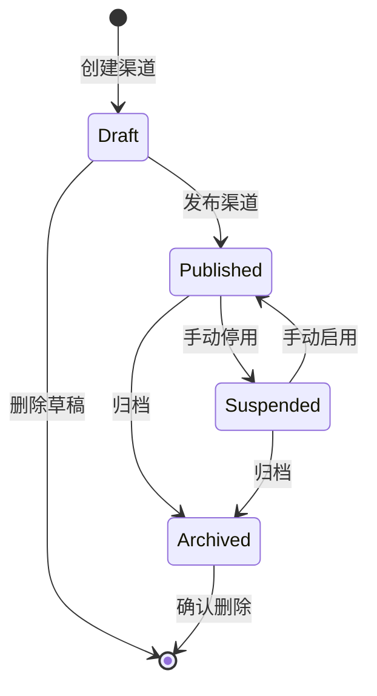

**渠道状态定义**：

| 状态 | 英文标识 | 说明 |
|------|----------|------|
| 草稿 | Draft | 渠道已创建但未发布，可自由编辑配置 |
| 已发布 | Published | 渠道已发布，可正常接收请求和提供服务 |
| 已停用 | Suspended | 渠道被手动停用，停止接收新请求，已有会话优雅终止 |
| 已归档 | Archived | 渠道已归档，不可恢复为已发布状态，仅保留历史数据 |

> [已确认] 渠道状态采用 Draft/Published/Suspended/Archived 四态模型 —— 评审依据：渠道涉及安全凭证和外部接入，需要草稿状态允许反复调试，归档状态用于保留历史数据

**渠道状态转换规则**：

| 当前状态 | 目标状态 | 触发条件 | 操作权限 |
|----------|----------|----------|----------|
| Draft | Published | 手动发布 | `merchant:channel:publish` |
| Draft | （删除） | 删除草稿，无需二次确认 | `merchant:channel:delete` |
| Published | Suspended | 手动停用 | `merchant:channel:update` |
| Suspended | Published | 手动启用 | `merchant:channel:update` |
| Published/Suspended | Archived | 归档渠道 | `merchant:channel:archive` |
| Archived | （删除） | 软删除，保留30天恢复期 | `merchant:channel:delete` |

---

## 6. 功能范围

### 6.1 功能结构树

```
商户管理模块
├── 商户管理（Merchant Management）
│   ├── 商户列表（Merchant List）
│   │   ├── 列表展示
│   │   ├── 搜索与筛选
│   │   ├── 新建商户
│   │   ├── 编辑商户
│   │   ├── 删除商户
│   │   └── 审核商户
│   └── 商户详情（Merchant Detail）
│       ├── 基本信息面板
│       ├── 渠道面板
│       ├── 用户面板
│       ├── 配额面板
│       └── 操作日志面板
├── 商户注册与认证（Merchant Registration & Authentication）
│   ├── 商户自注册（Self Registration）
│   │   ├── 公司信息填写
│   │   ├── 管理员信息填写
│   │   ├── 密码强度校验
│   │   └── 邮箱验证
│   └── 注册管理（Registration Management）
│       ├── 注册入口开关
│       └── 注册限流配置
├── 渠道管理（Channel Management）
│   ├── 渠道列表（Channel List）
│   │   ├── 列表展示
│   │   ├── 搜索与筛选
│   │   ├── 新建渠道
│   │   ├── 编辑渠道
│   │   ├── 删除渠道
│   │   └── 发布/停用渠道
│   └── 渠道详情（Channel Detail）
│       ├── 基本信息面板
│       ├── 安全配置面板
│       └── 操作日志面板
└── 主题管理（Theme Management）
    ├── 主题列表（Theme List）
    │   ├── 列表展示
    │   ├── 新建主题
    │   ├── 编辑主题
    │   └── 删除主题
    └── 配置主题（Theme Configuration）
        ├── 预览界面
        ├── 颜色配置（Colors）
        ├── 图标配置（Icons）
        ├── 文本配置（Texts）
        ├── 字体配置（Fonts）
        ├── 尺寸配置（Sizes）
        ├── 布局配置（Layout）
        └── 开关配置（Switches）
```

### 6.2 MoSCoW 优先级表

| 功能 | 优先级 | 说明 |
|------|--------|------|
| 商户列表展示与搜索 | **Must** | 核心基础功能，必须首期交付 |
| 创建/更新商户 | **Must** | 商户入驻与信息维护的核心能力 |
| 商户审核 | **Must** | 多租户入驻审核，确保商户资质合规 |
| 商户详情查看 | **Must** | 运营人员日常查看商户全貌的入口 |
| 渠道列表展示与搜索 | **Must** | 渠道运维的核心视图 |
| 创建/更新渠道 | **Must** | 渠道接入与配置的核心能力 |
| 渠道详情查看 | **Must** | 查看渠道完整配置与状态的入口 |
| 渠道发布/停用 | **Must** | 渠道生命周期管理 |
| 删除商户/渠道 | **Should** | 需配合软删除与数据保护机制 |
| 主题列表管理 | **Should** | 主题模板的集中管理 |
| 配置主题（预览+配置项） | **Should** | 渠道品牌定制能力 |
| 操作日志查看 | **Should** | 合规审计需求 |
| 商户配额管理 | **Should** | 资源使用管控 |
| 商户自注册 | **Must** | 商户入驻的核心流程，与平台管理员创建商户互为补充 |
| 邮箱验证 | **Must** | 确保注册邮箱真实有效 |
| 密码强度校验 | **Must** | 注册时保障密码安全 |
| 注册入口开关 | **Should** | 平台管理员可控制注册入口开放/关闭 |
| 注册限流 | **Should** | 防止恶意注册占用系统资源 |
| 批量导入/导出商户 | **Could** | 大量商户入驻场景 |
| 商户数据统计面板 | **Could** | 运营决策支持 |
| 主题版本管理 | **Won't** | 首期不纳入，后续迭代 |

---

## 7. 数据模型

### 7.1 商户数据模型（Merchant）

| 字段名 | 字段标识 | 类型 | 必填 | 唯一 | 默认值 | 说明 |
|--------|----------|------|------|------|--------|------|
| 商户ID | id | UUID | 是 | 是 | 自动生成 | 主键，系统自动生成 |
| tenant_id | tenant_id | UUID | 是 | 否 | 由 partition_key 派生 | 多租户隔离字段，GENERATED ALWAYS AS (partition_key::uuid) STORED，为框架层多租户中间件要求的统一字段名。框架层通过 tenant_id 自动注入租户隔离，业务层通过 id 进行关联查询。 |
| 商户组ID | merchant_group_id | UUID | 否 | 否 | null | 所属商户组ID，外键→MerchantGroup.id，用于跨租户白名单和集团企业多子商户场景 |
| 商户名称 | name | String(50) | 是 | 是 | - | 商户显示名称，租户内唯一（与 DDL §7.7.1 `UNIQUE (partition_key, name)` 一致） |
| 商户编码 | code | String(20) | 是 | 是 | - | 系统标识编码，仅允许字母/数字/下划线，创建后不可修改 |
| 联系人 | contact | String(20) | 是 | 否 | - | 主要联系人姓名 |
| 联系电话 | phoneNumber | String(20) | 是 | 否 | - | 联系电话 |
| 商务邮箱 | businessEmail | String(100) | 是 | 否 | - | 商务联系邮箱 |
| 地址 | address | String(200) | 否 | 否 | - | 商户办公地址 |
| 商户Logo | logoUrl | String(500) | 否 | 否 | - | Logo图片URL，支持PNG/JPG/SVG，最大5MB |
| 过期时间 | expirationTime | DateTime | 否 | 否 | null | 服务到期时间，null表示永不过期 |
| 描述 | description | String(500) | 否 | 否 | - | 商户业务描述 |
| 状态 | status | Enum | 是 | 否 | Pending | Pending/Rejected/Active/Inactive/Expired/Cancelled |
| 所属行业 | industry | String(50) | 否 | 否 | - | [待产品确认] 商户所属行业分类 —— 评审依据：多租户系统通常需要按行业分类管理商户 |
| 创建人 | createdBy | UUID | 是 | 否 | - | 创建该商户的用户ID |
| 创建时间 | createdAt | DateTime | 是 | 否 | 自动生成 | 记录创建时间 |
| 更新时间 | updatedAt | DateTime | 是 | 否 | 自动生成 | 记录最后更新时间 |
| 删除标记 | isDeleted | Boolean | 是 | 否 | false | 软删除标记 |
| 删除时间 | deletedAt | DateTime | 否 | 否 | null | 软删除时间 |

### 7.2 渠道数据模型（Channel）

| 字段名 | 字段标识 | 类型 | 必填 | 唯一 | 默认值 | 说明 |
|--------|----------|------|------|------|--------|------|
| 渠道ID | id | UUID | 是 | 是 | 自动生成 | 主键 |
| 渠道名称 | name | String(50) | 是 | 否 | - | 渠道显示名称 |
| 关联商户ID | merchantId | UUID | 是 | 否 | - | 所属商户ID，外键关联Merchant.id，创建后不可修改 |
| 渠道类型 | type | Enum | 是 | 否 | - | Web/Mobile/API/WeChat/MiniProgram/DingTalk |
| APPID | appId | String(64) | 是 | 是* | - | 渠道应用标识，同一商户下唯一 |
| 密钥 | secret | String(128) | 是 | 否 | - | AES-256加密存储，前端展示默认掩码 |
| 回调地址 | callbackUrl | String(500) | 否 | 否 | - | 事件回调通知地址，需HTTPS |
| IP白名单 | ipWhitelist | JSON | 否 | 否 | [] | IP/CIDR列表，最多50条 |
| 描述 | description | String(500) | 否 | 否 | - | 渠道用途描述 |
| 状态 | status | Enum | 是 | 否 | Draft | Draft/Published/Suspended/Archived |
| 关联主题ID | themeId | UUID | 否 | 否 | null | 关联的主题ID，null时使用系统默认主题 |
| 创建时间 | createdAt | DateTime | 是 | 否 | 自动生成 | 记录创建时间 |
| 更新时间 | updatedAt | DateTime | 是 | 否 | 自动生成 | 记录最后更新时间 |
| 删除标记 | isDeleted | Boolean | 是 | 否 | false | 软删除标记 |
| 删除时间 | deletedAt | DateTime | 否 | 否 | null | 软删除时间 |

> *APPID唯一性范围：同一merchantId下唯一

### 7.3 主题数据模型（Theme）

| 字段名 | 字段标识 | 类型 | 必填 | 唯一 | 默认值 | 说明 |
|--------|----------|------|------|------|--------|------|
| 主题ID | id | UUID | 是 | 是 | 自动生成 | 主键 |
| 主题名称 | name | String(50) | 是 | 否 | - | 主题显示名称 |
| 描述 | description | String(500) | 否 | 否 | - | 主题用途描述 |
| 状态 | status | Enum | 是 | 否 | Active | Active/Inactive |
| 是否系统内置 | isSystem | Boolean | 是 | 否 | false | 系统内置主题不可删除 |
| 所属商户ID | merchantId | UUID | 否 | 否 | null | null表示全局主题，非null表示商户级主题 |
| 颜色配置 | colors | JSON | 是 | 否 | 系统默认 | 主色调/辅助色/背景色/文字颜色/状态色 |
| 图标配置 | icons | JSON | 是 | 否 | 系统默认 | Logo/Favicon/默认头像URL |
| 文本配置 | texts | JSON | 是 | 否 | 系统默认 | 系统名称/欢迎语/版权信息/服务条款链接 |
| 字体配置 | fonts | JSON | 是 | 否 | 系统默认 | 主字体/字体大小基准 |
| 尺寸配置 | sizes | JSON | 是 | 否 | 系统默认 | 侧边栏宽度/内容区域最大宽度/圆角大小 |
| 布局配置 | layout | JSON | 是 | 否 | 系统默认 | 导航位置/内容区域边距/组件间距 |
| 开关配置 | switches | JSON | 是 | 否 | 系统默认 | 深色模式/紧凑模式/动画效果 |
| 创建时间 | createdAt | DateTime | 是 | 否 | 自动生成 | 记录创建时间 |
| 更新时间 | updatedAt | DateTime | 是 | 否 | 自动生成 | 记录最后更新时间 |

### 7.4 商户配额数据模型（MerchantQuota）

| 字段名 | 字段标识 | 类型 | 必填 | 默认值 | 说明 |
|--------|----------|------|------|--------|------|
| 配额ID | id | UUID | 是 | 自动生成 | 主键 |
| 商户ID | merchantId | UUID | 是 | - | 关联商户ID，外键 |
| 最大用户数 | maxUsers | Integer | 是 | 100 | [已确认] 商户可创建的最大用户数 —— 评审依据：多租户SaaS系统通常按用户数计费和限制 |
| 当前用户数 | currentUsers | Integer | 是 | 0 | 当前已创建的用户数 |
| 最大渠道数 | maxChannels | Integer | 是 | 10 | [已确认] 商户可创建的最大渠道数 —— 评审依据：渠道数量与商户服务等级相关 |
| 当前渠道数 | currentChannels | Integer | 是 | 0 | 当前已创建的渠道数 |
| 存储空间上限(MB) | maxStorage | BigInteger | 是 | 10240 | [已确认] 商户可使用的最大存储空间 —— 评审依据：知识库和记忆管理需要存储空间配额 |
| 当前存储用量(MB) | currentStorage | BigInteger | 是 | 0 | 当前已使用的存储空间 |
| API日调用量上限 | maxApiCallsPerDay | Integer | 是 | 10000 | [已确认] 商户每日API调用次数上限 —— 评审依据：防止个别商户过度占用系统资源 |
| 当前API日调用量 | currentApiCallsPerDay | Integer | 是 | 0 | 当日已使用的API调用次数。更新机制：Redis原子计数器实时更新 + 每日0点UTC重置api_calls计数 |
| 智能体数量上限 | maxAgents | Integer | 是 | 50 | [已确认] 商户可创建的最大智能体数 —— 评审依据：智能体是系统核心资源，需要配额管控 |
| 当前智能体数 | currentAgents | Integer | 是 | 0 | 当前已创建的智能体数 |
| 创建时间 | createdAt | DateTime | 是 | 自动生成 | 记录创建时间 |
| 更新时间 | updatedAt | DateTime | 是 | 自动生成 | 记录最后更新时间 |

### 7.5 商户-用户关联表（MerchantUser）

> 用户与商户为多对多关系，通过 `merchant_user` 中间表维护，同一用户可在不同商户下拥有不同角色。命名空间与表名与 PRD-12 §A3 权限管理模块 `tenant_perm_user_merchant` 中间表保持一致。

> **关联限制**: 单个用户最多关联 `maxMerchantPerUser`（默认 10）个商户，超出时返回业务错误码 `200206`。

| 字段名 | 字段标识 | 类型 | 必填 | 唯一 | 默认值 | 说明 |
|--------|----------|------|------|------|--------|------|
| 租户ID | tenant_id | UUID | 是 | 否 | 当前租户ID | 多租户隔离字段，框架层自动注入 |
| 商户ID | merchant_id | UUID | 是 | 否 | - | 所属商户ID，外键→Merchant.id |
| 用户ID | user_id | UUID | 是 | 否 | - | 所属用户ID，外键→User.id |
| 商户内角色 | role | String(32) | 是 | 否 | Member | 该用户在此商户下的角色（MerchantAdmin / MerchantMember / MerchantAuditor 等） |
| 加入时间 | joined_at | DateTime | 是 | 否 | 自动生成 | 用户加入该商户的时间 |
| 是否激活 | is_active | Boolean | 是 | 否 | true | 该关联是否有效，false 表示已退出该商户 |
| 退出时间 | left_at | DateTime | 否 | 否 | null | 用户退出该商户的时间 |
| 创建人 | createdBy | UUID | 是 | 否 | - | 创建该关联的用户ID |
| 创建时间 | createdAt | DateTime | 是 | 否 | 自动生成 | 记录创建时间 |
| 更新时间 | updatedAt | DateTime | 是 | 否 | 自动生成 | 记录最后更新时间 |

**复合主键**：`（partition_key, id）`
**唯一约束**：`（partition_key, merchant_id, user_id）` 唯一（与 PRD-12 §A3 中间表一致）

### 7.6 审计日志数据模型（AuditLog）

| 字段名 | 字段标识 | 类型 | 必填 | 说明 |
|--------|----------|------|------|------|
| 日志ID | id | UUID | 是 | 主键 |
| 商户ID | merchantId | UUID | 是 | 关联商户ID |
| 渠道ID | channelId | UUID | 否 | 关联渠道ID（渠道操作时记录） |
| 操作人ID | operatorId | UUID | 是 | 执行操作的用户ID |
| 操作人名称 | operatorName | String(50) | 是 | 执行操作的用户名称 |
| 操作类型 | operationType | Enum | 是 | Create/Update/Delete/StatusChange/Approve/Reject/Publish/Suspend/Archive |
| 操作对象类型 | targetType | Enum | 是 | Merchant/Channel/Theme/Quota |
| 操作对象ID | targetId | UUID | 是 | 操作对象的ID |
| 操作内容 | content | String(1000) | 是 | 操作的详细描述 |
| 变更前数据 | beforeData | JSON | 否 | 变更前的数据快照（Update操作时记录） |
| 变更后数据 | afterData | JSON | 否 | 变更后的数据快照（Update操作时记录） |
| IP地址 | ipAddress | String(45) | 是 | 操作来源IP，支持IPv4和IPv6 |
| User-Agent | userAgent | String(500) | 否 | 操作来源的浏览器/客户端信息 |
| 操作时间 | operatedAt | DateTime | 是 | 操作发生时间 |

### 7.7 DDL 定义（PostgreSQL）

> **P1-021 收束说明（v5）**：`tenant_id` 派生列保留决策与 [PRD-00 §7.2.1 框架兼容列](file:///Users/Garabateador/Workspace/banyan/PRD/PRD-00-平台总览与全局规范.md) 规范完全一致——`tenant_id UUID NOT NULL GENERATED ALWAYS AS (partition_key::uuid) STORED` 是 SilvaEngine 多租户中间件要求的统一字段名,由 `partition_key` 派生,**禁止**手动赋值;§3.7 RLS 模板仅用 `partition_key` 作为过滤列,但中间件层会同时使用 `tenant_id` 进行调用方权限校验,二者并存且无冲突。本节 `tenant_merchant_*` 所有表统一保留 `tenant_id` 派生列,不再二次确认。

> **触发器声明**: 本模块所有 `tenant_merchant_*` 租户级表均配置 `set_partition_key_from_session()` BEFORE INSERT 触发器，自动从会话变量 `app.current_tenant_id` 注入 `partition_key`，遵循 PRD-00 §7.2 强制规范。触发器函数定义参见 PRD-00 §7.2.2 或 PRD-11 §8.1。

#### 7.7.1 商户主表

```sql
CREATE TABLE tenant_merchant_merchants (
  partition_key       VARCHAR(64)   NOT NULL,               -- Composite primary key first part, RLS isolation key
  id                  UUID          NOT NULL DEFAULT gen_random_uuid(),
  tenant_id           UUID          NOT NULL GENERATED ALWAYS AS (partition_key::uuid) STORED,  -- Derived from partition_key, required by multi-tenant middleware
  merchant_group_id   UUID          NULL,                   -- FK to MerchantGroup.id, for cross-tenant whitelist
  name                VARCHAR(50)   NOT NULL,               -- Merchant display name, unique within tenant (partition_key, name)
  code                VARCHAR(20)   NOT NULL,               -- System identifier code, immutable after creation
  contact             VARCHAR(20)   NOT NULL,               -- Primary contact name
  phone_number        VARCHAR(20)   NOT NULL,               -- Contact phone number
  business_email      VARCHAR(100)  NOT NULL,               -- Business contact email
  address             VARCHAR(200)  NULL,                   -- Office address
  logo_url            VARCHAR(500)  NULL,                   -- Logo image URL (PNG/JPG/SVG, max 5MB)
  expiration_time     TIMESTAMPTZ   NULL,                   -- Service expiration time, NULL = never expires
  description         VARCHAR(500)  NULL,                   -- Business description
  status              VARCHAR(32)   NOT NULL DEFAULT 'Pending' CHECK (status IN ('Pending', 'Rejected', 'Active', 'Inactive', 'Expired', 'Cancelled')),
  industry            VARCHAR(50)   NULL,                   -- Industry classification
  created_by          UUID          NOT NULL,               -- User ID who created this merchant
  created_at          TIMESTAMPTZ   NOT NULL DEFAULT NOW(),
  updated_at          TIMESTAMPTZ   NOT NULL DEFAULT NOW(),
  deleted_at          TIMESTAMPTZ   NULL,                   -- Soft delete timestamp
  is_deleted          BOOLEAN       NOT NULL GENERATED ALWAYS AS (deleted_at IS NOT NULL) STORED,  -- Derived from deleted_at, kept for backward compatibility
  PRIMARY KEY (partition_key, id),
  UNIQUE (partition_key, code)
);

-- Indexes
CREATE INDEX idx_tenant_merchant_merchants_name ON tenant_merchant_merchants(partition_key, name);
CREATE UNIQUE INDEX uq_tenant_merchant_merchants_name ON tenant_merchant_merchants(partition_key, name);
CREATE INDEX idx_tenant_merchant_merchants_status ON tenant_merchant_merchants(partition_key, status);
CREATE INDEX idx_tenant_merchant_merchants_group ON tenant_merchant_merchants(partition_key, merchant_group_id);
CREATE INDEX idx_tenant_merchant_merchants_created ON tenant_merchant_merchants(partition_key, created_at DESC);
```

#### 7.7.2 渠道表

```sql
CREATE TABLE tenant_merchant_channels (
  partition_key       VARCHAR(64)   NOT NULL,               -- Composite primary key first part, RLS isolation key
  tenant_id           UUID          NOT NULL GENERATED ALWAYS AS (partition_key::uuid) STORED,  -- Derived from partition_key, required by multi-tenant middleware
  id                  UUID          NOT NULL DEFAULT gen_random_uuid(),
  name                VARCHAR(50)   NOT NULL,               -- Channel display name
  merchant_id         UUID          NOT NULL,               -- FK to Merchant.id, immutable after creation
  type                VARCHAR(32)   NOT NULL CHECK (type IN ('Web', 'Mobile', 'API', 'WeChat', 'MiniProgram', 'DingTalk')),
  app_id              VARCHAR(64)   NOT NULL,               -- Channel application identifier, unique per merchant
  secret              VARCHAR(128)  NOT NULL,               -- AES-256 encrypted, masked on frontend display
  callback_url        VARCHAR(500)  NULL,                   -- Event callback URL, HTTPS required
  ip_whitelist        JSONB         NOT NULL DEFAULT '[]',  -- IP/CIDR list, max 50 entries
  description         VARCHAR(500)  NULL,                   -- Channel usage description
  status              VARCHAR(32)   NOT NULL DEFAULT 'Draft' CHECK (status IN ('Draft', 'Published', 'Suspended', 'Archived')),
  theme_id            UUID          NULL,                   -- FK to Theme.id, NULL = system default theme
  created_at          TIMESTAMPTZ   NOT NULL DEFAULT NOW(),
  updated_at          TIMESTAMPTZ   NOT NULL DEFAULT NOW(),
  deleted_at          TIMESTAMPTZ   NULL,                   -- Soft delete timestamp
  is_deleted          BOOLEAN       NOT NULL GENERATED ALWAYS AS (deleted_at IS NOT NULL) STORED,  -- Derived from deleted_at, kept for backward compatibility
  PRIMARY KEY (partition_key, id),
  UNIQUE (partition_key, merchant_id, app_id)
);

-- Indexes
CREATE INDEX idx_tenant_merchant_channels_merchant ON tenant_merchant_channels(partition_key, merchant_id, status);
CREATE INDEX idx_tenant_merchant_channels_type ON tenant_merchant_channels(partition_key, type, status);
CREATE INDEX idx_tenant_merchant_channels_status ON tenant_merchant_channels(partition_key, status);
CREATE INDEX idx_tenant_merchant_channels_theme ON tenant_merchant_channels(partition_key, theme_id);
```

#### 7.7.3 主题表

```sql
CREATE TABLE tenant_merchant_themes (
  partition_key       VARCHAR(64)   NOT NULL,               -- Composite primary key first part, RLS isolation key
  tenant_id           UUID          NOT NULL GENERATED ALWAYS AS (partition_key::uuid) STORED,  -- Derived from partition_key, required by multi-tenant middleware
  id                  UUID          NOT NULL DEFAULT gen_random_uuid(),
  name                VARCHAR(50)   NOT NULL,               -- Theme display name
  description         VARCHAR(500)  NULL,                   -- Theme usage description
  status              VARCHAR(32)   NOT NULL DEFAULT 'Active' CHECK (status IN ('Active', 'Inactive')),
  is_system           BOOLEAN       NOT NULL DEFAULT FALSE,  -- System built-in theme cannot be deleted
  merchant_id         UUID          NULL,                   -- NULL = global theme, non-NULL = merchant-level theme
  colors              JSONB         NOT NULL DEFAULT '{}',  -- Primary/secondary/background/text/status colors
  icons               JSONB         NOT NULL DEFAULT '{}',  -- Logo/Favicon/default avatar URLs
  texts               JSONB         NOT NULL DEFAULT '{}',  -- System name/welcome/copyright/terms links
  fonts               JSONB         NOT NULL DEFAULT '{}',  -- Primary font/font size base
  sizes               JSONB         NOT NULL DEFAULT '{}',  -- Sidebar width/content max width/border radius
  layout              JSONB         NOT NULL DEFAULT '{}',  -- Navigation position/content margin/component gap
  switches            JSONB         NOT NULL DEFAULT '{}',  -- Dark mode/compact mode/animation effects
  created_at          TIMESTAMPTZ   NOT NULL DEFAULT NOW(),
  updated_at          TIMESTAMPTZ   NOT NULL DEFAULT NOW(),
  PRIMARY KEY (partition_key, id)
);

-- Indexes
CREATE INDEX idx_tenant_merchant_themes_merchant ON tenant_merchant_themes(partition_key, merchant_id);
CREATE INDEX idx_tenant_merchant_themes_status ON tenant_merchant_themes(partition_key, status);
CREATE INDEX idx_tenant_merchant_themes_system ON tenant_merchant_themes(partition_key, is_system);
```

#### 7.7.4 商户配额表

```sql
CREATE TABLE tenant_merchant_quotas (
  partition_key           VARCHAR(64)   NOT NULL,           -- Composite primary key first part, RLS isolation key
  tenant_id               UUID          NOT NULL GENERATED ALWAYS AS (partition_key::uuid) STORED,  -- Derived from partition_key, required by multi-tenant middleware
  id                      UUID          NOT NULL DEFAULT gen_random_uuid(),
  merchant_id             UUID          NOT NULL,           -- FK to Merchant.id
  max_users               INTEGER       NOT NULL DEFAULT 100,
  current_users           INTEGER       NOT NULL DEFAULT 0,
  max_channels            INTEGER       NOT NULL DEFAULT 10,
  current_channels        INTEGER       NOT NULL DEFAULT 0,
  max_storage             BIGINT        NOT NULL DEFAULT 10240,  -- Storage limit in MB
  current_storage         BIGINT        NOT NULL DEFAULT 0,      -- Current storage usage in MB
  max_api_calls_per_day   INTEGER       NOT NULL DEFAULT 10000,
  current_api_calls_per_day INTEGER     NOT NULL DEFAULT 0,   -- Current daily API calls, updated via Redis atomic counter + reset at 00:00 UTC daily
  max_agents              INTEGER       NOT NULL DEFAULT 50,
  current_agents          INTEGER       NOT NULL DEFAULT 0,
  created_at              TIMESTAMPTZ   NOT NULL DEFAULT NOW(),
  updated_at              TIMESTAMPTZ   NOT NULL DEFAULT NOW(),
  PRIMARY KEY (partition_key, id),
  UNIQUE (partition_key, merchant_id)
);

-- Indexes
CREATE INDEX idx_tenant_merchant_quotas_merchant ON tenant_merchant_quotas(partition_key, merchant_id);
```

#### 7.7.5 审计日志表

> 审计日志表使用 `audit_` 前缀，包含 `partition_key` 并启用 RLS 策略以保障租户隔离。主键为复合主键 `(partition_key, id)`。此表启用触发器禁止 UPDATE/DELETE 操作，确保审计日志不可篡改（WORM）。

```sql
CREATE TABLE audit_merchant_logs (
  partition_key        VARCHAR(64)   NOT NULL,               -- Tenant ID for RLS isolation
  tenant_id            UUID          NOT NULL GENERATED ALWAYS AS (partition_key::uuid) STORED,  -- Derived from partition_key, required by multi-tenant middleware
  id                   UUID          NOT NULL DEFAULT gen_random_uuid(),
  merchant_id          UUID          NOT NULL,               -- FK to Merchant.id
  channel_id           UUID          NULL,                   -- FK to Channel.id (for channel operations)
  operator_id          UUID          NOT NULL,               -- User ID who performed the operation
  operator_name        VARCHAR(50)   NOT NULL,               -- User name who performed the operation
  operation_type       VARCHAR(32)   NOT NULL CHECK (operation_type IN ('Create', 'Update', 'Delete', 'StatusChange', 'Approve', 'Reject', 'Publish', 'Suspend', 'Archive')),
  target_type          VARCHAR(32)   NOT NULL CHECK (target_type IN ('Merchant', 'Channel', 'Theme', 'Quota')),
  target_id            UUID          NOT NULL,               -- ID of the operated object
  content              VARCHAR(1000) NOT NULL,               -- Operation description
  before_data          JSONB         NULL,                   -- Data snapshot before change (for Update operations)
  after_data           JSONB         NULL,                   -- Data snapshot after change (for Update operations)
  ip_address           VARCHAR(45)   NOT NULL,               -- Source IP, supports IPv4 and IPv6
  user_agent           VARCHAR(500)  NULL,                   -- Browser/client information
  operated_at          TIMESTAMPTZ   NOT NULL DEFAULT NOW(),
  PRIMARY KEY (partition_key, id)
);

-- RLS Policies
ALTER TABLE audit_merchant_logs ENABLE ROW LEVEL SECURITY;
CREATE POLICY audit_merchant_logs_tenant_isolation ON audit_merchant_logs
  USING (partition_key = current_setting('app.current_tenant_id')::VARCHAR);

-- Indexes
CREATE INDEX idx_audit_merchant_logs_merchant ON audit_merchant_logs(partition_key, merchant_id, operated_at DESC);
CREATE INDEX idx_audit_merchant_logs_operator ON audit_merchant_logs(partition_key, operator_id, operated_at DESC);
CREATE INDEX idx_audit_merchant_logs_target ON audit_merchant_logs(partition_key, target_type, target_id, operated_at DESC);
CREATE INDEX idx_audit_merchant_logs_type ON audit_merchant_logs(partition_key, operation_type, operated_at DESC);
```

#### 7.7.6 Outbox 事件表

> 复用 PRD-00 §4.7.2 定义的 `outbox_events` 共享表结构，商户管理模块的事件通过该表异步投递至下游消费者。

```sql
-- Reuse PRD-00 shared outbox_events table structure
-- CREATE TABLE outbox_events (...) is defined in PRD-00 §4.7.2
-- Merchant module event types:
--   merchant.created    - Merchant created
--   merchant.updated    - Merchant info updated
--   merchant.deleted    - Merchant soft-deleted
--   merchant.status_changed - Merchant status changed
--   channel.created     - Channel created
--   channel.updated     - Channel info updated
--   channel.deleted     - Channel soft-deleted
--   channel.status_changed - Channel status changed
--   theme.created       - Theme created
--   theme.updated       - Theme config updated
--   quota.updated       - Quota configuration updated
```

#### 7.7.7 PostgreSQL RLS 策略

> RLS（Row Level Security）作为数据库级强制隔离，与应用层 SQLAlchemy 事件监听器形成防御纵深。两层并存时：**RLS** 负责数据库级强制（应用代码无法绕过），**SQLAlchemy 事件监听器** 负责应用级过滤（减少数据库扫描行数，提升查询性能）。

```sql
-- ============================================================
-- 1. Enable RLS on all merchant module tenant-level tables
-- ============================================================
ALTER TABLE tenant_merchant_merchants ENABLE ROW LEVEL SECURITY;
ALTER TABLE tenant_merchant_channels ENABLE ROW LEVEL SECURITY;
ALTER TABLE tenant_merchant_themes ENABLE ROW LEVEL SECURITY;
ALTER TABLE tenant_merchant_quotas ENABLE ROW LEVEL SECURITY;

-- ============================================================
-- 2. Tenant isolation policies (only own-tenant data visible)
-- ============================================================
CREATE POLICY merchant_tenant_isolation ON tenant_merchant_merchants
    FOR ALL
    USING (partition_key = current_setting('app.current_tenant_id', TRUE));

CREATE POLICY channel_tenant_isolation ON tenant_merchant_channels
    FOR ALL
    USING (partition_key = current_setting('app.current_tenant_id', TRUE));

CREATE POLICY theme_tenant_isolation ON tenant_merchant_themes
    FOR ALL
    USING (partition_key = current_setting('app.current_tenant_id', TRUE));

CREATE POLICY quota_tenant_isolation ON tenant_merchant_quotas
    FOR ALL
    USING (partition_key = current_setting('app.current_tenant_id', TRUE));
```

#### 7.7.8 触发器声明

```sql
-- ============================================================
-- BEFORE INSERT triggers: auto-inject partition_key from session
-- ============================================================
CREATE TRIGGER trg_tenant_merchant_merchants_partition_key
  BEFORE INSERT ON tenant_merchant_merchants
  FOR EACH ROW EXECUTE FUNCTION set_partition_key_from_session();

CREATE TRIGGER trg_tenant_merchant_channels_partition_key
  BEFORE INSERT ON tenant_merchant_channels
  FOR EACH ROW EXECUTE FUNCTION set_partition_key_from_session();

CREATE TRIGGER trg_tenant_merchant_themes_partition_key
  BEFORE INSERT ON tenant_merchant_themes
  FOR EACH ROW EXECUTE FUNCTION set_partition_key_from_session();

CREATE TRIGGER trg_tenant_merchant_quotas_partition_key
  BEFORE INSERT ON tenant_merchant_quotas
  FOR EACH ROW EXECUTE FUNCTION set_partition_key_from_session();
```

> **注**: `audit_merchant_logs`（审计 WORM，主键为 `(partition_key, id)`，已启用 RLS 策略）和 `outbox_events`（共享事件表）不含 `partition_key` 自动注入触发器——前者通过 RLS 策略保障租户隔离，后者为共享事件表不启用 RLS。

---

## 8. 功能详情

### 8.1 商户列表

#### 8.1.1 用户故事

> **US-ML-01**：作为平台超级管理员，我希望能够在一个列表页面中查看所有商户的关键信息，并支持搜索、筛选和批量操作，以便高效地管理平台上的商户资源。
>
> **验收标准**：列表正确展示所有字段 | 搜索支持模糊匹配 | 状态筛选正确过滤 | 分页每页20条 | 删除存在活跃渠道的商户时拒绝 | 列表加载≤2秒（1000条以内）

#### 8.1.2 前置条件

- 用户已登录系统，且拥有 `merchant:merchant:list` 权限
- 系统中至少存在一个商户记录（空状态需有引导提示）

#### 8.1.3 后置条件

- 列表数据正确展示，支持分页加载
- 搜索与筛选结果实时更新

#### 8.1.4 列表字段定义

| 字段名 | 字段标识 | 类型 | 说明 | 排序 |
|--------|----------|------|------|------|
| 商户名称 | Merchant | String | 商户的显示名称，点击可跳转至商户详情 | 支持 |
| 商户编码 | Merchant Code | String | 系统标识编码 | 不支持 |
| 联系人 | Contact | String | 商户主要联系人姓名 | 支持 |
| 活跃渠道数 | Active Channels | Integer | 该商户下状态为"Published"的渠道数量 | 支持 |
| 用户数 | Number of Users | Integer | 该商户下的用户总数 | 支持 |
| 创建时间 | Created At | DateTime | 商户创建时间，格式 YYYY-MM-DD HH:mm:ss | 支持 |
| 状态 | Status | Enum | Pending/Active/Inactive/Expired/Cancelled，以标签样式展示 | 支持 |

#### 8.1.5 操作按钮

| 操作 | 权限要求 | 说明 |
|------|----------|------|
| 新建商户 | `merchant:merchant:create` | 页面右上角主操作按钮 |
| 审核 | `merchant:merchant:approve` | 仅Pending/Rejected状态商户显示 |
| 编辑 | `merchant:merchant:update` | 每行操作列，打开编辑弹窗 |
| 删除 | `merchant:merchant:delete` | 每行操作列，需二次确认 |

#### 8.1.6 主流程

1. 用户进入商户管理页面，系统默认加载第一页商户列表数据
2. 列表按创建时间倒序排列，每页展示20条记录
3. 用户可通过搜索框输入商户名称或联系人进行模糊搜索
4. 用户可通过状态下拉框筛选特定状态的商户
5. 用户点击列表中的商户名称，跳转至商户详情页
6. 用户点击"审核"按钮，打开审核弹窗（仅Pending/Rejected状态商户）
7. 用户点击"编辑"按钮，弹出商户编辑弹窗
8. 用户点击"删除"按钮，弹出二次确认对话框

#### 8.1.7 分支流程

- **分支A - 空状态**：系统中无商户记录时，展示空状态插图与"立即创建第一个商户"引导按钮
- **分支B - 搜索无结果**：搜索无匹配结果时，展示"未找到匹配的商户"提示，并提供"清除筛选"按钮
- **分支C - 分页**：数据超过20条时，底部展示分页器，支持跳转至指定页码

#### 8.1.8 异常流程

- **异常1 - 网络异常**：列表加载失败时，展示错误提示"加载失败，请稍后重试"，提供"重新加载"按钮
- **异常2 - 权限不足**：用户无查看权限时，展示403无权限提示页
- **异常3 - 删除失败**：商户下存在活跃渠道时，删除操作被拒绝，提示"该商户下存在活跃渠道，请先停用或删除相关渠道"

#### 8.1.9 交互说明

- 搜索框支持防抖，输入停止后300ms触发搜索请求
- 列表支持列宽拖拽调整，用户偏好保存至本地存储
- 删除确认弹窗需展示商户名称，防止误操作
- 状态标签颜色规范：Pending=橙色、Active=绿色、Inactive=灰色、Expired=红色、Cancelled=紫色、Rejected=深红色（#C0392B）

#### 8.1.10 验收标准

| 编号 | 验收标准 | 验证方法 |
|------|----------|----------|
| AC-ML-01 | 商户列表正确展示所有字段，数据与数据库一致 | 对比数据库记录与页面展示，偏差率0% |
| AC-ML-02 | 搜索功能支持按商户名称和联系人模糊匹配，匹配结果在1秒内返回 | 输入部分关键词验证结果，响应时间≤1秒 |
| AC-ML-03 | 状态筛选功能正确过滤对应状态的商户，筛选结果100%准确 | 逐一选择各状态验证 |
| AC-ML-04 | 分页功能正常工作，每页展示20条记录，总页数计算正确 | 创建超过20条数据验证 |
| AC-ML-05 | 删除存在活跃渠道的商户时，系统拒绝并提示具体原因 | 尝试删除有活跃渠道的商户 |
| AC-ML-06 | 列表加载时间不超过2秒（1000条数据以内） | 性能测试，P95≤2秒 |
| AC-ML-07 | 审核按钮仅在Pending/Rejected状态商户显示 | 检查各状态商户的操作列 |

---

### 8.2 商户详情

#### 8.2.1 用户故事

> **US-MD-01**：作为运营人员，我希望能够查看某个商户的完整信息，包括基本信息、关联渠道、关联用户、配额使用情况以及历史操作日志，以便全面了解该商户的运营状况。
>
> **验收标准**：五个Tab均正确展示 | 渠道Tab展示所有关联渠道 | 用户Tab展示所有关联用户 | 配额Tab展示配额使用情况 | 操作日志按时间倒序展示

#### 8.2.2 前置条件

- 用户已登录系统，且拥有 `merchant:merchant:read` 权限
- 目标商户存在且未被删除

#### 8.2.3 后置条件

- 商户详情页正确渲染所有面板数据

#### 8.2.4 页面结构

商户详情页采用 Tab 页签布局，包含以下五个面板：

**Tab 1 - 基本信息（Basic Information）**

| 字段名 | 字段标识 | 类型 | 说明 |
|--------|----------|------|------|
| 商户名称 | Name | String | 商户显示名称 |
| 商户编码 | Code | String | 系统标识编码 |
| 联系人 | Contact | String | 主要联系人 |
| 联系电话 | Phone Number | String | 联系电话 |
| 商务邮箱 | Business Email | String | 商务联系邮箱 |
| 地址 | Address | String | 商户办公地址 |
| 状态 | Status | Enum | Pending/Active/Inactive/Expired/Cancelled |
| 商户Logo | Logo | Image | 商户品牌标识图片，支持预览 |
| 过期时间 | Expiration Time | DateTime | 服务到期时间 |
| 描述 | Description | String | 商户业务描述 |
| 所属行业 | Industry | String | 商户所属行业 |

**Tab 2 - 渠道（Channels）**

展示该商户下所有渠道的列表摘要，字段包括：渠道名称、类型、状态、创建时间。支持点击跳转至渠道详情。

**Tab 3 - 用户（Users）**

展示该商户下所有用户的列表摘要，字段包括：用户名、角色、最后登录时间、状态。支持点击跳转至用户详情。

**Tab 4 - 配额（Quota）**

展示该商户的配额使用情况，以进度条形式展示各维度的使用率：

| 配额项 | 展示方式 | 说明 |
|--------|----------|------|
| 用户数 | 进度条 + 数字 | 当前用户数 / 最大用户数 |
| 渠道数 | 进度条 + 数字 | 当前渠道数 / 最大渠道数 |
| 存储空间 | 进度条 + 数字 | 当前存储用量 / 存储空间上限 |
| API日调用量 | 进度条 + 数字 | 当前API日调用量 / API日调用量上限 |
| 智能体数 | 进度条 + 数字 | 当前智能体数 / 智能体数量上限 |

> [已确认] 配额使用率超过80%时进度条变为橙色预警，超过95%时变为红色告警 —— 评审依据：SaaS系统通常在资源接近上限时提供预警

**Tab 5 - 操作日志（Operation Logs）**

| 字段名 | 类型 | 说明 |
|--------|------|------|
| 操作时间 | DateTime | 操作发生时间 |
| 操作人 | String | 执行操作的用户名 |
| 操作类型 | Enum | Create/Update/Delete/StatusChange/Approve/Reject |
| 操作内容 | String | 操作的详细描述 |
| IP地址 | String | 操作来源IP |

#### 8.2.5 主流程

1. 用户从商户列表点击商户名称，进入商户详情页
2. 系统默认展示"基本信息"Tab
3. 用户点击不同Tab切换面板内容
4. 在"渠道"Tab中，用户可查看该商户下所有渠道
5. 在"用户"Tab中，用户可查看该商户下所有用户
6. 在"配额"Tab中，用户可查看该商户的配额使用情况
7. 在"操作日志"Tab中，用户可查看该商户的所有变更历史

#### 8.2.6 分支流程

- **分支A - 商户不存在**：若商户已被删除或ID无效，展示404提示页并提供返回列表的链接
- **分支B - 数据加载中**：各Tab内容采用懒加载，切换时展示骨架屏（Skeleton）
- **分支C - 配额预警**：配额使用率超过80%时，对应配额项展示橙色预警标识

#### 8.2.7 异常流程

- **异常1 - 详情加载失败**：展示错误提示，提供重试按钮
- **异常2 - 权限不足**：用户无权查看该商户时，展示无权限提示

#### 8.2.8 交互说明

- Tab切换时保留各Tab的滚动位置
- 操作日志默认按时间倒序排列，支持翻页
- Logo图片支持点击放大预览，最大展示尺寸为原始尺寸的2倍
- 配额进度条支持悬停展示具体数值

#### 8.2.9 验收标准

| 编号 | 验收标准 | 验证方法 |
|------|----------|----------|
| AC-MD-01 | 商户详情五个Tab均正确展示对应数据 | 逐一切换Tab验证，数据偏差率0% |
| AC-MD-02 | 渠道Tab正确展示该商户关联的所有渠道 | 对比渠道管理模块数据，数量一致 |
| AC-MD-03 | 用户Tab正确展示该商户关联的所有用户 | 对比用户管理模块数据，数量一致 |
| AC-MD-04 | 配额Tab正确展示各维度使用率，进度条数值精确 | 对比配额数据模型验证 |
| AC-MD-05 | 操作日志按时间倒序展示，内容完整准确 | 执行操作后验证日志记录 |
| AC-MD-06 | Logo图片支持预览放大 | 点击Logo验证 |

---

### 8.3 创建/更新商户

#### 8.3.1 用户故事

> **US-MCU-01**：作为平台超级管理员，我希望能够创建新商户或编辑现有商户信息，以便完成商户入驻审核后的信息录入以及日常信息维护。
>
> **验收标准**：必填字段校验生效 | 商户名称/编码唯一性校验 | 编码不可修改 | 更新记录操作日志 | 过期时间校验 | 表单数据提交失败不丢失

#### 8.3.2 前置条件

- **创建**：用户拥有 `merchant:merchant:create` 权限
- **更新**：用户拥有 `merchant:merchant:update` 权限，且目标商户存在

#### 8.3.3 后置条件

- 创建成功：数据库新增一条商户记录，状态默认为 Pending，同时创建默认配额和默认角色
- 更新成功：商户信息更新至数据库，操作日志记录变更

#### 8.3.4 表单字段定义

| 字段名 | 字段标识 | 类型 | 必填 | 校验规则 | 说明 |
|--------|----------|------|------|----------|------|
| 商户名称 | Merchant Name | String | 是 | 2-50个字符，租户内不允许重复 | 商户的显示名称 |
| 商户编码 | Merchant Code | String | 是 | 4-20个字符，仅允许字母、数字、下划线，全局唯一 | 系统标识编码，创建后不可修改 |
| 联系人 | Contact | String | 是 | 2-20个字符 | 主要联系人姓名 |
| 联系电话 | Phone Number | String | 是 | 符合手机号或座机号格式 | 联系电话 |
| 商务邮箱 | Business Email | String | 是 | 符合邮箱格式规范 | 商务联系邮箱 |
| 地址 | Address | String | 否 | 最长200个字符 | 商户办公地址 |
| 所属行业 | Industry | Select | 否 | 从预置行业列表选择 | [待产品确认] 商户所属行业 —— 评审依据：便于按行业分类管理商户 |
| 过期时间 | Expiration Time | DateTime | 否 | 不早于当前时间 | 商户服务到期时间，为空表示永不过期 |
| 描述 | Description | Textarea | 否 | 最长500个字符 | 商户业务描述 |

#### 8.3.5 主流程（创建）

1. 用户点击"新建商户"按钮，打开创建表单弹窗
2. 用户填写所有必填字段
3. 用户点击"提交"按钮
4. 系统进行前端校验，校验通过后发送请求至后端
5. 后端进行业务校验（商户编码唯一性、商户名称唯一性）
6. 校验通过后，创建商户记录，默认状态为 Pending
7. 系统自动创建商户默认配额（按系统默认配额模板）
8. 系统自动创建商户默认角色，权限集定义如下：
   - **商户管理员（merchant_admin）**：商户信息管理、渠道创建/配置/发布/停用、主题配置、本商户配额查看、本商户用户管理、操作日志查看
   - **运营人员（operator）**：商户信息查看、渠道状态查看、本商户配额查看、日常运维操作
   - **只读用户（viewer）**：商户信息查看、渠道状态查看、操作日志查看
9. 系统记录操作审计日志
10. 弹窗关闭，列表刷新，展示新创建的商户
11. 页面顶部展示成功提示"商户创建成功，等待审核"

#### 8.3.6 主流程（更新）

1. 用户在商户列表点击"编辑"按钮，打开编辑表单弹窗
2. 表单预填充当前商户信息（商户编码字段置灰不可编辑）
3. 用户修改需要变更的字段
4. 用户点击"保存"按钮
5. 系统进行前端校验，校验通过后发送请求至后端
6. 后端进行业务校验
7. 校验通过后，更新商户记录
8. 系统记录操作审计日志（记录变更前后的差异）
9. 弹窗关闭，列表刷新
10. 页面顶部展示成功提示"商户信息更新成功"

#### 8.3.7 分支流程

- **分支A - 取消操作**：用户点击"取消"或关闭弹窗，若有未保存的修改，弹出确认对话框"确定放弃未保存的更改？"
- **分支B - 设置过期时间**：用户填写过期时间后，系统自动计算剩余天数并在字段旁展示

#### 8.3.8 异常流程

- **异常1 - 商户名称重复**：前端校验失败，在商户名称字段下方展示红色提示"该商户名称已存在"
- **异常2 - 商户编码重复**：后端校验失败，返回错误信息，前端展示"该商户编码已被使用，请更换"
- **异常3 - 网络异常**：提交失败，展示错误提示"操作失败，请稍后重试"，表单数据保留不丢失
- **异常4 - 并发编辑**：若商户信息在编辑期间被其他用户修改，保存时提示"数据已被其他用户修改，请刷新后重试"

#### 8.3.9 交互说明

- 表单采用弹窗（Modal）形式，宽度为640px
- 必填字段标记红色星号（*）
- 校验失败的字段高亮红色边框，并在字段下方展示具体错误信息
- 提交按钮在请求发送期间展示 Loading 状态，防止重复提交
- 创建成功后自动重置表单

#### 8.3.10 验收标准

| 编号 | 验收标准 | 验证方法 |
|------|----------|----------|
| AC-MCU-01 | 所有必填字段为空时，提交按钮不可点击或提交后展示校验错误 | 清空必填字段后提交 |
| AC-MCU-02 | 商户名称重复时，系统正确拦截并提示 | 创建同名商户 |
| AC-MCU-03 | 商户编码全局唯一校验生效 | 创建相同编码的商户 |
| AC-MCU-04 | 商户编码在编辑模式下不可修改 | 编辑已有商户验证 |
| AC-MCU-05 | 更新操作正确记录操作日志，包含变更前后差异 | 更新后查看操作日志 |
| AC-MCU-06 | 过期时间不早于当前时间的校验生效 | 选择过去的时间验证 |
| AC-MCU-07 | 表单数据在提交失败后不丢失 | 模拟网络异常后检查表单 |
| AC-MCU-08 | 创建商户后自动初始化默认配额 | 创建商户后检查配额数据 |
| AC-MCU-09 | 创建商户后默认状态为Pending | 创建商户后检查状态 |

---

### 8.4 商户审核

#### 8.4.1 用户故事

> **US-MA-01**：作为平台超级管理员，我希望能够审核新创建的商户申请，通过或拒绝审核，以便确保入驻商户的资质合规。
>
> **验收标准**：审核通过后商户状态变为Active | 审核拒绝后商户状态变为Rejected | 审核操作记录审计日志 | 拒绝时必须填写拒绝原因

#### 8.4.2 前置条件

- 用户拥有 `merchant:merchant:approve` 权限
- 目标商户状态为 Pending 或 Rejected

#### 8.4.3 后置条件

- 审核通过：商户状态变更为 Active，商户管理员可登录系统
- 审核拒绝：商户状态变更为 Rejected，商户信息保留，可修改后重新提交

#### 8.4.4 审核表单字段

| 字段名 | 类型 | 必填 | 说明 |
|--------|------|------|------|
| 审核结果 | Select | 是 | 通过 / 拒绝 |
| 拒绝原因 | Textarea | 拒绝时必填 | 最长500个字符，通过时隐藏 |

#### 8.4.5 主流程

1. 管理员在商户列表点击"审核"按钮，打开审核弹窗
2. 弹窗展示商户基本信息（只读）
3. 管理员选择审核结果
4. 若选择"拒绝"，必须填写拒绝原因
5. 管理员点击"确认"按钮
6. 系统更新商户状态
7. 系统记录操作审计日志
8. [待产品确认] 审核通过后系统发送邮件通知商户联系人 —— 评审依据：用户创建后有欢迎邮件，商户审核通过后同样应通知
9. 弹窗关闭，列表刷新

#### 8.4.6 验收标准

| 编号 | 验收标准 | 验证方法 |
|------|----------|----------|
| AC-MA-01 | 审核通过后商户状态变更为Active | 审核通过后检查商户状态 |
| AC-MA-02 | 审核拒绝后商户状态变更为Rejected | 审核拒绝后检查商户状态 |
| AC-MA-03 | 拒绝时未填写原因，提交按钮不可点击 | 拒绝时不填原因验证 |
| AC-MA-04 | 审核操作记录审计日志 | 审核后查看操作日志 |

---

### 8.5 渠道管理 - 渠道列表

#### 8.5.1 用户故事

> **US-CL-01**：作为平台超级管理员，我希望能够查看所有渠道的列表信息，并支持按商户、类型、状态进行筛选，以便快速定位和管理特定渠道。
>
> **验收标准**：列表展示所有字段 | 多条件组合筛选正确 | APPID脱敏展示 | 快捷入口跳转正确 | 删除活跃渠道时拒绝

#### 8.5.2 前置条件

- 用户已登录系统，且拥有 `merchant:channel:list` 权限

#### 8.5.3 后置条件

- 渠道列表正确展示，支持分页与筛选

#### 8.5.4 列表字段定义

| 字段名 | 字段标识 | 类型 | 说明 | 排序 |
|--------|----------|------|------|------|
| 渠道名称 | Channel | String | 渠道显示名称，点击可跳转至渠道详情 | 支持 |
| 关联商户 | Associated Merchant | String | 渠道所属商户名称 | 支持 |
| 类型 | Type | Enum | Web/Mobile/API/WeChat/MiniProgram/DingTalk | 支持 |
| APPID | APPID | String | 渠道应用标识，脱敏展示（前4后4） | 不支持 |
| 创建时间 | Created At | DateTime | 渠道创建时间 | 支持 |
| 状态 | Status | Enum | Draft/Published/Suspended/Archived，以标签样式展示 | 支持 |

**渠道类型定义**：

| 渠道类型 | 英文标识 | 说明 | 典型场景 |
|----------|----------|------|----------|
| Web应用 | Web | 基于浏览器的Web应用渠道 | 企业官网、管理后台 |
| 移动应用 | Mobile | iOS/Android原生或混合应用渠道 | 企业APP |
| API接口 | API | 开放API接口渠道 | 第三方系统集成 |
| 微信公众号 | WeChat | 微信公众号/服务号渠道 | 微信生态内服务 |
| 微信小程序 | MiniProgram | 微信小程序渠道 | 微信小程序应用 |
| 钉钉应用 | DingTalk | 钉钉工作台应用渠道 | 钉钉生态内服务 |

#### 8.5.5 快捷入口

渠道列表页顶部提供以下快捷入口：

| 入口 | 说明 | 跳转目标 |
|------|------|----------|
| Themes（主题管理） | 快速进入主题管理页面 | 主题列表页 |
| + New Channel（新建渠道） | 快速创建新渠道 | 创建渠道弹窗 |

#### 8.5.6 操作按钮

| 操作 | 权限要求 | 说明 |
|------|----------|------|
| 新建渠道 | `merchant:channel:create` | 通过快捷入口或列表右上角按钮 |
| 发布 | `merchant:channel:publish` | 仅Draft状态渠道显示 |
| 停用 | `merchant:channel:update` | 仅Published状态渠道显示 |
| 启用 | `merchant:channel:update` | 仅Suspended状态渠道显示 |
| 编辑 | `merchant:channel:update` | 每行操作列 |
| 删除 | `merchant:channel:delete` | 每行操作列，需二次确认 |

#### 8.5.7 主流程

1. 用户进入渠道管理页面，系统加载第一页渠道列表
2. 列表按创建时间倒序排列，每页展示20条记录
3. 用户可通过搜索框输入渠道名称进行模糊搜索
4. 用户可通过"关联商户"下拉框筛选特定商户的渠道
5. 用户可通过"类型"下拉框筛选特定类型的渠道
6. 用户可通过"状态"下拉框筛选特定状态的渠道
7. 用户点击渠道名称，跳转至渠道详情页
8. 用户点击"编辑"按钮，弹出渠道编辑弹窗
9. 用户点击"删除"按钮，弹出二次确认对话框

#### 8.5.8 分支流程

- **分支A - 空状态**：无渠道记录时，展示空状态插图与引导按钮
- **分支B - 多条件组合筛选**：支持搜索+商户+类型+状态的组合筛选，各条件之间为 AND 关系

#### 8.5.9 异常流程

- **异常1 - 加载失败**：展示错误提示与重试按钮
- **异常2 - 删除失败**：渠道状态为Published时，提示"该渠道正在使用中，请先停用后再删除"

#### 8.5.10 交互说明

- 筛选条件变更时自动触发搜索（防抖300ms）
- APPID字段默认脱敏展示（如 `wx12****abcd`），点击可切换完整显示
- 筛选条件区域支持"重置"按钮，一键清除所有筛选条件
- 状态标签颜色规范：Draft=灰色、Published=绿色、Suspended=橙色、Archived=紫色

#### 8.5.11 验收标准

| 编号 | 验收标准 | 验证方法 |
|------|----------|----------|
| AC-CL-01 | 渠道列表正确展示所有字段，数据与数据库一致 | 对比数据库记录，偏差率0% |
| AC-CL-02 | 多条件组合筛选功能正确，各条件AND关系 | 设置多个筛选条件验证结果 |
| AC-CL-03 | APPID脱敏展示正确，前4后4中间星号 | 检查列表中APPID显示格式 |
| AC-CL-04 | 快捷入口正确跳转至对应页面 | 点击Themes和New Channel验证 |
| AC-CL-05 | 删除Published状态渠道时系统拒绝并提示 | 尝试删除已发布渠道 |
| AC-CL-06 | 发布/停用/启用按钮仅在对应状态下显示 | 检查各状态渠道的操作列 |

---

### 8.6 创建/更新渠道

#### 8.6.1 用户故事

> **US-CCU-01**：作为平台超级管理员，我希望能够创建新渠道或编辑现有渠道的配置信息，包括安全凭证和回调地址，以便完成渠道接入配置和日常维护。
>
> **验收标准**：必填字段校验生效 | APPID同一商户下唯一 | Secret编辑时掩码展示 | IP白名单格式校验 | 回调URL格式校验 | 关联商户创建后不可修改

#### 8.6.2 前置条件

- **创建**：用户拥有 `merchant:channel:create` 权限，且系统中至少存在一个可用商户
- **更新**：用户拥有 `merchant:channel:update` 权限，且目标渠道存在

#### 8.6.3 后置条件

- 创建成功：数据库新增一条渠道记录，默认状态为 Draft
- 更新成功：渠道配置更新，操作日志记录变更

#### 8.6.4 表单字段定义

| 字段名 | 字段标识 | 类型 | 必填 | 校验规则 | 说明 |
|--------|----------|------|------|----------|------|
| 关联商户 | Associated Merchant | Select | 是 | 必须选择一个有效商户 | 渠道归属的商户，创建后不可修改 |
| 渠道名称 | Channel Name | String | 是 | 2-50个字符 | 渠道显示名称 |
| 类型 | Type | Select | 是 | 必须选择有效类型 | Web/Mobile/API/WeChat/MiniProgram/DingTalk |
| APPID | APPID | String | 是 | 8-64个字符，同一商户下唯一 | 渠道应用标识 |
| 密钥 | Secret | String | 是 | 16-128个字符，必须包含大小写字母和数字 | 渠道通信密钥，编辑时以掩码展示 |
| 回调地址 | Callback URL | String | 否 | 符合URL格式规范，必须HTTPS，最大长度500 | 事件回调通知地址 |
| IP白名单 | IP Whitelist | Textarea | 否 | 每行一个IP或CIDR，最大50条 | 允许访问的IP地址列表 |
| 描述 | Description | Textarea | 否 | 最长500个字符 | 渠道用途描述 |

#### 8.6.5 主流程（创建）

1. 用户点击"+ New Channel"按钮，打开创建表单弹窗
2. 用户选择关联商户
3. 用户选择渠道类型
4. 用户填写所有必填字段
5. 用户点击"提交"按钮
6. 系统进行前端校验
7. 后端进行业务校验（APPID唯一性、Secret强度校验）
8. 校验通过后，创建渠道记录，默认状态为 Draft
9. 系统分配系统默认主题
10. 系统记录操作审计日志
11. 弹窗关闭，列表刷新
12. 展示成功提示"渠道创建成功"

#### 8.6.6 主流程（更新）

1. 用户在渠道列表点击"编辑"按钮，打开编辑弹窗
2. 表单预填充当前渠道信息（关联商户字段置灰不可编辑）
3. Secret字段以掩码展示（`****************`），用户可选择是否更新
4. 用户修改需要变更的字段
5. 用户点击"保存"按钮
6. 系统校验通过后更新渠道记录
7. 系统记录操作审计日志
8. 弹窗关闭，列表刷新

#### 8.6.7 分支流程

- **分支A - IP白名单编辑**：用户在IP白名单输入框中每行输入一个IP或CIDR地址，系统实时校验格式
- **分支B - Secret更新**：编辑时用户可选择填写新Secret或留空保持原值不变

#### 8.6.8 异常流程

- **异常1 - APPID重复**：同一商户下APPID重复时，提示"该APPID在此商户下已存在"
- **异常2 - Secret强度不足**：Secret不符合强度要求时，提示"密钥长度需在16-128个字符之间，且必须包含大小写字母和数字"
- **异常3 - 回调地址格式错误**：URL格式不合法时，提示"请输入有效的HTTPS URL地址"
- **异常4 - IP白名单格式错误**：某行IP格式不合法时，该行高亮红色并提示具体错误

#### 8.6.9 交互说明

- 表单采用弹窗形式，宽度为720px
- Secret字段提供"显示/隐藏"切换按钮
- IP白名单输入框支持粘贴多行内容，自动按换行符分割
- 关联商户下拉框支持搜索功能
- 渠道类型选择后，表单根据类型动态展示对应的配置提示

#### 8.6.10 验收标准

| 编号 | 验收标准 | 验证方法 |
|------|----------|----------|
| AC-CCU-01 | 所有必填字段校验规则正确生效 | 逐一测试各字段的边界值 |
| AC-CCU-02 | APPID在同一商户下唯一校验生效 | 创建相同APPID的渠道 |
| AC-CCU-03 | Secret编辑时以掩码展示，留空不更新 | 编辑渠道不修改Secret |
| AC-CCU-04 | IP白名单格式校验正确，非法IP高亮提示 | 输入非法IP验证 |
| AC-CCU-05 | 回调URL格式校验正确，仅允许HTTPS | 输入非法URL和非HTTPS验证 |
| AC-CCU-06 | 关联商户在创建后不可修改 | 编辑已有渠道验证 |
| AC-CCU-07 | 创建渠道后默认状态为Draft | 创建渠道后检查状态 |

---

### 8.7 渠道详情

#### 8.7.1 用户故事

> **US-CD-01**：作为运营人员，我希望能够查看某个渠道的完整配置信息，包括安全凭证、回调地址和历史操作记录，以便进行渠道排查和运维支持。
>
> **验收标准**：详情展示所有配置字段 | Secret默认掩码可手动显示 | 操作日志按时间倒序 | 敏感信息30秒自动恢复掩码

#### 8.7.2 前置条件

- 用户已登录系统，且拥有 `merchant:channel:read` 权限
- 目标渠道存在且未被删除

#### 8.7.3 后置条件

- 渠道详情页正确渲染所有配置信息

#### 8.7.4 页面字段定义

| 字段名 | 字段标识 | 类型 | 说明 |
|--------|----------|------|------|
| 渠道类型 | Channel Type | Enum | 渠道类型 |
| 状态 | Status | Enum | Draft/Published/Suspended/Archived |
| 关联商户 | Associated Merchant | String | 所属商户名称 |
| APPID | APPID | String | 渠道应用标识，脱敏展示 |
| 密钥 | Secret | String | 渠道密钥，默认掩码展示，可点击显示 |
| 回调地址 | Callback URL | String | 事件回调通知地址 |
| IP白名单 | IP Whitelist | List | 允许访问的IP地址列表 |
| 关联主题 | Associated Theme | String | 当前关联的主题名称 |
| 创建时间 | Created At | DateTime | 渠道创建时间 |
| 最后更新时间 | Last updated on | DateTime | 最后一次配置变更时间 |
| 操作日志 | Operation Logs | Table | 该渠道的所有变更历史 |

#### 8.7.5 主流程

1. 用户从渠道列表点击渠道名称，进入渠道详情页
2. 系统展示渠道的完整配置信息
3. Secret默认以掩码展示，用户可点击"显示"按钮查看完整密钥
4. 用户可查看操作日志了解渠道的变更历史

#### 8.7.6 分支流程

- **分支A - 敏感信息保护**：Secret展示完整内容后，30秒内无操作自动恢复掩码状态
- **分支B - 操作日志分页**：日志超过10条时展示分页器

#### 8.7.7 异常流程

- **异常1 - 渠道不存在**：展示"目标渠道不存在"提示页（业务错误码 200401，HTTP 200）
- **异常2 - 加载失败**：展示错误提示与重试按钮

#### 8.7.8 验收标准

| 编号 | 验收标准 | 验证方法 |
|------|----------|----------|
| AC-CD-01 | 渠道详情正确展示所有配置字段 | 对比数据库记录 |
| AC-CD-02 | Secret默认掩码展示，支持手动显示/隐藏 | 点击显示按钮验证 |
| AC-CD-03 | 操作日志按时间倒序展示 | 检查日志排序 |
| AC-CD-04 | 敏感信息30秒后自动恢复掩码 | 显示Secret后等待30秒验证 |

---

### 8.8 主题管理 - 主题列表

#### 8.8.1 用户故事

> **US-TL-01**：作为平台超级管理员，我希望能够集中管理所有主题模板，包括创建、编辑和删除主题，以便为不同渠道提供品牌定制化的视觉方案。
>
> **验收标准**：列表展示所有字段 | 删除被引用主题时拒绝 | 新建/编辑跳转正确

#### 8.8.2 前置条件

- 用户已登录系统，且拥有 `merchant:theme:list` 权限

#### 8.8.3 后置条件

- 主题列表正确展示，支持增删改操作

#### 8.8.4 列表字段定义

| 字段名 | 字段标识 | 类型 | 说明 | 排序 |
|--------|----------|------|------|------|
| 主题名称 | Theme Name | String | 主题显示名称 | 支持 |
| 描述 | Description | String | 主题用途描述，超长截断展示 | 不支持 |
| 作用范围 | Scope | Enum | Global/Merchant，全局主题或商户级主题 | 支持 |
| 引用渠道数 | Channel Count | Integer | 正在引用该主题的渠道数量 | 支持 |
| 更新时间 | Updated At | DateTime | 最后更新时间 | 支持 |
| 状态 | Status | Enum | Active/Inactive | 支持 |

#### 8.8.5 操作按钮

| 操作 | 权限要求 | 说明 |
|------|----------|------|
| 新建主题 | `merchant:theme:create` | 列表右上角按钮 |
| 编辑 | `merchant:theme:update` | 每行操作列 |
| 删除 | `merchant:theme:delete` | 每行操作列，需二次确认，系统内置主题不可删除 |

#### 8.8.6 主流程

1. 用户进入主题管理页面，系统加载主题列表
2. 用户点击"新建主题"按钮，进入主题配置页面
3. 用户点击"编辑"按钮，进入主题编辑页面
4. 用户点击"删除"按钮，弹出二次确认对话框

#### 8.8.7 异常流程

- **异常1 - 删除被引用的主题**：主题正在被渠道使用时，提示"该主题正在被N个渠道使用中，请先解除关联后再删除"
- **异常2 - 删除系统内置主题**：系统内置主题不可删除，删除按钮置灰
- **异常3 - 加载失败**：展示错误提示与重试按钮

#### 8.8.8 验收标准

| 编号 | 验收标准 | 验证方法 |
|------|----------|----------|
| AC-TL-01 | 主题列表正确展示所有字段 | 对比数据库记录 |
| AC-TL-02 | 删除被引用主题时系统拒绝并提示引用渠道数 | 尝试删除被使用的主题 |
| AC-TL-03 | 新建/编辑操作正确跳转至配置页面 | 点击按钮验证跳转 |
| AC-TL-04 | 系统内置主题删除按钮置灰 | 检查系统默认主题的操作列 |

---

### 8.9 配置主题

#### 8.9.1 用户故事

> **US-TC-01**：作为平台超级管理员或商户管理员，我希望能够通过可视化界面配置主题的各项视觉参数，并实时预览效果，以便为渠道打造符合品牌调性的用户界面。
>
> **验收标准**：所有配置项可修改且预览实时更新 | 颜色选择器支持HEX和可视化 | 图片上传校验格式和大小 | 预览支持桌面端/移动端切换 | 重置功能正确恢复 | 保存后关联渠道应用新主题

#### 8.9.2 前置条件

- **创建**：用户拥有 `merchant:theme:create` 权限
- **编辑**：用户拥有 `merchant:theme:update` 权限，且目标主题存在

#### 8.9.3 后置条件

- 主题配置保存成功，关联渠道可应用最新主题

#### 8.9.4 配置项定义

| 配置分类 | 配置项 | 类型 | 说明 |
|----------|--------|------|------|
| 颜色（Colors） | 主色调 | Color Picker | 品牌主色，影响按钮、链接等主要元素 |
| | 辅助色 | Color Picker | 辅助强调色 |
| | 背景色 | Color Picker | 页面背景颜色 |
| | 文字颜色 | Color Picker | 主要文字颜色 |
| | 成功/警告/错误色 | Color Picker | 状态反馈颜色 |
| 图标（Icons） | Logo图标 | Image Upload | 品牌Logo，支持SVG/PNG，最大2MB |
| | Favicon | Image Upload | 浏览器标签页图标，支持ICO/PNG，最大100KB |
| | 默认头像 | Image Upload | 用户默认头像图片，最大1MB |
| 文本（Texts） | 系统名称 | String | 系统或产品的显示名称 |
| | 欢迎语 | String | 用户登录后的欢迎文案 |
| | 版权信息 | String | 页脚版权声明 |
| | 服务条款链接 | URL | 服务条款页面地址 |
| 字体（Fonts） | 主字体 | Select | 从预设字体列表中选择 |
| | 字体大小基准 | Number | 基准字号（px），范围12-20 |
| 尺寸（Sizes） | 侧边栏宽度 | Number | 侧边栏宽度（px），范围200-320 |
| | 内容区域最大宽度 | Number | 内容区域最大宽度（px），范围960-1920 |
| | 圆角大小 | Number | 组件圆角（px），范围0-16 |
| 布局（Layout） | 导航位置 | Select | 左侧/顶部，[待产品确认] 支持导航栏位置切换 —— 评审依据：不同品牌风格可能需要不同的导航布局 |
| | 内容区域边距 | Number | 内容区域内边距（px），范围16-48 |
| | 组件间距 | Number | 组件之间的间距（px），范围4-24 |
| 开关（Switches） | 深色模式 | Boolean | 是否启用深色模式 |
| | 紧凑模式 | Boolean | 是否启用紧凑布局 |
| | 动画效果 | Boolean | 是否启用页面过渡动画 |

#### 8.9.5 页面布局

配置主题页面采用左右分栏布局：
- **左侧（60%宽度）**：配置项表单，按分类折叠展示
- **右侧（40%宽度）**：实时预览面板，展示当前配置效果的手机端和桌面端预览

#### 8.9.6 主流程

1. 用户进入主题配置页面（新建或编辑模式）
2. 左侧展示各分类配置项，默认展开"颜色"分类
3. 用户修改任意配置项
4. 右侧预览面板实时更新，展示最新效果
5. 用户可切换预览设备（桌面端/移动端）
6. 用户点击"保存"按钮
7. 系统校验所有配置项
8. 校验通过后保存主题配置
9. 展示成功提示"主题保存成功"

#### 8.9.7 分支流程

- **分支A - 重置配置**：用户点击"重置为默认"按钮，所有配置项恢复为系统默认值
- **分支B - 切换预览设备**：用户点击预览面板顶部的设备切换按钮，在桌面端和移动端预览之间切换
- **分支C - 导出/导入配置**：用户可将当前主题配置导出为JSON文件，或从JSON文件导入配置

#### 8.9.8 异常流程

- **异常1 - 图片上传失败**：图片超过大小限制或格式不支持时，提示具体错误信息
- **异常2 - 保存失败**：网络异常时提示"保存失败，请稍后重试"，配置不丢失
- **异常3 - 配置校验失败**：数值超出范围时，对应字段高亮并提示范围限制

#### 8.9.9 交互说明

- 颜色选择器支持手动输入HEX值和可视化选取
- 预览面板采用iframe隔离渲染，避免样式污染
- 配置变更时预览面板采用防抖更新（500ms），避免频繁重绘
- 图片上传支持拖拽上传和点击上传两种方式

#### 8.9.10 验收标准

| 编号 | 验收标准 | 验证方法 |
|------|----------|----------|
| AC-TC-01 | 所有配置项均可正常修改，右侧预览在500ms内实时更新 | 逐一修改各配置项观察预览 |
| AC-TC-02 | 颜色选择器支持HEX输入和可视化选取 | 两种方式分别测试 |
| AC-TC-03 | 图片上传校验文件格式和大小，超限时提示具体限制 | 上传超限文件验证 |
| AC-TC-04 | 预览面板支持桌面端/移动端切换 | 切换设备验证预览效果 |
| AC-TC-05 | "重置为默认"功能正确恢复所有配置项 | 修改配置后重置验证 |
| AC-TC-06 | 主题配置保存后，关联渠道正确应用新主题 | 保存后访问渠道验证 |

---

## 9. 多租户数据隔离机制

> **v6 收束说明**：本节为业务层视角描述，使用的 `merchantId` 业务标识对应数据库层 `partition_key` 复合主键（详见 §7 数据模型）。`tenant_id` 是由 `partition_key` 派生的 UUID 字段，供 SilvaEngine 多租户中间件使用。

### 9.1 隔离策略

系统采用**共享数据库+租户ID隔离**的多租户架构，所有商户共享同一数据库实例，通过 `merchantId` 字段实现数据逻辑隔离。

| 隔离维度 | 隔离方式 | 说明 |
|----------|----------|------|
| 数据隔离 | 行级隔离（Row-Level） | 所有业务表包含 `merchantId` 字段，查询时自动附加租户过滤条件 |
| 文件隔离 | 目录隔离 | 每个商户的文件存储在独立目录下，路径格式：`/tenants/{merchantId}/` |
| 缓存隔离 | Key前缀隔离 | Redis缓存Key格式：`tenant:{merchantId}:{key}` |
| 配置隔离 | 租户配置覆盖 | 商户级配置覆盖全局配置，优先级：商户配置 > 全局配置 |
| 主题隔离 | 作用域隔离 | 主题分为全局主题和商户级主题，商户只能使用和编辑自己的主题 |

### 9.2 数据访问控制

> **v6 收束说明**：本节业务规则编号已迁移为 `BR-07-{3位}` 三段式格式（原旧版子域前缀 BR-TI-*/BR-MU-*/BR-Q-*/BR-AL-*/BR-M-* 已全部替换）。

| 规则编号 | 规则名称 | 规则描述 |
|----------|----------|----------|
| BR-07-001 | 自动租户过滤 | 所有业务查询自动附加 `WHERE merchantId = ?` 条件，应用层拦截器统一处理 |
| BR-07-002 | 禁止跨租户查询 | 任何查询不允许缺少租户过滤条件，ORM层强制校验 |
| BR-07-003 | 数据写入校验 | 写入数据时自动注入当前用户的 `merchantId`，禁止指定其他商户ID |
| BR-07-004 | 跨租户操作审计 | 任何跨租户访问尝试记录安全审计日志并告警 |
| BR-07-005 | 平台管理员豁免 | 平台超级管理员可查看所有商户数据，但需通过特殊API接口，操作记录审计日志 |

### 9.3 商户与用户的关联关系

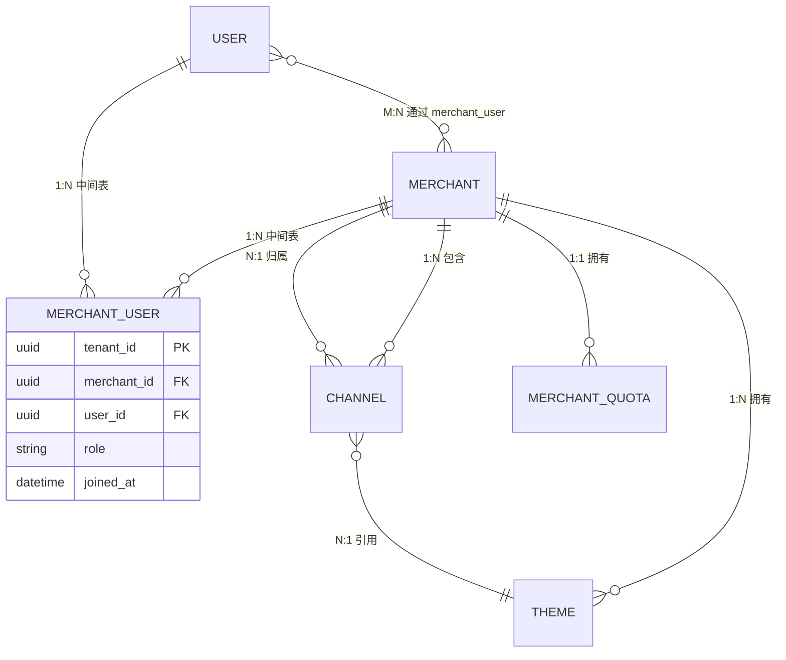

**关联规则**：

| 规则编号 | 规则名称 | 规则描述 |
|----------|----------|----------|
| BR-07-006 | 用户-商户多对多关联 | 一个用户可以归属于多个商户（多对多关系），通过 `merchant_user` 中间表维护；同一用户在不同商户下可拥有不同角色 |
| BR-07-007 | 商户管理员要求 | 每个商户至少保留一个商户管理员角色用户 |
| BR-07-008 | 商户状态影响用户 | 商户停用/过期后，其下所有用户无法登录系统 |
| BR-07-009 | 用户创建范围 | 商户管理员只能在本商户范围内创建用户 |
| BR-07-010 | 用户数配额限制 | 商户用户数不得超过配额上限，达到上限时无法创建新用户 |

---

## 10. 商户配额管理

### 10.1 配额维度与默认值

| 配额维度 | 默认上限 | 计量单位 | 超限行为 | 说明 |
|----------|----------|----------|----------|------|
| 用户数 | 100 | 个 | 拒绝创建新用户 | 商户可创建的最大用户数 |
| 渠道数 | 10 | 个 | 拒绝创建新渠道 | 商户可创建的最大渠道数 |
| 存储空间 | 10240 | MB | 拒绝上传新文件 | 知识库和记忆的存储空间 |
| API日调用量 | 10000 | 次/日 | 限流（HTTP 200 + 业务错误码 200429） | 每日API调用次数上限 |
| 智能体数 | 50 | 个 | 拒绝创建新智能体 | 商户可创建的最大智能体数 |
| 单用户最大关联商户数 | 10 | 个 | 拒绝关联新商户 | 单用户最多关联的商户数（`maxMerchantPerUser`） |

> [已确认] 默认配额值基于标准SaaS服务等级设定 —— 评审依据：多租户SaaS系统通常提供不同服务等级，默认配额对应基础等级

### 10.2 配额管理规则

| 规则编号 | 规则名称 | 规则描述 |
|----------|----------|----------|
| BR-07-011 | 配额初始化 | 商户创建时自动初始化默认配额 |
| BR-07-012 | 配额调整权限 | 仅平台超级管理员可调整商户配额 |
| BR-07-013 | 配额不可低于当前用量 | 调整配额上限时，新上限不得低于当前已用量 |
| BR-07-014 | 配额预警 | 使用率达到70%警告/90%严重/100%拦截（三级阈值体系，各模块可自定义百分比但必须保持三级结构，与 PRD-01 BR-01-027/028/029 对齐） |
| BR-07-015 | API调用量重置 | API日调用量每日凌晨0点自动重置为0 |
| BR-07-016 | 存储用量统计 | 存储用量每日凌晨统计更新 |

> **配额计算规则**: 1) 软删除的 Agent（`deleted_at IS NOT NULL`）不计入配额；2) 所有非软删除状态（Draft/Active/Inactive/Error/Paused）的 Agent 均计入配额；3) 配额检查在 Agent 创建时触发（而非激活时）；4) 超限时返回业务错误码 `200205`（商户 Agent 配额已满）。

### 10.3 配额调整流程

1. 平台超级管理员进入商户详情 > 配额Tab
2. 点击"调整配额"按钮
3. 修改各维度配额上限
4. 系统校验新上限不低于当前已用量
5. 校验通过后更新配额
6. 记录操作审计日志

---

## 11. 商户操作审计日志

### 11.1 审计范围

| 操作对象 | 审计操作类型 | 说明 |
|----------|-------------|------|
| 商户 | Create/Update/Delete/StatusChange/Approve/Reject | 商户全生命周期操作 |
| 渠道 | Create/Update/Delete/Publish/Suspend/Archive | 渠道全生命周期操作 |
| 主题 | Create/Update/Delete | 主题管理操作 |
| 配额 | Update | 配额调整操作 |
| 安全凭证 | Update | Secret/IP白名单变更操作 |

### 11.2 审计日志规则

| 规则编号 | 规则名称 | 规则描述 |
|----------|----------|----------|
| BR-07-017 | 日志不可篡改 | 审计日志一旦写入不可修改和删除，采用 WORM（Write Once Read Many）存储 |
| BR-07-018 | 日志保留期限 | 审计日志按数据类型分级保留：商户核心数据变更 365 天、操作审计 180 天、配置变更 730 天、安全事件 2555 天（7 年） |

> **已确认**：审计日志采用分级保留策略——操作审计保留 180 天，安全审计保留 ≥7 年（与 PRD-11 BR-11-022 / PRD-12 BR-12-040 对齐）。本规则 BR-07-018 适用于操作审计；安全审计保留期以 PRD-12 为权威。

| BR-07-019 | 敏感信息脱敏 | 日志中不记录Secret明文，仅记录"已更新" |
| BR-07-020 | 变更快照 | Update操作记录变更前后的数据快照 |
| BR-07-021 | 操作追溯 | 每条日志记录操作人、IP地址、User-Agent和操作时间 |
| BR-07-022 | 操作上下文 | 审计日志增加 `context` 字段，记录操作前 URL、操作后状态、关联 traceId |
| BR-07-023 | WORM 存储 | 审计日志采用 WORM 存储（对象存储 + 对象锁定 / 数据库 append-only 表），任何用户（包括管理员）均无法修改或删除已写入日志 |
| BR-07-024 | 日志归档 | 超过保留期后归档至冷存储，归档后仍可查询但不可恢复为热数据 |

**审计日志保留期分级**：

| 数据类型 | 保留期 | 适用场景 | 存储层级 |
|----------|--------|----------|----------|
| 商户核心数据变更 | 365 天 | 商户创建、删除、状态变更、审核 | 热存储（数据库） |
| 操作审计 | 180 天 | 日常 CRUD 操作、登录登出 | 热存储（数据库） |
| 配置变更 | 730 天 | 主题、配额、安全凭证变更 | 温存储（数据库+对象存储） |
| 安全事件 | 2555 天（7 年） | 跨租户访问、权限提升、敏感数据导出 | 冷存储（WORM 对象存储） |

---

## 12. 权限矩阵

### 12.1 商户管理模块权限矩阵

| 功能 | 权限标识 | 平台超级管理员 | 商户管理员 | 运营人员 | 审计人员 |
|------|----------|:------:|:------:|:------:|:------:|
| 查看商户列表 | `merchant:merchant:list` | ✅ | ✅（本商户） | ✅ | ✅ |
| 查看商户详情 | `merchant:merchant:read` | ✅ | ✅（本商户） | ✅ | ✅ |
| 创建商户 | `merchant:merchant:create` | ✅ | ❌ | ❌ | ❌ |
| 更新商户 | `merchant:merchant:update` | ✅ | ✅（本商户） | ❌ | ❌ |
| 删除商户 | `merchant:merchant:delete` | ✅ | ❌ | ❌ | ❌ |
| 审核商户 | `merchant:merchant:approve` | ✅ | ❌ | ❌ | ❌ |
| 注销商户 | `merchant:merchant:cancel` | ✅ | ❌ | ❌ | ❌ |
| 调整商户配额 | `merchant:quota:update` | ✅ | ❌ | ❌ | ❌ |
| 查看渠道列表 | `merchant:channel:list` | ✅ | ✅（本商户） | ✅ | ✅ |
| 查看渠道详情 | `merchant:channel:read` | ✅ | ✅（本商户） | ✅ | ✅ |
| 创建渠道 | `merchant:channel:create` | ✅ | ✅（本商户） | ❌ | ❌ |
| 更新渠道 | `merchant:channel:update` | ✅ | ✅（本商户） | ❌ | ❌ |
| 删除渠道 | `merchant:channel:delete` | ✅ | ❌ | ❌ | ❌ |
| 发布渠道 | `merchant:channel:publish` | ✅ | ✅（本商户） | ❌ | ❌ |
| 归档渠道 | `merchant:channel:archive` | ✅ | ❌ | ❌ | ❌ |
| 查看主题列表 | `merchant:theme:list` | ✅ | ✅（本商户） | ✅ | ❌ |
| 查看主题详情 | `merchant:theme:read` | ✅ | ✅（本商户） | ✅ | ❌ |
| 创建主题 | `merchant:theme:create` | ✅ | ✅（本商户） | ❌ | ❌ |
| 更新主题 | `merchant:theme:update` | ✅ | ✅（本商户） | ❌ | ❌ |
| 删除主题 | `merchant:theme:delete` | ✅ | ❌ | ❌ | ❌ |
| 查看操作日志 | `merchant:audit:read` | ✅ | ✅（本商户） | ❌ | ✅ |

> 说明：标注"本商户"表示该角色仅可操作其所属商户的数据，不可跨商户操作。平台超级管理员可操作所有商户数据。

---

## 13. 业务规则

> **BR编号迁移声明**：本节业务规则编号已迁移为 `BR-07-{3位}` 三段式格式（原旧版子域前缀 BR-TI-*/BR-M-*/BR-Q-* 已全部替换）。

### 13.1 商户管理规则

> 商户注册相关的业务规则详见§17.5（注册业务规则）。

| 规则编号 | 规则名称 | 规则描述 |
|----------|----------|----------|
| BR-07-025 | 商户编码唯一性 | 商户编码（Merchant Code）在系统全局范围内必须唯一，创建后不可修改 |
| BR-07-026 | 商户名称唯一性 | 商户名称（Merchant Name）在同一租户范围内必须唯一（与 DDL §7.7.1 `UNIQUE (partition_key, name)` 一致） |
| BR-07-027 | 商户状态流转 | 商户状态支持 Pending→Active→Inactive→Active、Active/Inactive→Expired、Expired→Active（仅平台超级管理员，需更新过期时间）、Active/Inactive→Cancelled 的流转。Cancelled 状态不可逆 |
| BR-07-028 | 商户删除保护 | 仅当商户下无活跃渠道且无活跃用户时，才允许删除商户 |
| BR-07-029 | 商户过期自动处理 | 系统每日凌晨检查商户过期时间，过期商户自动变更为 Expired 状态 |
| BR-07-030 | 商户Logo规范 | Logo图片支持PNG/JPG/SVG格式，最大5MB，建议尺寸200x200px |
| BR-07-031 | 商户创建默认值 | 新建商户默认状态为 Pending，过期时间为空（永不过期） |
| BR-07-032 | 商户审核必经 | 新创建商户必须经过审核通过后才可正常使用 |
| BR-07-033 | 商户停用级联 | 商户停用（Inactive）后：1) 其下所有用户无法登录（用户状态不变，登录时校验商户状态）；2) 所有渠道不可访问；3) 其下所有 Agent 自动暂停（状态不变，执行时校验商户状态）；4) 知识库和记忆资源冻结（只读，不可写入/修改）；5) 编排工作流停止调度。商户重新激活后，用户和 Agent 自动恢复可用，知识库和记忆恢复读写 |
| BR-07-034 | 商户过期恢复 | Expired 状态商户仅平台超级管理员可恢复为 Active，前提是必须同步更新过期时间（`expires_at`）。恢复操作需审计记录 |
| BR-07-035 | 商户注销删除级联清理 | Cancelled 状态商户经确认删除后，系统执行以下级联数据清理策略：1) 用户数据——软删除商户下所有用户账号，保留30天恢复期，30天后永久删除；2) 渠道数据——软删除所有渠道及其配置（含Secret凭证），30天后永久删除；3) Agent数据——软删除所有Agent配置及运行时状态，30天后永久删除；4) 知识库与记忆——知识库文档标记为待清理，30天后从对象存储永久删除，向量索引同步清除；5) 编排工作流——软删除所有工作流定义及执行记录，30天后永久删除；6) 会话数据——所有历史会话记录标记为待清理，30天后永久删除；7) 审计日志——审计日志不予删除，永久保留以满足合规要求；8) 加密密钥——撤销商户级密钥及BYOK密钥访问权限，密钥材料在密钥管理系统中保留至数据完全清除后销毁。以上所有清理操作均需记录审计日志，且在30天恢复期内可通过平台超级管理员操作撤销删除、恢复数据 |

### 13.2 渠道管理规则

| 规则编号 | 规则名称 | 规则描述 |
|----------|----------|----------|
| BR-07-036 | 渠道APPID唯一性 | APPID在同一商户范围内必须唯一 |
| BR-07-037 | 渠道与商户关系 | 一个渠道只能关联一个商户（多对一关系），创建后不可更改关联商户 |
| BR-07-038 | 渠道删除保护 | 仅当渠道状态为 Draft 或 Archived 时才允许删除 |
| BR-07-039 | Secret安全要求 | Secret长度不少于16个字符，必须包含大小写字母和数字 |
| BR-07-040 | IP白名单限制 | 单个渠道最多配置50条IP白名单规则 |
| BR-07-041 | 回调地址验证 | 回调地址必须为HTTPS协议（开发环境可例外为HTTP） |
| BR-07-042 | 渠道类型枚举 | 支持的渠道类型包括：Web、Mobile、API、WeChat、MiniProgram、DingTalk，后续可扩展 |
| BR-07-043 | 渠道发布校验 | 渠道发布前必须完成APPID和Secret的配置 |
| BR-07-044 | 渠道停用影响 | 渠道停用后停止接收新请求，已有会话在超时后自动终止（超时时间30分钟） |

### 13.3 主题管理规则

| 规则编号 | 规则名称 | 规则描述 |
|----------|----------|----------|
| BR-07-045 | 主题删除保护 | 正在被渠道引用的主题不允许删除，需先解除所有关联 |
| BR-07-046 | 主题状态控制 | 仅 Active 状态的主题可被渠道引用 |
| BR-07-047 | 系统默认主题 | 系统内置一个默认主题（不可删除），当渠道未配置主题时自动应用 |
| BR-07-048 | 图片资源限制 | Logo最大2MB（SVG/PNG），Favicon最大100KB（ICO/PNG），默认头像最大1MB |
| BR-07-049 | 颜色格式规范 | 所有颜色值必须为有效的HEX格式（#RRGGBB）或RGB格式 |
| BR-07-050 | 主题作用域 | 全局主题所有商户可用，商户级主题仅本商户可用 |

---

## 14. 接口需求

> 商户注册相关的接口需求详见§17.6（注册相关接口需求）。

### 14.1 商户管理接口

| 接口编号 | 接口名称 | 类型 | GraphQL | 说明 |
|----------|----------|------|---------|------|
| API-M-001 | 获取商户列表 | Query | merchantList | 支持分页、搜索、状态筛选 |
| API-M-002 | 获取商户详情 | Query | merchantDetail(id: ID!) | 返回商户完整信息 |
| API-M-003 | 创建商户 | Mutation | createMerchant(input: MerchantInput!) | 创建新商户，状态默认为Pending |
| API-M-004 | 更新商户 | Mutation | updateMerchant(id: ID!, input: MerchantInput!) | 更新商户信息 |
| API-M-005 | 删除商户 | Mutation | deleteMerchant(id: ID!) | 软删除商户 |
| API-M-006 | 审核商户 | Mutation | approveMerchant(id: ID!, input: ApproveInput!) | 审核通过或拒绝商户 |
| API-M-007 | 获取商户渠道列表 | Query | merchantChannels(id: ID!) | 返回商户下所有渠道 |
| API-M-008 | 获取商户用户列表 | Query | merchantUsers(id: ID!) | 返回商户下所有用户 |
| API-M-009 | 获取商户配额 | Query | merchantQuota(id: ID!) | 返回商户配额使用情况 |
| API-M-010 | 更新商户配额 | Mutation | updateMerchantQuota(id: ID!, input: QuotaInput!) | 调整商户配额上限 |
| API-M-011 | 获取商户操作日志 | Query | merchantLogs(id: ID!) | 返回商户操作日志，支持分页 |

### 14.2 渠道管理接口

| 接口编号 | 接口名称 | 类型 | GraphQL | 说明 |
|----------|----------|------|---------|------|
| API-C-001 | 获取渠道列表 | Query | channelList | 支持分页、搜索、多条件筛选 |
| API-C-002 | 获取渠道详情 | Query | channelDetail(id: ID!) | 返回渠道完整配置 |
| API-C-003 | 创建渠道 | Mutation | createChannel(input: ChannelInput!) | 创建新渠道，状态默认为Draft |
| API-C-004 | 更新渠道 | Mutation | updateChannel(id: ID!, input: ChannelInput!) | 更新渠道配置 |
| API-C-005 | 删除渠道 | Mutation | deleteChannel(id: ID!) | 软删除渠道 |
| API-C-006 | 发布渠道 | Mutation | publishChannel(id: ID!) | 发布渠道，状态变更为Published |
| API-C-007 | 停用渠道 | Mutation | suspendChannel(id: ID!) | 停用渠道，状态变更为Suspended |
| API-C-008 | 启用渠道 | Mutation | resumeChannel(id: ID!) | 启用渠道，状态变更为Published |
| API-C-009 | 归档渠道 | Mutation | archiveChannel(id: ID!) | 归档渠道，状态变更为Archived |
| API-C-010 | 获取渠道操作日志 | Query | channelLogs(id: ID!) | 返回渠道操作日志 |

### 14.3 主题管理接口

| 接口编号 | 接口名称 | 类型 | GraphQL | 说明 |
|----------|----------|------|---------|------|
| API-T-001 | 获取主题列表 | Query | themeList | 支持分页、搜索 |
| API-T-002 | 获取主题详情 | Query | themeDetail(id: ID!) | 返回主题完整配置 |
| API-T-003 | 创建主题 | Mutation | createTheme(input: ThemeInput!) | 创建新主题 |
| API-T-004 | 更新主题 | Mutation | updateTheme(id: ID!, input: ThemeInput!) | 更新主题配置 |
| API-T-005 | 删除主题 | Mutation | deleteTheme(id: ID!) | 删除主题 |
| API-T-006 | 预览主题 | Mutation | previewTheme(input: ThemePreviewInput!) | 返回主题预览数据 |
| API-T-007 | 导出主题配置 | Query | exportTheme(id: ID!) | 导出为JSON文件 |
| API-T-008 | 导入主题配置 | Mutation | importTheme(input: ThemeImportInput!) | 从JSON文件导入 |

---

## 15. 非功能需求

### 15.1 性能需求

| 编号 | 需求项 | 指标 | 验证方法 |
|------|--------|------|----------|
| NFR-M-P-001 | 商户列表加载时间 | ≤ 2秒（P95，1000条数据以内） | 性能测试 |
| NFR-M-P-002 | 商户详情加载时间 | ≤ 1秒（P95） | 性能测试 |
| NFR-M-P-003 | 商户创建响应时间 | ≤ 500ms（P95） | API性能测试 |
| NFR-M-P-004 | 渠道列表加载时间 | ≤ 2秒（P95，1000条数据以内） | 性能测试 |
| NFR-M-P-005 | 主题预览更新延迟 | ≤ 500ms（防抖后） | 前端性能测试 |
| NFR-M-P-006 | 搜索响应时间 | ≤ 1秒（P95，10万条数据模糊搜索） | 搜索性能测试 |
| NFR-M-P-007 | 商户过期检查任务 | 凌晨2:00-4:00完成全量检查 | 定时任务监控 |
| NFR-M-P-008 | 并发商户创建 | 支持10个并发创建请求不降级 | 压力测试 |

### 15.2 安全需求

| 编号 | 需求项 | 指标 | 验证方法 |
|------|--------|------|----------|
| NFR-M-S-001 | 多租户数据隔离 | 商户间数据100%隔离，杜绝跨租户数据访问 | 渗透测试 |
| NFR-M-S-002 | Secret加密存储 | 渠道Secret采用AES-256加密存储 | 代码审查 |
| NFR-M-S-003 | Secret传输安全 | Secret通过TLS加密传输，前端展示默认掩码 | 安全测试 |
| NFR-M-S-004 | 审计日志不可篡改 | 审计日志写入后不可修改和删除 | 数据库权限审查 |
| NFR-M-S-005 | 操作限流 | 商户创建接口限流10次/分钟/用户 | 压力测试 |
| NFR-M-S-006 | 跨租户访问告警 | 任何跨租户访问尝试在5秒内触发安全告警 | 安全测试 |
| NFR-M-S-007 | 敏感信息自动掩码 | Secret展示30秒后自动恢复掩码 | 功能测试 |

### 15.3 可用性需求

| 编号 | 需求项 | 指标 | 验证方法 |
|------|--------|------|----------|
| NFR-M-A-001 | 商户管理模块可用性 | ≥ 99.9%（月度） | 监控报表 |
| NFR-M-A-002 | 软删除恢复期 | 删除后30天内可恢复 | 功能测试 |
| NFR-M-A-003 | 配额预警通知 | 使用率达80%后1小时内发送通知 | 功能测试 |
| NFR-M-A-004 | 审计日志保留 | 至少保留180天 | 配置检查 |

### 15.4 兼容性需求

| 编号 | 需求项 | 指标 | 验证方法 |
|------|--------|------|----------|
| NFR-M-C-001 | 浏览器兼容性 | Chrome 90+、Firefox 88+、Safari 14+、Edge 90+ | 多浏览器测试 |
| NFR-M-C-002 | 分辨率适配 | 最小支持1280x720，推荐1920x1080 | 响应式测试 |
| NFR-M-C-003 | API向后兼容 | API版本升级时，旧版本至少保留6个月兼容期 | 版本管理检查 |

---

## 16. 上线风险与预案

### 16.1 风险清单

| 风险编号 | 风险描述 | 影响程度 | 发生概率 | 风险等级 |
|----------|----------|----------|----------|----------|
| R-M-001 | 商户数据迁移不完整导致历史数据丢失 | 高 | 低 | 高 |
| R-M-002 | 渠道Secret泄露导致安全风险 | 高 | 低 | 高 |
| R-M-003 | 大量商户并发创建导致数据库性能瓶颈 | 中 | 中 | 中 |
| R-M-004 | 主题配置变更影响线上渠道用户体验 | 中 | 中 | 中 |
| R-M-005 | IP白名单配置错误导致渠道无法访问 | 高 | 中 | 高 |
| R-M-006 | 商户删除后关联数据未正确清理导致数据孤岛 | 中 | 低 | 中 |
| R-M-007 | 多租户隔离失效导致跨商户数据泄露 | 高 | 低 | 高 |
| R-M-008 | 配额计算不准确导致商户服务异常 | 中 | 中 | 中 |

### 16.2 预案措施

| 风险编号 | 预案措施 |
|----------|----------|
| R-M-001 | 上线前进行全量数据备份；编写数据迁移脚本并进行多轮验证；上线后进行数据一致性校验 |
| R-M-002 | Secret全程加密传输与存储；前端展示默认掩码；操作日志不记录Secret明文；定期轮换Secret |
| R-M-003 | 数据库添加索引优化查询性能；商户创建接口添加限流（单用户10次/分钟）；必要时进行数据库读写分离 |
| R-M-004 | 主题变更提供预览功能；支持灰度发布机制；保留回滚至上一版本的能力 |
| R-M-005 | IP白名单变更后提供连通性测试工具；变更前发送通知给商户联系人；保留紧急清除白名单的快捷操作 |
| R-M-006 | 商户删除采用软删除机制，保留30天恢复期；删除前展示关联数据清单供确认；定期清理过期软删除数据 |
| R-M-007 | 上线前进行多租户隔离渗透测试；ORM层强制租户过滤校验；跨租户访问实时告警；定期进行隔离性巡检 |
| R-M-008 | 配额计算采用事务保证原子性；每日凌晨全量校准配额数据；配额异常时自动告警并回退至安全值 |

### 16.3 上线检查清单

- [ ] 商户列表、详情、创建、编辑、删除、审核功能全部通过验收测试
- [ ] 渠道列表、详情、创建、编辑、删除、发布、停用功能全部通过验收测试
- [ ] 主题列表、配置、预览功能全部通过验收测试
- [ ] 商户配额管理功能通过验收测试
- [ ] 多租户数据隔离验证通过（渗透测试）
- [ ] 所有API接口通过安全测试（SQL注入、XSS、CSRF）
- [ ] 性能测试通过（列表加载≤2s，API响应≤500ms）
- [ ] 数据迁移脚本验证通过
- [ ] 操作审计日志记录完整准确
- [ ] 权限控制验证通过（各角色只能访问授权功能）
- [ ] 配额预警通知功能验证通过
- [ ] 监控告警配置完成
- [ ] 回滚方案准备就绪

---

## 17. 商户注册与认证

> 本章节内容源自 PRD-01（认证与入口模块），将商户自注册相关功能整合至商户管理模块，与平台管理员创建商户的流程（见§4.1、§8.3）互为补充。

### 17.1 概述

商户注册与认证模块提供商户自服务注册能力，允许企业负责人通过填写公司信息和管理员信息、完成邮箱验证后，自助注册成为平台商户。注册完成后商户进入"待审核"（Pending）状态，需经平台超级管理员审核通过（见§8.4）后方可正常使用。

本模块与§4.1（商户创建完整流程）的区别：

| 维度 | 商户自注册（本章节） | 平台管理员创建商户（§4.1、§8.3） |
|------|----------------------|----------------------------------|
| 发起方 | 企业用户（自服务） | 平台超级管理员 |
| 入口 | 公开注册页面 | 管理后台 |
| 验证方式 | 邮箱验证码 | 无需邮箱验证 |
| 审核流程 | 注册后需平台审核 | 创建后同样需审核 |
| 适用场景 | 商户主动入驻 | 平台代商户创建 |

### 17.2 商户注册完整流程

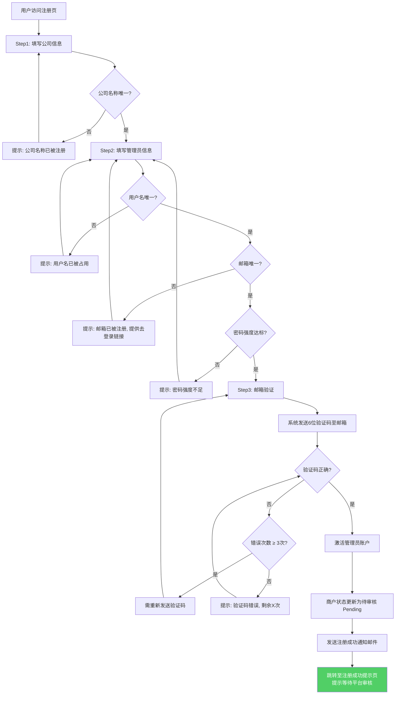

> [调整说明] 原PRD-01流程中邮箱验证通过后商户状态直接更新为"正常"，现调整为"待审核（Pending）"，与§5.1商户状态模型保持一致，确保新注册商户需经平台超级管理员审核通过后方可使用。

### 17.3 注册表单字段定义

#### 17.3.1 Step 1 - 公司信息

**用户故事**：作为企业负责人，我想要通过填写公司基本信息快速注册成为系统商户，以便为我的团队开通AI Multi-Agent System的使用权限。

**前置条件**：
- 用户访问注册页面
- 系统允许新商户注册（未关闭注册入口）

**后置条件**：
- 公司信息临时保存
- 生成商户ID（Merchant ID）
- 商户状态为"待验证"

| 字段名 | 字段标识 | 类型 | 必填 | 校验规则 | 说明 |
|--------|----------|------|------|----------|------|
| 公司名称 | companyName | String | 是 | 2-128字符，租户内唯一 | 商户的显示名称，与§7.1 Merchant.name对应。公司名称（companyName）为注册表单展示字段，映射至商户数据模型的 Merchant.name。注册时 companyName 长度限制为 2-128 字符，存入 Merchant.name 时截断至 50 字符（超出部分作为公司全称存入扩展字段）。 |
| 统一社会信用代码 | creditCode | String | 否 | 18位字母数字组合 | 企业统一社会信用代码 |
| 所属行业 | industry | Select | 是 | 从预置行业列表选择 | 商户所属行业分类 |
| 公司规模 | companySize | Enum | 是 | 1-50人/51-200人/201-1000人/1000人以上 | 公司人员规模 |
| 联系电话 | contactPhone | String | 是 | 国际手机号格式 | 主要联系电话 |

**分支流程**：

| 分支 | 触发条件 | 处理逻辑 |
|------|----------|----------|
| B1 | 公司名称已存在 | 显示"该公司名称已被注册"，建议联系已有商户的管理员加入 |
| B2 | 统一社会信用代码格式错误 | 显示"请输入正确的18位统一社会信用代码" |

**异常流程**：

| 异常 | 触发条件 | 处理逻辑 |
|------|----------|----------|
| E1 | 注册入口已关闭 | 显示"注册功能暂未开放，请联系销售团队" |
| E2 | 网络异常 | 保留已填写的表单数据 |

**交互说明**：
- 表单采用分步式设计（Step 1: 公司信息 → Step 2: 管理员信息 → Step 3: 邮箱验证）
- 顶部进度条显示当前步骤
- 必填字段标注红色星号
- 支持返回上一步修改已填写信息

#### 17.3.2 Step 2 - 管理员信息

**用户故事**：作为商户注册者，我想要设置我的管理员账户信息，以便作为商户的管理者拥有系统的完整管理权限。

**前置条件**：
- 用户已完成"公司信息"步骤
- 公司信息已临时保存

**后置条件**：
- 管理员账户创建（状态为"待激活"）
- 管理员与商户建立关联关系
- 管理员角色设为"商户管理员（MerchantAdmin）"（角色编码使用域前缀格式 `merchant:admin`，显示名使用"商户管理员"，详见 PRD-12 §1.5）

| 字段名 | 字段标识 | 类型 | 必填 | 校验规则 | 说明 |
|--------|----------|------|------|----------|------|
| 用户名 | username | String | 是 | 4-32位，仅允许字母数字下划线，全局唯一 | 管理员登录用户名 |
| 邮箱 | email | String | 是 | RFC 5322格式，全局唯一 | 管理员邮箱，用于验证和通知 |
| 密码 | password | String | 是 | 满足密码强度"强"等级要求（见§17.3.3） | 管理员登录密码 |
| 确认密码 | confirmPassword | String | 是 | 与密码一致 | 密码确认 |

**分支流程**：

| 分支 | 触发条件 | 处理逻辑 |
|------|----------|----------|
| B1 | 用户名已存在 | 显示"该用户名已被占用" |
| B2 | 邮箱已注册 | 显示"该邮箱已被注册"，提供"去登录"链接 |

**异常流程**：

| 异常 | 触发条件 | 处理逻辑 |
|------|----------|----------|
| E1 | 表单提交超时（>10秒） | 显示"提交失败，请重试"，保留已填写数据 |

#### 17.3.3 密码强度校验规则

**用户故事**：作为注册用户，我想要系统实时反馈我设置的密码强度，以便我创建一个足够安全的密码来保护我的账户。

**前置条件**：
- 用户位于密码设置页面（注册或修改密码）

**后置条件**：
- 仅允许符合强度要求的密码通过

**密码强度等级**：

| 等级 | 条件 | 颜色标识 |
|------|------|----------|
| 弱（Weak） | 长度 ≥ 8，仅满足1类字符 | 红色 |
| 中（Medium） | 长度 ≥ 8，满足2类字符 | 橙色 |
| 强（Strong） | 长度 ≥ 8，满足3类字符 | 黄色 |
| 极强（Very Strong） | 长度 ≥ 12，满足4类字符且无连续重复 | 绿色 |

**字符类别**：
1. 大写字母（A-Z）
2. 小写字母（a-z）
3. 数字（0-9）
4. 特殊字符（!@#$%^&*()_+-=[]{}|;':",./<>?）

**禁止规则**：
- 不得包含用户名（不区分大小写）
- 不得包含邮箱前缀
- 不得包含连续3个以上相同字符（如"aaa"、"111"）
- 不得包含常见弱密码（系统维护1000个常见弱密码黑名单）

**交互说明**：
- 密码输入框下方实时显示强度指示条（4段式进度条）
- 每段对应一个强度等级，已达到的等级高亮显示
- 右侧显示具体提示（如"建议增加特殊字符以提升安全性"）
- 密码强度未达到"强"时，提交按钮置灰并提示"密码强度不足"

### 17.4 邮箱验证流程

**用户故事**：作为注册中的管理员，我需要通过验证邮箱来确认我的身份和邮箱的真实性，以便系统可以安全地与我联系并发送重要通知。

**前置条件**：
- 用户已完成"公司信息"和"管理员信息"步骤
- 管理员邮箱已填写

**后置条件**：
- 邮箱验证状态更新为"已验证"
- 管理员账户状态更新为"正常"（Active）
- 商户状态更新为"待审核"（Pending）
- 系统发送注册成功通知邮件

**主流程**：

| 步骤 | 操作 | 系统响应 |
|------|------|----------|
| 1 | 系统展示"邮箱验证"页面 | 显示"验证邮件已发送至 xxx@xxx.com" |
| 2 | 系统发送验证邮件 | 邮件包含6位数字验证码和验证链接 |
| 3 | 用户输入验证码 | 系统校验验证码（有效期10分钟） |
| 4 | 验证通过 | 系统激活管理员账户，商户状态更新为Pending，展示"注册成功"页面 |
| 5 | 系统发送注册成功通知邮件 | 包含审核进度说明和快速入门指南链接 |

> **待审核期间权限说明**：商户待审核期间，管理员可登录系统但仅能看到审核进度页面，无法使用其他业务功能。商户审核通过后自动解锁全部权限。

**分支流程**：

| 分支 | 触发条件 | 处理逻辑 |
|------|----------|----------|
| B1 | 用户点击邮件中的验证链接 | 自动填充验证码并提交验证 |
| B2 | 验证码过期 | 显示"验证码已过期"，提供"重新发送"按钮 |
| B3 | 用户请求重新发送 | 60秒冷却后可重新发送验证码 |

**异常流程**：

| 异常 | 触发条件 | 处理逻辑 |
|------|----------|----------|
| E1 | 验证码错误 | 显示"验证码错误"，剩余3次尝试机会 |
| E2 | 邮件发送失败 | 显示"邮件发送失败，请稍后重试" |
| E3 | 超过24小时未验证 | 管理员账户和商户自动删除，需重新注册 |

**交互说明**：
- 6位验证码输入框支持自动跳格（输入一位自动聚焦下一位）
- 支持粘贴完整6位验证码自动填充
- 验证码仅可使用一次，验证通过后立即失效
- 邮件中不包含任何可追溯的用户敏感信息
- "重新发送"按钮展示60秒冷却倒计时

#### 商户注册后状态矩阵

| 管理员账户状态 | 商户状态 | 用户可访问内容 | 说明 |
|---------------|---------|---------------|------|
| 待激活 | 待审核 | 不可登录 | 管理员需先激活账户 |
| 已激活 | 待审核 | 审核等待页（仅显示审核进度、预计时间、联系支持入口） | 等待平台审核 |
| 已激活 | 审核通过 | 完整功能访问 | 正常使用 |
| 已激活 | 审核拒绝 | 审核拒绝页（显示拒绝原因、修改重提入口） | 可修改后重新提交 |
| 已激活 | 已过期 | 审核过期页（显示过期原因、续期申请入口） | 需申请续期 |

### 17.5 注册业务规则

| 规则编号 | 规则名称 | 规则描述 |
|----------|----------|----------|
| BR-07-051 | 公司名称唯一性 | 同一租户内公司名称不可重复注册，实时校验，响应时间≤500ms（与 BR-07-026 一致） |
| BR-07-052 | 管理员用户名唯一性 | 管理员用户名全局唯一，实时校验，响应时间≤500ms |
| BR-07-053 | 管理员邮箱唯一性 | 同一邮箱不可注册多个账户，实时校验；邮箱已注册时提供"去登录"链接 |
| BR-07-054 | 邮箱验证时限 | 注册后24小时内必须完成邮箱验证，否则自动清理注册数据 |
| BR-07-055 | 验证码安全 | 邮箱验证码6位数字，有效期10分钟，最多3次尝试，3次错误后需重新发送 |
| BR-07-056 | 验证码重发冷却 | 重新发送验证码需间隔60秒 |
| BR-07-057 | 注册者角色 | 注册者自动成为商户的商户管理员（MerchantAdmin） |
| BR-07-058 | 注册入口控制 | 平台超级管理员可关闭注册入口，关闭后显示"注册功能暂未开放，请联系销售团队" |
| BR-07-059 | 密码强度要求 | 注册时密码强度必须达到"强"等级（长度≥8，满足3类字符（全平台统一基线，与 PRD-08 BR-08-001/002 对齐）） |

> **已确认**：密码强度全平台统一基线为"≥8位，满足3类字符"（与 PRD-08 BR-08-001/002、PRD-12 BR-12-031 对齐）。原跨文档不一致已解决。

| BR-07-060 | 注册限流 | 同一IP每小时最多5次注册请求，超出返回业务错误码 200799（HTTP 200） |

> 注：规则BR-07-051与§13.1 BR-07-026（商户名称唯一性）一致；规则BR-07-057与§9.3 BR-07-007（商户管理员要求）互补。

### 17.6 注册相关接口需求

| 接口编号 | 接口名称 | 类型 | GraphQL | 说明 |
|----------|----------|------|---------|------|
| API-R-001 | 商户注册 | Mutation | signup(input: SignupInput!) | 提交商户注册信息（含公司信息和管理员信息） |
| API-R-002 | 邮箱验证 | Mutation | verifyEmail(input: VerifyEmailInput!) | 提交邮箱验证码完成验证 |
| API-R-003 | 重新发送验证码 | Mutation | resendVerification | 重新发送邮箱验证码 |
| API-R-004 | 密码强度校验 | Mutation | validatePasswordStrength(input: PasswordInput!) | 实时校验密码强度 |

> 注：以上接口原定义于PRD-01（API-01-02至API-01-04、API-01-17），现整合至商户管理模块。认证相关接口（登录、Token续签、MFA等）仍保留在PRD-01。

#### API-R-001 商户注册

**请求参数**：

| 参数名 | 类型 | 必填 | 说明 |
|--------|------|------|------|
| company_name | string | 是 | 公司名称 |
| credit_code | string | 否 | 统一社会信用代码（18位字母数字） |
| industry | string | 是 | 所属行业 |
| company_size | string | 是 | 公司规模（1-50/51-200/201-1000/1000+） |
| contact_phone | string | 是 | 联系电话 |
| username | string | 是 | 管理员用户名（4-32位字母数字下划线） |
| email | string | 是 | 管理员邮箱 |
| password | string | 是 | 管理员密码 |

**响应参数**：

| 参数名 | 类型 | 说明 |
|--------|------|------|
| merchant_id | string | 新创建的商户ID |
| user_id | string | 新创建的管理员用户ID |
| message | string | 提示信息："注册成功，验证邮件已发送至您的邮箱" |

**错误码**：

> 业务模块响应 HTTP 状态码恒为 200；HTTP 401/403 仅保留在 API Gateway 网关层。
> 本节错误码命名空间遵循 [PRD-00 §5.3.2.1 错误码数字段位权威分配表](file:///Users/Garabateador/Workspace/banyan/PRD/PRD-00-平台总览与全局规范.md#5321-错误码数字段位权威分配表) 中 PRD-07 行（`BIZ_MERCHANT_*` → `200001-200999`）的子段位映射,注册子域固定占用 `BIZ_MERCHANT_REG_*`（`200700-200799`）。

| 错误码 | 说明 |
|--------|------|
| `BIZ_MERCHANT_REG_COMPANY_NAME_DUPLICATE` | 公司名称已被注册 |
| `BIZ_MERCHANT_REG_USERNAME_TAKEN` | 用户名已被占用 |
| `BIZ_MERCHANT_REG_EMAIL_REGISTERED` | 邮箱已被注册 |
| `BIZ_MERCHANT_REG_PASSWORD_WEAK` | 密码强度不足 |
| `BIZ_MERCHANT_REG_GATEWAY_CLOSED` | 注册入口已关闭 |
| `BIZ_MERCHANT_REG_RATE_LIMITED` | 请求频率过高 |

#### API-R-002 邮箱验证

**请求参数**：

| 参数名 | 类型 | 必填 | 说明 |
|--------|------|------|------|
| email | string | 是 | 待验证的邮箱地址 |
| code | string | 是 | 6位数字验证码 |

**响应参数**：

| 参数名 | 类型 | 说明 |
|--------|------|------|
| success | boolean | 验证是否成功 |
| message | string | 提示信息 |

**错误码**：

> 业务模块响应 HTTP 状态码恒为 200；HTTP 401/403 仅保留在 API Gateway 网关层。
> 错误码命名空间同 API-R-001,统一为 `BIZ_MERCHANT_REG_*`（段位 `200700-200799`）。

| 错误码 | 说明 |
|--------|------|
| `BIZ_MERCHANT_REG_VERIFICATION_CODE_INVALID` | 验证码错误 |
| `BIZ_MERCHANT_REG_VERIFICATION_CODE_EXPIRED` | 验证码已过期 |
| `BIZ_MERCHANT_REG_VERIFICATION_CODE_ATTEMPTS_EXCEEDED` | 验证码尝试次数超限 |

#### API-R-003 重新发送验证码

**请求参数**：

| 参数名 | 类型 | 必填 | 说明 |
|--------|------|------|------|
| email | string | 是 | 待验证的邮箱地址 |

**响应参数**：

| 参数名 | 类型 | 说明 |
|--------|------|------|
| success | boolean | 是否发送成功 |
| message | string | 提示信息 |
| retry_after | integer | 下次可重发的等待时间（秒） |

**错误码**：

> 业务模块响应 HTTP 状态码恒为 200；HTTP 401/403 仅保留在 API Gateway 网关层。
> 错误码命名空间同 API-R-001,统一为 `BIZ_MERCHANT_REG_*`（段位 `200700-200799`）。

| 错误码 | 说明 |
|--------|------|
| `BIZ_MERCHANT_REG_RESEND_COOLING_DOWN` | 请求过于频繁，需等待冷却时间 |
| `BIZ_MERCHANT_REG_EMAIL_NOT_FOUND_OR_EXPIRED` | 邮箱未注册或注册数据已过期 |

#### API-R-004 密码强度校验

**请求参数**：

| 参数名 | 类型 | 必填 | 说明 |
|--------|------|------|------|
| password | string | 是 | 待校验的密码 |
| username | string | 否 | 当前用户名（用于检查密码是否包含用户名） |
| email_prefix | string | 否 | 邮箱前缀（用于检查密码是否包含邮箱前缀） |

**响应参数**：

| 参数名 | 类型 | 说明 |
|--------|------|------|
| strength | string | 强度等级：weak/medium/strong/very_strong |
| score | integer | 强度分数（0-100） |
| suggestions | string[] | 改进建议列表 |
| passed | boolean | 是否达到最低要求（strong等级） |

### 17.7 注册相关验收标准

| 编号 | 验收标准 | 验证方法 |
|------|----------|----------|
| AC-R-01 | 公司名称唯一性校验在输入后500ms内响应 | 输入已存在的公司名称 |
| AC-R-02 | 用户名格式校验：4-32位，仅允许字母数字下划线 | 输入各种格式的用户名 |
| AC-R-03 | 用户名唯一性校验在输入后500ms内响应 | 输入已存在的用户名 |
| AC-R-04 | 邮箱格式校验符合RFC 5322标准 | 输入各种格式的邮箱 |
| AC-R-05 | 密码与确认密码不一致时阻止提交并显示提示 | 输入不一致的密码 |
| AC-R-06 | 密码强度实时校验，输入后100ms内更新强度指示 | 输入不同复杂度的密码 |
| AC-R-07 | 包含用户名的密码被拒绝并提示"密码不得包含用户名" | 输入包含用户名的密码 |
| AC-R-08 | 常见弱密码（如password123、12345678）被拒绝 | 输入常见弱密码 |
| AC-R-09 | 密码强度未达到"强"时提交按钮置灰 | 尝试提交弱密码 |
| AC-R-10 | 验证邮件在30秒内送达 | 发送后检查邮箱 |
| AC-R-11 | 验证码有效期10分钟，超时后失效 | 等待10分钟后输入验证码 |
| AC-R-12 | 验证码错误3次后需重新发送验证码 | 连续输入错误验证码3次 |
| AC-R-13 | 24小时未验证自动清理注册数据 | 修改注册时间模拟超时 |
| AC-R-14 | 验证通过后商户状态为Pending（待审核），需平台审核后方可使用 | 完成验证后检查商户状态 |
| AC-R-15 | 必填字段为空时"下一步"按钮置灰 | 不填写必填字段查看按钮状态 |
| AC-R-16 | 分步表单支持返回修改，已填写数据保留 | 填写完第二步后返回第一步 |
| AC-R-17 | 统一社会信用代码格式校验正确（18位字母数字） | 输入格式错误的信用代码 |
| AC-R-18 | 注册入口关闭时显示"注册功能暂未开放，请联系销售团队" | 关闭注册入口后访问注册页 |
| AC-R-19 | 同一IP每小时最多5次注册请求，超出返回业务错误码 200799（HTTP 200） | 同一IP短时间多次注册 |
| AC-R-20 | 注册成功后管理员自动获得商户管理员（MerchantAdmin）角色 | 注册后检查管理员角色 |

---

## 18. 模块仪表盘与导航

> 本章节整合自 PRD-02（仪表盘与工作空间）和 PRD-12（全局导航与模块关系），提取与商户管理模块相关的仪表盘KPI、图表、活动动态及导航功能。

### 18.1 仪表盘KPI卡片

#### 18.1.1 Total Users（总用户数）— 当前Merchant维度

**用户故事**：作为商户管理员，我希望在仪表盘第一时间看到当前商户下的总用户数，以便掌握本商户的用户规模和增长趋势。

| 指标名称 | 数据来源 | 计算公式 | 刷新频率 | 单位 | 格式 | 趋势对比 |
|----------|----------|----------|----------|------|------|----------|
| Total Users（总用户数） | 用户管理模块 | `COUNT(当前 Merchant 下所有未禁用用户)` | 5分钟 | 人 | 千分位格式 | 与上周同期对比 |

**数据范围说明**：
- 商户管理员：仅展示当前Merchant范围内的用户数，不同Merchant数据严格隔离
- 平台超级管理员：可查看全平台所有Merchant的用户数聚合

**交互说明**：
- 点击该KPI卡片跳转至商户详情 > 用户Tab（`/merchants/{id}?tab=users`）
- 悬停Tooltip展示最近7天用户数趋势迷你图
- 趋势箭头颜色语义：绿色↑=正向增长，红色↓=负向下降，灰色=无变化

**验收标准**：

| 编号 | 验收标准 | 验证方法 |
|------|----------|----------|
| AC-DK-01 | Total Users KPI正确展示当前Merchant下未禁用用户数，数据与用户管理模块一致 | 对比用户管理模块数据验证 |
| AC-DK-02 | 商户管理员仅查看本Merchant数据，超级管理员查看全平台聚合数据 | 分别以两种角色登录验证 |
| AC-DK-03 | 点击KPI卡片正确跳转至商户详情用户Tab | 点击卡片验证跳转路由 |

### 18.2 Channel对比折线图

**用户故事**：作为商户管理员，我希望通过折线图对比当前商户下不同Channel（Web、API、SDK、Mobile）的查询量趋势，以便了解各渠道的使用情况和增长趋势。

**图表配置**：

| 配置项 | 说明 |
|--------|------|
| 图表类型 | 多系列折线图（Line Chart） |
| X轴 | 时间（日期/小时，根据选择的时间范围自适应：今日→按小时，本周/本月→按天，自定义→按天或按小时自适应） |
| Y轴 | 查询量（次） |
| 数据系列 | Web、API、SDK、Mobile 四条折线 |
| 数据范围 | 当前Merchant下的Channel数据 |
| 交互 | 悬停显示数据点详情、点击切换系列显示/隐藏、缩放 |
| 时间范围 | 与全局时间范围选择器联动 |

**主流程**：

| 步骤 | 操作 | 系统响应 |
|------|------|----------|
| 1 | 用户查看仪表盘 | 系统加载Channel对比折线图，按全局时间范围选择器加载数据 |
| 2 | 用户悬停某数据点 | Tooltip展示该时间点的各Channel详细数据 |
| 3 | 用户点击图例中的某个Channel | 该Channel折线隐藏/显示切换 |
| 4 | 用户切换全局时间范围 | 图表重新渲染，X轴自适应（今日→小时粒度，本周/本月→天粒度） |

**分支流程**：

| 分支 | 触发条件 | 处理逻辑 |
|------|----------|----------|
| B1 | 某Channel无数据 | 该Channel折线不展示，图例中显示为灰色并标注"暂无数据" |
| B2 | 数据量过大导致渲染卡顿 | 自动降采样至100个数据点，显示"数据已聚合"提示 |

**验收标准**：

| 编号 | 验收标准 | 验证方法 |
|------|----------|----------|
| AC-DCH-01 | 四个Channel的折线数据与数据库原始数据一致（误差≤0.1%） | 对比数据库原始数据验证 |
| AC-DCH-02 | 时间范围切换后图表在2秒内重新渲染完成 | 切换不同时间范围，测量渲染时间 |
| AC-DCH-03 | 图例点击可隐藏/显示对应折线，动画过渡时间≤300ms | 点击图例验证 |

### 18.3 与Merchant相关的最近活动

**用户故事**：作为商户管理员，我希望在仪表盘看到与商户管理相关的最近活动动态，以便及时了解商户和渠道的变更情况。

**活动类型**：

| 活动类型 | 图标 | 描述模板 | 颜色 |
|----------|------|----------|------|
| 商户创建 | Plus | "{用户} 创建了商户《{商户名称}》" | 绿色 |
| 商户信息更新 | Edit | "{用户} 更新了商户《{商户名称}》" | 蓝色 |
| 商户审核通过 | Check | "商户《{商户名称}》审核通过" | 绿色 |
| 商户审核拒绝 | X | "商户《{商户名称}》审核被驳回：{原因}" | 橙色 |
| 商户停用/启用 | Toggle | "{用户} {停用|启用}了商户《{商户名称}》" | 灰色/蓝色 |
| 渠道创建 | Plus | "{用户} 在商户《{商户名称}》下创建了渠道《{渠道名称}》" | 绿色 |
| 渠道发布 | Rocket | "{用户} 发布了渠道《{渠道名称}》" | 蓝色 |
| 渠道停用 | Ban | "{用户} 停用了渠道《{渠道名称}》" | 橙色 |
| 配额调整 | Chart | "{用户} 调整了商户《{商户名称}》的配额" | 紫色 |

**展示规则**：

| 规则 | 说明 |
|------|------|
| 时间范围 | 最近30天内的活动记录 |
| 展示数量 | 每页20条，支持"查看更多"分页加载（每次加载20条） |
| 时间格式 | 1小时内显示"X分钟前"，24小时内显示"X小时前"，超过24小时显示"YYYY-MM-DD HH:mm" |
| 数据范围 | 商户管理员仅查看本Merchant相关活动，平台超级管理员查看全平台活动 |
| 点击跳转 | 点击活动条目跳转至对应的商户详情或渠道详情 |

**验收标准**：

| 编号 | 验收标准 | 验证方法 |
|------|----------|----------|
| AC-DA-01 | 商户相关活动按时间倒序排列，最新活动在最上方 | 创建商户后检查列表顺序 |
| AC-DA-02 | 各活动类型的图标和颜色与定义一致 | 触发不同类型的活动验证 |
| AC-DA-03 | 点击活动条目正确跳转至对应详情页 | 点击验证跳转路由 |
| AC-DA-04 | 商户管理员仅查看本Merchant活动，超级管理员查看全平台活动 | 分别以两种角色登录验证 |

### 18.4 Sidebar商户管理菜单项

**菜单项定义**：

| 序号 | 菜单名称 | 英文标识 | 图标 | 路由路径 | 权限要求 | 所属架构层 |
|------|----------|----------|------|----------|----------|------------|
| 10 | 商户管理 | Merchants | merchant | /merchants | `merchant:merchant:list` | 管理模块 |

**菜单分组规则**：商户管理菜单项归属于"管理模块"分组，与用户管理、权限管理同组，使用分割线与其他架构层分组区分。

**导航交互规则**：

| 规则编号 | 规则描述 |
|----------|----------|
| BR-07-061 | 商户管理菜单项根据用户权限动态展示，无`merchant:merchant:list`权限的用户不显示该菜单项 |
| BR-07-062 | 用户点击"商户管理"菜单项，主内容区切换至商户列表页面，菜单项高亮展示 |
| BR-07-063 | 折叠状态下，悬停商户管理图标展示Tooltip"商户管理" |

### 18.5 Topbar切换商户功能

**用户故事**：作为多商户用户，我希望在Topbar快速切换当前所属商户，以便在不同商户的工作空间之间高效切换。

**功能入口**：Topbar > 用户信息下拉菜单 > "切换商户"

**切换商户规则**：

| 规则编号 | 规则描述 |
|----------|----------|
| BR-07-064 | 仅当用户在 `merchant_user` 中间表存在 2 条及以上有效关联时，"切换商户"菜单项才展示（与 §22.2 BR-07-064 一致） |
| BR-07-065 | 点击"切换商户"后展示商户选择弹窗，列出用户所属的所有商户 |
| BR-07-066 | 切换商户后，导航菜单、数据范围、权限上下文全部刷新 |
| BR-07-067 | 切换商户需二次确认，提示"切换商户后将刷新当前页面数据" |
| BR-07-068 | 切换商户后保持当前所在模块页面，仅刷新数据 |

**权限要求**：`merchant:merchant:switch`

**验收标准**：

| 编号 | 验收标准 | 验证方法 |
|------|----------|----------|
| AC-SW-01 | 仅多商户用户可见"切换商户"菜单项 | 分别以单商户和多商户用户验证 |
| AC-SW-02 | 切换商户后数据范围正确切换至目标商户 | 切换商户后验证列表数据为对应商户数据 |
| AC-SW-03 | 切换商户需二次确认 | 点击切换商户验证弹窗确认 |

### 18.6 Merchant模块依赖关系

**模块依赖矩阵（商户管理相关）**：

| 模块 | Merchants | Users | 说明 |
|------|-----------|-------|------|
| Merchants | — | ↔（双向依赖） | 商户与用户多对多关系，商户下包含多个用户，用户归属于特定商户 |
| Users | ↔（双向依赖） | — | 用户管理依赖商户信息进行租户隔离，商户管理依赖用户信息展示关联用户 |

**核心依赖关系详解**：

| 维度 | 说明 |
|------|------|
| 方向 | Merchants ↔ Users |
| 类型 | 双向依赖 |
| 描述 | Merchants（商户管理）和Users（用户管理）之间存在多对多关系。商户下包含多个用户，用户归属于特定商户。商户的状态变更会影响其下所有用户的访问权限 |
| 数据流 | 商户创建 → 用户关联 → 权限继承 → 商户状态变更 → 用户权限更新 |
| 影响范围 | 商户禁用时，其下所有用户的访问权限同步失效 |

**其他依赖**：

| 依赖模块 | 依赖类型 | 说明 |
|----------|----------|------|
| Channel | 一对多 | 商户与渠道为一对多关系，一个商户可创建多个渠道 |
| Theme | 一对多 | 商户与主题为一对多关系，商户可拥有多个商户级主题 |
| MerchantQuota | 一对一 | 商户与配额为一对一关系，每个商户拥有独立的资源配额 |
| System Setting | 配置依赖 | 商户级配置覆盖全局配置，优先级：商户配置 > 全局配置 |
| Dashboard | 数据来源 | 仪表盘从商户管理模块聚合商户和渠道数据 |

---

## 19. 模块关系总览

> 本章节整合自 PRD-12（全局导航与模块关系）§5.4 模块关系总览，提取与商户管理模块相关的全局关系视角。商户内部依赖（Channel、Theme、MerchantQuota 等）详见 §18.6。

### 19.1 商户管理在系统中的位置

商户管理（Merchant Management）作为系统的核心租户管理模块，在系统分层架构与功能模块矩阵中均占据关键位置：

- **架构定位**：属于"管理模块"分组，与用户管理、权限管理同组，承载多租户架构中的租户边界划分职责。
- **核心职责**：商户全生命周期管理、商户与用户的多对多关联、商户资源配额管控、商户状态机管理。
- **数据隔离边界**：以 Merchant ID 作为数据隔离的基本单位，是多租户隔离机制的核心承载体（详见 §9）。
- **上下游关系**：
  - **上游（依赖）**：依赖认证模块（PRD-01）完成用户身份验证，依赖系统设置（PRD-09）获取全局配置。
  - **下游（被依赖）**：被用户管理（PRD-08）依赖以实现租户隔离，被仪表盘（PRD-02）依赖以聚合商户维度的 KPI 数据，被监控分析（PRD-12 §5.5）依赖以采集租户级运行指标。

### 19.2 与其他模块的关系

#### 19.2.1 与用户管理（Users）的双向关联

| 维度 | 说明 |
|------|------|
| 关系类型 | **多对多双向关联（Many-to-Many，M:N）**；与 §9.3 BR-07-006 一致 |
| 数据流 | 商户创建 → 管理员绑定 → 用户关联 → 权限继承 → 商户状态变更 → 用户权限更新 |
| 关联表 | `merchant_user`（物理表名 `tenant_perm_user_merchant`，与 PRD-12 §A3 权限管理中间表保持一致）作为中间表，存储 `merchant_id` 与 `user_id` 的关联关系及商户内角色（Merchant Admin、Merchant Member、Merchant Auditor 等）；同一用户可在不同商户下拥有不同角色 |
| 关联模型 | 一个用户可以归属于多个商户，一个商户可以拥有多个用户；通过 `merchant_user` 中间表的 `(partition_key, id)` 复合主键 + `UNIQUE (partition_key, merchant_id, user_id)` 唯一约束保证关联唯一性 |
| 切换语义 | 切换商户本质是切换用户在不同 `merchant_user` 关联下的上下文，因此「多商户用户」才能展示「切换商户」入口（BR-07-064） |
| 影响范围 | 商户禁用（Inactive/Cancelled）时，其下所有用户的访问权限同步失效；商户启用（Active）时，权限自动恢复；其他商户下的关联不受影响 |
| 接口依赖 | 用户管理模块在加载用户列表时需调用商户服务获取关联商户信息；商户管理模块在展示用户 Tab 时需调用用户服务获取关联用户列表 |

#### 19.2.2 多租户隔离基础

商户管理是整个系统多租户数据隔离的物理基础，所有业务数据均需携带 `merchant_id` 字段用于租户过滤：

| 隔离层级 | 实现机制 | 说明 |
|----------|----------|------|
| 数据库层 | 所有业务表包含 `merchant_id` 字段，配合行级安全策略（RLS） | 数据库层面硬隔离，杜绝跨租户直接查询 |
| 应用层 | SQLAlchemy 事件监听器自动注入 `merchant_id` 过滤条件 | 应用层软隔离，防止代码遗漏导致数据泄露 |
| 缓存层 | Redis Key 中包含 `merchant_id` 前缀 | 缓存层面避免跨租户数据污染 |
| API 层 | 请求头携带 `X-Merchant-Id`，网关层强制校验 | API 层面识别当前租户上下文 |

#### 19.2.3 与其他模块的依赖关系矩阵

| 依赖方向 | 模块 | 依赖类型 | 依赖说明 |
|----------|------|----------|----------|
| 商户管理 → | 用户管理（PRD-08） | 双向 ↔ | 商户与用户多对多关联，用户归属于特定商户 |
| 商户管理 → | 渠道（Channel） | 一对多 | 商户可创建多个渠道，详见 §6.2 |
| 商户管理 → | 主题（Theme） | 一对多 | 商户可配置多个商户级主题，详见 §6.3 |
| 商户管理 → | 配额（MerchantQuota） | 一对一 | 每个商户拥有独立的资源配额，详见 §10 |
| 商户管理 → | 仪表盘（PRD-02） | 数据来源 | 仪表盘从商户管理模块聚合商户总数、活跃商户数、本月新增商户数等 KPI |
| 商户管理 → | 监控分析（PRD-12 §5.5） | 监控采集 | 监控模块采集商户级运行指标和审计日志 |
| 商户管理 → | 系统设置（PRD-09） | 配置依赖 | 商户级配置可覆盖全局配置，优先级：商户配置 > 全局配置 |

#### 19.2.4 跨模块关系流程图

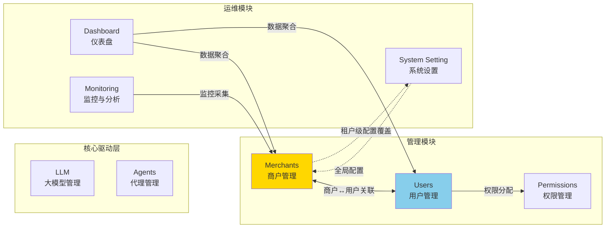

### 19.3 商户模块依赖关系验收标准

| 编号 | 验收标准 | 验证方法 |
|------|----------|----------|
| AC-MR-M-01 | 商户管理模块与用户管理模块的双向依赖关系在集成测试中得到验证 | 集成测试，覆盖商户创建、用户关联、商户禁用、权限失效等场景 |
| AC-MR-M-02 | 多租户隔离在数据库、应用、缓存、API 四个层级均得到验证 | 渗透测试，使用 A 商户账户尝试访问 B 商户数据 |
| AC-MR-M-03 | 商户状态变更触发其下所有用户权限的同步更新 | 禁用商户后验证其下用户无法访问商户内资源 |
| AC-MR-M-04 | 仪表盘从商户管理模块聚合的 KPI 数据（总商户数、活跃商户数、本月新增商户数）与商户管理模块数据一致 | 对比两模块数据，偏差率 0% |

---

## 20. 非功能需求汇总

> 本章节从 PRD-12（全局导航与模块关系）§5.5 全局非功能需求视角出发，提取与商户管理模块相关的非功能需求汇总。商户管理模块特有的细粒度非功能需求详见 §15，本章侧重于跨模块共享与全局一致性维度的非功能需求。

### 20.1 性能需求

| 编号 | 需求项 | 指标 | 验证方法 |
|------|--------|------|----------|
| NFR-M-P-101 | 商户列表接口 API 平均响应时间 | ≤ 500ms（P95） | APM 性能监控 |
| NFR-M-P-102 | 商户切换接口响应时间 | ≤ 1秒（P95，含导航菜单与数据上下文刷新） | APM 性能监控 |
| NFR-M-P-103 | 商户搜索响应时间 | ≤ 1秒（模糊搜索，10万条数据） | 搜索性能测试 |
| NFR-M-P-104 | 仪表盘从商户管理模块聚合数据的接口响应时间 | ≤ 800ms（P95） | APM 性能监控 |
| NFR-M-P-105 | 系统并发承载能力 | ≥ 1000 并发用户 | 压力测试 |
| NFR-M-P-106 | 商户管理服务数据库查询响应 | ≤ 100ms（单表查询，10万条数据） | 数据库性能测试 |

### 20.2 安全需求

#### 20.2.1 多租户隔离

多租户隔离是商户管理模块最核心的安全要求，从以下四个层级确保商户间数据完全隔离：

| 层级 | 实现机制 | 验证方法 |
|------|----------|----------|
| 数据库层 | 业务表统一携带 `merchant_id`，配合 PostgreSQL RLS（行级安全策略）硬隔离 | 使用 A 商户账户尝试查询 B 商户数据，验证返回 0 条 |
| 应用层 | SQLAlchemy 事件监听器自动注入 `merchant_id` 过滤条件，禁止业务代码直接跨租户查询 | 代码审查 + 渗透测试 |
| 缓存层 | Redis Key 遵循 PRD-00 §7.4 权威格式 `t:{merchant_id}:merchant:*`，避免跨租户缓存污染 | 使用 A 商户 Token 读取 B 商户缓存键，验证无法命中 |
| API 层 | 网关层从 Token 解析 `merchant_id` 并注入请求头 `X-Merchant-Id`，下游服务强制校验 | 修改请求头 `X-Merchant-Id` 尝试越权访问，验证网关层返回 403，业务模块响应恒为 200 |

#### 20.2.2 状态管理

商户状态机是商户管理模块的关键安全控制点，所有状态变更均需通过严格的状态流转规则（详见 §5.1）：

| 状态 | 安全控制点 |
|------|-----------|
| Pending（待审核） | 商户功能受限，仅可登录和查看审核进度，不可使用业务功能 |
| Active（正常） | 商户功能全部可用 |
| Inactive（停用） | 商户功能全部不可用，关联用户访问权限同步失效 |
| Expired（过期） | 超过到期时间后自动触发，需联系平台续期 |
| Cancelled（注销） | 终态，不可恢复，仅保留审计追溯能力 |

**状态变更安全要求**：

| 编号 | 需求描述 | 验证方法 |
|------|----------|----------|
| NFR-M-S-101 | 商户状态变更需经过权限校验，仅 `merchant:merchant:approve` 权限用户可执行状态变更 | 以无权限用户尝试变更商户状态，验证返回业务错误码 200302（HTTP 200） |
| NFR-M-S-102 | 状态变更需二次确认，关键操作（Active→Inactive、Active→Cancelled）需输入确认信息 | 验证关键操作弹出二次确认弹窗 |
| NFR-M-S-103 | 状态变更操作全部记录审计日志，包含操作人、操作时间、原状态、目标状态、变更原因 | 审查审计日志，验证字段完整性 |
| NFR-M-S-104 | 商户状态变更实时通知其下所有用户（WebSocket 推送 + 邮件通知） | 验证 WebSocket 推送和邮件通知在 5 秒内送达 |
| NFR-M-S-105 | 商户切换操作（Switch Merchant）需携带 `merchant:merchant:switch` 权限，且用户必须属于目标商户 | 验证无权限用户或非目标商户成员无法切换 |

### 20.3 可用性需求

| 编号 | 需求项 | 指标 | 验证方法 |
|------|--------|------|----------|
| NFR-M-A-101 | 商户管理服务可用性 | ≥ 99.9%（月度） | 监控报表 |
| NFR-M-A-102 | 商户管理接口错误率 | ≤ 0.1%（排除客户端错误） | 监控报表 |
| NFR-M-A-103 | 商户管理模块计划内维护窗口 | 每月不超过 2 次，每次不超过 2 小时 | 维护记录 |
| NFR-M-A-104 | 商户管理数据备份频率 | 每日全量备份 + 每小时增量备份 | 备份记录 |
| NFR-M-A-105 | 商户数据 RPO（恢复点目标） | ≤ 5 分钟 | 灾备演练 |
| NFR-M-A-106 | 商户数据 RTO（恢复时间目标） | ≤ 15 分钟 | 灾备演练 |
| NFR-M-A-107 | 故障切换时间 | ≤ 10 秒（自动故障切换） | 高可用测试 |

### 20.4 兼容性需求

| 编号 | 需求项 | 指标 | 验证方法 |
|------|--------|------|----------|
| NFR-M-C-101 | 浏览器兼容性 | Chrome 90+、Firefox 88+、Safari 14+、Edge 90+ | 多浏览器测试 |
| NFR-M-C-102 | 分辨率适配 | 最小支持 1280x720（桌面端），推荐 1920x1080 | 响应式测试 |
| NFR-M-C-103 | 移动端适配 | iOS Safari 14+、Android Chrome 90+（仅查看功能） | 移动端测试 |
| NFR-M-C-104 | 商户管理 API 向后兼容 | API 版本升级时，旧版本至少保留 6 个月兼容期 | 版本管理检查 |
| NFR-M-C-105 | 商户管理 API 与 PRD-12 §5.6 接口规范保持完全一致 | 接口规范合规性检查 |

### 20.5 可观测性需求

| 编号 | 需求项 | 指标 | 验证方法 |
|------|--------|------|----------|
| NFR-M-O-101 | 分布式链路追踪 | 所有商户管理 API 请求支持分布式链路追踪（traceId 贯穿） | 链路追踪验证 |
| NFR-M-O-102 | 指标监控 | 商户管理服务暴露 Prometheus 指标接口（/metrics），包含 QPS、响应时间、错误率、Python 运行时指标等 | 监控系统验证 |
| NFR-M-O-103 | 健康检查 | 商户管理服务提供健康检查接口（/health），包含数据库连接、Redis 连接、依赖服务健康状态 | 健康检查验证 |
| NFR-M-O-104 | 审计日志完整性 | 所有商户及渠道关键操作记录审计日志，包含操作人、操作时间、操作类型、操作对象、操作前后状态、客户端 IP、User-Agent | 日志审查 |
| NFR-M-O-105 | 告警规则 | 商户管理关键指标（接口错误率、跨租户访问尝试、商户过期）异常时 5 分钟内触发告警通知 | 告警测试 |
| NFR-M-O-106 | 行为埋点 | 商户创建、状态变更、切换商户等关键操作埋点上报，支持运营分析 | 数据分析验证 |
| NFR-M-O-107 | 跨租户访问告警 | 任何跨租户访问尝试在 5 秒内触发安全告警，告警通知至安全管理员 | 安全测试 |

---

## 21. 接口规范汇总

> 本章节整合自 PRD-12（全局导航与模块关系）§5.6 接口规范汇总，聚焦于商户管理模块在全局 API 规范中的位置与遵循约定。商户管理 API 详细清单（按业务场景）详见 §14，本章侧重于跨模块统一的 API 规范约束。

### 21.1 GraphQL 规范

商户管理模块所有 API 遵循 GraphQL 单总线规范（与 PRD-04 §19 / PRD-00 §4 统一），本章仅列示与商户管理模块相关的特殊约定：

| 规范项 | 说明 | 商户管理示例 |
|--------|------|--------------|
| 单总线入口 | 所有请求通过 `POST /graphql` 提交（遵循 PRD-00 §4 全局接口规范） | `mutation createMerchant(input: CreateMerchantInput!)` |
| Operation 命名 | Query 驼峰前缀,Mutation 动词前缀 | `merchantList` / `createMerchant` / `patchMerchant` |
| 版本管理 | Schema 演进通过 `@deprecated` 指令,不通过 URL 版本号 | `merchantDetail(merchantId: ID!): MerchantDetail @deprecated(reason: "v1 字段,推荐使用 merchantCore")` |
| 响应状态码 | GraphQL 单总线返回 HTTP 200,错误通过 `errors[].extensions.code` 标识(BIZ_MERCHANT_*) | 创建成功返回 `data`;商户名称冲突返回 `BIZ_MERCHANT_NAME_DUPLICATE`(200201) |
| 过滤与排序 | 通过 `filter: MerchantFilterInput` 输入参数 + `connection: ConnectionInput`(Relay Connection) | `merchantList(filter: {status: ACTIVE}, connection: {first: 20, after: "cursor"})` |
| 嵌套资源 | 通过专门的 Query(如 `merchantChannels(merchantId)`)而非嵌套路径 | `merchantChannels(merchantId: ID!): ChannelConnection` |
| 批量操作 | 通过专门 Mutation + `ids: [ID!]!` 入参,而非批量端点 | `batchDeleteMerchants(input: BatchDeleteInput!)` |

### 21.2 错误码体系

错误码命名空间采用 `BIZ_MERCHANT_*`、`BIZ_TENANT_*`、`BIZ_API_KEY_*`、`BIZ_SUBSCRIPTION_*`、`BIZ_CHANNEL_*` 形式，数字段位 `200001-200999`；历史 6 位编码 `{模块2位}{类型2位}{序号2位}` 仅作为内部参考，示例错误码如下：

| 模块编码 | 模块名称 | 说明 |
|----------|----------|------|
| 20 | 商户（Merchant） | 商户管理核心业务错误码 |
| 20 | 渠道（Channel） | 商户下渠道管理错误码（与商户共模块 20 段位） |

#### 21.2.1 模块编码

| 编码 | 模块名称 | 编码 | 模块名称 |
|------|----------|------|----------|
| 00 | 通用（Common） | 08 | LLM |
| 01 | 认证（Auth） | 09 | 编排（Orchestration） |
| 02 | 知识（Knowledge） | 10 | 安全（Security） |
| 03 | 能力（Capability） | 11 | 权限（Permission） |
| 04 | 用户（User） | 12 | 系统（System） |
| 05 | 角色（Role） | 13 | 代理（Agent） |
| 06 | 工作流（Workflow） | 14 | 提示词（Prompt） |
| 07 | 商户（Merchant） | - | - |

#### 21.2.2 类型编码

| 编码 | 类型名称 | 说明 |
|------|----------|------|
| 00 | 通用错误 | — |
| 01 | 参数校验错误 | 请求参数格式或取值不合法 |
| 02 | 业务规则错误 | 违反业务规则（如名称重复、配额超限） |
| 03 | 权限错误 | 权限不足或资源不可访问 |
| 04 | 资源不存在 | 资源 ID 不存在或已删除 |
| 05 | 状态冲突 | 当前状态不允许该操作（如已审核商户重复审核） |
| 06 | 外部服务错误 | 调用外部服务（如邮件、短信）失败 |
| 99 | 系统内部错误 | 未预期的系统异常 |

#### 21.2.3 商户管理模块常用错误码

> 业务模块响应 HTTP 状态码恒为 200，业务错误通过 `code` 字段标识；HTTP 401/403 仅保留在 API Gateway 网关层。

| 错误码 | 类型 | 说明 |
|--------|------|------|
| 200000 | 通用错误 | 商户管理模块未知错误 |
| 200099 | 系统错误 | 商户管理模块系统内部错误 |
| `BIZ_MERCHANT_VALIDATION` | 参数校验 | 商户名称不能为空（归并到 EntityValidationError） |
| 200102 | 参数校验 | 商户编码格式不正确（仅允许字母数字下划线） |
| 200103 | 参数校验 | 联系电话格式不正确 |
| `BIZ_MERCHANT_ALREADY_EXISTS` | 业务规则 | 商户名称已存在 |
| 200202 | 业务规则 | 商户编码已存在 |
| 200203 | 业务规则 | 统一社会信用代码已存在 |
| 200204 | 业务规则 | 商户配额超限，无法创建更多渠道 |
| 200205 | 业务规则 | 商户 Agent 配额已满 |
| 200206 | 业务规则 | 单用户关联商户数超限 |
| `BIZ_MERCHANT_NOT_FOUND` | 资源不存在 | 商户不存在 |
| 200402 | 资源不存在 | 商户已删除或不存在 |
| `BIZ_MERCHANT_STATUS_CONFLICT` | 状态冲突 | 商户当前状态不允许该操作（如 Pending 状态商户不能直接编辑） |
| 200502 | 状态冲突 | 商户已注销，不可恢复 |
| `BIZ_MERCHANT_EMAIL_EXTERNAL_FAILED` | 外部服务 | 邮件发送失败 |
| 200602 | 外部服务 | 短信发送失败 |
| `BIZ_CHANNEL_ALREADY_EXISTS` | 业务规则 | 渠道编码已存在 |
| 200211 | 业务规则 | 渠道名称已存在 |
| 200212 | 业务规则 | 渠道下存在活跃发布，不可删除 |
| `BIZ_CHANNEL_NOT_FOUND` | 资源不存在 | 渠道不存在 |
| 200501 | 状态冲突 | 渠道当前状态不允许该操作（如 Draft 状态不能直接发布） |

### 21.3 响应格式

#### 21.3.1 成功响应

```json
{
  "code": 200,
  "message": "success",
  "data": {
    "merchantId": "mer_001",
    "merchantName": "示例商户",
    "merchantCode": "MERCHANT_001",
    "status": "Active",
    "createdAt": "2026-06-08T10:30:00Z"
  },
  "timestamp": 1717804800000,
  "traceId": "trace-abc123-def456"
}
```

#### 21.3.2 分页响应

```json
{
  "code": 200,
  "message": "success",
  "data": {
    "items": [
      {
        "merchantId": "mer_001",
        "merchantName": "示例商户",
        "status": "Active"
      }
    ],
    "connection": {
      "edges": [
        {
          "cursor": "Y3Vyc29yOjE=",
          "node": {
            "merchantId": "mer_001",
            "merchantName": "示例商户",
            "status": "Active"
          }
        }
      ],
      "pageInfo": {
        "hasNextPage": true,
        "hasPreviousPage": false,
        "startCursor": "Y3Vyc29yOjE=",
        "endCursor": "Y3Vyc29yOjEwMA=="
      },
      "totalCount": 100
    }
  },
  "timestamp": 1717804800000,
  "traceId": "trace-abc123-def456"
}
```

#### 21.3.3 错误响应

```json
{
  "code": 200201,
  "message": "商户名称已存在",
  "data": null,
  "timestamp": 1717804800000,
  "traceId": "trace-abc123-def456",
  "errors": [
    {
      "field": "merchantName",
      "message": "商户名称「示例商户」已被占用"
    }
  ]
}
```

### 21.4 分页规范

商户管理模块所有列表接口遵循 PRD-00 §4.4 的 Relay Connection 分页规范：

| 参数名 | 类型 | 默认值 | 取值范围 | 说明 |
|--------|------|--------|----------|------|
| first | Int | 20 | 1-100 | 请求从游标 `after` 之后开始的最多记录数 |
| after | String | - | Base64 游标 | 上一页响应中的 `endCursor`，用于向后翻页 |
| last | Int | - | 1-100 | 请求从游标 `before` 之前开始的最多记录数，与 `before` 配合实现向前翻页 |
| before | String | - | Base64 游标 | 上一页响应中的 `startCursor`，用于向前翻页 |
| sort | String | createdAt:desc | 任意字段:asc/desc | 排序字段与方向，支持多字段（逗号分隔） |
| search | String | — | — | 全文搜索关键词 |

**Relay Connection 响应结构**：

```json
{
  "connection": {
    "edges": [
      {
        "cursor": "Y3Vyc29yOjE=",
        "node": { "merchantId": "mer_001", "merchantName": "..." }
      }
    ],
    "pageInfo": {
      "hasNextPage": true,
      "hasPreviousPage": false,
      "startCursor": "Y3Vyc29yOjE=",
      "endCursor": "Y3Vyc29yOjEwMA=="
    },
    "totalCount": 100
  }
}
```

### 21.5 接口规范验收标准

| 编号 | 验收标准 | 验证方法 |
|------|----------|----------|
| AC-API-M-01 | 商户管理 API 遵循 GraphQL 单总线规范（`POST /graphql`） | API 审查 |
| AC-API-M-02 | 商户管理 API 不使用 RESTful 独立端点，所有操作通过 GraphQL Query/Mutation 实现 | API 审查 |
| AC-API-M-03 | 商户管理 API 响应格式符合统一规范 | 接口自动化测试，覆盖率 100% |
| AC-API-M-04 | 商户管理错误码使用 02/03 段位编码 | 接口测试 |
| AC-API-M-05 | 商户管理分页接口遵循统一分页规范 | 接口测试 |
| AC-API-M-06 | 商户管理 API 鉴权头携带 `Authorization: Bearer {token}` 和 `X-Merchant-Id` 请求头 | API 审查 |

---

## 22. Topbar 切换商户功能

> 本章节详化 §18.5 Topbar 切换商户功能，整合自 PRD-12（全局导航与模块关系）§5.2.7 用户信息下拉菜单中的"切换商户"功能定义。切换商户是 Topbar 用户下拉菜单中的核心功能，对多商户用户的工作空间切换至关重要。

### 22.1 用户故事

| 编号 | 用户故事 | INVEST 分析 |
|------|----------|-------------|
| US-SWITCH-01 | 作为多商户用户，我想要在 Topbar 快速切换当前所属商户，以便在不同商户的工作空间之间高效切换，避免重复登录退出 | **I**ndependent：独立于其他 Topbar 功能；**N**egotiable：切换方式可协商；**V**aluable：多商户用户核心需求；**E**stimable：可估算；**S**mall：单一功能；**T**estable：可验证切换后数据隔离 |
| US-SWITCH-02 | 作为多商户用户，我想要在切换商户前看到清晰的提示信息，了解切换的影响范围，以便避免误操作导致数据混乱 | **I**ndependent：独立于切换功能；**N**egotiable：提示方式可协商；**V**aluable：减少误操作；**E**stimable：可估算；**S**mall：确认弹窗；**T**estable：可验证提示信息完整性 |
| US-SWITCH-03 | 作为多商户用户，我想要在切换商户后保持当前所在模块页面，仅刷新数据，以便维持操作上下文，避免切换后回到首页 | **I**ndependent：独立于切换逻辑；**N**egotiable：保持策略可协商；**V**aluable：保持操作连续性；**E**stimable：可估算；**S**mall：路由保持逻辑；**T**estable：可验证切换后路由不变 |

### 22.2 切换商户规则

| 规则编号 | 规则名称 | 规则描述 |
|----------|----------|----------|
| BR-07-064 | 多商户条件展示 | 仅当用户在 `merchant_user`（物理表 `tenant_perm_user_merchant`）中间表中存在 2 条及以上有效关联时，"切换商户"菜单项才在 Topbar 用户下拉菜单中展示 |
| BR-07-065 | 商户选择弹窗 | 点击"切换商户"后展示商户选择弹窗，列出用户所属的所有商户，包含商户名称、商户编码、当前角色、最后访问时间 |
| BR-07-066 | 上下文全量刷新 | 切换商户后，导航菜单、数据范围、权限上下文、个人配置全部刷新至目标商户 |
| BR-07-067 | 二次确认 | 切换商户需二次确认，弹窗提示"切换商户后将刷新当前页面数据，是否继续？" |
| BR-07-068 | 保持当前页面 | 切换商户后保持当前所在模块页面，仅刷新数据，不跳转回首页 |
| BR-07-069 | 权限校验 | 切换商户需携带 `merchant:merchant:switch` 权限，且用户必须属于目标商户（`merchant_user` 中间表存在对应记录） |
| BR-07-070 | 当前商户标识 | 切换商户弹窗中"当前商户"以特殊样式标识（绿色边框 + "当前"标签） |
| BR-07-071 | 操作审计 | 商户切换操作记录审计日志，包含操作人、原商户、目标商户、切换时间、客户端 IP |
| BR-07-072 | 失败回滚 | 商户切换失败时保持当前商户上下文不变，提示"切换失败，请重试" |
| BR-07-073 | Token 续签 | 商户切换成功后强制刷新 Access Token，新 Token 携带目标商户的 `merchant_id` 上下文 |

### 22.3 切换商户主流程

#### 22.3.1 切换商户主流程图

```mermaid
flowchart TD
    A[用户点击Topbar用户头像] --> B[展开用户下拉菜单]
    B --> C{用户是否属于多个商户?}
    C -->|否| D[下拉菜单不展示"切换商户"菜单项]
    C -->|是| E[展示"切换商户"菜单项]

    E --> F[用户点击"切换商户"]
    F --> G[弹出商户选择弹窗]
    G --> H[展示用户所属的所有商户列表]
    H --> I[标识当前商户为"当前"]

    I --> J[用户选择目标商户]
    J --> K[弹出二次确认对话框]
    K --> K1{用户确认?}
    K1 -->|否| G
    K1 -->|是| L[调用切换商户 Mutation<br/>switchMerchant(input: SwitchMerchantInput!)]

    L --> M{接口返回成功?}
    M -->|否| N[提示"切换失败，请重试"]
    N --> G
    M -->|是| O[刷新Access Token<br/>新Token携带目标merchant_id]

    O --> P[刷新导航菜单<br/>按目标商户权限过滤]
    O --> Q[刷新数据范围<br/>所有列表查询携带新merchant_id]
    O --> R[刷新权限上下文<br/>加载目标商户的角色权限]
    O --> S[刷新个人配置<br/>主题/语言/时区等]

    P --> T[保持当前所在模块页面]
    Q --> T
    R --> T
    S --> T

    T --> U[触发WebSocket重连<br/>订阅目标商户事件]
    U --> V[切换完成<br/>展示成功Toast]

    style V fill:#51cf66,color:#fff
    style N fill:#FFB6C1
```

#### 22.3.2 主流程步骤

| 步骤 | 操作 | 系统响应 |
|------|------|----------|
| 1 | 用户点击 Topbar 右侧用户头像 | 系统展开用户下拉菜单 |
| 2 | 系统判断用户所属商户数量 | 若属于多个商户，下拉菜单展示"切换商户"菜单项；否则不展示 |
| 3 | 用户点击"切换商户" | 系统弹出商户选择弹窗，列出用户所属的所有商户 |
| 4 | 系统标识当前商户 | 当前商户在列表中以绿色边框 + "当前"标签特殊标识 |
| 5 | 用户选择目标商户 | 系统弹出二次确认对话框，提示"切换商户后将刷新当前页面数据，是否继续？" |
| 6 | 用户点击"确认切换" | 系统调用 `switchMerchant(input: SwitchMerchantInput!)` Mutation |
| 7 | 接口返回成功 | 系统刷新 Access Token，新 Token 携带目标商户的 `merchant_id` 上下文 |
| 8 | 系统刷新导航菜单 | 重新加载用户权限数据，按目标商户权限过滤菜单项 |
| 9 | 系统刷新数据范围 | 所有列表查询自动携带新 `merchant_id`，返回目标商户数据 |
| 10 | 系统刷新权限上下文 | 加载目标商户的角色权限，更新 RBAC/ABAC 权限缓存 |
| 11 | 系统刷新个人配置 | 加载目标商户的主题、语言、时区等个人配置 |
| 12 | 系统保持当前模块页面 | 当前所在模块页面不变，仅刷新数据 |
| 13 | 系统触发 WebSocket 重连 | WebSocket 重新订阅目标商户的事件流 |
| 14 | 切换完成 | 系统展示"切换成功"Toast 提示，2 秒后自动消失 |

#### 22.3.3 分支流程

| 分支 | 触发条件 | 处理逻辑 |
|------|----------|----------|
| B1 | 用户仅属于一个商户 | Topbar 下拉菜单不展示"切换商户"菜单项 |
| B2 | 用户无 `merchant:merchant:switch` 权限 | 即使属于多个商户，下拉菜单也不展示"切换商户"菜单项 |
| B3 | 目标商户已被禁用（Inactive/Cancelled） | 商户选择弹窗中目标商户以灰色展示且不可选择，Tooltip 提示"该商户已停用/注销，无法切换" |
| B4 | 切换过程中网络中断 | 提示"切换失败，请重试"，保持当前商户上下文不变，已刷新数据回滚 |
| B5 | 用户在切换确认弹窗点击"取消" | 关闭弹窗，保持当前商户上下文 |
| B6 | 用户从 Pending 状态商户切换至 Active 商户 | 切换成功后，目标商户的待审核数据正常展示 |
| B7 | 当前所在模块在目标商户中无权限 | 切换后自动跳转至目标商户的仪表盘页面（/dashboard），并 Toast 提示"当前页面在目标商户中无访问权限，已跳转至仪表盘" |

#### 22.3.4 异常流程

| 异常 | 触发条件 | 处理逻辑 |
|------|----------|----------|
| E1 | 切换商户接口超时（>5 秒） | 提示"切换超时，请重试"，保持当前商户上下文 |
| E2 | 切换商户接口网关层返回 401（Token 过期） | 自动跳转到登录页，提示"会话已过期，请重新登录" |
| E3 | 切换商户接口返回业务错误码 200402（无权限） | 提示"您无权限切换至该商户"，保持当前商户上下文 |
| E4 | 切换商户接口返回业务错误码 200401（目标商户不存在） | 提示"目标商户不存在或已被删除"，保持当前商户上下文 |
| E5 | 切换商户接口返回业务错误码 200099（系统错误） | 提示"系统异常，切换失败，请稍后重试"，记录错误日志并触发告警 |
| E6 | WebSocket 重连失败 | 降级为 HTTP 轮询（30 秒间隔），不影响切换结果 |

### 22.4 切换商户的接口需求

#### 22.4.1 切换商户接口

**GraphQL Mutation**：`switchMerchant(input: SwitchMerchantInput!): SwitchMerchantResult!`

**权限要求**：`merchant:merchant:switch`

**请求参数**：

| 参数名 | 类型 | 必填 | 说明 |
|--------|------|------|------|
| targetMerchantId | string | 是 | 目标商户 ID（merchant_id），用户必须属于该商户 |

**请求示例**：

```graphql
mutation SwitchMerchant {
  switchMerchant(input: {
    targetMerchantId: "mer_002"
  }) {
    success
    accessToken
    merchant {
      merchantId
      merchantName
    }
  }
}
```

**响应参数**：

| 参数名 | 类型 | 说明 |
|--------|------|------|
| success | boolean | 切换是否成功 |
| newAccessToken | string | 新的 Access Token，携带目标商户的 merchant_id 上下文 |
| newRefreshToken | string | 新的 Refresh Token |
| expiresIn | integer | Access Token 有效期（秒），默认 1800 |
| targetMerchant | object | 目标商户信息 |
| targetMerchant.merchantId | string | 目标商户 ID |
| targetMerchant.merchantName | string | 目标商户名称 |
| targetMerchant.merchantCode | string | 目标商户编码 |
| targetMerchant.role | string | 用户在目标商户中的角色（如 Merchant Admin、Merchant Member） |
| switchedAt | string | 切换时间，ISO 8601 格式 |

**响应示例**：

```json
{
  "code": 200,
  "message": "success",
  "data": {
    "success": true,
    "newAccessToken": "eyJhbGciOiJIUzI1NiIsInR5cCI6IkpXVCJ9...",
    "newRefreshToken": "eyJhbGciOiJIUzI1NiIsInR5cCI6IkpXVCJ9...",
    "expiresIn": 1800,
    "targetMerchant": {
      "merchantId": "mer_002",
      "merchantName": "目标商户名称",
      "merchantCode": "MERCHANT_002",
      "role": "Merchant Admin"
    },
    "switchedAt": "2026-06-08T10:30:00Z"
  },
  "timestamp": 1717804800000,
  "traceId": "trace-abc123-def456"
}
```

**错误码**：

> 业务模块响应 HTTP 状态码恒为 200；HTTP 401/403 仅保留在 API Gateway 网关层。

| 错误码 | 说明 |
|--------|------|
| 200401 | 目标商户不存在或已被删除 |
| 200402 | 用户不属于目标商户，无权切换 |
| 200403 | 用户无 `merchant:merchant:switch` 权限 |
| 200501 | 目标商户状态为 Inactive/Cancelled，不可切换 |
| 200099 | 系统内部错误 |

#### 22.4.2 获取用户所属商户列表

**GraphQL Query**：`myMerchants: MerchantListResult!`

**权限要求**：用户已登录

**请求参数**：无

**响应参数**：

| 参数名 | 类型 | 说明 |
|--------|------|------|
| items | array | 用户所属商户列表 |
| items[].merchantId | string | 商户 ID |
| items[].merchantName | string | 商户名称 |
| items[].merchantCode | string | 商户编码 |
| items[].role | string | 用户在该商户中的角色 |
| items[].status | string | 商户状态（Pending/Active/Inactive/Expired/Cancelled） |
| items[].isCurrent | boolean | 是否为当前商户 |
| items[].lastAccessAt | string | 最后访问时间，ISO 8601 格式 |
| total | integer | 商户总数 |

**响应示例**：

```json
{
  "code": 200,
  "message": "success",
  "data": {
    "items": [
      {
        "merchantId": "mer_001",
        "merchantName": "示例商户A",
        "merchantCode": "MERCHANT_A",
        "role": "Merchant Admin",
        "status": "Active",
        "isCurrent": true,
        "lastAccessAt": "2026-06-08T10:00:00Z"
      },
      {
        "merchantId": "mer_002",
        "merchantName": "示例商户B",
        "merchantCode": "MERCHANT_B",
        "role": "Merchant Member",
        "status": "Active",
        "isCurrent": false,
        "lastAccessAt": "2026-05-20T15:30:00Z"
      }
    ],
    "total": 2
  },
  "timestamp": 1717804800000,
  "traceId": "trace-abc123-def456"
}
```

### 22.5 切换商户验收标准

| 编号 | 验收标准 | 验证方法 |
|------|----------|----------|
| AC-SW-FULL-01 | 仅多商户用户可见 Topbar "切换商户"菜单项 | 分别以单商户和多商户用户验证 |
| AC-SW-FULL-02 | 商户选择弹窗正确列出用户所属的所有商户，包含商户名称、编码、角色、最后访问时间 | 创建多商户用户验证弹窗内容 |
| AC-SW-FULL-03 | 当前商户在弹窗中以"当前"标签特殊标识 | 验证当前商户的视觉标识 |
| AC-SW-FULL-04 | 切换商户需二次确认，确认弹窗提示信息完整 | 点击切换商户验证确认弹窗 |
| AC-SW-FULL-05 | 切换商户成功后，导航菜单、数据范围、权限上下文、个人配置全部刷新 | 切换后检查各模块数据 |
| AC-SW-FULL-06 | 切换商户后保持当前所在模块页面，仅刷新数据 | 切换后检查路由和页面内容 |
| AC-SW-FULL-07 | 切换商户后 WebSocket 自动重连，订阅目标商户事件流 | 验证 WebSocket 连接状态 |
| AC-SW-FULL-08 | 切换商户操作记录审计日志，包含操作人、原商户、目标商户、切换时间、客户端 IP | 审查审计日志 |
| AC-SW-FULL-09 | 切换商户接口响应时间 ≤ 1秒（P95） | 性能测试 |
| AC-SW-FULL-10 | 切换失败时保持当前商户上下文不变，并提示具体原因 | 模拟各种失败场景验证回滚 |
| AC-SW-FULL-11 | 无 `merchant:merchant:switch` 权限的用户即使属于多个商户也不展示"切换商户"菜单项 | 以无权限用户验证 |
| AC-SW-FULL-12 | 用户不属于目标商户时，切换接口返回业务错误码 200402（HTTP 200） | 尝试切换至非所属商户验证 |
| AC-SW-FULL-13 | 目标商户状态为 Inactive/Cancelled 时，弹窗中该商户不可选择 | 创建已停用商户验证弹窗 |
| AC-SW-FULL-14 | 切换商户成功后，新 Access Token 携带目标商户的 merchant_id 上下文 | 解析新 Token 验证 payload |

---

## 23. 全局角色字典

本章定义系统全局统一的角色字典，与 PRD-08 用户管理、PRD-09 系统设置保持完全一致。角色按作用域分为**平台级角色**（Platform）和**业务级角色**（Business）两大类，确保全平台权限模型的统一性。

### 23.1 平台级核心角色

平台级角色由平台运营方管理，跨所有商户生效。

| 角色编码 | 角色名称 | 职责 | 关键权限 |
|----------|----------|------|----------|
| `PlatformSuperAdmin` | 平台超级管理员 | 全系统最高权限，管理所有商户、用户、角色、全局配置 | `*:list`, `*:read`, `*:create`, `*:edit`, `*:delete`, `*:approve`, `merchant:quota:update`, `system:settings:*` |
| `PlatformSystemAdmin` | 平台系统管理员 | 系统日常运维，管理用户、创建业务角色、配置角色权限 | `user:user:*`, `user:role:*`, `merchant:merchant:list`, `merchant:merchant:read` |
| `PlatformSecurityAdmin` | 平台安全管理员 | 配置安全策略、SSD/DSD 规则、密码策略、MFA 策略、字段加密 | `security:policy:*`, `password:policy:*`, `mfa:policy:*`, `encryption:policy:*`, `merchant:audit:read` |
| `PlatformAuditAdmin` | 平台审计管理员 | 查看全平台审计日志、发起权限审查、导出审计报告 | `merchant:audit:read`, `merchant:audit:export`, `audit:report:*`, `user:permission:diagnose` |

> **职责分离约束（SSD）**：
> - `PlatformSuperAdmin` ⇎ `PlatformAuditAdmin` 互斥（SSD-001），确保审计独立性
> - `PlatformSystemAdmin` ⇎ `PlatformSecurityAdmin` 互斥（SSD-002），确保安全策略制定与执行分离
> - `PlatformSecurityAdmin` ⇎ `PlatformAuditAdmin` 互斥（SSD-003），确保安全策略与审计监督分离

### 23.2 业务级角色（商户级）

业务级角色在每个商户内部独立存在，由商户管理员管理，权限范围限定在本商户内。

| 角色编码 | 角色名称 | 职责 | 关键权限 |
|----------|----------|------|----------|
| `MerchantAdmin` | 商户管理员 | 管理本商户信息、渠道、用户、角色、主题 | `merchant:merchant:read`, `merchant:merchant:update`, `merchant:channel:*`, `user:user:*`, `user:role:*`, `merchant:theme:*` |
| `MerchantOperator` | 商户操作员 | 处理日常业务操作（编排、知识、Agent 操作） | `orchestration:orchestration:list`, `orchestration:orchestration:read`, `orchestration:orchestration:execute`, `knowledge:knowledge:list`, `knowledge:knowledge:read`, `agent:agent:list`, `agent:agent:read` |
| `MerchantAuditor` | 商户审计员 | 查看本商户审计日志、发起权限审查 | `merchant:audit:read`（限定本商户）、`user:permission:diagnose`（限定本商户） |
| `MerchantViewer` | 商户查看者 | 只读访问本商户资源 | `*:list`, `*:read`（限定本商户，无编辑权限） |
| `MerchantDeveloper` | 商户开发者 | 创建/编辑编排、Agent、知识库 | `orchestration:orchestration:*`, `agent:agent:create`, `agent:agent:edit`, `knowledge:knowledge:create`, `knowledge:knowledge:edit` |

### 23.3 角色继承关系

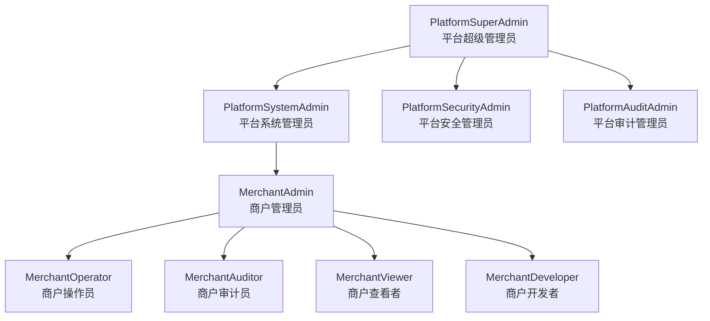

### 23.4 角色与用户的多对多关系

- 一个用户可以拥有多个角色（多对多关系）
- 用户在不同商户下可以拥有不同的角色集合
- 通过 `user_role` 中间表维护用户与角色的多对多关系，字段包括：`user_id`、`role_id`、`tenant_id`、`merchant_id`、`granted_at`、`granted_by`

### 23.5 角色字典注册表

| 字段 | 类型 | 说明 |
|------|------|------|
| `role_code` | String | 角色编码（全局唯一，如 `PlatformSuperAdmin`） |
| `role_name` | String | 角色显示名称 |
| `role_type` | Enum | Platform / Business |
| `scope` | Enum | Global / Merchant |
| `parent_role_code` | String | 父角色编码（用于层级继承） |
| `is_system_builtin` | Boolean | 是否系统内置角色（不可删除） |
| `description` | String | 角色描述 |
| `permissions` | Array(String) | 角色拥有的权限标识列表 |

### 23.6 验收标准

| 编号 | 验收标准 | 验证方法 |
|------|----------|----------|
| AC-ROLE-DICT-01 | 4 个平台级核心角色预置且不可删除 | 尝试删除预置角色验证 |
| AC-ROLE-DICT-02 | 业务级角色可由商户管理员在商户内创建/管理 | 以 MerchantAdmin 身份创建业务角色 |
| AC-ROLE-DICT-03 | SSD 互斥规则在角色分配时自动校验 | 尝试为同一用户分配 PlatformSuperAdmin 和 PlatformAuditAdmin |
| AC-ROLE-DICT-04 | 角色字典在所有模块保持一致（统一权限标识） | 跨模块验证角色编码一致 |

---

## 24. 商户组（Merchant Group）与跨租户白名单

> **已确认**：商户组跨租户白名单机制（BR-07-074~079）本期实现，PRD-12 需补充跨租户权限模型以支撑本功能。

本章定义"商户组"概念，用于支持集团企业多子商户场景下的跨租户白名单与资源共享。

### 24.1 商户组数据模型（MerchantGroup）

| 字段名 | 字段标识 | 类型 | 必填 | 默认值 | 说明 |
|--------|----------|------|------|--------|------|
| 商户组ID | id | UUID | 是 | 系统生成 | 主键 |
| 商户组名称 | name | String(100) | 是 | 无 | 商户组显示名称 |
| 商户组编码 | code | String(50) | 是 | 系统生成，全局唯一 | 系统标识编码 |
| 集团企业名称 | parent_company | String(200) | 否 | 无 | 集团企业（用于显示） |
| 描述 | description | String(500) | 否 | 无 | 商户组用途描述 |
| 状态 | status | Enum | 是 | Active | Active / Inactive |
| 跨租户白名单开关 | cross_tenant_whitelist_enabled | Boolean | 是 | false | 是否启用跨租户白名单 |
| 跨租户白名单成员 | whitelist_members | Array(MerchantRef) | 否 | [] | 允许跨租户访问的商户列表 |
| 创建人 | created_by | UUID | 是 | - | 创建该商户组的平台管理员ID |
| 创建时间 | created_at | DateTime | 是 | 当前时间 | 记录创建时间 |
| 更新时间 | updated_at | DateTime | 是 | 当前时间 | 记录最后更新时间 |
| 软删除标记 | is_deleted | Boolean | 是 | false | 软删除标记（由 deleted_at IS NOT NULL 派生） |
| 删除时间 | deleted_at | DateTime | 否 | null | 软删除时间 |

### 24.2 商户与商户组关联

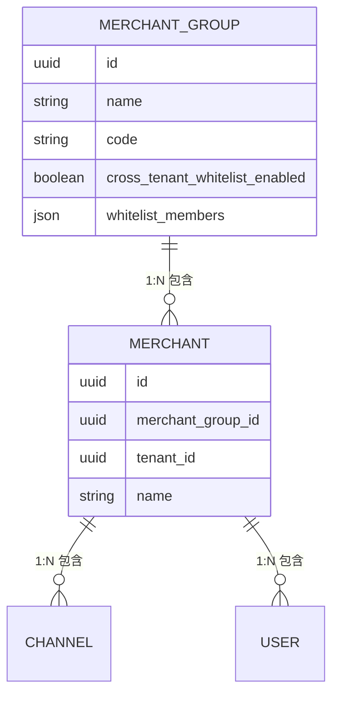

### 24.3 跨租户白名单机制

| 规则编号 | 规则名称 | 规则描述 |
|----------|----------|----------|
| BR-07-074 | 显式加入 | 商户必须显式加入商户组才能享受跨租户白名单 |
| BR-07-075 | 平台管理员管控 | 跨租户白名单的开启与成员维护由平台超级管理员执行 |
| BR-07-076 | 白名单粒度 | 白名单粒度为商户级（而非资源级），白名单成员可访问组内共享资源 |
| BR-07-077 | 审计追踪 | 跨租户访问必须记录审计日志，包括来源商户、目标商户、访问资源、操作人 |
| BR-07-078 | 用户范围 | 跨租户访问权限仅授予商户管理员角色（MerchantAdmin），不授予普通用户 |
| BR-07-079 | 资源范围 | 跨租户可访问资源范围：知识库（只读）、Agent（只读）、编排（只读） |

### 24.4 跨租户访问自动巡检

| 巡检项 | 巡检频率 | 异常处理 |
|--------|----------|----------|
| 跨租户访问尝试扫描 | 每日凌晨 2:00 全量扫描 | 异常访问（未经白名单授权）触发安全告警并自动加入黑名单 |
| 白名单有效性校验 | 每日凌晨 3:00 校验白名单成员状态 | 状态为 Inactive/Cancelled 的商户自动从白名单移除 |
| 商户组成员关系校验 | 每日凌晨 4:00 校验成员关系 | 软删除的商户自动移出商户组 |
| 审计日志完整性 | 实时 | 审计日志缺失或被篡改时触发告警（错误码 200499） |

### 24.5 验收标准

| 编号 | 验收标准 | 验证方法 |
|------|----------|----------|
| AC-MG-01 | 商户组可由平台超级管理员创建，并支持添加/移除子商户 | 创建商户组并管理子商户 |
| AC-MG-02 | 跨租户白名单外的商户无法访问组内其他商户资源 | 模拟白名单外商户访问验证 |
| AC-MG-03 | 跨租户访问全部记录审计日志（来源商户/目标商户/操作人/资源） | 触发跨租户访问后查询审计日志 |
| AC-MG-04 | 每日全量扫描异常跨租户访问并触发告警 | 模拟异常访问验证告警 |

---

## 25. GDPR/CCPA 合规

本章定义商户管理模块在 GDPR（欧盟通用数据保护条例）和 CCPA（加州消费者隐私法案）下的合规要求，包括数据导出、被遗忘权、用户同意管理。

### 25.1 数据导出（Data Portability）

**用户故事**：作为商户管理员，我希望能够一键导出本商户的所有数据，以便在需要时进行数据迁移或合规审计。

**数据导出范围**：

| 数据类型 | 导出格式 | 是否包含 |
|----------|----------|----------|
| 商户基本信息 | JSON | ✅ |
| 渠道列表 | JSON/CSV | ✅ |
| 用户列表 | JSON/CSV | ✅ |
| 角色与权限配置 | JSON | ✅ |
| 主题配置 | JSON | ✅ |
| 配额与使用量 | JSON/CSV | ✅ |
| 操作审计日志 | JSON/CSV | ✅ |
| 知识库元数据 | JSON | ✅（不含文档内容） |
| Agent 配置 | JSON | ✅ |
| 编排配置 | JSON | ✅ |

**导出流程**：

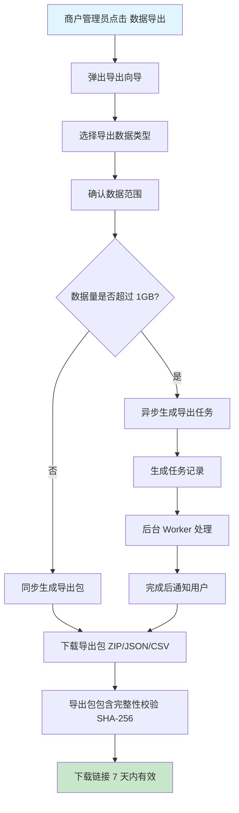

**验收标准**：

| 编号 | 验收标准 | 验证方法 |
|------|----------|----------|
| AC-GDPR-EXP-01 | 商户一键导出所有数据，导出包包含数据完整性校验 | 执行导出并验证 SHA-256 |
| AC-GDPR-EXP-02 | 导出链接 7 天内有效，过期后需重新生成 | 等待 7 天后验证链接失效 |
| AC-GDPR-EXP-03 | 导出操作记录审计日志，包括操作人、导出范围、文件大小 | 执行导出后查询审计日志 |

### 25.2 被遗忘权（Right to be Forgotten）

**用户故事**：作为商户或终端用户，我希望在不再使用服务时能够申请删除个人数据，以便遵守 GDPR 第 17 条规定。

**商户注销流程**：

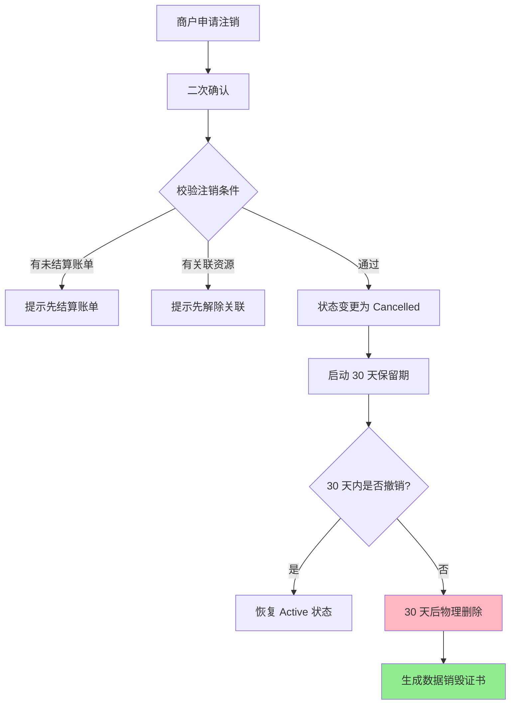

**数据销毁证书**：

- 物理删除完成后系统自动生成 PDF 格式的"数据销毁证书"
- 证书包含：商户ID、商户名称、销毁时间、销毁范围、操作人、SHA-256 校验值
- 证书经平台超级管理员数字签名后归档至冷存储（保留 2555 天/7 年）
- 证书可由商户管理员通过 GraphQL Query `destructionCertificateDownload(merchantId: ID!): PresignedUrlResult!` 获取预签名下载链接

**终端用户被遗忘权**：

| 步骤 | 操作 | 状态变化 |
|------|------|----------|
| 1 | 用户申请注销账户 | 状态：Active → Deactivated |
| 2 | 系统通知用户撤销期 | 14 天内可撤销 |
| 3 | 14 天后自动进入 30 天保留期 | 状态：Deactivated |
| 4 | 30 天后物理删除所有 PII 数据 | 物理删除 |
| 5 | 生成数据销毁证书 | 证书可下载 |

**验收标准**：

| 编号 | 验收标准 | 验证方法 |
|------|----------|----------|
| AC-GDPR-DEL-01 | 商户注销后 30 天内可撤销，恢复 Active 状态 | 申请注销后 30 天内撤销 |
| AC-GDPR-DEL-02 | 30 天后物理删除商户所有数据，无法恢复 | 等待 30 天后尝试恢复 |
| AC-GDPR-DEL-03 | 物理删除后生成不可恢复的数据销毁证书 | 验证证书可下载、内容完整、数字签名有效 |
| AC-GDPR-DEL-04 | 终端用户注销后 PII 数据 30 天内物理删除 | 模拟用户注销后 30 天验证 |

### 25.3 用户同意管理（Consent Management）

**同意类型**：

| 同意类型 | 说明 | 是否必选 |
|----------|------|----------|
| 服务条款同意 | 用户协议 | 必选 |
| 隐私政策同意 | 隐私政策 | 必选 |
| Cookie 同意 | 必要的/分析的/营销的 Cookie 分类 | 可选 |
| 数据处理同意 | 跨境数据传输、第三方共享等 | 必选 |
| 营销同意 | 营销邮件、推广通知 | 可选 |

**隐私政策版本控制**：

- 每次隐私政策更新生成新版本号（v1.0、v1.1、v2.0）
- 重大变更需要用户重新确认（版本号 minor +1 触发）
- 记录用户对每个版本的同意时间和 IP 地址
- 用户可随时撤回同意，撤回后立即生效

**同意记录数据模型**：

| 字段 | 类型 | 说明 |
|------|------|------|
| user_id | UUID | 用户ID |
| consent_type | Enum | 服务条款/隐私政策/Cookie/数据处理/营销 |
| policy_version | String | 隐私政策版本号 |
| granted | Boolean | 是否同意 |
| granted_at | DateTime | 同意时间 |
| granted_ip | String | 同意时 IP |
| revoked_at | DateTime | 撤回时间 |

### 25.4 验收标准

| 编号 | 验收标准 | 验证方法 |
|------|----------|----------|
| AC-GDPR-CON-01 | Cookie 同意分类展示，用户可分别开启/关闭 | 检查 Cookie 同意弹窗 |
| AC-GDPR-CON-02 | 隐私政策重大变更触发用户重新确认 | 升级隐私政策版本验证 |
| AC-GDPR-CON-03 | 用户撤回同意后立即生效（营销邮件立即停止） | 撤回营销同意后验证 |
| AC-GDPR-CON-04 | 所有同意记录可查询、可审计 | 查询同意记录验证完整性 |

---

## 26. BYOK（Bring Your Own Key）机制

本章定义商户自带加密密钥（BYOK）机制，允许商户使用自己的加密密钥保护敏感数据，满足金融、医疗等高合规行业的需求。

### 26.1 BYOK 概述

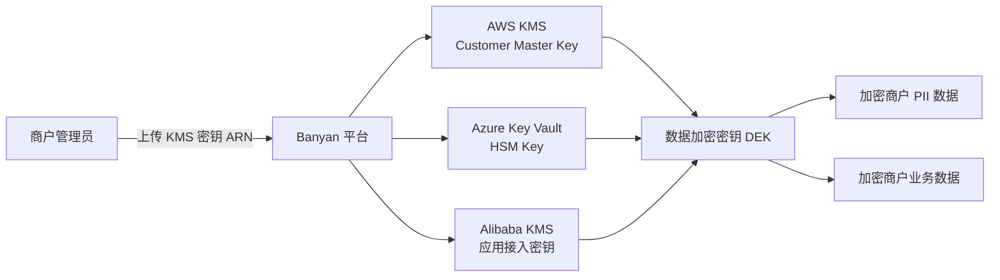

### 26.2 BYOK 配置流程

| 步骤 | 操作 | 说明 |
|------|------|------|
| 1 | 商户管理员进入"密钥管理"页面 | 仅 `MerchantAdmin` 可见 |
| 2 | 选择 KMS 提供商 | 支持 AWS KMS、Azure Key Vault、Alibaba KMS、自建 HSM |
| 3 | 上传/引用 KMS 密钥标识 | 例如 AWS KMS Key ARN |
| 4 | 平台验证密钥可访问性 | 平台使用该密钥加密测试数据，验证可解密 |
| 5 | 确认启用 BYOK | 二次确认 |
| 6 | 商户敏感数据重新加密 | 后台异步任务重新加密所有 PII 数据 |
| 7 | 完成 BYOK 启用 | 记录审计日志 |

### 26.3 BYOK 验证规则

| 规则编号 | 规则名称 | 规则描述 |
|----------|----------|----------|
| BR-07-080 | 权限要求 | 仅 MerchantAdmin 角色可配置 BYOK |
| BR-07-081 | 密钥可访问性 | 平台必须能够访问 KMS 密钥，否则启用失败 |
| BR-07-082 | 密钥轮换 | 商户可随时轮换 KMS 密钥，平台自动重新加密数据。重加密SLA：轮换触发后，数据重加密在 24 小时内完成；重加密期间数据仍可用（使用旧密钥解密）；重加密失败时回滚至旧密钥并告警。**回滚兜底策略**：若旧密钥也已失效导致回滚失败，则：(1) 将受影响数据标记为"重加密异常"状态，该状态数据仅允许只读访问（禁止写入/修改）；(2) 立即触发 P0 级告警，通知运维团队及商户 MerchantAdmin；(3) 运维手动介入，由运维人员确认密钥可用性后重新触发重加密流程或执行数据恢复；(4) 所有回滚失败及手动介入操作均记录审计日志。**部分重加密失败补偿**：若重加密任务部分完成（部分数据已用新密钥加密、部分仍用旧密钥），系统执行以下补偿：(1) 记录重加密进度检查点（每批数据加密后持久化进度），支持从断点续传而非从头重试；(2) 数据解密时按记录的密钥版本选择对应密钥，兼容新旧密钥并存的中间状态；(3) 重加密任务失败后自动重试3次（间隔5分钟/15分钟/30分钟），3次均失败则触发上述回滚兜底策略；(4) 部分重加密状态超过48小时未解决时，升级为P0告警。 |
| BR-07-083 | 密钥撤销 | 商户撤销 KMS 密钥访问后，撤销后 60 秒内新请求被拒绝（缓存 TTL ≤ 60s）；已有连接在 300 秒内断开（连接最大存活期 5 分钟）；撤销操作不可逆。 |
| BR-07-084 | 审计日志 | BYOK 启用/变更/撤销全部记录审计日志 |
| BR-07-085 | 双重加密 | BYOK 与平台默认密钥可叠加使用（Envelope Encryption） |

### 26.4 验收标准

| 编号 | 验收标准 | 验证方法 |
|------|----------|----------|
| AC-BYOK-01 | MerchantAdmin 可成功配置 BYOK，平台验证密钥可访问 | 配置 AWS KMS 密钥并验证 |
| AC-BYOK-02 | BYOK 启用后该商户的 PII 数据使用商户密钥加密 | 验证加密数据使用商户密钥 |
| AC-BYOK-03 | 商户撤销 KMS 密钥访问后，60秒内新请求被拒绝，300秒内已有连接断开；撤销操作在24小时内完成合规审计确认 | 撤销后访问验证 + 审计日志确认 |
| AC-BYOK-04 | BYOK 配置变更全部记录审计日志 | 查询审计日志 |

---

## 27. 租户级密钥管理

本章定义平台为每个商户分配独立加密密钥的租户级密钥管理机制，与 BYOK 形成两层密钥体系（平台默认 + BYOK）。

### 27.1 密钥层次

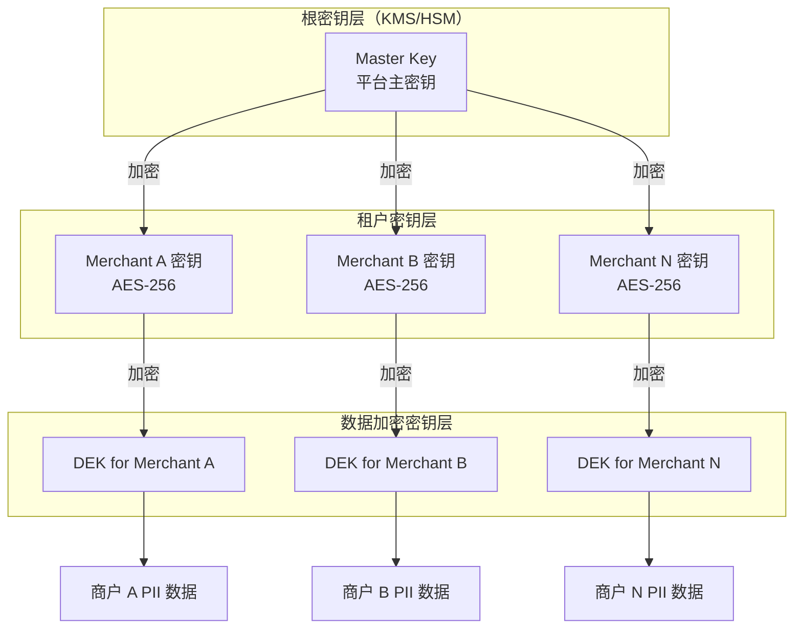

### 27.2 密钥规范

| 密钥类型 | 算法 | 长度 | 存储位置 | 轮换周期 |
|----------|------|------|----------|----------|
| 平台主密钥（MK） | AES-256-GCM | 256 位 | HSM（AWS CloudHSM / Azure Dedicated HSM） | 每年 |
| 租户密钥（TK） | AES-256-GCM | 256 位 | 由 MK 加密后存储于数据库 | 每季度 |
| 数据加密密钥（DEK） | AES-256-GCM | 256 位 | 由 TK 加密后随数据存储 | 每次写入 |

### 27.3 密钥管理接口

| 接口编号 | 接口名称 | 类型 | GraphQL | 权限要求 |
|----------|----------|------|---------|----------|
| KM-API-001 | 获取当前租户密钥信息 | Query | tenantKeyInfo(id: ID!) | `merchant:merchant:read` |
| KM-API-002 | 轮换租户密钥 | Mutation | rotateTenantKey(id: ID!) | `merchant:merchant:update`（限定 MerchantAdmin） |
| KM-API-003 | 获取密钥审计日志 | Query | keyAuditLogs(id: ID!) | `merchant:audit:read` |
| KM-API-004 | 撤销租户密钥 | Mutation | revokeTenantKey(id: ID!) | `merchant:merchant:update`（限定 MerchantAdmin） |

### 27.4 验收标准

| 编号 | 验收标准 | 验证方法 |
|------|----------|----------|
| AC-TK-01 | 每个商户使用独立的 AES-256 密钥加密 | 验证不同商户使用不同密钥 |
| AC-TK-02 | 租户密钥每季度自动轮换，后台异步重新加密数据 | 触发轮换并验证数据可解密 |
| AC-TK-03 | 平台主密钥存储于 HSM，不可导出 | 检查 HSM 配置 |
| AC-TK-04 | 租户密钥轮换全部记录审计日志 | 查询审计日志 |

---

## 28. 租户数据迁移工具

本章定义租户数据迁移工具，支持商户在需要时（迁云、合规审计、数据备份恢复）导出/导入完整租户数据。

### 28.1 数据迁移包规范

| 数据包组件 | 格式 | 必选 | 说明 |
|-----------|------|------|------|
| manifest.json | JSON | 是 | 数据包元信息：商户ID、版本号、导出时间、SHA-256 |
| merchant.json | JSON | 是 | 商户基本信息 |
| channels/ | 目录（JSON） | 是 | 渠道配置 |
| users/ | 目录（CSV + JSON） | 是 | 用户列表（CSV）+ 详情（JSON） |
| roles/ | 目录（JSON） | 是 | 角色与权限配置 |
| themes/ | 目录（JSON） | 是 | 主题配置 |
| quotas/ | 目录（JSON） | 是 | 配额配置 |
| audit_logs/ | 目录（CSV） | 否 | 审计日志 |
| knowledge/ | 目录（JSON） | 否 | 知识库元数据 |
| agents/ | 目录（JSON） | 否 | Agent 配置 |
| orchestrations/ | 目录（JSON） | 否 | 编排配置 |
| reports/ | 目录（PDF） | 否 | 数据统计报告 |

### 28.2 导出工具

**GraphQL Mutation**：`exportMerchantData(input: ExportMerchantDataInput!): ExportTaskResult!`

**请求参数**：

| 参数 | 类型 | 必填 | 说明 |
|------|------|------|------|
| includeOptions | Array(Enum) | 否 | 包含的数据类型，不传则导出全部 |
| format | Enum | 是 | JSON / CSV / PDF / ZIP |
| encryptionEnabled | Boolean | 是 | 是否加密（推荐 true） |
| encryptionKey | String | 否 | 加密密钥（BYOK 场景下使用） |

**响应**：

| 参数 | 类型 | 说明 |
|------|------|------|
| taskId | UUID | 异步任务ID |
| downloadUrl | String | 下载链接（7 天内有效） |
| expiresAt | DateTime | 链接过期时间 |
| sha256 | String | 数据包 SHA-256 校验值 |

### 28.3 导入工具

**GraphQL Mutation**：`importMerchantData(input: ImportMerchantDataInput!): ImportTaskResult!`

**前置校验**：

| 校验项 | 说明 |
|--------|------|
| 数据包格式 | 必须为标准迁移包格式 |
| 完整性校验 | 验证 SHA-256 一致性 |
| 加密校验 | 加密包需提供解密密钥 |
| 目标商户存在 | 目标商户必须存在且为 Active 状态 |
| 数据冲突 | 检测名称/编码冲突，提供冲突解决策略（跳过/覆盖/重命名） |

### 28.4 验收标准

| 编号 | 验收标准 | 验证方法 |
|------|----------|----------|
| AC-MIG-01 | 商户可一键导出完整数据包，包含 manifest 和所有数据 | 执行导出并验证包内容 |
| AC-MIG-02 | 数据包 SHA-256 校验值与 manifest 一致 | 验证校验值 |
| AC-MIG-03 | 加密数据包需正确解密后才能导入 | 导入加密包验证 |
| AC-MIG-04 | 导入前检测数据冲突并提供解决策略 | 制造冲突验证 |

---

## 29. 软删除数据销毁证书

本章定义软删除数据销毁证书机制，确保商户数据在物理删除后提供不可恢复的证明，满足 GDPR、SOX 等合规要求。

### 29.1 销毁证书规范

| 字段 | 类型 | 说明 |
|------|------|------|
| certificateId | UUID | 证书唯一标识 |
| merchantId | UUID | 被销毁数据的商户ID |
| merchantName | String | 被销毁数据的商户名称 |
| tenantId | UUID | 租户ID |
| destructionType | Enum | MerchantForgotten / UserForgotten / Scheduled |
| destructionScope | Array(String) | 销毁范围（如：merchant_info, users, channels, audit_logs） |
| scheduledAt | DateTime | 计划销毁时间 |
| executedAt | DateTime | 实际销毁时间 |
| executorId | UUID | 执行销毁的操作人ID（系统任务则为 System） |
| dataInventory | Array(DataItem) | 销毁前数据清单（数据条数、存储位置、SHA-256） |
| sha256Before | String | 销毁前数据指纹 |
| sha256After | String | 销毁后数据指纹（应为空） |
| digitalSignature | String | 平台超级管理员数字签名（RSA-2048） |
| archivedAt | DateTime | 归档时间 |
| retentionExpiresAt | DateTime | 证书保留到期时间（销毁后 2555 天） |

### 29.2 销毁证书生成流程

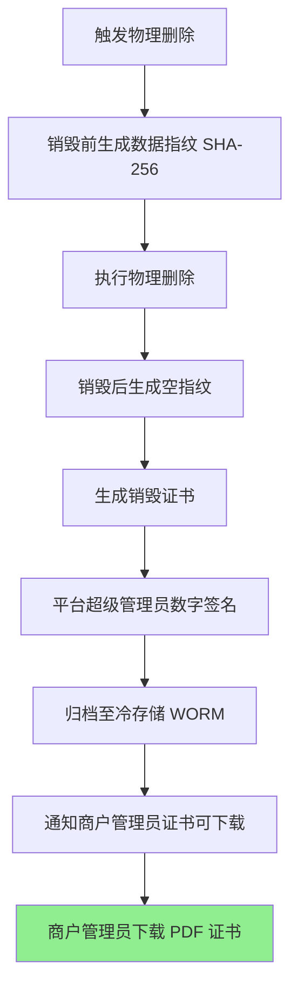

### 29.3 证书下载接口

| 接口 | 类型 | GraphQL | 权限 |
|------|------|---------|------|
| 获取销毁证书列表 | Query | destructionCertificates(merchantId: ID!) | `merchant:merchant:read` |
| 下载销毁证书 PDF | Query | destructionCertificateDownload(merchantId: ID!, certId: ID!) | `merchant:merchant:read` |
| 验证销毁证书签名 | Mutation | verifyDestructionSignature(input: VerifySignatureInput!) | `merchant:audit:read` |

### 29.4 验收标准

| 编号 | 验收标准 | 验证方法 |
|------|----------|----------|
| AC-DEST-01 | 物理删除商户 30 天后自动生成销毁证书 | 等待 30 天后查询证书 |
| AC-DEST-02 | 销毁证书包含完整数据清单、SHA-256 指纹、平台签名 | 验证证书内容 |
| AC-DEST-03 | 销毁证书 PDF 经数字签名验证为真实 | 使用平台公钥验证签名 |
| AC-DEST-04 | 销毁证书在冷存储保留 2555 天 | 验证证书可查询时间范围 |

---

## 30. 跨租户访问自动巡检

本章定义平台对跨租户访问的自动巡检机制，确保多租户隔离的完整性和有效性。

### 30.1 巡检任务定义

| 任务编号 | 任务名称 | 巡检频率 | 巡检范围 | 异常处理 |
|----------|----------|----------|----------|----------|
| TC-INSP-001 | 跨租户访问尝试扫描 | 每日 02:00 | 全部访问日志 | 异常加入黑名单并告警 |
| TC-INSP-002 | 租户数据隔离渗透测试 | 每周日 03:00 | 数据库 ORM 查询 | 发现缺失 tenant_id 过滤则告警 |
| TC-INSP-003 | 商户组白名单有效性 | 每日 04:00 | 所有商户组 | 失效成员自动移除并通知 |
| TC-INSP-004 | 审计日志完整性 | 实时 | 审计日志表 | 缺失或被篡改触发告警（200499） |
| TC-INSP-005 | 软删除数据残留扫描 | 每周一 02:00 | 已软删除超过 30 天的数据 | 未物理删除的触发告警 |
| TC-INSP-006 | 密钥轮换合规性 | 每日 05:00 | 全部租户密钥 | 超过轮换周期触发告警 |
| TC-INSP-007 | 跨租户引用检测 | 每日 06:00 | 编排/Agent/知识的引用关系 | 跨租户引用触发告警 |

### 30.2 巡检报告

每日巡检完成后生成巡检报告，包含：

| 报告项 | 说明 |
|--------|------|
| 巡检时间 | 巡检任务执行时间 |
| 巡检范围 | 覆盖的模块/表/资源 |
| 异常总数 | 发现的异常数量 |
| 异常详情 | 每条异常的描述、影响范围、严重级别 |
| 处理建议 | 针对每条异常的处理建议（自动修复/人工介入） |
| 趋势分析 | 与昨日/上周同期对比的异常趋势 |

### 30.3 异常处理 SLA

| 异常级别 | 响应时间 | 处理时间 | 通知方式 |
|----------|----------|----------|----------|
| P0-严重 | 5 分钟 | 1 小时 | 短信 + 电话 + 邮件 + 钉钉 |
| P1-高 | 15 分钟 | 4 小时 | 短信 + 邮件 + 钉钉 |
| P2-中 | 1 小时 | 24 小时 | 邮件 + 钉钉 |
| P3-低 | 24 小时 | 7 天 | 邮件 |

### 30.4 验收标准

| 编号 | 验收标准 | 验证方法 |
|------|----------|----------|
| AC-INSP-01 | 每日全量扫描跨租户访问尝试并生成报告 | 查看巡检报告 |
| AC-INSP-02 | 异常跨租户访问自动加入黑名单并触发告警 | 模拟异常访问验证告警 |
| AC-INSP-03 | 巡检任务失败时自动重试 3 次，最终失败触发告警 | 模拟巡检失败验证重试 |
| AC-INSP-04 | 巡检报告可导出 PDF/CSV | 导出报告验证 |

---

## SilvaEngine 实施附录

> **版本**: 2.0.0(SilvaEngine 架构重写版)
> **生效日期**: 2026-06-09
> **本附录基于**: [`PRD-00 平台总览与全局规范 v2.0.0`](./PRD-00-平台总览与全局规范.md) §15-§17
> **强制级别**: P0

### A1. 模块身份与依赖

| 项 | 值 |
|------|------|
| **模块名** | `merchant` |
| **包名** | `silvaengine_modules.merchant` |
| **Graphene 入口** | `silvaengine_modules.merchant.schema:Schema` |
| **Lambda 函数** | `arn:aws:lambda:us-east-1:123456789012:function:banyan-merchant-resolver` |
| **endpoint_id** | `merchant-endpoint` |
| **依赖模块** | PRD-12(权限,租户授权) |
| **下游模块** | 所有模块(提供 `partition_key` 来源) |

### A2. ConnectionPoolManager 池声明

| 池名 | 类型 | 用途 |
|------|------|------|
| `postgres_main` | postgresql | 商户主表、订阅、API Key、配额 |
| `postgres_audit` | postgresql | 商户审计 |
| `neo4j_main` | neo4j | 商户-用户-角色关系图 |
| `httpx_payment` | httpx | 支付网关(订阅扣费) |
| `httpx_sms` | httpx | SMS 通知(签约通知) |
| `httpx_email` | httpx | Email 通知(账单) |
| `redis_cache` | redis | 商户配置缓存、配额计数 |
| `boto3_kms` | boto3 | API Key / 密钥加密 |

### A3. PostgreSQL 表

> **RLS & 触发器声明**: 本模块所有 `tenant_*` / `sys_*` 租户级表均启用 PostgreSQL RLS 策略和 `set_partition_key_from_session()` 触发器，遵循 PRD-00 §7.2 强制规范。

| 表名 | 复合主键 | 用途 |
|------|----------|------|
| `sys_tenant_merchant` | `(partition_key, id)` | 商户主表(注:`partition_key` 即自身) |
| `sys_tenant_subscription_plan` | `(id)` | 订阅计划(平台级) |

> ⚠️ **本期不实现**：订阅与计费功能标记为本期不实现（见文档头声明），相关DDL/接口仅供架构参考，开发阶段不实施。

| `sys_tenant_subscription` | `(partition_key, id)` | 商户订阅 |

> ⚠️ **本期不实现**：订阅与计费功能标记为本期不实现（见文档头声明），相关DDL/接口仅供架构参考，开发阶段不实施。

| `sys_tenant_billing_record` | `(partition_key, id)` | 账单 |

> ⚠️ **本期不实现**：订阅与计费功能标记为本期不实现（见文档头声明），相关DDL/接口仅供架构参考，开发阶段不实施。
| `sys_tenant_payment_method` | `(partition_key, id)` | 支付方式 |
| `sys_tenant_api_key` | `(partition_key, id)` | API Key |
| `sys_tenant_quota` | `(partition_key, id)` | 资源配额 |
| `sys_tenant_inspection` | `(partition_key, id)` | 巡检任务 |
| `sys_tenant_notification` | `(partition_key, id)` | 通知配置 |
| `audit_merchant_logs` | `(partition_key, id)` | 审计 WORM（以 DDL §7.7.5 为准） |

> **铁律**:`sys_tenant_*` 表虽然是平台级,但是 `partition_key` 仍为商户 ID,Gateway 通过商户 ID 直接路由。

```sql
-- ============================================================
-- RLS & Trigger: tenant-level tables (PRD-00 §7.2)
-- ============================================================

-- sys_tenant_merchant
CREATE TRIGGER trg_sys_tenant_merchant_partition_key
  BEFORE INSERT ON sys_tenant_merchant
  FOR EACH ROW EXECUTE FUNCTION set_partition_key_from_session();
ALTER TABLE sys_tenant_merchant ENABLE ROW LEVEL SECURITY;
CREATE POLICY tenant_isolation_sys_tenant_merchant ON sys_tenant_merchant
  USING (partition_key = current_setting('app.current_tenant_id', TRUE));

-- ⚠️ 本期不实现：订阅与计费功能标记为本期不实现（见文档头声明），相关DDL/接口仅供架构参考，开发阶段不实施。
-- sys_tenant_subscription
CREATE TRIGGER trg_sys_tenant_subscription_partition_key
  BEFORE INSERT ON sys_tenant_subscription
  FOR EACH ROW EXECUTE FUNCTION set_partition_key_from_session();
ALTER TABLE sys_tenant_subscription ENABLE ROW LEVEL SECURITY;
CREATE POLICY tenant_isolation_sys_tenant_subscription ON sys_tenant_subscription
  USING (partition_key = current_setting('app.current_tenant_id', TRUE));

-- ⚠️ 本期不实现：订阅与计费功能标记为本期不实现（见文档头声明），相关DDL/接口仅供架构参考，开发阶段不实施。
-- sys_tenant_billing_record
CREATE TRIGGER trg_sys_tenant_billing_record_partition_key
  BEFORE INSERT ON sys_tenant_billing_record
  FOR EACH ROW EXECUTE FUNCTION set_partition_key_from_session();
ALTER TABLE sys_tenant_billing_record ENABLE ROW LEVEL SECURITY;
CREATE POLICY tenant_isolation_sys_tenant_billing_record ON sys_tenant_billing_record
  USING (partition_key = current_setting('app.current_tenant_id', TRUE));

-- sys_tenant_payment_method
CREATE TRIGGER trg_sys_tenant_payment_method_partition_key
  BEFORE INSERT ON sys_tenant_payment_method
  FOR EACH ROW EXECUTE FUNCTION set_partition_key_from_session();
ALTER TABLE sys_tenant_payment_method ENABLE ROW LEVEL SECURITY;
CREATE POLICY tenant_isolation_sys_tenant_payment_method ON sys_tenant_payment_method
  USING (partition_key = current_setting('app.current_tenant_id', TRUE));

-- sys_tenant_api_key
CREATE TRIGGER trg_sys_tenant_api_key_partition_key
  BEFORE INSERT ON sys_tenant_api_key
  FOR EACH ROW EXECUTE FUNCTION set_partition_key_from_session();
ALTER TABLE sys_tenant_api_key ENABLE ROW LEVEL SECURITY;
CREATE POLICY tenant_isolation_sys_tenant_api_key ON sys_tenant_api_key
  USING (partition_key = current_setting('app.current_tenant_id', TRUE));

-- sys_tenant_quota
CREATE TRIGGER trg_sys_tenant_quota_partition_key
  BEFORE INSERT ON sys_tenant_quota
  FOR EACH ROW EXECUTE FUNCTION set_partition_key_from_session();
ALTER TABLE sys_tenant_quota ENABLE ROW LEVEL SECURITY;
CREATE POLICY tenant_isolation_sys_tenant_quota ON sys_tenant_quota
  USING (partition_key = current_setting('app.current_tenant_id', TRUE));

-- sys_tenant_inspection
CREATE TRIGGER trg_sys_tenant_inspection_partition_key
  BEFORE INSERT ON sys_tenant_inspection
  FOR EACH ROW EXECUTE FUNCTION set_partition_key_from_session();
ALTER TABLE sys_tenant_inspection ENABLE ROW LEVEL SECURITY;
CREATE POLICY tenant_isolation_sys_tenant_inspection ON sys_tenant_inspection
  USING (partition_key = current_setting('app.current_tenant_id', TRUE));

-- sys_tenant_notification
CREATE TRIGGER trg_sys_tenant_notification_partition_key
  BEFORE INSERT ON sys_tenant_notification
  FOR EACH ROW EXECUTE FUNCTION set_partition_key_from_session();
ALTER TABLE sys_tenant_notification ENABLE ROW LEVEL SECURITY;
CREATE POLICY tenant_isolation_sys_tenant_notification ON sys_tenant_notification
  USING (partition_key = current_setting('app.current_tenant_id', TRUE));
```

> ⚠️ **本期不实现**：`sys_tenant_subscription_plan`（平台级，主键为 `(id)`）不含 `partition_key`，不启用 RLS 策略。该表属订阅与计费功能，标记为本期不实现（见文档头声明），相关DDL仅供架构参考，开发阶段不实施。`audit_merchant_logs`（审计 WORM，主键为 `(partition_key, id)`，已启用 RLS 策略，以 DDL §7.7.5 为准）。

### A4. Neo4j 节点与关系

> 节点标签遵循 PRD-00 §3.5.5 三标签组合规范：`MerchantEntity` 基础标签 + 业务节点标签 + `Graph` 租户标签，租户隔离通过 `partition_key` 属性 + WHERE 子句实现。

| 节点 | 标签 | 必含属性 |
|------|------|----------|
| `Tenant` | `MerchantEntity:Tenant:Graph` | `partition_key` / `name` / `status` / `plan` |
| `SubscriptionPlan` | `MerchantEntity:SubscriptionPlan:Graph` | `partition_key` / `name` / `tier` |

> ⚠️ **本期不实现**：订阅与计费功能标记为本期不实现（见文档头声明），相关DDL/接口仅供架构参考，开发阶段不实施。
| `User` | 复用 PRD-08 | - |
| `Role` | 复用 PRD-12 | - |

| 关系 | 类型 | 起点 → 终点 |
|------|------|-------------|
| `TENANT_SUBSCRIBED_TO` | `TENANT_SUBSCRIBED_TO` | `Tenant` → `SubscriptionPlan` |

> ⚠️ **本期不实现**：订阅与计费功能标记为本期不实现（见文档头声明），相关DDL/接口仅供架构参考，开发阶段不实施。
| `TENANT_OWNS_USER` | `TENANT_OWNS_USER` | `Tenant` → `User` |
| `USER_ASSIGNED_ROLE` | `USER_ASSIGNED_ROLE` | `User` → `Role`(复用 PRD-12) |

### A5. GraphQL Schema 映射

#### A5.1 Query 列表

| GraphQL Query | 返回 | 说明 |
|----------------|------|------|
| `merchant` | `MerchantType` | 当前租户信息(从 `info.context["partition_key"]`) |
| `subscriptionPlans` | `[SubscriptionPlanType]` | 订阅计划 |

> ⚠️ **本期不实现**：订阅与计费功能标记为本期不实现（见文档头声明），相关DDL/接口仅供架构参考，开发阶段不实施。

| `subscription` | `SubscriptionType` | 当前订阅 |

> ⚠️ **本期不实现**：订阅与计费功能标记为本期不实现（见文档头声明），相关DDL/接口仅供架构参考，开发阶段不实施。

| `billingRecords(filter, first, after)` | `BillingRecordConnection` | 账单列表 |

> ⚠️ **本期不实现**：订阅与计费功能标记为本期不实现（见文档头声明），相关DDL/接口仅供架构参考，开发阶段不实施。
| `paymentMethods` | `[PaymentMethodType]` | 支付方式 |
| `apiKey(id: ID!)` | `ApiKeyType` | API Key 详情(脱敏) |
| `apiKeys(filter)` | `[ApiKeyType]` | API Key 列表 |
| `quota` | `QuotaType` | 当前配额 |
| `inspections(filter, first, after)` | `InspectionConnection` | 巡检任务列表 |
| `inspection(id: ID!)` | `InspectionType` | 巡检详情 |

#### A5.2 Mutation 列表

| GraphQL Mutation | 输入 | 返回 |
|------------------|------|------|
| `updateMerchant(input, idempotencyKey)` | `MerchantUpdateInput` | `MerchantType` |
| `createSubscription(input, idempotencyKey)` | `SubscriptionCreateInput` | `SubscriptionType` |

> ⚠️ **本期不实现**：订阅与计费功能标记为本期不实现（见文档头声明），相关DDL/接口仅供架构参考，开发阶段不实施。

| `cancelSubscription(reason, idempotencyKey)` | - | `SubscriptionType` |

> ⚠️ **本期不实现**：订阅与计费功能标记为本期不实现（见文档头声明），相关DDL/接口仅供架构参考，开发阶段不实施。
| `addPaymentMethod(input, idempotencyKey)` | `PaymentMethodInput` | `PaymentMethodType` |
| `removePaymentMethod(id, idempotencyKey)` | - | `DeletePayload` |

> ⚠️ **本期不实现**：支付方式管理功能属订阅与计费范畴，标记为本期不实现（见文档头声明），相关DDL/接口仅供架构参考，开发阶段不实施。

| `createApiKey(input, idempotencyKey)` | `ApiKeyCreateInput` | `ApiKeyType`(返回明文一次) |
| `revokeApiKey(id, idempotencyKey)` | - | `DeletePayload` |
| `rotateApiKey(id, idempotencyKey)` | - | `ApiKeyType` |
| `updateQuota(input, idempotencyKey)` | `QuotaUpdateInput` | `QuotaType` |
| `triggerInspection(input, idempotencyKey)` | `InspectionInput` | `InspectionType` |
| `exportInspectionReport(inspectionId)` | - | `ExportTask` |

#### A5.3 关键 ObjectType

| 类型 | 关键字段 | DataLoader |
|------|----------|------------|
| `MerchantType` | `id` / `name` / `code` / `plan` / `status` / `subscription` / `quota` / `paymentMethods` | `subscription` / `quota` |
| `SubscriptionType` | `id` / `plan` / `status` / `startedAt` / `endsAt` / `autoRenew` | `plan` |

> ⚠️ **本期不实现**：订阅与计费功能标记为本期不实现（见文档头声明），相关DDL/接口仅供架构参考，开发阶段不实施。

| `BillingRecordType` | `id` / `amount` / `currency` / `status` / `period` | - |

> ⚠️ **本期不实现**：订阅与计费功能标记为本期不实现（见文档头声明），相关DDL/接口仅供架构参考，开发阶段不实施。

| `PaymentMethodType` | `id` / `type` (CARD/BANK/PAYPAL) / `last4` / `isDefault` | - |

> ⚠️ **本期不实现**：支付方式功能属订阅与计费范畴，标记为本期不实现（见文档头声明），相关DDL/接口仅供架构参考，开发阶段不实施。

| `ApiKeyType` | `id` / `name` / `prefix` / `last4` / `scopes` / `expiresAt` / `lastUsedAt` | - |
| `QuotaType` | `maxUsers` / `maxAgents` / `maxKnowledgeEntries` / `used` | - |
| `InspectionType` | `id` / `name` / `status` / `result` / `report` | - |

### A6. config.json 模板(摘要)

```json
{
  "module": {
    "name": "merchant",
    "version": "2.0.0",
    "owner": "merchant-team",
    "graphene": { "schema_entry": "silvaengine_modules.merchant.schema:Schema" }
  },
  "pools": {
    "postgres_main": { "type": "postgresql", "settings": { "host": "${env:PG_MAIN_HOST}",  "database": "banyan_main" } },
    "postgres_audit":{ "type": "postgresql", "settings": { "host": "${env:PG_AUDIT_HOST}", "database": "banyan_audit" } },
    "neo4j_main":    { "type": "neo4j",      "settings": { "uri": "${env:NEO4J_URI}" } },
    "httpx_payment": { "type": "httpx",      "settings": { "base_url": "${env:PAYMENT_URL}", "timeout": 30 } },
    "httpx_sms":     { "type": "httpx",      "settings": { "base_url": "${env:SMS_URL}",     "timeout": 10 } },
    "httpx_email":   { "type": "httpx",      "settings": { "base_url": "${env:EMAIL_URL}",   "timeout": 10 } },
    "redis_cache":   { "type": "redis",      "settings": { "host": "${env:REDIS_HOST}", "db": 0 } },
    "boto3_kms":     { "type": "boto3",      "settings": { "service_name": "kms", "region_name": "${env:AWS_REGION}" } }
  },
  "plugins": [
    { "type": "connection_pool", "module_name": "silvaengine_connections", "config": { "pool": "postgres_main" }, "enabled": true },
    { "type": "connection_pool", "module_name": "silvaengine_connections", "config": { "pool": "postgres_audit"}, "enabled": true },
    { "type": "connection_pool", "module_name": "silvaengine_connections", "config": { "pool": "neo4j_main"    }, "enabled": true },
    { "type": "connection_pool", "module_name": "silvaengine_connections", "config": { "pool": "httpx_payment" }, "enabled": true },
    { "type": "connection_pool", "module_name": "silvaengine_connections", "config": { "pool": "httpx_sms"     }, "enabled": true },
    { "type": "connection_pool", "module_name": "silvaengine_connections", "config": { "pool": "httpx_email"   }, "enabled": true },
    { "type": "connection_pool", "module_name": "silvaengine_connections", "config": { "pool": "redis_cache"   }, "enabled": true },
    { "type": "connection_pool", "module_name": "silvaengine_connections", "config": { "pool": "boto3_kms"     }, "enabled": true }
  ],
  "settings": {
    "merchant.default.quota": {
      "setting_id": "merchant.default.quota",
      "variables": {
        "free_plan_max_users":        { "name": "free_plan_max_users",        "type": "int", "value": 5 },
        "free_plan_max_agents":       { "name": "free_plan_max_agents",       "type": "int", "value": 3 },
        "free_plan_max_kb_entries":   { "name": "free_plan_max_kb_entries",   "type": "int", "value": 1000 },
        "trial_period_days":          { "name": "trial_period_days",          "type": "int", "value": 14 }
      }
    }
  },
  "functions": [
    {
      "aws_lambda_arn": "arn:aws:lambda:us-east-1:123456789012:function:banyan-merchant-resolver",
      "function": "merchant_resolver",
      "area": "merchant",
      "config": {
        "module_name": "silvaengine_modules.merchant",
        "class_name": "MerchantResolver",
        "setting": "merchant.default.quota",
        "graphql": true,
        "operations": {
          "query": ["merchant", "subscriptionPlans", "subscription", "billingRecords",
                   "paymentMethods", "apiKey", "apiKeys", "quota",
                   "inspections", "inspection"],
          "mutation": ["updateMerchant", "createSubscription", "cancelSubscription",
                      "addPaymentMethod", "removePaymentMethod",
                      "createApiKey", "revokeApiKey", "rotateApiKey",
                      "updateQuota", "triggerInspection", "exportInspectionReport"]
        }
// ⚠️ 本期不实现：subscriptionPlans / subscription / billingRecords / paymentMethods（Query）
// 及 createSubscription / cancelSubscription / addPaymentMethod / removePaymentMethod（Mutation）
// 属订阅与计费功能，标记为本期不实现（见文档头声明），开发阶段不实施。
      },
      "auth_required": true
    }
  ],
  "endpoints": [
    { "endpoint_id": "merchant-endpoint", "special_connection": false }
  ],
  "runtime": { "memory_mb": 512, "timeout_seconds": 60 }
}
```

### A7. 错误码段位

| 段位 | 用途 |
|------|------|
| `BIZ_MERCHANT_*` | 商户主表 CRUD、状态 |
| `BIZ_TENANT_*` | 租户通用 |
| `BIZ_SUBSCRIPTION_*` | 订阅、计费、续费 |
| `BIZ_PAYMENT_*` | 支付、失败、退款 |
| `BIZ_BILLING_*` | 账单、发票 |
| `BIZ_API_KEY_*` | API Key 创建、撤销、轮换 |
| `BIZ_QUOTA_*` | 配额超限 |
| `BIZ_INSPECTION_*` | 巡检任务 |
| `BIZ_CHANNEL_*` | 渠道编码唯一性、渠道不存在、渠道状态冲突 |

### A8. 实施检查清单

- [ ] `config.json` 通过校验
- [ ] 8 个 `pools` 与 8 个 `plugins` 1:1 对应
- [ ] 所有 SQLAlchemy 模型复合主键 `(partition_key, id)`
- [ ] 所有 Cypher 查询带 `WHERE n.partition_key = $partitionKey`（遵循 PRD-00 §3.5.5 铁律）
- [ ] API Key 通过 KMS 加密(`boto3_kms`)
- [ ] API Key 明文仅在创建时一次性返回
- [ ] 配额计数走 Redis 原子操作
- [ ] 错误码 `BIZ_MERCHANT_*` 已注册
- [ ] `validation_runner.py` 0 errors / 0 warnings

---

*文档结束*

*文档结束*
