# PRD-08 用户管理模块

> **版本**: V3.0（v3.0 收束版 2026-06-13）
> **v3.0 变更说明**:文档头刷新为 V3.0；错误码段位与 PRD-00 §5.3.2.1.1 增补条目对齐
> **重要变更通知(2026-06-09)**:依据 [PRD-00 平台总览与全局规范 §2.4 关键决策:权限管理归并](file:///Users/Garabateador/Workspace/banyan/PRD/PRD-00-平台总览与全局规范.md),本模块已完成职责收束
>
> **本模块保留职责**:用户基础信息管理 + 用户认证凭证 + MFA 因子 + 会话管理
>
> **已迁移至 PRD-12 权限管理 的内容**（原文已替换为弃用声明，请以 PRD-12 为权威来源）:
> - 角色管理(原 §4.4)→ **PRD-12 §8.2**
> - 角色层级继承(原 §4.5)→ **PRD-12 §8.2.5**
> - SSD/DSD 规则(原 §4.6)→ **PRD-12 §8.2.4**
> - 权限批量配置(原 §4.7)→ **PRD-12 §8.4**
> - 角色复制模板(原 §4.8)→ **PRD-12 §8.2**
> - 用户组管理(原 §4.9-4.12)→ **PRD-12 §8.11**
> - 密码策略升级(原 §19)→ **PRD-12 §13.1.1**
> - OAuth/OIDC/SAML 单点登录(原 §20)→ **PRD-12 §13.1.2**
> - GDPR/CCPA 合规(原 §21)→ **PRD-12 §13.3**
> - MFA 强制策略(原 §23)→ **PRD-12 §8.10**
> - 会话固定保护(原 §24)→ **PRD-12 §13.5**
> - 权限查询与诊断(原 §17)→ **PRD-12 §8.7**
> - PII 字段级加密(原 §18.1)→ **PRD-12 §13.3**
> - 审计日志 WORM 存储(原 §18.3)→ **PRD-12 §8.8**
> - 角色数据模型(原 §8.2)→ **PRD-12 §11.2**
>
> **待迁移至其他模块的内容**（当前版本仍保留在本文档）:
> - 用户与商户关联(原 §4.13)→ **PRD-07 §11**
> - CSRF/CORS 防护(原 §25)→ **PRD-00 §9.4**
> - 全局安全规范(原 §18)→ **PRD-00 §9**
>
> **本模块当前定位**:遵循 PRD-00 §1 设计原则「单一职责」与「高内聚低耦合」原则,聚焦「用户基本信息 + 身份凭证 + 会话生命周期」,权限相关内容统一由 PRD-12 承接
>
> **遵循规范**:[PRD-00 平台总览与全局规范](file:///Users/Garabateador/Workspace/banyan/PRD/PRD-00-平台总览与全局规范.md) - 接口规范(§4)、错误码(§5)、非功能需求(§6)、数据规范(§7)、安全基线(§9)
>
> **上游依赖**:PRD-07(商户)（以 §A1 权威表为准）
> **下游被依赖**:PRD-12(权限)（以 §A1 权威表为准）
> **错误码命名空间**:`BIZ_USER_*` / `BIZ_AUTH_*` | 数字段位:`100001-109999`（与 PRD-00 §5.3.2.1 权威分配表一致）
> **对外接口**:GraphQL (POST /graphql) | Gateway内部路由:N/A（GraphQL单总线）

---

## 1. 文档信息

| 项目 | 内容 |
|------|------|
| 文档编号 | PRD-08 |
| 模块名称 | 用户管理模块(User Management) |
| 版本 | V3.0(2026-06-13 v3.0收束) |
| 创建日期 | 2026-06-08 |
| 最后更新 | 2026-06-13 |
| 文档负责人 | 产品经理 |
| 状态 | 收束重构中 |
| 关联文档 | [PRD-00 平台总览](file:///Users/Garabateador/Workspace/banyan/PRD/PRD-00-平台总览与全局规范.md)、[PRD-07 商户管理](file:///Users/Garabateador/Workspace/banyan/PRD/PRD-07-商户管理.md)、[PRD-12 权限管理](file:///Users/Garabateador/Workspace/banyan/PRD/PRD-12-权限管理.md) |
| 跨 PRD 引用 | 接口规范→PRD-00 §4;错误码→PRD-00 §5;非功能需求→PRD-00 §6;安全基线→PRD-00 §9 |

---

## 2. 术语定义

### 2.1 术语对照表（与PRD-12对齐）

> 本章节依据：PRD-12权限管理模块包含术语对照表，本模块遵循同一规范，确保跨模块术语使用一致性。

| 中文术语 | 英文术语 | 缩写 | 描述 |
|----------|----------|------|------|
| 用户 | User | - | 系统的使用主体 |
| 角色 | Role | - | 一组权限的集合 |
| 权限 | Permission | - | 对资源的访问权 |
| 用户组 | User Group | - | 用户的分组，用于批量权限管理 |
| 访问控制 | Access Control | AC | 决定谁能访问什么资源 |
| 基于角色的访问控制 | RBAC | - | 通过角色分配权限的访问控制模型 |
| 基于属性的访问控制 | ABAC | - | 基于属性动态判定权限的访问控制模型 |
| 资源 | Resource | - | 被保护的对象 |
| 操作 | Action | - | 资源上可执行的动作 |
| 主体 | Subject | - | 访问资源的实体 |
| 属性 | Attribute | - | 主体/资源/操作/环境的特征 |
| 策略 | Policy | - | 决定访问是否允许的规则 |
| 角色继承 | Role Inheritance | - | 子角色继承父角色权限 |
| 互斥约束 | Separation of Duty | SoD | 互斥角色不可同时持有 |
| 静态职责分离 | SSD | - | 静态检查互斥角色 |
| 动态职责分离 | DSD | - | 运行时检查互斥角色 |
| 默认拒绝 | Default Deny | - | 无明确允许即拒绝 |
| 最小权限 | Least Privilege | - | 授予完成工作所需的最小权限 |
| 多因素认证 | Multi-Factor Authentication | MFA | 多种因子组合认证 |
| 一次性密码 | Time-based One-Time Password | TOTP | 基于时间的一次性密码 |
| 单点登录 | Single Sign-On | SSO | 一次登录多系统访问 |
| 会话固定保护 | Session Fixation Protection | - | 防止会话劫持攻击 |
| 跨域请求伪造 | Cross-Site Request Forgery | CSRF | 跨站请求伪造攻击 |
| 跨域资源共享 | Cross-Origin Resource Sharing | CORS | 跨域资源访问控制 |
| 业务规则 | Business Rule | BR | 业务约束 |
| 用户故事 | User Story | US | 需求描述单元 |
| 非功能需求 | Non-Functional Requirement | NFR | 性能/可用性等 |
| 应用编程接口 | Application Programming Interface | API | 系统间调用接口 |
| 服务等级协议 | Service Level Agreement | SLA | 服务可用性承诺 |
| 恢复时间目标 | Recovery Time Objective | RTO | 故障恢复时间 |
| 恢复点目标 | Recovery Point Objective | RPO | 数据可丢失量 |

---

## 3. 需求背景

### 3.1 业务背景

AI Multi-Agent System 的用户管理模块是平台权限体系的核心组成部分。系统采用基于角色的访问控制（RBAC）与基于属性的访问控制（ABAC）相结合的混合权限模型，用户管理模块需要支撑多租户环境下的用户生命周期管理、角色分配、权限验证以及用户组维护等关键能力。

系统预置四个核心管理角色：SuperAdmin（超级管理员）、SystemAdmin（系统管理员）、SecurityAdmin（安全管理员）、AuditAdmin（审计管理员），各角色职责严格分离，确保权限体系的安全性与合规性。角色显示名使用中文/英文全称（如 SuperAdmin），角色编码使用域前缀格式（如 platform:super_admin），详见 PRD-12 §1.5。

随着平台商户数量和用户规模的增长，管理员需要一个高效、安全的用户管理界面，以支持用户的创建、信息维护、角色分配、权限查看以及操作审计等全流程管理。

### 2.2 问题陈述

1. **用户管理分散**：用户基本信息、角色分配、权限配置分散在不同模块中，管理员操作路径长、效率低。
2. **权限不透明**：用户无法直观了解自己当前拥有的有效权限，权限来源（直接权限、角色继承权限、用户组继承权限）不清晰。
3. **角色管理僵化**：缺乏角色模板化和复制能力，相似角色的创建需要重复配置；缺乏角色层级继承机制，无法实现权限的层级传递。
4. **职责分离缺失**：缺乏静态职责分离（SSD）与动态职责分离（DSD）约束机制，存在权限滥用与利益冲突风险。
5. **用户组能力缺失**：无法按组织架构或业务维度批量管理用户，权限配置效率低。
6. **审计追踪不完整**：用户权限变更、角色调整等关键操作缺乏完整的审计记录。

### 3.3 目标用户

| 角色 | 职责 | 使用频率 |
|------|------|----------|
| SuperAdmin（超级管理员） | 管理所有用户、角色、用户组，配置全局权限策略，拥有系统最高权限 | 每日 |
| SystemAdmin（系统管理员） | 管理用户账号、创建业务角色、配置角色权限、系统日常运维 | 每日 |
| SecurityAdmin（安全管理员） | 配置安全策略、SSD/DSD规则、密码策略、MFA策略 | 每日 |
| AuditAdmin（审计管理员） | 查看审计日志、发起权限审查、导出审计报告 | 每周 |
| 商户管理员 | 管理本商户下的用户、角色和用户组 | 每日 |
| 部门管理员 | 管理本部门用户，分配部门级角色 | 每日 |
| 普通用户 | 查看个人权限信息，申请权限 | 每周 |

### 2.4 核心目标

- 提供用户全生命周期管理能力，覆盖创建、配置、禁用、注销全流程
- 实现角色与权限的透明化管理，用户可清晰了解自身权限及来源（直接权限、角色继承权限、用户组继承权限）
- 建立角色层级继承机制，支持权限的层级传递与继承
- 实现SSD（静态职责分离）与DSD（动态职责分离）约束，防范权限滥用
- 提供灵活的角色模板化能力，降低权限配置成本
- 建立用户组管理机制，支持批量权限分配和组织架构管理
- 建立完整的权限变更审计体系

---

## 3.5 功能范围

```
用户管理模块
├── 用户管理（User Management）
│   ├── 用户列表（User List）
│   │   ├── 列表展示
│   │   ├── 搜索与筛选
│   │   ├── 新建用户
│   │   ├── 编辑用户
│   │   └── 删除用户
│   └── 用户详情（User Detail）
│       ├── 基本信息面板
│       ├── 角色面板
│       ├── 权限面板
│       └── 操作日志面板
├── 角色管理（Role Management）
│   ├── 角色列表（Role List）
│   │   ├── 列表展示
│   │   ├── 新建角色
│   │   ├── 编辑角色
│   │   ├── 删除角色
│   │   ├── 启用/禁用角色
│   │   ├── 复制角色
│   │   └── 权限预览
│   └── 角色配置（Role Configuration）
│       ├── 基本信息配置
│       ├── 权限批量配置
│       ├── 角色层级继承
│       ├── SSD/DSD规则配置
│       └── 角色模板化
├── 用户组管理（User Group Management）
│   ├── 用户组列表（User Group List）
│   │   ├── 列表展示
│   │   ├── 新建用户组
│   │   ├── 编辑用户组
│   │   └── 删除用户组
│   └── 用户组配置（User Group Configuration）
│       ├── 基本信息维护
│       ├── 成员管理（批量导入/导出）
│       ├── 层级管理
│       └── 权限配置
└── 用户认证与安全（Authentication & Security）
    ├── 用户登录（Sign In）
    │   ├── 邮箱/用户名 + 密码登录
    │   ├── 记住我（Remember Me）
    │   ├── 忘记密码（Forgot Password）
    │   ├── MFA 多因素认证
    │   └── 登录失败锁定机制
    ├── 密码策略管理
    │   ├── 密码长度与复杂度
    │   ├── 历史密码检查
    │   ├── 密码过期策略
    │   └── 密码重用限制
    ├── 账户锁定策略
    │   ├── 失败计数与锁定
    │   ├── 锁定时长递增
    │   └── IP 维度限制
    └── 会话管理
        ├── JWT + Refresh Token 双Token机制
        ├── 并发会话控制
        ├── Token 有效期管理
        ├── 强制下线
        └── 设备绑定
```

### 3.2 MoSCoW 优先级表

| 功能 | 优先级 | 说明 |
|------|--------|------|
| 用户列表展示与搜索 | **Must** | 核心基础功能 |
| 创建/更新用户 | **Must** | 用户入驻与信息维护的核心能力 |
| 用户详情查看（含权限面板） | **Must** | 权限透明化的核心入口 |
| 角色CRUD | **Must** | 权限体系的基础 |
| 权限批量配置 | **Must** | 角色权限高效配置 |
| 角色层级继承 | **Must** | 与权限验证功能需求说明书的角色层级对齐 |
| SSD规则配置与校验 | **Must** | 职责分离合规要求 |
| DSD规则配置与校验 | **Must** | 职责分离合规要求 |
| 邮箱/用户名 + 密码登录 | **Must** | 核心登录方式，系统可用性的基础 |
| 密码策略（长度、复杂度、历史检查、过期、重用限制） | **Must** | 安全合规底线要求 |
| 账户锁定（失败计数、锁定时长递增） | **Must** | 防暴力破解的必要手段 |
| 会话管理（JWT+Refresh Token双Token机制、强制下线） | **Must** | 会话安全的基础保障 |
| 忘记密码（含强制下次登录修改密码） | **Must** | 用户自助恢复访问的必要功能 |
| 删除用户/角色 | **Should** | 需配合数据保护机制 |
| 启用/禁用角色 | **Should** | 角色生命周期管理 |
| 角色复制与模板化 | **Should** | 降低配置成本 |
| 权限预览 | **Should** | 配置时的即时验证 |
| 用户组创建与维护 | **Should** | 批量管理能力 |
| 批量成员导入/导出 | **Should** | 大量用户管理效率 |
| 记住我（Remember Me） | **Should** | 提升用户体验，减少重复登录 |
| MFA 多因素认证 | **Should** | 增强安全性，企业版推荐启用 |
| IP 维度限制 | **Should** | 高级防攻击策略 |
| 并发会话控制 | **Should** | 防止账户共享，增强安全 |
| 操作日志查看 | **Should** | 合规审计需求 |
| 用户组层级管理 | **Could** | 复杂组织架构支持 |
| 用户组权限配置 | **Could** | 组级权限继承 |
| 设备绑定 | **Could** | 高安全场景下的可选功能 |

---

## 4. 功能详情

### 4.1 用户列表

#### 4.1.1 用户故事

> **US-UL-01**：作为SuperAdmin或SystemAdmin，我希望能够在一个列表页面中查看所有用户的关键信息，并支持按商户、角色、状态进行搜索和筛选，以便在3次点击内快速定位特定用户。
>
> **US-UL-02**：作为商户管理员，我希望列表仅展示本商户下的用户，以便我专注于管理自己职责范围内的用户，避免看到无关数据。

#### 4.1.2 前置条件

- 用户已登录系统，且拥有 `user:user:list` 权限
- 系统中至少存在一个用户记录（空状态需有引导提示）

#### 4.1.3 后置条件

- 列表数据正确展示，支持分页加载
- 搜索与筛选结果实时更新

#### 4.1.4 列表字段定义

| 字段名 | 字段标识 | 类型 | 说明 | 排序 |
|--------|----------|------|------|------|
| 用户名 | User | String | 用户显示名称，点击可跳转至用户详情 | 支持 |
| 所属商户 | Merchant | String | 用户所属商户名称 | 支持 |
| 角色 | Role | Tag[] | 用户当前拥有的角色标签，多个以标签组展示 | 不支持 |
| 最后登录 | Last Login | DateTime | 用户最后一次成功登录的时间，未登录展示"-" | 支持 |
| 状态 | Status | Enum | Pending / Active / Inactive / Locked / Disabled / Deactivated，以标签样式展示 | 支持 |

#### 4.1.5 操作按钮

| 操作 | 权限要求 | 说明 |
|------|----------|------|
| 新建用户 | `user:user:create` | 页面右上角主操作按钮 |
| 编辑 | `user:user:update` | 每行操作列，打开编辑弹窗 |
| 删除 | `user:user:delete` | 每行操作列，需二次确认 |

#### 4.1.6 主流程

1. 用户进入用户管理页面，系统默认加载第一页用户列表数据
2. 列表按创建时间倒序排列，每页展示20条记录
3. 用户可通过搜索框输入用户名进行模糊搜索
4. 用户可通过"所属商户"下拉框筛选特定商户的用户
5. 用户可通过"角色"下拉框筛选拥有特定角色的用户
6. 用户可通过"状态"下拉框筛选特定状态的用户
7. 用户点击列表中的用户名，跳转至用户详情页
8. 用户点击"编辑"按钮，弹出用户编辑弹窗
9. 用户点击"删除"按钮，弹出二次确认对话框

#### 4.1.7 分支流程

- **分支A - 空状态**：无用户记录时，展示空状态插图与"立即创建第一个用户"引导按钮
- **分支B - 搜索无结果**：搜索无匹配结果时，展示"未找到匹配的用户"提示，并提供"清除筛选"按钮
- **分支C - 多条件组合筛选**：支持搜索+商户+角色+状态的组合筛选，各条件之间为 AND 关系
- **分支D - 商户管理员视图**：商户管理员登录后，"所属商户"筛选条件自动锁定为当前商户，不可切换

#### 4.1.8 异常流程

- **异常1 - 网络异常**：列表加载失败时，展示错误提示"加载失败，请稍后重试"，提供"重新加载"按钮
- **异常2 - 权限不足**：用户无查看权限时，展示403无权限提示页
- **异常3 - 删除失败**：用户为商户最后一个管理员时，删除操作被拒绝，提示"该用户是商户的唯一管理员，请先指定其他管理员后再删除"

#### 4.1.9 交互说明

- 搜索框支持防抖，输入停止后300ms触发搜索请求
- 角色标签采用不同颜色区分不同角色类型（系统角色=蓝色、自定义角色=绿色）
- 状态标签颜色规范：Pending=黄色、Active=绿色、Inactive=灰色、Locked=红色、Disabled=橙色、Deactivated=深灰色
- 删除确认弹窗需展示用户名和所属商户，防止误操作

#### 4.1.10 验收标准

| 编号 | 验收标准 | 验证方法 |
|------|----------|----------|
| AC-UL-01 | 用户列表正确展示所有字段，数据与数据库一致 | 对比数据库记录与页面展示 |
| AC-UL-02 | 搜索功能支持按用户名模糊匹配，匹配结果在300ms内返回 | 输入部分关键词验证结果 |
| AC-UL-03 | 多条件组合筛选功能正确，各条件间为AND关系 | 设置多个筛选条件验证结果 |
| AC-UL-04 | 分页功能正常工作，每页展示20条记录 | 创建超过20条数据验证 |
| AC-UL-05 | 删除商户唯一管理员时系统拒绝并提示 | 尝试删除唯一管理员 |
| AC-UL-06 | 列表加载时间不超过2秒（1000条数据以内） | 性能测试 |
| AC-UL-07 | 商户管理员仅可查看本商户用户 | 以商户管理员身份验证列表数据范围 |

---

### 4.2 用户详情

#### 4.2.1 用户故事

> **US-UD-01**：作为管理员，我希望能够查看用户的完整信息（包括基本信息、角色分配、有效权限及来源、操作日志），以便在1分钟内全面了解用户的身份和权限状况。
>
> **US-UD-02**：作为普通用户，我希望能够查看自己的有效权限及权限来源（直接授予/角色继承/用户组继承），以便了解自己能做什么以及权限从何而来。

#### 4.2.2 前置条件

- 用户已登录系统，且拥有 `user:user:read` 权限（普通用户仅可查看自己的详情）
- 目标用户存在且未被删除

#### 4.2.3 后置条件

- 用户详情页正确渲染所有面板数据

#### 4.2.4 页面结构

用户详情页采用 Tab 页签布局，包含以下四个面板：

**Tab 1 - 基本信息（Basic Information）**

| 字段名 | 字段标识 | 类型 | 说明 |
|--------|----------|------|------|
| 用户名 | Name | String | 用户显示名称 |
| 所属商户 | Merchant | String | 用户所属商户名称 |
| 部门 | Department | String | 用户所属部门 |
| 职位 | Job Title | String | 用户职位名称 |
| 邮箱 | Email | String | 用户邮箱地址 |
| 电话 | Phone Number | String | 用户联系电话 |
| 状态 | Status | Enum | Pending / Active / Inactive / Locked / Disabled / Deactivated |
| 多因素认证 | MFA | Enum | Enabled / Disabled，展示当前MFA状态 |
| 安全等级 | Security Level | Number | 用户安全等级，数值越高管控越严格 |

**Tab 2 - 角色（Roles）**

| 区域 | 内容 | 说明 |
|------|------|------|
| 当前角色 | 角色标签列表 | 用户当前已分配的所有角色，以标签形式展示，标注角色来源（直接分配/用户组继承） |
| 分配角色 | 角色选择器 | 管理员可为用户分配新角色，分配时触发SSD规则校验 |
| 可分配角色列表 | 角色表格 | 展示系统中所有可用角色，支持搜索和筛选，标注已分配状态 |

**Tab 3 - 权限（Effective Permissions）**

展示用户当前生效的所有权限，按资源维度分组，标注权限来源：

| 字段名 | 字段标识 | 类型 | 说明 |
|--------|----------|------|------|
| 资源 | Resource | String | 权限关联的资源名称（如 merchant、channel、user 等） |
| 操作 | Operation | String[] | 该资源下允许的操作（如 read、create、update、delete） |
| 来源类型 | Source Type | Enum | Direct（直接授予）/ Role Inherited（角色继承）/ Group Inherited（用户组继承） |
| 来源角色 | Source Role | String | 该权限来源于哪个角色或用户组 |

权限面板支持以下交互：
- 按资源名称搜索
- 按来源类型或来源角色筛选
- 展开/折叠资源分组

**Tab 4 - 操作日志（Operation Logs）**

| 字段名 | 类型 | 说明 |
|--------|------|------|
| 操作时间 | DateTime | 操作发生时间 |
| 操作人 | String | 执行操作的用户名 |
| 操作类型 | Enum | Create / Update / Delete / Role Change / Status Change / Login / SSD Violation / DSD Activation |
| 操作内容 | String | 操作的详细描述 |
| IP地址 | String | 操作来源IP |

#### 4.2.5 主流程

1. 用户从用户列表点击用户名，进入用户详情页
2. 系统默认展示"基本信息"Tab
3. 用户点击"角色"Tab，查看当前角色和可分配角色列表
4. 用户点击"权限"Tab，查看用户当前生效的所有权限及其来源
5. 用户点击"操作日志"Tab，查看该用户的所有变更历史

#### 4.2.6 分支流程

- **分支A - 普通用户查看自己**：普通用户仅可查看自己的详情，无编辑和管理权限，角色和权限Tab为只读模式
- **分支B - 管理员查看他人**：管理员可查看完整详情，并可进行角色分配操作
- **分支C - 数据加载中**：各Tab内容采用懒加载，切换时展示骨架屏
- **分支D - SSD冲突提示**：管理员尝试分配与已有角色互斥的角色时，系统弹出SSD冲突提示，阻止分配

#### 4.2.7 异常流程

- **异常1 - 用户不存在**：业务层响应 HTTP 200 并返回业务错误码（如 `100103`），前端展示用户不存在提示页并提供返回列表的链接
- **异常2 - 无权查看**：用户尝试查看他人详情但无权限时，展示无权限提示

#### 4.2.8 交互说明

- Tab切换时保留各Tab的滚动位置
- 权限面板的资源分组默认展开，超过10个分组时默认折叠
- 角色标签支持点击查看角色详情（弹窗展示）
- 操作日志默认按时间倒序排列，支持翻页

#### 4.2.9 验收标准

| 编号 | 验收标准 | 验证方法 |
|------|----------|----------|
| AC-UD-01 | 用户详情四个Tab均正确展示对应数据 | 逐一切换Tab验证 |
| AC-UD-02 | 角色Tab正确展示已分配角色和可分配角色列表 | 对比角色管理模块数据 |
| AC-UD-03 | 权限Tab正确展示有效权限及来源类型（直接授予/角色继承/用户组继承） | 为用户分配角色后验证权限变化及来源标注 |
| AC-UD-04 | 普通用户无法编辑他人信息 | 以普通用户身份尝试编辑他人 |
| AC-UD-05 | 操作日志按时间倒序展示，内容完整准确 | 执行操作后验证日志记录 |
| AC-UD-06 | 分配互斥角色时SSD冲突提示正确弹出 | 尝试分配与已有角色互斥的角色 |

---

### 4.3 创建用户

#### 4.3.1 用户故事

> **US-UC-01**：作为SuperAdmin或SystemAdmin，我希望能够创建新用户并分配初始角色，系统自动发送欢迎邮件通知用户，以便在5分钟内完成新成员的入驻流程。
>
> **US-UC-02**：作为SystemAdmin，我希望在为用户分配角色时系统自动校验SSD规则，以便防止互斥角色被同时分配给同一用户。

#### 4.3.2 前置条件

- 用户拥有 `user:user:create` 权限
- 系统中至少存在一个可用商户（用于关联新用户）

#### 4.3.3 后置条件

- 创建成功：数据库新增一条用户记录，初始状态为 Pending（待激活）
- 欢迎邮件已发送（若勾选发送选项）
- 操作日志记录创建行为
- SSD规则校验通过

#### 4.3.4 表单字段定义

| 字段名 | 字段标识 | 类型 | 必填 | 校验规则 | 说明 |
|--------|----------|------|------|----------|------|
| 用户名 | Name | String | 是 | 2-50个字符 | 用户显示名称 |
| 邮箱 | Email | String | 是 | 符合邮箱格式规范，全局唯一 | 用户登录账号 |
| 电话 | Phone Number | String | 否 | 符合手机号或座机号格式 | 联系电话 |
| 所属商户 | Merchant | Select | 否（平台级用户免填，merchant_id 为 NULL） | 选择有效商户 | 用户归属商户 |
| 部门 | Department | String | 否 | 最长50个字符 | 所属部门 |
| 职位 | Job Title | String | 否 | 最长50个字符 | 职位名称 |
| 角色 | Role | Multi-Select | 是 | 至少选择一个角色，且不违反SSD规则 | 用户初始角色 |
| 状态 | Status | Select | 是 | Pending / Active / Inactive | 初始状态，默认为 Pending。Locked / Disabled / Deactivated 状态由系统自动设置，创建时不可选。 |
| 发送欢迎邮件 | Send a welcome email | Checkbox | 否 | 默认勾选 | 是否发送欢迎邮件 |

#### 4.3.5 主流程

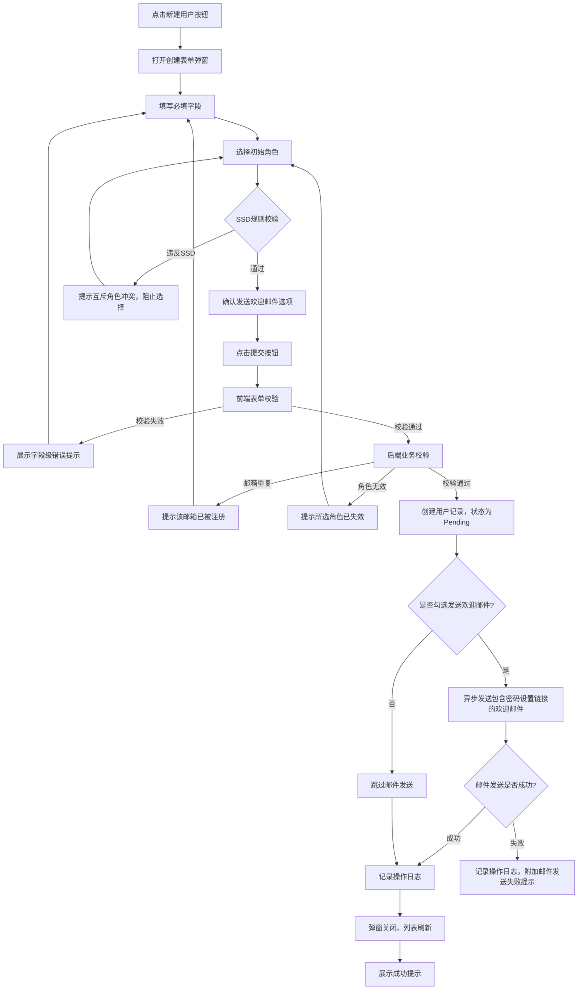

#### 4.3.6 分支流程

- **分支A - 不发送邮件**：用户取消勾选"发送欢迎邮件"，系统仅创建用户不发送邮件，管理员需手动告知用户初始密码
- **分支B - 多角色分配**：用户选择多个角色时，角色标签以列表形式展示，支持移除已选角色
- **分支C - SSD冲突**：用户选择的角色与已选角色存在SSD互斥关系时，系统实时提示冲突信息并阻止选择

#### 4.3.7 异常流程

- **异常1 - 邮箱重复**：后端校验失败，返回错误信息，前端展示"该邮箱已被注册"
- **异常2 - 角色无效**：所选角色已被删除或禁用时，提示"所选角色已失效，请重新选择"
- **异常3 - 邮件发送失败**：用户创建成功但邮件发送失败时，展示成功提示并附加"欢迎邮件发送失败，请手动通知用户"
- **异常4 - 网络异常**：提交失败，展示错误提示，表单数据保留不丢失

#### 4.3.8 交互说明

- 表单采用弹窗（Modal）形式，宽度为640px
- 角色选择器支持搜索功能，角色列表展示角色名称和描述
- 邮箱字段输入后实时进行格式校验（失焦触发）
- 提交按钮在请求发送期间展示 Loading 状态，防止重复提交
- 角色选择时实时校验SSD规则，互斥角色在列表中标注红色警告图标

#### 4.3.9 验收标准

| 编号 | 验收标准 | 验证方法 |
|------|----------|----------|
| AC-UC-01 | 所有必填字段为空时，提交后展示校验错误 | 清空必填字段后提交 |
| AC-UC-02 | 邮箱唯一性校验生效 | 创建相同邮箱的用户 |
| AC-UC-03 | 角色至少选择一个的校验生效 | 不选择角色直接提交 |
| AC-UC-04 | 勾选发送欢迎邮件后，邮件在30秒内正确发送 | 创建用户后检查邮箱 |
| AC-UC-05 | 邮件发送失败不影响用户创建 | 模拟邮件服务异常验证 |
| AC-UC-06 | 表单数据在提交失败后不丢失 | 模拟网络异常后检查表单 |
| AC-UC-07 | 选择互斥角色时SSD冲突提示正确弹出 | 选择SSD互斥角色组合验证 |
| AC-UC-08 | 新创建用户初始状态为Pending | 创建用户后检查状态字段 |

---

### 4.4 角色管理

> **[已迁移]**：本节内容已完整迁移至 [PRD-12 权限管理](file:///Users/Garabateador/Workspace/banyan/PRD/PRD-12-权限管理.md) §8.2，此处不再保留。请以 PRD-12 为权威来源。

---

### 4.5 角色层级继承机制

> **[已迁移]**：本节内容已完整迁移至 [PRD-12 权限管理](file:///Users/Garabateador/Workspace/banyan/PRD/PRD-12-权限管理.md) §8.2.5，此处不再保留。请以 PRD-12 为权威来源。

---

### 4.6 SSD与DSD规则配置

> **[已迁移]**：本节内容已完整迁移至 [PRD-12 权限管理](file:///Users/Garabateador/Workspace/banyan/PRD/PRD-12-权限管理.md) §8.2.4，此处不再保留。请以 PRD-12 为权威来源。

---

### 4.7 权限批量配置

> **[已迁移]**：本节内容已完整迁移至 [PRD-12 权限管理](file:///Users/Garabateador/Workspace/banyan/PRD/PRD-12-权限管理.md) §8.4，此处不再保留。请以 PRD-12 为权威来源。

---

### 4.8 角色复制与模板化

> **[已迁移]**：本节内容已完整迁移至 [PRD-12 权限管理](file:///Users/Garabateador/Workspace/banyan/PRD/PRD-12-权限管理.md) §8.2，此处不再保留。请以 PRD-12 为权威来源。

---

### 4.9 用户组管理

> **[已迁移]**：本节内容已完整迁移至 [PRD-12 权限管理](file:///Users/Garabateador/Workspace/banyan/PRD/PRD-12-权限管理.md) §8.11，此处不再保留。请以 PRD-12 为权威来源。

---

---

### 4.10 批量成员导入/导出

> **[已迁移]**：本节内容已完整迁移至 [PRD-12 权限管理](file:///Users/Garabateador/Workspace/banyan/PRD/PRD-12-权限管理.md) §8.11，此处不再保留。请以 PRD-12 为权威来源。

---

### 4.11 用户组层级管理

> **[已迁移]**：本节内容已完整迁移至 [PRD-12 权限管理](file:///Users/Garabateador/Workspace/banyan/PRD/PRD-12-权限管理.md) §8.11，此处不再保留。请以 PRD-12 为权威来源。

---

### 4.12 用户组权限配置

> **[已迁移]**：本节内容已完整迁移至 [PRD-12 权限管理](file:///Users/Garabateador/Workspace/banyan/PRD/PRD-12-权限管理.md) §8.11，此处不再保留。请以 PRD-12 为权威来源。

---

### 4.13 用户与商户关联

#### 4.13.1 用户故事

> **US-UM-01**：作为SystemAdmin，我希望能够在创建或编辑用户时关联商户，以便用户归属于特定商户，实现多租户数据隔离。

#### 4.13.2 关联规则

| 规则编号 | 规则描述 |
|----------|----------|
| BR-08-025 | 一个用户必须关联一个商户（通过 `merchant_id` 字段），平台级用户 `merchant_id` 为NULL |
| BR-08-026 | 商户管理员仅可管理本商户下的用户，不可跨商户操作 |
| BR-08-027 | 用户创建时必须选择所属商户，创建后不可更改 |
| BR-08-028 | 商户禁用后，该商户下所有状态为Active的用户同步被禁止登录（用户状态不变，但登录请求被拒绝） |

#### 4.13.3 验收标准

| 编号 | 验收标准 | 验证方法 |
|------|----------|----------|
| AC-UM-01 | 用户创建时必须选择所属商户 | 不选择商户直接提交验证 |
| AC-UM-02 | 用户所属商户创建后不可更改 | 编辑用户时验证商户字段不可修改 |
| AC-UM-03 | 商户管理员仅可查看本商户用户 | 以商户管理员身份验证列表数据范围 |

---

### 4.14 用户认证与安全

#### 4.14.1 用户登录（Sign In）

##### 邮箱/用户名 + 密码登录

**用户故事**：作为商户管理员，我想要通过邮箱或用户名配合密码快速登录系统，以便安全地访问我的工作空间和资源。

**前置条件**：
- 用户已完成商户注册并通过邮箱验证
- 账户状态为"Active"（未被锁定、未过期、未禁用）
- 浏览器支持 Cookie 和 JavaScript

**后置条件**：
- 系统生成有效的访问 Token（Access Token）和刷新 Token（Refresh Token）
- 用户会话记录写入会话管理模块
- 登录审计日志记录成功事件
- 用户跳转至仪表盘首页

**主流程**：

| 步骤 | 操作 | 系统响应 |
|------|------|----------|
| 1 | 用户访问登录页面 | 系统展示登录表单（邮箱/用户名输入框、密码输入框、登录按钮） |
| 2 | 用户输入邮箱或用户名 | 系统实时校验格式，格式正确时输入框边框变绿 |
| 3 | 用户输入密码 | 密码以掩码形式显示，右侧提供"显示/隐藏"切换图标 |
| 4 | 用户点击"登录"按钮 | 系统显示加载状态，按钮变为 Loading 状态 |
| 5 | 系统验证凭据 | 后端校验用户名/邮箱是否存在，密码是否匹配 |
| 6 | 验证通过 | 系统生成 JWT Token 对(Access Token + Refresh Token),通过 GraphQL data 字段返回;前端将 Token 存入 localStorage(配合 refreshToken 轮换);不返回 302,前端路由跳转至 /dashboard |
| 7 | 用户进入仪表盘 | 页面加载用户偏好设置，展示个性化工作空间 |

**分支流程**：

| 分支 | 触发条件 | 处理逻辑 |
|------|----------|----------|
| B1 | 用户选择了"记住我" | Access Token 有效期 60 分钟(默认),可通过配置延长至 7 天;Refresh Token 有效期 7 天,可配置延长至 30 天 |
| B2 | 用户账户启用了 MFA | 登录凭据验证通过后，跳转至 MFA 验证页面（见 4.14.3） |
| B3 | 用户密码即将过期（剩余 ≤ 7 天） | 登录成功后弹出密码修改提示，用户可选择"立即修改"或"稍后提醒" |
| B4 | 首次登录或密码已被管理员重置 | 强制跳转至"修改密码"页面，不允许跳过 |

**异常流程**：

| 异常 | 触发条件 | 处理逻辑 |
|------|----------|----------|
| E1 | 用户名/邮箱不存在 | 显示"用户名或密码错误"，不透露具体是邮箱还是用户名错误（防枚举攻击） |
| E2 | 密码错误 | 显示"用户名或密码错误"，失败计数 +1，触发账户锁定检查 |
| E3 | 账户已被锁定 | 显示"账户已被锁定，请在 X 分钟后重试或联系管理员解锁" |
| E4 | 账户已被禁用 | 显示"该账户已被禁用，请联系系统管理员" |
| E5 | 请求频率过高 | 业务层响应 HTTP 200，通过 `errors[].code` 返回限流错误码 `000099`，前端显示"请求过于频繁，请稍后再试" |
| E6 | 网络异常 | 显示"网络连接失败，请检查网络后重试"，保留已输入的表单数据 |

**交互说明**：
- 登录按钮在表单未完整填写时置灰（Disabled 状态）
- 密码输入框支持回车键提交
- 登录失败时，输入框抖动动画提示（300ms）
- 连续失败 3 次后，自动展示验证码（CAPTCHA）
- 支持 SSO 单点登录入口（预留位置，V2 实现）

**验收标准**：

| 编号 | 验收标准 | 验证方法 |
|------|----------|----------|
| AC-AUTH-01 | 正确的邮箱+密码组合登录响应时间≤2秒(P95) | 使用测试账户执行登录，计时验证 |
| AC-AUTH-02 | 正确的用户名+密码组合登录响应时间≤2秒(P95) | 使用测试账户执行登录，计时验证 |
| AC-AUTH-03 | 错误密码显示"用户名或密码错误"，不暴露具体错误原因 | 输入错误密码，验证提示文案 |
| AC-AUTH-04 | 密码输入框支持显示/隐藏切换，切换响应时间≤100ms | 点击眼睛图标，验证密码可见性切换 |
| AC-AUTH-05 | 连续失败3次后展示CAPTCHA验证码 | 连续输入错误密码3次 |
| AC-AUTH-06 | Access Token 存 localStorage,Refresh Token 存 httpOnly+Secure+SameSite=Strict Cookie(与 PRD-12 §13.1.2 令牌安全一致) | 检查浏览器 localStorage 与 Cookie 属性 |
| AC-AUTH-07 | 未勾选"记住我"时，Access Token 有效期 60 分钟(与 PRD-12 §13.1.2 一致),关闭浏览器后需重新登录 | 登录后关闭浏览器重新打开 |
| AC-AUTH-08 | 勾选"记住我"后，Refresh Token 有效期 7 天(与 PRD-12 §13.1.2 一致),7 天内免登录 | 勾选后关闭浏览器，7 天内重新打开验证自动登录 |

---

##### 记住我（Remember Me）

**用户故事**：作为频繁使用系统的商户管理员，我想要勾选"记住我"后能在7天内免于重复登录，以便提升日常工作效率。

**前置条件**：
- 用户位于登录页面
- 登录表单已填写完成

**后置条件**：
- Access Token 有效期按默认配置（60 分钟）
- Refresh Token 有效期按"记住我"延长至 7 天（默认 7 天，可配置至 30 天）
- 浏览器 Cookie 中存储持久化 Refresh Token 标识

**主流程**：

| 步骤 | 操作 | 系统响应 |
|------|------|----------|
| 1 | 用户在登录表单中勾选"记住我"复选框 | 复选框选中状态，下方显示"保持登录 7 天"提示文字 |
| 2 | 用户点击"登录" | 系统验证凭据通过后，生成长效 Token |
| 3 | 系统设置 Cookie | Access Token Cookie Max-Age=3600(60分钟),Refresh Token Cookie Max-Age=604800(7天) |
| 4 | 用户关闭浏览器后再次访问 | 系统自动通过 Refresh Token 续签 Access Token，用户无需重新输入凭据 |

**分支流程**：

| 分支 | 触发条件 | 处理逻辑 |
|------|----------|----------|
| B1 | Refresh Token 过期（7天） | 用户需重新登录，"记住我"状态清除 |
| B2 | 用户手动退出登录 | 清除所有 Token Cookie，"记住我"状态失效 |
| B3 | 管理员强制该用户下线 | 所有长效 Token 失效，用户需重新登录 |
| B4 | 用户密码被修改 | 所有已发放的长效 Token 立即失效 |

**异常流程**：

| 异常 | 触发条件 | 处理逻辑 |
|------|----------|----------|
| E1 | Token 被篡改 | 系统拒绝该 Token，清除 Cookie，跳转至登录页 |
| E2 | 浏览器禁用 Cookie | 显示"请启用浏览器 Cookie 以使用记住我功能" |

**验收标准**：

| 编号 | 验收标准 | 验证方法 |
|------|----------|----------|
| AC-AUTH-09 | 勾选"记住我"后，关闭浏览器再打开，7天内无需重新登录 | 功能测试 |
| AC-AUTH-10 | 60 分钟后 Access Token 过期，Refresh Token 自动续签 | 修改 Token 时间戳模拟过期 |
| AC-AUTH-11 | 7 天后 Refresh Token 过期，跳转登录页 | 修改 Refresh Token 时间戳模拟过期 |
| AC-AUTH-12 | 密码修改后，所有"记住我"Token在5秒内失效 | 修改密码后验证自动登出 |
| AC-AUTH-13 | Refresh Token可正常续签Access Token，续签响应时间≤200ms | 使用过期Access Token请求，验证自动续签 |

---

##### 登录失败锁定机制

**用户故事**：作为系统管理员，我想要系统在检测到连续5次登录失败时自动锁定账户，以便防止暴力破解和撞库攻击，保护用户账户安全。

**前置条件**：
- 用户尝试登录
- 系统已启用账户锁定策略

**后置条件**：
- 达到阈值后账户被锁定
- 锁定事件通知管理员（可选）
- 锁定事件记录审计日志

**主流程**：

| 步骤 | 操作 | 系统响应 |
|------|------|----------|
| 1 | 用户输入错误密码 | 系统记录一次失败，返回错误提示 |
| 2 | 失败计数累加 | 系统更新该账户的失败计数器（Redis缓存，TTL与锁定周期一致） |
| 3 | 失败次数达到阈值（默认5次） | 系统锁定账户，设置锁定时长 |
| 4 | 锁定期间用户尝试登录 | 显示"账户已被锁定，请在X分钟后重试" |
| 5 | 锁定时间到期 | 系统自动解锁，失败计数器清零 |

**分支流程**：

| 分支 | 触发条件 | 处理逻辑 |
|------|----------|----------|
| B1 | 锁定时长递增模式 | 第1次锁定30分钟，第2次1小时，第3次24小时，第4次永久锁定需管理员解锁 |
| B2 | 管理员手动解锁 | 管理员在后台手动解锁账户，清零失败计数和锁定次数 |
| B3 | IP维度限制 | 同一IP在10分钟内累计20次失败，该IP被加入临时黑名单30分钟 |

**异常流程**：

| 异常 | 触发条件 | 处理逻辑 |
|------|----------|----------|
| E1 | Redis缓存不可用 | 降级至数据库记录，锁定策略仍生效但性能下降 |
| E2 | 时钟不同步导致锁定时间异常 | 以服务器时间为准，锁定到期时间使用绝对时间戳 |

**锁定策略参数表**：

| 参数 | 默认值 | 可配置范围 | 说明 |
|------|--------|------------|------|
| 最大失败次数 | 5次 | 3-10次 | 触发锁定的失败次数阈值 |
| 第1次锁定时长 | 30分钟 | 5-60分钟 | 首次锁定的持续时间 |
| 第2次锁定时长 | 1小时 | 30分钟-4小时 | 第二次锁定的持续时间 |
| 第3次锁定时长 | 24小时 | 12-72小时 | 第三次锁定的持续时间 |
| 第4次锁定 | 永久 | — | 需管理员手动解锁 |
| IP失败阈值 | 20次/10分钟 | 10-50次 | 触发IP维度限制的阈值 |
| IP封禁时长 | 30分钟 | 10-120分钟 | IP临时封禁的持续时间 |

**验收标准**：

| 编号 | 验收标准 | 验证方法 |
|------|----------|----------|
| AC-AUTH-14 | 连续5次密码错误后账户锁定30分钟 | 连续输入错误密码5次并计时 |
| AC-AUTH-15 | 锁定后显示剩余锁定时间（精确到分钟） | 锁定后查看提示信息 |
| AC-AUTH-16 | 第1次锁定30分钟后自动解锁 | 等待锁定时间到期后尝试登录 |
| AC-AUTH-17 | 第2次锁定时长为1小时 | 再次触发锁定并计时 |
| AC-AUTH-18 | 第3次锁定时长为24小时 | 第三次触发锁定并计时 |
| AC-AUTH-19 | 第4次锁定为永久，需管理员手动解锁 | 第四次触发锁定，验证无法自动解锁 |
| AC-AUTH-20 | 同一IP累计20次失败后IP被封禁30分钟 | 使用同一IP模拟多次失败 |
| AC-AUTH-21 | 管理员手动解锁后失败计数和锁定次数归零 | 管理员后台操作解锁 |

---

#### 4.14.2 忘记密码（Forgot Password）

**用户故事**：作为忘记密码的用户，我想要通过注册邮箱自助重置密码，以便快速恢复对系统的访问权限，无需联系管理员。

**前置条件**：
- 用户已注册且邮箱已验证
- 用户知道自己的注册邮箱

**后置条件**：
- 用户设置新密码
- 旧密码失效
- 所有已发放的 Token 全部失效
- 密码重置审计日志记录
- 用户账户标记为"下次登录强制修改密码"

**主流程**：

| 步骤 | 操作 | 系统响应 |
|------|------|----------|
| 1 | 用户在登录页点击"忘记密码"链接 | 跳转至"忘记密码"页面，展示邮箱输入框 |
| 2 | 用户输入注册邮箱 | 系统校验邮箱格式 |
| 3 | 用户点击"发送验证码" | 系统生成6位数字验证码（有效期15分钟），发送至注册邮箱 |
| 4 | 系统展示提示页 | 显示"验证码已发送至您的邮箱，请在15分钟内完成操作" |
| 5 | 用户输入6位验证码 | 系统校验验证码有效性 |
| 6 | 验证码验证通过 | 跳转至"设置新密码"页面 |
| 7 | 用户输入新密码并确认 | 系统实时校验密码强度 |
| 8 | 用户点击"确认重置" | 系统验证密码策略合规性，更新密码，清除所有已有Token |
| 9 | 系统标记强制修改密码 | 账户标记为"下次登录强制修改密码" |
| 10 | 系统展示成功提示 | 显示"密码已重置成功，请使用新密码登录"，提供"立即登录"按钮 |
| 11 | 用户使用新密码登录 | 系统检测到强制修改密码标记，跳转至"修改密码"页面 |
| 12 | 用户设置新密码 | 系统更新密码，清除强制修改标记 |
| 13 | 修改完成 | 跳转至仪表盘 |

**分支流程**：

| 分支 | 触发条件 | 处理逻辑 |
|------|----------|----------|
| B1 | 输入的邮箱未注册 | 显示"如果该邮箱已注册，您将收到验证码"（防枚举攻击，不透露是否注册） |
| B2 | 邮箱已注册但未验证 | 显示"该邮箱尚未验证，请先完成邮箱验证" |
| B3 | 15分钟内验证码过期 | 显示"验证码已过期，请重新申请" |
| B4 | 验证码已被使用 | 显示"该验证码已失效，请重新申请" |

**异常流程**：

| 异常 | 触发条件 | 处理逻辑 |
|------|----------|----------|
| E1 | 邮件发送失败 | 显示"邮件发送失败，请稍后重试或联系管理员"，后台记录错误日志 |
| E2 | 同一邮箱1分钟内重复请求 | 显示"请求过于频繁，请1分钟后再试" |
| E3 | 新密码与历史密码冲突 | 显示"新密码不能与最近5次使用的密码相同" |
| E4 | 网络异常 | 保留已填写的新密码表单数据，显示重试按钮 |
| E5 | 验证码错误 | 显示"验证码错误"，剩余尝试次数提示，3次错误后需重新发送 |

**交互说明**：
- 密码输入时实时显示强度指示条（弱/中/强/极强）
- 新密码与确认密码不一致时，确认密码框下方实时显示红色提示
- 验证码仅可使用一次，验证通过后立即失效
- 邮件中不包含任何可追溯的用户敏感信息
- 6位验证码输入框支持自动跳格（输入一位自动聚焦下一位）

**验收标准**：

| 编号 | 验收标准 | 验证方法 |
|------|----------|----------|
| AC-AUTH-22 | 密码重置验证码邮件在30秒内送达 | 发送后检查邮箱 |
| AC-AUTH-23 | 验证码有效期严格为15分钟 | 等待15分钟后输入验证码 |
| AC-AUTH-24 | 验证码仅可使用一次 | 使用已验证过的验证码再次尝试 |
| AC-AUTH-25 | 新密码必须满足密码策略要求（长度≥8，≥3类字符） | 尝试设置不符合策略的密码 |
| AC-AUTH-26 | 密码重置后所有已有Token在5秒内失效 | 重置后尝试使用旧Token访问 |
| AC-AUTH-27 | 未注册邮箱不暴露"不存在"信息 | 输入未注册邮箱，验证提示文案 |
| AC-AUTH-28 | 密码重置后首次登录强制修改密码 | 重置密码后登录，验证是否强制跳转修改密码页 |
| AC-AUTH-29 | 验证码错误3次后需重新发送验证码 | 连续输入错误验证码3次 |

---

#### 4.14.3 MFA 多因素认证

**用户故事**：作为高安全要求的商户管理员，我想要在密码之外增加第二层验证，以便即使密码泄露也能保护我的账户安全。

**前置条件**：
- 用户已完成密码验证（第一层）
- 用户已启用 MFA（TOTP 或 SMS）
- 用户拥有 MFA 设备或手机

**后置条件**：
- MFA 验证通过，完成登录流程
- MFA 验证事件记录审计日志

**MFA 配置流程**：

| 步骤 | 操作 | 系统响应 |
|------|------|----------|
| 1 | 用户在安全设置中点击"启用MFA" | 系统展示MFA类型选择（TOTP/SMS） |
| 2 | 用户选择TOTP方式 | 系统生成TOTP密钥，展示二维码和手动输入密钥 |
| 3 | 用户使用Authenticator App扫描二维码 | App开始生成6位验证码（30秒刷新） |
| 4 | 用户输入当前验证码进行绑定确认 | 系统校验验证码正确性 |
| 5 | 验证通过 | 系统生成10个备用恢复码，提示用户妥善保存 |
| 6 | 用户确认已保存恢复码 | MFA启用成功，账户安全等级提升 |
| 7 | 用户选择SMS方式 | 系统要求输入手机号 |
| 8 | 用户输入手机号并验证 | 系统发送短信验证码，验证通过后MFA启用 |

**MFA 配置参数**：

| 参数 | 默认值 | 可配置范围 | 说明 |
|------|--------|------------|------|
| TOTP算法 | SHA-1 | SHA-1/SHA-256/SHA-512 | TOTP哈希算法 |
| TOTP时间步长 | 30秒 | 30/60秒 | 验证码刷新周期 |
| TOTP密钥长度 | 160位 | 128-256位 | 基于RFC 6238推荐的最小密钥长度 |
| SMS验证码长度 | 6位 | 4-8位 | 短信验证码位数 |
| SMS验证码有效期 | 5分钟 | 1-10分钟 | 短信验证码有效时长 |
| 备用恢复码数量 | 10个 | 5-20个 | 一次性恢复码数量 |
| 备用恢复码格式 | 8位字母数字 | — | 每个恢复码的格式 |
| MFA验证失败锁定阈值 | 5次 | 3-10次 | 连续失败后临时锁定MFA验证 |
| MFA临时锁定时长 | 30分钟 | 10-120分钟 | MFA验证锁定持续时间 |

**MFA 验证主流程**：

| 步骤 | 操作 | 系统响应 |
|------|------|----------|
| 1 | 用户完成密码验证 | 系统检查该账户是否启用MFA |
| 2 | 系统跳转至MFA验证页 | 展示MFA验证表单（6位验证码输入框） |
| 3 | 用户输入TOTP验证码（从Authenticator App获取） | 系统校验验证码 |
| 4 | 验证通过 | 系统生成JWT Token对，跳转至仪表盘 |
| 5 | MFA验证完成 | 审计日志记录MFA验证事件 |

**分支流程**：

| 分支 | 触发条件 | 处理逻辑 |
|------|----------|----------|
| B1 | 用户使用SMS方式 | 系统发送6位短信验证码至绑定手机号 |
| B2 | 用户选择"使用备用码" | 展示备用码输入框，用户输入管理员预先生成的恢复码，恢复码使用后立即失效 |
| B3 | 用户设备丢失 | 用户联系管理员重置MFA，管理员验证身份后重置，重置后用户需重新配置MFA |

**异常流程**：

| 异常 | 触发条件 | 处理逻辑 |
|------|----------|----------|
| E1 | 验证码错误 | 显示"验证码错误"，失败计数+1，连续5次失败触发MFA锁定30分钟 |
| E2 | 验证码超时（TOTP 30秒窗口过期） | 显示"验证码已过期，请重新输入" |
| E3 | SMS发送失败 | 显示"短信发送失败，请使用TOTP或联系管理员" |
| E4 | MFA被锁定 | 显示"MFA验证已被临时锁定30分钟，请联系管理员或使用备用码" |

**交互说明**：
- 6位验证码输入框支持自动跳格（输入一位自动聚焦下一位）
- 支持粘贴完整6位验证码自动填充
- 验证码输入框显示30秒倒计时提示
- SMS方式展示"重新发送"按钮，60秒冷却倒计时

**验收标准**：

| 编号 | 验收标准 | 验证方法 |
|------|----------|----------|
| AC-AUTH-30 | TOTP验证码在30秒有效窗口内可正常验证 | 使用Authenticator App测试 |
| AC-AUTH-31 | 连续5次MFA验证失败后触发锁定30分钟 | 连续输入错误验证码5次 |
| AC-AUTH-32 | 备用恢复码可正常完成验证，使用后立即失效 | 使用预生成的备用码测试 |
| AC-AUTH-33 | SMS验证码60秒内送达 | 触发SMS发送并计时 |
| AC-AUTH-34 | MFA锁定期间无法继续尝试验证 | 锁定后尝试输入验证码 |
| AC-AUTH-35 | MFA配置过程中需验证一次验证码才能完成绑定 | 启用MFA时不输入验证码 |
| AC-AUTH-36 | 10个备用恢复码一次性生成，每个仅可使用一次 | 使用同一恢复码尝试两次 |

---

#### 4.14.4 密码策略管理

##### 密码长度与复杂度

**用户故事**：作为系统管理员，我想要配置全局密码策略，以便确保所有用户的密码满足组织的安全要求。

**策略参数**：

| 参数 | 默认值 | 可配置范围 | 说明 |
|------|--------|------------|------|
| 最小长度 | 8位 | 8-128位 | 密码的最小字符数 |
| 最大长度 | 128位 | 64-256位 | 密码的最大字符数 |
| 要求大写字母 | 是 | 是/否 | 是否必须包含大写字母 |
| 要求小写字母 | 是 | 是/否 | 是否必须包含小写字母 |
| 要求数字 | 是 | 是/否 | 是否必须包含数字 |
| 要求特殊字符 | 否 | 是/否 | 是否必须包含特殊字符 |
| 最小字符类别数 | 3 | 2-4 | 至少满足几类字符 |
| 禁止包含用户名 | 是 | 是/否 | 密码不得包含用户名 |
| 禁止包含邮箱前缀 | 是 | 是/否 | 密码不得包含邮箱前缀 |
| 禁止连续相同字符数 | 3 | 2-5 | 禁止连续N个以上相同字符 |
| 弱密码黑名单 | 启用 | 启用/禁用 | 是否启用弱密码黑名单校验 |

**密码强度规则**：

| 等级 | 条件 | 颜色标识 |
|------|------|----------|
| 弱（Weak） | 长度 ≥ 8，仅满足1类字符 | 红色 |
| 中（Medium） | 长度 ≥ 8，满足2类字符 | 橙色 |
| 强（Strong） | 长度 ≥ 10，满足3类字符 | 黄色 |
| 极强（Very Strong） | 长度 ≥ 12，满足4类字符且无连续重复 | 绿色 |

**字符类别**：
1. 大写字母（A-Z）
2. 小写字母（a-z）
3. 数字（0-9）
4. 特殊字符（!@#$%^&*()_+-=[]{}|;':",./<>?）

**禁止规则**：
- 不得包含用户名（不区分大小写）
- 不得包含邮箱前缀
- 不得包含连续3个以上相同字符（如"aaa"、"111"）
- 不得包含常见弱密码（系统维护1000个常见弱密码黑名单）

**验收标准**：

| 编号 | 验收标准 | 验证方法 |
|------|----------|----------|
| AC-AUTH-37 | 不满足最小长度的密码被拒绝并提示"密码长度不得少于8位" | 设置7位密码 |
| AC-AUTH-38 | 不满足字符类别要求的密码被拒绝并提示具体缺失类别 | 仅使用小写字母 |
| AC-AUTH-39 | 管理员可在后台修改密码策略参数，修改后5秒内全局生效 | 后台配置修改并验证生效 |
| AC-AUTH-40 | 包含用户名的密码被拒绝并提示"密码不得包含用户名" | 输入包含用户名的密码 |
| AC-AUTH-41 | 常见弱密码（如password123、12345678）被拒绝 | 输入常见弱密码 |
| AC-AUTH-42 | 密码强度未达到"强"时提交按钮置灰 | 尝试提交弱密码 |

---

##### 历史密码检查

**用户故事**：作为系统管理员，我想要禁止用户重复使用最近的旧密码，以便防止密码轮换攻击。

**策略参数**：

| 参数 | 默认值 | 可配置范围 | 说明 |
|------|--------|------------|------|
| 历史密码记忆数 | 5 | 3-24 | 禁止重复使用最近N次的密码 |
| 检查方式 | SHA-256哈希比对 | — | 使用不可逆哈希存储，不存储明文 |

**验收标准**：

| 编号 | 验收标准 | 验证方法 |
|------|----------|----------|
| AC-AUTH-43 | 使用最近5次内密码时被拒绝并提示"不能与最近5次密码相同" | 修改密码为最近使用过的密码 |
| AC-AUTH-44 | 使用超过5次前的密码时允许通过 | 修改密码为更早使用过的密码 |
| AC-AUTH-45 | 历史密码以SHA-256哈希形式存储，数据库中无明文 | 检查数据库存储格式 |

---

##### 密码过期策略

**用户故事**：作为系统管理员，我想要设置密码过期周期，以便定期强制用户更新密码，降低长期使用同一密码的安全风险。

**策略参数**：

| 参数 | 默认值 | 可配置范围 | 说明 |
|------|--------|------------|------|
| 密码有效期 | 90天 | 30-365天 | 密码必须更换的周期 |
| 过期前提醒天数 | 7天 | 1-14天 | 过期前多少天开始提醒 |
| 过期后宽限期 | 0天 | 0-7天 | 过期后仍可登录的天数（0=立即失效） |
| 宽限期内行为 | 仅允许修改密码 | — | 宽限期内只能修改密码，不能访问其他功能 |
| 密码重用限制 | 禁止与最近5次密码相同 | 3-24次 | 修改密码时不得与历史密码重复 |

**主流程**：

| 步骤 | 操作 | 系统响应 |
|------|------|----------|
| 1 | 用户密码距离过期 ≤ 7天 | 登录后弹出"您的密码将在X天后过期，建议立即修改" |
| 2 | 用户点击"立即修改" | 跳转至修改密码页面 |
| 3 | 用户密码已过期（宽限期0天） | 登录时强制跳转至修改密码页面，不允许跳过 |
| 4 | 用户密码已过期（宽限期 > 0天） | 允许登录但所有操作页面顶部显示红色横幅"密码已过期，请立即修改"，点击后跳转修改密码页面 |

**验收标准**：

| 编号 | 验收标准 | 验证方法 |
|------|----------|----------|
| AC-AUTH-46 | 密码过期前7天开始每次登录弹出提醒 | 设置密码即将过期的测试账户 |
| AC-AUTH-47 | 密码过期后强制修改密码，无法跳过 | 设置密码已过期的测试账户 |
| AC-AUTH-48 | 宽限期内可登录但仅允许访问修改密码功能 | 在宽限期内尝试访问其他功能 |

---

#### 4.14.5 账户锁定策略

##### 失败计数与锁定

**用户故事**：作为系统管理员，我想要系统自动追踪登录失败次数并在达到5次时锁定账户，以便有效防止暴力破解攻击。

**详细规则**：

| 规则项 | 说明 |
|--------|------|
| 失败计数存储 | Redis缓存，Key格式：`login:fail:{account_id}`，TTL与锁定周期一致 |
| 计数重置条件 | 成功登录、管理员手动解锁、锁定时间到期 |
| 锁定通知 | 账户锁定时发送邮件通知注册邮箱 |
| 锁定状态查询 | 用户可通过"忘记密码"流程查看账户是否被锁定 |

**验收标准**：

| 编号 | 验收标准 | 验证方法 |
|------|----------|----------|
| AC-AUTH-49 | 每次登录失败计数器+1 | 连续失败登录并检查计数 |
| AC-AUTH-50 | 成功登录后计数器归零 | 失败几次后成功登录，检查计数 |
| AC-AUTH-51 | 锁定时在30秒内发送邮件通知 | 触发锁定后检查邮箱 |

---

##### 锁定时长递增

**用户故事**：作为系统管理员，我想要对反复触发锁定的账户实施递增的惩罚时长，以便在保护账户安全的同时，对持续攻击行为形成有效威慑。

**递增策略表**：

| 锁定次数 | 锁定时长 | 说明 |
|----------|----------|------|
| 第1次 | 30分钟 | 初次锁定 |
| 第2次 | 1小时 | 递增惩罚 |
| 第3次 | 24小时 | 严重警告 |
| 第4次及以上 | 永久锁定 | 需管理员手动解锁 |

**重置条件**：
- 成功登录一次后，锁定次数计数器归零
- 管理员手动解锁后，锁定次数计数器归零
- 距离上次锁定超过30天，计数器自动归零

**验收标准**：

| 编号 | 验收标准 | 验证方法 |
|------|----------|----------|
| AC-AUTH-52 | 第1次锁定30分钟 | 触发首次锁定并计时 |
| AC-AUTH-53 | 第2次锁定1小时 | 再次触发锁定并计时 |
| AC-AUTH-54 | 第3次锁定24小时 | 第三次触发锁定并计时 |
| AC-AUTH-55 | 第4次锁定为永久，需管理员手动解锁 | 第四次触发锁定，验证无法自动解锁 |
| AC-AUTH-56 | 成功登录后锁定次数计数器归零 | 解锁后成功登录，再次触发锁定验证从30分钟开始 |

---

##### IP维度限制

**用户故事**：作为系统管理员，我想要系统在检测到同一IP地址大量登录失败时自动封禁该IP，以便防止分布式暴力破解攻击。

**策略参数**：

| 参数 | 默认值 | 说明 |
|------|--------|------|
| IP失败阈值 | 20次/10分钟 | 同一IP在时间窗口内的失败次数上限 |
| IP封禁时长 | 30分钟 | 首次封禁持续时间 |
| IP封禁递增 | 同账户锁定递增策略 | 30分钟 → 1小时 → 24小时 → 永久 |
| IP白名单 | 可配置 | 不受限制的IP地址列表（如企业出口IP） |
| IP黑名单 | 可配置 | 永久封禁的IP地址列表 |

**验收标准**：

| 编号 | 验收标准 | 验证方法 |
|------|----------|----------|
| AC-AUTH-57 | 同一IP 10分钟内20次失败后封禁30分钟 | 使用同一IP模拟多次失败 |
| AC-AUTH-58 | IP白名单不受限制 | 使用白名单IP模拟多次失败 |
| AC-AUTH-59 | IP封禁后显示"访问受限，请联系管理员" | 被封禁IP尝试访问 |

---

#### 4.14.6 会话管理

##### JWT + Refresh Token 双Token机制

**用户故事**：作为系统管理员，我想要系统采用JWT + Refresh Token双Token机制管理会话，以便在保证安全性的同时提供无缝的用户体验。

**机制概述**：

系统采用双Token机制进行会话管理：
- **Access Token（JWT）**：短期令牌，用于API请求认证，采用RS256算法签名
- **Refresh Token**：长期令牌，用于续签Access Token，存储于服务端可撤销

**Token参数**：

| Token类型 | 默认有效期 | 记住我有效期 | 存储位置 | 签名算法 |
|------------|------------|--------------|----------|----------|
| Access Token | 30分钟 | 7天 | HttpOnly Cookie | RS256 |
| Refresh Token | 7天 | 30天 | HttpOnly Cookie | RS256 |
| MFA Session Token | 5分钟 | — | 服务端Session | HS256 |

**完整流程**：

| 步骤 | 操作 | 系统响应 |
|------|------|----------|
| 1 | 用户登录成功 | 系统生成Access Token（30分钟）和Refresh Token（7天），写入HttpOnly+Secure+SameSite=Strict Cookie |
| 2 | 前端发起API请求 | 携带Access Token进行认证 |
| 3 | Access Token有效 | 正常处理请求 |
| 4 | Access Token过期 | 前端自动使用Refresh Token调用`/api/v1/auth/token/refresh`续签 |
| 5 | 续签请求到达后端 | 后端校验Refresh Token有效性、账户状态、Token是否被撤销 |
| 6 | 校验通过 | 生成新的Access Token和新的Refresh Token（Refresh Token Rotation），旧Refresh Token加入黑名单 |
| 7 | 返回新Token对 | 前端更新Cookie，重新发起原请求 |
| 8 | Refresh Token过期或无效 | 返回401，前端跳转至登录页 |

**安全规则**：
- Refresh Token Rotation：每次续签时生成新的Refresh Token，旧Token立即失效
- Refresh Token同时仅允许一个有效，续签时旧Token加入黑名单（TTL=原剩余有效期）
- 续签时检查账户状态，账户被锁定/禁用时拒绝续签
- 检测到已过期的Refresh Token被使用时，撤销该用户所有Refresh Token

**验收标准**：

| 编号 | 验收标准 | 验证方法 |
|------|----------|----------|
| AC-AUTH-60 | Access Token有效期30分钟，超时后自动续签 | 等待30分钟后请求API |
| AC-AUTH-61 | Refresh Token续签响应时间≤200ms | 使用Refresh Token续签并计时 |
| AC-AUTH-62 | Refresh Token Rotation：续签后旧Refresh Token立即失效 | 使用旧Refresh Token尝试续签 |
| AC-AUTH-63 | Refresh Token过期后跳转登录页 | 等待Refresh Token过期 |
| AC-AUTH-64 | 账户被锁定后Token续签被拒绝 | 锁定账户后尝试续签 |
| AC-AUTH-65 | JWT签名算法为RS256，公钥可独立验证 | 检查Token头部alg字段 |
| AC-AUTH-66 | Token存储在HttpOnly+Secure+SameSite=Strict的Cookie中 | 检查浏览器Cookie属性 |

---

##### 并发会话控制

**用户故事**：作为系统管理员，我想要限制每个账户的并发会话数量为3个，以便防止账户共享和异常的多点登录。

**策略参数**：

| 参数 | 默认值 | 可配置范围 | 说明 |
|------|--------|------------|------|
| 最大并发会话数 | 3 | 1-10 | 同一账户允许的同时活跃会话数 |
| 超出策略 | 踢出最早会话 | 踢出最早/拒绝新会话 | 超出限制时的处理方式 |
| 会话识别 | Token + 设备指纹 | — | 会话的唯一标识方式 |

**主流程**：

| 步骤 | 操作 | 系统响应 |
|------|------|----------|
| 1 | 用户在新设备登录 | 系统检查当前活跃会话数 |
| 2 | 活跃会话数 < 最大值 | 允许登录，创建新会话 |
| 3 | 活跃会话数 ≥ 最大值 | 按策略踢出最早的会话，被踢出设备的下一次请求返回401 |
| 4 | 被踢出会话的用户操作 | 显示"您的账户在其他设备上登录，您已被登出" |

**验收标准**：

| 编号 | 验收标准 | 验证方法 |
|------|----------|----------|
| AC-AUTH-67 | 并发会话数≤3时所有设备正常使用 | 在3个设备上同时登录 |
| AC-AUTH-68 | 第4个设备登录时最早会话被踢出 | 在第4个设备上登录 |
| AC-AUTH-69 | 被踢出设备显示"您的账户在其他设备上登录，您已被登出" | 被踢出后操作页面 |

---

##### Token有效期管理

**用户故事**：作为系统管理员，我想要配置Token的有效期，以便在安全性和用户体验之间取得平衡。

**Token策略**：

| Token类型 | 默认有效期 | 说明 |
|------------|------------|------|
| Access Token | 30分钟 | 短期Token，用于API请求认证 |
| Refresh Token | 7天 | 长期Token，用于续签Access Token |
| 记住我Access Token | 7天 | 勾选"记住我"时的Access Token |
| 记住我Refresh Token | 30天 | 勾选"记住我"时的Refresh Token |
| MFA Session Token | 5分钟 | MFA验证期间的临时Token |
| 密码重置Token | 15分钟 | 忘记密码流程中的重置凭证 |
| 邮箱验证Token | 10分钟 | 注册时邮箱验证码有效期 |

**续签机制**：
- Access Token过期时，前端自动使用Refresh Token请求续签
- Refresh Token过期时，用户需重新登录
- 续签时检查账户状态，账户被锁定/禁用时拒绝续签
- 续签采用Refresh Token Rotation机制，每次续签生成新的Refresh Token

**验收标准**：

| 编号 | 验收标准 | 验证方法 |
|------|----------|----------|
| AC-AUTH-70 | Access Token 30分钟后过期 | 等待30分钟后请求API |
| AC-AUTH-71 | Refresh Token可正常续签Access Token，续签响应≤200ms | 使用Refresh Token续签 |
| AC-AUTH-72 | Refresh Token 7天后过期需重新登录 | 等待Refresh Token过期 |
| AC-AUTH-73 | 账户被锁定后Token续签被拒绝 | 锁定账户后尝试续签 |

---

##### 强制下线

**用户故事**：作为系统管理员，我想要强制某个用户下线，以便在安全事件发生时立即切断其访问权限。

**触发场景**：

| 场景 | 触发方式 | 影响范围 |
|------|----------|----------|
| 管理员手动踢出 | 后台操作 | 指定用户的所有会话 |
| 密码修改 | 用户修改密码 | 该用户的所有其他会话 |
| 账户锁定 | 系统自动或管理员操作 | 该用户的所有会话 |
| 权限变更 | 管理员修改用户角色 | 该用户的所有会话 |
| 安全事件 | 系统检测到异常 | 受影响的所有会话 |

**主流程**：

| 步骤 | 操作 | 系统响应 |
|------|------|----------|
| 1 | 管理员在后台选择"强制下线" | 系统确认操作 |
| 2 | 系统清除目标用户的所有Token | Redis中删除该用户的所有Token记录 |
| 3 | 系统将该用户加入Token黑名单 | 黑名单TTL = 原剩余有效期 |
| 4 | 目标用户下次操作 | 网关层返回 401 并清除本地 Token，前端显示"您已被管理员登出，请重新登录" |

**验收标准**：

| 编号 | 验收标准 | 验证方法 |
|------|----------|----------|
| AC-AUTH-74 | 管理员强制下线后，目标用户在5秒内所有会话失效 | 管理员操作后目标用户尝试操作 |
| AC-AUTH-75 | 密码修改后其他设备会话在5秒内失效 | 修改密码后其他设备尝试操作 |
| AC-AUTH-76 | 被强制下线后显示"您已被管理员登出，请重新登录" | 被下线后查看页面提示 |

---

##### 设备绑定

**用户故事**：作为高安全要求的商户管理员，我想要将账户绑定到特定设备，以便只有授权设备才能访问系统。

**前置条件**：
- 用户已启用设备绑定功能
- 用户至少绑定了一个可信设备

**主流程**：

| 步骤 | 操作 | 系统响应 |
|------|------|----------|
| 1 | 用户在可信设备上登录 | 系统校验设备指纹，匹配则正常登录 |
| 2 | 用户在新设备上登录 | 系统检测到未知设备，触发额外验证（MFA + 邮件确认） |
| 3 | 用户完成额外验证 | 系统提示"是否将此设备添加为可信设备" |
| 4 | 用户确认添加 | 新设备加入可信设备列表 |
| 5 | 用户拒绝添加 | 仅本次允许登录，不记录设备 |

**设备指纹采集要素**：
- User-Agent字符串
- 屏幕分辨率
- 时区
- 浏览器语言
- Canvas指纹（可选）
- WebGL指纹（可选）

**验收标准**：

| 编号 | 验收标准 | 验证方法 |
|------|----------|----------|
| AC-AUTH-77 | 可信设备正常登录无需额外验证 | 在已绑定设备上登录 |
| AC-AUTH-78 | 新设备触发MFA+邮件双重验证 | 在新设备上登录 |
| AC-AUTH-79 | 设备绑定列表可管理（添加/删除） | 在设置页面管理设备列表 |
| AC-AUTH-80 | 最多绑定10个可信设备，超出时提示删除旧设备 | 尝试绑定第11个设备 |

---

## 5. 业务流程图

### 5.1 用户创建完整流程

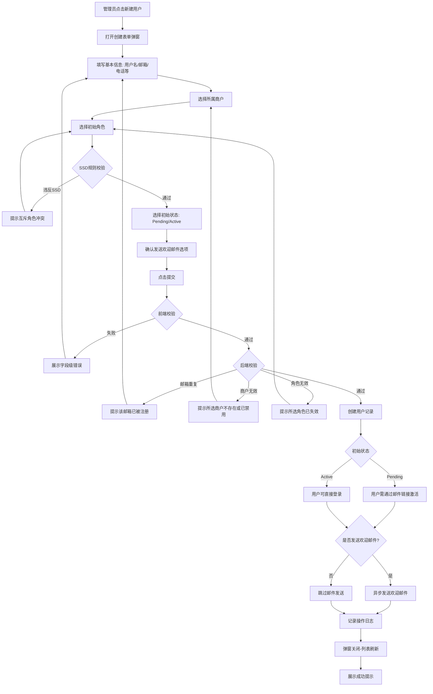

### 5.2 角色管理流程（创建→权限配置→分配给用户）

> ⚠️ **已迁移至 PRD-12**：本节内容已迁移至 PRD-12 权限管理模块 §8.2，此处保留供追溯参考，以 PRD-12 为权威定义。

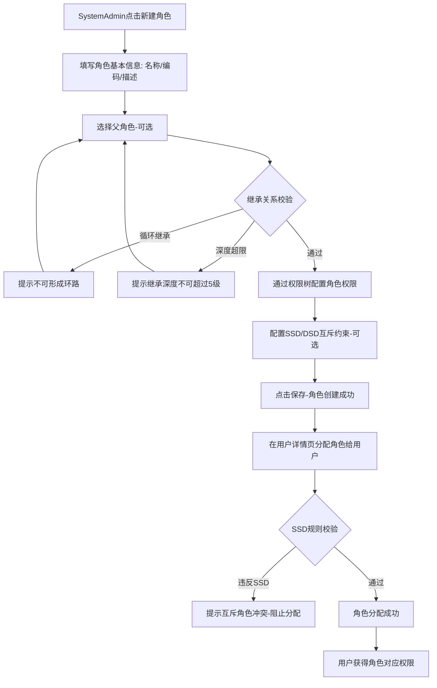

### 5.3 用户状态转换

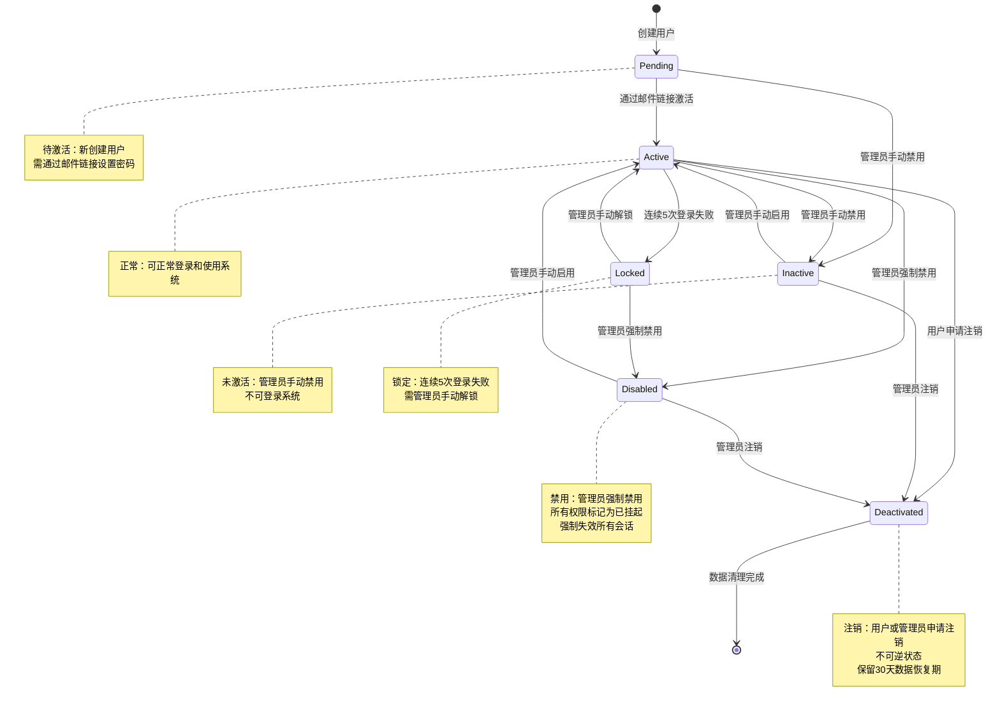

### 5.4 角色状态转换

> ⚠️ **已迁移至 PRD-12**：本节内容已迁移至 PRD-12 权限管理模块 §8.2.3，此处保留供追溯参考，以 PRD-12 为权威定义。

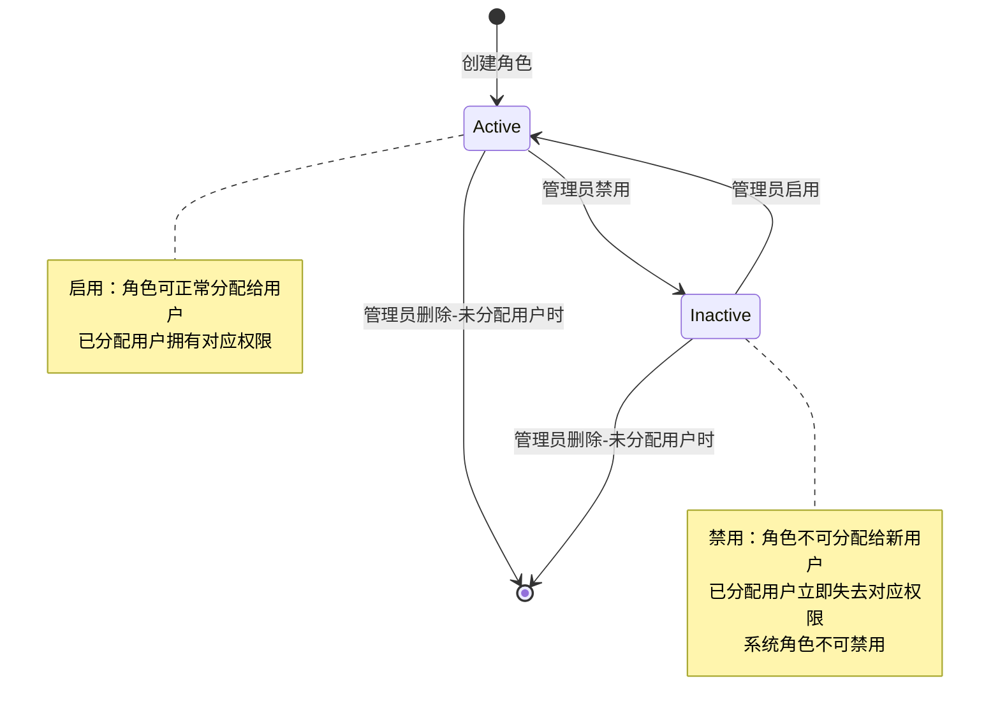

### 5.5 用户登录流程（含MFA验证分支）

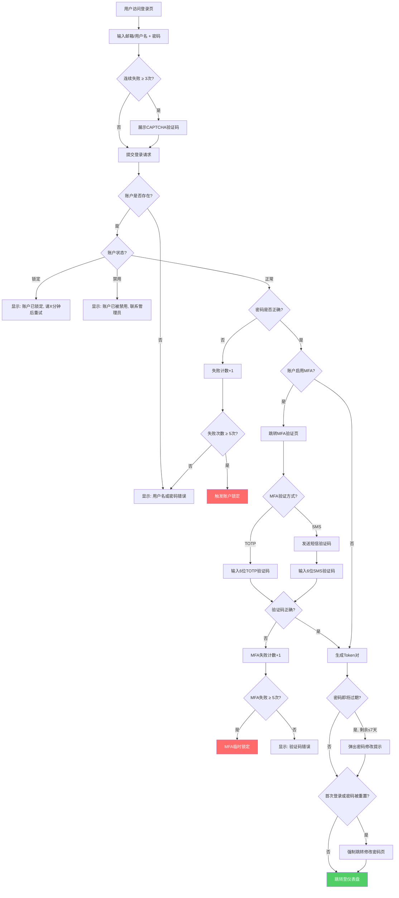

### 5.6 密码重置流程

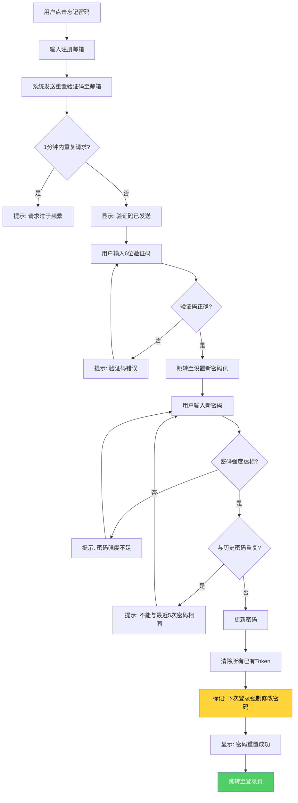

### 5.7 账户锁定与解锁流程

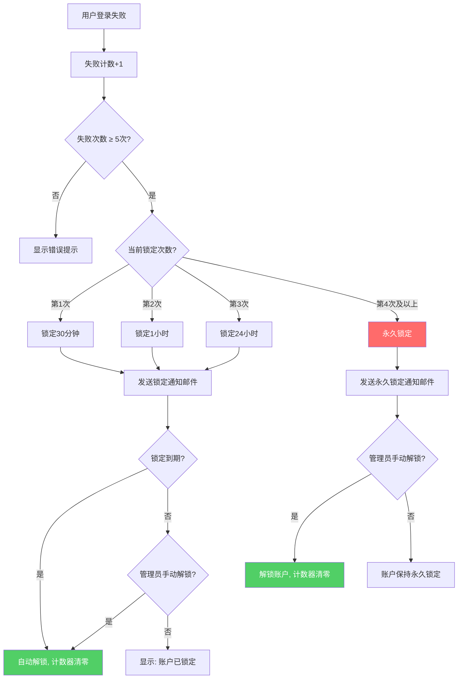

### 5.8 会话管理Token刷新流程

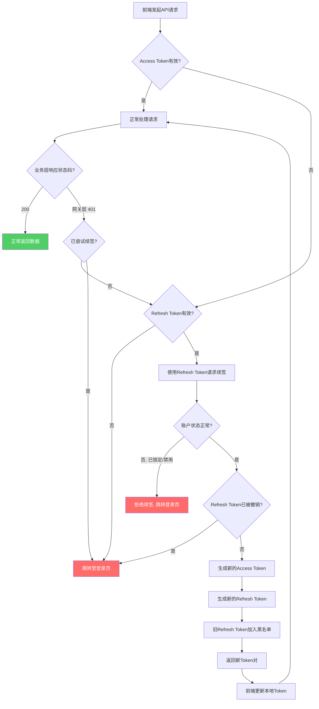

### 5.9 账户状态转换（认证维度详细视图）

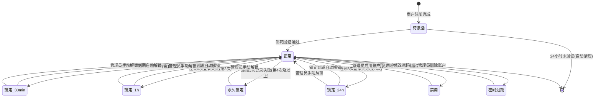

### 5.10 会话状态转换

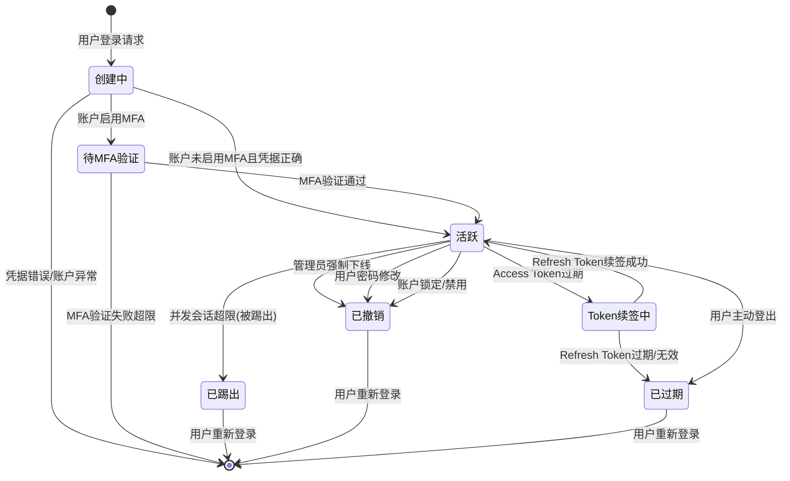

---

## 6. 业务规则

> **BR编号迁移声明**：本节业务规则编号已迁移为 `BR-08-{3位}` 三段式格式（原旧版子域前缀 BR-U-*/BR-R-*/BR-SSD-*/BR-DSD-*/BR-UG-*/BR-UM-*/BR-NAV-* 已全部替换）。

### 6.1 用户管理规则

| 规则编号 | 规则名称 | 规则描述 |
|----------|----------|----------|
| BR-08-029 | 邮箱唯一性 | 用户邮箱在系统全局范围内必须唯一 |
| BR-08-030 | 用户状态流转 | 用户状态支持：Pending→Active（邮件激活）、Pending→Inactive（管理员禁用）、Active→Inactive（管理员禁用）、Inactive→Active（管理员启用）、Active→Locked（连续登录失败）、Locked→Active（管理员解锁）、Locked→Disabled（管理员禁用）、Active→Disabled（管理员禁用）、Disabled→Active（管理员启用）、Active→Deactivated（用户申请注销）、Inactive→Deactivated（管理员注销）、Disabled→Deactivated（管理员注销），其中Deactivated为不可逆状态 |
| BR-08-031 | 账户锁定策略 | 用户连续5次登录失败后自动锁定，锁定时长递增（30分钟→1小时→24小时→永久），详见6.6账户安全规则 |
| BR-08-032 | 删除保护 | 用户为商户唯一管理员时不可删除；用户有未完成审批流程时不可删除 |
| BR-08-033 | 初始密码 | 新创建用户通过欢迎邮件获取密码设置链接，链接有效期72小时 |
| BR-08-034 | MFA要求 | 拥有管理员角色的用户必须启用MFA，未启用时系统强制引导设置 |
| BR-08-035 | 欢迎邮件内容 | 欢迎邮件包含：系统名称、用户名、密码设置链接、有效期说明、客服联系方式 |
| BR-08-036 | 用户禁用级联 | 用户被禁用时，所有有效权限标记为"已挂起"，清除权限缓存，强制失效所有会话 |
| BR-08-037 | 用户注销恢复 | 用户注销后保留30天数据恢复期，超期后永久删除 |

### 6.2 角色管理规则

> ⚠️ **已迁移至 PRD-12**：本节内容已迁移至 PRD-12 权限管理模块 §8.2，此处保留供追溯参考，以 PRD-12 为权威定义。

| 规则编号 | 规则名称 | 规则描述 |
|----------|----------|----------|
| BR-08-038 | 系统角色保护 | 系统预置角色（SuperAdmin、SystemAdmin、SecurityAdmin、AuditAdmin）不可删除、不可禁用 |
| BR-08-039 | 角色编码唯一性 | 角色编码在租户范围内唯一，创建后不可修改 |
| BR-08-040 | 角色删除保护 | 已分配给用户的角色不可删除，需先解除所有用户分配 |
| BR-08-041 | 角色禁用影响 | 角色禁用后，所有已分配该角色的用户立即失去对应权限 |
| BR-08-042 | SuperAdmin权限 | SuperAdmin角色拥有所有权限，不可修改其权限配置 |
| BR-08-043 | 角色模板管理 | 角色模板仅创建者和SuperAdmin/SystemAdmin可编辑和删除 |
| BR-08-044 | 最小权限原则 | 角色创建时默认无任何权限，需管理员显式配置 |
| BR-08-045 | 角色继承深度 | 角色继承链深度不超过5级 |
| BR-08-046 | 循环继承禁止 | 角色继承关系不可形成环路 |
| BR-08-047 | 权限不可缩减 | 子角色不可撤销从父角色继承的权限 |

### 6.3 SSD/DSD规则

> ⚠️ **已迁移至 PRD-12**：本节内容已迁移至 PRD-12 权限管理模块 §8.2.4，此处保留供追溯参考，以 PRD-12 为权威定义。

| 规则编号 | 规则名称 | 规则描述 |
|----------|----------|----------|
| BR-08-048 | SSD分配校验 | 角色分配时自动校验SSD规则，违反时阻止分配并提示冲突信息 |
| BR-08-049 | SSD互斥基数 | 互斥角色集中允许同时分配的最大角色数由互斥基数定义，默认为1 |
| BR-08-050 | 用户组SSD检查 | 用户组关联角色时，检查组成员是否因该关联而违反SSD规则，冲突时发出预警 |
| BR-08-051 | DSD会话校验 | 用户登录时选择激活角色子集，系统根据DSD规则过滤互斥角色 |
| BR-08-052 | DSD角色切换 | 用户在会话中切换角色时，终止当前授权上下文，以新角色集合重建 |
| BR-08-053 | 操作级DSD | 特定敏感操作可配置操作级DSD约束，要求用户仅使用指定角色执行 |

### 6.4 用户组管理规则

> ⚠️ **已迁移至 PRD-12**：本节内容已迁移至 PRD-12 权限管理模块 §8.11，此处保留供追溯参考，以 PRD-12 为权威定义。

| 规则编号 | 规则名称 | 规则描述 |
|----------|----------|----------|
| BR-08-054 | 层级深度限制 | 用户组层级最大深度为5级 |
| BR-08-055 | 单父级约束 | 一个用户组只能有一个父级组 |
| BR-08-056 | 循环引用禁止 | 不允许任何形式的循环引用 |
| BR-08-057 | 权限继承 | 子组默认继承父组权限，子组可追加但不可移除继承的权限 |
| BR-08-058 | 成员唯一性 | 同一用户不可同时属于同一层级路径下的多个同级用户组 |
| BR-08-059 | 删除级联 | 删除用户组时，子组自动提升至被删除组的父级；成员自动移除组关联 |
| BR-08-060 | 导入数量限制 | 单次批量导入最多支持1000条记录 |

### 6.5 用户与商户关联规则

| 规则编号 | 规则名称 | 规则描述 |
|----------|----------|----------|
| BR-08-061 | 商户归属 | 用户通过 `merchant_user` 中间表关联商户（多对多，参见 PRD-07 §7.5）。`tenant_user_users.merchant_id` 字段仅表示当前活跃商户，可通过 Topbar 切换；用户归属商户的增删在 `merchant_user` 表中维护 |
| BR-08-062 | 数据隔离 | 商户管理员仅可管理本商户下的用户，不可跨商户操作 |
| BR-08-063 | 商户禁用影响 | 商户禁用后，该商户下所有Active用户被禁止登录 |

### 6.6 密码安全规则

| 规则编号 | 规则名称 | 规则描述 |
|----------|----------|----------|
| BR-08-001 | 密码最小长度 | 密码长度不得少于8个字符 |
| BR-08-002 | 密码复杂度 | 密码必须至少包含3类字符（大写、小写、数字、特殊字符） |
| BR-08-003 | 密码历史 | 禁止使用最近5次使用过的密码 |
| BR-08-004 | 密码过期 | 密码有效期90天，过期后必须修改 |
| BR-08-005 | 密码存储 | 密码使用bcrypt（cost factor ≥ 12）或Argon2id算法存储 |
| BR-08-006 | 密码传输 | 密码在传输过程中必须使用TLS 1.3加密 |
| BR-08-007 | 弱密码黑名单 | 系统维护1000个常见弱密码黑名单，注册和修改密码时校验 |
| BR-08-008 | 密码重用限制 | 修改密码时不得与最近5次历史密码相同 |
| BR-08-009 | 密码重置后强制修改 | 通过"忘记密码"重置后，首次登录强制修改密码 |

### 6.7 账户安全规则

| 规则编号 | 规则名称 | 规则描述 |
|----------|----------|----------|
| BR-08-010 | 登录失败阈值 | 连续5次登录失败触发账户锁定 |
| BR-08-011 | 锁定时长递增 | 第1次30分钟、第2次1小时、第3次24小时、第4次永久锁定 |
| BR-08-012 | 永久锁定 | 第4次锁定为永久锁定，需管理员手动解锁 |
| BR-08-013 | IP维度限制 | 同一IP 10分钟内20次失败触发IP封禁 |
| BR-08-014 | CAPTCHA触发 | 连续3次登录失败后展示CAPTCHA验证码 |
| BR-08-015 | 锁定通知 | 账户锁定时30秒内发送邮件通知用户 |
| BR-08-016 | 锁定计数重置 | 成功登录后锁定次数计数器归零；距离上次锁定超过30天，计数器自动归零 |

### 6.8 会话安全规则

| 规则编号 | 规则名称 | 规则描述 |
|----------|----------|----------|
| BR-08-017 | Token存储 | Access Token和Refresh Token存储在HttpOnly、Secure、SameSite=Strict的Cookie中 |
| BR-08-018 | 并发会话限制 | 同一账户最多3个并发会话 |
| BR-08-019 | Token续签 | Access Token过期时通过Refresh Token自动续签，对用户无感知 |
| BR-08-020 | 强制失效 | 密码修改、账户锁定、权限变更时所有Token在5秒内失效 |
| BR-08-021 | 设备绑定上限 | 每个账户最多绑定10个可信设备 |
| BR-08-022 | JWT签名算法 | Access Token和Refresh Token使用RS256算法签名 |
| BR-08-023 | Refresh Token Rotation | 每次续签时生成新的Refresh Token，旧Token立即失效 |
| BR-08-024 | Token重放检测 | 检测到已过期的Refresh Token被使用时，撤销该用户所有Refresh Token |

---

## 7. 权限矩阵

### 7.1 用户管理模块权限矩阵

以下权限矩阵与权限验证功能需求说明书中的角色体系（SuperAdmin/SystemAdmin/SecurityAdmin/AuditAdmin）对齐。

| 功能操作 | 权限标识 | SuperAdmin | SystemAdmin | SecurityAdmin | AuditAdmin | 商户管理员 | 普通用户 | 备注 |
|----------|----------|:----------:|:-----------:|:-------------:|:----------:|:----------:|:--------:|------|
| 查看用户列表 | `user:user:list` | ✅ | ✅ | ❌ | ❌ | ✅（本商户） | ❌ | |
| 查看用户详情 | `user:user:read` | ✅ | ✅ | ❌ | ❌ | ✅（本商户） | ✅（仅自己） | |
| 创建用户 | `user:user:create` | ✅ | ✅ | ❌ | ❌ | ✅（本商户） | ❌ | |
| 更新用户 | `user:user:update` | ✅ | ✅ | ❌ | ❌ | ✅（本商户） | ❌ | |
| 删除用户 | `user:user:delete` | ✅ | ✅ | ❌ | ❌ | ❌ | ❌ | |
| 分配用户角色 | `user:user:assign_role` | ✅ | ✅ | ❌ | ❌ | ✅（本商户） | ❌ | |
| 查看角色列表 | `user:role:list` | ✅ | ✅ | ✅ | ✅（只读） | ✅（本商户） | ❌ | |
| 查看角色详情 | `user:role:read` | ✅ | ✅ | ✅ | ✅（只读） | ✅（本商户） | ❌ | |
| 创建角色 | `user:role:create` | ✅ | ✅ | ❌ | ❌ | ✅（本商户） | ❌ | |
| 更新角色 | `user:role:update` | ✅ | ✅ | ❌ | ❌ | ✅（本商户） | ❌ | |
| 删除角色 | `user:role:delete` | ✅ | ✅ | ❌ | ❌ | ❌ | ❌ | |
| 配置SSD/DSD规则 | `security:policy:update` | ✅ | ❌ | ✅ | ❌ | ❌ | ❌ | 功能定义参见 PRD-12 §4.1.4 |
| 查看用户组列表 | `user:usergroup:list` | ✅ | ✅ | ❌ | ❌ | ✅（本商户） | ❌ | |
| 创建用户组 | `user:usergroup:create` | ✅ | ✅ | ❌ | ❌ | ✅（本商户） | ❌ | |
| 更新用户组 | `user:usergroup:update` | ✅ | ✅ | ❌ | ❌ | ✅（本商户） | ❌ | |
| 删除用户组 | `user:usergroup:delete` | ✅ | ✅ | ❌ | ❌ | ❌ | ❌ | |
| 查看操作日志 | `user:user:audit` | ✅ | ❌ | ❌ | ✅ | ❌ | ❌ | |
| 查看个人权限 | `user:user:own_permissions` | ✅ | ✅ | ✅ | ✅ | ✅ | ✅ | |
| 邮箱/用户名+密码登录 | `auth:session:signin` | ✅ | ✅ | ✅ | ✅ | ✅ | ✅ | |
| 记住我 | `auth:session:remember_me` | ✅ | ✅ | ✅ | ✅ | ✅ | ✅ | |
| 忘记密码 | `auth:password:forgot` | ✅ | ✅ | ✅ | ✅ | ✅ | ✅ | |
| MFA启用/配置 | `auth:mfa:setup` | ✅ | ✅ | ✅ | ❌ | ✅ | ✅ | |
| MFA验证 | `auth:mfa:verify` | ✅ | ✅ | ✅ | ✅ | ✅ | ✅ | |
| MFA重置（自己） | `auth:mfa:reset_own` | ✅ | ✅ | ✅ | ❌ | ✅ | ✅ | |
| MFA重置（他人） | `auth:mfa:reset_other` | ✅ | ✅（本商户内） | ❌ | ❌ | ❌ | ❌ | |
| 修改密码（自己） | `auth:password:change` | ✅ | ✅ | ✅ | ✅ | ✅ | ✅ | |
| 密码策略配置 | `auth:policy:password` | ✅ | ❌ | ✅ | ❌ | ❌ | ❌ | 功能定义参见 PRD-12 §13.1.1 |
| 账户锁定策略配置 | `auth:policy:lockout` | ✅ | ❌ | ✅ | ❌ | ❌ | ❌ | 功能定义参见 PRD-12 §13.1.1 |
| 手动解锁账户 | `auth:session:unlock` | ✅ | ✅（本商户内） | ❌ | ❌ | ✅（本商户内） | ❌ | |
| 强制用户下线 | `auth:session:force_logout` | ✅ | ✅（本商户内） | ❌ | ❌ | ✅（本商户内） | ❌ | |
| 会话管理配置 | `auth:session:configure` | ✅ | ❌ | ✅ | ❌ | ❌ | ❌ | 功能定义参见 PRD-12 §13.5 |
| 设备绑定管理 | `auth:device:manage` | ✅ | ✅ | ✅ | ❌ | ✅ | ✅ | |
| IP白名单/黑名单配置 | `auth:policy:ip` | ✅ | ❌ | ✅ | ❌ | ❌ | ❌ | |
| 查看登录审计日志 | `auth:audit:read` | ✅ | ✅（本商户内） | ❌ | ✅ | ❌ | ❌ | |
| 查看安全事件日志 | `auth:audit:security` | ✅ | ❌ | ✅ | ✅ | ❌ | ❌ | |

---

## 8. 数据模型

> **v6 收束说明**：本节为逻辑数据模型描述。权威 DDL 请参考 **§26 PostgreSQL DDL**（使用 `partition_key` 复合主键 + RLS，`tenant_id` 为派生字段 `GENERATED ALWAYS AS (partition_key::uuid) STORED`）。本节中 `tenant_id` 字段描述对应 §26 DDL 中的 `partition_key` 首位复合主键。

> **声明**：以下数据模型为逻辑定义，物理实现以 §26 PostgreSQL DDL 为准。字段类型映射关系见 §26.6（如 BIGINT→UUID、TINYINT→VARCHAR(32)/BOOLEAN、DATETIME→TIMESTAMPTZ、ON UPDATE CURRENT_TIMESTAMP→应用层维护）。本章节已统一为 PostgreSQL 类型，与 §26 DDL 保持一致。

### 8.1 用户数据模型（tenant_user_users）

| 字段名 | 数据类型 | 必填 | 默认值 | 说明 |
|--------|---------|------|--------|------|
| `user_id` | UUID | 是 | - | 用户ID，主键，UUID 自动生成 |
| `username` | VARCHAR(64) | 是 | - | 用户名，全局唯一，用于登录认证 |
| `password_hash` | VARCHAR(256) | 是 | - | 密码哈希值，BCrypt或Argon2算法加密存储 |
| `email` | VARCHAR(128) | 否 | NULL | 邮箱地址，可用于登录认证及消息通知 |
| `phone` | VARCHAR(20) | 否 | NULL | 手机号码，可用于登录认证及短信通知 |
| `status` | VARCHAR(32) | 是 | 'Pending' | 账号状态：Pending（待激活），Active（正常），Locked（锁定），Inactive（未激活），Disabled（禁用），Deactivated（已注销） |
| `security_level` | INTEGER | 是 | 0 | 安全等级，数值越高代表权限管控越严格，取值范围0~99 |
| `department_id` | UUID | 否 | NULL | 所属部门ID，关联组织架构表 |
| `merchant_id` | UUID | 否 | NULL | 当前活跃商户ID（用户可通过 Topbar 切换商户，切换后此字段更新。用户与商户的多对多关系由 PRD-07 的 merchant_user 中间表定义），NULL表示平台级用户 |
| `mfa_enabled` | BOOLEAN | 是 | FALSE | MFA启用状态：FALSE-未启用，TRUE-已启用 |
| `created_at` | TIMESTAMPTZ | 是 | NOW() | 创建时间 |
| `updated_at` | TIMESTAMPTZ | 是 | NOW() | 更新时间（应用层维护） |
| `last_login_at` | TIMESTAMPTZ | 否 | NULL | 最后一次成功登录时间 |
| `deleted_at` | TIMESTAMPTZ | 否 | NULL | 逻辑删除时间，NULL表示未删除 |
| `is_deleted` | BOOLEAN | 是 | - | 逻辑删除标记，GENERATED ALWAYS AS (deleted_at IS NOT NULL) STORED |
| `tenant_id` | VARCHAR(64) | 是 | - | 租户ID（partition_key），用于多租户数据隔离 |

### 8.2 角色数据模型（tenant_perm_role）

> **[已迁移]**：本节内容已完整迁移至 [PRD-12 权限管理](file:///Users/Garabateador/Workspace/banyan/PRD/PRD-12-权限管理.md) §11.2，此处不再保留。请以 PRD-12 为权威来源。

### 8.3 用户组数据模型（tenant_perm_user_group）

> ⚠️ **已迁移至 PRD-12**：本节内容已迁移至 PRD-12 权限管理模块 §8.11，此处保留供追溯参考，以 PRD-12 为权威定义。

| 字段名 | 数据类型 | 必填 | 默认值 | 说明 |
|--------|---------|------|--------|------|
| `group_id` | UUID | 是 | 自动生成 | 用户组ID，主键 |
| `group_code` | VARCHAR(64) | 是 | - | 用户组编码，租户内唯一，如 `DEPT_ENGINEERING` |
| `group_name` | VARCHAR(128) | 是 | - | 用户组显示名称，如"工程部"、"项目Alpha组" |
| `description` | VARCHAR(512) | 否 | NULL | 用户组描述，说明组的用途与成员范围 |
| `parent_group_id` | UUID | 否 | NULL | 父组ID，用于构建用户组树形层级，顶级组为NULL |
| `group_type` | VARCHAR(32) | 是 | ORGANIZATION | 组类型：ORGANIZATION-组织架构组，PROJECT-项目组，CUSTOM-自定义组 |
| `status` | VARCHAR(32) | 是 | ACTIVE | 用户组状态：DISABLED-禁用，ACTIVE-启用 |
| `created_at` | TIMESTAMPTZ | 是 | NOW() | 创建时间 |
| `updated_at` | TIMESTAMPTZ | 是 | NOW() | 更新时间（应用层维护） |
| `partition_key` | VARCHAR(64) | 是 | - | 分区键（存储租户UUID），用于多租户数据隔离 |

### 8.4 用户角色关联数据模型（tenant_perm_user_role）

> ⚠️ **已迁移至 PRD-12**：本节内容已迁移至 PRD-12 权限管理模块 §8.2，此处保留供追溯参考，以 PRD-12 为权威定义。

| 字段名 | 数据类型 | 必填 | 默认值 | 说明 |
|--------|---------|------|--------|------|
| `id` | UUID | 是 | - | 主键，UUID 自动生成 |
| `user_id` | UUID | 是 | - | 用户ID，关联 `tenant_user_users.id` |
| `role_id` | UUID | 是 | - | 角色ID，关联 `tenant_perm_role.id` |
| `assign_type` | VARCHAR(32) | 是 | 'Direct' | 分配方式：Direct（直接分配），GroupInherited（用户组继承） |
| `assigner_id` | UUID | 是 | - | 分配人ID，关联 `tenant_user_users.id` |
| `assigned_at` | TIMESTAMPTZ | 是 | NOW() | 分配时间 |
| `expired_at` | TIMESTAMPTZ | 否 | NULL | 过期时间，NULL表示永不过期 |

### 8.5 用户组成员数据模型（tenant_perm_group_member）

> ⚠️ **已迁移至 PRD-12**：本节内容已迁移至 PRD-12 权限管理模块 §8.11，此处保留供追溯参考，以 PRD-12 为权威定义。

| 字段名 | 数据类型 | 必填 | 默认值 | 说明 |
|--------|---------|------|--------|------|
| `member_id` | UUID | 是 | - | 成员ID，主键，UUID 自动生成 |
| `group_id` | UUID | 是 | - | 用户组ID，关联 `tenant_perm_user_group.id` |
| `user_id` | UUID | 是 | - | 用户ID，关联 `tenant_user_users.id` |
| `joined_at` | TIMESTAMPTZ | 是 | NOW() | 加入时间 |
| `group_role_id` | UUID | 否 | NULL | 组内角色ID，关联 `tenant_perm_role.id`，表示用户在该组内的特定角色 |

### 8.6 角色互斥数据模型（tenant_perm_role_exclusion）

> ⚠️ **已迁移至 PRD-12**：本节内容已迁移至 PRD-12 权限管理模块 §8.2.4，此处保留供追溯参考，以 PRD-12 为权威定义。

| 字段名 | 数据类型 | 必填 | 默认值 | 说明 |
|--------|---------|------|--------|------|
| `exclusion_id` | UUID | 是 | - | 互斥ID，主键，UUID 自动生成 |
| `role_a_id` | UUID | 是 | - | 角色A的ID，关联 `tenant_perm_role.id` |
| `role_b_id` | UUID | 是 | - | 角色B的ID，关联 `tenant_perm_role.id` |
| `constraint_type` | VARCHAR(32) | 是 | 'SSD' | 约束类型：SSD（静态职责分离），DSD（动态职责分离） |
| `description` | VARCHAR(512) | 否 | NULL | 互斥描述，说明两个角色互斥的原因与业务背景 |

### 8.7 会话数据模型（tenant_user_sessions）

| 字段名 | 数据类型 | 必填 | 默认值 | 说明 |
|--------|---------|------|--------|------|
| `session_id` | UUID | 是 | - | 会话ID，主键，UUID 自动生成 |
| `user_id` | UUID | 是 | - | 用户ID，关联 `tenant_user_users.id` |
| `refresh_token_hash` | VARCHAR(64) | 是 | - | Refresh Token的SHA-256哈希值 |
| `device_fingerprint` | VARCHAR(256) | 否 | NULL | 设备指纹信息 |
| `device_name` | VARCHAR(128) | 否 | NULL | 设备名称 |
| `ip_address` | VARCHAR(45) | 是 | - | 登录IP地址（支持IPv4/IPv6） |
| `user_agent` | VARCHAR(512) | 否 | NULL | 浏览器User-Agent |
| `is_remember_me` | BOOLEAN | 是 | FALSE | 是否记住我：FALSE-否，TRUE-是 |
| `expires_at` | TIMESTAMPTZ | 是 | - | 会话过期时间 |
| `created_at` | TIMESTAMPTZ | 是 | NOW() | 创建时间 |
| `revoked_at` | TIMESTAMPTZ | 否 | NULL | 撤销时间，NULL表示未撤销 |
| `tenant_id` | VARCHAR(64) | 是 | - | 租户ID（partition_key），用于多租户数据隔离 |

### 8.8 密码历史数据模型（sys_password_history）

| 字段名 | 数据类型 | 必填 | 默认值 | 说明 |
|--------|---------|------|--------|------|
| `id` | UUID | 是 | 自动生成 | 记录ID，主键 |
| `user_id` | UUID | 是 | - | 用户ID，关联 `tenant_user_users.id` |
| `password_hash` | VARCHAR(256) | 是 | - | 密码SHA-256哈希值（用于历史比对） |
| `created_at` | TIMESTAMPTZ | 是 | NOW() | 创建时间 |
| `partition_key` | VARCHAR(64) | 是 | - | 分区键（存储租户UUID），用于多租户数据隔离 |

---

## 9. 非功能需求

### 9.1 性能需求

| 编号 | 需求描述 | 验收指标 |
|------|----------|----------|
| NFR-P-001 | 用户列表加载时间 | 1000条数据以内，加载时间≤2秒 |
| NFR-P-002 | 用户详情加载时间 | 各Tab数据加载时间≤1秒 |
| NFR-P-003 | 权限计算响应时间 | 用户有效权限计算≤500ms |
| NFR-P-004 | 角色权限变更生效时间 | 权限变更后已分配用户权限生效≤5秒 |
| NFR-P-005 | 批量导入处理能力 | 1000条记录导入处理时间≤30秒 |
| NFR-P-006 | 并发用户支持 | 支持100个管理员同时操作用户管理功能 |
| NFR-P-007 | 搜索响应时间 | 搜索请求响应时间≤300ms |
| NFR-P-008 | 登录响应时间 | 从提交登录到页面跳转完成≤2秒（P95） |
| NFR-P-009 | Token验证响应时间 | 后端中间件Token校验耗时≤50ms（P99） |
| NFR-P-010 | Token续签响应时间 | Refresh Token续签请求耗时≤200ms（P95） |
| NFR-P-011 | 密码强度校验响应时间 | 前端实时校验反馈耗时≤100ms（P95） |
| NFR-P-012 | 邮件发送延迟 | 从触发发送到邮件到达≤30秒（P99） |
| NFR-P-013 | SMS发送延迟 | 从触发发送到短信到达≤60秒（P99） |
| NFR-P-014 | 并发登录支持 | 压力测试峰值≥1000 QPS |

### 9.2 安全需求

| 编号 | 需求描述 |
|------|----------|
| NFR-S-001 | 用户密码采用BCrypt或Argon2算法加密存储，禁止明文存储 |
| NFR-S-002 | 欢迎邮件中的密码设置链接有效期72小时，过期后需重新发送 |
| NFR-S-003 | 管理员角色用户必须启用MFA，未启用时系统强制引导设置 |
| NFR-S-004 | 用户连续5次登录失败后自动锁定账户，锁定时长递增（30分钟→1小时→24小时→永久） |
| NFR-S-005 | 所有用户管理操作（创建/更新/删除/角色变更/状态变更）记录完整审计日志 |
| NFR-S-006 | 敏感操作（删除用户/角色、禁用角色、权限变更）需二次确认 |
| NFR-S-007 | 商户管理员仅可管理本商户数据，实现租户级数据隔离 |
| NFR-S-008 | SSD规则在角色分配时强制校验，不可绕过 |
| NFR-S-009 | DSD规则在会话激活时强制校验，不可绕过 |
| NFR-S-010 | JWT签名算法采用RS256，私钥存储于HSM/KMS，公钥可独立验证 |
| NFR-S-011 | 传输层加密使用TLS 1.3，禁用TLS 1.0/1.1，最低TLS 1.2 |
| NFR-S-012 | Cookie安全属性：HttpOnly + Secure + SameSite=Strict |
| NFR-S-013 | 防枚举攻击：登录失败统一提示"用户名或密码错误" |
| NFR-S-014 | 防CSRF：SameSite Cookie + CSRF Token双重防护 |
| NFR-S-015 | 防XSS：输入过滤 + 输出编码 + CSP策略 |
| NFR-S-016 | Token黑名单：Redis存储，TTL=原Token剩余有效期，支持即时撤销 |
| NFR-S-017 | 敏感数据脱敏：日志中密码/Token等敏感信息脱敏处理 |
| NFR-S-018 | 密码重置链接一次性使用，15分钟过期，防重放攻击 |
| NFR-S-019 | 验证码安全：6位数字，有效期10-15分钟，3次尝试上限 |
| **NFR-S-020** | **强制 MFA 启用** | **PlatformSuperAdmin / PlatformSystemAdmin / PlatformSecurityAdmin / MerchantAdmin 角色首次登录后强制引导启用 MFA，未启用时仅可访问"安全设置"页面，其他功能均不可用** |
| **NFR-S-021** | **敏感操作 MFA 二次验证** | **异地登录（与最近一次成功登录 IP/城市距离 > 100km 或国家变更）、密码修改、修改邮箱/手机号、添加收款账户、删除用户/角色、导出数据等敏感操作强制触发 MFA 二次验证** |
| **NFR-S-022** | **字段级加密（PII）** | **手机号、身份证号、邮箱、银行卡号、地址等 PII 字段使用 AES-256-GCM 算法在数据库层加密存储，密钥由租户级密钥管理（详见 §27 租户级密钥管理）** |
| **NFR-S-023** | **HSM/KMS 统一接入** | **所有密钥的主密钥（Master Key）存储于 HSM（AWS CloudHSM / Azure Dedicated HSM）或 KMS，平台代码中不出现明文密钥** |
| **NFR-S-024** | **审计日志 WORM 存储** | **用户管理、认证、授权等关键审计日志采用 WORM（Write Once Read Many）存储，任何用户（包括超级管理员）均无法修改或删除已写入日志，保留期详见 §22 审计日志规范** |
| **NFR-S-025** | **会话固定保护（Session Fixation）** | **用户登录成功后强制刷新 Session ID 与 Refresh Token，新 Refresh Token 绑定设备指纹（Device Fingerprint），设备指纹变更时强制重新认证** |
| **NFR-S-026** | **CSRF 防护** | **所有状态变更接口（POST/PUT/PATCH/DELETE）强制要求 CSRF Token，CSRF Token 与 Session 绑定，缺失或不匹配时由网关层返回 403，业务层响应统一为 200 并通过 `errors[].code` 返回错误码** |
| **NFR-S-027** | **CORS 防护** | **CORS 白名单仅允许系统设置中配置的域名，支持凭证（credentials）的跨域请求必须显式声明允许来源，禁止 `*` 通配符** |
| **NFR-S-028** | **审计日志操作上下文** | **审计日志记录 `context` 字段（JSON），包含操作前 URL、操作后状态（HTTP Status Code）、关联 traceId、用户代理链、关联资源 ID** |

### 9.3 可用性需求

| 编号 | 需求描述 |
|------|----------|
| NFR-U-001 | 用户管理模块可用性≥99.9% |
| NFR-U-002 | 权限变更支持回滚，回滚操作≤1分钟 |
| NFR-U-003 | 批量导入失败后支持重试，失败记录可下载查看 |
| NFR-U-004 | 用户禁用后权限标记为"已挂起"而非删除，支持快速恢复 |
| NFR-U-005 | 认证服务可用性≥99.99%（月度不可用时间≤4.32分钟） |
| NFR-U-006 | 故障恢复时间（RTO）≤5分钟 |
| NFR-U-007 | 数据恢复点（RPO）≤1分钟 |
| NFR-U-008 | Redis高可用：主从+哨兵模式，自动故障切换 |
| NFR-U-009 | 邮件服务主备双服务商，主服务商故障时自动切换 |
| NFR-U-010 | 降级策略：Redis不可用时降级至数据库，性能下降但功能不中断 |

### 9.4 兼容性需求

| 编号 | 需求描述 |
|------|----------|
| NFR-C-001 | 支持主流浏览器（Chrome 90+、Firefox 88+、Safari 14+、Edge 90+） |
| NFR-C-002 | 批量导入支持CSV和XLSX格式 |
| NFR-C-003 | API 接口遵循 GraphQL 单总线规范（`POST /graphql`），不使用 RESTful 独立端点（详见 v5 收束说明 §15） |

### 9.5 可扩展性需求

| 编号 | 需求描述 |
|------|----------|
| NFR-E-001 | 角色层级深度支持扩展至5级 |
| NFR-E-002 | 用户组层级深度支持扩展至5级 |
| NFR-E-003 | SSD/DSD规则支持动态配置，无需代码变更 |
| NFR-E-004 | 权限树支持动态注册新资源模块 |

---

## 10. 接口需求

### 10.1 用户管理接口

| 接口编号 | 接口名称 | 类型 | GraphQL | 说明 |
|----------|----------|------|---------|------|
| API-U-001 | 获取用户列表 | Query | userList | 支持分页、搜索、多条件筛选 |
| API-U-002 | 获取用户详情 | Query | userDetail(id: ID!) | 返回用户完整信息 |
| API-U-003 | 创建用户 | Mutation | createUser(input: UserInput!) | 创建新用户，支持发送欢迎邮件 |
| API-U-004 | 更新用户 | Mutation | updateUser(id: ID!, input: UserInput!) | 更新用户信息 |
| API-U-005 | 删除用户 | Mutation | deleteUser(id: ID!) | 软删除用户 |
| API-U-006 | 获取用户角色 | Query | userRoles(id: ID!) | 返回用户已分配角色（含来源标注） |
| API-U-007 | 分配角色 | Mutation | assignUserRoles(id: ID!, input: RoleAssignInput!) | 为用户分配角色，触发SSD校验 |
| API-U-008 | 移除角色 | Mutation | removeUserRole(id: ID!, roleId: ID!) | 移除用户角色 |
| API-U-009 | 获取用户有效权限 | Query | userPermissions(id: ID!) | 返回用户所有生效权限（含来源类型） |
| API-U-010 | 获取用户操作日志 | Query | userLogs(id: ID!) | 返回用户操作日志 |
| API-U-011 | 启用用户 | Mutation | enableUser(id: ID!) | 将用户状态变更为Active |
| API-U-012 | 禁用用户 | Mutation | disableUser(id: ID!) | 将用户状态变更为Disabled |
| API-U-013 | 解锁用户 | Mutation | unlockUser(id: ID!) | 将用户状态从Locked变更为Active |
| API-U-014 | 重发欢迎邮件 | Mutation | resendWelcome(id: ID!) | 重新发送欢迎邮件 |

### 10.2 角色管理接口

> ⚠️ **已迁移至 PRD-12**：本节内容已迁移至 PRD-12 权限管理模块 §8.2，此处保留供追溯参考，以 PRD-12 为权威定义。

| 接口编号 | 接口名称 | 类型 | GraphQL | 说明 |
|----------|----------|------|---------|------|
| API-R-001 | 获取角色列表 | Query | roleList | 支持分页、搜索、类型筛选 |
| API-R-002 | 获取角色详情 | Query | roleDetail(id: ID!) | 返回角色完整信息及权限（含继承权限） |
| API-R-003 | 创建角色 | Mutation | createRole(input: RoleInput!) | 创建新角色 |
| API-R-004 | 更新角色 | Mutation | updateRole(id: ID!, input: RoleInput!) | 更新角色信息及权限 |
| API-R-005 | 删除角色 | Mutation | deleteRole(id: ID!) | 删除角色 |
| API-R-006 | 启用/禁用角色 | Mutation | toggleRoleStatus(id: ID!, input: StatusInput!) | 切换角色状态 |
| API-R-007 | 复制角色 | Mutation | copyRole(id: ID!) | 基于现有角色创建副本 |
| API-R-008 | 获取角色模板列表 | Query | roleTemplateList | 返回所有角色模板 |
| API-R-009 | 保存角色模板 | Mutation | saveRoleTemplate(input: RoleTemplateInput!) | 将角色保存为模板 |
| API-R-010 | 从模板创建角色 | Mutation | createRoleFromTemplate(input: TemplateRefInput!) | 基于模板创建角色 |
| API-R-011 | 获取SSD/DSD规则列表 | Query | roleExclusionList | 返回所有角色互斥规则 |
| API-R-012 | 创建SSD/DSD规则 | Mutation | createRoleExclusion(input: RoleExclusionInput!) | 创建角色互斥规则 |
| API-R-013 | 删除SSD/DSD规则 | Mutation | deleteRoleExclusion(id: ID!) | 删除角色互斥规则 |

### 10.3 用户组管理接口

> ⚠️ **已迁移至 PRD-12**：本节内容已迁移至 PRD-12 权限管理模块 §8.11，此处保留供追溯参考，以 PRD-12 为权威定义。

| 接口编号 | 接口名称 | 类型 | GraphQL | 说明 |
|----------|----------|------|---------|------|
| API-UG-001 | 获取用户组列表 | Query | userGroupList | 支持分页、搜索、树形结构 |
| API-UG-002 | 获取用户组详情 | Query | userGroupDetail(id: ID!) | 返回用户组完整信息 |
| API-UG-003 | 创建用户组 | Mutation | createUserGroup(input: UserGroupInput!) | 创建新用户组 |
| API-UG-004 | 更新用户组 | Mutation | updateUserGroup(id: ID!, input: UserGroupInput!) | 更新用户组信息 |
| API-UG-005 | 删除用户组 | Mutation | deleteUserGroup(id: ID!) | 删除用户组 |
| API-UG-006 | 获取组成员列表 | Query | userGroupMembers(id: ID!) | 返回组成员列表 |
| API-UG-007 | 添加组成员 | Mutation | addUserGroupMembers(id: ID!, input: MemberInput!) | 添加单个或多个成员 |
| API-UG-008 | 移除组成员 | Mutation | removeUserGroupMember(id: ID!, userId: ID!) | 移除组成员 |
| API-UG-009 | 批量导入成员 | Mutation | importUserGroupMembers(id: ID!, input: ImportInput!) | 文件上传批量导入 |
| API-UG-010 | 导出成员列表 | Query | exportUserGroupMembers(id: ID!) | 导出成员为文件 |
| API-UG-011 | 获取用户组权限 | Query | userGroupPermissions(id: ID!) | 返回用户组权限配置 |
| API-UG-012 | 更新用户组权限 | Mutation | updateUserGroupPermissions(id: ID!, input: PermissionInput!) | 更新用户组权限配置 |

### 10.4 认证与安全接口

| 接口编号 | 接口名称 | 类型 | GraphQL | 说明 |
|----------|----------|------|---------|------|
| API-AUTH-001 | 用户登录 | Mutation | signin(input: SigninInput!) | 邮箱/用户名+密码登录 |
| API-AUTH-002 | 忘记密码 | Mutation | forgotPassword(input: ForgotPasswordInput!) | 发送密码重置验证码 |
| API-AUTH-003 | 验证重置验证码 | Mutation | verifyResetCode(input: VerifyResetCodeInput!) | 校验密码重置验证码 |
| API-AUTH-004 | 重置密码 | Mutation | resetPassword(input: ResetPasswordInput!) | 通过验证码设置新密码 |
| API-AUTH-005 | 修改密码 | Mutation | changePassword(input: ChangePasswordInput!) | 已登录用户修改密码 |
| API-AUTH-006 | MFA验证 | Mutation | verifyMfa(input: MfaVerifyInput!) | 提交MFA验证码 |
| API-AUTH-007 | MFA设置 | Mutation | setupMfa(input: MfaSetupInput!) | 启用MFA（绑定TOTP/SMS） |
| API-AUTH-008 | MFA重置 | Mutation | resetMfa(input: MfaResetInput!) | 管理员重置用户MFA |
| API-AUTH-009 | Token续签 | Mutation | refreshToken(input: RefreshTokenInput!) | 使用Refresh Token续签Access Token |
| API-AUTH-010 | 用户登出 | Mutation | signout | 退出登录，清除Token |
| API-AUTH-011 | 强制下线 | Mutation | forceLogout(id: ID!) | 管理员强制用户下线 |
| API-AUTH-012 | 解锁账户 | Mutation | unlockAccount(id: ID!) | 管理员手动解锁账户 |
| API-AUTH-013 | 获取登录状态 | Query | authStatus | 检查当前Token是否有效 |
| API-AUTH-014 | 密码强度校验 | Mutation | validatePasswordStrength(input: PasswordInput!) | 实时校验密码强度 |
| API-AUTH-015 | 设备列表 | Query | authDevices | 获取已绑定的可信设备列表 |
| API-AUTH-016 | 设备管理 | Mutation | deleteAuthDevice(id: ID!) | 删除指定可信设备 |

#### API-AUTH-001 用户登录

**请求参数**：

| 参数名 | 类型 | 必填 | 说明 |
|--------|------|------|------|
| account | string | 是 | 邮箱或用户名 |
| password | string | 是 | 密码（明文，TLS传输） |
| remember_me | boolean | 否 | 是否记住我，默认false |
| captcha_token | string | 条件必填 | CAPTCHA Token（连续失败3次后必填） |
| device_fingerprint | string | 否 | 设备指纹信息 |

**响应参数**：

| 参数名 | 类型 | 说明 |
|--------|------|------|
| requires_mfa | boolean | 是否需要MFA验证 |
| mfa_type | string | MFA类型（totp/sms） |
| mfa_session_token | string | MFA临时会话Token（requires_mfa=true时返回） |
| access_token | string | Access Token（requires_mfa=false时返回） |
| refresh_token | string | Refresh Token（requires_mfa=false时返回） |
| expires_in | integer | Access Token有效期（秒） |
| force_change_password | boolean | 是否强制修改密码 |

**错误码**：

| 错误码 | HTTP 状态码 | 说明 |
|--------|------------|------|
| BIZ_USER_AUTH_FAILED | 200 | 用户名或密码错误 |
| BIZ_USER_ACCOUNT_LOCKED | 200 | 账户已锁定 |
| BIZ_USER_ACCOUNT_DISABLED | 200 | 账户已禁用 |
| BIZ_USER_CAPTCHA_FAILED | 200 | CAPTCHA验证失败 |
| BIZ_USER_RATE_LIMITED | 200 | 请求频率过高 |
| BIZ_USER_MFA_CODE_INVALID | 200 | MFA验证码错误 |
| BIZ_USER_MFA_LOCKED | 200 | MFA验证已锁定 |

#### API-AUTH-009 Token续签

**请求参数**：

| 参数名 | 类型 | 必填 | 说明 |
|--------|------|------|------|
| refresh_token | string | 是 | 有效的Refresh Token |

**响应参数**：

| 参数名 | 类型 | 说明 |
|--------|------|------|
| access_token | string | 新的Access Token |
| refresh_token | string | 新的Refresh Token（Rotation） |
| expires_in | integer | 新Access Token有效期（秒） |

**错误码**：

| 错误码 | HTTP 状态码 | 说明 |
|--------|------------|------|
| BIZ_USER_REFRESH_TOKEN_INVALID | 200 | Refresh Token无效或已过期 |
| BIZ_USER_REFRESH_TOKEN_REVOKED | 200 | Refresh Token已被撤销 |
| BIZ_USER_ACCOUNT_INACTIVE | 200 | 账户已锁定或已禁用 |

---

## 11. 上线风险与预案

### 11.1 风险清单

| 风险编号 | 风险描述 | 影响程度 | 发生概率 | 风险等级 |
|----------|----------|----------|----------|----------|
| R-U-001 | 用户数据迁移导致密码哈希不兼容 | 高 | 低 | 高 |
| R-U-002 | 角色权限配置错误导致用户越权访问 | 高 | 中 | 高 |
| R-U-003 | 批量导入大量用户导致系统性能下降 | 中 | 中 | 中 |
| R-U-004 | 欢迎邮件发送延迟或失败影响用户体验 | 低 | 中 | 低 |
| R-U-005 | 用户组层级变更导致权限继承异常 | 高 | 低 | 高 |
| R-U-006 | 角色禁用影响在线用户正在进行的操作 | 中 | 低 | 中 |
| R-U-007 | SSD/DSD规则配置不当导致合法操作被阻止 | 高 | 中 | 高 |
| R-U-008 | 角色层级继承变更导致权限计算异常 | 高 | 低 | 高 |
| R-U-009 | Redis宕机导致锁定策略和Token黑名单失效 | 高 | 低 | 中 |
| R-U-010 | 邮件服务不可用导致验证码无法发送 | 高 | 中 | 高 |
| R-U-011 | JWT私钥泄露导致Token可被伪造 | 极高 | 极低 | 高 |
| R-U-012 | Refresh Token重放攻击 | 高 | 低 | 中 |
| R-U-013 | Token泄露导致账户被盗用 | 高 | 低 | 中 |
| R-U-014 | 密码策略过严导致用户投诉 | 中 | 中 | 中 |

### 11.2 预案措施

| 风险编号 | 预案措施 |
|----------|----------|
| R-U-001 | 上线前进行密码哈希算法兼容性测试；保留旧哈希值，支持双算法验证过渡期；提供批量重置密码工具 |
| R-U-002 | 权限变更前进行影响分析，展示受影响用户清单；提供权限预览和模拟测试功能；保留权限变更回滚能力 |
| R-U-003 | 批量导入采用异步处理，限制单次导入数量（最多1000条）；导入进度实时展示；失败记录支持下载查看 |
| R-U-004 | 邮件发送采用消息队列异步处理；失败自动重试3次；提供手动重发入口；邮件发送状态可查询 |
| R-U-005 | 层级变更前进行影响分析，展示受影响的组和用户；提供层级变更预览功能；保留变更前快照支持回滚 |
| R-U-006 | 角色禁用采用优雅降级策略，当前请求完成后再生效；禁用前发送通知给受影响用户的管理员 |
| R-U-007 | SSD/DSD规则配置前提供模拟测试功能；预置规则经过安全团队审核；提供规则紧急禁用开关 |
| R-U-008 | 角色层级变更前进行权限影响分析；提供变更预览功能；保留变更前快照支持回滚 |
| R-U-009 | Redis采用主从+哨兵模式，确保高可用；降级至数据库记录锁定状态，同时触发Redis故障告警 |
| R-U-010 | 接入多邮件服务商（主备切换），设置发送队列；自动切换至备用邮件服务商，队列消息积压超过阈值时告警 |
| R-U-011 | JWT私钥存储在HSM或KMS中，定期轮换；私钥泄露后立即轮换密钥对，撤销所有已发放Token，强制全量重新登录 |
| R-U-012 | Refresh Token Rotation机制，检测重放时撤销所有Token；检测到已过期Refresh Token被使用时，撤销该用户所有Refresh Token |
| R-U-013 | Token使用HttpOnly+Secure Cookie，短期有效期；发现泄露时立即将Token加入黑名单，强制所有用户重新登录 |
| R-U-014 | 上线前进行用户调研，设置合理的默认策略值；提供管理员后台可调整策略参数，收集用户反馈后动态调整 |

### 11.3 上线检查清单

- [ ] 用户列表、详情、创建、编辑、删除功能全部通过验收测试
- [ ] 角色CRUD、权限批量配置、复制模板化功能全部通过验收测试
- [ ] 角色层级继承功能通过验收测试
- [ ] SSD/DSD规则配置和校验功能通过验收测试
- [ ] 用户组CRUD、成员导入导出、层级管理功能全部通过验收测试
- [ ] 权限继承和合并逻辑验证通过（直接权限∪角色继承权限∪用户组继承权限）
- [ ] 欢迎邮件发送流程验证通过
- [ ] 用户与商户关联功能验证通过
- [ ] 所有API接口通过安全测试
- [ ] 性能测试通过（用户列表加载≤2s，权限计算≤500ms）
- [ ] 数据迁移脚本验证通过
- [ ] 操作日志记录完整准确
- [ ] 权限控制验证通过（各角色仅可访问授权功能）
- [ ] 监控告警配置完成
- [ ] 回滚方案准备就绪
- [ ] 密码策略参数已配置并验证
- [ ] 账户锁定策略参数已配置并验证（30min/1h/24h/永久）
- [ ] 邮件服务已配置并测试发送
- [ ] CAPTCHA服务已配置并测试
- [ ] Redis高可用已部署并测试故障切换
- [ ] TLS 1.3证书已配置并验证
- [ ] JWT RS256密钥对已生成，私钥存入HSM/KMS
- [ ] NTP时间同步已配置
- [ ] 审计日志已配置并验证记录完整性
- [ ] 压力测试通过（并发登录1000 QPS）
- [ ] Refresh Token Rotation机制已验证
- [ ] 密码重置后强制修改密码流程已验证
- [ ] MFA完整配置和验证流程已验证

---

## 12. 模块仪表盘与导航

> 本章节整合自 PRD-02（仪表盘与工作空间）和 PRD-12（全局导航与模块关系），提取与用户管理模块相关的仪表盘KPI及导航功能。

### 12.1 仪表盘KPI卡片

#### 12.1.1 Total Users（总用户数）— 全局维度

**用户故事**：作为平台超级管理员，我希望在仪表盘第一时间看到全平台的总用户数，以便掌握系统的用户规模和增长趋势。

| 指标名称 | 数据来源 | 计算公式 | 刷新频率 | 单位 | 格式 | 趋势对比 |
|----------|----------|----------|----------|------|------|----------|
| Total Users（总用户数） | 用户管理模块 | `COUNT(所有未禁用用户)` | 5分钟 | 人 | 千分位格式 | 与上周同期对比 |

**数据范围说明**：
- 平台超级管理员：查看全平台所有Merchant的用户数聚合
- 商户管理员：仅展示当前Merchant范围内的用户数
- 部门管理员：仅展示本部门及下级部门的用户数
- 普通用户：仅展示个人维度的基本信息

**交互说明**：
- 点击该KPI卡片跳转至用户列表页面（`/users`）
- 悬停Tooltip展示最近7天用户数趋势迷你图
- 趋势箭头颜色语义：绿色↑=正向增长，红色↓=负向下降，灰色=无变化

**验收标准**：

| 编号 | 验收标准 | 验证方法 |
|------|----------|----------|
| AC-UK-01 | Total Users KPI正确展示全平台（超级管理员）或当前Merchant（商户管理员）的未禁用用户数 | 对比用户管理模块数据验证 |
| AC-UK-02 | 不同角色看到的数据范围与权限矩阵一致 | 分别以超级管理员、商户管理员、部门管理员角色登录验证 |
| AC-UK-03 | 点击KPI卡片正确跳转至用户列表页 | 点击卡片验证跳转路由 |

### 12.2 Sidebar用户管理菜单项

**菜单项定义**：

| 序号 | 菜单名称 | 英文标识 | 图标 | 路由路径 | 权限要求 | 所属架构层 |
|------|----------|----------|------|----------|----------|------------|
| 11 | 用户管理 | Users | user | /users | `user:user:list` | 管理模块 |

**菜单分组规则**：用户管理菜单项归属于"管理模块"分组，与商户管理、权限管理同组，使用分割线与其他架构层分组区分。

**导航交互规则**：

| 规则编号 | 规则描述 |
|----------|----------|
| BR-08-064 | 用户管理菜单项根据用户权限动态展示，无`user:user:list`权限的用户不显示该菜单项 |
| BR-08-065 | 用户点击"用户管理"菜单项，主内容区切换至用户列表页面，菜单项高亮展示 |
| BR-08-066 | 折叠状态下，悬停用户管理图标展示Tooltip"用户管理" |

**权限矩阵（用户管理菜单可见性）**：

| 角色 | 菜单可见 | 说明 |
|------|----------|------|
| 超级管理员 | ✅ | 可访问用户管理模块 |
| 商户管理员 | ✅ | 可访问本商户下的用户管理 |
| 部门管理员 | ✅ | 可访问本部门的用户管理 |
| 普通用户 | ❌ | 无权访问用户管理模块 |
| 审计员 | ❌ | 无权访问用户管理模块 |

### 12.3 Topbar用户信息区域

**用户故事**：作为系统用户，我希望通过Topbar用户信息下拉菜单快速访问个人信息、查看权限和退出登录，以便高效管理个人账户和会话。

**功能入口**：Topbar右侧 > 用户头像/名称 > 下拉菜单

**用户信息下拉菜单项**：

| 菜单项 | 英文标识 | 图标 | 说明 | 权限要求 |
|--------|----------|------|------|----------|
| 个人信息 | Profile | user | 查看和编辑个人信息 | 无（所有用户） |
| 我的权限 | Permission | shield | 查看当前用户的所有有效权限 | 无（所有用户） |
| 退出登录 | Sign Out | logout | 退出当前会话 | 无（所有用户） |

> 注：切换商户（Switch Merchant）和我的权益（My Benefits）菜单项归属商户管理模块（详见PRD-07 §18.5），此处不重复定义。

**个人信息（Profile）功能**：

| 功能项 | 说明 |
|--------|------|
| 跳转目标 | 个人信息编辑页面（`/profile`） |
| 可编辑字段 | 头像、昵称、密码 |
| 头像要求 | 圆形，32x32px，支持PNG/JPG/SVG，最大2MB |

**我的权限（Permission）功能**：

| 功能项 | 说明 |
|--------|------|
| 跳转目标 | 权限查看页面（`/my-permissions`） |
| 展示内容 | 当前用户的所有有效权限，按资源模块分组 |
| 权限来源 | 角色权限 / 用户组权限 / 直接分配权限 |

**退出登录（Sign Out）功能**：

| 功能项 | 说明 |
|--------|------|
| 操作行为 | 退出当前会话，跳转至登录页面 |
| 二次确认 | 需弹窗确认"确定退出登录？" |
| 异常处理 | 网络异常时提示"退出失败，请重试"，用户当前会话保持 |

**交互说明**：
- 用户头像为圆形，尺寸32x32px
- 下拉菜单从右上角向下展开，宽度200px
- 菜单项悬停时展示浅色背景
- "退出登录"菜单项与其他菜单项之间有分割线

**验收标准**：

| 编号 | 验收标准 | 验证方法 |
|------|----------|----------|
| AC-UI-01 | 用户下拉菜单正确展示Profile、Permission、Sign Out三项 | 点击头像检查菜单 |
| AC-UI-02 | Profile跳转至个人信息编辑页面 | 点击Profile验证跳转 |
| AC-UI-03 | Permission跳转至权限查看页面，正确展示所有有效权限 | 点击Permission验证权限列表 |
| AC-UI-04 | Sign Out需二次确认，确认后正确退出登录 | 点击Sign Out验证确认弹窗和退出行为 |
| AC-UI-05 | 下拉菜单点击外部区域自动关闭 | 点击菜单外区域验证关闭 |

### 12.4 User/Role/Group模块依赖关系

**模块依赖矩阵（用户管理相关）**：

| 模块 | Users | Roles | Groups | Merchants | Permissions |
|------|-------|-------|--------|-----------|-------------|
| Users | — | R（读取依赖） | R（读取依赖） | ↔（双向依赖） | R（读取依赖） |
| Roles | D（数据来源） | — | R（读取依赖） | — | R（读取依赖） |
| Groups | D（数据来源） | R（读取依赖） | — | — | R（读取依赖） |

> R = Read（读取依赖），D = Data Source（数据来源），↔ = 双向交互

**核心依赖关系详解**：

**关系1：Users ↔ Merchants（双向依赖）**

| 维度 | 说明 |
|------|------|
| 方向 | Users ↔ Merchants |
| 类型 | 双向依赖 |
| 描述 | Users（用户管理）和Merchants（商户管理）之间存在多对多关系。用户归属于特定商户，商户下包含多个用户。商户的状态变更会影响其下所有用户的访问权限 |
| 数据流 | 商户创建 → 用户关联 → 权限继承 → 商户状态变更 → 用户权限更新 |
| 影响范围 | 商户禁用时，其下所有用户的访问权限同步失效 |

**关系2：Users → Roles（用户与角色）**

| 维度 | 说明 |
|------|------|
| 方向 | Users → Roles |
| 类型 | 分配依赖 |
| 描述 | 用户通过关联角色获得权限，角色定义了一组权限的逻辑集合。用户可关联多个角色，最终权限为所有角色权限的并集 |
| 数据流 | 角色定义 → 用户分配 → 权限计算 → RBAC预检 |
| 影响范围 | 角色权限变更时，所有关联该角色的用户权限同步更新 |

**关系3：Users → Groups（用户与用户组）**

| 维度 | 说明 |
|------|------|
| 方向 | Users → Groups |
| 类型 | 组织依赖 |
| 描述 | 用户可归属于多个用户组，用户组的权限与用户角色权限取并集。用户组支持按组织架构或业务维度批量管理用户 |
| 数据流 | 用户组创建 → 成员添加 → 组权限继承 → 权限合并计算 |
| 影响范围 | 用户组权限变更时，所有组成员的权限同步更新 |

**关系4：Roles → Permissions（角色与权限策略）**

| 维度 | 说明 |
|------|------|
| 方向 | Roles → Permissions |
| 类型 | 策略依赖 |
| 描述 | 角色的权限定义受ABAC策略约束，权限判定时先进行RBAC角色预检，再进行ABAC精细判定 |
| 数据流 | 角色权限 → RBAC预检 → ABAC策略评估 → 最终决策 |
| 影响范围 | ABAC策略变更可能覆盖角色权限的判定结果 |

---

## 13. 模块关系总览

> 本章节整合自 PRD-12（全局导航与模块关系）§5.4 模块关系总览，从用户管理模块视角梳理其与系统中其他模块的位置关系和依赖关系。

### 13.1 用户管理在系统中的位置

用户管理（User Management）模块是平台权限体系的核心，属于"管理模块"分组的三大支柱之一（与商户管理、权限管理并列）。从系统分层架构来看，用户管理模块不直接归属于五层架构中的某一层，而是横跨所有架构层，为各层提供身份认证、角色分配、权限管控等基础能力。

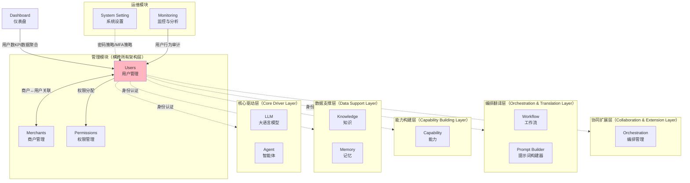

**用户管理模块的定位说明**：

| 维度 | 说明 |
|------|------|
| 模块归属 | 管理模块分组（与商户管理、权限管理并列） |
| 架构定位 | 横跨所有五层架构，为各层提供身份认证与权限管控 |
| 核心职责 | 用户生命周期管理、角色与用户组维护、权限分配与验证、用户行为审计 |
| 上游依赖 | 商户管理（用户归属商户）、权限管理（权限策略配置）、系统设置（密码/MFA策略） |
| 下游消费者 | 全部业务模块（依赖用户认证与授权）、仪表盘（用户数KPI）、监控分析（用户行为日志） |

### 13.2 与其他模块的关系

#### 13.2.1 模块依赖矩阵（用户管理视角）

```
                Users  Roles  Groups  Merch  Perm  Dash  Monit  Setting  Auth(PRD-01)
Users            —     R     R       ↔      R     D     R      R        R
Roles            D     —     R       —      R     —     R      R        R
Groups           D     R     —       —      R     —     R      R        R
Merchants        ↔     —     —       —      R     D     R      R        R
Permissions      R     R     R       R      —     —     R      R        R
```

> R = Read（读取依赖），D = Data Source（数据来源），↔ = 双向交互

#### 13.2.2 核心依赖关系详解

**关系1：Users ↔ Merchants（双向依赖）**

| 维度 | 说明 |
|------|------|
| 方向 | Users ↔ Merchants |
| 类型 | 双向依赖 |
| 描述 | Users（用户管理）和 Merchants（商户管理）之间存在多对多关系。商户下包含多个用户，用户归属于特定商户。商户的状态变更会影响其下所有用户的访问权限 |
| 数据流 | 商户创建 → 用户关联 → 权限继承 → 商户状态变更 → 用户权限更新 |
| 影响范围 | 商户禁用时，其下所有用户的访问权限同步失效 |
| 用户管理视角 | 用户管理依赖商户管理获取商户列表用于关联；商户管理依赖用户管理统计用户数、查询成员列表 |

**关系2：Users → Roles（用户与角色）**

| 维度 | 说明 |
|------|------|
| 方向 | Users → Roles |
| 类型 | 分配依赖 |
| 描述 | 用户通过关联角色获得权限，角色定义了一组权限的逻辑集合。用户可关联多个角色，最终权限为所有角色权限的并集 |
| 数据流 | 角色定义 → 用户分配 → 权限计算 → RBAC预检 |
| 影响范围 | 角色权限变更时，所有关联该角色的用户权限同步更新 |

**关系3：Users → Groups（用户与用户组）**

| 维度 | 说明 |
|------|------|
| 方向 | Users → Groups |
| 类型 | 组织依赖 |
| 描述 | 用户可归属于多个用户组，用户组的权限与用户角色权限取并集。用户组支持按组织架构或业务维度批量管理用户 |
| 数据流 | 用户组创建 → 成员添加 → 组权限继承 → 权限合并计算 |
| 影响范围 | 用户组权限变更时，所有组成员的权限同步更新 |

**关系4：Users → Permissions（被权限管理分配权限）**

| 维度 | 说明 |
|------|------|
| 方向 | Users → Permissions |
| 类型 | 策略依赖 |
| 描述 | 用户的有效权限受 ABAC 策略约束，权限判定时先进行 RBAC 角色预检，再进行 ABAC 精细判定。用户管理模块定义用户、角色、用户组实体，权限判定逻辑由权限管理模块执行 |
| 数据流 | 用户/角色/用户组 → RBAC预检 → ABAC策略评估 → 最终决策 |
| 影响范围 | ABAC策略变更可能覆盖用户/角色权限的判定结果 |

**关系5：Users ← Dashboard（被数据聚合）**

| 维度 | 说明 |
|------|------|
| 方向 | Dashboard → Users |
| 类型 | 数据读取 |
| 描述 | Dashboard 从用户管理模块聚合"Total Users（总用户数）"KPI 指标，按用户所属商户展示用户规模与增长趋势 |
| 数据流 | 用户管理模块数据 → 聚合查询 → KPI计算 → 仪表盘展示 |
| 影响范围 | 用户管理模块故障时，仪表盘 Total Users 卡片显示加载失败 |

**关系6：Users ← System Setting（接收全局配置）**

| 维度 | 说明 |
|------|------|
| 方向 | System Setting → Users |
| 类型 | 配置依赖 |
| 描述 | System Setting 为用户管理模块提供全局配置参数，包括密码策略、账户锁定策略、MFA策略、会话超时等。配置变更时通过事件总线实时推送 |
| 数据流 | 配置变更 → 事件总线 → 用户管理模块监听 → 配置热更新 |
| 影响范围 | 全局安全策略变更将影响所有用户的认证与会话行为 |

**关系7：Users ← Monitoring（被审计与监控）**

| 维度 | 说明 |
|------|------|
| 方向 | Monitoring → Users |
| 类型 | 监控采集 |
| 描述 | Monitoring 从用户管理模块采集用户行为日志、登录日志、权限变更日志，进行安全审计与异常行为分析 |
| 数据流 | 用户操作日志 → 采集Agent → PostgreSQL 分区表 / Prometheus → 监控面板/告警规则 |
| 影响范围 | 用户管理模块需暴露标准审计日志接口供 Monitoring 采集 |

#### 13.2.3 模块依赖关系图

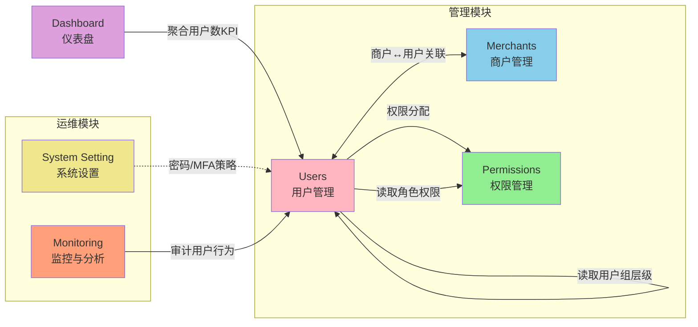

#### 13.2.4 验收标准

| 编号 | 验收标准 | 验证方法 |
|------|----------|----------|
| AC-MR-U-01 | 用户管理模块与商户管理模块的双向依赖关系正确建立 | 创建商户后能在用户管理中关联该商户；创建用户后能在商户详情查看成员 |
| AC-MR-U-02 | 用户管理模块依赖权限管理模块的策略进行权限判定 | 配置 ABAC 策略后，验证用户访问行为受策略约束 |
| AC-MR-U-03 | 仪表盘 Total Users KPI 数据与用户管理模块数据一致 | 对比数据库用户数与仪表盘展示数值 |
| AC-MR-U-04 | 系统设置的密码策略变更实时生效 | 修改密码策略后用户下次修改密码时按新策略校验 |
| AC-MR-U-05 | 监控模块可正常采集用户管理模块的操作日志 | 在监控面板验证用户操作日志数据完整 |

---

## 14. 非功能需求汇总

> **v6 收束说明(2026-06-14)**：本章节保留作为跨模块横向 NFR 的"汇总视角"，NFR 编号沿用 `NFR-P-U-001~` 等带模块前缀的格式。NFR 的**内容权威**为 §9（非功能需求）`NFR-P-001~NFR-P-S-018`，所有 NFR-P-U-* 编号视为 §9 对应 NFR-P-* 编号的别名，**不**作为新独立需求。
>
> 新增跨模块横向 NFR 时，必须先在 §9 增加原始定义，再在本章节增加汇总引用，**不**允许单独在 §14 新增 NFR-P-U-* 编号。

> 本章节整合自 PRD-12（全局导航与模块关系）§5.5 非功能需求汇总，从用户管理模块视角汇总性能、安全、可用性、兼容性和可观测性等非功能需求。PRD-08 原有 §9（性能/安全/可用性/兼容性/可扩展性）已涵盖本模块特有需求，本章节重点补充跨模块的横向非功能要求。

### 14.1 性能需求

| 编号 | 需求项 | 指标 | 验证方法 |
|------|--------|------|----------|
| NFR-P-U-001 | 用户列表加载时间 | ≤ 2秒（1000条数据以内） | 前端性能监控 |
| NFR-P-U-002 | 用户详情加载时间 | 各Tab数据加载≤ 1秒 | 前端性能监控 |
| NFR-P-U-003 | 权限计算响应时间 | 用户有效权限计算 ≤ 500ms | APM性能监控 |
| NFR-P-U-004 | 角色权限变更生效时间 | 权限变更后已分配用户权限生效 ≤ 5秒 | 集成测试 |
| NFR-P-U-005 | 批量导入处理能力 | 1000条记录导入处理 ≤ 30秒 | 性能测试 |
| NFR-P-U-006 | 并发用户支持 | ≥ 100个管理员同时操作 | 压力测试 |
| NFR-P-U-007 | 搜索响应时间 | ≤ 300ms | 接口性能测试 |
| NFR-P-U-008 | 登录响应时间 | ≤ 2秒（P95） | APM性能监控 |
| NFR-P-U-009 | Token验证响应时间 | ≤ 50ms（P99） | 中间件性能监控 |
| NFR-P-U-010 | Token续签响应时间 | ≤ 200ms（P95） | APM性能监控 |
| NFR-P-U-011 | 导航菜单加载时间 | ≤ 300ms（含权限过滤） | 前端性能监控 |
| NFR-P-U-012 | 我的权限页面加载时间 | ≤ 1秒（P95） | 前端性能监控 |
| NFR-P-U-013 | 权限诊断响应时间 | ≤ 100ms（单次诊断，P95） | APM性能监控 |
| NFR-P-U-014 | 权限差距分析响应时间 | ≤ 2秒（对比两个对象） | APM性能监控 |

### 14.2 安全需求

| 编号 | 需求项 | 指标 | 验证方法 |
|------|--------|------|----------|
| NFR-S-U-001 | 传输加密 | 全站HTTPS，TLS 1.2+ | SSL Labs测试 |
| NFR-S-U-002 | 数据加密 | 敏感数据 RSA 加密传输，AES-256 加密存储 | 代码审查+渗透测试 |
| NFR-S-U-003 | 密码存储 | BCrypt 哈希存储，cost factor ≥ 12 | 代码审查 |
| NFR-S-U-004 | 认证机制 | JWT + Refresh Token 双Token机制 | 安全测试 |
| NFR-S-U-005 | Token有效期 | Access Token 30分钟，Refresh Token 7天 | 配置检查 |
| NFR-S-U-006 | 数据脱敏 | 敏感数据展示时自动脱敏（手机号、邮箱、身份证等） | 功能测试 |
| NFR-S-U-007 | 审计日志 | 所有敏感操作记录审计日志（不可篡改） | 功能测试 |
| NFR-S-U-008 | 多租户隔离 | 商户间数据完全隔离，杜绝跨租户数据访问 | 渗透测试 |
| NFR-S-U-009 | 防注入 | SQL注入、XSS、CSRF、SSRF防护 | 渗透测试 |
| NFR-S-U-010 | 请求限流 | 单用户API调用频率限制（100次/分钟） | 压力测试 |
| NFR-S-U-011 | CORS策略 | 仅允许白名单域名跨域访问 | 配置检查 |
| NFR-S-U-012 | 安全头部 | 启用CSP、X-Frame-Options、X-Content-Type-Options等安全头部 | HTTP头部检查 |
| NFR-S-U-013 | 权限诊断审计 | 所有权限诊断操作记录审计日志 | 日志审查 |
| NFR-S-U-014 | 导航权限隔离 | 导航菜单严格按权限过滤，禁止通过URL绕过访问无权限模块 | 渗透测试 |
| NFR-S-U-015 | SSD/DSD强制校验 | 角色分配与会话激活时强制校验，不可绕过 | 安全测试 |
| NFR-S-U-016 | Token黑名单 | Redis 存储，TTL=原Token剩余有效期，支持即时撤销 | 功能测试 |

### 14.3 可用性需求

| 编号 | 需求项 | 指标 | 验证方法 |
|------|--------|------|----------|
| NFR-A-U-001 | 系统可用性 | ≥ 99.9%（月度） | 监控报表 |
| NFR-A-U-002 | 计划内维护窗口 | 每月不超过2次，每次不超过2小时 | 维护记录 |
| NFR-A-U-003 | 数据备份频率 | 每日全量备份 + 每小时增量备份 | 备份记录 |
| NFR-A-U-004 | RPO（恢复点目标） | ≤ 5分钟 | 灾备演练 |
| NFR-A-U-005 | RTO（恢复时间目标） | ≤ 30分钟 | 灾备演练 |
| NFR-A-U-006 | 故障切换时间 | ≤ 10秒（自动故障切换） | 高可用测试 |
| NFR-A-U-007 | API错误率 | ≤ 0.1%（排除客户端错误） | 监控报表 |
| NFR-A-U-008 | 导航降级 | 权限接口故障时展示基础导航（仅Dashboard） | 故障注入测试 |
| NFR-A-U-009 | 认证服务可用性 | ≥ 99.99%（月度不可用时间≤4.32分钟） | 监控报表 |
| NFR-A-U-010 | 权限变更回滚 | 支持回滚，操作 ≤ 1分钟 | 功能测试 |

### 14.4 兼容性需求

| 编号 | 需求项 | 指标 | 验证方法 |
|------|--------|------|----------|
| NFR-C-U-001 | 浏览器兼容性 | Chrome 90+、Firefox 88+、Safari 14+、Edge 90+ | 多浏览器测试 |
| NFR-C-U-002 | 分辨率适配 | 最小支持1280x720（桌面端），推荐1920x1080 | 响应式测试 |
| NFR-C-U-003 | 移动端适配 | iOS Safari 14+、Android Chrome 90+（仅查看功能） | 移动端测试 |
| NFR-C-U-004 | API向后兼容 | API版本升级时，旧版本至少保留6个月兼容期 | 版本管理检查 |
| NFR-C-U-005 | 响应式断点 | 支持XL/LG/MD/SM四个断点平滑适配 | 响应式测试 |
| NFR-C-U-006 | 批量导入格式 | 支持CSV和XLSX格式 | 功能测试 |

### 14.5 可观测性需求

| 编号 | 需求项 | 指标 | 验证方法 |
|------|--------|------|----------|
| NFR-O-U-001 | 分布式追踪 | 所有API请求支持分布式链路追踪（traceId贯穿） | 链路追踪验证 |
| NFR-O-U-002 | 指标监控 | 所有服务暴露Prometheus指标接口（/metrics） | 监控系统验证 |
| NFR-O-U-003 | 健康检查 | 所有服务提供健康检查接口（/health） | 健康检查验证 |
| NFR-O-U-004 | 告警规则 | 关键指标异常时5分钟内触发告警通知 | 告警测试 |
| NFR-O-U-005 | 用户行为埋点 | 用户管理模块关键操作（登录、权限变更、角色分配等）埋点上报 | 数据分析验证 |
| NFR-O-U-006 | 权限诊断埋点 | 所有权限诊断操作记录审计日志与埋点数据 | 日志审查+数据分析 |
| NFR-O-U-007 | 登录异常监控 | 异常登录（异地、异常时段、暴力破解）实时告警 | 监控告警验证 |

---

## 15. 接口规范汇总

> 本章节整合自 PRD-12（全局导航与模块关系）§5.6 接口规范汇总，重点说明与用户管理模块相关的接口规范约束。所有用户管理相关 API（详见 §10）均应严格遵守本章定义。

### 15.1 接口总则（GraphQL 单总线）

> **v5 收束说明(2026-06-13)**：用户管理模块对外**仅**暴露 GraphQL 单总线接口，详见 §A5 GraphQL Schema。**不**再设计 RESTful 端点、不使用 `/api/v1/...` 资源路径、不使用 HTTP 方法语义区分操作。

| 规范项 | 说明 |
|--------|------|
| 接口形态 | **GraphQL**（POST `/graphql`），遵循 PRD-00 §A5 GraphQL Schema 设计规范 |
| 操作类型 | `Query`（查询）、`Mutation`（写操作）、`Subscription`（实时推送） |
| 命名约定 | Query 使用名词 / 动词 + 资源，`Mutation` 使用动词 + 资源 + Input |
| 多租户 | `info.context["partition_key"]` 由 Gateway 注入，业务模块**不**接受租户入参 |
| 错误表达 | 业务错误通过 `errors[].extensions.code` 传递 `BIZ_USER_*` / `BIZ_AUTH_*` 命名空间 |
| HTTP 状态 | 业务层恒为 200；HTTP 401/403 仅保留在 API Gateway 网关层（Token 缺失/越权拦截） |
| 文档位置 | 全部 Schema 定义、Query/Mutation、Input Type 见 **§A5 GraphQL Schema** |

### 15.2 错误码体系

> **v5 收束说明(2026-06-13)**：用户管理模块错误码遵循 PRD-00 §5.3 全局命名空间规范，命名空间前缀统一为 `BIZ_USER_*`（用户域）和 `BIZ_AUTH_*`（认证域），数字段位 `100001-109999` 在命名空间内部按子域映射。

#### 15.2.1 错误码命名空间

> 本表子段位严格遵循 [PRD-00 §5.3.2.1 错误码数字段位权威分配表](file:///Users/Garabateador/Workspace/banyan/PRD/PRD-00-平台总览与全局规范.md#5321-错误码数字段位权威分配表) 中 PRD-08 行（`BIZ_USER_*` / `BIZ_AUTH_*` → `100001-109999`）的子段位映射,`BIZ_USER_*` 与 `BIZ_AUTH_*` 子段位互不重叠且连续无空隙。

| 命名空间 | 子域 | 段位 | 说明 |
|----------|------|------|------|
| `BIZ_USER_*` | 用户 CRUD | 100001-100099 | 用户主表创建/更新/查询/删除相关 |
| `BIZ_USER_*` | 角色 / 用户组 | 100100-100199 | 角色、用户组、SSD/DSD 规则相关 |
| `BIZ_USER_*` | 状态/锁定 | 100200-100299 | 用户状态、锁定/解锁、并发冲突 |
| `BIZ_USER_*` | 商户关联 | 100300-100399 | 用户与商户关联、跨租户访问 |
| `BIZ_USER_*` | 验证 / Verify | 100400-100499 | 邮箱验证、手机验证、邀请激活 |
| `BIZ_USER_*` | 预留扩展 | 100500-101999 | 用户域扩展位,新增子域前需在 PRD-00 §5.3.2.1 增补条目 |
| `BIZ_AUTH_*` | 登录 / 登出 | 102001-102099 | 登录失败、登出、暴力破解 |
| `BIZ_AUTH_*` | Token / Session | 102100-102199 | Token 缺失/过期/刷新、Session 固定 |
| `BIZ_AUTH_*` | 密码 | 102200-102299 | 密码强度、zxcvbn、历史、泄露检测 |
| `BIZ_AUTH_*` | MFA | 102300-102399 | MFA 启用/验证/重置/备份码 |
| `BIZ_AUTH_*` | SSO / OAuth | 102400-102499 | OIDC / SAML / LDAP / CAS 联邦 |
| `BIZ_AUTH_*` | Consent | 102500-102599 | GDPR / CCPA 同意、隐私协议 |
| `BIZ_AUTH_*` | ABAC 策略 | 102600-102699 | ABAC 策略、条件表达式、引擎异常 |
| `BIZ_AUTH_*` | 预留扩展 | 102700-109999 | 认证域扩展位,新增子域前需在 PRD-00 §5.3.2.1 增补条目 |

> 完整错误码表见 **§A5 GraphQL Schema** 的 `enum BizUserErrorCode` / `enum BizAuthErrorCode` 定义。

#### 15.2.2 错误码示例（v5 命名空间风格）

> 业务模块 HTTP 状态码统一为 200，业务错误通过 `errors[].extensions.code` 区分（遵循 PRD-00 §5 与 §15.1 规范）。

| 错误码（命名空间） | 数字段位 | HTTP 状态码 | 说明 |
|-------------------|----------|------------|------|
| `BIZ_USER_INVALID_EMAIL` | 100001 | 200 | 邮箱格式不正确 |
| `BIZ_USER_EMAIL_DUPLICATED` | 100002 | 200 | 邮箱已被注册 |
| `BIZ_USER_NOT_FOUND` | 100003 | 200 | 用户不存在 |
| `BIZ_USER_NAME_DUPLICATED` | 100004 | 200 | 用户名已存在 |
| `BIZ_USER_STATUS_CONFLICT` | 100005 | 200 | 用户状态冲突（已禁用/已锁定） |
| `BIZ_USER_ROLE_NAME_REQUIRED` | 100101 | 200 | 角色名称不能为空 |
| `BIZ_USER_ROLE_CODE_DUPLICATED` | 100102 | 200 | 角色编码已存在 |
| `BIZ_USER_ROLE_NOT_FOUND` | 100103 | 200 | 角色不存在 |
| `BIZ_USER_ROLE_IN_USE` | 100104 | 200 | 角色已分配给用户，无法删除 |
| `BIZ_USER_ROLE_SYSTEM_IMMUTABLE` | 100105 | 200 | 系统角色不可禁用/删除 |
| `BIZ_USER_ROLE_CYCLE` | 100106 | 200 | 角色继承关系形成环路 |
| `BIZ_USER_SSD_CONFLICT` | 100107 | 200 | SSD 规则冲突（互斥角色被同时分配） |
| `BIZ_USER_DSD_CONFLICT` | 100108 | 200 | DSD 规则冲突（互斥角色被同时激活） |
| `BIZ_AUTH_ABAC_POLICY_NOT_FOUND` | 102601 | 200 | ABAC 策略不存在 |
| `BIZ_AUTH_ABAC_CONDITION_INVALID` | 102602 | 200 | 条件表达式语法错误 |
| `BIZ_AUTH_POLICY_ENGINE_ERROR` | 102603 | 200 | 权限引擎外部服务错误 |
| `BIZ_AUTH_TOKEN_MISSING` | 102101 | 200 | 访问令牌缺失（网关 401 → 业务 200 + 业务码） |
| `BIZ_AUTH_TOKEN_EXPIRED` | 102102 | 200 | 访问令牌过期 |
| `BIZ_AUTH_LOGIN_FAILED` | 102001 | 200 | 登录失败（账号/密码错误） |
| `BIZ_USER_ACCOUNT_LOCKED` | 100201 | 200 | 账户已被锁定 |

> 任何业务错误码**必须**符合 `BIZ_<MODULE>_*` 格式（详见 PRD-00 §5.3.1 权威枚举表）。数字段位仅作为内部可读性标识，对外仅暴露命名空间字符串。

### 15.3 响应格式

> **v5 收束说明(2026-06-13)**：所有用户管理接口响应遵循 GraphQL 标准信封 `{data, errors, extensions.traceId}`，**不**再使用 `{code, message, data, timestamp, traceId}` 旧式信封。业务错误码位于 `errors[].extensions.code`，traceId 位于 `extensions.traceId`。

**成功响应（Query）**：

```json
{
  "data": {
    "user": {
      "id": "u_001",
      "name": "张三",
      "email": "zhangsan@example.com"
    }
  },
  "errors": null,
  "extensions": {
    "traceId": "5f9c0a7e-2a3b-4d12-b6c1-1f8e2b1a6f0d"
  }
}
```

**分页响应（Relay Connection，列表接口唯一形态）**：

```json
{
  "data": {
    "users": {
      "edges": [
        {
          "cursor": "Y3Vyc29yOjE=",
          "node": {
            "id": "u_001",
            "name": "张三",
            "email": "zhangsan@example.com",
            "status": "Active"
          }
        }
      ],
      "pageInfo": {
        "hasNextPage": true,
        "hasPreviousPage": false,
        "startCursor": "Y3Vyc29yOjE=",
        "endCursor": "Y3Vyc29yOjEwMA=="
      },
      "totalCount": 100
    }
  },
  "errors": null,
  "extensions": {
    "traceId": "5f9c0a7e-2a3b-4d12-b6c1-1f8e2b1a6f0d"
  }
}
```

> **P1-014 收束说明(2026-06-13)**：分页响应**仅**保留 Relay Connection（`edges` / `pageInfo` / `totalCount`），删除原 `items` 数组形态，避免双形态共存带来的客户端分支处理。

**错误响应（如邮箱重复）**：

```json
{
  "data": null,
  "errors": [
    {
      "message": "邮箱 zhangsan@example.com 已被注册",
      "path": ["registerUser", "input", "email"],
      "extensions": {
        "code": "BIZ_USER_EMAIL_DUPLICATED",
        "field": "email",
        "traceId": "5f9c0a7e-2a3b-4d12-b6c1-1f8e2b1a6f0d"
      }
    }
  ],
  "extensions": {
    "traceId": "5f9c0a7e-2a3b-4d12-b6c1-1f8e2b1a6f0d"
  }
}
```

### 15.4 分页规范

用户管理模块所有列表接口遵循 PRD-00 §4.4 的 Relay Connection 分页规范：

| 参数名 | 类型 | 默认值 | 说明 |
|--------|------|--------|------|
| first | Int | 20 | 从游标 `after` 之后开始的最多记录数，取值范围 1-100 |
| after | String | - | Base64 游标，取上一页响应中的 `endCursor` 翻到下一页 |
| last | Int | - | 从游标 `before` 之前开始的最多记录数，取值范围 1-100 |
| before | String | - | Base64 游标，取上一页响应中的 `startCursor` 翻到上一页 |
| sort | String | createdAt:desc | 排序字段:排序方向，支持多字段排序（逗号分隔） |
| search | String | - | 全文搜索关键词 |

**Relay Connection 响应结构**：

```json
{
  "connection": {
    "edges": [
      {
        "cursor": "Y3Vyc29yOjE=",
        "node": { "userId": "u-123456", "name": "..." }
      }
    ],
    "pageInfo": {
      "hasNextPage": true,
      "hasPreviousPage": false,
      "startCursor": "Y3Vyc29yOjE=",
      "endCursor": "Y3Vyc29yOjEwMA=="
    },
    "totalCount": 100
  }
}
```

### 15.5 统一前缀与认证

| 规范项 | 说明 |
|--------|------|
| 对外接口 | **GraphQL 单总线**（`POST /graphql`），统一前缀**无** RESTful 路径 |
| 认证方式 | Bearer Token（JWT），请求头格式：`Authorization: Bearer {token}` |
| Token 刷新 | 客户端调用 GraphQL `Mutation refreshToken(input: RefreshTokenInput!)`，**不**再有 RESTful `POST /api/v1/auth/refresh` |
| 认证失败 | 网关层返回 401 状态码（`BIZ_AUTH_TOKEN_MISSING` / `BIZ_AUTH_TOKEN_EXPIRED`），业务层响应统一为 200 并通过 `errors[].extensions.code` 返回命名空间错误码 `BIZ_AUTH_TOKEN_MISSING` |

### 15.6 验收标准

| 编号 | 验收标准 | 验证方法 |
|------|----------|----------|
| AC-API-U-01 | 用户管理相关 API 遵循 GraphQL 单总线规范（`POST /graphql`） | API审查，逐一检查用户/角色/用户组接口设计 |
| AC-API-U-02 | 用户管理相关 API 不使用 RESTful 独立端点，所有操作通过 GraphQL Query/Mutation 实现 | API审查 |
| AC-API-U-03 | 用户管理相关 API 响应格式符合统一规范 | 接口自动化测试，覆盖率100% |
| AC-API-U-04 | 错误码体系完整且正确使用（段位 1001xx-1010xx 遵循 PRD-00 §5.3.2.1 权威表） | 接口测试 |
| AC-API-U-05 | 分页接口遵循统一分页规范 | 接口测试 |

---

## 16. Topbar 用户信息与权限功能

> 本章节整合自 PRD-12（全局导航与模块关系）§5.2 Topbar 顶部栏 与 §5.2.7 用户信息下拉菜单，从用户管理模块视角定义 Topbar 区域中与用户、权限相关的功能。

### 16.1 个人信息

**功能入口**：Topbar 右侧 > 用户头像/名称 > 下拉菜单 > "个人信息（Profile）"

**用户故事**：

| 编号 | 用户故事 | INVEST分析 |
|------|----------|------------|
| US-TB-Profile-01 | 作为系统用户，我希望通过 Topbar 快速进入个人信息页面，查看和编辑自己的头像、昵称、密码等基本信息，以便维护个人资料安全 | **I**ndependent：独立功能；**N**egotiable：可编辑字段可协商；**V**aluable：账号管理基础；**E**stimable：可估算；**S**mall：单一组件；**T**estable：可验证编辑保存 |

**功能详情**：

| 功能项 | 说明 |
|--------|------|
| 跳转目标 | 个人信息编辑页面（`/profile`） |
| 可编辑字段 | 头像、昵称、密码 |
| 头像要求 | 圆形，32x32px，支持 PNG/JPG/SVG，最大 2MB |
| 昵称要求 | 2-50个字符，全局唯一性校验 |
| 密码要求 | 遵循系统密码策略（详见 §4.14 认证与安全） |

**主流程**：

```mermaid
flowchart TD
    A[用户点击Topbar用户头像] --> B[展开下拉菜单]
    B --> C[点击"个人信息"]
    C --> D[跳转至/profile页面]
    D --> E[加载当前用户信息]
    E --> F[展示可编辑字段]
    F --> G{用户选择操作}
    G -->|修改头像| H[上传头像图片]
    G -->|修改昵称| I[输入新昵称]
    G -->|修改密码| J[输入旧密码与新密码]
    H --> K[点击保存]
    I --> K
    J --> K
    K --> L[前端校验]
    L -->|校验失败| M[展示错误提示]
    M --> G
    L -->|校验通过| N[后端保存]
    N -->|成功| O[展示成功提示并刷新页面]
    N -->|失败| P[展示错误提示，保留表单数据]
```

**异常流程**：

| 异常 | 触发条件 | 处理逻辑 |
|------|----------|----------|
| E1 | 头像文件超过 2MB 或格式不支持 | 提示"仅支持 PNG/JPG/SVG 格式，文件大小不超过 2MB" |
| E2 | 昵称已被其他用户使用 | 提示"该昵称已被使用" |
| E3 | 旧密码错误 | 提示"当前密码错误" |
| E4 | 新密码不符合策略 | 提示具体不符合的策略项 |

**验收标准**：

| 编号 | 验收标准 | 验证方法 |
|------|----------|----------|
| AC-Profile-01 | Topbar 用户下拉菜单正确展示"个人信息"菜单项 | 点击头像检查菜单 |
| AC-Profile-02 | 点击"个人信息"跳转至 `/profile` 页面 | 点击菜单项验证跳转 |
| AC-Profile-03 | 头像修改成功后即时更新 Topbar 显示 | 上传新头像后检查 Topbar 头像 |
| AC-Profile-04 | 昵称修改成功后即时更新 Topbar 显示 | 修改昵称后检查 Topbar 名称 |
| AC-Profile-05 | 密码修改成功后需重新登录 | 修改密码后验证会话状态 |

### 16.2 我的权限

**功能入口**：Topbar 右侧 > 用户头像/名称 > 下拉菜单 > "我的权限（Permission）"

**用户故事**：

| 编号 | 用户故事 | INVEST分析 |
|------|----------|------------|
| US-TB-Perm-01 | 作为系统用户，我希望通过 Topbar 快速查看自己当前拥有的所有有效权限及权限来源，以便清晰了解自己的操作范围和权限出处 | **I**ndependent：独立于权限管理模块；**N**egotiable：展示方式可协商；**V**aluable：提升权限透明度；**E**estimable：可估算；**S**mall：单一查询页面；**T**estable：可验证权限列表准确性 |

**功能详情**：

| 功能项 | 说明 |
|--------|------|
| 跳转目标 | 权限查看页面（`/my-permissions`） |
| 展示内容 | 当前用户的所有有效权限，按资源模块分组 |
| 权限来源 | 角色权限 / 用户组权限 / 直接分配权限 |

**页面结构**：

**权限概览面板**：

| 展示项 | 说明 |
|--------|------|
| 用户名 | 当前登录用户的名称 |
| 所属商户 | 当前用户所属商户 |
| 当前角色 | 用户当前拥有的所有角色标签 |
| 权限总数 | 用户当前生效的权限总数 |

**权限详情列表**：

| 字段名 | 类型 | 说明 |
|--------|------|------|
| 资源模块 | String | 权限所属的资源模块（如商户管理、用户管理等） |
| 资源 | String | 具体资源名称 |
| 操作 | String[] | 允许的操作列表（read、create、update、delete） |
| 来源 | String | 权限来源（角色名称 / 用户组名称 / 直接分配） |
| 来源类型 | Enum | Role / UserGroup / Direct |

**主流程**：

```mermaid
flowchart TD
    A[用户点击Topbar用户头像] --> B[展开下拉菜单]
    B --> C[点击"我的权限"]
    C --> D[跳转至/my-permissions页面]
    D --> E[调用API-PD-001查询当前用户权限]
    E --> F[加载权限数据]
    F --> G[渲染权限概览面板]
    F --> H[渲染权限详情列表]
    H --> H1[按资源模块分组展示]
    H1 --> H2[标注每项权限的来源]
    H2 --> I{用户操作}
    I -->|按来源类型筛选| J[重新过滤列表]
    I -->|按资源模块搜索| K[重新过滤列表]
    I -->|展开/折叠资源分组| L[切换分组状态]
    J --> H
    K --> H
    L --> H
```

**验收标准**：

| 编号 | 验收标准 | 验证方法 |
|------|----------|----------|
| AC-MyPerm-01 | Topbar 用户下拉菜单正确展示"我的权限"菜单项 | 点击头像检查菜单 |
| AC-MyPerm-02 | 点击"我的权限"跳转至 `/my-permissions` 页面 | 点击菜单项验证跳转 |
| AC-MyPerm-03 | 权限概览正确展示用户基本信息和权限总数 | 检查概览面板，验证权限总数与详情列表条目数一致 |
| AC-MyPerm-04 | 权限详情正确展示所有有效权限及来源 | 对比用户角色配置验证，覆盖 Role/UserGroup/Direct 三种来源 |
| AC-MyPerm-05 | 按来源类型筛选功能正确 | 选择不同来源类型验证筛选结果 |
| AC-MyPerm-06 | 权限数据包含角色权限、用户组权限和直接分配权限 | 检查各来源类型的权限均有展示 |

### 16.3 我的权益

**功能入口**：Topbar 右侧 > 用户头像/名称 > 下拉菜单 > "我的权益（My Benefits）"

**用户故事**：

| 编号 | 用户故事 | INVEST分析 |
|------|----------|------------|
| US-TB-Bene-01 | 作为系统用户，我希望查看自己的权益和配额（如 API 调用配额、存储配额），以便了解资源使用情况 | **I**ndependent：独立功能；**N**egotiable：展示指标可协商；**V**aluable：提升资源使用透明度；**E**stimable：可估算；**S**mall：单一展示页；**T**estable：可验证数据准确性 |

**功能详情**：

| 功能项 | 说明 |
|--------|------|
| 跳转目标 | 我的权益页面（`/my-benefits`） |
| 展示内容 | API调用配额、存储配额、并发会话数等使用情况 |
| 数据来源 | 商户管理模块的配额配置 + 用户管理模块的使用统计 |

**展示内容**：

| 指标 | 说明 | 数据来源 |
|------|------|----------|
| API 调用配额 | 本月已用 / 总额 | 配额服务 |
| 存储配额 | 已用 / 总额 | 配额服务 |
| Token 消耗 | 本月已用 Token 数 | 配额服务 |
| 并发会话数 | 当前活跃会话数 | 会话服务 |
| 用户有效期 | 账户到期时间（如适用） | 用户管理模块 |

**主流程**：

1. 用户点击 Topbar > "我的权益"
2. 系统加载当前用户的权益和配额数据
3. 展示各指标的使用情况和剩余量
4. 接近配额上限时展示警告标识
5. 用户可查看详细的历史使用记录

**验收标准**：

| 编号 | 验收标准 | 验证方法 |
|------|----------|----------|
| AC-Bene-01 | Topbar 用户下拉菜单正确展示"我的权益"菜单项 | 点击头像检查菜单 |
| AC-Bene-02 | 各项权益指标数据准确，与配额服务一致 | 对比配额服务数据 |
| AC-Bene-03 | 配额使用超过 80% 时展示警告标识 | 模拟配额使用 85% 验证 |

### 16.4 退出登录

**功能入口**：Topbar 右侧 > 用户头像/名称 > 下拉菜单 > "退出登录（Sign Out）"

**用户故事**：

| 编号 | 用户故事 | INVEST分析 |
|------|----------|------------|
| US-TB-SignOut-01 | 作为系统用户，我希望通过 Topbar 快速退出登录，确保离开设备后会话安全终止 | **I**ndependent：独立功能；**N**egotiable：确认方式可协商；**V**valuable：账户安全核心；**E**stimable：可估算；**S**mall：单一操作；**T**estable：可验证登出行为 |

**功能详情**：

| 功能项 | 说明 |
|--------|------|
| 操作行为 | 退出当前会话，跳转至登录页面 |
| 二次确认 | 需弹窗确认"确定退出登录？" |
| 异常处理 | 网络异常时提示"退出失败，请重试"，用户当前会话保持 |
| Token 清理 | 清除本地存储的 Access Token 和 Refresh Token |

**主流程**：

```mermaid
flowchart TD
    A[用户点击Topbar用户头像] --> B[展开下拉菜单]
    B --> C[点击"退出登录"]
    C --> D[弹出二次确认对话框]
    D --> E{用户选择}
    E -->|取消| F[关闭对话框，保持当前会话]
    E -->|确认| G[调用API-AUTH-010退出登录]
    G --> H{请求是否成功}
    H -->|失败| I[提示退出失败，请重试]
    I --> B
    H -->|成功| J[清除本地Token]
    J --> K[清理会话状态]
    K --> L[跳转至登录页面]
```

**验收标准**：

| 编号 | 验收标准 | 验证方法 |
|------|----------|----------|
| AC-SignOut-01 | Topbar 用户下拉菜单正确展示"退出登录"菜单项 | 点击头像检查菜单 |
| AC-SignOut-02 | 退出登录菜单项与其他菜单项之间有分割线 | 视觉验证 |
| AC-SignOut-03 | 点击"退出登录"弹出二次确认对话框 | 点击菜单项验证弹窗 |
| AC-SignOut-04 | 确认退出后正确清除 Token 并跳转至登录页 | 确认后验证 Token 已清除、跳转正确 |
| AC-SignOut-05 | 网络异常时提示"退出失败，请重试"，会话保持 | 模拟网络异常验证 |

### 16.5 切换商户

**功能入口**：Topbar 右侧 > 用户头像/名称 > 下拉菜单 > "切换商户（Switch Merchant）"

> 注：切换商户功能归属商户管理模块（详见 PRD-07），但与用户管理模块紧密相关，仅在此简述。

**功能规则**：

| 规则编号 | 规则描述 |
|----------|----------|
| BR-Switch-U-001 | 仅当用户属于多个商户时，"切换商户"菜单项才展示 |
| BR-Switch-U-002 | 点击"切换商户"后展示商户选择弹窗，列出用户所属的所有商户 |
| BR-Switch-U-003 | 切换商户后，导航菜单、数据范围、权限上下文全部刷新 |
| BR-Switch-U-004 | 切换商户需二次确认，提示"切换商户后将刷新当前页面数据" |
| BR-Switch-U-005 | 切换商户后保持当前所在模块页面，仅刷新数据 |

**权限要求**：`merchant:merchant:switch`

### 16.6 交互说明

- 用户头像为圆形，尺寸 32x32px
- 下拉菜单从右上角向下展开，宽度 200px
- 菜单项悬停时展示浅色背景
- "退出登录"菜单项与其他菜单项之间有分割线
- 退出登录需二次确认（弹窗确认）
- 下拉菜单点击页面其他区域时自动关闭

### 16.7 验收标准

| 编号 | 验收标准 | 验证方法 |
|------|----------|----------|
| AC-TB-U-01 | Topbar 用户下拉菜单正确展示所有用户管理相关菜单项（个人信息、我的权限、我的权益、退出登录） | 点击头像检查菜单完整性 |
| AC-TB-U-02 | 切换商户菜单项仅对多商户用户展示 | 分别以单商户和多商户用户验证 |
| AC-TB-U-03 | 各菜单项跳转至正确页面 | 逐一点击菜单项验证跳转路径 |
| AC-TB-U-04 | 退出登录需二次确认 | 点击退出登录验证弹窗 |
| AC-TB-U-05 | 下拉菜单点击外部区域自动关闭 | 点击菜单外区域验证关闭 |

---

## 17. 权限查询与诊断

> **[已迁移]**：本节内容已完整迁移至 [PRD-12 权限管理](file:///Users/Garabateador/Workspace/banyan/PRD/PRD-12-权限管理.md) §8.7，此处不再保留。请以 PRD-12 为权威来源。

---

---

## 18. 全局安全规范

本章定义用户管理模块必须遵守的全局安全规范，与 PRD-00 §9 全局安全规范保持一致。所有 P0 级安全策略（字段级加密、HSM/KMS、审计日志 WORM、MFA 强制等）均对齐该规范。

### 18.1 PII 字段级加密

> **[已迁移]**：本节内容已完整迁移至 [PRD-12 权限管理](file:///Users/Garabateador/Workspace/banyan/PRD/PRD-12-权限管理.md) §13.3，此处不再保留。请以 PRD-12 为权威来源。

### 18.2 HSM/KMS 统一接入

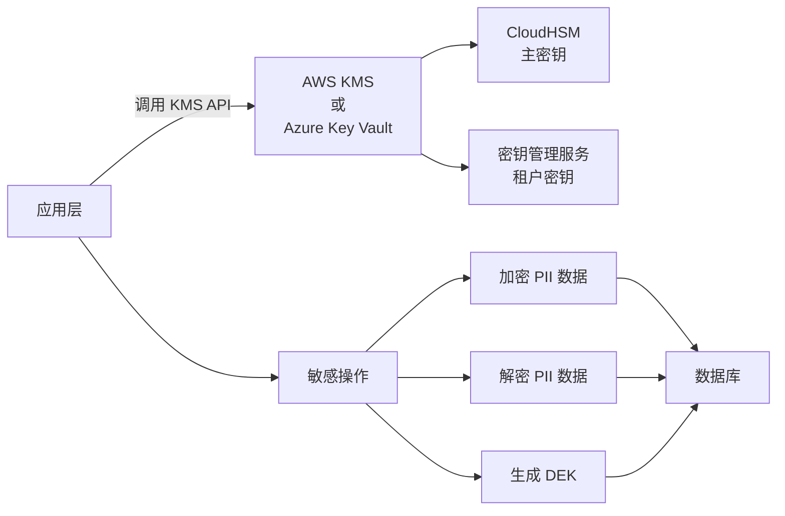

**接入规范**：

| 规范编号 | 规范名称 | 规范描述 |
|----------|----------|----------|
| KMS-BR-001 | 统一 SDK | 使用平台封装的 KMS SDK，封装 AWS KMS、Azure Key Vault、Alibaba KMS 等多种实现 |
| KMS-BR-002 | 密钥不可导出 | 任何场景下主密钥（MK）不可导出至明文，平台代码中不出现明文密钥 |
| KMS-BR-003 | 访问审计 | 所有 KMS API 调用记录审计日志（调用人、时间、操作、密钥ID） |
| KMS-BR-004 | 权限隔离 | 不同租户的密钥操作严格隔离，无跨租户密钥读取权限 |
| KMS-BR-005 | 高可用 | KMS 客户端实现重试 + 熔断，KMS 不可用时拒绝加密/解密操作（不降级为明文） |

### 18.3 审计日志 WORM 存储

> **[已迁移]**：本节内容已完整迁移至 [PRD-12 权限管理](file:///Users/Garabateador/Workspace/banyan/PRD/PRD-12-权限管理.md) §8.8，此处不再保留。请以 PRD-12 为权威来源。

### 18.4 验收标准

| 编号 | 验收标准 | 验证方法 |
|------|----------|----------|
| AC-SEC-018-01 | 所有 PII 字段（手机号、身份证、邮箱、银行卡）使用 AES-256-GCM 加密存储 | 查看数据库密文 |
| AC-SEC-018-02 | 平台主密钥存储于 HSM，不可导出 | 检查 HSM 配置 |
| AC-SEC-018-03 | 审计日志写入后立即锁定，UPDATE/DELETE 操作返回 0 行 | 尝试修改已锁定日志 |
| AC-SEC-018-04 | PII 字段在日志中脱敏（保留前 3 位 + **** + 后 4 位） | 查看日志输出 |

---

## 19. 密码策略升级

> **[已迁移]**：本节内容已完整迁移至 [PRD-12 权限管理](file:///Users/Garabateador/Workspace/banyan/PRD/PRD-12-权限管理.md) §13.1.1，此处不再保留。请以 PRD-12 为权威来源。

---

## 20. OAuth 2.0 / OIDC / SAML 单点登录

> **[已迁移]**：本节内容已完整迁移至 [PRD-12 权限管理](file:///Users/Garabateador/Workspace/banyan/PRD/PRD-12-权限管理.md) §13.1.2，此处不再保留。请以 PRD-12 为权威来源。

---

## 21. GDPR/CCPA 合规

> **[已迁移]**：本节内容已完整迁移至 [PRD-12 权限管理](file:///Users/Garabateador/Workspace/banyan/PRD/PRD-12-权限管理.md) §13.3，此处不再保留。请以 PRD-12 为权威来源。

---

## 22. 跨域记忆保护

本章定义用户跨域记忆的保护机制，确保私有域（个人空间）数据不会意外泄露到共享域（商户/平台空间）。

### 22.1 域模型定义

| 域类型 | 范围 | 访问控制 | 示例 |
|--------|------|----------|------|
| **Private 私有域** | 用户个人 | 仅本人 | 个人笔记、个性化设置、个人记忆 |
| **Merchant 业务域** | 商户 | 商户内成员 | 业务知识库、商户记忆 |
| **Platform 平台域** | 全平台 | 平台管理员 | 平台级模板、全局知识 |

### 22.2 跨域复制规则

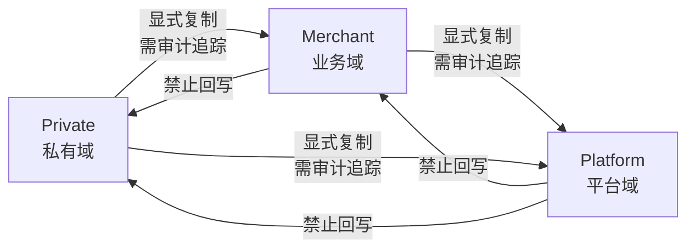

**规则说明**：

| 规则编号 | 规则名称 | 规则描述 |
|----------|----------|----------|
| CM-BR-001 | 显式复制 | Private → Merchant / Private → Platform 域转换必须用户显式操作（点击"分享到团队"） |
| CM-BR-002 | 审计追踪 | 跨域复制操作必须记录审计日志（来源域、目标域、操作人、关联记忆 ID） |
| CM-BR-003 | 复制后独立性 | 跨域复制后源域与目标域内容独立维护，修改源域不影响目标域 |
| CM-BR-004 | 禁止隐式转换 | 禁止通过任何 API/批处理/AI Agent 自动将 Private 域数据写入 Merchant/Platform 域 |
| CM-BR-005 | 显式确认 | AI Agent 在写入跨域数据前必须向用户弹出确认框（"是否将本记忆分享到团队？"） |
| CM-BR-006 | 撤回机制 | 跨域复制后用户可撤回（删除目标域副本），但源域副本不受影响 |

### 22.3 验收标准

| 编号 | 验收标准 | 验证方法 |
|------|----------|----------|
| AC-CM-01 | Private 域记忆不会自动出现在 Merchant 域中 | 创建 Private 记忆后查看 Merchant 域 |
| AC-CM-02 | 跨域复制操作全部记录审计日志 | 执行复制后查询审计日志 |
| AC-CM-03 | AI Agent 写入跨域数据前弹出确认框 | 触发 AI 写入跨域验证 |
| AC-CM-04 | 跨域复制后源域与目标域独立维护 | 修改源域验证目标域不变 |
| AC-CM-05 | 撤回跨域副本不影响源域 | 撤回后验证源域副本完整 |

---

## 23. MFA 强制策略

> **[已迁移]**：本节内容已完整迁移至 [PRD-12 权限管理](file:///Users/Garabateador/Workspace/banyan/PRD/PRD-12-权限管理.md) §8.10，此处不再保留。请以 PRD-12 为权威来源。

---

## 24. 会话固定保护

> **[已迁移]**：本节内容已完整迁移至 [PRD-12 权限管理](file:///Users/Garabateador/Workspace/banyan/PRD/PRD-12-权限管理.md) §13.5，此处不再保留。请以 PRD-12 为权威来源。

---

## 25. CSRF / CORS 防护策略

本章定义跨站请求伪造（CSRF）和跨域资源共享（CORS）的防护策略。

### 25.1 CSRF 防护

**防护机制**：

| 防护点 | 防护规则 | 说明 |
|--------|----------|------|
| SameSite Cookie | Cookie 设置 `SameSite=Strict`（默认）或 `Lax` | 浏览器自动阻止跨站 Cookie 携带 |
| CSRF Token | 状态变更接口（POST/PUT/PATCH/DELETE）强制校验 CSRF Token | CSRF Token 与 Session 绑定 |
| Token 来源校验 | 校验 `Origin` / `Referer` 头 | 仅允许系统设置中配置的域名 |
| 双重提交 Cookie | CSRF Token 同时存储在 Cookie 和请求头 | 防止 CSRF Token 泄露 |
| 验证码 | 高敏感操作（删除、修改密码）强制图形验证码 | 防止自动化攻击 |

**CSRF Token 流程**：

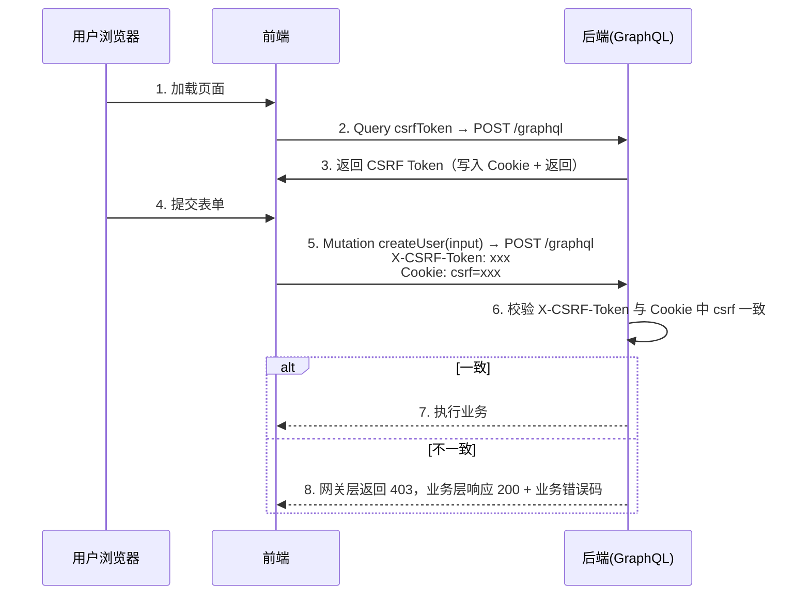

### 25.2 CORS 防护

| 配置项 | 默认值 | 说明 |
|--------|--------|------|
| `Access-Control-Allow-Origin` | 系统设置中的白名单域名 | 禁止 `*` 通配符 |
| `Access-Control-Allow-Credentials` | `true` | 允许凭证（Cookie） |
| `Access-Control-Allow-Methods` | `GET, POST, PUT, PATCH, DELETE` | 允许的方法 |
| `Access-Control-Allow-Headers` | `Content-Type, Authorization, X-CSRF-Token` | 允许的请求头 |
| `Access-Control-Max-Age` | 86400 | 预检请求缓存时间（秒） |
| Origin 校验 | 严格白名单 | 拒绝不在白名单中的 Origin |

**CORS 白名单管理**：

- 仅 `PlatformSuperAdmin` 和 `PlatformSecurityAdmin` 可配置
- 增删改查全部记录审计日志
- 域名格式校验（必须为标准域名，禁止 IP）

### 25.3 验收标准

| 编号 | 验收标准 | 验证方法 |
|------|----------|----------|
| AC-CSRF-01 | POST/PUT/PATCH/DELETE 缺失 CSRF Token 由网关层返回 403 | 缺失 Token 验证 |
| AC-CSRF-02 | CSRF Token 与 Session 绑定，Session 失效后 Token 失效 | Session 失效验证 |
| AC-CSRF-03 | 跨域请求 Origin 不在白名单由网关层返回 403 | 跨域请求验证 |
| AC-CSRF-04 | Cookie 默认 SameSite=Strict | 查看 Cookie 属性 |
| AC-CSRF-05 | 跨域请求禁止 `*` 通配符 | 配置 `*` 验证拒绝 |

---

## 26. PostgreSQL 数据模型

> **触发器声明**: 本模块所有 `tenant_*` 租户级表均配置 `set_partition_key_from_session()` BEFORE INSERT 触发器，自动从会话变量 `app.current_tenant_id` 注入 `partition_key`，遵循 PRD-00 §7.2 强制规范。触发器函数定义参见 PRD-00 §7.2.2 或 PRD-11 §8.1。

> 表名遵循 [PRD-09 §41.5 PG 表命名规范](file:///Users/Garabateador/Workspace/banyan/PRD/PRD-09-系统设置.md)，模块标识 `user`，主键策略 `composite PK (partition_key, id)`。

> **注意**: PRD-08 §8.2-8.6 的角色/用户组/互斥等数据模型已由 PRD-12 维护，本章节仅包含用户主表和会话表。角色、用户组、权限相关 DDL 参见 PRD-12 §7 数据模型。

### 26.1 `tenant_user_users`

用户主表，存储用户基础信息、认证凭证与账户状态。

> 字段映射自 §8.1 `sys_user`，已将 BIGINT 雪花算法 ID 统一为 UUID，MySQL 语法转为 PostgreSQL。

```sql
CREATE TABLE tenant_user_users (
    partition_key       VARCHAR(64)   NOT NULL,                                   -- tenant_id, composite PK part 1, RLS isolation key
    id                  UUID          NOT NULL DEFAULT gen_random_uuid(),          -- composite PK part 2
    tenant_id           UUID          NOT NULL GENERATED ALWAYS AS (partition_key::uuid) STORED,  -- Derived from partition_key, required by multi-tenant middleware
    username            VARCHAR(64)   NOT NULL,                                   -- Unique within tenant, used for login
    password_hash       VARCHAR(256)  NOT NULL,                                   -- BCrypt / Argon2 hashed password
    email               VARCHAR(128)  NULL,                                       -- Email for login and notifications
    phone               VARCHAR(20)   NULL,                                       -- Phone for login and SMS notifications
    status              VARCHAR(32)   NOT NULL DEFAULT 'PENDING'
                        CHECK (status IN ('PENDING', 'ACTIVE', 'LOCKED', 'INACTIVE', 'DISABLED', 'DEACTIVATED')),
    security_level      INTEGER       NOT NULL DEFAULT 0,                         -- 0-99, higher = stricter access control
    department_id       UUID          NULL,                                       -- FK to organization structure
    merchant_id         UUID          NULL,                                       -- Current active merchant ID (switchable via Topbar, NULL = platform-level user)
    mfa_enabled         BOOLEAN       NOT NULL DEFAULT FALSE,                     -- Multi-factor authentication enabled
    last_login_at       TIMESTAMPTZ   NULL,                                       -- Last successful login timestamp
    created_at          TIMESTAMPTZ   NOT NULL DEFAULT NOW(),
    updated_at          TIMESTAMPTZ   NOT NULL DEFAULT NOW(),
    deleted_at          TIMESTAMPTZ   NULL,                                       -- Soft delete, NULL = not deleted
    is_deleted         BOOLEAN       NOT NULL GENERATED ALWAYS AS (deleted_at IS NOT NULL) STORED,  -- Derived from deleted_at
    created_by          UUID          NOT NULL,
    updated_by          UUID          NULL,
    PRIMARY KEY (partition_key, id),
    UNIQUE (partition_key, username, deleted_at)
);

-- Indexes for user list query P95 <= 2s
CREATE INDEX idx_user_users_status ON tenant_user_users(partition_key, status, deleted_at);
CREATE INDEX idx_user_users_email ON tenant_user_users(partition_key, email) WHERE email IS NOT NULL AND deleted_at IS NULL;
CREATE INDEX idx_user_users_phone ON tenant_user_users(partition_key, phone) WHERE phone IS NOT NULL AND deleted_at IS NULL;
CREATE INDEX idx_user_users_merchant ON tenant_user_users(partition_key, merchant_id) WHERE merchant_id IS NOT NULL AND deleted_at IS NULL;
CREATE INDEX idx_user_users_department ON tenant_user_users(partition_key, department_id) WHERE department_id IS NOT NULL AND deleted_at IS NULL;
CREATE INDEX idx_user_users_last_login ON tenant_user_users(partition_key, last_login_at DESC) WHERE deleted_at IS NULL;

-- RLS
ALTER TABLE tenant_user_users ENABLE ROW LEVEL SECURITY;
CREATE POLICY user_tenant_isolation ON tenant_user_users
    FOR ALL
    USING (partition_key = current_setting('app.current_tenant_id', TRUE));
CREATE POLICY user_superuser_bypass ON tenant_user_users
    FOR ALL
    USING (current_setting('app.is_superuser', 'false') = 'true');

-- Trigger: auto-inject partition_key from session variable
CREATE TRIGGER trg_tenant_user_users_partition_key
    BEFORE INSERT ON tenant_user_users
    FOR EACH ROW EXECUTE FUNCTION set_partition_key_from_session();
```

### 26.2 `tenant_user_sessions`

会话表，存储用户登录会话信息、设备指纹与 Token 状态。

> 字段映射自 §8.7 `tenant_user_sessions`，已将 BIGINT 雪花算法 ID 统一为 UUID，MySQL 语法转为 PostgreSQL。

```sql
CREATE TABLE tenant_user_sessions (
    partition_key       VARCHAR(64)   NOT NULL,                                   -- tenant_id, composite PK part 1, RLS isolation key
    id                  UUID          NOT NULL DEFAULT gen_random_uuid(),          -- composite PK part 2
    tenant_id           UUID          NOT NULL GENERATED ALWAYS AS (partition_key::uuid) STORED,  -- Derived from partition_key, required by multi-tenant middleware
    user_id             UUID          NOT NULL,                                   -- FK to tenant_user_users.id
    refresh_token_hash  VARCHAR(64)   NOT NULL,                                   -- SHA-256 hash of refresh token
    device_fingerprint  VARCHAR(256)  NULL,                                       -- Device fingerprint for anomaly detection
    device_name         VARCHAR(128)  NULL,                                       -- Human-readable device name
    ip_address          VARCHAR(45)   NOT NULL,                                   -- Login IP (supports IPv4/IPv6)
    user_agent          VARCHAR(512)  NULL,                                       -- Browser User-Agent
    is_remember_me      BOOLEAN       NOT NULL DEFAULT FALSE,                     -- Extended session flag
    expires_at          TIMESTAMPTZ   NOT NULL,                                   -- Session expiration time
    revoked_at          TIMESTAMPTZ   NULL,                                       -- Revocation time, NULL = not revoked
    created_at          TIMESTAMPTZ   NOT NULL DEFAULT NOW(),
    updated_at          TIMESTAMPTZ   NOT NULL DEFAULT NOW(),
    deleted_at          TIMESTAMPTZ   NULL,                                       -- Soft delete
    is_deleted         BOOLEAN       NOT NULL GENERATED ALWAYS AS (deleted_at IS NOT NULL) STORED,  -- Derived from deleted_at
    PRIMARY KEY (partition_key, id)
);

-- Indexes for session management queries
CREATE INDEX idx_user_sessions_user ON tenant_user_sessions(partition_key, user_id, deleted_at);
CREATE INDEX idx_user_sessions_user_active ON tenant_user_sessions(partition_key, user_id, expires_at DESC)
    WHERE revoked_at IS NULL AND deleted_at IS NULL;
CREATE INDEX idx_user_sessions_token ON tenant_user_sessions(partition_key, refresh_token_hash)
    WHERE revoked_at IS NULL AND deleted_at IS NULL;
CREATE INDEX idx_user_sessions_expires ON tenant_user_sessions(expires_at)
    WHERE revoked_at IS NULL AND deleted_at IS NULL;
CREATE INDEX idx_user_sessions_device ON tenant_user_sessions(partition_key, user_id, device_fingerprint)
    WHERE device_fingerprint IS NOT NULL AND deleted_at IS NULL;

-- RLS
ALTER TABLE tenant_user_sessions ENABLE ROW LEVEL SECURITY;
CREATE POLICY user_sessions_tenant_isolation ON tenant_user_sessions
    FOR ALL
    USING (partition_key = current_setting('app.current_tenant_id', TRUE));
CREATE POLICY user_sessions_superuser_bypass ON tenant_user_sessions
    FOR ALL
    USING (current_setting('app.is_superuser', 'false') = 'true');

-- Trigger: auto-inject partition_key from session variable
CREATE TRIGGER trg_tenant_user_sessions_partition_key
    BEFORE INSERT ON tenant_user_sessions
    FOR EACH ROW EXECUTE FUNCTION set_partition_key_from_session();
```

### 26.3 `outbox_events`（全局共享表）

> **v5 收束说明(2026-06-13)**:本节原 DDL 与 [PRD-00 §4.7.2](file:///Users/Garabateador/Workspace/banyan/PRD/PRD-00-平台总览与全局规范.md#L820-L836) 权威定义存在冲突(复合主键 vs 单 PK、含 `retry_count`/`trace_id`、含 RLS 策略),已删除独立 DDL,**严格遵循 PRD-00 §4.7.2 权威定义**。Outbox 为跨租户平台级表,不应启用 RLS(由发布器以超级管理员身份消费);`retry_count`/`trace_id` 由 SQS/SNS 基础设施层管理,不存储于 Outbox 表。

### 26.4 RLS 策略汇总

所有 `tenant_` 前缀表均启用 PostgreSQL RLS（Row Level Security），确保租户数据在数据库层隔离。`outbox_events` 为跨租户平台级表，由事件发布器以超级管理员身份消费，**不**启用 RLS（参见 [PRD-00 §4.7.2](file:///Users/Garabateador/Workspace/banyan/PRD/PRD-00-平台总览与全局规范.md#L820-L836)）。

| 表名 | RLS 策略 | 说明 |
|------|----------|------|
| `tenant_user_users` | `user_tenant_isolation` / `user_superuser_bypass` | 租户隔离 + 超级管理员绕过 |
| `tenant_user_sessions` | `user_sessions_tenant_isolation` / `user_sessions_superuser_bypass` | 租户隔离 + 超级管理员绕过 |

> **注意**：`outbox_events` 为跨租户平台级表，**不**启用 RLS（参见 PRD-00 §4.7.2 权威定义）。

**RLS 策略通用规则**：

- `tenant_` 前缀表必须执行 `ALTER TABLE ... ENABLE ROW LEVEL SECURITY`
- `outbox_events` 全局共享表同样启用 RLS，事件发布器通过超级管理员绕过策略跨租户扫描
- 默认策略：`partition_key = current_setting('app.current_tenant_id', TRUE)`
- 超级管理员绕过：`current_setting('app.is_superuser', 'false') = 'true'`

### 26.5 触发器汇总

| 表名 | 触发器名称 | 触发时机 | 执行函数 |
|------|-----------|---------|---------|
| `tenant_user_users` | `trg_tenant_user_users_partition_key` | BEFORE INSERT | `set_partition_key_from_session()` |
| `tenant_user_sessions` | `trg_tenant_user_sessions_partition_key` | BEFORE INSERT | `set_partition_key_from_session()` |

> 触发器函数 `set_partition_key_from_session()` 定义参见 PRD-00 §7.2.2 或 PRD-11 §8.1。

### 26.6 §8 原始数据模型字段映射说明

> 本章节记录 §8 数据模型原始字段到 PostgreSQL DDL 的转换关系，便于追溯。

| 原始表 | 原始字段 | 原始类型 | DDL 表 | DDL 字段 | DDL 类型 | 转换说明 |
|--------|---------|---------|--------|---------|---------|---------|
| sys_user | user_id | BIGINT | tenant_user_users | id | UUID | 雪花算法→UUID |
| sys_user | status | TINYINT | tenant_user_users | status | VARCHAR(32) | 枚举整数→CHECK VARCHAR |
| sys_user | mfa_enabled | TINYINT | tenant_user_users | mfa_enabled | BOOLEAN | 0/1→FALSE/TRUE |
| sys_user | department_id | BIGINT | tenant_user_users | department_id | UUID | 雪花算法→UUID |
| sys_user | merchant_id | BIGINT | tenant_user_users | merchant_id | UUID | 雪花算法→UUID |
| sys_user | created_at | DATETIME | tenant_user_users | created_at | TIMESTAMPTZ | MySQL→PostgreSQL |
| sys_user | updated_at | DATETIME ON UPDATE | tenant_user_users | updated_at | TIMESTAMPTZ | 移除ON UPDATE，由应用层维护 |
| sys_user | deleted | TINYINT | tenant_user_users | deleted_at | TIMESTAMPTZ | 0/1标记→软删除时间戳 |
| sys_user | tenant_id | BIGINT | tenant_user_users | partition_key | VARCHAR(64) | 租户ID→分区键 |
| sys_session | session_id | BIGINT | tenant_user_sessions | id | UUID | 雪花算法→UUID |
| sys_session | user_id | BIGINT | tenant_user_sessions | user_id | UUID | 雪花算法→UUID |
| sys_session | is_remember_me | TINYINT | tenant_user_sessions | is_remember_me | BOOLEAN | 0/1→FALSE/TRUE |
| sys_session | expires_at | DATETIME | tenant_user_sessions | expires_at | TIMESTAMPTZ | MySQL→PostgreSQL |
| sys_session | revoked_at | DATETIME | tenant_user_sessions | revoked_at | TIMESTAMPTZ | MySQL→PostgreSQL |
| sys_session | tenant_id | BIGINT | tenant_user_sessions | partition_key | VARCHAR(64) | 租户ID→分区键 |

---

## SilvaEngine 实施附录

> **版本**: 2.0.0(SilvaEngine 架构重写版)
> **生效日期**: 2026-06-09
> **本附录基于**: [`PRD-00 平台总览与全局规范 v2.0.0`](./PRD-00-平台总览与全局规范.md) §15-§17
> **强制级别**: P0

### A1. 模块身份与依赖

| 项 | 值 |
|------|------|
| **模块名** | `user` |
| **包名** | `silvaengine_modules.user` |
| **Graphene 入口** | `silvaengine_modules.user.schema:Schema` |
| **Lambda 函数** | `arn:aws:lambda:us-east-1:123456789012:function:banyan-user-resolver` |
| **endpoint_id** | `user-endpoint` |
| **依赖模块** | PRD-12(权限,角色查询)/ PRD-07(商户) |
| **下游模块** | 所有模块(用户主表) |

### A2. ConnectionPoolManager 池声明

| 池名 | 类型 | 用途 |
|------|------|------|
| `postgres_main` | postgresql | 用户主表、MFA、Session、密码 |
| `postgres_audit` | postgresql | 用户审计 |
| `neo4j_main` | neo4j | 用户-角色-用户组关系图 |
| `httpx_sms` | httpx | SMS OTP |
| `httpx_email` | httpx | Email 验证、密码重置 |
| `httpx_sso` | httpx | OIDC / SAML / LDAP 联邦 |
| `redis_session` | redis | Session / 登录失败计数 / MFA 临时凭证 |
| `redis_cache` | redis | 用户档案缓存 |
| `boto3_kms` | boto3 | 密码 Hash Salt / Session 加密 |

### A3. PostgreSQL 表

> **RLS & 触发器声明**: 本模块所有 `sys_*` 租户级表均启用 PostgreSQL RLS 策略和 `set_partition_key_from_session()` 触发器，遵循 PRD-00 §7.2 强制规范。

| 表名 | 复合主键 | 用途 |
|------|----------|------|
| `tenant_user_users` | `(partition_key, id)` | 用户主表 |
| `tenant_user_credential` | `(partition_key, id)` | 凭据(密码 / 外部认证) |
| `tenant_user_mfa` | `(partition_key, id)` | MFA 因子(TOTP / SMS / FIDO2) |
| `tenant_user_session` | `(partition_key, id)` | Session 主表 |
| `tenant_user_login_attempt` | `(partition_key, id)` | 登录尝试(失败计数) |
| `tenant_user_external_identity` | `(partition_key, id)` | 外部身份(OIDC / SAML / LDAP) |
| `tenant_user_password_history` | `(partition_key, id)` | 密码历史(防重用) |
| `tenant_user_consent` | `(partition_key, id)` | 同意(GDPR / CCPA) |
| `outbox_events` | `(partition_key, id)` | 全局共享 Outbox 事件表(跨模块事件存储) |
| `audit_user_event` | `(id)` | 审计 WORM |

> **注意**:密码字段 `password_hash` 使用 `Bcrypt / Argon2id`;`salt` 通过 `boto3_kms` 加密存储。

```sql
-- ============================================================
-- RLS & Trigger: tenant-level tables (PRD-00 §7.2)
-- ============================================================

-- tenant_user_user
CREATE TRIGGER trg_tenant_user_user_partition_key
  BEFORE INSERT ON tenant_user_user
  FOR EACH ROW EXECUTE FUNCTION set_partition_key_from_session();
ALTER TABLE tenant_user_user ENABLE ROW LEVEL SECURITY;
CREATE POLICY tenant_isolation_tenant_user_user ON tenant_user_user
  USING (partition_key = current_setting('app.current_tenant_id', TRUE));

-- tenant_user_credential
CREATE TRIGGER trg_tenant_user_credential_partition_key
  BEFORE INSERT ON tenant_user_credential
  FOR EACH ROW EXECUTE FUNCTION set_partition_key_from_session();
ALTER TABLE tenant_user_credential ENABLE ROW LEVEL SECURITY;
CREATE POLICY tenant_isolation_tenant_user_credential ON tenant_user_credential
  USING (partition_key = current_setting('app.current_tenant_id', TRUE));

-- tenant_user_mfa
CREATE TRIGGER trg_tenant_user_mfa_partition_key
  BEFORE INSERT ON tenant_user_mfa
  FOR EACH ROW EXECUTE FUNCTION set_partition_key_from_session();
ALTER TABLE tenant_user_mfa ENABLE ROW LEVEL SECURITY;
CREATE POLICY tenant_isolation_tenant_user_mfa ON tenant_user_mfa
  USING (partition_key = current_setting('app.current_tenant_id', TRUE));

-- tenant_user_session
CREATE TRIGGER trg_tenant_user_session_partition_key
  BEFORE INSERT ON tenant_user_session
  FOR EACH ROW EXECUTE FUNCTION set_partition_key_from_session();
ALTER TABLE tenant_user_session ENABLE ROW LEVEL SECURITY;
CREATE POLICY tenant_isolation_tenant_user_session ON tenant_user_session
  USING (partition_key = current_setting('app.current_tenant_id', TRUE));

-- tenant_user_login_attempt
CREATE TRIGGER trg_tenant_user_login_attempt_partition_key
  BEFORE INSERT ON tenant_user_login_attempt
  FOR EACH ROW EXECUTE FUNCTION set_partition_key_from_session();
ALTER TABLE tenant_user_login_attempt ENABLE ROW LEVEL SECURITY;
CREATE POLICY tenant_isolation_tenant_user_login_attempt ON tenant_user_login_attempt
  USING (partition_key = current_setting('app.current_tenant_id', TRUE));

-- tenant_user_external_identity
CREATE TRIGGER trg_tenant_user_external_identity_partition_key
  BEFORE INSERT ON tenant_user_external_identity
  FOR EACH ROW EXECUTE FUNCTION set_partition_key_from_session();
ALTER TABLE tenant_user_external_identity ENABLE ROW LEVEL SECURITY;
CREATE POLICY tenant_isolation_tenant_user_external_identity ON tenant_user_external_identity
  USING (partition_key = current_setting('app.current_tenant_id', TRUE));

-- tenant_user_password_history
CREATE TRIGGER trg_tenant_user_password_history_partition_key
  BEFORE INSERT ON tenant_user_password_history
  FOR EACH ROW EXECUTE FUNCTION set_partition_key_from_session();
ALTER TABLE tenant_user_password_history ENABLE ROW LEVEL SECURITY;
CREATE POLICY tenant_isolation_tenant_user_password_history ON tenant_user_password_history
  USING (partition_key = current_setting('app.current_tenant_id', TRUE));

-- tenant_user_consent
CREATE TRIGGER trg_tenant_user_consent_partition_key
  BEFORE INSERT ON tenant_user_consent
  FOR EACH ROW EXECUTE FUNCTION set_partition_key_from_session();
ALTER TABLE tenant_user_consent ENABLE ROW LEVEL SECURITY;
CREATE POLICY tenant_isolation_tenant_user_consent ON tenant_user_consent
  USING (partition_key = current_setting('app.current_tenant_id', TRUE));
```

> **注**: `audit_user_event`（审计 WORM，主键为 `(id)`）不含 `partition_key`，不启用 RLS 策略。

### A4. Neo4j 节点与关系

> 节点标签遵循 PRD-00 §3.5.5 三标签组合规范：`UserEntity` 基础标签 + 业务节点标签 + `Graph` 租户标签，租户隔离通过 `partition_key` 属性 + WHERE 子句实现。

| 节点 | 标签 | 必含属性 |
|------|------|----------|
| `User` | `UserEntity:User:Graph` | `partition_key` / `id` / `email` / `displayName` / `status` |
| `MfaFactor` | `UserEntity:MfaFactor:Graph` | `partition_key` / `id` / `user_id` / `type` |
| `Session` | `UserEntity:Session:Graph` | `partition_key` / `id` / `user_id` / `expires_at` |
| `Role` | 复用 PRD-12 | - |
| `UserGroup` | 复用 PRD-12 | - |

| 关系 | 类型 | 起点 → 终点 |
|------|------|-------------|
| `USER_HAS_MFA` | `USER_HAS_MFA` | `User` → `MfaFactor` |
| `USER_HAS_SESSION` | `USER_HAS_SESSION` | `User` → `Session` |
| `USER_ASSIGNED_ROLE` | `USER_ASSIGNED_ROLE` | `User` → `Role`(复用 PRD-12) |
| `USER_MEMBER_OF` | `USER_MEMBER_OF` | `User` → `UserGroup`(复用 PRD-12) |

### A5. GraphQL Schema 映射

#### A5.1 Query 列表

| GraphQL Query | 返回 | 说明 |
|----------------|------|------|
| `me` | `UserType` | 当前登录用户(从 `info.context["user_id"]`) |
| `user(id: ID!)` | `UserType` | 用户详情(管理员) |
| `users(filter, first, after)` | `UserConnection` | 用户列表(管理员) |
| `userMfaFactors` | `[MfaFactorType]` | 当前用户 MFA 因子 |
| `userSessions(filter)` | `[UserSessionType]` | 当前用户活跃 Session |
| `userLoginHistory(filter, first, after)` | `LoginAttemptConnection` | 登录历史 |
| `userConsents` | `[UserConsentType]` | 当前用户同意列表 |
| `userSsoIdentities` | `[ExternalIdentityType]` | 当前用户 SSO 身份 |
| `checkPasswordStrength(password: String!)` | `PasswordStrengthType` | 密码强度评估 |

#### A5.2 Mutation 列表

| GraphQL Mutation | 输入 | 返回 |
|------------------|------|------|
| `registerUser(input, idempotencyKey)` | `UserRegisterInput` | `UserType` |
| `updateUserProfile(input, idempotencyKey)` | `UserProfileUpdateInput` | `UserType` |
| `updateUserByAdmin(id, input, idempotencyKey)` | `UserUpdateInput` | `UserType` |
| `deleteUser(id, idempotencyKey)` | - | `DeletePayload` |
| `batchDeleteUsers(ids, idempotencyKey)` | - | `BatchDeletePayload` |
| `changePassword(input, idempotencyKey)` | `ChangePasswordInput` | `UserType` |
| `adminResetPassword(id, newPassword, idempotencyKey)` | - | `UserType` |
| `requestPasswordReset(email)` | - | `PasswordResetRequest` |
| `confirmPasswordReset(input, idempotencyKey)` | `PasswordResetConfirmInput` | `UserType` |
| `enableMfa(input, idempotencyKey)` | `MfaEnableInput` | `MfaEnrollmentType`(含 QR Code) |
| `verifyMfa(input, idempotencyKey)` | `MfaVerifyInput` | `UserType` |
| `disableMfa(factorId, idempotencyKey)` | - | `DeletePayload` |
| `logout(sessionId, idempotencyKey)` | - | `DeletePayload` |
| `logoutAll(idempotencyKey)` | - | `DeletePayload` |
| `login(input, idempotencyKey)` | `LoginInput` | `LoginResultType` |
| `loginWithMfa(input, idempotencyKey)` | `MfaLoginInput` | `LoginResultType` |
| `loginWithSso(input, idempotencyKey)` | `SsoLoginInput` | `LoginResultType` |
| `refreshToken(refreshToken, idempotencyKey)` | - | `TokenPairType` |
| `linkSsoIdentity(input, idempotencyKey)` | `SsoLinkInput` | `ExternalIdentityType` |
| `unlinkSsoIdentity(identityId, idempotencyKey)` | - | `DeletePayload` |
| `grantConsent(input, idempotencyKey)` | `ConsentInput` | `UserConsentType` |
| `revokeConsent(consentId, idempotencyKey)` | - | `DeletePayload` |
| `exportUserData` | - | `DataExportTask` |
| `deleteUserData(idempotencyKey)` | - | `DeletePayload`(GDPR 抹除) |

#### A5.3 关键 ObjectType

| 类型 | 关键字段 | DataLoader |
|------|----------|------------|
| `UserType` | `id` / `email` / `username` / `displayName` / `avatar` / `status` / `mfaEnabled` / `lastLoginAt` / `createdAt` | `roles` (复用 PRD-12) |
| `MfaFactorType` | `id` / `type` (TOTP/SMS/EMAIL/FIDO2) / `name` / `enabled` / `createdAt` | - |
| `UserSessionType` | `id` / `userAgent` / `ip` / `location` / `createdAt` / `expiresAt` / `isCurrent` | - |
| `LoginAttemptType` | `id` / `status` (SUCCESS/FAILED_INVALID_PASSWORD/FAILED_MFA/LOCKED) / `ip` / `userAgent` / `createdAt` | - |
| `ExternalIdentityType` | `id` / `provider` (OIDC/SAML/LDAP) / `subject` / `email` | - |
| `UserConsentType` | `id` / `purpose` / `granted` / `grantedAt` / `expiresAt` | - |
| `LoginResultType` | `accessToken` / `refreshToken` / `user` / `expiresIn` | - |
| `MfaEnrollmentType` | `factor` / `secret` / `qrCodeUrl` | - |
| `TokenPairType` | `accessToken` / `refreshToken` / `expiresIn` | - |

#### A5.4 关键 InputObjectType

```graphql
input UserRegisterInput {
  email: String!
  username: String
  password: String!
  displayName: String
  phone: String
  inviteCode: String
  locale: String
  timeZone: String
}

input LoginInput {
  email: String!
  password: String!
  captchaToken: String
  rememberMe: Boolean
}

input MfaVerifyInput {
  factorId: ID!
  code: String!                       # 6 位 TOTP / 短信码
}

input ChangePasswordInput {
  currentPassword: String!
  newPassword: String!
}

input SsoLoginInput {
  provider: SsoProviderEnum!
  idToken: String!
}

input ConsentInput {
  purpose: ConsentPurposeEnum!        # MARKETING / ANALYTICS / AI_TRAINING / etc.
  granted: Boolean!
  expiresAt: DateTime
}
```

### A6. config.json 模板(摘要)

```json
{
  "module": {
    "name": "user",
    "version": "2.0.0",
    "owner": "user-team",
    "graphene": { "schema_entry": "silvaengine_modules.user.schema:Schema" }
  },
  "pools": {
    "postgres_main": { "type": "postgresql", "settings": { "host": "${env:PG_MAIN_HOST}",  "database": "banyan_main" } },
    "postgres_audit":{ "type": "postgresql", "settings": { "host": "${env:PG_AUDIT_HOST}", "database": "banyan_audit" } },
    "neo4j_main":    { "type": "neo4j",      "settings": { "uri": "${env:NEO4J_URI}" } },
    "httpx_sms":     { "type": "httpx",      "settings": { "base_url": "${env:SMS_URL}",    "timeout": 10 } },
    "httpx_email":   { "type": "httpx",      "settings": { "base_url": "${env:EMAIL_URL}",  "timeout": 10 } },
    "httpx_sso":     { "type": "httpx",      "settings": { "timeout": 30 } },
    "redis_session": { "type": "redis",      "settings": { "host": "${env:REDIS_HOST}", "db": 2 } },
    "redis_cache":   { "type": "redis",      "settings": { "host": "${env:REDIS_HOST}", "db": 0 } },
    "boto3_kms":     { "type": "boto3",      "settings": { "service_name": "kms", "region_name": "${env:AWS_REGION}" } }
  },
  "plugins": [
    { "type": "connection_pool", "module_name": "silvaengine_connections", "config": { "pool": "postgres_main" }, "enabled": true },
    { "type": "connection_pool", "module_name": "silvaengine_connections", "config": { "pool": "postgres_audit"}, "enabled": true },
    { "type": "connection_pool", "module_name": "silvaengine_connections", "config": { "pool": "neo4j_main"    }, "enabled": true },
    { "type": "connection_pool", "module_name": "silvaengine_connections", "config": { "pool": "httpx_sms"     }, "enabled": true },
    { "type": "connection_pool", "module_name": "silvaengine_connections", "config": { "pool": "httpx_email"   }, "enabled": true },
    { "type": "connection_pool", "module_name": "silvaengine_connections", "config": { "pool": "httpx_sso"     }, "enabled": true },
    { "type": "connection_pool", "module_name": "silvaengine_connections", "config": { "pool": "redis_session" }, "enabled": true },
    { "type": "connection_pool", "module_name": "silvaengine_connections", "config": { "pool": "redis_cache"   }, "enabled": true },
    { "type": "connection_pool", "module_name": "silvaengine_connections", "config": { "pool": "boto3_kms"     }, "enabled": true }
  ],
  "settings": {
    "user.default.auth": {
      "setting_id": "user.default.auth",
      "variables": {
        "password_min_length":        { "name": "password_min_length",        "type": "int",  "value": 12 },
        "password_require_uppercase": { "name": "password_require_uppercase", "type": "bool", "value": true },
        "password_require_digit":     { "name": "password_require_digit",     "type": "bool", "value": true },
        "password_require_symbol":    { "name": "password_require_symbol",    "type": "bool", "value": true },
        "password_history_count":     { "name": "password_history_count",     "type": "int",  "value": 5 },
        "password_max_age_days":      { "name": "password_max_age_days",      "type": "int",  "value": 90 },
        "login_max_failed_attempts":  { "name": "login_max_failed_attempts",  "type": "int",  "value": 5 },
        "login_lockout_minutes":      { "name": "login_lockout_minutes",      "type": "int",  "value": 30 },
        "session_timeout_minutes":    { "name": "session_timeout_minutes",    "type": "int",  "value": 60 },
        "session_absolute_hours":     { "name": "session_absolute_hours",     "type": "int",  "value": 24 },
        "session_renewal_minutes":    { "name": "session_renewal_minutes",    "type": "int",  "value": 30 },
        "mfa_required":               { "name": "mfa_required",               "type": "bool", "value": true }
      }
    }
  },
  "functions": [
    {
      "aws_lambda_arn": "arn:aws:lambda:us-east-1:123456789012:function:banyan-user-resolver",
      "function": "user_resolver",
      "area": "user",
      "config": {
        "module_name": "silvaengine_modules.user",
        "class_name": "UserResolver",
        "setting": "user.default.auth",
        "graphql": true,
        "operations": {
          "query": ["me", "user", "users", "userMfaFactors", "userSessions",
                   "userLoginHistory", "userConsents", "userSsoIdentities", "checkPasswordStrength"],
          "mutation": ["registerUser", "updateUserProfile", "updateUserByAdmin",
                      "deleteUser", "batchDeleteUsers",
                      "changePassword", "adminResetPassword",
                      "requestPasswordReset", "confirmPasswordReset",
                      "enableMfa", "verifyMfa", "disableMfa",
                      "logout", "logoutAll",
                      "login", "loginWithMfa", "loginWithSso", "refreshToken",
                      "linkSsoIdentity", "unlinkSsoIdentity",
                      "grantConsent", "revokeConsent",
                      "exportUserData", "deleteUserData"]
        }
      },
      "auth_required": true
    }
  ],
  "endpoints": [
    { "endpoint_id": "user-endpoint", "special_connection": false }
  ],
  "runtime": { "memory_mb": 1024, "timeout_seconds": 60 }
}
```

### A7. 错误码段位

> **v6 收束说明(2026-06-14)**：本节与 §15.2 严格对齐，统一采用 `BIZ_USER_*` / `BIZ_AUTH_*` 顶层命名空间。子域映射详见 §15.2 表（按 `BIZ_AUTH_*` 子段位 102001-102699 划分登录/Token/密码/MFA/SSO/Consent/ABAC 子域）。本节不再使用 `BIZ_USER_AUTH_*` / `BIZ_MFA_*` / `BIZ_SESSION_*` / `BIZ_PASSWORD_*` 等历史子命名空间。

| 段位 | 用途 | 数字子段位 |
|------|------|------------|
| `BIZ_USER_*` | 用户主表、CRUD、状态、角色/用户组、锁定、商户关联、验证 | 100001-101999 |
| `BIZ_AUTH_*` | 登录/登出、Token、密码、MFA、SSO/OAuth、Consent、ABAC | 102001-109999 |

### A8. 数据生命周期

| 数据 | 在线保留 | 归档 | 销毁 |
|------|----------|------|------|
| 用户主表 | 永久 | 永久 | 用户主动删除或 GDPR 抹除 |
| 凭据 | 永久 | 永久 | 用户删除时同步删除 |
| Session | TTL 24h | - | TTL 到期 |
| 登录尝试 | 90 天 | - | 90 天到期 |
| 密码历史 | 永久(5 条) | - | 5 条循环覆盖 |
| 同意 | 永久 | 永久 | 用户撤销后保留 7 年(合规) |
| 审计 | 1 年 | 6 年 | 7 年到期 |

### A9. 实施检查清单

- [ ] `config.json` 通过校验
- [ ] 9 个 `pools` 与 9 个 `plugins` 1:1 对应
- [ ] 所有 SQLAlchemy 模型复合主键 `(partition_key, id)`
- [ ] 所有 Cypher 查询带 `WHERE n.partition_key = $partitionKey`（遵循 PRD-00 §3.5.5 铁律）
- [ ] 密码使用 Argon2id 哈希,禁止明文 / SHA1
- [ ] Session 写入 Redis 走加密序列化
- [ ] MFA TOTP 兼容 RFC 6238
- [ ] OIDC Discovery 通过 `httpx_sso` 池调用
- [ ] GDPR 抹除走 `deleteUserData` Mutation
- [ ] 错误码 `BIZ_USER_*` / `BIZ_MFA_*` / `BIZ_SESSION_*` 已注册
- [ ] `validation_runner.py` 0 errors / 0 warnings

---

*文档结束*

*文档结束*
