# PRD-09 系统设置模块

> **版本**: V3.1（v3.1 ISSUE-V4-004修复版 2026-06-14）
> **v3.1 变更说明(2026-06-14)**:ISSUE-V4-004修复：BR-09-013 Kafka topic替换为EventBridge自定义事件总线；§39.6.2主备切换架构图Kafka替换为SNS/SQS+跨区域复制机制
> **v3.0 变更说明**:§5.2 BR-09-012/013 异步默认定稿（脱敏不驻留内存、二级校验事件流异步、性能开销<10ms）；§39.6 RTO/RPO 企业级推荐值定稿（RTO≤15min / RPO≤5min）并补充 2 个 mermaid 架构图（主备切换 + 多活流量切换）；文档头刷新为 V3.0
> **重要变更通知(2026-06-09)**:依据 [PRD-00 平台总览与全局规范 §2.5 关键决策:系统设置瘦身](file:///Users/Garabateador/Workspace/banyan/PRD/PRD-00-平台总览与全局规范.md),本模块已完成职责收束
>
> **本模块保留职责**:系统级通用设置 + 导航与布局配置 + 模块配置管理
>
> **已迁移至 PRD-12 权限管理 的内容**（原文已替换为弃用声明，请以 PRD-12 为权威来源）:
> - 安全设置 - 规则/模板/审计(原 §4.6-4.14)→ **PRD-12 §8.5 / §8.8**
> - ABAC 策略管理(原 §4.15-4.19)→ **PRD-12 §8.5**
> - 数据权限 - 范围/动态应用/继承覆盖(原 §4.20-4.22)→ **PRD-12 §5.5**
> - 权限审批工作流(原 §4.23-4.26)→ **PRD-12 §8.9**
> - ABAC 评估决策流程(原 §4.27)→ **PRD-12 §5.4**
> - 安全设置与 PRD-02 关联(原 §4.28)→ **PRD-12 §5.5**
> - ABAC策略规则(原 §5.3)→ **PRD-12 §9.2**
> - 数据权限规则(原 §5.4)→ **PRD-12 §9.6**
> - 权限审批规则(原 §5.5)→ **PRD-12 §9.5**
> - ABAC策略权限(原 §6.1.3)→ **PRD-12 §8.4**
> - 数据权限权限(原 §6.1.4)→ **PRD-12 §8.4**
> - 权限审批工作流权限(原 §6.1.5)→ **PRD-12 §8.4**
>
> **待迁移至其他模块的内容**（当前版本仍保留在本文档）:
> - 权限查询与诊断(原 §14)→ **PRD-12 §8.7**
> - 全局导航模块权限矩阵(原 §15)→ **PRD-12 §7 权限矩阵**
> - 响应式导航适配规则(原 §16,§19)→ **PRD-00 §6.4 + §15**
> - 全局非功能需求配置(原 §17)→ **PRD-00 §6**
> - 全局接口规范配置(原 §18)→ **PRD-00 §4**
> - 统一资源命名规范(原 §21)→ **PRD-00 §4.1 + §11.3**
> - 统一权限标识规范(原 §22)→ **PRD-00 §5.1 + §11.2**
> - 统一错误码映射表(原 §23)→ **PRD-00 §5**
> - 统一分页规范(原 §24)→ **PRD-00 §4.6**
> - 统一缓存策略(原 §25)→ **PRD-00 §8**
> - Redis Key 命名空间(原 §26)→ **PRD-00 §7.4**
> - Neo4j 多租户隔离(原 §27)→ **PRD-00 §7.5**
> - 链路追踪选型(原 §28)→ **PRD-00 §10.2**
> - 告警分级规范(原 §29)→ **PRD-00 §10.3 + PRD-11 §4.6**
> - GDPR/CCPA 合规规范(原 §30)→ **PRD-00 §9.5**
>
> **本模块当前定位**:遵循 PRD-00 §1 设计原则「单一职责」原则,聚焦「系统级参数配置 + 导航布局 + 模块配置管理」,权限相关与全局规范分别由 PRD-12 / PRD-00 承接
>
> **遵循规范**:[PRD-00 平台总览与全局规范](file:///Users/Garabateador/Workspace/banyan/PRD/PRD-00-平台总览与全局规范.md) - 接口规范(§4)、错误码(§5)、非功能需求(§6)、数据规范(§7)、安全基线(§9)、可观测性基线(§10)
>
> **上游依赖**:无（以 §A1 权威表为准）
> **下游被依赖**:所有模块(读配置)（以 §A1 权威表为准）
> **错误码命名空间**:`BIZ_SETTING_*` / `BIZ_NAVIGATION_*` | 数字段位:`090001-090999`（与 PRD-00 §5.3.2.1 权威分配表一致）
> **对外接口**:GraphQL (POST /graphql) | Gateway内部路由:N/A（GraphQL单总线）

---

## 1. 文档信息

| 项目 | 内容 |
|------|------|
| 文档编号 | PRD-09 |
| 模块名称 | 系统设置模块(System Settings) |
| 版本 | V3.0(2026-06-13 v3.0收束) |
| 创建日期 | 2026-06-08 |
| 最后更新 | 2026-06-13 |
| 文档负责人 | 产品经理 |
| 状态 | 收束重构中 |
| 关联文档 | [PRD-00 平台总览](file:///Users/Garabateador/Workspace/banyan/PRD/PRD-00-平台总览与全局规范.md)、[PRD-12 权限管理](file:///Users/Garabateador/Workspace/banyan/PRD/PRD-12-权限管理.md) |
| 跨 PRD 引用 | 接口规范→PRD-00 §4;错误码→PRD-00 §5;非功能需求→PRD-00 §6;数据规范→PRD-00 §7;安全基线→PRD-00 §9;可观测性→PRD-00 §10 |

---

## 2. 需求背景

### 2.1 业务背景

AI Multi-Agent System 的系统设置模块是平台全局配置的核心入口，涵盖了通用设置、知识设置、能力设置、编排设置、代理设置、安全设置等多个维度。其中安全设置中的数据脱敏功能是满足数据合规要求的关键能力，ABAC策略管理则是实现精细化权限控制的核心机制。

随着平台业务复杂度的提升和合规要求的日益严格，系统需要一个集中化、结构化的设置管理界面，支持管理员对平台各项参数进行灵活配置，同时确保配置变更的可追溯性和安全性。

### 2.2 问题陈述

1. **配置分散**：各类系统配置分散在不同位置，管理员难以快速定位和修改。
2. **脱敏能力不足**：缺乏灵活的数据脱敏规则配置，无法满足不同数据类型和场景的脱敏需求。
3. **权限策略僵化**：ABAC策略配置缺乏可视化工具，策略编写门槛高、效率低。
4. **审批流程缺失**：权限变更缺乏审批工作流，存在权限滥用风险。
5. **数据权限粗放**：缺乏精细化的数据范围控制，无法实现行级数据隔离。

### 2.3 目标用户

| 角色 | 职责 | 使用频率 |
|------|------|----------|
| 平台超级管理员 | 配置全局系统参数、安全策略、ABAC策略 | 每日 |
| 安全管理员 | 配置数据脱敏规则、管理安全策略 | 每日 |
| 合规专员 | 审核脱敏规则、查看审计日志 | 每周 |
| 部门管理员 | 配置部门级数据权限 | 每周 |

### 2.4 核心目标

- 提供集中化的系统设置管理界面，覆盖所有配置维度
- 建立灵活的数据脱敏规则体系，支持自定义数据类型和规则模板
- 提供可视化的ABAC策略编辑器，降低策略配置门槛
- 建立权限审批工作流，实现权限变更的规范化管理
- 支持精细化的数据权限配置，实现行级数据隔离

---

## 3. 功能范围

### 3.1 功能结构树

```text
系统设置模块
├── 通用设置（General）
├── 知识设置（Knowledge）
├── 能力设置（Capability）
├── 编排设置（Orchestration）
├── 代理设置（Agent）
├── 安全设置（Security）
│   ├── 脱敏管理（Data Masking）
│   │   ├── 数据类型管理（Data Types）
│   │   │   ├── 数据类型列表
│   │   │   └── 创建/编辑自定义数据类型
│   │   ├── 规则管理（Rules）
│   │   │   ├── 规则列表
│   │   │   ├── 创建/编辑规则
│   │   │   ├── 从模板创建规则
│   │   │   ├── 测试规则
│   │   │   ├── 导出规则
│   │   │   └── 导入规则
│   │   ├── 模板管理（Templates）
│   │   │   ├── 模板列表
│   │   │   └── 创建/编辑规则模板
│   │   └── 审计日志（Audit Logs）
│   │       ├── 日志列表
│   │       └── 日志详情
│   ├── ABAC策略管理（ABAC Policy）
│   │   ├── 策略列表
│   │   ├── 创建/编辑策略
│   │   ├── 条件表达式编辑器
│   │   ├── 优先级调整
│   │   ├── 启用/禁用策略
│   │   ├── 模拟测试
│   │   └── 版本管理与回滚
│   ├── 数据权限（Data Permission）
│   │   ├── 数据范围配置
│   │   ├── 动态应用
│   │   └── 继承与覆盖
│   └── 权限审批工作流（Approval Workflow）
│       ├── 审批流程配置
│       ├── 多级审批配置
│       ├── 临时权限审批与自动回收
│       └── 审批记录查询
```

### 3.2 MoSCoW 优先级表

| 功能 | 优先级 | 说明 |
|------|--------|------|
| 通用设置 | **Must** | 基础系统配置 |
| 安全设置 - 脱敏规则管理 | **Must** | 合规核心需求 |
| 安全设置 - 自定义数据类型 | **Must** | 脱敏规则基础 |
| 安全设置 - 创建规则 | **Must** | 脱敏执行单元 |
| 安全设置 - 测试规则 | **Must** | 规则验证能力 |
| 安全设置 - 审计日志 | **Must** | 合规审计需求 |
| ABAC策略CRUD | **Must** | 精细化权限控制 |
| 条件表达式编辑器 | **Must** | 策略配置核心工具 |
| 数据权限 - 数据范围配置 | **Must** | 行级数据隔离 |
| 导入/导出规则 | **Should** | 批量管理效率 |
| 规则模板管理 | **Should** | 规则复用能力 |
| 从模板创建规则 | **Should** | 快速规则创建 |
| ABAC模拟测试 | **Should** | 策略验证能力 |
| ABAC版本管理与回滚 | **Should** | 策略变更安全 |
| 权限审批工作流 | **Should** | 权限变更规范化 |
| 临时权限审批与自动回收 | **Should** | 临时权限管理 |
| 审核模板（Review Template） | **Could** | 审核流程模板化 |
| 知识/能力/编排/代理设置 | **Should** | 各业务模块配置 |
| 数据权限 - 动态应用 | **Could** | 运行时权限计算 |
| 数据权限 - 继承与覆盖 | **Could** | 复杂数据权限场景 |

### 3.3 核心术语定义

为确保本文档与权限验证功能需求说明书的术语一致性，以下统一定义核心术语：

| 术语 | 英文全称 | 定义 |
|------|----------|------|
| RBAC | Role-Based Access Control | 基于角色的访问控制，通过角色间接实现用户与权限的关联 |
| ABAC | Attribute-Based Access Control | 基于属性的访问控制，通过评估属性与策略规则匹配结果做出授权决策 |
| PEP | Policy Enforcement Point | 策略执行点，拦截请求并执行PDP的决策结果 |
| PDP | Policy Decision Point | 策略决策点，授权决策的核心引擎 |
| PIP | Policy Information Point | 策略信息点，收集并提供属性信息给PDP |
| PRP | Policy Retrieval Point / Policy Administration Point | 策略管理点，负责策略的存储、检索、版本管理与分发 |
| Subject | Subject | 主体，发起资源访问请求的实体（用户或服务） |
| Resource | Resource | 资源，被请求访问的系统实体 |
| Action | Action | 操作，主体对资源执行的具体行为 |
| Environment | Environment | 环境，访问请求发生时的上下文条件 |
| Policy | Policy | 策略，一组逻辑相关的访问控制规则的集合 |
| Rule | Rule | 规则，策略中的单条访问控制规则，由条件与效果组成 |
| Permission | Permission | 权限，对特定资源执行特定操作的许可 |
| Role | Role | 角色，一组权限的逻辑集合 |
| SSD | Static Separation of Duties | 静态职责分离，在角色分配阶段确保互斥角色不被同时分配 |
| DSD | Dynamic Separation of Duties | 动态职责分离，运行时限制同一用户在同一会话中同时激活互斥角色 |
| CEL | Common Expression Language | 通用表达式语言，ABAC策略条件表达式的代码模式语法 |

---

## 4. 功能详情

### 4.1 通用设置（General）

#### 4.1.1 用户故事

> 作为平台超级管理员，我希望能够在通用设置页面配置平台的基础参数，包括系统名称、Logo、默认语言、时区等，以便统一平台的基本展示和行为规范。

> **INVEST 分析**：Independent（独立于其他设置模块）、Negotiable（配置项可扩展）、Valuable（统一平台展示规范）、Estimatable（基于表单配置可估算）、Small（单次迭代可完成）、Testable（可验证配置生效）

#### 4.1.2 前置条件

- 用户已登录系统，且拥有 `system:settings:general` 权限

#### 4.1.3 配置项定义

| 配置项 | 类型 | 说明 |
|--------|------|------|
| 系统名称 | String | 平台显示名称 |
| 系统Logo | Image Upload | 平台品牌标识 |
| 默认语言 | Select | zh-CN / en-US |
| 默认时区 | Select | 支持全球主要时区 |
| 日期格式 | Select | YYYY-MM-DD / DD/MM/YYYY / MM/DD/YYYY |
| 会话超时时间 | Number | 用户无操作自动登出时间（分钟），范围5-1440 |
| 最大并发会话数 | Number | 单用户最大同时登录设备数，范围1-5 |

#### 4.1.4 主流程

1. 用户进入系统设置页面，默认展示"通用设置"Tab
2. 系统加载当前配置并填充表单
3. 用户修改配置项
4. 用户点击"保存"按钮
5. 系统校验配置项
6. 保存成功后展示提示"设置已保存"

#### 4.1.5 验收标准

| 编号 | 验收标准 | 验证方法 |
|------|----------|----------|
| AC-G-01 | 通用设置页面正确展示所有7项配置项 | 检查页面各配置项是否完整渲染 |
| AC-G-02 | 配置修改后保存成功，全局生效 | 修改系统名称后检查各页面展示，验证延迟≤2秒 |
| AC-G-03 | 会话超时配置生效，误差≤30秒 | 设置5分钟超时后验证自动登出时间 |
| AC-G-04 | 最大并发会话数限制生效 | 设置为2后，第3个设备登录时验证提示"已达到最大并发会话数" |
| AC-G-05 | 并发编辑保护生效 | 两人同时编辑时，后保存者弹出覆盖确认对话框 |

---

### 4.2 知识设置（Knowledge）

#### 4.2.1 用户故事

> 作为平台超级管理员，我希望能够配置知识库相关的全局参数，包括默认存储容量、文件格式限制、索引策略等，以便统一管理知识库的运行参数。

> **INVEST 分析**：Independent（独立于其他设置模块）、Negotiable（参数可调整）、Valuable（统一知识库运行规范）、Estimatable（基于表单配置可估算）、Small（单次迭代可完成）、Testable（可验证参数生效）

#### 4.2.2 配置项定义

| 配置项 | 类型 | 说明 |
|--------|------|------|
| 默认存储容量上限 | Number | 每个知识库的默认存储上限（GB） |
| 允许的文件格式 | Multi-Select | 支持上传的文件格式列表 |
| 单文件大小限制 | Number | 单个文件最大大小（MB） |
| 索引更新策略 | Select | 实时 / 定时 / 手动 |
| 向量模型选择 | Select | 默认向量嵌入模型 |

#### 4.2.3 验收标准

| 编号 | 验收标准 | 验证方法 |
|------|----------|----------|
| AC-K-01 | 知识设置页面正确展示所有5项配置项 | 检查页面各配置项是否完整渲染 |
| AC-K-02 | 配置修改后对新创建的知识库生效 | 修改默认存储上限后创建新知识库验证容量限制 |
| AC-K-03 | 文件格式限制对新上传文件生效 | 限制格式后上传非允许格式文件验证拒绝提示 |

---

### 4.3 能力设置（Capability）

#### 4.3.1 用户故事

> 作为平台超级管理员，我希望能够配置AI能力模块的全局参数，包括模型选择、调用频率限制、缓存策略等，以便统一管理AI能力的运行参数。

> **INVEST 分析**：Independent（独立于其他设置模块）、Negotiable（参数可调整）、Valuable（统一AI能力运行规范）、Estimatable（基于表单配置可估算）、Small（单次迭代可完成）、Testable（可验证限制生效）

#### 4.3.2 配置项定义

| 配置项 | 类型 | 说明 |
|--------|------|------|
| 默认AI模型 | Select | 系统默认使用的AI模型 |
| 调用频率限制 | Number | 单用户每分钟最大调用次数 |
| 响应缓存时间 | Number | 相同请求的缓存保留时间（秒） |
| 最大Token数 | Number | 单次请求最大Token数 |
| 启用流式输出 | Boolean | 是否默认启用流式响应 |

#### 4.3.3 验收标准

| 编号 | 验收标准 | 验证方法 |
|------|----------|----------|
| AC-CAP-01 | 能力设置页面正确展示所有5项配置项 | 检查页面各配置项是否完整渲染 |
| AC-CAP-02 | 调用频率限制配置生效 | 设置10次/分钟后，第11次调用返回 HTTP 200 + 业务错误码 090429（限流触发） |
| AC-CAP-03 | 最大Token数限制生效 | 设置较小Token上限后验证长请求被截断 |

---

### 4.4 编排设置（Orchestration）

#### 4.4.1 用户故事

> 作为平台超级管理员，我希望能够配置编排模块的全局参数，包括最大节点数、执行超时时间、重试策略等，以便统一管理编排流程的运行参数。

> **INVEST 分析**：Independent（独立于其他设置模块）、Negotiable（参数可调整）、Valuable（统一编排运行规范）、Estimatable（基于表单配置可估算）、Small（单次迭代可完成）、Testable（可验证限制生效）

#### 4.4.2 配置项定义

| 配置项 | 类型 | 说明 |
|--------|------|------|
| 最大节点数 | Number | 单个编排流程允许的最大节点数 |
| 执行超时时间 | Number | 编排流程执行超时时间（秒） |
| 失败重试次数 | Number | 节点执行失败后的重试次数 |
| 重试间隔 | Number | 重试之间的间隔时间（秒） |
| 启用调试模式 | Boolean | 是否默认启用编排调试模式 |

#### 4.4.3 验收标准

| 编号 | 验收标准 | 验证方法 |
|------|----------|----------|
| AC-O-01 | 编排设置页面正确展示所有5项配置项 | 检查页面各配置项是否完整渲染 |
| AC-O-02 | 执行超时配置生效 | 创建超时编排流程验证中断，误差≤5秒 |
| AC-O-03 | 最大节点数限制生效 | 超过上限后验证节点添加被拒绝 |

---

### 4.5 代理设置（Agent）

#### 4.5.1 用户故事

> 作为平台超级管理员，我希望能够配置代理模块的全局参数，包括最大并发代理数、上下文窗口大小、工具调用限制等，以便统一管理代理的运行参数。

> **INVEST 分析**：Independent（独立于其他设置模块）、Negotiable（参数可调整）、Valuable（统一代理运行规范）、Estimatable（基于表单配置可估算）、Small（单次迭代可完成）、Testable（可验证限制生效）

#### 4.5.2 配置项定义

| 配置项 | 类型 | 说明 |
|--------|------|------|
| 最大并发代理数 | Number | 系统允许同时运行的最大代理数量 |
| 上下文窗口大小 | Number | 代理对话上下文窗口大小（Token数） |
| 最大工具调用次数 | Number | 单轮对话中代理可调用工具的最大次数 |
| 代理超时时间 | Number | 单个代理执行超时时间（秒） |
| 启用代理日志 | Boolean | 是否记录代理执行的详细日志 |

#### 4.5.3 验收标准

| 编号 | 验收标准 | 验证方法 |
|------|----------|----------|
| AC-A-01 | 代理设置页面正确展示所有5项配置项 | 检查页面各配置项是否完整渲染 |
| AC-A-02 | 最大并发代理数限制生效 | 达到上限后验证新代理创建返回错误提示 |
| AC-A-03 | 最大工具调用次数限制生效 | 超过上限后验证工具调用被拒绝 |

---

### 4.6 安全设置 - 数据类型管理

> **[已迁移]**：本节内容已完整迁移至 [PRD-12 权限管理](file:///Users/Garabateador/Workspace/banyan/PRD/PRD-12-权限管理.md) §8.5，此处不再保留。请以 PRD-12 为权威来源。

---

### 4.7 安全设置 - 创建规则

> **[已迁移]**：本节内容已完整迁移至 [PRD-12 权限管理](file:///Users/Garabateador/Workspace/banyan/PRD/PRD-12-权限管理.md) §8.5，此处不再保留。请以 PRD-12 为权威来源。

---

### 4.8 安全设置 - 创建规则模板

> **[已迁移]**：本节内容已完整迁移至 [PRD-12 权限管理](file:///Users/Garabateador/Workspace/banyan/PRD/PRD-12-权限管理.md) §8.5，此处不再保留。请以 PRD-12 为权威来源。

---

### 4.9 安全设置 - 从模板创建规则

> **[已迁移]**：本节内容已完整迁移至 [PRD-12 权限管理](file:///Users/Garabateador/Workspace/banyan/PRD/PRD-12-权限管理.md) §8.5，此处不再保留。请以 PRD-12 为权威来源。

---

### 4.10 安全设置 - 测试规则

> **[已迁移]**：本节内容已完整迁移至 [PRD-12 权限管理](file:///Users/Garabateador/Workspace/banyan/PRD/PRD-12-权限管理.md) §8.5，此处不再保留。请以 PRD-12 为权威来源。

---

### 4.11 安全设置 - 导出规则

> **[已迁移]**：本节内容已完整迁移至 [PRD-12 权限管理](file:///Users/Garabateador/Workspace/banyan/PRD/PRD-12-权限管理.md) §8.5，此处不再保留。请以 PRD-12 为权威来源。

---

### 4.12 安全设置 - 导入多条规则

> **[已迁移]**：本节内容已完整迁移至 [PRD-12 权限管理](file:///Users/Garabateador/Workspace/banyan/PRD/PRD-12-权限管理.md) §8.5，此处不再保留。请以 PRD-12 为权威来源。

---

### 4.13 安全设置 - 审核模板（Review Template）

> **[已迁移]**：本节内容已完整迁移至 [PRD-12 权限管理](file:///Users/Garabateador/Workspace/banyan/PRD/PRD-12-权限管理.md) §8.5，此处不再保留。请以 PRD-12 为权威来源。

---

### 4.14 安全设置 - 审计日志

> **[已迁移]**：本节内容已完整迁移至 [PRD-12 权限管理](file:///Users/Garabateador/Workspace/banyan/PRD/PRD-12-权限管理.md) §8.8，此处不再保留。请以 PRD-12 为权威来源。

---

### 4.15 ABAC策略管理 - 策略CRUD

> **[已迁移]**：本节内容已完整迁移至 [PRD-12 权限管理](file:///Users/Garabateador/Workspace/banyan/PRD/PRD-12-权限管理.md) §8.5，此处不再保留。请以 PRD-12 为权威来源。

---

### 4.16 ABAC策略管理 - 条件表达式编辑器

> **[已迁移]**：本节内容已完整迁移至 [PRD-12 权限管理](file:///Users/Garabateador/Workspace/banyan/PRD/PRD-12-权限管理.md) §8.5，此处不再保留。请以 PRD-12 为权威来源。

---

### 4.17 ABAC策略管理 - 优先级调整

> **[已迁移]**：本节内容已完整迁移至 [PRD-12 权限管理](file:///Users/Garabateador/Workspace/banyan/PRD/PRD-12-权限管理.md) §8.5，此处不再保留。请以 PRD-12 为权威来源。

---

### 4.18 ABAC策略管理 - 模拟测试

> **[已迁移]**：本节内容已完整迁移至 [PRD-12 权限管理](file:///Users/Garabateador/Workspace/banyan/PRD/PRD-12-权限管理.md) §8.5，此处不再保留。请以 PRD-12 为权威来源。

---

### 4.19 ABAC策略管理 - 版本管理与回滚

> **[已迁移]**：本节内容已完整迁移至 [PRD-12 权限管理](file:///Users/Garabateador/Workspace/banyan/PRD/PRD-12-权限管理.md) §8.5，此处不再保留。请以 PRD-12 为权威来源。

---

### 4.20 数据权限 - 数据范围配置

> **[已迁移]**：本节内容已完整迁移至 [PRD-12 权限管理](file:///Users/Garabateador/Workspace/banyan/PRD/PRD-12-权限管理.md) §5.5，此处不再保留。请以 PRD-12 为权威来源。

---

### 4.21 数据权限 - 动态应用

> **[已迁移]**：本节内容已完整迁移至 [PRD-12 权限管理](file:///Users/Garabateador/Workspace/banyan/PRD/PRD-12-权限管理.md) §5.5，此处不再保留。请以 PRD-12 为权威来源。

---

### 4.22 数据权限 - 继承与覆盖

> **[已迁移]**：本节内容已完整迁移至 [PRD-12 权限管理](file:///Users/Garabateador/Workspace/banyan/PRD/PRD-12-权限管理.md) §5.5，此处不再保留。请以 PRD-12 为权威来源。

---

### 4.23 权限审批工作流 - 审批流程配置

> **[已迁移]**：本节内容已完整迁移至 [PRD-12 权限管理](file:///Users/Garabateador/Workspace/banyan/PRD/PRD-12-权限管理.md) §8.9，此处不再保留。请以 PRD-12 为权威来源。

---

### 4.24 权限审批工作流 - 多级审批配置

> **[已迁移]**：本节内容已完整迁移至 [PRD-12 权限管理](file:///Users/Garabateador/Workspace/banyan/PRD/PRD-12-权限管理.md) §8.9，此处不再保留。请以 PRD-12 为权威来源。

---

### 4.25 权限审批工作流 - 临时权限审批与自动回收

> **[已迁移]**：本节内容已完整迁移至 [PRD-12 权限管理](file:///Users/Garabateador/Workspace/banyan/PRD/PRD-12-权限管理.md) §8.9，此处不再保留。请以 PRD-12 为权威来源。

---

### 4.26 权限审批工作流 - 审批记录查询

> **[已迁移]**：本节内容已完整迁移至 [PRD-12 权限管理](file:///Users/Garabateador/Workspace/banyan/PRD/PRD-12-权限管理.md) §8.9，此处不再保留。请以 PRD-12 为权威来源。

---

### 4.27 ABAC策略评估决策流程

> **[已迁移]**：本节内容已完整迁移至 [PRD-12 权限管理](file:///Users/Garabateador/Workspace/banyan/PRD/PRD-12-权限管理.md) §5.4，此处不再保留。请以 PRD-12 为权威来源。

---

### 4.28 安全设置与PRD-02记忆管理模块的关联

> **[已迁移]**：本节内容已完整迁移至 [PRD-12 权限管理](file:///Users/Garabateador/Workspace/banyan/PRD/PRD-12-权限管理.md) §5.5，此处不再保留。请以 PRD-12 为权威来源。

---

## 5. 业务规则

> **BR编号迁移声明**：本节业务规则编号已迁移为 `BR-09-{3位}` 三段式格式（原旧版子域前缀 BR-S-*/BR-DM-* 已全部替换）。

### 5.1 系统设置通用规则

| 规则编号 | 规则名称 | 规则描述 |
|----------|----------|----------|
| BR-09-001 | 配置变更审计 | 所有系统设置变更均记录审计日志，包含变更前后差异 |
| BR-09-002 | 配置热更新 | 通用设置、知识设置、能力设置等配置变更后实时生效，无需重启服务 |
| BR-09-003 | 配置备份 | 系统每次配置变更前自动保存配置快照，支持回滚 |
| BR-09-004 | 并发编辑保护 | 同一配置项同时被多人编辑时，后保存者需确认覆盖 |

### 5.2 数据脱敏规则

| 规则编号 | 规则名称 | 规则描述 |
|----------|----------|----------|
| BR-09-005 | 规则优先级 | 当多条规则匹配同一数据时，按风险等级从高到低应用脱敏策略（Critical > High > Medium > Low） |
| BR-09-006 | 预置数据类型保护 | 系统预置数据类型不可删除，仅可修改正则表达式和描述 |
| BR-09-007 | 规则启用控制 | 仅Active状态的规则参与脱敏处理 |
| BR-09-008 | 脱敏不可逆 | 脱敏操作不可逆，脱敏后的数据无法还原为原始数据 |
| BR-09-009 | LLM识别置信度 | LLM识别方法的置信度阈值默认为0.8，低于阈值的识别结果不执行脱敏 |
| BR-09-010 | 审计日志脱敏 | 审计日志中的敏感数据同样执行脱敏规则 |
| BR-09-011 | 规则模板管理 | 系统预置常用脱敏规则模板（手机号、身份证号、邮箱等），预置模板≥3种 |
| BR-09-012 | 原始数据保护 | **v5定稿(2026-06-13)**：脱敏处理采用**异步流式**机制，原始数据在流式处理管道内**不驻留内存**（即不缓存、不暂存、不落地），处理完成后立即释放；不持久化存储原始数据；与 PRD-02 记忆管理模块的隐私规则 BR-04-03 对齐 |
| BR-09-013 | 脱敏二次校验 | **v5定稿(2026-06-13)**：脱敏结果二次校验采用**事件流异步**机制（EventBridge 自定义事件总线 `banyan.dm.verify.async`），不阻塞主调用链路；事件投递 P99 延迟 ≤ 50ms，二次校验处理 SLA ≤ 200ms，**性能开销 ≤ 10ms**（含事件序列化）；与 PRD-02 记忆管理模块的隐私规则 BR-04-05 对齐 |

### 5.3 ABAC策略规则

> **[已迁移]**：本节内容已完整迁移至 [PRD-12 权限管理](file:///Users/Garabateador/Workspace/banyan/PRD/PRD-12-权限管理.md) §9.2，此处不再保留。请以 PRD-12 为权威来源。

### 5.4 数据权限规则

> **[已迁移]**：本节内容已完整迁移至 [PRD-12 权限管理](file:///Users/Garabateador/Workspace/banyan/PRD/PRD-12-权限管理.md) §9.6，此处不再保留。请以 PRD-12 为权威来源。

### 5.5 权限审批规则

> **[已迁移]**：本节内容已完整迁移至 [PRD-12 权限管理](file:///Users/Garabateador/Workspace/banyan/PRD/PRD-12-权限管理.md) §9.5，此处不再保留。请以 PRD-12 为权威来源。

---

## 6. 权限矩阵

### 6.1 系统设置模块权限矩阵

以下权限矩阵与权限验证功能需求说明书的角色定义和权限标识命名规范对齐。

#### 6.1.1 通用/知识/能力/编排/代理设置权限

| 权限标识 | 权限名称 | SuperAdmin | SystemAdmin | SecurityAdmin | AuditAdmin | 部门管理员 |
|----------|----------|:----------:|:-----------:|:-------------:|:----------:|:----------:|
| `system:settings:general:view` | 查看通用设置 | ✅ | ✅ | ❌ | ❌ | ❌ |
| `system:settings:general:update` | 修改通用设置 | ✅ | ❌ | ❌ | ❌ | ❌ |
| `system:settings:knowledge:view` | 查看知识设置 | ✅ | ✅ | ❌ | ❌ | ❌ |
| `system:settings:knowledge:update` | 修改知识设置 | ✅ | ✅ | ❌ | ❌ | ❌ |
| `system:settings:capability:view` | 查看能力设置 | ✅ | ✅ | ❌ | ❌ | ❌ |
| `system:settings:capability:update` | 修改能力设置 | ✅ | ✅ | ❌ | ❌ | ❌ |
| `system:settings:orchestration:view` | 查看编排设置 | ✅ | ✅ | ❌ | ❌ | ❌ |
| `system:settings:orchestration:update` | 修改编排设置 | ✅ | ✅ | ❌ | ❌ | ❌ |
| `system:settings:agent:view` | 查看代理设置 | ✅ | ✅ | ❌ | ❌ | ❌ |
| `system:settings:agent:update` | 修改代理设置 | ✅ | ✅ | ❌ | ❌ | ❌ |

#### 6.1.2 安全设置 - 数据脱敏权限

| 权限标识 | 权限名称 | SuperAdmin | SystemAdmin | SecurityAdmin | AuditAdmin | 部门管理员 |
|----------|----------|:----------:|:-----------:|:-------------:|:----------:|:----------:|
| `security:datatype:view` | 查看数据类型 | ✅ | ❌ | ✅ | ❌ | ❌ |
| `security:datatype:create` | 创建数据类型 | ✅ | ❌ | ✅ | ❌ | ❌ |
| `security:datatype:update` | 修改数据类型 | ✅ | ❌ | ✅ | ❌ | ❌ |
| `security:datatype:delete` | 删除数据类型 | ✅ | ❌ | ✅ | ❌ | ❌ |
| `security:rule:view` | 查看脱敏规则 | ✅ | ❌ | ✅ | ✅ | ❌ |
| `security:rule:create` | 创建脱敏规则 | ✅ | ❌ | ✅ | ❌ | ❌ |
| `security:rule:update` | 修改脱敏规则 | ✅ | ❌ | ✅ | ❌ | ❌ |
| `security:rule:delete` | 删除脱敏规则 | ✅ | ❌ | ✅ | ❌ | ❌ |
| `security:rule:test` | 测试脱敏规则 | ✅ | ❌ | ✅ | ❌ | ❌ |
| `security:rule:export` | 导出脱敏规则 | ✅ | ❌ | ✅ | ✅ | ❌ |
| `security:rule:import` | 导入脱敏规则 | ✅ | ❌ | ✅ | ❌ | ❌ |
| `security:template:view` | 查看规则模板 | ✅ | ❌ | ✅ | ❌ | ❌ |
| `security:template:create` | 创建规则模板 | ✅ | ❌ | ✅ | ❌ | ❌ |
| `security:template:update` | 修改规则模板 | ✅ | ❌ | ✅ | ❌ | ❌ |
| `security:template:delete` | 删除规则模板 | ✅ | ❌ | ✅ | ❌ | ❌ |
| `security:template:review` | 审核模板管理 | ✅ | ❌ | ✅ | ✅ | ❌ |
| `security:audit:view` | 查看审计日志 | ✅ | ❌ | ✅ | ✅ | ❌ |
| `security:audit:export` | 导出审计日志 | ✅ | ❌ | ✅ | ✅ | ❌ |

#### 6.1.3 安全设置 - ABAC策略权限

> **[已迁移]**：本节内容已完整迁移至 [PRD-12 权限管理](file:///Users/Garabateador/Workspace/banyan/PRD/PRD-12-权限管理.md) §8.4，此处不再保留。请以 PRD-12 为权威来源。

#### 6.1.4 安全设置 - 数据权限权限

> **[已迁移]**：本节内容已完整迁移至 [PRD-12 权限管理](file:///Users/Garabateador/Workspace/banyan/PRD/PRD-12-权限管理.md) §8.4，此处不再保留。请以 PRD-12 为权威来源。

#### 6.1.5 安全设置 - 权限审批工作流权限

> **[已迁移]**：本节内容已完整迁移至 [PRD-12 权限管理](file:///Users/Garabateador/Workspace/banyan/PRD/PRD-12-权限管理.md) §8.4，此处不再保留。请以 PRD-12 为权威来源。

---

## 7. 接口需求

### 7.1 系统设置接口

| 接口编号 | 接口名称 | 类型 | GraphQL | 说明 |
|----------|----------|------|---------|------|
| API-S-001 | 获取通用设置 | Query | `query { generalSettings }` | 返回通用配置 |
| API-S-002 | 更新通用设置 | Mutation | `mutation { updateGeneralSettings(input: GeneralSettingsInput!) }` | 更新通用配置 |
| API-S-003 | 获取知识设置 | Query | `query { knowledgeSettings }` | 返回知识配置 |
| API-S-004 | 更新知识设置 | Mutation | `mutation { updateKnowledgeSettings(input: KnowledgeSettingsInput!) }` | 更新知识配置 |
| API-S-005 | 获取能力设置 | Query | `query { capabilitySettings }` | 返回能力配置 |
| API-S-006 | 更新能力设置 | Mutation | `mutation { updateCapabilitySettings(input: CapabilitySettingsInput!) }` | 更新能力配置 |
| API-S-007 | 获取编排设置 | Query | `query { orchestrationSettings }` | 返回编排配置 |
| API-S-008 | 更新编排设置 | Mutation | `mutation { updateOrchestrationSettings(input: OrchestrationSettingsInput!) }` | 更新编排配置 |
| API-S-009 | 获取代理设置 | Query | `query { agentSettings }` | 返回代理配置 |
| API-S-010 | 更新代理设置 | Mutation | `mutation { updateAgentSettings(input: AgentSettingsInput!) }` | 更新代理配置 |

### 7.2 数据脱敏接口

| 接口编号 | 接口名称 | 类型 | GraphQL | 说明 |
|----------|----------|------|---------|------|
| API-DM-001 | 获取数据类型列表 | Query | `query { dataTypes }` | 返回所有数据类型 |
| API-DM-002 | 获取数据类型详情 | Query | `query { dataType(id: ID!) }` | 返回数据类型详情 |
| API-DM-003 | 创建数据类型 | Mutation | `mutation { createDataType(input: CreateDataTypeInput!) }` | 创建自定义数据类型 |
| API-DM-004 | 更新数据类型 | Mutation | `mutation { updateDataType(id: ID!, input: UpdateDataTypeInput!) }` | 更新数据类型 |
| API-DM-005 | 删除数据类型 | Mutation | `mutation { deleteDataType(id: ID!) }` | 删除自定义数据类型 |
| API-DM-006 | 获取规则列表 | Query | `query { maskingRules }` | 返回所有脱敏规则 |
| API-DM-007 | 获取规则详情 | Query | `query { maskingRule(id: ID!) }` | 返回规则详情 |
| API-DM-008 | 创建规则 | Mutation | `mutation { createMaskingRule(input: CreateMaskingRuleInput!) }` | 创建脱敏规则 |
| API-DM-009 | 更新规则 | Mutation | `mutation { updateMaskingRule(id: ID!, input: UpdateMaskingRuleInput!) }` | 更新脱敏规则 |
| API-DM-010 | 删除规则 | Mutation | `mutation { deleteMaskingRule(id: ID!) }` | 删除脱敏规则 |
| API-DM-011 | 测试规则 | Mutation | `mutation { testMaskingRule(input: TestMaskingRuleInput!) }` | 测试规则识别和脱敏效果 |
| API-DM-012 | 导出规则 | Query | `query { exportMaskingRules }` | 导出规则文件 |
| API-DM-013 | 导入规则 | Mutation | `mutation { importMaskingRules(input: ImportMaskingRulesInput!) }` | 导入规则文件 |
| API-DM-014 | 获取模板列表 | Query | `query { maskingTemplates }` | 返回所有规则模板 |
| API-DM-015 | 创建模板 | Mutation | `mutation { createMaskingTemplate(input: CreateMaskingTemplateInput!) }` | 创建规则模板 |
| API-DM-016 | 更新模板 | Mutation | `mutation { updateMaskingTemplate(id: ID!, input: UpdateMaskingTemplateInput!) }` | 更新规则模板 |
| API-DM-017 | 删除模板 | Mutation | `mutation { deleteMaskingTemplate(id: ID!) }` | 删除规则模板 |
| API-DM-018 | 获取审计日志 | Query | `query { securityAuditLogs }` | 返回审计日志列表 |

### 7.3 ABAC策略接口

> ⚠️ **已迁移至 PRD-12**：本节内容已迁移至 PRD-12 权限管理模块 §8.5，此处保留供追溯参考，以 PRD-12 为权威定义。

| 接口编号 | 接口名称 | 类型 | GraphQL | 说明 |
|----------|----------|------|---------|------|
| API-ABAC-001 | 获取策略列表 | Query | `query { abacPolicies }` | 返回所有ABAC策略 |
| API-ABAC-002 | 获取策略详情 | Query | `query { abacPolicy(id: ID!) }` | 返回策略详情 |
| API-ABAC-003 | 创建策略 | Mutation | `mutation { createAbacPolicy(input: CreateAbacPolicyInput!) }` | 创建ABAC策略 |
| API-ABAC-004 | 更新策略 | Mutation | `mutation { updateAbacPolicy(id: ID!, input: UpdateAbacPolicyInput!) }` | 更新ABAC策略 |
| API-ABAC-005 | 删除策略 | Mutation | `mutation { deleteAbacPolicy(id: ID!) }` | 删除ABAC策略 |
| API-ABAC-006 | 启用/禁用策略 | Mutation | `mutation { toggleAbacPolicyStatus(id: ID!) }` | 切换策略状态 |
| API-ABAC-007 | 调整优先级 | Mutation | `mutation { updateAbacPolicyPriority(input: UpdatePriorityInput!) }` | 批量更新优先级 |
| API-ABAC-008 | 模拟测试 | Mutation | `mutation { simulateAbacPolicy(input: SimulateAbacPolicyInput!) }` | 模拟策略评估 |
| API-ABAC-009 | 获取版本列表 | Query | `query { abacPolicyVersions(policyId: ID!) }` | 返回策略版本列表 |
| API-ABAC-010 | 回滚版本 | Mutation | `mutation { rollbackAbacPolicyVersion(policyId: ID!, versionId: ID!) }` | 回滚到指定版本 |
| API-ABAC-011 | 验证条件表达式 | Mutation | `mutation { validateAbacExpression(input: ValidateExpressionInput!) }` | 校验CEL表达式语法 |

### 7.4 数据权限接口

> ⚠️ **已迁移至 PRD-12**：本节内容已迁移至 PRD-12 权限管理模块 §5.5，此处保留供追溯参考，以 PRD-12 为权威定义。

| 接口编号 | 接口名称 | 类型 | GraphQL | 说明 |
|----------|----------|------|---------|------|
| API-DP-001 | 获取数据权限配置 | Query | `query { dataPermissions }` | 返回数据权限配置列表 |
| API-DP-002 | 创建数据权限 | Mutation | `mutation { createDataPermission(input: CreateDataPermissionInput!) }` | 创建数据权限配置 |
| API-DP-003 | 更新数据权限 | Mutation | `mutation { updateDataPermission(id: ID!, input: UpdateDataPermissionInput!) }` | 更新数据权限配置 |
| API-DP-004 | 删除数据权限 | Mutation | `mutation { deleteDataPermission(id: ID!) }` | 删除数据权限配置 |
| API-DP-005 | 验证SQL条件 | Mutation | `mutation { validateSqlCondition(input: ValidateSqlConditionInput!) }` | 校验自定义SQL安全性 |

### 7.5 权限审批接口

> ⚠️ **已迁移至 PRD-12**：本节内容已迁移至 PRD-12 权限管理模块 §8.9，此处保留供追溯参考，以 PRD-12 为权威定义。

| 接口编号 | 接口名称 | 类型 | GraphQL | 说明 |
|----------|----------|------|---------|------|
| API-WF-001 | 获取审批流程列表 | Query | `query { approvalWorkflows }` | 返回所有审批流程 |
| API-WF-002 | 创建审批流程 | Mutation | `mutation { createApprovalWorkflow(input: CreateApprovalWorkflowInput!) }` | 创建审批流程 |
| API-WF-003 | 更新审批流程 | Mutation | `mutation { updateApprovalWorkflow(id: ID!, input: UpdateApprovalWorkflowInput!) }` | 更新审批流程 |
| API-WF-004 | 提交权限申请 | Mutation | `mutation { submitPermissionApplication(input: SubmitApplicationInput!) }` | 提交权限申请 |
| API-WF-005 | 审批操作 | Mutation | `mutation { approveApplication(id: ID!, input: ApproveApplicationInput!) }` | 审批通过/拒绝 |
| API-WF-006 | 获取审批记录 | Query | `query { approvalRecords }` | 返回审批记录列表 |
| API-WF-007 | 获取审批详情 | Query | `query { approvalRecord(id: ID!) }` | 返回审批详情 |
| API-WF-008 | 撤回申请 | Mutation | `mutation { cancelApplication(id: ID!) }` | 撤回权限申请 |

---

## 8. 非功能需求

> **v6 收束说明(2026-06-14)**：本章节是 PRD-09 系统设置模块的**基础 NFR 权威**（性能/可用性/兼容性/可扩展性/可观测性），NFR 编号 `NFR-P-01~NFR-*-XXX`。§12 为本模块 NFR 的**补充指标**汇总（增量维度），§17 为本模块 NFR 在**配置管理视角**的统一登记与下发入口。**新增 NFR 必须在 §8 优先定义**，§12/§17 仅做引用与配置。

### 8.1 性能需求

| 编号 | 需求项 | 指标 | 验证方法 |
|------|--------|------|----------|
| NFR-P-01 | 配置页面加载时间 | ≤2秒 | 页面性能监控 |
| NFR-P-02 | 配置保存响应时间 | ≤1秒 | 接口响应时间监控 |
| NFR-P-03 | ABAC策略评估响应时间（P99） | ≤100ms | 策略评估性能测试 |
| NFR-P-04 | 完整决策链路响应时间（P99） | ≤20ms | 端到端性能测试 |
| NFR-P-05 | 数据脱敏处理额外延迟 | ≤50ms | 对比含/不含脱敏的处理耗时 |
| NFR-P-06 | 正则测试响应时间 | ≤500ms | 正则匹配性能测试 |
| NFR-P-07 | LLM识别响应时间 | ≤30秒 | LLM调用超时测试 |
| NFR-P-08 | 规则导入处理速度 | ≥100条/秒 | 批量导入性能测试 |
| NFR-P-09 | 数据权限条件注入额外延迟 | ≤10ms | 对比注入前后的查询响应时间 |
| NFR-P-10 | L1决策缓存命中率 | ≥70% | 缓存命中率监控 |
| NFR-P-11 | L2角色权限缓存命中率 | ≥90% | 缓存命中率监控 |
| NFR-P-12 | 数据范围缓存过期时间 | 5分钟 | 配置验证 |

### 8.2 安全需求

| 编号 | 需求项 | 指标 | 验证方法 |
|------|--------|------|----------|
| NFR-S-01 | 自定义SQL注入拦截率 | 100% | 渗透测试 |
| NFR-S-02 | 脱敏覆盖率 | 100%（所有匹配敏感数据均被脱敏） | 安全测试 |
| NFR-S-03 | 脱敏前原始数据保护 | 不持久化存储原始敏感数据 | 安全审计 |
| NFR-S-04 | 审计日志完整性 | 不可修改、不可删除 | 日志保护验证 |
| NFR-S-05 | 配置变更审计覆盖 | 100%配置变更记录审计日志 | 审计日志检查 |
| NFR-S-06 | 权限缓存失效延迟 | ≤5秒 | 缓存失效测试 |
| NFR-S-07 | 临时权限自动回收延迟 | ≤2分钟 | 回收时效测试 |
| NFR-S-08 | 并发编辑冲突检测 | 100%检测 | 并发操作测试 |
| NFR-S-09 | Hash脱敏加盐 | 默认启用随机盐值 | 配置验证 |

### 8.3 可用性需求

| 编号 | 需求项 | 指标 | 验证方法 |
|------|--------|------|----------|
| NFR-U-01 | 条件表达式编辑器学习成本 | 新用户30分钟内可完成首次策略创建 | 用户测试 |
| NFR-U-02 | 可视化模式与代码模式切换同步延迟 | ≤200ms | 切换同步测试 |
| NFR-U-03 | 规则测试反馈延迟 | Regex≤500ms，LLM≤30秒 | 测试响应时间 |
| NFR-U-04 | 表达式模板数量 | ≥5个常用模板 | 模板库检查 |
| NFR-U-05 | 预置数据类型数量 | ≥5种 | 数据类型列表检查 |
| NFR-U-06 | 预置脱敏模板数量 | ≥3种 | 模板列表检查 |

### 8.4 可靠性需求

| 编号 | 需求项 | 指标 | 验证方法 |
|------|--------|------|----------|
| NFR-R-01 | 配置变更前自动备份 | 100% | 变更操作验证 |
| NFR-R-02 | 策略版本保留 | 每条策略最多50个历史版本 | 版本管理测试 |
| NFR-R-03 | 策略回滚成功率 | 100% | 回滚操作测试 |
| NFR-R-04 | 审批超时自动拒绝 | 超时后≤1分钟内自动拒绝 | 超时测试 |
| NFR-R-05 | 配置热更新 | 变更后实时生效，无需重启 | 配置变更测试 |

### 8.5 可维护性需求

| 编号 | 需求项 | 指标 | 验证方法 |
|------|--------|------|----------|
| NFR-M-01 | 脱敏规则热更新 | 规则变更后即时生效，无需重启 | 规则变更测试 |
| NFR-M-02 | ABAC策略热更新 | 策略变更后缓存失效≤5秒 | 策略变更测试 |
| NFR-M-03 | 数据权限热更新 | 配置变更后缓存失效≤5分钟 | 权限变更测试 |
| NFR-M-04 | 审计日志查询性能 | 100万条日志查询≤3秒 | 大数据量查询测试 |

### 8.6 兼容性需求

| 编号 | 需求项 | 指标 | 验证方法 |
|------|--------|------|----------|
| NFR-C-01 | 浏览器兼容 | Chrome 90+、Firefox 88+、Safari 14+、Edge 90+ | 多浏览器测试 |
| NFR-C-02 | 导入文件格式 | CSV、JSON、Excel | 格式兼容测试 |
| NFR-C-03 | 导出文件格式 | CSV、JSON、Excel | 格式兼容测试 |
| NFR-C-04 | 与PRD-02脱敏规则联动 | 变更同步延迟≤5分钟 | 联动测试 |

---

## 9. 上线风险与预案

### 9.1 风险清单

| 风险编号 | 风险描述 | 影响程度 | 发生概率 | 风险等级 |
|----------|----------|----------|----------|----------|
| R-SS-001 | 脱敏规则配置错误导致数据过度脱敏或脱敏不足 | 高 | 中 | 高 |
| R-SS-002 | ABAC策略配置错误导致合法用户被拒绝访问 | 高 | 中 | 高 |
| R-SS-003 | 自定义SQL注入导致数据泄露 | 高 | 低 | 高 |
| R-SS-004 | 策略回滚操作影响线上权限判断 | 高 | 低 | 高 |
| R-SS-005 | 大量规则导入导致系统性能下降 | 中 | 低 | 中 |
| R-SS-006 | LLM识别方法延迟过高影响系统响应 | 中 | 中 | 中 |
| R-SS-007 | 权限审批流程配置错误导致权限申请阻塞 | 中 | 低 | 中 |
| R-SS-008 | 临时权限自动回收定时任务失败 | 高 | 低 | 高 |
| R-SS-009 | ABAC策略评估性能不达标 | 高 | 低 | 高 |

### 9.2 预案措施

| 风险编号 | 预案措施 |
|----------|----------|
| R-SS-001 | 提供规则测试功能，上线前必须通过测试验证；预置规则模板经过安全团队审核；提供规则灰度发布能力 |
| R-SS-002 | 提供策略模拟测试功能，上线前进行充分测试；保留策略回滚能力；SuperAdmin角色不受ABAC策略限制 |
| R-SS-003 | 自定义SQL经过严格的语法分析和安全检查；仅允许WHERE条件子句；禁止任何DML/DDL语句；记录所有自定义SQL的审计日志 |
| R-SS-004 | 策略回滚前展示新旧版本差异；回滚操作记录审计日志；提供紧急全局策略开关 |
| R-SS-005 | 导入采用异步处理，限制单次导入数量；导入前强制预览确认；提供导入进度查询 |
| R-SS-006 | LLM识别设置超时时间（30秒）；提供Regex降级方案；缓存常见识别结果 |
| R-SS-007 | 审批流程配置前进行模拟测试；提供紧急审批通道（SuperAdmin可直接审批）；审批超时自动升级通知 |
| R-SS-008 | 定时任务采用主备部署，主节点故障时备节点自动接管；回收操作失败时自动重试3次；提供手动回收入口 |
| R-SS-009 | 实施多级决策缓存策略；RBAC预检过滤80%-90%请求；ABAC评估仅对需要精细判定的请求执行 |

### 9.3 上线检查清单

- [ ] 通用设置、知识设置、能力设置、编排设置、代理设置功能全部通过验收测试
- [ ] 数据类型管理（CRUD、正则测试）功能全部通过验收测试
- [ ] 脱敏规则管理（CRUD、测试、导入导出、模板）功能全部通过验收测试
- [ ] ABAC策略管理（CRUD、条件编辑器、优先级、模拟测试、版本管理）功能全部通过验收测试
- [ ] 数据权限（数据范围配置、动态应用、继承覆盖）功能全部通过验收测试
- [ ] 权限审批工作流（流程配置、多级审批、临时权限、审批记录）功能全部通过验收测试
- [ ] 审计日志记录完整准确
- [ ] 自定义SQL安全校验通过渗透测试
- [ ] 所有API接口通过安全测试
- [ ] 性能测试通过（配置页面加载≤2s，策略评估P99≤100ms，完整决策链路P99≤20ms）
- [ ] 脱敏规则在各种数据场景下正确执行
- [ ] 临时权限自动回收定时任务通过故障切换测试
- [ ] 与PRD-02记忆管理模块脱敏规则联动通过验证
- [ ] 监控告警配置完成
- [ ] 回滚方案准备就绪

---

## 10. 模块仪表盘与导航

> 本章节整合自 PRD-02（仪表盘与工作空间）和 PRD-12（全局导航与模块关系），提取与系统设置模块相关的仪表盘KPI、工作空间快捷操作、系统通知及导航功能。

### 10.1 仪表盘KPI卡片

#### 10.1.1 System Health Score（系统健康评分）

**用户故事**：作为平台超级管理员，我希望在仪表盘第一时间看到系统健康评分，以便快速判断系统整体运行状况，及时发现异常。

| 指标名称 | 数据来源 | 计算公式 | 刷新频率 | 单位 | 格式 | 趋势对比 |
|----------|----------|----------|----------|------|------|----------|
| System Health Score（系统健康评分） | 系统监控 | 加权评分：`API可用性(40%) + 数据库健康度(30%) + 队列健康度(20%) + 缓存命中率(10%)`，各子项0-100分 | 5分钟 | 分 | 0-100 整数 | 与昨日对比 |

**评分子项说明**：

| 子项 | 权重 | 数据来源 | 计算方式 |
|------|------|----------|----------|
| API可用性 | 40% | API网关监控 | `(成功请求数 / 总请求数) × 100` |
| 数据库健康度 | 30% | 数据库监控 | `100 - (慢查询占比 × 50 + 连接池使用率超标占比 × 50)` |
| 队列健康度 | 20% | 消息队列监控 | `100 - (消息积压率 × 60 + 消费延迟率 × 40)` |
| 缓存命中率 | 10% | 缓存监控 | `缓存命中次数 / (缓存命中次数 + 缓存未命中次数) × 100` |

**数据范围说明**：
- 超级管理员：查看全平台系统健康评分
- 商户管理员：查看本Merchant关联服务的健康评分
- 其他角色：无权查看此KPI

**交互说明**：
- 点击该KPI卡片跳转至监控与分析页面（`/monitoring`）
- 悬停Tooltip展示4个子项的详细评分
- 评分颜色语义：0-59红色（危险）、60-79橙色（警告）、80-89蓝色（良好）、90-100绿色（优秀）

**验收标准**：

| 编号 | 验收标准 | 验证方法 |
|------|----------|----------|
| AC-SH-01 | System Health Score KPI正确展示加权评分，评分与子项计算结果一致 | 对比各子项原始数据验证加权计算 |
| AC-SH-02 | 评分颜色语义正确，0-59红色、60-79橙色、80-89蓝色、90-100绿色 | 构造不同评分值验证颜色展示 |
| AC-SH-03 | 点击KPI卡片正确跳转至监控与分析页面 | 点击卡片验证跳转路由 |

### 10.2 Workspace快捷操作（系统配置相关）

**用户故事**：作为平台超级管理员，我希望在工作空间快速访问系统设置和团队管理功能，以便一键直达配置页面，提升操作效率。

**快捷操作列表（系统设置模块相关）**：

| 序号 | 操作名称 | 图标 | 目标页面 | 权限要求 |
|------|----------|------|----------|----------|
| 1 | 系统设置 | Setting | 系统设置 | `system:settings:access` |
| 2 | 团队管理 | Users | 用户管理 → 成员列表 | `user:list` |

**展示规则**：
- 根据用户权限动态显示可用的快捷操作
- 用户无权限的操作不展示也不占位
- 与其他模块的快捷操作（导入Knowledge、创建Orchestration、新建Agent、查看报告）共同展示

**验收标准**：

| 编号 | 验收标准 | 验证方法 |
|------|----------|----------|
| AC-QA-01 | 系统设置快捷操作仅对拥有`system:settings:access`权限的用户展示 | 分别以超级管理员和普通用户验证 |
| AC-QA-02 | 团队管理快捷操作仅对拥有`user:list`权限的用户展示 | 分别以不同角色验证 |
| AC-QA-03 | 点击快捷操作在500ms内跳转至目标页面 | 点击验证跳转路由和响应时间 |

### 10.3 系统通知

**用户故事**：作为系统用户，我希望在仪表盘看到重要的系统通知（未读全部展示 + 最近5条已读），以便及时了解平台公告、维护计划和功能更新。

**通知类型**：

| 类型 | 优先级 | 图标 | 说明 |
|------|--------|------|------|
| 系统公告 | 高 | Megaphone | 平台重要公告 |
| 维护通知 | 高 | Tool | 计划维护时间窗口 |
| 功能更新 | 中 | Sparkles | 新功能上线通知 |
| 安全警告 | 高 | Shield | 安全相关通知 |

**展示规则**：

| 规则 | 说明 |
|------|------|
| 展示数量 | 未读通知全部展示 + 最近5条已读通知 |
| 未读标识 | 未读通知左侧显示蓝色圆点 |
| 操作 | 支持"标记已读"、"全部标记已读"、"删除" |
| 排序 | 按优先级（高→中→低）排序，同优先级按时间倒序排列 |

**验收标准**：

| 编号 | 验收标准 | 验证方法 |
|------|----------|----------|
| AC-SN-01 | 未读通知显示蓝色圆点标识，已读通知不显示 | 创建新通知后检查 |
| AC-SN-02 | "标记已读"操作后蓝色圆点消失，"全部标记已读"操作后所有蓝色圆点消失 | 点击标记已读验证 |
| AC-SN-03 | 通知按优先级和时间排序 | 创建不同优先级和时间的通知验证 |

### 10.4 Sidebar系统设置相关菜单项

**菜单项定义**：

| 序号 | 菜单名称 | 英文标识 | 图标 | 路由路径 | 权限要求 | 所属架构层 |
|------|----------|----------|------|----------|----------|------------|
| 12 | 权限管理 | Permissions | permission | /permissions | `permission:list` | 管理模块 |
| 13 | 监控与分析 | Monitoring | monitoring | /monitoring | `monitoring:access` | 运维模块 |
| 14 | 系统设置 | System Setting | setting | /settings | `system:settings:access` | 运维模块 |

**菜单分组规则**：
- 权限管理菜单项归属于"管理模块"分组，与商户管理、用户管理同组
- 监控与分析、系统设置菜单项归属于"运维模块"分组

**导航交互规则**：

| 规则编号 | 规则描述 |
|----------|----------|
| BR-09-014 | 菜单项根据用户权限动态展示，无对应权限的用户不显示该菜单项 |
| BR-09-015 | 用户点击菜单项，主内容区切换至对应页面，菜单项高亮展示 |
| BR-09-016 | 折叠状态下，悬停图标展示Tooltip菜单名称 |

**权限矩阵（菜单可见性）**：

| 角色 | 权限管理 | 监控与分析 | 系统设置 |
|------|----------|------------|----------|
| 超级管理员 | ✅ | ✅ | ✅ |
| 商户管理员 | ✅ | ❌ | ❌ |
| 部门管理员 | ❌ | ❌ | ❌ |
| 普通用户 | ❌ | ❌ | ❌ |
| 审计员 | ❌ | ✅ | ❌ |

### 10.5 Topbar全局搜索、通知中心与帮助入口

> **BR编号迁移声明**：本节业务规则编号已迁移为 `BR-09-{3位}` 三段式格式（原旧版子域前缀 BR-NAV-*/BR-SEARCH-*/BR-NTF-* 已全部替换）。

#### 10.5.1 全局搜索

**用户故事**：作为系统用户，我希望通过Topbar全局搜索快速定位系统中的任意资源，以便减少导航路径、提升操作效率。

**功能入口**：Topbar右中区域搜索框，快捷键Ctrl+K

**搜索范围**：

| 搜索对象 | 搜索字段 | 权限要求 | 优先级权重 |
|----------|----------|----------|------------|
| 导航菜单项 | 菜单名称（中/英文） | 用户有对应模块权限 | 1.0（最高） |
| 知识条目 | 标题、关键词、摘要 | `knowledge:read` | 0.8 |
| Agent | 名称、描述 | `agent:read` | 0.7 |
| 编排 | 名称、描述 | `orchestration:read` | 0.7 |
| 工作流 | 名称、描述 | `workflow:read` | 0.6 |
| Prompt模板 | 名称、内容 | `prompt:read` | 0.6 |
| 用户 | 姓名、邮箱 | `user:read` | 0.5 |
| 商户 | 名称、编码 | `merchant:read` | 0.5 |

**搜索规则**：

| 规则编号 | 规则描述 |
|----------|----------|
| BR-09-017 | 搜索结果仅展示用户有权限访问的资源 |
| BR-09-018 | 搜索结果按优先级权重排序，同权重按相关度排序 |
| BR-09-019 | 搜索关键词支持中英文模糊匹配，最小2个字符触发搜索 |
| BR-09-020 | 搜索结果最多展示20条，按类型分组展示 |
| BR-09-021 | 搜索输入防抖300ms，减少无效请求 |
| BR-09-022 | 搜索历史保存最近10条记录至localStorage |
| BR-09-023 | 搜索结果点击后跳转至对应详情页，搜索弹窗自动关闭 |

**交互说明**：
- 搜索框宽度：展开状态400px，未聚焦时展示为搜索图标
- 搜索弹窗从搜索框下方展开，最大高度480px
- 键盘导航：上下箭头选择结果，Enter确认跳转，Esc关闭搜索

#### 10.5.2 通知中心

**用户故事**：作为系统用户，我希望通过Topbar通知中心集中查看所有未读通知，以便及时处理重要事项。

**功能入口**：Topbar右侧通知铃铛图标

**通知类型**：

| 通知类型 | 英文标识 | 图标颜色 | 说明 |
|----------|----------|----------|------|
| 系统通知 | System | 蓝色 | 系统级公告和维护通知 |
| 审批通知 | Approval | 橙色 | 权限审批相关通知 |
| 告警通知 | Alert | 红色 | 系统异常和阈值告警 |
| 任务通知 | Task | 绿色 | 编排任务状态变更 |
| 安全通知 | Security | 紫色 | 安全相关事件通知 |

**通知功能规则**：

| 规则编号 | 规则描述 |
|----------|----------|
| BR-09-024 | 通知铃铛展示未读通知数量角标（红色圆点+数字，最多显示99+） |
| BR-09-025 | 点击铃铛展开通知面板，展示最近50条通知 |
| BR-09-026 | 通知按时间倒序排列，今日通知按时间分组 |
| BR-09-027 | 通知支持标记已读（单条/全部已读） |
| BR-09-028 | 通知面板底部提供"查看全部通知"入口 |
| BR-09-029 | 通知实时推送：通过WebSocket接收新通知 |
| BR-09-030 | 通知中心仅展示与当前用户相关的通知（基于商户和角色过滤） |

**交互说明**：
- 通知面板宽度360px，最大高度480px
- 未读通知左侧展示蓝色圆点指示
- 点击通知项：标记已读 + 跳转至相关页面

#### 10.5.3 帮助入口

**用户故事**：作为系统用户，我希望通过Topbar帮助入口快速获取当前模块的帮助文档和操作指南。

**功能定义**：

| 功能项 | 说明 |
|--------|------|
| 帮助图标 | Topbar右侧展示问号图标 |
| 点击行为 | 打开帮助侧边栏，展示当前模块的帮助文档和快捷操作指南 |
| 快捷键 | 按F1打开帮助侧边栏 |
| 内容来源 | 从系统设置中配置的帮助文档URL加载 |

---

## 11. 模块关系总览

> 本章节整合自 PRD-12（全局导航与模块关系），提供系统模块依赖关系和分层架构的完整总览。

### 11.1 系统分层架构图

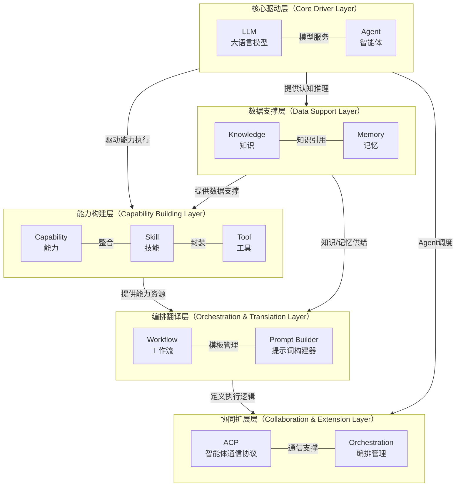

### 11.2 模块依赖关系矩阵

```
                Dash  Knowl  Memory  Capab  LLM  Agent  Orch   WF    PB    Merch  User  Perm  Monit  Setting
Dashboard         -     R      R      R     R     R      R     R     R      R     R     R     R       R
Knowledges        D     -      ↔      -     -     -      -     -     -      -     -     R     -       R
Memories          D     ↔      -      -     -     R      -     -     -      -     -     R     -       R
Capabilities      D     -      -      -     ↔     -      -     -     -      -     -     R     -       R
LLM               D     -      -      ↔     -     R      -     -     R      -     -     R     -       R
Agents            D     R      R      R     R     -      R     R     -      -     -     R     -       R
Orchestrations    D     -      -      -     -     R      -     R     -      -     -     R     R       R
Workflows         D     -      -      R     -     R      R     -     R      -     -     R     R       R
Prompt Builder    D     -      -      -     R     -      -     R     -      -     -     R     -       R
Merchants         D     -      -      -     -     -      -     -     -      -     ↔     R     -       R
Users             D     -      -      -     -     -      -     -     -      ↔     -     R     -       R
Permissions       D     -      -      -     -     -      -     -     -      -     -     -     -       R
Monitoring        D     R      R      R     R     R      R     R     R      R     R     R     -       R
System Setting    D     -      -      -     -     -      -     -     -      -     -     -     -       -
```

> R = Read（读取依赖），D = Data Source（数据来源），↔ = 双向交互

### 11.3 核心模块关系详解

**关系1：核心驱动层内部 — LLM ↔ Agent**

| 维度 | 说明 |
|------|------|
| 方向 | LLM ↔ Agent |
| 类型 | 双向依赖 |
| 描述 | LLM提供模型服务，Agent以LLM为核心控制器进行任务执行。Agent调用时需要选择具体的LLM模型，LLM的配置变更会影响Agent的执行效果 |
| 数据流 | Agent请求 → 模型选择 → LLM推理调用 → 结果返回 → Agent决策 |
| 影响范围 | LLM服务故障时，所有依赖该模型的Agent将无法执行推理任务 |

**关系2：数据支撑层内部 — Knowledge ↔ Memory**

| 维度 | 说明 |
|------|------|
| 方向 | Knowledge ↔ Memory |
| 类型 | 双向交互 |
| 描述 | Knowledge管理静态结构化信息，Memory管理动态交互记忆。知识库中的内容可被索引为记忆，记忆检索时可引用知识库内容 |
| 数据流 | 知识文档 → 向量化 → 索引 → 记忆检索 → 知识引用 |
| 影响范围 | 知识库更新时需同步刷新关联的记忆索引 |

**关系3：能力构建层 — Capability ↔ LLM**

| 维度 | 说明 |
|------|------|
| 方向 | Capability ↔ LLM |
| 类型 | 双向依赖 |
| 描述 | Capabilities整合Skill和Tool为统一资源池，能力调用时需要选择LLM模型进行推理 |
| 数据流 | 能力定义 → 模型选择 → LLM调用 → 结果返回 → 能力执行 |
| 影响范围 | LLM模型不可用时，依赖该模型的能力调用将失败 |

**关系4：编排翻译层 — Workflow ↔ Prompt Builder**

| 维度 | 说明 |
|------|------|
| 方向 | Workflow ↔ Prompt Builder |
| 类型 | 双向依赖 |
| 描述 | Workflow定义任务执行步骤，Prompt Builder管理Prompt模板。工作流节点可引用Prompt模板 |
| 数据流 | Prompt模板 → 工作流节点引用 → 执行时渲染模板 → LLM调用 |
| 影响范围 | Prompt模板删除时需检查是否被工作流引用 |

**关系5：协同扩展层 — Orchestration ↔ Agent/Workflow**

| 维度 | 说明 |
|------|------|
| 方向 | Orchestration → Agent、Orchestration → Workflow |
| 类型 | 调度依赖 |
| 描述 | Orchestrations定义多Agent协作流程，调度Agent执行任务并通过Workflow控制执行逻辑 |
| 数据流 | 编排定义 → Agent调度/Workflow执行 → 结果聚合 → 流程推进 |
| 影响范围 | Agent下线或Workflow变更时需评估对编排流程的影响 |

**关系6：管理模块 — Merchants ↔ Users**

| 维度 | 说明 |
|------|------|
| 方向 | Merchants ↔ Users |
| 类型 | 双向依赖 |
| 描述 | Merchants和Users之间存在多对多关系。商户下包含多个用户，用户归属于特定商户 |
| 数据流 | 商户创建 → 用户关联 → 权限继承 → 商户状态变更 → 用户权限更新 |
| 影响范围 | 商户禁用时，其下所有用户的访问权限同步失效 |

**关系7：System Setting — 全局配置**

| 维度 | 说明 |
|------|------|
| 方向 | System Setting → 所有模块 |
| 类型 | 配置依赖 |
| 描述 | System Setting为所有模块提供全局配置参数。各模块启动时读取系统设置中的配置，配置变更时通过事件通知机制实时推送至各模块 |
| 数据流 | 配置变更 → 事件总线 → 模块监听 → 配置热更新 |
| 影响范围 | 全局配置变更可能影响所有模块的行为 |

**关系8：Dashboard — 数据聚合**

| 维度 | 说明 |
|------|------|
| 方向 | Dashboard → 所有业务模块 |
| 类型 | 数据读取 |
| 描述 | Dashboard从所有业务模块聚合数据，展示KPI卡片和可视化图表 |
| 数据流 | 各模块数据 → 聚合查询 → KPI计算 → 图表渲染 |
| 影响范围 | Dashboard故障不影响其他模块运行 |

**关系9：Monitoring — 监控数据采集**

| 维度 | 说明 |
|------|------|
| 方向 | Monitoring → 所有业务模块 |
| 类型 | 监控采集 |
| 描述 | Monitoring从所有业务模块采集运行指标和日志数据，进行监控分析和告警 |
| 数据流 | 模块指标 → 采集Agent → PostgreSQL 分区表 / Prometheus → 监控面板/告警规则 |
| 影响范围 | Monitoring故障不影响业务模块运行，但会导致监控盲区 |

### 11.4 验收标准

| 编号 | 验收标准 | 验证方法 |
|------|----------|----------|
| AC-MR-01 | 模块依赖关系矩阵准确反映实际系统架构（覆盖14个模块） | 代码审查验证，逐一核对14个模块的依赖关系 |
| AC-MR-02 | 各模块间的数据流转路径清晰可追踪 | 集成测试验证，覆盖9条核心关系路径 |
| AC-MR-03 | 系统设置变更能实时推送至所有依赖模块 | 修改配置后验证各模块在5秒内生效 |
| AC-MR-04 | 系统分层架构图正确反映五层架构体系 | 架构评审验证层级归属和依赖方向 |

---

## 12. 非功能需求汇总

> **v6 收束说明(2026-06-14)**：本章节为 PRD-09 系统设置模块 NFR 的**补充指标**汇总（增量维度，如可扩展性/可观测性），NFR 编号采用增量编号（如 NFR-P-013~022）。**内容权威**为 §8（基础 NFR ），**配置权威**为 §17（全局非功能需求配置）。**新增 NFR 必须先在 §8 定义基础指标**，再在本章节补充扩展阈值；本章节**不**作为 NFR 唯一来源。

> 本章节整合自 PRD-12（全局导航与模块关系）的非功能需求汇总，在PRD-09原有非功能需求基础上补充可扩展性和可观测性两个维度，并对现有维度进行指标补充。

### 12.1 性能需求（补充指标）

> 以下为PRD-12中与PRD-09现有性能需求（§8.1）互补的全局性能指标。

| 编号 | 需求项 | 指标 | 验证方法 |
|------|--------|------|----------|
| NFR-P-013 | 页面首次加载时间 | ≤ 2秒（首屏渲染完成） | Lighthouse性能测试 |
| NFR-P-014 | 页面切换时间 | ≤ 500ms（SPA路由切换） | 前端性能监控 |
| NFR-P-015 | 系统并发能力 | ≥ 1000并发用户 | 压力测试 |
| NFR-P-016 | 数据库查询响应 | ≤ 100ms（单表查询，10万条数据） | 数据库性能测试 |
| NFR-P-017 | 文件上传速度 | ≥ 5MB/s（服务端处理速度） | 上传性能测试 |
| NFR-P-018 | 搜索响应时间 | ≤ 1秒（模糊搜索，10万条数据） | 搜索性能测试 |
| NFR-P-019 | WebSocket消息延迟 | ≤ 100ms（服务端到客户端） | 实时通信测试 |
| NFR-P-020 | 导航菜单加载时间 | ≤ 300ms（含权限过滤） | 前端性能监控 |
| NFR-P-021 | 全局搜索响应时间 | ≤ 500ms（返回前20条结果） | 搜索性能测试 |
| NFR-P-022 | 通知推送延迟 | ≤ 2秒（事件发生到客户端展示） | 实时通信测试 |

### 12.2 安全需求（补充指标）

> 以下为PRD-12中与PRD-09现有安全需求（§8.2）互补的全局安全指标。

| 编号 | 需求项 | 指标 | 验证方法 |
|------|--------|------|----------|
| NFR-S-010 | 传输加密 | 全站HTTPS，TLS 1.2+ | SSL Labs测试 |
| NFR-S-011 | 数据加密 | 敏感数据RSA加密传输，AES-256加密存储 | 代码审查+渗透测试 |
| NFR-S-012 | 密码存储 | BCrypt哈希存储，cost factor ≥ 12 | 代码审查 |
| NFR-S-013 | 认证机制 | JWT + Refresh Token双Token机制 | 安全测试 |
| NFR-S-014 | Token有效期 | Access Token 30分钟，Refresh Token 7天 | 配置检查 |
| NFR-S-015 | 多租户隔离 | 商户间数据完全隔离，杜绝跨租户数据访问 | 渗透测试 |
| NFR-S-016 | 防注入 | SQL注入、XSS、CSRF、SSRF防护 | 渗透测试 |
| NFR-S-017 | 请求限流 | 单用户API调用频率限制（100次/分钟） | 压力测试 |
| NFR-S-018 | CORS策略 | 仅允许白名单域名跨域访问 | 配置检查 |
| NFR-S-019 | 安全头部 | 启用CSP、X-Frame-Options、X-Content-Type-Options等安全头部 | HTTP头部检查 |
| NFR-S-020 | 权限诊断审计 | 所有权限诊断操作记录审计日志 | 日志审查 |
| NFR-S-021 | 导航权限隔离 | 导航菜单严格按权限过滤，禁止通过URL绕过访问无权限模块 | 渗透测试 |

### 12.3 可用性需求（补充指标）

> 以下为PRD-12中与PRD-09现有可用性需求（§8.3）互补的全局可用性指标。

| 编号 | 需求项 | 指标 | 验证方法 |
|------|--------|------|----------|
| NFR-A-009 | 系统可用性 | ≥ 99.9%（月度） | 监控报表 |
| NFR-A-010 | 计划内维护窗口 | 每月不超过2次，每次不超过2小时 | 维护记录 |
| NFR-A-011 | 数据备份频率 | 每日全量备份 + 每小时增量备份 | 备份记录 |
| NFR-A-012 | RPO（恢复点目标） | ≤ 5分钟 | 灾备演练 |
| NFR-A-013 | RTO（恢复时间目标） | ≤ 15分钟 | 灾备演练 |
| NFR-A-014 | 故障切换时间 | ≤ 10秒（自动故障切换） | 高可用测试 |
| NFR-A-015 | 错误率 | API错误率 ≤ 0.1%（排除客户端错误） | 监控报表 |
| NFR-A-016 | 导航降级 | 权限接口故障时展示基础导航（仅Dashboard） | 故障注入测试 |

### 12.4 兼容性需求（补充指标）

> 以下为PRD-12中与PRD-09现有兼容性需求（§8.6）互补的全局兼容性指标。

| 编号 | 需求项 | 指标 | 验证方法 |
|------|--------|------|----------|
| NFR-C-005 | 分辨率适配 | 最小支持1280x720（桌面端），推荐1920x1080 | 响应式测试 |
| NFR-C-006 | 移动端适配 | iOS Safari 14+、Android Chrome 90+（仅查看功能） | 移动端测试 |
| NFR-C-007 | API向后兼容 | API版本升级时，旧版本至少保留6个月兼容期 | 版本管理检查 |
| NFR-C-008 | 响应式断点 | 支持XL/LG/MD/SM四个断点平滑适配 | 响应式测试 |

### 12.5 可维护性需求（补充指标）

> 以下为PRD-12中与PRD-09现有可维护性需求（§8.5）互补的全局可维护性指标。

| 编号 | 需求项 | 指标 | 验证方法 |
|------|--------|------|----------|
| NFR-M-005 | 代码覆盖率 | 单元测试覆盖率 ≥ 80% | CI/CD流水线检查 |
| NFR-M-006 | 模块耦合度 | 模块间仅通过API通信，禁止直接数据库跨模块访问 | 代码审查 |
| NFR-M-007 | 配置外部化 | 所有环境相关配置外部化，支持配置中心动态更新 | 配置审查 |
| NFR-M-008 | 日志规范 | 统一日志格式（JSON），包含traceId用于链路追踪 | 日志审查 |
| NFR-M-009 | 接口文档 | 所有API接口自动生成OpenAPI文档 | 文档检查 |
| NFR-M-010 | 导航配置化 | Sidebar菜单项通过配置注册，新增模块无需修改导航框架代码 | 配置验证 |

### 12.6 可扩展性需求（新增维度）

| 编号 | 需求项 | 指标 | 验证方法 |
|------|--------|------|----------|
| NFR-SC-001 | 水平扩展 | 所有服务支持水平扩展，无单点瓶颈 | 架构评审 |
| NFR-SC-002 | 模块热插拔 | 新增模块可通过配置注册到导航菜单，无需重启服务 | 功能测试 |
| NFR-SC-003 | 数据库分片 | 支持按商户维度进行数据分片 | 架构评审 |
| NFR-SC-004 | 消息队列 | 模块间异步通信通过消息队列，支持流量削峰 | 架构评审 |
| NFR-SC-005 | 插件机制 | 导航支持插件式扩展，第三方模块可注册导航入口 | 架构评审 |

### 12.7 可观测性需求（新增维度）

| 编号 | 需求项 | 指标 | 验证方法 |
|------|--------|------|----------|
| NFR-O-001 | 分布式追踪 | 所有API请求支持分布式链路追踪（traceId贯穿） | 链路追踪验证 |
| NFR-O-002 | 指标监控 | 所有服务暴露Prometheus指标接口（/metrics） | 监控系统验证 |
| NFR-O-003 | 健康检查 | 所有服务提供健康检查接口（/health） | 健康检查验证 |
| NFR-O-004 | 告警规则 | 关键指标异常时5分钟内触发告警通知 | 告警测试 |
| NFR-O-005 | 导航埋点 | 导航点击、搜索、通知等关键操作埋点上报 | 数据分析验证 |
| NFR-O-006 | 用户行为分析 | 导航路径分析，支持热力图展示用户操作习惯 | 数据分析验证 |

---

## 13. 接口规范汇总

> 本章节整合自 PRD-12（全局导航与模块关系），定义全平台统一的接口规范。

### 13.1 GraphQL 接口规范

| 规范项 | 说明 | 示例 |
|--------|------|------|
| 类型与字段命名 | Query 类型用于查询，Mutation 类型用于变更；字段名使用 camelCase | `query { merchants }`、`mutation { createMerchant(input: CreateMerchantInput!) }` |
| Query/Mutation 语义 | Query = 只读查询、Mutation = 写入变更（创建/更新/删除） | `query { merchant(id: ID!) }` |
| Schema 版本管理 | Schema 演进采用字段级 @deprecated 标注，禁止破坏性删除字段 | `deprecatedReason: "Use merchantV2"` |
| 响应状态码 | 业务模块响应 HTTP 状态码恒为 200（业务错误通过 `errors[].extensions.code` 表达；HTTP 401/403 仅保留在 API Gateway 网关层） | 创建成功返回 200 |
| 过滤与排序 | 通过 Query 参数传递筛选条件和排序规则 | `query { merchants(filter: {status: "active"}, sort: {createdAt: DESC}) }` |

### 13.2 统一端点与认证

| 规范项 | 说明 |
|--------|------|
| 对外接口 | GraphQL (POST /graphql) |
| 认证方式 | Bearer Token（JWT），请求头格式：`Authorization: Bearer {token}` |
| Token刷新 | Access Token过期后，使用Refresh Token获取新Token，Mutation：`mutation { refreshToken(token: String!) }` |
| 认证失败 | 返回401状态码，响应体包含错误详情 |

### 13.3 统一响应格式

**成功响应**：

```json
{
  "code": 200,
  "message": "success",
  "data": {
    // business data
  },
  "timestamp": 1717804800000,
  "traceId": "trace-abc123-def456"
}
```

**分页响应**：

```json
{
  "code": 200,
  "message": "success",
  "data": {
    "items": [
      // data list
    ],
    "pagination": {
      "total": 100,
      "page": 1,
      "pageSize": 20,
      "totalPages": 5
    }
  },
  "timestamp": 1717804800000,
  "traceId": "trace-abc123-def456"
}
```

**错误响应**：

```json
{
  "code": 400101,
  "message": "参数校验失败",
  "data": null,
  "timestamp": 1717804800000,
  "traceId": "trace-abc123-def456",
  "errors": [
    {
      "field": "merchantName",
      "message": "商户名称不能为空"
    }
  ]
}
```

### 13.4 错误码体系

错误码命名空间：`BIZ_SETTING_*` | 数字段位：`090001-090999`

> 本节错误码段位遵循 PRD-00 §5.3.2.1 错误码段位权威分配表，PRD-09 段位范围为 `090001-090999`，下表为 PRD-09 内部子段位细分。

**模块编码**：

| 模块编码 | 模块名称 |
|----------|----------|
| 0901xx | 通用（Common） |
| 0902xx | 导航（Navigation） |
| 0903xx | 主题（Theme） |
| 0904xx | i18n |
| 0905xx | Email |
| 0906xx | SMS |
| 0907xx | Webhook |
| 0908xx | Branding |

**类型编码**：

| 类型编码 | 类型名称 |
|----------|----------|
| 00 | 通用错误 |
| 01 | 参数校验错误 |
| 02 | 业务规则错误 |
| 03 | 权限错误 |
| 04 | 资源不存在 |
| 05 | 状态冲突 |
| 06 | 外部服务错误 |
| 99 | 系统内部错误 |

**常用错误码示例**：

| 错误码 | 说明 |
|--------|------|
| 090100 | 未知错误 |
| 090199 | 系统内部错误 |
| 090201 | 导航菜单编码已存在 |
| 090202 | 导航菜单路径冲突 |
| 090203 | 导航菜单不存在 |
| 090301 | 主题名称不能为空 |
| 090302 | 主题色值非法 |
| 090303 | 主题不存在 |
| 090401 | 语言包未找到 |
| 090402 | 翻译键缺失 |
| 090501 | 邮件模板名称不能为空 |
| 090502 | SMTP 配置缺失 |
| 090503 | 邮件模板不存在 |
| 090601 | 短信签名未配置 |
| 090602 | 短信模板不存在 |
| 090701 | Webhook URL 非法 |
| 090702 | Webhook 签名校验失败 |
| 090703 | Webhook 不存在 |
| 090801 | 品牌 Logo 缺失 |
| 090802 | 品牌资源不存在 |

### 13.5 分页规范

| 参数名 | 类型 | 默认值 | 说明 |
|--------|------|--------|------|
| page | Integer | 1 | 当前页码，从1开始 |
| pageSize | Integer | 20 | 每页记录数，可选值：10/20/50/100 |
| sort | String | createdAt:desc | 排序字段:排序方向，支持多字段排序（逗号分隔） |
| search | String | - | 全文搜索关键词 |

**分页响应结构**：

```json
{
  "pagination": {
    "total": 100,
    "page": 1,
    "pageSize": 20,
    "totalPages": 5,
    "hasPrevious": false,
    "hasNext": true
  }
}
```

### 13.6 验收标准

| 编号 | 验收标准 | 验证方法 |
|------|----------|----------|
| AC-API-01 | 所有API遵循GraphQL单总线规范（POST /graphql） | API审查，逐一检查14个模块的API设计 |
| AC-API-02 | 所有API通过POST /graphql端点暴露 | API审查 |
| AC-API-03 | 所有API响应格式符合统一规范 | 接口自动化测试，覆盖率100% |
| AC-API-04 | 错误码体系完整且正确使用 | 接口测试 |
| AC-API-05 | 分页接口遵循统一分页规范 | 接口测试 |

---

## 14. 权限查询与诊断

> 本章节整合自 PRD-12（全局导航与模块关系），提供权限查询与诊断的完整功能定义。

### 14.1 当前用户权限查询

**用户故事**：作为系统用户，我希望能够查看自己当前拥有的所有有效权限，包括权限来源（角色、用户组、直接分配），以便了解自己的操作范围。

**权限查询入口**：
- Topbar用户信息下拉菜单 > "我的权限"
- 路由路径：`/my-permissions`

**权限概览面板**：

| 展示项 | 说明 |
|--------|------|
| 用户名 | 当前登录用户的名称 |
| 所属商户 | 当前用户所属商户 |
| 当前角色 | 用户当前拥有的所有角色标签 |
| 权限总数 | 用户当前生效的权限总数 |

**权限详情列表**：

| 字段名 | 类型 | 说明 |
|--------|------|------|
| 资源模块 | String | 权限所属的资源模块 |
| 资源 | String | 具体资源名称 |
| 操作 | String[] | 允许的操作列表（read、create、update、delete） |
| 来源 | String | 权限来源（角色名称 / 用户组名称 / 直接分配） |
| 来源类型 | Enum | Role / UserGroup / Direct |

**验收标准**：

| 编号 | 验收标准 | 验证方法 |
|------|----------|----------|
| AC-PQ-01 | 权限概览正确展示用户基本信息和权限总数 | 检查概览面板，验证权限总数与详情列表条目数一致 |
| AC-PQ-02 | 权限详情正确展示所有有效权限及来源 | 对比用户角色配置验证，覆盖Role/UserGroup/Direct三种来源 |
| AC-PQ-03 | 按来源类型筛选功能正确 | 选择不同来源类型验证筛选结果 |

### 14.2 指定用户权限查询

**用户故事**：作为管理员，我希望能够查询指定用户的所有有效权限，以便进行权限审计和问题排查。

**前置条件**：用户拥有 `permission:diagnose` 权限

**主流程**：
1. 管理员进入权限诊断页面
2. 管理员输入目标用户名或用户ID
3. 系统展示该用户的所有有效权限（与当前用户权限查询页面结构相同）
4. 管理员可查看该用户的角色、用户组和直接分配权限的详细构成

**验收标准**：

| 编号 | 验收标准 | 验证方法 |
|------|----------|----------|
| AC-PQS-01 | 管理员可查询任意用户的权限 | 输入5个不同用户验证查询结果 |
| AC-PQS-02 | 查询结果与目标用户的实际权限一致 | 对比目标用户的角色配置验证 |
| AC-PQS-03 | 无`permission:diagnose`权限的用户无法访问此功能 | 以普通用户身份访问验证返回403 |

### 14.3 权限判定路径追踪

**用户故事**：作为安全管理员，我希望能够追踪某次权限判定的完整路径，了解权限是被允许还是拒绝，以及具体的判定依据，以便快速定位权限问题的根因。

**前置条件**：用户拥有 `permission:diagnose` 权限

**诊断输入**：

| 输入项 | 类型 | 说明 |
|--------|------|------|
| 目标用户 | Select | 选择要诊断的用户 |
| 目标资源 | Select | 选择要访问的资源类型 |
| 目标操作 | Select | 选择要执行的操作 |

**诊断输出**：

| 输出项 | 类型 | 说明 |
|--------|------|------|
| 判定结果 | Enum | Allow / Deny |
| 判定依据 | String | 判定的详细说明 |
| 判定路径 | Path[] | 权限判定的完整路径 |
| 匹配策略 | Policy[] | 匹配到的ABAC策略列表 |
| 角色权限检查 | Check[] | 角色权限检查结果 |
| 数据权限检查 | Check[] | 数据权限检查结果 |
| 判定耗时 | Number | 权限判定耗时（毫秒） |

**判定路径示例**：

```
1. [RBAC Check] 检查用户角色权限
   - 角色: Merchant Admin → 包含 merchant:read ✓
2. [ABAC Check] 评估ABAC策略
   - 策略1 (优先级10): user.role == "admin" → 不匹配
   - 策略2 (优先级20): resource.owner == user.id → 匹配 → Allow
3. [Data Permission Check] 检查数据范围
   - 数据范围: 本部门及下级 → 包含目标数据 ✓
4. [Final Result] Allow (基于策略2)
```

**验收标准**：

| 编号 | 验收标准 | 验证方法 |
|------|----------|----------|
| AC-PPT-01 | 诊断结果正确展示Allow/Deny | 分别测试有权限和无权限场景各5组 |
| AC-PPT-02 | 判定路径完整展示RBAC、ABAC和数据权限检查三个步骤 | 检查判定路径输出 |
| AC-PPT-03 | 匹配策略正确展示策略名称和匹配条件 | 检查匹配策略输出，与ABAC策略配置对比 |
| AC-PPT-04 | 判定耗时 ≤ 100ms | 执行10次诊断验证平均耗时 |

### 14.4 权限差距分析

**用户故事**：作为安全管理员，我希望能够对比两个用户或两个角色的权限差异，以便发现权限配置的不一致或遗漏。

**前置条件**：用户拥有 `permission:diagnose` 权限

**分析输入**：

| 输入项 | 类型 | 说明 |
|--------|------|------|
| 对比类型 | Select | 用户 vs 用户 / 角色 vs 角色 / 用户 vs 角色 |
| 对象A | Select | 第一个对比对象 |
| 对象B | Select | 第二个对比对象 |

**分析输出**：

| 输出项 | 类型 | 说明 |
|--------|------|------|
| 仅A拥有 | Permission[] | 对象A拥有但对象B没有的权限 |
| 仅B拥有 | Permission[] | 对象B拥有但对象A没有的权限 |
| 共同拥有 | Permission[] | 两个对象都拥有的权限 |
| 差异统计 | Summary | 权限总数对比、差异项数量 |

**验收标准**：

| 编号 | 验收标准 | 验证方法 |
|------|----------|----------|
| AC-PGA-01 | 支持用户vs用户、角色vs角色、用户vs角色三种对比模式 | 分别选择三种模式验证功能正常 |
| AC-PGA-02 | 差异分析结果准确（仅A/仅B/共同的权限划分正确） | 对比已知权限差异的两个对象验证 |
| AC-PGA-03 | 差异项颜色区分清晰（蓝色/橙色/灰色） | 检查颜色标注 |
| AC-PGA-04 | 差异统计数据正确（总数、差异数、一致率） | 手动计算验证统计数值 |
| AC-PGA-05 | 分析结果支持导出为CSV | 点击导出按钮验证文件内容 |

---

## 15. 全局导航模块权限矩阵

> 本章节整合自 PRD-12（全局导航与模块关系），定义各角色在全局导航模块中的操作权限。

### 15.1 权限矩阵

| 功能/操作 | 超级管理员 | 商户管理员 | 部门管理员 | 普通用户 | 审计员 |
|-----------|:----------:|:----------:|:----------:|:--------:|:------:|
| **Sidebar导航** | | | | | |
| 访问Dashboard | ✅ | ✅ | ✅ | ✅ | ✅ |
| 访问知识管理 | ✅ | ✅ | ✅ | ✅ | ❌ |
| 访问记忆管理 | ✅ | ✅ | ✅ | ✅ | ❌ |
| 访问能力管理 | ✅ | ✅ | ❌ | ❌ | ❌ |
| 访问大模型管理 | ✅ | ✅ | ❌ | ❌ | ❌ |
| 访问代理管理 | ✅ | ✅ | ✅ | ✅ | ❌ |
| 访问编排管理 | ✅ | ✅ | ✅ | ❌ | ❌ |
| 访问工作流管理 | ✅ | ✅ | ✅ | ❌ | ❌ |
| 访问提示词构建器 | ✅ | ✅ | ✅ | ❌ | ❌ |
| 访问商户管理 | ✅ | ✅ | ❌ | ❌ | ❌ |
| 访问用户管理 | ✅ | ✅ | ✅ | ❌ | ❌ |
| 访问权限管理 | ✅ | ✅ | ❌ | ❌ | ❌ |
| 访问监控与分析 | ✅ | ❌ | ❌ | ❌ | ✅ |
| 访问系统设置 | ✅ | ❌ | ❌ | ❌ | ❌ |
| **Topbar功能** | | | | | |
| 全局搜索 | ✅ | ✅ | ✅ | ✅ | ✅ |
| 通知中心 | ✅ | ✅ | ✅ | ✅ | ✅ |
| 帮助入口 | ✅ | ✅ | ✅ | ✅ | ✅ |
| 个人信息 | ✅ | ✅ | ✅ | ✅ | ✅ |
| 我的权限 | ✅ | ✅ | ✅ | ✅ | ✅ |
| 切换商户 | ✅ | ✅ | ❌ | ❌ | ❌ |
| 我的权益 | ✅ | ✅ | ✅ | ✅ | ✅ |
| 退出登录 | ✅ | ✅ | ✅ | ✅ | ✅ |
| **权限诊断** | | | | | |
| 当前用户权限查询 | ✅ | ✅ | ✅ | ✅ | ✅ |
| 指定用户权限查询 | ✅ | ✅ | ❌ | ❌ | ❌ |
| 权限判定路径追踪 | ✅ | ❌ | ❌ | ❌ | ❌ |
| 权限差距分析 | ✅ | ❌ | ❌ | ❌ | ❌ |

> ✅ = 允许访问，❌ = 禁止访问

### 15.2 导航权限控制规则

| 规则编号 | 规则描述 |
|----------|----------|
| BR-09-031 | Sidebar菜单项根据用户权限动态过滤，无权限模块不展示 |
| BR-09-032 | 全局搜索结果根据用户权限过滤，仅展示有权限访问的资源 |
| BR-09-033 | 通知中心仅展示与用户相关的通知（基于商户和角色过滤） |
| BR-09-034 | 切换商户功能仅对拥有`merchant:switch`权限且属于多个商户的用户展示 |
| BR-09-035 | 权限诊断功能（指定用户查询、路径追踪、差距分析）仅对拥有`permission:diagnose`权限的用户开放 |
| BR-09-036 | 通过URL直接访问无权限模块时，展示403页面而非重定向 |

### 15.3 验收标准

| 编号 | 验收标准 | 验证方法 |
|------|----------|----------|
| AC-PM-01 | 各角色用户看到的导航菜单与权限矩阵一致 | 分别以5种角色登录验证菜单展示 |
| AC-PM-02 | 无权限模块通过URL直接访问返回403 | 以普通用户身份直接访问管理模块URL |
| AC-PM-03 | 全局搜索结果与用户权限一致 | 以不同角色搜索同一关键词验证结果差异 |
| AC-PM-04 | 切换商户仅对多商户用户展示 | 分别以单商户和多商户用户验证菜单项展示 |

---

## 16. 响应式导航适配规则（基础规则）

> 本章节整合自 PRD-12（全局导航与模块关系）§5.3，定义全局导航在不同屏幕尺寸下的基础适配规则。详细的"可配置化参数与配置管理"定义见 §19 响应式导航适配规则（可配置化）。

### 16.1 响应式断点与适配规则

| 断点 | 设备类型 | 屏幕宽度 | Sidebar行为 | Topbar行为 | 说明 |
|------|----------|----------|-------------|------------|------|
| XL | 桌面端 | ≥ 1280px | 展开/折叠均可，默认展开 | 完整展示所有元素 | 推荐分辨率1920x1080 |
| LG | 小桌面/大平板 | 1024px~1279px | 默认折叠，点击展开浮层 | 搜索框缩小为图标 | 折叠后导航浮层覆盖内容区 |
| MD | 平板 | 768px~1023px | 隐藏，通过汉堡菜单唤出浮层 | 搜索框缩小为图标，面包屑隐藏 | 导航浮层从左侧滑入 |
| SM | 手机 | < 768px | 隐藏，底部标签栏替代 | 仅保留Logo+用户头像 | 底部标签栏展示5个核心功能入口 |

### 16.2 手机端底部标签栏

底部标签栏展示5个核心功能入口（按优先级排列）：

| 序号 | 标签名称 | 图标 | 路由 | 说明 |
|------|----------|------|------|------|
| 1 | 首页 | home | /dashboard | 仪表盘 |
| 2 | 知识 | knowledge | /knowledges | 知识管理 |
| 3 | 代理 | agent | /agents | 代理管理 |
| 4 | 通知 | notification | /notifications | 通知中心 |
| 5 | 我的 | user | /profile | 个人中心（含菜单入口） |

### 16.3 验收标准

| 编号 | 验收标准 | 验证方法 |
|------|----------|----------|
| AC-RESP-01 | 桌面端（≥1280px）Sidebar展开/折叠功能正常 | 在1920x1080分辨率下验证 |
| AC-RESP-02 | 小桌面端（1024~1279px）Sidebar默认折叠且浮层正常 | 在1280x800分辨率下验证 |
| AC-RESP-03 | 平板端（768~1023px）汉堡菜单唤出导航浮层正常 | 在768x1024分辨率下验证 |
| AC-RESP-04 | 手机端（<768px）底部标签栏展示5个核心入口 | 在375x812分辨率下验证 |
| AC-RESP-05 | 各断点切换时导航状态平滑过渡 | 调整浏览器窗口大小验证过渡动画 |

---

## 17. 全局非功能需求配置

> **v6 收束说明(2026-06-14)**：本章节是 PRD-09 系统设置模块 NFR 的**配置管理权威**（统一登记与下发入口），NFR 编号采用 PRD-12 原始编号（NFR-P-001~013、S-001~014 等）以便跨模块对齐。**基础 NFR 定义**见 §8，**补充指标**见 §12。本章节与 §8/§12 形成"基础阈值 + 扩展阈值 + 配置下发"三层结构。
>
> **与 v5 收束关系**：v5 收束说明（行19）指出"全局非功能需求配置(原 §17)→ PRD-00 §6"，即本章节的配置权威在 PRD-00 §6 系统级 NFR 中。本章节作为 PRD-09 模块内的"配置管理 UI 视角"，与 PRD-00 §6 配置权威形成"权威定义 + 落地配置"两级关系。

> 本章节从系统设置模块的"配置管理"视角整合 PRD-12（全局导航与模块关系）§5.5 全局非功能需求汇总。系统设置模块是这些非功能指标在管理界面上的统一登记与下发入口，各业务模块在启动时通过配置中心读取相应阈值，运行时通过事件总线接收阈值变更。
>
> 章节内 NFR 编号采用 PRD-12 原始编号（NFR-P-001~013、S-001~014、A-001~008、C-001~005、M-001~006、SC-001~005、O-001~006），与 §12 增量指标（NFR-P-013~022 等）形成"基础阈值"与"扩展阈值"两层配置体系。

### 17.1 性能需求配置

> 系统设置 > 性能配置 Tab 中暴露以下阈值的可视化配置入口，配置变更通过配置中心热更新至各模块。

| 配置项编号 | 需求项 | 指标 | 默认值 | 配置可调范围 | 验证方法 |
|------------|--------|------|--------|--------------|----------|
| NFR-P-001 | 页面首次加载时间 | ≤ 2秒（首屏渲染完成） | 2000ms | 500~5000ms | Lighthouse性能测试 |
| NFR-P-002 | 页面切换时间 | ≤ 500ms（SPA路由切换） | 500ms | 100~2000ms | 前端性能监控 |
| NFR-P-003 | API平均响应时间 | ≤ 500ms（P95） | 500ms | 100~3000ms | APM性能监控 |
| NFR-P-004 | API最大响应时间 | ≤ 2秒（P99） | 2000ms | 500~10000ms | APM性能监控 |
| NFR-P-005 | 系统并发能力 | ≥ 1000并发用户 | 1000 | 100~10000 | 压力测试 |
| NFR-P-006 | 数据库查询响应 | ≤ 100ms（单表查询，10万条数据） | 100ms | 50~1000ms | 数据库性能测试 |
| NFR-P-007 | 文件上传速度 | ≥ 5MB/s（服务端处理速度） | 5MB/s | 1~100MB/s | 上传性能测试 |
| NFR-P-008 | 列表分页加载 | ≤ 1秒（20条/页） | 1000ms | 200~5000ms | 接口性能测试 |
| NFR-P-009 | 搜索响应时间 | ≤ 1秒（模糊搜索，10万条数据） | 1000ms | 200~5000ms | 搜索性能测试 |
| NFR-P-010 | WebSocket消息延迟 | ≤ 100ms（服务端到客户端） | 100ms | 50~1000ms | 实时通信测试 |
| NFR-P-011 | 导航菜单加载时间 | ≤ 300ms（含权限过滤） | 300ms | 100~2000ms | 前端性能监控 |
| NFR-P-012 | 全局搜索响应时间 | ≤ 500ms（返回前20条结果） | 500ms | 200~3000ms | 搜索性能测试 |
| NFR-P-013 | 通知推送延迟 | ≤ 2秒（事件发生到客户端展示） | 2000ms | 500~10000ms | 实时通信测试 |

**性能配置界面**：

| 字段 | 说明 |
|------|------|
| 配置入口 | 系统设置 > 性能配置 |
| 权限要求 | `system:settings:performance` |
| 提交方式 | 表单提交 + 二次确认（影响范围提示） |
| 生效方式 | 实时热更新（BR-09-039） |
| 影响范围 | 全平台所有模块 |

### 17.2 安全需求配置

| 配置项编号 | 需求项 | 指标 | 配置可调参数 | 验证方法 |
|------------|--------|------|--------------|----------|
| NFR-S-001 | 传输加密 | 全站HTTPS，TLS 1.2+ | 最低TLS版本：1.2 / 1.3 | SSL Labs测试 |
| NFR-S-002 | 数据加密 | 敏感数据RSA加密传输，AES-256加密存储 | RSA密钥长度：2048 / 4096；AES密钥长度：256 | 代码审查+渗透测试 |
| NFR-S-003 | 密码存储 | BCrypt哈希存储，cost factor ≥ 12 | BCrypt cost factor：10~14 | 代码审查 |
| NFR-S-004 | 认证机制 | JWT + Refresh Token双Token机制 | JWT签名算法：HS256 / RS256 | 安全测试 |
| NFR-S-005 | Token有效期 | Access Token 30分钟，Refresh Token 7天 | Access Token：5~60分钟；Refresh Token：1~30天 | 配置检查 |
| NFR-S-006 | 数据脱敏 | 敏感数据展示时自动脱敏（手机号、邮箱、身份证等） | 脱敏规则：内置规则集 + 自定义规则 | 功能测试 |
| NFR-S-007 | 审计日志 | 所有敏感操作记录审计日志（不可篡改） | 审计保留期：90~3650天 | 功能测试 |
| NFR-S-008 | 多租户隔离 | 商户间数据完全隔离，杜绝跨租户数据访问 | 隔离粒度：行级 / Schema级 | 渗透测试 |
| NFR-S-009 | 防注入 | SQL注入、XSS、CSRF、SSRF防护 | 防护开关：SQL/XSS/CSRF/SSRF | 渗透测试 |
| NFR-S-010 | 请求限流 | 单用户API调用频率限制（100次/分钟） | 单用户QPS：10~1000 | 压力测试 |
| NFR-S-011 | CORS策略 | 仅允许白名单域名跨域访问 | 白名单域名列表 | 配置检查 |
| NFR-S-012 | 安全头部 | 启用CSP、X-Frame-Options、X-Content-Type-Options等安全头部 | 各安全头部开关 | HTTP头部检查 |
| NFR-S-013 | 权限诊断审计 | 所有权限诊断操作记录审计日志 | 审计级别：基础 / 完整 | 日志审查 |
| NFR-S-014 | 导航权限隔离 | 导航菜单严格按权限过滤，禁止通过URL绕过访问无权限模块 | 严格模式开关 | 渗透测试 |

### 17.3 可用性需求配置

| 配置项编号 | 需求项 | 指标 | 配置可调参数 | 验证方法 |
|------------|--------|------|--------------|----------|
| NFR-A-001 | 系统可用性 | ≥ 99.9%（月度） | 目标可用性SLA：99.0%~99.99% | 监控报表 |
| NFR-A-002 | 计划内维护窗口 | 每月不超过2次，每次不超过2小时 | 月度维护上限：1~4次；单次维护上限：1~4小时 | 维护记录 |
| NFR-A-003 | 数据备份频率 | 每日全量备份 + 每小时增量备份 | 全量备份周期：每日 / 每周；增量备份周期：1~24小时 | 备份记录 |
| NFR-A-004 | RPO（恢复点目标） | ≤ 5分钟 | RPO目标：1~60分钟 | 灾备演练 |
| NFR-A-005 | RTO（恢复时间目标） | ≤ 15分钟 | RTO目标：5~120分钟 | 灾备演练 |
| NFR-A-006 | 故障切换时间 | ≤ 10秒（自动故障切换） | 自动故障切换开关 + 切换超时 | 高可用测试 |
| NFR-A-007 | 错误率 | API错误率 ≤ 0.1%（排除客户端错误） | 错误率告警阈值：0.01%~1% | 监控报表 |
| NFR-A-008 | 导航降级 | 权限接口故障时展示基础导航（仅Dashboard） | 降级策略开关 | 故障注入测试 |

### 17.4 兼容性需求配置

| 配置项编号 | 需求项 | 指标 | 配置可调参数 | 验证方法 |
|------------|--------|------|--------------|----------|
| NFR-C-001 | 浏览器兼容性 | Chrome 90+、Firefox 88+、Safari 14+、Edge 90+ | 最低浏览器版本矩阵 | 多浏览器测试 |
| NFR-C-002 | 分辨率适配 | 最小支持1280x720（桌面端），推荐1920x1080 | 最小宽度：1024~1280px | 响应式测试 |
| NFR-C-003 | 移动端适配 | iOS Safari 14+、Android Chrome 90+（仅查看功能） | 移动端查看模式开关 | 移动端测试 |
| NFR-C-004 | API向后兼容 | API版本升级时，旧版本至少保留6个月兼容期 | 旧版本保留期：3~24个月 | 版本管理检查 |
| NFR-C-005 | 响应式断点 | 支持XL/LG/MD/SM四个断点平滑适配 | XL/LG/MD/SM 断点像素阈值 | 响应式测试 |

### 17.5 可维护性需求配置

| 配置项编号 | 需求项 | 指标 | 配置可调参数 | 验证方法 |
|------------|--------|------|--------------|----------|
| NFR-M-001 | 代码覆盖率 | 单元测试覆盖率 ≥ 80% | 覆盖率门槛：50%~95% | CI/CD流水线检查 |
| NFR-M-002 | 模块耦合度 | 模块间仅通过API通信，禁止直接数据库跨模块访问 | 跨模块DB访问检测开关 | 代码审查 |
| NFR-M-003 | 配置外部化 | 所有环境相关配置外部化，支持配置中心动态更新 | 配置中心：AWS Systems Manager Parameter Store / 自建 | 配置审查 |
| NFR-M-004 | 日志规范 | 统一日志格式（JSON），包含traceId用于链路追踪 | 日志级别：DEBUG/INFO/WARN/ERROR | 日志审查 |
| NFR-M-005 | 接口文档 | 所有API接口自动生成OpenAPI文档 | 文档生成开关 + 访问地址 | 文档检查 |
| NFR-M-006 | 导航配置化 | Sidebar菜单项通过配置注册，新增模块无需修改导航框架代码 | 模块注册中心地址 | 配置验证 |

### 17.6 可扩展性需求配置

| 配置项编号 | 需求项 | 指标 | 配置可调参数 | 验证方法 |
|------------|--------|------|--------------|----------|
| NFR-SC-001 | 水平扩展 | 所有服务支持水平扩展，无单点瓶颈 | 服务最小副本数 + 最大副本数 | 架构评审 |
| NFR-SC-002 | 模块热插拔 | 新增模块可通过配置注册到导航菜单，无需重启服务 | 模块注册模式：配置中心 / 服务发现 | 功能测试 |
| NFR-SC-003 | 数据库分片 | 支持按商户维度进行数据分片 | 分片键：merchant_id / tenant_id | 架构评审 |
| NFR-SC-004 | 消息队列 | 模块间异步通信通过消息队列，支持流量削峰 | MQ类型：SQS / RabbitMQ / RocketMQ | 架构评审 |
| NFR-SC-005 | 插件机制 | 导航支持插件式扩展，第三方模块可注册导航入口 | 插件市场开关 + 签名校验 | 架构评审 |

### 17.7 可观测性需求配置

| 配置项编号 | 需求项 | 指标 | 配置可调参数 | 验证方法 |
|------------|--------|------|--------------|----------|
| NFR-O-001 | 分布式追踪 | 所有API请求支持分布式链路追踪（traceId贯穿） | 采样率：0.1%~100% | 链路追踪验证 |
| NFR-O-002 | 指标监控 | 所有服务暴露Prometheus指标接口（/metrics） | 指标采集间隔：10~300秒 | 监控系统验证 |
| NFR-O-003 | 健康检查 | 所有服务提供健康检查接口（/health） | 健康检查间隔：5~60秒 | 健康检查验证 |
| NFR-O-004 | 告警规则 | 关键指标异常时5分钟内触发告警通知 | 告警延迟：1~30分钟 | 告警测试 |
| NFR-O-005 | 导航埋点 | 导航点击、搜索、通知等关键操作埋点上报 | 埋点开关 + 上报地址 | 数据分析验证 |
| NFR-O-006 | 用户行为分析 | 导航路径分析，支持热力图展示用户操作习惯 | 热力图开关 + 数据保留期 | 数据分析验证 |

**非功能需求配置变更流程**：

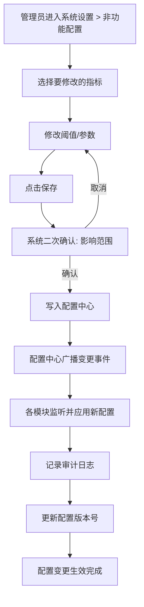

### 17.8 验收标准

| 编号 | 验收标准 | 验证方法 |
|------|----------|----------|
| AC-NFR-CFG-01 | 系统设置 > 非功能配置页面正确展示7大类共47+项配置项 | 逐项核对PRD-12 §5.5的所有配置项是否完整 |
| AC-NFR-CFG-02 | 性能/安全阈值修改后5秒内全平台生效 | 修改后调用任意接口验证新阈值 |
| AC-NFR-CFG-03 | 兼容性最低版本变更后，前端构建产物中包含新版本判断逻辑 | 检查前端代码并构建验证 |
| AC-NFR-CFG-04 | 可观测性采样率修改后，链路追踪系统按新采样率采集 | 调整采样率后观察采集数量 |
| AC-NFR-CFG-05 | 所有非功能需求配置变更记录审计日志，包含操作人、时间、变更前后值 | 检查审计日志模块 |
| AC-NFR-CFG-06 | 配置变更支持回滚到任意历史版本 | 测试回滚功能验证 |

---

## 18. 全局接口规范配置

> 本章节从系统设置模块的"接口规范配置"视角整合 PRD-12（全局导航与模块关系）§5.6 接口规范汇总。系统设置模块负责维护全平台统一接口规范的注册与版本管理，各业务模块在接口开发时遵循规范定义。

### 18.1 GraphQL 接口规范

**接口风格注册表**：

| 规范项 | 说明 | 示例 | 配置开关 |
|--------|------|------|----------|
| 类型与字段命名 | Query 类型用于查询，Mutation 类型用于变更；字段名使用 camelCase | `query { merchants }`、`mutation { createMerchant(input: CreateMerchantInput!) }` | 强制校验开关 |
| Query/Mutation 语义 | Query = 只读查询、Mutation = 写入变更（创建/更新/删除） | `query { merchant(id: ID!) }` | 强制校验开关 |
| Schema 版本管理 | Schema 演进采用字段级 @deprecated 标注，禁止破坏性删除字段 | `deprecatedReason: "Use merchantV2"` | 当前激活版本：v1 / v2 |
| 响应状态码 | 业务模块响应 HTTP 状态码恒为 200（业务错误通过 `errors[].extensions.code` 表达；HTTP 401/403 仅保留在 API Gateway 网关层） | 创建成功返回 200 | 强制校验开关 |
| 过滤与排序 | 通过 Query 参数传递筛选条件和排序规则 | `query { merchants(filter: {status: "active"}, sort: {createdAt: DESC}) }` | 强制校验开关 |

### 18.2 统一端点与认证

| 规范项 | 说明 | 可配置参数 |
|--------|------|------------|
| 对外接口 | GraphQL (POST /graphql) | API端点路径字符串 |
| 认证方式 | Bearer Token（JWT），请求头格式：`Authorization: Bearer {token}` | Token Header名称 |
| Token刷新 | Access Token过期后，使用Refresh Token获取新Token，Mutation：`mutation { refreshToken(token: String!) }` | 刷新Mutation名称 |
| 认证失败 | 返回401状态码，响应体包含错误详情 | 失败响应格式 |

### 18.3 统一响应格式

**成功响应模板**（在系统设置中可配置响应字段顺序与是否必填）：

```json
{
  "code": 200,
  "message": "success",
  "data": {
    // business data
  },
  "timestamp": 1717804800000,
  "traceId": "trace-abc123-def456"
}
```

**分页响应模板**：

```json
{
  "code": 200,
  "message": "success",
  "data": {
    "items": [
      // data list
    ],
    "pagination": {
      "total": 100,
      "page": 1,
      "pageSize": 20,
      "totalPages": 5
    }
  },
  "timestamp": 1717804800000,
  "traceId": "trace-abc123-def456"
}
```

**错误响应模板**：

```json
{
  "code": 400101,
  "message": "参数校验失败",
  "data": null,
  "timestamp": 1717804800000,
  "traceId": "trace-abc123-def456",
  "errors": [
    {
      "field": "merchantName",
      "message": "商户名称不能为空"
    }
  ]
}
```

**响应格式可配置字段**：

| 字段 | 是否必填 | 说明 |
|------|----------|------|
| code | 必填 | 业务状态码（区别于HTTP状态码） |
| message | 必填 | 业务消息 |
| data | 必填 | 业务数据 |
| timestamp | 必填 | 响应时间戳（毫秒） |
| traceId | 必填 | 链路追踪ID |
| errors | 错误时必填 | 字段级错误详情列表 |

### 18.4 错误码体系

> 本节错误码段位遵循 PRD-00 §5.3.2.1 错误码段位权威分配表，PRD-09 段位范围为 `090001-090999`，下表为 PRD-09 内部子段位细分。系统设置模块提供错误码注册表的可视化管理界面。

**模块编码注册表**：

| 模块编码 | 模块名称 | 注册负责人 |
|----------|----------|------------|
| 0901xx | 通用（Common） | 平台架构组 |
| 0902xx | 导航（Navigation） | 系统设置模块 |
| 0903xx | 主题（Theme） | 系统设置模块 |
| 0904xx | i18n | 系统设置模块 |
| 0905xx | Email | 系统设置模块 |
| 0906xx | SMS | 系统设置模块 |
| 0907xx | Webhook | 系统设置模块 |
| 0908xx | Branding | 系统设置模块 |

**类型编码注册表**：

| 类型编码 | 类型名称 | 含义 |
|----------|----------|------|
| 00 | 通用错误 | 跨模块通用错误 |
| 01 | 参数校验错误 | 入参校验失败 |
| 02 | 业务规则错误 | 业务规则违反 |
| 03 | 权限错误 | 权限不足或权限判定失败 |
| 04 | 资源不存在 | 目标资源不存在 |
| 05 | 状态冲突 | 资源状态不满足操作前置条件 |
| 06 | 外部服务错误 | 依赖的外部服务调用失败 |
| 99 | 系统内部错误 | 未预期的系统级错误 |

**常用错误码示例**：

| 错误码 | 说明 | 所属模块 |
|--------|------|----------|
| 090100 | 未知错误 | 通用 |
| 090199 | 系统内部错误 | 通用 |
| 090201 | 导航菜单编码已存在 | 导航 |
| 090202 | 导航菜单路径冲突 | 导航 |
| 090203 | 导航菜单不存在 | 导航 |
| 090301 | 主题名称不能为空 | 主题 |
| 090302 | 主题色值非法 | 主题 |
| 090303 | 主题不存在 | 主题 |
| 090401 | 语言包未找到 | i18n |
| 090402 | 翻译键缺失 | i18n |
| 090501 | 邮件模板名称不能为空 | Email |
| 090502 | SMTP 配置缺失 | Email |
| 090503 | 邮件模板不存在 | Email |
| 090601 | 短信签名未配置 | SMS |
| 090602 | 短信模板不存在 | SMS |
| 090701 | Webhook URL 非法 | Webhook |
| 090702 | Webhook 签名校验失败 | Webhook |
| 090703 | Webhook 不存在 | Webhook |
| 090801 | 品牌 Logo 缺失 | Branding |
| 090802 | 品牌资源不存在 | Branding |

**错误码注册管理界面**：

| 功能 | 说明 |
|------|------|
| 错误码注册 | 各模块负责人注册新错误码（编码、消息、HTTP状态码、模块归属） |
| 错误码查询 | 按模块编码、类型编码、关键字检索 |
| 错误码编辑 | 修改错误码消息文案（编码一旦确定不可修改） |
| 错误码导出 | 导出为OpenAPI/SDK错误码字典 |
| 错误码停用 | 停用错误码（停用后新接口不可使用，已有接口不受影响） |

### 18.5 分页规范

> **权威标准**: 全平台列表查询 API 统一使用 Relay Connection 规范(参见 PRD-00 §4.4)。本节定义的 Offset 分页参数仅作为内部兼容模式保留。

**分页请求参数规范**：

| 参数名 | 类型 | 默认值 | 取值范围 | 说明 |
|--------|------|--------|----------|------|
| page | Integer | 1 | ≥ 1 | 当前页码，从1开始 |
| pageSize | Integer | 20 | 10 / 20 / 50 / 100 | 每页记录数 |
| sort | String | createdAt:desc | — | 排序字段:排序方向，支持多字段排序（逗号分隔） |
| search | String | — | ≤ 100字符 | 全文搜索关键词 |

**分页响应结构规范**：

```json
{
  "pagination": {
    "total": 100,
    "page": 1,
    "pageSize": 20,
    "totalPages": 5,
    "hasPrevious": false,
    "hasNext": true
  }
}
```

**分页规范可配置参数**：

| 配置项 | 说明 | 默认值 |
|--------|------|--------|
| 默认页码 | 接口未传page时的默认值 | 1 |
| 默认每页大小 | 接口未传pageSize时的默认值 | 20 |
| 最大每页大小 | pageSize上限 | 100 |
| 默认排序字段 | 接口未传sort时的默认排序 | createdAt:desc |

### 18.6 验收标准

| 编号 | 验收标准 | 验证方法 |
|------|----------|----------|
| AC-API-CFG-01 | 系统设置 > 接口规范页面正确展示GraphQL接口规范5项、响应格式模板、错误码注册表、分页规范 | 检查页面各配置模块 |
| AC-API-CFG-02 | 错误码注册新条目后立即生效，所有模块可引用新错误码 | 注册新错误码并调用返回该错误码的接口 |
| AC-API-CFG-03 | 响应格式字段顺序变更后所有接口按新顺序返回 | 修改配置后调用任意接口验证 |
| AC-API-CFG-04 | 分页默认参数变更后接口按新默认值返回 | 修改默认值后调用未传分页参数的接口 |
| AC-API-CFG-05 | 接口规范配置变更记录审计日志 | 检查审计日志模块 |
| AC-API-CFG-06 | 错误码导出文件可被前端SDK自动消费 | 导出后运行SDK构建验证 |

---

## 19. 响应式导航适配规则

> 本章节在 §16（响应式导航适配规则 - 概要）的基础上，从系统设置模块的"导航行为配置"视角，对全局导航在不同屏幕尺寸下的适配规则进行更详细的可配置参数化定义，并补充响应式适配的验收标准。

### 19.1 响应式断点定义

> 系统设置 > 导航适配 Tab 中可配置各断点的像素阈值与设备类型映射。

| 断点 | 设备类型 | 默认像素阈值 | 可配置范围 | 物理设备参考 |
|------|----------|--------------|------------|--------------|
| XL | 桌面端 | ≥ 1280px | 1024~2560px | 1920x1080、2560x1440 |
| LG | 小桌面/大平板 | 1024px~1279px | 768~1280px | 1280x800、1366x768 |
| MD | 平板 | 768px~1023px | 640~1024px | 768x1024、1024x768 |
| SM | 手机 | < 768px | 320~768px | 375x812、414x896 |

**断点切换规则**：

| 规则编号 | 规则描述 |
|----------|----------|
| BR-RESP-BP-001 | 断点切换采用"较大值优先"原则：即窗口尺寸刚好等于某断点下限时，归入该断点（如 1280px 归入 XL） |
| BR-RESP-BP-002 | 断点切换实时生效，无需刷新页面 |
| BR-RESP-BP-003 | 断点切换伴随200ms过渡动画（ease-in-out） |
| BR-RESP-BP-004 | 断点变更不丢失用户当前所在的导航状态（折叠/展开保持） |

### 19.2 各断点的Sidebar行为

| 断点 | Sidebar默认状态 | 切换行为 | 浮层/抽屉行为 | 遮罩行为 |
|------|----------------|----------|---------------|----------|
| XL | 展开（240px） | 点击折叠按钮可切换为64px折叠 | 不使用浮层 | 无遮罩 |
| LG | 折叠（64px） | 点击展开按钮切换为浮层（240px） | 浮层覆盖主内容区，宽度240px | 半透明黑色遮罩（rgba(0,0,0,0.4)） |
| MD | 隐藏 | 通过汉堡菜单唤出浮层 | 浮层从左侧滑入，宽度280px | 半透明黑色遮罩 |
| SM | 隐藏 | 通过底部标签栏或汉堡菜单唤出 | 全屏抽屉式浮层，宽度=屏幕宽度 | 完全遮罩 |

**Sidebar可配置参数**：

| 配置项 | 默认值 | 可调范围 | 说明 |
|--------|--------|----------|------|
| 展开宽度 | 240px | 200~320px | 桌面端展开时Sidebar宽度 |
| 折叠宽度 | 64px | 48~80px | 桌面端折叠时Sidebar宽度 |
| 浮层宽度（LG） | 240px | 200~320px | 小桌面端浮层宽度 |
| 浮层宽度（MD） | 280px | 240~320px | 平板端浮层宽度 |
| 浮层动画时长 | 200ms | 100~500ms | 浮层展开/收起动画时长 |
| 遮罩透明度 | 0.4 | 0~1 | 浮层背后遮罩透明度 |
| 遮罩点击关闭 | 启用 | 启用/禁用 | 点击遮罩是否关闭浮层 |

### 19.3 各断点的Topbar行为

| 断点 | Topbar完整元素 | 元素收纳规则 | 面包屑行为 |
|------|----------------|--------------|------------|
| XL | Logo + 折叠按钮 + 面包屑 + 搜索框（400px宽）+ 通知 + 帮助 + 用户信息 | 全部展开 | 展示3级面包屑 |
| LG | Logo + 折叠按钮 + 面包屑 + 搜索图标 + 通知 + 帮助 + 用户信息 | 搜索框收纳为图标，点击展开 | 展示3级面包屑 |
| MD | Logo + 汉堡菜单 + 搜索图标 + 通知 + 用户信息 | 折叠按钮替换为汉堡菜单；面包屑隐藏 | 面包屑隐藏（标题替代） |
| SM | Logo + 搜索图标 + 通知 + 用户头像 | 仅保留核心元素 | 面包屑隐藏（返回按钮替代） |

**Topbar可配置参数**：

| 配置项 | 默认值 | 可调范围 | 说明 |
|--------|--------|----------|------|
| Topbar高度 | 56px | 48~72px | 顶部栏高度 |
| 搜索框宽度（XL） | 400px | 240~600px | 桌面端搜索框展开宽度 |
| 搜索框宽度（LG） | 240px | 200~400px | 小桌面端搜索框宽度 |
| 面包屑最大层级 | 3 | 2~5 | 面包屑最大展示层级 |

### 19.4 手机端底部标签栏

> 底部标签栏在 SM 断点（< 768px）展示，替代Sidebar为移动端用户提供核心功能入口。

**标签栏配置**：

| 配置项 | 默认值 | 说明 |
|--------|--------|------|
| 标签栏高度 | 56px | 底部Tab栏高度（iOS安全区适配另加34px） |
| 标签数量 | 5个 | 底部标签栏的标签数量 |
| 中间凸起按钮 | 启用 | 是否展示中间凸起的特殊按钮（如"+"） |
| 角标位置 | 右上角 | 通知等角标展示位置 |
| 未选中图标颜色 | #6B7280 | 未激活状态的图标颜色 |
| 选中图标颜色 | #3B82F6 | 激活状态的图标颜色 |

**默认标签项配置**：

| 序号 | 标签名称 | 图标 | 路由 | 说明 |
|------|----------|------|------|------|
| 1 | 首页 | home | /dashboard | 仪表盘 |
| 2 | 知识 | knowledge | /knowledges | 知识管理 |
| 3 | 代理 | agent | /agents | 代理管理 |
| 4 | 通知 | notification | /notifications | 通知中心 |
| 5 | 我的 | user | /profile | 个人中心（含菜单入口） |

**标签项可配置参数**（系统设置 > 移动端导航 中可调整）：

| 配置项 | 说明 |
|--------|------|
| 标签数量 | 支持3~5个标签 |
| 标签顺序 | 支持拖拽调整（仅超级管理员） |
| 标签图标 | 支持从图标库中选择 |
| 标签名称 | 支持多语言配置 |
| 标签权限 | 每个标签可配置可见权限 |

### 19.5 响应式适配验收标准

| 编号 | 验收标准 | 验证方法 |
|------|----------|----------|
| AC-RESP-CFG-01 | 系统设置 > 导航适配中修改断点阈值后实时生效 | 修改后调整浏览器窗口验证 |
| AC-RESP-CFG-02 | 桌面端（≥1280px）Sidebar展开/折叠功能正常 | 在1920x1080分辨率下验证 |
| AC-RESP-CFG-03 | 小桌面端（1024~1279px）Sidebar默认折叠且浮层正常 | 在1280x800分辨率下验证 |
| AC-RESP-CFG-04 | 平板端（768~1023px）汉堡菜单唤出导航浮层正常 | 在768x1024分辨率下验证 |
| AC-RESP-CFG-05 | 手机端（<768px）底部标签栏展示5个核心入口 | 在375x812分辨率下验证 |
| AC-RESP-CFG-06 | 各断点切换时导航状态平滑过渡 | 调整浏览器窗口大小验证过渡动画 |
| AC-RESP-CFG-07 | 浮层点击遮罩可关闭（默认行为） | 在MD/LG断点唤出浮层后点击遮罩 |
| AC-RESP-CFG-08 | 浮层打开时禁止body滚动 | 唤出浮层后尝试滚动主内容区 |
| AC-RESP-CFG-09 | iOS安全区适配：底部Tab栏在小屏全面屏iPhone中不被Home Indicator遮挡 | 在iPhone 14/15真机验证 |
| AC-RESP-CFG-10 | 断点配置变更记录审计日志 | 检查审计日志模块 |

---

## 20. 模块配置管理

> 本章节整合自 PRD-12（全局导航与模块关系）§5.4.5 关系7（System Setting — 全局配置）、§6.2 模块集成规则（BR-09-037~041），定义系统设置模块作为"全局配置中心"对外提供的配置推送、热更新、审计与回滚能力。

### 20.1 全局配置推送机制

> 系统设置模块是平台所有模块的"配置源头"。各业务模块启动时从系统设置读取配置，运行时通过事件总线接收配置变更通知。

**配置推送架构图**：

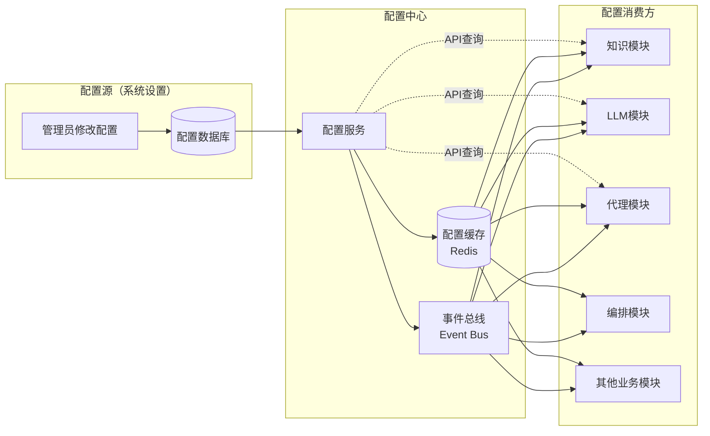

**配置推送规则**：

| 规则编号 | 规则描述 | 来源 |
|----------|----------|------|
| BR-09-037 | 模块解耦：各模块通过API进行通信，禁止直接数据库跨模块访问 | PRD-12 §6.2 |
| BR-09-038 | 事件驱动：模块间的状态变更通知通过事件总线传递 | PRD-12 §6.2 |
| BR-09-039 | 配置热更新：系统设置变更通过配置中心推送，各模块监听变更事件 | PRD-12 §6.2 / §5.4.5 关系7 |
| BR-09-040 | 数据一致性：跨模块数据操作采用最终一致性模型，通过消息队列保证 | PRD-12 §6.2 |
| BR-09-041 | 接口版本兼容：模块间接口变更需保持向后兼容，废弃接口至少保留6个月过渡期 | PRD-12 §6.2 |

**配置推送技术规范**：

| 项 | 说明 |
|------|------|
| 推送方式 | 事件总线 + 配置中心主动拉取（双通道） |
| 事件格式 | `{configKey, oldValue, newValue, version, timestamp, operator}` |
| 推送延迟 | ≤ 2秒（NFR-P-013 通知推送延迟要求） |
| 推送可靠性 | 至少一次（at-least-once），失败自动重试3次 |
| 推送范围 | 平台级配置推送至所有商户；商户级配置仅推送至目标商户 |

**配置分类与可见性**：

| 配置层级 | 可见范围 | 修改权限 | 推送通道 |
|----------|----------|----------|----------|
| 平台级配置 | 全平台所有商户 | 超级管理员 | 全局事件总线 |
| 商户级配置 | 单个商户 | 商户管理员 | 商户事件总线 |
| 部门级配置 | 单个部门 | 部门管理员 | 部门事件总线 |
| 用户级配置 | 单个用户 | 用户本人 | 用户事件总线 |

### 20.2 配置热更新流程

> 配置热更新是指在不重启服务的情况下，将新的配置参数推送到运行中的模块并立即生效。

**配置热更新流程图**：

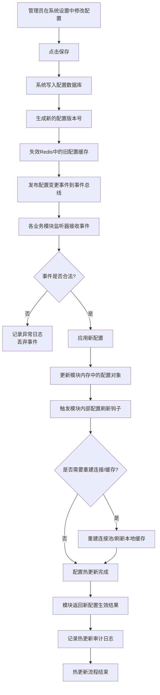

**配置热更新规则**：

| 规则编号 | 规则描述 |
|----------|----------|
| BR-09-042 | 配置热更新不重启服务进程 |
| BR-09-043 | 配置变更后5秒内全平台生效（NFR-P-013要求 ≤ 2秒为推送延迟，加载时间预留3秒） |
| BR-09-044 | 热更新失败时回退到旧配置，不影响系统运行 |
| BR-09-045 | 热更新过程记录审计日志（操作人、时间、变更前后值、生效结果） |
| BR-09-046 | 支持灰度发布：新配置先在指定商户/用户生效，验证通过后全量推送 |
| BR-09-047 | 配置项标记为"需重启"的，不进行热更新，提示"该配置变更需要重启服务" |

**配置项可热更新标记**：

| 配置类别 | 是否可热更新 | 备注 |
|----------|--------------|------|
| 系统名称、Logo | ✅ | 即时生效 |
| 会话超时时间 | ✅ | 新登录会话生效，旧会话保持至登出 |
| 默认语言、时区 | ✅ | 即时生效 |
| LLM调用超时 | ✅ | 新调用生效，旧调用保持 |
| 数据库连接池 | ❌ | 需要重启服务 |
| 缓存TTL | ✅ | 下次缓存刷新时生效 |

### 20.3 配置审计

> 所有配置变更（新增、修改、删除、回滚）均记录审计日志，确保配置变更的可追溯性，满足合规要求。

**配置审计日志字段**：

| 字段名 | 类型 | 说明 |
|--------|------|------|
| auditId | String | 审计日志唯一ID |
| operation | Enum | CREATE / UPDATE / DELETE / ROLLBACK |
| configKey | String | 配置项标识 |
| configCategory | String | 配置所属分类 |
| oldValue | Object | 变更前值（DELETE操作时为删除前的值） |
| newValue | Object | 变更后值（DELETE操作时为null） |
| operator | User | 操作人（用户ID + 姓名） |
| operatorIp | String | 操作人IP地址 |
| operationTime | DateTime | 操作时间 |
| effectiveScope | String | 生效范围（平台/商户/部门/用户） |
| effectiveStatus | Enum | PENDING / ACTIVE / ROLLED_BACK / FAILED |
| reason | String | 变更原因（可选填写） |
| traceId | String | 链路追踪ID |

**配置审计功能**：

| 功能 | 说明 |
|------|------|
| 审计日志查询 | 按时间范围、操作人、配置项、操作类型多维度筛选 |
| 审计日志详情 | 展示变更前后的完整值对比 |
| 审计日志导出 | 导出为CSV/Excel，便于合规审计 |
| 审计日志保留 | 默认保留365天，可配置延长至3650天（NFR-S-007） |
| 审计日志完整性 | 审计日志不可篡改，采用追加写+数字签名 |

**配置审计界面**：

| 区域 | 内容 |
|------|------|
| 筛选区 | 时间范围、操作人、配置项、操作类型、商户范围 |
| 列表区 | 按时间倒序展示审计记录，支持分页 |
| 详情面板 | 点击单条记录展开查看变更前后值对比 |
| 导出区 | 按筛选条件导出审计日志 |

### 20.4 配置回滚

> 当配置变更导致系统异常或不符合预期时，管理员可从历史版本回滚到指定版本。

**配置回滚流程图**：

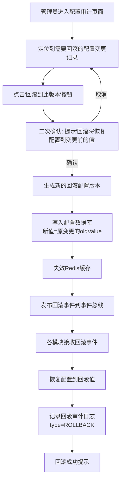

**配置回滚规则**：

| 规则编号 | 规则描述 |
|----------|----------|
| BR-09-048 | 支持回滚到任意历史版本，不限制时间窗口（受审计日志保留期限制） |
| BR-09-049 | 回滚操作生成新的配置版本（不回滚版本号），便于追溯 |
| BR-09-050 | 回滚操作同样触发热更新和审计日志 |
| BR-09-051 | 批量配置变更支持批量回滚（按变更批次ID回滚） |
| BR-09-052 | 跨商户配置回滚需超级管理员权限；单商户配置回滚需商户管理员权限 |

**配置版本管理**：

| 字段 | 说明 |
|------|------|
| versionId | 配置版本唯一ID |
| configKey | 配置项标识 |
| versionNumber | 版本号（自增，从1开始） |
| value | 该版本的配置值 |
| operator | 修改人 |
| operationTime | 修改时间 |
| operationType | CREATE / UPDATE / ROLLBACK |
| isCurrent | 是否为当前激活版本 |
| parentVersion | 父版本号（用于追溯版本演进） |

**配置回滚验收标准**：

| 编号 | 验收标准 | 验证方法 |
|------|----------|----------|
| AC-RB-01 | 任意历史配置版本可被回滚，且回滚后5秒内全平台生效 | 修改配置后等待10秒，回滚验证生效 |
| AC-RB-02 | 回滚操作记录审计日志，操作类型为ROLLBACK | 检查审计日志 |
| AC-RB-03 | 回滚后的配置版本号递增，不覆盖原版本号 | 验证版本号连续性 |
| AC-RB-04 | 批量回滚可将同一批次的多个配置一次性回滚 | 验证批量回滚功能 |
| AC-RB-05 | 跨商户配置回滚需超级管理员二次鉴权 | 验证权限控制 |

### 20.5 模块配置管理界面

| 区域 | 内容 |
|------|------|
| 左侧导航 | 按配置分类（性能/安全/可用性/兼容性/可维护性/可扩展性/可观测性/接口规范/导航适配） |
| 右侧详情 | 当前分类下的所有配置项列表 |
| 操作栏 | 修改、保存、恢复默认、查看变更历史、回滚 |
| 顶部状态栏 | 当前配置版本号、最后修改人、最后修改时间、配置健康度 |

### 20.6 验收标准

| 编号 | 验收标准 | 验证方法 |
|------|----------|----------|
| AC-CFG-MGT-01 | 系统设置中修改任意配置后5秒内全平台所有依赖模块生效 | 修改后调用相关接口验证 |
| AC-CFG-MGT-02 | 配置变更事件准确推送至订阅模块，未订阅模块不接收 | 检查事件总线日志 |
| AC-CFG-MGT-03 | 灰度发布功能支持按商户/用户维度推送新配置 | 灰度发布新配置到指定商户验证 |
| AC-CFG-MGT-04 | 配置审计日志完整记录所有变更（操作人、时间、前后值、影响范围） | 抽查10条审计记录验证 |
| AC-CFG-MGT-05 | 任意历史版本可被回滚，回滚后审计日志标记为ROLLBACK | 回滚操作验证 |
| AC-CFG-MGT-06 | 配置项标记为"需重启"的，配置变更时弹出提示且不进行热更新 | 修改需重启的配置验证 |
| AC-CFG-MGT-07 | 配置热更新失败时回退到旧配置，系统不中断 | 模拟推送失败验证 |
| AC-CFG-MGT-08 | 配置缓存失效时各模块从配置中心重新拉取最新配置 | 重启Redis后验证配置加载 |
| AC-CFG-MGT-09 | 审计日志不可篡改（追加写+签名校验） | 尝试修改审计日志验证失败 |
| AC-CFG-MGT-10 | 配置中心 API 鉴权严格，仅授权模块可读取配置 | 模拟未授权模块读取验证拒绝 |

---

## 21. 统一资源命名规范

本章节定义全平台 GraphQL 类型命名、数据库表名、文件资源名的统一规范，遵循业界通用的"camelCase + 语义化"约定，解决各模块间命名风格不一致的问题。

### 21.1 GraphQL 类型与字段命名

| 规范项 | 要求 | 示例 | 反例 |
|--------|------|------|------|
| 命名风格 | 类型名 PascalCase，字段名 camelCase | `Agent`、`userGroups` | `agent`（类型名小写）、`UserGroups`（字段名大写开头） |
| 单词分隔 | 类型名/字段名均使用驼峰，禁止连字符或下划线 | `apiKey`、`fallbackPolicy` | `api-key`、`api_key` |
| 大小写 | 类型名首字母大写，字段名首字母小写 | `LlmModel`、`llmProvider` | `llmmodel`（类型名未大写）、`LlmModel`（字段名大写开头） |
| 查询字段 | 集合查询使用复数，单条查询使用单数 + id 参数 | `agents`、`agent(id: ID!)` | `agentList`（带 List 后缀） |
| 嵌套类型 | 关联类型使用嵌套字段（深度 ≤ 3） | `agent { workflow { ... } }` | `agent { workflow { nodes { ... } } }`（过深） |
| Mutation 命名 | 动词 + 名词，操作语义清晰 | `activateAgent(id: ID!)` | `agentActivation(id: ID!)`（名词） |
| 批量操作 | 统一使用 `batch` 前缀 | `batchDeleteAgents(input: BatchInput!)` | `deleteAgentsBatch(input: BatchInput!)` |

### 21.2 平台核心 GraphQL 类型命名清单（强制）

| 模块 | GraphQL 类型 | 资源中文名 | 备注 |
|------|-------------|------------|------|
| 商户 | `Merchant` | 商户类型 | 顶层类型 |
| 用户 | `User` | 用户类型 | — |
| 用户组 | `UserGroup` | 用户组类型 | 驼峰分隔 |
| 角色 | `Role` | 角色类型 | — |
| 权限 | `Permission` | 权限类型 | — |
| 知识库 | `Knowledge` | 知识库类型 | — |
| 记忆 | `Memory` | 记忆类型 | — |
| 能力 | `Capability` | 能力类型 | — |
| 大模型 | `LlmModel` | 大模型类型 | 驼峰分隔 |
| 大模型 Provider | `LlmProvider` | 大模型服务商类型 | 驼峰分隔 |
| 代理 | `Agent` | 代理类型 | — |
| 编排 | `Orchestration` | 编排类型 | — |
| 工作流 | `Workflow` | 工作流类型 | — |
| 提示词 | `Prompt` | 提示词类型 | — |
| API Key | `ApiKey` | API Key 类型 | 驼峰分隔 |
| Fallback 策略 | `FallbackPolicy` | 降级策略类型 | 驼峰分隔 |
| 告警规则 | `AlertRule` | 告警规则类型 | 驼峰分隔 |
| 审计日志 | `AuditLog` | 审计日志类型 | 驼峰分隔 |
| Dashboard | `DashboardKpi` | 仪表盘 KPI 类型 | 嵌套 |
| 监控指标 | `Metric` | 监控指标类型 | 单个指标 |

### 21.3 数据库表名规范

| 规范项 | 要求 | 示例 | 反例 |
|--------|------|------|------|
| 表名前缀 | 模块代码 + 下划线 | `agent`、`llm_model`、`user_group` | `Agent`、`LLMModel`（驼峰） |
| 单词分隔 | 下划线 `_`（与 API 路径的连字符区分） | `api_key`、`fallback_policy` | `apikey`、`fallbackPolicy` |
| 复数形式 | 资源表使用复数，关系表使用单数 | `agents`、`agent_llm_binding` | `agent`（资源表单数） |
| 中间表 | 双方表名 + `_` + 排序，如 `agent_llm_binding` | `user_role`、`agent_capability` | `user_role_map`（后缀不规范） |
| 索引命名 | `idx_{表名}_{字段}` | `idx_agent_tenant_id` | `idx_tenant`（过简） |
| 唯一索引 | `uk_{表名}_{字段}` | `uk_agent_name_tenant` | `unique_name` |
| 字段命名 | snake_case | `tenant_id`、`api_key_id` | `tenantId`、`apiKeyId`（驼峰） |

### 21.4 静态资源命名

| 资源类型 | 命名规则 | 示例 |
|----------|----------|------|
| 上传文件 | `{tenant_id}/{module}/{yyyyMM}/{uuid}.{ext}` | `merchant_001/agent/202606/abc.pdf` |
| CDN 资源 | `{module}/{resource_type}/{hash}.{ext}` | `llm/avatar/abc123.png` |
| 日志文件 | `{service}-{instance}-{yyyyMMdd}.log` | `llm-service-01-20260609.log` |
| 配置 Key | 见 §26 Redis Key 命名空间规范 | — |

### 21.5 验收标准

| 编号 | 验收标准 | 验证方法 |
|------|----------|----------|
| AC-NAME-01 | 所有 API 资源路径 100% 符合"复数+连字符"规范 | 自动化扫描验证 |
| AC-NAME-02 | 数据库表名 100% 符合"模块前缀+下划线+复数"规范 | Schema 审查 |
| AC-NAME-03 | 字段名 100% 使用 snake_case，禁止驼峰 | Lint 工具扫描 |
| AC-NAME-04 | 命名违规在 CI 流水线中拦截 | CI 流水线检查 |

---

## 22. 统一权限标识规范

本章节定义全平台统一的权限标识（Permission Code）规范，采用 `{module}:{resource}:{action}` 三段式命名，与 §21 资源命名规范保持一致。

### 22.1 三段式权限标识结构

```
{module}:{resource}:{action}
   ↑        ↑          ↑
  模块     资源       动作
```

| 段位 | 取值范围 | 说明 |
|------|----------|------|
| `module` | 模块英文名（snake_case） | 例如 `agent`、`llm_model`、`user_group` |
| `resource` | 资源名（复数+连字符） | 例如 `agents`、`llm_models`、`api-keys` |
| `action` | 预定义动作枚举 | 见下表 |

### 22.2 action 取值枚举

| action | 含义 | HTTP 方法 |
|--------|------|----------|
| `list` | 列表查询 | GET（集合） |
| `read` | 详情查询 | GET（个体） |
| `create` | 创建 | POST |
| `update` | 部分更新 | PATCH |
| `replace` | 全量更新 | PUT |
| `delete` | 删除 | DELETE |
| `manage` | 综合管理（启用/停用/导入/导出） | POST/DELETE 混合 |
| `monitor` | 监控查看 | GET |
| `diagnose` | 诊断操作 | POST/GET |
| `export` | 导出 | GET |
| `import` | 导入 | POST |

### 22.3 全平台权限标识注册表

| 模块 | 资源 | 权限标识 | 说明 |
|------|------|----------|------|
| 认证 | auth | `auth:auth:login`、`auth:auth:refresh`、`auth:auth:logout` | 登录、刷新、登出 |
| 商户 | merchants | `merchant:merchants:list`、`merchant:merchants:create`、`merchant:merchants:update`、`merchant:merchants:delete` | — |
| 用户 | users | `user:users:list`、`user:users:create`、`user:users:update`、`user:users:delete` | — |
| 用户组 | user-groups | `user_group:user-groups:list`、`user_group:user-groups:manage` | — |
| 角色 | roles | `role:roles:list`、`role:roles:manage` | — |
| 权限 | permissions | `permission:permissions:read`、`permission:permissions:diagnose` | — |
| 知识 | knowledges | `knowledge:knowledges:list`、`knowledge:knowledges:create`、`knowledge:knowledges:update`、`knowledge:knowledges:delete` | — |
| 记忆 | memories | `memory:memories:list`、`memory:memories:manage` | — |
| 能力 | capabilities | `capability:capabilities:list`、`capability:capabilities:create`、`capability:capabilities:update`、`capability:capabilities:delete` | — |
| 大模型 | llm-models | `llm:llm-models:list`、`llm:llm-models:create`、`llm:llm-models:update`、`llm:llm-models:delete`、`llm:llm-models:manage` | — |
| 大模型 | api-keys | `llm:api-keys:rotate`、`llm:api-keys:read` | API Key 管理 |
| 大模型 | fallback-policies | `llm:fallback-policies:manage` | Fallback 策略 |
| 代理 | agents | `agent:agents:list`、`agent:agents:create`、`agent:agents:update`、`agent:agents:delete`、`agent:agents:monitor` | — |
| 代理 | agent-workflows | `agent:agent-workflows:validate`、`agent:agent-workflows:deploy` | Agent 工作流 |
| 编排 | orchestrations | `orchestration:orchestrations:list`、`orchestration:orchestrations:create`、`orchestration:orchestrations:update`、`orchestration:orchestrations:delete` | — |
| 工作流 | workflows | `workflow:workflows:list`、`workflow:workflows:create`、`workflow:workflows:update`、`workflow:workflows:delete` | — |
| 提示词 | prompts | `prompt:prompts:list`、`prompt:prompts:create`、`prompt:prompts:update`、`prompt:prompts:delete` | — |
| 仪表盘 | dashboard | `dashboard:dashboard:read`、`dashboard:dashboard:configure` | — |
| 监控 | metrics | `monitor:metrics:read`、`monitor:metrics:configure` | — |
| 告警 | alert-rules | `monitor:alert-rules:list`、`monitor:alert-rules:create`、`monitor:alert-rules:update`、`monitor:alert-rules:delete` | — |
| 审计 | audit-logs | `security:audit-logs:read`、`security:audit-logs:export` | — |
| 系统设置 | system-settings | `system:system-settings:read`、`system:system-settings:update` | — |

### 22.4 历史权限标识兼容

| 旧标识（AGT-* / LLM-* 等） | 新标识 |
|---------------------------|--------|
| `AGT-LIST`、`AGT-CREATE` | `agent:agents:list`、`agent:agents:create` |
| `LLM-LIST`、`LLM-MANAGE` | `llm:llm-models:list`、`llm:llm-models:manage` |
| `WF-CREATE` | `workflow:workflows:create` |

> 系统设置模块提供旧标识到新标识的自动转换器，6 个月过渡期后废弃。

### 22.5 验收标准

| 编号 | 验收标准 | 验证方法 |
|------|----------|----------|
| AC-PERM-01 | 所有权限标识符合 `{module}:{resource}:{action}` 三段式规范 | 自动化扫描 |
| AC-PERM-02 | action 仅使用预定义枚举值 | Lint 工具 |
| AC-PERM-03 | 旧标识在 6 个月内自动转换为新标识 | 单元测试 |
| AC-PERM-04 | 权限标识变更记录审计日志 | 日志审查 |

---

## 23. 统一错误码 → HTTP 状态码映射表

本章节定义全平台统一的业务错误码到 HTTP 状态码的映射规则，所有模块的 API 必须遵循。

### 23.1 错误码结构

业务错误码采用 6 位数字编码，结构为 `{模块2位}{类型2位}{序号2位}`，遵循 PRD-00 §5.3.1 权威枚举表（与 PRD-12 §A7 段位利用率表保持一致）。

### 23.2 错误类型 → HTTP 状态码映射

| 类型编码 | 含义 | HTTP 状态码 | 说明 |
|----------|------|:-----------:|------|
| 00 | 通用错误 | 200 | 业务错误通过 `errors[].extensions.code` 表达 |
| 01 | 参数校验错误 | 200 | 客户端入参不合法 |
| 02 | 业务规则错误 | 200 | 请求格式正确但违反业务规则 |
| 03 | 权限错误 | 200 | 权限不足（HTTP 401/403 仅保留在 API Gateway 网关层） |
| 04 | 资源不存在 | 200 | 资源不存在或已删除 |
| 05 | 状态冲突 | 200 | 资源状态不允许该操作 |
| 06 | 外部服务错误 | 200 | 上游依赖异常 |
| 99 | 系统内部错误 | 200 | 未预期的系统级错误 |

### 23.3 详细映射矩阵

| 业务场景 | 错误类型 | HTTP | 错误码示例 |
|----------|----------|:----:|------------|
| 必填参数为空 | 01 参数校验 | 200 | 080101 |
| 参数格式不合法 | 01 参数校验 | 200 | 080102 |
| 参数越界 | 01 参数校验 | 200 | 080107 |
| 资源名称已存在 | 02 业务规则 | 200 | 080201 |
| 工作流循环依赖 | 02 业务规则 | 200 | 080204 |
| 资源状态不允许操作 | 02 业务规则 | 200 | 080204 |
| Token 无效 | 03 权限 | 200 | 010001 |
| 权限不足 | 03 权限 | 200 | 010301 |
| 跨租户访问 | 03 权限 | 200 | 081001 |
| 资源不存在 | 04 资源 | 200 | 080401 |
| 资源已删除 | 04 资源 | 200 | 080401 |
| 资源已存在 | 05 状态冲突 | 200 | 080501 |
| 乐观锁冲突 | 05 状态冲突 | 200 | 080502 |
| LLM 限流 | 06 外部服务 | 200 | 080901 |
| LLM Token 配额耗尽 | 06 外部服务 | 200 | 080902 |
| 上游 4xx | 06 外部服务 | 200 | 080601 |
| 上游 5xx | 06 外部服务 | 200 | 080607 |
| 上游超时 | 06 外部服务 | 200 | 080606 |
| Fallback 全部失败 | 06 外部服务 | 200 | 081102 |
| 数据库连接失败 | 99 系统内部 | 200 | 000099 |
| 未知异常 | 99 系统内部 | 200 | 000099 |

> **HTTP 状态码说明**: 上表 HTTP 列统一为 200,遵循 PRD-00 §4 全局规范（GraphQL 接口 HTTP 状态码恒为 200,业务错误通过 `errors[].extensions.code` 表达;HTTP 401/403 仅保留在 API Gateway 网关层）。错误码示例中 `08xxxx` 为跨模块通用编码（非 PRD-09 专属段位 `090001-090999`）,`01xxxx` 为平台通用编码。

### 23.4 异常捕获与降级映射

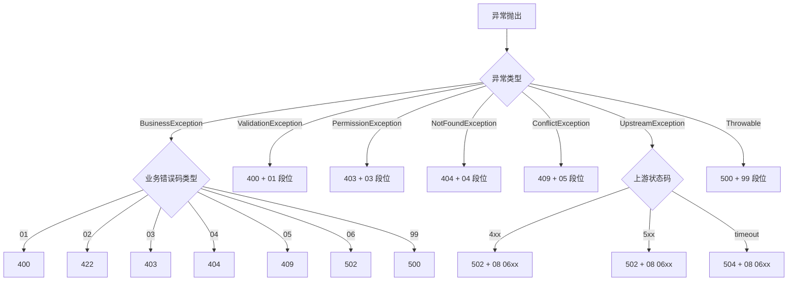

### 23.5 错误响应体统一规范

```json
{
  "code": 40080107,
  "message": "参数越界：Temperature 超出 [0.00, 2.00] 范围",
  "data": null,
  "timestamp": 1717804800000,
  "traceId": "trace-abc123-def456",
  "errors": [
    {
      "field": "temperature",
      "value": 3.5,
      "message": "Temperature 超出 [0.00, 2.00] 范围"
    }
  ]
}
```

### 23.6 验收标准

| 编号 | 验收标准 | 验证方法 |
|------|----------|----------|
| AC-ERR-01 | 所有业务错误码 100% 落入 8 段类型 | 自动化扫描 |
| AC-ERR-02 | HTTP 状态码与错误码类型严格符合映射表 | 接口测试 |
| AC-ERR-03 | 错误响应体包含 traceId 和 errors 字段 | 响应体断言 |
| AC-ERR-04 | 错误响应不泄露堆栈、SQL、密钥等敏感信息 | 错误内容审查 |

---

## 24. 统一分页规范

本章节定义全平台列表查询 API 的统一分页规范，覆盖小数据量 Offset 分页与大数据量 Cursor 游标分页两种模式。

### 24.1 Offset 分页（默认）

> **权威标准**: 全平台列表查询 API 统一使用 Relay Connection 规范(参见 PRD-00 §4.4)。本节 Offset 分页仅作为内部兼容模式保留,新接口必须使用 Relay Connection。

适用于数据量 ≤ 10 万条、用户需要跳转到指定页码的场景。

**请求参数**：

| 参数名 | 类型 | 默认值 | 取值范围 | 说明 |
|--------|------|--------|----------|------|
| `page` | Integer | 1 | ≥ 1 | 当前页码，从 1 开始 |
| `pageSize` | Integer | 20 | 10/20/50/100 | 每页记录数 |
| `sort` | String | `createdAt:desc` | `field:asc/desc` | 排序字段，支持多字段（逗号分隔） |
| `search` | String | — | ≤ 100 字符 | 全文搜索关键词 |

**响应结构**：

```json
{
  "data": {
    "items": [ ... ],
    "pagination": {
      "total": 156,
      "page": 1,
      "pageSize": 20,
      "totalPages": 8,
      "hasPrevious": false,
      "hasNext": true
    }
  }
}
```

### 24.2 Cursor 游标分页

适用于数据量 > 10 万条、深度翻页、实时数据流场景（如调用日志、消息列表）。

**请求参数**：

| 参数名 | 类型 | 默认值 | 说明 |
|--------|------|--------|------|
| `cursor` | String | — | 上次响应返回的 `nextCursor` |
| `limit` | Integer | 20 | 单次返回记录数（1~100） |
| `sort` | String | `id:desc` | 排序字段（必须基于唯一字段） |

**响应结构**：

```json
{
  "data": {
    "items": [ ... ],
    "nextCursor": "eyJpZCI6ImFnZW50XzAwMSIsImNyZWF0ZWRBdCI6IjIwMjYtMDYtMDlUMTA6MzA6MDBaIn0=",
    "hasMore": true
  }
}
```

### 24.3 分页策略选型矩阵

| 场景 | 推荐方式 | 理由 |
|------|----------|------|
| Agent 列表、模型列表、知识列表 | Offset | 总量可控，用户需要跳转 |
| 执行日志、调用追踪、消息流 | Cursor | 数据量大，深度翻页性能差 |
| 搜索结果列表 | Offset | 通常深度不超过 100 页 |
| 实时通知 | Cursor + WebSocket | 推送增量数据 |
| 仪表盘 Top N | 不分页 | 直接返回 Top N |

### 24.4 性能保障

| 指标 | 目标 | 措施 |
|------|------|------|
| Offset 分页深度 ≤ 1000 页 | 性能可接受 | 限制 `page * pageSize` 上限 |
| Offset 深度 > 1000 页 | 建议切换 Cursor | 接口返回 422 + 错误码 001001 |
| Cursor 分页 | 稳定 O(log n) | 索引覆盖 cursor 字段 |
| 大列表查询耗时 | P95 ≤ 1 秒 | 物化视图 + 索引 |

### 24.5 验收标准

| 编号 | 验收标准 | 验证方法 |
|------|----------|----------|
| AC-PAGE-01 | 列表接口默认使用 Offset 分页 | 接口审查 |
| AC-PAGE-02 | 调用日志、追踪类接口使用 Cursor 分页 | 接口审查 |
| AC-PAGE-03 | pageSize 越界返回 400 + 错误码 001002 | 接口测试 |
| AC-PAGE-04 | Offset 深度 > 1000 提示切换 Cursor | 接口测试 |

---

## 25. 统一缓存策略

本章节定义全平台统一的缓存策略，覆盖缓存命中率、TTL 分级、击穿/雪崩防护。

### 25.1 缓存分层

| 缓存层 | 介质 | 典型内容 | 命中率目标 | TTL 范围 |
|--------|------|----------|-----------|----------|
| L1 进程内 | cachetools.LRUCache | 配置、热数据 | ≥ 90% | 30s~5min |
| L2 分布式 | Redis | 会话、计数、限流 | ≥ 80% | 1min~30min |
| L3 数据层 | SQLAlchemy 查询缓存 | ORM 查询结果 | ≥ 60% | 5min~30min |
| L4 物化视图 | PostgreSQL MV | 聚合数据、KPI | — | 5min~24h |

### 25.2 TTL 分级规范

| 数据类型 | 默认 TTL | 可调范围 | 失效策略 |
|----------|----------|----------|----------|
| 用户会话 | 30 分钟 | 5min~24h | 滑动过期 |
| Token 黑名单 | Access Token TTL + 60s | — | 定时过期 |
| 权限位图 | 5 分钟 | 1~30min | Pub/Sub 失效 |
| 字典数据 | 1 小时 | 30min~24h | 版本号失效 |
| 配置数据 | 30 秒（关键）/ 5 分钟（一般） | 10s~1h | Pub/Sub 失效 |
| 仪表盘 KPI | 30 秒 | 10s~5min | 定时过期 |
| 调用日志聚合 | 5 分钟 | 1~30min | 定时过期 |
| 热点 Prompt | 5 分钟 | 1~30min | 内容变更失效 |

### 25.3 击穿防护

| 策略 | 实现方式 | 适用场景 |
|------|----------|----------|
| 分布式锁 | Redis SETNX（NX PX） | 单 Key 高并发 |
| 单飞（singleflight） | 进程内合并请求 | 同 Key 同进程高并发 |
| 提前回种 | 后台异步刷新 | 关键热 Key |
| 缓存预热 | 服务启动时加载 | 启动时已知的 Key |
| 永不过期 + 异步刷新 | 后台定时更新 | 配置类数据 |

### 25.4 雪崩防护

| 策略 | 实现方式 |
|------|----------|
| 过期时间随机扰动 | TTL ± 10% 随机扰动 |
| 多级缓存 | L1 + L2 兜底 |
| 熔断降级 | 缓存失效时返回降级数据 |
| 后台异步刷新 | refresh-ahead |
| 限流 | 缓存击穿时返回默认值并限流 |

### 25.5 一致性保障

| 一致性级别 | 适用场景 | 实现方式 |
|----------|----------|----------|
| 强一致 | 资金、库存、Token | 不走缓存或短 TTL（≤ 1s） |
| 最终一致 | 仪表盘、统计、聚合 | 短 TTL + 异步刷新 |
| 会话一致 | 登录态、购物车 | Redis + Pub/Sub |
| 不一致可接受 | 推荐、热度、排名 | 长 TTL 或不失效 |

### 25.6 验收标准

| 编号 | 验收标准 | 验证方法 |
|------|----------|----------|
| AC-CACHE-01 | L2 缓存命中率 ≥ 80% | 监控报表 |
| AC-CACHE-02 | 关键 Key 启用分布式锁防击穿 | 代码审查 |
| AC-CACHE-03 | 缓存 TTL 配置 ±10% 随机扰动 | 配置审查 |
| AC-CACHE-04 | 缓存故障时返回降级数据 | 故障注入测试 |

---

## 26. Redis Key 命名空间规范

> **权威声明**：本章节为 Redis Key 命名的详细实现规范，权威格式定义以 **PRD-00 §7.4** `{scope}:{tenant_id}:{module}:{entity}:{id}[:{sub}]` 为准。各模块 Key 命名必须同时遵循 PRD-00 §7.4 权威格式与本章节细分规则。

本章节定义全平台 Redis Key 的统一命名空间规范，通过 `{scope}:{tenant_id}:{module}:{entity}:{id}[:{sub}]` 的格式实现租户隔离与模块隔离。

### 26.1 Key 命名结构

```
{scope}:{tenant_id}:{module}:{entity}:{id}[:{sub}]
```

| 段位 | 必填 | 说明 |
|------|:----:|------|
| `{scope}` | ✅ | 平台/租户/用户：`pl`、`t`、`u` |
| `{tenant_id}` | ✅ | 租户 ID（scope=`pl` 时省略） |
| `{module}` | ✅ | 模块代码，如 `agent`、`llm`、`perm` |
| `{entity}` | ✅ | 实体名，如 `session`、`config`、`role` |
| `{id}` | ✅ | 实体 ID |
| `{sub}` | ❌ | 子资源（可选），如 `tree`、`permissions` |

### 26.2 各模块 Key 命名示例

| 模块 | Key 模式 | 示例 |
|------|----------|------|
| 通用会话 | `t:{tenant_id}:auth:session:{id}` | `t:550e8400-e29b-41d4-a716-446655440000:auth:session:f47ac10b-58cc-4372-a567-0e02b2c3d479` |
| Token 黑名单 | `t:{tenant_id}:auth:token_blacklist:{id}` | `t:550e8400-e29b-41d4-a716-446655440000:auth:token_blacklist:6ba7b810-9dad-11d1-80b4-00c04fd430c8` |
| 用户权限 | `t:{tenant_id}:perm:user:{id}:effective-perms` | `t:550e8400-e29b-41d4-a716-446655440000:perm:user:f47ac10b-58cc-4372-a567-0e02b2c3d479:effective-perms` |
| LLM 用量 | `t:{tenant_id}:llm:usage:{id}:{yyyymmdd}` | `t:550e8400-e29b-41d4-a716-446655440000:llm:usage:6ba7b810-9dad-11d1-80b4-00c04fd430c8:20260609` |
| LLM 限流 | `t:{tenant_id}:llm:ratelimit:{user_id}:{model_id}` | `t:550e8400-e29b-41d4-a716-446655440000:llm:ratelimit:f47ac10b-58cc-4372-a567-0e02b2c3d479:6ba7b810-9dad-11d1-80b4-00c04fd430c8` |
| LLM 缓存 | `t:{tenant_id}:llm:cache:{id}` | `t:550e8400-e29b-41d4-a716-446655440000:llm:cache:sha256:abc...` |
| Agent 状态 | `t:{tenant_id}:agent:status:{id}` | `t:550e8400-e29b-41d4-a716-446655440000:agent:status:7c9e6679-7425-40de-944b-e07fc1f90ae7` |
| 配置缓存 | `t:{tenant_id}:system:config:{id}` | `t:550e8400-e29b-41d4-a716-446655440000:system:config:nfr.p.api.p95` |
| 仪表盘 KPI | `t:{tenant_id}:dashboard:kpi:{id}:{period}` | `t:550e8400-e29b-41d4-a716-446655440000:dashboard:kpi:agent_total:7d` |
| 分布式锁 | `t:{tenant_id}:{module}:lock:{resource}:{biz_key}` | `t:550e8400-e29b-41d4-a716-446655440000:llm:lock:quota:f47ac10b-58cc-4372-a567-0e02b2c3d479` |
| 限流计数 | `t:{tenant_id}:{module}:counter:{resource}:{window}` | `t:550e8400-e29b-41d4-a716-446655440000:llm:counter:qps:1717804800` |

### 26.3 平台级 Key（跨租户）

仅以下场景允许使用平台级 Key（scope=`pl`，省略 `tenant_id`）：

| Key 模式 | 用途 |
|----------|------|
| `pl:system:config:{id}` | 平台级配置 |
| `pl:llm:provider:{id}` | 平台级 LLM Provider 共享池 |
| `pl:lock:{resource}` | 平台级分布式锁 |
| `pl:ratelimit:global:{window}` | 全局限流 |

### 26.4 Key 长度与字符

| 规范项 | 要求 |
|--------|------|
| 最大长度 | ≤ 200 字符 |
| 字符集 | `a-z`、`0-9`、`:`、`.`、`-`、`_` |
| 禁止字符 | 空格、`*`、`?`、`[`、`]`、中文 |
| Hash Tag | Redis Cluster 场景使用 `{}` 锁定 Slot |

### 26.5 Key 清理与归档

| 策略 | 规则 |
|------|------|
| 主动删除 | 业务结束立即 DEL |
| 过期删除 | 必须设置 TTL，禁止永不过期 |
| 定期清理 | 每日凌晨扫描无主 Key 并清理 |
| 大 Key 治理 | 单 Key Value ≤ 1MB，超过使用 Hash 拆分 |
| 归档 | 30 天未访问的冷 Key 归档至 RocksDB 或 PostgreSQL |

### 26.6 验收标准

| 编号 | 验收标准 | 验证方法 |
|------|----------|----------|
| AC-REDIS-01 | 所有业务 Key 100% 符合 `{scope}:{tenant_id}:{module}:...` 格式 | Redis 扫描 |
| AC-REDIS-02 | 所有 Key 设置 TTL，无永不过期 Key | 监控告警 |
| AC-REDIS-03 | 大 Key 持续监控并告警 | Redis 监控 |
| AC-REDIS-04 | Key 命名违规在 Code Review 中拦截 | 审查流程 |

---

## 27. Neo4j 多租户隔离策略

> **v6 收束说明**：本节中 `tenantId` / `tenant_id` 为业务层描述，对应数据层 `partition_key` 字段（详见 PRD-00 §7.2 权威）。Neo4j 节点必须包含 `partition_key` 属性，查询时必须附加 `WHERE n.partition_key = $partitionKey` 条件（与 PRD-00 §3.5 铁律 3 一致）。本节中 `:TenantId` 标签过滤描述为旧版表述，实际实现应使用 `Graph` 静态标签 + `WHERE n.partition_key = $partitionKey`。

> **与 PRD-00 §7.5 的关系**: 本节是 PRD-00 §7.5 Neo4j 多租户隔离基线的展开说明,以本节为准。PRD-00 §7.5 定义原则性约束,本节提供具体实施策略。

本章节定义 Neo4j 图数据库的多租户隔离策略，结合"单租户单图库"和 PostgreSQL RLS 兜底机制，确保 Agent-知识图谱、Agent-记忆图谱的强隔离。

### 27.1 隔离模式选型

| 模式 | 描述 | 适用场景 |
|------|------|----------|
| 单租户单图库（推荐） | 每个租户独立 Neo4j 数据库实例 | 高安全要求、监管严格 |
| 单实例多数据库 | 单 Neo4j 实例多 database | 中等规模 |
| 标签前缀隔离 | 通过 `Graph` 静态标签 + `WHERE n.partition_key = $partitionKey` 过滤 | 性能优先，安全要求低 |

> 默认采用"单租户单图库"模式，中小租户可通过共享实例池降低运维成本。

### 27.2 单租户单图库架构

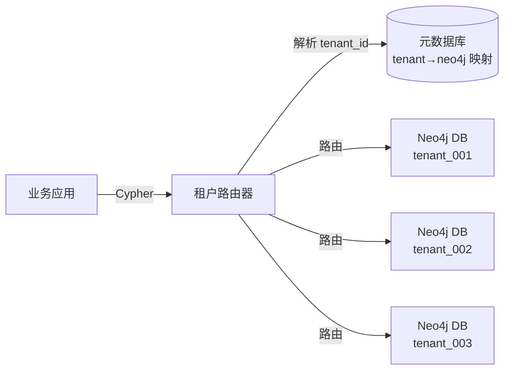

### 27.3 必含字段

Neo4j 所有节点必须包含以下元数据属性：

| 属性 | 类型 | 是否必填 | 说明 |
|------|------|:--------:|------|
| `tenantId` | String | ✅ | 租户 ID |
| `createdBy` | String | ✅ | 创建人 |
| `createdAt` | DateTime | ✅ | 创建时间 |
| `updatedBy` | String | ❌ | 更新人 |
| `updatedAt` | DateTime | ❌ | 更新时间 |
| `version` | Integer | ✅ | 乐观锁版本号 |
| `deleted` | Boolean | ✅ | 软删除标志 |

### 27.4 PostgreSQL RLS 兜底

对于必须使用 PostgreSQL 存储图谱元数据、关系映射的场景，启用 Row-Level Security：

```sql
ALTER TABLE knowledge_graph ENABLE ROW LEVEL SECURITY;

CREATE POLICY tenant_isolation_policy ON knowledge_graph
    USING (partition_key = current_setting('app.current_tenant_id', TRUE));

ALTER TABLE knowledge_graph FORCE ROW LEVEL SECURITY;
```

### 27.5 跨租户查询拦截

| 拦截点 | 机制 |
|--------|------|
| 应用层 | Cypher 查询前必须注入 `WHERE n.tenantId = $tenantId` |
| 框架层 | SQLAlchemy Event Listener 自动注入 tenant_id 过滤条件 |
| 数据库层 | Neo4j 4.x+ Procedure 拦截器 |
| 审计层 | 跨租户查询视为安全事件，告警 |

### 27.6 验收标准

| 编号 | 验收标准 | 验证方法 |
|------|----------|----------|
| AC-NEO4J-01 | 跨租户 Cypher 查询 100% 拒绝 | 渗透测试 |
| AC-NEO4J-02 | Neo4j 节点 100% 包含 tenantId 属性 | Schema 审查 |
| AC-NEO4J-03 | 元数据库的 tenant 映射 100% 准确 | 自动化校验 |
| AC-NEO4J-04 | PostgreSQL RLS 策略开启 FORCE | 数据库验证 |

---

## 28. 链路追踪选型

本章节定义全平台统一的分布式链路追踪选型与配置规范。

### 28.1 技术选型

| 维度 | 选型 | 说明 |
|------|------|------|
| 协议标准 | OpenTelemetry（OTel） | CNCF 标准，避免厂商绑定 |
| SDK | OpenTelemetry Java/Node.js/Go SDK | 多语言统一 |
| Collector | OpenTelemetry Collector | 数据汇聚与协议转换 |
| 存储后端 | Jaeger（或 Tempo） | 分布式追踪存储与查询 |
| 指标后端 | Prometheus + Grafana | 指标存储与可视化 |
| 日志后端 | PostgreSQL 分区表 + Grafana | 日志聚合 |
| 采样率 | 默认 10%，错误请求 100% | 可在 PRD-09 §17.7 调整 |

### 28.2 全链路 traceId 规范

| 字段 | 来源 | 传递方式 |
|------|------|----------|
| `traceId` | 入口生成（网关或客户端） | W3C Trace Context `traceparent` 头 |
| `spanId` | 每个处理节点生成 | OTel SDK 自动管理 |
| `parentSpanId` | 父 Span ID | OTel SDK 关联 |
| `tenantId` | JWT 解析 | Baggage 注入 |
| `userId` | JWT 解析 | Baggage 注入 |

### 28.3 标准 Span 命名

| 层级 | Span 命名模式 | 示例 |
|------|--------------|------|
| GraphQL 入口 | `gql {operationName}` | `gql { agentCreate }` |
| 服务调用 | `{service}.{operation}` | `llm.invoke`、`agent.execute` |
| 数据库 | `db.{operation}.{table}` | `db.select.agents` |
| 缓存 | `cache.{operation}` | `cache.get`、`cache.set` |
| MQ | `mq.{operation}.{topic}` | `mq.publish.audit-events` |
| 外部调用 | `http.{client}.{endpoint}` | `http.openai.chat-completions` |

### 28.4 关键 attribute 清单

| Attribute | 来源 | 必含模块 |
|-----------|------|----------|
| `tenant.id` | JWT | 所有 |
| `user.id` | JWT | 所有 |
| `http.method` | OTel HTTP | API 层 |
| `http.route` | OTel HTTP | API 层 |
| `http.status_code` | OTel HTTP | API 层 |
| `llm.model_id` | 业务 | LLM |
| `llm.protocol` | 业务 | LLM |
| `llm.input_tokens` | 上游响应 | LLM |
| `llm.output_tokens` | 上游响应 | LLM |
| `llm.ttft_ms` | 推理网关 | LLM |
| `llm.tpot_ms` | 推理网关 | LLM |
| `agent.id` | 业务 | Agent |
| `agent.execution_mode` | 业务 | Agent |
| `workflow.id` | 业务 | Workflow |

### 28.5 验收标准

| 编号 | 验收标准 | 验证方法 |
|------|----------|----------|
| AC-TRACE-01 | 所有服务集成 OTel SDK | CI 流水线 |
| AC-TRACE-02 | traceId 100% 贯穿跨服务调用 | 链路验证 |
| AC-TRACE-03 | 关键 attribute 100% 上报 | Jaeger 查询 |
| AC-TRACE-04 | 错误请求 100% 采样 | 故障注入测试 |

---

## 29. 告警分级规范

本章节定义全平台统一的告警分级与通知通道规范，确保不同严重程度的告警得到恰当响应。

### 29.1 告警分级

| 级别 | 名称 | 严重度 | 响应时效 | 触发场景示例 |
|:----:|------|:------:|:--------:|--------------|
| P0 | 紧急 | 致命 | ≤ 5 分钟 | 核心服务全量不可用、数据丢失、严重安全事件 |
| P1 | 重要 | 高 | ≤ 15 分钟 | 核心服务部分不可用、SLO 严重违反、关键告警 |
| P2 | 一般 | 中 | ≤ 1 小时 | 性能下降、非核心服务异常、容量接近上限 |
| P3 | 提示 | 低 | ≤ 4 小时 | 业务异常趋势、配置变更、容量预警 |

### 29.2 告警分级判定矩阵

| 维度 | P0 | P1 | P2 | P3 |
|------|:--:|:--:|:--:|:--:|
| 服务可用性 | < 95% | 95%~99% | 99%~99.9% | — |
| 错误率 | > 10% | 1%~10% | 0.1%~1% | < 0.1% |
| 响应时间 P99 | > 30s | 10s~30s | 2s~10s | — |
| 数据丢失 | 是 | 否 | 否 | 否 |
| 用户影响范围 | 全量 | 大部分 | 部分 | 少量 |
| 安全等级 | 严重事件 | 高危事件 | 中危事件 | 低危事件 |

### 29.3 通知通道

| 级别 | 通知通道 | 接收人 | 升级策略 |
|:----:|----------|--------|----------|
| P0 | 电话 + 短信 + 钉钉 + 飞书 + 邮件 | 值班 SRE + 技术负责人 + 模块 Owner | 5 分钟未确认自动电话升级至总监 |
| P1 | 钉钉 + 飞书 + 短信 | 值班 SRE + 模块 Owner | 15 分钟未确认自动升级 |
| P2 | 钉钉 + 飞书 | 值班 SRE | 30 分钟未确认自动升级 |
| P3 | 钉钉 / 飞书 / 邮件 | 值班 SRE | 1 小时未确认自动关闭或转工单 |

### 29.4 告警规则

| 字段 | 必填 | 说明 |
|------|:----:|------|
| `alertId` | ✅ | 告警规则唯一 ID |
| `name` | ✅ | 告警名称 |
| `level` | ✅ | 告警级别（P0/P1/P2/P3） |
| `metric` | ✅ | 监控指标（PromQL） |
| `condition` | ✅ | 触发条件 |
| `duration` | ✅ | 持续时间（如 5m） |
| `notification` | ✅ | 通知通道 |
| `receivers` | ✅ | 接收人组 |
| `silenceWindow` | ❌ | 静默窗口 |
| `runbook` | ❌ | 处理手册链接 |

### 29.5 告警收敛

| 策略 | 规则 |
|------|------|
| 分组 | 同一服务、同一指标、同一窗口的告警合并 |
| 抑制 | P0 触发时抑制同服务的 P1/P2/P3 |
| 静默 | 维护窗口自动静默 |
| 重复 | 同一告警 5 分钟内不重复通知 |
| 升级 | 未确认告警按规则升级 |

### 29.6 验收标准

| 编号 | 验收标准 | 验证方法 |
|------|----------|----------|
| AC-ALERT-01 | P0 告警 5 分钟内通知到人 | 故障演练 |
| AC-ALERT-02 | 告警分级判定与通知通道匹配 | 演练 |
| AC-ALERT-03 | 告警收敛避免风暴 | 压测验证 |
| AC-ALERT-04 | 静默窗口不误报 | 配置测试 |

---

## 30. GDPR / CCPA 合规规范

本章节定义平台对 GDPR（欧盟通用数据保护条例）、CCPA（加州消费者隐私法）等隐私法规的合规要求与实现规范。

### 30.1 合规原则

| 原则 | 含义 | 实现要求 |
|------|------|----------|
| 合法性 | 数据处理有合法依据 | 用户同意、合同必要性、合法利益 |
| 最小化 | 只收集必要数据 | 字段级白名单 |
| 准确性 | 数据保持准确 | 数据更新机制 |
| 存储限制 | 不超期存储 | 存储期限与自动清理 |
| 完整性保密性 | 防止未授权访问 | 加密、访问控制 |
| 问责制 | 可证明合规 | 审计日志 |

### 30.2 用户权利

| 权利 | 含义 | 实现 |
|------|------|------|
| 知情权 | 知晓数据如何被使用 | 隐私政策、Cookie 告知 |
| 访问权 | 获取个人数据副本 | 数据导出接口 |
| 更正权 | 更正不准确数据 | 用户资料编辑 |
| 删除权（被遗忘权） | 删除个人数据 | 账户注销、级联删除 |
| 限制处理权 | 暂停特定处理 | 账户冻结 |
| 数据可携权 | 以通用格式导出 | 导出 JSON/CSV |
| 反对权 | 反对特定处理 | 退订、Opt-out |
| 不被自动化决策权 | 反对纯算法决策 | 人工介入机制 |

### 30.3 数据导出（被遗忘权 / 数据可携权）

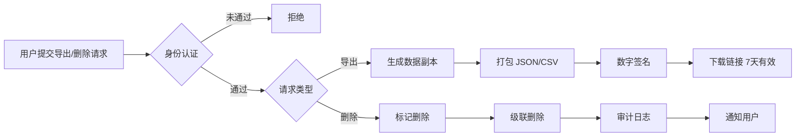

| 字段 | 规则 |
|------|------|
| 响应时效 | 30 天内完成（GDPR 要求） |
| 数据范围 | 用户名、邮箱、订单、行为日志等全部个人数据 |
| 数据格式 | JSON + CSV 双格式 |
| 完整性 | 数字签名验证 |
| 链接有效期 | 7 天，过期销毁 |
| 删除时效 | 30 天（合法保留期可延长） |

### 30.4 用户同意管理

| 同意类型 | 场景 | 默认值 | 撤回方式 |
|----------|------|--------|----------|
| 服务条款 | 注册时 | 必须同意 | 注销账户 |
| 隐私政策 | 注册时 | 必须同意 | 注销账户 |
| Cookie 同意 | 首次访问 | 必须同意 | 设置中心 |
| 营销同意 | 营销推送 | 默认拒绝 | 设置中心 |
| 数据分析同意 | 行为分析 | 默认同意（可退订） | 设置中心 |
| 第三方共享 | 跨服务调用 | 单独弹窗 | 设置中心 |

### 30.5 Cookie 与追踪规范

| 类型 | 用途 | 是否需同意 |
|------|------|:----------:|
| 必要 Cookie | 登录态、CSRF Token | 否 |
| 偏好 Cookie | 主题、语言 | 否 |
| 统计 Cookie | 访问统计 | 是 |
| 营销 Cookie | 广告追踪 | 是 |
| 第三方 Cookie | 嵌入视频、地图 | 是 |

### 30.6 数据保留期限

| 数据类型 | 保留期限 | 过期处理 |
|----------|----------|----------|
| 用户基本资料 | 账户存续期 | 注销后 30 天删除 |
| 订单/合同 | 10 年 | 到期归档或删除 |
| 操作日志 | 365 天 | 到期自动归档 |
| 审计日志 | 3650 天（10 年） | 不可删除（WORM 存储） |
| 会话数据 | 30 分钟 | 自动过期 |
| 行为分析 | 180 天 | 匿名化处理 |
| 备份数据 | 90 天 | 自动轮转 |

### 30.7 验收标准

| 编号 | 验收标准 | 验证方法 |
|------|----------|----------|
| AC-GDPR-01 | 用户可在 30 天内完成数据导出 | 合规审查 |
| AC-GDPR-02 | 用户可一键注销账户并级联删除 | 功能测试 |
| AC-GDPR-03 | 所有营销推送支持一键退订 | 功能测试 |
| AC-GDPR-04 | Cookie 同意弹窗符合 ePrivacy | 法务审查 |
| AC-GDPR-05 | 数据保留期限到期自动清理 | 自动化校验 |

---

## 31. 字段级加密规范

本章节定义全平台 PII 字段的字段级加密规范，使用 AES-256-GCM 算法保护敏感数据。

### 31.1 必加密字段清单

| 字段 | 类型 | 加密算法 | 索引支持 | 示例 |
|------|------|----------|:--------:|------|
| 手机号 | String | AES-256-GCM | ✅（HMAC-SHA256 盲索引） | `138****5678` |
| 身份证号 | String | AES-256-GCM | ✅（HMAC-SHA256 盲索引） | `110101********1234` |
| 邮箱 | String | AES-256-GCM | ✅（HMAC-SHA256 盲索引） | `zh***@example.com` |
| 银行卡号 | String | AES-256-GCM | ❌ | `6222 **** **** 1234` |
| 密码 | String | BCrypt | ❌ | — |
| 姓名 + 出生日期 | String | AES-256-GCM | ❌ | — |
| 家庭住址 | String | AES-256-GCM | ❌ | — |
| API Key / Secret | String | AES-256-GCM | ❌ | — |
| OAuth Token | String | AES-256-GCM | ❌ | — |
| 私钥 | PEM | AES-256-GCM | ❌ | — |

### 31.2 加密实现规范

| 项 | 规范 |
|----|------|
| 算法 | AES-256-GCM（认证加密，防止篡改） |
| 密钥管理 | 密钥由 HSM/KMS 托管，详见 §32 |
| IV（Nonce） | 12 字节随机数，每次加密唯一 |
| 认证标签 | 16 字节 GCM Tag |
| 编码 | Base64 编码存储（IV + 密文 + Tag） |
| 密钥轮换 | 90 天自动轮换 + 紧急立即轮换 |

### 31.3 盲索引设计

对于需要精确查询的加密字段（如根据手机号查用户），使用 HMAC-SHA256 盲索引：

| 字段 | 盲索引键 | 存储 |
|------|----------|------|
| 手机号 | `phone_index` | `HMAC-SHA256(blindIndexKey, phone)` |
| 邮箱 | `email_index` | `HMAC-SHA256(blindIndexKey, email)` |
| 身份证号 | `idcard_index` | `HMAC-SHA256(blindIndexKey, idcard)` |

**盲索引 Key 保护**：
- 与数据加密 Key 不同
- 单独存储在 HSM/KMS
- 泄露后立即轮换并重新计算所有索引

### 31.4 加密字段的展示与日志

| 场景 | 处理方式 |
|------|----------|
| 前端展示 | 脱敏展示（详见 PRD-04 §23.4） |
| API 返回 | 列表接口脱敏，详情接口按权限返回 |
| 日志输出 | 禁止明文输出，使用 `***` 占位 |
| 备份数据 | 加密后备份 |
| 测试环境 | 使用脱敏数据，禁止明文 |

### 31.5 验收标准

| 编号 | 验收标准 | 验证方法 |
|------|----------|----------|
| AC-ENC-01 | PII 字段在数据库中无明文 | 数据库直查 |
| AC-ENC-02 | 加密算法使用 AES-256-GCM | 代码审查 |
| AC-ENC-03 | 密钥由 HSM/KMS 托管 | 架构评审 |
| AC-ENC-04 | 加密字段 90 天自动轮换 | 自动化校验 |
| AC-ENC-05 | 日志中不出现明文 PII | 日志审查 |

---

## 32. HSM / KMS 统一接入规范

本章节定义全平台硬件安全模块（HSM）和密钥管理服务（KMS）的统一接入规范，为 §31 字段级加密与 §24 A2A 协议安全提供密钥基础设施。

### 32.1 选型

| 场景 | 选型 | 说明 |
|------|------|------|
| 云上 | 阿里云 KMS / 腾讯云 KMS / AWS KMS | 各云厂商托管服务 |
| 自建 | HashiCorp Vault + PKCS#11 HSM（如 YubiHSM、AWS CloudHSM） | 私有化部署 |
| 混合 | 本地 HSM + 云 KMS 互备 | 灾备与多云 |

### 32.2 密钥分类

| 密钥类型 | 用途 | 存储 | 轮换周期 |
|----------|------|------|----------|
| 主密钥（CMK） | 加密数据加密密钥 | HSM 内部，永不导出 | 1 年 |
| 数据加密密钥（DEK） | 加密业务数据 | 由 CMK 加密后存储 | 90 天 |
| 盲索引密钥 | 计算 PII 盲索引 | HSM 内部 | 90 天 |
| 签名密钥 | JWT 签名、数据签名 | HSM 内部 | 1 年 |
| TLS 私钥 | HTTPS 证书 | HSM 内部 | 1 年 |
| 数据库 TDE 密钥 | 数据库透明加密 | HSM 内部 | 1 年 |

### 32.3 接入规范

| 规范项 | 要求 |
|--------|------|
| 接入方式 | 统一通过 `kms-client` SDK 接入，禁止直连 HSM |
| 认证 | mTLS + 短期 Token |
| 调用审计 | 100% 记录密钥使用日志 |
| 高可用 | KMS 至少 2 个可用区部署，RTO ≤ 5 分钟 |
| 灾备 | 跨地域 KMS 镜像，RPO ≤ 1 分钟 |
| 性能 | 加解密 P99 ≤ 10ms |

### 32.4 验收标准

| 编号 | 验收标准 | 验证方法 |
|------|----------|----------|
| AC-KMS-01 | 所有密钥托管在 HSM/KMS | 配置审计 |
| AC-KMS-02 | 数据加密密钥 90 天轮换 | 自动化校验 |
| AC-KMS-03 | KMS 高可用 RTO ≤ 5 分钟 | 灾备演练 |
| AC-KMS-04 | 加解密性能 P99 ≤ 10ms | 性能测试 |

---

## 33. 审计日志 WORM 存储规范

本章节定义全平台审计日志的 WORM（Write Once Read Many）存储规范，确保审计日志不可篡改，满足金融级合规要求。

### 33.1 必审计操作清单

| 模块 | 必审计操作 |
|------|------------|
| 认证 | 登录、登出、Token 刷新、密码修改、密码重置 |
| 权限 | 角色变更、权限授予/收回、ABAC 策略变更 |
| 用户 | 创建、删除、信息修改、状态变更 |
| 商户 | 创建、删除、信息修改、状态变更 |
| LLM | 模型创建/删除/启停、API Key 轮换、Fallback 切换 |
| Agent | 创建、删除、状态变更、A2A 配置变更 |
| 工作流 | 创建、删除、发布、版本回滚 |
| 知识 | 创建、删除、权限变更 |
| 系统设置 | 配置变更、密钥轮换、租户配额调整 |
| 监控 | 告警规则变更、告警确认/关闭 |
| 合规 | 数据导出、被遗忘权执行 |

### 33.2 审计日志字段

| 字段 | 类型 | 必填 | 说明 |
|------|------|:----:|------|
| `auditId` | UUID | ✅ | 审计日志唯一 ID |
| `tenantId` | UUID | ✅ | 租户 ID |
| `actorId` | UUID | ✅ | 操作人 |
| `actorType` | Enum | ✅ | USER / SYSTEM / API_KEY |
| `action` | String | ✅ | 操作类型（如 `agent.create`） |
| `resourceType` | String | ✅ | 资源类型 |
| `resourceId` | String | ✅ | 资源 ID |
| `beforeValue` | JSON | ❌ | 变更前值 |
| `afterValue` | JSON | ❌ | 变更后值 |
| `clientIp` | String | ✅ | 客户端 IP |
| `userAgent` | String | ✅ | 客户端 UA |
| `traceId` | String | ✅ | 链路追踪 ID |
| `result` | Enum | ✅ | SUCCESS / FAILURE |
| `failureReason` | String | ❌ | 失败原因 |
| `createdAt` | DateTime | ✅ | 操作时间（带时区） |
| `signature` | String | ✅ | 数字签名 |

### 33.3 WORM 存储实现

| 方案 | 说明 |
|------|------|
| 对象存储 + Object Lock | AWS S3 Object Lock、阿里云 OSS WORM、MinIO Object Lock |
| 数据库 + 不可变表 | PostgreSQL `INSERT ONLY` 表 + 触发器禁止 UPDATE/DELETE |
| 区块链存证 | Hyperledger Fabric / 蚂蚁链（可选） |
| 归档存储 | 7 天热存 + 30 天温存 + 10 年冷存 |

### 33.4 完整性校验

| 校验项 | 机制 |
|--------|------|
| 数字签名 | 每条审计日志使用 KMS 签名密钥签名 |
| 哈希链 | 当前记录包含前一条的哈希，形成哈希链 |
| 定期校验 | 每日定时校验哈希链完整性 |
| 异常告警 | 检测到篡改立即触发 P0 告警 |

### 33.5 验收标准

| 编号 | 验收标准 | 验证方法 |
|------|----------|----------|
| AC-AUDIT-01 | 审计日志 100% 不可篡改 | 尝试修改验证失败 |
| AC-AUDIT-02 | 审计日志保留 ≥ 10 年 | 配置审查 |
| AC-AUDIT-03 | 哈希链每日校验 | 监控报表 |
| AC-AUDIT-04 | 关键操作 100% 记录审计日志 | 抽样检查 |

---

## 34. 配置中心基础设施契约

本章节定义全平台配置中心的基础设施契约，包括配置存储、变更推送、缓存一致性、监听机制等。

### 34.1 技术选型

| 维度 | 选型 | 说明 |
|------|------|------|
| 主配置中心 | AWS Systems Manager Parameter Store（推荐） / 自建 | 支持配置注册、推送、版本管理 |
| 配置缓存 | Redis Cluster | 分布式缓存 |
| 进程内缓存 | cachetools.LRUCache | 减少网络开销 |
| 变更推送 | AWS Systems Manager Parameter Store + Redis Pub/Sub | 双通道推送 |
| 配置加密 | KMS / AWS Systems Manager Parameter Store 加密 | 敏感配置加密 |

### 34.2 三级缓存架构

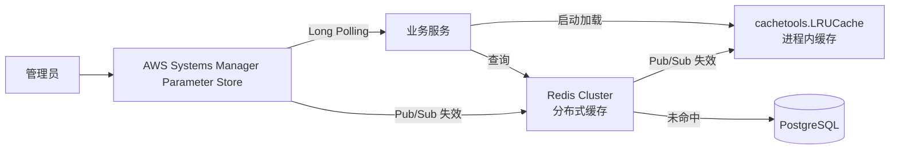

### 34.3 配置项元数据

| 字段 | 必填 | 说明 |
|------|:----:|------|
| `configKey` | ✅ | 配置项 Key（唯一） |
| `configValue` | ✅ | 配置值（JSON/字符串） |
| `valueType` | ✅ | STRING / JSON / YAML / NUMBER |
| `encrypted` | ❌ | 是否加密 |
| `scope` | ✅ | PLATFORM / MERCHANT / DEPARTMENT / USER |
| `scopeId` | ✅ | 范围 ID |
| `version` | ✅ | 版本号（自增） |
| `isHotReload` | ✅ | 是否支持热更新 |
| `description` | ❌ | 配置说明 |
| `defaultValue` | ❌ | 默认值 |
| `validation` | ❌ | 校验规则（JSON Schema） |
| `createdBy` | ✅ | 创建人 |
| `updatedBy` | ✅ | 更新人 |
| `createdAt` | ✅ | 创建时间 |
| `updatedAt` | ✅ | 更新时间 |

### 34.4 热更新机制

| 机制 | 说明 |
|------|------|
| 推送通道 | AWS Systems Manager Parameter Store + Redis Pub/Sub 双通道 |
| 推送延迟 | P95 ≤ 2 秒 |
| 重试策略 | 失败重试 3 次，指数退避 |
| 一致性 | 最终一致（多数派成功即可） |
| 失败兜底 | 保留旧配置，不影响运行 |

### 34.5 验收标准

| 编号 | 验收标准 | 验证方法 |
|------|----------|----------|
| AC-CONF-01 | 配置变更 P95 ≤ 2 秒全平台生效 | 故障演练 |
| AC-CONF-02 | 配置中心高可用 RTO ≤ 5 分钟 | 灾备演练 |
| AC-CONF-03 | 配置变更 100% 记录审计日志 | 日志审查 |
| AC-CONF-04 | 配置加密项在数据库中无明文 | 数据库直查 |

---

## 35. Outbox Pattern 规范

本章节定义 PostgreSQL 与 Neo4j 双写一致性场景的 Outbox Pattern 规范，确保跨数据源的数据最终一致。

### 35.1 应用场景

| 场景 | 写入源 | 同步目标 | 一致性要求 |
|------|--------|----------|:----------:|
| Agent 关联记忆图谱 | PostgreSQL（Agent 表） | Neo4j（Memory 图谱） | 最终一致 |
| 知识图谱构建 | PostgreSQL（Knowledge 表） | Neo4j（KG 图谱） | 最终一致 |
| 编排关系图 | PostgreSQL（Orchestration） | Neo4j（关系图） | 最终一致 |
| 审计日志同步 | PostgreSQL（业务表） | 审计日志中心 | 最终一致 |

### 35.2 Outbox 模式架构

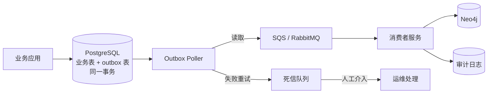

### 35.3 Outbox 表结构

| 字段 | 类型 | 说明 |
|------|------|------|
| `id` | UUID | 主键 |
| `aggregateType` | String | 聚合类型 |
| `aggregateId` | UUID | 聚合 ID |
| `eventType` | String | 事件类型 |
| `payload` | JSONB | 事件内容 |
| `createdAt` | DateTime | 创建时间 |
| `processedAt` | DateTime | 处理时间 |
| `retryCount` | Integer | 已重试次数 |
| `status` | Enum | PENDING / PROCESSED / FAILED |
| `traceId` | String | 链路追踪 ID |

### 35.4 投递保障

| 保障项 | 机制 |
|--------|------|
| At-least-once | 消费者必须实现幂等 |
| 顺序 | 同一 aggregateId 顺序处理 |
| 重试 | 失败重试 3 次，间隔 1s/2s/4s |
| 死信 | 3 次失败后进入 DLQ，人工介入 |
| 监控 | 队列堆积、消费者延迟监控告警 |

### 35.5 验收标准

| 编号 | 验收标准 | 验证方法 |
|------|----------|----------|
| AC-OUT-01 | 业务表与 outbox 写入 100% 同一事务 | 代码审查 |
| AC-OUT-02 | 消费者实现幂等 | 单元测试 |
| AC-OUT-03 | 跨数据源最终一致 P95 ≤ 5 秒 | 故障演练 |
| AC-OUT-04 | DLQ 消息 100% 有告警 | 监控验证 |

---

## 36. BFF / Orchestrator 层抽象

本章节定义 BFF（Backend for Frontend）和 Orchestrator 编排层的统一抽象规范，统一处理超时、降级、熔断、链路追踪等横切关注点。

### 36.1 BFF 职责

| 职责 | 说明 |
|------|------|
| API 聚合 | 聚合多个后端服务调用，减少前端请求数 |
| 协议转换 | REST ↔ GraphQL 协议适配 |
| 鉴权与会话 | 统一鉴权、Token 管理 |
| 限流与降级 | 边缘限流、自动降级 |
| 缓存 | 边缘缓存（如 CDN、BFF 层缓存） |
| 链路追踪 | traceId 注入与传递 |

### 36.2 Orchestrator 职责

| 职责 | 说明 |
|------|------|
| 流程编排 | 多步骤任务编排（DAG） |
| 事务协调 | Saga / TCC 分布式事务 |
| 状态机 | 复杂状态机管理 |
| 重试与补偿 | 失败重试、Saga 补偿 |
| 超时控制 | 统一超时与降级 |

### 36.3 横切关注点统一处理

| 关注点 | 实现位置 | 机制 |
|--------|----------|------|
| 鉴权 | BFF 入口 | JWT 验证 + 权限位图 |
| 限流 | BFF 入口 | Python aiolimiter / 自定义令牌桶中间件 |
| 熔断 | BFF + Orchestrator | 熔断器（half-open 探活） |
| 超时 | BFF + Orchestrator | 分层超时（请求 < Orchestrator < 服务） |
| 重试 | Orchestrator | 指数退避 + 抖动 |
| 降级 | BFF + Orchestrator | 多级降级（缓存 → 默认值 → 错误） |
| 链路追踪 | 全链路 | OTel SDK 注入 |
| 审计 | Orchestrator | 关键操作审计 |

### 36.4 分层超时配置

| 层级 | 默认超时 | 范围 |
|------|----------|------|
| HTTP 请求 | 10 秒 | 5~60s |
| Orchestrator 编排 | 30 秒 | 10s~5min |
| BFF 聚合调用 | 5 秒/服务 | 1~30s |
| 数据库查询 | 1 秒 | 100ms~10s |
| LLM 推理 | 60 秒 | 10s~300s |

### 36.5 验收标准

| 编号 | 验收标准 | 验证方法 |
|------|----------|----------|
| AC-BFF-01 | BFF 聚合减少 ≥ 50% 前端请求 | 性能测试 |
| AC-BFF-02 | 限流在 BFF 入口统一执行 | 代码审查 |
| AC-BFF-03 | 熔断器在故障时自动开启 | 故障注入测试 |
| AC-BFF-04 | 超时分层配置正确生效 | 配置审查 |

---

## 37. 降级开关平台规范

本章节定义全平台统一的降级开关（Feature Flag）平台规范，作为灰度发布、紧急回退、A/B 测试的统一基础设施。

### 37.1 开关类型

| 类型 | 用途 | 生命周期 |
|------|------|----------|
| 发布开关（Release Flag） | 控制新功能上线 | 上线后保留 30 天后清理 |
| 运维开关（Ops Flag） | 紧急降级、限流、熔断 | 长期保留 |
| 实验开关（Experiment Flag） | A/B 测试、新功能灰度 | 实验结束后清理 |
| 权限开关（Permission Flag） | 按租户/用户/角色灰度 | 长期保留 |

### 37.2 平台能力

| 能力 | 说明 |
|------|------|
| 可视化配置 | 开关名称、类型、生效范围、状态 |
| 灰度策略 | 按租户/用户/角色/流量比例灰度 |
| 即时生效 | 变更 5 秒内全平台生效 |
| 审批流 | 关键开关变更需审批 |
| 审计 | 所有开关变更记录审计日志 |
| 紧急回退 | 一键关闭所有开关 |

### 37.3 集成方式

| 方式 | 适用 | 性能 |
|------|------|------|
| SDK 进程内评估 | 高频调用 | 纳秒级 |
| 远程 RPC | 中频调用 | 毫秒级 |
| 配置中心 | 配置类开关 | 秒级 |

### 37.4 关键降级场景

| 场景 | 开关 Key | 降级策略 |
|------|----------|----------|
| LLM 不可用 | `llm.fallback.enabled` | 启用 Fallback 模型 |
| 知识检索慢 | `knowledge.search.degrade` | 返回缓存结果 |
| 记忆写入失败 | `memory.write.degrade` | 异步重试 + 告警 |
| 第三方依赖超时 | `thirdparty.{service}.degrade` | 返回默认值 |
| 大促流量 | `global.ratelimit.enhance` | 加强限流 |
| 新功能异常 | `feature.{name}.rollback` | 关闭新功能 |

### 37.5 验收标准

| 编号 | 验收标准 | 验证方法 |
|------|----------|----------|
| AC-FF-01 | 开关变更 5 秒内全平台生效 | 故障演练 |
| AC-FF-02 | 关键开关变更需审批 | 流程测试 |
| AC-FF-03 | 紧急关闭所有开关 ≤ 30 秒 | 演练验证 |
| AC-FF-04 | 开关 100% 记录审计日志 | 日志审查 |

---

## 38. 灰度发布框架

本章节定义基于 OpenFeature 标准的灰度发布框架规范，支持流量比例灰度与自动回滚。

### 38.1 选型

| 维度 | 选型 |
|------|------|
| 标准 | OpenFeature |
| 后端 | Flagsmith / Unleash / 自建 |
| 集成 | 各语言 SDK |

### 38.2 灰度策略

| 策略 | 描述 | 适用 |
|------|------|------|
| 流量比例 | 按 1%/5%/10%/25%/50%/100% 阶梯放量 | 标准灰度 |
| 白名单 | 按租户/用户/角色白名单 | 内部测试 |
| 城市/地域 | 按地理位置 | 多地域部署 |
| 版本对比 | A/B Test | 效果对比 |
| 设备类型 | 按设备/浏览器 | 兼容性测试 |

### 38.3 灰度流程

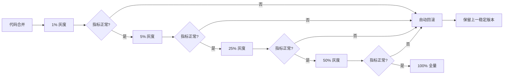

### 38.4 自动回滚条件

| 指标 | 阈值 | 检测窗口 |
|------|------|----------|
| 错误率 | > 1% | 5 分钟 |
| P95 响应时间 | > 2 倍基线 | 5 分钟 |
| 用户投诉 | > 5 起/分钟 | 1 分钟 |
| 业务核心指标 | 下降 > 10% | 10 分钟 |

### 38.5 验收标准

| 编号 | 验收标准 | 验证方法 |
|------|----------|----------|
| AC-GR-01 | 灰度发布支持 1%→100% 阶梯放量 | 功能测试 |
| AC-GR-02 | 自动回滚在阈值触发后 ≤ 2 分钟生效 | 故障演练 |
| AC-GR-03 | 灰度过程可观测（指标对比） | 监控验证 |
| AC-GR-04 | 灰度策略按租户/用户/角色生效 | 功能测试 |

---

## 39. 多活架构规范

本章节定义全平台多活架构规范，确保单机房故障不影响整体可用性。

### 39.1 多活模式

| 模式 | 描述 | RTO | RPO |
|------|------|:---:|:---:|
| 同城双活 | 同一城市两机房同时承载流量 | ≤ 10s | ≤ 1s |
| 异地灾备 | 异地机房冷备或温备 | ≤ 15min | ≤ 5min |
| 异地多活 | 异地机房同时承载流量 | ≤ 30s | ≤ 5s |
| 两地三中心 | 同城双活 + 异地灾备 | ≤ 15min | ≤ 1min |

### 39.2 流量调度

| 调度方式 | 实现 | 适用 |
|----------|------|------|
| DNS 调度 | 智能 DNS 解析 | 地域级调度 |
| GSLB | 全局负载均衡 | 机房级调度 |
| Ingress 调度 | AWS Lambda | 服务级调度 |
| Service Mesh | AWS VPC Lattice | 细粒度流量 |

### 39.3 数据同步

| 数据类型 | 同步方式 | 延迟 |
|----------|----------|:----:|
| 配置 | AWS Systems Manager Parameter Store 双向同步 | 秒级 |
| 会话 | Redis 主从复制 | 毫秒级 |
| 业务数据 | 数据库双向同步（DRC） | 秒级 |
| 异步消息 | SQS/SNS | 秒级 |
| 缓存 | Redis Cluster 跨机房 | 毫秒级 |

### 39.4 故障切换

| 切换层级 | 切换方式 | 切换时间 |
|----------|----------|:--------:|
| 服务实例 | AWS Lambda 自愈 | ≤ 30s |
| 机房 | DNS / GSLB 切换 | ≤ 10s |
| 数据库 | 主从切换 / 读写分离 | ≤ 30s |
| 整体 | 异地灾备切换 | ≤ 15min |

### 39.5 验收标准

| 编号 | 验收标准 | 验证方法 |
|------|----------|----------|
| AC-MA-01 | 同城双活 RTO ≤ 10s | 故障演练 |
| AC-MA-02 | 异地灾备 RTO ≤ 15min（**v3.0 企业级推荐值**） | 演练验证 |
| AC-MA-03 | 机房级故障切换不影响用户体验 | 演练 |
| AC-MA-04 | 数据双向同步延迟满足 SLA | 监控报表 |
| AC-MA-05 | 多活架构整体 RTO ≤ 15 分钟、RPO ≤ 5 分钟 | 灾备演练报告 |

### 39.6 多活架构 RTO/RPO 企业级推荐值

> **v3.0 变更说明(2026-06-13)**：依据用户裁决，§39 多活架构 SLA 在 v5 初版基础上收束为**企业级推荐值**：
> - **RTO（恢复时间目标）≤ 15 分钟**：从故障判定到业务恢复至可服务状态，含检测、决策、流量切换、数据校验、回归测试的总时长
> - **RPO（恢复点目标）≤ 5 分钟**：从故障发生到最近一次有效数据持久化点之间允许丢失的最大数据时长，对应异步复制延迟上限
>
> 上述指标对齐 AWS Well-Architected Framework "Reliability Pillar" 中 RTO/RPO 业务连续性分级标准（参见 AWS Well-Architected Reliability Pillar Whitepaper, 2024 Rev.）；并参考阿里云"两地三中心"金融级灾备白皮书与行业 P0/P1 级故障复盘案例综合推断。

#### 39.6.1 RTO/RPO 分级矩阵

| 业务等级 | RTO | RPO | 适用业务 | 切换策略 |
|:--------:|:---:|:---:|----------|----------|
| **P0 核心** | ≤ 5 分钟 | ≤ 1 分钟 | Agent 调用、LLM 推理、知识检索 | 自动切换 + 异步复制 |
| **P1 重要** | ≤ 15 分钟 | ≤ 5 分钟 | 编排执行、记忆读写、对话历史 | 半自动切换 + 异步复制 |
| **P2 一般** | ≤ 1 小时 | ≤ 30 分钟 | 审计日志、监控数据、报表分析 | 手动切换 + 周期备份 |
| **P3 后台** | ≤ 4 小时 | ≤ 2 小时 | 离线计算、数据归档、训练样本 | 手动切换 + 周期备份 |

> **Banyan 默认业务等级**：Agent 编排主链路、LLM 推理调用为 P0；记忆/知识读写、Prompt 组装、商户管理为 P1；其余运营管理面模块为 P2。**注意**：知识检索（热路径）属 P0 核心，知识管理模块（PRD-01，含 CRUD/导入/导出等管理面操作）属 P2 一般，二者不矛盾——热路径检索随 Agent/LLM 调用链路享有 P0 保障，管理面操作按 P2 保障即可。

#### 39.6.2 主备切换架构图（mermaid）

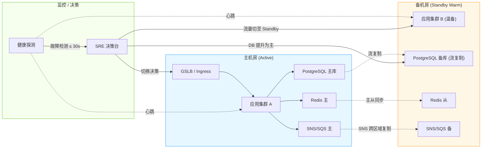

#### 39.6.3 多活流量切换架构图（mermaid）

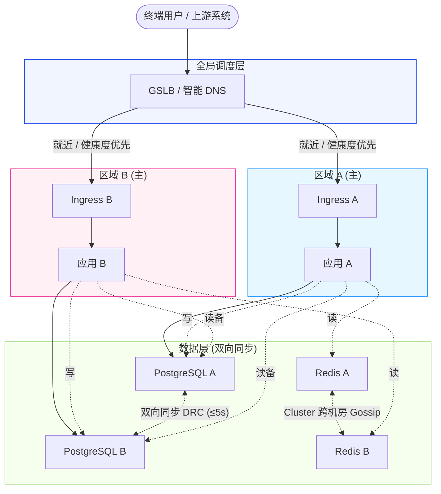

#### 39.6.4 引用与参考

- AWS Well-Architected Framework — Reliability Pillar Whitepaper (2024 Rev.)：https://docs.aws.amazon.com/wellarchitected/latest/reliability-pillar/welcome.html
- 阿里云"两地三中心"金融级灾备白皮书（2023）：同城双活 RTO ≤ 30s、RPO ≤ 1s；异地灾备 RTO ≤ 15min、RPO ≤ 5min
- GB/T 20988-2007《信息安全技术 信息系统灾难恢复规范》

> **评审定稿说明（v5）**：§39 多活架构规范基于 AWS Well-Architected Framework 多区域高可用最佳实践、阿里云"两地三中心"白皮书及行业 P0/P1 级故障复盘案例综合推断。具体技术选型（AWS Lambda、VPC Lattice、Systems Manager Parameter Store 等）需在 P2 阶段以"云厂商 POC"形式落地验证后冻结；SLA 指标（RTO/RPO）已**v3.0 收束**为企业级推荐值：RTO ≤ 15 分钟、RPO ≤ 5 分钟，详见 §39.6。

---

## 40. 故障演练机制

本章节定义全平台故障演练机制，通过常态化演练验证 §39 多活架构与各模块的高可用能力。

### 40.1 演练分级

| 级别 | 频率 | 演练内容 | 影响范围 |
|:----:|:----:|----------|----------|
| 每日 | 每日 | 自动化混沌测试（弱网、进程崩溃） | 单实例 |
| 每周 | 每周 | 服务级故障注入 | 单服务 |
| 每月 | 每月 | 机房级故障演练（DR Drill） | 单机房 |
| 每季度 | 每季度 | 异地灾备切换演练 | 跨机房 |
| 每年 | 每年 | 整体灾备演练 + 合规审计 | 全平台 |

### 40.2 演练工具

| 工具 | 用途 | 适用 |
|------|------|------|
| ChaosBlade | 阿里云混沌工程平台 | 通用 |
| Chaos Monkey | Netflix 开源 | 服务级 |
| Litmus | AWS Lambda 混沌工程 | Serverless 环境 |
| Gremlin | 商业混沌工程平台 | 高级场景 |
| 自研 | 平台特定场景 | 业务级 |

### 40.3 演练场景

| 场景 | 演练目标 | 工具 |
|------|----------|------|
| 进程崩溃 | 验证 AWS Lambda 自愈 | ChaosBlade |
| 节点宕机 | 验证调度与重试 | ChaosBlade |
| 网络延迟 | 验证超时与降级 | tc / ChaosBlade |
| 网络分区 | 验证脑裂防护 | ChaosBlade |
| 数据库主从切换 | 验证数据一致性 | 自研 |
| Redis 故障 | 验证缓存降级 | Redis Sentinel |
| LLM 不可用 | 验证 Fallback | 自研 |
| 机房整体断电 | 验证多活切换 | 灾备演练 |

### 40.4 演练流程

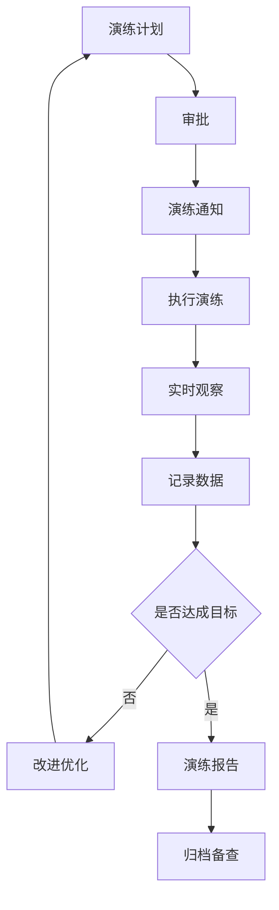

### 40.5 验收标准

| 编号 | 验收标准 | 验证方法 |
|------|----------|----------|
| AC-DR-01 | 每日自动化混沌测试覆盖率 ≥ 80% 服务 | 平台统计 |
| AC-DR-02 | 每月机房级演练按计划执行 | 演练记录 |
| AC-DR-03 | 每季度异地灾备演练达成 RTO/RPO 目标 | 演练报告 |
| AC-DR-04 | 演练问题 100% 进入改进流程并关闭 | 跟踪表 |

---

## 41. 附录 A 全局标识符命名规范（V1.0）

> **版本**：V1.0 | **生效日期**：2026-06-09 | **维护人**：平台架构组
> **适用范围**：PRD-01 ~ PRD-11 全部 11 个模块
> **本附录权威性**：所有模块的标识符命名必须严格遵循本规范；与本规范冲突的旧命名应在本附录生效后逐步迁移

### 41.1 API 编号规范

| 维度 | 规范 |
|------|------|
| 格式 | `API-{模块编号}-{3 位顺序号}` |
| 模块编号 | 2 位数字，对应 PRD 编号（如 PRD-04 大语言模型 → 模块编号 `04`） |
| 顺序号 | 3 位数字（`001`-`999`），模块内唯一，从 001 开始顺序递增 |
| 特殊标识 | `API-{模块编号}-{顺序号}-{子操作}` 用于表达子操作（如 `API-04-001-query`） |
| 示例 | `API-04-001`、`API-04-002`、`API-04-001-query`、`API-04-001-create` |
| 废弃规则 | 废弃 API 不删除编号，加 `DEPRECATED` 标记；新 API 继续使用新顺序号 |
| 跨模块引用 | 跨模块调用时，被调用方 API 编号使用本规范，调用方无需重新编号 |

**与历史命名的映射**：

| 旧命名 | 新命名 | 迁移策略 |
|--------|--------|----------|
| `API-03-XX`（PRD-01） | `API-01-{3 位}` | 旧编号冻结，新功能使用新编号 |
| `API-04-XX`（PRD-02） | `API-02-{3 位}` | 旧编号冻结，新功能使用新编号 |
| `API-02-XX`（PRD-04） | `API-04-{3 位}` | 旧编号冻结，新功能使用新编号 |
| `API-ORC-XX`（PRD-05） | `API-05-{3 位}` | 旧编号冻结，新功能使用新编号 |
| `API-VER-XX`（PRD-06） | `API-06-{3 位}` | 旧编号冻结，新功能使用新编号 |
| `API-M-XX`（PRD-07） | `API-07-{3 位}` | 旧编号冻结，新功能使用新编号 |
| `API-U-XX`（PRD-08） | `API-08-{3 位}` | 旧编号冻结，新功能使用新编号 |
| `API-S-XX`（PRD-09） | `API-09-{3 位}` | 旧编号冻结，新功能使用新编号 |
| `API-PB-XX`（PRD-10） | `API-10-{3 位}` | 旧编号冻结，新功能使用新编号 |
| `API-MON-XX`（PRD-11） | `API-11-{3 位}` | 已采用新规范，无迁移需要 |

### 41.2 AC 编号规范

| 维度 | 规范 |
|------|------|
| 格式 | `AC-{模块编号}-{3 位顺序号}` |
| 顺序号 | 3 位数字，按文档内 § 章节顺序连续编号，跨章节连续 |
| 特殊段位 | 特殊场景可加后缀：`AC-{模块编号}-{3 位}-{子场景}`（如 `AC-04-001-perf`） |
| 示例 | `AC-01-001`、`AC-01-002`、`AC-01-001-security` |
| 验证可测试性 | 每条 AC 必须可量化、可测试，禁止使用"功能正常"等模糊描述 |

**与历史命名的映射**：

| 旧命名 | 新命名 | 迁移策略 |
|--------|--------|----------|
| `AC-01-XX`（PRD-01） | `AC-01-{3 位}` | 旧编号保留，**前补零**升级为 3 位 |
| `AC-02-XX`（PRD-02） | `AC-02-{3 位}` | 旧编号保留，**前补零**升级为 3 位 |
| `AC-KD-XX`（PRD-10） | `AC-10-{3 位}` | 旧编号保留，**前补零**升级为 3 位；重命名段位 `KD → 10` |
| `AC-MON-XX`（PRD-11） | `AC-11-{3 位}` | 旧编号保留，**前补零**升级为 3 位；重命名段位 `MON → 11` |
| `AC-DR-XX`（PRD-09） | `AC-09-{3 位}` | 旧编号保留，**前补零**升级为 3 位；重命名段位 `DR → 09` |

### 41.3 BR 编号规范

| 维度 | 规范 |
|------|------|
| 格式 | `BR-{模块编号}-{3 位顺序号}` |
| 顺序号 | 3 位数字（`001`-`999`），按文档内规则顺序连续编号 |
| 示例 | `BR-04-001`、`BR-04-002` |
| 字段 | 编号 + 规则名称 + 规则描述（必含触发条件 + 期望结果） |

**与历史命名的映射**：

| 旧命名 | 新命名 | 迁移策略 |
|--------|--------|----------|
| `BR-01-XX`（PRD-01） | `BR-01-{3 位}` | 旧编号保留，**前补零**升级为 3 位 |
| `BR-02-XX`（PRD-02） | `BR-02-{3 位}` | 旧编号保留，**前补零**升级为 3 位 |
| `BR-KD-XX`（PRD-10） | `BR-10-{3 位}` | 旧编号保留，**前补零**升级为 3 位；重命名段位 `KD → 10` |
| `BR-MON-XX`（PRD-11） | `BR-11-{3 位}` | 旧编号保留，**前补零**升级为 3 位；重命名段位 `MON → 11` |
| `BR-DR-XX`（PRD-09） | `BR-09-{3 位}` | 旧编号保留，**前补零**升级为 3 位；重命名段位 `DR → 09` |

### 41.4 NFR 编号规范

| 维度 | 规范 |
|------|------|
| 格式 | `NFR-{模块编号}-{维度字母}-{3 位顺序号}` |
| 模块编号 | 2 位数字，对应 PRD 编号 |
| 维度字母 | `P`（性能 Performance）/ `S`（安全 Security）/ `A`（可用性 Availability）/ `C`（兼容性 Compatibility）/ `M`（可维护性 Maintainability）/ `SC`（可扩展性 Scalability）/ `O`（可观测性 Observability）/ `U`（易用性 Usability）/ `R`（可靠性 Reliability）/ `CO`（合规性 Compliance） |
| 顺序号 | 3 位数字（`001`-`999`），同维度内连续编号 |
| 示例 | `NFR-04-P-001`（LLM 性能）、`NFR-04-S-001`（LLM 安全）、`NFR-11-O-001`（监控可观测性） |
| 跨模块 NFR | 跨模块通用 NFR 应放入 PRD-09 §X，编号段位使用 `09` |

### 41.5 PG 表命名规范

| 维度 | 规范 |
|------|------|
| 格式 | `{scope}_{module}_{entity_name}`（蛇形命名，复数形式） |
| scope | `public`（系统级）/ `tenant`（租户级）/ `audit`（审计级） |
| module | 模块标识：`knowledge` / `memory` / `capability` / `llm` / `orchestration` / `agent` / `merchant` / `user` / `setting` / `prompt_builder` / `monitoring` |
| entity_name | 实体名（蛇形，复数） |
| 主键策略 | composite PK `(partition_key, id)`，其中 `partition_key` 存储租户ID值（UUID格式字符串），`tenant_id` 由 `partition_key` 派生 |
| 必备字段 | `id UUID`、`created_at TIMESTAMPTZ`、`updated_at TIMESTAMPTZ`、`created_by UUID`、`updated_by UUID`、`deleted_at TIMESTAMPTZ NULL`（软删除，`is_deleted` 由 `deleted_at` 派生） |
| 字符集 | `UTF8` (PostgreSQL 默认 `UTF8` 编码,无需显式声明) |
| 存储引擎 | PostgreSQL 使用 `_heap_` 存储引擎(默认,无需显式声明) |
| 示例 | `tenant_knowledge_knowledge_entries`、`tenant_agent_agent_instances`、`public_monitor_metric_definitions` |

### 41.6 Neo4j 标签与关系命名规范

| 维度 | 规范 |
|------|------|
| 节点标签 | `PascalCase`，按模块前缀，统一 `Entity` 后缀（如 `KnowledgeEntity`、`MemoryEntity`、`AgentEntity`） |
| 关系类型 | `UPPER_SNAKE_CASE`，动词短语（如 `BELONGS_TO`、`DEPENDS_ON`、`CALLS`、`TRIGGERS`） |
| 属性命名 | 蛇形命名（`partition_key`、`created_at`） |
| 复合唯一性 | `CREATE CONSTRAINT FOR (n:BaseEntity:EntityType:Graph) REQUIRE (n.partition_key, n.entity_id) IS UNIQUE` |
| 域隔离 | 节点必须含 `domain_id` 与 `domain_type`（参考 PRD-01 §4.8.5 与 PRD-02 §7 权限域模型） |
| 示例 | `(:KnowledgeEntity {partition_key, domain_type, domain_id, entity_name, entity_type, ...})` |

> **错误码段位**:本模块严格遵循 [PRD-00 §5.3.2.1 权威错误码段位分配表](file:///Users/Garabateador/Workspace/banyan/PRD/PRD-00-平台总览与全局规范.md),本模块段位为 `090001-090999`,命名空间 `BIZ_SETTING_*`,**不**自定义段位分配表。

### 41.7 错误码段位分配

> 本节原自定义错误码段位表(0xxxx-15xxx)与 PRD-00 §5.3.2.1 权威分配表存在严重冲突,已删除,统一引用 PRD-00 §5.3.2.1。历史映射信息见 §41.7.1(保留追溯)。

| 段位 | 类别 | 模块 | 说明 |
|------|------|------|------|
| 0xxxx | 基础通用 | PRD-09 系统设置 | 认证、授权、参数、限流等基础错误 |
| 1xxxx | 用户与认证 | PRD-08 用户管理 | 登录、注册、MFA、密码、会话等 |
| 2xxxx | 商户与渠道 | PRD-07 商户管理 | 商户、渠道、主题等 |
| 3xxxx | 知识 | PRD-01 知识管理 | 知识库、条目、版本、域等 |
| 4xxxx | 记忆 | PRD-02 记忆管理 | 记忆、生命周期、冲突等 |
| 5xxxx | 能力 | PRD-03 能力管理 | MCP Server、Tool、Provider 等 |
| 6xxxx | LLM | PRD-04 大语言模型 | 模型、Provider、调用、注入等 |
| 7xxxx | 编排 | PRD-05 编排管理 | 工作流、ACP、Batch 等 |
| 8xxxx | 代理 | PRD-06 代理管理 | Agent、A2A、任务等 |
| 9xxxx | 角色权限 | PRD-08 用户管理 / PRD-09 系统设置 | RBAC、ABAC、用户角色 |
| 10xxx | 提示词 | PRD-10 Prompt Builder | 模板、变量、压缩、A/B 等 |
| 11xxx | 监控 | PRD-11 监控与分析 | 指标、告警、Trace、日志等 |
| 12xxx | 内部扩展 | 预留 | 未来扩展（工作流 / 数据分析等） |
| 13xxx | 兼容历史 | PRD-06 代理管理 旧 | 旧版 V* 错误码保留 |
| 14xxx | 兼容历史 | PRD-10 Prompt Builder 旧 | 旧版 V* 错误码保留 |
| 15xxx | 监控（兼容） | PRD-11 监控与分析 | 旧版 MON 段位保留 |

**历史映射**：

| 旧段位 | 新段位 | 迁移策略 |
|--------|--------|----------|
| `13xxx`（PRD-06 旧） | `8xxxx` | 旧段位保留，**新功能使用新段位** |
| `14xxx`（PRD-10 旧） | `10xxx` | 旧段位保留，**新功能使用新段位** |
| `15xxx`（PRD-11 旧） | `11xxx` | 旧段位保留，**新功能使用新段位** |

### 41.8 Redis Key 命名规范

| 维度 | 规范 |
|------|------|
| 格式 | `t:{tenant_id}:{module}:{entity}:{id}[:{sub}]` |
| 公共 Key | `pl:{module}:{entity}:{id}`（scope=`pl`，省略 tenant_id） |
| 模块标识 | 与 PG 表模块标识一致（`knowledge` / `memory` / `capability` / `llm` / `orchestration` / `agent` / `merchant` / `user` / `setting` / `prompt` / `monitor`） |
| 资源类型 | snake_case 单数（如 `template`、`cache`、`session`） |
| 命名空间隔离 | Key 中 `tenant_id` 与 `module` 强制注入 |
| TTL | 所有 Key 必须设置 TTL，禁止永不过期 |
| 示例 | `t:{tenant_id}:prompt:template:{id}`、`pl:monitor:health_score:default` |

### 41.9 推测标注规范

| 维度 | 规范 |
|------|------|
| 格式 | `[待确认] 推测内容 —— 依据：推测依据说明` |
| 推测依据分类 | ①基于行业惯例推测 ②根据相似功能逻辑推断 ③基于技术约束推断 ④基于用户习惯推测 ⑤基于现有PRD内容推断 |
| 占比上限 | 单文档推测标注 ≤ 总行数 1.0%（PRD-01 知识管理 1.0% 为基准线） |
| 超出处理 | 占比 > 1.5% 的文档（PRD-03、PRD-05）应：①抽样审视 ②区分"行业惯例"与"产品决策" ③将"产品决策"类提交负责人确认后转正 |
| 标记位置 | 在被推测的内容**后**使用 `[待确认]` 前缀；**前**使用规范依据说明 |

### 41.10 文档结构模板

每个 PRD 应包含以下 13 个标准章节（可重命名但必须覆盖）：

| 章节序号 | 章节名称 | 必备 |
|----------|----------|:----:|
| 1 | 文档信息 | ✓ |
| 2 | 术语定义 | ✓ |
| 3 | 业务背景与目标 | ✓ |
| 4 | 功能详情 | ✓ |
| 5 | 业务流程 | ✓ |
| 6 | 业务规则 | ✓ |
| 7 | 权限矩阵 | ✓ |
| 8 | 数据模型 | ✓（含 PG + Neo4j + Redis） |
| 9 | 非功能需求 | ✓ |
| 10 | 接口需求 | ✓ |
| 11 | 风险与预案 | ✓ |
| 12 | 模块关系总览 | ✓ |
| 13 | 附录 | ✓ |

### 41.11 横切章节标准结构

各模块的横切章节建议按以下顺序组织（位置：§4 之后、§5 业务规则之前）：

| 序号 | 章节 | 模板 |
|------|------|------|
| X.1 | 模块仪表盘 | KPI 卡片 + 趋势图 |
| X.2 | 模块关系总览 | 五层架构位置 + 依赖矩阵 |
| X.3 | 非功能需求汇总 | 性能 + 安全 + 可用性 |
| X.4 | 接口规范汇总 | 本模块 + 跨模块接口 |
| X.5 | 错误码段位 | 本模块使用段位 |
| X.6 | 监控埋点规范 | 与 PRD-11 对齐 |

### 41.12 RTO/RPO 统一规范

| 模块类型 | RTO | RPO | 适用模块 |
|----------|-----|-----|----------|
| **P0 核心** | ≤ 5 分钟 | ≤ 1 分钟 | 用户认证（PRD-08）、LLM 调用（PRD-04）、Agent 调用、知识检索 |
| **P1 重要** | ≤ 15 分钟 | ≤ 5 分钟 | 记忆（PRD-02）、编排（PRD-05）、代理（PRD-06）、商户（PRD-07）、监控（PRD-11）、Prompt Builder（PRD-10） |
| **P2 一般** | ≤ 1 小时 | ≤ 30 分钟 | 知识（PRD-01）、能力（PRD-03）、系统设置（PRD-09） |

**说明**：PRD-08 用户管理的 RTO ≤ 5 分钟 / RPO ≤ 1 分钟 属于"P0 核心"类别，符合统一规范。上述分级对齐 §39.6.1 RTO/RPO 分级矩阵与 §39.6 企业级推荐值（RTO ≤ 15 分钟、RPO ≤ 5 分钟）。

### 41.13 文档可维护性规范

| 维度 | 规范 |
|------|------|
| 单文件大小 | ≤ 256 KB（超过时考虑拆分为子文件 + 索引） |
| 单章节 H3 数 | ≤ 100 个（超过时考虑合并） |
| 单文档总行数 | ≤ 6,000 行（超过时考虑拆分为子文件 + 索引） |
| 跨文档引用 | 使用 `[PRD-XX-模块名](file://...md)` 格式链接 |
| 历史记录 | 章节标题前注明"历史关联文档（已分拆）"以保留历史编号 |

### 41.14 变更管理

| 维度 | 规范 |
|------|------|
| 命名变更 | 任何命名规范变更需经平台架构组评审，变更后通过本附录 §41.x 修订发布 |
| 生效日 | 命名规范自 2026-06-09 起生效；旧命名冻结，新功能采用新命名 |
| 迁移期 | 旧命名 → 新命名迁移期 6 个月（截止 2026-12-09） |
| 废弃 | 超过迁移期未迁移的旧命名，由平台架构组在月度审查中标记为 `DEPRECATED` |

---

## 42. PostgreSQL 数据模型

> **触发器声明**: 本模块所有 `tenant_*` 租户级表均配置 `set_partition_key_from_session()` BEFORE INSERT 触发器，自动从会话变量 `app.current_tenant_id` 注入 `partition_key`，遵循 PRD-00 §7.2 强制规范。触发器函数定义参见 PRD-00 §7.2.2 或 PRD-11 §8.1。

> 表名遵循 [PRD-09 §41.5 PG 表命名规范](#415-pg-表命名规范)，格式 `{scope}_{module}_{entity_name}`，主键策略 `composite PK (partition_key, id)`。

### 42.1 `tenant_setting_configs`

系统配置表，key-value 结构，存储各模块配置项（通用设置、知识设置、能力设置、编排设置、代理设置等）。

```sql
CREATE TABLE tenant_setting_configs (
    partition_key    VARCHAR(64)   NOT NULL,                            -- tenant_id, composite PK part 1
    id               UUID          NOT NULL DEFAULT gen_random_uuid(),  -- composite PK part 2
    tenant_id        UUID          NOT NULL GENERATED ALWAYS AS (partition_key::uuid) STORED,  -- Derived from partition_key, required by multi-tenant middleware
    module           VARCHAR(64)   NOT NULL,                            -- module name (knowledge, agent, llm, etc.)
    config_key       VARCHAR(128)  NOT NULL,                            -- configuration key
    config_value     JSONB         NOT NULL DEFAULT '{}'::jsonb,        -- configuration value (JSON format)
    value_type       VARCHAR(32)   NOT NULL DEFAULT 'string'            -- value type (string/number/boolean/json/array)
                    CHECK (value_type IN ('string', 'number', 'boolean', 'json', 'array')),
    description      VARCHAR(512)  NULL,                                -- configuration description
    is_encrypted     BOOLEAN       NOT NULL DEFAULT FALSE,              -- whether stored encrypted
    created_at       TIMESTAMPTZ   NOT NULL DEFAULT NOW(),
    updated_at       TIMESTAMPTZ   NOT NULL DEFAULT NOW(),
    deleted_at       TIMESTAMPTZ     NULL,                                -- Soft delete timestamp
    is_deleted       BOOLEAN       NOT NULL GENERATED ALWAYS AS (deleted_at IS NOT NULL) STORED,  -- Derived from deleted_at
    created_by       UUID          NOT NULL,
    updated_by       UUID          NOT NULL,
    PRIMARY KEY (partition_key, id),
    UNIQUE (partition_key, module, config_key)
);

-- Indexes for common query patterns
CREATE INDEX idx_setting_configs_module ON tenant_setting_configs(partition_key, module);
CREATE INDEX idx_setting_configs_key ON tenant_setting_configs(partition_key, module, config_key);
CREATE INDEX idx_setting_configs_encrypted ON tenant_setting_configs(partition_key, is_encrypted) WHERE is_encrypted = TRUE;

-- RLS: enable row level security
ALTER TABLE tenant_setting_configs ENABLE ROW LEVEL SECURITY;

CREATE POLICY setting_configs_tenant_isolation ON tenant_setting_configs
    FOR ALL
    USING (partition_key = current_setting('app.current_tenant_id', TRUE));

-- Trigger: auto-inject partition_key from session variable
CREATE TRIGGER trg_tenant_setting_configs_partition_key
    BEFORE INSERT ON tenant_setting_configs
    FOR EACH ROW
    EXECUTE FUNCTION set_partition_key_from_session();
```

### 42.2 `tenant_setting_navigation`

导航配置表，存储菜单/导航结构，支持多级树形层级（通过 `parent_id` 自引用）。

```sql
CREATE TABLE tenant_setting_navigation (
    partition_key        VARCHAR(64)   NOT NULL,                            -- tenant_id, composite PK part 1
    id                   UUID          NOT NULL DEFAULT gen_random_uuid(),  -- composite PK part 2
    tenant_id            UUID          NOT NULL GENERATED ALWAYS AS (partition_key::uuid) STORED,  -- Derived from partition_key, required by multi-tenant middleware
    parent_id            UUID          NULL,                                -- parent navigation item ID (NULL = top-level)
    title                VARCHAR(128)  NOT NULL,                            -- navigation title
    icon                 VARCHAR(64)   NULL,                                -- icon name
    path                 VARCHAR(256)  NULL,                                -- route path
    sort_order           INTEGER       NOT NULL DEFAULT 0,                  -- sort order (ascending)
    visibility           VARCHAR(32)   NOT NULL DEFAULT 'all'               -- visibility scope (all/admin/custom)
                         CHECK (visibility IN ('all', 'admin', 'custom')),
    required_permissions JSONB         DEFAULT '[]'::jsonb,                 -- required permission list
    status               VARCHAR(32)   NOT NULL DEFAULT 'active'            -- status (active/disabled/hidden)
                         CHECK (status IN ('active', 'disabled', 'hidden')),
    created_at           TIMESTAMPTZ     NOT NULL DEFAULT NOW(),
    updated_at           TIMESTAMPTZ     NOT NULL DEFAULT NOW(),
    deleted_at           TIMESTAMPTZ     NULL,                                -- Soft delete timestamp
    is_deleted           BOOLEAN       NOT NULL GENERATED ALWAYS AS (deleted_at IS NOT NULL) STORED,  -- Derived from deleted_at
    PRIMARY KEY (partition_key, id)
);

-- Indexes for navigation tree queries
CREATE INDEX idx_setting_navigation_parent ON tenant_setting_navigation(partition_key, parent_id);
CREATE INDEX idx_setting_navigation_sort ON tenant_setting_navigation(partition_key, parent_id, sort_order);
CREATE INDEX idx_setting_navigation_status ON tenant_setting_navigation(partition_key, status);
CREATE INDEX idx_setting_navigation_visibility ON tenant_setting_navigation(partition_key, visibility);
CREATE INDEX idx_setting_navigation_permissions ON tenant_setting_navigation USING GIN(required_permissions);

-- Foreign key: self-referencing parent navigation item
ALTER TABLE tenant_setting_navigation
    ADD CONSTRAINT fk_setting_navigation_parent
    FOREIGN KEY (partition_key, parent_id) REFERENCES tenant_setting_navigation(partition_key, id);

-- RLS: enable row level security
ALTER TABLE tenant_setting_navigation ENABLE ROW LEVEL SECURITY;

CREATE POLICY setting_navigation_tenant_isolation ON tenant_setting_navigation
    FOR ALL
    USING (partition_key = current_setting('app.current_tenant_id', TRUE));

-- Trigger: auto-inject partition_key from session variable
CREATE TRIGGER trg_tenant_setting_navigation_partition_key
    BEFORE INSERT ON tenant_setting_navigation
    FOR EACH ROW
    EXECUTE FUNCTION set_partition_key_from_session();
```

### 42.3 `outbox_events`

> **v5 收束说明(2026-06-13)**:本节原 DDL 与 [PRD-00 §4.7.2](file:///Users/Garabateador/Workspace/banyan/PRD/PRD-00-平台总览与全局规范.md#L820-L836) 权威定义存在冲突(含 `retry_count`/`trace_id` 字段、含 RLS 策略、含 CHECK 约束),已删除独立 DDL,**严格遵循 PRD-00 §4.7.2 权威定义**。Outbox 为跨租户平台级表,不应启用 RLS;`retry_count` 由 SQS/SNS 基础设施层管理,`trace_id` 通过 X-Request-ID 请求头传递。

**系统设置模块相关事件类型**：

| aggregate_type | event_type | 触发场景 | 说明 |
|----------------|-----------|---------|------|
| setting.config | setting.config.created | 新增配置项 | 新模块配置初始化 |
| setting.config | setting.config.updated | 更新配置值 | 管理员修改配置 |
| setting.config | setting.config.deleted | 删除配置项 | 配置项清理 |
| setting.navigation | setting.navigation.created | 新增导航项 | 菜单项新增 |
| setting.navigation | setting.navigation.updated | 更新导航项 | 菜单项修改（标题/路径/排序等） |
| setting.navigation | setting.navigation.deleted | 删除导航项 | 菜单项移除 |
| setting.navigation | setting.navigation.reordered | 导航排序变更 | 批量调整排序 |

### 42.4 验收标准

| 编号 | 验收标准 | 验证方法 |
|------|----------|----------|
| AC-09-042-01 | 所有 `tenant_*` 表复合主键为 `(partition_key, id)` | DDL 审查 |
| AC-09-042-02 | 所有 `tenant_*` 表 RLS 策略 `USING (partition_key = current_setting('app.current_tenant_id', TRUE))` 生效 | 安全测试 |
| AC-09-042-03 | 所有 `tenant_*` 表 BEFORE INSERT 触发器自动注入 `partition_key` | 插入测试 |
| AC-09-042-04 | `tenant_setting_configs` 唯一约束 `(partition_key, module, config_key)` 防止重复配置 | 唯一约束测试 |
| AC-09-042-05 | `tenant_setting_navigation` 自引用外键保证父子关系完整性 | 外键约束测试 |
| AC-09-042-06 | `outbox_events` 幂等键 `idempotency_key` 防止重复事件 | 幂等测试 |
| AC-09-042-07 | `outbox_events` 状态仅允许 PENDING/PUBLISHED/CONSUMED/FAILED | CHECK 约束测试 |
| AC-09-042-08 | 业务表与 outbox 写入 100% 同一事务 | 代码审查 |

---

## SilvaEngine 实施附录

> **版本**: 2.0.0(SilvaEngine 架构重写版)
> **生效日期**: 2026-06-09
> **本附录基于**: [`PRD-00 平台总览与全局规范 v2.0.0`](./PRD-00-平台总览与全局规范.md) §15-§17
> **强制级别**: P0
> **本章边界**:PRD-09 在 SilvaEngine 化后,核心职责为"系统级平台配置 + 导航 + 主题",权限管理已迁出至 PRD-12,ABAC / 数据权限 / 权限审批 / 全局接口规范 / 错误码 / Redis Key / Neo4j 隔离 / 链路追踪 / 告警分级 / GDPR 全部迁出

### A1. 模块身份与依赖

| 项 | 值 |
|------|------|
| **模块名** | `setting` |
| **包名** | `silvaengine_modules.setting` |
| **Graphene 入口** | `silvaengine_modules.setting.schema:Schema` |
| **Lambda 函数** | `arn:aws:lambda:us-east-1:123456789012:function:banyan-setting-resolver` |
| **endpoint_id** | `setting-endpoint` |
| **依赖模块** | —(平台底层) |
| **下游模块** | 所有模块(读系统配置) |

### A2. ConnectionPoolManager 池声明

| 池名 | 类型 | 用途 |
|------|------|------|
| `postgres_main` | postgresql | 平台设置、导航、主题 |
| `postgres_audit` | postgresql | 设置审计 |
| `neo4j_main` | neo4j | 导航树关系 |
| `redis_cache` | redis | 配置缓存(高频读) |
| `httpx_smtp` | httpx | 通知邮件服务器 |
| `boto3_s3` | boto3 | 静态资源(Logo / 主题文件) |

### A3. PostgreSQL 表

> **触发器声明**: 本模块所有 `tenant_*` 租户级表均配置 `set_partition_key_from_session()` BEFORE INSERT 触发器，自动从会话变量 `app.current_tenant_id` 注入 `partition_key`，遵循 PRD-00 §7.2 强制规范。触发器函数定义参见 PRD-00 §7.2.2 或 PRD-11 §8.1。

| 表名 | 复合主键 | 用途 |
|------|----------|------|
| `tenant_setting_configs` | `(partition_key, id)` | 租户级配置(主表,与数据库设计方案§8.11对齐) |
| `tenant_setting_navigation` | `(partition_key, id)` | 导航树(顶级 + 子级,与数据库设计方案§8.45对齐) |
| `tenant_setting_theme` | `(partition_key, id)` | 主题配置 |
| `tenant_setting_i18n` | `(partition_key, id)` | 多语言资源 |
| `tenant_setting_branding` | `(partition_key, id)` | 品牌定制(Logo / 域名) |
| `tenant_setting_email_template` | `(partition_key, id)` | 邮件模板 |
| `tenant_setting_sms_template` | `(partition_key, id)` | SMS 模板 |
| `tenant_setting_webhook` | `(partition_key, id)` | Webhook 端点 |
| `audit_setting_event` | `(id)` | 审计 WORM |

> **注意**: 所有 `tenant_setting_*` 表为租户级,使用 `(partition_key, id)` 复合主键,与数据库设计方案及§42 DDL保持一致。平台级默认配置通过 `partition_key = 'system'` 的特殊行实现租户覆盖模式。

### A4. Neo4j 节点与关系

| 节点 | 标签 | 必含属性 |
|------|------|----------|
| `NavigationItem` | `SettingEntity:NavigationItem:Graph` | `partition_key` / `id` / `code` / `parent_id` / `order` / `permission_code` |
| `Theme` | `SettingEntity:Theme:Graph` | `partition_key` / `id` / `name` / `mode` (LIGHT/DARK) |

| 关系 | 类型 | 起点 → 终点 |
|------|------|-------------|
| `NAV_CHILD_OF` | `NAV_CHILD_OF` | `NavigationItem` → `NavigationItem`(父子) |
| `NAV_REQUIRES_PERMISSION` | `NAV_REQUIRES_PERMISSION` | `NavigationItem` → `Permission`(复用 PRD-12) |

### A5. GraphQL Schema 映射

#### A5.1 Query 列表

| GraphQL Query | 返回 | 说明 |
|----------------|------|------|
| `platformSetting` | `PlatformSettingType` | 平台设置 |
| `tenantSetting` | `TenantSettingType` | 当前租户设置 |
| `navigations` | `[NavigationItemType]` | 导航树 |
| `theme` | `ThemeType` | 主题配置 |
| `i18nResources(locale)` | `I18nBundleType` | 多语言资源 |
| `emailTemplate(code)` | `EmailTemplateType` | 邮件模板 |
| `smsTemplate(code)` | `SmsTemplateType` | SMS 模板 |
| `webhooks(filter)` | `[WebhookType]` | Webhook 列表 |
| `branding` | `BrandingType` | 品牌定制 |

#### A5.2 Mutation 列表

| GraphQL Mutation | 输入 | 返回 |
|------------------|------|------|
| `updatePlatformSetting(input, idempotencyKey)` | `PlatformSettingInput` | `PlatformSettingType`(平台管理员) |
| `updateTenantSetting(input, idempotencyKey)` | `TenantSettingInput` | `TenantSettingType` |
| `createNavigation(input, idempotencyKey)` | `NavigationCreateInput` | `NavigationItemType` |
| `updateNavigation(id, input, idempotencyKey)` | `NavigationUpdateInput` | `NavigationItemType` |
| `deleteNavigation(id, idempotencyKey)` | - | `DeletePayload` |
| `reorderNavigations(orders, idempotencyKey)` | - | `[NavigationItemType]` |
| `updateTheme(input, idempotencyKey)` | `ThemeInput` | `ThemeType` |
| `updateBranding(input, idempotencyKey)` | `BrandingInput` | `BrandingType` |
| `createEmailTemplate(input, idempotencyKey)` | `EmailTemplateCreateInput` | `EmailTemplateType` |
| `updateEmailTemplate(id, input, idempotencyKey)` | `EmailTemplateUpdateInput` | `EmailTemplateType` |
| `deleteEmailTemplate(id, idempotencyKey)` | - | `DeletePayload` |
| `createSmsTemplate(input, idempotencyKey)` | `SmsTemplateCreateInput` | `SmsTemplateType` |
| `updateSmsTemplate(id, input, idempotencyKey)` | `SmsTemplateUpdateInput` | `SmsTemplateType` |
| `deleteSmsTemplate(id, idempotencyKey)` | - | `DeletePayload` |
| `createWebhook(input, idempotencyKey)` | `WebhookCreateInput` | `WebhookType` |
| `updateWebhook(id, input, idempotencyKey)` | `WebhookUpdateInput` | `WebhookType` |
| `deleteWebhook(id, idempotencyKey)` | - | `DeletePayload` |
| `testWebhook(id, idempotencyKey)` | - | `TestResultType` |
| `updateI18nResource(input, idempotencyKey)` | `I18nResourceInput` | `I18nBundleType` |

#### A5.3 关键 ObjectType

| 类型 | 关键字段 | DataLoader |
|------|----------|------------|
| `PlatformSettingType` | `id` / `siteName` / `siteDescription` / `defaultLocale` / `defaultTimeZone` / `maintenanceMode` / `registrationEnabled` | - |
| `TenantSettingType` | `tenantId` / `branding` / `theme` / `customDomain` / `featureFlags` | `branding` / `theme` |
| `NavigationItemType` | `id` / `code` / `name` / `path` / `icon` / `parent` / `children` / `order` / `permissionCode` / `visible` | `parent` / `children` |
| `ThemeType` | `id` / `name` / `mode` / `primaryColor` / `tokens` | - |
| `I18nBundleType` | `locale` / `resources: JSONString` | - |
| `EmailTemplateType` | `id` / `code` / `subject` / `body` / `variables` | - |
| `SmsTemplateType` | `id` / `code` / `body` / `variables` | - |
| `WebhookType` | `id` / `url` / `events` / `secret` (脱敏) / `active` | - |
| `BrandingType` | `logoUrl` / `faviconUrl` / `primaryColor` / `customDomain` | - |

### A6. config.json 模板(摘要)

```json
{
  "module": {
    "name": "setting",
    "version": "2.0.0",
    "owner": "platform-team",
    "graphene": { "schema_entry": "silvaengine_modules.setting.schema:Schema" }
  },
  "pools": {
    "postgres_main": { "type": "postgresql", "settings": { "host": "${env:PG_MAIN_HOST}",  "database": "banyan_main" } },
    "postgres_audit":{ "type": "postgresql", "settings": { "host": "${env:PG_AUDIT_HOST}", "database": "banyan_audit" } },
    "neo4j_main":    { "type": "neo4j",      "settings": { "uri": "${env:NEO4J_URI}" } },
    "redis_cache":   { "type": "redis",      "settings": { "host": "${env:REDIS_HOST}", "db": 0 } },
    "httpx_smtp":    { "type": "httpx",      "settings": { "base_url": "${env:SMTP_API_URL}", "timeout": 10 } },
    "boto3_s3":      { "type": "boto3",      "settings": { "service_name": "s3", "region_name": "${env:AWS_REGION}" } }
  },
  "plugins": [
    { "type": "connection_pool", "module_name": "silvaengine_connections", "config": { "pool": "postgres_main" }, "enabled": true },
    { "type": "connection_pool", "module_name": "silvaengine_connections", "config": { "pool": "postgres_audit"}, "enabled": true },
    { "type": "connection_pool", "module_name": "silvaengine_connections", "config": { "pool": "neo4j_main"    }, "enabled": true },
    { "type": "connection_pool", "module_name": "silvaengine_connections", "config": { "pool": "redis_cache"   }, "enabled": true },
    { "type": "connection_pool", "module_name": "silvaengine_connections", "config": { "pool": "httpx_smtp"    }, "enabled": true },
    { "type": "connection_pool", "module_name": "silvaengine_connections", "config": { "pool": "boto3_s3"      }, "enabled": true }
  ],
  "settings": {
    "setting.platform.default": {
      "setting_id": "setting.platform.default",
      "variables": {
        "default_locale":        { "name": "default_locale",        "type": "str", "value": "zh-CN" },
        "default_time_zone":     { "name": "default_time_zone",     "type": "str", "value": "Asia/Shanghai" },
        "registration_enabled":  { "name": "registration_enabled",  "type": "bool","value": true },
        "maintenance_mode":      { "name": "maintenance_mode",      "type": "bool","value": false },
        "cache_ttl_seconds":     { "name": "cache_ttl_seconds",     "type": "int", "value": 300 }
      }
    }
  },
  "functions": [
    {
      "aws_lambda_arn": "arn:aws:lambda:us-east-1:123456789012:function:banyan-setting-resolver",
      "function": "setting_resolver",
      "area": "setting",
      "config": {
        "module_name": "silvaengine_modules.setting",
        "class_name": "SettingResolver",
        "setting": "setting.platform.default",
        "graphql": true,
        "operations": {
          "query": ["platformSetting", "tenantSetting", "navigations", "theme",
                   "i18nResources", "emailTemplate", "smsTemplate", "webhooks", "branding"],
          "mutation": ["updatePlatformSetting", "updateTenantSetting",
                      "createNavigation", "updateNavigation", "deleteNavigation", "reorderNavigations",
                      "updateTheme", "updateBranding",
                      "createEmailTemplate", "updateEmailTemplate", "deleteEmailTemplate",
                      "createSmsTemplate", "updateSmsTemplate", "deleteSmsTemplate",
                      "createWebhook", "updateWebhook", "deleteWebhook", "testWebhook",
                      "updateI18nResource"]
        }
      },
      "auth_required": true
    }
  ],
  "endpoints": [
    { "endpoint_id": "setting-endpoint", "special_connection": false }
  ],
  "runtime": { "memory_mb": 512, "timeout_seconds": 30 }
}
```

### A7. 错误码段位

> **本节与 PRD-00 §5.3.2 命名空间表对齐**, 缺位标注「待 PRD-00 §5.3.2 补全」,待平台总览基线纳入后即可消除。

| 段位 | 用途 | 与 PRD-00 §5.3.2 对齐 |
|------|------|----------------------|
| `BIZ_SETTING_*` | 设置主表、平台、租户 | ✅ 已对齐 |
| `BIZ_NAVIGATION_*` | 导航树 | ✅ 已对齐 |
| `BIZ_THEME_*` | 主题 | ⏳ 待 PRD-00 §5.3.2 补全 |
| `BIZ_I18N_*` | 多语言资源 | ⏳ 待 PRD-00 §5.3.2 补全 |
| `BIZ_EMAIL_TEMPLATE_*` | 邮件模板 | ⏳ 待 PRD-00 §5.3.2 补全 |
| `BIZ_SMS_TEMPLATE_*` | SMS 模板 | ⏳ 待 PRD-00 §5.3.2 补全 |
| `BIZ_WEBHOOK_*` | Webhook | ⏳ 待 PRD-00 §5.3.2 补全 |
| `BIZ_BRANDING_*` | 品牌定制 | ⏳ 待 PRD-00 §5.3.2 补全 |

### A8. 已迁出职责清单(不再属于 PRD-09)

| 迁出职责 | 迁移目标 | 状态 |
|----------|----------|------|
| 角色 / 用户组 | PRD-12 §8.2 / §8.11 | 已完成 |
| ABAC 策略管理 | PRD-12 §8.5 | 已完成 |
| 数据权限 | PRD-12 §5.5 | 已完成 |
| 权限审批 | PRD-12 §8.9 | 已完成 |
| 全局接口规范 | PRD-00 §4 | 已完成 |
| 错误码体系 | PRD-00 §5 | 已完成 |
| Redis Key 规范 | PRD-00 §7.4 | 已完成 |
| Neo4j 隔离 | PRD-00 §7.5 | 已完成 |
| 链路追踪 | PRD-00 §10.2 | 已完成 |
| 告警分级 | PRD-11 | 已完成 |
| GDPR / CCPA | PRD-00 §9.5 + PRD-08 §A5.2 | 已完成 |
| PRD-09 §4.15-4.26 / §5.3-5.5 / §6.1.3-6.1.5 全部删除完成 | PRD-12 | 已完成 |

### A9. 实施检查清单

- [ ] `config.json` 通过校验
- [ ] 6 个 `pools` 与 6 个 `plugins` 1:1 对应
- [ ] 所有 SQLAlchemy 模型复合主键正确(平台表不含 partition_key,租户表含)
- [ ] 所有 Cypher 查询带 `WHERE n.partition_key = $partitionKey`（遵循 PRD-00 §3.5.5 铁律）
- [ ] 设置通过 `ConfigModel.find(setting_id="...")` 注入,业务模块**不**直读
- [ ] 导航 `permissionCode` 与 PRD-12 Permission 关联
- [ ] 错误码 `BIZ_SETTING_*` 已注册
- [ ] `validation_runner.py` 0 errors / 0 warnings

---

*系统设置模块文档结束*

*文档结束*
