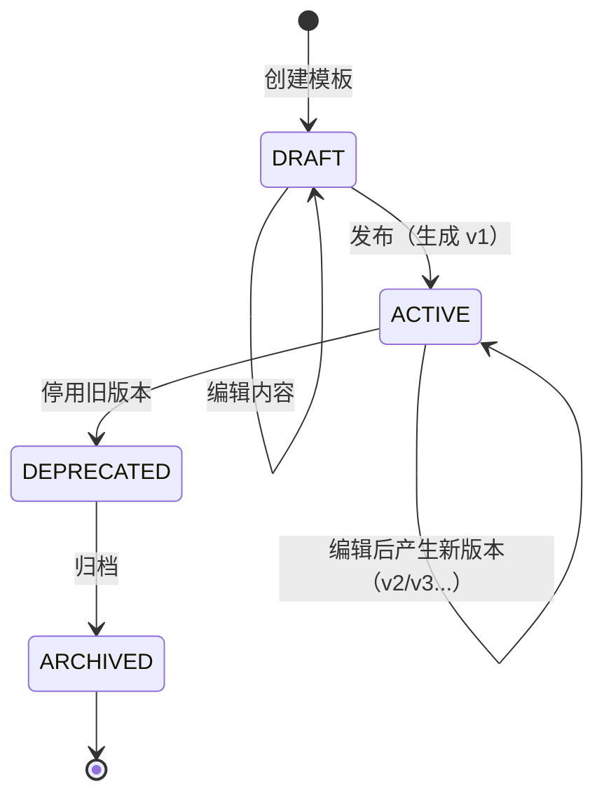
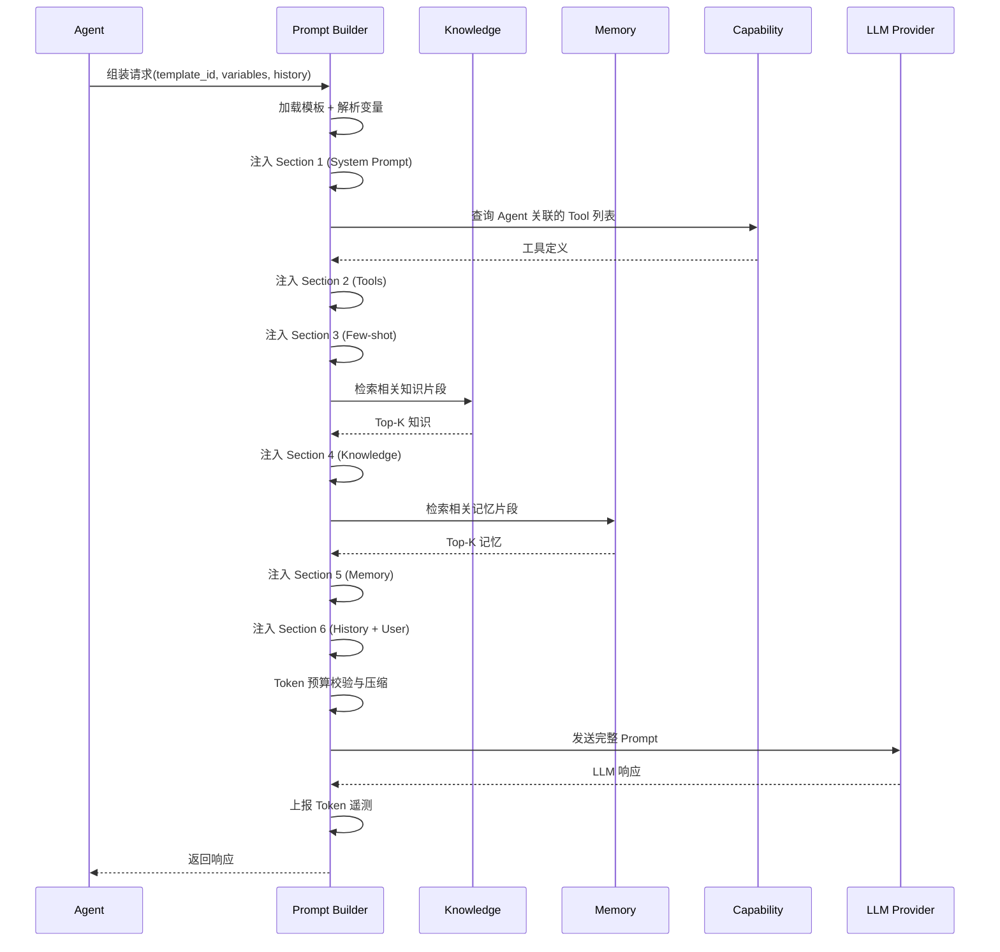
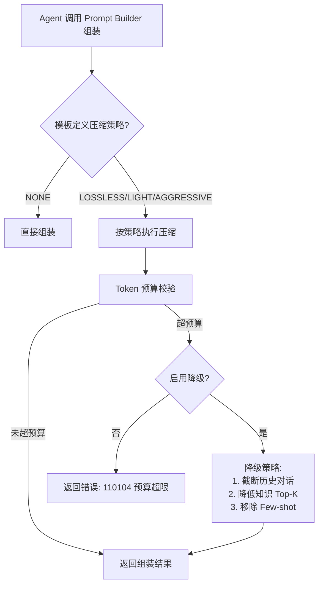
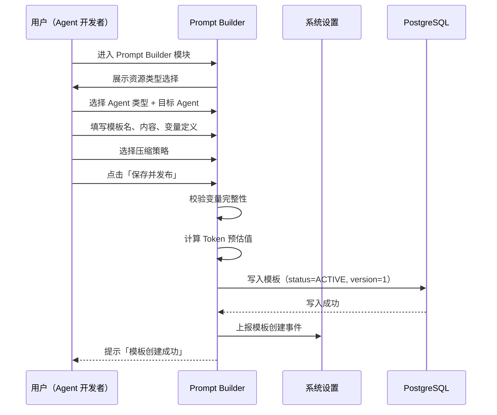
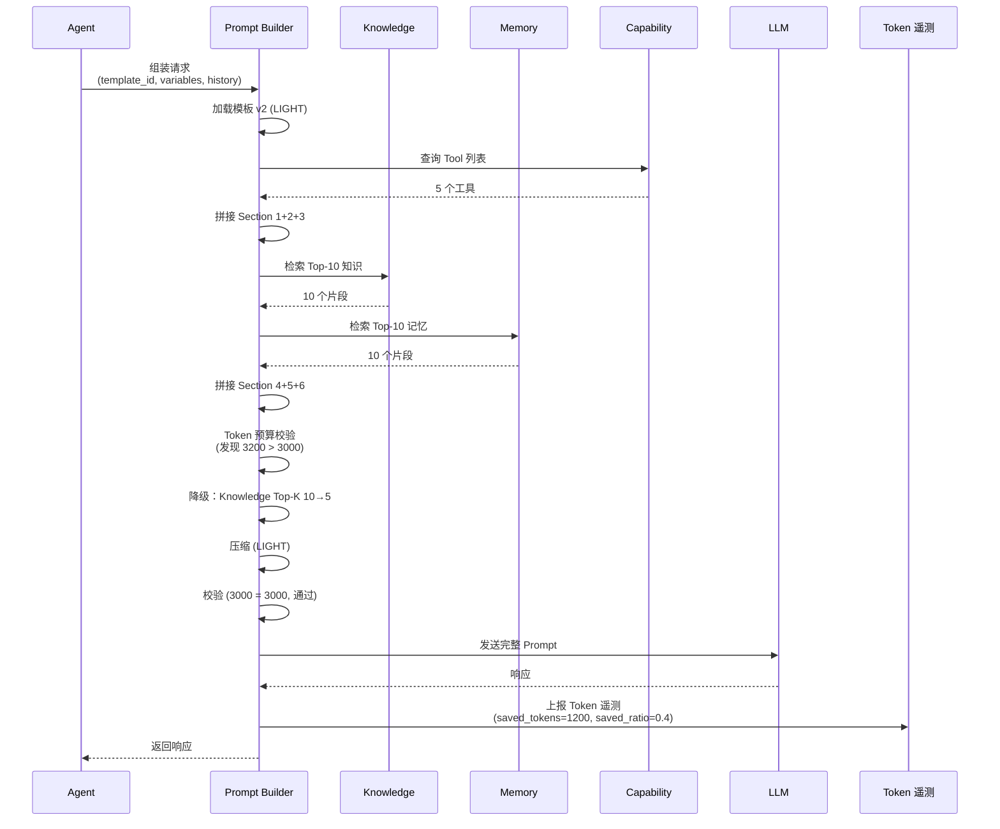
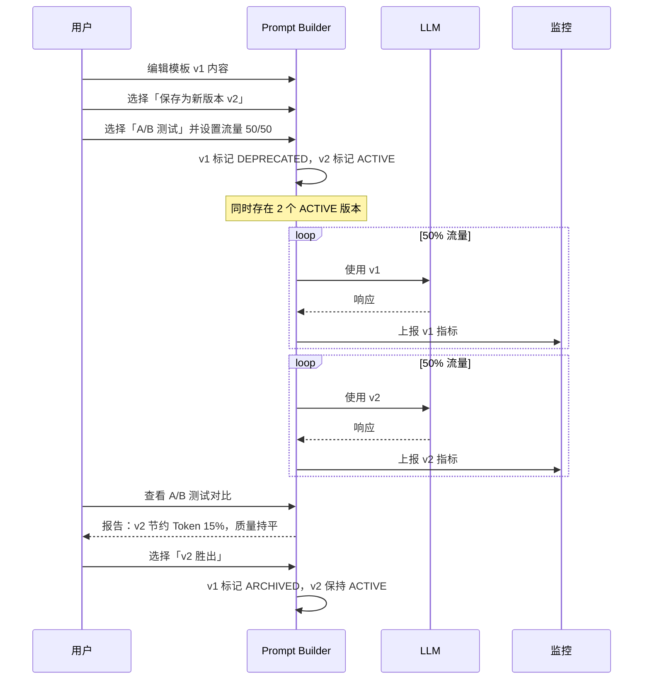
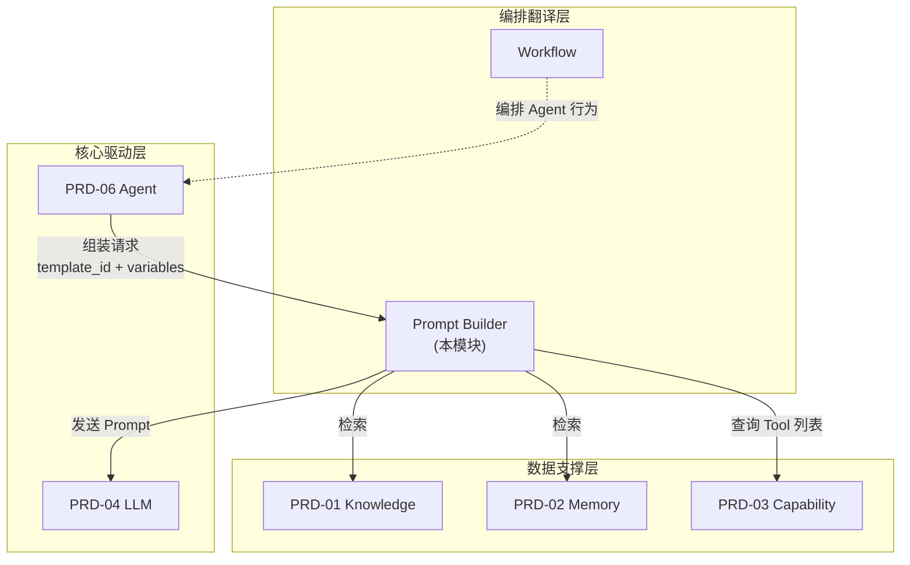
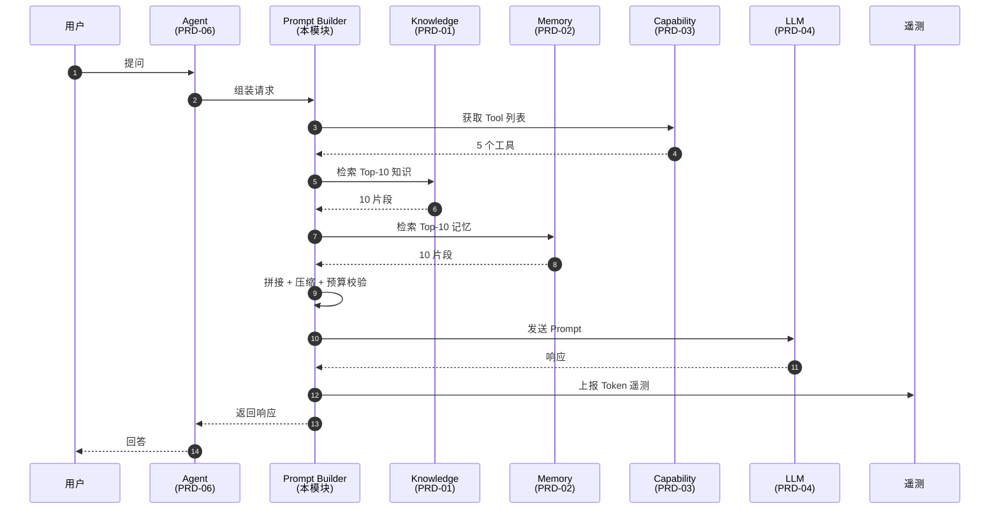

# PRD-10 Prompt Builder 提示词构建器

> **版本**: V3.0（v3.0 收束版 2026-06-13）
> **v3.0 变更说明**:错误码段位在 110001-110999 之上增补 1101xx-1110xx 10 个子段位（TEMPLATE/VARIABLE/COMPRESSION/AB_TEST/LINEAGE/TELEMETRY/LOCK/CHAIN/REGISTRY/MIGRATION，详见 PRD-00 §5.3.2.1.1）；文档头刷新为 V3.0
> **职责声明(2026-06-09 收束)**:本模块聚焦「提示词工程」- 模板 / 变量插值 / Token 预算 / 压缩 / A-B 测试 / 模板血缘 / 效果监控
>
> **遵循规范**:[PRD-00 平台总览与全局规范](file:///Users/Garabateador/Workspace/banyan/PRD/PRD-00-平台总览与全局规范.md) - 接口规范(§4)、错误码(§5)、非功能需求(§6)、数据规范(§7)、安全基线(§9)
>
> **上游依赖**:PRD-04 LLM
> **下游被依赖**:PRD-06 智能体、PRD-03 能力
> **错误码命名空间**：`BIZ_PROMPT_*` | 数字段位：`110001-110999`
> **对外接口**：GraphQL 单总线（POST /graphql），详见 §A5 GraphQL Schema 映射

## 1. 文档信息

| 项目 | 内容 |
|------|------|
| 文档版本 | V3.0(2026-06-13 v3.0收束) |
| 创建日期 | 2026-06-09 |
| 最后更新 | 2026-06-13 |
| 模块名称 | Prompt Builder（提示词构建器） |
| 所属产品 | AI Multi-Agent System |
| 文档状态 | 收束重构中 |
| 编写人 | 产品团队 |
| 上游文档 | [AI智能体架构核心术语定义与协作关系图谱](../AI智能体架构核心术语定义与协作关系图谱.md) |
| 关联 PRD | [PRD-00 平台总览](PRD-00-平台总览与全局规范.md)、[PRD-04 大语言模型](PRD-04-大语言模型.md)、[PRD-06 智能体管理](PRD-06-智能体管理.md) |
| **全局规范引用** | 接口→PRD-00 §4;错误码→PRD-00 §5;NFR→PRD-00 §6;数据→PRD-00 §7;安全→PRD-00 §9 |

---

## 2. 术语定义

本章定义与 Prompt Builder 模块紧密相关的核心术语，所有定义严格对齐《AI智能体架构核心术语定义与协作关系图谱》§1。

> **[TBD-产品决策]** 本模块的术语定义需与 PRD-12 权限管理模块的术语对照表保持一致。依据：PRD-12 §17.1 定义了平台统一的术语体系，各子模块应引用或扩展而非重新定义。

| 术语 | 定义 |
|------|------|
| **Prompt Builder（PB / 提示词构建器）** | 在 Agent 与 LLM 之间的中间层服务，**统一**负责提示词模板的版本化管理、变量插值、动态组装、Token 预算控制、压缩与精简、向量化重排与语义缓存预检。其核心价值在于**降低 Agent→LLM 通信中的 Token 消耗、规范化系统提示词结构、提升多租户多模型场景下的可观测性与可调试性** |
| **System Prompt（系统提示词）** | 由 Prompt Builder 管理的、用于约束 LLM 行为与角色定位的结构化文本片段，可关联到 Agent、Capability、Orchestration 三类资源 |
| **Prompt Template（提示词模板）** | 包含静态文本与 `{{variable}}` 占位符的可复用提示词骨架，由模板名 + 版本号唯一标识 |
| **Template Variable（模板变量）** | 模板中的 `{{name}}` 占位符，运行时由变量解析器注入实际值（如 `{{user_name}}`、`{{today}}`） |
| **Prompt Composition（提示词组装）** | 将多个子片段（角色定义、上下文、约束、用户问题、工具说明）按既定顺序拼接为完整 Prompt 的过程 |
| **Prompt Compression（提示词压缩）** | 通过冗余去除、引用化（用 ID 替代长文本）、结构化、Token 化（高频词替换）等手段降低 Token 消耗的有损/无损压缩技术 |
| **Token Budget（Token 预算）** | 单次 LLM 调用允许使用的最大 Token 数，由 Prompt Builder 根据目标模型的 `Max Context` 与 `Reserved Output` 计算得出 |
| **Context Window Manager（上下文窗口管理器）** | Prompt Builder 的内部组件，负责历史对话截断、记忆摘要、工具结果折叠，确保 `System + User + Tools + History + Output` 总 Token 不超预算 |
| **Prompt Caching（提示词缓存）** | 对已计算过的稳定前缀（如 System Prompt、工具描述）启用 LLM Provider 提供的缓存机制（如 Anthropic Prompt Caching、OpenAI 缓存层），降低重复调用成本 |
| **Prompt Registry（提示词注册表）** | Prompt Builder 的元数据中心，存储模板 ID、版本、归属资源、变量定义、Token 计量、调用统计 |
| **Token Telemetry（Token 遥测）** | 每次 LLM 调用由 Prompt Builder 上报的结构化指标，包括 prompt_tokens、completion_tokens、cache_hit_tokens、saved_tokens |

---

## 2.1 用户角色定义

> 本节定义 Prompt Builder 模块涉及的所有用户角色及其职责。遵循 PRD-12 §1.5 规范，角色标识格式为 `{角色域}:{角色名称}`。

### 2.1.1 角色列表

| 角色 | 标识 | 职责 | 关联 PRD-12 角色 |
|------|------|------|------------------|
| **平台超级管理员** | `platform:super_admin` | 跨租户模板管理、模板配额配置、压缩策略全局配置 | PRD-12 `platform:super_admin` |
| **平台系统管理员** | `platform:system_admin` | 本租户模板管理、Token 配额管理 | PRD-12 `platform:system_admin` |
| **平台安全管理员** | `platform:security_admin` | 模板安全审核、敏感信息检测 | PRD-12 `platform:security_admin` |
| **平台审计管理员** | `platform:audit_admin` | 查看审计日志、模板变更记录 | PRD-12 `platform:audit_admin` |
| **平台运营人员** | `platform:operator` | 查看 Token 遥测、监控仪表盘 | PRD-12 业务角色 |
| **平台审计员** | `platform:auditor` | 审计日志查询、合规追溯（只读） | PRD-12 业务角色 |
| **商户管理员** | `merchant:merchant_admin` | 商户内模板全生命周期管理 | PRD-12 `merchant:merchant_admin` |
| **商户成员** | `merchant:merchant_member` | 商户内模板只读 + 受限编辑 | PRD-12 `merchant:merchant_member` |
| **Agent 开发者** | `agent:agent_developer` | 创建/编辑/发布自己所属 Agent 的模板 | PRD-12 业务角色 |

### 2.1.2 角色权限说明

| 权限 | 说明 | Agent 开发者 | 平台运营人员 | 平台审计管理员 |
|------|------|:---:|:---:|:---:|
| `prompt_builder:templates:list` | 列出模板 | ✅ | ❌ | ✅（只读） |
| `prompt_builder:templates:read` | 查看模板详情 | ✅ | ❌ | ✅（只读） |
| `prompt_builder:templates:create` | 创建模板 | ✅ | ❌ | ❌ |
| `prompt_builder:templates:edit` | 编辑模板 | ✅（仅自己创建的） | ❌ | ❌ |
| `prompt_builder:templates:delete` | 删除模板 | ✅（仅自己创建的） | ❌ | ❌ |
| `prompt_builder:templates:publish` | 发布/回滚版本 | ✅ | ❌ | ❌ |
| `prompt_builder:telemetry:view` | 查看 Token 遥测 | ✅ | ✅ | ✅ |
| `prompt_builder:audit:read` | 查看审计日志 | ❌ | ❌ | ✅ |

---

## 3. 业务背景与目标

### 3.1 业务背景

在 Banyan AI Multi-Agent System 中，Agent 调用 LLM 的频率极高，单次请求往往涉及：

- 复杂的 System Prompt（Agent 能力描述 + 工具列表 + Few-shot 示例）
- 多轮对话历史
- 工具调用结果
- 记忆检索片段
- 知识检索片段
- 用户当前问题

**痛点**：

1. **Token 浪费严重**：90% 以上的 System Prompt 文本在多次调用中保持不变，但每次调用都重新发送
2. **系统提示词缺乏统一管理**：Agent、Capability、Orchestration 三类资源的 System Prompt 散落在各自的配置中，难以统一优化、版本化与 A/B 测试
3. **压缩能力缺失**：不同 LLM 模型对 System Prompt 长度的容忍度不同，但当前缺乏动态压缩能力
4. **Token 超限风险**：Max Context 限制下，缺乏统一的 Token 预算管理与窗口控制
5. **可观测性不足**：难以回答"哪个 Agent 消耗 Token 最多"、"哪个 System Prompt 收益最大"等关键问题
6. **多租户隔离缺失**：不同租户的 System Prompt 资源配额与计费模型未明确

### 3.2 业务目标

| 目标编号 | 目标描述 | 衡量指标 |
|----------|----------|----------|
| **G-1** | **降低 Token 消耗**：通过压缩、缓存、引用化等手段，平均 Token 消耗降低 **40%~60%** | saved_tokens / total_tokens ≥ 40% |
| **G-2** | **统一 System Prompt 管理**：所有 Agent/Capability/Orchestration 的 System Prompt 必须注册到 Prompt Builder | 100% 注册覆盖率 |
| **G-3** | **可控的 Token 预算**：单次调用严格不超 Max Context，预算溢出自动降级（截断历史、压缩上下文、降低 Tool 数量） | 预算溢出率 ≤ 0.1% |
| **G-4** | **可版本化与可回滚**：每次 System Prompt 变更产生新版本，支持一键回滚与 A/B 测试 | 100% 变更留痕 |
| **G-5** | **多租户隔离与计费**：每个商户的 System Prompt 资源独立计量、超额告警、配额管控 | 商户级资源仪表盘 |
| **G-6** | **可观测性内建**：所有调用上报 Token 遥测，关联到具体模板版本与 Agent/Capability/Orchestration | 100% 调用上报 |

### 3.3 范围

**In-Scope（本次实现）**：
- 提示词模板管理（CRUD、版本化、导入导出）
- 变量插值与动态组装
- 压缩算法（去冗余、引用化、结构化）
- Token 预算与上下文窗口管理
- Agent/Capability/Orchestration 提示词精简优化
- A/B 测试与灰度发布
- Token 遥测与监控
- 缓存键管理与 LLM Provider 缓存集成

**Out-of-Scope（本次不实现）**：
- 提示词自动生成（Auto Prompt）
- 提示词安全性扫描（由 PRD-04 §23 LLM Prompt 注入防护覆盖）
- 提示词多语言翻译

### 3.4 优先级（MoSCoW）

| 优先级 | 需求 | 判定依据 |
|--------|------|----------|
| **Must have** | 模板 CRUD、变量插值、Token 预算控制、压缩基础算法、上报 Token 遥测 | 不实现则 Agent 无法调用 LLM（破坏核心链路） |
| **Should have** | 版本管理与回滚、A/B 测试、缓存键管理、Agent/Capability/Orchestration 提示词精简、多租户隔离 | 不实现则无法达成 G-1（节约 40% Token）核心目标 |
| **Could have** | 自动优化建议、可视化 Token 分布仪表盘、与 LLM Provider 缓存深度集成 | 锦上添花，二期迭代 |
| **Won't have** | Auto Prompt 自动化、提示词多语言翻译、提示词安全扫描 | 各自有专门模块/后续迭代 |

---

## 4. 功能详情

### 4.1 提示词模板管理

#### 4.1.1 功能描述

提供 System Prompt 模板的全生命周期管理：创建、编辑、版本化、导入、导出、停用。每个模板归属于某一资源（Agent / Capability / Orchestration），模板名+版本号全局唯一。

#### 4.1.1.1 用户故事

> **作为** Agent 开发者，**我想要** 创建和管理提示词模板，**以便** 为我的 Agent 配置系统提示词，实现 LLM 调用的标准化和可复用。

**前置条件**：
- 用户已登录系统，且拥有 `prompt_builder:templates:create` 权限
- 用户已选择目标资源类型（Agent / Capability / Orchestration）并指定资源 ID
- 用户已了解目标 LLM 模型的 Max Context 限制

**后置条件**：
- 模板创建成功，状态为 `DRAFT` 或 `ACTIVE`
- 模板可被指定的资源引用
- Token 预估值已计算并存储

**主流程**：
1. 用户进入 Prompt Builder 模块 → 选择资源类型（Agent/Capability/Orchestration）→ 选择目标资源
2. 填写模板名、正文（支持 `{{variable}}` 占位符）
3. 系统自动检测变量，弹出变量定义面板（自动推断类型）
4. 选择压缩策略与目标 LLM 模型
5. 点击「保存为草稿」或「保存并发布」
6. 系统计算 Token 预估值，校验是否超 Max Context
7. 模板入库，状态 `DRAFT` 或 `ACTIVE`

**分支流程**：
- B1：检测到重复模板名 → 系统提示「模板名已存在，请使用其他名称」并保留输入
- B2：模板含未声明的 `{{variable}}` → 系统提示「未声明变量 X」并阻止保存
- B3：Token 预估值 > Max Context × 80% → 系统提示「模板可能超限，建议精简」
- B4：选择「保存并发布」时已有同名 ACTIVE 版本 → 旧版本自动转 `DEPRECATED`（A/B测试模式下例外：旧ACTIVE版本不自动转DEPRECATED，而是按流量分配比例并行运行，详见 §4.6.2），新版本变 `ACTIVE`

**异常流程**：
- E1：保存失败 → 系统提示「保存失败，请稍后重试」，保留用户已填写的表单数据
- E2：并发编辑冲突 → 系统提示「该模板正在被其他用户编辑」，禁用保存按钮
- E3：变量类型不匹配（如 `{{user_age}}` 定义为 Integer 但传入 String） → 系统提示「变量 X 类型错误」

#### 4.1.2 数据字段

| 字段 | 类型 | 必填 | 说明 |
|------|------|------|------|
| template_id | VARCHAR(64) | 是 | 模板唯一 ID（UUID 以 36 字符字符串形式存储，与 §A3 id 规范对齐） |
| template_name | String(128) | 是 | 模板名称，全局唯一 |
| version | Integer | 是 | 版本号，从 1 开始递增 |
| resource_type | Enum | 是 | `AGENT` / `CAPABILITY` / `ORCHESTRATION` |
| resource_id | VARCHAR(64) | 是 | 关联资源 ID（字符串 ID） |
| content | Text | 是 | 模板正文（包含 `{{variable}}` 占位符） |
| variables | JSONB | 否 | 变量定义 `{name, type, required, defaultValue, description}`;`defaultValue` 可选,未提供时调用方必须传值 |
| token_estimate | Integer | 否 | 预估值（创建时自动计算） |
| compression_strategy | Enum | 否 | `NONE` / `LOSSLESS` / `LIGHT` / `AGGRESSIVE` |
| status | Enum | 是 | `DRAFT` / `ACTIVE` / `DEPRECATED` / `ARCHIVED` |
| created_by | UUID | 是 | 创建人用户ID |
| created_at | Timestamp | 是 | 创建时间 |
| updated_at | Timestamp | 是 | 更新时间 |

#### 4.1.3 业务流程

> **本节聚焦于状态机与跨状态流转**, 主流程 / 分支流程 / 异常流程的完整定义以 §4.1.1.1 用户故事为单一权威源, 详见 §4.1.1.1。

**主流程（创建模板）**：详见 §4.1.1.1 主流程步骤 1-7。



**分支流程 / 异常流程**：详见 §4.1.1.1 分支流程 B1-B4 与异常流程 E1-E3。

#### 4.1.4 验收标准

| 编号 | 标准 |
|------|------|
| AC-PB-4.1-01 | 创建模板时必须选择资源类型和资源 ID |
| AC-PB-4.1-02 | 模板名+版本号全局唯一，重复名保存时拒绝 |
| AC-PB-4.1-03 | 模板含 `{{variable}}` 时必须声明变量定义 |
| AC-PB-4.1-04 | 「保存并发布」自动使旧 ACTIVE 版本 `DEPRECATED` |
| AC-PB-4.1-05 | 状态为 `ARCHIVED` 的模板不可编辑但可查看历史 |
| AC-PB-4.1-06 | 模板导入支持 JSON / YAML 格式 |

### 4.2 提示词变量插值与组装

#### 4.2.1 功能描述

Prompt Builder 接收 Agent 提交的 `组装请求`（含模板 ID、变量值、上下文片段），按照既定组装策略拼接为完整 Prompt。

#### 4.2.2 组装策略

完整 Prompt 由 6 个区段（Section）按以下顺序拼接：

```
┌────────────────────────────────────────────────────┐
│ Section 1: System Prefix（角色与基础规则）          │
│   - 来源：模板 System Prompt                       │
│   - 缓存：是（LLM Provider Prompt Caching）        │
├────────────────────────────────────────────────────┤
│ Section 2: Tool Description（工具说明）            │
│   - 来源：Agent 关联的 Capability 工具定义          │
│   - 缓存：是（变更频率低）                          │
├────────────────────────────────────────────────────┤
│ Section 3: Few-shot Examples（示例，可选）         │
│   - 来源：模板中显式定义                           │
│   - 缓存：是                                       │
├────────────────────────────────────────────────────┤
│ Section 4: Knowledge Context（知识检索片段）       │
│   - 来源：PRD-01 Knowledge 检索结果                │
│   - 缓存：否（按需检索）                           │
├────────────────────────────────────────────────────┤
│ Section 5: Memory Context（记忆检索片段）          │
│   - 来源：PRD-02 Memory 检索结果                   │
│   - 缓存：否（按需检索）                           │
├────────────────────────────────────────────────────┤
│ Section 6: Conversation History + User Input      │
│   - 来源：对话历史 + 当前问题                      │
│   - 缓存：否                                       │
└────────────────────────────────────────────────────┘
```

#### 4.2.3 组装流程



#### 4.2.4 验收标准

| 编号 | 标准 |
|------|------|
| AC-PB-4.2-01 | 6 个区段必须按既定顺序拼接，不可乱序 |
| AC-PB-4.2-02 | Section 1/2/3 必须标记为可缓存，供 LLM Provider 缓存 |
| AC-PB-4.2-03 | 变量未提供且未声明默认值时，拒绝组装并返回 `BIZ_PROMPT_VARIABLE_MISSING` 错误 |
| AC-PB-4.2-04 | 变量类型与定义不匹配时拒绝组装并返回 `110103` 错误 |
| AC-PB-4.2-05 | 组装耗时 P95 ≤ 200ms（不含 Knowledge/Memory 检索） |
| AC-PB-4.2-06 | 变量有默认值时调用方未传值, 组装使用默认值且不上报错误 |
| AC-PB-4.2-07 | 租户级变量 (tenant_* 命名空间) 由 PB 自动注入不计入必填校验 |

#### 4.2.5 变量解析规则

| 场景 | 行为 | 错误码 |
|------|------|--------|
| 变量已定义 + 必填 + 有传值 | 使用传值 | - |
| 变量已定义 + 必填 + 未传值 + 有默认值 | 使用默认值(不报错) | - |
| 变量已定义 + 必填 + 未传值 + 无默认值 | 拒绝组装 | BIZ_PROMPT_VARIABLE_MISSING |
| 变量已定义 + 必填 + 传值类型不匹配 | 拒绝组装 | BIZ_PROMPT_VARIABLE_TYPE_MISMATCH |
| 变量未定义 + 有传值 | 静默使用传值(不写入变量定义) | - |
| 模板含 {{xxx}} 但未在 variables 中声明 | 拒绝组装(保存时拦截,运行时兜底) | BIZ_PROMPT_VARIABLE_UNDEFINED |
| 租户级变量 (tenant_* 命名空间) | PB 自动注入, 不计入必填校验 | - |

### 4.3 提示词压缩与优化（核心能力）

#### 4.3.1 压缩策略枚举

| 策略 | 说明 | Token 节约率 | 适用场景 |
|------|------|--------------|----------|
| `NONE` | 不压缩 | 0% | 调试阶段 / 高质量要求 |
| `LOSSLESS` | 无损压缩：去重、空白归一、Markdown 精简、引用化 | 10-20% | 默认策略 |
| `LIGHT` | 轻度有损：去除礼貌用语、合并相似陈述、缩写高频词 | 20-35% | 中等质量要求 |
| `AGGRESSIVE` | 激进有损：摘要 Few-shot、移除示例、引用化为 ID | 35-50% | 高 Token 消耗场景 / 大上下文 |

#### 4.3.2 压缩算法

**LOSSLESS 算法**：
- 去重：连续换行归一为单个、连续空格归一为单个
- 空白剥离：行首尾空白
- Markdown 精简：去除 `#` 标题符号、合并相邻列表项
- 引用化：将长文本替换为 `<ref id="N">` + 末尾 reference 表

**LIGHT 算法（在 LOSSLESS 基础上）**：
- 去除礼貌用语（「请」「谢谢」等）
- 合并相似陈述
- 缩写高频词映射（如 "as soon as possible" → "ASAP"）

**AGGRESSIVE 算法（在 LIGHT 基础上）**：
- Few-shot 摘要：保留 1 个示例，其余移除
- 工具描述合并：相似工具合并描述
- 知识片段截断：Top-K 降至 Top-3

#### 4.3.3 压缩质量保障

| 保障措施 | 说明 |
|----------|------|
| 压缩前后对比 | 保留原文，运行时可切换对比 |
| 关键指令豁免 | 安全约束、角色定义等豁免压缩 |
| LLM 输出质量监控 | 命中率与准确率下降 > 5% 时自动降级到 LOSSLESS |
| A/B 测试 | 同一资源可对比不同压缩策略的效果 |

#### 4.3.4 业务流程（压缩触发）



#### 4.3.5 验收标准

| 编号 | 标准 |
|------|------|
| AC-PB-4.3-01 | LOSSLESS 策略必须可逆，存储压缩前原文 |
| AC-PB-4.3-02 | AGGRESSIVE 策略下，Few-shot 必须可配置保留数量（默认 1） |
| AC-PB-4.3-03 | 压缩耗时 P95 ≤ 100ms |
| AC-PB-4.3-04 | 关键指令（角色定义、安全约束）必须在压缩豁免列表中 |
| AC-PB-4.3-05 | A/B 测试期间同一资源可并行运行不同压缩策略 |

### 4.4 Token 预算与上下文窗口管理

#### 4.4.1 预算计算公式

```python
total_budget = model.max_context
reserved_output = min(max_output_tokens, 4096)  # 用户可配置
reserved_tools = sum(tool.token_estimate for tool in selected_tools)
available_for_prompt = total_budget - reserved_output - reserved_tools

# 各 Section 配额
system_quota = available_for_prompt * 0.20      # 20% 给 System
context_quota = available_for_prompt * 0.50    # 50% 给 Knowledge + Memory
history_quota = available_for_prompt * 0.25    # 25% 给历史对话
user_quota = available_for_prompt * 0.05       # 5% 给用户当前问题（兜底）
```

#### 4.4.2 降级策略（按优先级）

1. **截断历史对话**：保留最近 N 轮（默认 10 轮），最早的消息折叠为「... 之前的 N 条消息已省略 ...」
2. **降低 Knowledge Top-K**：从 10 降至 5 降至 3
3. **降低 Memory Top-K**：从 10 降至 5
4. **移除 Few-shot 示例**：全部移除
5. **压缩知识片段**：仅保留标题与首句
6. **强制压缩 System Prompt**：升级到 `AGGRESSIVE`

#### 4.4.3 验收标准

| 编号 | 标准 |
|------|------|
| AC-PB-4.4-01 | 任何 Section 超出配额时按降级策略执行，不可直接报错 |
| AC-PB-4.4-02 | 降级日志必须记录到 Token 遥测中 |
| AC-PB-4.4-03 | 预算计算必须在组装开始前完成（早失败） |
| AC-PB-4.4-04 | 用户可自定义 Section 配额比例（在系统设置模块） |

### 4.5 Agent/Capability/Orchestration 提示词精简能力

#### 4.5.1 Agent 提示词精简

| 维度 | 精简策略 |
|------|----------|
| 能力描述精简 | 当 `capability_description` 长度 > 500 Token 时，Prompt Builder 自动摘要，保留核心能力点 |
| Tool 列表精简 | 按使用频率排序，仅展示 Top-N（默认 10）个 Tool |
| 记忆摘要 | 长期记忆自动摘要为短句 |

#### 4.5.2 Capability 提示词精简

| 维度 | 精简策略 |
|------|----------|
| 工具描述精简 | 合并相似工具，公共参数（API Key、Auth）抽取为全局上下文 |
| 参数 Schema 精简 | 自动剔除必填且高频的参数，保留选填与低频参数 |

#### 4.5.3 Orchestration 提示词精简

| 维度 | 精简策略 |
|------|----------|
| 节点描述精简 | 流程图中节点描述自动归一化 |
| 依赖关系精简 | 跨节点引用通过 ID 替代完整路径 |
| 子 Agent 描述精简 | 仅展示子 Agent 名称与能力标签，不展示完整 System Prompt |

#### 4.5.4 精简能力配置

在模板编辑器中提供「精简配置」面板：

```json
{
  "compression_strategy": "LIGHT",
  "max_capability_tokens": 500,
  "max_tool_count": 10,
  "summarize_memory": true,
  "summarize_long_history": true,
  "history_max_turns": 10,
  "knowledge_top_k": 10,
  "memory_top_k": 10
}
```

#### 4.5.5 验收标准

| 编号 | 标准 |
|------|------|
| AC-PB-4.5-01 | Agent 提示词中 capability_description > 500 Token 时自动摘要 |
| AC-PB-4.5-02 | Tool 列表按使用频率降序排列，超出 max_tool_count 时截断 |
| AC-PB-4.5-03 | Orchestration 节点描述超过 100 Token 时自动归一化 |
| AC-PB-4.5-04 | 精简策略可被模板级别覆盖 |

### 4.6 提示词版本管理与 A/B 测试

#### 4.6.1 版本管理

- 每次「保存并发布」产生新版本（v1 → v2 → v3...）
- 历史版本永久保留（软删除，status=ARCHIVED）
- 任意版本可回滚（仅需将该版本 `status` 改为 `ACTIVE`）
- 版本对比：可视化展示两版本 diff

#### 4.6.2 A/B 测试

- 同一资源可同时存在 2 个 ACTIVE 版本（仅 A/B 测试期间）
- 流量分配：百分比（如 50/50、80/20）
- 关键指标对比：Token 消耗、响应质量、用户满意度
- 测试结束：胜出版本保留，败出版本 `DEPRECATED`

#### 4.6.3 灰度发布

- 新版本上线先 5% 流量
- 监控 30 分钟，自动评估：
  - 错误率不上升
  - Token 消耗在 ±10% 内
  - 用户反馈（点赞率）不下降
- 评估通过：自动提升至 25% → 50% → 100%
- 评估失败：自动回滚到上一版本

#### 4.6.4 验收标准

| 编号 | 标准 |
|------|------|
| AC-PB-4.6-01 | 任意历史版本可一键回滚为 ACTIVE |
| AC-PB-4.6-02 | 版本对比支持字符级 diff 和语义级 diff |
| AC-PB-4.6-03 | A/B 测试期间两个版本并行运行，流量按配置分配 |
| AC-PB-4.6-04 | 灰度发布自动评估，失败自动回滚 |
| AC-PB-4.6-05 | 编辑锁 30 分钟过期后自动释放, 第二个用户可正常编辑 |
| AC-PB-4.6-06 | 管理员可强制解锁, 被强制方下次保存返回 BIZ_PROMPT_LOCK_FORCE_RELEASED |

### 4.7 模板血缘与影响分析

#### 4.7.1 血缘追踪

追踪每个模板的：
- 创建人、修改人、修改时间
- 被哪些 Agent/Capability/Orchestration 引用
- 引用的版本分布（v1 引用数 / v2 引用数）

#### 4.7.2 影响分析

当模板被修改时，Prompt Builder 分析：
- 影响范围：哪些 Agent/Capability/Orchestration 受到影响
- 风险评估：是否涉及关键安全约束
- 推荐操作：建议全量发布 / 灰度发布 / 仅某租户发布

#### 4.7.3 验收标准

| 编号 | 标准 |
|------|------|
| AC-PB-4.7-01 | 模板详情页展示血缘图（被引用的资源列表） |
| AC-PB-4.7-02 | 修改模板时弹出影响分析报告 |
| AC-PB-4.7-03 | 影响分析必须在 1 秒内返回 |

### 4.8 提示词效果监控

#### 4.8.1 Token 遥测

每次 LLM 调用上报：

```json
{
  "trace_id": "uuid",
  "partition_key": "uuid",
  "resource_type": "AGENT",
  "resource_id": "uuid",
  "template_id": "uuid",
  "template_version": 2,
  "compression_strategy": "LIGHT",
  "section_tokens": {
    "system": 350,
    "tools": 200,
    "few_shot": 0,
    "knowledge": 800,
    "memory": 300,
    "history": 600,
    "user_input": 50
  },
  "prompt_tokens": 2300,
  "completion_tokens": 280,
  "cache_hit_tokens": 550,
  "saved_tokens": 1200,
  "saved_ratio": 0.343,
  "model_id": "uuid",
  "is_degraded": false,
  "degradation_steps": [],
  "duration_ms": 850
}
```

#### 4.8.2 关键监控指标

| 指标 | 计算公式 | 告警阈值 |
|------|----------|----------|
| 平均 Token 消耗 | avg(prompt_tokens) | 上升 > 20% 触发告警 |
| Token 节约率 | sum(saved_tokens) / sum(prompt_tokens) | 下降 < 30% 触发告警 |
| 预算溢出率 | count(degraded=true) / count(total) | > 0.1% 触发警告，> 0.5% 触发严重告警 |
| 压缩耗时 | avg(compression_duration_ms) | P95 > 100ms 触发告警 |
| 缓存命中率 | sum(cache_hit_tokens) / sum(prompt_tokens) | < 30% 触发告警 |

#### 4.8.3 验收标准

| 编号 | 标准 |
|------|------|
| AC-PB-4.8-01 | 100% 调用上报 Token 遥测，缺失率 = 0% |
| AC-PB-4.8-02 | 遥测数据保留 ≥ 90 天 |
| AC-PB-4.8-03 | 监控指标可在系统设置模块的仪表盘查看 |
| AC-PB-4.8-04 | 告警通过钉钉/飞书/邮件/短信通道发送 |

---

## 5. 业务流程

### 5.1 模板创建流程（主流程）



### 5.2 提示词压缩与下发流程（核心流程）



### 5.3 模板更新与 A/B 测试流程



### 5.4 异常流程

| 异常 | 触发条件 | 处理 |
|------|----------|------|
| E1：模板不存在 | template_id 无效 | 返回 110100，组装失败 |
| E2：变量未提供 | 必填变量未传且无默认值 | 拒绝组装并返回 `BIZ_PROMPT_VARIABLE_MISSING`; 调用方可重新组装并提供变量值 |
| E3：变量类型不匹配 | 实际类型与定义不符 | 返回 110103 |
| E4：Token 预算严重超限 | 总 Token > Max Context × 120% | 返回 110104，降级无效 |
| E5：LLM 调用失败 | 转发给 LLM 时失败 | 返回原始错误，Prompt Builder 不做重试 |
| E6：Token 遥测上报失败 | 遥测服务不可用 | 本地缓存后异步重试，不影响主流程 |
| E7：A/B 测试配置冲突 | 流量总和不等于 100% | 返回 110107 |

---

## 6. 业务规则

> **BR编号迁移声明**：本节业务规则编号已迁移为 `BR-10-{3位}` 三段式格式（原旧版子域前缀 BR-PB-* 已全部替换）。

| 编号 | 规则 | 说明 |
|------|------|------|
| BR-10-001 | 模板归属唯一性 | 一个资源在同一时间最多有 1 个 ACTIVE 版本（A/B 测试期间除外） |
| BR-10-002 | 变量必填校验 | 模板中所有 `{{variable}}` 必须在变量定义中声明 |
| BR-10-003 | 压缩可逆性 | LOSSLESS 压缩必须可还原为原文，存储压缩前原文 |
| BR-10-004 | 关键指令豁免 | 角色定义、安全约束、输出格式要求必须豁免压缩 |
| BR-10-005 | 降级日志必报 | 任何预算降级必须记录到 Token 遥测 `degradation_steps` |
| BR-10-006 | 模板版本不删除 | 所有历史版本永久保留（软删除） |
| BR-10-007 | 多租户隔离 | 模板按 `partition_key` 隔离，跨租户访问需 RBAC 权限 |
| BR-10-008 | 灰度自动评估 | 灰度发布评估三段式规则：Token 消耗在 ±10% 内自动通过；±10%-20% 延长观察期（增加一倍灰度流量和时长）；±20% 外自动回滚 |
| BR-10-009 | 配额管控 | 每商户每月 Token 消耗上限由系统设置配置，超额告警 |
| BR-10-010 | Prompt Caching 优先 | Section 1/2/3 必须启用 LLM Provider 提供的 Prompt Caching |
| BR-10-011 | 删除前置检查 | 模板删除前必须确认无活跃引用，否则阻止 |
| BR-10-012 | 编辑锁定 | 编辑锁定 30 分钟; 用户主动保存/取消时立即释放; 锁持有期间每 5 分钟心跳续期 1 次(最多续期 2 次); 心跳超时或浏览器崩溃依赖 Redis TTL 自动过期; 管理员可强制解锁(`prompt_builder:templates:force_unlock` 权限) |
| BR-10-013 | 命名规范 | 模板名遵循 `^[a-z][a-z0-9_]{2,127}$` |
| BR-10-014 | 内容长度 | 模板正文 ≤ 32KB（约 8000 中文字符 / 16000 Token） |
| BR-10-015 | 导出格式 | 支持 JSON / YAML 导出，导入时校验 schema |

---

## 7. 权限矩阵

权限标识遵循 PRD-00 §11.2 统一规范：`{module}:{resource}:{action}` 三段式。

| 权限标识 | 描述 | platform:super_admin | platform:system_admin | platform:security_admin | platform:audit_admin | platform:operator | platform:auditor | merchant:merchant_admin | merchant:merchant_member | agent:agent_developer |
|----------|------|:---:|:---:|:---:|:---:|:---:|:---:|:---:|:---:|:---:|
| `prompt_builder:templates:list` | 列出模板 | ✅ | ✅ | ❌ | ✅（只读） | ❌ | ✅（只读） | ✅ | ✅（只读） | ✅ |
| `prompt_builder:templates:read` | 查看模板详情 | ✅ | ✅ | ❌ | ✅（只读） | ❌ | ✅（只读） | ✅ | ✅（只读） | ✅ |
| `prompt_builder:templates:create` | 创建模板 | ✅ | ✅ | ❌ | ❌ | ❌ | ❌ | ✅ | ❌ | ✅ |
| `prompt_builder:templates:edit` | 编辑模板 | ✅ | ✅ | ❌ | ❌ | ❌ | ❌ | ✅ | ✅（仅自己创建的） | ✅（仅自己创建的） |
| `prompt_builder:templates:delete` | 删除模板 | ✅ | ✅ | ❌ | ❌ | ❌ | ❌ | ✅ | ❌ | ✅（仅自己创建的） |
| `prompt_builder:templates:publish` | 发布/回滚版本 | ✅ | ✅ | ❌ | ❌ | ❌ | ❌ | ✅ | ❌ | ✅ |
| `prompt_builder:templates:ab_test` | 创建 A/B 测试 | ✅ | ✅ | ❌ | ❌ | ❌ | ❌ | ✅ | ❌ | ✅ |
| `prompt_builder:templates:force_unlock` | 强制解锁编辑锁 | ✅ | ❌ | ❌ | ❌ | ❌ | ❌ | ❌ | ❌ | ❌ |
| `prompt_builder:telemetry:view` | 查看 Token 遥测 | ✅ | ✅ | ❌ | ✅ | ✅ | ✅ | ✅ | ❌ | ✅ |
| `prompt_builder:telemetry:export` | 导出 Token 遥测 | ✅ | ✅ | ❌ | ✅ | ❌ | ✅ | ✅ | ❌ | ❌ |
| `prompt_builder:variables:manage` | 管理系统级变量 | ✅ | ✅ | ❌ | ❌ | ❌ | ❌ | ❌ | ❌ | ❌ |
| `prompt_builder:cache:manage` | 管理缓存键 | ✅ | ✅ | ❌ | ❌ | ❌ | ❌ | ❌ | ❌ | ❌ |
| `prompt_builder:audit:read` | 查看审计日志 | ✅ | ✅ | ✅ | ✅ | ❌ | ✅ | ❌ | ❌ | ❌ |

**多租户隔离**：
- `merchant:merchant_admin` / `merchant:merchant_member` / `agent:agent_developer` / `platform:operator` / `platform:auditor` 仅可访问所属租户的模板
- `platform:super_admin` / `platform:system_admin` / `platform:audit_admin` 可跨租户访问（需审计）

> **角色定义详见 §2.1**。

---

## 8. 数据模型

### 8.1 PostgreSQL 数据模型

```sql
-- Trigger: Auto-fill partition_key from session variable (app.current_tenant_id)
-- This trigger is the foundation of the composite primary key (partition_key, id) for tenant isolation.
-- All tenant_prompt_* tables must bind this trigger on BEFORE INSERT.
CREATE OR REPLACE FUNCTION set_partition_key_from_session()
RETURNS TRIGGER AS $$
BEGIN
  IF NEW.partition_key IS NULL THEN
    NEW.partition_key := current_setting('app.current_tenant_id', true);
  END IF;
  RETURN NEW;
END;
$$ LANGUAGE plpgsql;

-- 模板主表（SilvaEngine V2.0 重构：复合主键 (partition_key, id) + RLS）
CREATE TABLE tenant_prompt_template (
  partition_key      VARCHAR(64) NOT NULL,
  id                 VARCHAR(64)   NOT NULL,
  tenant_id          UUID         NOT NULL GENERATED ALWAYS AS (partition_key::uuid) STORED,  -- Derived from partition_key, required by multi-tenant middleware
  template_name      VARCHAR(128) NOT NULL,
  version            INTEGER      NOT NULL DEFAULT 1,
  resource_type      VARCHAR(32)  NOT NULL,  -- AGENT/CAPABILITY/ORCHESTRATION
  resource_id        VARCHAR(64)   NOT NULL,
  content            TEXT         NOT NULL,
  variables          JSONB        NOT NULL DEFAULT '[]',
  token_estimate     INTEGER      NOT NULL DEFAULT 0,
  compression_strategy VARCHAR(16) NOT NULL DEFAULT 'LOSSLESS',
  status             VARCHAR(16)  NOT NULL DEFAULT 'DRAFT',  -- DRAFT/ACTIVE/DEPRECATED/ARCHIVED
  ab_test_group      VARCHAR(16),  -- A/B testing in use
  created_by         UUID          NOT NULL,
  created_at         TIMESTAMPTZ    NOT NULL DEFAULT NOW(),
  updated_at         TIMESTAMPTZ    NOT NULL DEFAULT NOW(),
  PRIMARY KEY (partition_key, id),
  UNIQUE (partition_key, template_name, version)
);

-- Bind auto-injection trigger
CREATE TRIGGER trg_tenant_prompt_template_partition_key
  BEFORE INSERT ON tenant_prompt_template
  FOR EACH ROW
  EXECUTE FUNCTION set_partition_key_from_session();

-- Row-Level Security: enforce tenant isolation at the database level
ALTER TABLE tenant_prompt_template ENABLE ROW LEVEL SECURITY;
CREATE POLICY tenant_isolation_tenant_prompt_template ON tenant_prompt_template
  USING (partition_key = current_setting('app.current_tenant_id', TRUE));

CREATE INDEX idx_tenant_prompt_template_tenant ON tenant_prompt_template(partition_key);
CREATE INDEX idx_tenant_prompt_template_resource ON tenant_prompt_template(partition_key, resource_type, resource_id);
CREATE INDEX idx_tenant_prompt_template_status ON tenant_prompt_template(partition_key, status);

-- 模板血缘表（V2.0 重构：复合主键 (partition_key, id) + RLS）
CREATE TABLE tenant_prompt_lineage (
  partition_key      VARCHAR(64) NOT NULL,
  id                 VARCHAR(64)   NOT NULL,
  tenant_id          UUID         NOT NULL GENERATED ALWAYS AS (partition_key::uuid) STORED,  -- Derived from partition_key, required by multi-tenant middleware
  template_id        VARCHAR(64)   NOT NULL,
  referenced_by_type VARCHAR(32)  NOT NULL,
  referenced_by_id   VARCHAR(64)   NOT NULL,
  created_at         TIMESTAMPTZ    NOT NULL DEFAULT NOW(),
  PRIMARY KEY (partition_key, id),
  FOREIGN KEY (partition_key, template_id)
    REFERENCES tenant_prompt_template(partition_key, id) ON DELETE CASCADE
);

CREATE TRIGGER trg_tenant_prompt_lineage_partition_key
  BEFORE INSERT ON tenant_prompt_lineage
  FOR EACH ROW
  EXECUTE FUNCTION set_partition_key_from_session();

ALTER TABLE tenant_prompt_lineage ENABLE ROW LEVEL SECURITY;
CREATE POLICY tenant_isolation_tenant_prompt_lineage ON tenant_prompt_lineage
  USING (partition_key = current_setting('app.current_tenant_id', TRUE));

CREATE INDEX idx_tenant_prompt_lineage_template ON tenant_prompt_lineage(partition_key, template_id);
CREATE INDEX idx_tenant_prompt_lineage_tenant ON tenant_prompt_lineage(partition_key);

-- A/B 测试配置表（V2.0 重构：复合主键 (partition_key, id) + RLS）
CREATE TABLE tenant_prompt_ab_test (
  partition_key      VARCHAR(64) NOT NULL,
  id                 VARCHAR(64)   NOT NULL,
  tenant_id          UUID         NOT NULL GENERATED ALWAYS AS (partition_key::uuid) STORED,  -- Derived from partition_key, required by multi-tenant middleware
  resource_type      VARCHAR(32)  NOT NULL,
  resource_id        VARCHAR(64)   NOT NULL,
  template_a_id      VARCHAR(64)   NOT NULL,
  template_b_id      VARCHAR(64)   NOT NULL,
  traffic_split      INTEGER      NOT NULL,  -- A 占的百分比 (0-100)
  start_at           TIMESTAMPTZ  NOT NULL,
  end_at             TIMESTAMPTZ,
  status             VARCHAR(16)  NOT NULL DEFAULT 'RUNNING',  -- RUNNING/COMPLETED/ABORTED
  winner_template_id UUID,
  created_at         TIMESTAMPTZ    NOT NULL DEFAULT NOW(),
  PRIMARY KEY (partition_key, id),
  FOREIGN KEY (partition_key, template_a_id)
    REFERENCES tenant_prompt_template(partition_key, id),
  FOREIGN KEY (partition_key, template_b_id)
    REFERENCES tenant_prompt_template(partition_key, id)
);

CREATE TRIGGER trg_tenant_prompt_ab_test_partition_key
  BEFORE INSERT ON tenant_prompt_ab_test
  FOR EACH ROW
  EXECUTE FUNCTION set_partition_key_from_session();

ALTER TABLE tenant_prompt_ab_test ENABLE ROW LEVEL SECURITY;
CREATE POLICY tenant_isolation_tenant_prompt_ab_test ON tenant_prompt_ab_test
  USING (partition_key = current_setting('app.current_tenant_id', TRUE));

CREATE INDEX idx_tenant_prompt_ab_test_tenant ON tenant_prompt_ab_test(partition_key);
CREATE INDEX idx_tenant_prompt_ab_test_resource ON tenant_prompt_ab_test(partition_key, resource_type, resource_id);

-- Token 遥测表（V2.0 重构：复合主键 (partition_key, id) + RLS）
CREATE TABLE tenant_prompt_token_telemetry (
  partition_key        VARCHAR(64) NOT NULL,
  id                   VARCHAR(64)   NOT NULL,
  trace_id             VARCHAR(64)   NOT NULL,
  tenant_id            UUID         NOT NULL GENERATED ALWAYS AS (partition_key::uuid) STORED,  -- Derived from partition_key, required by multi-tenant middleware
  resource_type        VARCHAR(32)  NOT NULL,
  resource_id          VARCHAR(64)   NOT NULL,
  template_id          UUID,
  template_version     INTEGER,
  compression_strategy VARCHAR(16),
  section_tokens       JSONB        NOT NULL,  -- {system, tools, few_shot, knowledge, memory, history, user_input}
  prompt_tokens        INTEGER      NOT NULL,
  completion_tokens    INTEGER      NOT NULL,
  cache_hit_tokens     INTEGER      NOT NULL DEFAULT 0,
  saved_tokens         INTEGER      NOT NULL DEFAULT 0,
  saved_ratio          DECIMAL(5,4) NOT NULL DEFAULT 0,
  model_id             VARCHAR(64),
  is_degraded          BOOLEAN      NOT NULL DEFAULT FALSE,
  degradation_steps    JSONB        NOT NULL DEFAULT '[]',
  duration_ms          INTEGER      NOT NULL DEFAULT 0,
  created_at           TIMESTAMPTZ    NOT NULL DEFAULT NOW(),
  PRIMARY KEY (partition_key, id)
);

CREATE TRIGGER trg_tenant_prompt_token_telemetry_partition_key
  BEFORE INSERT ON tenant_prompt_token_telemetry
  FOR EACH ROW
  EXECUTE FUNCTION set_partition_key_from_session();

ALTER TABLE tenant_prompt_token_telemetry ENABLE ROW LEVEL SECURITY;
CREATE POLICY tenant_isolation_tenant_prompt_token_telemetry ON tenant_prompt_token_telemetry
  USING (partition_key = current_setting('app.current_tenant_id', TRUE));

CREATE INDEX idx_tenant_prompt_token_telemetry_tenant_time ON tenant_prompt_token_telemetry(partition_key, created_at);
CREATE INDEX idx_tenant_prompt_token_telemetry_template ON tenant_prompt_token_telemetry(partition_key, template_id);
CREATE INDEX idx_tenant_prompt_token_telemetry_resource ON tenant_prompt_token_telemetry(partition_key, resource_type, resource_id);

-- 编辑锁表（V2.0 重构：复合主键 (partition_key, id) + RLS，30 分钟 TTL）
CREATE TABLE tenant_prompt_edit_lock (
  partition_key      VARCHAR(64) NOT NULL,
  id                 VARCHAR(64)   NOT NULL,
  tenant_id          UUID         NOT NULL GENERATED ALWAYS AS (partition_key::uuid) STORED,  -- Derived from partition_key, required by multi-tenant middleware
  template_id        VARCHAR(64)   NOT NULL,
  locked_by          VARCHAR(64)   NOT NULL,
  acquired_at        TIMESTAMPTZ  NOT NULL DEFAULT NOW(),
  expires_at         TIMESTAMPTZ  NOT NULL,
  last_heartbeat_at  TIMESTAMPTZ  NOT NULL DEFAULT NOW(),
  renewal_count      INTEGER      NOT NULL DEFAULT 0,
  PRIMARY KEY (partition_key, id),
  FOREIGN KEY (partition_key, template_id)
    REFERENCES tenant_prompt_template(partition_key, id) ON DELETE CASCADE
);

CREATE TRIGGER trg_tenant_prompt_edit_lock_partition_key
  BEFORE INSERT ON tenant_prompt_edit_lock
  FOR EACH ROW
  EXECUTE FUNCTION set_partition_key_from_session();

ALTER TABLE tenant_prompt_edit_lock ENABLE ROW LEVEL SECURITY;
CREATE POLICY tenant_isolation_tenant_prompt_edit_lock ON tenant_prompt_edit_lock
  USING (partition_key = current_setting('app.current_tenant_id', TRUE));

CREATE INDEX idx_tenant_prompt_edit_lock_template ON tenant_prompt_edit_lock(partition_key, template_id);

-- 变量定义表（V2.0 重构：复合主键 (partition_key, id) + RLS，可独立复用）
CREATE TABLE tenant_prompt_variable (
  partition_key      VARCHAR(64) NOT NULL,
  id                 VARCHAR(64)   NOT NULL,
  tenant_id          UUID         NOT NULL GENERATED ALWAYS AS (partition_key::uuid) STORED,  -- Derived from partition_key, required by multi-tenant middleware
  name               VARCHAR(128) NOT NULL,
  type               VARCHAR(32)  NOT NULL,  -- STRING/INTEGER/NUMBER/BOOLEAN/JSON
  required           BOOLEAN      NOT NULL DEFAULT TRUE,
  default_value      JSONB,
  description        TEXT,
  created_by         UUID          NOT NULL,
  created_at         TIMESTAMPTZ    NOT NULL DEFAULT NOW(),
  updated_at         TIMESTAMPTZ    NOT NULL DEFAULT NOW(),
  PRIMARY KEY (partition_key, id),
  UNIQUE (partition_key, name)
);

CREATE TRIGGER trg_tenant_prompt_variable_partition_key
  BEFORE INSERT ON tenant_prompt_variable
  FOR EACH ROW
  EXECUTE FUNCTION set_partition_key_from_session();

ALTER TABLE tenant_prompt_variable ENABLE ROW LEVEL SECURITY;
CREATE POLICY tenant_isolation_tenant_prompt_variable ON tenant_prompt_variable
  USING (partition_key = current_setting('app.current_tenant_id', TRUE));

-- 压缩策略配置表（V2.0 重构：复合主键 (partition_key, id) + RLS）
CREATE TABLE tenant_prompt_compression_strategy (
  partition_key      VARCHAR(64) NOT NULL,
  id                 VARCHAR(64)   NOT NULL,
  tenant_id          UUID         NOT NULL GENERATED ALWAYS AS (partition_key::uuid) STORED,  -- Derived from partition_key, required by multi-tenant middleware
  name               VARCHAR(64)  NOT NULL,  -- NONE/LOSSLESS/LIGHT/AGGRESSIVE
  level              VARCHAR(16)  NOT NULL,
  description        TEXT,
  saving_ratio_min   DECIMAL(5,4) NOT NULL DEFAULT 0,
  saving_ratio_max   DECIMAL(5,4) NOT NULL DEFAULT 0,
  lossless           BOOLEAN      NOT NULL DEFAULT FALSE,
  created_by         UUID          NOT NULL,
  created_at         TIMESTAMPTZ    NOT NULL DEFAULT NOW(),
  PRIMARY KEY (partition_key, id),
  UNIQUE (partition_key, name)
);

CREATE TRIGGER trg_tenant_prompt_compression_strategy_partition_key
  BEFORE INSERT ON tenant_prompt_compression_strategy
  FOR EACH ROW
  EXECUTE FUNCTION set_partition_key_from_session();

ALTER TABLE tenant_prompt_compression_strategy ENABLE ROW LEVEL SECURITY;
CREATE POLICY tenant_isolation_tenant_prompt_compression_strategy ON tenant_prompt_compression_strategy
  USING (partition_key = current_setting('app.current_tenant_id', TRUE));

-- 模板版本快照表（V2.0 重构：复合主键 (partition_key, id) + RLS，不可变快照）
CREATE TABLE tenant_prompt_template_version (
  partition_key        VARCHAR(64) NOT NULL,
  id                   VARCHAR(64)   NOT NULL,
  tenant_id            UUID         NOT NULL GENERATED ALWAYS AS (partition_key::uuid) STORED,  -- Derived from partition_key, required by multi-tenant middleware
  template_id          VARCHAR(64)   NOT NULL,
  version              INTEGER      NOT NULL,
  content              TEXT         NOT NULL,
  content_hash         VARCHAR(64)  NOT NULL,
  compression_strategy VARCHAR(16)  NOT NULL,
  token_estimate       INTEGER      NOT NULL DEFAULT 0,
  change_note          TEXT,
  published_by         VARCHAR(64)   NOT NULL,
  published_at         TIMESTAMPTZ  NOT NULL DEFAULT NOW(),
  PRIMARY KEY (partition_key, id),
  UNIQUE (partition_key, template_id, version),
  FOREIGN KEY (partition_key, template_id)
    REFERENCES tenant_prompt_template(partition_key, id)
);

CREATE TRIGGER trg_tenant_prompt_template_version_partition_key
  BEFORE INSERT ON tenant_prompt_template_version
  FOR EACH ROW
  EXECUTE FUNCTION set_partition_key_from_session();

ALTER TABLE tenant_prompt_template_version ENABLE ROW LEVEL SECURITY;
CREATE POLICY tenant_isolation_tenant_prompt_template_version ON tenant_prompt_template_version
  USING (partition_key = current_setting('app.current_tenant_id', TRUE));

-- A/B 流量分配日志表（V2.0 重构：复合主键 (partition_key, id) + RLS）
CREATE TABLE tenant_prompt_ab_traffic_log (
  partition_key      VARCHAR(64) NOT NULL,
  id                 VARCHAR(64)   NOT NULL,
  tenant_id          UUID         NOT NULL GENERATED ALWAYS AS (partition_key::uuid) STORED,  -- Derived from partition_key, required by multi-tenant middleware
  ab_test_id         VARCHAR(64)   NOT NULL,
  template_id        VARCHAR(64)   NOT NULL,
  trace_id           VARCHAR(64)   NOT NULL,
  bucket             VARCHAR(16)  NOT NULL,  -- A / B
  allocated_at       TIMESTAMPTZ  NOT NULL DEFAULT NOW(),
  PRIMARY KEY (partition_key, id)
);

CREATE TRIGGER trg_tenant_prompt_ab_traffic_log_partition_key
  BEFORE INSERT ON tenant_prompt_ab_traffic_log
  FOR EACH ROW
  EXECUTE FUNCTION set_partition_key_from_session();

ALTER TABLE tenant_prompt_ab_traffic_log ENABLE ROW LEVEL SECURITY;
CREATE POLICY tenant_isolation_tenant_prompt_ab_traffic_log ON tenant_prompt_ab_traffic_log
  USING (partition_key = current_setting('app.current_tenant_id', TRUE));

CREATE INDEX idx_tenant_prompt_ab_traffic_log_ab_test ON tenant_prompt_ab_traffic_log(partition_key, ab_test_id);
```

### 8.2 Neo4j 关系模型（可选，用于血缘分析）

> 节点标签遵循 PRD-00 §3.5.5 三标签组合规范：本模块自有节点使用 `PromptEntity` 基础标签 + 业务节点标签 + `Graph` 租户标签（租户隔离通过 `WHERE n.partition_key = $partitionKey` 实现，禁止将 partition_key 值拼入标签名）；Agent/Capability/Orchestration 节点复用对应模块的标签体系。

```cypher
// 节点
(:PromptEntity:PromptTemplateEntity:PromptTemplate:Graph {template_id: "uuid", partition_key: "uuid", version: 2, status: "ACTIVE"})
(:AgentEntity:Agent:Graph {agent_id: "uuid", partition_key: "uuid"})  // 复用 PRD-06
(:CapabilityEntity:Capability:Graph {capability_id: "uuid", partition_key: "uuid"})  // 复用 PRD-03
(:OrchestrationEntity:Workflow:Graph {orchestration_id: "uuid", partition_key: "uuid"})  // 复用 PRD-05

// 关系
(:Agent)-[:USES_PROMPT {active_version: 2}]->(:Template)
(:Capability)-[:USES_PROMPT {active_version: 1}]->(:Template)
(:Orchestration)-[:USES_PROMPT]->(:Template)
(:Template)-[:PREVIOUS_VERSION]->(:Template)
```

### 8.3 Redis 缓存键规范

遵循 PRD-00 §7.4 统一规范（权威格式：`{scope}:{tenant_id}:{module}:{entity}:{id}[:{sub}]`；以下 Key 值待批量校准为 §7.4 格式）：

| Key 模式 | 用途 | TTL |
|----------|------|-----|
| `t:{tenant_id}:prompt:template:{id}` | 模板缓存 | 1 小时 |
| `t:{tenant_id}:prompt:assembled:{id}` | 组装结果缓存 | 5 分钟 |
| `t:{tenant_id}:prompt:token_budget:{id}` | 模型预算 | 24 小时 |
| `t:{tenant_id}:prompt:ab_split:{id}` | A/B 流量分配 | 1 分钟 |
| `t:{tenant_id}:prompt:telemetry:counter:{date}` | 遥测计数器 | 7 天 |

---

## 9. 非功能需求

> **v6 收束说明**：本节使用 `NFR-PB-P/S/A/O/C/M/BC-` 模块前缀编号为旧版规范。v6 收束后的权威 NFR 编号规范为 `NFR-10-{维度}-{3 位}`（遵循 PRD-09 §41.4 NFR 编号规范）。本节作为详细 NFR 参考保留，便于追溯；后续新建 NFR 应使用 `NFR-10-{维度}-{3 位}` 编号。

### 9.1 性能需求（NFR-PB-P-*）

| 编号 | 指标 | 目标值 |
|------|------|--------|
| NFR-PB-P-001 | 组装接口 P95 | ≤ 200ms（不含 Knowledge/Memory 检索） |
| NFR-PB-P-002 | 组装接口 P99 | ≤ 800ms |
| NFR-PB-P-003 | 模板查询 P95 | ≤ 100ms |
| NFR-PB-P-004 | 压缩算法 P95 | ≤ 100ms |
| NFR-PB-P-005 | 变量解析 P95 | ≤ 50ms |
| NFR-PB-P-006 | 并发组装能力 | ≥ 5,000 QPS |
| NFR-PB-P-007 | Token 预算计算 P95 | ≤ 20ms |
| NFR-PB-P-008 | 遥测上报异步耗时 | ≤ 50ms（不阻塞主流程） |

### 9.2 安全需求（NFR-PB-S-*）

| 编号 | 指标 | 目标值 |
|------|------|--------|
| NFR-PB-S-001 | 模板多租户隔离 | 100%（跨租户访问 0 容忍） |
| NFR-PB-S-002 | 敏感模板加密 | 包含 API Key、PII 的模板内容 AES-256-GCM 加密 |
| NFR-PB-S-003 | 审计日志完整性 | WORM 存储 + 哈希链校验 |
| NFR-PB-S-004 | 模板审计 | 所有 CRUD 操作记录到审计日志，保留 ≥ 365 天 |
| NFR-PB-S-005 | Prompt 注入防护 | 复用 PRD-04 §23 LLM Prompt 注入防护 |
| NFR-PB-S-006 | 跨租户访问实时告警 | 5 秒内触发 P1 告警 |
| NFR-PB-S-007 | RBAC 严格权限校验 | 每次访问校验权限，不使用客户端缓存 |

### 9.3 可用性需求（NFR-PB-A-*）

| 编号 | 指标 | 目标值 |
|------|------|--------|
| NFR-PB-A-001 | 模块可用性 | ≥ 99.95%（年度） |
| NFR-PB-A-002 | 故障切换时间 | ≤ 10 秒 |
| NFR-PB-A-003 | 数据持久性 | 99.999999%（多副本） |
| NFR-PB-A-004 | RPO | ≤ 5 分钟 |
| NFR-PB-A-005 | RTO | ≤ 30 分钟（与 PRD-00 §6 统一） |

### 9.4 可观测性需求（NFR-PB-O-*）

| 编号 | 指标 | 目标值 |
|------|------|--------|
| NFR-PB-O-001 | APM traceId 贯穿 | 100% 请求 |
| NFR-PB-O-002 | 关键 Span 上报 | 组装、压缩、预算校验、LLM 调用 |
| NFR-PB-O-003 | Prometheus 指标 | ≥ 15 项（详见 §4.8.2） |
| NFR-PB-O-004 | 告警分级 | P0/P1/P2/P3 四级（PRD-00 §10.3 规范） |
| NFR-PB-O-005 | 日志保留期 | 应用日志 30 天，遥测数据 90 天，审计 365 天 |

### 9.5 兼容性需求（NFR-PB-C-*）

| 编号 | 指标 | 目标值 |
|------|------|--------|
| NFR-PB-C-001 | LLM Provider 兼容 | OpenAI / Anthropic / Gemini / 自定义协议 |
| NFR-PB-C-002 | API 向后兼容 | 旧版本至少保留 6 个月兼容期 |
| NFR-PB-C-003 | 浏览器兼容 | Chrome / Edge / Safari / Firefox 最新 2 个版本 |
| NFR-PB-C-004 | 导入格式兼容 | JSON / YAML 双向兼容 |

### 9.6 可维护性需求（NFR-PB-M-*）

| 编号 | 指标 | 目标值 |
|------|------|--------|
| NFR-PB-M-001 | 配置外部化 | 100% 压缩策略可配置 |
| NFR-PB-M-002 | 灰度发布 | OpenFeature 支持，1% → 25% → 50% → 100% |
| NFR-PB-M-003 | 数据库迁移 | Alembic 自动化，可回滚 |
| NFR-PB-M-004 | Runbook | 5 个常见故障 Runbook |

### 9.7 业务连续性（NFR-PB-BC-*）

| 编号 | 指标 | 目标值 |
|------|------|--------|
| NFR-PB-BC-001 | 多活架构 | 同城双活 RTO ≤ 10s |
| NFR-PB-BC-002 | 异地灾备 | RTO ≤ 30min / RPO ≤ 5min |
| NFR-PB-BC-003 | 故障演练 | 每月单服务、每季度机房级、每年异地切换 |
| NFR-PB-BC-004 | 降级开关 | LLM 不可用时降级到本地模板（无 Knowledge/Memory 检索） |

---

## 10. 接口需求

### 10.1 对外接口总览

> **V2.0 收束声明**：本模块已重构为 GraphQL 单总线，原 RESTful API 已废弃。模块不再对外暴露 RESTful 资源端点，所有调用方（Agent、Capability、Orchestration、第三方客户端）一律走 `POST /graphql` 单一入口。
>
> **权威定义**：完整的 Query / Mutation / ObjectType / InputObjectType 清单详见 **§A5 GraphQL Schema 映射**，本节不再重复枚举。
>
> **关键约束**：
> - 所有 Mutation 必须携带 `idempotencyKey`，由 Gateway 统一去重
> - 租户上下文由 Gateway 从 JWT 注入 `info.context["partition_key"]`，解析器不直接读取请求头
> - GraphQL 端点鉴权遵循 PRD-00 §4 统一规范，权限标识与本文 §7 权限矩阵保持一致

### 10.2 GraphQL Schema 摘要（Agent 调用接口）

> **完整 Schema 与类型定义参见 §A5**，本节仅列 Agent 调用所需的最小集以辅助理解。

```graphql
type PromptBuilder {
  assemble(
    templateId: ID!
    variables: JSON!
    history: [Message!]!
    resourceContext: ResourceContext
  ): AssembledPrompt!

  previewTemplate(
    templateId: ID!
    sampleVariables: JSON
  ): AssembledPrompt!

  getCompressionStats(
    templateId: ID!
    startTime: DateTime!
    endTime: DateTime!
  ): CompressionStats!
}

type AssembledPrompt {
  fullPrompt: String!
  sectionTokens: SectionTokens!
  totalTokens: Int!
  compressionStrategy: String!
  isDegraded: Boolean!
  degradationSteps: [String!]!
  templateId: ID!
  templateVersion: Int!
}

type SectionTokens {
  system: Int!
  tools: Int!
  fewShot: Int!
  knowledge: Int!
  memory: Int!
  history: Int!
  userInput: Int!
}
```

### 10.3 错误码体系

模块错误码：11 段位（Prompt Builder）。

| 段位 | 含义 | 示例 |
|------|------|------|
| 1100xx | 通用错误 | 110000 内部错误 |
| 1101xx | 模板错误 | 110100 模板不存在、110101 模板已存在 |
| 1102xx | 变量错误 | 110200 变量缺失、110201 变量类型错误 |
| 1103xx | 组装错误 | 110300 组装失败、110301 变量解析失败 |
| 1104xx | 预算错误 | 110400 预算超限、110401 降级失败 |
| 1105xx | 压缩错误 | 110500 压缩失败、110501 压缩超时 |
| 1106xx | 版本错误 | 110600 版本不存在、110601 版本冲突 |
| 1107xx | A/B 测试错误 | 110700 A/B 测试不存在、110701 流量配置错误 |
| 1108xx | 遥测错误 | 110800 遥测上报失败 |
| 1109xx | 权限错误 | 110900 跨租户访问拒绝 |

### 10.4 关键接口请求/响应示例

> 本节示例对应 §A5 中 `renderPrompt` Mutation（Agent 组装调用的 GraphQL 等价形式）。

#### 10.4.1 组装接口

**请求**（`POST /graphql`，对应 `renderPrompt` Mutation）：
```json
{
  "query": "mutation Render($input: PromptRenderInput!) { renderPrompt(input: $input) { fullPrompt sectionTokens totalTokens compressionStrategy isDegraded degradationSteps templateId templateVersion } }",
  "variables": {
    "input": {
      "templateId": "tmpl_001",
      "templateVersion": 2,
      "variables": {
        "user_name": "Alice",
        "today": "2026-06-09"
      },
      "history": [
        {"role": "user", "content": "你好"},
        {"role": "assistant", "content": "你好 Alice"}
      ],
      "resourceContext": {
        "resource_type": "AGENT",
        "resource_id": "agent_001",
        "model_id": "gpt-4o"
      },
      "preview": false
    }
  }
}
```

**响应**：
```json
{
  "data": {
    "renderPrompt": {
      "fullPrompt": "[System + Tools + Few-shot + ...]",
      "sectionTokens": {
        "system": 350,
        "tools": 200,
        "fewShot": 0,
        "knowledge": 800,
        "memory": 300,
        "history": 600,
        "userInput": 50
      },
      "totalTokens": 2300,
      "compressionStrategy": "LIGHT",
      "isDegraded": true,
      "degradationSteps": ["knowledge_top_k: 10->5"],
      "templateId": "tmpl_001",
      "templateVersion": 2
    }
  },
  "extensions": {
    "traceId": "trace-abc123"
  }
}
```

---

## 11. 风险与预案

| 编号 | 风险 | 等级 | 预案 |
|------|------|------|------|
| R-PB-01 | 压缩算法导致 LLM 输出质量下降 | High | 启用 A/B 测试，输出质量监控，自动降级到 LOSSLESS |
| R-PB-02 | Token 预算计算不准确导致超限 | Medium | 多重校验：模板创建时、组装时、LLM 调用前 |
| R-PB-03 | Prompt Caching 失效导致成本上升 | High | 监控缓存命中率，< 30% 自动调整 Section 边界 |
| R-PB-04 | A/B 测试流量配置错误 | Medium | 流量总和校验 + 配置审核 |
| R-PB-05 | 模板版本爆炸（无限增长） | Low | 超过 50 版本的模板自动归档到冷存储 |
| R-PB-06 | 跨租户模板误用 | Critical | 严格 partition_key 过滤 + RBAC + 实时告警 |
| R-PB-07 | 遥测上报失败导致数据缺失 | Medium | 本地缓存 + 异步重试 + 上报失败告警 |
| R-PB-08 | 模板编辑冲突 | Low | 30 分钟编辑锁 + 并发冲突检测 |
| R-PB-09 | LLM Provider 缓存 API 变更 | Medium | 抽象缓存接口，多 Provider 兼容 |
| R-PB-10 | 模板内容包含敏感信息未脱敏 | High | 提交时自动检测 + 管理员审核 |

---

## 12. 模块关系总览

### 12.1 在五层架构中的位置

遵循核心术语文档 §2.1 的五层架构定义，Prompt Builder 位于**编排翻译层**，与 Workflow 同一层级，介于 Agent（核心驱动层）和 LLM（核心驱动层）之间。



### 12.2 与其他模块的关系

| 关系 | 来源 → 目标 | 模式 | 说明 |
|------|-------------|------|------|
| **依赖** | Agent → Prompt Builder | 同步调用 | Agent 调用组装接口获取完整 Prompt |
| **依赖** | Prompt Builder → LLM | 同步调用 | 发送组装好的 Prompt |
| **依赖** | Prompt Builder → Knowledge | 同步调用 | 检索相关知识片段 |
| **依赖** | Prompt Builder → Memory | 同步调用 | 检索相关记忆片段 |
| **依赖** | Prompt Builder → Capability | 同步调用 | 获取 Agent 关联的 Tool 列表 |
| **配置** | 系统设置 → Prompt Builder | 配置中心 | 压缩策略、Token 预算、降级开关 |
| **监控** | 监控 → Prompt Builder | Prometheus | 上报指标，接收告警 |
| **审计** | Prompt Builder → 审计中心 | 异步上报 | 所有 CRUD 操作记录审计 |

### 12.3 端到端时序图



### 12.4 关键依赖

| 依赖模块 | 依赖内容 | 失败影响 |
|----------|----------|----------|
| PRD-04 LLM | 调用 LLM API 发送 Prompt | 阻断核心流程 |
| PRD-01 Knowledge | 检索相关知识 | 降级：跳过 Section 4 |
| PRD-02 Memory | 检索相关记忆 | 降级：跳过 Section 5 |
| PRD-03 Capability | 查询 Tool 列表 | 降级：Section 2 为空 |
| PRD-09 系统设置 | 压缩策略、Token 预算配置 | 使用默认值 |
| **PRD-11 监控与分析** | **Token 遥测、模板命中率、压缩比、A/B 测试效果上报** | **遥测数据丢失，不影响核心流程** |

---

## 13. 附录

### 13.1 术语对照表

| 本文档术语 | 核心术语文档术语 | 说明 |
|------------|------------------|------|
| Prompt Builder | 提示词构建器 | 一致 |
| System Prompt | 系统提示词 | 一致 |
| Template | 提示词模板 | 一致 |
| Compression | 提示词压缩 | 一致 |
| Token Budget | Token 预算 | 一致 |
| Prompt Caching | 提示词缓存 | 一致 |

### 13.2 默认配置参数

| 参数 | 默认值 | 可配置范围 |
|------|--------|------------|
| 默认压缩策略 | `LOSSLESS` | NONE / LOSSLESS / LIGHT / AGGRESSIVE |
| History 最大轮数 | 10 | 1-50 |
| Knowledge Top-K | 10 | 1-20 |
| Memory Top-K | 10 | 1-20 |
| Few-shot 最大数量 | 3 | 0-10 |
| 编辑锁时长 | 30 分钟 | 5-120 分钟 |
| 编辑锁心跳间隔 | 300 秒 | 60-900 秒 |
| 编辑锁最大续期次数 | 2 | 0-5 |
| 版本保留数 | 50 | 10-200 |
| 模板最大长度 | 32KB | 8KB-128KB |
| 遥测数据保留 | 90 天 | 30-365 天 |
| 审计日志保留 | 365 天 | 180-2555 天 |
| A/B 流量最小步长 | 5% | 1-25% |
| 灰度发布初始流量 | 5% | 1-25% |

```json
{
  "edit_lock_minutes": 30,
  "edit_lock_heartbeat_interval_seconds": 300,
  "edit_lock_max_renewals": 2
}
```

### 13.3 关联文档索引

| 文档 | 关联章节 |
|------|----------|
| [AI智能体架构核心术语定义与协作关系图谱](../AI智能体架构核心术语定义与协作关系图谱.md) | §1 Prompt Builder 定义、§2.1 五层架构、§2.2 实体关系图、§2.3 时序图、§3 实施指南 |
| [PRD-01 知识管理](PRD-01-知识管理.md) | §4.2 组装接口、§4.4 预算管理（知识检索） |
| [PRD-02 记忆管理](PRD-02-记忆管理.md) | §4.4 预算管理（记忆检索） |
| [PRD-03 能力管理](PRD-03-能力管理.md) | §4.2 组装接口（Tool 列表查询） |
| [PRD-04 大语言模型](PRD-04-大语言模型.md) | §4.2 组装接口（LLM 调用）、§23 Prompt 注入防护 |
| [PRD-05 编排管理](PRD-05-编排管理.md) | §4.5 编排提示词精简、§4.6 版本管理与 A/B 测试 |
| [PRD-06 代理管理](PRD-06-智能体管理.md) | §4.5 Agent 提示词精简、§4.2 模板引用 |
| [PRD-09 系统设置](PRD-09-系统设置.md) | §21 资源命名、§22 权限标识、§23 错误码、§24 分页、§25 缓存、§26 Redis Key、§29 告警、§30 GDPR |

### 13.4 文档变更记录

| 版本 | 日期 | 变更内容 | 作者 |
|------|------|----------|------|
| V1.0 | 2026-06-09 | 初版创建，包含 13 章 | 产品团队 |
| V2.0 | 2026-06-09 | 追加 SilvaEngine 实施附录（A1-A9），将原 RESTful 重构为 Graphene GraphQL 单总线；引入复合主键（partition_key, id）；模块注册为 `prompt` plugin | 产品团队 |

---

## SilvaEngine 实施附录

> **版本**: 2.0.0（SilvaEngine 架构重写版）
> **生效日期**: 2026-06-09
> **本附录基于**: [`PRD-00 平台总览与全局规范 v2.0.0`](./PRD-00-平台总览与全局规范.md) §15-§17
> **强制级别**: P0
> **本章边界**:PRD-10 在 SilvaEngine 化后,核心职责为「提示词工程」—— 模板 CRUD / 版本管理 / 变量插值 / Token 预算 / 压缩 / A-B 测试 / 模板血缘 / 效果监控;**组装调度本身由 PRD-06 Agent 触发,LLM 调用由 PRD-04 LLM 负责**,Prompt Builder 仅作为「Prompt 即服务」的中台,产出组装好的 Prompt 文本段并上报遥测。

### A1. 模块身份与依赖

| 项 | 值 |
|------|------|
| **模块名** | `prompt` |
| **包名** | `silvaengine_modules.prompt` |
| **Graphene 入口** | `silvaengine_modules.prompt.schema:Schema` |
| **Lambda 函数** | `arn:aws:lambda:us-east-1:123456789012:function:banyan-prompt-resolver` |
| **endpoint_id** | `prompt-endpoint` |
| **依赖模块** | PRD-04 `llm`（Token 计算 / 模型 Max Context 查询）/ PRD-01 `knowledge`（Section 4 检索）/ PRD-02 `memory`（Section 5 检索）/ PRD-03 `capability`（Section 2 Tool 列表）/ PRD-09 `setting`（压缩策略、Token 配额、降级开关） |
| **下游模块** | PRD-06 `agent`（组装消费方）/ PRD-05 `orchestration`（编排提示词） |
| **不属于本模块** | LLM 推理（PRD-04）/ Agent 推理循环（PRD-06）/ 编排调度（PRD-05）/ 知识检索（PRD-01）/ 记忆检索（PRD-02）/ 工具调用（PRD-03） |

### A2. ConnectionPoolManager 池声明

> **§A2 为本模块 ConnectionPoolManager 池声明的单一权威源**, §A6 config.json 的 `pools` 字段直接引用此表, 不在此处重复配置。

| 池名 | 类型 | 用途 |
|------|------|------|
| `postgres_main` | postgresql | 模板主表、A/B 配置、血缘 |
| `postgres_audit` | postgresql | 模板变更 WORM 审计 |
| `postgres_telemetry` | postgresql | Token 遥测明细（热 7 天 + PostgreSQL 冷归档） |
| `neo4j_main` | neo4j | 模板血缘图（USES_PROMPT / VERSION_OF / A_B_TEST_OF）+ 模板语义索引（语义缓存 / 重复模板检测，通过向量索引实现） |
| `httpx_llm` | httpx | 调用 PRD-04 LLM 模块获取 Token 计数与模型 Max Context |
| `redis_cache` | redis | 模板缓存、组装结果缓存、A/B 流量分桶、幂等键 |

### A3. PostgreSQL 表

| 表名 | 复合主键 | 用途 |
|------|----------|------|
| `tenant_prompt_template` | `(partition_key, id)` | 模板主表 |
| `tenant_prompt_template_version` | `(partition_key, id)` | 模板版本快照（不可变） |
| `tenant_prompt_variable` | `(partition_key, id)` | 变量定义（可独立复用） |
| `tenant_prompt_compression_strategy` | `(partition_key, id)` | 压缩策略配置（NONE / LOSSLESS / LIGHT / AGGRESSIVE） |
| `tenant_prompt_ab_test` | `(partition_key, id)` | A/B 测试配置 |
| `tenant_prompt_ab_traffic_log` | `(partition_key, id)` | A/B 流量分配日志 |
| `tenant_prompt_lineage` | `(partition_key, id)` | 模板血缘（被哪些 Agent/Capability/Orchestration 引用） |
| `tenant_prompt_token_telemetry` | `(partition_key, id)` | Token 遥测明细（按 created_at RANGE 分区（按日），7 天热 + 90 天冷归档） |
| `tenant_prompt_edit_lock` | `(partition_key, id)` | 模板编辑锁（30 分钟 TTL） |
| `audit_prompt_event` | `(id)` | 模板变更 WORM 审计（无 partition_key,平台唯一） |

> **注意**:
> 1. 所有 `tenant_prompt_*` 表**必须**含 `partition_key` 复合主键,通过 JSONB 触发器 `set_partition_key_from_session()` 自动注入。
> 2. `audit_prompt_event` 为平台级,不含 `partition_key`,但写入时校验 `partition_key`（v5 命名空间）。
> 3. `id` 字段统一为 `VARCHAR(64)` 类型（与 PRD-00 §7.2 主键规范对齐，UUID 以 36 字符字符串形式存储；Snowflake/ULID 等其他 ID 方案可平滑迁移），跨模块引用使用字符串 ID。
> 4. `tenant_prompt_template_version` 为**不可变快照**,仅 INSERT,不允许 UPDATE/DELETE（保留完整历史）。

### A4. Neo4j 节点与关系

| 节点 | 标签 | 必含属性 |
|------|------|----------|
| `PromptTemplate` | `PromptTemplate` | `id` / `partition_key` / `template_name` / `current_version` / `status` |
| `PromptTemplateVersion` | `PromptTemplateVersion` | `id` / `template_id` / `version` / `content_hash` / `compression_strategy` |
| `Agent` | `Agent`（**复用 PRD-06 节点**） | `id` / `partition_key` |
| `Capability` | `Capability`（**复用 PRD-03 节点**） | `id` / `partition_key` |
| `Orchestration` | `Orchestration`（**复用 PRD-05 节点**） | `id` / `partition_key` |
| `LLMModel` | `LLMModel`（**复用 PRD-04 节点**） | `id` / `max_context` |
| `PromptVariable` | `PromptVariable` | `id` / `name` / `type` / `required` |

| 关系 | 类型 | 起点 → 终点 | 属性 |
|------|------|-------------|------|
| 模板版本归属 | `VERSION_OF` | `PromptTemplateVersion` → `PromptTemplate` | `created_at` / `created_by` |
| Agent 引用模板 | `USES_PROMPT` | `Agent` → `PromptTemplate` | `active_version` / `ab_test_id` |
| Capability 引用模板 | `USES_PROMPT` | `Capability` → `PromptTemplate` | `active_version` |
| Orchestration 引用模板 | `USES_PROMPT` | `Orchestration` → `PromptTemplate` | `active_version` |
| 模板绑定模型 | `TARGETS_MODEL` | `PromptTemplate` → `LLMModel` | `priority` |
| 模板包含变量 | `INCLUDES_VARIABLE` | `PromptTemplate` → `PromptVariable` | `default_value` / `description` |
| A/B 测试关联 | `AB_TEST_OF` | `tenant_prompt_ab_test` 节点 → `PromptTemplate` | `traffic_split` / `start_at` / `end_at` |
| 模板依赖（引用化） | `REFERENCES` | `PromptTemplateVersion` → `PromptTemplateVersion` | `ref_section` |

> **Cypher 铁律**:所有查询必须 `MATCH (n) WHERE n.partition_key = $partition_key ...`,跨租户查询在 Gateway 层拒绝。

> **v5 收束说明(2026-06-13)**：Neo4j 节点必含属性统一使用 `partition_key`（v5 命名空间），不再使用 `tenant_id`。PG 表中 `tenant_id` 保留为 `partition_key::uuid` 派生列（兼容多租户中间件自动注入）。

### A5. GraphQL Schema 映射

#### A5.1 Query 列表

| GraphQL Query | 返回 | 说明 |
|----------------|------|------|
| `promptTemplate(id)` | `PromptTemplateType` | 模板详情（含最新 ACTIVE 版本） |
| `promptTemplateVersion(id)` | `PromptTemplateVersionType` | 模板指定版本 |
| `promptTemplates(filter, first, after)` | `PromptTemplateConnection` | 模板列表（Relay 分页） |
| `promptVariables(filter)` | `[PromptVariableType]` | 变量定义列表 |
| `compressionStrategies` | `[CompressionStrategyType]` | 压缩策略枚举 |
| `abTest(id)` | `PromptAbTestType` | A/B 测试详情 |
| `abTests(filter, first, after)` | `PromptAbTestConnection` | A/B 测试列表 |
| `templateLineage(id)` | `[LineageNodeType]` | 模板血缘图（含引用方） |
| `tokenTelemetry(filter, first, after)` | `TokenTelemetryConnection` | Token 遥测列表 |
| `templateUsageStats(id, timeRange)` | `UsageStatsType` | 模板用量统计 |
| `renderPromptPreview(input)` | `RenderPreviewType` | 模板预览（不入库、不上报） |
| `abTestWinnerCandidates(id)` | `[PromptTemplateType]` | A/B 测试候选优胜者 |

#### A5.2 Mutation 列表

| GraphQL Mutation | 输入 | 返回 |
|------------------|------|------|
| `createPromptTemplate(input, idempotencyKey)` | `PromptTemplateCreateInput` | `PromptTemplateType` |
| `updatePromptTemplate(id, input, idempotencyKey)` | `PromptTemplateUpdateInput` | `PromptTemplateType` |
| `deletePromptTemplate(id, idempotencyKey)` | - | `DeletePayload` |
| `archivePromptTemplate(id, idempotencyKey)` | - | `PromptTemplateType` |
| `publishPromptTemplateVersion(id, content, idempotencyKey)` | `PromptTemplatePublishInput` | `PromptTemplateVersionType` |
| `rollbackPromptTemplate(id, targetVersion, idempotencyKey)` | - | `PromptTemplateType` |
| `createPromptVariable(input, idempotencyKey)` | `PromptVariableCreateInput` | `PromptVariableType` |
| `updatePromptVariable(id, input, idempotencyKey)` | `PromptVariableUpdateInput` | `PromptVariableType` |
| `deletePromptVariable(id, idempotencyKey)` | - | `DeletePayload` |
| `createCompressionStrategy(input, idempotencyKey)` | `CompressionStrategyInput` | `CompressionStrategyType` |
| `updateCompressionStrategy(id, input, idempotencyKey)` | `CompressionStrategyInput` | `CompressionStrategyType` |
| `createAbTest(input, idempotencyKey)` | `PromptAbTestCreateInput` | `PromptAbTestType` |
| `updateAbTest(id, input, idempotencyKey)` | `PromptAbTestUpdateInput` | `PromptAbTestType` |
| `startAbTest(id, idempotencyKey)` | - | `PromptAbTestType` |
| `stopAbTest(id, idempotencyKey)` | - | `PromptAbTestType` |
| `declareAbWinner(id, winnerTemplateId, idempotencyKey)` | - | `PromptAbTestType` |
| `renderPrompt(input)` | `PromptRenderInput` | `PromptRenderResultType` |
| `testPrompt(input)` | `PromptTestInput` | `PromptTestResultType` |
| `bulkImportTemplates(input, idempotencyKey)` | `PromptTemplateBulkImportInput` | `BulkImportPayload` |
| `bulkExportTemplates(filter)` | - | `ExportPayload`（含 JSON / YAML） |
| `bulkPublishTemplates(ids, content, idempotencyKey)` | `[ID!]!` / `PromptTemplatePublishInput` | `[PromptTemplateVersionType!]!` |
| `bulkRollbackTemplates(ids, targetVersion, idempotencyKey)` | `[ID!]!` / `String!` | `[PromptTemplateType!]!` |
| `bulkStartCanary(ids, canaryRatio, idempotencyKey)` | `[ID!]!` / `Float!` | `[PromptAbTestType!]!` |
| `lockTemplateForEdit(id, idempotencyKey)` | - | `EditLockType` |
| `unlockTemplate(id, idempotencyKey)` | - | `DeletePayload` |
| `heartbeatEditLock(id, idempotencyKey)` | - | `EditLockType` |
| `forceUnlockTemplate(id, idempotencyKey)` | - | `DeletePayload` |

#### A5.3 关键 ObjectType

| 类型 | 关键字段 | DataLoader |
|------|----------|------------|
| `PromptTemplateType` | `id` / `templateName` / `currentVersion` / `resourceType` / `resourceId` / `status` / `compressionStrategy` / `tokenEstimate` / `createdBy` / `createdAt` / `updatedAt` | `currentVersion` / `variables` / `lineage` |
| `PromptTemplateVersionType` | `id` / `templateId` / `version` / `content` / `contentHash` / `compressionStrategy` / `tokenEstimate` / `publishedAt` / `publishedBy` | `template` |
| `PromptVariableType` | `id` / `name` / `type` / `required` / `defaultValue` / `description` | - |
| `CompressionStrategyType` | `id` / `name` / `level` / `description` / `savingRatio` / `lossless` | - |
| `PromptAbTestType` | `id` / `resourceType` / `resourceId` / `templateA` / `templateB` / `trafficSplit` / `startAt` / `endAt` / `status` / `winnerTemplateId` / `metrics` | `templateA` / `templateB` / `metrics` |
| `TokenTelemetryType` | `id` / `traceId` / `resourceType` / `resourceId` / `templateId` / `templateVersion` / `sectionTokens: JSONString` / `promptTokens` / `completionTokens` / `cacheHitTokens` / `savedTokens` / `savedRatio` / `modelId` / `isDegraded` / `degradationSteps: JSONString` / `durationMs` / `createdAt` | `template` / `model` |
| `LineageNodeType` | `nodeType` / `nodeId` / `nodeName` / `relationship` / `metadata: JSONString` | - |
| `PromptRenderResultType` | `fullPrompt` / `sectionTokens: JSONString` / `totalTokens` / `compressionStrategy` / `isDegraded` / `degradationSteps: [String]` / `templateId` / `templateVersion` | - |

#### A5.4 关键 InputObjectType

| 类型 | 关键字段 |
|------|----------|
| `PromptTemplateCreateInput` | `templateName` / `resourceType` / `resourceId` / `content` / `variableIds` / `compressionStrategyId` / `targetModelIds` |
| `PromptTemplateUpdateInput` | `templateName` / `content` / `variableIds` / `compressionStrategyId` / `targetModelIds` |
| `PromptTemplatePublishInput` | `content` / `compressionStrategyId` / `changeNote` |
| `PromptAbTestCreateInput` | `resourceType` / `resourceId` / `templateAId` / `templateBId` / `trafficSplit` / `startAt` / `endAt` / `successMetrics` |
| `PromptRenderInput` | `templateId` / `templateVersion` / `variables: JSONString` / `history: [ChatMessageInput]` / `resourceContext: JSONString` / `preview: Boolean` |
| `PromptTestInput` | `templateId` / `templateVersion` / `variables: JSONString` / `expectedOutput` / `modelId` |

### A6. config.json 模板

```json
{
  "module": {
    "name": "prompt",
    "version": "2.0.0",
    "owner": "ai-platform-team",
    "graphene": { "schema_entry": "silvaengine_modules.prompt.schema:Schema" }
  },
  "pools_ref": "see §A2 ConnectionPoolManager 池声明 (single source of truth)",
  "plugins": [
    { "type": "connection_pool", "module_name": "silvaengine_connections", "config": { "pool": "postgres_main"      }, "enabled": true },
    { "type": "connection_pool", "module_name": "silvaengine_connections", "config": { "pool": "postgres_audit"     }, "enabled": true },
    { "type": "connection_pool", "module_name": "silvaengine_connections", "config": { "pool": "postgres_telemetry" }, "enabled": true },
    { "type": "connection_pool", "module_name": "silvaengine_connections", "config": { "pool": "neo4j_main"         }, "enabled": true },
    { "type": "connection_pool", "module_name": "silvaengine_connections", "config": { "pool": "httpx_llm"          }, "enabled": true },
    { "type": "connection_pool", "module_name": "silvaengine_connections", "config": { "pool": "redis_cache"        }, "enabled": true }
  ],
  "settings": {
    "prompt.compression.default": {
      "setting_id": "prompt.compression.default",
      "variables": {
        "default_strategy":      { "name": "default_strategy",      "type": "str",  "value": "LOSSLESS" },
        "max_history_turns":     { "name": "max_history_turns",     "type": "int",  "value": 10        },
        "knowledge_top_k":       { "name": "knowledge_top_k",       "type": "int",  "value": 10        },
        "memory_top_k":          { "name": "memory_top_k",          "type": "int",  "value": 10        },
        "few_shot_max_count":    { "name": "few_shot_max_count",    "type": "int",  "value": 3         },
        "edit_lock_minutes":     { "name": "edit_lock_minutes",     "type": "int",  "value": 30        },
        "max_versions_retained": { "name": "max_versions_retained", "type": "int",  "value": 50        },
        "max_template_length_kb":{ "name": "max_template_length_kb","type": "int",  "value": 32        },
        "telemetry_retention_days": { "name": "telemetry_retention_days", "type": "int", "value": 90   },
        "audit_retention_days":  { "name": "audit_retention_days",  "type": "int",  "value": 365       },
        "ab_min_step_percent":   { "name": "ab_min_step_percent",   "type": "int",  "value": 5         },
        "canary_initial_percent":{ "name": "canary_initial_percent","type": "int",  "value": 5         },
        "section_quota_system":  { "name": "section_quota_system",  "type": "float","value": 0.20     },
        "section_quota_context": { "name": "section_quota_context", "type": "float","value": 0.50     },
        "section_quota_history": { "name": "section_quota_history", "type": "float","value": 0.25     },
        "section_quota_user":    { "name": "section_quota_user",    "type": "float","value": 0.05     }
      }
    },
    "prompt.cache.policies": {
      "setting_id": "prompt.cache.policies",
      "variables": {
        "template_cache_ttl_seconds":   { "name": "template_cache_ttl_seconds",   "type": "int", "value": 3600 },
        "assembled_cache_ttl_seconds":  { "name": "assembled_cache_ttl_seconds",  "type": "int", "value": 300  },
        "model_budget_cache_ttl_hours": { "name": "model_budget_cache_ttl_hours", "type": "int", "value": 24   },
        "ab_split_cache_ttl_seconds":   { "name": "ab_split_cache_ttl_seconds",   "type": "int", "value": 60   }
      }
    }
  },
  "functions": [
    {
      "aws_lambda_arn": "arn:aws:lambda:us-east-1:123456789012:function:banyan-prompt-resolver",
      "function": "prompt_resolver",
      "area": "prompt",
      "config": {
        "module_name": "silvaengine_modules.prompt",
        "class_name": "PromptResolver",
        "setting": "prompt.compression.default",
        "graphql": true,
        "operations": {
          "query": [
            "promptTemplate", "promptTemplateVersion", "promptTemplates",
            "promptVariables", "compressionStrategies",
            "abTest", "abTests", "templateLineage",
            "tokenTelemetry", "templateUsageStats",
            "renderPromptPreview", "abTestWinnerCandidates"
          ],
          "mutation": [
            "createPromptTemplate", "updatePromptTemplate", "deletePromptTemplate", "archivePromptTemplate",
            "publishPromptTemplateVersion", "rollbackPromptTemplate",
            "createPromptVariable", "updatePromptVariable", "deletePromptVariable",
            "createCompressionStrategy", "updateCompressionStrategy",
            "createAbTest", "updateAbTest", "startAbTest", "stopAbTest", "declareAbWinner",
            "renderPrompt", "testPrompt",
            "bulkImportTemplates", "bulkExportTemplates",
            "bulkPublishTemplates", "bulkRollbackTemplates", "bulkStartCanary",
            "lockTemplateForEdit", "unlockTemplate", "heartbeatEditLock", "forceUnlockTemplate"
          ]
        }
      },
      "auth_required": true
    }
  ],
  "endpoints": [
    { "endpoint_id": "prompt-endpoint", "special_connection": false }
  ],
  "runtime": { "memory_mb": 1024, "timeout_seconds": 30 }
}
```

### A7. 错误码段位

> **本节错误码命名空间与 PRD-00 [§5.3.2 各模块错误码段位](file:///Users/Garabateador/Workspace/banyan/PRD/PRD-00-平台总览与全局规范.md#532-各模块错误码段位) 对齐**,数字段位（`110001-110999`）严格遵循 PRD-00 [§5.3.2.1 错误码数字段位权威分配表](file:///Users/Garabateador/Workspace/banyan/PRD/PRD-00-平台总览与全局规范.md#5321-错误码数字段位权威分配表) 的权威分配;子段位(扩展命名空间)的最终分配以 PRD-00 §5.3.2.1 增补条目为准,本表当前标注为「待 PRD-00 补全」的子段位在 PRD-00 完成增补后即可消除,无需再次修订本节。

| 段位 | 用途 | 与 PRD-00 §5.3.2 对齐 |
|------|------|----------------------|
| `BIZ_PROMPT_*` | 提示词通用（解析、组装、预览） | ✅ 已对齐 |
| `BIZ_PROMPT_TEMPLATE_*` | 模板 CRUD、版本、状态 | ✅ 已对齐 |
| `BIZ_PROMPT_VARIABLE_*` | 变量定义、类型校验 | ✅ 已对齐 |
| `BIZ_PROMPT_RENDER_*` | 组装失败、超预算、超限 | ✅ 已对齐 |
| `BIZ_PROMPT_COMPRESSION_*` | 压缩策略、超时、降级 | ⏳ 待 PRD-00 §5.3.2 补全 |
| `BIZ_PROMPT_AB_TEST_*` | A/B 配置、流量、胜者声明 | ⏳ 待 PRD-00 §5.3.2 补全 |
| `BIZ_PROMPT_LINEAGE_*` | 血缘、引用追溯 | ⏳ 待 PRD-00 §5.3.2 补全 |
| `BIZ_PROMPT_TELEMETRY_*` | 遥测上报、查询 | ⏳ 待 PRD-00 §5.3.2 补全 |
| `BIZ_PROMPT_LOCK_*` | 编辑锁冲突、过期 | ⏳ 待 PRD-00 §5.3.2 补全 |
| `BIZ_PROMPT_CACHE_*` | 语义缓存命中、失效、刷新（v5 决策#8 新增子段位） | ⏳ 待 PRD-00 §5.3.2 补全 |
| `BIZ_PROMPT_TOKEN_*` | Token 预算、超限、配额（v5 决策#8 新增子段位） | ⏳ 待 PRD-00 §5.3.2 补全 |
| `BIZ_PROMPT_IMPORT_*` | 模板导入/导出格式校验、版本冲突（v5 决策#8 新增子段位） | ⏳ 待 PRD-00 §5.3.2 补全 |
| `BIZ_PROMPT_SIMULATE_*` | 模板模拟运行、参数注入（v5 决策#8 新增子段位） | ⏳ 待 PRD-00 §5.3.2 补全 |
| `BIZ_PROMPT_PUBLISH_*` | 模板发布、灰度、回滚（v5 决策#8 新增子段位） | ⏳ 待 PRD-00 §5.3.2 补全 |
| `BIZ_PROMPT_VARIANT_*` | 变量注入策略、上下文展开（v5 决策#8 新增子段位） | ⏳ 待 PRD-00 §5.3.2 补全 |
| `BIZ_PROMPT_GRAPH_*` | Prompt 图谱、引用关系、循环检测（v5 决策#8 新增子段位） | ⏳ 待 PRD-00 §5.3.2 补全 |
| `BIZ_PROMPT_AUDIT_*` | 模板变更审计、版本快照、操作溯源（v5 决策#8 新增子段位） | ⏳ 待 PRD-00 §5.3.2 补全 |
| `BIZ_PROMPT_LIFECYCLE_*` | 模板生命周期（草稿/发布/弃用/归档）状态机异常（v5 决策#8 新增子段位） | ⏳ 待 PRD-00 §5.3.2 补全 |
| `BIZ_PROMPT_QUOTA_*` | 租户级模板数量 / Token 配额超限（v5 决策#8 新增子段位） | ⏳ 待 PRD-00 §5.3.2 补全 |

> **示例错误码**:
> - `BIZ_PROMPT_TEMPLATE_NOT_FOUND` — 模板不存在
> - `BIZ_PROMPT_TEMPLATE_DUPLICATE_NAME` — 模板名+版本重复
> - `BIZ_PROMPT_TEMPLATE_INVALID_STATUS` — 模板状态非法（如已归档仍尝试编辑）
> - `BIZ_PROMPT_VARIABLE_MISSING` — 必填变量未传值
> - `BIZ_PROMPT_VARIABLE_TYPE_MISMATCH` — 变量类型不匹配
> - `BIZ_PROMPT_VARIABLE_UNDEFINED` — 模板含未声明变量
> - `BIZ_PROMPT_COMPRESSION_TIMEOUT` — 压缩超时
> - `BIZ_PROMPT_RENDER_BUDGET_EXCEEDED` — Token 预算超限
> - `BIZ_PROMPT_AB_TRAFFIC_INVALID` — A/B 流量配比非法
> - `BIZ_PROMPT_LOCK_CONFLICT` — 编辑锁冲突
> - `BIZ_PROMPT_LOCK_FORCE_RELEASED` — 编辑锁被管理员强制释放
> - `BIZ_PROMPT_CACHE_MISS_INVALID_KEY` — 语义缓存键非法（v5 决策#8）
> - `BIZ_PROMPT_TOKEN_QUOTA_EXCEEDED` — 租户 Token 配额超限（v5 决策#8）
> - `BIZ_PROMPT_IMPORT_VERSION_CONFLICT` — 导入版本与现有版本冲突（v5 决策#8）
> - `BIZ_PROMPT_SIMULATE_PARAM_INVALID` — 模拟参数非法（v5 决策#8）
> - `BIZ_PROMPT_PUBLISH_GRAY_INVALID` — 灰度比例非法（v5 决策#8）
> - `BIZ_PROMPT_VARIANT_INJECT_FAIL` — 变量注入失败（v5 决策#8）
> - `BIZ_PROMPT_GRAPH_CYCLE_DETECTED` — Prompt 图谱循环依赖（v5 决策#8）
> - `BIZ_PROMPT_AUDIT_TAMPERED` — 审计日志被篡改（v5 决策#8）
> - `BIZ_PROMPT_LIFECYCLE_ILLEGAL_TRANSITION` — 生命周期非法状态迁移（v5 决策#8）
> - `BIZ_PROMPT_QUOTA_TENANT_EXCEEDED` — 租户模板数量超限（v5 决策#8）

### A8. 数据生命周期

| 数据 | 写入位置 | 保留时长 | 归档策略 |
|------|----------|----------|----------|
| `tenant_prompt_template` | postgres_main | 永久 | 状态变 `ARCHIVED` 后保留可查 |
| `tenant_prompt_template_version` | postgres_main | 永久 | 不可变快照,保留全量历史 |
| `tenant_prompt_token_telemetry` | postgres_telemetry | 热 7 天 + PostgreSQL 冷归档 90 天 | 7 天后 ETL 到 PostgreSQL 冷归档分区表,90 天后归档到 S3 |
| `tenant_prompt_ab_test` | postgres_main | 永久 | 完结后变 `COMPLETED`,保留可查 |
| `tenant_prompt_edit_lock` | redis_cache | 30 分钟 TTL | 锁持有期间每 5 分钟心跳续期 1 次(最多续期 2 次); 心跳超时或浏览器崩溃依赖 Redis TTL 自动过期; 管理员可触发 `forceUnlockTemplate` 强制释放并写入 WORM 审计 |
| `audit_prompt_event` | postgres_audit | 2555 天(7 年) | WORM 不可变,到期归档 S3 Glacier |

### A9. 实施检查清单

- [ ] `config.json` 通过 `validation_runner.py` 校验（0 errors / 0 warnings）
- [ ] 7 个 `pools` 与 7 个 `plugins` 1:1 对应
- [ ] 所有 SQLAlchemy 模型复合主键正确 `(partition_key, id)`
- [ ] 所有租户级表含 `set_partition_key_from_session()` BEFORE INSERT 触发器（表级，非字段级）
- [ ] 所有 Cypher 查询带 `WHERE n.partition_key = $partition_key`
- [ ] 所有 `Query` / `Mutation` 注册到 `schema.py` 的 `Schema`
- [ ] 所有解析器使用 `@staticmethod`,从 `info.context["partition_key"]` 取租户
- [ ] `promptTemplate` / `promptTemplates` 配 DataLoader 防 N+1
- [ ] 错误码 `BIZ_PROMPT_*` 在 `silvaengine_constants.ErrorCode` 注册
- [ ] 幂等键(`idempotencyKey`)在所有写操作 Mutation 上强制
- [ ] 模板内容编辑锁 30 分钟,锁内禁止并发写
- [ ] Token 预算超限触发降级链(历史截断 → Top-K 降低 → Few-shot 移除 → 知识片段压缩 → 强制 AGGRESSIVE)
- [ ] A/B 测试 `traffic_split + canary_initial_percent >= ab_min_step_percent`
- [ ] 版本发布与回滚均产生 WORM 审计
- [ ] 模板血缘查询通过 Neo4j `MATCH` + DataLoader 缓存
- [ ] 模板内容**不**包含明文敏感信息(由 PRD-12 R-PB-10 校验)
- [ ] 单元测试覆盖率 ≥ 85%
- [ ] `validation_runner.py` 0 errors / 0 warnings

---

*Prompt Builder 模块文档结束*

*文档结束*
